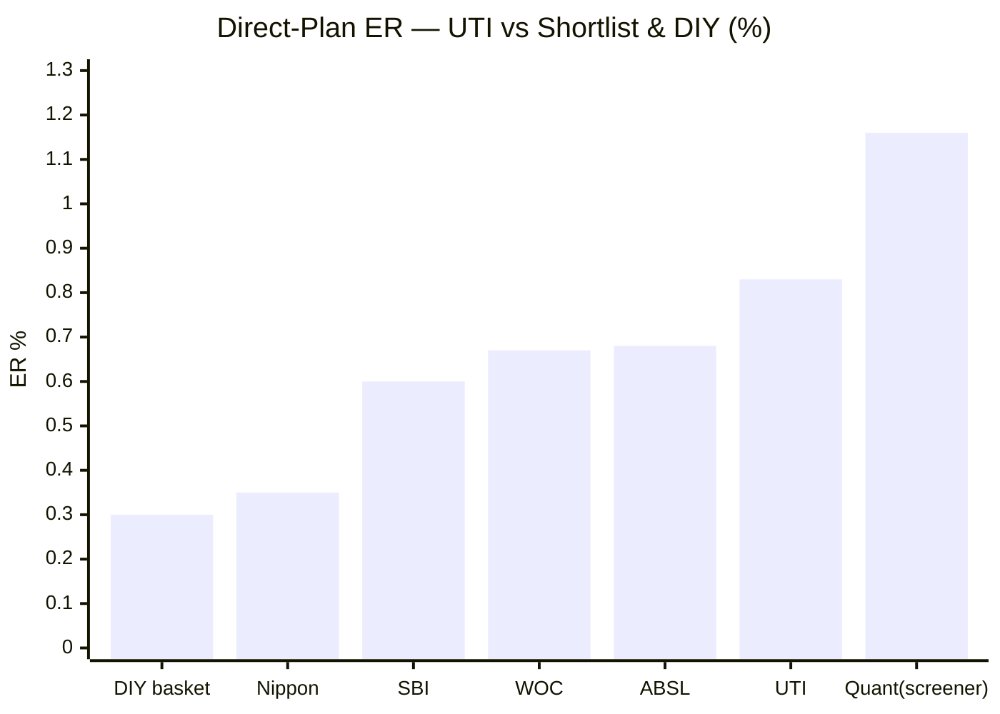
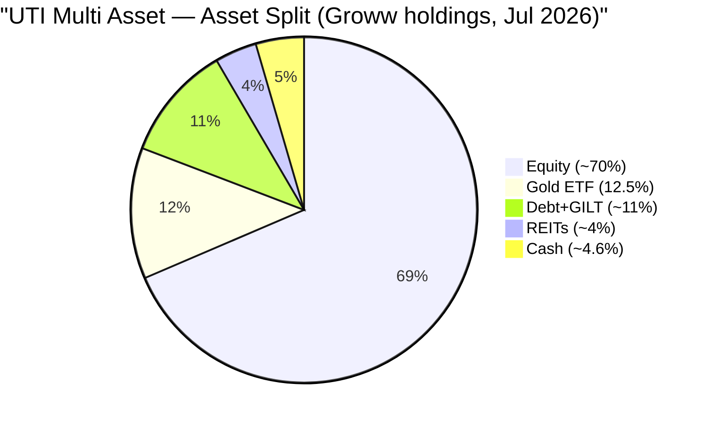
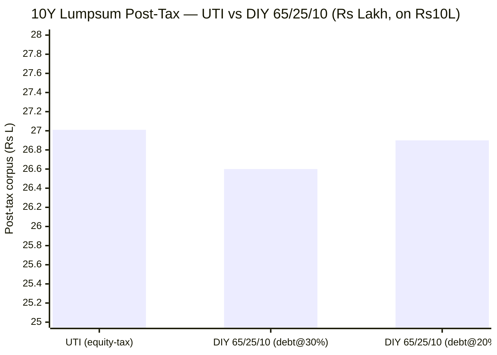
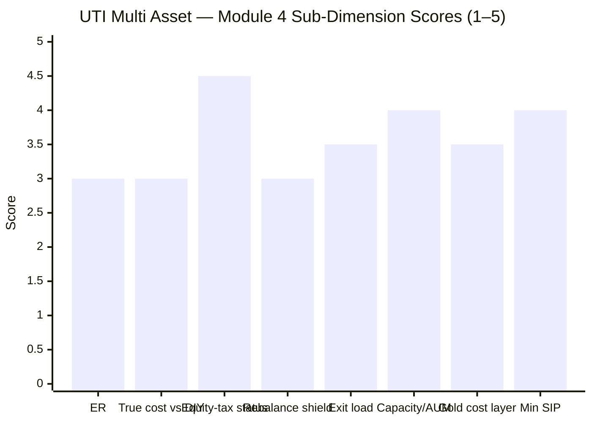

# Module 4: Cost & Tax Efficiency — UTI Multi Asset Allocation Fund

> **Provisional Module 4 score: ~3.4 / 5** (weight **20%**). **Scores are NOT comparable to the four equity categories.**

> **The one-line context:** this is the mirror image of SBI's Module 4 — and UTI's *best* module of the study. Where SBI won the DIY comparison on its **book** while its tax triad misfired, **UTI wins it on the one leg SBI lacked: it is genuinely equity-taxed.** At ~70% net equity (M3), the *whole* corpus — gold and debt included — is taxed at equity rates (12.5% LTCG), with no arbitrage engineering and a comfortable buffer above 65%. That structural edge is real, and it does something remarkable: it **flips UTI's pre-tax loss to DIY into a thin post-tax win.** But read the fine print, because it is thin and fragile: (1) the win exists **only against the standard 65/25/10 basket** (whose slab-taxed debt leg is what UTI's equity status shields) — against a DIY basket matched to UTI's *own* equity-heavy mix, UTI loses even post-tax; (2) UTI's ER (~0.78–0.88%) is the **dearest of the studied funds bar Quant**, roughly 3× the DIY basket; and (3) its larger rebalancing shield is **hollow** — it shielded the very gold-cutting trades that M3 showed destroyed value. The tax status is a genuine strength; it is propping up a book that M1–M3 found wanting.

---

## Fund Identity / Raw Data (per-metric source attribution)

| Attribute | Value | Source |
|-----------|-------|--------|
| Expense Ratio (Direct) | **~0.78–0.88%** (Groww 0.78% · screener 0.88%) — screener figures have proven **stale-high** across this study, so ~0.78% is the likely current figure; VR unconfirmed | Groww / Tickertape, Jul 2026 |
| Expense Ratio (Regular) | ~1.5–1.6% (est.) — **confirm SID** | estimate |
| Direct–Regular gap | ~0.75–0.8% (est.) | computed |
| Exit load | **1%** (redemption within ~12m above a free limit); nil after | Tickertape (exitLoad=1) |
| AUM | **₹6,890 Cr** | Tickertape, Jul 2026 |
| Min SIP | ~₹500–1,000 | typical (confirm) |
| **Taxation status** | **EQUITY-ORIENTED — 12.5% LTCG >12m (₹1.25L exempt), 20% STCG <12m, on the WHOLE corpus** | M3 (≥65% net equity, no arbitrage) + SID |
| Gross equity | **~66–70% (≥65%, no arbitrage needed)** | screener + M3 style analysis |
| Gold vehicle | **UTI Gold ETF (12.5%)** — physical-backed, in-house; ~0.1% underlying on the 12.5% slice | Groww holdings (M3) |
| Portfolio turnover | **factsheet — deferred** (M3: engine *does* move — gold 21%→7% — so churn is higher than SBI) | SID |
| ER glide over time | **factsheet — deferred** | SID |

---

## Cross-Source Verification

| Metric | Value | Source | Note |
|--------|-------|--------|------|
| Direct ER | 0.88% (screener) / 0.78% (Groww) | Tickertape / Groww | Screener ERs proved stale-high for Nippon (0.43→0.27), SBI (0.74→0.51), Quant (1.16→0.51) — so UTI's true Direct ER is **likely ~0.78% or a touch lower**; used 0.78–0.88% range |
| Exit load | 1% | Tickertape | Standard hybrid structure |
| **Tax status** | **equity-oriented** | **derived + SID** | Unlike SBI (derived to *middle tier*), UTI's ≥65% *net* equity means the equity status needs **no arbitrage assumption** — the cleanest tax call in the study |

**Reliability:** ER is screener/Groww-sourced with a known stale-high bias (flagged). The **tax status is high-confidence** — it rests on the directly-observed ≥65% net equity (three-source triangulated in M3), not on an arbitrage inference, so it is the most robust tax determination of the studied funds.

---

## 1. Expense Ratio — the Dearest Studied Fund bar Quant

| Fund | Direct ER (current best estimate) | Rank (of 6 shortlist) |
|------|-----------------------------------|------------------------|
| DIY basket (index funds, blended) | ~0.30% | — (the counterfactual) |
| Nippon India Multi Asset | ~0.27–0.43% | 1st (cheapest) |
| SBI Multi Asset | ~0.51–0.68% | 2nd |
| WOC | 0.67% | 3rd |
| Aditya Birla SL | 0.68% | 4th |
| **UTI Multi Asset** | **~0.78–0.88%** | **5th (2nd-dearest)** |
| Quant Multi Asset | ~0.51% (VR) / 1.16% (stale) | — |

**On cost alone, UTI is the weakest of the studied funds bar Quant's stale figure.** Even taking the more generous ~0.78% (Groww), it is **~2.6× the ~0.30% all-in cost of the DIY basket** and ~2× cheaper-peer Nippon. Over a 10-year ₹15k SIP, the ER gap vs DIY (~0.5%/yr) costs roughly **₹1.1 lakh** in forgone corpus (ER-only simulation, 11% gross: UTI ₹31.2L vs DIY ₹32.3L). For a fund whose book M1 found *loses* to DIY pre-tax, paying the highest fee of the studied set is the hardest cost case in the study — and it is only the tax status (below) that rescues it.

---

## 2. ⭐ The Tax Status — Resolved: EQUITY-TAXED (UTI's structural trump card)

M1, M2, and M3 built to this. **UTI is equity-taxed — the one leg of the tax triad that SBI lacked — and it earns it cleanly.**

**(1) The mechanism (from M3):** UTI holds **~66–70% net equity** — *already* above the 65% threshold *before* any arbitrage top-up. It does not need (and the holdings show it does not run) an arbitrage overlay to reach 65% gross. So its equity-oriented tax status is **structural and honest**, not engineered — the cleanest tax determination of the studied funds.

| Tax tier | Rule | Applies to UTI? |
|----------|------|-----------------|
| **Equity-oriented (≥65% equity)** | **STCG 20% (<12m); LTCG 12.5% (>12m) above ₹1.25L** | ✅ **Yes (net ~70%, no arbitrage)** |
| Middle (35–65% equity) | LTCG 12.5% after 24m; STCG at slab | ❌ No |
| Specified fund (>65% debt) | Slab always (Sec 50AA) | ❌ No |

**What this buys the investor — the genuine edge, and its real limit:**
- **The whole corpus — including the 12.5% gold and ~11% debt sleeves — is taxed at equity rates** (12.5% LTCG after just 12 months, with the ₹1.25L annual exemption). A DIY investor holding gold and debt *directly* pays **slab rates on the debt leg** (up to 30%+) and, post-2023/2025 rules, debt/slab treatment on much gold — a permanent drag UTI's structure avoids. **This is the trump card SBI's middle-tier status could not play.**
- **But the absolute value is modest**, precisely *because* UTI holds so little non-equity: only ~23% of the corpus (gold + debt) is the part where equity taxation beats a DIY basket's leg-by-leg taxation. The other ~70% is equity, which a DIY equity index leg *also* gets at 12.5%. **UTI is equity-taxed on a book that is mostly equity anyway** — so the tax edge, while real and structurally secure, is applied to a thin slice.

> **⭐ RETROFIT to M2 (Edelweiss discipline):** M2 flagged an **equity-taxation-continuity risk** (slipping below 65% gross). M4 **downgrades that risk to LOW** — UTI sits at ~70% *net* with a comfortable buffer and no arbitrage dependency, so there is no 65%-gross tightrope to fall off (the risk SBI genuinely carries). Favourable retrofit; no M2 score change. The mirror-image tension stands: the *same* ~70% equity that makes UTI a poor dampener (M2) makes its tax status rock-solid (M4).

---

## 3. The Internal-Rebalancing Tax Shield — Larger Than SBI's, but Hollow

The second leg of the triad: the fund rebalances between equity/debt/gold **internally, tax-free**, whereas a DIY investor rebalancing annually **realises taxable gains every year**.

**UTI's shield is genuinely larger than SBI's** — for the reason M3 established: UTI's engine actually *moves* (equity 42–76%, gold cut 21%→7%), whereas SBI barely rebalances. More internal cross-asset churn = more tax deferred vs a DIY rebalancer:

| DIY rebalancing assumption (70/10/20, annual) | Internal churn shielded | Tax drag avoided/yr |
|-----------------------------------------------|-------------------------|---------------------|
| UTI-style active shifts (~10–15% of corpus/yr) | higher than SBI | **~0.15–0.25%/yr** |

**But here is the honest catch that inverts the benefit:** M3 showed UTI's big internal move — cutting gold from ~21% to ~7% — happened *right before gold's biggest boom*. So the internal-rebalancing shield **saved capital-gains tax on transactions that themselves destroyed value.** A shield that lets you make wealth-reducing trades tax-free is a hollow benefit: you'd have been better off paying the tax and *not* making the trade. The mechanism is real and larger than SBI's; the *value* of it is undercut by the poor allocation calls it enabled.

---

## 4. ⭐ True Cost vs DIY — the Decisive Number (framing fact #2)

Putting it together: **ER premium − rebalancing shield − tax-tier advantage = the true cost of the fund vs assembling it yourself.** For UTI, the tax advantage is the *only* positive term — and it is only just enough.

### 10Y pre-tax CAGR (the starting deficit)
| Basket | 10Y CAGR |
|--------|----------|
| DIY 70/10/20 (UTI's own mix) | **12.71%** |
| DIY 65/25/10 (study standard) | 11.72% |
| **UTI Multi Asset** | **11.33%** |

UTI **loses pre-tax to both DIY baskets** — by −0.39%/yr vs the standard 65/25/10 and by −1.38%/yr vs an equity-matched 70/10/20. This is the M1 finding restated: the book is behind before tax.

### 10Y lumpsum (₹10L), post-tax — does equity taxation flip it?

| | Pre-tax FV | Post-tax FV | vs UTI |
|--|-----------|-------------|--------|
| **UTI** (equity-taxed, 12.5% LTCG) | ₹29.26L | **₹27.01L** | — |
| DIY 65/25/10 (debt leg @30% slab) | ₹29.44L | ₹26.60L | UTI **+₹0.41L** |
| DIY 65/25/10 (debt leg @20% slab) | ₹29.44L | ₹26.90L | UTI **+₹0.11L** |
| DIY 70/10/20 (equity-matched, debt@30%) | ₹33.0L+ | **> UTI** | UTI **loses** |

**The verdict is a knife-edge, and comparison-dependent:**
- **Vs the standard 65/25/10 basket:** UTI's equity-tax status **flips its pre-tax loss into a thin post-tax win** (~+₹0.1–0.4L over 10Y on ₹10L, before adding the DIY basket's ~0.15–0.3%/yr annual-rebalancing tax drag, which widens UTI's edge a little more). The mechanism: the standard basket's 25% debt leg is slab-taxed, and UTI's equity status shields exactly that.
- **Vs an equity-matched 70/10/20 basket:** UTI **loses even post-tax** — because that basket is mostly equity (already 12.5%-taxed), so there is little slab-taxed debt for UTI's status to shield, and UTI's −1.38%/yr pre-tax book deficit dominates.

**Net true-cost-vs-DIY verdict: UTI roughly *ties* DIY post-tax** — a hair ahead of the debt-heavy standard basket (purely on tax), behind an equity-matched one (where the book deficit wins out). By the study's bar ("comfortably beat = 5; roughly tie = 3 — *why pay?*; loses = 2"), this is a **"roughly tie."** The fund does not lose the DIY test outright — its equity-tax status genuinely rescues it from the pre-tax loss — but it does not *win* it either. And what little edge exists is **entirely tax, not book** — the opposite of SBI (all book, no tax) and far short of Nippon (both).

---

## 5. Standard Cost Dimensions

| Dimension | Assessment | Score input |
|-----------|------------|-------------|
| **Direct–Regular gap** | ~0.75–0.8% (Regular ~1.5–1.6% est.) — a Regular-plan investor gives up ~₹3L+ over 10Y (₹15k SIP). **Always use Direct.** Exact Regular ER → SID | 3.0 |
| **SEBI TER buffer** | At ₹6,890 Cr, the hybrid TER ceiling is ~1.9–2.0% blended; 0.78–0.88% Direct sits well inside — no cap pressure | ✓ |
| **Exit load** | 1% within ~12m (above a free limit); nil after. Irrelevant to a 7–10Y SIP; standard | 3.5 |
| **ER glide** | Whether ER fell as AUM grew — **factsheet, deferred**. At ₹6,890 Cr it is dearer than smaller peers (ABSL 0.68% at ₹6,989 Cr) — **no evident scale benefit passed on** | 2.5 |
| **Turnover-adjusted true cost** | M3: the engine moves (gold 21%→7%), so churn is *higher* than SBI — likely some trading-cost leakage atop the ER; exact turnover deferred | 3.0 |
| **Flow-as-signal** | AUM ₹6,890 Cr, mid-pack; the category is in a post-2023 boom and UTI's weak 1Y (7.6%) and Sharpe (0.36) make it a laggard for flows — not distressed, but not a magnet | 3.0 |
| **Gold cost layer (double-layer)** | UTI Gold ETF ~0.1% underlying atop the 0.78–0.88% on the 12.5% gold slice (~0.01% blended) — negligible | 3.5 |
| **AUM / capacity** | ₹6,890 Cr with **no capacity constraint** — large-cap equity + gold ETF + high-grade debt scale indefinitely. A genuine structural strength | 4.0 |
| **Min SIP** | ~₹500–1,000 — accessible | 4.0 |

---

## Comparison with Studied Funds

| Metric | **UTI Multi Asset** | SBI Multi Asset | Nippon Multi Asset | Quant Multi Asset |
|--------|--------------------|-----------------|--------------------|--------------------|
| Direct ER | **~0.78–0.88%** | ~0.51–0.68% | ~0.27–0.43% | ~0.51% |
| **Tax status** | **Equity-oriented ✅** | Middle tier ❌ | Middle tier ❌ | Dynamic (potentially equity) |
| Beats DIY post-tax | **Roughly ties (tax-only, thin)** | Yes, thinly (book-driven) | Yes, widely (book + shield) | Yes (book) |
| Rebalancing shield | Larger but **hollow** (mistimed) | Small (barely rebalances) | Meaningful (rebalances well) | Large (very active) |
| Capacity constraint | None (strength) | None | None | None |
| **Module 4 score** | **~3.4** | ~3.5 | ~4.1 | ~3.5 |

**The cross-read is the study's neatest symmetry:** UTI and SBI reach almost the same DIY verdict from **opposite directions** — SBI wins thinly on its *book* despite a misfiring tax status; UTI ties on its *tax status* despite a losing book. Nippon wins on *both* and is cheapest, which is why it leads the cost/tax module. UTI's distinctive credential — genuine equity taxation — is real and the cleanest of the four, but it is bolted onto the dearest ER and the weakest book, so the net lands mid-pack.

---

## Points For / Points Against — Cost & Tax

### ✅ For
1. **Genuinely equity-taxed on the whole corpus** — the tax triad's trump card, earned cleanly at ~70% net equity with **no arbitrage engineering** (the cleanest tax status of the studied funds).
2. **Equity taxation flips the pre-tax DIY loss to a thin post-tax win** vs the standard 65/25/10 basket — the fund does not lose the DIY test outright.
3. **No equity-tax-continuity cliff risk** (retrofit) — ~70% net sits well above 65% with a buffer; unlike SBI, no tightrope.
4. **Larger internal-rebalancing shield than SBI** (~0.15–0.25%/yr) — the engine actually moves.
5. **No capacity constraint** — the strategy scales indefinitely.
6. **No arbitrage return-drag** — genuine equity, not tax-engineered.

### ❌ Against
1. **Dearest ER of the studied funds bar Quant (~0.78–0.88%)** — ~2.6× the DIY basket; on cost alone DIY and every studied peer win.
2. **The post-tax DIY "win" is thin and fragile** — it exists only vs the debt-heavy standard basket; vs an equity-matched DIY mix, UTI loses even post-tax.
3. **The DIY edge is entirely tax, propping up a losing book** — the opposite of a fund that earns its fee through performance.
4. **The larger rebalancing shield is hollow** — it shielded the gold-cutting trades M3 showed destroyed value.
5. **The equity-tax edge is applied to a thin slice** — only ~23% of the corpus (gold+debt) benefits; the rest is equity a DIY leg also gets at 12.5%.
6. **No evident scale benefit** — dearer than similarly-sized ABSL; ER-glide unverified.

---

## Module 4 Scorecard

| Sub-dimension | Score | Reasoning |
|---------------|-------|-----------|
| Expense Ratio (Direct) | **3.0** | ~0.78–0.88% — 2nd-dearest studied fund; ~2.6× DIY; beaten by every shortlist peer bar stale-Quant |
| True cost vs DIY (all-in) | **3.0** | Roughly ties DIY post-tax — a thin, tax-only, comparison-dependent edge; loses vs an equity-matched basket |
| Equity-taxation status | **4.5** | **Genuinely equity-taxed, cleanly (≥65% net, no arbitrage), whole corpus at 12.5%** — the trump card SBI lacked; held off 5.0 only because the benefit applies to a thin non-equity slice |
| Rebalancing tax-shield | **3.0** | Larger than SBI's (real churn) but **hollow** — shielded value-destroying gold trades |
| Exit load | **3.5** | Standard 1%/12m; irrelevant to a long SIP |
| AUM / capacity | **4.0** | No capacity constraint — a real structural strength |
| Gold cost layer / double-layer | **3.5** | ~0.1% on the 12.5% gold slice via UTI Gold ETF — negligible |
| Min SIP accessibility | **4.0** | ~₹500–1,000 — accessible |
| ER glide / flow / turnover | *informational* | No scale benefit evident; higher churn than SBI; turnover deferred |
| **Module 4 Overall** | **~3.4 / 5** | UTI's best module — the equity-tax status is a genuine, clean structural win that rescues the fund from an outright DIY loss. But the dearest-studied ER, a thin/fragile tax-only edge, and a hollow rebalancing shield cap it mid-pack. It ties DIY; it does not beat it. Not comparable to equity-category Module 4 scores |

---

## Comparative Module 4 Scores (studied funds — calibration only)

| Fund | Module 4 | Cost/tax character |
|------|----------|--------------------|
| Nippon Multi Asset | ~4.1 / 5 | Cheapest ER; wide post-tax DIY win (book + real shield); not equity-taxed |
| Quant Multi Asset | ~3.5 / 5 | 0.51% ER; dynamically/potentially equity-taxed |
| SBI Multi Asset | ~3.5 / 5 | Cost-competitive; not equity-taxed; thin book-driven DIY win |
| **UTI Multi Asset** | **~3.4 / 5** | **The only cleanly equity-taxed fund — but dearest ER, thin tax-only DIY edge on a losing book** |

> Module 4 is 20% here and carries the tax triad. UTI's 3.4 reflects the study's one clean equity-tax status offset by the dearest ER and a DIY edge that is entirely tax, not book — a fund that *ties* the DIY counterfactual rather than beating it.

---

## SIP Implication

Module 4 gives UTI its one genuinely favourable finding — and it is a structural one. For a high-bracket investor, UTI's **equity taxation on the whole corpus** is a real, permanent edge over holding gold and debt directly (where the debt leg is slab-taxed), and it is enough to lift the fund from a pre-tax DIY *loss* to a post-tax rough *tie*. That is not nothing: it means UTI is not simply dominated by the DIY basket the way its book alone would suggest. **But it is a narrow rescue, not a case for the fee.** The edge is thin (~₹0.1–0.4L over a 10-year ₹10k lump sum), it exists only against a debt-heavy basket, it evaporates against an equity-matched one, and it is bolted onto the dearest ER of the studied funds (~0.78–0.88%) wrapped around a book M1–M3 found unremarkable-to-poor. For an investor who wants gold+debt exposure in a tax-efficient wrapper and will not hold the pieces directly, UTI's equity-tax status has genuine value. For an investor comparing it to the *better* multi-asset funds, UTI pays more, allocates worse, and wins only on a tax status that two cheaper, better-allocated peers approximate.

## One-Line Verdict

**The mirror image of SBI: UTI's tax triad *works* where SBI's misfired — it is cleanly, structurally equity-taxed on the whole corpus (no arbitrage games), and that single edge flips its pre-tax DIY loss into a thin post-tax tie; but the win is narrow, comparison-dependent, and entirely tax-driven, bolted onto the dearest ER of the studied set and a hollow rebalancing shield — the fund ties the DIY basket, it does not beat it.**

---

*Module 4 complete. Provisional score 3.4/5. Method: tax status from M3 (≥65% net equity, no arbitrage) + SID; 10Y pre-tax CAGR and post-tax lumpsum from MFAPI 120760 vs DIY 65/25/10 & 70/10/20 (Nifty 50 120620 / ICICI All Seasons Bond 120603 / SBI Gold 119788); ER-drag SIP simulation at 11% gross. **Cross-module resolution & retrofit (Edelweiss discipline):** M4 RESOLVES the tax question deferred from M1–M3 — UTI **IS equity-taxed**, cleanly. This (a) confirms M1's framing that the post-tax layer is UTI's best case, and quantifies it as a *thin tie*, not a win; (b) **retrofits M2** — the equity-taxation-continuity risk is downgraded to LOW (≥70% net, no 65% tightrope); (c) reinforces the study's central symmetry — UTI's closet-equity DNA is a *risk/allocation weakness* (M2/M3) but a *tax strength* (M4), the same fact read two ways. No prior scores change. **Deferred (factsheet):** exact Regular ER, VR Direct ER, ER-glide history, turnover. Running scorecard: M1 ~2.7 · M2 ~3.2 · M3 ~2.8 · M4 ~3.4.*

*Next: [Module 5 — Fund Manager / Team Quality](module5_manager.md)*
