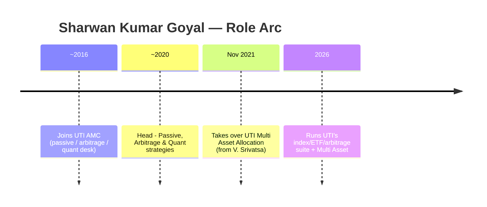
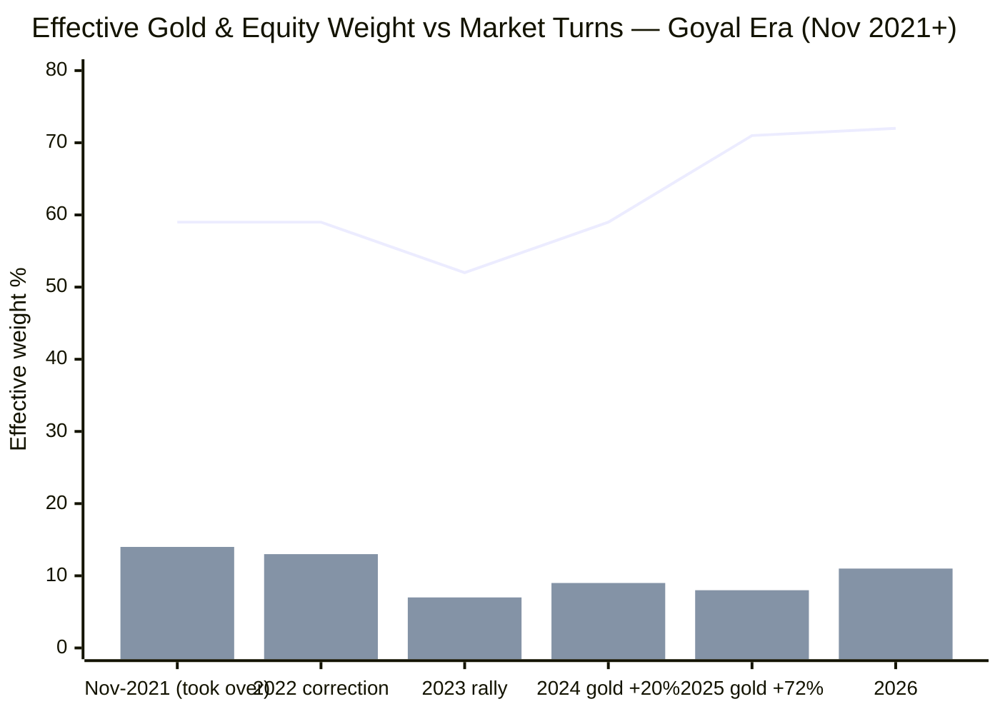
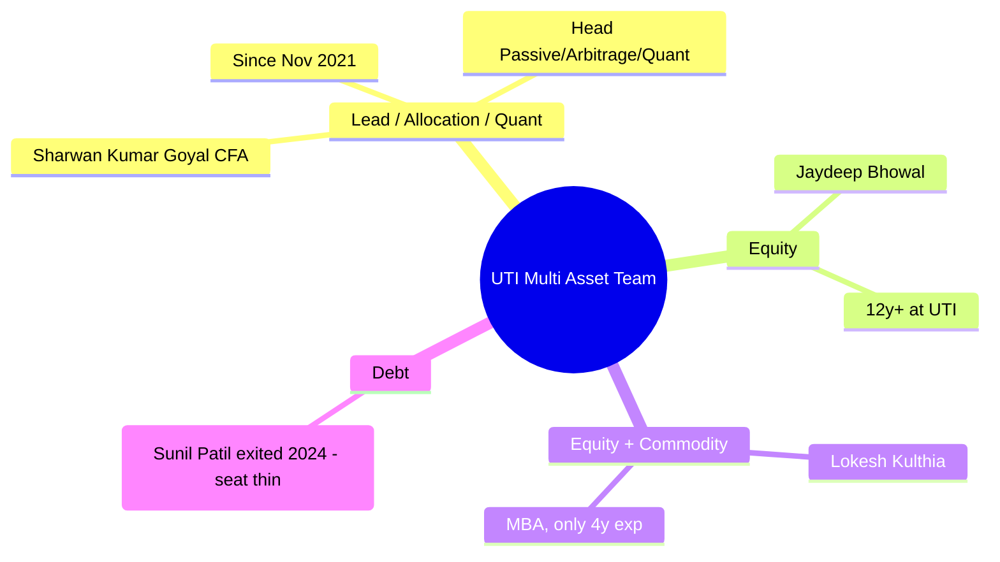
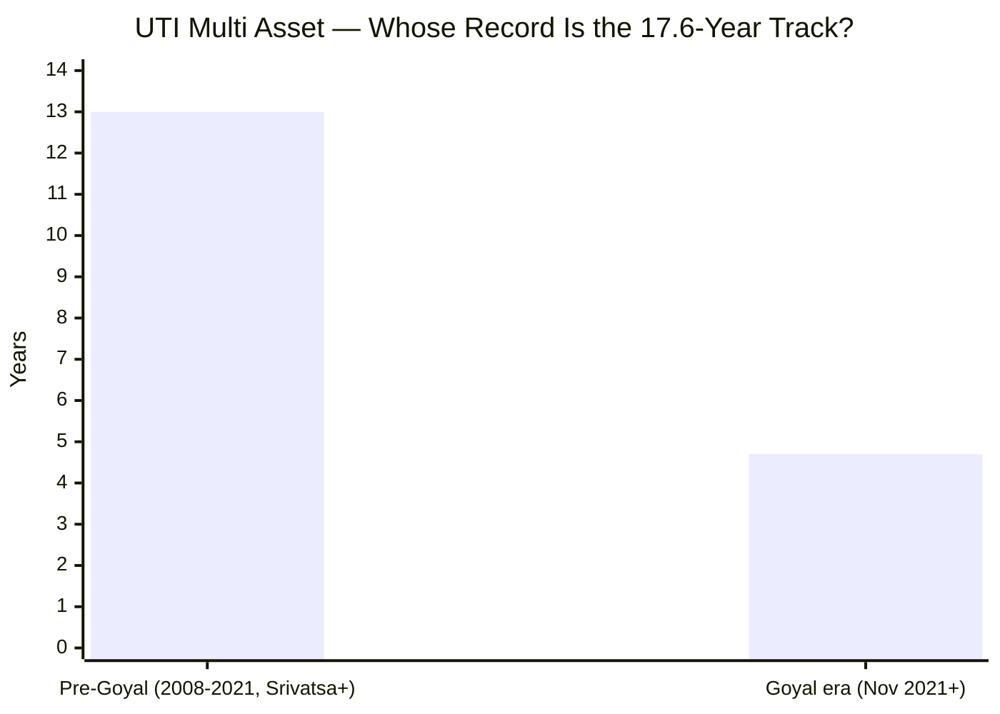
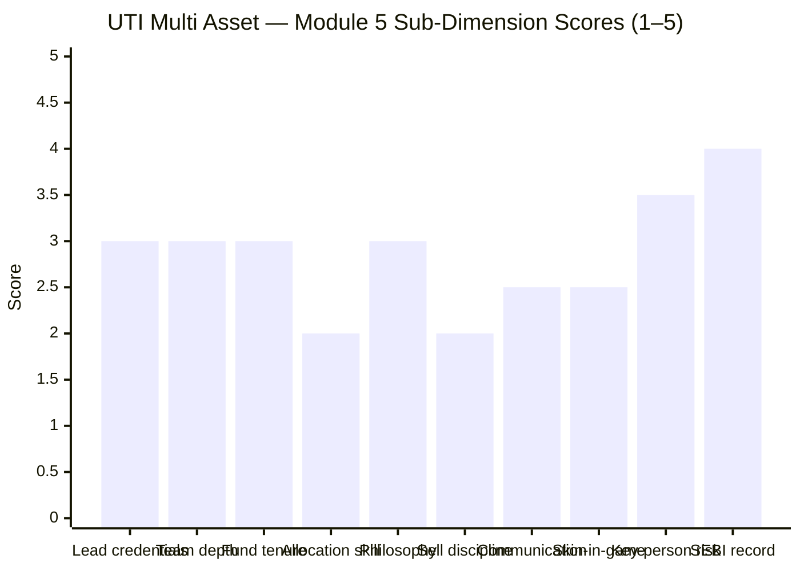

# Module 5: Fund Manager / Team Quality — UTI Multi Asset Allocation Fund

> **Provisional Module 5 score: ~2.8 / 5** (weight **10%** in the multi-asset re-weight — lower than the equity studies' 15%, because allocation here is more model/mandate-driven than single-manager stock-picking). **Scores are NOT comparable to the four equity categories.**

> **The one-line context:** the structure is defensible but the results are not. UTI runs this as a **rules/model-driven fund out of its passive-quant desk** — the lead, **Sharwan Kumar Goyal, is UTI's Head of Passive, Arbitrage & Quant strategies** — which is a coherent, low-key-person-risk way to run a systematic multi-asset mandate. But two findings sink the score: **(1) the current team is recent** (Goyal took over Nov 2021; the prior manager V. Srivatsa ran it before) — so the long record isn't theirs; and **(2) the allocation calls made *on Goyal's watch* are the worst in the study** — the fund cut gold from ~21% to ~7% straight into gold's 2024–25 boom (M3), a wealth-destroying decision that sits squarely with this team. The lead is a competent quant, not a proven allocator or a heavyweight equity manager; the commodity seat — where the biggest error was made — is held by a **4-year-experience junior.** Right structure, wrong results.

---

## Fund Identity / Raw Data (web-researched — VR/UTI/Groww/mywealthgrowth, Jul 2026)

| Attribute | Detail | Source |
|-----------|--------|--------|
| **Lead manager** | **Sharwan Kumar Goyal, CFA** — Fund Manager & **Head – Passive, Arbitrage & Quant strategies**, UTI AMC | VR / UTI |
| — on this fund since | **12 Nov 2021 (~4.7y)** | VR / mywealthgrowth |
| — experience / credentials | ~10y; **CFA**; passive/index/arbitrage/quant background (not discretionary equity or allocation) | VR |
| **Co-manager (equity)** | **Jaydeep Bhowal** — Fund Manager & SVP; with UTI since Nov 2009 (~12y+ experience) | VR |
| **Co-manager (equity & commodity)** | **Lokesh Kulthia** — FM Equity & Commodity portion; AVP Quant & Passive; **MBA, ~4y experience** | VR |
| **Prior managers** | **V. Srivatsa** (~2016–2019, equity) · **Sunil Patil** (debt, ~2021–2024, since exited) | VR / mywealthgrowth |
| Fund launch | **19 Nov 2008** (as "UTI Wealth Builder Fund") | UTI / VR |
| Manager change | **Nov 2021** — Goyal in; Srivatsa out — the current team is ~4.7y old | VR |
| Skin in the game | Not disclosed (large institutional AMC; SEBI-mandated only) | — |
| Personal SEBI record | Clean (AMC-level governance → M6) | — |

---

## Cross-Source Verification

| Fact | Sources | Verdict |
|------|---------|---------|
| Goyal = Head of Passive/Arbitrage/Quant, CFA, ~10y | VR, UTI, mywealthgrowth | ✅ Consistent |
| Goyal on this fund since 12 Nov 2021 | VR, mywealthgrowth | ✅ Consistent |
| Bhowal (equity, 12y+), Kulthia (equity+commodity, MBA, 4y) co-manage | VR | ✅ Consistent |
| Prior: Srivatsa (to 2019), Patil (debt, 2021–2024) | VR, mywealthgrowth | ✅ Consistent — confirms a Nov-2021 handover |

**Reliability: High** on identities/credentials/tenure (multiple independent sources agree). The *quality* assessment leans on the M3 allocation reconstruction + M1/M2 performance — a manager's skill is inferred from what the portfolio did, not from a bio.

---

## 1. The Lead — Sharwan Kumar Goyal: a Quant/Passive Specialist, Not a Proven Allocator

Goyal is a **CFA and UTI's head of passive/arbitrage/quant** — genuinely the right *kind* of manager for a rules-based, model-guided multi-asset fund (systematic, low-emotion, index-aware). That is a coherent design choice, and it explains M3's central finding that the fund's returns are **87% a static-blend echo**: it is run quasi-systematically, not discretionarily.

**But the credentials are a clear tier below SBI's lead, in two ways that matter here:**
1. **No heavyweight active pedigree.** Where SBI's Balachandran is an IIT-B/MIT/CFA Head of Equity with a top-quartile stock-picking record (SBI Contra), Goyal's background is **index/arbitrage/quant** — competent and appropriate, but not a proven *active* allocator or stock-picker. The fund's decent equity book (M3) is more attributable to co-manager Bhowal (12y equity) than to the lead.
2. **The "in-house proprietary valuation model" the fund markets is his desk's — and it has mistimed** (§2). A quant lead running a model that produced the study's worst gold call is the central tension of this module.

---

## 2. ⭐ The Allocation-Call Track Record — the Worst in the Study, and It's This Team's (Tier-1 dimension)

The defining test for a multi-asset manager: reconstruct the equity/debt/gold path (M3) and grade the calls against what a skilled allocator *should* have done. **Crucially, Goyal took over in Nov 2021 — so the 2022–2026 calls, including the gold disaster, are his team's.**

> Line = effective **equity** weight · Bar = effective **gold** weight (Goyal era)

| Turn | What a skilled allocator would do | What UTI did (Goyal era) | Grade |
|------|-----------------------------------|--------------------------|-------|
| **Into the 2022 correction** | Trim equity / raise gold-cash | Held ~59% equity — no de-risking | ❌ Poor |
| **2023–24** | Hold/add gold (setting up to rip) | **Cut gold to ~7%** | ❌❌ The worst call in the study |
| **2024 gold +20%, 2025 gold +72%** | Be over-weight gold | **Under-weight (~8%) through the entire boom** | ❌❌ Catastrophic — M1's −11.4 alpha in 2025 |
| **2025–26 softening equity** | Trim equity | **Ramped equity to ~72%** | ❌ Poor |
| **2023–24 equity win** | (the one bright spot) | Mid-cap selection paid off | ✅ but *selection*, not allocation |

**Verdict: negative allocation skill, and it is unambiguously this team's.** Unlike SBI (where the flattering record predated the team *and* the team merely drifted neutrally), UTI's current team **actively made** the calls that hurt: it *cut* a booming asset (gold) to a near-mandate-minimum right before its biggest run in a decade, and *added* equity into a softening tape. This is the manager-level confirmation of M1 (worst-in-study gold alphas), M2 (thin cushioning), and M3 (mistimed engine): **the allocation is being actively managed — badly.** The one bright spot (2023–24) is equity cap-*selection* (Bhowal's book), not the lead's allocation model.

> **The honest nuance:** a quant/model-driven approach *should* be emotionless and systematic — a virtue. But a systematic model that mechanically de-weighted gold on (presumably) valuation/momentum signals right as gold entered a structural bull run is a **model-design failure**, and the team owns both the model and the failure to override it.

---

## 3. Team Depth & Structure — Adequate, but Thin Where It Failed

It is a **genuine team, not a solo act** (a positive — no single-star key-person cliff), backed by a large institutional AMC. But the structure is **weaker than SBI's ideal four-desk setup** in exactly the place it mattered:
- **The commodity/gold seat — where the study's biggest error was made — sits with Lokesh Kulthia, a ~4-year-experience junior** (and Goyal, a quant, not a commodity specialist). Contrast SBI's dedicated commodities manager (Soni, who runs SBI's gold/silver ETFs). UTI's gold expertise is thin, and the gold call showed it.
- **The debt seat lost its dedicated manager** (Sunil Patil exited 2024); the ~10% debt sleeve is now folded into the generalist team. Low materiality (small sleeve), but a thinning bench.
- **Real depth exists only on the equity side** (Bhowal, 12y) — which is, tellingly, the one part of the book that worked (M3's mid-cap alpha).

---

## 4. Tenure & Attribution — the Record Isn't This Team's Either

The fund launched in 2008; **Goyal has run it only since Nov 2021 (~4.7y)**, and co-managers Bhowal/Kulthia alongside. The pre-2021 record belongs to **V. Srivatsa** and predecessors. **The honest attribution:** the assessable window for this team is **~4.7 years** — it covers 2022, 2023, and the 2024–25 correction (a decent, cycle-touching sample). Unlike SBI, there is *no* flattering pre-era to strip out — but that cuts against UTI, because (per M3) **the whole record is one mediocre fund**, and the team's own 4.7-year slice contains the study's worst allocation call. There is no "the good numbers were someone else's" excuse here; there are simply no good allocation numbers to attribute.

---

## 5. Philosophy, Sell Discipline, Communication, Skin-in-Game

| Dimension | Assessment | Score input |
|-----------|------------|-------------|
| **Allocation philosophy (documented)** | ✅ **Clearer than SBI's** — UTI *does* publish a stated model: equity 40–80% / gold 10–25% / FI 10–25%, "in-house proprietary, valuation & fundamental-driven." A genuine articulated framework. **But the realised behaviour (M3) refutes it** — the model mistimed gold and equity. Clear philosophy, poor execution | 3.0 |
| **Sell / rebalance discipline** | The model *did* rebalance (equity 42–76%, gold cut 21%→7%) — but at the wrong times. Activity without skill | 2.0 |
| **Investor communication** | Below-average visibility — UTI publishes factsheets, but a passive/quant lead keeps a **low public profile**; no notable manager letters or interviews (vs SBI's Balachandran doing press). Large institutional/retail base = some accountability | 2.5 |
| **Skin in the game** | Not disclosed (large AMC; unlike PPFAS's explicit co-investment) | 2.5 |
| **Key-person / succession risk** | **LOW–MODERATE** — a team + a big institutional AMC + a systematic model mean a Goyal exit is absorbable; but the bench is thinner than SBI's, and the model (the real "decision-maker") is the thing that failed | 3.5 |
| **SEBI record (personal)** | Clean (AMC-level governance/ownership history → M6) | 4.0 |

---

## Comparison with Studied Fund Managers

| Fund | Lead | Tenure on fund | Key edge | Key gap | Module 5 |
|------|------|----------------|----------|---------|----------|
| SBI Multi Asset | Balachandran + 4-desk team | 4.75y / 2.5y | Heavyweight equity lead; ideal team | No allocation skill; secondary mandate | ~3.2 |
| Nippon Multi Asset | (post-architect transition) | recent | Best team structure | Architect left; unproven successor | ~3.0 |
| **UTI Multi Asset** | **Goyal (quant/passive) + team** | **4.7y** | **Coherent systematic structure; low key-person risk** | **Worst allocation call in the study (gold); quant lead, no active pedigree; thin commodity seat** | **~2.8** |
| Quant Multi Asset | Sandeep Tandon (solo) | — | Singular talent | One-man risk + SEBI front-running probe | ~2.4 |

The honest cross-read: UTI's structure (systematic, team-run, institution-backed) is *reasonable* — better key-person profile than Quant's one-man act — but it scores below SBI and Nippon because **the specific skill this category demands (allocation) is not just absent but negative on this team's watch**, the lead lacks an active/allocation pedigree, and the seat that made the biggest error (commodity) is the thinnest. It edges out Quant only because it carries no governance scandal and no single-star cliff.

---

## Points For / Points Against — Manager / Team

### ✅ For
1. **Coherent systematic structure** — a passive/quant lead running a rules-based model is a defensible, low-emotion way to run multi-asset (and matches the fund's stated design).
2. **Genuine team, not a solo act** — Goyal + Bhowal + Kulthia, backed by a large institutional AMC; low single-star key-person risk.
3. **Real equity depth** (Bhowal, 12y+) — the one part of the book that worked (M3's mid-cap alpha).
4. **A documented allocation philosophy** — clearer than SBI's undocumented drift (a stated valuation model with explicit bands).
5. **Clean personal regulatory records.**
6. **Cycle-touching tenure** — Goyal's 4.7y covers 2022 and 2024–25.

### ❌ Against
1. **The worst allocation call in the study is this team's** — cut gold ~21%→7% into its biggest boom; the wealth-destroying decision M1/M2/M3 all trace back here.
2. **The lead is a quant/passive specialist, not a proven allocator or heavyweight equity manager** — a clear pedigree tier below SBI's Balachandran.
3. **The commodity seat — where the big error was made — is held by a 4-year junior** (Kulthia); gold expertise is thin.
4. **The record isn't theirs, and there's no flattering era to strip** — 4.7y team slice on a whole-life-mediocre fund.
5. **The stated model is refuted by its own results** — a documented valuation framework that mistimed both gold and equity.
6. **Low communication profile; no skin-in-game disclosure; debt seat thinned** (Patil exited 2024).

---

## Module 5 Scorecard

| Sub-dimension | Score | Reasoning |
|---------------|-------|-----------|
| Lead-manager credentials | **3.0** | CFA, Head of Passive/Arbitrage/Quant — competent and structurally apt, but no active-allocation or heavyweight-equity pedigree (a tier below SBI) |
| Team depth & structure | **3.0** | Genuine 3-person team + big AMC, but thin on the commodity seat (4y junior) and debt seat (dedicated manager exited) |
| Tenure/attribution on this fund | **3.0** | Goyal 4.7y (covers 2022/2024–25); record predates the team; no flattering era to strip |
| **Allocation-call track record** | **2.0** | The worst in the study — cut gold into its boom, added equity into softness; active negative skill on this team's watch |
| Philosophy clarity (allocation) | **3.0** | A documented valuation model (clearer than SBI) — but the results refute it |
| Sell / rebalance discipline | **2.0** | The model rebalanced at the wrong times — activity without skill |
| Investor communication | **2.5** | Low-profile quant lead; factsheets only, no letters/interviews |
| Skin in the game | **2.5** | Not disclosed |
| Key-person / succession risk | **3.5** | Low–moderate — team + institution + systematic model; thinner bench than SBI |
| SEBI record (personal) | **4.0** | Clean |
| **Module 5 Overall** | **~2.8 / 5** | A defensible systematic structure and low key-person risk, undone by the category's central test: the current team not only lacks allocation skill but **made the study's worst allocation call** (gold into its boom), led by a quant without an allocator's pedigree and thin where it mattered. Right shape, wrong results. Not comparable to equity-category Module 5 scores |

---

## Comparative Module 5 Scores (studied funds — calibration only)

| Fund | Module 5 | Manager verdict |
|------|----------|-----------------|
| SBI Multi Asset | ~3.2 | Strong equity lead + ideal team; no allocation skill; recent |
| Nippon Multi Asset | ~3.0 | Best structure, but architect left; unproven successor |
| **UTI Multi Asset** | **~2.8** | **Coherent systematic team, low key-person risk — but owns the study's worst allocation call; quant lead, thin commodity seat** |
| Quant Multi Asset | ~2.4 | Singular talent, worst governance/key-person risk |

> Module 5 is 10% here (vs 15% in equity studies) — deliberately, because in a systematic, team-run, institution-backed product the single-manager axis matters less. UTI's 2.8 is a fair reflection: sensible structure, low key-person risk, but a team whose one job — allocation — it has done poorly.

---

## SIP Implication

For a ₹15–20k/month SIP, the manager picture is *stable but uninspiring*. On durability you are well-covered: this is a systematic, team-run, large-AMC product with low key-person risk — a Goyal exit would not derail it, and the equity book has genuine depth (Bhowal). But you should have **negative** expectations of allocation value-add: the current team, in its 4.7 years, ran the study's clearest wealth-destroying allocation call (gutting gold into its biggest boom) and added equity into a soft tape. The fund is run by a capable quant desk executing a model that has demonstrably mistimed the very decisions this category pays for. That is consistent with everything M1–M4 found: **a systematic, honestly-taxed, but poorly-allocated fund whose management is competent at structure and process, and unproven-to-poor at the allocation calls that matter.**

## One-Line Verdict

**A coherent systematic setup — a quant/passive lead (Goyal, since Nov 2021) running a documented model out of a team-based, low-key-person-risk institution — undone by the results: this team owns the study's worst allocation call (cutting gold from ~21% to ~7% into its 2024–25 boom), the lead has no active-allocation pedigree, and the commodity seat where it failed is a 4-year junior; right structure, wrong outcomes, and no flattering era to hide behind.**

---

*Module 5 complete. Provisional score 2.8/5. Method: web research (ValueResearch, UTI MF, Groww, mywealthgrowth) for team identities/credentials/tenure; allocation-call track record reconstructed from the M3 effective-weight path + M1 calendar returns, attributed to the Nov-2021 Goyal handover. **Cross-module retrofit (Edelweiss discipline):** M5 *confirms and sharpens* the M1/M3 thesis — the mistimed allocation (cut gold into the boom) is now attributed to the current team (Goyal era, Nov 2021+), turning M1's "negative alpha" and M3's "mistimed engine" from abstract findings into a specific, dated management failure. Unlike SBI, there is no flattering predecessor era to excuse the numbers — which makes the weak record more damning, not less. No prior score changes; the "no allocation skill — indeed negative" finding is now triangulated across M1 (returns), M3 (portfolio), and M5 (manager). Running scorecard: M1 ~2.7 · M2 ~3.2 · M3 ~2.8 · M4 ~3.4 · M5 ~2.8.*

*Next: [Module 6 — AMC Trustworthiness](module6_amc.md)*
