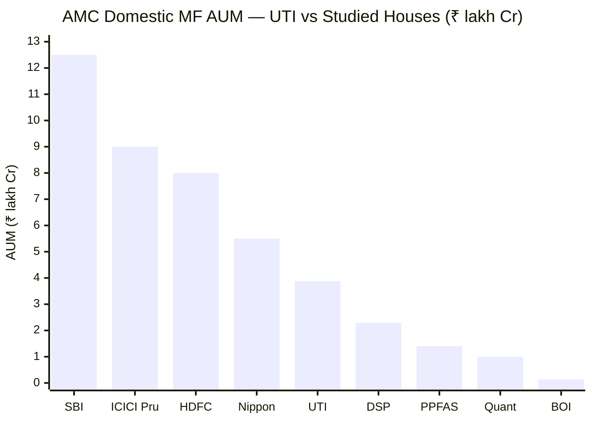
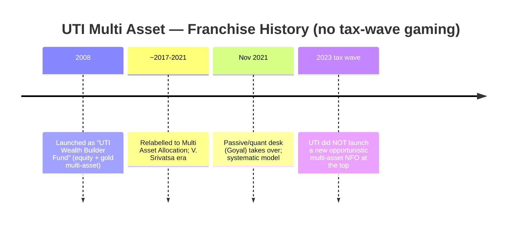
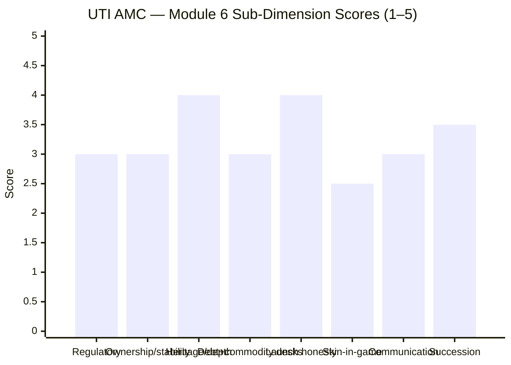

# Module 6: AMC Trustworthiness — UTI Multi Asset Allocation Fund

> **Provisional Module 6 score: ~3.4 / 5** (weight **5%**). **Scores are NOT comparable to the four equity categories.**

> **The one-line context:** a solid, deeply-heritaged, publicly-listed house — but a *middle-of-the-pack* one carrying a distinctive governance scar. UTI is **India's original mutual fund** (heir to the 1963 Unit Trust of India), listed since 2020, with a genuinely strong **passive/index/retirement franchise** — which happens to be exactly the desk that runs this fund (Goyal, M5). Those are real positives. But three things temper it: **(1) a fragmented four-PSU-sponsor ownership** (LIC/SBI/PNB/BoB each ~18.5% + T. Rowe Price 23%) that produced an open **boardroom-governance crisis** (the 2018 Leo Puri exit, SEBI intervention); **(2) a fixed-income desk with a mixed credit history** (the 2019–20 stress-era side-pockets), which a multi-asset fund imports; and **(3) "a decade of underperformance"** as a house — the very context its new investment-led CEO (Vetri Subramaniam) is trying to reverse. It did *not* game the 2023 tax wave (the fund is from 2008), and there is no fraud/front-running (the Quant contrast). A credible, listed, heritage house — held below the top-tier by scale, governance friction, and a merely-adequate debt desk. **No prior study covered UTI's AMC — this is a fresh assessment (no carry-forward).**

---

## Fund Identity / Raw Data (web-researched, Jul 2026)

| Attribute | Detail | Source |
|-----------|--------|--------|
| AMC | **UTI Asset Management Company Ltd** | — |
| Domestic MF QAAUM | **~₹3.88 lakh Cr** (Mar 2026) — mid-large, ~7th–8th by MF AUM | multibagg / UTI |
| Group AUM (incl. offshore/PE/NPS/retirement) | ~₹23.4 lakh Cr | UTI FY26 |
| **Ownership** | **LIC 18.5% · SBI 18.5% · PNB 18.5% · Bank of Baroda 18.5% · T. Rowe Price 23%** (no single controlling promoter) | Trendlyne / Wikipedia |
| **Listing** | **Listed 2020** (BSE 543238 / NSE UTIAMC) — publicly traded, public-market disclosure | NSE/BSE |
| Heritage | **Heir to Unit Trust of India (est. 1963)** — India's original & oldest fund franchise; current AMC incorporated 2002–03 post-US-64 restructuring | Wikipedia / UTI |
| CEO | **Vetri Subramaniam** (long-time UTI CIO/Head of Equity, now CEO) — investment-led leadership | multibagg |
| Regulatory record | **2018 board-governance crisis** (T. Rowe Price vs PSU sponsors; SEBI intervention on >10% cross-holdings); offshore **IDOF SEBI probe**; 2019–20 debt side-pockets. **No fraud/front-running** | Business Standard |
| Fixed-income desk | Adequate; **mixed credit history** (2019–20 stress-era side-pockets) | industry |
| Commodity/gold desk | **UTI Gold ETF** (long-standing, since 2007) — the vehicle this fund holds; **no silver ETF** | factsheet |
| Passive/quant/retirement | **A genuine UTI strength** — large index/ETF suite + NPS/retirement mandates; runs this fund's lead desk | UTI |
| Skin in the game | Not disclosed (large listed AMC; SEBI-mandated only) | — |

---

## Cross-Source Verification

| Fact | Sources | Verdict |
|------|---------|---------|
| Ownership: 4× PSU @18.5% + T. Rowe Price 23% | Trendlyne, Wikipedia, MarketScreener | ✅ Consistent |
| Domestic MF QAAUM ~₹3.88 lakh Cr; listed 2020 | multibagg, NSE/BSE | ✅ Consistent |
| 2018 Leo Puri exit / board crisis / SEBI intervention | Business Standard (multiple) | ✅ Confirmed — well-documented |
| New CEO Vetri Subramaniam; "decade of underperformance" turnaround | multibagg | ✅ Consistent |
| UTI Gold ETF long-standing; no silver ETF | factsheet (M3) | ✅ Consistent |

**Reliability: High.** Ownership/listing are primary-market facts; the 2018 governance crisis is extensively documented in the financial press; the desk characterizations are industry-standard.

---

## 1. Scale, Heritage & Ownership — Deep Roots, Mid-Tier Scale, Fragmented Control

UTI's position is distinctive: **the longest heritage in Indian asset management** (heir to the 1963 Unit Trust of India, the fund that *created* the retail mutual-fund habit in India) paired with only **mid-tier current scale** (~₹3.88 lakh Cr domestic MF, roughly a third of SBI's). What that means for a multi-asset fund:
- **Adequate cross-asset depth** — UTI runs equity, debt, gold-ETF, and a large passive/retirement book in-house; it has *all* the desks a multi-asset fund needs, though none (bar passive) is best-in-class.
- **Genuine financial stability** — listed, profitable, backed by four large PSU financial institutions + a global partner; no solvency/continuity risk.

**The ownership nuance (a real, distinctive flag):** UTI has **no single controlling promoter** — four PSU institutions (LIC, SBI, PNB, Bank of Baroda) each hold ~18.5%, with T. Rowe Price at 23%. Because each PSU sponsor *also runs its own competing AMC*, SEBI's cross-holding rules (>10% in two AMCs) forced them to pare stakes, and the sponsors and T. Rowe Price clashed openly over control. This fragmented, conflict-laden ownership is **structurally weaker governance** than a single-parent house like SBI (SBI+Amundi) — it is UTI's defining AMC-level weakness.

---

## 2. ⭐ Fixed-Income & Commodity Desk Credibility — the Multi-Asset Import (NEW)

A multi-asset fund is only as good as the *worst* of its asset-class desks. Here UTI is uneven.

| Desk | Assessment | Relevance |
|------|------------|-----------|
| **Fixed income (~10% of the book)** | **Mixed history.** UTI's debt desk is competent but **carried stress-era credit blemishes** (2019–20 side-pockets of troubled papers, in the IL&FS/DHFL/Zee-Essel wave that hit many houses); an offshore **IDOF scheme drew a SEBI probe.** Not a clean, top-conservative desk like SBI's. **Mitigant:** the debt sleeve here is only ~10% (M3), so the import is low-materiality | ⚠ Mixed — but small sleeve |
| **Commodities / gold (~12.5%)** | ✅ **UTI Gold ETF** is a **long-standing (2007) physical-backed gold ETF** — a legitimate, proven vehicle (the one this fund holds). **But no silver ETF** (narrower than SBI/Nippon), and — the M3/M5 finding — the gold *sizing* was badly mistimed (cut into the boom). Good vehicle, poor use | ✅ vehicle / ⚠ narrow + mis-sized |
| **Passive / index / quant** | ✅ **A genuine UTI strength** — one of India's larger index/ETF suites + the NPS/retirement mandates. Directly relevant: this fund is run systematically out of that desk (Goyal, M5) | ✅ Strong |

> **Retrofit note (mild, mixed):** M2/M3 left the debt book's credit quality "unverified." M6 says the *desk* running it has a **mixed** credit history (side-pocket blemishes) — so unlike SBI (where M6 *supported* the high-grade presumption), UTI's M6 offers **no reassurance** on debt quality; it leans slightly cautionary. Low materiality (~10% sleeve), but noted. No prior score change.

---

## 3. Launch-Timing Honesty & Franchise Commitment (NEW)

**A genuine positive:** the post-2023 multi-asset boom saw ~27 opportunistic NFOs launched at the market top (the screening finding). **UTI did not join that wave** — this is a genuine 2008-vintage fund (as "Wealth Builder"), not an opportunistic tax-driven launch. No launch-timing gaming — a real governance credit.

**The offsetting debit — moderate franchise commitment:** multi-asset is *not* a UTI flagship. UTI's identity is **passive/index, retirement/NPS, and large-cap equity** — not active hybrid allocation. This fund was a sleepy "Wealth Builder" for over a decade and is now run as a systematic side-product of the passive desk. It is not neglected (it has a competent desk), but it is not a franchise priority either — consistent with the "unremarkable, under-tended" verdict of the whole study.

---

## 4. Regulatory & Governance Record — Scarred, but No Fraud

| Item | Detail |
|------|--------|
| Major fraud / front-running | **None** (the Quant contrast) |
| **Board-governance crisis (2018)** | **A real, documented episode** — sponsors (PSU institutions) vs T. Rowe Price clashed over the CEO succession and IPO; MD **Leo Puri exited**; SEBI intervened over the sponsors' >10% cross-holdings. A genuine governance-instability scar |
| Offshore probe | SEBI probed the **India Debt Opportunities Fund (IDOF)**, a UTI International scheme |
| Debt side-pockets | 2019–20 stress-era side-pocketing of troubled credits (industry-wide, but UTI participated) |
| Legacy | The **US-64 debacle (2001)** — the original UTI's payment crisis — predates the current AMC structure but is the house's historical scar |
| Verdict | **Clean of fraud, but the most governance-friction-scarred house of the credible AMCs** — a 3.0-tier regulatory record: no serious *investor* harm in the current structure, but a real board-instability history |

The 2018 crisis is now resolved (the sponsors pared stakes, the IPO happened in 2020, and leadership has stabilized under Vetri Subramaniam), so this is a *healed* scar — but it is a more troubled governance history than SBI's minor-inspection-deficiencies record, and it belongs in the assessment.

---

## 5. Investor Communication, Skin-in-Game, Conduct, Succession

| Dimension | Assessment | Score input |
|-----------|------------|-------------|
| Investor communication | Listed-company disclosure standard; **Vetri Subramaniam is an articulate, respected investment voice** (a positive); no structured quarterly fund-manager letters (PPFAS standard) | 3.0 |
| Skin in the game | **Not disclosed** — no PPFAS/DSP-style co-investment policy | 2.5 |
| Investor-first conduct | No adverse conduct in the current era; broad retail base via the UTI legacy network = accountability; but a "decade of underperformance" is itself a soft investor-outcome debit | 3.0 |
| **Succession / stability** | **Improved but historically shaky** — the 2018 CEO crisis showed real instability; now stabilized under Vetri Subramaniam with a deep-ish bench. Mid-tier, not the fortress SBI is | 3.5 |

---

## Comparison with Studied AMCs

| AMC | Module 6 | Character |
|-----|----------|-----------|
| SBI Funds Management | ~3.9 | #1 scale; strongest debt+commodity desks; minor deficiencies |
| HDFC AMC | ~3.8 | Large, listed, commercial |
| Nippon | ~3.7 | ETF-leading; commodity desk best in study; FI blemish |
| **UTI AMC** | **~3.4** | **Deepest heritage + strong passive desk; but fragmented PSU ownership, 2018 governance crisis, mixed debt desk, mid-tier scale** |
| BOI | 3.3 | Small PSU-backed |
| Quant | 1.8 | Front-running settlement; thin non-equity desks |

UTI sits in the **middle of the credible large-AMC pack** — clearly above the small/scandal-hit houses (BOI, Quant), clearly below the top-tier scale-and-cleanliness of SBI/HDFC/Nippon. Its specific relevance to *this* fund is double-edged: the **passive/quant desk that runs it is a genuine UTI strength**, but the **debt desk it imports is merely adequate** and the **governance history is the most friction-scarred of the credible houses.**

---

## Points For / Points Against — AMC

### ✅ For
1. **Deepest heritage in Indian asset management** — heir to the 1963 Unit Trust of India; the franchise that built India's retail fund habit.
2. **Genuinely strong passive/index/retirement desk** — and it is exactly the desk running this fund (a rare structure-fit positive).
3. **Listed since 2020** — public-market disclosure and scrutiny.
4. **No 2023 tax-wave launch-gaming** — a genuine 2008-vintage fund, not an opportunistic NFO.
5. **No fraud/front-running** — clean of serious investor harm (the Quant contrast).
6. **Investment-led CEO (Vetri Subramaniam)** — a credible turnaround leader.
7. **Legitimate long-standing gold-ETF vehicle** (UTI Gold ETF, 2007).

### ❌ Against
1. **Fragmented four-PSU ownership with a documented 2018 governance crisis** — structurally weaker governance than a single-parent house; the most friction-scarred of the credible AMCs.
2. **Mixed fixed-income desk** — 2019–20 stress-era side-pockets + an offshore IDOF SEBI probe; no reassurance on the debt sleeve (unlike SBI's M6).
3. **Mid-tier scale** (~₹3.88 lakh Cr) — a third of SBI; less cross-asset research depth.
4. **"A decade of underperformance"** as a house — a soft but real investor-outcome debit the new CEO is trying to reverse.
5. **Moderate franchise commitment to multi-asset** — a historically sleepy, under-tended side-product.
6. **No skin-in-game disclosure; no structured investor letters; no silver desk.**

---

## Module 6 Scorecard

| Sub-dimension | Score | Reasoning |
|---------------|-------|-----------|
| Regulatory cleanliness | **3.0** | No fraud/front-running, but the 2018 board crisis + IDOF probe + debt side-pockets = the most governance-scarred credible house |
| Ownership independence & stability | **3.0** | Listed (+), but fragmented four-PSU + T. Rowe Price ownership with conflict-of-interest friction (−) |
| Heritage & institutional depth | **4.0** | Deepest heritage in Indian AM (UTI 1963); strong passive/retirement desk; but mid-tier current scale |
| **Fixed-income + commodity desk credibility** | **3.0** | The multi-asset import — passive strong, gold vehicle legitimate, but debt desk mixed and no silver |
| Launch-timing honesty / franchise | **4.0** | No tax-wave gaming (2008 fund) (+); but multi-asset is a secondary, under-tended franchise (−) |
| Skin in the game | **2.5** | Not disclosed |
| Investor communication / conduct | **3.0** | Listed-disclosure standard; articulate CEO; no letters; "decade of underperformance" debit |
| Succession / continuity | **3.5** | Historically shaky (2018 crisis) but now stabilized under Vetri Subramaniam; deep-ish bench |
| **Module 6 Overall** | **~3.4 / 5** | A deeply-heritaged, listed, mid-tier house whose passive desk (the one running this fund) is a genuine strength — held below the top tier by fragmented PSU governance, a friction-scarred board history, a merely-adequate debt desk, and no launch-gaming credit that can offset a decade of underperformance. Not comparable to equity-category Module 6 scores |

---

## Comparative Module 6 Scores (studied funds)

| AMC | Module 6 |
|-----|----------|
| SBI Funds Management | ~3.9 |
| Nippon | ~3.7 |
| **UTI AMC** | **~3.4** |
| Quant | ~1.8 |

---

## ⭐ The Complete Six-Module Picture — M6 as the Closer

With all six modules done, the weighted verdict:

| Module | Topic | Weight | Score | Weighted |
|--------|-------|--------|-------|----------|
| M1 | Returns & Allocation Alpha | 20% | 2.7 | 0.540 |
| M2 | Risk Profile | 25% | 3.2 | 0.800 |
| M3 | Allocation Engine & DNA | 20% | 2.8 | 0.560 |
| M4 | Cost & Tax | 20% | 3.4 | 0.680 |
| M5 | Manager / Team | 10% | 2.8 | 0.280 |
| **M6** | **AMC** | **5%** | **3.4** | **0.170** |
| **TOTAL** | | **100%** | | **≈ 3.03 / 5** |

**The coherent story across six modules — and it is the weakest of the studied set (SBI ≈3.66, Nippon ≈3.71, Quant ≈3.20, UTI ≈3.03):** UTI Multi Asset is a **~70%-equity, honestly-taxed, systematically-run fund whose one job — asset allocation — it has done poorly.** It loses to a naïve DIY basket pre-tax and only *ties* it post-tax on its equity-tax status (M4); it is the weakest dampener and poorest diversifier of the cycle-tested funds (M2); its "valuation model" is refuted by an 87%-static return signature and a gold call — cutting into the 2024–25 boom — that is the study's clearest allocation error (M3/M5); and the house, while credibly heritaged with a strong passive desk (M6), is mid-tier and governance-scarred. **There is no module where UTI leads the studied set, and two (M1, M3) where it trails badly.** The AMC is a reasonable floor, not a rescue. Whether ≈3.03/5 earns a portfolio slot — versus SBI/Nippon, versus a DIY gold-ETF-plus-debt-fund, or versus doing nothing — is the decision-tree question, and Module 6 hands it a fund that is *last of the studied MultiAsset funds on the weighted score.*

---

## SIP Implication

For a ₹15–20k/month SIP, the AMC is neither the reason to buy this fund nor the reason to avoid it. UTI is a credible, listed, deeply-heritaged house with a genuinely strong passive/quant desk — the one running this fund — so you are not taking meaningful AMC-continuity risk, and the systematic process is in institutionally-appropriate hands. But the house cannot fix what the other five modules exposed: a fund that allocates poorly, dampens weakly, and wins only on tax. And UTI's mid-tier scale, fragmented governance, and merely-adequate debt desk mean it does not add the *structural* AMC reassurance (deep non-equity desks, fortress stability) that SBI or Nippon bring to *their* multi-asset funds. A reasonable house running a genuinely sub-par strategy is still a sub-par strategy.

## One-Line Verdict

**India's most heritaged fund house — listed, with a genuinely strong passive/quant desk that (uniquely) runs this very fund — but a mid-tier, governance-scarred one: fragmented four-PSU ownership, the 2018 board crisis, a mixed debt desk, and a decade of underperformance keep it a reasonable floor rather than a strength, and it cannot rescue a fund that finishes last of the studied set at ≈3.03/5.**

---

*Module 6 complete. Provisional score 3.4/5. Method: web research (Business Standard, Trendlyne, Wikipedia, multibagg, UTI disclosures). No prior-study carry-forward (UTI's AMC is new to the studies). **Cross-module retrofit (Edelweiss discipline):** M6 leans *mildly cautionary* on the M2/M3 debt-quality question (UTI's fixed-income desk has a mixed side-pocket history — no reassurance, unlike SBI's M6) and *confirms* the structure-fit read of M5 (the passive/quant desk running the fund is a genuine UTI strength, even as its allocation calls failed). No prior score changes. **Final six-module weighted score ≈ 3.03/5 — UTI is the weakest of the studied MultiAsset funds** (SBI ≈3.66, Nippon ≈3.71, Quant ≈3.20). All UTI modules complete → next: the UTI fund README (full scorecard, fund-vs-DIY verdict, monitoring/review triggers, and its place vs the other studied funds).*
