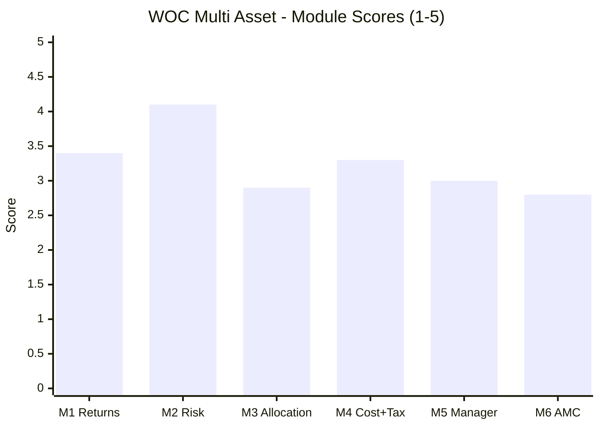

# WhiteOak Capital Multi Asset Allocation Fund — Fund Summary & Verdict

**Direct Plan – Growth · MFAPI 151745 · AUM ₹7,107 Cr · ER ⚠ 0.39–0.67% (unresolved) · allotment 19-May-2023 · studied Aug 2026**

> **Final weighted score: ≈ 3.39 / 5 — third of the six studied MultiAsset funds** (Nippon ≈3.71, SBI ≈3.66, **WOC ≈3.39**, Quant ≈3.20, ABSL ≈3.18, UTI ≈3.03). The **conservative sub-type representative**, and the study's sharpest illustration of a fund that **works, but not for the reason it is sold.** On the module that carries the category's thesis it is close to the best in the study — **Risk 4.1**, with a *negative* downside capture, the shallowest and only fully-recovered drawdown of the six, and a decisive win over Balanced Advantage, Aggressive Hybrid, Equity Savings *and a pure-equity fund*. On the module that measures the thing the fee nominally buys it is **last but one — Allocation Engine 2.9** — because the equity dial has moved **7.4 percentage points in the fund's entire life inside a mandate permitting seventy.** The returns come from instrument selection and a commodity arbitrage book, not from allocation. The AMC's own CIO says so in print: *"We are not macro or thematic investors making top-down bets."*
>
> **⚠ Scores are NOT comparable to the four equity categories** — this fund is measured on a multi-asset re-weight (Risk 25 / Returns 20 / Allocation 20 / Cost+Tax 20 / Manager 10 / AMC 5), against a blended benchmark and a DIY basket, not against a single equity index. **Not investment advice.**

---

## The Six-Module Scorecard

| Module | Topic | Weight | Score | Weighted | One-line |
|---|---|---|---|---|---|
| [M1](module1_returns.md) | Returns & Allocation Alpha | 20% | **3.4** | 0.680 | 16.90% at 5.65% vol; **alpha = selection +4.47 / allocation −2.56**, negative all four years |
| [M2](module2_risk.md) | **Risk Profile** | **25%** | **4.1** | **1.025** | **Negative downside capture; only fully-recovered drawdown; beat a pure equity fund at 42% less vol** |
| [M3](module3_allocation.md) | Allocation Engine & DNA | 20% | **2.9** | 0.580 | Best-disclosed model, **most frozen execution**; 27.31% "metals" is ~16pp arbitrage |
| [M4](module4_cost_tax.md) | Cost & Tax | 20% | **3.3** | 0.660 | **Largest risk-adjusted DIY edge, smallest absolute one**; permanently middle-tier; ER unprovable |
| [M5](module5_manager.md) | Manager / Team | 10% | **3.0** | 0.300 | Deepest team + best cross-fund selection record; **no allocation owner, no commodity lead** |
| [M6](module6_amc.md) | AMC | 5% | **2.8** | 0.140 | Clean, independent, Deutsche Bank custody — **no duration franchise, no commodity desk** |
| **TOTAL** | | **100%** | | **≈ 3.39** | |

> **The shape is the story: the top-weighted module (Risk, 25%) is its second-best score in the study, and the category's defining module (Allocation, 20%) is its worst but one.** SBI shows the same divergence (M2 4.5 / M3 3.0). **Two of the three best risk profiles in this category come from funds with no working allocation engine** — a finding the decision tree should take seriously.

---

## What WOC Multi Asset Actually Is

Three reframings, each from primary data:

1. **It is a conservative, arbitrage-assisted allocator wearing a dynamic-allocation label.** The SID discloses the most detailed allocation model in the study — Adjusted P/B with an ROE overlay, G-Sec-yield-to-earnings-yield, VIX, momentum, Equity-to-Gold, Dollar-Index-to-Gold, Gold-to-Oil, REIT cap rates. **Effective equity beta has then sat between 27.6% and 30.1% for the fund's entire life**, a 7.4pp range with a 2.1pp standard deviation — the narrowest of six funds by a factor of two — inside an SID mandate permitting **10% to 80%**. The same SID makes the model optional ("may utilize"), advisory ("broad indicator"), overridable ("the Fund Manager will have the final authority") and rewritable ("may undergo periodic revision… adding or deleting parameters"). **A model that cannot be falsified, attached to a dial that has not moved.**

2. **⭐ Roughly 16 percentage points of its "commodity" allocation is a basis trade.** The fund discloses **27.31% gold + silver**; its returns behave as though it holds **~11–14%**. Silver is **15.91% of the portfolio and contributes ~0% directional exposure.** Three independent confirmations: the SID authorises commodity positions *"to capture arbitrage opportunities"*; the AMC appointed a **dedicated arbitrage fund manager on 6 January 2025** (role stated in the SID as *"(Arbitrage)"*); and measured silver beta fell to zero from that point, beside an 11.86% "cash margin" line. **This is a legitimate, well-resourced, return-generating strategy — and it is the real reason the fund earns equity-like returns at debt-like volatility.** It is also why the published asset table overstates commodity exposure by roughly 2.5×, and why the fund is now pressed against a **30% SEBI ETCD ceiling at 27.31%.**

3. **The team is excellent at what it says it does, which is not this.** WhiteOak's stated philosophy, in the SID: *"invest in businesses based on stock selection and **to avoid focusing on macro events**."* Its CIO, in a published interview: *"We are not macro or thematic investors making top-down bets."* **The cross-fund data confirms it exactly.** Of seven testable WhiteOak funds, the five stock-selection funds beat their reference indices by **+2.52 to +7.90 percentage points a year** — including out-returning Edelweiss MidCap, this study's own MidCap winner. **The only two that fail are the two allocation products**: WhiteOak Balanced Advantage (−0.91pp/yr vs Nifty 500) and this fund. Same team, two products, different windows, same result.

---

## The Genuine Strengths

- **⭐ Downside capture of −4.5% vs the Nifty 500 — negative (M2).** WOC was **positive in 10 of the 12 months the Nifty 500 fell**. Next best in the study is SBI at +16.4%.
- **⭐ Wins every risk metric against all five peers on the identical window (M2)** — lowest volatility (5.65%), shallowest drawdown (−6.08%), highest Sharpe (1.84), Sortino (2.76), Calmar (2.78), lowest beta (0.27) and lowest correlation to the FlexiCap core (0.77).
- **⭐ Passed the cousin test that destroyed ABSL (M2)** — it **beat Parag Parikh FlexiCap, a pure equity fund and the portfolio's own core holding, on return (16.90% vs 16.22%) at 42% less volatility and 45% less drawdown**, and beat Kotak Equity Savings by **+5.27pp CAGR at matched risk**.
- **⭐ The only fund whose worst drawdown is fully recovered *and* at an all-time high** — −6.08%, healed in 85 days; four of six peers remain underwater from the same event.
- **Best cushioning in both stress windows** — −2.19% vs the Nifty 500's −18.62% (Sep-24→Mar-25, the only multi-asset fund to finish positive), and −5.15% vs its own benchmark's −10.88% in the Jan-2026 tri-asset crash.
- **⭐ The low volatility is formally verified as real (M2)** — lag-1 autocorrelation −0.010 (t = −0.28), Geltner-unsmoothed vol 5.58% vs reported 5.65%. **Not a stale-pricing artifact**, despite an unusually large REIT/InvIT sleeve.
- **⭐ Largest risk-adjusted DIY edge in the study (M4)** — +0.81 Sharpe points over the DIY basket, more than double ABSL's +0.22.
- **The most honest benchmark in the study (M1)** — a five-leg AMFI Tier-I composite whose 30% declared equity weight matches the measured ~28% book to within 1.6pp. Every peer benchmarks a single equity index.
- **Widest genuine asset-class breadth (M3)** — six live classes: equity, REITs, InvITs, debt/money-market, gold, silver; best SEBI mandate margins in the study.
- **⭐ Launch timing is exculpatory (M6)** — the **Trustee Board approved this scheme on 18 January 2023, two months before** the Finance Bill 2023 indexation amendment. The product was in the pipeline before the tax change that manufactured the category. **The cleanest launch-timing evidence in the study.**
- **Best exit-load terms on the shortlist (M4)** — 1% for **30 days only**, then nil; peers charge 1% for a full year.
- **Deepest, most specialised team with zero departures (M5)** — five named managers including the **only dedicated arbitrage FM in the studied universe**; clean SEBI file; Deutsche Bank custody, CAMS RTA, Orbis for commodity settlement.

## The Honest Weaknesses

- **⚠ The allocation engine has never been switched on (M3).** Equity 22.7–30.1% across the fund's whole life inside a 10–80% mandate — **the least dynamic execution of all six funds, by a factor of two.**
- **⚠ Allocation subtracted return in every single year (M1)** — −2.56%/yr, negative in 2023, 2024, 2025 and 2026 without exception. *(M2 correction: on the risk axis the same static tilt is Sharpe-neutral and Calmar-positive — a permanent defensive posture, not a value-destroying one.)*
- **⚠ The team has publicly disavowed the approach the product sells (M5)**, and **nobody is named as the allocation decision-maker** — roles are assigned by security type only.
- **⚠ The published asset allocation overstates commodity exposure ~2.5× (M3)** — an investor sizing a gold hedge off the factsheet would be under-hedged by more than half.
- **⚠ NOT equity-taxed, permanently (M4).** SID-confirmed middle tier: **12.5% LTCG only after 24 months**, slab before, no ₹1.25L exemption. At ~40% gross equity the fund is **25 percentage points** from the threshold and structurally always will be. **Anyone redeeming inside two years pays slab on the whole gain.**
- **⚠ Smallest absolute post-tax DIY edge of the six (M4)** — +₹66,184 on ₹10L, versus Quant's +₹3,69,517.
- **⚠ The expense ratio cannot be established (M4)** — five reputable sources report 0.39% / 0.40% / 0.40% / 0.64% / 0.67%. **That 28bp spread is the difference between beating DIY by +0.18pp/yr and losing by −0.09pp/yr over ten years.**
- **⚠ A real capacity ceiling — the only one in the study (M3/M4).** SID caps total ETCD exposure at **30% of NAV**; metals notional is already **27.31%**. The engine driving the returns cannot scale much further.
- **⚠ The study's first negative flow signal (M4)** — AUM fell **8.5% in six weeks** (₹7,763 Cr → ₹7,107 Cr) *while the NAV hit an all-time high*, implying genuine net redemptions.
- **⚠ Volatility is rising sharply (M2)** — trailing 1-year vol up **53% in six months** (4.52% → 6.93%). The 5.65% headline is the calmest reading this fund is likely to post.
- **⚠ Fattest daily tail of the six (M2)** — excess kurtosis 10.34, skew −0.78; scaled to its own volatility the worst day is a −7.1σ event.
- **⚠ No duration franchise and no commodity desk at the AMC (M6).** WhiteOak's entire debt lineup is Overnight, Liquid and a **3–6 month** Ultra Short fund — while this fund holds **GOI 6.94% 2036**. And there is no gold ETF, no silver ETF, no commodity fund and **no commodity manager**: gold is rented from ICICI Prudential and DSP.
- **⚠ Three disclosure inaccuracies on one fund (M4/M5/M6)** — a live brochure marketing an **indexation benefit abolished in July 2024**; the metals overstatement; and a **benchmark changed 23 Apr 2026, one month after the crash**, lowering the hurdle ~0.38pp/yr (though the new weights are also more representative).
- **Never experienced 2020 or 2022**, and the debt sleeve has **never met a rate shock** — mitigated, but not erased, by the Jan-2026 tri-asset crash.
- **Lowest raw CAGR of the six (16.90%)** and lowest upside capture (55%) — the defensiveness is bought with return, and 2023 showed the cost (+10.71% while the market returned +25.88%).

---

## The Verdict That Matters: Fund vs DIY

The study's central test (framing fact #2) — pay WhiteOak, or assemble the pieces yourself?

| | WOC Multi Asset | DIY (index fund + short-duration debt fund + gold ETF, rebalanced annually) |
|---|---|---|
| ₹10L lumpsum, 3.19y, **post-tax** | **₹15,65,607** | ₹14,99,423 (65/25/10) · ₹14,94,348 (its own 30/50/19/1 mix) · ₹14,19,361 (28/58/14) |
| Absolute edge | **+₹66,184 to +₹1,46,246** | — |
| **vs peers, same window** | ⚠ **6th of 6 — the smallest absolute edge** (Quant +₹3,69,517 · Nippon +₹2,22,287 · UTI +₹1,24,119 · ABSL +₹1,06,573 · SBI +₹91,068) | — |
| **Risk-adjusted edge** | ⭐ **+0.81 Sharpe points — 1st of 6**, and it beat DIY on return *and* both risk measures | DIY basket: 9.85% vol, −10.87% drawdown |
| Source of the edge | **Instrument selection + arbitrage carry + the internal tax-free wrapper** | — |
| **NOT** the source | **Tax status** (middle tier — no equity shelter) or **allocation skill** (negative every year) | — |
| **10Y forward, equal gross returns** | ⚠ **+0.18pp/yr at 0.39% ER · −0.09pp/yr at 0.67% ER** — a coin-flip the unresolved fee decides | — |

**WOC beats do-it-yourself by the smallest margin in rupees and the largest margin per unit of risk.** For a sleeve whose entire purpose is volatility dampening, the second measure is the relevant one — and by it WOC is the clear leader. But two qualifications are structural. **First, the rebalancing shield is real and unusually large in substance**: a rolling cash-and-carry commodity book realises gains on every roll, which are untaxed inside the fund and would be **slab-taxed on every roll in a personal account**. A DIY investor cannot replicate this strategy at any price. **Second, on pure fee-and-tax mechanics with identical gross returns, WOC and DIY are a dead heat** — everything the fund actually earned above that came from the book.

> **A separate and larger decision:** anyone in the **Regular** plan (1.27% ER) forfeits **~₹1,60,344 over ten years** on a ₹15k SIP versus Direct. That choice matters nine times more than the fund's entire cost disadvantage versus DIY. **Always Direct.**

---

## Where WOC Sits in the Shortlist

**Sixth and final fund studied; third of six on the weighted score — and the conservative sub-type's only representative.**

| Fund | Score | Net equity | Character |
|---|---|---|---|
| Nippon Multi Asset | ≈3.71 | 56% | Cheapest verified ER, widest DIY win; bull-market artifact, architect departed |
| SBI Multi Asset | ≈3.66 | 47% | Elite cycle-proven dampener; static book, not equity-taxed |
| **WOC Multi Asset** | **≈3.39** | **26%** | **Best-measured risk profile after SBI; frozen allocation engine, arbitrage-driven returns, unprovable fee** |
| Quant Multi Asset | ≈3.20 | 53% | Returns leader; equity-like risk, governance cloud |
| ABSL Multi Asset | ≈3.18 | 68% | Well-built and well-attributed, but last like-for-like and wholly untested |
| UTI Multi Asset | ≈3.03 | 66% | Closet-equity, negative allocation alpha, wins only on tax |

**WOC lands third, and the gap to the two funds above it is almost entirely evidence-length, not performance.** Over the shared 3.19-year window WOC beat SBI on **every single risk metric** — volatility 5.65% vs 7.84%, drawdown −6.08% vs −8.59%, Sharpe 1.84 vs 1.41, downside capture −4.5% vs +16.4%. **SBI scores higher because its inferior numbers were earned across 13.4 years including IL&FS, COVID and the 2022 triple-decline, and WOC's superior ones across 38 months with no bear market.** Against Nippon, WOC gives up return and cost verifiability and gains risk control and team stability.

**Its distinct role for the decision tree is the sub-type question.** At 26% net equity and 0.27 beta it is the only genuine *conservative* fund studied, and the numbers make the trade explicit: **the lowest raw CAGR of the six (16.90%) bought the best risk-adjusted outcome of the six.**

> **⭐ Two study-level findings from WOC's modules that bear on any choice here:**
> 1. **The equity-leg retrofit (M1).** The four earlier funds' Module 1s asserted that no long-history Nifty-500/BSE-500 index fund existed and used **Nifty 50** as the equity leg. **That is wrong** — Motilal Oswal Nifty 500 Index Fund (MFAPI 147625) has daily NAVs from Sep-2019. The legs differ by **4.27pp/yr** over this window, so **every earlier fund's blended alpha and DIY edge is overstated by roughly 1.5–2.5pp/yr.** This should be re-run before the decision tree finalises any alpha ranking.
> 2. **Correlation confirms a one-slot decision.** WOC correlates 0.85–0.91 with the mainstream four and 0.76 with Quant. At **0.77 to PP FlexiCap and 0.58 to DSP SmallCap it is the least duplicative of the six** — but 59% of its variance is still explained by equity already owned. Size to the non-equity contribution, not the headline.

---

## Monitoring / Review Triggers (if held)

1. **⭐ Resolve the expense ratio — before anything else.** Five sources report 0.39% to 0.67%. **This single number decides whether the fund beats a DIY basket over ten years.** Check the AMC's own daily TER disclosure and the monthly factsheet; re-check annually.
2. **⭐ The ETCD capacity ceiling.** Metals notional is **27.31% against a 30% SEBI cap**. If the arbitrage book cannot grow with AUM, the return engine dilutes. Watch the factsheet's derivatives line and whether the AMC ever soft-closes.
3. **⭐ The 24-month tax gate.** Not equity-taxed and never will be. **Any redemption inside two years is taxed at slab and erases the entire DIY advantage.** Plan liquidity around it.
4. **Allocation-model drift — in either direction.** The equity dial has moved 7.4pp in three years. If it starts moving meaningfully, the model is finally live and needs re-underwriting; if debt + money market ever approaches **65%**, the fund becomes a slab-taxed "Specified Mutual Fund" and post-tax return falls from 15.08% to ~12.22%, losing to DIY.
5. **Rising volatility.** Trailing 1-year vol went from 4.52% to 6.93% in six months as the metals turned violent. If it settles above ~8% the fund's core claim weakens materially.
6. **The metals sleeve's composition, not its size.** The disclosed 7.91% silver line carries ~0% beta today. **Watch whether directional metals exposure rises** — the 2026 outcome depended on being *underweight* the crowded trade.
7. **Debt-book duration and credit.** The book holds **GOI 2032 and 2036** while the AMC has no duration franchise beyond six months. Modified duration is undisclosed; any credit downgrade or a rate shock is the untested risk.
8. **Flows.** AUM fell 8.5% in six weeks against a rising NAV. Persistent redemptions would force the arbitrage book to unwind at the wrong time.
9. **Ramesh Mantri.** The CIO is a named manager on **18 schemes** with no disclosed succession plan. His departure changes the manager on essentially every WhiteOak fund at once.
10. **Disclosure hygiene.** Three inaccuracies already (abolished-indexation marketing, metals overstatement, a hurdle-lowering benchmark change one month post-crash). A fourth would make it a pattern rather than growing pains.
11. **The first genuine bear market.** No 2020, no 2022, no rate shock. The Jan-2026 tri-asset crash was real substitute evidence and the fund handled it best of six — but a bond-and-equity joint decline remains entirely unevidenced.

---

## One-Line Verdict

**The best-measured risk profile in this study after SBI — a *negative* downside capture, positive returns in ten of twelve equity down-months, the only fully-recovered drawdown of the six, a volatility formally verified as real rather than a pricing artifact, and a decisive win over Balanced Advantage, Aggressive Hybrid, Equity Savings and even a pure-equity fund — delivered by instrument selection and a commodity arbitrage book rather than by the allocation engine the fee nominally buys, inside a fund whose equity dial has moved 7.4 percentage points in three years against a mandate permitting seventy, whose own CIO says in print "we are not macro or thematic investors," whose 27.31% "commodity" allocation carries barely half that in real exposure and now sits against a 30% regulatory ceiling, and whose expense ratio five reputable sources cannot agree on within 28 basis points: ≈3.39/5.**

---

*Fund README complete. All six modules + README done (Aug 2026). Final weighted score ≈ 3.39/5 (M1 3.4 · M2 4.1 · M3 2.9 · M4 3.3 · M5 3.0 · M6 2.8 at 20/25/20/20/10/5). **Method:** MFAPI self-computation (scheme **151745**, 774 NAVs / 773 daily returns / 38 monthly obs, 22-May-2023 → 31-Jul-2026); blended benchmark taken **verbatim from the SID** (AMFI doc 13647) and built from Motilal Oswal Nifty 500 Index (147625), HDFC Short Term Debt (119016), SBI Gold (119788) and Nippon Silver ETF FoF (149760); returns-based style analysis at daily/weekly/monthly frequency plus rolling 26-week reconstruction; Geltner unsmoothing and lag-1..3 autocorrelation for the stale-pricing test; post-tax models with full cost-basis tracking; **like-for-like same-window re-computation of all five peers** (SBI 119843, Nippon 148457, Quant 120821, UTI 120760, ABSL 151307); **cross-fund manager record self-computed across seven WhiteOak schemes**; primary-source work from the **SID** and **SAI** (AMFI docs 13647 and 71) for mandate bands, allocation-model parameters, manager roles, taxation, ETCD limits, sponsor financials and service providers.*

***Cross-module corrections made during this study (Edelweiss discipline):*** *M1's allocation sub-score was raised 2.0 → 2.5 after M2 showed the static tilt is Sharpe-neutral and Calmar-positive; M1's "Beat DIY" sub-score was cut 4.5 → 4.0 after M4 showed all six funds beat DIY and WOC's absolute margin is the smallest — **two offsetting corrections returning M1 to its original 3.4.** M2's tax-continuity reasoning was corrected after M3/M4 confirmed from the SID that the buffer to slab status is ~33pp, not ~15pp; M2's "debt is structurally short by design" was partially withdrawn after M3 found GOI 2032/2036 holdings. M5 and M6 corroborated rather than corrected, strengthening the no-allocation-alpha finding to a house characteristic.*

***Standing caveats:*** *`no-2022-data` (reduced severity — the Jan–Mar 2026 tri-asset drawdown is genuine substitute evidence); the **notional-vs-effective metals gap**; the **unresolvable 0.39–0.67% expense ratio**; **undisclosed portfolio turnover** (the SID declines to estimate it); and 38 monthly observations, which make every correlation and capture figure statistically thin.*

***New dimensions this fund introduced to the study*** *(recommended for `dimensions_covered.md`): **(1)** the **NAV smoothing / stale-pricing test** (lag-1 autocorrelation + Geltner unsmoothing) — no prior module ran it, and it matters wherever a fund holds REITs, InvITs or thin debt; reference figures were computed for all five peers and none is significant. **(2)** **Notional-vs-effective asset exposure** — the gap between a disclosed commodity weight and its measured beta, which here revealed a 16pp arbitrage book. **(3)** **Regulatory capacity ceilings** (ETCD 30% of NAV) as a scalability constraint distinct from AUM-based capacity.*

> ***⭐ PHASE 2 COMPLETE — all six shortlisted funds studied.*** *Final ranking: **Nippon ≈3.71 · SBI ≈3.66 · WOC ≈3.39 · Quant ≈3.20 · ABSL ≈3.18 · UTI ≈3.03.** Next: **[decision_tree.md](../../decision_tree.md)** — the sleeve question, the fund-vs-DIY verdict, the conservative-vs-equity-oriented sub-type choice (WOC is the conservative case), sizing within the ₹65K cross-sleeve budget, and review triggers. **Two items should be settled first:** the **Nifty-500 equity-leg retrofit** across the four earlier funds' alpha figures, and WOC's **expense ratio**.*
