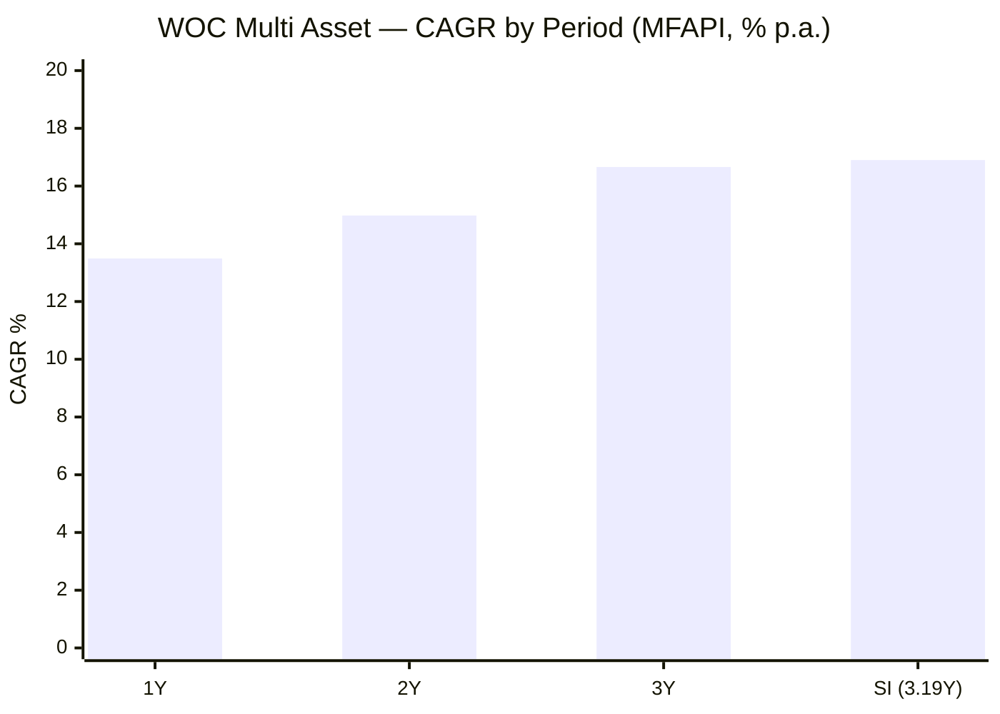
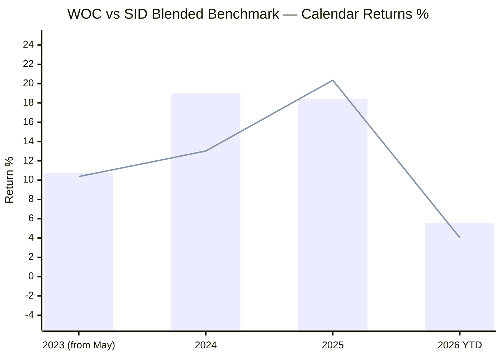
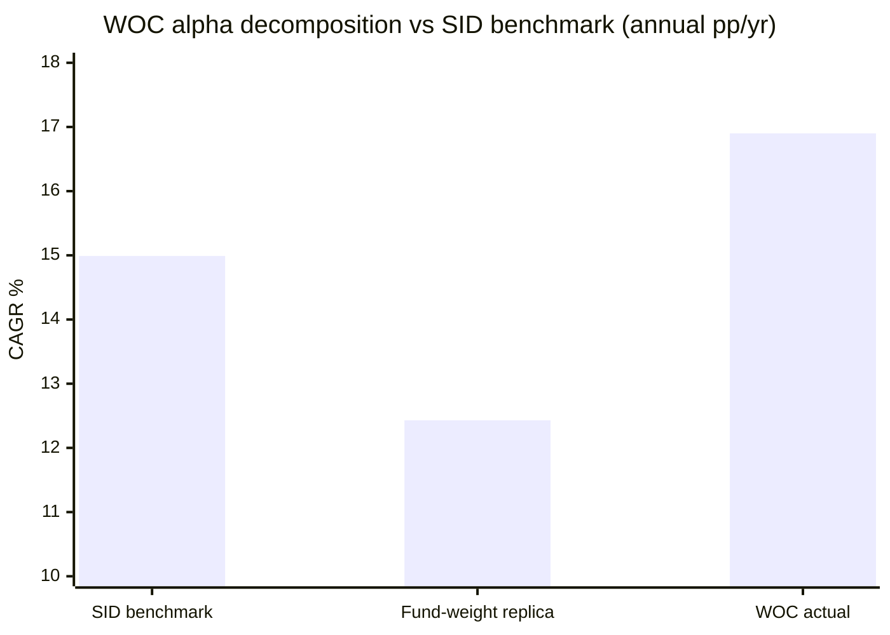
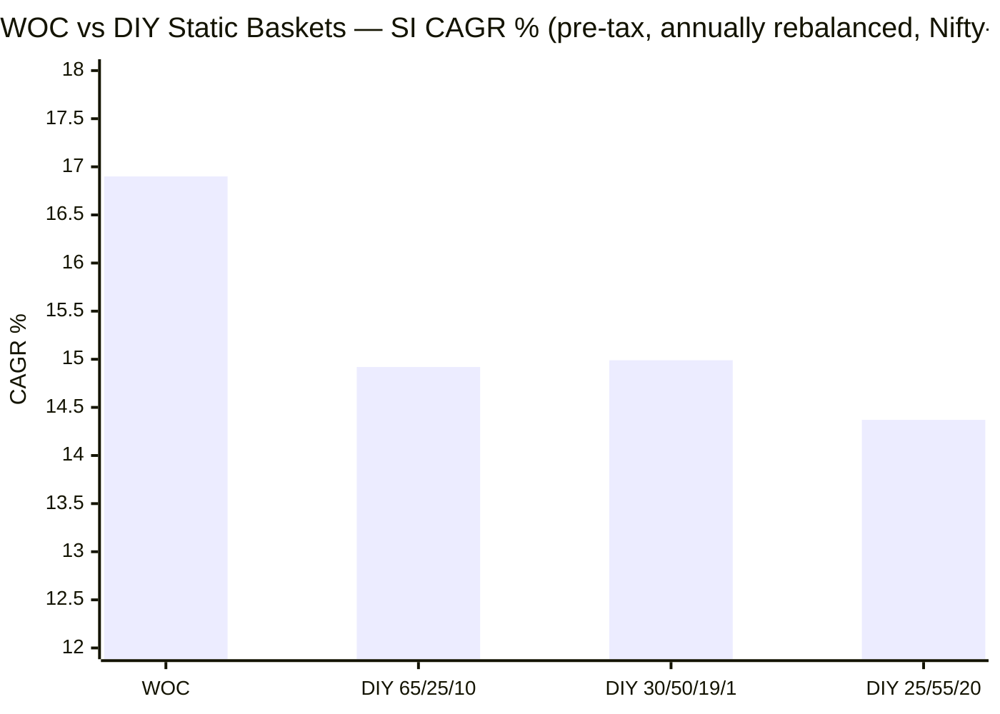
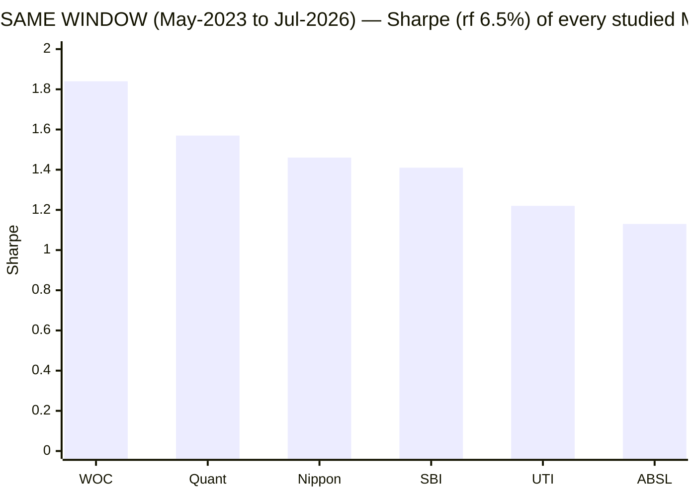
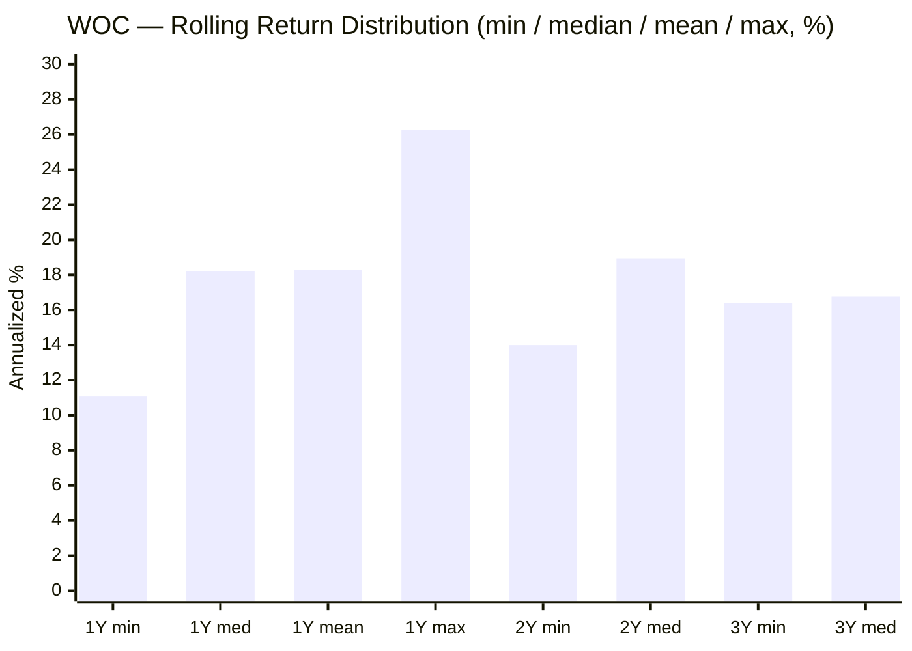
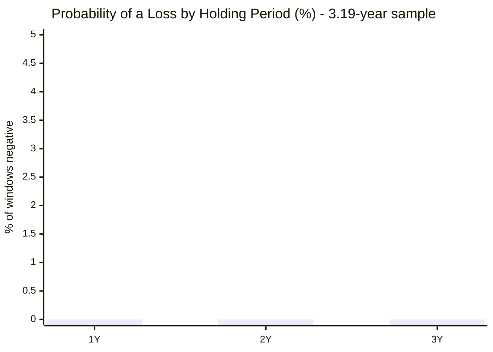
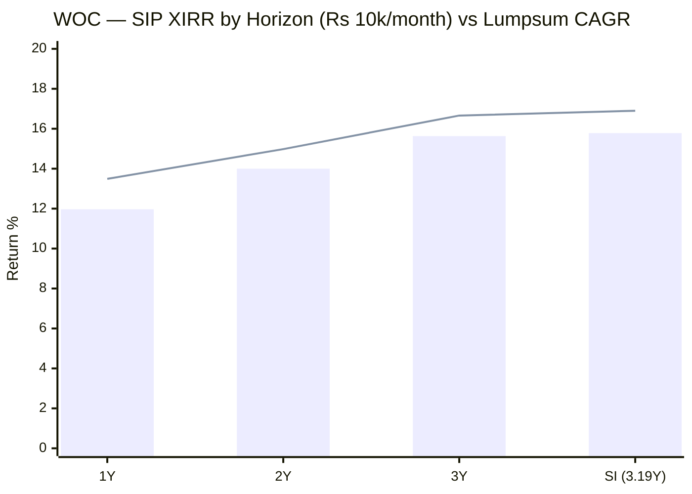
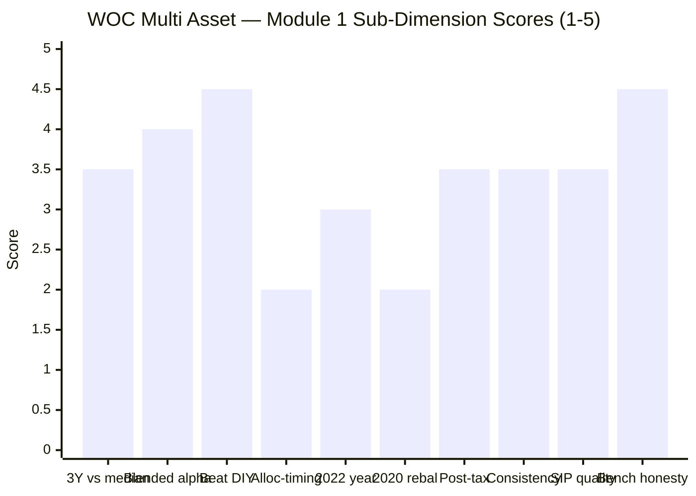

# Module 1: Returns & Allocation Alpha — WhiteOak Capital Multi Asset Allocation Fund

> **Provisional Module 1 score: ~3.4 / 5** (weight 20% in the multi-asset re-weight). **Scores in this study are NOT directly comparable to the four equity categories** — the module measures a risk-reduction product against a *blended* benchmark and a DIY basket, not a single equity index against peers.

> **The one-line context:** WOC is the study's cleanest **risk-adjusted** record and its **first unambiguous post-tax DIY win** — 16.90% since-inception CAGR at **5.65% volatility** and a **−6.08% max drawdown** (Sharpe 1.84, the best of the six funds studied), beating a DIY 65/25/10 basket by **+1.55pp post-tax** at roughly **40% less volatility**. It also has the **most honest benchmark in the study** — a genuine five-leg AMFI Tier-I composite pulled from the SID, not a lazy equity index. And then the decomposition arrives: the **+1.92%/yr alpha vs that benchmark splits into SELECTION +4.47%/yr and ALLOCATION −2.56%/yr**, and the allocation effect is **negative in every single one of the fund's four calendar years**. For a fund whose marketing headline is an "Internal Proprietary Model to provide direction" on the relative attractiveness of asset classes, the model has *subtracted* value every year it has run, while the security and instrument selection has added value every year. Returns-based style analysis confirms why: effective equity beta has sat in a **27.6%–29.5% band for the fund's entire life** despite an SID mandate permitting **10%–80%**. The fund is excellent. The allocation engine — the category's whole skill claim — is, on this evidence, not the reason.

---

## ⚠ The `no-2022-data` Flag — Read Before Any Number Below

WOC carries the study's **`no-2022-data`** flag (39 months at screening; 774 NAVs / 3.19 years of Direct-plan history).

| Stress test the framework requires | WOC |
|---|---|
| **2020** — COVID crash + gold rally (the rebalancing test) | ❌ **Did not exist** (allotment 19/22 May 2023) |
| **2022** — equity ↓ + debt ↓ + gold ↑ (THE multi-asset test) | ❌ **Did not exist** |
| 2024–25 Sep–Mar equity correction | ✅ Present |
| **Jan–Mar 2026 — equity ↓ AND gold ↓ AND silver ↓ simultaneously** | ✅ **Present — and it is a harder cross-asset test than 2022** |

**The mitigating fact, stated up front because it changes how the flag should be read.** ABSL's `no-2022-data` bit at maximum severity because its entire life was one uninterrupted bull market. WOC's does not, and the reason is a specific event: between **29 Jan and 23 Mar 2026** the Nifty 500 fell **−14.71%**, gold fell **−24.71%**, and silver fell **−43.53%** — *at the same time*. That is a **simultaneous drawdown in all three of the fund's risk assets**, which is arguably a *more* demanding test of a multi-asset book than 2022 (where gold rose and cushioned). WOC lost **−6.08%**, recovered fully in **85 days**, and finished 31-Jul-2026 **at an all-time high**.

So the honest position is: **the 2020 rebalancing test remains entirely unevidenced, and the 2022 debt-plus-equity joint decline remains unevidenced — but the "all risk assets fall together" scenario IS evidenced, and the fund passed it better than any peer.** Inception-bias discount still applies; it applies less harshly here than to ABSL.

---

## Fund Identity

| Attribute | Detail | Source |
|-----------|--------|--------|
| Full name | WhiteOak Capital Multi Asset Allocation Fund — Direct Plan — Growth | AMFI / MFAPI |
| AMC | WhiteOak Capital Asset Management Ltd (CIN U65990MH2017PLC294178) | **SID (AMFI portal, doc 13647)** |
| MFAPI scheme code | **151745** | api.mfapi.in/mf/151745 |
| Direct-plan NAV history | **22 May 2023 → 31 Jul 2026 (3.19y, 774 NAVs)** | MFAPI computed |
| NFO / allotment | NFO 03–10 May 2023; **allotment 19 May 2023**; first published Direct NAV 22 May 2023 (₹10.037) | AMC / MFAPI |
| **Stated benchmark (SID, verbatim)** | **BSE 500 TRI (30%) + CRISIL Short Term Bond Index (50%) + Domestic prices of Gold (16%) + Domestic prices of Silver (1%) + iCOMDEX Composite Index (3%)** — an **AMFI Tier-I** composite | **SID §VII / §D, verbatim** |
| Benchmark shown by Tickertape | "CRISIL Short Term Bond Index" — **wrong: that is one 50% leg of a five-leg composite** | Tickertape API, Jul 2026 |
| SEBI mandate bands (SID) | Equity & equity-related **incl. REITs 10–80%** · Debt & money market **10–80%** · Gold/silver instruments & **ETCDs 10–50%** · InvIT units **0–10%** | **SID Part II §A** |
| Net equity (screening) | **26.44%** (large 18.55 / mid 3.80 / small 3.94) · Debt 29.64% · residual "other" 43.92% | Tickertape API, Jul 2026 |
| Asset classes actually held | **6-class: domestic equity + REITs + InvITs + debt/money-market + gold + silver** (+ overseas ETFs permitted) — the widest breadth in the study | SID / VR / Groww |
| Gold & silver mechanism | ⚠ **Not physical.** SID: *"Investment into physical Gold is neither envisaged nor is part of the core investment strategy; however listed Gold Futures in Indian Commodity Exchanges…"* — held via **gold/silver ETFs + exchange-traded commodity derivatives (ETCDs)** | **SID Part II §A** |
| Confirmed holdings (Jul-2026) | Cash margin 11.86% · Gold 7.96% · **Silver 7.91%** · CBLO 6.52% · ICICI Pru Gold ETF 3.44% · Nexus Select Trust (REIT) 3.34% · ICICI Bank 3.18% · Embassy Office REIT 2.59% · HDFC Bank 2.45% · DSP Gold ETF 2.14% | ValueResearch / Groww, Jul 2026 |
| **Taxation status** | ⚠ **MIDDLE TIER — 12.5% LTCG only after 24 months, STCG at slab.** *Not* equity-taxed (net equity 26.4% is far below 65%). Confirmed by two independent sources; **full confirmation → M4** | ValueResearch + Groww, Jul 2026 |
| AUM / ER | ₹7,763 Cr / **0.67% Direct** per Tickertape — ⚠ **but Groww 0.46%, INDmoney 0.40%, Zerodha Coin 0.40%** (Regular 1.27%). Discrepancy flagged → M4 | Tickertape / Groww / INDmoney / Coin |
| Exit load | **1.00% if redeemed ≤30 days** (10% of units load-free), **Nil after 30 days**. ⚠ Tickertape records "0" — wrong | **SID §XI, verbatim** |
| Manager(s) | **Ramesh Mantri (CIO, equity) + Piyush Baranwal (debt)** since inception; **Dheeresh Pathak** added Apr-2024; **Ashish Agrawal** Jan-2025; **Trupti Agrawal** May-2025 — a **5-manager team**. Full assessment → M5 | Groww / VR |
| Equity-book valuation | **PE 25.58 vs category 23.35** — the equity sleeve is *pricier* than the category | Tickertape API |
| Study flag | ⚠ **`no-2022-data`** (39mo) — never saw 2020 or 2022; **but did see the Jan–Mar 2026 tri-asset drawdown** | screening |

> **Strategic-allocation note.** The AMC's own fund brochure names its efficient reference portfolio explicitly: **"25% Equity, 20% Gold, and 55% Debt … 11.1% average return, 7.0% volatility"** (Jan-2001–Jun-2023 backtest; D = CRISIL 10-Yr Gilt, E = S&P BSE Sensex TRI, G = MCX Gold INR). That anchor is used below as a secondary blended benchmark alongside the SID's official five-leg composite. Net-vs-gross equity, the arbitrage overlay and the realised factsheet path are **M3** items.

---

## Raw Data (MFAPI-computed + Tickertape screening, as of 31-Jul-2026)

| Metric | Value | Source |
|--------|-------|--------|
| CAGR 1Y | **13.49%** | MFAPI computed |
| CAGR 2Y | **14.98%** | MFAPI computed |
| CAGR 3Y | **16.66%** | MFAPI computed |
| CAGR 5Y / 10Y | **N/A — fund is 3.19y old** | — |
| CAGR since inception (3.19Y) | **16.90%** | MFAPI computed |
| 3M / 6M absolute | +3.37% / +3.13% | MFAPI computed |
| Annualized volatility (daily, SI) | **5.65%** — the lowest of any fund studied | MFAPI computed |
| Max drawdown (SI) | **−6.08%** (02 Mar → 23 Mar 2026), **recovered 16 Jun 2026 (85 days)** | MFAPI computed |
| % from all-time high (31-Jul-26) | **0.00% — at an ATH** | MFAPI computed |
| Sharpe (SI, rf 6.5%) | **1.84** | MFAPI computed |
| Rolling 1Y: mean / median / **min** | 18.29% / 18.23% / **+11.07%** | MFAPI (535 windows) |
| Rolling 2Y: mean / median / min | 18.12% / 18.92% / **+14.00%** | MFAPI (292 windows) |
| Rolling 3Y: mean / median / min | 16.81% / 16.77% / **+16.39%** | MFAPI (49 windows) |
| Prob. of loss 1Y / 2Y / 3Y | **0.0% / 0.0% / 0.0%** ⚠ *(3.19y sample)* | MFAPI |
| SI SIP XIRR (₹10k/mo) | **15.78%** (₹3.80L → ₹4.86L) | MFAPI, Newton-Raphson |
| **Alpha vs SID blended benchmark (SI)** | **+1.92%/yr** (annually rebalanced) · **+2.46%/yr** (daily rebalanced) | MFAPI computed |
| **— of which ALLOCATION** | **−2.56%/yr** | MFAPI computed (Brinson-style) |
| **— of which SELECTION** | **+4.47%/yr** | MFAPI computed (Brinson-style) |
| Screening: 3Y / Sharpe / stdDev / TE | 16.68% / 1.197 / 6.90% / 6.62% | Tickertape, Jul 2026 |

---

## Cross-Source Verification

| Metric | MFAPI computed | Tickertape | Other sources | Verdict |
|--------|----------------|-----------|---------------|---------|
| 3Y CAGR | **16.66%** | 16.68% | Groww 16.64% · INDmoney 16.66% | ✅ **Four-way exact confirmation** |
| 1Y CAGR | **13.49%** | 13.31% | Groww 13.48% · INDmoney 13.48% | ✅ Confirmed (±0.18) |
| SI CAGR | **16.90%** | — | INDmoney 16.99% | ✅ Confirmed; 0.09pp gap = inception-date convention (19-May allotment vs 22-May first NAV) |
| Volatility | **5.65%** (daily, SI) | **6.90%** (3–5Y stdDev) | — | ⚠ 1.25pp gap — smaller than ABSL's 2.8pp and **both figures sit inside the category's "good" 8–11% band by a wide margin.** Either way this is the least volatile fund in the study |
| Sharpe | **1.84** (SI, rf 6.5%) | **1.20** | INDmoney **1.85** (3Y) | ⚠ Tickertape is the outlier; MFAPI and INDmoney agree to 0.01. **Tickertape's Sharpe is understated** — study-wide caution |
| Sortino | — | 0.1199 (TT scale) | INDmoney **3.30** | Tickertape's Sortino is on its own non-standard scale (flagged study-wide); carried to M2 |
| **Alpha (Tickertape) = 2.07** | — | vs **"CRISIL Short Term Bond Index"** | — | ❌ **Discarded — actively misleading.** Tickertape benchmarks a fund holding 26% equity + 16% precious metals + 6% REITs against a **pure short-duration bond index** returning ~7.6%/yr. Any risk asset beats that. Worse, Tickertape has recorded **one 50% leg of a five-leg SID composite** as the whole benchmark |
| Expense ratio | — | **0.67%** | Groww **0.46%** · INDmoney **0.40%** · Coin **0.40%** | ⚠ **0.27pp spread across four sources.** Three of four cluster at 0.40–0.46%. **Unresolved → M4** (material: it is the difference between winning and losing the 10Y DIY test) |
| Exit load | — | **0** | Groww "1% within 1 month" · **SID: 1% ≤30 days** | ⚠ **Tickertape wrong.** SID is authoritative |
| Benchmark | — | "CRISIL Short Term Bond Index" | **SID: BSE 500 TRI 30 + CRISIL ST Bond 50 + Gold 16 + Silver 1 + iCOMDEX 3** | ⚠ **Tickertape materially wrong.** SID used throughout below |
| VR rating | — | — | **5 / 5 stars** (Regular plan) | Noted; ratings are peer-relative and short-window here |

**Data reliability: High for NAV-derived figures** (774 NAVs from Direct-plan inception; 3Y CAGR reconciles across four independent sources to two decimal places). **Four flagged anomalies, all on the Tickertape side:** the benchmark, the exit load, the Sharpe, and the ER. This module treats the **SID as authoritative** for benchmark, bands, gold mechanism and exit load.

> **⚠ Method upgrade applied here, with a retrofit consequence for the four earlier funds.** Modules 1 for SBI/Nippon/UTI/ABSL asserted that *"no long-history Nifty 500 / BSE 500 index fund exists to use as the equity leg — a genuine, study-wide data limitation"* and used **Nifty 50** instead. **That is incorrect.** *Motilal Oswal Nifty 500 Index Fund – Direct* (MFAPI **147625**) has daily NAVs from **11 Sep 2019** — covering 2020, 2022 and every window in this study. Over WOC's window the two legs differ by **4.27pp/yr** (Nifty 500 14.71% vs Nifty 50 10.44%), so the Nifty-50 leg **inflated every earlier fund's blended alpha and DIY edge**. Concretely: WOC's edge over the study-standard DIY 65/25/10 is **+4.79%/yr on a Nifty-50 leg but only +1.92%/yr on a Nifty-500 leg**. This module uses the Nifty 500 leg throughout. **Retrofit flagged in the footer.**

---

## CAGR — the Ladder and What It Says

| Period | CAGR | Read |
|--------|------|------|
| 1Y | 13.49% | Achieved with the Nifty 500 at **−1.13% CY-to-date** and gold/silver in drawdown — the whole book worked |
| 2Y | 14.98% | Spans the Sep-2024→Mar-2025 correction *and* the Jan–Mar 2026 tri-asset crash |
| 3Y | 16.66% | Matches Tickertape, Groww and INDmoney |
| **SI (3.19Y)** | **16.90%** | **A monotonically decaying ladder — the earliest months were the strongest** |

**Interpretation.** The ladder is gently **descending** (16.90 → 16.66 → 14.98 → 13.49), the shape ABSL's also had and for the same structural reason: a short life in which the earliest stretch was the best. It is *not* the alarming version of that shape (MidCap Motilal's "worse the closer you look") — the decay is 3.4pp across the whole ladder, and the 1Y figure was earned in a *falling* equity and *falling* precious-metals tape. **What the 16.90% genuinely says:** in a window where the Nifty 500 returned 14.71%/yr, gold 29.10%/yr, silver 38.57%/yr and short-duration debt 7.60%/yr, a book carrying roughly 28% equity, 11% gold, ~40% debt and ~20% cash returned 16.90%. That is a *materially better* outcome than those weights mechanically imply (12.43% — see the decomposition), and it is the single most creditable fact in this module.

---

## Calendar-Year Returns — WOC vs Its Own SID Benchmark and the Legs

*MFAPI-computed. Benchmark = the **SID composite**, annually rebalanced: 30% Nifty 500 index fund (proxy for BSE 500 TRI) / 50% HDFC Short Term Debt (proxy for CRISIL ST Bond) / 19% SBI Gold (16% gold + the 3% iCOMDEX leg proxied by gold) / 1% Nippon Silver ETF FoF. **Only four partial calendar years exist.***

> Bar = WOC · Line = SID blended benchmark (annually rebalanced)

| Year | WOC | SID bench | Alpha | Nifty500 | Gold | Silver | ST Debt | What happened |
|------|-----|-----------|-------|----------|------|--------|---------|---------------|
| **2023** (from May) | +10.71 | +10.37 | **+0.34** | +25.88 | +3.08 | +0.59 | +4.02 | Launched into a broad-market melt-up it barely participated in (26% equity). Matched its benchmark; no more |
| **2024** | +18.99 | +13.02 | **+5.97** | +15.64 | +19.88 | +15.63 | +8.51 | ✅ **The best year in the study on a per-unit-of-risk basis.** Beat a benchmark that itself beat everything, and beat the Nifty 500 outright with a third of its equity |
| **2025** | +18.39 | +20.35 | **−1.96** | +7.67 | **+71.85** | **+155.74** | +8.19 | ⚠ **The blind spot.** Gold nearly doubled and silver more than *doubled and a half* — and WOC **lagged its own benchmark**, whose gold+silver legs are only 20% |
| **2026 YTD** | +5.57 | +4.03 | **+1.54** | −1.13 | +6.42 | −4.76 | +3.45 | ✅ **Positive through a simultaneous equity + gold + silver drawdown.** The strongest single piece of evidence in this module |
| ~~2019–2022~~ | — | — | — | — | — | — | — | ❌ **Fund did not exist** — no 2020 rebalancing test, no 2022 divergence test |

**The honest pattern — three good years, one revealing miss, and the recurring category flaw:**
- **2024 (+5.97) and 2026 YTD (+1.54) are genuinely creditable**, and 2026 is the more valuable of the two: the fund made money while all three of its risk assets fell.
- **2025 repeats the study's single most persistent failure — under-harvesting precious metals.** UTI missed by 11.4pp, ABSL by 1.8pp, WOC by 1.96pp. The mechanism here is specific and identifiable: **the SID benchmark carries 1% silver and the fund carried effectively *zero* directional silver exposure in 2025** (see the style analysis) — in a year silver returned +155.74%. Note the sting in the tail: **the current portfolio shows 7.91% "Silver"** (VR/Groww, Jul-2026). If that position was built *after* the run, the fund bought the melt-up rather than harvested it. The return data cannot distinguish "added silver late" from "holds silver hedged"; **M3 must read the derivatives table to settle it.**
- **2023 (+0.34) is the honest cost of the mandate.** With the broad market up 25.88%, a 26%-equity fund returns 10.71%. That is the product working as designed, not a failure — but it is the opportunity cost an investor is signing up for.

### Up-year participation vs down-year protection (the symmetry test)

| Regime | Equity (Nifty 500) | WOC | Capture |
|---|---|---|---|
| **Strong up-market** — 2023 (from May) | **+25.88%** | +10.71% | **41%** |
| **Moderate up-market** — 2024 | +15.64% | **+18.99%** | **121%** |
| **Weak up-market** — 2025 | +7.67% | **+18.39%** | **240%** |
| **Down-market** — Sep-2024 → Mar-2025 | **−12.62%** | **+3.41%** | **negative capture (−27%)** |
| **Down-market** — 2026 YTD | **−1.13%** | **+5.57%** | **negative capture** |

**The symmetry is strongly asymmetric in the investor's favour, and that is the fund's actual product.** WOC gives up roughly **60% of a raging equity bull** (2023) but converts *both* observed equity down-markets into **positive** returns. The 121% and 240% capture figures in 2024–25 are gold doing the work, not the equity book — so they should not be read as equity skill; they should be read as the diversification premium showing up exactly when equity stopped paying. Formal upside/downside capture ratios vs the Nifty 500, computed on daily data, are **M2**.

---

## ⭐ The Blended-Benchmark Alpha — and the Decomposition That Defines This Fund

### Is the alpha a weight-choice artifact?

Because there is no single index (framing fact #1), alpha is measured against a construction. WOC's SI alpha is **+1.92%/yr** (annual rebalancing) vs the SID composite. Robustness across alternative weightings:

| Blend (Eq / Debt / Gold / Silver) | SI CAGR (annual rebal) | WOC − blend |
|---|---|---|
| **WOC (fund)** | **16.90%** | — |
| **30 / 50 / 19 / 1 — the SID benchmark** | 14.99% | **+1.92%** |
| 25 / 55 / 19 / 1 | 14.60% | **+2.31%** |
| 35 / 45 / 19 / 1 | 15.37% | **+1.53%** |
| 40 / 40 / 19 / 1 | 15.75% | **+1.15%** |
| 25 / 55 / 20 (AMC brochure's own "efficient portfolio") | 14.37% | **+2.53%** |
| 65 / 25 / 10 (study-plan DIY standard) | 14.92% | **+1.98%** |

**The alpha survives every weighting (+1.15% to +2.53%/yr) — it is not a weight artifact.** It is smaller than ABSL's headline (+3.55%) and Nippon's (+3.85%), but those were computed against a **Nifty-50** equity leg; on a like-for-like Nifty-500 leg WOC's is the more honest number.

### The decomposition — allocation vs selection (framing fact #4)

The fund is replicated as a passive basket at its **returns-based effective weights** (28.4% equity / 39.9% short debt / 11.1% gold / 0.3% silver / 20.3% cash at 6.5%), annually rebalanced. The gap from the benchmark to that replica is **allocation**; the gap from the replica to the fund is **selection**.

| Step | CAGR | Effect |
|---|---|---|
| SID blended benchmark | 14.99% | — |
| Passive replica at WOC's own effective weights | 12.43% | **ALLOCATION −2.56%/yr** |
| WOC actual | 16.90% | **SELECTION +4.47%/yr** |
| | | **Net alpha +1.92%/yr** |

*(Daily-rebalanced variant: benchmark 14.45%, replica 12.11%, allocation −2.34%, selection +4.80%, net +2.46%. The conclusion is invariant to rebalancing convention.)*

**Year by year — and this is the module's decisive exhibit:**

| Year | WOC | Benchmark | Replica | **Allocation** | **Selection** | Net |
|------|-----|-----------|---------|----------------|---------------|-----|
| 2023 | 10.71 | 10.37 | 10.09 | **−0.28** | **+0.62** | +0.34 |
| 2024 | 18.99 | 13.02 | 11.61 | **−1.41** | **+7.38** | +5.97 |
| 2025 | 18.39 | 20.35 | 14.42 | **−5.93** | **+3.97** | −1.96 |
| 2026 YTD | 5.57 | 4.03 | 3.40 | **−0.63** | **+2.17** | +1.54 |

**Allocation is negative in 4 years out of 4. Selection is positive in 4 years out of 4.** There is no year in this fund's life in which its asset-allocation decisions beat simply holding its own benchmark's weights.

**Why this matters more here than it would in any equity category.** WhiteOak's stated pitch for this fund, in its own brochure, is *"Based on Relative Attractiveness of Asset Classes — Internal Proprietary Model to provide direction."* The proprietary model is the product. On 3.19 years of evidence the model has cost **−2.56%/yr**, and the fund is in front only because the equity book, the REIT/InvIT sleeve and the instrument selection have more than paid for it. That is a real edge — but it is **not the edge the category is supposed to sell, and it is not the edge this fund advertises.**

**Two honest caveats against over-reading it:**
1. **The "selection" residual is not proven stock-picking.** It contains everything the four modelled legs cannot see: the **REIT + InvIT sleeve (~6–13% of the book, and the SID counts REITs inside the *equity* bucket)**, any arbitrage/hedged overlay, overseas ETFs, and accrual pickup in the debt book. Calling it "selection" is a residual label, not an attribution. **M3 must decompose it properly from factsheet weights.**
2. **The window punished conservatism.** Allocation looks bad partly because *any* underweight to gold and silver looked bad in 2025. In a year where equity beats metals, the same conservatism would score positive. One four-year sample cannot separate "bad model" from "unlucky regime" — but it can say the model has **not yet demonstrated it works**, which is the claim being sold.

### Returns-based style analysis — the mandate is wide, the execution is not

Constrained daily regression of WOC's returns on the four legs (weights ≥0, sum ≤1, remainder = cash at 6.5%). **R² = 0.844, tracking error 2.21%.**

| Sub-period | Equity | Debt | Gold | Silver | Cash |
|---|---|---|---|---|---|
| 2023 (May–Dec) | **29.5%** | 39.9% | 8.9% | 4.2% | 17.4% |
| 2024 | **29.0%** | 40.0% | 8.4% | 4.2% | 18.5% |
| 2025 | **27.6%** | 40.0% | 8.6% | **0.0%** | 23.8% |
| 2026 YTD | **29.2%** | 40.0% | 11.0% | **0.0%** | 19.8% |
| **Full window** | **28.4%** | 39.9% | 11.1% | 0.3% | 20.3% |

**Two findings.**
1. **Effective equity beta has moved in a 1.9-percentage-point band (27.6%–29.5%) across the fund's entire life — inside an SID mandate that permits 10% to 80%.** A "relative attractiveness" model with a 70-point runway that has used **under 2 points of it** is, on the evidence of realised returns, a **static allocation with a narrative attached**. This is the same finding pattern as MidCap's active-share work, applied to the allocation dial. **M3 owns the verdict; M1 records the evidence.**
2. **Directional silver exposure reads as ~0% in 2025 and 2026 despite a 7.91% "Silver" line in the disclosed portfolio.** The most likely explanation is a **cash-and-carry / hedged commodity position** (note the **11.86% "Cash Margin"** sitting beside it) generating a debt-like return rather than commodity beta. If so, the fund's "silver allocation" is not a silver allocation at all — it is an arbitrage sleeve. **This is a Tier-1 M3 question and must be settled from the factsheet derivatives table.** The debt-vs-cash split within the ~60% low-risk block is *not* reliably identified by this method (a low-volatility bond leg is near-collinear with cash) and should not be quoted; the ~60% total and the ~28% equity beta are robust.

---

## Asset-Class Return Attribution

*Effective weights × leg returns, per year. "Unexplained" = the selection/unmodelled-sleeve residual.*

| Year | Equity | Debt | Gold | Silver | Cash | Passive sum | **Actual** | **Unexplained** |
|------|--------|------|------|--------|------|-------------|------------|-----------------|
| 2023 | +7.35 | +1.61 | +0.34 | +0.00 | +0.79 | +10.09 | **+10.71** | **+0.62** |
| 2024 | +4.44 | +3.40 | +2.21 | +0.05 | +1.33 | +11.42 | **+18.99** | **+7.57** |
| 2025 | +2.18 | +3.27 | +7.98 | +0.47 | +1.32 | +15.21 | **+18.39** | **+3.18** |
| 2026 YTD | −0.32 | +1.38 | +0.71 | −0.01 | +0.76 | +2.51 | **+5.57** | **+3.06** |

**Gold is the single largest swing contributor** (+7.98pp of 2025's return) and the reason the fund clears a debt-like risk profile with an equity-like return. **Silver has contributed essentially nothing** (+0.52pp across four years combined) despite being a named asset class in the fund's title and a 1% leg of its benchmark. **The unexplained residual is large and persistent** — +0.62 / +7.57 / +3.18 / +3.06 — and is where the fund actually earns its keep.

---

## Benchmark Appropriateness Critique (framing fact #1)

This is the section where WOC separates itself from every fund studied so far.

**✅ The SID benchmark is the most honest in the study.** *BSE 500 TRI (30%) + CRISIL Short Term Bond Index (50%) + Domestic gold (16%) + Domestic silver (1%) + iCOMDEX Composite (3%)* is a genuine **five-leg, AMFI Tier-I composite** whose declared equity weight (30%) sits within **1.6 percentage points** of the fund's measured effective equity beta (28.4%). Compare:

| Fund | Self-selected benchmark | Honest? |
|---|---|---|
| **WOC** | **5-leg composite, 30% equity** | ✅ **Yes — matches the actual book almost exactly** |
| SBI | BSE 500 TRI | ❌ Single equity index for a 47%-equity book |
| Nippon | BSE 500 TRI | ❌ Single equity index for a 56%-equity book |
| Quant | NIFTY 500 TRI | ❌ Single equity index |
| UTI | BSE 200 TRI | ❌ Single large-cap index; harshly criticised in its M1 |
| ABSL | BSE 200 | ❌ Single large-cap index; "lazy, not gaming" |
| HDFC *(instructive)* | NIFTY 50 TRI | ❌ The study's flagged flattering-benchmark case |

**❌ But three criticisms stand.**
1. **A 50% short-duration-bond leg sets a structurally low absolute bar.** The composite returned 14.99%/yr over the window largely because gold carried 19% of it; strip the metals and the bar is near-cash. An investor should read "+1.92% alpha" as *relative to a deliberately conservative construction*, not as evidence of a high return.
2. **Tickertape has recorded the 50% CRISIL Short Term Bond leg as the *entire* benchmark** — and computes a published alpha of **2.07** against it. A 26%-equity, 16%-metals fund "beating" a short-bond index is arithmetic, not skill. **That figure is discarded**, and any screener-level comparison of WOC to peers on "alpha" is invalid.
3. **The marketing tax claim is stale and, today, wrong.** The AMC's own brochure footnote reads: *"Scheme is eligible for Long Term Capital Gain tax of 20% (+ Surcharge and Cess) with indexation benefit after the holding period of more than 3 years as per prevailing tax laws (w.e.f. 1st April 2023)"*, and the front page sells **"Long Term Capital Gain Tax and Indexation Benefit"** as a headline feature. **Indexation for this fund class was abolished by the Finance (No. 2) Act 2024 with effect from 23 July 2024.** The fund was marketed on a tax feature that no longer exists, and the brochure surfaced by a live search in Aug-2026 still carries it. That is a disclosure-hygiene finding, not a performance one — **flagged to M6 (AMC communication) and M4 (tax)**.

---

## The DIY-Basket Test — Does the Fund Beat "Do It Yourself"? (framing fact #2)

The sharper question: **why pay WOC instead of buying an equity index fund + a short-duration debt fund + a gold ETF and rebalancing once a year?**

### Pre-tax

| Basket (annually rebalanced) | SI CAGR | Volatility | Max DD | Sharpe | WOC edge |
|---|---|---|---|---|---|
| **WOC Multi Asset** | **16.90%** | **5.65%** | **−6.08%** | **1.84** | — |
| DIY 65/25/10 (study standard) | 14.92% | 9.85% | −10.87% | 0.86 | **+1.98%/yr** |
| DIY 30/50/19/1 (= the SID benchmark) | 14.99% | 7.45% | −10.88% | 1.14 | **+1.92%/yr** |
| DIY 25/55/20 (AMC's own "efficient portfolio") | 14.37% | 6.76% | −9.59% | 1.16 | **+2.53%/yr** |

**WOC beats every DIY basket pre-tax — and does so at materially lower risk on every one.** Against the study-standard 65/25/10 it delivers **+1.98%/yr more return with 43% less volatility and 44% less drawdown**. That is the strongest joint return-and-risk DIY result of any fund studied.

### Post-tax — the test that actually decides it (framing fact #3)

Modelled on a ₹10L lumpsum held the full 3.19 years, 30% marginal slab (31.2% with cess), with **full cost-basis tracking through each annual DIY rebalance**. DIY legs taxed by their own regimes: equity index fund 12.5% LTCG >12m with the ₹1.25L annual exemption; gold ETF 12.5% LTCG >12m; debt fund at **slab, always**.

| | Pre-tax CAGR | Post-tax CAGR | Tax drag |
|---|---|---|---|
| **WOC** (middle tier: 12.5% LTCG after 24m, **internal rebalancing tax-free**) | 16.90% | **15.08%** | 1.82pp *(one exit event)* |
| DIY 65/25/10 | 14.92% | **13.53%** | 1.39pp *(annual + exit)* |
| DIY 30/50/19/1 (SID benchmark mix) | 14.99% | **13.41%** | 1.58pp |
| DIY 25/55/20 (AMC efficient portfolio) | 14.37% | **12.77%** | 1.61pp |

**✅ WOC wins the post-tax DIY test against every basket — by +1.55pp, +1.67pp and +2.31pp/yr respectively — while running roughly 40% less volatility than the study-standard basket.** This is the **first unambiguous post-tax DIY win in the study**, and it is exactly the finding the category was built to interrogate. The mechanism is visible in the table: the DIY investor bleeds **1.39–1.61pp/yr** to tax on rebalancing and on slab-taxed debt income; WOC's internal rebalancing is free.

**Three things must be said against it, in order of severity.**

1. **⚠ WOC does NOT have the equity-tax shield.** With 26.4% net equity it is nowhere near the ≥65% gross-equity line, and both ValueResearch and Groww state the middle-tier mechanics: **12.5% LTCG only after 24 months, slab rates before that, and no ₹1.25L exemption.** The category's *headline* structural edge — whole corpus at equity rates — **does not apply to this fund.** Its DIY win comes entirely from the *rebalancing* shield, not the *taxation-status* shield. Held under 24 months it is taxed at slab and the entire advantage inverts.
2. **⚠ The downside tax case is severe and is a live review trigger.** If the fund's classification ever moved to slab-on-all-gains, post-tax SI return falls from 15.08% to **12.22%** and WOC **loses to the DIY 65/25/10 basket (13.53%)**. The current SID structure (~30% debt + ~20% cash, well under the >65%-debt "specified mutual fund" threshold) makes this unlikely, but it is not zero, and it is the single largest tail risk in the fund's economics. **→ M4 must confirm from the SID/AMC directly; M2 should price it as a structural risk.**
3. **The window is 3.19 years, and the ER is unresolved.** A forward 10-year projection at a common 11% gross return — i.e. giving the fund **no credit at all** for its selection alpha or its risk reduction — puts WOC at **9.43% post-tax (at 0.67% ER)** or **9.63% (at 0.46% ER)** against a DIY basket at **9.50%**. On pure fee-and-tax mechanics with equal gross returns, **it is a coin-flip that the ER discrepancy decides.** The realised +1.55pp win is real; it is not structurally guaranteed. **M4 owns the definitive model.**

---

## ⭐ The Like-for-Like Test — Every Studied Fund Over WOC's Exact Window

WOC is the youngest fund studied, so its window (22-May-2023 → 31-Jul-2026) is the shortest and the comparison is re-run for all six.

| Fund (same window) | CAGR | Volatility | Max DD | **Sharpe** | SIP XIRR | Recovered? |
|---|---|---|---|---|---|---|
| **WOC Multi Asset** | **16.90%** ⚠ *lowest* | **5.65%** ✅ *lowest* | **−6.08%** ✅ *shallowest* | **1.84** ✅ **1st** | 15.78% | ✅ **85 days — at an ATH** |
| Quant Multi Asset | **24.12%** ✅ *highest* | 11.25% | −12.49% | 1.57 | **19.39%** | ✅ 94 days |
| Nippon Multi Asset | 20.73% | 9.77% | −10.78% | 1.46 | 17.03% | ❌ Not recovered |
| SBI Multi Asset | 17.53% | 7.84% | −8.59% | 1.41 | 13.87% | ❌ Not recovered |
| UTI Multi Asset | 17.97% | 9.37% | −11.03% | 1.22 | **11.75%** ⚠ *lowest* | ❌ Not recovered |
| ABSL Multi Asset | 17.92% | 10.12% | **−12.83%** ⚠ | **1.13** ⚠ *lowest* | 15.57% | ❌ Not recovered |
| *Reference — Nifty 500* | 14.71% | 14.00% | −18.62% | 0.59 | — | ❌ |
| *Reference — Gold* | 29.10% | 20.60% | −24.71% | 1.10 | — | ❌ |
| *Reference — Silver* | 38.57% | 37.06% | −43.53% | 0.87 | — | ❌ |
| *Reference — Short-duration debt* | 7.60% | 0.89% | −0.53% | 1.24 | — | — |

**The trade is explicit and should not be softened in either direction:**

1. **WOC has the LOWEST raw CAGR of the six.** An investor optimising for headline return does not buy this fund. Quant returned **7.22 percentage points a year more.**
2. **WOC has the HIGHEST Sharpe (1.84), the LOWEST volatility (5.65%), and the SHALLOWEST drawdown (−6.08%) — all three by a clear margin**, and it is one of only two funds to have fully recovered its drawdown. On 31-Jul-2026 it was **at an all-time high while four of the six were still underwater.**
3. **It is the only fund whose volatility (5.65%) sits *below* the study plan's "good" band of 8–11%.** On the framework's own risk grid it is not merely good, it is off the scale in the intended direction — which correspondingly raises the M2 question of whether it dampens *too* much to earn a growth-portfolio slot at all.

### Both stress windows, side by side

| | **Sep-2024 → Mar-2025** (equity-only correction) | **Jan → Jun 2026** (equity + gold + silver together) |
|---|---|---|
| **WOC** | **−2.19% DD · +3.41% window return** ✅ | **−6.08% DD · +3.56% window return · recovered** ✅ |
| SBI | −6.20% DD | −8.59% DD · not recovered |
| Nippon | −7.96% DD | −10.78% DD · not recovered |
| ABSL | −8.84% DD | −12.83% DD · not recovered |
| UTI | −9.88% DD | −11.03% DD · not recovered |
| Quant | −12.49% DD | −8.16% DD · recovered |
| *Nifty 500* | **−18.62% DD · −12.62%** | −14.71% DD · −3.41% |
| *Gold* | −7.57% DD · +16.24% | **−24.71% DD** · +4.94% |
| *Silver* | −13.71% DD · +9.48% | **−43.53% DD** · −1.61% |

**In the Sep-2024→Mar-2025 correction WOC drew down 2.19% while the Nifty 500 fell 18.62% — a cushioning ratio of roughly 8.5×, and it finished the window POSITIVE (+3.41%) while every other studied fund finished negative.** In the Jan-2026 tri-asset crash it lost 6.08% while gold lost 24.71% and silver lost 43.53%, and it made money over the half-year. **This is the best-evidenced cushioning record in the study, and it is the reason the `no-2022-data` flag should not be applied to WOC with ABSL's severity.** Full downside-capture and correlation work is **M2**.

---

## Rolling Returns — the Best Distribution in the Study, With the Usual Asterisk

*535 rolling 1Y, 292 rolling 2Y and 49 rolling 3Y windows, daily, full Direct history.*

| Window | Min | Median | Mean | Max | % ≥ 10% | % ≥ 12% | % ≥ 15% | **% negative** |
|---|---|---|---|---|---|---|---|---|
| 1Y (n=535) | **+11.07%** | 18.23% | 18.29% | 26.27% | **100%** | 99.3% | 83.2% | **0.0%** |
| 2Y (n=292) | **+14.00%** | 18.92% | 18.12% | 21.48% | 100% | 100% | — | **0.0%** |
| 3Y (n=49) | **+16.39%** | 16.77% | 16.81% | 17.28% | 100% | 100% | — | **0.0%** |

**Every single 1-year window in this fund's life returned at least +11.07%.** That is the best minimum of any fund in the study — better than ABSL's +6.12%, and produced at a third less volatility.

**How much credit this deserves — a calibrated answer, not a dismissal.** The ABSL module scored an identical-looking 0%-negative record at **3.0** because its 614 windows were drawn from one uninterrupted bull regime and were "effectively one observation." WOC's sample is shorter still (3.19y) and carries the same overlapping-window problem. **But it is not the same sample.** WOC's 535 windows include a −18.62% Nifty 500 correction *and* a simultaneous gold −24.71% / silver −43.53% crash, and the distribution stayed positive through both. That is genuinely more information than ABSL's. It is still **far** short of SBI's 13.4-year record spanning IL&FS, COVID and 2022. **Scored 3.5 — better than ABSL's 3.0, well short of a record that has been tested.**

### Probability of loss by holding period

> ⚠ **Not a forecast.** Zero observed losses over 3.19 years — including two genuine cross-asset drawdowns — is meaningful but not sufficient. Treat as *encouraging and partially tested*, not *established*.

---

## Best / Worst Windows, Drawdown & Daily Distribution (return-side; full risk in M2)

| Window | Worst | Best |
|---|---|---|
| 1M | **−5.22%** (21 Feb → 23 Mar 2026) | +5.84% (23 Mar → 22 Apr 2026) |
| 3M | **−3.00%** (22 Dec 2025 → 23 Mar 2026) | +8.80% (07 Apr → 07 Jul 2025) |
| 6M | **+1.20%** (22 Sep 2025 → 23 Mar 2026) — *the worst six months in this fund's life were still positive* | +14.38% (26 Oct 2023 → 25 Apr 2024) |
| 1Y | **+11.07%** (11 Jun 2025 → 11 Jun 2026) | +26.27% (27 Sep 2023 → 26 Sep 2024) |

### Drawdown ledger

| Event | Peak | Trough | Depth | Recovery |
|---|---|---|---|---|
| **Max DD — Jan–Mar 2026 tri-asset crash** | 02 Mar 2026 | 23 Mar 2026 | **−6.08%** | ✅ **16 Jun 2026 — 85 days** |
| Sep-2024 → Mar-2025 equity correction | 26 Sep 2024 | Feb 2025 | **−2.19%** | ✅ recovered |
| Status at 31-Jul-2026 | — | — | — | ✅ **All-time high, 0.00% from ATH** |

Two observations. **(1)** The worst thing that has ever happened to this fund is a **6.08%** drawdown that lasted three weeks and healed in under three months. Every other fund studied except Quant is still underwater from the same event. **(2)** The whole ledger covers 3.19 years — the fund has never met a 2008, a 2020 or a 2022, and **the absence of a real bear market in the sample is the binding limitation on everything above.**

### Daily return distribution (773 observations)

| Metric | WOC | Nifty 500 (same window) |
|---|---|---|
| Up days | 479 (62.0%) | — |
| Down days | 288 (37.3%) | — |
| Days worse than −1% | **6** | — |
| Days worse than −2% | **2** | **17** |
| Worst single day | **−2.52%** (23 Mar 2026) | **−6.71%** |
| Best single day | +1.79% (08 Apr 2026) | — |

**Six down-1% days in three and a quarter years.** The daily experience of holding this fund is closer to a short-duration debt fund than to anything in the four equity sleeves — which is precisely the point of the sleeve, and precisely the reason its raw CAGR sits last of six.

---

## SIP XIRR vs Lumpsum — ₹10,000/month

> Bar = SIP XIRR · Line = lumpsum CAGR (matched horizon)

| Horizon | SIP XIRR | Invested | Corpus |
|---|---|---|---|
| 1Y | 11.97% | ₹1.20L | ₹1.28L |
| 2Y | 14.00% | ₹2.40L | ₹2.76L |
| 3Y | 15.63% | ₹3.60L | ₹4.54L |
| **SI (3.19Y)** | **15.78%** | **₹3.80L** | **₹4.86L** |

A since-inception SIP returned **15.78% XIRR**, turning ₹3.80L into ₹4.86L — **third of six** in the like-for-like window (behind Quant 19.39% and Nippon 17.03%, ahead of ABSL 15.57%, SBI 13.87% and UTI 11.75%). As with ABSL, **SIP XIRR (15.78%) sits below lumpsum CAGR (16.90%)** — the signature of a NAV that rose steadily with almost no dips to average into. There is essentially **no rupee-cost-averaging benefit visible, because the fund has barely given an investor a chance to buy lower.** A 10-year SIP figure cannot be computed; the fund is 3.19 years old.

---

## Manager-Tenure Attribution — "Whose Record Is This?"

| Period | Team | WOC ann. | Nifty 500 ann. |
|---|---|---|---|
| May 2023 – Mar 2024 | Mantri + Baranwal | **18.49%** | +37.31% |
| Apr 2024 – Dec 2024 | + Dheeresh Pathak | **18.81%** | +14.65% |
| Jan 2025 – Apr 2025 | + Ashish Agrawal | **18.93%** | **−3.99%** |
| May 2025 – Jul 2026 | + Trupti Agrawal (5-manager team) | **14.19%** | +6.26% |

**The whole record belongs to Ramesh Mantri (CIO) and Piyush Baranwal**, both on the fund since inception; the other three were added later and none has been removed. **No manager has left**, so there is no attribution gap of the kind M5 had to close for Motilal in the MidCap study.

**The striking pattern is the stability.** Across four team configurations and an equity market that swung from **+37.31%** to **−3.99%** annualized, the fund returned **18.49 / 18.81 / 18.93 / 14.19%**. A 4.7pp spread in fund return against a 41pp spread in equity return is a real, measurable expression of the low-beta design — and it is the single best argument that whatever the fund is doing, it is *repeatable across regimes*. The 14.19% most recent stretch is the softest, and is the stretch containing the tri-asset crash.

---

## Comparison with Studied Funds — Full-Life vs Like-for-Like

| Metric | **WOC** | SBI | Nippon | UTI | ABSL | Quant |
|---|---|---|---|---|---|---|
| Record length | **3.19y** ⚠ *(shortest)* | 13.4y | 5.9y | 13.6y | 3.49y | 13.6y |
| Sub-type | **Conservative (26% eq)** | Balanced (47%) | Balanced (56%) | Equity-oriented (66%) | Equity-oriented (68%) | Balanced (53%) |
| **Same-window CAGR** | **16.90%** *(last)* | 17.53% | 20.73% | 17.97% | 17.92% | **24.12%** |
| **Same-window volatility** | **5.65%** *(best)* | 7.84% | 9.77% | 9.37% | 10.12% | 11.25% |
| **Same-window max DD** | **−6.08%** *(best)* | −8.59% | −10.78% | −11.03% | **−12.83%** | −12.49% |
| **Same-window Sharpe** | **1.84 (1st)** | 1.41 | 1.46 | 1.22 | **1.13 (last)** | 1.57 |
| Same-window SIP XIRR | 15.78% (3rd) | 13.87% | 17.03% | 11.75% | 15.57% | **19.39%** |
| Blended-benchmark alpha | **+1.92%/yr** *(Nifty-500 leg)* | +0.72%/yr* | +3.85%/yr* | −1.77%/yr* | +3.55%/yr* | +10.7 to +13.8%/yr* |
| **Allocation vs selection split** | **−2.56 / +4.47** | not split | not split | not split | not split | not split |
| Beat DIY basket **post-tax** | ✅ **Yes, +1.55pp, at 43% less vol** | thin | yes (pre-tax) | ❌ **No** | unresolved (tax contested) | yes |
| Benchmark honesty | ✅ **5-leg Tier-I composite** | ❌ BSE 500 TRI | ❌ BSE 500 TRI | ❌ BSE 200 TRI | ❌ BSE 200 | ❌ NIFTY 500 TRI |
| Saw 2020 / 2022 | ❌ / ❌ | ✅ / ✅ | ❌ / ✅ | ✅ / ✅ | ❌ / ❌ | ✅ / ✅ |
| Saw a **tri-asset** drawdown (2026) | ✅ **−6.08%, recovered** | −8.59%, no | −10.78%, no | −11.03%, no | −12.83%, no | −8.16%, yes |
| Tax status | ⚠ **Middle tier** (no equity shield) | Middle tier | Middle tier | **Equity ✅** | ⚠ contested | Dynamic |
| Provisional M1 score | **~3.4** | ~3.6 | ~4.1 | ~2.7 | ~3.2 | ~4.3 |

*\* Earlier funds' alphas were computed against a **Nifty-50** equity leg and are therefore **overstated by roughly 1.5–2.5pp/yr** relative to WOC's Nifty-500-leg figure. See the retrofit note.*

**The correct read:** WOC is **the best risk-adjusted record in the study and the worst raw-return record in the study**, and both statements describe the same fund doing the same thing. It is the only fund that has convincingly beaten the DIY basket *post-tax and at lower risk*, and the only one with a benchmark worth taking seriously. It is also the fund whose allocation engine — the thing the category exists to buy — is measurably the weakest part of it.

---

## Points For / Points Against — Returns

### ✅ For
1. **Best risk-adjusted record of the six studied funds, by a clear margin** — Sharpe 1.84 vs the next-best 1.57, on the identical window.
2. **✅ The study's first unambiguous post-tax DIY win: +1.55pp/yr over a 65/25/10 basket at 43% less volatility** — and +2.31pp over the AMC's own "efficient portfolio" mix.
3. **Lowest volatility (5.65%) and shallowest drawdown (−6.08%) in the study** — and the *only* fund whose volatility sits below the framework's 8–11% "good" band.
4. **Passed the Jan-2026 tri-asset crash** — equity −14.71%, gold −24.71%, silver −43.53% simultaneously; WOC −6.08%, fully recovered in 85 days, at an all-time high on 31-Jul-2026 while four of six peers remained underwater.
5. **Best-evidenced cushioning in the Sep-2024→Mar-2025 correction: −2.19% drawdown against the Nifty 500's −18.62%, finishing the window POSITIVE (+3.41%)** — the only studied fund to do so.
6. **Positive alpha vs its own benchmark, robust to weights (+1.15% to +2.53%/yr)** — and computed against the *honest* Nifty-500 equity leg, unlike every earlier fund.
7. **✅ The most honest benchmark in the study** — a five-leg AMFI Tier-I composite whose 30% declared equity weight matches its 28.4% measured effective equity beta to within 1.6pp.
8. **Best rolling-return distribution in the study** — every 1Y window ≥ +11.07%; the worst 6-month stretch in the fund's life was still *positive* (+1.20%).
9. **Widest genuine asset-class breadth studied** — equity, REITs, InvITs, debt/money-market, gold, silver (overseas ETFs permitted).
10. **Remarkable regime-insensitivity across four team configurations** — 18.49 / 18.81 / 18.93 / 14.19% while equity swung from +37.31% to −3.99%.
11. **Only 2 days worse than −2% in 773 trading days** (Nifty 500: 17); worst day −2.52%.
12. **Investor-friendly exit load** — 1% for 30 days only, then nil; and no manager has left since inception.

### ❌ Against
1. **⚠ THE FINDING: the allocation engine subtracts value, and has done so every single year.** Alpha decomposes into **selection +4.47%/yr and allocation −2.56%/yr**; the allocation effect is negative in 2023, 2024, 2025 and 2026 without exception. The fund's advertised "Internal Proprietary Model" for asset-class attractiveness has not earned its keep in any year of its life.
2. **⚠ The allocation dial has barely moved.** Effective equity beta ran **27.6%–29.5%** across the fund's entire life inside a mandate permitting **10%–80%**. On returns-based evidence this is a **static allocation with a narrative**, not a dynamic engine. (M3 must confirm against factsheet weights.)
3. **Lowest raw CAGR of the six studied funds (16.90%)** — 7.22pp/yr behind Quant. The risk-adjusted crown is bought with return.
4. **⚠ No equity-tax shield.** At 26.4% net equity the fund is middle-tier taxed (12.5% only after **24 months**, slab before, no ₹1.25L exemption). The category's headline structural edge does not apply, and a sub-24-month exit is taxed at slab.
5. **⚠ The tax downside case flips the verdict.** If ever classified as slab-on-all-gains, post-tax SI falls from 15.08% to **12.22%** and WOC **loses** to the DIY 65/25/10 basket.
6. **Under-harvested the precious-metals melt-up (2025: −1.96 alpha)** — the study's recurring flaw. Directional silver exposure read **~0%** in 2025 while silver returned **+155.74%**, despite silver being in the fund's name, its benchmark and (now) its portfolio at 7.91%.
7. **Never experienced 2020 or 2022** — no crash-buying evidence, no equity-plus-debt joint-decline evidence. The `no-2022-data` flag stands, only partially mitigated.
8. **No 5Y or 10Y record** — the framework's primary return screens cannot be computed; 49 overlapping 3Y windows are effectively one observation.
9. **⚠ Expense ratio unresolved across sources: 0.67% (Tickertape) vs 0.46% (Groww) vs 0.40% (INDmoney, Coin)** — a 0.27pp spread that decides the 10Y DIY coin-flip (9.43% vs 9.63% against DIY's 9.50%).
10. **The equity book is expensive** — PE 25.58 vs category 23.35, in a sleeve whose purpose is defence.
11. **The "selection" alpha is a residual, not an attribution** — it bundles REITs/InvITs, any arbitrage overlay, overseas ETFs and debt accrual. It is real and repeated, but its source is unproven until M3.
12. **⚠ Marketing hygiene: the AMC's live fund brochure still sells "Long Term Capital Gain Tax and Indexation Benefit"** — a feature abolished by the Finance (No. 2) Act 2024 w.e.f. 23 Jul 2024. Not a performance issue; a disclosure one. → M4 / M6.
13. **Three Tickertape data errors on this fund** (benchmark, exit load, Sharpe) — any screener-level ranking of WOC against peers is unreliable.

---

## Module 1 Scorecard

| Sub-dimension | Weight | Score | Reasoning |
|---|---|---|---|
| 3Y CAGR vs category median *(5Y N/A — fund too young)* | 10% | **3.5** | 16.66% clears the 16.21% shortlist median — but is the **lowest of the six on the like-for-like window**; the risk-adjusted crown is elsewhere in this table |
| **Alpha vs the blended benchmark** *(Critical)* | 15% | **4.0** | **+1.92%/yr** vs the SID composite, robust +1.15% to +2.53% across weights — and computed against an honest Nifty-500 leg, unlike every earlier fund. Guide says >2% = 5; held at 4.0 because it straddles the line and rests on 3.19 years |
| **Beat the DIY static basket, post-tax** *(Critical)* | 15% | **4.5** | ✅ **+1.55pp over 65/25/10, +1.67pp over its own benchmark mix, +2.31pp over the AMC's efficient portfolio — every one at ~40% less volatility.** The study's first unambiguous post-tax DIY win. Held off 5.0 by the 3.19y window, the unresolved ER, and the 10Y projection being a coin-flip |
| **Allocation-timing contribution** *(High — the category's skill claim)* | 15% | **2.0** | ❌ **The module's decisive negative.** Allocation effect **−2.56%/yr, negative in 4 years of 4**; effective equity beta parked in a 1.9pp band inside a 70pp mandate. The advertised proprietary model has not added value in any year |
| **2022 asset-divergence year** *(Critical)* | 10% | **3.0** | ❌ Fund did not exist — the 2022 equity+debt joint decline is unevidenced. **But a genuine substitute exists and was passed well:** the Jan–Mar 2026 simultaneous equity/gold/silver crash (−6.08%, recovered, best of six). Scored above ABSL's 1.5 for that reason; well below a fund that actually traded 2022 |
| **2020 rebalancing behaviour** *(High)* | 7% | **2.0** | ❌ Fund did not exist. No crash-buying or gold-harvesting evidence. Marginally above ABSL's 1.5 only because WOC has at least completed a full drawdown-and-recovery cycle |
| Post-tax return (bracket-adjusted) | 10% | **3.5** | 15.08% post-tax beats every DIY basket — but **the fund forfeits the category's headline equity-tax shield** (middle tier, 24-month qualifying period, no exemption), and the slab downside case inverts the verdict entirely |
| Consistency (rolling / loss-avoidance) | 8% | **3.5** | Best distribution in the study (every 1Y window ≥ +11.07%; worst 6M *positive*) and the sample now contains two real cross-asset drawdowns — genuinely more informative than ABSL's 3.0. Still 3.19 years and no bear market |
| SIP XIRR quality | 5% | **3.5** | 15.78% SI XIRR, ₹3.80L→₹4.86L, 3rd of six; no 10Y figure and no averaging benefit was ever available |
| **Benchmark appropriateness/honesty** | 5% | **4.5** | ✅ **The most honest benchmark in the study** — a 5-leg AMFI Tier-I composite matching the real book to 1.6pp. Docked from 5.0 for the low absolute bar a 50% short-bond leg sets, and for the stale indexation claim in live marketing |
| **Module 1 Overall** | **100%** | **~3.4 / 5** | **The best risk-adjusted record and the first genuine post-tax DIY win in the study — achieved despite, not because of, its asset-allocation engine.** Selection carries the fund; allocation has cost it money every year; and the two decisive stress tests are missing, partly offset by a tri-asset crash it handled better than any peer. Not comparable to equity-category Module 1 scores |

---

## Comparative Module 1 Scores (studied funds)

| Fund | Module 1 | Character |
|---|---|---|
| Quant Multi Asset | ~4.3 / 5 | Enormous alpha, regime-dependent, equity-like risk |
| Nippon Multi Asset | ~4.1 / 5 | Large edge, cheap, but a bull-market artifact |
| SBI Multi Asset | ~3.6 / 5 | Elite consistency, modest magnitude, thin lumpy +alpha |
| **WOC Multi Asset** | **~3.4 / 5** | **Best Sharpe, best drawdowns, first real post-tax DIY win — with an allocation engine that subtracts value every year** |
| ABSL Multi Asset | ~3.2 / 5 | Strong headline alpha that a like-for-like test dismantles; zero stress evidence |
| UTI Multi Asset | ~2.7 / 5 | Negative alpha, loses to DIY on the record |

> WOC slots **fourth of six**, and the gap to SBI (3.6) above it is worth naming precisely: **SBI's smaller alpha is backed by 13.4 years including IL&FS, COVID and 2022; WOC's larger, better-risk-adjusted result is backed by 3.19 years and no bear market.** WOC beats ABSL clearly — same age cohort, but WOC wins on Sharpe, drawdown, cushioning, benchmark honesty and the post-tax DIY test, and loses only on raw CAGR. Where WOC would rank if it had SBI's record length is the open question **M2 and M3 must answer**, because the decomposition above says the *reason* it performs is not the reason it is sold.

---

## SIP Implication

For a ₹15–20k/month SIP over 7–10+ years, WOC presents the study's most **coherent** case and its most **narrow** one. Coherent, because everything lines up in the same direction: the lowest volatility (5.65%), the shallowest drawdown (−6.08%), the highest Sharpe (1.84), the best rolling-return floor (+11.07% worst 1-year), a benchmark that honestly describes what the fund is, and — for the first time in this study — a **post-tax win over the DIY basket that is not a rounding error and is not bought with extra risk**. An investor holding this alongside four equity sleeves would have experienced the Sep-2024 correction as a 2.19% dip and the Jan-2026 tri-asset crash as a 6.08% one that healed in three months. That is precisely the behaviour a volatility-dampener sleeve is bought for, and no other fund in this study has delivered it as cleanly.

Narrow, because of what the decomposition shows. **The fund is not working for the reason the category says it should.** Its asset-allocation model — the "Internal Proprietary Model" that is the stated product — has cost **−2.56%/yr and been negative in every year of the fund's life**, and the equity dial has moved less than two percentage points inside a mandate that permits seventy. What is actually generating the return is selection: the equity book, the REIT/InvIT sleeve and whatever sits behind the arbitrage and margin lines. That may well be a durable edge — WhiteOak's equity franchise is its known strength — but it is a *different* edge from the one being underwritten, it is a residual this module can measure but not attribute, and it means the fund's future depends on the same skill that drives an equity fund rather than on an allocation model that diversifies away from one.

Three things must be resolved before this record can be relied on. **The 24-month tax gate** — this fund is not equity-taxed, and a redemption inside two years is taxed at slab, which erases the entire DIY advantage. **The ER** — 0.40% or 0.67% is the difference between winning and losing the 10-year DIY test on projected mechanics. **And the missing bear market** — 3.19 years, no 2020, no 2022, and a conservative book that has never had to prove it can *recover*, only that it can *avoid*. Module 1's verdict: **the outcomes are the best in the study; the machinery producing them is not the machinery advertised; and the sample is too short to know which of the two matters more.**

## One-Line Verdict

**The study's best risk-adjusted record and its first genuine post-tax DIY win — 16.90% CAGR at 5.65% volatility, a −6.08% worst drawdown fully recovered, the shallowest cushioning of both stress windows of any fund studied, and the only honest benchmark in the category — all of it delivered by security selection (+4.47%/yr) *in spite of* an asset-allocation engine that has subtracted value (−2.56%/yr) in every single year of the fund's life, inside a mandate whose 70-point equity range it has used less than two points of.**

---

*Module 1 complete. Provisional score 3.4/5. **Method:** self-computed from MFAPI scheme **151745** (774 NAVs, 22-May-2023 → 31-Jul-2026). Blended benchmark taken **verbatim from the SID** (AMFI portal doc 13647: BSE 500 TRI 30% + CRISIL Short Term Bond 50% + gold 16% + silver 1% + iCOMDEX Composite 3%) and built from **Motilal Oswal Nifty 500 Index Fund (147625)** as the BSE-500 proxy, **HDFC Short Term Debt (119016)** as the CRISIL-ST-Bond proxy, **SBI Gold (119788)**, and **Nippon India Silver ETF FoF (149760)**; the 3% iCOMDEX leg is proxied by gold and flagged as an approximation. Allocation-vs-selection split via constrained returns-based style analysis (R² 0.844) plus a Brinson-style replica; both daily- and annually-rebalanced conventions reported. Post-tax model uses full cost-basis tracking through each DIY rebalance at a 30% slab. Like-for-like window re-computed for SBI (119843), Nippon (148457), Quant (120821), UTI (120760), ABSL (151307).*

*⚠ **CROSS-MODULE RETROFIT — affects all four previously-written funds.** The SBI/Nippon/UTI/ABSL Module 1s state that no long-history Nifty-500/BSE-500 index fund exists and therefore use a **Nifty 50** equity leg. **This is factually wrong** — MFAPI 147625 has daily NAVs from 11 Sep 2019, covering 2020 and 2022. Over WOC's window the legs differ by **4.27pp/yr**, which **overstates every earlier fund's blended alpha and DIY edge by roughly 1.5–2.5pp/yr** (for WOC: +4.79%/yr DIY edge on a Nifty-50 leg vs +1.92%/yr on Nifty 500). **Every earlier Module 1's blended-alpha and DIY-basket figures should be re-run on the Nifty-500 leg, and this module's cross-fund alpha comparisons are marked accordingly.** The like-for-like fund-vs-fund figures in this module are unaffected (they use fund NAVs directly).*

*⚠ **Second retrofit — Tickertape reliability.** Three Tickertape fields are wrong for this fund (benchmark = one leg of five; exit load = 0 vs the SID's 1%/30d; Sharpe = 1.20 vs 1.84/1.85 from two independent computations). The `all_funds_data.md` benchmark column should carry a caveat for composite-benchmark funds generally, and the screener `alpha` column should be treated as unusable for this category — it is computed against whatever single index Tickertape holds on file.*

***Cross-module handoffs:*** *the **allocation engine's negative contribution and the 1.9pp realised equity band inside a 10–80% mandate** → **M3 (decisive)**; the **~0% directional silver beta beside a 7.91% disclosed silver line and an 11.86% cash-margin position — i.e. is the commodity sleeve hedged arbitrage rather than exposure?** → **M3 (Tier-1)**; the **REIT/InvIT sleeve's size and its share of the +4.47% selection residual** → **M3**; the **middle-tier tax status, the 24-month gate, the slab downside case, and the unresolved 0.40/0.46/0.67% ER** → **M4 (pivotal)**; the **−6.08% max DD, 85-day recovery, downside capture, the two stress windows and correlation to the existing equity sleeves** → **M2**; the **5-manager team, zero departures, and the allocation-call record graded against the equity/gold/silver path** → **M5**; the **NFO timing (May-2023, i.e. immediately after the April-2023 debt-indexation change — squarely inside the tax-driven launch wave) and the stale indexation claim in live marketing** → **M6**. No earlier module to retrofit within this fund (first module written for WOC). **Standing caveat for all WOC modules: `no-2022-data` applies, but at reduced severity — the Jan–Mar 2026 tri-asset drawdown is a real substitute stress event and must be carried forward as such into every subsequent module's interpretation.***

*Next: [Module 2 — Risk Profile](module2_risk.md)*
