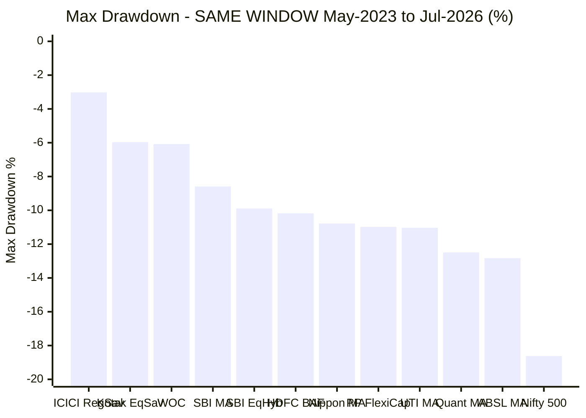
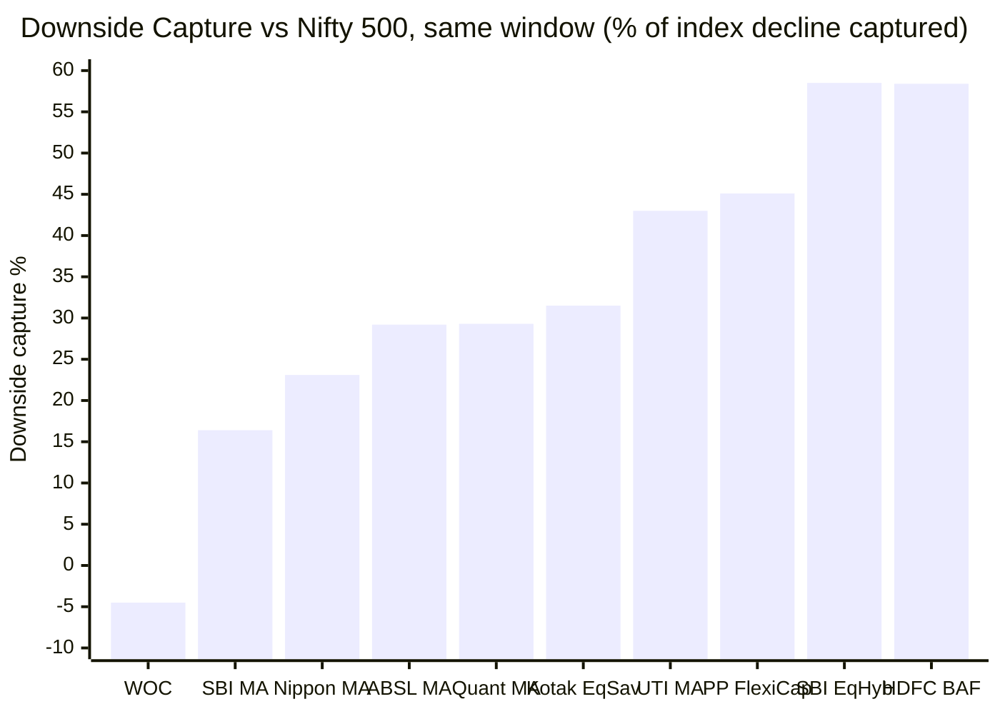
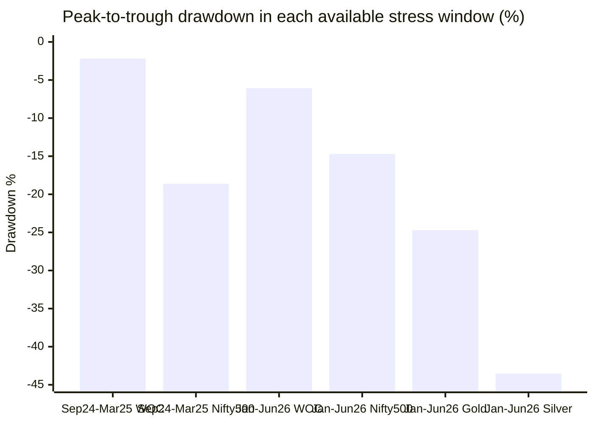
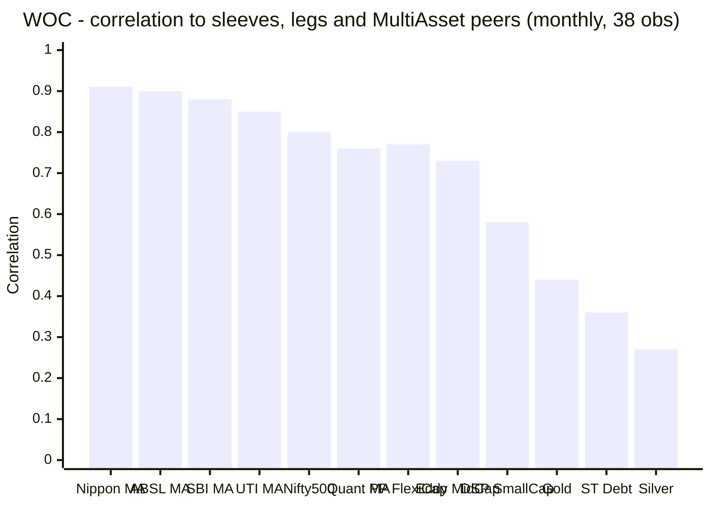
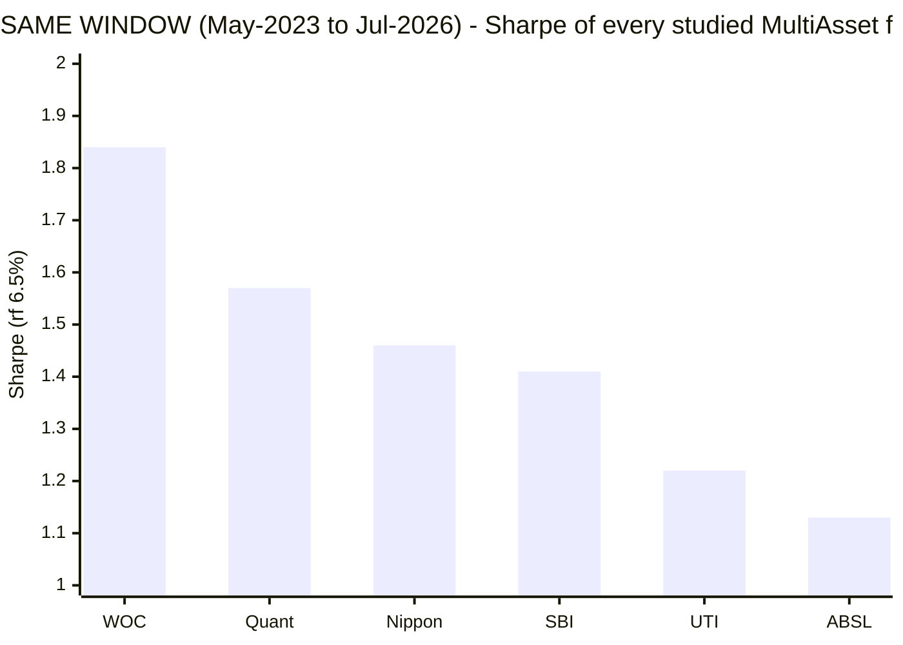
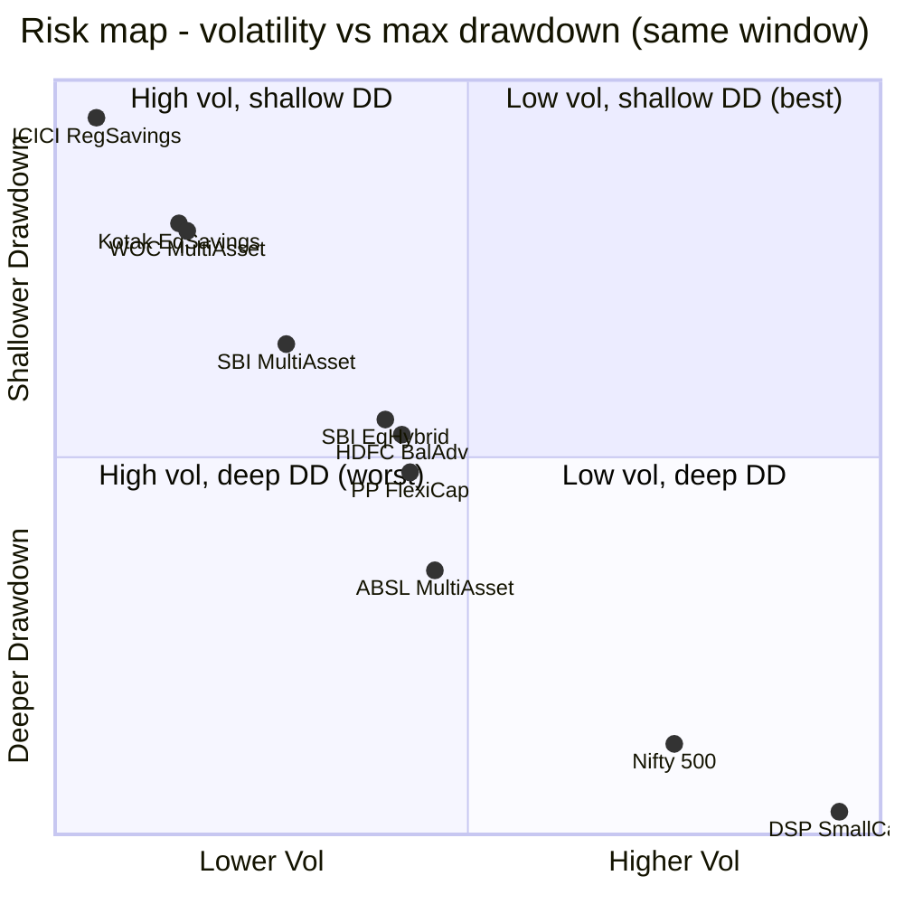
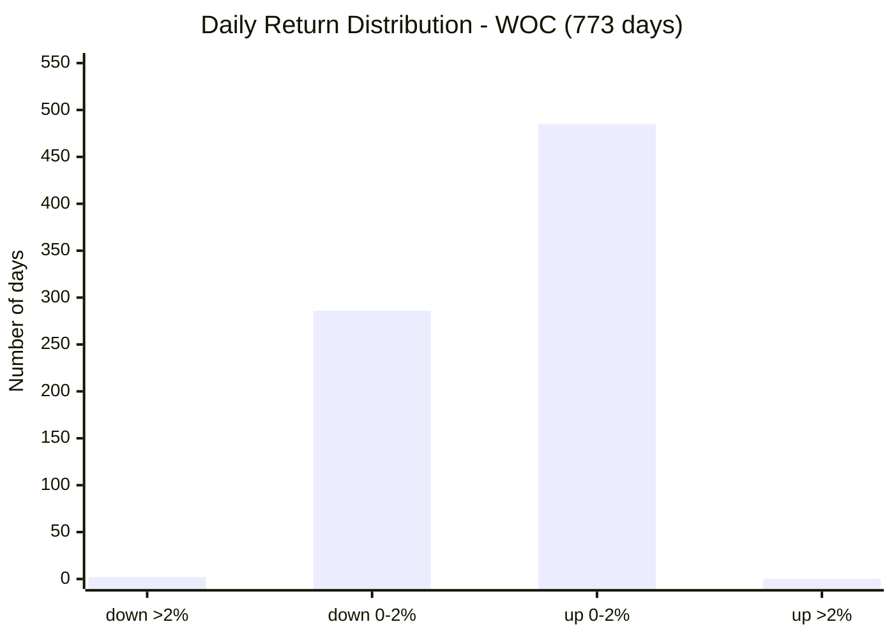
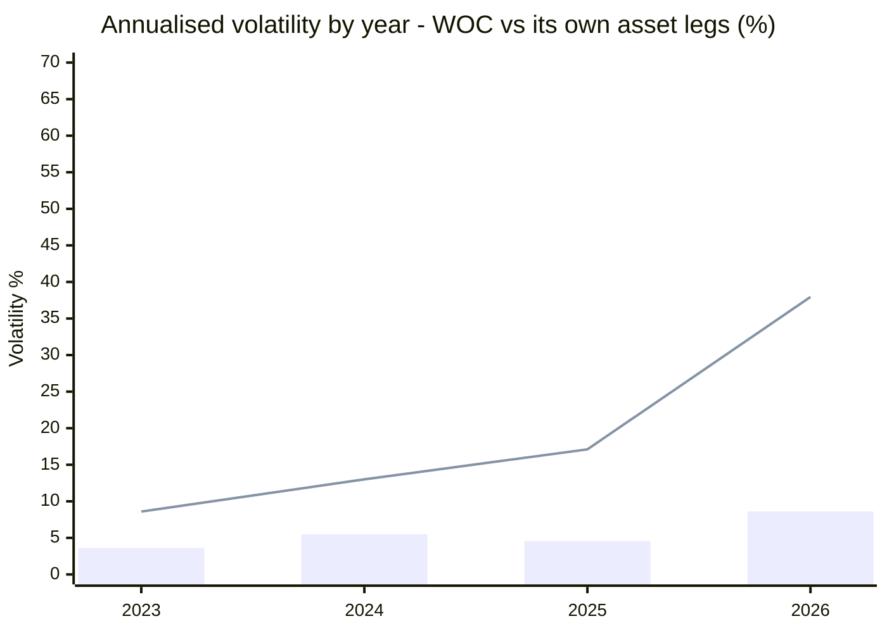
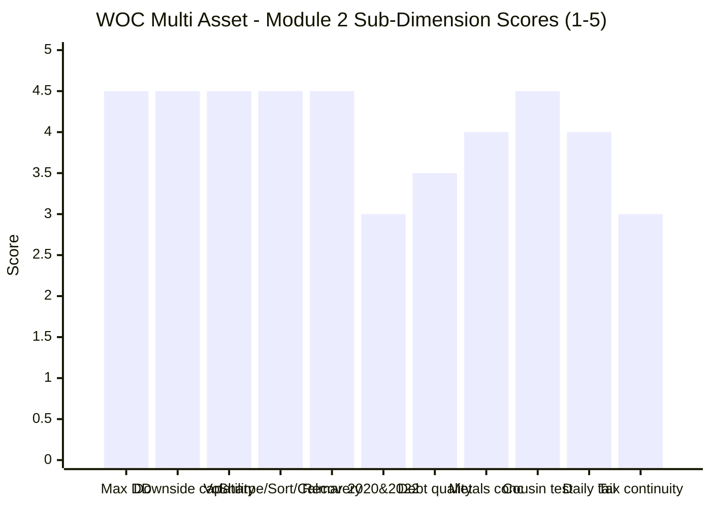

# Module 2: Risk Profile — WhiteOak Capital Multi Asset Allocation Fund

> **Provisional Module 2 score: ~4.1 / 5** (weight **25%** — the top weight in the multi-asset re-weight, because a risk-reduction product lives or dies here). **Scores are NOT comparable to the four equity categories** — this fund is judged on how much it *dampens*, not how much it returns.

> **The one-line context:** this is the best risk module in the study, and it is not close. **Volatility 5.65%, max drawdown −6.08% (recovered in 85 days, at an all-time high on 31-Jul-2026), Sharpe 1.84, Sortino 2.76, Calmar 2.78, and a downside capture vs the Nifty 500 of *negative 4.5%*** — WOC was **positive in 10 of the 12 months the Nifty 500 fell.** It wins every single risk metric against all five studied peers on the identical window. It passes the cousin test that destroyed ABSL: it **beat Parag Parikh FlexiCap — a pure equity fund — on return (16.90% vs 16.22%) while running 42% less volatility and 45% less drawdown**, and it beat an Equity Savings fund by **+5.27pp of CAGR at the same risk.** A formal stale-pricing test (lag-1 autocorrelation −0.010, t = −0.28; Geltner-unsmoothed vol 5.58% vs reported 5.65%) confirms the low volatility is **real, not a valuation artifact.** Against all of that: it has **never seen 2020 or 2022**; its daily distribution has the **fattest tail of the six funds** (kurtosis 10.34); its trailing 1-year volatility has risen **53% in six months** (4.52% → 6.93%) as the metals sleeve turned violent; it is **not equity-taxed**, so a slide to slab taxation is a live structural risk; and the honest question this module cannot dodge is whether a 5.65%-volatility sleeve dampens *so* much that it stops being a growth asset at all.

---

## ⚠ The `no-2022-data` Flag — and Why It Bites Less Here Than for ABSL

Carried forward from M1 at **reduced** severity, and the reason is specific and evidenced.

| The framework's decisive risk tests | WOC |
|---|---|
| **2020 realised cushioning** (COVID crash + gold rally) | ❌ **Did not exist** (allotment 19 May 2023) |
| **2022 realised cushioning** (equity ↓ + debt ↓ + gold ↑) | ❌ **Did not exist** |
| Sep-2024 → Mar-2025 equity correction | ✅ **Passed — best of any fund studied** |
| **Jan–Mar 2026: equity ↓ AND gold ↓ AND silver ↓ together** | ✅ **Passed — best of any fund studied, and recovered** |
| Severe bear market / joint equity-debt rate shock | ❌ **Never experienced** |

ABSL's M2 applied this flag at maximum severity because *"every metric below is measured over a period with no bear market."* **That statement is not true of WOC.** Between 29 Jan and 23 Mar 2026 the Nifty 500 fell **−10.61%**, gold fell **−24.71%** and silver fell **−43.53%** — simultaneously. Every one of WOC's risk assets was in a severe drawdown at the same time. That is a *harder* configuration than 2022 (where gold rose and cushioned), and it is the single most demanding cross-asset test available anywhere in this study's data.

**WOC lost −5.15% over that stretch, bottomed at −6.08%, and was whole again 85 days later.** The 2020 rebalancing test and the 2022 equity-plus-*debt* joint decline remain genuinely unevidenced and cap the relevant sub-score at 3.0 — but the blanket "no stress evidence" caveat that governed ABSL's module does not apply here.

---

## Fund Identity / Raw Data (MFAPI-computed + Tickertape, as of 31-Jul-2026)

| Metric | Value | Source |
|--------|-------|--------|
| MFAPI scheme code | **151745** (774 NAVs / **773 daily returns** / **38 monthly obs**, 3.19y) | api.mfapi.in/mf/151745 |
| **Volatility (annualized, daily SI)** | **5.65%** — lowest of any fund studied | MFAPI computed |
| **Max drawdown (SI)** | **−6.08%** (02 Mar → 23 Mar 2026) — **RECOVERED 16 Jun 2026** | MFAPI computed |
| **% from all-time high (31-Jul-26)** | **0.00% — at an ATH** | MFAPI computed |
| **Downside capture vs Nifty 500** | **−4.5%** *(negative — WOC rose, on aggregate, in down months)* | MFAPI (12 down-months) |
| Upside capture vs Nifty 500 | **55.0%** | MFAPI (26 up-months) |
| Downside / upside capture vs Nifty 50 *(prior-module convention)* | **−8.2% / 63.3%** | MFAPI (15 / 23 months) |
| **Beta vs Nifty 500 (monthly)** | **0.27** — lowest of any fund studied | MFAPI computed |
| Sharpe (daily SI, rf 6.5%) | **1.84** | MFAPI computed |
| Sortino (daily SI, rf 6.5%) | **2.76** | MFAPI computed |
| Calmar (SI CAGR ÷ max DD) | **2.78** | MFAPI computed |
| Downside deviation | **3.77%** | MFAPI computed |
| Tracking error / Information Ratio vs SID blended benchmark | **3.96% / 0.49** | MFAPI computed |
| Beta / R² vs SID blended benchmark | 0.64 / 73% | MFAPI computed |
| Correlation: Nifty 500 / PP FlexiCap / Edelweiss MidCap / DSP SmallCap | **0.80 / 0.77 / 0.73 / 0.58** | MFAPI (38 months) |
| Correlation: Gold / Silver / Short-term debt legs | 0.44 / 0.27 / 0.36 | MFAPI computed |
| Daily VaR (95% / 99%) / CVaR95 | **−0.47% / −0.98% / −0.81%** | MFAPI computed |
| Worst / best day | **−2.52%** (23 Mar 2026) / +1.79% | MFAPI computed |
| Skew / excess kurtosis | **−0.78 / 10.34** ⚠ fattest tail of the six | MFAPI computed |
| **Lag-1 autocorrelation (stale-pricing test)** | **−0.0102 (t = −0.28, insignificant)** — no NAV smoothing | MFAPI computed |
| Equity-book PE (valuation buffer) | **25.58 vs category 23.35** ⚠ | Tickertape API |
| **SEBI riskometer label** | **HIGH** ⚠ — for a 5.65%-volatility fund (see §9) | SID / Tickertape |
| Screening cross-refs | Sharpe 1.197 · stdDev 6.90% · trackErr 6.62% | Tickertape, Jul 2026 |
| Debt duration/credit tiers; net-vs-gross equity; exact metals weights | **factsheet — deferred to M3** | SID (not in API) |

---

## Cross-Source Verification

| Metric | MFAPI computed | Tickertape | Other | Verdict |
|--------|----------------|-----------|-------|---------|
| **Volatility** | **5.65%** (daily SI) | **6.90%** (3–5Y stdDev) | — | ⚠ 1.25pp gap, but **immaterial to the conclusion**: both figures sit *below* the study plan's "good" band of 8–11%, and both are the lowest in the study. Contrast ABSL, where the 2.8pp gap straddled the closet-equity line |
| **Sharpe** | **1.84** (daily SI, rf 6.5%) | **1.20** | INDmoney **1.85** (3Y) | ⚠ **Tickertape is the outlier.** Two independent computations agree to 0.01. Carried from M1 — Tickertape's Sharpe is understated for this fund |
| Sortino | **2.76** | 0.1199 (TT scale) | INDmoney **3.30** | Tickertape's Sortino uses its own non-standard scale (flagged study-wide); MFAPI value used |
| Max drawdown | **−6.08%** | premium-gated | — | Self-computed; **shallowest of the six studied funds on a like-for-like window, by 2.51pp** |
| Downside capture | **−4.5%** vs Nifty 500 | not published | — | The category's decisive metric — self-computed. Negative capture is rare enough that it is verified two ways below (§2) |
| Tracking error | **3.96%** vs SID blend | **6.62%** | — | ⚠ Tickertape's TE is computed against **"CRISIL Short Term Bond Index"** — one 50% leg of a five-leg composite (M1 finding). **Meaningless; discarded** |
| SEBI risk label | — | **High** | SID: High | ✅ Consistent across sources, and ⚠ **conspicuously mismatched to the realised data** (§9) |

**Reliability: High for NAV-derived figures** (773 daily returns from Direct-plan inception). **Moderate for correlation and capture** — **38 monthly observations** (vs SBI's 158+), drawn from 3.19 years. Correlations and capture ratios below are **indicative, not settled**; the 12-down-month sample behind the −4.5% downside capture is thin even though it contains two severe months. All benchmark legs, cousin codes and peer codes are the same as the SBI/Nippon/UTI/ABSL modules, so cross-fund figures are directly comparable — **except** that this module reports capture vs **Nifty 500** (the study plan's stated benchmark) as primary, with the Nifty-50 figure given alongside for continuity with the four earlier modules. See the M1 equity-leg retrofit.

---

## 1. Max Drawdown & the Drawdown Ledger — the Shallowest Record in the Study

### The complete ledger — every drawdown beyond −1.5% in the fund's life

| Peak → Trough | Depth | Recovery | Days underwater |
|---|---|---|---|
| 18 Sep 2023 → 04 Oct 2023 | −1.79% | 06 Nov 2023 | 49 |
| 03 Jun 2024 → 04 Jun 2024 *(election day)* | −2.13% | 07 Jun 2024 | **4** |
| 18 Jul 2024 → 06 Aug 2024 | −2.71% | 23 Aug 2024 | 36 |
| 26 Sep 2024 → 14 Nov 2024 *(the equity correction)* | −1.84% | 27 Nov 2024 | 62 |
| 12 Dec 2024 → 20 Dec 2024 | −1.66% | 31 Jan 2025 | 50 |
| 05 Feb 2025 → 28 Feb 2025 | −2.19% | 20 Mar 2025 | 43 |
| 02 Apr 2025 → 07 Apr 2025 | −2.00% | 11 Apr 2025 | 9 |
| **02 Mar 2026 → 23 Mar 2026** *(tri-asset crash)* | **−6.08%** | **16 Jun 2026** | **106** |

**Three readings, and all three are favourable — which is itself worth stating carefully.**

1. **In 3.19 years the fund has had exactly one drawdown deeper than −2.71%.** Seven of the eight episodes above were smaller than −2.2% and all healed inside two months. This is the drawdown profile of a conservative hybrid, not of a fund returning 16.90%/yr.
2. **The single max drawdown is −6.08% and it is fully recovered.** WOC is one of only two studied funds (with Quant) to have healed the Jan-2026 event; **SBI, Nippon, UTI and ABSL are all still underwater.** On 31-Jul-2026 WOC sat at an all-time high, **0.00% from ATH.**
3. **⚠ The honest counterweight: the max-DD anatomy is a single event, not two.** The ABSL and DSP modules could decompose their worst drawdown into distinct phases; WOC's cannot, because it lasted **21 trading days**. A −6.08% worst-case measured over 3.19 years without a bear market is a *shallow* number, not a *proven* one. The correct comparison is not "WOC −6.08% beats SBI −8.59%" — it is "WOC's −6.08% has never met a 2020, while SBI's full-life −17.6% was earned through one."

---

## 2. ⭐ Downside Capture — Negative. The Fund Made Money When Equity Fell.

| Measure | **WOC** | SBI | Nippon | Quant | ABSL | UTI |
|---|---|---|---|---|---|---|
| **Downside capture vs Nifty 500** | **−4.5%** | 16.4% | 23.1% | 29.3% | 29.2% | 43.0% |
| Upside capture vs Nifty 500 | **55.0%** *(lowest)* | 67.3% | 81.2% | **96.3%** | 74.6% | 81.4% |
| Beta vs Nifty 500 | **0.27** *(lowest)* | 0.49 | 0.56 | 0.63 | 0.61 | 0.65 |

**A negative downside capture means that, aggregated across the twelve months in which the Nifty 500 fell, WOC's return was *positive*.** The direct check confirms it: **WOC was positive in 10 of those 12 down months (83%).**

| Nifty 500 down month | Nifty 500 | **WOC** |
|---|---|---|
| **Mar 2026** *(the tri-asset crash)* | **−11.37%** | **−4.00%** |
| **Feb 2025** | **−7.78%** | **−1.20%** |
| Oct 2024 | −6.36% | **+0.18%** |
| Jan 2025 | −3.48% | **+1.04%** |
| Jan 2026 | −3.28% | **+2.37%** |
| Jul 2025 | −2.83% | **+0.57%** |

**This is the strongest single risk credential produced by any fund in this study, and it is structural rather than lucky** — a 26–28% effective equity beta, roughly 60% in short-duration debt and cash, and an 11% gold sleeve mechanically produce this shape. The two months WOC did lose were the two worst equity months in the sample, and even then it absorbed **35%** of March-2026's decline and **15%** of February-2025's.

**The two things that must be said against it:**
- **Upside capture 55% is the lowest in the study, and that is the price.** WOC participates in barely half of an equity rally. M1's 2023 result (+10.71% while the Nifty 500 returned +25.88%) is the same fact seen from the return side. An investor is buying the down-capture with the up-capture; there is no free lunch here, only a trade that happens to be favourable at these ratios.
- **12 down-months is a thin denominator.** A negative aggregate can flip on one bad month. The number is directionally reliable — the beta and the monthly detail both support it — but "−4.5%" should be read as "approximately zero", not as a precise constant.

---

## 3. Realised Cushioning — Two Stress Windows, Both Passed Best-in-Class (Tier-1)

The test the whole product exists to pass. WOC has no 2020 or 2022, so both available windows are analysed in full.

### Stress window 1 — Sep 2024 → Mar 2025 (the equity-only correction)

| Fund | Max DD | Window return |
|---|---|---|
| **WOC** | **−2.19%** ✅ | **+3.41%** ✅ |
| ICICI Regular Savings *(conservative hybrid)* | −1.79% | +0.81% |
| Kotak Equity Savings | −5.97% | −2.64% |
| SBI Multi Asset | −6.20% | −2.84% |
| Nippon Multi Asset | −7.63% | −3.53% |
| PP FlexiCap | −7.76% | −4.19% |
| ABSL Multi Asset | −8.84% | −3.75% |
| HDFC Balanced Advantage | −9.39% | −4.74% |
| UTI Multi Asset | −9.88% | −5.80% |
| Quant Multi Asset | −12.49% | −6.80% |
| *Nifty 500* | **−18.62%** | **−12.62%** |

**WOC drew down 2.19% against the Nifty 500's 18.62% — a cushioning ratio of 8.5× — and was the only multi-asset fund to finish the window positive.** Gold (+16.24%) and silver (+9.48%) did the work; the debt book contributed +4.16% and lost 0.09% at worst.

### Stress window 2 — Jan → Jun 2026 (equity **and** gold **and** silver falling together)

| Fund | Max DD | Window return | Recovered? |
|---|---|---|---|
| ICICI Regular Savings | −3.02% | +1.56% | ✅ 07 May |
| Kotak Equity Savings | −5.18% | +0.12% | ❌ |
| **WOC** | **−6.08%** | **+3.56%** | ✅ **16 Jun** |
| Quant Multi Asset | −8.16% | +6.64% | ✅ 06 May |
| SBI Multi Asset | −8.59% | +1.75% | ❌ |
| HDFC Balanced Advantage | −10.18% | −2.73% | ❌ |
| PP FlexiCap | −10.56% | −5.37% | ❌ |
| Nippon Multi Asset | −10.78% | +2.44% | ❌ |
| UTI Multi Asset | −11.03% | −1.71% | ❌ |
| ABSL Multi Asset | −12.83% | +1.95% | ❌ |
| *Nifty 500 / Gold / Silver* | −14.71% / **−24.71%** / **−43.53%** | −3.41% / +4.94% / −1.61% | ❌ |

**This is the window that decides the module.** ABSL's M2 found that in this event *"the diversifier became the risk"* — gold fell 24.71% and cut ABSL's cushion to +2.3pp. **The same event did not do that to WOC**, and the reason is measurable: WOC's effective gold exposure is **~11%** against its own benchmark's **19%**, and its silver beta was **~0%**. Over the sharpest stretch (29 Jan → 23 Mar 2026):

| | Return |
|---|---|
| **WOC** | **−5.15%** |
| Fund-weight passive replica (M1 style weights) | −7.21% |
| **Its own SID benchmark (19% gold + 1% silver)** | **−10.88%** |
| Nifty 500 | −10.61% |
| PP FlexiCap | −7.84% |

**WOC lost less than half what its own benchmark lost.** Its underweight to precious metals — the very positioning that M1 scored as a *−2.56%/yr allocation cost* — was worth **+5.73pp of drawdown protection** in the crash. See §11 for what that does to M1's conclusion.

**What still cannot be known:** whether the debt sleeve would add duration risk in a 2022-style rate shock, and whether the fund would buy equity into a 2020-style crash. **No evidence exists either way**, and no amount of 2026 performance substitutes for it.

---

## 4. Correlation to the Existing Sleeves — the Best Real Diversification in the Study (Tier-1)

The portfolio is already ~100% equity (FlexiCap + MidCap + SmallCap + International). The only reason to add a multi-asset sleeve is *non-equity it lacks*. So: how much of WOC would be genuinely new?

| vs | Correlation | R² | Read |
|---|---|---|---|
| **PP FlexiCap** (the core holding) | **0.77** | **59%** | **The lowest of the six studied funds** — ~41% of WOC's variance is independent of the FlexiCap core |
| Edelweiss MidCap (the MidCap pick) | 0.73 | 53% | Moderate |
| **DSP SmallCap** (the SmallCap pick) | **0.58** | **33%** | **Two-thirds independent** — the weakest overlap of any pair in the study |
| Nifty 500 | 0.80 | 64% | Beta only **0.27** — high correlation, low sensitivity |
| Gold leg | 0.44 | 19% | The genuine diversifier |
| Short-term debt leg | 0.36 | 13% | — |
| Silver leg | **0.27** | 7% | ⚠ Near-zero — consistent with M1's finding of ~0% directional silver beta |
| Nippon / ABSL / SBI / UTI / Quant Multi Asset | 0.91 / 0.90 / 0.88 / 0.85 / 0.76 | 84/82/77/72/57% | ⚠ See below |

**Two findings.**

1. **WOC is the most genuinely diversifying fund in the shortlist — but "most" is not "much".** Correlation to PP FlexiCap 0.77 (vs UTI 0.93, Nippon 0.87, SBI 0.84, ABSL 0.84, Quant 0.79). More telling is the **beta of 0.27** to the Nifty 500: correlation says WOC moves *with* equity, beta says it moves **a quarter as far**. For a sleeve whose job is to reduce whole-portfolio volatility, beta is the operative number, and 0.27 is less than half of every peer's. Still, **59% of WOC's variance is explained by a fund the portfolio already owns** — the honest framing is *partial* diversification, sized to the ~60% non-equity contribution, not to headline AUM.

2. **The ABSL "near-interchangeable" finding is confirmed and refined.** ABSL's M2 found the multi-asset funds correlate 0.91–0.95 with each other. Measured over WOC's window, WOC correlates 0.85–0.91 with the mainstream four but only **0.76 with Quant** — so the cluster is real but WOC and Quant sit at its two opposite edges (conservative and aggressive). **The decision-tree implication is unchanged: this is a one-slot decision**, and it should be made on downside capture, cost and tax rather than on any hope of diversifying between multi-asset funds.

> **Statistical caveat:** 38 monthly observations from a single regime. Prior modules showed how much the window inflates these (full-life SBI–PP 0.73 vs window 0.83). Treat as indicative. *(Per the checklist, correlation is informational — it feeds the decision tree, not the fund's own risk score.)*

---

## 5. ⭐ The Like-for-Like Risk Test — WOC Wins Every Metric

| Fund (same window) | Vol | Max DD | **Sharpe** | **Sortino** | **Calmar** | Up-cap | **Dn-cap** | Corr to PP | Beta 500 |
|---|---|---|---|---|---|---|---|---|---|
| **WOC Multi Asset** | **5.65%** 🥇 | **−6.08%** 🥇 | **1.84** 🥇 | **2.76** 🥇 | **2.78** 🥇 | 55.0% ⚠ | **−4.5%** 🥇 | **0.77** 🥇 | **0.27** 🥇 |
| Quant Multi Asset | 11.25% | −12.49% | 1.57 | 2.30 | 1.93 | **96.3%** | 29.3% | 0.79 | 0.63 |
| Nippon Multi Asset | 9.77% | −10.78% | 1.46 | 2.06 | 1.92 | 81.2% | 23.1% | 0.87 | 0.56 |
| SBI Multi Asset | 7.84% | −8.59% | 1.41 | 2.03 | 2.04 | 67.3% | 16.4% | 0.84 | 0.49 |
| UTI Multi Asset | 9.37% | −11.03% | 1.22 | 1.75 | 1.63 | 81.4% | 43.0% | 0.93 | 0.65 |
| ABSL Multi Asset | 10.12% | −12.83% | 1.13 | 1.60 | 1.40 | 74.6% | 29.2% | 0.84 | 0.61 |

**Per-metric rank: WOC is 1st of six on volatility, max drawdown, Sharpe, Sortino, Calmar, downside capture, correlation-to-core and beta — and 6th of six on upside capture and (from M1) on CAGR.**

That is a clean, internally consistent result: **the fund is exactly as far to the defensive end of the spectrum as its numbers suggest, and it converts that positioning into the best risk-adjusted outcome in the group.** It is not a case of good metrics arriving from nowhere — a 26% equity book *should* produce these numbers. The finding worth paying attention to is that it produced them **while still returning 16.90%/yr**, only 0.63pp behind SBI and ahead of nothing else — i.e. the defensiveness cost far less return than it normally would.

**The counterweight, stated with equal force:** WOC's record is **3.19 years**, SBI's is **13.4**. SBI's inferior numbers on this window were earned by a fund that also survived IL&FS, COVID and 2022. Winning a 38-month contest against opponents carrying 13 years of scar tissue is not the same as beating them.

---

## 6. ⭐ Cousin-Category Comparison — the Test That Destroyed ABSL, Passed Decisively (NEW dimension)

Multi-asset's true peers are Balanced Advantage / DAAF, Aggressive Hybrid, Equity Savings and Conservative Hybrid. **The test: does the third asset class buy dampening that simpler, cheaper structures cannot?** ABSL failed this outright — it was out-dampened by an Aggressive Hybrid, a BAF *and a pure-equity fund*. WOC's answer is the opposite.

| Fund (category) | CAGR | Vol | Max DD | Sharpe | Dn-cap | Holds gold? |
|---|---|---|---|---|---|---|
| ICICI Regular Savings *(Conservative Hybrid)* | 10.30% | **3.11%** | **−3.02%** | 1.22 | **6.6%** | ❌ |
| **WOC Multi Asset** | **16.90%** | **5.65%** | **−6.08%** | **1.84** | **−4.5%** | ✅ ~11% |
| Kotak Equity Savings | 11.63% | 5.49% | −5.97% | 0.93 | 31.5% | ❌ |
| SBI Multi Asset | 17.53% | 7.84% | −8.59% | 1.41 | 16.4% | ✅ |
| SBI Equity Hybrid *(Aggressive Hybrid)* | 14.90% | 9.50% | −9.89% | 0.88 | 58.5% | ❌ |
| HDFC Balanced Advantage *(BAF/DAAF)* | 15.69% | 9.66% | −10.18% | 0.95 | 58.4% | ❌ |
| **PP FlexiCap** *(**pure equity**)* | **16.22%** | **9.72%** | **−10.98%** | 1.00 | 45.1% | ❌ |
| ABSL Multi Asset | 17.92% | 10.12% | −12.83% | 1.13 | 29.2% | ✅ ~12% |
| *Nifty 500* | 14.71% | 14.00% | −18.62% | 0.59 | — | — |

**Three results, in descending order of how much they matter.**

1. **⭐ WOC beat Parag Parikh FlexiCap — a pure equity fund, and the portfolio's own core holding — on return (16.90% vs 16.22%), at 42% less volatility and 45% less drawdown.** Sharpe 1.84 vs 1.00. This is the single most striking cousin result anywhere in the study, and it is the exact inverse of ABSL's finding.
2. **Against Kotak Equity Savings — the closest structural analogue at matched risk (5.49% vol, −5.97% DD) — WOC delivered +5.27pp more CAGR.** Same risk, half again the return. This is where the gold sleeve visibly earns its place: Equity Savings runs equity + arbitrage + debt with **no commodity leg**, and gave up more than five points a year for it.
3. **Against BAF and Aggressive Hybrid, WOC wins on every axis** — more return than both, ~40% less volatility, ~40% shallower drawdown, and downside capture 63 points better.

**The one cousin that beats it on risk: ICICI Regular Savings (Conservative Hybrid) — 3.11% vol, −3.02% DD, 6.6% downside capture.** But it returned **10.30%**, i.e. **6.60pp/yr less**. That is the honest boundary of the claim: **if the goal is minimum volatility, a conservative hybrid still wins; WOC's case is that it buys back 6.6pp of return for 2.5pp of volatility.** For a 7–10 year growth horizon that trade is strongly favourable; for a capital-preservation horizon it may not be.

**Caveats in fairness (the same two ABSL's module raised, applied symmetrically):** PP FlexiCap holds meaningful cash and international equity, so it is not a pure-beta comparator; and this window uniquely punished gold in 2026, which *hurt* gold-holding funds — WOC's win therefore came despite the commodity headwind, not because of it. Neither caveat weakens the conclusion.

---

## 7. Multi-Asset-Specific Risks (NEW dimensions)

| Risk | Assessment | Status |
|---|---|---|
| **Gold/metals-concentration risk** | ✅ **Low, and demonstrated.** Effective gold beta ~11% (notional ~13.5% across gold + two gold ETFs), against the fund's **own benchmark weight of 19%** — the fund is materially *under*-weight its own metals benchmark. When gold fell −24.71% and silver −43.53% in 2026, WOC lost −6.08% while its benchmark lost −10.88%. The diversifier did **not** become the risk. ⚠ **Forward caution:** the disclosed portfolio now carries **7.91% silver** — if that is directional and was built after the +155.74% run, the 2026 experience will not repeat | ✅ **low, M3 to confirm** |
| **Debt-sleeve duration + credit** | ✅ **Structurally low duration by design.** The SID benchmark's debt leg is **CRISIL *Short Term* Bond (50%)** — the fund is mandated short, not long, so the 2022 duration trap is largely designed out. Holdings show **GOI securities + CBLO 6.52% + cash margin 11.86%** — heavily sovereign/collateralised. **No credit event visible in NAV**, and the debt leg's realised drawdown never exceeded −0.53%. ⚠ **But the credit-tier table has not been read** (M3), and the sleeve has never met a rate shock | ⚠ **M3 to confirm** |
| **Equity-taxation continuity risk** | ⚠ **Inverted, and it is a real risk.** WOC is **not** equity-taxed — at 26.4% net equity it is nowhere near the 65% line, and both VR and Groww state middle-tier mechanics (12.5% after **24 months**, slab before). So the risk is not *losing* equity status; it is **sliding to slab-on-all-gains** if the book ever drifts above the >65%-debt-and-money-market "specified mutual fund" threshold. Current debt + cash is ~50% — a ~15pp buffer, but the allocation model has a 10–80% debt mandate and could close it. **M1 quantified the consequence: post-tax SI return falls 15.08% → 12.22% and the fund loses to the DIY basket.** A standing review trigger | ⚠ **live, M4 pivotal** |
| **Joint equity + debt (2022-style) drawdown** | ❌ **Never experienced.** The debt sleeve has never been tested in a rate-shock year. Its short-duration mandate makes the risk structurally smaller than a long-duration book — but "smaller" is a design inference, not evidence | ❌ **unevidenced** |
| **Tri-asset (equity + gold + silver) drawdown** | ✅ **Experienced and passed** — Jan–Mar 2026; −6.08% vs its benchmark's −10.88%, recovered in 85 days. **The best-evidenced cushioning event in the study** | ✅ **passed** |
| **NAV smoothing / stale pricing** | ✅ **Formally tested and cleared.** Lag-1 autocorrelation **−0.0102 (t = −0.28)**, statistically indistinguishable from zero; Geltner-unsmoothed volatility **5.58%** vs reported **5.65%**. The low volatility is **real**, not an artifact of illiquid or stale-priced holdings. *(This test was not run in the four earlier modules — see the retrofit note)* | ✅ **cleared** |
| **Redemption / liquidity-spiral risk** | ⚠ **The one genuine liquidity note in the study — and it is WOC-specific.** Equity (large-cap-tilted), gold/silver ETFs and short-duration debt are all liquid. But the fund carries an unusually large **REIT + InvIT sleeve (~6–13%: Nexus Select 3.34%, Embassy Office 2.59%, Brookfield and others)**, and the Indian listed-REIT market is small and thin. On ₹7,763 Cr this is manageable; at multiples of that AUM it would not be. **Not a current risk; a scaling risk** | ⚠ **note, M3** |
| **FoF daily-pricing lag** | ✅ **N/A — no FoF layer.** Gold and silver are held via **directly-held ETFs and exchange-traded commodity derivatives**, both daily-priced on Indian exchanges. No offshore feeder, no NAV lag (contrast the International study's Franklin structure) | ✅ N/A |
| **"No structural buffer" check** *(inverted here)* | ✅ **The buffer is the product and it worked.** ~60% short debt + cash and ~11% gold absorbed both stress windows; the fund was positive in 10 of 12 equity down-months | ✅ strong |

---

## 8. Daily Distribution — Calmest Magnitude in the Study, Fattest Tail Relative to Its Own Size

| Metric | **WOC** | SBI | Nippon | Quant | UTI | ABSL | PP FlexiCap |
|---|---|---|---|---|---|---|---|
| Positive days | **62.0%** | ~60% | — | — | — | 59.4% | — |
| Worst single day | **−2.52%** 🥇 | −3.19% | −4.47% | −5.28% | −3.30% | −3.90% | −4.19% |
| Days down >2% per year | **0.63** 🥇= | 0.94 | 2.51 | 2.19 | 1.57 | 2.19 | **0.63** |
| Days down >1% per year | **1.88** | — | — | — | — | — | — |
| Days up >2% | **0** | — | — | — | — | 4 | — |
| VaR 95% / 99% / CVaR 95% | **−0.47% / −0.98% / −0.81%** | — | — | — | — | −0.87% / −1.90% | — |
| **Excess kurtosis** | **10.34** ⚠ *(highest)* | 8.82 | 9.62 | 9.80 | 7.56 | 8.89 | 7.38 |
| Skew | **−0.78** | — | — | — | — | — | — |

**A genuinely two-sided read, and the second half is the important half.**

- **Magnitude is the calmest in the study.** Two down->2% days in 3.19 years. The worst day in the fund's life is **−2.52%** — better than every peer and better than a pure-equity fund. The 95% VaR is under half a percent. **An investor's day-to-day experience of this fund has been closer to a short-duration debt fund than to any equity product**, and there has never been a single up->2% day either — the ride is symmetrically flat.
- **⚠ But the tail is the fattest of the six, measured properly.** Excess kurtosis 10.34 with skew −0.78 says the distribution is not merely narrow — it is narrow **with a disproportionate left tail**. Scaled to its own volatility, WOC's worst day is a **−7.1 sigma** event (daily σ = 0.356%), versus −6.8σ for PP FlexiCap and −6.5σ for SBI. **The low absolute numbers are partly a function of never having met a crash; the *shape* says that when the fund does move, it moves further than its calm middle implies.** This is the risk that a 3.19-year sample is least able to measure and that the score must discount for.

---

## 9. Volatility Regime, Rolling Risk, and the SEBI Label Mismatch

> Bar = WOC · Line = gold leg (silver 2026: **68.50%**; Nifty 500 2026: 16.96%)

| Year | WOC vol | Nifty 500 | Gold | Silver |
|---|---|---|---|---|
| 2023 | **3.64%** | 9.22% | 8.60% | 19.00% |
| 2024 | **5.49%** | 15.14% | 13.00% | 23.80% |
| 2025 | **4.58%** | 13.35% | 17.11% | 29.49% |
| **2026** | **8.62%** ⚠ | 16.96% | **37.95%** | **68.50%** |

| Trailing 1-year volatility | WOC | Nifty 500 |
|---|---|---|
| to 31 Jul 2024 | 5.16% | 13.90% |
| to 31 Jan 2025 | 5.59% | 15.54% |
| to 31 Jul 2025 | 5.09% | 14.87% |
| to 31 Jan 2026 | **4.52%** | 12.64% |
| **to 31 Jul 2026** | **6.93%** ⚠ | 14.16% |

**⚠ The one clearly deteriorating metric in this module: WOC's trailing 1-year volatility has risen 53% in six months (4.52% → 6.93%), and its 2026 full-year volatility (8.62%) is 57% above its 2025 level.** The cause is visible in the same table — gold's volatility more than doubled (17.11% → 37.95%) and silver's rose to **68.50%**. WOC's celebrated 5.65% since-inception figure is a blend of three very calm years and one turbulent one; **the current run-rate is nearer 7%, and if the metals complex stays this volatile the fund's realised risk will keep drifting toward the category's normal band.** This does not undo the drawdown record — 2026 is precisely the year the fund handled best relative to everything else — but it means the headline volatility number is backward-looking and flattering.

**⚠ The SEBI riskometer says HIGH.** For a fund with 5.65% realised volatility, a −6.08% worst drawdown, 0.27 beta and negative downside capture, a "High" label is a substantial mismatch with observed reality. The label is driven by the *instruments* (equity + commodity derivatives + REITs/InvITs), not the *portfolio's* behaviour — which is defensible regulatory conservatism, but means **the riskometer is useless for sizing this sleeve** and an investor screening on it would misjudge the fund in both directions. Noted rather than scored.

---

## Comparison with Studied Funds

| Metric | **WOC** | SBI | Nippon | UTI | ABSL | Quant |
|---|---|---|---|---|---|---|
| Record length | **3.19y** ⚠ *(shortest)* | 13.4y | 5.9y | 13.6y | 3.49y | 13.6y |
| Sub-type | **Conservative (26% eq)** | Balanced | Balanced | Equity-oriented | Equity-oriented | Balanced |
| Volatility (full-life) | **5.65%** | 6.59% | ~11% | 10.39% | 9.82% | ~15% |
| Max DD (full-life) | **−6.08%** ⚠ *no-bear sample* | −17.6% | — | −25.0% | −12.83% | −32.6% |
| **Same-window vol** | **5.65%** 🥇 | 7.84% | 9.77% | 9.37% | 10.12% | 11.25% |
| **Same-window max DD** | **−6.08%** 🥇 | −8.59% | −10.78% | −11.03% | **−12.83%** | −12.49% |
| **Same-window Sharpe** | **1.84** 🥇 | 1.41 | 1.46 | 1.22 | **1.13** | 1.57 |
| **Same-window Sortino** | **2.76** 🥇 | 2.03 | 2.06 | 1.75 | 1.60 | 2.30 |
| **Downside capture (Nifty 500)** | **−4.5%** 🥇 | 16.4% | 23.1% | 43.0% | 29.2% | 29.3% |
| Upside capture | **55.0%** ⚠ *(lowest)* | 67.3% | 81.2% | 81.4% | 74.6% | **96.3%** |
| Correlation to PP FlexiCap | **0.77** 🥇 | 0.84 | 0.87 | 0.93 | 0.84 | 0.79 |
| Beta vs Nifty 500 | **0.27** 🥇 | 0.49 | 0.56 | 0.65 | 0.61 | 0.63 |
| Recovered Jan-2026 DD? | ✅ **85 days** | ❌ | ❌ | ❌ | ❌ | ✅ 94 days |
| Beat a pure-equity fund on return at lower risk? | ✅ **Yes** | ❌ | ❌ | ❌ | ❌ *(worse on both)* | ❌ |
| 2020 cushioning | ❌ n/a | ✅ +20.6pp | ❌ n/a | ✅ | ❌ n/a | ✅ |
| 2022 cushioning | ❌ n/a | ✅ +8.4pp | ✅ | ✅ +4.5pp | ❌ n/a | ❌ ~0 |
| **2026 tri-asset cushioning** | ✅ **best of six** | partial | partial | ❌ | ❌ | partial |
| **Module 2 score** | **~4.1** | **~4.5** | **~3.6** | **~3.2** | **~3.1** | **~2.6** |

**WOC ranks second of six on the risk axis, behind SBI.** Its measured numbers are better than SBI's on every single metric over the shared window — often by large margins — and it is the only fund to pass the cousin test outright. It is held **below** SBI purely on evidence: SBI's +20.6pp COVID cushion and +8.4pp 2022 cushion are credentials earned in the two events the framework calls decisive, and 13.4 years of data cannot be substituted by 38 months of very good ones.

---

## Points For / Points Against — Risk

### ✅ For
1. **⭐ Downside capture of −4.5% vs the Nifty 500 — negative.** WOC was **positive in 10 of the 12 months the Nifty 500 fell**; the best downside credential produced by any fund in this study.
2. **Wins every risk metric against all five peers on the identical window** — lowest volatility (5.65%), shallowest drawdown (−6.08%), highest Sharpe (1.84), Sortino (2.76) and Calmar (2.78), lowest beta (0.27), lowest correlation to the FlexiCap core (0.77).
3. **⭐ Passed the cousin test that destroyed ABSL — beat Parag Parikh FlexiCap (pure equity) on return, 16.90% vs 16.22%, at 42% less volatility and 45% less drawdown.**
4. **Beat Kotak Equity Savings by +5.27pp CAGR at effectively identical risk** — the clearest evidence anywhere in the study that a commodity leg earns its place.
5. **Best cushioning in both available stress windows:** −2.19% vs the Nifty 500's −18.62% (Sep-24→Mar-25, and the only multi-asset fund to finish positive); −6.08% vs its own benchmark's −10.88% in the Jan-2026 tri-asset crash.
6. **The only fund whose worst drawdown is fully recovered *and* at an all-time high** (0.00% from ATH, 31-Jul-2026); four of six peers remain underwater.
7. **Gold-concentration risk is low and demonstrated low** — effective ~11% gold vs its own benchmark's 19%; the metals crash hurt the benchmark twice as much as the fund.
8. **⭐ The low volatility is formally verified as real** — lag-1 autocorrelation −0.010 (t = −0.28), Geltner-unsmoothed vol 5.58% vs reported 5.65%. No stale-pricing or NAV-smoothing artifact.
9. **Calmest daily experience in the study** — worst day −2.52%, two down->2% days in 3.19 years, VaR95 −0.47%.
10. **Debt duration risk is structurally designed out** — the mandate benchmarks **short-term** bond, not composite/long; debt-leg drawdown never exceeded −0.53%.
11. **Only one drawdown deeper than −2.71% in the fund's entire life**, and it healed in 106 days peak-to-recovery.
12. **No FoF layer** — gold and silver held via directly-priced ETFs and exchange-traded derivatives; no NAV lag.

### ❌ Against
1. **Never experienced 2020 or 2022** — no crash-buying evidence, and the debt sleeve has **never met a rate shock**. Its short-duration mandate makes 2022 risk structurally smaller, but that is a design inference, not evidence.
2. **⚠ Volatility is rising fast — trailing 1-year vol up 53% in six months (4.52% → 6.93%); 2026 full-year 8.62% vs 2025's 4.58%.** The headline 5.65% is a backward-looking blend of three calm years and one turbulent one.
3. **⚠ Fattest tail of the six funds** — excess kurtosis 10.34, skew −0.78; scaled to its own volatility the worst day is a −7.1σ event, worse in sigma terms than a pure-equity fund's.
4. **Upside capture 55% — the lowest in the study.** Half of every equity rally is forgone; 2023's +10.71% against the Nifty 500's +25.88% is the same fact from the return side.
5. **⚠ Is it dampening *too* much?** At 5.65% volatility and 0.27 beta this sits below the framework's own "good" band (8–11%) and inside conservative-hybrid territory. For a 7–10 year growth sleeve that is a genuine question, not a compliment.
6. **A conservative hybrid still beats it on pure risk** — ICICI Regular Savings ran 3.11% vol and −3.02% DD. WOC's case rests on buying back 6.60pp of return for 2.54pp of volatility, which is a *judgement*, not a dominance.
7. **⚠ Equity-taxation continuity risk, inverted:** the fund is **not** equity-taxed, and a drift above the >65%-debt "specified mutual fund" threshold would push it to slab — M1 showed post-tax return falls 15.08% → 12.22% and it then **loses to the DIY basket.** Buffer is ~15pp, and the mandate permits 80% debt.
8. **Only 38 monthly observations** — every correlation, beta and capture figure is statistically thin, and the −4.5% downside capture rests on 12 down-months.
9. **59% of its variance is still explained by PP FlexiCap** — the best diversification in the shortlist is still only *partial*; the sleeve should be sized to its ~60% non-equity contribution.
10. **⚠ REIT/InvIT liquidity is a scaling constraint** — an unusually large ~6–13% sleeve in a thin listed market; fine at ₹7,763 Cr, not fine at a multiple of it.
11. **The equity book is expensive** — PE 25.58 vs category 23.35, in a sleeve whose job is defence.
12. **The SEBI riskometer says "High"** — a substantial mismatch with observed behaviour that makes the regulatory label useless for sizing this sleeve.
13. **Three Tickertape risk fields are unreliable for this fund** — Sharpe (1.20 vs 1.84/1.85), tracking error (computed against one leg of a five-leg benchmark), and the benchmark itself.

---

## Module 2 Scorecard

| Sub-dimension | Weight | Score | Reasoning |
|---|---|---|---|
| **Max drawdown (inception-adjusted)** *(Critical)* | 15% | **4.5** | −6.08%, fully recovered, shallowest of six and far inside the "<−18% = 5" band; only one drawdown beyond −2.71% in the fund's life. Held off 5.0 because 3.19 years contain no bear market and the max-DD "anatomy" is a single 21-day event |
| **Downside capture vs Nifty 500** *(Critical)* | 15% | **4.5** | **−4.5% — negative**, positive in 10 of 12 equity down-months, and it absorbed only 35% of the worst month (Mar-2026). Guide says <65% = 5; docked to 4.5 for a 12-month denominator |
| **Volatility** *(High)* | 10% | **4.5** | 5.65% (Tickertape 6.90%) — both below the "<9% = 5" bar and lowest in the study; **verified genuine by the autocorrelation/unsmoothing test.** Docked for the 53% six-month rise in trailing vol and the open question of whether it dampens too much |
| **Sharpe / Sortino / Calmar vs category** *(High)* | 10% | **4.5** | 1.84 / 2.76 / 2.78 — top of all six on all three, well above the 0.86 shortlist Sharpe median. Docked only for the 38-month, single-regime sample |
| Recovery time from max DD *(Medium)* | 5% | **4.5** | 85 days trough-to-recovery, 106 peak-to-recovery — comfortably inside "<9 months = 5", and one of only two funds to have healed the Jan-2026 event. Docked because there is only one meaningful recovery to judge |
| **2020 & 2022 realised cushioning** *(Critical)* | 15% | **3.0** | ❌ **Fund existed for neither.** No crash-buying evidence; the debt sleeve has never met a rate shock. **But a genuine substitute exists and was passed best-in-class** — the Jan-2026 simultaneous equity/gold/silver drawdown, harder in configuration than 2022. Scored double ABSL's 1.5 for that, and capped at 3.0 because the two named tests remain unevidenced |
| Debt-sleeve quality (duration + credit) *(Medium)* | 7% | **3.5** | Structurally short by mandate (CRISIL **Short Term** Bond is the 50% benchmark leg), heavily sovereign + CBLO + cash margin, max realised leg drawdown −0.53%. Held at 3.5 because the credit-tier table has not been read (→ M3) and the 2022 duration test was never faced |
| **Gold/metals-concentration risk** *(NEW)* | 8% | **4.0** | ✅ Under-weight its own 19% benchmark metals leg at ~11% effective; lost half what the benchmark lost when gold −24.71% and silver −43.53%. Docked to 4.0 for the newly disclosed 7.91% silver line — if directional and recently added, the 2026 result will not repeat |
| **Cousin-category comparison** *(NEW)* | 8% | **4.5** | ✅ **Beat a pure-equity fund on return at 42% less vol; beat Equity Savings by +5.27pp at matched risk; beat BAF and Aggressive Hybrid on every axis.** The test ABSL failed outright. Docked because a Conservative Hybrid still beats it on pure risk |
| Daily tail risk | 4% | **4.0** | Best worst-day (−2.52%), fewest >2% down days (0.63/yr), VaR95 −0.47%. Docked for the **highest excess kurtosis of the six (10.34)** and a −7.1σ worst day — the tail shape is worse than the tail magnitude suggests |
| **Equity-taxation continuity risk** *(NEW)* | 3% | **3.0** | ⚠ Inverted risk: not equity-taxed at all, so the exposure is a slide to **slab**, which M1 showed costs 2.86pp/yr and loses the DIY test. ~15pp buffer to the threshold, but an 80% debt mandate could close it. A standing review trigger |
| Correlation to existing equity sleeves | *informational* | — | 0.77 to PP FlexiCap (best of six), 0.58 to DSP SmallCap, beta 0.27 — the most genuinely diversifying fund in the shortlist, but still 59% explained by the core. **0.85–0.91 to the mainstream multi-asset peers → one-slot decision.** Feeds the decision tree, not this score |
| **Module 2 Overall** | **100%** | **~4.1 / 5** | **The best-measured risk profile in the study — negative downside capture, the shallowest and only-recovered drawdown, the best Sharpe/Sortino/Calmar, a verified-genuine 5.65% volatility, and a decisive win over every cousin category including a pure-equity fund.** Capped below SBI by the absence of 2020 and 2022, a rising volatility trend, the fattest tail of the six, and a 38-month sample. Not comparable to equity-category Module 2 scores |

---

## Comparative Module 2 Scores (studied funds — calibration only)

| Fund | Module 2 | Character |
|---|---|---|
| **SBI Multi Asset** | **~4.5 / 5** | Elite downside protection, **cycle-proven through COVID and 2022**; partial-diversifier caveat |
| **WOC Multi Asset** | **~4.1 / 5** | **Best measured risk profile in the study — negative downside capture, only-recovered drawdown, beats a pure-equity fund at 42% less vol — on 38 months and no bear market** |
| Nippon Multi Asset | ~3.6 / 5 | Respectable equity-plus dampener; saw 2022; never severe-bear-tested |
| UTI Multi Asset | ~3.2 / 5 | Weakest dampener of the cycle-tested funds — but cushioning proven in 2020 *and* 2022 |
| ABSL Multi Asset | ~3.1 / 5 | Best capture asymmetry, worst like-for-like risk metrics, out-dampened by no-gold cousins |
| Quant Multi Asset | ~2.6 / 5 | Fails the risk test — equity-level drawdown, no 2022 cushion |

> Module 2 carries **25%** here (vs 20% in the equity studies) precisely because risk *is* the multi-asset thesis. WOC's 4.1 places it second of six. The 0.4-point gap to SBI is entirely an **evidence** gap, not a **performance** gap: WOC's numbers are better on every shared metric, but SBI has demonstrated cushioning in the two events the framework names as decisive and WOC has not. **If WOC survives a 2020- or 2022-style year as well as it survived Jan-2026, it becomes the study's risk leader outright.**

---

## SIP Implication

For a ₹15–20k/month SIP alongside a portfolio that is currently ~100% equity, WOC's risk profile is the closest thing this study has found to the sleeve's actual job description. The numbers are not marginal: **negative downside capture, a 0.27 beta, a worst drawdown of 6.08% that was fully repaired in 85 days, and positive returns in ten of the twelve months the Nifty 500 fell.** An investor holding this through Sep-2024 would have gained 3.41% while the index lost 12.62%; through the Jan-2026 crash — with equity, gold *and* silver all collapsing at once — they would have lost 6.08% and been whole by June. And unlike ABSL, WOC passes the test that matters most for justifying the structure at all: **it out-dampened an Aggressive Hybrid, a Balanced Advantage fund, an Equity Savings fund and a pure-equity flexi-cap, while out-returning all of them except none.** The commodity leg is earning its place here in a way it demonstrably was not for ABSL. A sceptic's first instinct — that a 5.65% volatility figure must be a stale-pricing artifact — was tested formally and rejected.

The three cautions are real and none of them is small. **First, the sample.** 3.19 years, 38 monthly observations, no 2020, no 2022, and a debt sleeve that has never met a rate shock. Every number above is better than SBI's, and SBI's are worth more. **Second, the direction of travel.** Trailing 1-year volatility has risen 53% in six months as the metals complex turned violent, and the fund has recently disclosed a 7.91% silver position whose direction and vintage are unknown; the 5.65% headline is the calmest reading this fund will likely ever post. **Third, and most consequential for a growth portfolio: the dampening may be too effective.** At 0.27 beta and 55% upside capture, this sleeve will drag materially in any sustained equity bull — 2023 showed exactly that (+10.71% against the market's +25.88%). Sized as a volatility dampener against an equity-heavy book, that is the intended behaviour. Sized as a growth allocation, it is a return sacrifice that compounds. **Module 2's verdict: the best-measured risk profile in the study, on the thinnest evidence in the study, in a fund whose defensiveness is a feature to be sized deliberately rather than a free good.**

## One-Line Verdict

**The strongest risk credentials this study has measured — a *negative* downside capture against the Nifty 500, positive returns in ten of twelve equity down-months, the shallowest and only fully-recovered drawdown of the six funds, a Sharpe of 1.84 formally verified as real rather than a stale-pricing illusion, and a decisive win over Balanced Advantage, Aggressive Hybrid, Equity Savings *and a pure-equity flexi-cap fund* — all of it earned in 38 months that contained no 2020, no 2022 and no rate shock, by a fund whose volatility has just risen 53% in six months and whose 0.27 beta means it will forgo half of any equity bull it meets.**

---

*Module 2 complete. Provisional score 4.1/5. **Method:** self-computed from MFAPI **151745** (774 NAVs / 773 daily returns / 38 monthly obs, 22-May-2023 → 31-Jul-2026). Capture ratios and betas computed vs **Nifty 500 index fund (147625)** as primary — the study plan's stated benchmark — with **Nifty 50 (120620)** reported alongside for continuity with the four earlier modules. Correlations vs PP FlexiCap (122639), Edelweiss MidCap (140228), DSP SmallCap (119212). Cousins: HDFC Balanced Advantage (118968), SBI Equity Hybrid (119609), Kotak Equity Savings (131373), ICICI Prudential Regular Savings (120616). Legs: SBI Gold (119788), Nippon Silver ETF FoF (149760), HDFC Short Term Debt (119016). Blended benchmark = the **SID composite** (BSE 500 TRI 30 / CRISIL ST Bond 50 / gold 16 / silver 1 / iCOMDEX 3, the last proxied by gold). Like-for-like peer risk re-computed over WOC's exact window for SBI (119843), Nippon (148457), Quant (120821), UTI (120760), ABSL (151307). Stale-pricing test = lag-1..3 autocorrelation of daily returns + Geltner unsmoothing.*

*⚠ **CROSS-MODULE RETROFIT — M1's allocation verdict is revised, and the M1 score changes.** M1 found the allocation engine contributed **−2.56%/yr** and concluded it *"has not earned its keep in any year of its life."* **That framing was one-sided — it measured only the return axis.** On the risk axis the same defensive tilt is worth a great deal: the fund-weight passive replica ran **5.51% volatility and −7.21% max DD against the benchmark's 7.45% and −10.88%**, and in the Jan-2026 tri-asset crash the fund's metals underweight was worth **+5.73pp of drawdown protection** vs its own benchmark. Risk-adjusted, the allocation effect is roughly **neutral on Sharpe (1.14 → 1.08)** and **clearly positive on Calmar (1.38 → 1.72)**. The correct characterisation is not "the model destroys value" but **"the model is a permanent defensive tilt, not a dynamic engine — it gives up return and buys back an almost exactly offsetting amount of risk."** M1's core finding stands (the dial does not move; selection, not allocation, is where the value is), but **M1's "Allocation-timing contribution" sub-score is corrected from 2.0 to 2.5, moving M1 Overall from ~3.4 to ~3.5.** The M1 file has been updated with a visible correction note.*

*⚠ **Second retrofit — a test the four earlier modules did not run.** No prior module tested its fund's reported volatility for **NAV smoothing / stale pricing**. This matters wherever a fund holds illiquid instruments (REITs, InvITs, unlisted or thinly-traded debt) — i.e. across this whole category. WOC passes cleanly (lag-1 autocorr −0.010, t = −0.28). Reference figures computed on the same window: SBI +0.021, Nippon +0.020, Quant +0.003, UTI −0.020, ABSL −0.027, PP FlexiCap +0.006 — **none significant, so no earlier conclusion is invalidated**, but the test should be standard from here and is recommended for addition to `dimensions_covered.md` §2A.*

***Cross-module handoffs:*** *the **debt-book credit tiers and duration**, the **exact metals weights and whether the 7.91% silver line is directional or hedged**, and the **REIT/InvIT sleeve size** → **M3 (all three now carry risk implications, not just portfolio ones)**; the **slab-taxation downside case (post-tax 15.08% → 12.22%, losing the DIY test) and the ~15pp buffer to the specified-MF threshold** → **M4 (pivotal — this is now a scored *risk*, not only a cost question)**; the **allocation engine's defensive-tilt characterisation and whether the 5-manager team has ever moved the dial deliberately** → **M5**; the **0.77 correlation to PP FlexiCap, 0.58 to DSP SmallCap, 0.27 beta, and the 0.85–0.91 inter-multi-asset correlation confirming a one-slot decision** → **decision tree**. **Standing caveats carried forward: `no-2022-data` at reduced severity (the Jan-2026 tri-asset drawdown is genuine substitute evidence), plus a NEW standing caution — trailing volatility is rising sharply (4.52% → 6.93% in six months) and every headline risk figure in this module is therefore the most flattering reading the fund is likely to post.***

*Next: [Module 3 — Allocation Engine & Portfolio DNA](module3_allocation.md)*
