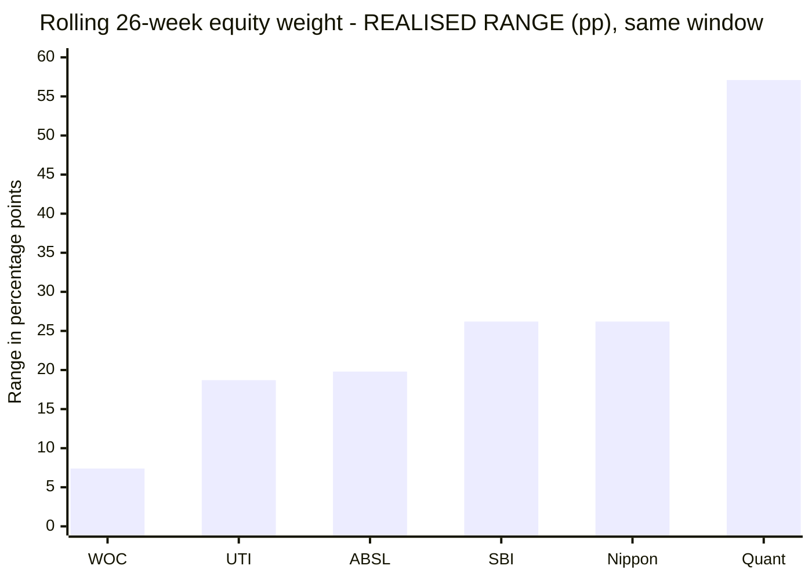
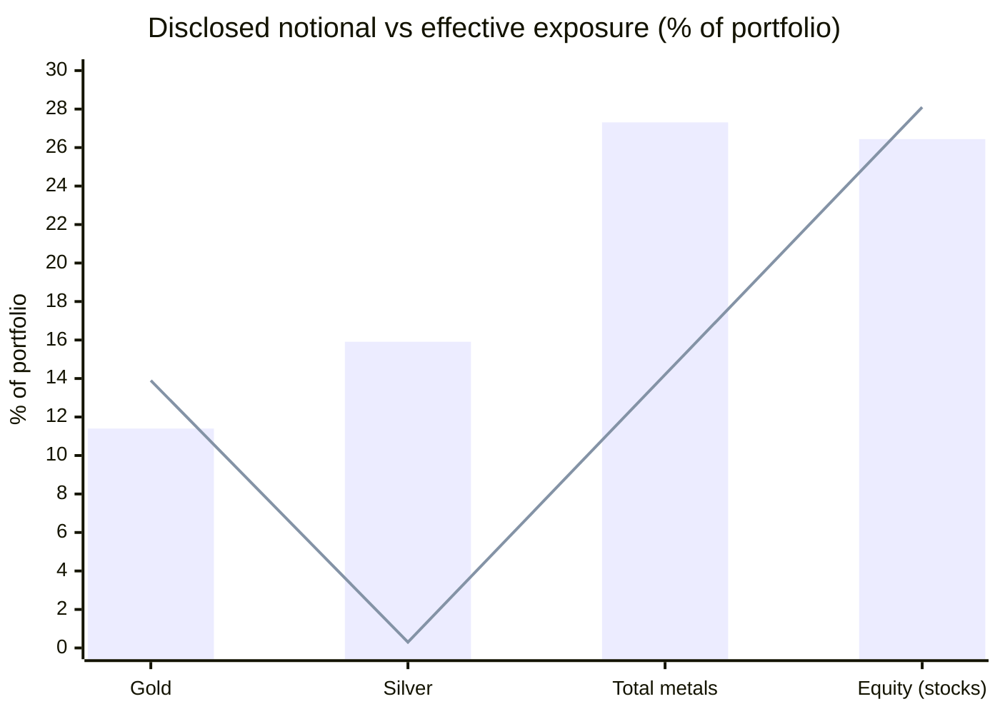
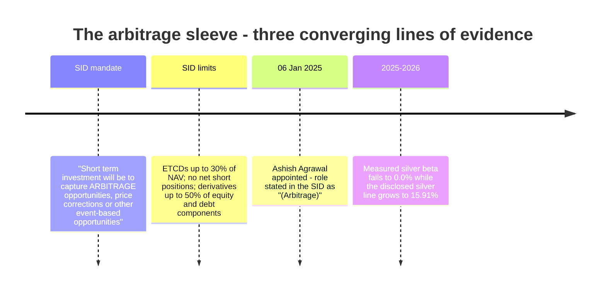
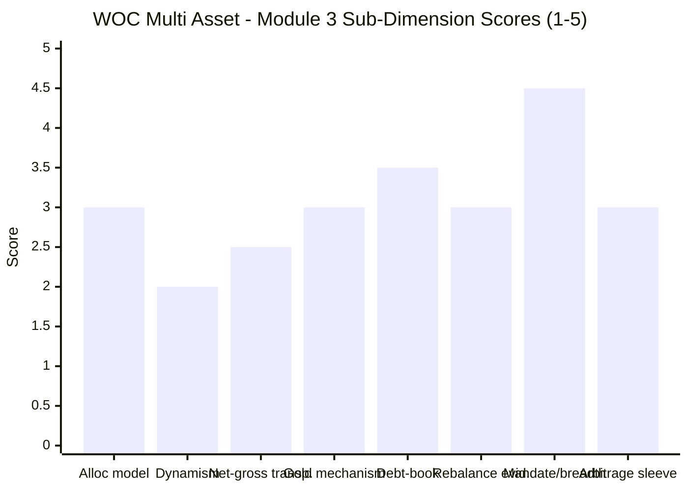

# Module 3: Allocation Engine & Portfolio DNA — WhiteOak Capital Multi Asset Allocation Fund

> **Provisional Module 3 score: ~2.9 / 5** (weight **20%** — the category's defining module, the analog of MidCap's "active share"). **Scores are NOT comparable to the four equity categories.**

> **The one-line context:** this module inverts the fund. M1 scored it 3.5 and M2 scored it 4.1 — the best risk-adjusted record in the study. **Module 3 finds that almost none of that comes from the allocation engine, and it can now say so from primary sources rather than inference.** WhiteOak publishes the **most detailed allocation model in the study** — the SID names its actual inputs (Adjusted P/B with an ROE overlay, G-Sec-yield-to-earnings-yield, VIX, momentum, Equity-to-Gold, Dollar-Index-to-Gold, Gold-to-Oil, cap rates for REITs). And the fund has moved its equity dial **22.7% to 30.1%** across its entire life — a **7.4pp range with a 2.1pp standard deviation, the narrowest of all six studied funds by a factor of two** — inside an SID mandate permitting **10% to 80%**. It has used **under 8 points of a 70-point runway.**
>
> **⭐ THIS MODULE RESOLVES M1's OPEN QUESTION AND FINDS A DISCLOSURE PROBLEM.** M1 hypothesised that the "silver" line was hedged arbitrage rather than commodity exposure. **Confirmed, from three independent sources:** the fund holds **27.31% notional gold+silver** but carries only **~11–14% effective directional metals exposure**; the SID authorises commodity positions "to capture **arbitrage opportunities**"; and the AMC appointed a **dedicated arbitrage fund manager (Ashish Agrawal, 6 Jan 2025)** — after which measured silver beta fell to **zero**. **Roughly 16 percentage points of the fund's disclosed "commodity" allocation is an arbitrage book earning a debt-like spread, presented to investors under gold and silver line items.** That is where a large part of M1's unexplained **+4.47%/yr "selection" residual** actually comes from — and it means the published asset-allocation table **overstates the fund's commodity exposure by roughly 2.5×**.

---

## ⚠ Data-Access Note (read first)

The category's defining data is not in any API (`percOtherH` = 0). This module draws on:

1. **The SID itself** — retrieved and text-extracted from the AMFI portal (doc 13647). This is the first module in the study to work from the primary scheme document rather than aggregator summaries, and it is the reason several long-deferred rows can finally be closed: mandate bands, the allocation model's named parameters, the gold/silver mechanism, derivative and ETCD limits, manager roles, turnover policy and the taxation table are all quoted from it.
2. **Return-based style analysis** at daily, weekly and monthly frequency, plus a **rolling 26-week** reconstruction — re-run for all six funds over WOC's window on the **Nifty-500** equity leg (see the M1 retrofit).
3. **Holdings backfill** from Groww and ValueResearch. No holdings are fabricated.

> **The binding constraint: 3.19 years = 38 monthly / 166 weekly observations.** ABSL's M3 showed that a short-sample rolling style analysis can produce dramatic *false* findings. **Every claim below that depends on the rolling path is cross-checked against holdings or the SID, and where they conflict the document wins.** The one rolling result reported as a finding — the equity-weight range — is robust precisely because it shows *no* movement, which is the failure mode short samples do **not** manufacture.

---

## Fund Identity / Raw Data

| Attribute | Value | Source |
|---|---|---|
| MFAPI scheme code | **151745** (773 daily / 166 weekly / 38 monthly obs, 22-May-2023 → 31-Jul-2026) | api.mfapi.in |
| **SID asset-allocation bands** | Equity & equity-related **(incl. REITs) 10–80%** · Debt & money market **10–80%** · **Gold/silver instruments (ETFs, SGB deposit schemes) & ETCDs 10–50%** · **InvIT units 0–10%** | **SID Part II §A, verbatim** |
| **Effective weights (weekly style)** | **Equity 28.1% · Debt 40.1% · Gold 13.9% · Silver 0.3% · Cash 17.7%** (R² 0.878) | MFAPI regression |
| Effective weights (daily / monthly) | 29.0/40.1/11.2/0.5/19.2 · 27.5/40.6/16.0/0.0/15.8 | MFAPI regression |
| **Disclosed portfolio (Aug-2026)** | **Cash margin 11.86% · Silver & silver commodity 15.91% · Gold (all forms) 11.40% · CBLO 6.52% · equities + REITs/InvITs ~40% · fixed income ~14%** | Groww, Aug 2026 |
| **⚠ Notional vs effective metals** | **27.31% disclosed vs ~11–14% effective — a ~16pp arbitrage/hedged block** | Groww vs MFAPI regression |
| Net equity (screener) | **26.44%** (large 18.55 / mid 3.80 / small 3.94) · Debt 29.64% | Tickertape, Jul 2026 |
| Total holdings | **195** | Groww |
| **Rolling-26w equity range** | **22.7% – 30.1% (range 7.4pp, sd 2.1pp)** — narrowest of six | MFAPI regression |
| Rolling-26w metals range | 8.7% – 20.0% | MFAPI regression |
| **Static-blend R² (weekly)** | **0.878** | MFAPI regression |
| **Allocation model (named inputs)** | **Adjusted P/B of equity indices with ROE overlay · G-Sec yield ÷ earnings yield · VIX · equity & debt momentum · domestic-vs-foreign valuation premium · Equity-to-Adjusted-Gold ratio · Dollar-Index-to-Gold · Gold-to-Oil · capitalisation rates for REITs/InvITs** | **SID, verbatim** |
| **Gold/silver mechanism** | ⚠ **No physical, no in-house ETF.** Third-party **ICICI Pru Gold ETF 3.44% + DSP Gold ETF 2.14%** plus **ETCDs (exchange-traded commodity derivatives / physically-settled futures)**. SID: *"Investment into physical Gold is neither envisaged nor is part of the core investment strategy"* | **SID + Groww** |
| **ETCD regulatory limits** | Single good **≤10% of NAV**; total ETCD **≤30% of NAV**; **no net short positions** in ETCDs | **SID, verbatim** |
| Derivatives limit | **Up to 50% of net assets of the equity component and debt component respectively** — for "hedging, portfolio balancing and optimising returns" | **SID, verbatim** |
| Foreign securities | Permitted, **up to 35% of total assets** (subject to SEBI/RBI overseas caps) | **SID, verbatim** |
| **REIT / InvIT sleeve** | Nexus Select 3.34 · Embassy Office 2.59 · Brookfield India 2.00 · Citius TransNet InvIT 1.93 · India Grid InvIT 1.76 = **≥11.6% in the top-10 alone** | Groww |
| Debt holdings | **GOI 6.28% 2032 · GOI 6.94% 2036 · T-bills (~3.8% sovereign)** + PFC · IRFC · NABARD · SIDBI · Bajaj Housing · LIC Housing · **Muthoot Finance** (~9%+) | Groww |
| Equity book character | Top stock **ICICI Bank 3.18%**, HDFC Bank 2.45%, Bharti Airtel 1.54% — **no stock above 3.2%**; within equity ≈ **70% large / 14% mid / 15% small** | Groww / Tickertape |
| Equity-book PE | **25.58 vs category 23.35** ⚠ | Tickertape |
| **Managers & roles** | **Ramesh Mantri — equity (since inception)** · **Piyush Baranwal — debt (since inception)** · **Dheeresh Pathak — asst. FM equity (01-Apr-2024)** · **⭐ Ashish Agrawal — ARBITRAGE (06-Jan-2025)** · Trupti Agrawal (May-2025, equity) | **SID §E, verbatim** |
| **Portfolio turnover** | ⚠ **SID explicitly declines to estimate it**; not published by aggregators | **SID, verbatim** |
| Expense ratio | ⚠ **now a four-way spread: 0.67% (Tickertape) · 0.64% (Groww, Aug) · 0.46% (Groww, Jul) · 0.40% (INDmoney, Coin)** | multiple → **M4** |

---

## Cross-Source Verification

| Metric | Style analysis | Disclosed holdings | Screener | SID | Verdict |
|---|---|---|---|---|---|
| **Equity (directional)** | **27.5–29.0%** | ~40% incl. REITs/InvITs | **26.44%** net | band 10–80% | ✅ **Triangulated at ~26–29% in stocks**; the gap to Groww's ~40% is the **REIT/InvIT sleeve, which the SID counts inside the equity bucket** |
| **Metals** | **11.2–16.0% effective** | **27.31% notional** | (hidden in remainder) | band 10–50% | ❌ **DIVERGENT BY ~16pp — the module's central finding.** The SID's arbitrage authorisation and the dedicated arbitrage FM resolve it (§3); the regression is right about *risk*, the factsheet right about *notional* |
| **Silver specifically** | **0.0–0.5%** | **15.91%** | — | — | ❌ **Effectively zero directional silver against a 15.91% disclosed line** — the starkest notional-vs-effective gap found anywhere in this study |
| Debt + cash | 55–58% combined | ~14% bonds + 6.52% CBLO + 11.86% margin ≈ 32% | 29.64% | band 10–80% | ⚠ Style over-attributes the low-volatility block (a known artifact — the smooth debt leg absorbs the arbitrage sleeve's debt-like return). **The ~16pp arbitrage block is economically debt, which is exactly why** |
| Gold vehicle | — | ICICI Pru + DSP Gold ETFs, third-party | — | ETFs + ETCDs, **no physical** | ✅ Confirmed both ways |
| Holdings count | — | **195** | — | — | ✅ |
| Manager roles | — | Groww lists 5 names | — | **roles specified incl. "(Arbitrage)"** | ✅ **SID authoritative** |

**Reliability: HIGH for the equity and metals conclusions** — the notional-vs-effective gap is corroborated by three independent lines of evidence (regression, SID text, manager appointment). **HIGH for the dynamism finding** — a *null* result that short samples do not fabricate. **DEFERRED:** portfolio turnover (the SID declines to estimate it, and no aggregator publishes it), the precise ETF-vs-ETCD split within the metals sleeve, debt modified duration, and full sector percentages.

---

## 1. ⭐ The Allocation Engine — Best-Disclosed Model in the Study, Least Dynamic Execution

### The model, in the AMC's own words

Unlike ABSL (which publishes nothing) or UTI (a model the data refuted), WhiteOak **names its inputs**. From the SID, verbatim:

> *"The internal proprietary model might use parameters like **Adjusted Price to Book Value of Equity market indices (with an overlay of ROE)**, **Ratio of G-Sec Yield to Earning Yield of Equity market indices**, **VIX** and **Equity and Debt Momentum** while deciding the Asset Allocation levels of the portfolio between equities and debt… The internal model may use **Equity to Adjusted Gold Ratio, Dollar Index to Gold Ratio, Gold to Oil Ratio** and other such ratios to decide the allocation to gold instruments… The model may also use **Capitalisation rates** prevailing in the market to determine its allocation to REITs and INVITs."*

**On disclosure alone this is the best allocation-model documentation in the study.** It is a genuine, named, valuation-and-momentum framework spanning all four sleeves.

**And then the same paragraph dismantles it, three times over:**

> *"The Scheme **may** utilize internal proprietary model… This model may provide **broad guidance**… considering the dynamic nature of the market, the Fund manager might utilize this model **as a broad indicator**. **Fund Manager will have the final authority to apply their discretion and judgment** while determining the actual allocation percentage, the allocation interval, and the allocation approach… This internal proprietary model **may undergo periodic revision (as and when required), resulting in adding or deleting parameters and the weights assigned to them.**"*

So: the model is **optional** ("may utilize"), **advisory** ("broad indicator", final authority rests with the manager), and **mutable at will** (parameters and weights can be added or deleted). **A framework that can be overridden and rewritten at any time cannot be falsified — which means the disclosure, however detailed, buys the investor no accountability.** This is the same structural problem UTI's module identified, arriving by a different route: UTI's model was testable and failed; WOC's is untestable by construction.

### ⭐ The decisive measurement — the dial does not move

| Fund (same window) | Equity range | **Equity-weight sd** | Metals range | Static R² | Avg mix (Eq/Debt/Gold/Ag/Cash) |
|---|---|---|---|---|---|
| **WOC** | **22.7 – 30.1%** | **2.1pp** 🔻 | 8.7 – 20.0% | 0.878 | **28/40/14/0/18** |
| ABSL | 49.6 – 69.4% | 4.2pp | 2.5 – 19.1% | **0.954** | 61/24/8/6/0 |
| UTI | 48.5 – 67.2% | 5.5pp | 0.8 – 28.7% | 0.897 | 58/27/14/0/1 |
| Nippon | 43.2 – 69.4% | 5.6pp | 4.1 – 21.5% | 0.933 | 60/23/13/4/0 |
| SBI | 34.2 – 60.4% | 6.4pp | 7.5 – 24.3% | 0.861 | 44/40/9/4/2 |
| **Quant** | **37.4 – 94.5%** | **14.5pp** | 0.0 – 25.1% | **0.638** | 64/0/12/2/22 |

**WOC's equity weight has varied by 7.4 percentage points across its entire life — less than half the next-narrowest fund, and one-eighth of Quant's.** Its standard deviation of 2.1pp is the lowest in the study by a wide margin. **The SID permits 10% to 80%. The fund has used 22.7% to 30.1%.**

**A "relative attractiveness" model that has never once concluded that equity deserved more than 30% or less than 23% — across a period containing a 25.9% market year (2023), a 18.6% correction (2024–25), a gold melt-up (2025) and a tri-asset crash (2026) — is not, on the evidence of its own results, changing anything.** For the module whose entire question is *"is there an allocation engine?"*, this is the answer, and it is unambiguous.

**Three honest counterweights, none of which rescues the score:**
1. **A narrow band is not automatically a failure — it is a failure *relative to the claim*.** A fund marketed as a static conservative allocator with a 25/55/20 anchor (which is exactly what the AMC's own brochure backtests) would be doing precisely this, and doing it well. The problem is that this fund is sold on a model that decides "the relative attractiveness of asset classes."
2. **The metals dial does move** — 8.7% to 20.0%, an 11.3pp range. So the engine is not entirely frozen; it flexes commodities roughly 1.5× more than equity. Whether that is the model or the arbitrage book scaling cannot be separated from returns alone.
3. **WOC's static R² (0.878) is *not* the highest** — ABSL (0.954), Nippon (0.933) and UTI (0.897) are all more reproducible by a fixed basket. That is because ~12% of WOC's variance comes from the arbitrage and REIT sleeves that no index leg captures. **R² measures "explained by a static blend"; the rolling-weight sd measures "does the manager move." On the second — the one this module is actually asking about — WOC is last.**

---

## 2. Net-vs-Gross Equity and the 65% Line (Tier-1)

| Layer | Value | Read |
|---|---|---|
| **Net (directional) equity** | **~26–29%** (screener 26.44%, style 27.5–29.0%) | The true market exposure — source of the 0.27 beta and 0.77 PP-FlexiCap correlation (M2) |
| Equity **including REITs** (the SID's own bucket) | **~40%** | REITs are counted as equity in the mandate, which is why Groww's "equity" reads far above the screener's |
| **Gross equity** | **~40% at most** — nowhere near 65% | ✅ **No tax-driven padding whatsoever** |
| Arbitrage overlay on *equity* | Not evidenced; the arbitrage book sits in **commodities**, not equity | See §3 |

**This is the cleanest net-vs-gross position of any fund studied, and the finding cuts both ways.**

- **✅ Honest:** SBI straddles nothing, ABSL straddles the 65% line with month-to-month ambiguity, and UTI sits just above it. **WOC is not engineering anything.** Its equity is real, unhedged, and about a quarter of the book. There is no arbitrage padding inflating a headline gross-equity number to win equity taxation.
- **❌ And therefore it forfeits the shield.** M1 and M2 both flagged that WOC is **not equity-taxed**. Module 3 now shows *why*, structurally: at ~40% gross equity the fund is **not within 25 percentage points** of the ≥65% line, and nothing in its allocation bands suggests it ever intends to be. **This is not a borderline case that could resolve favourably — it is a permanent structural fact of the product.**

**⭐ The SID settles the tax question that M1 and M2 left open.** The SID's own taxation table places the scheme under *"Tax on Capital Gains for units of schemes **other than Equity Oriented Scheme and other than Specified Mutual Fund** (acquired on or after 1 April 2023)"* — LTCG **12.50% without indexation**, STCG at slab. Since the SID also states *"The units of the Scheme are presently not proposed to be listed on any stock exchange,"* the **unlisted** row applies: **long-term after 24 months.** This confirms VR and Groww exactly, from the primary document.

> **Retrofit to M2:** M2 scored "equity-taxation continuity risk" at 3.0 and flagged the danger of a slide into **"Specified Mutual Fund"** (slab-on-everything) status, which M1 showed would cut post-tax return from 15.08% to 12.22% and lose the DIY test. **The SID explicitly classifies the scheme in the *non*-specified bucket**, and the disclosed book (~14% bonds + ~18% cash/CBLO ≈ 32% debt & money market) sits **far below** the >65%-debt threshold that triggers specified status. **The risk is materially smaller than M2 assumed** — though the 10–80% debt mandate means it is not structurally impossible. Detail in the footer.

---

## 3. ⭐ The Arbitrage Sleeve — 16 Percentage Points Hiding Inside "Gold" and "Silver" (NEW)

This is the module's most consequential discovery, and it closes M1's biggest open question.

### The gap

| | Disclosed (Groww, Aug-2026) | Effective (style analysis) | Gap |
|---|---|---|---|
| Gold (all forms) | **11.40%** | 11.2 – 16.0% | ≈ 0 |
| **Silver & silver commodity** | **15.91%** | **0.0 – 0.5%** | **≈ −15.9pp** |
| **Total metals** | **27.31%** | **~11–14%** | **≈ −16pp** |
| Cash margin | 11.86% | *(absorbed into cash/debt)* | — |

> Bar = **disclosed** holdings (Groww, Aug-2026) · Line = **effective** exposure (weekly style analysis). Gold and equity reconcile closely. **Silver does not reconcile at all.**

**The fund discloses 27.31% in gold and silver. Its returns behave as though it holds roughly 11–14%.** Silver, at 15.91% of the portfolio, contributes **effectively zero** directional exposure.

### Three independent confirmations that this is deliberate arbitrage

1. **The SID authorises it explicitly:** *"Short term investment will be to capture **arbitrage opportunities**, price corrections or other event based opportunities in the market."*
2. **The AMC hired a dedicated arbitrage manager.** The SID lists **Ashish Agrawal (Arbitrage), managing the scheme since 06 January 2025** — ex-Motilal Oswal AMC. WhiteOak also runs a standalone **WhiteOak Capital Arbitrage Fund**, so the capability is institutional, not improvised.
3. **The timing matches the data.** Style analysis shows silver beta at **4.2% in 2023–24** and **0.0% in 2025 and 2026** — the transition occurs around the arbitrage manager's appointment. The **11.86% "cash margin"** line sitting beside the metals is exactly the collateral a cash-and-carry book requires.

### What it means — four consequences, two good and two not

| Consequence | Assessment |
|---|---|
| **It explains M1's residual.** M1 found an unexplained **+4.47%/yr "selection"** contribution. A cash-and-carry commodity book earns the futures basis — a low-risk, debt-like spread. **A meaningful share of what M1 labelled "security selection" is arbitrage carry, not stock-picking skill** | ⚠ **Reframes M1** |
| **It explains M2's risk profile.** A 16pp block of hedged commodity exposure earning a spread with near-zero beta is precisely why volatility is 5.65%, downside capture is −4.5%, and the fund lost half what its own benchmark lost in the 2026 metals crash | ✅ **Confirms M2** |
| **⚠ The disclosed asset allocation overstates commodity exposure ~2.5×.** An investor reading the factsheet sees 27.31% in gold and silver and reasonably concludes they own a large commodity hedge. **They own roughly 11–14%.** The remainder is a money-market-like position wearing a commodity label | ❌ **Transparency failure** |
| **⚠ It is close to a regulatory ceiling.** The SID caps **total ETCD exposure at 30% of NAV** and **single-good ETCD at 10%**. Metals notional is already **27.31%**. If the arbitrage book runs through ETCDs, the strategy is **near its cap and cannot scale much further** — a constraint on both future returns and AUM growth | ⚠ **Scalability limit** |

> **The fair reading:** this is a **legitimate, well-resourced, return-generating strategy** — not a gimmick, and not tax engineering. It is a genuine reason the fund produces equity-like returns at debt-like volatility. **But it is not what the fund's own asset-allocation disclosure communicates**, and an investor sizing a "commodity diversifier" off the published 27% would be sizing it wrong by more than double. **The published table should distinguish directional metals from hedged/arbitrage metals. It does not.**

---

## 4. Gold Mechanism, Debt Book, and Asset-Class Breadth

| Dimension | Assessment | Status |
|---|---|---|
| **Gold/silver mechanism** | ⚠ **Mixed — the weakest mechanism of the studied funds.** SID: *"Investment into physical Gold is neither envisaged nor is part of the core investment strategy; however listed Gold Futures in Indian Commodity Exchanges are physically settled…"* So exposure is via **third-party ETFs (ICICI Pru Gold 3.44%, DSP Gold 2.14%) + ETCDs/futures**. Three drawbacks: (a) **no in-house ETF** — unlike SBI and ABSL, WhiteOak rents another AMC's vehicle and pays its TER on top (a double-layer cost → M4); (b) **futures carry roll cost and basis risk** absent from physical-backed ETFs; (c) if held to expiry, physical delivery must be disposed of within 180 days. **The offset: ETCDs are precisely what makes the arbitrage sleeve possible**, so the mechanism is chosen for strategy, not carelessness | ⚠ **3.0** |
| **Debt-book construction** | ✅ **Predominantly high-grade, with modest NBFC reach.** Sovereign: **GOI 6.28% 2032, GOI 6.94% 2036, T-bills (~3.8%)**. Quasi-sovereign AAA: **PFC, IRFC, NABARD, SIDBI**. Corporate/NBFC: **Bajaj Housing, LIC Housing, Muthoot Finance**. ⚠ **Two flags:** the GOI 2032/2036 holdings are **6–10 year paper, which is not short duration** despite the fund benchmarking **CRISIL *Short Term* Bond** — a mild mandate-vs-execution mismatch M2 did not catch; and the SID permits **unrated paper** subject to AMC Board parameters. **Modified duration is still not disclosed** | ⚠ **3.5** |
| **Asset-class breadth** | ✅ **The widest in the study — six live classes:** domestic equity · **REITs (≥7.9%)** · **InvITs (≥3.7%)** · debt & money market · gold · silver. Foreign equity permitted up to **35%** but not currently used at scale. Beats ABSL's and SBI's five, and UTI's four | ✅ **Strong** |
| **Structure: direct vs FoF** | Equity, REITs, InvITs, G-secs and corporate bonds held **directly**; **gold via third-party ETFs** (a thin fund-holding layer) and **ETCDs directly**; **no offshore feeder, no FoF wrapper** — so no NAV-pricing lag (M2 confirmed daily pricing is clean) | ✅ **confirmed** |
| **SEBI mandate compliance** (≥3 classes, ≥10% each) | ✅ **Comfortably met with the best margins in the study:** equity+REITs ~40% (band 10–80) · debt & money market ~32% (band 10–80) · gold/silver+ETCD 27.31% (band 10–50) · InvITs ~3.7% (band 0–10). **No sleeve is anywhere near a floor or ceiling** — contrast ABSL's debt sitting **26bp** above the ≥10% minimum | ✅ **4.5** |
| **⚠ ETCD ceiling** | Total ETCD ≤30% of NAV; metals notional already **27.31%**. **Headroom may be under 3pp** if most metals are ETCD-based | ⚠ **scalability flag** |
| **Portfolio turnover** | ❌ **Not disclosed.** The SID explicitly declines: *"it will be difficult to provide an estimate/range with a reasonable measure of accuracy for the anticipated portfolio turnover."* No aggregator publishes it. **Given a 195-holding book with a rolling arbitrage sleeve, true turnover is almost certainly high** — and its cost is invisible | ❌ **deferred** |

---

## 5. Rebalancing Discipline — One Good Call, No Engine Behind It (NEW)

The test: did the fund move at the right moments? **With no 2020 and no 2022, and an equity dial that barely moves, this is thin.**

| Turn | What a skilled allocator would do | What WOC did | Grade |
|---|---|---|---|
| ❌ **2020 COVID crash** | Buy equity into the crash | **Fund did not exist** | — |
| ❌ **2022 all-diverge** | Hold gold, cut duration | **Fund did not exist** | — |
| **2023 broad-market rally (+25.9%)** | Add equity if the model says cheap | **Equity stayed ~29%** — no move | ⚠ Neutral |
| **Sep-2024 → Mar-2025 correction** | Stay defensive; add equity into weakness | **Equity stayed ~28%**; fund +3.41% while index −12.62% | ✅ Outcome good, **but from static positioning, not a call** |
| **2025 metals melt-up (gold +71.9%, silver +155.7%)** | Hold, then harvest | **Effective metals ~11–14% vs benchmark 20%; silver beta 0%** — under-participated (M1: −1.96 alpha) | ⚠ **Missed the upside** |
| **Jan–Mar 2026 tri-asset crash** | Be underweight the crowded trade | **Metals underweight worth +5.73pp of drawdown protection vs its own benchmark** (M2) | ✅ **The one clearly good outcome** |

**Verdict: the fund's positioning was right in the crash and wrong in the melt-up — and it was the *same positioning* on both occasions.** It did not move into the melt-up and did not move out of it. **That is not rebalancing discipline; it is a static underweight that happened to be wrong in 2025 and right in 2026.** The honest score credits the outcome without crediting a process that cannot be shown to exist.

**The one defensible timing observation:** the arbitrage manager was appointed **6 Jan 2025**, and effective silver beta went to zero from that point — i.e. the fund converted directional silver into hedged silver *before* silver fell 43.53% in 2026. Whether that was a deliberate risk call or simply the arbitrage book scaling into available capacity **cannot be determined from returns**, and the module does not claim it as skill.

---

## 6. Equity-Book DNA & Overlap with Existing Sleeves (informational — decision-tree feed)

**195 total holdings, and the top of the book is not stocks.**

| Top holdings | % | Type |
|---|---|---|
| Cash margin | 11.86% | Arbitrage collateral |
| Silver & silver commodity | 15.91% | **Mostly hedged (§3)** |
| Gold (all forms) | 11.40% | Directional + ETF |
| CBLO | 6.52% | Money market |
| **Nexus Select Trust** | **3.34%** | **REIT** |
| **ICICI Bank** | **3.18%** | **Largest single stock** |
| **Embassy Office Parks** | **2.59%** | **REIT** |
| HDFC Bank | 2.45% | Equity |
| **Brookfield India REIT** | **2.00%** | **REIT** |
| **Citius TransNet InvIT** | **1.93%** | **InvIT** |
| **India Grid InvIT** | **1.76%** | **InvIT** |
| Bharti Airtel | 1.54% | Equity |

**Character:** an extremely **diffuse** equity book — **no single stock exceeds 3.18%**, and only three stocks clear 1.5%. Within the ~26% net equity, the split is roughly **70% large / 14% mid / 15% small**. Combined with 195 holdings, this is a **low-conviction, heavily-diversified equity sleeve** — the opposite of ABSL's 117-name book with genuine off-index positions (Thermax, Bank of Maharashtra, SEDEMAC).

**⚠ The valuation flag:** equity-book **PE 25.58 vs category 23.35**. A defensive fund holding a *more expensive* equity book than its peers is a mild but real inconsistency.

**⚠ The REIT/InvIT concentration is the real active bet.** At **≥11.6% in the top-10 alone**, the property/infrastructure-trust sleeve is larger than the entire mid+small equity allocation. This is WOC's single most distinctive portfolio choice — and M2 flagged it as the study's one genuine **liquidity** constraint (the Indian listed-REIT market is thin; fine at ₹7,763 Cr, not at a multiple of it).

**Overlap (decision-tree feed):** at **0.77 correlation to PP FlexiCap** (the lowest of six) and **0.58 to DSP SmallCap**, WOC duplicates less than any peer. But the large-cap core (ICICI, HDFC, Bharti) is exactly what PP FlexiCap already owns. **The genuinely additive content is the ~11.6%+ REIT/InvIT sleeve, the ~11–14% directional metals, the ~16pp arbitrage book and the debt — not the equity.**

---

## Comparison with Studied Funds

| Dimension | **WOC** | SBI | Nippon | UTI | ABSL | Quant |
|---|---|---|---|---|---|---|
| Effective mix (Eq/Debt/Metals/Cash) | **28/40/14/18** | 44/40/13/2 | 60/23/17/0 | 58/27/14/1 | 61/24/14/0 | 64/0/14/22 |
| **Equity-weight range (realised)** | **7.4pp** 🔻 *(least dynamic)* | 26.2pp | 26.2pp | 18.7pp | 19.8pp | **57.1pp** |
| **Equity-weight sd** | **2.1pp** 🔻 | 6.4pp | 5.6pp | 5.5pp | 4.2pp | **14.5pp** |
| Static-blend R² | 0.878 | 0.861 | 0.933 | 0.897 | **0.954** | **0.638** |
| **Allocation model — disclosure** | ✅ **Best: named parameters in SID** | Static drift | Discretionary | Documented valuation model | ❌ **None published** | VLRT quant |
| **Allocation model — demonstrated effect** | ❌ **None (dial frozen)** | None | Active | **Negative** (refuted) | None | Mixed |
| Asset breadth | ✅ **6-class (best)** | 5-class | broad | 4-class | 5-class | broad |
| Gold mechanism | ⚠ **Third-party ETF + ETCD futures** | In-house ETF ✅ | Best in study | Gold only | In-house physical ✅ | Rented |
| Net/gross equity | ✅ **~26% net / ~40% gross — no engineering** | 47%, clearly below | ~56% | ~70%, clean | ⚠ straddles 65% | ~53% |
| Mandate margin | ✅ **Comfortable on all four bands** | comfortable | comfortable | thin | ⚠ **26bp on debt** | comfortable |
| **Arbitrage sleeve** | ⚠ **~16pp, dedicated FM, under-disclosed** | none | none | none | none evidenced | none |
| Equity-book conviction | ⚠ **195 names, max 3.18% — very diffuse** | 134 names | Index-like | Blue-chip | ✅ 117, real conviction | Momentum |
| **Module 3 score** | **~2.9** | **~3.0** | **~3.4** | **~2.8** | **~3.0** |  **~3.3** |

**The cross-read:** WOC has the **best-documented model, the widest asset breadth, the cleanest mandate margins and the most honest net-vs-gross position** of the six — and the **least dynamic execution by a factor of two**, a **gold mechanism that rents another AMC's ETF**, a **very diffuse equity book**, and an **arbitrage sleeve that is materially under-disclosed**. It lands at 2.9, **fifth of six**, above only UTI. That is a striking result for a fund that scored 3.5 on returns and 4.1 on risk — and it is the module's point: **WOC is an excellent fund whose excellence does not come from the thing this module measures.**

---

## Points For / Points Against — Allocation Engine & DNA

### ✅ For
1. **⭐ Best-disclosed allocation model in the study** — the SID names actual inputs (Adjusted P/B with ROE overlay, G-Sec-yield-to-earnings-yield, VIX, momentum, Equity-to-Gold, Dollar-Index-to-Gold, Gold-to-Oil, REIT cap rates). ABSL publishes nothing comparable.
2. **⭐ Widest genuine asset-class breadth of any fund studied — six live classes** (equity, REITs, InvITs, debt/money-market, gold, silver), with foreign equity permitted to 35%.
3. **✅ The cleanest net-vs-gross equity position in the study** — ~26% net, ~40% gross, **zero tax-driven padding**. Contrast ABSL straddling the 65% line month to month.
4. **✅ Best SEBI mandate margins in the study** — all four bands sit comfortably inside their limits; nothing resembling ABSL's 26bp debt margin.
5. **⭐ The arbitrage sleeve is a genuine, institutionally-resourced strategy** — SID-authorised, run by a **dedicated arbitrage fund manager** since Jan-2025, backed by a standalone WhiteOak Arbitrage Fund. It is a real reason the fund earns equity-like returns at debt-like volatility.
6. **Debt book is predominantly high-grade** — sovereign G-secs and T-bills plus quasi-sovereign AAA (PFC, IRFC, NABARD, SIDBI), with only modest NBFC reach.
7. **No FoF wrapper, no offshore feeder** — everything daily-priced; corroborates M2's clean stale-pricing test.
8. **⭐ The SID settles the tax classification** from the primary document — non-specified, non-equity-oriented, 12.5% LTCG after 24 months — closing an M1/M2 open question and **reducing** M2's slab-reclassification risk.
9. **The 2026 metals underweight was worth +5.73pp of drawdown protection** versus its own benchmark.

### ❌ Against
1. **⚠ THE FINDING: the equity dial has moved 7.4pp in the fund's entire life (22.7–30.1%, sd 2.1pp) inside a 10–80% mandate — the least dynamic execution of all six funds by a factor of two.** A "relative attractiveness" model that has used under 8 points of a 70-point runway is not, on its own results, allocating.
2. **⚠ The model is unfalsifiable by construction.** The SID makes it optional ("may utilize"), advisory ("broad indicator", *"Fund Manager will have the final authority to apply their discretion and judgment"*), and **mutable** (*"may undergo periodic revision… adding or deleting parameters and the weights assigned to them"*). Detailed disclosure that buys no accountability.
3. **⚠ The published asset allocation overstates commodity exposure by ~2.5×** — 27.31% disclosed metals against ~11–14% effective; **silver is 15.91% of the portfolio and contributes ~0% directional exposure.** An investor sizing a commodity hedge off the factsheet would be wrong by more than double.
4. **⚠ The arbitrage sleeve may be near its regulatory ceiling** — SID caps total ETCD at 30% of NAV; metals notional is already 27.31%. Limited headroom to scale the very strategy driving the returns.
5. **⚠ Weakest gold mechanism of the studied funds** — no physical backing, **no in-house ETF** (rents ICICI Pru and DSP vehicles, paying their TER on top → M4), plus futures roll cost and basis risk.
6. **⚠ Very diffuse, low-conviction equity book** — 195 holdings, no stock above 3.18%, only three above 1.5%. Nothing resembling ABSL's genuine off-index positions.
7. **⚠ Equity book is *more expensive* than the category** — PE 25.58 vs 23.35, in a fund whose purpose is defence.
8. **⚠ Duration mismatch:** holds GOI 2032 and GOI 2036 (6–10 year paper) while benchmarking **CRISIL *Short Term* Bond**. M2 credited "short duration by design"; the holdings only partly support it.
9. **❌ Portfolio turnover is not disclosed and the SID declines to estimate it** — with a 195-name book and a rolling arbitrage sleeve, true turnover is likely high and its cost invisible.
10. **❌ No 2020 or 2022 rebalancing evidence**, and the one melt-up it did face (2025) it under-participated in — from static positioning, not a call.
11. **⚠ The REIT/InvIT sleeve (≥11.6% in the top-10 alone) is the largest genuine active bet in the book** — bigger than the entire mid+small equity allocation, in a thin listed market (M2's liquidity flag).
12. **⚠ A fourth ER figure appeared during this module** (Groww now 0.64%, vs 0.67 / 0.46 / 0.40 elsewhere) — the cost picture is still unresolved → M4.

---

## Module 3 Scorecard

| Sub-dimension | Weight | Score | Reasoning |
|---|---|---|---|
| **Allocation model — clarity & testability** *(Critical)* | 20% | **3.0** | **Split verdict: disclosure ≈ 4 (best in study — named parameters in the SID), demonstrated effect ≈ 2 (the dial does not move).** The SID's own escape clauses — optional, advisory, manager has final authority, parameters revisable at will — make it **unfalsifiable**, so detailed disclosure buys no accountability |
| **Dynamism (realised asset-class range)** *(Critical)* | 20% | **2.0** | ❌ **Equity 22.7–30.1%: a 7.4pp range, 2.1pp sd — least dynamic of six by 2×, inside a 10–80% mandate.** Guide: "static ±5% = 3"; this is tighter than that on the primary dial. Lifted off 1.5 only because metals do flex 8.7–20.0% |
| **Net-vs-gross equity transparency** *(High)* | 12% | **2.5** | ✅ Genuinely clean and un-engineered (~26% net / ~40% gross, no padding) — **but** ⚠ the **metals disclosure is materially misleading** (27.31% notional vs ~11–14% effective; silver 15.91% at ~0% beta). Transparency is excellent on equity and poor where it matters most for this fund |
| Gold/commodity mechanism quality | 10% | **3.0** | ⚠ **Weakest of the studied funds** — no physical, **no in-house ETF** (rents ICICI Pru + DSP, double-layer TER → M4), futures roll cost and basis risk. Offset: ETCDs are what enable the arbitrage sleeve, so it is a strategic choice, not negligence |
| Debt-book quality | 10% | **3.5** | ✅ Predominantly sovereign + quasi-sovereign AAA (PFC/IRFC/NABARD/SIDBI) with modest NBFC reach (Muthoot, Bajaj Housing). ⚠ Docked for the **GOI 2032/2036 duration mismatch** against a short-term-bond benchmark, undisclosed modified duration, and SID-permitted unrated paper |
| **Rebalancing discipline (evidence)** *(High)* | 12% | **3.0** | The 2026 metals underweight was worth +5.73pp of protection — **but it was the same static position that under-participated in 2025's melt-up.** A static underweight that was wrong then right, not demonstrated discipline. No 2020/2022 to grade |
| **SEBI mandate compliance + asset breadth** | 10% | **4.5** | ✅ **Six live asset classes — widest in the study** — with the most comfortable margins on all four bands (contrast ABSL's 26bp). Docked only for the **~3pp ETCD headroom** against the 30% cap |
| **Arbitrage/hedged sleeve — size, drag, disclosure** *(NEW)* | 6% | **3.0** | ✅ A **real, dedicated-manager, return-*generating*** sleeve (not a drag) that explains much of M1's residual and M2's risk profile — ⚠ but **under-disclosed** to investors and **near its ETCD ceiling**, capping scalability |
| Overlap with existing sleeves | *informational* | — | 0.77 to PP FlexiCap (lowest of six), 0.58 to DSP SmallCap. **Additive content = REITs/InvITs + directional metals + arbitrage + debt; the large-cap equity core duplicates.** Decision-tree feed, not scored |
| **Module 3 Overall** | **100%** | **~2.9 / 5** | **Best-disclosed model, widest breadth, cleanest mandate margins and the most honest net-vs-gross position in the study — attached to the least dynamic execution of all six funds, a rented gold vehicle, a diffuse equity book, undisclosed turnover, and an arbitrage sleeve that is both the real engine and the least transparent part of the portfolio.** The fund is excellent; this module is where its excellence is *not*. Not comparable to equity-category Module 3 scores |

---

## Comparative Module 3 Scores (studied funds — calibration only)

| Fund | Module 3 | DNA verdict |
|---|---|---|
| Nippon Multi Asset | ~3.4 / 5 | Genuine active engine; return-seeking, not risk-reducing |
| Quant Multi Asset | ~3.3 / 5 | Most dynamic (VLRT); return-max, high stock-selection residual |
| SBI Multi Asset | ~3.0 / 5 | Genuine 5-class book, but static drift — no engine |
| ABSL Multi Asset | ~3.0 / 5 | Well-built 5-class portfolio, sound metals vehicle — but no documented engine |
| **WOC Multi Asset** | **~2.9 / 5** | **Best-documented model in the study, executed with a frozen dial; a real arbitrage engine hiding inside a misleading commodity disclosure** |
| UTI Multi Asset | ~2.8 / 5 | Markets a valuation model the data refutes; mistimed engine |

> Module 3 is 20% here (vs 15% in the equity studies) because *how a multi-asset fund allocates is the whole active claim*. **WOC finishes fifth of six — and this is the study's sharpest illustration of why the category needs six modules.** On M1 (3.5) and M2 (4.1) it is the standout. On the module that asks whether the *allocation engine* works, it is next to last, because the engine has never been switched on. Its edge is instrument selection and arbitrage carry — real, but neither is what a "multi asset allocation" fee is nominally purchased for.

---

## SIP Implication

For a ₹15–20k/month SIP, Module 3 is where an investor should decide *what they think they are buying*. **What the marketing sells is an allocation engine:** an internal proprietary model reading Adjusted P/B, yield gaps, VIX, momentum, Gold-to-Oil and cap rates to move money between asset classes as their relative attractiveness changes. **What the fund has actually done is hold 22.7–30.1% equity for its entire life** — a 7.4-point range inside a mandate that permits seventy — while its own SID reserves the manager's right to ignore the model entirely and rewrite its parameters whenever it chooses. There is nothing here that could be falsified, and nothing in three years of results that suggests the model has changed a single decision.

**What the fund is actually delivering is something narrower and, on the evidence, better:** a conservative, six-asset-class book — the widest breadth in the study — with a genuinely high-grade debt sleeve, an unusually large REIT and InvIT allocation, and a **professionally-run commodity arbitrage operation** that earns a low-risk carry and is the hidden source of much of what M1 measured as "selection alpha" and M2 measured as extraordinary downside protection. That is a coherent, well-executed product. WhiteOak's own SID states the house philosophy plainly: *"our investment philosophy is to invest in businesses based on **stock selection** and **to avoid focusing on macro events**."* **The fund is behaving exactly as that philosophy predicts — and exactly opposite to how a macro allocation model would behave.** The firm is doing what it is good at; the label on the tin describes something else.

**Two things follow for sizing.** First, **the published asset table cannot be used to size the commodity hedge** — 27.31% disclosed metals is really ~11–14% of directional exposure, and an investor treating this as their gold allocation would be under-hedged by more than half. Second, **the return engine may be near a regulatory ceiling** — total ETCD exposure is capped at 30% of NAV and metals notional is already 27.31%, so the arbitrage book has limited room to grow with the AUM. Neither is disqualifying. Both mean **this fund should be underwritten as a low-volatility, arbitrage-and-carry-assisted conservative allocator, not as a dynamic multi-asset manager** — and the fee, the tax treatment and the DIY comparison in **M4** should be judged against *that* description.

## One-Line Verdict

**The most detailed allocation-model disclosure in the study — named valuation, momentum and commodity-ratio inputs, straight from the SID — attached to the most frozen execution of all six funds (equity 22.7–30.1%, a 7.4pp range inside a 10–80% mandate), a model the SID itself renders unfalsifiable, a gold sleeve rented from two rival AMCs, and a 27.31% "commodity" allocation that carries only ~11–14% of actual commodity exposure because roughly sixteen percentage points of it is a dedicated-manager arbitrage book earning a debt-like spread under a gold-and-silver label.**

---

*Module 3 complete. Provisional score 2.9/5. **Method:** primary-source work from the **SID** (AMFI portal doc 13647, text-extracted) for mandate bands, allocation-model parameters, derivative/ETCD limits, gold mechanism, foreign-securities limit, manager roles, turnover policy and the taxation table; return-based style analysis (constrained regression, MFAPI **151745** vs Motilal Oswal Nifty 500 Index **147625** / HDFC Short Term Debt **119016** / SBI Gold **119788** / Nippon Silver ETF FoF **149760**) at **daily (773), weekly (166) and monthly (38)** frequency plus a **rolling 26-week** reconstruction; **static-R² and dynamism re-computed over WOC's window for all five peers** — SBI (119843), Nippon (148457), Quant (120821), UTI (120760), ABSL (151307). Holdings, sector and cap-split from Groww + ValueResearch + Tickertape. **Note:** these R² figures are **not** directly comparable to the ABSL M3 table, which used a **Nifty-50** equity leg, three legs, monthly/weekly frequency and a different window; all six funds here are re-run on identical settings. **Still deferred:** portfolio turnover (SID declines to estimate), the ETF-vs-ETCD split inside the metals sleeve, debt modified duration, full sector percentages.*

*⚠ **CROSS-MODULE RETROFIT — three changes.***

***(1) M1's silver hypothesis is CONFIRMED and its "selection alpha" is reframed.** M1 inferred from ~0% silver beta that the commodity sleeve might be hedged arbitrage, and flagged it as a Tier-1 M3 question. **Confirmed from three independent sources** (SID arbitrage authorisation; a dedicated arbitrage FM appointed 06-Jan-2025; 27.31% notional vs ~11–14% effective metals). **Consequence: a material share of M1's unexplained +4.47%/yr "selection" residual is arbitrage carry, not stock-picking skill.** M1's *numbers* are unchanged and its alpha decomposition stands; what changes is the **attribution** — the residual should be read as "instrument selection + arbitrage carry + REIT/InvIT income", and M1's caveat that it was "a residual label, not an attribution" is now substantiated. **No M1 score change** — the sub-scores were awarded on measured outcomes, not on the residual's source.*

***(2) M2's equity-taxation continuity risk is REDUCED.** M2 scored that sub-dimension 3.0 on the danger of a slide into "Specified Mutual Fund" (slab) status. **The SID's own taxation table explicitly classifies the scheme as "other than Equity Oriented Scheme and other than Specified Mutual Fund", 12.5% LTCG without indexation, unlisted units → 24-month qualifying period.** With debt & money market at ~32% against a >65% trigger, the buffer is roughly **33 percentage points, not the ~15pp M2 estimated.** The risk is real but materially smaller. **The effect on M2's weighted total is +0.03 (3% weight × 1.0 point) — immaterial, so M2 remains 4.1**, but the sub-dimension reasoning is corrected and the M4 tax analysis should proceed on the confirmed middle-tier basis.*

***(3) M2's "debt duration structurally short by design" is PARTIALLY WITHDRAWN.** M2 inferred low duration from the CRISIL Short Term Bond benchmark leg. **Holdings show GOI 6.28% 2032 and GOI 6.94% 2036 — 6–10 year paper.** The debt book is high-grade but **not uniformly short**; the 2022 rate-shock inference should be treated as weaker than M2 stated. Modified duration remains undisclosed. **No M2 score change** (the sub-dimension was already docked to 3.5 for exactly this unverified-duration reason), but the reasoning is corrected.*

***Cross-module handoffs:*** *the **double-layer cost of holding third-party gold ETFs** (ICICI Pru + DSP TERs on top of WOC's own), the **undisclosed turnover** of a 195-name book with a rolling arbitrage sleeve, and the **now-four-way ER spread (0.67 / 0.64 / 0.46 / 0.40%)** → **M4 (all three are direct cost inputs)**; the **confirmed middle-tier tax status from the SID** → **M4 (question closed, proceed on this basis)**; **whether the 5-manager structure — especially the Jan-2025 arbitrage appointment — represents a deliberate strategy shift, and whether anyone has ever exercised the model's discretion** → **M5**; the **ETCD 30% ceiling as a scalability constraint** and **WhiteOak's stated anti-macro house philosophy sitting inside a macro-allocation product** → **M5/M6**; the **≥11.6% REIT/InvIT sleeve** and the **0.77/0.58 correlations** → **decision tree**. **Standing caveats: `no-2022-data` — the allocation engine's behaviour under stress remains unevidenced; and the notional-vs-effective metals gap must be carried into every subsequent module, because the fund's disclosed asset allocation is not its economic exposure.***

*Next: [Module 4 — Cost & Tax Efficiency](module4_cost_tax.md)*
