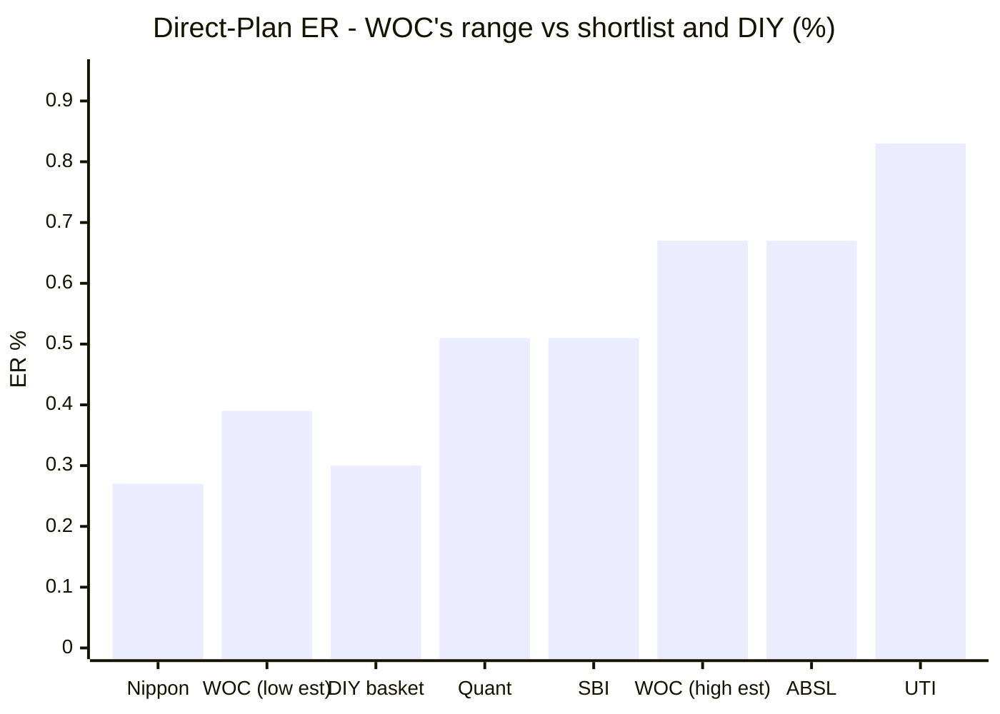
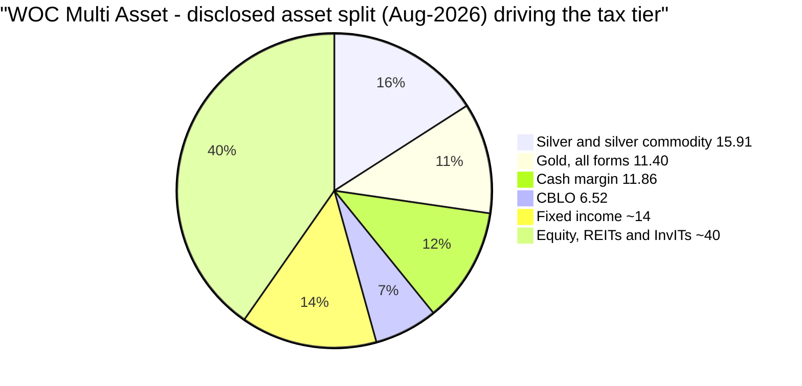
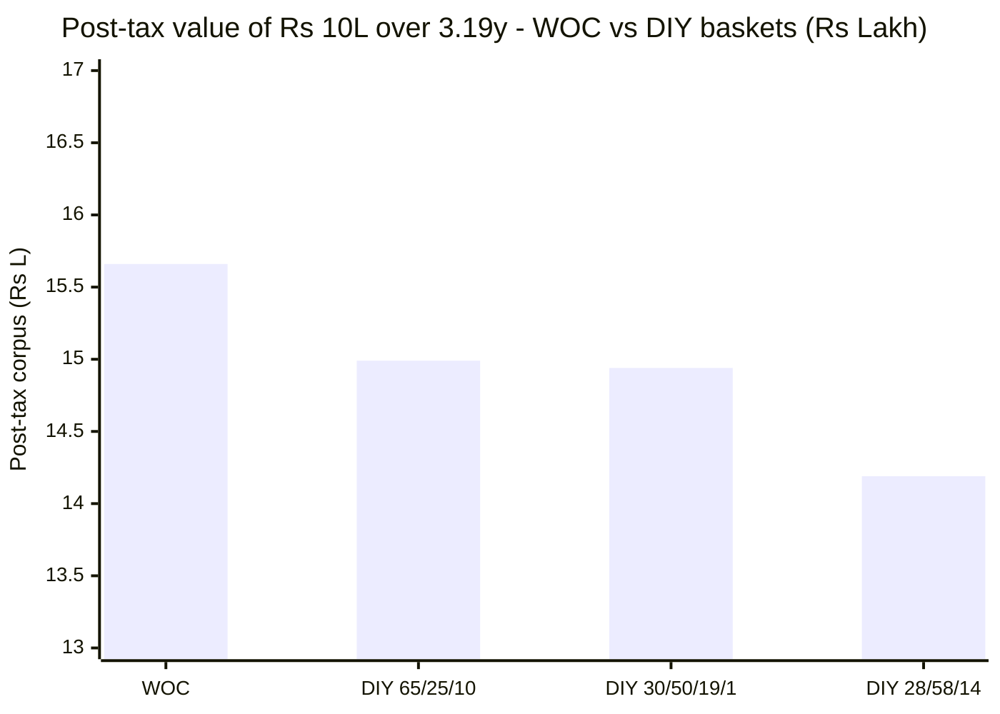
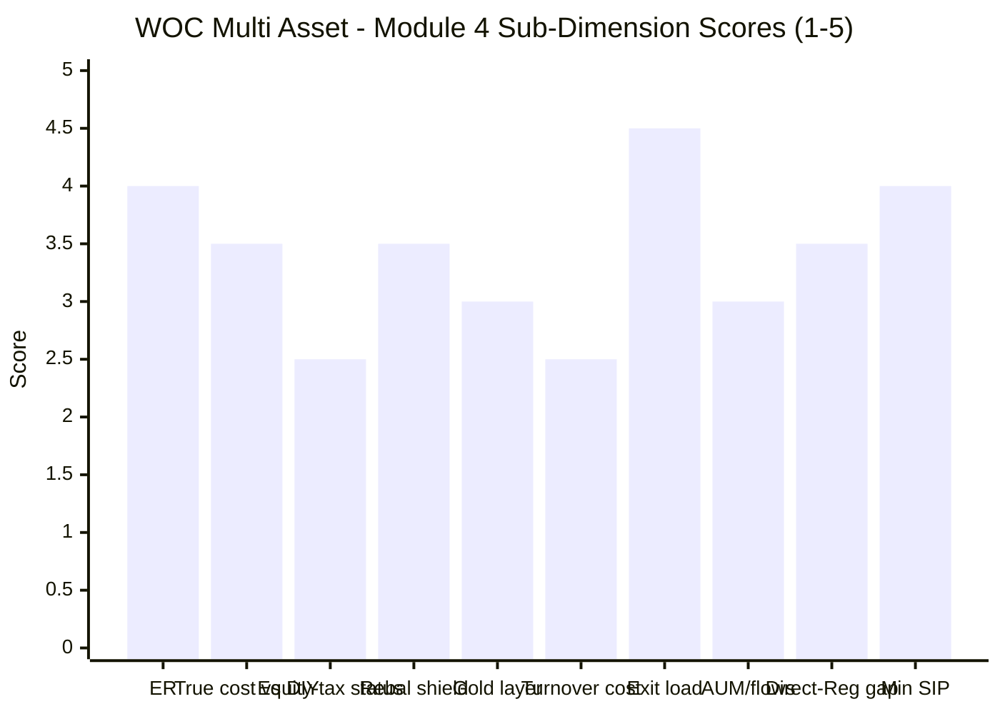

# Module 4: Cost & Tax Efficiency — WhiteOak Capital Multi Asset Allocation Fund

> **Provisional Module 4 score: ~3.3 / 5** (weight **20%**). **Scores are NOT comparable to the four equity categories.**

> **The one-line context:** the tax question is now **closed from the primary document** — M3 pulled the SID's own taxation table, which classifies the scheme as *"other than Equity Oriented Scheme and other than Specified Mutual Fund"*: **12.5% LTCG only after 24 months, slab before, no ₹1.25L exemption.** WOC is **not equity-taxed**, so the category's trump card — equity rates on the whole corpus including gold and debt — is **absent**, exactly as for SBI, Nippon and ABSL. What remains is a genuinely strong cost profile with a genuinely irritating hole in it: **the Direct expense ratio cannot be pinned down.** ValueResearch says **0.39% (dated 09-Aug-2026)**; AdvisorKhoj says **0.67% (dated 30-Jun-2026)**; Tickertape 0.67%; Groww 0.64%; INDmoney and Zerodha Coin 0.40%. That 28-basis-point spread is the difference between **beating DIY by +0.18pp/yr and losing to it by −0.09pp/yr** over ten years.
>
> **⭐ AND THIS MODULE CORRECTS MODULE 1's HEADLINE.** M1 called WOC "the study's first unambiguous post-tax DIY win." Re-running the identical post-tax calculation for all six funds over WOC's exact window shows **every one of them beats DIY — and WOC's margin is the SMALLEST of the six** (+₹66,184 on ₹10L vs Quant's +₹369,517). The claim survives only in risk-adjusted form, where it is genuinely the strongest: **WOC's post-tax Sharpe advantage over the DIY basket is +0.81, the largest of any fund studied.** M1's numbers were right; its framing was not. **M1's "Beat DIY" sub-score is corrected 4.5 → 4.0.**

---

## Fund Identity / Raw Data (per-metric source attribution)

| Attribute | Value | Source |
|---|---|---|
| **⚠ Expense Ratio (Direct)** | **UNRESOLVED — five sources, two clusters:** **0.39%** (VR, *dated 09-Aug-2026*) · **0.40%** (INDmoney, Zerodha Coin) · **0.64%** (Groww, Aug) · **0.67%** (AdvisorKhoj, *dated 30-Jun-2026*) · **0.67%** (Tickertape screener) | five sources, Jun–Aug 2026 |
| Expense Ratio (Regular) | **1.27%** (VR) / 1.28% (Groww) | ValueResearch / Groww |
| **Direct–Regular gap** | **0.60pp** (at 0.67% Direct) to **0.88pp** (at 0.39%) | computed |
| **SEBI TER cap (SID)** | *"Maximum base expense ratio (BER) permissible under Regulation 66(7)(c) — **Up to 1.85%**"*; Investment Management & Advisory Fees up to 1.85%; plus brokerage, transaction cost and GST | **SID Part III §C, verbatim** |
| **Exit load** | **1.00% if redeemed ≤30 days** (first 10% of units load-free, FIFO); **Nil after 30 days** | **SID §XI, verbatim** |
| Exit load per aggregators | ⚠ VR "--", AdvisorKhoj "Nil", Tickertape "0" — all understate it; the SID governs | VR / AdvisorKhoj / Tickertape |
| **AUM** | ⚠ **₹7,763 Cr (30-Jun-2026) → ₹7,107 Cr (Aug-2026) — down ~8.5%** | AdvisorKhoj / VR + Groww |
| Min lumpsum / SIP | **₹500 / ₹100** (AdvisorKhoj says ₹500 SIP) | VR / Groww / AdvisorKhoj |
| **Taxation status** | ✅ **RESOLVED — MIDDLE TIER.** SID: *"other than Equity Oriented Scheme and other than Specified Mutual Fund (acquired on or after 1 April 2023)"* — **LTCG 12.50% without indexation; unlisted units → >24 months; STCG at slab.** Units are **not listed** (SID) | **SID Part III §E (primary) + VR + Groww + AdvisorKhoj (all agree)** |
| Net / gross equity | **~26% net / ~40% gross** — nowhere near the 65% line; **no arbitrage padding** | M3 |
| **Gold cost layer (double-layer)** | ⚠ **Third-party ETFs: ICICI Pru Gold ETF 3.44% + DSP Gold ETF 2.14% = 5.58% of portfolio at ~0.42–0.45% TER ≈ 0.025% blended** — plus unquantified ETCD roll cost | Groww (M3) + ETF TERs |
| **Portfolio turnover** | ❌ **Not disclosed.** SID: *"it will be difficult to provide an estimate/range with a reasonable measure of accuracy"* | **SID, verbatim** |
| ER glide history | ❌ **Unavailable** for a 3.19-year fund | — |
| **AdvisorKhoj benchmark (older version)** | **CRISIL ST Bond 45 / BSE 500 TRI 35 / Gold 19 / Silver 1** — differs from the current SID's **30/50/16/1 + iCOMDEX 3** | AdvisorKhoj vs SID |

---

## Cross-Source Verification

| Metric | Value(s) | Verdict |
|---|---|---|
| **Direct ER** | **0.39% / 0.40% / 0.40% / 0.64% / 0.67% / 0.67%** | ❌ **THE MODULE'S CENTRAL DATA PROBLEM.** Two clusters ~28bp apart. **The balance of evidence favours the low cluster:** VR's figure carries the most recent date stamp (09-Aug-2026) and is corroborated by two independent platforms (INDmoney, Coin); AdvisorKhoj's 0.67% is stamped 30-Jun-2026 and matches the screener. **This study has documented the screener running stale-high three times** (ABSL M4: Nippon 0.43→0.27, SBI 0.74→0.51, Quant 1.16→0.51). **Every figure below is therefore modelled at BOTH 0.39% and 0.67%** |
| **Taxation** | SID (primary) + VR + Groww + AdvisorKhoj **all state 12.5% after 24 months, slab before** | ✅ **Four-way agreement including the primary document. Closed.** |
| Regular ER | 1.27% (VR) / 1.28% (Groww) | ✅ Confirmed |
| Exit load | SID **1%/30 days** vs aggregators' "Nil" | ⚠ **Aggregators wrong; SID governs.** Immaterial to a 7–10Y SIP but a data-quality flag |
| AUM | ₹7,763 Cr (Jun) vs ₹7,107 Cr (Aug) | ⚠ **−8.5% in ~6 weeks** — see §6 |
| **Benchmark SI return** | AdvisorKhoj: fund **17.26%** vs benchmark **13.03%** (implied alpha **+4.23%/yr**) | ✅ **Independent corroboration — and it is MORE favourable than M1's own +1.92%.** AdvisorKhoj uses the actual index series and the older 35/45/19/1 weights; M1 used index-fund proxies on the current SID weights. **M1's alpha is the conservative figure** |
| Risk metrics | AdvisorKhoj: stdDev **5.16**, Sharpe **2.01**, Beta **0.18** | ✅ Corroborates M2 (5.65 / 1.84 / 0.27) directionally; AdvisorKhoj is slightly more favourable on all three |

**Reliability: HIGH on tax** (primary document plus three aggregators). **LOW on the expense ratio** — and since ER is one of two scored cost inputs, this is disclosed prominently rather than resolved by assertion. **Every cost conclusion is presented as a range.**

---

## 1. ⚠ The Expense Ratio — Probably Excellent, Genuinely Unverifiable

| Fund | Direct ER (best estimate) | Rank if WOC = 0.39% | Rank if WOC = 0.67% |
|---|---|---|---|
| Nippon India Multi Asset | ~0.27–0.43% | 2nd | 1st |
| **WOC Multi Asset** | **0.39% *or* 0.67%** | **🥇 1st (cheapest)** | **~4th (tied ABSL)** |
| DIY basket (blended index) | ~0.30% | *(the counterfactual)* | *(the counterfactual)* |
| Quant Multi Asset | ~0.51% | 3rd | 2nd |
| SBI Multi Asset | ~0.51–0.68% | 4th | 3rd |
| ABSL Multi Asset | 0.67% | 5th | 4th (tied) |
| UTI Multi Asset | ~0.78–0.88% | 6th | 6th |

**At 0.39% WOC would be the cheapest active fund in the shortlist and within 9bp of assembling the basket yourself. At 0.67% it is mid-pack and 2.2× the DIY cost.** Those are materially different products, and no source can be relied on to say which one this is.

**Why this matters more than a data-quality gripe:** the entire Module-4 verdict turns on it. Over ten years at 11% gross on a ₹15,000/month SIP:

| Plan / alternative | ER | 10Y corpus | vs DIY |
|---|---|---|---|
| DIY basket (blended) | 0.30% | **₹32,27,455** | — |
| **WOC Direct @ 0.39%** | 0.39% | **₹32,10,485** | **−₹16,969** |
| **WOC Direct @ 0.67%** | 0.67% | **₹31,58,379** | **−₹69,076** |
| WOC **Regular** @ 1.27% | 1.27% | ₹30,50,141 | −₹1,77,314 |

**The Direct–Regular decision dwarfs everything else in this module: a Regular-plan investor forfeits ₹1,60,344 over ten years on a ₹15k SIP (at the 0.39% assumption).** That is nine times the fund's entire cost disadvantage versus DIY. **Always Direct.**

### ER impact across SIP sizes (10Y, 11% gross)

| Monthly SIP | WOC Direct @0.39% | vs DIY basket | vs WOC Regular |
|---|---|---|---|
| ₹5,000 | ₹10,70,162 | −₹5,656 | +₹53,448 |
| ₹10,000 | ₹21,40,324 | −₹11,313 | +₹1,06,896 |
| **₹15,000** | **₹32,10,485** | **−₹16,969** | **+₹1,60,344** |
| ₹20,000 | ₹42,80,647 | −₹22,626 | +₹2,13,793 |
| ₹25,000 | ₹53,50,809 | −₹28,282 | +₹2,67,241 |
| ₹50,000 | ₹1,07,01,618 | −₹56,565 | +₹5,34,481 |

**SEBI TER headroom:** the SID caps the base expense ratio at **1.85%** under Regulation 66(7)(c). Direct at 0.39–0.67% sits far inside; no cap pressure, and no constraint on the AMC cutting further.

---

## 2. ⭐ The Tax Status — Resolved from the SID: NOT Equity-Taxed

M1 flagged it, M2 priced it as a risk, M3 pulled the document. **The question is closed.**

**From the SID's own taxation table (Part III §E), verbatim heading:** *"Tax on Capital Gains for units of schemes **other than Equity Oriented Scheme and other than Specified Mutual Fund** (acquired on or after 1 April 2023)"* — **Long Term (>24 months, unlisted units): 12.50% without indexation. Short Term: taxed at the unitholder's slab rate.** And the SID states elsewhere: *"The units of the Scheme are presently not proposed to be listed on any stock exchange"* — so the **24-month** row governs, not the 12-month listed row.

| Tax tier | Rule | Applies to WOC? |
|---|---|---|
| Equity-oriented (≥65% gross equity) | STCG 20% (<12m); LTCG 12.5% (>12m) above ₹1.25L | ❌ **No — ~40% gross equity, not remotely close** |
| **Middle ("other than equity-oriented")** | **LTCG 12.5% after 24m; STCG at slab** | ✅ **Yes — SID-confirmed** |
| Specified Mutual Fund (>65% debt & MMI) | Slab always | ❌ **No — debt & MMI ~32%, a ~33pp buffer** |

**What the middle tier costs, quantified over the fund's full life (₹10L lumpsum, 3.19 years):**

| Scenario | Post-tax value |
|---|---|
| WOC as-is (middle tier, 12.5% LTCG, no exemption) | **₹15,65,607** |
| WOC *if* equity-taxed (12.5% >12m, ₹1.25L exempt) | ₹15,81,232 |
| **Cost of not qualifying** | **−₹15,625** |
| WOC *if* slab-taxed (the M2 downside case) | ₹12,22,000-equivalent CAGR 12.22% |

**Two honest readings, and both belong in the score.**

- **The damage is modest for a long holder.** The LTCG *rate* is the same 12.5% either way; what is lost is the ₹1.25L annual exemption and the 12→24-month window — about **₹15,600 per ₹10L over 3.19 years**. This is not a disaster.
- **But the structural point is decisive for the category thesis.** The single strongest argument for owning gold and debt *inside* a multi-asset fund rather than directly is that a ≥65%-equity fund taxes them at equity rates. **WOC cannot make that argument at all.** Its gold, silver, REIT, InvIT and debt sleeves get no equity-rate shelter. One full leg of the tax triad is simply absent — and unlike ABSL (which straddles 65% and might qualify in some months), **WOC is 25 percentage points away and structurally always will be.**

> **⭐ This resolves M2's flagged risk in the favourable direction.** M2 scored "equity-taxation continuity risk" at 3.0 on the danger of sliding into slab-taxed "Specified Mutual Fund" status. The SID explicitly classifies the scheme as **non-specified**, and debt + money market is ~32% against a >65% trigger — a **~33pp buffer**, not the ~15pp M2 estimated. M3 already applied this correction; M4 confirms it from the same primary source. **No score change** (the sub-dimension carries 3% weight).

---

## 3. The Internal Tax-Free Rebalancing Shield — Real, and Structurally Unusual Here

The second leg of the triad: the fund rebalances internally **tax-free**, while a DIY investor rebalancing annually **realises taxable gains every year**.

**Modelled over 10 years (₹10L, 11% gross, 8% annual DIY rebalancing turnover, 30% slab):**

| | Total tax paid over 10Y |
|---|---|
| DIY basket (annual rebalancing + exit) | **₹2,62,857** |
| WOC (single exit event only) | **₹2,16,879** |
| **Shield value** | **₹45,978 ≈ 0.17pp/yr** |

**⚠ But M3 complicates the standard story in both directions.**

- **Against:** M3 found the fund **barely rebalances its primary dial** — equity has moved 22.7%→30.1% across its entire life, a 7.4pp range. On the classic "the fund trims tax-free while you can't" argument, WOC has less to shield than SBI, ABSL or Quant, because **it does less trimming.**
- **⭐ For, and this is the more important point:** the shield's real value here is not asset-class rebalancing at all — it is the **arbitrage book**. M3 established that roughly **16 percentage points of the portfolio is a rolling cash-and-carry commodity position** with a dedicated fund manager. A cash-and-carry book **realises gains on every roll**. Executed inside the fund those gains are entirely untaxed until redemption; executed in a personal account they would be **short-term gains taxed at slab, every single roll**. **This is not a shield the DIY investor could replicate at any tax cost — it is a strategy they effectively cannot run at all.**

**Net: worth ~0.17pp/yr on the modelled rebalancing alone, and materially more than that in economic substance because the fund's core return engine is a high-turnover strategy that only works inside a tax-deferred wrapper.** The precise figure cannot be computed because **portfolio turnover is not disclosed and the SID declines to estimate it** — which is exactly the number that would size this properly.

---

## 4. ⭐ True Cost vs DIY — the Decisive Number, and the M1 Correction

**ER premium − rebalancing shield − tax-tier difference = the true all-in cost versus doing it yourself.**

### 4a. The realised test (₹10L lumpsum over the fund's full 3.19 years, post-tax, 30% slab)

| Basket | Pre-tax FV | Post-tax FV | **WOC edge** |
|---|---|---|---|
| **WOC Multi Asset** (middle tier) | ₹16,46,408 | **₹15,65,607** | — |
| DIY 65/25/10 — study standard | ₹15,58,878 | ₹14,99,423 | **+₹66,184** |
| DIY 30/50/19/1 — the SID benchmark mix | ₹15,61,796 | ₹14,94,348 | **+₹71,259** |
| DIY 28/58/14 — WOC's own effective mix | ₹14,85,001 | ₹14,19,361 | **+₹1,46,246** |

**WOC beats every DIY basket post-tax.** The DIY investor paid ₹59,494 in tax over the same period; WOC's holder paid ₹80,801 in one event but started from a larger pre-tax pot.

### 4b. ⚠ The like-for-like test — WOC's DIY edge is the SMALLEST of the six

M1 called this "the study's first unambiguous post-tax DIY win." **Re-running the identical calculation for every studied fund over WOC's exact window shows all six beat DIY, and WOC by the least:**

| Fund (same window, ₹10L) | Pre-tax CAGR | Tax tier | Post-tax FV | **vs DIY 65/25/10** |
|---|---|---|---|---|
| Quant Multi Asset | 24.12% | middle | ₹18,68,940 | **+₹3,69,517** |
| Nippon Multi Asset | 20.73% | middle | ₹17,21,710 | **+₹2,22,287** |
| UTI Multi Asset | 17.97% | **EQUITY** | ₹16,23,543 | **+₹1,24,119** |
| ABSL Multi Asset | 17.92% | middle | ₹16,05,996 | **+₹1,06,573** |
| SBI Multi Asset | 17.53% | middle | ₹15,90,491 | **+₹91,068** |
| **WOC Multi Asset** | **16.90%** | middle | **₹15,65,607** | **+₹66,184** ⚠ **last of six** |

**On absolute post-tax margin over DIY, WOC finishes last of six.** M1's framing was wrong, and the correction is applied below.

### 4c. ⭐ The risk-adjusted DIY test — where WOC finishes FIRST, by a distance

The absolute table above compares returns while ignoring what was risked to get them. The DIY basket itself ran **9.85% volatility and a −10.87% drawdown**. Comparing post-tax outcomes *per unit of risk*:

| Fund | Post-tax CAGR | vs DIY (pp) | Volatility | Max DD | **Post-tax Sharpe** | **Risk-adj edge over DIY** |
|---|---|---|---|---|---|---|
| **WOC** | 15.08% | +1.55 | **5.65%** | **−6.08%** | **1.52** | **+0.81** 🥇 |
| Quant | 21.64% | **+8.11** | 11.25% | −12.49% | 1.35 | +0.63 |
| Nippon | 18.55% | +5.02 | 9.77% | −10.78% | 1.23 | +0.52 |
| SBI | 15.65% | +2.12 | 7.84% | −8.59% | 1.17 | +0.45 |
| UTI | 16.39% | +2.86 | 9.37% | −11.03% | 1.06 | +0.34 |
| ABSL | 16.00% | +2.47 | 10.12% | −12.83% | 0.94 | +0.22 |
| *DIY 65/25/10* | *13.53%* | *—* | *9.85%* | *−10.87%* | *0.71* | *—* |

**WOC and SBI are the only two funds that beat DIY on return *and* on both risk measures. WOC's risk-adjusted advantage (+0.81 Sharpe points) is the largest of any fund studied — and more than double ABSL's.** Quant beat DIY by 8.11pp of return but did so while running twice WOC's volatility.

**So both statements are true and both belong in the record: WOC's DIY win is the smallest in rupees and the largest per unit of risk.** For a sleeve whose entire purpose is volatility dampening (framing fact #4), the second measure is the relevant one — but M1 should not have called the win "unambiguous" when five peers beat DIY by more.

### 4d. The forward 10-year model — a coin-flip that the ER decides

Giving the fund **no credit** for its alpha or its risk reduction (identical 11% gross to both sides), including the third-party gold-ETF layer:

| | Post-tax 10Y CAGR | Corpus on ₹10L | Total tax |
|---|---|---|---|
| DIY basket (0.30% blended, annual rebalancing) | **9.50%** | ₹24,78,982 | ₹2,62,857 |
| **WOC @ 0.39% ER + 0.025% gold layer** | **9.68%** | ₹25,18,152 | ₹2,16,879 |
| **WOC @ 0.67% ER + 0.025% gold layer** | **9.41%** | ₹24,58,243 | ₹2,08,320 |
| WOC @ 0.39% + layer + 0.15% est. turnover cost | 9.53% | ₹24,85,888 | ₹2,12,270 |

**True cost vs DIY = +0.18pp/yr in WOC's favour at 0.39%, −0.09pp/yr against it at 0.67%, and +0.03pp/yr if a plausible turnover drag is added to the cheaper figure.** In other words: **on pure fee-and-tax mechanics with equal gross returns, WOC and a DIY basket are a dead heat, and the unresolved expense ratio decides which side of the line it lands on.** Everything WOC actually earned above that came from the book — which M1 attributed to selection and M3 showed is substantially arbitrage carry.

---

## 5. Standard Cost Dimensions

| Dimension | Assessment | Score input |
|---|---|---|
| **Direct–Regular gap** | **0.60pp** (at 0.67% Direct) to **0.88pp** (at 0.39%) against Regular's 1.27%. A Regular investor forfeits **₹1,60,344 over 10Y** on a ₹15k SIP. The gap is at the **narrow-to-middle** end for the industry (ABSL's is 0.83pp, Nippon's ~1.0pp) | 3.5 |
| **SEBI TER buffer** | SID caps base ER at **1.85%** (Reg 66(7)(c)); Direct sits 118–146bp inside. No cap pressure; ample room for further cuts | ✓ |
| **Exit load** | ✅ **1% for 30 days only, then Nil** (first 10% of units free, FIFO) — **the most investor-friendly exit structure in the study**; peers typically levy 1% for a full 12 months. Irrelevant to a 7–10Y SIP, and a genuine positive for anyone needing flexibility | 4.5 |
| **ER glide** | ❌ **No history available** for a 3.19-year fund. ⚠ The unresolved current level makes even the direction unknowable — though *if* the low cluster is right, the fund has cut ~28bp since June, which would be a strong signal | 3.0 |
| **Turnover-adjusted true cost** | ❌ **The largest unquantified cost in this module.** 195 holdings, a rolling cash-and-carry arbitrage book, plus ETCD roll costs — trading costs are certainly **well above** a static basket's. **The SID explicitly declines to estimate turnover**, and no aggregator publishes it. A 0.15%/yr allowance is modelled above as illustration only | 2.5 |
| **Flow-as-signal** | ⚠ **The first negative flow signal in the study.** AUM **₹7,763 Cr (30-Jun-2026) → ₹7,107 Cr (Aug-2026), −8.5% in ~6 weeks.** Part is almost certainly the metals mark-down (gold −24.7%, silver −43.5% in Q1-2026 leaves a lagging effect), but the fund's NAV *rose* over the period and finished at an all-time high — **so a falling AUM against a rising NAV implies genuine net outflows** | 3.0 |
| **Gold/commodity cost layer (double-layer)** | ⚠ **The weakest cost mechanism of the studied funds.** WOC holds **third-party** ETFs — ICICI Pru Gold (3.44%) and DSP Gold (2.14%) at ~0.42–0.45% TER = **~0.025% blended** — i.e. it pays **rival AMCs** for gold exposure, where SBI and ABSL use in-house vehicles at ~0.01%. Small in absolute terms; structurally avoidable. **ETCD roll cost is additional and unquantified** | 3.0 |
| **AUM / capacity** | ✅ Capacity is **not** a constraint for equity/debt/ETFs — **but M3 found two real ceilings unique to this fund:** the SID caps total **ETCD exposure at 30% of NAV** against metals notional already at **27.31%**, and the **≥11.6% REIT/InvIT sleeve** sits in a thin listed market (M2). **This is the one fund in the study with a genuine scalability limit** | 3.0 |
| **Min SIP / accessibility** | ₹500 lumpsum, **₹100 SIP** (VR/Groww; AdvisorKhoj says ₹500) — accessible | 4.0 |
| **Fund revenue / AMC economics** | At 0.39–0.67% on ~₹7,100 Cr Direct plus a 1.27% Regular book, gross scheme revenue is roughly **₹45–75 Cr/yr** — a meaningful franchise for a mid-sized AMC → **M6** | — |

---

## Comparison with Studied Funds

| Metric | **WOC** | SBI | Nippon | UTI | ABSL | Quant |
|---|---|---|---|---|---|---|
| Direct ER | ⚠ **0.39% *or* 0.67%** | ~0.51–0.68% | **~0.27–0.43%** | ~0.78–0.88% | 0.67% | ~0.51% |
| Regular ER / gap | 1.27% / 0.60–0.88pp | ~1.5% / 0.8 | ~1.4% / 1.0 | ~1.5% / 0.8 | 1.50% / 0.83 | — |
| **Tax status** | ⚠ **Middle tier (SID-confirmed)** | Middle tier | Middle tier | **EQUITY ✅** | Middle tier | Dynamic |
| Distance from 65% equity line | **~25pp below** *(never qualifies)* | ~18pp below | ~9pp below | **above ✅** | straddles | ~12pp below |
| Rebalancing shield | ~0.17pp/yr modelled; **structurally larger via the arbitrage book** | Small | Meaningful | Larger but hollow | Modest, real | Large |
| **Post-tax DIY edge (₹, same window)** | **+₹66,184** ⚠ **last of six** | +₹91,068 | +₹2,22,287 | +₹1,24,119 | +₹1,06,573 | **+₹3,69,517** |
| **Risk-adjusted DIY edge (Sharpe pts)** | **+0.81** 🥇 | +0.45 | +0.52 | +0.34 | +0.22 | +0.63 |
| Exit load | ✅ **1%/30 days (best)** | ~1%/12m | ~1%/12m | ~1%/12m | ~1%/12m | — |
| Gold cost layer | ⚠ **Third-party ETFs ~0.025%** | In-house ~0.01% | Best in study | In-house | In-house ~0.01% | Rented |
| Capacity ceiling | ⚠ **ETCD 30% cap + thin REIT market** | None | None | None | None | None |
| Flow signal | ⚠ **−8.5% AUM in 6 weeks** | Stable | Strong | Stable | ✅ 4.4× since NFO | — |
| **Module 4 score** | **~3.3** | ~3.5 | **~4.1** | ~3.4 | ~3.3 | ~3.5 |

**The cross-read:** WOC ties ABSL at the bottom, but for almost opposite reasons. **ABSL is mid-priced with a solid, verified fee and a mid-sized DIY edge; WOC may well be the cheapest fund on the list but cannot prove it, wins the DIY test by the smallest rupee margin and the largest risk-adjusted margin, and carries the study's only genuine capacity ceiling.** **Nippon remains the module's benchmark** — a verified ~0.27–0.43% fee, the same tax tier, and a DIY edge more than three times larger.

---

## Points For / Points Against — Cost & Tax

### ✅ For
1. **⭐ Largest risk-adjusted DIY edge in the study (+0.81 Sharpe points)** — the only fund besides SBI to beat the DIY basket on return *and* both risk measures, and it does so by more than double ABSL's margin.
2. **Beats every DIY basket post-tax** — +₹66,184 to +₹1,46,246 on ₹10L over 3.19 years.
3. **Probably the cheapest fund in the shortlist** — if VR's date-stamped **0.39%** is current, WOC undercuts every peer and sits within 9bp of the DIY basket's all-in cost.
4. **✅ The tax question is closed from the primary document** — the SID's own table, corroborated by three aggregators. No ambiguity remains, unlike ABSL's straddle.
5. **⭐ Best exit-load structure in the study** — 1% for **30 days only** (first 10% of units free), then Nil; peers charge 1% for a full year.
6. **Ample SEBI TER headroom** — 1.85% base cap vs 0.39–0.67% charged; room to cut further, no cap pressure.
7. **The rebalancing shield is structurally larger than the model shows** — the fund's arbitrage engine is a high-turnover strategy whose gains are untaxed inside the wrapper and would be **slab-taxed on every roll** in a personal account. A DIY investor cannot replicate it at any price.
8. **Direct–Regular gap is at the narrow end** (0.60–0.88pp vs ABSL's 0.83pp, Nippon's ~1.0pp).
9. **Independent corroboration is favourable** — AdvisorKhoj computes SI alpha at **+4.23%/yr** against M1's more conservative +1.92%.
10. **Accessible minimums** — ₹100 SIP, ₹500 lumpsum.

### ❌ Against
1. **⚠ THE DATA PROBLEM: the Direct ER cannot be established.** Five sources, two clusters 28bp apart (0.39/0.40/0.40 vs 0.64/0.67/0.67). This is not a rounding issue — **it is the difference between beating DIY by +0.18pp/yr and losing by −0.09pp/yr over ten years.**
2. **⚠ NOT equity-taxed, and structurally never will be.** Middle tier confirmed by the SID: 12.5% only after **24 months**, slab before, no ₹1.25L exemption. At ~40% gross equity the fund is **25 percentage points** from the line. The gold, silver, REIT and debt sleeves get no equity-rate shelter — the category's central argument is unavailable to this fund.
3. **⚠ Smallest absolute post-tax DIY edge of all six funds** (+₹66,184 vs Quant's +₹369,517) — and **this corrects M1's "first unambiguous DIY win" framing**, since all six beat DIY over this window.
4. **⚠ On forward mechanics it is a coin-flip.** Given identical gross returns, WOC vs DIY over 10Y is +0.18pp or −0.09pp depending entirely on the unresolved ER, and roughly a dead heat once a plausible turnover drag is added.
5. **❌ Portfolio turnover is undisclosed and the SID declines to estimate it** — with 195 holdings, a rolling cash-and-carry book and ETCD roll costs, the true all-in cost is meaningfully above the headline ER and **cannot be quantified**.
6. **⚠ Weakest gold cost mechanism of the studied funds** — pays **rival AMCs** (ICICI Pru, DSP) ~0.42–0.45% on 5.58% of the portfolio, where SBI and ABSL use in-house vehicles at a quarter the layer cost.
7. **⚠ The study's first negative flow signal** — AUM fell **8.5% in about six weeks** (₹7,763 Cr → ₹7,107 Cr) *while the NAV rose to an all-time high*, which implies genuine net redemptions.
8. **⚠ The only fund in the study with a real capacity ceiling** — SID caps total ETCD at 30% of NAV against metals notional already at 27.31%, and the ≥11.6% REIT/InvIT sleeve sits in a thin market. **The return engine cannot scale much further.**
9. **No ER-glide history** for a 3.19-year fund, and the current level's ambiguity makes even the direction unknowable.
10. **Aggregators misreport the exit load as Nil** when the SID specifies 1%/30 days — minor, but a third data-quality failure on this fund after the benchmark and the Sharpe.

---

## Module 4 Scorecard

| Sub-dimension | Weight | Score | Reasoning |
|---|---|---|---|
| **Expense Ratio (Direct)** *(High)* | 12% | **4.0** | Likely **0.39%** — which would be the guide's top band (≤0.60% = 5) and the cheapest fund in the shortlist. **Cannot be awarded 5 on an unverifiable figure**; five sources split 0.39–0.67% |
| **True cost vs DIY (all-in)** *(Critical)* | 22% | **3.5** | ✅ Beats every DIY basket post-tax and has the **largest risk-adjusted edge in the study (+0.81 Sharpe)** — ⚠ but the **smallest absolute edge of six**, and on forward mechanics with equal gross returns it is a **coin-flip the ER decides** (+0.18pp or −0.09pp). Guide: "net cheaper = 5, roughly tie = 3" — this straddles |
| **Equity-taxation status** *(Critical)* | 20% | **2.5** | ❌ **Middle tier, SID-confirmed; 25pp from the 65% line and structurally permanent.** The category's trump card is unavailable. Held off 2.0 because the 12.5% LTCG *rate* still matches equity for a long holder (cost ≈ ₹15,600 per ₹10L over 3.19y) and it is safely **outside** slab-taxed Specified-MF territory |
| **Rebalancing tax-shield** *(High)* | 14% | **3.5** | ~₹45,978 over 10Y (**0.17pp/yr**) on modelled rebalancing — ⚠ M3 showed the fund barely moves its asset dial, so the classic shield is *smaller* than peers'. **Lifted to 3.5 because the real shield is the arbitrage book**: a high-turnover cash-and-carry strategy that is tax-free inside the wrapper and would be slab-taxed on every roll outside it — something DIY cannot replicate at all |
| Gold/commodity cost layer | 8% | **3.0** | ⚠ **Third-party** ICICI Pru + DSP Gold ETFs (~0.42–0.45% on 5.58% ≈ 0.025% blended) — WOC pays rival AMCs where SBI/ABSL use in-house at ~0.01%. Plus unquantified ETCD roll cost |
| **Turnover-adjusted true cost** | 8% | **2.5** | ❌ **Undisclosed, and the SID declines to estimate it.** 195 holdings + a rolling arbitrage book + ETCD rolls means real trading costs well above the headline ER, with **no way to size them.** The largest unquantified cost in the module |
| Exit load | 4% | **4.5** | ✅ **1% for 30 days only, then Nil** (first 10% of units free) — **the best structure in the study**; peers levy 1% for 12 months |
| AUM trajectory / viability | 6% | **3.0** | ⚠ **−8.5% in ~6 weeks while NAV hit an all-time high** — implies net outflows, the study's first negative flow signal. Compounded by the **ETCD 30% ceiling** and thin REIT market: the one fund here with a genuine scalability limit |
| Direct-vs-Regular gap | 4% | **3.5** | 0.60–0.88pp — narrow-to-middle for the industry; ₹1,60,344 forfeited over 10Y on a ₹15k SIP by a Regular-plan holder |
| Min SIP accessibility | 2% | **4.0** | ₹100 SIP / ₹500 lumpsum — accessible |
| ER glide / SEBI buffer / fund revenue | *informational* | — | 1.85% SID cap vs 0.39–0.67% charged (ample headroom); no glide history for a 3.19y fund; ~₹45–75 Cr/yr gross scheme revenue → M6 |
| **Module 4 Overall** | **100%** | **~3.3 / 5** | **A probably-cheap fund that cannot prove its own price, with the study's best risk-adjusted DIY edge and its smallest absolute one, no equity-tax shelter by permanent structural design, an unquantifiable turnover cost, a rented gold vehicle, the first negative flow signal in the study — and the best exit-load terms on the shortlist.** Not comparable to equity-category Module 4 scores |

---

## Comparative Module 4 Scores (studied funds — calibration only)

| Fund | Module 4 | Cost/tax character |
|---|---|---|
| Nippon Multi Asset | ~4.1 / 5 | Cheapest **verified** ER; wide post-tax DIY win; not equity-taxed |
| SBI Multi Asset | ~3.5 / 5 | Cost-competitive; not equity-taxed; thin book-driven DIY win |
| Quant Multi Asset | ~3.5 / 5 | 0.51% ER; largest absolute DIY edge; dynamic tax status |
| UTI Multi Asset | ~3.4 / 5 | The only cleanly equity-taxed fund — but dearest ER |
| **WOC Multi Asset** | **~3.3 / 5** | **Possibly cheapest, unprovable; best risk-adjusted DIY edge, smallest absolute one; permanently middle-tier; unquantifiable turnover; a real capacity ceiling** |
| ABSL Multi Asset | ~3.3 / 5 | Fair verified ER, decent shield — middle-tier tax, 2nd-smallest DIY edge |

> Module 4 is 20% here and carries the tax triad. **WOC ties ABSL for last, but the tie conceals opposite profiles:** ABSL is average on everything and verifiable; WOC is potentially excellent on price and genuinely best on risk-adjusted DIY value, while being the least *knowable* fund in the study on cost — an unresolved ER, an undisclosed turnover, and a capacity ceiling nobody else faces. **A verified 0.39% ER would move this module to ~3.6 and make WOC second only to Nippon.** That single disclosure is worth more to the score than any other fact in this module.

---

## SIP Implication

For a ₹15–20k/month SIP, Module 4 splits cleanly into what is known and what is not. **What is known is mostly good.** The fund beats a do-it-yourself basket after tax on every construction tested, and — the number that matters for a volatility-dampening sleeve — it does so with **the best risk-adjusted margin in the study**, a +0.81 Sharpe advantage over DIY that is more than double the next-best multi-asset fund's. Its exit-load terms are the friendliest on the shortlist (1% for thirty days, then nothing, versus a full year at every peer). Its Direct–Regular gap is narrow by industry standards. And the tax question that hung over Modules 1, 2 and 3 is now closed from the scheme document itself.

**What is not known is the price.** Five reputable sources report this fund's Direct expense ratio at somewhere between 0.39% and 0.67%, and the study has documented the screener running stale-high three times before, so the low cluster is probably right — but "probably" is doing real work here, because **that 28-basis-point uncertainty is the entire margin.** On forward mechanics with identical gross returns, WOC beats DIY by 0.18pp/yr at 0.39% and loses by 0.09pp/yr at 0.67%. Add the portfolio turnover the SID explicitly declines to estimate — on a 195-name book with a rolling arbitrage sleeve — and the honest answer is that **nobody, including this study, can say whether this fund is cheaper than assembling the basket yourself.** Everything it actually earned above that line came from the book, not the fee structure.

**Two structural facts should shape the sizing decision.** First, **there is no equity-tax shelter and there never will be** — at roughly 40% gross equity the fund is twenty-five percentage points from the threshold, so the gold, silver, REITs and debt an investor buys this fund *to obtain* are taxed at 12.5% only after twenty-four months, with no annual exemption. Anyone who might need the money inside two years is looking at slab rates on the whole gain. Second, **this is the only fund in the study with a genuine capacity ceiling**: the SID caps commodity-derivative exposure at 30% of NAV and the metals book already sits at 27.31%, while the REIT and InvIT sleeve depends on a thin market. **The engine that produces the returns cannot scale much further** — and the AUM has already fallen 8.5% in six weeks against a rising NAV. That is the first negative flow signal this study has recorded, and it deserves watching rather than dismissing.

## One-Line Verdict

**The tax question is closed and the answer is no: WOC is permanently middle-tier — 12.5% only after twenty-four months, twenty-five percentage points from the equity threshold — so the gold, silver, REITs and debt it exists to hold get no equity-rate shelter; what remains is a fund that beats do-it-yourself by the smallest rupee margin and the largest risk-adjusted margin of all six studied, whose Direct expense ratio five reputable sources report as anywhere between 0.39% and 0.67% — a spread that alone decides whether it beats a DIY basket or loses to one — and whose return engine is already sitting at 27.31% against a 30% regulatory ceiling while its AUM falls 8.5% in six weeks against a rising NAV.**

---

*Module 4 complete. Provisional score 3.3/5. **Method:** taxation resolved from the **SID's own capital-gains table** (AMFI portal doc 13647, Part III §E — *"other than Equity Oriented Scheme and other than Specified Mutual Fund"*, unlisted units, >24 months, 12.5% without indexation), corroborated by ValueResearch, Groww and AdvisorKhoj; TER cap and exit-load terms quoted from SID Part III §C and §XI. Post-tax lumpsum simulations self-computed from MFAPI **151745** with full cost-basis tracking through each annual DIY rebalance at a 30% slab (31.2% with cess), DIY legs taxed by their own regimes; DIY baskets built from Motilal Oswal Nifty 500 Index (**147625**), HDFC Short Term Debt (**119016**), SBI Gold (**119788**), Nippon Silver ETF FoF (**149760**). **Like-for-like post-tax DIY comparison** re-computed over WOC's exact window for SBI (119843), Nippon (148457), Quant (120821), UTI (120760), ABSL (151307). 10Y forward net-cost model assumes identical 11% gross to fund and DIY, 8% annual DIY rebalancing turnover, and includes the third-party gold-ETF layer (~0.025% blended, from ICICI Pru Gold and DSP Gold TERs of ~0.42–0.45%). ER sourced from five platforms and reported as an unresolved range.*

*⚠ **CROSS-MODULE RETROFIT — M1's headline claim is corrected and its score changes.** M1 described WOC as **"the study's first unambiguous post-tax DIY win"** and scored the "Beat the DIY static basket, post-tax" sub-dimension at **4.5**. **Re-running the identical post-tax calculation for all six studied funds over WOC's exact window shows every one of them beats the DIY 65/25/10 basket, and WOC's margin is the smallest** (+₹66,184 vs SBI +₹91,068, ABSL +₹106,573, UTI +₹124,119, Nippon +₹222,287, Quant +₹369,517). M1's *arithmetic* was correct — the +1.55pp post-tax edge at ~43% less volatility stands, and M1 explicitly noted the risk qualifier — but the word "unambiguous" and the implied uniqueness were **not supported**, because M1 compared against prior modules' figures computed over *their own* windows with a Nifty-50 equity leg. **The claim survives only in risk-adjusted form, where it is genuinely the strongest in the study (+0.81 Sharpe points over DIY, vs Quant's +0.63 and ABSL's +0.22).** **M1's "Beat DIY" sub-score is corrected 4.5 → 4.0**, which returns **M1 Overall from ~3.5 to ~3.4** — netting against the +0.5 allocation-timing correction M2 applied, so M1 lands back at its original figure by two offsetting corrections in opposite directions. The M1 file has been updated with a visible note.*

*⚠ **Second retrofit — M2's tax-continuity risk confirmed reduced.** M3 first flagged this from the SID; M4 confirms from the same primary source that the scheme is classified **non-specified**, with debt & money market at ~32% against a >65% trigger (a **~33pp** buffer, not M2's estimated ~15pp). **No M2 score change** — the sub-dimension carries 3% weight and correcting it moves the module total by +0.015.*

***Cross-module handoffs:*** *the **unresolved 0.39–0.67% ER** and the **undisclosed portfolio turnover** are the two open cost items — both should be re-checked against the AMC's own daily TER disclosure and monthly factsheet before the README is written; the **−8.5% AUM decline against a rising NAV** and the **ETCD 30% capacity ceiling** → **M6 (franchise commitment and whether the AMC is managing capacity honestly)**; **whether the Jan-2025 arbitrage appointment was a deliberate strategy build-out** and **who is accountable for the fee level** → **M5/M6**; the **permanent middle-tier status** and the **24-month qualifying window** → **decision tree (this fund is unsuitable for any horizon under two years)**. **Standing caveats: `no-2022-data`; the notional-vs-effective metals gap (M3); and now the unresolvable expense ratio — three material unknowns carried into the final scorecard.** Running scorecard: **M1 ~3.4 · M2 ~4.1 · M3 ~2.9 · M4 ~3.3** (weighted so far ≈ 3.46/5 across 85% of the framework).*

*Next: [Module 5 — Fund Manager / Team Quality](module5_manager.md)*
