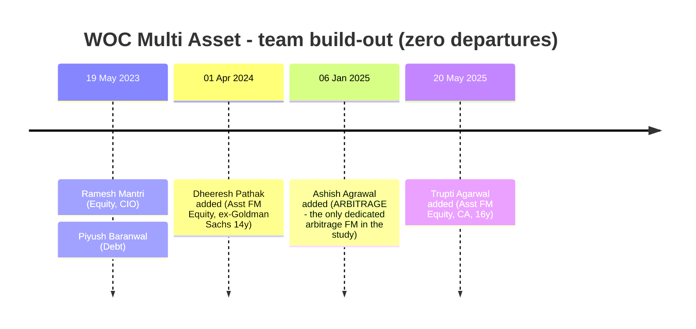
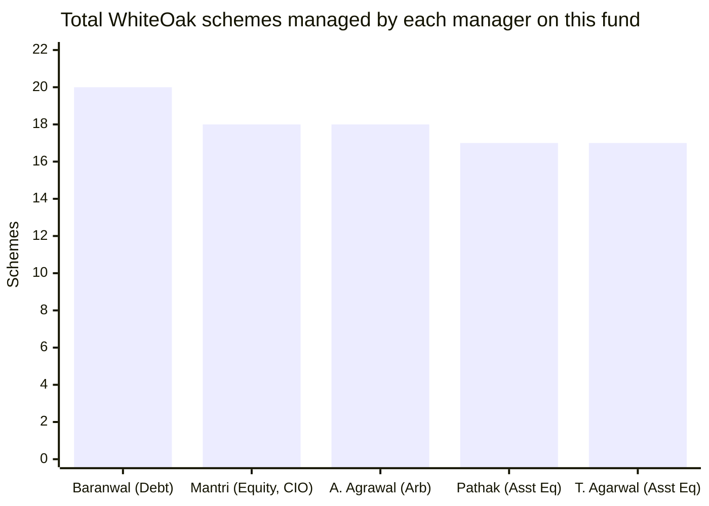
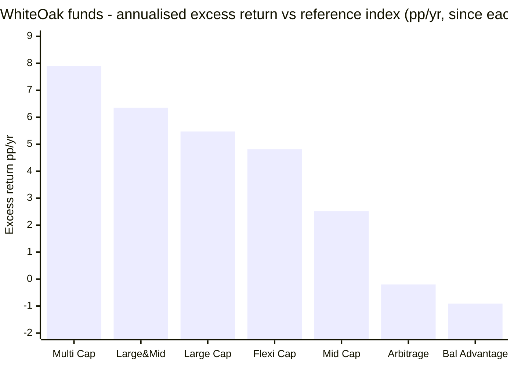
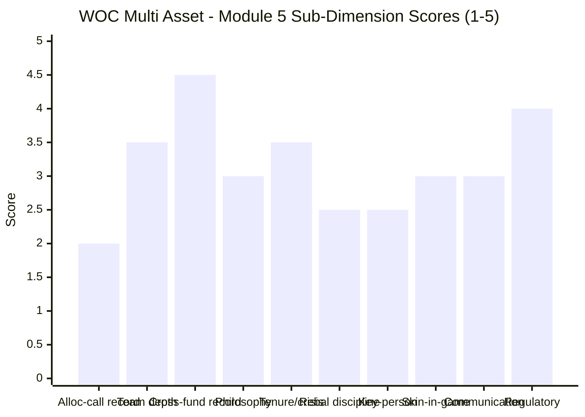

# Module 5: Fund Manager / Team Quality — WhiteOak Capital Multi Asset Allocation Fund

> **Provisional Module 5 score: ~3.0 / 5** (weight **10%** in the multi-asset re-weight — lower than the equity studies' 15%, because allocation here is more model/mandate-driven than single-manager stock-picking). **Scores are NOT comparable to the four equity categories.**

> **The one-line context:** on paper this is the **deepest and most properly specialised team in the study** — five named managers with genuinely distinct roles, including the only **dedicated arbitrage fund manager** any studied fund employs, led by the AMC's **CIO**. Their **stock-selection record is outstanding**: across five other WhiteOak equity funds, Ramesh Mantri's schemes beat their reference indices by **+2.5 to +7.9 percentage points a year**, including beating Edelweiss MidCap — this study's own MidCap winner. And then the module's decisive fact arrives, in the CIO's own published words: **"We are not macro or thematic investors making top-down bets."** The SID says the same thing — *"our investment philosophy is to invest in businesses based on stock selection and to avoid focusing on macro events."* **The people running a top-down macro asset-allocation product have publicly and repeatedly disavowed top-down macro investing.**
>
> **⭐ And the cross-fund evidence proves it is not rhetoric.** Of the seven WhiteOak funds testable here, **five stock-selection funds beat their benchmarks handsomely — and the only two that do not are the two allocation products**: WhiteOak Balanced Advantage (−0.91pp/yr vs Nifty 500) and this fund (allocation contribution −2.56%/yr, per M1). **Two independent products, same team, same result: excellent selection, no allocation alpha.** M1 inferred it from one fund's returns; M3 measured a frozen dial; M5 now shows the pattern repeats in a *second* product run by the *same people*. This is no longer a single-fund artifact — it is a house characteristic.

---

## ⚠ The `no-2022-data` Flag — What It Means for Manager Assessment

| The framework's manager tests | WOC |
|---|---|
| **Added gold before 2020/2022?** | ❌ **Fund did not exist** — no call to grade |
| **Cut equity at the Sep-2024 top?** | ❌ **No — equity stayed ~28%** (M3: the dial never moved) |
| **Managed *this mandate* through a bond bear market (2022)?** | ❌ **No** |
| Individual managers' crisis experience elsewhere | ✅ **Deep** — see §3 |
| Rebalance discipline in the one crash they saw (Jan-2026) | ⚠ **Position was right; no *decision* was taken** |

**The distinction that governs this module:** the *individuals* carry substantial crisis experience (Goldman Sachs through the GFC, Head of Fixed Income through IL&FS, twenty years of Indian equity). The *team on this mandate* has made no observable allocation decisions at all. Per the study plan, *"these calls, not stock picks, are the job."* There are no calls to grade.

---

## Fund Identity / Raw Data — the Team (per-metric source attribution)

| Manager | Role (SID verbatim) | On this fund since | Age / Qualification | Career | **Other WhiteOak schemes managed** |
|---|---|---|---|---|---|
| **Ramesh Mantri** | **"(For Equity Securities)"** — also **CIO of WhiteOak Capital AMC** | **Inception (19 May 2023)** | 45 / **MBA, CFA, CA** | 20+ yrs. WhiteOak Capital AMC (Dec 2021–); WhiteOak Capital Management (Jun 2017–Dec 2021); Ashoka Capital Advisers (Feb 2013–May 2017) | ⚠ **17 others (18 total)** |
| **Piyush Baranwal** | **"(For Debt Securities)"** — Executive President, Senior FM (Fixed Income) | **Inception** | 41 / BE, PGDBM, **all 3 CFA levels** | 18+ yrs FI. WhiteOak (Nov 2021–); **YES Asset Management (Oct 2018–Oct 2021)**; **Head of Fixed Income, BOI AXA (Jul 2014–Oct 2018)**; earlier Morgan Stanley IM | ⚠ **19 others (20 total)** — incl. Liquid & Ultra Short Duration |
| **Dheeresh Pathak** | "(Assistant Fund Manager – Equity)" | **01 Apr 2024** | 43 / PGDBM, BE (E&C) | WhiteOak (Jun 2022–); **Goldman Sachs (Apr 2007–Jun 2021) — 14 years** | ⚠ **16 others (17 total)** |
| **Ashish Agrawal** | **⭐ "(Arbitrage)"** | **06 Jan 2025** | 46 / PGDM (Finance) | WhiteOak (Aug 2022–); **Motilal Oswal AMC (Sep 2016–Jul 2022)**; **Citigroup Global Markets India (Oct 2010–Sep 2016)** | ⚠ **17 others (18 total)** |
| **Trupti Agarwal** | "(Assistant Fund Manager – Equity)" | **20 May 2025** | 41 / B.Com, **CA** | 16+ yrs. WhiteOak AMC (Dec 2021–); WhiteOak Capital (Jul 2017–Dec 2021) | ⚠ **16 others (17 total)** |

*All role titles, dates, ages, qualifications and scheme lists quoted from the **SID §E "Who manages the scheme?"** (AMFI portal doc 13647). Mantri's CIO title from ValueResearch interview and AMC materials.*

| Attribute | Value | Source |
|---|---|---|
| **⚠ Roles missing** | **No commodity/gold manager. No asset-allocation manager.** Roles are assigned by *security type* (equity / debt / arbitrage), not by allocation | **SID §E** |
| Manager departures since inception | **Zero** — the two inception managers are both still in place | SID / Groww |
| Additions | Pathak (Apr-2024), Ashish Agrawal (Jan-2025), Trupti Agarwal (May-2025) — a **build-out**, not a churn | SID |
| **House philosophy (SID verbatim)** | *"At WhiteOak Capital AMC, our investment philosophy is to invest in businesses **based on stock selection and to avoid focusing on macro events**."* | **SID, verbatim** |
| **CIO philosophy (published)** | *"**We are not macro or thematic investors making top-down bets.**"* — Ramesh Mantri | ValueResearch interview |
| AMC's four stated pillars | Stock-selection-based philosophy · high-calibre research team · disciplined analytical process · balanced portfolio construction — **all four are selection pillars; none is allocation** | WhiteOak / Business Standard |
| AMC provenance | **Former YES Asset Management**, acquired by White Oak Capital group Nov-2021; renamed 12 Jan 2022. Founder **Prashant Khemka**, ex-CIO Goldman Sachs AM India Equity & Global EM Equity | Business Standard / AMC press release |
| Skin in the game | SEBI-mandated: key personnel invest **20% of salary**, **3-year lock-in**. No enhanced/voluntary co-investment disclosure found | SEBI norms / SAI |
| Regulatory record (personal & AMC) | **No SEBI enforcement action found** against the AMC or any of the five managers | SEBI filings search |
| **AMC's own performance disclosure** (to 31-Mar-2026) | Fund SI **16.28%** vs benchmark **14.60%** → **alpha +1.68%/yr**; ⚠ **1-year: fund 13.29% vs benchmark 13.65% — the fund LAGGED** | **SID §G, verbatim** |
| **⚠ Benchmark changed 23 Apr 2026** | From **BSE 500 TRI 35 / CRISIL ST Bond 45 / Gold 19 / Silver 1** → **BSE 500 TRI 30 / CRISIL ST Bond 50 / Gold 16 / Silver 1 / iCOMDEX 3** | **SID §G footnote, verbatim** |

---

## Cross-Source Verification

| Item | Sources | Verdict |
|---|---|---|
| Manager roles & dates | **SID (primary)** vs Groww vs VR | ✅ **SID authoritative and more granular** — it alone discloses the *"(Arbitrage)"* role that resolved M3's central question. Groww's dates match |
| **Alpha vs own benchmark** | **AMC's SID: +1.68%/yr** (to 31-Mar-26) · **M1 computed: +1.92%/yr** (to 31-Jul-26) · **AdvisorKhoj implied: +4.23%/yr** | ✅ **Three-way corroboration.** M1's figure sits between the AMC's own disclosure and AdvisorKhoj's; **M1 was appropriately conservative** |
| Benchmark version | AdvisorKhoj shows the **old 35/45/19/1**; the SID shows the **new 30/50/16/1/3** | ⚠ **Both are right for their date.** The SID footnote confirms the change took effect **23 Apr 2026**. M1 used the current version — correct, but see §6 |
| Mantri's CIO status | VR interview + AMC materials + no departure notice found | ✅ In place as of Jul-2026 |
| Baranwal's YES AMC move | Oct-2021 YES AMC → Nov-2021 WhiteOak | ✅ **Not a job-hop** — WhiteOak *acquired* YES AMC in Nov-2021; he transferred with the business |
| Scheme counts | SID scheme lists, counted directly | ✅ 17–19 other schemes each |

**Reliability: HIGH.** This is the best-documented team in the study, because the SID lists roles, dates, ages, qualifications, ten-year career histories and complete scheme lists for all five managers. **The one gap:** no disclosure of *who owns the asset-allocation decision*, which is precisely the role this category needs named.

---

## 1. ⭐ Team Depth & Structure — the Best in the Study, With Two Holes Where It Matters

**What is genuinely excellent:**

| Study-plan requirement | WOC | Peers |
|---|---|---|
| "Single-manager multi-asset is a key-person red flag" | ✅ **Five managers** | ABSL 3, SBI 2–3, **Quant 1** |
| "Who runs debt?" | ✅ **Piyush Baranwal — a genuine fixed-income career** (18y, ex-Head of FI at BOI AXA, ex-Morgan Stanley IM, all 3 CFA levels) | ABSL ✅, UTI thin |
| "Who runs gold?" | ❌ **Nobody** | **ABSL ✅ (Sachin Wankhede, commodities)** |
| **Specialist for the actual return engine** | ⭐ **Ashish Agrawal, "(Arbitrage)", ex-Motilal Oswal AMC + Citigroup** — the only such appointment in the study | none |
| Zero departures since inception | ✅ | Nippon ❌ (architect left) |
| Team built out, not churned | ✅ three additions in two years | — |

**⭐ The arbitrage appointment is the single most informative fact in this module.** M1 hypothesised from returns that the "silver" line was hedged arbitrage; M3 confirmed it from the SID's authorisation and the 27.31%-notional-vs-~11–14%-effective gap. **M5 supplies the organisational proof: on 6 January 2025 the AMC put a dedicated arbitrage specialist on this fund**, and measured silver beta fell to zero from that point. The AMC also runs a standalone WhiteOak Capital Arbitrage Fund. **This was a deliberate, resourced strategy build-out, not drift.**

**⚠ And the two holes, which are structural rather than incidental:**

1. **No commodity/gold lead** — in a fund holding **27.31% notional metals**. The study plan asks the question explicitly ("who runs gold?") and ABSL answers it with a named commodities manager. WOC does not. *In fairness this is coherent rather than negligent:* M3 established the fund takes **no directional commodity view** — it arbitrages. You do not need a gold strategist if you are not forecasting gold. But an investor buying a "multi asset" fund for its gold exposure should know that **nobody at the AMC is paid to have a view on gold.**
2. **⚠ No asset-allocation lead at all.** The SID assigns roles by *security type*: equity, debt, arbitrage. **Not one of the five managers is named as responsible for the allocation decision** — the decision that defines the category and that the fund's marketing sells. Combined with M3's finding that the SID makes the proprietary model advisory and gives the fund manager "final authority," **the allocation call is owned by no one in particular and constrained by nothing in particular.**

### ⚠ The workload problem

**Every manager on this fund also manages 16–19 other WhiteOak schemes.** This is not a dedicated multi-asset team — it is **the AMC's entire investment bench bolted onto every scheme in the house.** Two readings, both valid:

- **Benign:** WhiteOak runs a genuinely centralised, research-driven process — the CIO's stated model is a large shared analyst bench feeding one philosophy into every portfolio. Mantri: *"one of the best investment teams in the industry — not just in size, but in quality."* Under that model, listing everyone on everything is honest disclosure of how decisions are actually made.
- **⚠ Adverse:** it means **no one is dedicated to this fund**, and the "five-manager team" that looks like depth is the same five names an investor would find on WhiteOak's Pharma fund, its ESG fund and its Liquid fund. **It also concentrates key-person risk to an extreme degree** — see §5.

---

## 2. ⭐ Cross-Fund Record — Excellent at Selection, Absent at Allocation (the module's decisive exhibit)

The single best test of a manager is what else they run. **Seven WhiteOak funds have enough history to measure**, each against a fair reference over its own life.

| WhiteOak fund | Inception | Life | CAGR | Reference | Reference CAGR | **Excess** | Type |
|---|---|---|---|---|---|---|---|
| **Multi Cap** | Sep 2023 | 2.85y | 20.03% | Nifty 500 | 12.14% | **+7.90pp** | Selection |
| **Large & Mid Cap** | Dec 2023 | 2.60y | 15.30% | Nifty 500 | 8.94% | **+6.35pp** | Selection |
| **Large Cap** | Dec 2022 | 3.66y | 13.97% | Nifty 50 | 8.50% | **+5.47pp** | Selection |
| **Flexi Cap** | Aug 2022 | 3.99y | 17.64% | Nifty 500 | 12.83% | **+4.81pp** | Selection |
| **Mid Cap** | Sep 2022 | 3.89y | 23.79% | **Edelweiss MidCap** *(this study's MidCap winner)* | 21.27% | **+2.52pp** | Selection |
| Arbitrage | Sep 2024 | 1.89y | 7.29% | Short-term debt | 7.49% | −0.20pp | Arbitrage *(as expected)* |
| **⚠ Balanced Advantage** | Feb 2023 | 3.46y | 13.94% | Nifty 500 | 14.86% | **−0.91pp** | **ALLOCATION** |
| **⚠ Multi Asset (this fund)** | May 2023 | 3.19y | 16.90% | *(own blend)* | 14.99% | +1.92pp total — **but allocation −2.56pp** (M1) | **ALLOCATION** |

**The pattern is unambiguous and it is the most important thing this module establishes.**

- **Every stock-selection fund beats its reference, by +2.52 to +7.90 percentage points a year.** Beating the Nifty 500 by nearly five points over four years in Flexi Cap, and out-returning Edelweiss MidCap — the fund this study's own MidCap category ranked first — is a serious, verifiable selection franchise. **This is a genuinely good equity house.**
- **The only two funds that fail are the two allocation products.** Balanced Advantage, which flexes equity by a valuation model, has *underperformed a plain Nifty 500 index* over 3.46 years. And this fund's allocation contribution is **−2.56%/yr** (M1).

**Why this matters more than any single-fund finding:** M1 measured negative allocation contribution in one fund over 3.19 years and could not rule out regime bad luck. **M5 shows the same team produced the same result in a second, independent allocation product over a different window.** Two observations do not make a law, but they make the M1 finding much harder to dismiss — and they align exactly with what the team says about itself.

---

## 3. Philosophy, Tenure and Crisis Experience

### ⭐ Philosophy: the clearest in the study, and pointed the wrong way

| Source | Statement |
|---|---|
| **SID (verbatim)** | *"At WhiteOak Capital AMC, our investment philosophy is to invest in businesses **based on stock selection and to avoid focusing on macro events**. We believe in investing in good businesses at attractive valuations."* |
| **CIO Ramesh Mantri (published interview)** | *"**We are not macro or thematic investors making top-down bets.**"* |
| **AMC's four stated pillars** | Stock-selection-based philosophy · high-calibre research team · disciplined analytical process · balanced portfolio construction — **all four are selection pillars** |
| **The product being sold** | *"Based on Relative Attractiveness of Asset Classes — **Internal Proprietary Model to provide direction**"* (fund brochure) |

**On clarity this scores a 5 — no fund in this study articulates its philosophy more consistently or more testably.** On *fit* it scores close to a 1: **a house that explicitly avoids macro is running a macro-allocation product.** M3 found the resulting behaviour exactly as the philosophy predicts — a frozen equity dial (22.7–30.1%) inside a 10–80% mandate, with the value coming from instrument selection and arbitrage.

**The charitable reading, which deserves airing:** WhiteOak may be running this fund *honestly* — declining to make macro bets it does not believe it can make, holding a sensible strategic mix, and adding value where it actually has an edge. That is defensible investing. **It is simply not the product described in the brochure, and the investor is paying an allocation-fund fee for a selection-and-carry outcome.**

### Philosophy under stress — held the line

In the Jan–Mar 2026 tri-asset crash (equity −10.6%, gold −24.7%, silver −43.5%) the team **did not deviate**: equity stayed ~28%, the metals underweight persisted, and the fund lost 5.15% against its own benchmark's 10.88% (M2). **Discipline: genuinely good.** But per M3 this was *static positioning holding*, not a decision taken — and the same posture under-participated in 2025's metals melt-up (−1.96 alpha).

### Tenure & crisis experience — deep in the people, absent in the mandate

| | Crisis exposure |
|---|---|
| **Mantri** | Managing Indian equity since 2013 (Ashoka Capital), WhiteOak Capital Management from Jun 2017 — **through 2018 IL&FS, 2020 COVID and 2022** |
| **Baranwal** | 18y fixed income — **Head of Fixed Income at BOI AXA through the 2013 taper tantrum and up to Oct 2018 (IL&FS)**; YES AMC 2018–21 (COVID); WhiteOak through 2022's rate shock |
| **Pathak** | **14 years at Goldman Sachs (2007–2021)** — spans the GFC and COVID |
| **Ashish Agrawal** | Citigroup 2010–16, Motilal Oswal AMC 2016–22 — through 2020 and 2022 |
| **This fund / this mandate** | ❌ **Zero.** No 2020, no 2022, no bond bear market |

> **⚠ A due-diligence note, stated carefully.** Baranwal was **Head of Fixed Income at BOI AXA Investment Managers until October 2018**, and BOI AXA's credit funds subsequently suffered significant credit events (2019–20). **He departed before those defaults materialised, and this study found no evidence connecting him to them** — the searches returned no regulatory action, no adverse finding, and no contemporaneous reporting naming him. It is recorded here as a **verification item for anyone doing deeper diligence**, not as a finding. His current book (M3: sovereign, T-bills, PFC/IRFC/NABARD/SIDBI, modest NBFC reach) shows **no credit reaching**.

---

## 4. Allocation-Call Track Record — There Are No Calls (Tier-1, Critical)

The category's defining manager test. **Reconstructing the asset path and grading each turn:**

| Turn | What a skilled allocator should do | What the team did | Grade |
|---|---|---|---|
| ❌ 2020 COVID crash | Buy equity into the crash; harvest gold | **Fund did not exist** | — |
| ❌ 2022 all-classes diverge | Hold gold, cut duration | **Fund did not exist** | — |
| **2023 broad rally (+25.9%)** | Add equity if the model says cheap | **Equity ~29% — unchanged** | ⚠ No call |
| **Sep-2024 → Mar-2025 correction** | Stay defensive / add into weakness | **Equity ~28% — unchanged**; fund +3.41% vs index −12.62% | ✅ Outcome; ⚠ no call |
| **2025 metals melt-up (gold +71.9%, silver +155.7%)** | Hold, then harvest | **~11–14% effective metals vs benchmark 20%; silver beta 0%** — under-participated (−1.96 alpha) | ⚠ **Missed** |
| **Jan–Mar 2026 tri-asset crash** | Be underweight the crowded trade | **Metals underweight worth +5.73pp of protection** vs own benchmark | ✅ Outcome; ⚠ same static position |
| **06 Jan 2025 — arbitrage FM appointed** | *(organisational)* | Silver beta → 0 thereafter; preceded silver's −43.5% fall | ⚠ **Cannot be graded** — deliberate risk call or arbitrage book scaling? Returns cannot distinguish |

**Verdict: the fund's positioning was wrong in the melt-up and right in the crash — and it was the *same position* both times.** The team did not move into the 2025 rally and did not move out of it. **That is not an allocation track record; it is a static posture with two different outcomes.**

**The one genuinely creditable organisational decision** is the January-2025 arbitrage build-out, which converted directional metals risk into hedged carry ahead of the worst commodity drawdown in the fund's life. Whether that was foresight or capacity-driven scaling **cannot be determined from returns**, and this module does not claim it as skill.

---

## 5. Key-Person & Succession Risk — the Most Concentrated in the Study

| Risk | Assessment |
|---|---|
| **⚠ CIO concentration** | **Ramesh Mantri is CIO *and* a named manager on 18 schemes**, including every equity and hybrid fund in the house. **If he leaves, essentially the entire WhiteOak fund range changes manager simultaneously.** No studied AMC has this degree of single-person coverage |
| **⚠ Bench overlap, not bench depth** | The same five names appear on 16–20 schemes each. The apparent five-manager depth on this fund is **not fund-specific resourcing** |
| Mitigants | ✅ A genuinely large shared analyst bench (the AMC's stated model); ✅ **founder anchor** in Prashant Khemka (ex-Goldman Sachs AM CIO), whose firm this is; ✅ **zero departures** from this fund since inception; ✅ successors are already named on the scheme (Pathak, Trupti Agarwal) |
| Succession plan | ⚠ **Not formally disclosed.** In practice the assistant-FM structure functions as one |
| Two-layer manager structure (feeder/sub-advised) | ✅ **N/A** — no FoF or sub-advised sleeve; the third-party gold ETFs are passively held, not delegated mandates |
| Manager accessibility / translation gap | ✅ **N/A** — domestic team, English-language interviews and disclosures available |

---

## 6. Governance Signals — Communication, Skin in the Game, and a Benchmark Change

| Signal | Assessment |
|---|---|
| **Investor communication — access** | ✅ **Good.** The CIO gives substantive published interviews; the **SID discloses the allocation model's actual parameters** (M3: the best model disclosure in the study) |
| **Investor communication — accuracy** | ❌ **Poor, on two counts.** (1) The AMC's live fund brochure still headlines *"Long Term Capital Gain Tax and Indexation Benefit"* — abolished by the Finance (No. 2) Act 2024 (M1/M4). (2) The published asset table shows **27.31% metals** against **~11–14% effective** exposure (M3). **Good access to inaccurate information** |
| **⚠ Benchmark changed 23 Apr 2026** | From **35/45/19/1** to **30/50/16/1/3**. Two-sided: ✅ the new 30% equity weight is **more representative** of the fund's measured ~28% book — a genuine honesty improvement; ⚠ but on this study's proxies it also **lowered the hurdle by 0.38pp/yr** (15.37% → 14.99%), raising computed alpha from +1.53% to +1.92% — **and it happened one month after the March-2026 crash.** Recorded as a flag, not an accusation: the direction of the change is defensible on substance |
| **AMC's own disclosure honesty** | ✅ **Creditable.** The SID's performance table reports the fund **lagging its benchmark over 1 year (13.29% vs 13.65%)** — an AMC that publishes its own underperformance in the scheme document is not hiding |
| Skin in the game | ⚠ **Meets the SEBI standard, nothing more evidenced** — 20% of key-personnel salary, 3-year lock-in. No enhanced or voluntary co-investment disclosure found |
| **Regulatory record** | ✅ **Clean.** No SEBI enforcement action found against the AMC or any of the five managers. (Contrast Quant's active front-running probe) |
| Investor-base character | ⚠ Retail-oriented (₹100 minimum SIP), but **M4 found AUM down 8.5% in six weeks against a rising NAV** — implying net redemptions. Accountability pressure is real |

---

## Comparison with Studied Funds

| Dimension | **WOC** | SBI | Nippon | UTI | ABSL | Quant |
|---|---|---|---|---|---|---|
| Named managers | **5** ✅ | 2–3 | 3 | 3 | 3 | **1** ⚠ |
| Equity lead | **CIO, MBA/CFA/CA, 20y** | strong | strong | quant | sector specialist | founder |
| Debt lead | ✅ **18y, ex-Head FI BOI AXA** | ✅ | ✅ | thin | ✅ Bameta | ⚠ |
| **Commodity/gold lead** | ❌ **None** | ❌ | ✅ best | ❌ | ✅ **Wankhede** | ❌ |
| **Arbitrage specialist** | ⭐ **Yes — only one in the study** | ❌ | ❌ | ❌ | ❌ | ❌ |
| **Allocation owner named** | ❌ **Nobody** | ❌ | partial | model | ❌ | founder |
| Departures since inception | ✅ **Zero** | — | ❌ **architect left** | — | — | — |
| **Cross-fund record** | ⭐ **+2.5 to +7.9pp across 5 equity funds** | good | good | mixed | good | strong/erratic |
| **Allocation record** | ⚠ **None; −2.56%/yr here, −0.91pp in BAF** | none | active | ❌ **worst call in study** | ✅ **all calls correct so far** | mixed |
| Philosophy clarity | ⭐ **Clearest — and anti-macro** | moderate | moderate | documented, refuted | ❌ **none published** | VLRT |
| Key-person risk | ⚠ **CIO on 18 schemes** | low | ⚠ transition | low | low | ❌ **total** |
| Regulatory record | ✅ Clean | ✅ | ✅ | ✅ | ✅ | ❌ **front-running probe** |
| **Module 5 score** | **~3.0** | **~3.2** | **~3.0** | **~2.8** | **~3.2** | **~2.4** |

**The cross-read:** WOC has the **best team structure and the best cross-fund selection record in the study**, and finishes mid-pack because the category scores *allocation* skill, not equity skill. **SBI and ABSL edge ahead (3.2) for opposite reasons** — SBI on structure and low key-person risk, ABSL because its allocator has actually made calls and got them right. **WOC ties Nippon (3.0):** Nippon has the better allocation engine but lost its architect; WOC has kept everyone and has no allocation engine to lose.

---

## Points For / Points Against — Manager & Team

### ✅ For
1. **⭐ Deepest, most properly specialised team in the study** — five named managers with genuinely distinct roles, led by the AMC's CIO, and **zero departures** since inception.
2. **⭐ The only dedicated arbitrage fund manager in the studied universe** (Ashish Agrawal, ex-Motilal Oswal AMC + Citigroup, appointed 06-Jan-2025) — organisational proof that the fund's actual return engine is deliberately resourced, not accidental.
3. **⭐ Outstanding cross-fund selection record: +2.52 to +7.90pp/yr across five WhiteOak equity funds** — including out-returning Edelweiss MidCap, this study's own MidCap winner.
4. **A genuine fixed-income career at the debt seat** — Baranwal, 18 years, all three CFA levels, ex-Head of Fixed Income at BOI AXA and ex-Morgan Stanley IM; his current book shows no credit reaching.
5. **The clearest, most consistently articulated philosophy in the study** — stated identically in the SID, the CIO's published interviews and the AMC's four pillars.
6. **Deep individual crisis experience** — Goldman Sachs through the GFC (Pathak, 14 years), Head of FI through IL&FS (Baranwal), Indian equity since 2013 (Mantri).
7. **Discipline held under stress** — no deviation through the Jan-2026 tri-asset crash; the fund lost 5.15% against its own benchmark's 10.88%.
8. **Clean regulatory record** — no SEBI action against the AMC or any manager (contrast Quant).
9. **Creditable disclosure honesty in places** — the SID publishes the fund's own 1-year *underperformance* (13.29% vs 13.65%), and discloses the allocation model's actual parameters.
10. **Team was built out, not churned** — three specialist additions in two years, no exits.

### ❌ Against
1. **⚠ THE FINDING: no allocation track record exists, and the cross-fund evidence says that is systemic.** Of seven testable WhiteOak funds, the five selection funds beat their benchmarks and **the only two that fail are the two allocation products** — Balanced Advantage (−0.91pp/yr vs Nifty 500) and this fund (allocation −2.56%/yr). Same team, two products, same result.
2. **⚠ The team has publicly disavowed the approach the product sells.** SID: *"avoid focusing on macro events."* CIO: *"We are not macro or thematic investors making top-down bets."* **They are running a top-down macro asset-allocation fund.**
3. **⚠ Nobody is named as the allocation decision-maker.** Roles are assigned by security type (equity/debt/arbitrage); the category's defining decision has no owner — and per M3 the SID gives the fund manager authority to override the model at will.
4. **⚠ No commodity/gold lead** despite 27.31% notional metals — the study plan asks the question explicitly and ABSL answers it with a named commodities manager.
5. **⚠ Extreme key-person concentration** — the CIO is a named manager on **18 schemes**; every manager on this fund runs 16–20 others. **The five-manager "depth" is the AMC's whole bench, not fund-specific resourcing**, and a Mantri departure would change the manager on essentially every WhiteOak fund at once.
6. **No allocation calls to grade in either direction** — the equity dial moved 7.4pp in the fund's life; the 2025 melt-up was missed and the 2026 crash was survived **from the same static position**.
7. **⚠ Communication is accessible but inaccurate** — the live brochure still markets an indexation benefit abolished in July 2024, and the published asset table overstates commodity exposure by roughly 2.5×.
8. **⚠ The benchmark was changed on 23 Apr 2026**, one month after the crash, in a direction that **lowered the hurdle by ~0.38pp/yr** on this study's proxies — though the new weights are also more representative of the real book.
9. **Skin in the game meets the SEBI minimum with nothing additional evidenced.**
10. **The mandate has zero crisis history** — no 2020, no 2022, no bond bear market, and the individuals' experience was earned on other products.
11. **⚠ A due-diligence item at the debt seat** — Baranwal headed fixed income at BOI AXA until Oct-2018, a franchise that later suffered credit events; no evidence connects him to them, but it warrants verification.

---

## Module 5 Scorecard

| Sub-dimension | Weight | Score | Reasoning |
|---|---|---|---|
| **Allocation-call track record** *(Critical)* | 22% | **2.0** | ❌ **No calls exist to grade** — equity moved 7.4pp in the fund's life; the 2025 melt-up was missed and the 2026 crash survived from the *same* static position. **Aggravated by the cross-fund evidence**: the team's other allocation product (Balanced Advantage) also underperforms. Lifted off 1.5 only because the static defensive posture is Calmar-positive (M2) and the Jan-2025 arbitrage build-out was a real, well-timed organisational decision |
| **Team depth & structure** *(High)* | 15% | **3.5** | ✅ **Five specialised managers, the only dedicated arbitrage FM in the study, zero departures** — the best structure on paper. ⚠ Docked hard for **no commodity lead** (27.31% metals) and **no allocation owner at all**, plus the fact that the "team" is the AMC's whole bench (16–20 schemes each), not fund-specific resourcing |
| **Cross-fund performance consistency** *(High)* | 13% | **4.5** | ⭐ **+2.52 to +7.90pp/yr across five WhiteOak equity funds**, including out-returning this study's own MidCap winner. A serious, verifiable selection franchise. Held off 5.0 because the two allocation products are the two that fail |
| **Philosophy clarity + fit** *(High)* | 15% | **3.0** | ⭐ **Clarity ≈ 5** — stated identically in the SID, the CIO's interviews and the AMC's four pillars; ❌ **fit ≈ 1.5** — the philosophy explicitly rejects macro/top-down, which is exactly what the product is. Discipline under stress held (Jan-2026) |
| **Tenure & crisis experience** *(High)* | 12% | **3.5** | ✅ Deep in the individuals (Goldman 14y, Head of FI through IL&FS, equity since 2013) and both inception managers still in place; ❌ **the mandate itself has zero crisis history** — no 2020, no 2022, no rate shock |
| Sell / rebalance discipline *(Medium)* | 10% | **2.5** | ⚠ M3: no equity rebalancing at all; metals flexed 8.7–20%. The one good outcome (2026 metals underweight, +5.73pp protection) was **static positioning, not a decision**; the same position under-participated in 2025 |
| **Key-person / succession risk** | 8% | **2.5** | ⚠ **The most concentrated in the study** — CIO named on 18 schemes; a departure changes the manager on essentially every WhiteOak fund simultaneously. Mitigated by a large shared analyst bench, the Khemka founder anchor, named assistant FMs and zero departures to date |
| Skin in the game | 2% | **3.0** | Meets the SEBI standard (20% of key-personnel salary, 3-year lock-in); no enhanced or voluntary co-investment disclosed |
| Investor communication | 2% | **3.0** | ✅ Good access (substantive CIO interviews, best model disclosure in the study, publishes own underperformance) — ❌ undermined by a live brochure marketing an abolished tax benefit and an asset table overstating metals ~2.5× |
| Regulatory record | 1% | **4.0** | ✅ Clean — no SEBI action against the AMC or any of the five managers |
| Investor-base character | *informational* | — | Retail-oriented (₹100 min SIP) but AUM −8.5% in six weeks against a rising NAV (M4) — real redemption pressure |
| Two-layer manager structure / accessibility | *informational* | — | **N/A** — no FoF or sub-advised sleeve; domestic team, English disclosures |
| **Module 5 Overall** | **100%** | **~3.0 / 5** | **The best team structure and the best cross-fund selection record in the study, attached to a complete absence of allocation skill that the team itself has publicly disavowed any intention of having.** Five specialists, zero departures, a clean regulatory file and an equity franchise beating its indices by up to 7.9pp/yr — but nobody owns the allocation decision, there is no commodity lead, the CIO is spread across 18 schemes, and the only other allocation product this team runs also underperforms. Not comparable to equity-category Module 5 scores |

---

## Comparative Module 5 Scores (studied funds — calibration only)

| Fund | Module 5 | Team verdict |
|---|---|---|
| SBI Multi Asset | ~3.2 / 5 | Strong lead, ideal structure, low key-person risk — no demonstrable allocation skill |
| ABSL Multi Asset | ~3.2 / 5 | Cleanest attribution, best macro credential, every allocation call correct so far — no commodities specialist, no documented philosophy |
| **WOC Multi Asset** | **~3.0 / 5** | **Best structure and best cross-fund selection record in the study — and no allocation skill, which the team openly says it does not pursue** |
| Nippon Multi Asset | ~3.0 / 5 | Best team structure, undercut by a live unproven transition — the architect left |
| UTI Multi Asset | ~2.8 / 5 | Right shape, wrong results — made the study's worst allocation call |
| Quant Multi Asset | ~2.4 / 5 | Singular talent inseparable from the worst governance and total key-person risk |

> Module 5 is 10% here (vs 15% in the equity studies) because allocation is more model-driven than manager-driven. **WOC ties Nippon at 3.0, third of six.** The ordering is worth stating precisely: **WOC would score materially higher in any of the four equity studies** — a +2.5-to-+7.9pp cross-fund record and a five-specialist bench is a strong equity-manager profile. **It scores 3.0 here because this category grades the one thing this team says it does not do.**

---

## SIP Implication

For a ₹15–20k/month SIP, Module 5 answers a question the earlier modules kept circling: *who is actually doing this, and are they good at it?* **The answer is that they are very good, at something else.** WhiteOak's investment bench is deep and properly specialised — five named managers with distinct mandates, the only dedicated arbitrage manager any fund in this study employs, a CIO with twenty years and a CFA/CA behind him, a real fixed-income career at the debt seat, and not one departure since the fund launched. Their stock-selection record is not marketing: across five other WhiteOak equity funds they have beaten their reference indices by **between 2.5 and 7.9 percentage points a year**, and one of those funds out-returned the mid-cap fund this study ranked first in its own category. An investor buying WhiteOak's equity capability is buying something demonstrably real.

**But this is not an equity fund, and the thing it is sold on is the thing this team has said — clearly, publicly, and more than once — that they do not do.** The SID states the house philosophy is *"to avoid focusing on macro events."* The CIO says in a published interview, *"We are not macro or thematic investors making top-down bets."* And the evidence matches the words exactly: nobody at the AMC is named as the allocation decision-maker, nobody is named for gold despite 27% of the portfolio sitting in metals, the equity dial has moved seven percentage points in three years inside a mandate permitting seventy, and **the only other allocation product this team runs — WhiteOak Balanced Advantage — has underperformed a plain Nifty 500 index over three and a half years.** That second data point matters: it turns M1's single-fund finding into a house characteristic.

**Two risks deserve sizing.** The CIO is a named manager on **eighteen schemes**; his departure would change the manager on essentially every WhiteOak equity and hybrid fund on the same day, and no formal succession plan is disclosed. And the fund's communication, while unusually accessible, is inaccurate where it counts — a live brochure still selling an indexation benefit abolished in July 2024, and an asset table showing 27% in gold and silver when the real directional exposure is closer to 12%. **The honest summary: a strong, stable, clean-record team running a product that plays to none of their stated strengths — and producing good outcomes anyway, through selection and arbitrage rather than through the allocation engine the fee is nominally buying.**

## One-Line Verdict

**The deepest team and the best cross-fund selection record in this study — five specialists, zero departures, a clean regulatory file, and equity funds beating their indices by up to 7.9 percentage points a year — running a top-down macro allocation product whose own CIO says in print "we are not macro or thematic investors making top-down bets," with nobody named as the allocation decision-maker, nobody named for the 27% metals sleeve, the CIO spread across eighteen schemes, and the team's only other allocation fund quietly underperforming a plain index.**

---

*Module 5 complete. Provisional score 3.0/5. **Method:** manager identities, roles, dates, ages, qualifications, ten-year career histories and complete scheme lists taken **verbatim from the SID §E** (AMFI portal doc 13647) — the primary source, which alone discloses Ashish Agrawal's **"(Arbitrage)"** role; philosophy quotes from the **SID** and a published **ValueResearch interview** with Ramesh Mantri; AMC provenance (YES AMC acquisition, Nov-2021) from Business Standard and the WhiteOak press release; benchmark-change footnote and the AMC's own performance table from **SID §G**. **Cross-fund record self-computed from MFAPI** over each fund's full life to 31-Jul-2026: WhiteOak Flexi Cap (150346), Mid Cap (150584), Large Cap (150797), Balanced Advantage (151267), Multi Cap (152071), Large & Mid Cap (152226), Arbitrage (152849), each against Motilal Oswal Nifty 500 Index (147625), ICICI Nifty 50 Index (120620), Edelweiss Mid Cap (140228) or HDFC Short Term Debt (119016) as appropriate. Regulatory record checked against SEBI filings; no action found.*

*⚠ **CROSS-MODULE CORROBORATION — M1 and M3 are strengthened, not corrected.** M1 measured an allocation contribution of **−2.56%/yr** and could not exclude regime bad luck over 3.19 years. M3 measured a frozen dial (22.7–30.1% equity inside a 10–80% mandate). **M5 supplies independent confirmation from a second product**: WhiteOak Balanced Advantage — same CIO, same debt lead, same valuation-model approach — has returned **13.94%/yr against the Nifty 500's 14.86%** over 3.46 years, i.e. **−0.91pp/yr**, while every one of the team's five stock-selection funds beats its reference by +2.52 to +7.90pp/yr. **The "no allocation alpha" finding now rests on two independent allocation products over different windows, plus the team's own stated philosophy.** No score changes to M1 or M3 — both already scored the dimension adversely — but the finding should be treated as **substantially more robust** than a single-fund result, and carried into the README and decision tree on that basis.*

*⚠ **A new flag for M6.** The **23-Apr-2026 benchmark change** (35/45/19/1 → 30/50/16/1/3) lowered the performance hurdle by ~0.38pp/yr on this study's proxies and took effect one month after the March-2026 crash — while also making the benchmark **more representative** of the real ~28%-equity book. Two-sided, and a **governance item for M6** alongside the stale indexation claim in live marketing (M1/M4) and the metals disclosure gap (M3). Also for M6: the AMC is the **former YES Asset Management**, acquired Nov-2021 — its institutional record before that date is not this AMC's record.*

***Cross-module handoffs:*** *the **CIO's 18-scheme load and the absence of a disclosed succession plan** → **M6 (AMC bench depth and franchise commitment)**; the **communication-accuracy failures** (abolished indexation claim, metals overstatement) → **M6 (investor-communication scoring)**; the **Baranwal / BOI AXA verification item** → **M6 (fixed-income desk credibility)**; the **absence of any commodity/gold lead** → **M6 (commodity-desk credibility — on current evidence there is no commodity desk to assess)**; the **cross-fund selection franchise** → **decision tree (it is the real, durable edge being bought)**. **Standing caveats: `no-2022-data`; the notional-vs-effective metals gap (M3); the unresolvable expense ratio (M4).** Running scorecard: **M1 ~3.4 · M2 ~4.1 · M3 ~2.9 · M4 ~3.3 · M5 ~3.0** (weighted ≈ 3.41/5 across 95% of the framework).*

*Next: [Module 6 — AMC Trustworthiness](module6_amc.md)*
