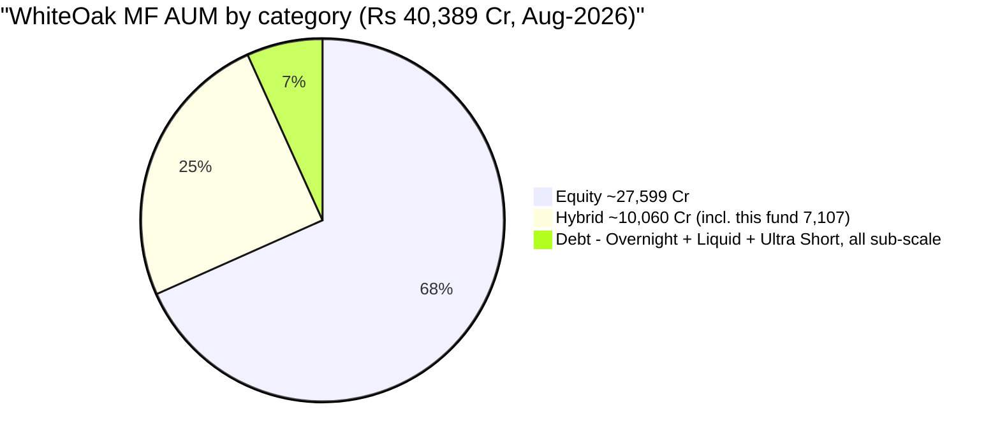
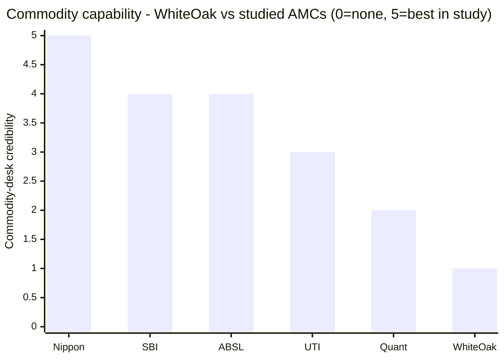
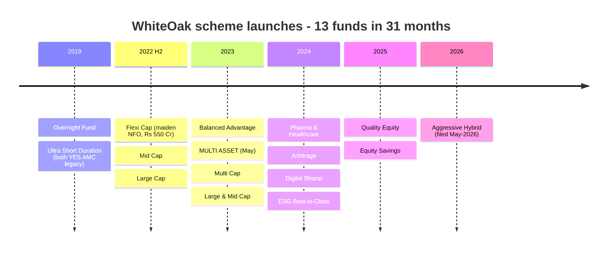
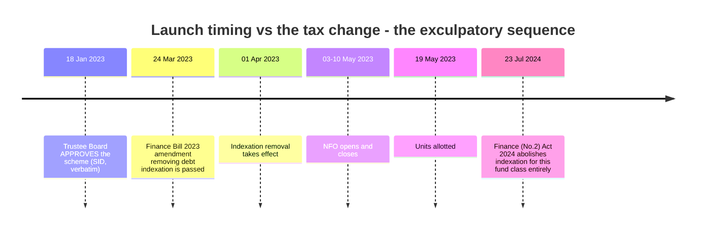
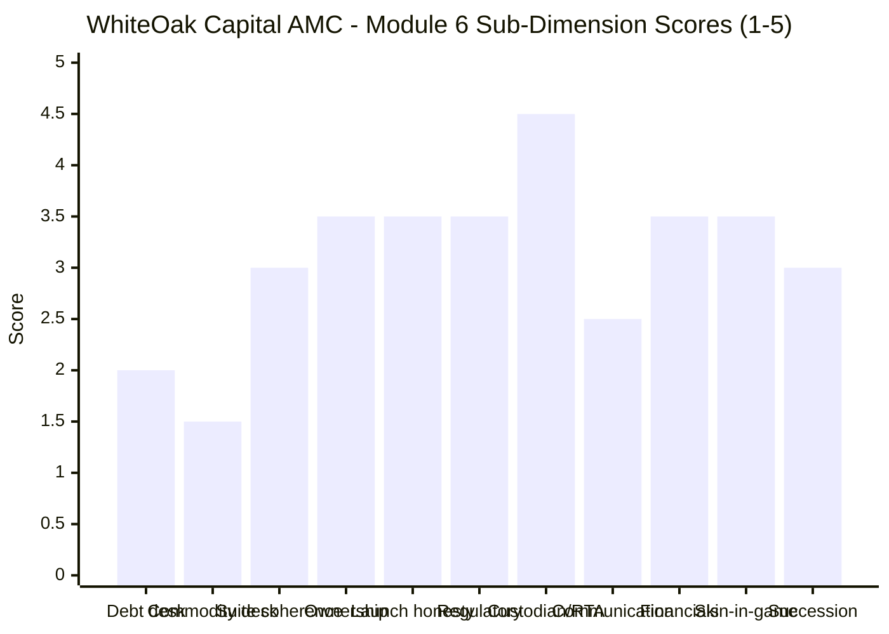

# Module 6: AMC Trustworthiness — WhiteOak Capital Asset Management

> **Provisional Module 6 score: ~2.8 / 5** (weight **5%**). **Scores are NOT comparable to the four equity categories.**

> **The one-line context:** WhiteOak is a **credible, founder-led, genuinely global equity boutique** — Prashant Khemka, formerly CIO of Goldman Sachs AM India *and* Global Emerging Markets Equity; a group managing **₹1,13,525 Cr** of equity across Switzerland, France, the UK and the UAE; a top-tier CEO in Aashish Somaiyaa; Deutsche Bank as custodian; CAMS as RTA; and **no SEBI enforcement action anywhere in its file.** Its commitment to *this* fund is not in doubt either — at **₹7,107 Cr it is the AMC's second-largest scheme and ~17.6% of its entire ₹40,389 Cr book.** This is not an autopilot flows-harvesting product.
>
> **And then the two dimensions this category exists to test, and on both WhiteOak is the weakest house in the study bar none.** The study plan warns that *"a strong equity AMC may run a weak debt desk — the category imports the AMC's fixed-income competence."* **WhiteOak's entire mutual-fund debt franchise is three cash-management schemes** — Overnight, Liquid and an Ultra Short Duration fund mandated to a **three-to-six-month** portfolio duration. **There is no corporate bond fund, no gilt fund, no short- or medium-duration fund, no dynamic bond fund, no credit risk fund** — and not one debt scheme large enough to appear in a fifteen-fund AUM table. Yet this Multi Asset fund holds **GOI 6.94% 2036** — ten-year paper. **And on commodities there is nothing to assess at all: no gold ETF, no silver ETF, no commodity fund, and no named commodity manager (M5).** The fund rents its gold exposure from ICICI Prudential and DSP (M3/M4). **An equity house is running a fund whose two non-equity sleeves sit outside its demonstrated competence.**

---

## ⚠ Carry-Forward Status: None — This Is a First Assessment

Per the module template, AMC verdicts carry forward where one exists (ICICI, SBI, Nippon, Quant, HDFC, UTI, ABSL). **WhiteOak has no prior verdict in this study series** — it appears in the MidCap screening lists only, never as a studied AMC. **This module is built from primary sources: the SID, the SAI (AMFI portal doc 71), and self-computed scheme-launch data.**

---

## Fund Identity / Raw Data — the AMC (per-metric source attribution)

| Attribute | Value | Source |
|---|---|---|
| AMC | **WhiteOak Capital Asset Management Ltd** — CIN U65990MH2017PLC294178 | **SID, verbatim** |
| Trustee | **WhiteOak Capital Trustee Ltd** — CIN U65999MH2017PLC294613 (separate company, independent board) | **SID, verbatim** |
| **Sponsor** | **GPL Finance and Investments Pvt Ltd** — a non-deposit-taking NBFC, incorporated 31 Jan 1994, RBI reg. 13.00856 (since 26 May 1998), 25+ years as an NBFC. Subsidiary of **WhiteOak Investment Management Pvt Ltd** | **SAI §B, verbatim** |
| **Founder** | **Prashant Khemka** — formerly **CIO and lead PM of both Goldman Sachs AM (India) and Global Emerging Markets Equity**, building ~**US$6.5bn** AUM | **SAI, verbatim** |
| MD & CEO | **Aashish P Somaiyaa** — 25+ years; ex-CEO Motilal Oswal AMC (2013–2020), earlier ICICI Prudential. Signed this SID 23 Apr 2026 | SID signature block / Groww |
| CIO | **Ramesh Mantri** (also named equity manager on this fund — see M5) | Groww / VR |
| **AMC provenance** | ⚠ **The former YES Asset Management**, acquired by White Oak Capital group **Nov 2021**; renamed **12 Jan 2022**. The mutual-fund business is **~4.5 years old under WhiteOak** | Business Standard / AMC press release |
| **Group equity AUM** | **₹1,13,525 Cr as of 31 May 2026** (from ~₹42,000 Cr in 2022) | **SAI, verbatim** |
| **Mutual-fund AUM** | **₹40,388.74 Cr across 21 schemes** | Groww AMC page, Aug 2026 |
| **This fund's share** | **₹7,107 Cr = ~17.6% of AMC AUM — the second-largest scheme in the house** | computed from Groww |
| Global footprint | Offices in Switzerland, France, the UK, the UAE; third-party distribution across the US, Australia, East Asia, the Nordics | **SAI, verbatim** |
| **Sponsor financials (₹ '000)** | **Net worth** FY26 **35,05,772** (₹3,506 Cr) · FY25 28,34,260 · FY24 28,34,032. **Total income** FY26 2,224 (₹2.2 Cr). ⚠ **PAT FY26 (4,071) = a ₹4.07 Cr LOSS**; FY25 +146; FY24 +2,659. AUM: **Nil** | **SAI, verbatim** |
| **Custodian** | ✅ **Deutsche Bank A.G.**, Mumbai — SEBI reg. **INCUS003** | **SAI §III, verbatim** |
| **Commodity-settlement custodian** | ✅ **Orbis Financial Corporation Ltd** — SEBI reg. **INCUS020** (for physical settlement of commodities contracts — appropriate given the ETCD book) | **SAI §III, verbatim** |
| **RTA** | ✅ **Computer Age Management Services Ltd (CAMS)** | **SAI / SID, verbatim** |
| **Regulatory record** | ✅ **No SEBI enforcement action found** against the AMC, the trustee, the sponsor or any of the five fund managers | SEBI filings search |
| ⚠ Penalties disclosure | **The SID does not list penalties inline** — it defers to a website link (`mf.whiteoakamc.com/download#Product_Related_Disclosures`) | **SID §H, verbatim** |
| **This scheme's Trustee approval** | **18 January 2023** — *two months before* the Finance Bill 2023 indexation amendment (24 Mar 2023) | **SID, verbatim** |
| Skin in the game | SEBI-mandated: key personnel invest **20% of salary**, **3-year lock-in**. No enhanced/voluntary co-investment disclosed | SEBI norms / SAI |

---

## Cross-Source Verification

| Item | Sources | Verdict |
|---|---|---|
| Group equity AUM | SAI **₹1,13,525 Cr** (31-May-2026) vs Business Standard **₹42,000 Cr** (2022) | ✅ Consistent growth trajectory, not a conflict — **2.7× in four years** |
| **MF AUM** | Groww **₹40,389 Cr / 21 schemes** · one search source **₹30,843 Cr** (Nov-2025) · another **₹8,894 Cr / 11 schemes** | ⚠ **Wide spread.** The ₹8,894 Cr figure is stale or partial; Groww's ₹40,389 Cr reconciles with the individual scheme AUMs summed. **Groww used** |
| This fund's rank in the house | Flexi Cap ₹9,079 Cr > **Multi Asset ₹7,107 Cr** > Mid Cap ₹6,932 Cr | ✅ **Second-largest, confirmed by scheme-level data** |
| Custodian / RTA | SAI (primary) | ✅ Deutsche Bank + CAMS + Orbis — no ambiguity |
| Sponsor financials | SAI three-year table | ✅ Primary source; ⚠ the FY26 loss is small but real |
| Scheme launch dates | **Self-computed from MFAPI first-NAV dates** for 14 schemes | ✅ Independent of AMC marketing |
| Regulatory record | SEBI filings search; SID defers to a link | ⚠ **Absence of evidence, not evidence of absence** — the SID's inline disclosure would have been stronger |

**Reliability: HIGH** on ownership, service providers, launch dates and this fund's share of AUM (all primary-source or self-computed). **MODERATE** on total MF AUM (sources disagree by 4×) and on the regulatory record (verified by search rather than by inline SID disclosure).

---

## 1. ⭐ Fixed-Income-Desk Credibility — the Weakest in the Study (category-critical)

The study plan is explicit: *"a strong equity AMC may run a weak debt desk. Check the AMC's debt-fund track record… the category imports the AMC's fixed-income competence."*

**WhiteOak's entire mutual-fund debt franchise:**

| Scheme | Mandate | Note |
|---|---|---|
| WhiteOak Capital Overnight Fund | 1-day | Launched Aug-2019 — a **YES AMC legacy** scheme |
| WhiteOak Capital Liquid Fund | ≤91 days | — |
| WhiteOak Capital Ultra Short Duration Fund | **3–6 month portfolio duration** | Launched Jun-2019 (**YES AMC legacy**); ⚠ riskometer flags **Moderate Credit Risk** |

**What does not exist:** no corporate bond fund · no gilt fund · no short-duration fund · no medium-duration fund · no dynamic bond fund · no credit risk fund · no banking & PSU fund. **Not one debt scheme is large enough to appear in a fifteen-fund AUM table.**

**The mismatch, stated plainly:**

| | |
|---|---|
| Longest duration WhiteOak manages in any *debt* mutual fund | **6 months** |
| Longest duration this Multi Asset fund holds (M3) | **GOI 6.94% 2036 — ~10 years** |
| WhiteOak debt schemes that have managed a rate cycle | **None** (all cash-management; the two oldest are inherited YES AMC funds) |

**This is a genuine competence gap, and it is the sharpest version of this dimension found anywhere in the study.** ABSL was docked for a debt desk with *documented credit accidents*; Nippon for a *remediated* fixed-income blemish. **WhiteOak's problem is different and arguably worse for underwriting purposes: there is no track record at all.** The desk is credible on paper — Piyush Baranwal has 18 years, all three CFA levels, and was Head of Fixed Income at BOI AXA and a PM at Morgan Stanley IM (M5) — but **that experience was earned elsewhere; it has never been exercised on duration inside this AMC's mutual funds.**

**In fairness, three mitigants.** (1) The fund's *benchmark* debt leg is **CRISIL Short Term Bond**, so the mandate is short by design (M2), even if the holdings include longer paper. (2) The debt book is high-grade — sovereign, T-bills, PFC/IRFC/NABARD/SIDBI, with only modest NBFC reach (M3). (3) **No credit event has appeared in the NAV**, and the debt leg's worst realised drawdown was −0.53% (M2). **The risk here is unproven capability, not demonstrated failure.**

---

## 2. ⭐ Commodity / Gold-Desk Credibility — There Is No Desk (category-critical, NEW)

| Test | WhiteOak | Peers |
|---|---|---|
| In-house gold ETF | ❌ **None** | SBI ✅, ABSL ✅, Nippon ✅ (best in study) |
| In-house silver ETF | ❌ **None** | SBI ✅, ABSL ✅ |
| Any commodity fund or FoF | ❌ **None** | several |
| **Named commodity/gold manager** | ❌ **None** (M5 — roles are equity / debt / arbitrage only) | **ABSL ✅ Sachin Wankhede** |
| How this fund gets gold | ⚠ **Rents third-party ETFs** — ICICI Pru Gold 3.44% + DSP Gold 2.14% (M3), paying rival AMCs ~0.42–0.45% (M4) | in-house at ~0.01% |
| Commodity-settlement custodian appointed | ✅ **Orbis Financial** — the one piece of genuine commodity infrastructure | — |

**The AMC holds 27.31% of this fund's portfolio in notional gold and silver (M3) and has no commodity capability of its own whatsoever.** It buys competitors' ETFs and executes exchange-traded derivatives. **This is the lowest commodity-desk score in the study.**

**The honest counterweight, and it matters.** M3 established that WhiteOak takes **no directional commodity view** — roughly 16 of those 27 percentage points is a cash-and-carry arbitrage book run by a dedicated arbitrage specialist (M5), and effective directional metals exposure is only ~11–14%. **You do not need a gold research desk to run a basis trade.** The AMC has built the capability it actually uses — an arbitrage manager and a commodity-settlement custodian — rather than the one its factsheet implies. **That is coherent. It is also not what an investor buying a "multi asset" fund for gold diversification is likely to assume.**

---

## 3. Fund-Suite Coherence & Franchise Commitment — Strong Here, Proliferating Elsewhere

### ✅ Commitment to *this* fund is unambiguous

| WhiteOak scheme | AUM (₹ Cr) | Rank |
|---|---|---|
| Flexi Cap | 9,079 | 1 |
| **Multi Asset Allocation** | **7,107** | **2 — 17.6% of the AMC** |
| Mid Cap | 6,932 | 3 |
| Multi Cap | 4,106 | 4 |
| Large & Mid Cap | 2,537 | 5 |
| Balanced Advantage | 2,120 | 6 |
| Special Opportunities | 1,852 | 7 |
| Large Cap | 1,328 | 8 |
| Pharma & Healthcare | 792 | 9 |
| Digital Bharat | 500 | 10 |
| ELSS Tax Saver | 473 | 11 |
| Arbitrage | 396 | 12 |
| Balanced Hybrid | 294 | 13 |
| Equity Savings | 143 | 14 |

**This is one of the two funds the house is built on** — not a defensive-flows product left on autopilot. Contrast the study's structural finding #1 (a category "largely manufactured by a tax change"): WhiteOak has committed real franchise weight here.

### ⚠ But the launch cadence is aggressive

**Thirteen new schemes between August 2022 and March 2025 — roughly one every 2.4 months — reaching 21 schemes in about four and a half years.** Five of them sit below ₹500 Cr (Equity Savings ₹143 Cr, Balanced Hybrid ₹294 Cr, Arbitrage ₹396 Cr, ELSS ₹473 Cr, Digital Bharat ₹500 Cr). **A thematic ESG fund, a Digital Bharat fund and a Quality Equity fund inside twelve months is asset-gathering cadence, not franchise-building cadence.** It is not a disqualifier — every fast-growing AMC does it — but it is the opposite of the flow-restriction discipline this study has credited elsewhere.

**Investor-first / flow-discipline signals:** no gating or soft-close history (none has been needed). ⚠ **But M3/M4 found this fund sitting at 27.31% metals notional against a 30% SEBI ETCD ceiling, with the REIT/InvIT sleeve in a thin market — a genuine capacity constraint the AMC has not addressed publicly while continuing to accept inflows.** M4 also recorded AUM falling 8.5% in six weeks against a rising NAV.

---

## 4. ⭐ Launch-Timing Honesty — Genuinely Exculpatory, With a Caveat

The category's structural finding is that it was *"largely manufactured by a tax change"* — the April-2023 removal of debt-fund indexation. This fund launched **6 weeks after** that change took effect. The obvious inference is flows-harvesting. **The primary documents refute it.**

**The scheme was approved by the Trustee Board on 18 January 2023 — two months before the Finance Bill amendment was even passed.** The product was already in the pipeline; it was not designed in response to the tax change. **On the study's launch-timing-honesty test, WhiteOak passes more cleanly than the category average**, and comparably to ABSL (whose NFO preceded the change outright).

**Two caveats keep this from a top mark.** (1) It nonetheless *launched into* the wave and benefited from it. (2) **The brochure's headline feature was "Long Term Capital Gain Tax and Indexation Benefit"** (M1) — so the product was conceived, at least in part, as an indexation vehicle. That was defensible in January 2023 (35–65%-equity funds retained three-year indexation until July 2024) but **it means the fund's original tax rationale has since been legislated away, and the marketing was never updated** (§5).

---

## 5. ⚠ Investor Communication — Good Access, Poor Accuracy

**This is the AMC's weakest governance dimension, and all three failures were found by earlier modules in this study.**

| Signal | Assessment |
|---|---|
| ✅ **Access** | Substantive published CIO interviews; **the best allocation-model disclosure in the study** (the SID names its actual parameters — M3); a fund brochure with genuine analytical content |
| ✅ **Self-critical disclosure** | The SID's performance table publishes the fund's own **1-year underperformance** (13.29% vs benchmark 13.65%) — an AMC that prints its own bad number in the scheme document is not hiding (M5) |
| ❌ **Stale tax marketing** | The **live fund brochure still headlines *"Long Term Capital Gain Tax and Indexation Benefit"*** — abolished by the Finance (No. 2) Act 2024, effective 23 Jul 2024. Two years stale, still on the AMC's CDN (M1/M4) |
| ❌ **Misleading asset disclosure** | The published table shows **27.31% gold + silver** against **~11–14% effective** exposure (M3). An investor sizing a commodity hedge off it would be wrong by more than double. **The table does not distinguish directional metals from hedged/arbitrage metals** |
| ⚠ **Benchmark change** | Changed **23 Apr 2026** (35/45/19/1 → 30/50/16/1/3), one month after the March-2026 crash, **lowering the hurdle ~0.38pp/yr** on this study's proxies — while also making the benchmark **more representative** of the real ~28%-equity book (M5). Two-sided |
| ⚠ **Penalties disclosure** | The SID **defers** its penalties/litigation section to a website link rather than listing inline. Permitted, but weaker than peers |

**The pattern: WhiteOak communicates a lot, and some of what it communicates is wrong.** None of this is fraud — the stale brochure is neglect, the metals table follows a defensible accounting convention, the benchmark change is substantively arguable. **But three separate accuracy failures on one fund is a governance signal, and the disclosure the investor most needs — that a quarter of the "commodity" allocation is a basis trade — is the one that is missing.**

---

## 6. Standard AMC Dimensions

| Dimension | Assessment | Score input |
|---|---|---|
| **Ownership independence** | ✅ **Genuinely independent** — founder-owned via GPL Finance (NBFC) → WhiteOak Investment Management → Khemka. **No bank parent, no PSU linkage, no listed-parent quarterly pressure.** Contrast UTI's fragmented PSU governance and SBI's PSU linkage | 4.0 |
| **Heritage / institutional longevity** | ⚠ **The youngest meaningful AMC in the study after Quant.** WhiteOak group founded Jun-2017; the **mutual-fund entity is the former YES Asset Management, acquired Nov-2021 — ~4.5 years under WhiteOak.** The founder's pedigree (Goldman Sachs AM CIO, US$6.5bn) is real, but it is *personal* heritage, not institutional | 3.0 |
| **⚠ The YES Bank inheritance** | The AMC legal entity was a subsidiary of YES Bank, which was placed under **RBI-directed reconstruction in March 2020**. **This is inherited, not WhiteOak's conduct** — the AMC was ring-fenced and sold, and no YES-era issue has attached to it since. Recorded for completeness; **not held against WhiteOak** | — |
| **AMC financial health** | ✅ Group equity AUM **₹1,13,525 Cr** (2.7× in four years); MF AUM **₹40,389 Cr / 21 schemes**. ⚠ The **sponsor** GPL carries ₹3,506 Cr net worth but posted a **₹4.07 Cr loss in FY26** on ₹2.2 Cr income — structurally normal for a holding NBFC, but it means the sponsor supplies *capital*, not *earnings* | 3.5 |
| **Custodian / RTA / trustee** | ✅ **Deutsche Bank A.G. (INCUS003)** — top-tier global custodian; **CAMS** — industry-leading RTA; **Orbis Financial (INCUS020)** for physical commodity settlement; trustee is a **separate company with an independent board**. **Best-in-class infrastructure, and the commodity custodian shows the ETCD book was set up properly** | 4.5 |
| **Regulatory record** | ✅ **No SEBI action found** against AMC, trustee, sponsor or any of the five managers — a clean file, and a stark contrast to Quant's active front-running probe. ⚠ Verified by search rather than inline SID disclosure | 3.5 |
| **Skin in the game (firm-wide)** | SEBI-mandated 20% of key-personnel salary, 3-year lock-in. ✅ Founder-owned firm — Khemka's own capital *is* the business. ⚠ No enhanced or voluntary co-investment policy disclosed | 3.5 |
| **Succession** | ⚠ M5: the CIO is a named manager on **18 schemes** and **no formal succession plan is disclosed**. Mitigated by a large shared analyst bench, named assistant FMs, and the founder anchor | 3.0 |
| **Global-parent vs local-entity trust split** | ✅ **N/A in the problematic sense** — WhiteOak is an Indian-founded global group, not a foreign parent with a local franchise. The offshore offices are distribution and mandate management, not the decision-maker (contrast the International study's Franklin structure) | — |
| **Major-scar deep-dive** | ✅ **None found.** No debt freeze, no credit blowup, no gating event, no front-running probe. The only scar in the entity's history is YES Bank's, pre-acquisition | 4.0 |

---

## Comparison with Studied Funds

| Dimension | **WhiteOak** | SBI | Nippon | ABSL | UTI | Quant |
|---|---|---|---|---|---|---|
| AMC MF AUM | ₹40,389 Cr | very large | large | large | large | ~₹1 L Cr |
| Age as this AMC | ⚠ **~4.5y** | decades | decades | decades | **deepest heritage** | ~10y |
| Ownership | ✅ **Founder-led, independent** | PSU-linked | strong parent | listed, well-owned | ⚠ fragmented PSU | founder |
| **Fixed-income desk** | ❌ **Weakest — cash-management only, no duration franchise** | ✅ credible | ⚠ remediated blemish | ⚠ **documented credit accidents** | adequate | ⚠ thin |
| **Commodity desk** | ❌ **None — rents rival ETFs** | ✅ | ⭐ **best in study** | ✅ Wankhede | ⚠ | ⚠ thin |
| Franchise commitment to this fund | ✅ **2nd-largest scheme, 17.6% of AUM** | ✅ | ✅ | ⚠ proliferation | ⚠ autopilot | ✅ |
| Launch-timing honesty | ✅ **Approved 2 months pre-tax-change** | ✅ no gaming | ✅ | ✅ pre-change NFO | — | — |
| Launch cadence | ⚠ **13 schemes in 31 months** | measured | measured | ⚠ proliferation | measured | measured |
| Custodian / RTA | ⭐ **Deutsche Bank + CAMS + Orbis** | ✅ | ✅ | ✅ | ✅ | ✅ |
| Regulatory record | ✅ **Clean** | ✅ | ✅ | ✅ | ✅ | ❌ **front-running probe** |
| Communication accuracy | ❌ **Three failures on one fund** | ✅ | ✅ | ✅ **best team transparency** | ✅ | ⚠ |
| **Module 6 score** | **~2.8** | **~3.9** | **~3.7** | **~3.6** | **~3.4** | **~1.8** |

**The cross-read:** on the *generic* AMC dimensions — ownership, custodian, RTA, regulatory file, financial strength, launch honesty — **WhiteOak scores at or above the study average.** It finishes fifth of six because this module weights the two dimensions the category actually imports, and **WhiteOak is last in the study on both.** SBI's 3.9 is earned precisely on *"scale + credible debt & commodity desks"*; Nippon's 3.7 on *"the best commodity desk in the study for this fund."* **WhiteOak is the mirror image: an excellent equity house running a fund whose non-equity sleeves it has no institutional history in.**

---

## Points For / Points Against — AMC

### ✅ For
1. **Genuinely independent, founder-led ownership** — no bank parent, no PSU linkage, no listed-parent quarterly pressure. Khemka's own capital is the business.
2. **⭐ Exceptional founder pedigree** — ex-CIO and lead PM of **both** Goldman Sachs AM (India) and Global Emerging Markets Equity, having built ~**US$6.5bn**.
3. **A top-tier CEO** — Aashish Somaiyaa, 25+ years, ex-CEO of Motilal Oswal AMC and earlier ICICI Prudential.
4. **⭐ Best-in-class service infrastructure** — **Deutsche Bank A.G.** as custodian, **CAMS** as RTA, and **Orbis Financial** specifically appointed for physical commodity settlement, which shows the ETCD book was set up properly.
5. **✅ Clean regulatory file** — no SEBI enforcement action against the AMC, trustee, sponsor or any of the five managers. No debt freeze, no credit blowup, no gating event, no probe.
6. **⭐ Genuine franchise commitment to this fund** — at ₹7,107 Cr it is the **second-largest scheme in the house and ~17.6% of total AMC AUM**. Not a defensive-flows autopilot product.
7. **⭐ Launch timing is exculpatory** — the Trustee Board approved this scheme on **18 Jan 2023, two months before** the Finance Bill 2023 indexation amendment. The product was in the pipeline, not manufactured by the tax change.
8. **Strong and verifiable growth** — group equity AUM ₹1,13,525 Cr as of May-2026, **2.7× since 2022**, with a real international footprint (Switzerland, France, UK, UAE).
9. **Creditable self-disclosure in places** — the SID publishes the fund's own 1-year underperformance and names the allocation model's actual parameters (the best model disclosure in the study).
10. **The YES Bank history is inherited, not WhiteOak's** — the entity was ring-fenced and sold; nothing from that era has attached since.

### ❌ Against
1. **⚠ THE FINDING: the weakest fixed-income franchise in the study.** Three cash-management schemes (Overnight, Liquid, Ultra Short Duration at **3–6 month** duration), **no corporate bond / gilt / short / medium / dynamic / credit fund**, and not one debt scheme large enough to appear in a fifteen-fund AUM table — while this fund holds **GOI 6.94% 2036**. The desk has **never managed duration at scale inside this AMC.**
2. **⚠ There is no commodity desk at all** — no gold ETF, no silver ETF, no commodity fund, **no named commodity manager** — against **27.31% notional metals** in this fund. Gold exposure is **rented from ICICI Prudential and DSP** at ~0.42–0.45% (M4). The lowest commodity-desk score in the study.
3. **⚠ Aggressive product proliferation** — **13 launches in 31 months** (one every ~2.4 months), 21 schemes in ~4.5 years, with **five funds below ₹500 Cr**. An ESG fund, a Digital Bharat fund and a Quality Equity fund inside twelve months is asset-gathering cadence.
4. **⚠ Three separate communication-accuracy failures on this one fund** — a live brochure still marketing an **indexation benefit abolished in July 2024**; an asset table **overstating commodity exposure by ~2.5×**; and a **benchmark changed one month after the crash** in a hurdle-lowering direction.
5. **⚠ Youngest meaningful AMC in the study after Quant** — the mutual-fund business is **~4.5 years old under WhiteOak**; the heritage is the founder's, not the institution's.
6. **⚠ Capacity not addressed publicly** — the fund sits at **27.31% metals against a 30% SEBI ETCD ceiling** with a thin-market REIT/InvIT sleeve (M3/M4), and the AMC continues to accept inflows without comment. No gating or soft-close discipline has been demonstrated.
7. **⚠ Succession undisclosed** — the CIO is a named manager on **18 schemes** with no formal succession plan published (M5).
8. **⚠ Sponsor posted a ₹4.07 Cr loss in FY26** on ₹2.2 Cr of income — structurally normal for a holding NBFC, but the sponsor supplies capital, not earnings.
9. **⚠ The SID defers its penalties/litigation disclosure to a website link** rather than listing inline — permitted, but weaker than peer practice.
10. **Skin in the game meets the SEBI minimum with nothing additional disclosed.**

---

## Module 6 Scorecard

| Sub-dimension | Weight | Score | Reasoning |
|---|---|---|---|
| **Fixed-income-desk credibility** *(category-critical)* | 18% | **2.0** | ❌ **Weakest in the study.** Three cash-management schemes, max 6-month mandated duration, no bond/gilt/credit franchise, all sub-scale — against a fund holding 10-year GOI paper. Lifted off 1.5 by a genuinely credentialed debt manager (Baranwal, 18y, ex-Head of FI at BOI AXA), a high-grade book, and **no credit event in the NAV** |
| **Commodity/gold-desk credibility** *(category-critical, NEW)* | 15% | **1.5** | ❌ **There is no desk.** No gold or silver ETF, no commodity fund, no named commodity manager — gold is **rented from rival AMCs**. Lifted off 1.0 only by the **Orbis commodity-settlement custodian** and the dedicated arbitrage FM, i.e. the AMC built the capability it actually uses |
| **Fund-suite coherence / franchise commitment** | 12% | **3.0** | ✅ **Strong for this fund** — 2nd-largest scheme, 17.6% of AMC AUM, not autopilot. ⚠ Offset by **13 launches in 31 months**, 21 schemes in 4.5 years, five sub-₹500 Cr funds, and no demonstrated flow-restriction discipline against a live capacity ceiling |
| Ownership / independence / heritage | 10% | **3.5** | ✅ Genuinely independent founder-led structure with exceptional personal pedigree (Goldman Sachs AM CIO, US$6.5bn) and a real global footprint — ⚠ but **only ~4.5 years as this AMC**, and the heritage is the founder's rather than the institution's |
| **Launch-timing honesty** | 10% | **3.5** | ✅ **Exculpatory: Trustee approval 18 Jan 2023, two months before the Finance Bill amendment.** Not manufactured by the tax change. ⚠ Docked for launching into the wave regardless, and for a brochure whose headline feature was the indexation benefit |
| Regulatory record | 10% | **3.5** | ✅ **Clean** — no SEBI action against AMC, trustee, sponsor or any manager; no scar in WhiteOak's own history. ⚠ Docked because it was verified by search rather than **inline SID disclosure** (the SID defers to a link), and the entity's pre-2022 YES Bank chapter, while not WhiteOak's conduct, shortens the clean-record runway |
| **Custodian / RTA / trustee quality** | 8% | **4.5** | ⭐ **Deutsche Bank A.G. + CAMS + Orbis Financial** for physical commodity settlement, with an independent trustee company. Best-in-class, and the commodity custodian shows the ETCD infrastructure was built properly |
| **Investor communication** | 7% | **2.5** | ✅ Good access and genuinely self-critical in places (publishes own underperformance; best model disclosure in the study) — ❌ but **three accuracy failures on a single fund**: abolished-indexation marketing, a metals table overstating exposure ~2.5×, and a hurdle-lowering benchmark change one month post-crash |
| AMC financial health / stability | 5% | **3.5** | ✅ Group equity AUM ₹1,13,525 Cr, 2.7× in four years; MF AUM ₹40,389 Cr. ⚠ Sponsor posted a ₹4.07 Cr FY26 loss on ₹2.2 Cr income — normal for a holding NBFC, but capital rather than earnings |
| Skin in the game (firm-wide) | 3% | **3.5** | SEBI minimum met (20%, 3-year lock-in); founder-owned firm is genuine alignment; no enhanced policy disclosed |
| Succession / key-person at AMC level | 2% | **3.0** | ⚠ CIO named on 18 schemes, no formal succession plan published; mitigated by the analyst bench, named assistant FMs and the founder anchor |
| Major-scar deep-dive / global-parent split | *informational* | — | ✅ **No scar in WhiteOak's own record.** The YES Bank reconstruction (Mar-2020) predates the acquisition and is not WhiteOak's conduct. No foreign-parent trust split — Indian-founded global group |
| **Module 6 Overall** | **100%** | **~2.8 / 5** | **A credible, independent, clean-record equity boutique with best-in-class custody, a top-tier CEO, an exceptional founder and genuine commitment to this specific fund — running a multi-asset product whose two non-equity sleeves sit entirely outside its institutional competence.** No duration franchise, no commodity desk, aggressive launch cadence, and three communication-accuracy failures on this one fund. Not comparable to equity-category Module 6 scores |

---

## Comparative Module 6 Scores (studied funds — calibration only)

| Fund / AMC | Module 6 | AMC verdict |
|---|---|---|
| SBI Multi Asset | ~3.9 / 5 | Top-tier scale + credible debt **and** commodity desks + no launch-gaming |
| Nippon Multi Asset | ~3.7 / 5 | Strong, de-risked, ETF-leading house — **best commodity desk in the study** |
| ABSL Multi Asset | ~3.6 / 5 | Credible listed house, honest launch timing — **fixed-income desk with documented credit accidents** |
| UTI Multi Asset | ~3.4 / 5 | Deep heritage, listed, strong passive desk — fragmented PSU governance |
| **WOC Multi Asset** | **~2.8 / 5** | **Independent, clean, well-custodied equity boutique — no duration franchise, no commodity desk, 13 launches in 31 months, three communication failures** |
| Quant Multi Asset | ~1.8 / 5 | Young founder-concentrated boutique; CIO settled a front-running case; thin non-equity desks |

> Module 6 carries only **5%**, and the ordering should be read for what it measures. **On the generic dimensions — ownership, custody, regulatory file, financial strength, launch honesty — WhiteOak sits at or above the study average and comfortably clear of Quant.** It finishes fifth because this module weights the two capabilities a multi-asset fund *imports* from its AMC, and **WhiteOak is last in the study on both.** The gap to ABSL (3.6) is instructive: ABSL's debt desk has *had accidents*; WhiteOak's has *had no opportunity to*. For underwriting purposes the second is not obviously better.

---

## SIP Implication

For a ₹15–20k/month SIP, Module 6 carries the smallest weight in the framework and should not by itself move a decision — but it clarifies what kind of institution is behind the fund, and the answer is specific. **WhiteOak is a serious, independent, founder-led equity boutique with a genuinely exceptional pedigree** — Prashant Khemka ran India and Global EM equity for Goldman Sachs Asset Management; Aashish Somaiyaa ran Motilal Oswal AMC; the group manages over ₹1.1 lakh crore of equity from Mumbai, Zurich, Paris, London and Dubai; the custodian is Deutsche Bank and the registrar is CAMS; and the SEBI file is clean — no probe, no debt freeze, no gating event, nothing. On launch timing it is **better than the category deserves**: this scheme was approved by the Trustee Board in January 2023, two full months before the tax change that manufactured the category's flow wave. And its commitment is real — at ₹7,107 crore this is the **second-largest fund in the house**, not a product parked on autopilot.

**What the investor should weigh against that is narrow and specific: WhiteOak is an equity house, and this is not an equity fund.** The study plan's warning is that a multi-asset fund *imports* its AMC's fixed-income and commodity competence, and on both counts there is very little to import. WhiteOak's entire mutual-fund debt franchise is an overnight fund, a liquid fund and an ultra-short fund mandated to a **three-to-six-month** duration — no bond fund, no gilt fund, no credit fund, nothing that has ever traversed a rate cycle inside this AMC — while this Multi Asset fund holds ten-year government paper. And on commodities there is simply nothing: **no gold ETF, no silver ETF, no commodity fund, no commodity manager.** The gold is bought from ICICI Prudential and DSP. The mitigation is real — M3 showed the fund takes almost no directional commodity view, so it may not need a gold desk — but an investor buying a "multi asset" fund for its metals diversification should understand that **nobody at this AMC is paid to have a view on metals.**

**Two softer signals belong in the sizing decision.** The launch cadence — thirteen schemes in thirty-one months, five of them still under ₹500 crore — is asset-gathering behaviour, and it sits alongside a fund now pressed against a 30% regulatory ceiling on the very strategy driving its returns, with no public comment from the AMC. And the communication record on this one fund contains three separate inaccuracies: a live brochure still selling an indexation benefit abolished in July 2024, an asset table that overstates commodity exposure by more than double, and a benchmark changed one month after the March-2026 crash in a direction that lowered the hurdle. **None is dishonest on its own; together they suggest an AMC growing faster than its disclosure discipline.**

## One-Line Verdict

**An independent, clean-record, exceptionally-pedigreed equity boutique with Deutsche Bank custody, a top-tier CEO, honest launch timing — the scheme was approved two months before the tax change that created the category — and genuine commitment to this fund as its second-largest scheme, running a multi-asset product whose two non-equity sleeves sit entirely outside its institutional competence: a debt franchise that has never managed beyond six months' duration, no commodity desk of any kind, gold rented from two rival AMCs, thirteen fund launches in thirty-one months, and three separate disclosure inaccuracies on this single fund.**

---

*Module 6 complete. Provisional score 2.8/5. **No carry-forward available** — WhiteOak has no prior AMC verdict in this study series, so this is a first assessment built from primary sources. **Method:** sponsor identity, ownership chain, group AUM, sponsor three-year financials, custodian, commodity-settlement custodian and RTA taken **verbatim from the SAI** (AMFI portal doc 71, text-extracted); AMC/trustee CINs, the Trustee Board approval date (18 Jan 2023), the penalties-disclosure practice and the CEO signature from the **SID** (AMFI portal doc 13647); **scheme launch dates self-computed from MFAPI first-NAV dates across 14 WhiteOak schemes**; scheme-level AUM and the 21-scheme count from the Groww AMC page (Aug-2026); regulatory record checked against SEBI filings — no action found; founder and CEO backgrounds from the SAI, Business Standard and the AMC's acquisition press release.*

*⚠ **CROSS-MODULE CORROBORATION — no score changes, three findings strengthened.** (1) **M3's gold-mechanism criticism is now explained at the institutional level:** the fund rents ICICI Pru and DSP gold ETFs not from carelessness but because **WhiteOak has no gold ETF to use** — the AMC operates no commodity products at all. M3 scored the mechanism 3.0 on cost and structure; M6 confirms the cause is an absent capability, not a poor choice among available ones. (2) **M2's and M3's debt-duration caveats gain weight:** M2 inferred short duration from the benchmark and M3 corrected it against GOI 2032/2036 holdings; **M6 establishes that the AMC has never run a duration mandate in any mutual fund**, which makes the undisclosed modified duration a more material unknown than either module treated it as. No score change to M2 (already docked to 3.5 for unverified duration) or M3 (3.5). (3) **M5's communication-accuracy criticism is confirmed as an AMC-level pattern rather than a fund-level slip** — three failures on one fund, against a launch cadence of one scheme every 2.4 months.*

*⚠ **One finding runs the other way and is recorded in WhiteOak's favour.** The category's structural finding is that it was *"largely manufactured by a tax change."* **The SID shows this scheme was approved by the Trustee Board on 18 January 2023 — two months before the Finance Bill 2023 amendment was passed.** The fund was in the pipeline before the tax change existed. **This is the cleanest launch-timing evidence produced for any fund in this study**, and it should be carried into the README and decision tree as a point in the fund's favour against the category-level suspicion.*

***Cross-module handoffs → README and decision tree:*** *the **absent commodity desk and duration-untested debt franchise** are the two AMC facts that matter for sizing — they mean the non-equity half of this fund rests on capability the AMC has not demonstrated institutionally; the **ETCD 30% capacity ceiling with no AMC comment** and the **13-launches-in-31-months cadence** are standing monitoring items; the **clean regulatory file, independent ownership and Deutsche Bank/CAMS/Orbis infrastructure** are genuine strengths that offset none of the above but remove a category of risk entirely. **Standing caveats carried to the README: `no-2022-data`; the notional-vs-effective metals gap (M3); the unresolvable 0.39–0.67% expense ratio (M4); and undisclosed portfolio turnover (M3/M4).***

***FINAL MODULE SCORECARD:*** *M1 Returns **~3.4** (20%) · M2 Risk **~4.1** (25%) · M3 Allocation Engine **~2.9** (20%) · M4 Cost & Tax **~3.3** (20%) · M5 Manager **~3.0** (10%) · M6 AMC **~2.8** (5%) → **weighted total ≈ 3.39 / 5**. All six modules complete.*

*Next: [README — fund summary, weighted scorecard and verdict](README.md)*
