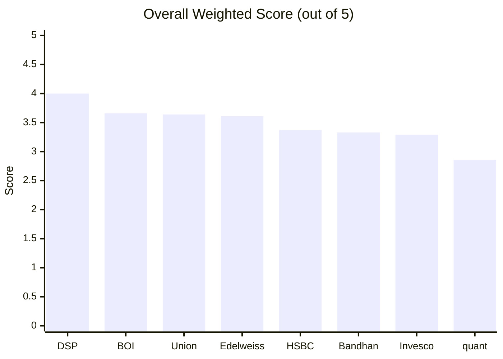
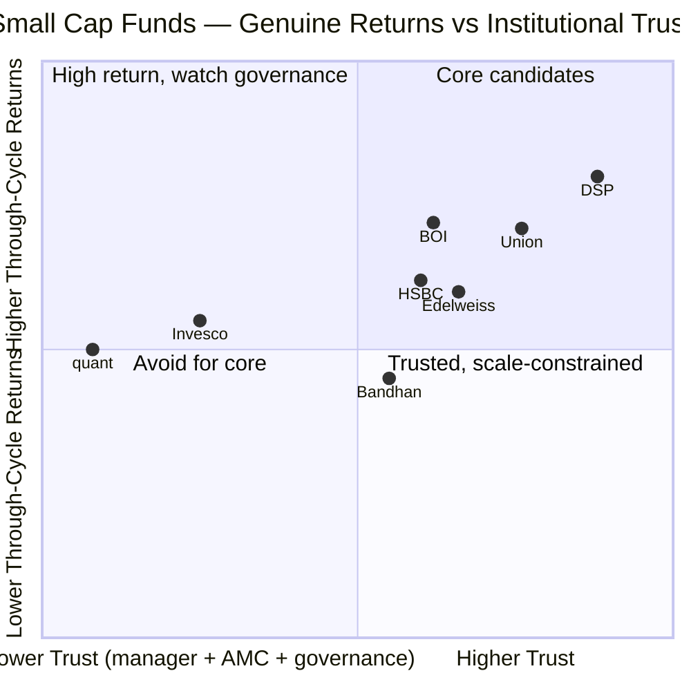
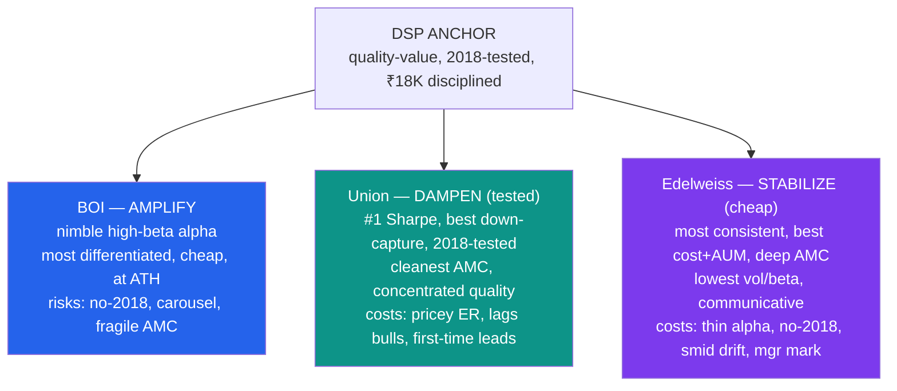
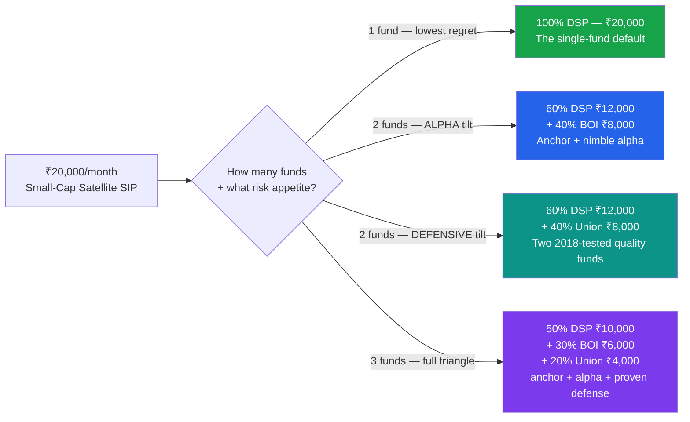
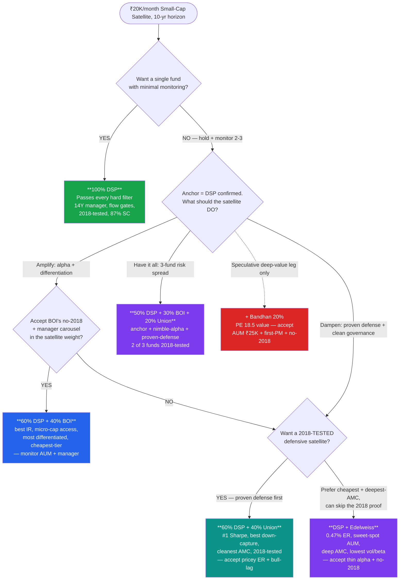

# Small Cap Fund — Comparative Analysis, Decision Tree & Strategy

**Context:** ₹20,000/month SIP, 10+ year horizon. This is the **aggressive satellite** sleeve that sits alongside the FlexiCap **core** (where Parag Parikh ranks #1 at 4.20/5). This document compares the **7 shortlisted funds fully studied** (DSP, BOI, Union, Edelweiss, HSBC, Bandhan, Invesco) plus the **out-of-shortlist quant** case, and from that comparison **defines an actionable deployment strategy** for the ₹20K/month. Only **Sundaram** remains unstudied.

> Built from all 48 module files across 8 funds — not just headline scores. Where a deep study recomputed a screening figure, the deep-study number is used and noted.

> **What changed in this revision (Jun 2026):** Union and Edelweiss are now fully studied. **Union (3.64) and Edelweiss (3.61) slot directly into a tight #2–#4 cluster with BOI (3.66).** This materially enriches the strategy: the "second-fund" slot is no longer a single choice (BOI) but a genuine fork between an **aggressive** satellite (BOI), a **defensive, 2018-tested** satellite (Union), and a **consistent, low-cost** satellite (Edelweiss). The two old open questions are now answered (see §11).

---

## 1. Overall Scorecard

| Rank | Fund | Score | One-Line Identity |
|------|------|-------|-------------------|
| 1 | **DSP Small Cap** | **4.00** | The disciplined, through-cycle-tested anchor — 14Y manager, flow gates, 87% SC purity, quality-value |
| 2 | **BOI Small Cap** | **3.66** | Cheap + nimble + differentiated — smallest AUM is a genuine *advantage*; best forward IR; at ATH |
| 3 | **Union Small Cap** | **3.64** | The genuine 2018-tested defensive — #1 Sharpe, best down-capture, cleanest AMC; pricey ER, lags bulls |
| 4 | **Edelweiss Small Cap** | **3.61** | The most *consistent* fund — best cost+AUM, deep AMC, lowest-vol defensive; thin alpha, no-2018, smid drift |
| 5 | **HSBC Small Cap** | **3.37** | Genuine 12Y, 2018-tested record + highest SC purity — now index-hugging at the highest cost |
| 6 | **Bandhan Small Cap** | **3.33** | Cheapest ER + deep-value (PE 18.5) + CA/CS PM — inception-flattered, AUM ₹25K Cr, first-time lead PM |
| 7 | **Invesco India SC** | **3.29** | AUM sweet spot + growth blend (PE 43) — most troubled AMC governance record in either study |
| — | *quant Small Cap (OOS)* | *2.86* | *Eliminated. Top raw returns, but mandate drift (below SC floor), governance floor, worst true cost* |

> **The shape of the field: DSP stands alone at the top (4.00); then a tight three-way cluster — BOI 3.66 ≈ Union 3.64 ≈ Edelweiss 3.61 — separated by *structure and philosophy, not quality*; then HSBC/Bandhan/Invesco within 0.08 of each other.** The #2–#4 trio are differentiated by *which kind of satellite you want* (aggressive vs defensive-tested vs consistent-cheap), not by being better or worse than each other.

---

## 2. Module-by-Module Score Matrix (best per row in bold)

| Module (Weight) | DSP | BOI | Union | Edelweiss | HSBC | Bandhan | Invesco | quant |
|-----------------|-----|-----|-------|-----------|------|---------|---------|-------|
| 1 — Returns (25%) | **4.50** | 3.70 | 3.80 | 3.60 | 3.70 | 3.50 | 3.72 | 3.40 |
| 2 — Risk (20%) | **3.80** | 3.70 | **3.80** | 3.60 | 3.20 | 3.30 | 3.50 | 3.10 |
| 3 — Portfolio (15%) | **3.80** | 3.70 | 3.60 | 3.40 | 3.30 | 3.20 | 3.30 | 2.70 |
| 4 — Cost & AUM (20%) | 3.70 | 3.90 | 3.50 | **4.00** | 3.20 | 3.30 | 3.20 | 2.80 |
| 5 — Manager (15%) | **3.90** | 3.30 | 3.40 | 3.40 | 3.30 | 3.30 | 2.80 | 2.30 |
| 6 — AMC (5%) | **4.30** | 3.20 | 3.50 | 3.40 | 3.40 | 3.20 | 2.30 | 1.50 |
| **Weighted Total** | **4.00** | 3.66 | 3.64 | 3.61 | 3.37 | 3.33 | 3.29 | 2.86 |

**Best-in-class per module (with the specific reason):**
- **Returns → DSP**: genuine, inception-bias-free ~20.85% adjusted CAGR over two full cycles; 14-year clean attribution. *Union (3.80) is 2nd — genuine 2018-tested record + #1 risk-adjusted.*
- **Risk → DSP *and* Union (tie, 3.80)**: DSP via flow-gate-protected downside; **Union via the study's #1 Sharpe (0.805) and best proven down-capture (47%) across two real bears.** BOI a close 3rd (at ATH, best IR).
- **Portfolio → DSP**: 87% SC purity, 81 stocks, lowest turnover in the category (19–24%), below-category PE.
- **Cost & AUM → Edelweiss (4.00)** *(the only module any fund beats DSP on — and now the top slot moves from BOI to Edelweiss)*: ER ~0.47% **and** the AUM sweet spot (~₹6,000 Cr — frictionless *and* robust) **and** a deep ₹1.5-lakh-crore AMC. BOI (3.90) is 2nd — cheaper-nimbler but on a fragile sub-scale AMC.
- **Manager → DSP**: Sambre 14 years on this exact fund + Ghosh co-manager since 2022 — the only multi-cycle, single-fund dedicated manager in the set.
- **AMC → DSP**: 160-year family house, all-508-employees-invest-only-in-own-schemes, 3× documented flow restrictions at real fee cost.

> **The shape of the table is the headline:** DSP wins or ties 5 of 6 modules; **Edelweiss now owns the one DSP doesn't (Cost & AUM 4.0), and Union ties DSP on Risk (3.8).** The entire DSP→cluster gap (~0.34) again lives almost entirely in the **low-weight Manager (15%) + AMC (5%) modules** for BOI — but *Union and Edelweiss close most of that gap* (Union M5/M6 = 3.4/3.5; Edelweiss = 3.4/3.4, both cleaner than BOI's 3.3/3.2), which is exactly why they land within 0.05 of BOI despite BOI's stronger high-weight modules.

---

## 3. The Deep-Metric Comparison Grid

### 3a. Returns & Inception Integrity (Module 1)

| Metric | DSP | BOI | Union | Edelweiss | HSBC | Bandhan | Invesco |
|--------|-----|-----|-------|-----------|------|---------|---------|
| Headline 5Y CAGR | 19.18%¹ | 20.57% | 19.54% | 19.60% | 18.93% | **23.52%** | 22.11% |
| **Inception-adjusted CAGR** | **~20.85% ✅** | ⚠️ flattered | **~17.78% (10Y) ✅** | ⚠️ flattered | **~20.18% ✅** | **~13.5% ⚠️** | **~13.6% ⚠️** |
| 10Y CAGR (genuine) | **~19.26% ✅** | n/a (7.5Y) | **17.78% ✅** | n/a (7.3Y) | **19.57% ✅** | n/a | n/a |
| 3Y CAGR | 16.71% | 22.56% | 20.58% | 19.03% | 17.08% | **30.95%** | 24.50% |
| 1Y alpha vs benchmark | +3–4% | **+14.70%** | +2.7% | +3.56% | +2.83% | +6.15% | +6.92% |
| Information Ratio (3Y) | +0.17 | **+0.94 (best)** | +0.25 (lumpy²) | −0.07 (flat ⚠️) | **−0.61 ⚠️** | +2.01 (short³) | positive |
| **2018 IL&FS crash — survived as a real fund?** | **YES ✅** | No | **YES ✅** | No | **YES ✅** | No | No (launched *at* trough) |
| Manager attribution | **Clean, 14Y ✅** | Carousel (architects left) | Carousel-but-stayed | 2-mgr (Trideep 4.5Y) | 6.5Y (post-2014) | Split / 3Y team | Inception mgr 7.5Y |

¹ DSP's deep study recomputes 5Y at 28.38% from MFAPI; 19.18% is the May-2026 screening figure used across the cross-fund tables. Inception-adjusted ~20.85% is the trustworthy through-cycle number.
² Union's computed IR (+0.25) understates its quality: its alpha is *lumpy and down-year-loaded* (it beats risk-free every period, but not the benchmark every period), and the post-2020 index-fund benchmark window excludes its best alpha years (2018–19). Its #1 screening Sharpe (0.805) is the more telling reading.
³ Bandhan's IR of 2.01 is a ~3-year-window figure on a 3-year team; directional, not durable.

> **THE single most important strategic insight, now with three 2018-tested funds:** on a genuine, inception-adjusted basis, **DSP (~20.85%), HSBC (~20.18%), and Union (10Y 17.78%) are the three funds with real, lived-through-2018 records.** Bandhan's #1 headline 23.52% and Invesco's 22.11% **collapse to ~13.5%** once you strip the trough-launch timing. BOI's (20.57%) and Edelweiss's (19.60%) 5Y figures are trustworthy but **un-tested by 2018.** Union's absolute 10Y (17.78%) is the *lowest* of the genuine-history trio — the cost of its defensive, momentum-lagging style — but its *risk-adjusted* return is the best in the entire shortlist.

### 3b. Risk Profile (Module 2)

| Metric | DSP | BOI | Union | Edelweiss | HSBC | Bandhan | Invesco |
|--------|-----|-----|-------|-----------|------|---------|---------|
| Max Drawdown | −49.1% (2 crises) | −32.4% (COVID-only) | **−44.7% (2018+COVID, genuine winter)** | −37.1% (COVID-only) | **−52.5% (deepest)** | −24.3% (small-AUM artefact) | −37.7% (from trough) |
| Bear stress quality | Multi-cycle ✅ | Single-crisis | **Multi-cycle ✅ (1,059d underwater)** | Single-crisis | Multi-cycle ✅ | Untested at scale | No bear-*start* data |
| Sharpe (screening) | 0.379 | 0.491 | **0.805 (#1) ✅** | 0.265 | 0.111 | 0.325 | 0.302 |
| Sortino (deep) | ~1.26 | 1.18 | high | 1.06 | 0.83 | **1.97** | 1.52 |
| Beta | 0.92 | 0.94 | 0.92 | **0.82 (lowest)** | 0.96 | 0.91 | 0.84 |
| Down-capture | moderate | mixed (unproven) | **47% (best, proven 2×) ✅** | **16.5% in 2025 (best single-year)** | 2025 = 165% ⚠️ | 64.5% (artefact) | strong |
| Volatility | 15.85% | 16.33% | **17.37% (highest)** | **15.10% (lowest)** | 16.84% | 15.46% | 16.42% |
| % from all-time high | −2.22% | **0.00% (ATH) ✅** | **0.00% (ATH) ✅** | **0.00% (ATH) ✅** | −8.74% | near ATH | recovered |

> **The risk picture is where Union and Edelweiss most distinguish themselves — at opposite ends of the *same* defensive idea.** **Union is "low-downside, not low-vol":** it has the *highest* day-to-day volatility (17.37%) yet the *best* year-over-year down-capture (47%, proven across both the 2018 and 2025 bears) — an *asymmetric-capture* engine (up 94% / down 47%) that earns it the study's #1 Sharpe. **Edelweiss is "low-vol, low-beta":** the *lowest* volatility (15.10%) and beta (0.82) of the eight, with the best *single-year* 2025 down-capture (16.5%) — but its defense is **untested by 2018**, and its 3Y Information Ratio has gone *flat* (−0.07). Three of the four cluster funds (BOI, Union, Edelweiss) are now at all-time highs.

### 3c. Portfolio DNA & Style (Module 3)

| Metric | DSP | BOI | Union | Edelweiss | HSBC | Bandhan | Invesco |
|--------|-----|-----|-------|-----------|------|---------|---------|
| **Small Cap %** | 87.4% | 79.5% | 68.9% (smid) | **61.7% (lowest, heaviest smid ⚠️)** | **97.9% (highest)** | 66.9% (falling) | 65.1% (floor) |
| **Portfolio PE (style tell)** | **29.5 (quality-value)** | 34.6 | 38.8 (quality-graduate) | 33.1 | 33.3 | **18.5 (deep value)** | **43.4 (growth)** |
| # Stocks | 81 | 84 | ~70 (concentrated) | 92 (diffuse) | 109 (diffuse) | **239–256 (quasi-index ⚠️)** | 67 |
| Top-10 concentration | 28.5% | 26.6% | **33.5% (most concentrated quality) ✅** | 24.5% | 22–24% | ~18.9% | 37.8% |
| Turnover | **19–24% (lowest) ✅** | undisclosed | 19.7% (low) | 25–28% (low) | 30.9% | **52.0% (highest)** | 29.2% |
| Defining sector bet | Consumer Cyc 34.2% | Power/Electrical 15.4% | Electrical 13.5% + Healthcare 14.6% | Financials 25% + Healthcare 13% | Industrials 27.1% | Financials 24.1% | Consumer/Tech |
| Style | Quality-value | Nimble differentiated | **Quality "let-winners-ride"** | **Diversified quality-defensive** | Broad index-hug | Diffuse deep-value | Growth blend |
| Top-20 consensus overlap | moderate | **~1 (most differentiated) ✅** | ~4 (moderate) | ~6–7 (more consensus ⚠️) | ~7 (index-like ⚠️) | diffuse | growth blend |

> **The style map now spans the full spectrum** — deep-value (Bandhan 18.5) → quality-value (DSP 29.5) → diversified-quality (Edelweiss 33.1, HSBC 33.3) → differentiated-capex (BOI 34.6) → quality-graduate (Union 38.8) → growth (Invesco 43.4). **A crucial new sub-finding:** Union and Edelweiss are both "smid-drift quality" funds — Union (68.9% SC) and Edelweiss (61.7% SC, the lowest of all) both let winners ride into mid-cap. But they diverge sharply on *conviction*: Union runs a concentrated ~70-stock book (top-10 33.5%, the most concentrated of the quality funds), while Edelweiss runs a diffuse 92-stock, more-consensus book (the structural cause of its flat IR). **Union concentrates its quality bets; Edelweiss diversifies them.**

### 3d. Cost & AUM / Capacity (Module 4)

| Metric | DSP | BOI | Union | Edelweiss | HSBC | Bandhan | Invesco |
|--------|-----|-----|-------|-----------|------|---------|---------|
| ER (Direct) | 0.64% | ~0.48% | **0.80% (2nd-priciest ⚠️)** | **~0.47% (tied-cheapest tier) ✅** | 0.73% | **0.34% (cheapest)** | 0.66% |
| True all-in (incl. turnover) | ~0.77% | ~0.53–0.68% | **~0.90% (likely highest ⚠️)** | **~0.60%** | ~0.87% | ~0.56% | ~0.82% |
| Direct–Regular gap | 1.03% | **~1.58% (widest ⚠️)** | **0.93% (2nd-narrowest)** | ~1.36% | **0.70% (narrowest)** | 1.41% | 1.27% |
| Exit load | 1%/365d | 1%/365d | **1%/15d (most friendly) ✅** | **1%/90d (2nd-friendliest)** | 1%/365d | 1%/365d | 1%/365d |
| **AUM** | ₹17,906 Cr | **₹2,318 Cr (nimble) ✅** | **₹2,094 Cr (nimble) ✅** | **₹6,000 Cr (sweet spot) ✅** | ₹16,877 Cr | **₹25,346 Cr (most constrained ⚠️)** | ₹11,038 Cr |
| AUM verdict | Approaching constraint | Nimble (fragile) | Nimble (fragile) | **Sweet spot (frictionless + robust) ✅** | Constrained | Constrained zone | Sweet spot |
| Min SIP | **₹100 ✅** | ₹1,000 | ₹500 | **₹100 ✅** | ₹500 | ₹1,000 | ₹1,000 |
| Manager scheme-load (lead) | **3 ✅** | 23 (most ⚠️) | 5–6 | 9 (+2 co) | 7 | 2 | 7 |
| AMC total AUM | ₹2.29L Cr | ₹13.4K Cr (sub-scale) | ₹16–17K Cr (sub-scale) | **₹1.5L Cr (deep) ✅** | ₹1.37L Cr | — | ~₹1.1L Cr |
| Flow-gate discipline | **3× restricted ✅** | Never (never needed) | Never | Never (within capacity) | Never (open-door 12Y ⚠️) | Never (doubled in 10mo ⚠️) | Never |

> **Cost & AUM is the cluster's biggest internal divergence.** **Edelweiss now owns the best Cost & AUM profile of the entire study** (4.0): ~0.47% ER on the only true *sweet-spot* AUM (~₹6,000 Cr — frictionless like BOI/Union, but without their redemption fragility) backed by a *deep* ₹1.5-lakh-crore AMC (vs BOI's and Union's sub-scale ~₹15K Cr houses). **Union is the *opposite* — cheap to RUN (19.7% turnover, lowest tax/transaction drag) but expensive to OWN** (0.80% ER, likely the highest true all-in of the study), partly offset by the **most investor-friendly exit load (15 days).** BOI sits between: cheap-and-nimble but on the widest D–R gap and a fragile AMC.

### 3e. Manager & AMC (Modules 5–6)

| Metric | DSP | BOI | Union | Edelweiss | HSBC | Bandhan | Invesco |
|--------|-----|-----|-------|-----------|------|---------|---------|
| Lead manager / tenure on fund | Sambre / **14Y ✅** | Singh / 20mo ⚠️ | Chopra+Dharmshi / ~18mo ⚠️ | Trideep / **4.5Y** | Manghat / 6.5Y | Jain / 3Y (first lead ⚠️) | Badshah / 7.5Y |
| Team depth / continuity | Dedicated co-mgr ✅ | Solo + new co | **Deep bench ("carousel that wasn't") ✅** | **3-person (CFA+SC-architect+CA) ✅** | Co-mgr carousel | Focused (2) | 2 (fragmented) |
| Forensic credential | **FCA ✅** | — | **CA + CA ✅** | **CA (Koradia) ✅** | — | **CA + CS ✅** | none |
| Personal regulatory mark on a lead/CEO | No | No | **No (cleanest) ✅** | **⚠️ Trideep + CEO ₹4L (compliance)** | No | No | **⚠️ CEO named, ₹4.98 Cr** |
| AMC parent | Kothari family ✅ | Govt bank (unsinkable) | **Union Bank + Dai-ichi (never PCA) ✅** | Edelweiss Fin (PE-backed, de-risking) | HSBC plc ($3.23T) | Bandhan/GIC/ChrysCap | IIHL/Hinduja |
| AMC regulatory record | ₹2L ETF (minor) | Credit-fund debacle + insider penalty | **Clean 15Y (no SEBI) ✅** | Group RBI evergreening (resolved) + AMC focused-fund order | §15HB (inherited) | Clean | **₹4.98 Cr settlement ⚠️** |
| Investor communication | Above-avg | Minimal ⚠️ | Minimal | **Excellent (Radhika Gupta) ✅** | Moderate | Moderate | Below-avg |
| AMC quality (M6) | **4.30 ✅** | 3.20 | 3.50 | 3.40 | 3.40 | 3.20 | 2.30 |

> **The new funds reshuffle the manager/AMC picture.** **Union has the cleanest institution of the cluster** — the only studied SC AMC with a *spotless 15-year SEBI record*, two strong parents (Union Bank, never under PCA; Dai-ichi Life Japan), and a "carousel that wasn't" (its founding CIO left, but the deputies stayed and were promoted — the inverse of BOI's talent flight). **Edelweiss has the deepest AMC and best communication** (Radhika Gupta) but carries governance flags at *two* levels (the group's resolved RBI evergreening action + a focused-fund SEBI order that personally named the CEO and lead manager). Both Union (M5 3.4 / M6 3.5) and Edelweiss (3.4 / 3.4) out-score BOI (3.3 / 3.2) on the institutional modules — the reason all three land within 0.05 despite BOI's stronger returns/portfolio.

---

## 4. The Three Strategic Axes (small-cap-specific)

Small-cap selection is decided on three axes. Each fund's position:

| Axis | What it tests | Winners | Losers |
|------|---------------|---------|--------|
| **A. Inception integrity** | Did the record survive the 2018 IL&FS small-cap winter as a real fund? | **DSP, HSBC, Union** | Bandhan / Invesco (trough launches → ~13.5% adjusted); BOI / Edelweiss (no 2018, but honest about it) |
| **B. Capacity / AUM** | Can the fund still buy genuine small-caps without market impact? | **BOI (₹2.3K), Union (₹2.1K) — advantage; Edelweiss (₹6K), Invesco (₹11K) — sweet spot** | Bandhan (₹25K), DSP/HSBC (₹17K, constrained but disciplined) |
| **C. Institutional discipline** | Manager stability + AMC alignment + flow gates + governance | **DSP (benchmark), Union (cleanest AMC)** | Invesco (governance), quant (floor), BOI (carousel + debt scar), Bandhan (no flow gate) |

> **No fund wins all three — but Union now comes closest after DSP.** DSP wins A + C. **Union wins A (genuine 2018-test), is strong on B (₹2.1K nimble), and strong on C (cleanest AMC of the SC set) — making it the most *balanced* fund across the three axes after DSP.** Its only structural costs are the high ER (axis B's cost side), the momentum-lagging absolute return, and first-time flagship leads. BOI wins B and is honest on A; Edelweiss wins B (sweet-spot AUM) but is weakest on A (no 2018) and mid on C (deep AMC, but governance flags). This is the seed of a richer, multi-option strategy than the original single DSP+BOI pair.

---

## 5. Hard Filters — Disqualification Checklist

Run before allocating. Each "⚠️" is a flag to price in; multiple flags push a fund out of *core* contention for a 10-year SIP.

| Filter | DSP | BOI | Union | Edelweiss | HSBC | Bandhan | Invesco | quant |
|--------|-----|-----|-------|-----------|------|---------|---------|-------|
| Active/settled regulator matter on a key person? | No | debt-side (historic) | **No (cleanest)** | **⚠️ mgr+CEO ₹4L (compliance)** | No | No (clean) | **⚠️ CEO, ₹4.98 Cr** | **⚠️ front-running** |
| Below 65% SC floor / mandate drift? | No | No | smid (68.9%) | **⚠️ 61.7% (heaviest smid; SEBI-list ok)** | No | borderline (66.9%) | floor-runner (65.1%) | **⚠️ 64.6% (below)** |
| AUM in the constrained zone (>₹20K Cr)? | No (₹17.9K) | No | No | No (₹6K) | No (₹16.9K) | **⚠️ ₹25.3K** | No | **⚠️ ₹31.8K** |
| No 2018 bear test as a real fund? | No (tested ✅) | **⚠️ Yes** | No (tested ✅) | **⚠️ Yes** | No (tested ✅) | **⚠️ Yes** | **⚠️ Yes** | **⚠️ Yes** |
| Currently index-hugging (IR ≤ 0)? | No | No | No (+0.25) | **⚠️ borderline (3Y −0.07)** | **⚠️ Yes (−0.61)** | No | No | No |
| First-time lead PM, untested in a bear? | No | No | **⚠️ Yes** | No (Trideep proven) | No | **⚠️ Yes** | No | n/a |
| Black-box / undisclosed process? | No | No | No | No | No | No | No | **⚠️ Yes** |

**Result:** **DSP fails zero.** **BOI, Union, and HSBC each fail exactly one** (BOI: no-2018; Union: first-time PM; HSBC: index-hugging). **Edelweiss fails several *mild* flags** (no-2018; a ₹4L compliance mark; heaviest smid drift; a borderline-flat 3Y IR) — none fatal, but its consistency coexists with *multiple minor caveats rather than one clean profile.* Bandhan fails three, Invesco fails two-plus-governance, **quant fails five.**

> **Clean-enough for core: DSP (zero flags), then BOI / Union (one flag each), then Edelweiss (several mild flags) / HSBC (index-hug).** Union joins BOI as a one-flag, core-eligible fund — and its single flag (first-time leads) is cushioned by the deepest, most-stable bench of the cluster.

---

## 6. The Second-Fund Choice — BOI vs Union vs Edelweiss

DSP is the unchallenged anchor. The strategic question is now *which* satellite to pair with it — and the three cluster funds offer **three genuinely different satellite philosophies.** A satellite should *complement* the DSP anchor (quality-value, 2018-tested, large-disciplined-AUM), not duplicate it.

| Dimension | DSP + **BOI** | DSP + **Union** | DSP + **Edelweiss** |
|-----------|---------------|-----------------|---------------------|
| Satellite role | Amplify (alpha/beta) | Dampen (defensive, *proven*) | Stabilize (cheap, consistent) |
| Style spread vs DSP | **Widest** (capex/differentiated vs quality-value) | Moderate (both quality; Union smid-graduate) | Moderate (both quality; Edelweiss financials/defensive) |
| AUM spread vs DSP | **Widest** (₹18K + ₹2.3K micro-cap) | Wide (₹18K + ₹2.1K) | Moderate (₹18K + ₹6K sweet-spot) |
| Holdings overlap | **Lowest (~1 BOI consensus name)** | Moderate (~4 names) | Higher (~6–7 names) |
| 2018-test coverage | DSP only | **Both tested ✅** | DSP only |
| Combined governance | Mixed (BOI carousel + debt scar) | **Cleanest (both strong AMCs) ✅** | Strong (deep AMC, minor flags) |
| Combined drawdown risk | Higher (BOI no-2018, high-beta) | **Lower (Union proven down-capture) ✅** | Lower (Edelweiss lowest beta, but untested) |
| Combined cost (all-in) | **Lowest (~0.56%)** | Higher (~0.85%) | Low (~0.68%) |
| Best for | Maximum diversification + alpha | Risk-averse, governance-first, *proven* defense | Cost-conscious, institution-depth-first |

> **The headline:** DSP + BOI remains the **maximum-diversification, alpha-tilted** pair (widest style/AUM spread, lowest overlap, lowest cost — the original §6 logic still holds). But **DSP + Union is now a genuine co-primary** for a more conservative investor: it pairs two *2018-tested* quality funds, adds the study's #1 risk-adjusted return as a diversifier, and is the **cleanest combined-governance pair** — at the cost of more style overlap, higher combined cost, and two momentum-lagging funds. **Edelweiss is the cost-and-institution-optimized version of the defensive idea** — cheaper than Union with a far deeper AMC, but *without the 2018 test* and with thinner alpha.

---

## 7. THE STRATEGY — Portfolio Construction

### ⭐ Primary — 2-Fund Core-Satellite, choose your tilt

**Both are built on the same unchallenged anchor: DSP 60% (₹12,000), Direct.** The 40% satellite depends on whether you want the sleeve to *amplify* or *dampen* risk:

**Option A (alpha tilt) — DSP 60% + BOI 40%:**
- The two structurally most *orthogonal* high-quality funds: widest style spread, both ends of the AUM spectrum, ~1 consensus name overlap, lowest blended cost (~0.56%).
- BOI supplies what DSP has outgrown — nimble micro-cap access, best forward IR (+0.94), the most differentiated book, at an all-time high.
- **The 60/40 tilt** quarantines BOI's two unresolved risks (manager carousel; no-2018-test) in the satellite weight.

**Option B (defensive tilt) — DSP 60% + Union 40%:**
- Two **genuine 2018-tested** quality funds + the study's **#1 risk-adjusted return** as the diversifier.
- Union supplies *proven* downside protection (47% down-capture across two real bears), the **cleanest AMC of the SC set**, and a concentrated quality-graduate book that complements DSP's quality-value.
- **The cost of this tilt:** both funds lag momentum bulls (2023-type years), higher blended cost (~0.85% — Union's 0.80% ER), more style overlap, and Union's first-time flagship leads (cushioned by a deep bench).
- **Choose B over A if:** you prioritise *proven* bear-market survival, cleanest governance, and lower combined drawdown over maximum alpha/differentiation.

### ⭐ Three-fund — the full risk-spread triangle: **DSP 50% + BOI 30% + Union 20%**

The completest construction: **quality-anchor (DSP) + nimble-alpha (BOI) + proven-defensive (Union)** — three distinct risk/style/AUM profiles, two of them 2018-tested, with the cleanest available 3-fund governance.

- **This replaces the old DSP+BOI+Bandhan triangle.** Union is the superior third leg: it is 2018-tested (Bandhan is not), has a clean AMC (Bandhan has a PE-exit clock), and adds *proven* low-downside (Bandhan's low drawdown is a small-AUM artefact). The triangle's third axis becomes **low-downside defense** (Union) rather than **deep-value style** (Bandhan) — a better risk-management choice for a sleeve whose other two legs include the no-2018 BOI.
- Blended cost ~0.62% all-in; two of three funds 2018-tested; minimal cross-holdings; covers high-beta (BOI), balanced (DSP), and low-downside (Union) simultaneously.

**Execution rules (non-negotiable):**
1. **Direct plan only.** BOI's D–R gap (~1.58%) is the widest in the study; Union's (0.93%) and Edelweiss's (1.36%) are narrower, DSP's is 1.03%.
2. **10+ year horizon, SIP straight through drawdowns.**
3. **Judge BOI and Edelweiss on their 5Y CAGR + current attributes, never on inception-flattered since-inception numbers.** Judge Union on its risk-adjusted (Sharpe/down-capture) record, not its momentum-lagging absolute CAGR.
4. **Rebalance annually** back to target if drift exceeds ~±10pp.

### Alternatives & situational legs

| Allocation | Rationale | Key trade-off |
|------------|-----------|---------------|
| **100% DSP** (₹20,000) | Cleanest single-fund default; passes every filter; lowest decision-regret | Forgoes the satellites' diversification |
| **⭐ 60% DSP + 40% BOI** | Max diversification + alpha; lowest blended cost | BOI's carousel + no-2018 risk |
| **⭐ 60% DSP + 40% Union** | Two 2018-tested quality funds; #1 Sharpe; cleanest governance | Higher cost; both lag bulls; first-time leads |
| **⭐ 50% DSP + 30% BOI + 20% Union** | Full anchor / alpha / proven-defense triangle | 3 funds to monitor |
| **DSP + Edelweiss** (defensive, cost-optimized) | Cheapest defensive pairing on the deepest AMC + sweet-spot AUM; lowest-vol satellite | No-2018 test; thin alpha (flat IR); manager SEBI mark — a *milder Union without the 2018 proof* |
| **+ Bandhan 20%** (deep-value specialist) | Adds PE-18.5 cyclical-value style the cluster lacks | AUM ₹25K + first-PM + no-2018; only if you specifically want deep-value exposure |

> **Where Edelweiss fits:** it is the **cost-and-institution-optimized alternative to Union** for the defensive slot — cheaper (0.47% vs 0.80% ER), a far deeper AMC (₹1.5L vs ₹16K Cr), a more comfortable AUM (₹6K sweet spot vs ₹2K fragile), and the lowest beta of the eight. **Choose Edelweiss over Union if** you weight cost, AMC depth, and AUM-robustness above Union's genuine-2018-test and #1 Sharpe. **Choose Union over Edelweiss if** (as recommended) you weight *proven* bear-market survival and a spotless regulatory record above cost — for a defensive leg whose whole purpose is surviving a real bear, the 2018 test is the more valuable property.

### Explicitly **not** for the core

- **HSBC** — genuine record + highest SC purity, but a **high-cost index fund** (IR −0.61, R² 95.96). Re-rate up only if its 3Y IR turns durably positive.
- **Invesco** — capable manager in the AUM sweet spot, but **the most troubled AMC governance record** (SEBI settlement naming the CEO; multi-jurisdiction probe; 4 ownership changes). Wrong tail risk for a 10-year hold.
- **quant** — eliminated; fails five hard filters; barely a small-cap fund; black box.

---

## 8. The Decision Tree

---

## 9. Investor-Profile → Fund Mapping

| If your dominant priority is… | Best fit | Key data point that drives the answer |
|-------------------------------|----------|---------------------------------------|
| "One fund, lowest regret, minimal monitoring" | **DSP** | Passes every hard filter; 14Y manager; flow gates |
| "Genuine, 2018-tested, through-cycle compounding" | **DSP / HSBC / Union** | The only three with inception-bias-free, lived-2018 records |
| "Best risk-adjusted return / proven downside protection" | **Union** | #1 Sharpe (0.805); 47% down-capture proven across two bears |
| "Nimble micro-cap alpha DSP can't run at ₹18K Cr" | **BOI** | ₹2.3K Cr AUM; best IR +0.94; ~1 consensus name in top-20 |
| "Lowest cost + best AUM position + deepest AMC" | **Edelweiss** | ~0.47% ER; ₹6K sweet-spot AUM; ₹1.5L Cr AMC |
| "Lowest volatility / smoothest ride" | **Edelweiss (15.10%) / Union (low-downside)** | Edelweiss lowest beta (0.82); Union lowest *down*-capture |
| "Cheapest headline cost" | **Bandhan (0.34%) / Edelweiss (0.47%)** | Bandhan's 52% turnover lifts true all-in to ~0.56% |
| "Maximum small-cap purity" | **HSBC (97.9%) / DSP (87%)** | Edelweiss (61.7%) / Union (68.9%) are the heaviest smid funds |
| "Cleanest AMC governance / zero regulatory headlines" | **DSP / Union** | Union = only studied SC AMC with a spotless 15-year SEBI record |
| "Best investor communication / transparency" | **Edelweiss** | Radhika Gupta — best CEO communication of the SC set |
| "Deep-value / GARP style diversifier" | **Bandhan** | PE 18.53 — 41% below category |
| "Growth / new-economy tilt (IndiGo, Zomato)" | **Invesco** | PE 43.43; but accept the governance record |
| "Lowest portfolio churn / true buy-and-hold" | **DSP / Union** | DSP 19–24%, Union 19.7% turnover — the category's lowest |

---

## 10. Action Triggers — When to Revisit Each Holding

| Fund | Re-evaluate if… |
|------|-----------------|
| **DSP** | Sambre signals retirement/exit; AUM > ₹25,000 Cr; Consumer Cyclical bet sours in a demand shock |
| **BOI** | AUM crosses ~₹8,000–10,000 Cr without a flow gate; another manager exit (carousel repeats); R² rises toward 95 or IR turns negative |
| **Union** | Chopra/Dharmshi depart (the bench is the thesis); the asymmetric down-capture fails in the next real bear (the defining test of the leads); ER stays at 0.80%+ while peers cut; SC% drifts further below ~68% |
| **Edelweiss** | 3Y IR stays ≤ 0 into 2027 (flat alpha becomes structural closet-indexing); SC purity drifts further below ~62%; another AMC/group SEBI action; the Bhatia-led alpha-fix fails to materialise; AUM growth pushes toward ₹12,000 Cr |
| **HSBC** | 3Y IR turns durably **positive** (re-rate up) OR AUM > ₹20,000 Cr with no flow gate (re-rate down); Manghat departs |
| **Bandhan** | SC% falls below ~68%; AUM > ₹30,000 Cr without a gate; Jain departs; first real bear at scale |
| **Invesco** | Any new SEBI/SEC/SFC development; ER drifts up post-IIHL; AUM > ₹20,000 Cr without a gate; Badshah departs |
| **quant** | Stays out unless Tandon is explicitly cleared AND SC% returns above 65% AND a flow gate is imposed |

---

## 11. Resolved Questions & Remaining Pending Fund

The two open wildcards from the prior revision are now **answered**, and only one shortlisted fund remains unstudied:

| Fund | Prior open question | Resolution (now studied) |
|------|--------------------|--------------------------|
| **Union Small Cap** | Why 2× the next-best Sharpe (0.805) — genuine low-vol or data artefact? | **GENUINE.** Not low-vol (it has the *highest* vol, 17.37%) but *asymmetric capture* (up 94% / down 47%) — a real quality-defensive engine, proven across the 2018 *and* 2025 bears. **Vindicated as a legitimate top-3 / defensive-leg fund (3.64).** |
| **Edelweiss Small Cap** | Now co-managed by Dhruv Bhatia (BOI's architect) — does the architect's edge travel, making it a BOI-alternative alpha satellite? | **NO — not as an *alpha* fund.** Bhatia is a *co-manager* (since Oct-2024), *not* the lead — he sits under Trideep's generalist-CIO *defensive* framework. The edge has not (yet) translated: Edelweiss is **thin-alpha / flat-IR / defensive**, not a nimble-alpha BOI-clone. **It became the study's most *consistent* / lowest-vol *defensive* fund (3.61), not a BOI replacement.** (Watch the Bhatia alpha-fix over 2026–28.) |

| Pending fund | Screening signal | Likely effect on strategy |
|------|------------------|---------------------------|
| **Sundaram Small Cap** | Worst MaxDD (57.06%); lowest 10Y (16.10%); highest ER (0.85%) | Likely confirms elimination — no obvious reason to prefer over DSP/Union; would have to beat Union as a defensive option, which its deeper drawdown and higher cost make unlikely |

> **Recommendation:** the **DSP anchor and the BOI/Union satellite choices are now robust and complete.** Sundaram is the only remaining study, and it is unlikely to overturn the structure (it would need to out-defend Union, which its −57% drawdown and 0.85% ER argue against). The strategy can be finalised now.

---

## 12. One-Line Verdicts

- **DSP** → **The anchor.** The only fund that passes every filter — genuine 2018-tested record, 14-year manager, flow-gate discipline, 87% SC purity. The lowest-regret core of the sleeve.
- **BOI** → **The nimble alpha (amplify).** The only fund whose tiny AUM is an *advantage*; best Information Ratio, most differentiated book, 2nd-cheapest, at an all-time high. Buy the *current* fund, not the departed managers' record.
- **Union** → **The proven defensive (dampen).** The study's #1 risk-adjusted return — genuine 2018-tested, best down-capture (47%, two bears), cleanest AMC, concentrated quality. Pricey to own and lags momentum bulls, but the most *trustworthy* satellite.
- **Edelweiss** → **The consistent stabilizer.** The most balanced fund (no module below 3.4), the best cost+AUM profile of the study, the deepest AMC, the lowest volatility — but thin recent alpha, no 2018 test, and the heaviest smid drift. A cheaper, deeper-AMC alternative to Union for the defensive slot, minus the 2018 proof.
- **HSBC** → **On the bench.** Genuine record + highest SC purity, but currently a high-cost index fund (IR −0.61). Re-rate up only if its active edge returns.
- **Bandhan** → **The value-tilt specialist.** Cheapest ER + genuinely diversifying deep-value style — but inception-flattered, AUM-indisciplined, first-time PM. A situational deep-value leg, now behind Union as the preferred third fund.
- **Invesco** → **Capable but compromised.** Real manager skill in the AUM sweet spot, wrapped in the study's worst AMC governance record. Wrong risk to carry for 10 years.
- **quant** → **Excluded.** Fails five hard filters; barely a small-cap fund; unverifiable black box.

---

## The Strategy in One Paragraph

For a ₹20,000/month, 10-year small-cap satellite, **anchor unconditionally on DSP (60%, Direct)** — the only fund that passes every hard filter — and **choose the 40% satellite by risk appetite.** For **maximum diversification and alpha, add BOI** (nimble micro-cap access, best forward IR, most differentiated book, cheapest-tier cost; accept its no-2018 test and manager carousel in the satellite weight). For **proven, governance-first defense, add Union instead** — the study's #1 risk-adjusted return, genuine 2018-tested, best down-capture across two real bears, and the cleanest AMC of the small-cap set (accept its higher ER and momentum-lag). To **have all three risk profiles, run DSP 50% + BOI 30% + Union 20%** — anchor, nimble-alpha, and proven-defense, two of the three 2018-tested, which now supersedes the old Bandhan third leg. **Edelweiss is the cost-and-institution-optimized alternative to Union** (cheaper, deeper AMC, sweet-spot AUM, lowest volatility — but without the 2018 proof and with thinner alpha), best for an investor who weights cost and AMC depth over a lived bear-market test. **Hold 100% DSP if you want one fund; avoid Invesco and quant on governance; bench HSBC until its active edge returns; and treat Bandhan as a deep-value specialist, not a core leg.** The structure is now complete — only Sundaram remains unstudied, and it is unlikely to displace any of the above.

---

*Analysis date: 2026-06-26 | Framework: 6-Module Weighted Scoring (Small-Cap adaptation) | Funds studied: 7 of 8 shortlisted + 1 out-of-shortlist (quant); Sundaram pending | Source: all 48 module files in `/funds/<fund>/module[1-6]_*.md` + each fund's README scorecard*
