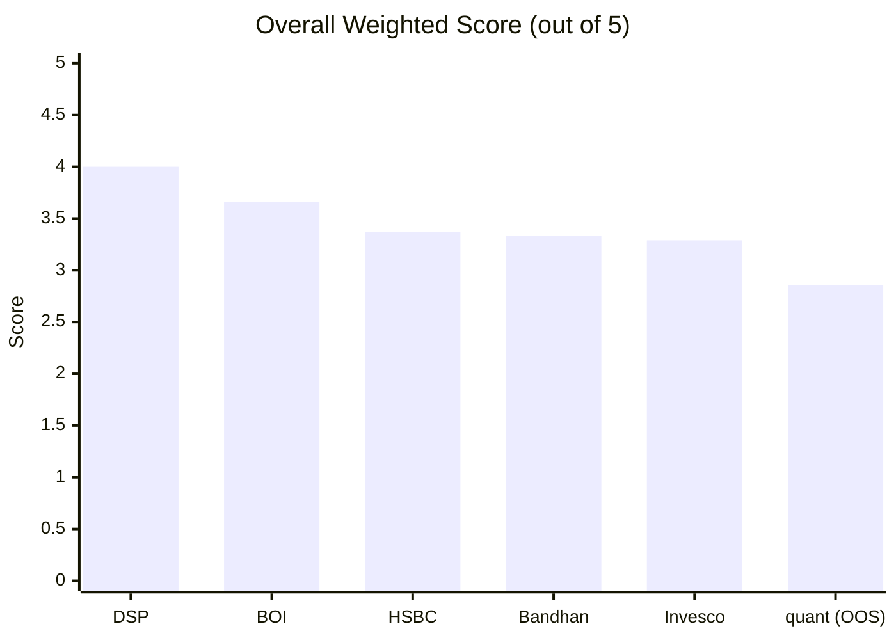
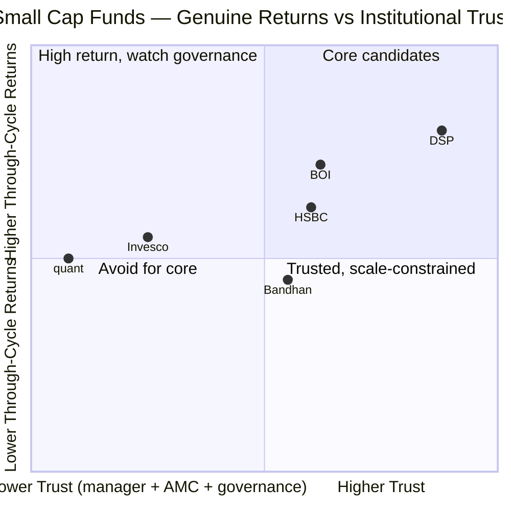
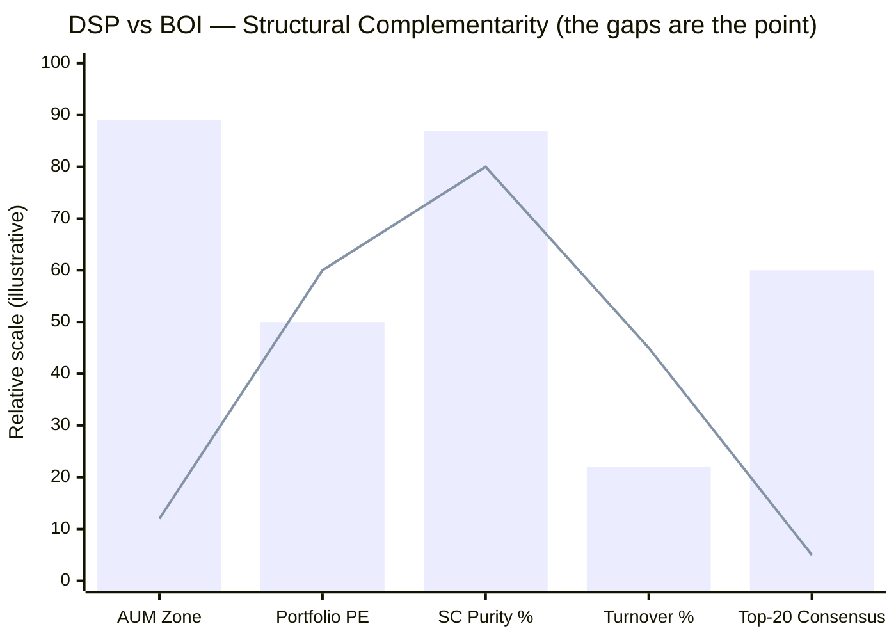
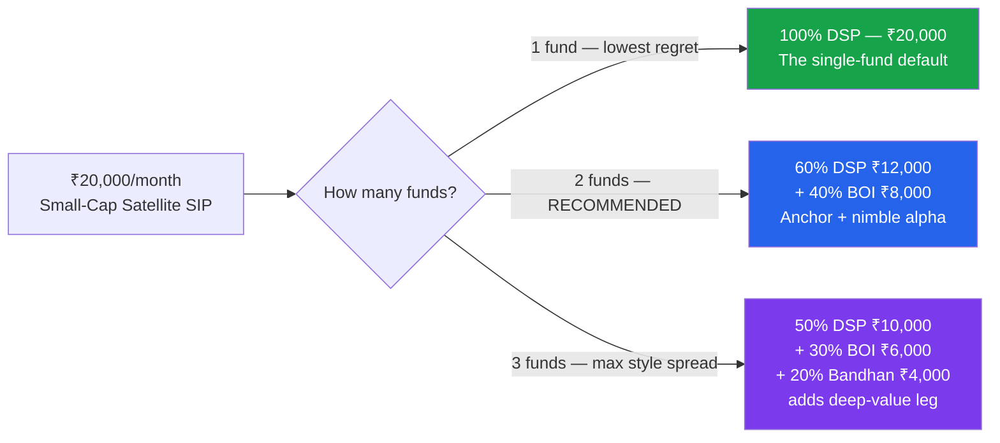
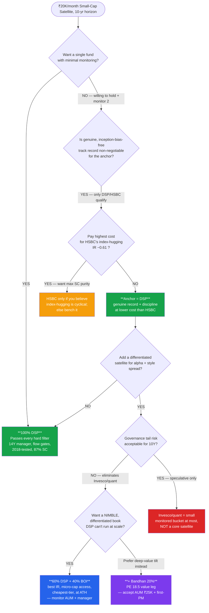

# Small Cap Fund — Comparative Analysis, Decision Tree & Strategy

**Context:** ₹20,000/month SIP, 10+ year horizon. This is the **aggressive satellite** sleeve that sits alongside the FlexiCap **core** (where Parag Parikh ranks #1 at 4.20/5). This document compares the **5 shortlisted funds fully studied** (DSP, BOI, HSBC, Bandhan, Invesco) plus the **out-of-shortlist quant** case, and from that comparison **defines an actionable deployment strategy** for the ₹20K/month.

> Built from all 36 module files across 6 funds — not just headline scores. Where a deep study recomputed a screening figure, the deep-study number is used and noted.

---

## 1. Overall Scorecard

| Rank | Fund | Score | One-Line Identity |
|------|------|-------|-------------------|
| 1 | **DSP Small Cap** | **4.00** | The disciplined, through-cycle-tested anchor — 14Y manager, flow gates, 87% SC purity, quality-value |
| 2 | **BOI Small Cap** | **3.66** | Cheap + nimble + differentiated — smallest AUM is a genuine *advantage*; best forward IR; at ATH |
| 3 | **HSBC Small Cap** | **3.37** | Genuine 12Y, 2018-tested record + highest SC purity — now index-hugging at the highest cost |
| 4 | **Bandhan Small Cap** | **3.33** | Cheapest ER + deep-value (PE 18.5) + CA/CS PM — inception-flattered, AUM ₹25K Cr, first-time lead PM |
| 5 | **Invesco India SC** | **3.29** | AUM sweet spot + growth blend (PE 43) — most troubled AMC governance record in either study |
| — | *quant Small Cap (OOS)* | *2.86* | *Eliminated. Top raw returns, but mandate drift (below SC floor), governance floor, worst true cost* |

> **The top two (DSP, BOI) are separated from the next three by a clear gap, and from each other by structure, not quality.** Funds #3–#5 cluster within 0.08 points — they are differentiated by *which* compromise you accept, not by being better or worse.

---

## 2. Module-by-Module Score Matrix (best per row in bold)

| Module (Weight) | DSP | BOI | HSBC | Bandhan | Invesco | quant |
|-----------------|-----|-----|------|---------|---------|-------|
| 1 — Returns (25%) | **4.50** | 3.70 | 3.70 | 3.50 | 3.72 | 3.40 |
| 2 — Risk (20%) | **3.80** | 3.70 | 3.20 | 3.30 | 3.50 | 3.10 |
| 3 — Portfolio (15%) | **3.80** | 3.70 | 3.30 | 3.20 | 3.30 | 2.70 |
| 4 — Cost & AUM (20%) | 3.70 | **3.90** | 3.20 | 3.30 | 3.20 | 2.80 |
| 5 — Manager (15%) | **3.90** | 3.30 | 3.30 | 3.30 | 2.80 | 2.30 |
| 6 — AMC (5%) | **4.30** | 3.20 | 3.40 | 3.20 | 2.30 | 1.50 |
| **Weighted Total** | **4.00** | 3.66 | 3.37 | 3.33 | 3.29 | 2.86 |

**Best-in-class per module (with the specific reason):**
- **Returns → DSP**: genuine, inception-bias-free ~20.85% adjusted CAGR over two full cycles; 14-year clean manager attribution.
- **Risk → DSP**: best blend of Sharpe/Sortino + flow-gate-protected downside; BOI a close 2nd (at ATH, best IR).
- **Portfolio → DSP**: 87% SC purity, 81 stocks, lowest turnover in the category (19–24%), below-category PE.
- **Cost & AUM → BOI** *(the only module any fund beats DSP on)*: ER ~0.48% **and** the smallest AUM = genuine micro-cap execution headroom; true all-in beats every peer.
- **Manager → DSP**: Sambre 14 years on this exact fund + Ghosh co-manager since 2022 — the only multi-cycle, single-fund dedicated manager in the set.
- **AMC → DSP**: 160-year family house, all-508-employees-invest-only-in-own-schemes, 3× documented flow restrictions at real fee cost.

> **The shape of the table is the headline:** DSP wins 5 of 6 modules; BOI wins the one it does (Cost & AUM) decisively and runs near-parity on Risk and Portfolio. **The entire DSP→BOI gap (0.34) lives in just two low-weight modules — Manager (−0.60) and AMC (−1.10).** That is the single most important fact for strategy: BOI's weaknesses are *quarantined* where the framework weights them least.

---

## 3. The Deep-Metric Comparison Grid

### 3a. Returns & Inception Integrity (Module 1)

| Metric | DSP | BOI | HSBC | Bandhan | Invesco |
|--------|-----|-----|------|---------|---------|
| Headline 5Y CAGR | 19.18%¹ | 20.57% | 18.93% | **23.52%** | 22.11% |
| **Inception-adjusted CAGR** | **~20.85% ✅** | ⚠️ flattered (no 2018) | **~20.18% ✅** | **~13.5% ⚠️** | **~13.6% ⚠️** |
| 10Y CAGR (genuine) | **~19.26% ✅** | n/a (7.5Y old) | **19.57% ✅** | n/a | n/a |
| 3Y CAGR | 16.71% | 22.56% | 17.08% | **30.95%** | 24.50% |
| 1Y alpha vs benchmark | +3–4% | **+14.70%** | +2.83% | +6.15% | +6.92% |
| Information Ratio (3Y) | +0.17 | **+0.94 (best, robust)** | **−0.61 ⚠️** | +2.01 (short-window²) | positive |
| **2018 IL&FS crash — lived through it as a real fund?** | **YES ✅** | No | **YES ✅** | No | No (launched *at* the trough) |
| Manager attribution | **Clean, 14Y ✅** | Carousel (architects left) | 6.5Y (post-2014) | Split / 3Y current team | Inception manager 7.5Y |

¹ DSP's own deep study recomputes 5Y at 28.38% from MFAPI; the 19.18% is the May-2026 Tickertape screening figure used consistently across the cross-fund tables. Either way DSP's *inception-adjusted* ~20.85% is the trustworthy through-cycle number.
² Bandhan's reported IR of 2.01 is a ~3-year-window figure on a 3-year-old team; treat as directional, not durable. BOI's +0.94 is the more robust "genuine active return" reading.

> **THE single most important strategic insight in the study:** on a genuine, inception-adjusted basis, **only DSP (~20.85%) and HSBC (~20.18%) are real ~20% through-cycle compounders.** Bandhan's #1 headline 23.52% and Invesco's 22.11% **collapse to ~13.5%** once you strip the COVID-trough / IL&FS-trough launch timing. BOI's 5Y (20.57%) is trustworthy but **un-tested by 2018**. Do not build a strategy on headline CAGR — build it on inception-adjusted CAGR + a 2018 test.

### 3b. Risk Profile (Module 2)

| Metric | DSP | BOI | HSBC | Bandhan | Invesco |
|--------|-----|-----|------|---------|---------|
| Max Drawdown | −49.1% (2 crises) | −32.37% (COVID-only) | **−52.45% (deepest)** | −24.34% (small-AUM artefact) | −37.66% (from trough) |
| Bear stress quality | Multi-cycle tested ✅ | Single-crisis (COVID V) | Multi-cycle tested ✅ | Untested at ₹25K scale | No bear-*start* data |
| Sharpe (deep) | ~0.98 | 0.853 | 0.53 | 1.08 | 0.96 |
| Sortino (deep) | ~1.26 | 1.175 | 0.83 | **1.97** | 1.52 |
| Beta | 0.92 | 0.94 | 0.96 | 0.91 | **0.84** |
| Downside capture | moderate | mixed (unproven) | hist. elite, **2025 = 165% ⚠️** | **64.5% (best)** | strong (defensive) |
| % from all-time high | −2.22% | **0.00% (at ATH) ✅** | −8.74% (548d underwater) | near ATH | recovered |

### 3c. Portfolio DNA & Style (Module 3)

| Metric | DSP | BOI | HSBC | Bandhan | Invesco |
|--------|-----|-----|------|---------|---------|
| **Small Cap %** | 87.35% | 79.52% | **~97.9% (highest)** | 66.9% (falling ⚠️) | 65.1% (floor-runner ⚠️) |
| Mid + Large outside SC | ~4% LC | 12.6% MC / 3.4% LC | ~2% LC | 15% MC / 4% LC | 19.6% MC / **13.8% LC** |
| **Portfolio PE (style tell)** | **29.54 (quality-value)** | 34.63 | 33.28 | **18.53 (deep value)** | **43.43 (growth)** |
| # Stocks | 81 | 84 | 109 (diffuse) | **239–256 (quasi-index ⚠️)** | 67 (concentrated) |
| Top-10 concentration | 28.5% | 26.6% | 22–24% | ~18.9% | **37.8% (concentrated)** |
| Turnover | **19–24% (lowest) ✅** | undisclosed | 30.93% | **51.96% (highest)** | 29.17% |
| Defining sector bet | Consumer Cyclical 34.2% | Power/Electrical-capex 15.4% | Industrials/Capex 27.1% | Financial Services 24.1% | Consumer/Tech (IndiGo, Zomato, Trent) |
| Top-20 consensus overlap | moderate | **~1 name (most differentiated) ✅** | index-like (R² 95.96 ⚠️) | diffuse | growth-blend |

> **The five funds occupy genuinely different points on the style map** — deep-value (Bandhan, PE 18.5) → quality-value (DSP, 29.5) → capex/differentiated (BOI 34.6 / HSBC 33.3) → growth (Invesco, PE 43.4). This is what makes *pairing* possible: two funds at opposite style ends diversify; two at the same end just double the bet.

### 3d. Cost & AUM / Capacity (Module 4)

| Metric | DSP | BOI | HSBC | Bandhan | Invesco |
|--------|-----|-----|------|---------|---------|
| ER (Direct) | 0.64% | **~0.48%** | **0.73% (highest)** | **0.34% (cheapest)** | 0.66% |
| True all-in (incl. turnover) | ~0.74–0.80% | **~0.53–0.68%** | **~0.87% (worst)** | ~0.56% | ~0.84% |
| Direct–Regular gap | 1.03% | **~1.58% (widest ⚠️)** | **0.70% (narrowest)** | 1.03% | **1.27%** |
| **AUM** | ₹17,906 Cr | **₹2,318 Cr (advantage) ✅** | ₹16,877 Cr | **₹25,346 Cr (most constrained ⚠️)** | ₹11,038 Cr (sweet spot ✅) |
| AUM verdict | Approaching constraint | **Nimble — micro-cap access** | Constrained | Constrained zone | **Execution sweet spot** |
| Flow-gate discipline | **3× restricted ✅** | Never (never needed to) | **Never (open-door 12Y ⚠️)** | **Never (doubled in 10mo ⚠️)** | Never |

### 3e. Manager & AMC (Modules 5–6)

| Metric | DSP | BOI | HSBC | Bandhan | Invesco |
|--------|-----|-----|------|---------|---------|
| Lead manager / tenure on fund | Sambre / **14Y ✅** | A. Singh / **20mo ⚠️** | Manghat / 6.5Y | Jain / 3Y (**first lead role ⚠️**) | Badshah / 7.5Y |
| Manager dedication | 2–3 schemes (focused) | **23 schemes (most stretched ⚠️)** | 7 schemes / ₹43.8K Cr | 2 schemes (focused) | 7 schemes / ₹40.4K Cr |
| Forensic credential | FCA ✅ | — | — | **CA + CS ✅** | none |
| AMC parent | Kothari family (independent) ✅ | Govt bank (unsinkable) | HSBC plc ($3.23T) | Bandhan/GIC/ChrysCap | IIHL/Hinduja (60%) |
| Skin-in-game | **All 508 employees ✅** | not disclosed | not disclosed | not disclosed | SEBI-min only |
| AMC regulatory record | ₹2L ETF (minor) | Credit-fund debacle + insider penalty (debt-side) | §15HB (inherited, L&T era) | **Clean ✅** | **₹4.98 Cr settlement, CEO named; SEBI+SEC+SFC ⚠️** |

---

## 4. The Three Strategic Axes (small-cap-specific)

Small-cap selection is decided on three axes that the FlexiCap study did not weight as heavily. Each fund's position:

| Axis | What it tests | Winners | Losers |
|------|---------------|---------|--------|
| **A. Inception integrity** | Did the record survive the 2018 IL&FS small-cap winter as a real fund? | **DSP, HSBC** | Bandhan / Invesco (trough launches → headline CAGR is ~13.5% adjusted); BOI (no 2018, but honest about it) |
| **B. Capacity / AUM** | Can the fund still buy genuine small-caps without market impact? | **BOI (₹2.3K — advantage), Invesco (₹11K — sweet spot)** | Bandhan (₹25K), DSP/HSBC (₹17K, constrained but disciplined) |
| **C. Institutional discipline** | Manager stability + AMC alignment + flow gates + governance | **DSP (the benchmark)** | Invesco (governance), quant (floor), BOI (carousel), Bandhan (no flow gate) |

> No fund wins all three. **DSP wins A + C; BOI wins B and is honest on A.** That complementarity is the seed of the recommended strategy.

---

## 5. Hard Filters — Disqualification Checklist

Run before allocating. Each "⚠️" is a flag to price in; multiple flags push a fund out of *core* contention for a 10-year SIP.

| Filter | DSP | BOI | HSBC | Bandhan | Invesco | quant |
|--------|-----|-----|------|---------|---------|-------|
| Active/settled regulator matter on a key person? | No | debt-side (historic) | No | **No (clean)** | **⚠️ CEO named, ₹4.98 Cr** | **⚠️ front-running, settled-not-cleared** |
| Below the 65% SC floor / mandate drift? | No | No | No | borderline (66.9%, falling) | floor-runner (65.1%) | **⚠️ 64.58% (below floor)** |
| AUM in the constrained zone (>₹20K Cr)? | No (₹17.9K) | No | No (₹16.9K) | **⚠️ ₹25.3K** | No | **⚠️ ₹31.8K (over cap)** |
| No 2018 bear test as a real fund? | No (tested ✅) | **⚠️ Yes** | No (tested ✅) | **⚠️ Yes** | **⚠️ Yes** | **⚠️ Yes (dead era)** |
| Currently index-hugging (IR ≤ 0)? | No | No | **⚠️ Yes (IR −0.61)** | No | No | No |
| First-time lead PM, untested in a bear? | No | No | No | **⚠️ Yes** | No | n/a (black box) |
| Black-box / undisclosed process? | No | No | No | No | No | **⚠️ Yes (VLRT)** |

**Result:** **DSP fails zero. BOI fails one (no-2018, disclosed and priced). HSBC fails one (index-hugging).** Bandhan fails three, Invesco fails two-plus-governance, **quant fails five** — confirming its Stage-1 elimination. **Clean-enough for core: DSP, then BOI.**

---

## 6. Why DSP + BOI Is the Lowest-Overlap Pair

The purpose of a *second* small-cap fund is diversification, not duplication. Holding two funds at the same style/AUM point just pays two active fees for one beta. DSP and BOI are the most *orthogonal* high-quality pair in the set:

> Bars = DSP | Line = BOI (illustrative relative positioning, not raw units)

| Dimension | DSP | BOI | Diversification effect |
|-----------|-----|-----|------------------------|
| **AUM** | ₹17,906 Cr (large, disciplined) | ₹2,318 Cr (nimble) | You own **both ends of the capacity spectrum** — large-end-of-smallcap quality *and* genuine micro-caps |
| **Style / PE** | Quality-value, 29.54 | Differentiated capex, 34.63 | Quality compounding vs independent stock-discovery |
| **Defining sector** | Consumer Cyclical 34.2% | Power/Electrical-capex 15.4% | Low sector collision |
| **Top-20 overlap** | moderate | **~1 consensus name** | BOI's book barely intersects anyone's — minimal holdings overlap |
| **Manager** | Sambre 14Y (stable) | Singh 20mo (carousel) | The **stable anchor offsets the carousel risk** — not two fragile managers |
| **2018 test** | Tested ✅ | Untested | DSP supplies the proven cycle history BOI lacks |
| **Cost** | 0.64% | ~0.48% | BOI pulls the blended ER down |

> **The pairing is self-hedging:** DSP's weaknesses (scale constraint, 0.64% ER, big-AUM deployment lag) are exactly BOI's strengths (nimble, cheap, micro-cap access), and BOI's weaknesses (no 2018 test, 20-month manager) are exactly DSP's strengths (multi-cycle, 14-year manager). They cover each other.

---

## 7. THE STRATEGY — Portfolio Construction

### ⭐ Primary recommendation — 2-Fund Core-Satellite: **DSP 60% (₹12,000) + BOI 40% (₹8,000)**

**Why this pair, this split:**
- They are the **two highest-scored funds** (4.00, 3.66) **and** the most structurally complementary pair (§6).
- **DSP is the anchor (60%):** the only fund that passes every hard filter — genuine, 2018-tested ~20.85% adjusted CAGR, 14-year manager, flow-gate discipline, 87% SC purity. The lower-variance, set-and-mostly-forget core of the sleeve.
- **BOI is the satellite (40%):** the only fund whose small AUM is a genuine *advantage* — micro-cap access DSP has structurally outgrown, the best robust Information Ratio (+0.94), the most differentiated book (~1 consensus name in its top-20), at an all-time high, at the 2nd-cheapest cost.
- **The 60/40 tilt** favours DSP because BOI carries the two unresolved risks — the **manager carousel** (both architects left; lead has 20 months) and **no 2018 test**. 40% is enough for BOI's differentiation/alpha to matter without betting the sleeve on a 20-month manager.
- **Blended cost ~0.55–0.58% all-in; blended SC purity ~84%; two managers, two AUM regimes, two styles, minimal holdings overlap.**

**Execution rules (non-negotiable):**
1. **Direct plan only.** BOI's Direct–Regular gap (~1.58%) is the widest in the study (~₹6.6L over 10Y); DSP's is 1.03%.
2. **10+ year horizon, SIP straight through drawdowns.** Small-cap needs the full cycle; exiting in a correction destroys the compounding.
3. **Judge BOI on its 5Y CAGR + current attributes, never on its inception-flattered since-inception numbers.**
4. **Rebalance annually** back toward 60/40 if drift exceeds ~±10pp.

### Alternatives

| Allocation | Rationale | Key trade-off |
|------------|-----------|---------------|
| **100% DSP** (₹20,000) | Cleanest single-fund default; passes every filter; lowest decision-regret; zero monitoring overhead beyond Sambre's tenure | Forgoes BOI's nimble micro-cap alpha and cost edge; single-manager/single-AUM exposure |
| **⭐ 60% DSP + 40% BOI** | Anchor + nimble alpha; self-hedging pair; covers both AUM ends and both style ends; blended ~0.56% all-in | Adds BOI monitoring (AUM growth + manager continuity) |
| **50% DSP + 30% BOI + 20% Bandhan** | Completes the **value–quality–differentiated triangle**: Bandhan's deep-value PE 18.5 diversifies against DSP/BOI's quality/capex tilt; covers the deep-value regime (2022/2025-type value years) | Bandhan's AUM indiscipline (₹25K, no gate) + first-time PM + 3 statements to track; only add if you actively monitor |

### Explicitly **not** for the core

- **HSBC** — genuine record and highest SC purity, but you would pay the **highest cost in the study for index-hugging returns** (IR −0.61, R² 95.96). It is a high-cost index fund until a flow gate is imposed. *Revisit only if its 3Y IR turns durably positive.*
- **Invesco** — capable manager in the AUM sweet spot, but **the most troubled AMC governance record** (SEBI settlement naming the CEO; multi-jurisdiction probe; IIHL/IndusInd shadow; 4 ownership changes). Governance tail risk is the wrong thing to carry through a 10-year hold.
- **quant** — eliminated; fails five hard filters; barely a small-cap fund; unverifiable black-box returns.

---

## 8. The Decision Tree

---

## 9. Investor-Profile → Fund Mapping

| If your dominant priority is… | Best fit | Key data point that drives the answer |
|-------------------------------|----------|---------------------------------------|
| "One fund, lowest regret, minimal monitoring" | **DSP** | Passes every hard filter; 14Y manager; flow gates |
| "Genuine, 2018-tested, through-cycle compounding" | **DSP / HSBC** | Only two with inception-bias-free ~20% adjusted CAGR |
| "Nimble micro-cap alpha DSP can't run at ₹18K Cr" | **BOI** | ₹2.3K Cr AUM; best IR +0.94; ~1 consensus name in top-20 |
| "Cheapest cost is paramount" | **Bandhan (0.34%) / BOI (0.48%)** | But Bandhan's 52% turnover lifts true all-in to ~0.56% |
| "Maximum small-cap purity in the satellite" | **HSBC (97.9%) / DSP (87%)** | Bandhan 66.9% / Invesco 65.1% are blends in a SC wrapper |
| "Deep-value / GARP style diversifier" | **Bandhan** | PE 18.53 — 41% below category; cyclical-value book |
| "Growth / new-economy tilt (IndiGo, Zomato)" | **Invesco** | PE 43.43; but accept the governance record |
| "AUM execution sweet spot + raw returns" | **Invesco (₹11K Cr)** | Sweet-spot scale — gated only by AMC governance, not capacity |
| "Best capital protection in down markets" | **Bandhan (64.5% capture) / DSP** | But Bandhan's is partly a small-AUM/cash artefact |
| "Zero tolerance for AMC governance headlines" | **DSP** | Independent family house; cleanest record in the set |
| "Lowest portfolio churn / true buy-and-hold" | **DSP** | 19–24% turnover — lowest in the entire category |

---

## 10. Action Triggers — When to Revisit Each Holding

| Fund | Re-evaluate if… |
|------|-----------------|
| **DSP** | Sambre signals retirement/exit; AUM > ₹25,000 Cr (deployment friction amplifies); Consumer Cyclical bet sours in a demand shock |
| **BOI** | **AUM crosses ~₹8,000–10,000 Cr without a flow gate** (nimbleness edge erodes); **another manager exit** (the carousel repeats); R² rises toward 95 or IR turns negative (process didn't survive the handover) |
| **HSBC** | 3Y IR turns durably **positive** (re-rate upward) OR AUM > ₹20,000 Cr with still no flow gate (re-rate down); Manghat departs |
| **Bandhan** | SC% falls below ~68% (AUM pushing off-mandate); AUM > ₹30,000 Cr without a gate; Jain departs; first real bear at scale (the defining test) |
| **Invesco** | Any new SEBI/SEC/SFC development; ER drifts up post-IIHL; AUM > ₹20,000 Cr without a gate; Badshah departs |
| **quant** | Stays out unless Tandon is explicitly cleared AND SC% returns above 65% AND a flow gate is imposed |

---

## 11. Pending Funds (Not Yet Studied — may refine, unlikely to overturn)

The 3 remaining shortlisted funds all screened *lower* than the studied set, but two are genuinely interesting wildcards:

| Fund | Screening signal | Open question | Likely effect on strategy |
|------|------------------|---------------|---------------------------|
| **Edelweiss Small Cap** | 5Y 19.80%; MaxDD 37.09%; ER 0.82% | **Now run by Dhruv Bhatia — the manager who *built* BOI's celebrated 2018–24 record.** Does the architect's edge travel with him? | Could become a **direct alternative to BOI** as the "nimble-alpha" satellite — worth studying before finalizing the BOI leg |
| **Union Small Cap** | **Best Sharpe in shortlist (0.805)**; 10Y 17.40%; ER 0.80% | Why 2× the next-best Sharpe? Genuine low-vol approach or data artefact? | If genuine, a lower-volatility satellite candidate; if artefact, eliminate |
| **Sundaram Small Cap** | Worst MaxDD (57.06%); lowest 10Y (16.10%); highest ER (0.85%) | Any reason to prefer over DSP? | Likely confirms elimination |

> **Recommendation:** the **DSP anchor is robust regardless** of the pending three. The **BOI satellite leg is the one worth re-checking** against Edelweiss (Bhatia continuity) before committing — that is the single highest-value remaining study.

---

## 12. One-Line Verdicts

- **DSP** → **The anchor.** The only fund that passes every filter — genuine 2018-tested record, 14-year manager, flow-gate discipline, 87% SC purity. The lowest-regret core of the small-cap sleeve.
- **BOI** → **The nimble alpha.** The only fund whose tiny AUM is an *advantage*; best Information Ratio, most differentiated book, 2nd-cheapest, at an all-time high. Buy the *current* fund, not the departed managers' record — and monitor AUM + manager continuity.
- **HSBC** → **On the bench.** Genuine record + highest SC purity, but currently a high-cost index fund (IR −0.61). Re-rate up only if active edge returns.
- **Bandhan** → **The value-tilt option.** Cheapest ER + genuinely diversifying deep-value style — but inception-flattered, AUM-indisciplined, first-time PM. A 3rd-fund tilt, not a core.
- **Invesco** → **Capable but compromised.** Real manager skill in the AUM sweet spot, wrapped in the study's worst AMC governance record. Wrong risk to carry for 10 years.
- **quant** → **Excluded.** Fails five hard filters; barely a small-cap fund; unverifiable black box. Stage-1 elimination confirmed.

---

## The Strategy in One Paragraph

For a ₹20,000/month, 10-year small-cap satellite, **anchor on DSP and complement with BOI in a 60/40 split** (₹12,000 + ₹8,000, Direct plans). DSP supplies what BOI lacks — a genuine 2018-tested record, a 14-year manager, flow-gate discipline, and 87% small-cap purity — while BOI supplies what DSP has structurally outgrown — nimble micro-cap access, the best forward Information Ratio, a genuinely differentiated book, and a lower cost. The pair is self-hedging across AUM, style, manager, and cost, with minimal holdings overlap, and concentrates DSP's small score lead exactly where it matters (genuine returns + discipline) while quarantining BOI's risks (manager carousel, no-2018-test) in the satellite weight. **If you want only one fund, hold 100% DSP. If you want a deep-value third leg, add Bandhan at 20%. Avoid Invesco and quant for the core on governance, and bench HSBC until its active edge returns.** Before finalizing the BOI leg, it is worth completing the Edelweiss study — because the manager who built BOI's record now runs it.

---

*Analysis date: 2026-06-18 | Framework: 6-Module Weighted Scoring (Small-Cap adaptation) | Funds studied: 5 of 8 shortlisted + 1 out-of-shortlist (quant) | Source: all 36 module files in `/funds/<fund>/module[1-6]_*.md` + each fund's README scorecard*
