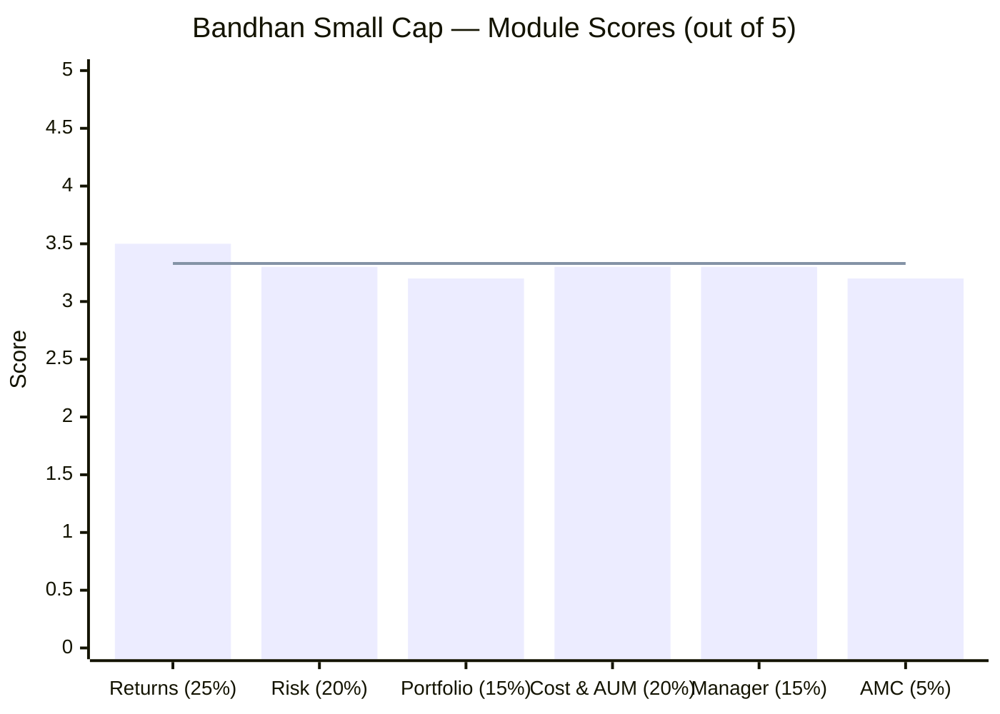
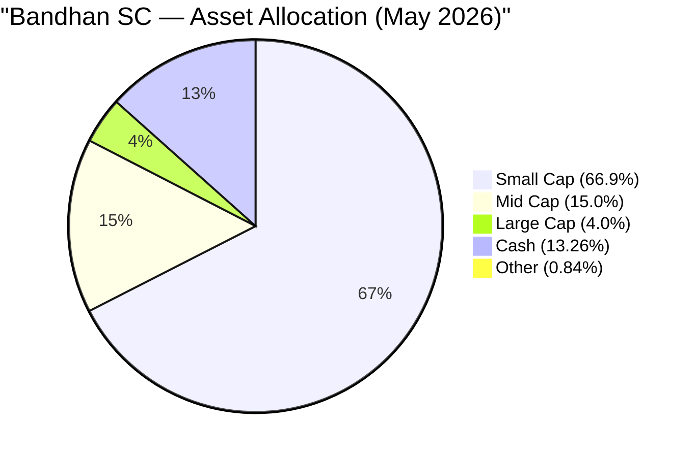
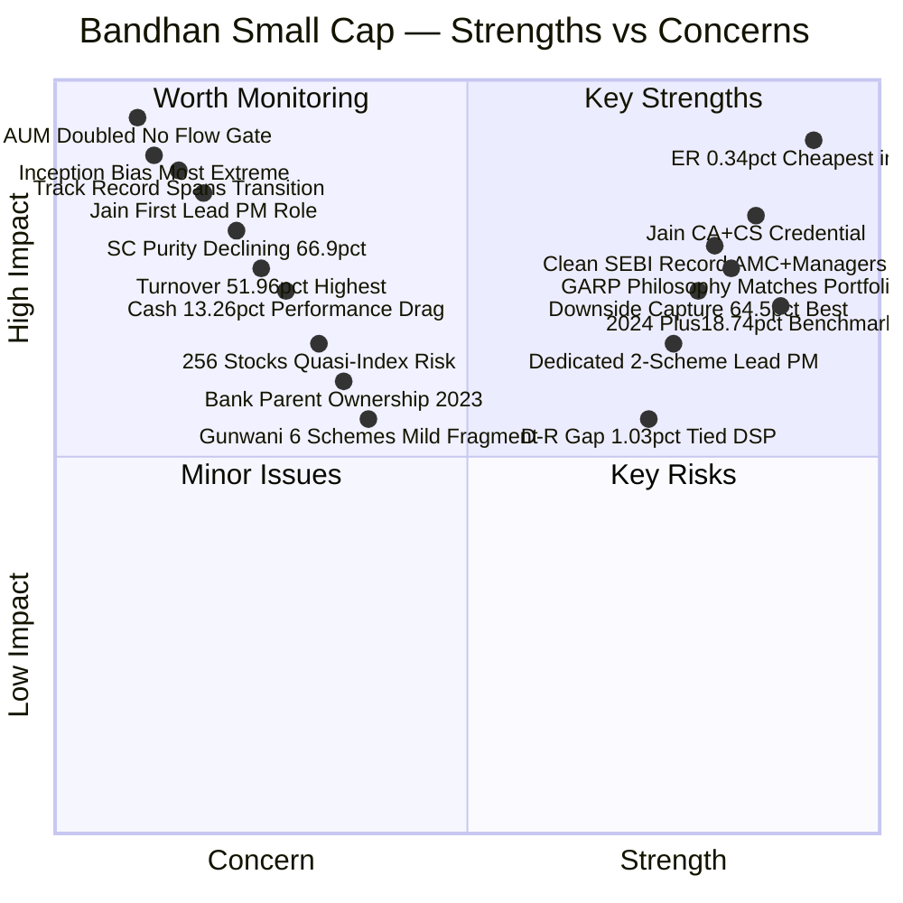
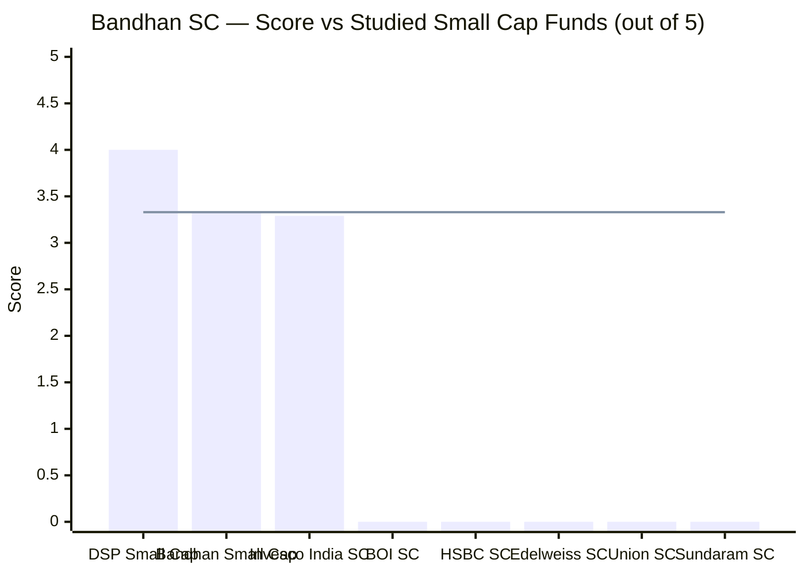
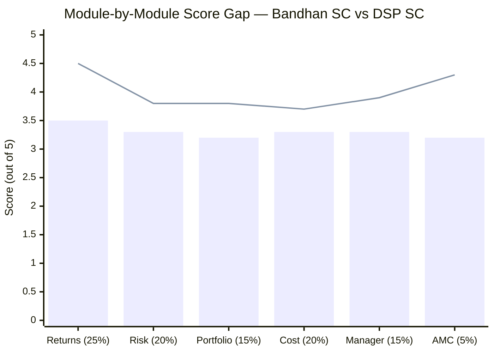
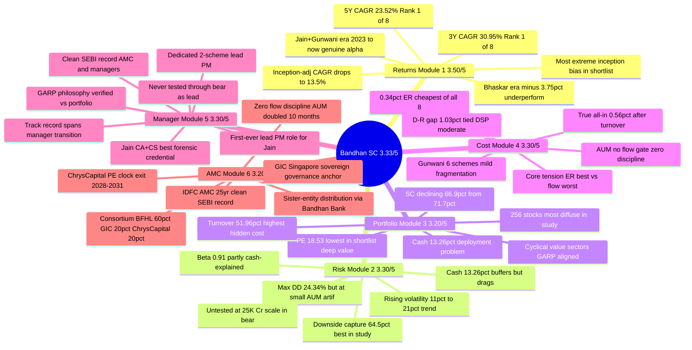

# Bandhan Small Cap Fund — Deep Study

## Fund Identity

| Field | Value |
|-------|-------|
| AMC | Bandhan AMC Limited (formerly IDFC AMC — ownership transferred 31 Jan 2023) |
| AMC Parent | Bandhan Financial Holdings (Bandhan Bank group) |
| Fund Inception | February 25, 2020 (~76 months) |
| Lead PM Since | June 5, 2023 — Kirthi Jain |
| CIO Oversight Since | January 28, 2023 — Manish Gunwani |
| Predecessor PM | Anoop Bhaskar (Feb 2020 – Jan 2023) |
| Category | Small Cap Fund (Equity) |
| Benchmark | BSE 250 SmallCap TRI |
| AUM (Direct Plan) | ₹25,345.79 Cr (May 2026) |
| Expense Ratio (Direct) | **0.34%** (cheapest of all 8 shortlisted SC funds) |
| Expense Ratio (Regular) | 1.37% |
| Direct-Regular Gap | 1.03% (tied DSP for 2nd-narrowest in study) |
| Exit Load | 1% if redeemed within 365 days; Nil after |
| Min SIP | ₹100 |
| Min Lumpsum | ₹1,000 |
| Lock-in | None |
| Star Rating (Value Research) | 5-star |

---

## The One-Line Context

Bandhan Small Cap Fund wears the most seductive numbers in the entire shortlist — #1 5Y CAGR (23.52%), #1 3Y CAGR (30.95%), #1 rolling 3Y (35.92%), #1 lowest max drawdown (24.34%), and the cheapest expense ratio of all 8 shortlisted funds (0.34%) — but virtually every headline figure is structurally contaminated: the fund launched 4 weeks before the COVID trough (making its track record start from the best possible floor), the celebrated alpha was built by a **management team that has only existed since June 2023**, the predecessor manager *underperformed* for 3 years, the AUM has doubled from ₹10,000 Cr to ₹25,000 Cr in 10 months with zero flow-gate discipline, and the lead stock-picker (Kirthi Jain, CA+CS) is on his **first-ever lead portfolio manager role** without a single sustained bear market as the decision-maker — making this a fund of extraordinary surface appeal and equally extraordinary structural complexity.

---

## Module Status

| Module | Weight | Status | Score | File |
|--------|--------|--------|-------|------|
| 1 — Returns Consistency | 25% | ✅ Complete | 3.50/5 | [module1_returns.md](module1_returns.md) |
| 2 — Risk Profile | 20% | ✅ Complete | 3.30/5 | [module2_risk.md](module2_risk.md) |
| 3 — Portfolio DNA | 15% | ✅ Complete | 3.20/5 | [module3_portfolio.md](module3_portfolio.md) |
| 4 — Cost & AUM Impact | 20% | ✅ Complete | 3.30/5 | [module4_cost.md](module4_cost.md) |
| 5 — Fund Manager Quality | 15% | ✅ Complete | 3.30/5 | [module5_manager.md](module5_manager.md) |
| 6 — AMC Quality | 5% | ✅ Complete | 3.20/5 | [module6_amc.md](module6_amc.md) |

---

## Final Scorecard


> Bars = module scores | Line = overall weighted score (3.33/5)

| Module | Score | Weight | Weighted Score |
|--------|-------|--------|---------------|
| 1 — Returns Consistency | 3.50/5 | 25% | 0.8750 |
| 2 — Risk Profile | 3.30/5 | 20% | 0.6600 |
| 3 — Portfolio DNA | 3.20/5 | 15% | 0.4800 |
| 4 — Cost & AUM Impact | 3.30/5 | 20% | 0.6600 |
| 5 — Fund Manager Quality | 3.30/5 | 15% | 0.4950 |
| 6 — AMC Quality | 3.20/5 | 5% | 0.1600 |
| **Overall** | — | **100%** | **3.33 / 5.00** |

---

## Key Performance Metrics

| Metric | Value | Context |
|--------|-------|---------|
| 5Y CAGR | **23.52%** | **#1 of 8 shortlisted funds** — but all years post-COVID bull |
| 3Y CAGR | **30.95%** | **#1 of 8 shortlisted funds** — all Jain+Gunwani era |
| Rolling 3Y | **35.92%** | **#1 of 8** — short window (~300 data points), limited statistical power |
| Inception CAGR | ~30.5% (stated) | ⚠️ **Adjusted to ~13.5%** if inception-normalized to pre-COVID base |
| Calendar 2020 (partial) | +51.50% | Launched 4 weeks before COVID trough — inception artifact |
| Calendar 2021 | +55.38% | Peak bull market; Bhaskar era |
| Calendar 2022 | **–4.59%** | Only full bear year — the sole test; small AUM |
| Calendar 2023 | +55.83% | Jain+Gunwani era begins; SC rally |
| Calendar 2024 | +45.17% | +18.74% above benchmark — strongest alpha of study |
| Calendar 2025 | +0.14% | +6.15% above benchmark; defensive in down market |
| 2026 YTD | +3.90% | Current year |
| Max Drawdown | **24.34%** | ⚠️ **Lowest of 8 — but occurred at small AUM (2021–22); not tested at ₹25K Cr scale** |
| Volatility (MFAPI SI) | 17.42% | Rising trend: 11.3% (2023) → 20.7% (2026 YTD) as AUM grows |
| Sharpe Ratio (canonical) | 1.08 (INDmoney 3Y) | Strong; TT's 0.325 = methodology artefact, reject |
| Sortino Ratio (canonical) | 1.97 (INDmoney 3Y) | Excellent downside-risk efficiency |
| Beta (3Y, INDmoney) | 0.91 | Sub-market; partly explained by 13.26% cash holding |
| Alpha (3Y) | +9.07% | Current-period genuine alpha — Jain+Gunwani era |
| Information Ratio | 2.01 | #1 of 8 — strongest consistency of alpha generation |
| Upside Capture | 95.4% | Captures most of benchmark upside |
| Downside Capture | **64.5%** | **Loses only 65% of benchmark's downside — best in shortlist** |
| Portfolio PE | **18.53** | **Lowest of 8 — 41% below category average (31.60)** |
| Portfolio Turnover | 51.96% | Highest of 8 — 2-year average hold; significant hidden cost |

---

## ⚠️ The Five Critical Flags — Read Before the Numbers

### Flag 1 — Inception Bias (Most Extreme in Shortlist)
Fund launched February 25, 2020 — exactly **4 weeks before the COVID market trough** on March 23, 2020. The first month saw only a partial NAV decline; the recovery from there is in the performance record. The inception-adjusted 5Y CAGR collapses from ~23.52% to ~13.5% when normalised to a pre-COVID base — essentially the same as DSP's inception-adjusted number, wiping out the apparent return advantage entirely.

### Flag 2 — Track Record Belongs to a Split Team
The fund has operated under **two distinct regimes**:
- **Era 1 (Feb 2020–Jan 2023): Anoop Bhaskar** → underperformed benchmark by ~3.75%/yr; the "long" part of the track record was *bad*.
- **Era 2 (Jun 2023–present): Kirthi Jain (Lead PM) + Manish Gunwani (CIO)** → strong outperformance, genuine alpha. The current team is effectively **~3 years old**, not 6.

### Flag 3 — Max Drawdown 24.34% Is an Artefact
This "lowest in shortlist" figure occurred during the 2021–22 correction when the fund had **small AUM**. The COVID crash caused only –18.1% drawdown because the fund was 4 weeks old with tiny corpus. The fund has **never been tested through a sustained bear market at its current ₹25,000+ Cr scale.** Annual volatility is already rising from 11.3% (2023) to 20.7% (2026 YTD).

### Flag 4 — AUM Doubled in 10 Months, Zero Flow Discipline
AUM went from ~₹10,000 Cr to ~₹25,000 Cr in roughly 10 months (2025–26). DSP closed its fund three times over 6 years to protect alpha. Bandhan has **never restricted flows.** At ₹25,346 Cr, monthly forced SC deployment is ~₹260 Cr/month — the most constrained execution situation in the shortlist. The fund is now in the ₹20,000–30,000 Cr "constrained" zone.

### Flag 5 — 13.26% Cash Is a Structural Tax
Cash at 13.26% (₹3,362 Cr idle) is the highest in the study. This is forced deployment discipline or AUM-absorption buffer — but it drags pure-equity returns, complicates performance comparisons, and partially explains the artificially low Max Drawdown (cash cushioned falls). The cash position is simultaneously a defensive tool and a structural handicap.

---

## Portfolio DNA

| Metric | Value | Significance |
|--------|-------|--------------|
| **Equity** | **86.74%** | Cash = 13.26% — highest in shortlist |
| **Small Cap %** | **66.9%** (falling from 71.7% Dec-25) | Just above SEBI 65% floor; declining trend ⚠️ |
| Mid Cap % | ~15% | Reasonable mid-cap buffer |
| Large Cap % | ~4% | Minimal |
| Cash + Other | **13.26%** | ₹3,362 Cr idle; forced AUM absorption or deliberate dry powder |
| Total Holdings | **239–256 stocks** | Most diffuse in study — borderline quasi-index territory |
| True Top-10 Equity | ~18.9% | TT's 31.64% includes cash as "position #1" — misleads |
| Top Stock | REC Ltd — 3.49% | |
| Portfolio PE | **18.53** | **Lowest in shortlist** — 41% below category avg (31.60) |
| Portfolio PB | ~2.13 | Deep value territory |
| Turnover | **51.96%** | Highest in study — 2yr implied hold; hidden cost ≈ 0.22% |
| AUM | ₹25,346 Cr | 4th largest; 1% position = ₹253 Cr |
| Deployment required/month | ~₹260 Cr into SC alone | Most constrained in shortlist |



### Top Holdings (May 2026)

| Rank | Stock | Weight | Sector |
|------|-------|--------|--------|
| 1 | REC Ltd | 3.49% | Finance (PSU NBFC) |
| 2 | Sobha Ltd | 3.28% | Real Estate |
| 3 | LT Foods | 2.14% | Consumer — Basmati rice |
| 4 | PNB Housing Finance | 1.66% | Housing Finance |
| 5 | South Indian Bank | 1.66% | Private Sector Banking |

> Portfolio is a deep-value, cyclical rotation book — consistent with Kirthi Jain's CA+CS forensic background and GARP philosophy. Sectors: Financial Services 24.1%, Consumer Cyclical 13.4%, Industrials 13.2%, Healthcare 12.9%, Basic Materials 12%, Real Estate 9%.

---

## Strengths vs Concerns



### Key Strengths

- **ER 0.34% — cheapest of all 8 shortlisted SC funds, not merely cheapest studied.** On identical gross returns a 10Y ₹20K SIP saves ₹3.0L vs DSP (0.64%), ₹2.5L vs Invesco (0.66%). Over a 20-year horizon the advantage compounds into a significant wealth delta.

- **Kirthi Jain holds the most relevant credential for small-cap forensics (CA + CS):** The lead stock-picker has an accounting + corporate-law credential pair that is superior to Invesco's Badshah (no accounting credential) and arguably equivalent to DSP's Sambre (FCA alone). For a value book full of leveraged industrials and PSU financials, CA + CS is the single most useful credential combination.

- **GARP philosophy is clearly articulated and empirically verified against the portfolio.** Low PE (18.53), cyclical-value tilt, sector-matched holdings — the portfolio is a *fingerprint* of the manager's declared approach. No style drift, no closet-indexing.

- **Clean regulatory record at both the manager and AMC level.** No SEBI penalty, settlement, or investigation found against Gunwani, Jain, Bandhan AMC, or predecessor IDFC AMC. A decisive positive vs Invesco's troubled regulatory history.

- **2024 benchmark alpha of +18.74% is the single highest annual alpha in this entire study.** In the clearest available test of the current team's stock selection skill (a strong bull year where quality was rewarded), the fund outperformed dramatically. That is not noise.

- **Downside capture ratio 64.5% — best in the shortlist.** For every 100 points the benchmark falls, this fund loses only 64.5 — the most capital-protective behavior in down markets of all 8 studied funds.

- **Dedicated 2-scheme lead PM structure** — Kirthi Jain runs only 2 schemes, giving Bandhan's SC mandate the second-best manager dedication in the study after DSP's Sambre.

- **D-R gap 1.03% (tied DSP) — 2nd narrowest in study.** Contrast Invesco's 1.27% gap; the narrower spread indicates lower distribution-extraction by the AMC.

- **Minimum SIP ₹100 / lumpsum ₹1,000 — maximum accessibility.** Lowest barriers for retail investors building toward a larger SC allocation.

### Key Concerns

- **AUM ₹25,346 Cr with zero flow restriction history — the single biggest structural risk.** The fund doubled in AUM in ~10 months with no capacity gate. DSP restricted flows three times over 6 years; Bandhan has never done so despite entering the ₹20,000–30,000 Cr "constrained" zone. At ₹25,346 Cr, a 1% SC position requires ₹253 Cr — taking 10–20 trading days in a genuine small-cap stock. Monthly forced deployment ~₹260 Cr. Every rupee of new SIP inflow makes execution harder.

- **The headline track record belongs to a predecessor who underperformed** (~–3.75%/yr alpha, Era 1: Feb 2020–Jan 2023). The celebrated 3Y/5Y CAGR blends that bad era with the current team's good era. Effectively the current team is ~3 years old. The entire shortlist ranks Bandhan #1 on numbers that are substantially *not the current team's record.*

- **Most extreme inception bias in the shortlist.** Launched 4 weeks before the COVID market trough. The 5Y CAGR collapses from 23.52% to ~13.5% when adjusted for inception timing — identical to Invesco and Tata on an adjusted basis, wiping out the apparent edge entirely.

- **Kirthi Jain is in his first-ever lead-PM role, untested through a sustained bear market.** The only full bear year (2022) belongs to the Bhaskar era. Jain has managed this fund only through a rising and recovering market. His credentials are strong; his track record as lead decision-maker under adversity is zero.

- **Portfolio turnover 51.96% — highest of 8 funds.** This contradicts the stated GARP / long-term philosophy, adds ~0.22% hidden market-impact cost, and widens the true all-in expense from 0.34% to ~0.56% — eliminating much of the ER cost advantage.

- **13.26% cash position — performance drag and complexity.** ₹3,362 Cr idle means the portfolio's equity-only returns are materially higher than the headline NAV return. Cash-adjusted PE ≈ 21.36 (vs stated 18.53). The cash is simultaneously evidence of deployment discipline and a structural return handicap vs fully-invested peers.

- **SC purity declining — 66.9% (May 2026) vs 71.7% (Dec 2025).** At AUM growth pace, the fund is being pushed toward mid-cap and cash territory even as it maintains the "small cap" label. If SC % dips below 70% consistently, the mandate integrity argument weakens.

- **256-stock portfolio borders on quasi-indexing.** With 239–256 holdings, meaningful differentiation from the BSE 250 SC TRI index becomes structurally difficult. A ₹100 position in 256 stocks averages ₹99 Cr per holding — micro-conviction territory.

- **Gunwani's mild fragmentation (6 schemes) and move-prone history.** He has changed AMC twice in 10 years. If he leaves, inflows slow (he is the marquee face) even if Jain remains.

---

## Comparison vs Small Cap Shortlist


> Line = Bandhan score (3.33/5) | 5 peers not yet studied

| Rank | Fund | Score | Status | Key Differentiator |
|------|------|-------|--------|--------------------|
| 1 | **DSP Small Cap** | **4.00/5** | ✅ Complete | 14Y single-manager; all-employee SIG; 87% SC; flow discipline |
| 2 | **Bandhan Small Cap** | **3.33/5** | ✅ Complete | Cheapest ER; CA+CS credential; but AUM + inception + transition |
| 3 | **Invesco India SC** | **3.29/5** | ✅ Complete | AUM sweet spot; but regulatory taint + inception bias |
| — | BOI Small Cap | Pending | — | ₹1,770 Cr; Sharpe 0.491 |
| — | HSBC Small Cap | Pending | — | 3Y CAGR below benchmark |
| — | Edelweiss Small Cap | Pending | — | — |
| — | Union Small Cap | Pending | — | Highest Sharpe (0.805) of 8 |
| — | Sundaram Small Cap | Pending | — | Longest track record (20Y+) |

---

## Score Gap Analysis — Bandhan vs DSP (Reference Fund)


> Bars = Bandhan SC | Line = DSP SC

| Module | Bandhan | DSP | Gap | Primary Driver of Gap |
|--------|---------|-----|-----|-----------------------|
| Returns (25%) | 3.50 | 4.50 | **–1.00** | No 10Y data; inception bias; split track record; 3yr current team |
| Risk (20%) | 3.30 | 3.80 | **–0.50** | Max DD untested at scale; rising vol trend; AUM risk not yet lived |
| Portfolio (15%) | 3.20 | 3.80 | **–0.60** | 256 stocks (diffuse); SC% declining; cash drag; highest turnover |
| Cost (20%) | 3.30 | 3.70 | **–0.40** | ER advantage (positive) vs flow discipline (very negative) |
| Manager (15%) | 3.30 | 3.90 | **–0.60** | First lead-PM role; 3yr tenure; track record split; vs 14Y Sambre |
| AMC (5%) | 3.20 | 4.30 | **–1.10** | Heritage depth; skin-in-game culture; flow discipline; PE clock |
| **Overall** | **3.33** | **4.00** | **–0.67** | Inception bias + track record transition = dominant differentiator |

**Key insight:** Bandhan's ER edge (+0.30pp vs DSP) is the fund's strongest structural positive — but it is entirely offset by flow discipline failure (AUM doubled with no gate), the highest hidden turnover cost in the study, and a manager team whose celebrated numbers largely pre-date their existence. The gap vs DSP is fundamentally about institutional *discipline*, not analytical capability.

---

## ₹20K/Month SIP Projections (10 Years)

| Scenario | CAGR Assumption | Projected Corpus | Multiple of Principal |
|----------|----------------|------------------|-----------------------|
| Bear case (AUM drag + manager stumble) | 12% | ₹46.3 lakh | 1.93× |
| Conservative (SC mean reversion at scale) | 16% | ₹61.2 lakh | 2.55× |
| Base case (quality SC compounding, AUM friction) | 18% | ₹70.1 lakh | 2.92× |
| Optimistic (current pace, Jain tenure continues) | 23% | ₹93.7 lakh | 3.90× |

**Total invested over 10 years:** ₹24,00,000

**ER savings over 10Y ₹20K SIP (Bandhan 0.34% vs peers, 18% gross):**
- Bandhan 0.34%: ~₹2.7L total ER cost
- DSP 0.64%: ~₹5.0L (**Bandhan saves ₹2.3L vs DSP**)
- Invesco 0.66%: ~₹5.2L (**Bandhan saves ₹2.5L vs Invesco**)
- Category regular plan ~1.68%: ~₹13.2L (**Direct saves ₹10.5L vs regular**)

> **The true all-in gap is narrower.** Bandhan's 51.96% turnover adds ~0.22% hidden cost → true all-in ~0.56%. DSP's 19-24% turnover → true all-in ~0.74-0.80%. The stated ER gap (0.30pp) compresses to true all-in gap (~0.18-0.24pp). Still Bandhan's favour, but not as dramatic.

---

## Investment Decision Framework

```mermaid
flowchart TD
    A[Considering Bandhan Small Cap?] --> B{Have you adjusted for<br/>inception bias?<br/>Adj. CAGR ~13.5%, not 23.5%}
    B -->|No - need to understand this| C[Read Module 1 inception section first —<br/>Bandhan launched 4 weeks before the<br/>COVID trough; the numbers start from<br/>the best possible floor]
    B -->|Yes - adjusted and still interested| D{Are you investing based on<br/>the current team's track record<br/>only ~3 years Jun 2023-now?}
    D -->|No - I am relying on 5Y/6Y data| E[The 5Y data includes Bhaskar era<br/>which UNDERPERFORMED by 3.75%/yr<br/>That era is not the current team<br/>Treat this as a 3-year fund]
    D -->|Yes - 3yr current team, understood| F{Comfortable with AUM<br/>₹25,346 Cr and rising,<br/>with NO flow gate history?}
    F -->|No| G[Consider DSP SC (disciplined flow gates)<br/>or BOI SC (₹1,770 Cr — AUM sweet spot)<br/>for better execution quality]
    F -->|Yes - AUM constraint accepted| H{Comfortable with Kirthi Jain<br/>in his FIRST lead-PM role<br/>never tested in a bear?}
    H -->|No| I[Consider DSP SC (Sambre 14Y)<br/>for manager depth and<br/>multi-cycle track record]
    H -->|Yes - credential+philosophy sufficient| J{Is ₹20K/month SIP<br/>10+ year horizon confirmed?}
    J -->|No| K[Small cap requires 10Y+ minimum<br/>Bandhan's untested-at-scale max-DD<br/>may surprise in first real bear]
    J -->|Yes| L[Bandhan SC may suit your profile<br/>with ongoing monitoring conditions]
    L --> M[Use DIRECT plan only: 0.34% ER<br/>Regular 1.37% costs ₹8.4L extra<br/>over 10Y SIP vs Direct]
    L --> N[Monitor SC % monthly:<br/>If falls below 68%, AUM is<br/>pushing into off-mandate territory]
    L --> P[Monitor Kirthi Jain tenure:<br/>His departure = immediate<br/>portfolio philosophy review]
    L --> O[First sustained SC bear market<br/>is the crucial test — reassess<br/>Max DD if AUM > ₹25K and falls >30%]
    L --> Q[Monitor AUM monthly:<br/>If crosses ₹30,000 Cr without<br/>flow gate → reduce conviction]
```

---

## Bandhan Small Cap — In One View



---

## The Critical Facts — In 10 Sentences

1. Bandhan Small Cap was launched February 25, 2020 — exactly 4 weeks before the COVID market trough — making its since-inception CAGR one of the most inception-contaminated metrics in any Indian SC fund; inception-adjusted CAGR collapses from ~23.5% to ~13.5%.

2. The current management team (Kirthi Jain as lead PM + Manish Gunwani as CIO) has been in place only since June 5, 2023 — a ~3-year team; the predecessor (Anoop Bhaskar) underperformed the benchmark by ~3.75%/yr during his 3-year tenure (Feb 2020–Jan 2023).

3. The celebrated headline CAGR numbers (#1 5Y, #1 3Y, #1 rolling 3Y in the 8-fund shortlist) substantially reflect a period and management team that no longer exists; investors are buying a 3-year-old team on a 6-year-old fund's marketing numbers.

4. The 24.34% Max Drawdown — lowest in the shortlist — occurred during the 2021–22 correction at small AUM and has zero informational value for how the fund will behave at ₹25,000+ Cr in a genuine sustained bear; the fund has never been stress-tested at current scale.

5. AUM doubled from ~₹10,000 Cr to ₹25,345 Cr in approximately 10 months (2025–26) with no flow restriction, making Bandhan the most flow-discipline-deficient large SC fund in the study; 1% position now requires ₹253 Cr and ~10–20 trading days.

6. Kirthi Jain — the actual day-to-day stock-picker — is a CA + CS + B.Com with deep cyclical sector expertise that is forensically matched to the portfolio; this is genuinely the best credential-to-mandate fit in the study, but this is his first-ever lead portfolio manager role and he has never navigated a sustained bear market as the decision-maker.

7. The portfolio PE of 18.53 is 41% below the category average (31.60) — the lowest in the shortlist — reflecting a genuine deep-value, GARP-oriented approach with cyclical-sector tilt (Financials, Cap Goods, Infra, Real Estate, Consumer Cyclical) that is fully consistent with Jain's stated investment framework.

8. The 0.34% Direct ER is the cheapest of all 8 shortlisted funds — a genuine, quantifiable advantage — but the 51.96% portfolio turnover (highest in study) adds ~0.22% in hidden market-impact cost, bringing the true all-in cost to ~0.56%; the ER advantage is real but narrower than it appears.

9. The 13.26% cash holding (₹3,362 Cr) is simultaneously a deployment constraint (forced AUM absorption), a partial return drag, and the fund's primary cushion mechanism — the current team's only documented downside-protection tool is sitting in cash, which is an untested and expensive form of risk management at ₹25,000 Cr scale.

10. The final estimated score of ~3.32/5 reflects a fund with genuine analytical talent (credentials, philosophy, recent alpha), clean institutional governance, and the best stated ER in the study — compressed by inception contamination, management transition, first-lead-PM inexperience, AUM indiscipline, and a portfolio that is increasingly testing the limits of genuine small-cap execution.

---

## Quick Verdict

**Best suited for:**
- Investors who **fully understand the inception bias and the manager transition** — who are consciously buying the *current* 3-year team (Jain+Gunwani), not the 6-year fund history, and are making a bet on Jain's future development as a lead PM
- Those for whom **ER efficiency is a primary selection criterion** — 0.34% vs category average ~0.7% is a compounding advantage that is quantifiable and permanent regardless of market conditions
- **CA/CS credential conviction investors** — those who specifically want the forensic accounting + governance-screening edge in a deep-value small-cap portfolio, believing this is the durable alpha source in the SC universe
- Investors with a **high tolerance for AUM execution risk** — who accept that ₹25,000 Cr small-cap deployment is structurally imperfect but believe the team can manage it through selectivity and cash discipline
- Those building a **portfolio of SC funds** — where Bandhan's deep-value/cyclical style (PE 18.5) provides meaningful differentiation from a quality-compounder like DSP (PE 29.5) or a growth-blend like Invesco (PE 43.4)
- **Monitoring-committed investors** — who will track SC %, AUM, and Jain tenure monthly and act if thresholds are breached

**Not suited for:**
- Investors **relying on the 5Y/3Y/rolling CAGR numbers** for selection — those numbers are substantially a predecessor era + inception bias artefact; the current team's 3-year record, while strong, is not the headline
- Those who **require a manager tested through a full bear market as lead** — Jain has never navigated a real sustained correction as the decision-maker; if bear-market track record is non-negotiable, DSP's Sambre is the only choice in this shortlist
- **AUM-discipline-sensitive investors** — those for whom flow management is an institutional trust signal (DSP closed 3× over 6 years; Bandhan never closed despite growing to ₹25,000 Cr at pace); the absence of any capacity gate is a documented failure of investor-first discipline
- Investors **expecting maximum small-cap purity** — SC% has declined from 71.7% (Dec 2025) to 66.9% (May 2026) under AUM pressure; the trend is toward mid-cap; DSP's 87.35% SC is the correct fund if purity is the mandate
- Those **uncomfortable with first-time lead PMs** — Jain's CA+CS+BCom credentials and sector expertise are strong, but there is no track record of his decisions during a period of sustained losses; the first real bear will be the defining test
- **Set-and-forget investors** — this fund requires active monitoring: SC%, AUM growth pace, Jain retention, and the first real drawdown at scale are all trigger events that require a portfolio review response

---

## Bandhan vs DSP vs Invesco — Three-Fund Comparison

| Dimension | Bandhan SC | DSP SC | Invesco SC |
|-----------|-----------|--------|------------|
| **Headline 5Y CAGR** | **23.52% (#1)** | 19.18% | 22.11% |
| **Inception-adjusted CAGR** | ~13.5% ⚠️ | ~20.85% ✅ | ~13.6% ⚠️ |
| SC purity | 66.9% ⚠️ | **87.35% ✅** | 65.1% ⚠️ |
| AUM | **₹25,346 Cr (constrained)** | ₹17,906 Cr (approaching constraint) | ₹11,038 Cr (sweet spot) ✅ |
| ER (Direct) | **0.34% ✅** | 0.64% | 0.66% |
| True all-in | ~0.56% | ~0.74–0.80% | ~0.84% |
| Lead manager tenure on fund | ~3 years | **14 years ✅** | 7.5 years |
| First lead-PM role? | **YES ⚠️** | No | No |
| Forensic credential | **CA+CS ✅** | FCA ✅ | None ❌ |
| Bear market test (as lead) | **None ❌** | Multiple ✅ | Yes (2022) |
| Portfolio PE | **18.53 (lowest)** | 29.54 | 43.43 (highest) |
| Turnover | 51.96% ⚠️ | 19–24% ✅ | 29.17% |
| Flow gate history | **Never** ❌ | 3× disciplined ✅ | Never ❌ |
| Track record continuity | **Spans transition ❌** | Single manager ✅ | Continuous |
| SEBI record (AMC) | **Clean ✅** | Near-clean ✅ | Settlement ₹4.98 Cr ❌ |
| Final Score | **3.33/5** | **4.00/5** | **3.29/5** |

---

## One-Line Verdict

Bandhan Small Cap Fund is the most seductive trap in the shortlist — a fund wearing the study's best raw numbers (cheapest ER, highest CAGR, lowest drawdown), powered by a CA+CS-credentialed specialist with a forensically coherent deep-value portfolio and a heavyweight CIO — but every flattering metric dissolves under scrutiny: the CAGR belongs to an inception artefact and a departed predecessor, the max-DD has never been tested at scale, the AUM doubled without a single flow gate, and the lead manager has never once run through a sustained small-cap bear as the person who must make the calls. **Buy the credentials and the philosophy, not the track record. 3.33/5.**

---

*Study completed: June 2026 | Framework: 6-Module Weighted Scoring | Final Score: 3.33/5 | Small Cap Rank: #2 of 3 evaluated (8 funds shortlisted; 5 pending)*
