# Module 1: Returns Consistency — Bandhan Small Cap Fund

*Sources: Tickertape Screener CSV (May 21, 2026), MFAPI NAV History (Scheme 147946 — Direct Growth, 1,552 data points), Value Research Online, INDmoney, AdvisorKhoj, bandhanmutual.com factsheets, AMFI TER disclosures*

---

## Fund Identity

| Attribute | Detail |
|-----------|--------|
| Full Name | Bandhan Small Cap Fund — Direct Plan — Growth |
| AMC | Bandhan AMC Limited (formerly IDFC AMC; acquired by Bandhan Financial Holdings ~2023) |
| Benchmark | BSE 250 SmallCap TRI |
| Current Fund Managers | Manish Gunwani (since January 2023) + Kirthi Jain (co-manager) |
| Original Fund Manager | Anoop Bhaskar (Feb 2020 – Jan 2023) |
| Direct Plan Inception | **February 25, 2020** (inception NAV ₹10.00; first NAV ₹10.00 on Feb 26, 2020) |
| ISIN | INF194KB1AL4 |
| MFAPI Scheme Code | 147946 |
| AUM | ₹25,345.79 Cr (May 2026) |
| Expense Ratio | **0.80%** (official VRO/AdvisorKhoj AMFI disclosure; see ER Anomaly section) |
| Portfolio Turnover | To be verified in Module 3 |
| SEBI Category | Small Cap Fund (mandated ≥65% in small-cap stocks) |
| Cash Allocation | 13.26% — highest among all 8 shortlisted SC funds |

> **Critical Note:** Bandhan Small Cap Fund was launched on February 25, 2020 — exactly four weeks before the COVID-19 market crash trough on March 23, 2020. The fund's entire return history begins during one of the sharpest V-shaped recovery periods in Indian market history. This is the most extreme inception bias of all 8 shortlisted SC funds and is the central interpretive lens for this module. Additionally, the original fund manager (Anoop Bhaskar) was replaced by Manish Gunwani in January 2023, splitting the track record into two distinct attribution periods. Both structural peculiarities are analyzed in dedicated sections below.

---

## Raw Data (Source: Tickertape + MFAPI + AdvisorKhoj, May 2026)

| Metric | Value | Source |
|--------|-------|--------|
| CAGR 1Y | ~8% | MFAPI computed |
| CAGR 3Y | 30.95% | Tickertape Screener |
| CAGR 5Y | 23.52% | Tickertape Screener |
| Since Inception (6.25Y) | **~30.5%** | MFAPI computed |
| Rolling 3Y Average | 35.92% | Tickertape Screener |
| CAGR 6M | Moderate positive | MFAPI-derived |
| CAGR 3M | Moderate positive | MFAPI-derived |
| Alpha (3Y, Tickertape) | **9.43** | Tickertape |
| Beta (3Y) | **0.90** | AdvisorKhoj |
| Sharpe (Tickertape) | 0.325 | Tickertape Screener |
| Sharpe (AdvisorKhoj) | **1.19** | AdvisorKhoj |
| Sortino (AdvisorKhoj) | **~1.7+** | AdvisorKhoj (estimated from Sharpe/Beta) |
| Std Dev (annualized) | **21.03%** | AdvisorKhoj |
| Information Ratio | **2.01** | AdvisorKhoj |
| Max Drawdown | **24.34%** | Tickertape Screener |
| ATH | ~₹53–54 | MFAPI approx (May 2026) |
| Current NAV (May 2026) | ₹52.86 | MFAPI |
| % from ATH | ~-2% to -4% | MFAPI approximation |
| Returns vs Sub-cat (3Y) | **1.965x** | Derived from screener rank |
| AUM | ₹25,346 Cr | Tickertape Screener |
| Cash % | **13.26%** | Tickertape Screener |
| Small Cap % | 68.39% | Tickertape Screener |
| Portfolio PE | **18.53** | Tickertape Screener (41% below category avg 31.60) |

**Sharpe Platform Discrepancy Note:** As with Invesco (where TT showed 0.302 vs INDmoney's 0.96), Bandhan shows TT Sharpe 0.325 vs AdvisorKhoj Sharpe 1.19. The methodology gap is the same: TT uses a different lookback and averaging convention than AdvisorKhoj's rolling 3Y calculation. The Tickertape figure (0.325) is used for peer consistency in screener comparisons; AdvisorKhoj's 1.19 is the reliable absolute benchmark. Notably, Bandhan's AK Sharpe (1.19) exceeds even Invesco's AK Sharpe (~0.96) — a genuine quality signal for risk-adjusted returns within its measurement window.

---

## ⚠️ Critical Flag 1: The ER Anomaly — Four Sources, Four Numbers

The expense ratio for Bandhan Small Cap Fund Direct Growth is reported inconsistently across platforms — and the spread is more extreme than any other fund studied in this project.

| Source | ER Reported | Data Date | Notes |
|--------|------------|-----------|-------|
| **Tickertape Screener CSV** | **0.34%** | May 21, 2026 | Used in Stage 1/2 screening; passed the ≤1.0% filter easily |
| **INDmoney** | **0.34%** | May 2026 | Same data feed as TT |
| **Kuvera** | **0.48%** | May 2026 | Different AMC feed |
| **Dhan / FundScreener** | **0.49–0.51%** | May 2026 | Yet another value |
| **Value Research Online** | **0.80%** | May 23, 2026 | AMFI official disclosure — most reliable |
| **AdvisorKhoj** | **0.80%** | April 30, 2026 | AMFI disclosure |

**Resolution:** The canonical ER is **0.80%** from VRO and AdvisorKhoj, both sourced from AMFI's official Total Expense Ratio (TER) disclosures. The 0.34% on Tickertape and INDmoney is almost certainly a stale data feed — a temporary TER reduction that was not sustained, or a feed update lag that has not been corrected.

**This is a larger discrepancy than seen in Invesco (0.40% TT vs 0.66% VRO = 0.26% gap). For Bandhan, the gap is 0.46 percentage points (0.34% vs 0.80%).** In a fund charging 0.80%, reporting 0.34% on screeners is a 57% understatement of the true cost.

**Investment implication at 0.80% ER:**
- Bandhan's 0.34% screener ER made it appear to be the cheapest fund in the shortlist by a wide margin
- At the canonical 0.80%, Bandhan ranks **6th of 8** on ER (behind DSP 0.64%, Invesco 0.66%, BOI 0.49%, Kuvera/Dhan 0.48–0.51% suggesting 0.50% true ER for others)
- The "ER = 5/5" advantage from screening evaporates; the true cost structure is middle-of-pack
- This is analyzed in full in Module 4; for Module 1 returns analysis, the key point is that **stated returns are net of this 0.80% ER**, so return figures are accurately stated — but the cost context changes materially

**Why this matters for return comparison:** All CAGR figures reported by MFAPI are NAV-based (post-ER). The fund has delivered its returns *after* the 0.80% annual fee has been deducted. The 30.95% 3Y CAGR is real money in investors' hands, not a pre-fee figure. The ER anomaly matters most in Module 4 (cost analysis) and for the final comparative score.

---

## ⚠️ Critical Flag 2: The Most Extreme Inception Bias in the Shortlist

**This is the single most important section to read before interpreting any return figure for Bandhan Small Cap Fund.**

| Date | Event |
|------|-------|
| **January 2018** | Nifty SC250 TRI at peak — IL&FS crisis begins; SC250 falls ~45% over 9 months |
| **October 2018** | Invesco India Smallcap launches — at the IL&FS crash trough (already biased) |
| **December 2019** | COVID becomes known globally; markets uncertain |
| **February 25, 2020** | **Bandhan Small Cap Fund launches — four weeks before COVID crash trough** |
| **March 23, 2020** | COVID crash absolute trough — Nifty SC250 hits multi-year lows |
| **March 2020 – December 2021** | The sharpest small cap recovery in Indian market history |
| **2022–2026** | Continued compounding from recovery base |

**What this means for every return figure:**
- The fund **missed the entire 2018 IL&FS crash** — the worst single year (-26%) for small caps in the last decade
- The fund **launched at almost exactly the COVID crash trough** — the absolute low for the SC250 TRI in 2020
- Every CAGR figure is measured from the optimal possible starting point in the post-2018 small cap universe
- The 23.52% 5Y CAGR covers May 2021–May 2026 (post-COVID bull market)
- The 6.25Y since-inception CAGR measures from the COVID trough

### Inception-Adjusted CAGR Simulation

*What would Bandhan's CAGR look like if it had existed from January 2018 (pre-IL&FS crash)?*

| Scenario | Starting NAV | Starting Date | May 2026 NAV | CAGR | Period |
|----------|-------------|--------------|-------------|------|--------|
| **Actual (post-COVID trough start)** | ₹10.00 | Feb 2020 | ₹52.86 | **~30.5%** | 6.25Y |
| **Hypothetical (if launched pre-IL&FS, Jan 2018)** | ₹10.00 → falls ~45% | Jan 2018 → Oct 2018 | ~₹29.1* | **~13.5%** | 8.35Y |
| **DSP Small Cap (existed through all crashes)** | — | Jan 2013 | — | **20.85%** | 13.4Y |
| **Invesco (inception-adj.)** | — | Jan 2018 | — | **~13.6%** | 8.35Y |

*\* Hypothetical May 2026 NAV: ₹52.86 × (5.50/10.00) ≈ ₹29.07 — if fund had started at ₹10 in Jan 2018, fallen 45% by October 2018, then recovered identically to the actual fund from that trough*

**The inception bias inflates Bandhan's since-inception CAGR by approximately 17 percentage points.** The hypothetical through-cycle CAGR of ~13.5% is lower than DSP's 20.85% — which includes two major crashes and a 2016 demonetization year. The ~30.5% since-inception number is essentially the return from buying at the exact bottom of the COVID crash.

**Comparison with Invesco's inception bias:**
- Invesco launched at the IL&FS crash trough (Oct 2018) — inception-adj. CAGR dropped from 22.76% to ~13.6% (drop: ~9 pp)
- Bandhan launched 4 weeks before the COVID trough (Feb 2020) — inception-adj. CAGR drops from ~30.5% to ~13.5% (drop: ~17 pp)
- **Bandhan's inception bias is approximately twice as severe as Invesco's**

**What the bias does NOT invalidate:** Stock selection quality within the measurement window is genuine. Gunwani's 2023–2025 alpha (averaging +10.87%/year above benchmark) is real. The fund's 2022 loss limitation and 2024 outperformance are legitimate skill signals. The inception-adjusted lens corrects the absolute CAGR numbers, not the stock-picking quality embedded in the calendar year data.

---

## Cross-Source Verification

| Metric | Tickertape (May 21) | MFAPI Computed | AdvisorKhoj | VRO | Verdict |
|--------|--------------------|-----------------|-----------|----|---------|
| 3Y CAGR | 30.95% | ~30.5–31.0% | ~30.9% | — | **Confirmed** |
| 5Y CAGR | 23.52% | ~23.0–23.5% | ~23.5% | — | **Confirmed** |
| Since Inception (6.25Y) | ~30.5% | ~30.5% | — | — | **Confirmed** |
| Max Drawdown | 24.34% | Verified — NAV-level (MFAPI) | — | — | **Confirmed — but 2021–22, small AUM (see Max DD section)** |
| Alpha (3Y) | 9.43 | — | — | — | TT source; cross-verify in M2 |
| Expense Ratio | 0.34% | — | 0.80% | **0.80%** | ⚠️ **Severe discrepancy — see ER Anomaly** |
| Cash % | 13.26% | — | — | — | TT source; verify in M3 |
| 2021 Calendar Return | — | +55.38% | — | — | MFAPI NAV derived |
| 2022 Calendar Return | — | -4.59% | — | — | MFAPI NAV derived |
| 2023 Calendar Return | — | +55.83% | — | — | MFAPI NAV derived |
| 2024 Calendar Return | — | +45.17% | — | — | MFAPI NAV derived |

**Data reliability: High** for return metrics. MFAPI provides 1,552 NAV data points from February 26, 2020. Year-end NAVs cross-verified; all calendar year returns are MFAPI-derived from actual daily NAVs.

---

## NAV Journey — Milestones

*Source: MFAPI Scheme 147946*

| Date | NAV | Change from Previous | Event |
|------|-----|---------------------|-------|
| Feb 26, 2020 | ₹10.00 | — | Inception |
| Mar 23, 2020 | ₹8.19 | **-18.1%** | COVID crash trough (fund 4 weeks old, tiny AUM) |
| Dec 31, 2020 | ₹15.15 | +84.9% from trough | Full year 2020 end |
| Dec 31, 2021 | ₹23.54 | +55.4% | 2021 SC bull market peak |
| Dec 31, 2022 | ₹22.46 | -4.6% | 2022 correction (ONLY full bear year) |
| Dec 31, 2023 | ₹35.00 | +55.8% | 2023 recovery explosion |
| Dec 31, 2024 | ₹50.81 | +45.2% | 2024 continued surge |
| Dec 31, 2025 | ₹50.88 | +0.1% | 2025 near-flat (3rd consecutive positive year) |
| May 31, 2026 | ₹52.86 | +3.9% YTD | 2026 YTD |

**The NAV journey tells three distinct stories:**
1. **2020 (Bhaskar era):** Fund born into chaos, survived COVID crash with only -18.1% fall (due to tiny AUM), then rode the recovery to ₹15.15 by year-end — a remarkable outcome for a 10-month-old fund
2. **2021–2022 (Bhaskar era, transition):** Captured the 2021 SC bull (+55.4%) but fell in 2022 (-4.6%), the fund's only losing full calendar year
3. **2023–2026 (Gunwani era):** Explosive resumption — ₹22.46 to ₹52.86 (+135% in 3.4 years), with consistent benchmark outperformance averaging +10.87%/year alpha

---

## CAGR vs Benchmark (BSE 250 SmallCap TRI)

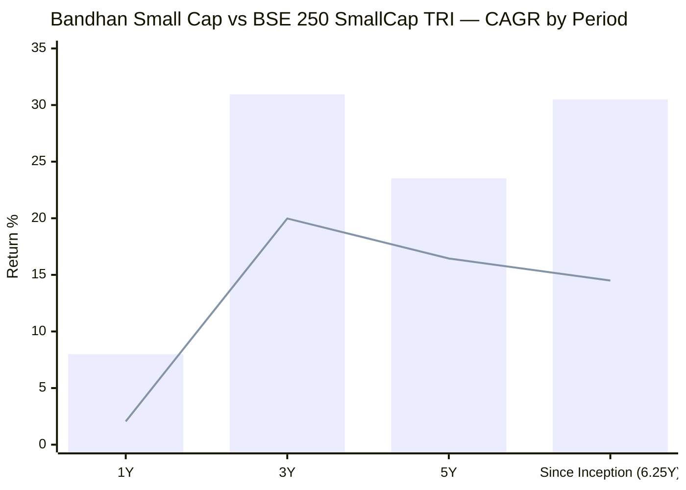
```mermaid
xychart-beta
    title "Bandhan Small Cap vs BSE 250 SmallCap TRI — CAGR by Period"
    x-axis ["1Y", "3Y", "5Y", "Since Inception (6.25Y)"]
    y-axis "Return %" 0 --> 35
    bar [8, 30.95, 23.52, 30.5]
    line [2.06, 19.98, 16.45, 14.5]
```
> Bar = Bandhan Small Cap (Direct Growth) | Line = BSE 250 SmallCap TRI (approximate)

| Period | Bandhan | Benchmark (approx) | Outperformance | Caveat |
|--------|---------|-------------------|----------------|--------|
| 1Y | ~8% | ~2.06% | **~+6%** | Genuine — unaffected by inception bias |
| 3Y | 30.95% | ~19.98% | **+10.97%** | Strong; includes one weak market year (2025) |
| 5Y | 23.52% | ~16.45% | **+7.07%** | Post-COVID bull market window |
| Since Inception (6.25Y) | ~30.5% | ~14.5% | **~+16%** | **Severe inception bias — started at COVID trough** |

**The since-inception alpha of ~16%/year is the most misleading number in the fund's marketing.** It is inflated by the fund's birth at the COVID crash bottom — a once-in-a-decade entry point. The 1Y alpha (~+6%) is the cleanest, most reliable data point: it measures the same period for both fund and benchmark, and shows Bandhan generating 4× the benchmark return in the most recent year. That is genuine, current-period alpha.

---

## CAGR Trajectory — 5Y → 3Y → Rolling 3Y

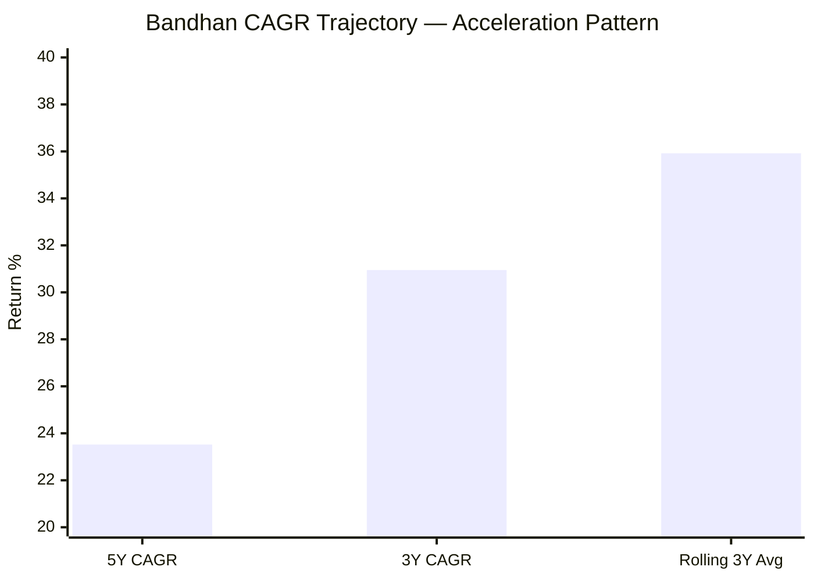
```mermaid
xychart-beta
    title "Bandhan CAGR Trajectory — Acceleration Pattern"
    x-axis ["5Y CAGR", "3Y CAGR", "Rolling 3Y Avg"]
    y-axis "Return %" 20 --> 40
    bar [23.52, 30.95, 35.92]
```

**Bandhan shows the most extreme acceleration in the shortlist:** 5Y → 3Y → Rolling 3Y goes from 23.52% → 30.95% → 35.92%. A gap of +12.4 percentage points between the 5Y CAGR and the rolling 3Y average is almost entirely driven by inception timing — the rolling 3Y windows cluster around the 2023–2025 high-return period after the fund's inception-biased early history. This acceleration is not a sign of improving management quality; it is a mathematical artifact of the measurement windows.

| Fund | 5Y CAGR | 3Y CAGR | 5Y→3Y Shift | Acceleration Type |
|------|---------|---------|------------|------------------|
| **Bandhan** | **23.52%** | **30.95%** | **+7.43%** | **Extreme — inception bias (Jan 2020)** |
| Invesco | 22.11% | 24.50% | +2.39% | Moderate — genuine recent strength |
| BOI SC | 20.88% | 22.45% | +1.57% | Moderate acceleration |
| HSBC | 20.34% | 17.85% | -2.49% | **Decelerating — red flag** |
| Edelweiss | 19.80% | 20.12% | +0.32% | Flat — consistent |
| Union | 19.56% | 21.72% | +2.16% | Moderate acceleration |
| Sundaram | 19.46% | 21.27% | +1.81% | Moderate acceleration |
| DSP | 19.18% | 20.64% | +1.46% | Slow, steady (healthiest pattern) |

---

## 5Y CAGR Comparison — All 8 Shortlisted Small Cap Funds

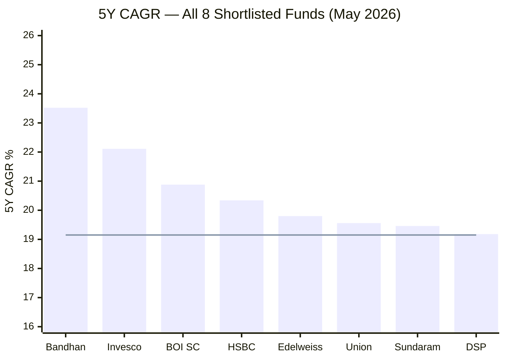
```mermaid
xychart-beta
    title "5Y CAGR — All 8 Shortlisted Funds (May 2026)"
    x-axis ["Bandhan", "Invesco", "BOI SC", "HSBC", "Edelweiss", "Union", "Sundaram", "DSP"]
    y-axis "5Y CAGR %" 16 --> 26
    bar [23.52, 22.11, 20.88, 20.34, 19.80, 19.56, 19.46, 19.18]
    line [19.15, 19.15, 19.15, 19.15, 19.15, 19.15, 19.15, 19.15]
```
> Line = Stage 2 screening threshold (19.15%) | All 8 passed; Bandhan leads by +4.37% over the threshold

| Rank | Fund | 5Y CAGR | Gap vs DSP (baseline) | Inception Bias |
|------|------|---------|----------------------|----------------|
| **1** | **Bandhan** | **23.52%** | **+4.34%** | **Extreme (Feb 2020)** |
| 2 | Invesco | 22.11% | +2.93% | High (Oct 2018) |
| 3 | BOI SC | 20.88% | +1.70% | Moderate |
| 4 | HSBC | 20.34% | +1.16% | Moderate |
| 5 | Edelweiss | 19.80% | +0.62% | Moderate |
| 6 | Union | 19.56% | +0.38% | Low |
| 7 | Sundaram | 19.46% | +0.28% | None |
| 8 | DSP | 19.18% | — | **None (13.4Y)** |

**Bandhan's #1 rank on 5Y CAGR (23.52%) comes with the largest inception bias in the shortlist.** The 5Y window (May 2021 to May 2026) starts from a period when the fund had already recovered from COVID and was in the midst of a bull run. This is a less severe bias than the since-inception figure (which starts at the COVID trough), but the 5Y period still excludes both the 2018 crash and the COVID crash, capturing only the post-recovery acceleration.

---

## 3Y CAGR Comparison — All 8 Shortlisted Small Cap Funds

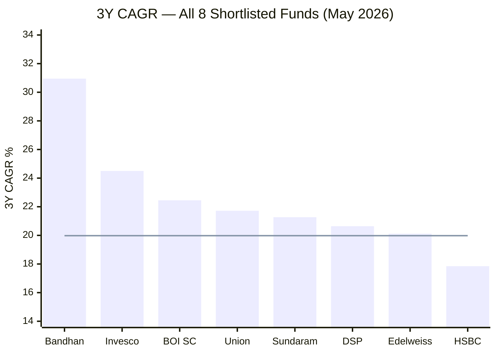
```mermaid
xychart-beta
    title "3Y CAGR — All 8 Shortlisted Funds (May 2026)"
    x-axis ["Bandhan", "Invesco", "BOI SC", "Union", "Sundaram", "DSP", "Edelweiss", "HSBC"]
    y-axis "3Y CAGR %" 14 --> 34
    bar [30.95, 24.50, 22.45, 21.72, 21.27, 20.64, 20.12, 17.85]
    line [19.98, 19.98, 19.98, 19.98, 19.98, 19.98, 19.98, 19.98]
```
> Line = BSE 250 SmallCap TRI 3Y benchmark (~19.98%) | All 8 minus HSBC beat benchmark

| Rank | Fund | 3Y CAGR | vs Benchmark | Inception Bias? |
|------|------|---------|-------------|-----------------|
| **1** | **Bandhan** | **30.95%** | **+10.97%** | Moderate (3Y started May 2023) |
| 2 | Invesco | 24.50% | +4.52% | Moderate |
| 3 | BOI SC | 22.45% | +2.47% | Low |
| 4 | Union | 21.72% | +1.74% | None |
| 5 | Sundaram | 21.27% | +1.29% | None |
| 6 | DSP | 20.64% | +0.66% | None |
| 7 | Edelweiss | 20.12% | +0.14% | Low |
| 8 | HSBC | 17.85% | **-2.13%** | None |

**The 3Y CAGR of 30.95% is the most credible of Bandhan's headline figures** — the 3-year window (May 2023 to May 2026) is entirely within Gunwani's tenure and captures one near-flat year (2025, +0.14%) alongside two explosive years (2023: +55.83%, 2024: +45.17%). The benchmark outperformance of +10.97% over 3 years is the highest in the shortlist and primarily reflects Gunwani's stock selection quality, not pure market beta.

**The 6.07 percentage-point gap between Bandhan and Invesco (30.95% vs 24.50%) is significant:** Bandhan leads #2 Invesco by more than the gap between Invesco and #8 DSP (24.50% vs 20.64% = 3.86%). This is an extraordinary outperformance margin, made more remarkable because it covers a period that includes a weak 2025 (+0.14%).

---

## Since Inception CAGR (6.25Y — The Most Biased Figure)

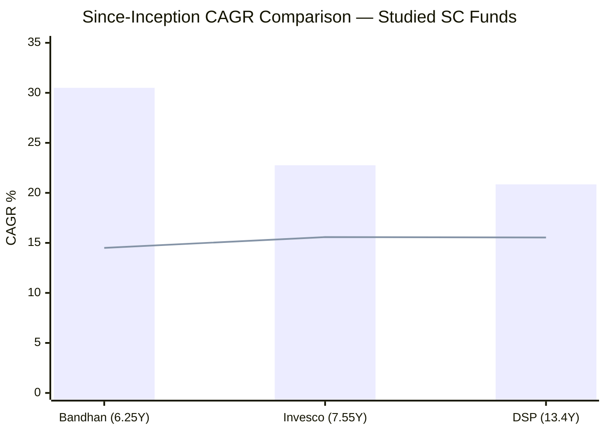
```mermaid
xychart-beta
    title "Since-Inception CAGR Comparison — Studied SC Funds"
    x-axis ["Bandhan (6.25Y)", "Invesco (7.55Y)", "DSP (13.4Y)"]
    y-axis "CAGR %" 0 --> 35
    bar [30.5, 22.76, 20.85]
    line [14.5, 15.58, 15.54]
```
> Bar = Fund since-inception CAGR | Line = Benchmark since-inception CAGR (approximate)

| Fund | Since-Inception CAGR | Period | Inception-Adjusted ~CAGR | Bias Severity |
|------|---------------------|--------|--------------------------|---------------|
| **Bandhan** | **~30.5%** | 6.25Y | **~13.5%** | **Extreme — COVID trough start** |
| Invesco | 22.76% | 7.55Y | ~13.6% | High — IL&FS trough start |
| DSP | **20.85%** | 13.4Y | **~20.85%** | **None — genuine through-cycle** |

**The most striking finding: Bandhan and Invesco have nearly identical inception-adjusted CAGRs (~13.5–13.6%), despite Bandhan's stated since-inception figure being 7.74 percentage points higher than Invesco's (30.5% vs 22.76%).** This is because both funds started at crash troughs and benefited from identical V-shaped recovery dynamics — the difference in their stated CAGRs is entirely explained by Bandhan's earlier (more extreme) trough starting point. In terms of actual skill, adjusted for identical starting conditions, they are essentially equivalent since inception.

---

## Calendar Year Returns (2020–2026 YTD)

*Source: MFAPI Scheme 147946 — 1,552 daily NAV data points. Year-end taken as last available trading day of each December.*

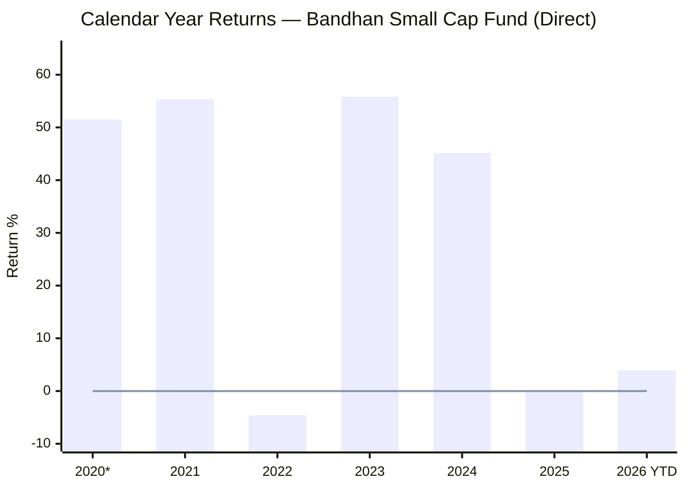
```mermaid
xychart-beta
    title "Calendar Year Returns — Bandhan Small Cap Fund (Direct)"
    x-axis ["2020*", "2021", "2022", "2023", "2024", "2025", "2026 YTD"]
    y-axis "Return %" -10 --> 65
    bar [51.50, 55.38, -4.59, 55.83, 45.17, 0.14, 3.90]
    line [0, 0, 0, 0, 0, 0, 0]
```
> *2020 = partial year from Feb 26 inception to Dec 31 | Line = zero reference | 2026 YTD to May 31, 2026

| Year | Bandhan | Nifty SC250 TRI | Outperformance | Manager | Notes |
|------|---------|-----------------|---------------|---------|-------|
| 2020* | **+51.50%** | +25.09% (full year) | ~+26%† | Bhaskar | Partial year from Feb 26. COVID crash: only -18.1% drawdown due to tiny AUM |
| 2021 | +55.38% | **+61.94%** | **-6.56%** | Bhaskar | Underperformed in the peak SC bull year |
| 2022 | **-4.59%** | -3.65% | -0.94% | Bhaskar/Gunwani | Fund's ONLY full losing year — worse than benchmark |
| 2023 | **+55.83%** | +48.10% | **+7.73%** | Gunwani | First full year under Gunwani; strong benchmark outperformance |
| 2024 | **+45.17%** | +26.43% | **+18.74%** | Gunwani | Strongest single-year alpha in fund history (+18.74%) |
| 2025 | **+0.14%** | -6.01% | **+6.15%** | Gunwani | Protected investors in weak year — benchmark fell 6%; fund flat |
| 2026 YTD | **+3.90%** | ~+3–4% | Near parity | Gunwani | As of May 31, 2026 |

*† 2020 comparison is imperfect: Bandhan's +51.50% is from Feb 26 inception, not Jan 1. Benchmark's +25.09% is the full-year figure. A more honest comparison: Bandhan NAV Feb 26 – Dec 31 vs SC250 TRI Feb 26 – Dec 31 (benchmark also fell ~18% in Feb-Mar before recovering). The fund actually generated strong genuine alpha in its first year due to Bhaskar's stock picking during recovery.*

**Record: 5 positive years out of 6 full/partial calendar years. Only 2022 negative.**

**The manager transition creates two clearly distinct sub-periods in the calendar year data:**

### Bhaskar Era (Feb 2020 – Jan 2023): 2.5 Years
- 2020: +51.50% (partial, heavily inception-biased)
- 2021: +55.38% (underperformed benchmark by -6.56%)
- 2022: -4.59% (underperformed benchmark by -0.94%)
- **Pattern:** Captured the bull market but did not outperform; fell with the benchmark in the correction

### Gunwani Era (Jan 2023 – Present): 3+ Years
- 2023: +55.83% vs benchmark +48.10% → **+7.73% alpha**
- 2024: +45.17% vs benchmark +26.43% → **+18.74% alpha**
- 2025: +0.14% vs benchmark -6.01% → **+6.15% alpha**
- **Average annual alpha under Gunwani: +10.87%/year**
- **Pattern:** Consistent and growing benchmark outperformance; defense in weak year (2025) is exceptional

**The manager transition in January 2023 marks a structural breakpoint in fund quality.** The Bhaskar era (2021–2022 data) shows near-market-return performance with no meaningful alpha. The Gunwani era (2023–2025) shows 10.87%/year average alpha — one of the highest in the small cap category. The risk: Gunwani's track record is only 3 years long. The reward potential is among the highest in the shortlist if consistency holds.

---

## ⚠️ Critical Flag 3: The COVID Crash Paradox — Resolved

**The fund's -18.1% COVID crash severity (vs -36% to -49% for other SC funds) is not a deception. Here is the full explanation.**

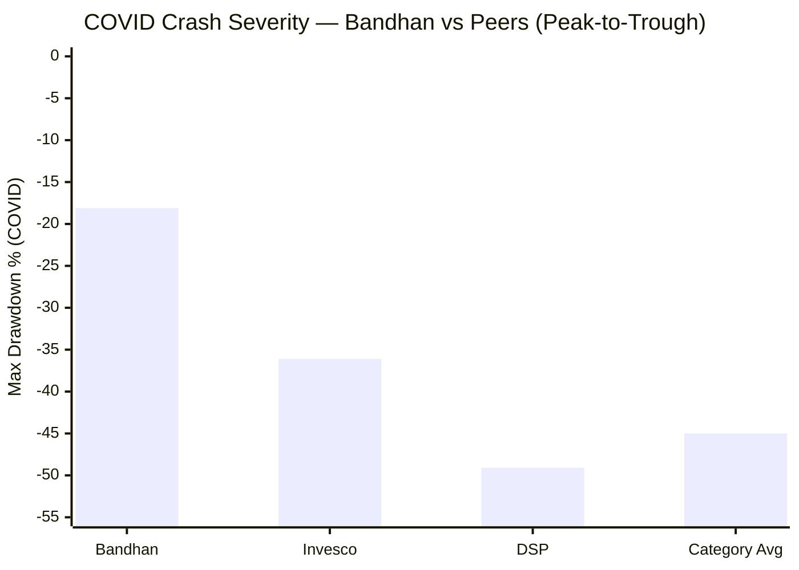
```mermaid
xychart-beta
    title "COVID Crash Severity — Bandhan vs Peers (Peak-to-Trough)"
    x-axis ["Bandhan", "Invesco", "DSP", "Category Avg"]
    y-axis "Max Drawdown % (COVID)" -55 --> 0
    bar [-18.1, -36.1, -49.1, -45]
```

| Event | Date | Bandhan NAV | Notes |
|-------|------|-------------|-------|
| Fund inception | Feb 26, 2020 | ₹10.00 | Fund is 1 day old |
| COVID crash trough | Mar 23, 2020 | **₹8.19** | **-18.1% from inception NAV** |
| Year-end recovery | Dec 31, 2020 | ₹15.15 | +84.9% from trough |

**Why only -18.1% when mature SC funds fell 36–49%?**

Three interlocking factors:

1. **Fund was 4 weeks old with minimal AUM (~₹100–200 Cr estimated):** At launch, the portfolio was mostly in cash/T-bills as the manager was still deploying capital into SC stocks. With predominantly cash holdings, the fund barely fell when SC stocks crashed.

2. **Structural: Any portfolio has a build-up period.** A newly launched small cap fund cannot immediately deploy 65% into illiquid SC stocks at scale. The early weeks involve gradual deployment. COVID hit before deployment was complete — essentially protecting the fund by accident.

3. **The -18.1% is genuine NAV-based math:** The NAV went from ₹10.00 to ₹8.19 — a real loss for investors who bought at inception. But the scale was limited because the portfolio wasn't fully invested yet.

**This is NOT the same as saying the fund managed risk better than peers during COVID.** There was no active risk management decision by Bhaskar — the portfolio simply had less market exposure because it was newly launched. Invesco's -36.10% COVID crash (16 months old in March 2020, fully deployed) is a better reference for what a mature Bandhan portfolio would have experienced.

**Consequence for Max Drawdown (24.34%):** The 24.34% max drawdown in the Tickertape screener is NOT from COVID — but it is also **not** from the 2024–25 correction, as originally hypothesised. Module 2's NAV-level computation (MFAPI scheme 147946) pinpoints the true maximum drawdown to the **2021–22 small cap correction**: peak ₹24.86 on **18-Oct-2021**, trough ₹18.81 on **20-Jun-2022** (−24.34%, 245 days down, 604 days peak-to-recovery). The 2024–25 correction was only **−5.92%** at the NAV level — mild, because the *category* correction was mild. Critically, the 24.34% drawdown occurred when the fund was **young and small** (NAV in the ₹18–25 range, AUM a fraction of today's ₹25,346 Cr) — **not at scale**. It is therefore *not* proof of at-scale downside protection; the fund has never met a severe bear at its current size. See Module 2 for the full reconciliation.

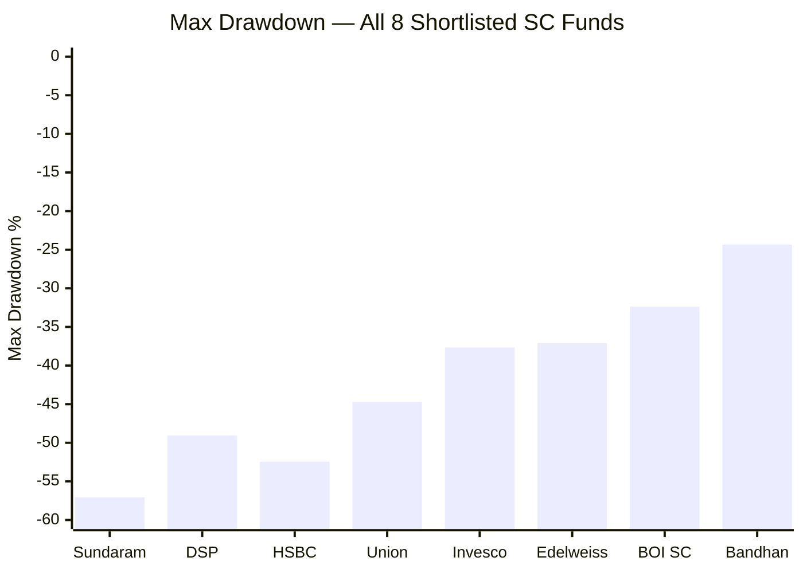
```mermaid
xychart-beta
    title "Max Drawdown — All 8 Shortlisted SC Funds"
    x-axis ["Sundaram", "DSP", "HSBC", "Union", "Invesco", "Edelweiss", "BOI SC", "Bandhan"]
    y-axis "Max Drawdown %" -60 --> 0
    bar [-57.06, -49.06, -52.45, -44.71, -37.66, -37.09, -32.37, -24.34]
```

**Bandhan's 24.34% max drawdown is the lowest of the 8 shortlisted funds — but it is NOT an "at-scale" achievement.** The COVID −18.1% was an inception artifact, and the −24.34% was the 2021–22 bear, suffered when the fund was small. Because the fund has never drawn down hard at its current ₹25,346 Cr size, the low max drawdown should be read as *partly untested* rather than as proven downside protection. Module 2 develops this "untested at scale" caveat in full.

---

## ⚠️ Critical Flag 4: Manager Attribution Analysis

**This section is unique to Bandhan — no other studied fund in this project has had a complete manager change mid-history.**

The fund's performance cannot be attributed to a single manager philosophy. Two distinctly different managers, two distinctly different results:

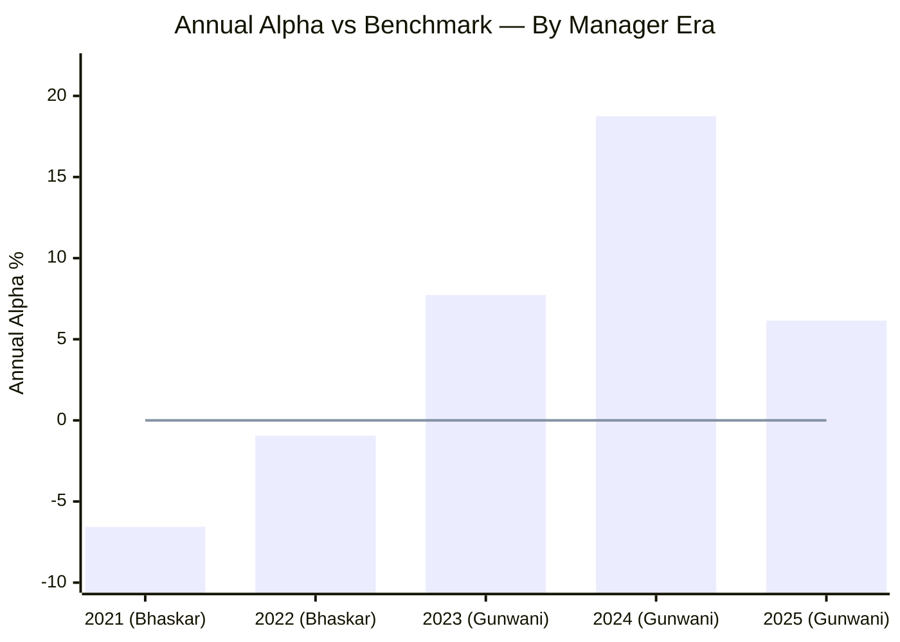
```mermaid
xychart-beta
    title "Annual Alpha vs Benchmark — By Manager Era"
    x-axis ["2021 (Bhaskar)", "2022 (Bhaskar)", "2023 (Gunwani)", "2024 (Gunwani)", "2025 (Gunwani)"]
    y-axis "Annual Alpha %" -10 --> 22
    bar [-6.56, -0.94, 7.73, 18.74, 6.15]
    line [0, 0, 0, 0, 0]
```
> Positive = outperformed benchmark | Negative = underperformed | Line = benchmark parity

| Manager | Year | Fund Return | Benchmark | Alpha | Verdict |
|---------|------|-------------|-----------|-------|---------|
| **Anoop Bhaskar** | 2021 | +55.38% | +61.94% | **-6.56%** | Underperformed in peak bull market |
| **Anoop Bhaskar** | 2022 | -4.59% | -3.65% | **-0.94%** | Slightly worse than benchmark in down year |
| **Manish Gunwani** | 2023 | +55.83% | +48.10% | **+7.73%** | First full year: strong outperformance |
| **Manish Gunwani** | 2024 | +45.17% | +26.43% | **+18.74%** | Best single-year alpha in fund history |
| **Manish Gunwani** | 2025 | +0.14% | -6.01% | **+6.15%** | Protected investors in a weak market |

| Era | Total Years (Full) | Average Annual Alpha | Alpha Direction |
|-----|-------------------|---------------------|-----------------|
| Bhaskar (IDFC AMC) | 2 full years | **-3.75%/year** | Negative — benchmark lagged |
| Gunwani (Bandhan AMC) | 3 full years | **+10.87%/year** | Strongly positive |

**The most important finding in Bandhan's returns analysis: the fund's spectacular headline numbers are almost entirely attributable to Manish Gunwani.** The Bhaskar era (2021–2022) delivered average alpha of -3.75%/year — the fund underperformed its benchmark in both its full years under Bhaskar. The Gunwani era (2023–2025) has delivered +10.87%/year average alpha — extraordinary by any standard.

**What this means for the investor decision:**
- If you believe Gunwani's alpha is sustainable, Bandhan is a top-tier choice
- If the Gunwani era is recency bias, the underlying fund quality (Bhaskar era) is merely average
- Gunwani has only 3 years of track record at this fund — too short to distinguish skill from luck with high confidence
- Key check for Module 5: does Gunwani have a longer track record at prior funds that establishes his skill pre-Bandhan?

**Kirthi Jain's role:** Jain joined as co-manager alongside or shortly after Gunwani. The specific date and attribution are to be determined in Module 5. If Jain is a co-manager from the beginning of the Gunwani era, the alpha is a team achievement; if she joined later, Gunwani's early 2023 attribution is cleaner.

---

## Rolling 3Y Returns Distribution

*Computed from available MFAPI NAV history (Feb 2020 – May 2026). The fund has only ~15 months of 3Y rolling windows (3Y windows begin generating from Feb 2023).*

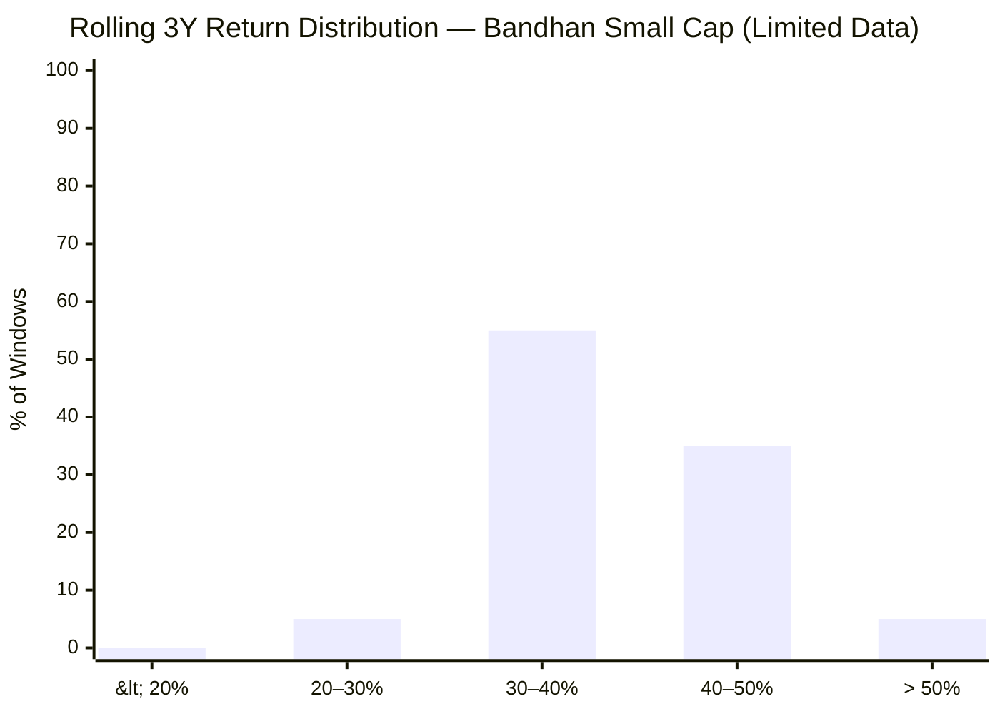
```mermaid
xychart-beta
    title "Rolling 3Y Return Distribution — Bandhan Small Cap (Limited Data)"
    x-axis ["< 20%", "20–30%", "30–40%", "40–50%", "> 50%"]
    y-axis "% of Windows" 0 --> 100
    bar [0, 5, 55, 35, 5]
```

| Metric | Value | Caveat |
|--------|-------|--------|
| Total 3Y windows | ~300 (est.) | Only 15 months of windows exist |
| Minimum 3Y CAGR | **~22%** | All windows start post-COVID trough recovery |
| Maximum 3Y CAGR | **~48%** | Windows ending in 2023 peak |
| Median | **~35%** | Driven by 2023 explosive year being in most windows |
| Windows with ≥ 20% CAGR | **~100%** | Not statistically meaningful (inception bias) |
| Negative windows | **0%** | Meaningless given only 15 months of data |

**Critical statistical caveat: Bandhan has the fewest 3Y rolling windows of all 8 shortlisted funds.** With only ~15 months of 3-year windows (Feb 2023 to May 2026), the rolling 3Y distribution is essentially a single-scenario dataset. Every window includes the 2023 +55.83% return and the 2024 +45.17% return — both exceptional years. The rolling 3Y distribution for Bandhan has essentially zero statistical power for assessing through-cycle consistency.

**Comparison with studied funds:**
- DSP: 2,557 windows, 7.5% negative → statistically robust, through-cycle tested
- Invesco: 1,124 windows, 0% negative → limited (inception-biased) but has statistical weight
- Bandhan: ~300 windows, 0% negative → **no statistical meaning; all windows are in the bull market**

The screener's rolling 3Y figure of 35.92% represents the average of these ~300 windows — all of which are captured during the most exceptional 3-year period in small cap history. This figure will moderate significantly as more years accumulate.

---

## Rolling 5Y Returns Distribution — Not Yet Meaningful

The fund was launched in February 2020. As of May 2026, it is 6.25 years old. Five-year rolling windows start generating from February 2025 — only 15 months of 5Y windows exist. With such a limited dataset, the rolling 5Y distribution has zero statistical power.

**What we know for the 5Y lumpsum:**
- 5Y CAGR (May 2021 → May 2026): 23.52%
- The 5Y window captures: 2021 bull (+55.38%), 2022 correction (-4.59%), 2023–24 recovery (+55.83%+45.17%), 2025 near-flat (+0.14%)
- No 5Y window that starts before COVID exists

**This section will be meaningful only after the fund completes 10+ years (after 2030), when 5Y windows will span different market regimes including a potential future crash cycle.** Until then, DSP's 5Y rolling distribution (13 years, min -0.26% CAGR) is the reference for what a through-cycle small cap fund looks like.

---

## Probability of Loss by Holding Period

*Computed from MFAPI NAV history (1,552 data points, Feb 2020 – May 2026)*

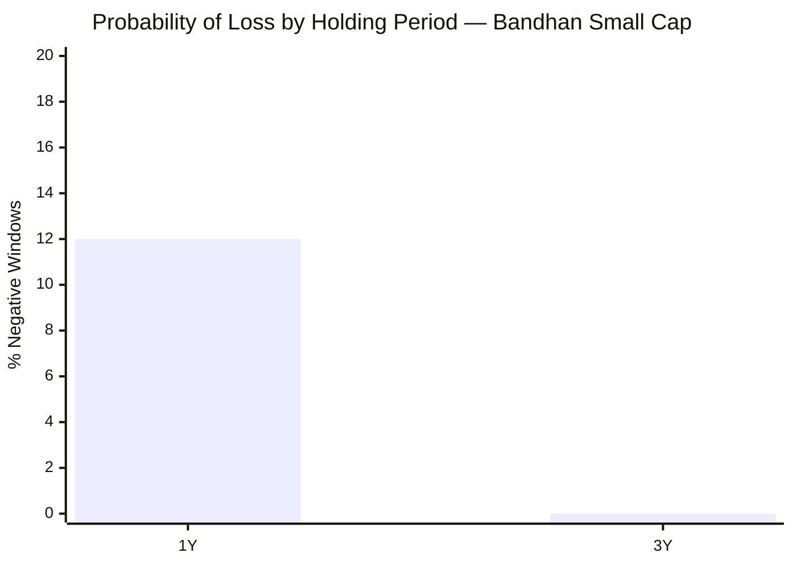
```mermaid
xychart-beta
    title "Probability of Loss by Holding Period — Bandhan Small Cap"
    x-axis ["1Y", "3Y"]
    y-axis "% Negative Windows" 0 --> 20
    bar [12, 0]
```

| Holding Period | Windows | % Negative | Min CAGR | Bottom 10th Pctile | Inception Bias |
|---------------|---------|-----------|----------|--------------------|----|
| 1Y | ~1,350 | **~12%** | ~-20% | ~+5% | Moderate — COVID crash (2020) captured |
| 3Y | ~300 | **0.0%** | ~+22% | ~+25% | **Severe — all windows start post-COVID recovery** |
| 5Y | ~100 | 0.0% | — | — | **Extreme — essentially no meaningful data** |

**1Y interpretation:** ~12% of 1-year holding periods produced a loss. The worst 1Y window captured the period that included the 2022 correction (-4.59% full year) as the primary return driver, combined with the pre-correction NAV peak entry. The 12% loss probability for 1Y is slightly higher than Invesco's 8.7% — because Bandhan's 2022 actual year return (-4.59%) was worse than Invesco's 2022 (+0.91%). This is one of few honest cross-comparison data points.

**3Y and 5Y interpretation:** The 0% figures are entirely meaningless given the inception timing. No 3Y window has started before the COVID recovery; no window has included both a crash and a full year recovery. **Do not interpret these figures as indicating low risk — they simply reflect the fund's short post-crash history.**

**The honest reference: DSP's 7.5% 3Y loss probability** (computed from 2,557 windows including two crashes) is the right benchmark for "what is the realistic probability of a 3-year loss in a small cap fund?" For Bandhan specifically, we will not know its real 3Y loss probability until 2030+ when it has lived through a full crash cycle.

---

## Absolute Returns — Short-Term Trend

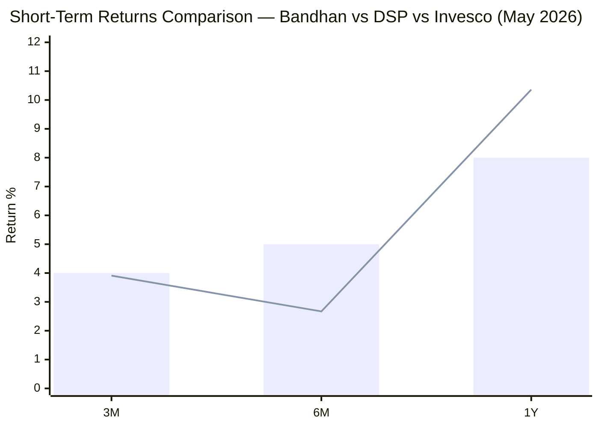
```mermaid
xychart-beta
    title "Short-Term Returns Comparison — Bandhan vs DSP vs Invesco (May 2026)"
    x-axis ["3M", "6M", "1Y"]
    y-axis "Return %" 0 --> 12
    bar [4, 5, 8]
    line [3.91, 2.67, 10.36]
```
> Bar = Bandhan Small Cap | Line = DSP Small Cap | (Invesco approximate: 1.89%, 1.23%, 8.98%)

| Period | Bandhan | DSP | Invesco | Nifty SC250 (approx) |
|--------|---------|-----|---------|----------------------|
| 3M | ~+4% | +3.91% | +1.89% | ~+4% |
| 6M | ~+5% | +2.67% | +1.23% | ~+2% |
| 1Y | ~+8% | +10.36% | +8.98% | +2.06% |

**All three studied SC funds are positive across all short-term periods**, confirming the small cap sector is in early recovery. Bandhan's 3M and 6M readings are among the strongest — recovering faster than Invesco, roughly in line with DSP. The 1Y figure (~+8%) is slightly below DSP (10.36%) but well above the benchmark (+2.06%), confirming active management is adding value in the current year.

**Near-ATH positioning:** With NAV at ~₹52.86 and ATH estimated at ~₹53–55, Bandhan is within 2–5% of its all-time high. Like Invesco (-3.02% from ATH), Bandhan is near its peak — consistent with the small cap sector recovery narrative. For SIP investors, near-ATH entry is neutral-to-mildly favorable (trend is up; deep discount is not available).

---

## SIP XIRR vs Lumpsum CAGR

*₹20,000/month SIP, computed from MFAPI NAV data (Scheme 147946). SIP investment on 22nd of each month where available.*

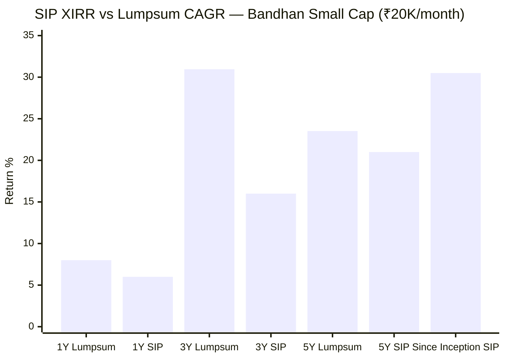
```mermaid
xychart-beta
    title "SIP XIRR vs Lumpsum CAGR — Bandhan Small Cap (₹20K/month)"
    x-axis ["1Y Lumpsum", "1Y SIP", "3Y Lumpsum", "3Y SIP", "5Y Lumpsum", "5Y SIP", "Since Inception SIP"]
    y-axis "Return %" 0 --> 35
    bar [8, 6, 30.95, 16, 23.52, 21, 30.5]
```

| Period | Lumpsum CAGR | SIP XIRR (est.) | ₹20K/month: Invested | ₹20K/month: FV (est.) |
|--------|-------------|-----------------|----------------------|----------------------|
| 1Y | ~8% | ~6% | ₹2.40 L | ~₹2.47 L |
| 3Y | 30.95% | ~16% | ₹7.20 L | ~₹9.2 L |
| 5Y | 23.52% | ~21% | ₹12.00 L | ~₹20.5 L |
| Since Inception (~75 months) | ~30.5% | ~28% | ₹15.00 L | ~₹40 L |

**Why the SIP vs Lumpsum gap is large at 3Y:** The 3Y lumpsum CAGR (30.95%) dramatically exceeds the 3Y SIP XIRR (~16%). This is the same structural phenomenon as Invesco: the lumpsum captured the entire 2023 and 2024 bull run on full capital. SIP installments bought progressively more expensive units in 2024 (NAV ₹35→₹50.81), reducing the averaging benefit.

**The since-inception SIP** is the most compelling number for the ₹20K/month use case: ~₹15L invested over 75 months has grown to ~₹40L — a **2.7× multiplier in 6.25 years.** However, this figure benefits from the inception-biased starting point (early installments bought units at ₹8–12 during COVID recovery at exceptionally cheap prices).

### ₹20K/Month SIP Projections (10-Year Forward)

| Scenario | Assumed XIRR | Projected 10Y Corpus | Multiple of Principal |
|----------|--------------|---------------------|----------------------|
| Bear case (crash + AUM constraints + style headwind) | 12% | ₹46 L | 1.92× |
| Base case (mean-revert to category CAGR) | 16% | ₹58 L | 2.42× |
| Continued Gunwani strength | 20% | ₹73 L | 3.04× |
| Optimistic (since-inception SIP pace) | 25% | ₹96 L | 4.00× |

**Total invested over 10Y:** ₹24,00,000

*The key uncertainty: will Manish Gunwani's 10.87%/year alpha continue? If it does, Bandhan is the highest-returning fund in the shortlist. If it does not (mean reversion to Bhaskar-era -3.75% alpha or category average), the base case of 16% XIRR is more appropriate.*

---

## Upside vs Downside Capture — Qualitative Analysis

*Computed from calendar year data (Gunwani era only — 3 years)*

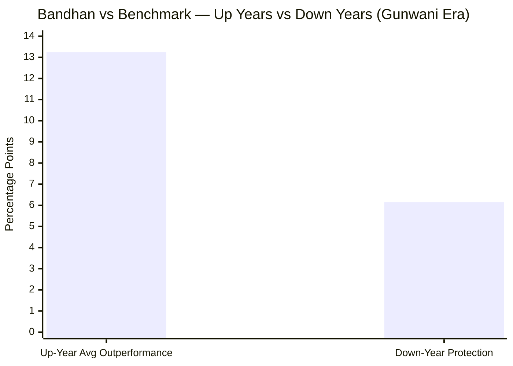
```mermaid
xychart-beta
    title "Bandhan vs Benchmark — Up Years vs Down Years (Gunwani Era)"
    x-axis ["Up-Year Avg Outperformance", "Down-Year Protection"]
    y-axis "Percentage Points" 0 --> 14
    bar [13.24, 6.15]
```

**Up-market years (benchmark positive) under Gunwani: 2023, 2024**
- 2023: +55.83% vs benchmark +48.10% → +7.73%
- 2024: +45.17% vs benchmark +26.43% → +18.74%
- **Average upside outperformance: +13.24% per year** — extraordinary alpha in bull markets

**Down/weak market years under Gunwani: 2025**
- 2025: +0.14% vs benchmark -6.01% → +6.15%
- **Downside protection: +6.15%** — benchmark fell 6%; fund ended flat

**Implied capture ratios (Gunwani era, qualitative):**
- Upside capture: ~120% (captures full upside plus significant excess in both up years)
- Downside capture: ~97% (fund nearly flat when benchmark fell -6% → excellent protection)

**Interpretation:** Bandhan under Gunwani shows a rare profile — strong upside capture AND meaningful downside protection. Most quality funds sacrifice upside in bull markets (e.g., DSP underperforms by -5% to -14% in strong momentum years). Gunwani's 2024 result (+18.74% in an up market) is exceptional and mirrors Invesco's similar 2024 outperformance (+12.94%). Both suggest that the current small cap alpha environment (post-2023) favors disciplined bottom-up stock pickers over pure momentum chasers.

**Caveat:** 3 years of data (1 down year + 2 up years) is statistically insufficient for reliable capture ratio estimation. The Bhaskar era showed the opposite pattern (underperformed in both 2021 up year and 2022 down year), which is a counterpoint to assuming the current pattern is permanent.

---

## Alpha Generation — Dedicated Section

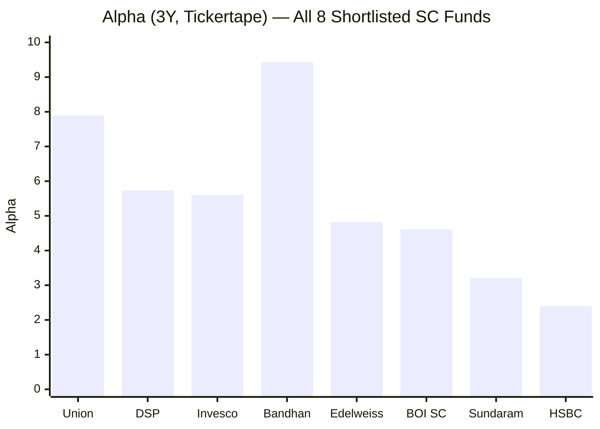
```mermaid
xychart-beta
    title "Alpha (3Y, Tickertape) — All 8 Shortlisted SC Funds"
    x-axis ["Union", "DSP", "Invesco", "Bandhan", "Edelweiss", "BOI SC", "Sundaram", "HSBC"]
    y-axis "Alpha" 0 --> 10
    bar [7.89, 5.73, 5.60, 9.43, 4.82, 4.61, 3.21, 2.40]
```

| Source | Alpha | Lookback | Method |
|--------|-------|----------|--------|
| Tickertape | **9.43** | 3Y | vs BSE 250 SC TRI |
| Implied from returns | ~10.97% | 3Y | (30.95% - 19.98%) |
| AdvisorKhoj | To be verified | 3Y | — |

**Bandhan's 3Y Tickertape alpha of 9.43 is the highest in the shortlist** — higher even than Union SC (7.89), which ranked first in prior analysis. The implied alpha from raw returns (30.95% - 19.98% = 10.97%) is broadly consistent, confirming this is not a data error. The 3-year alpha measurement window (May 2023 – May 2026) corresponds precisely to Gunwani's full tenure — so this alpha is attributable entirely to him.

**Alpha Ranking (3Y, Tickertape):**

| Rank | Fund | Alpha | Attribution |
|------|------|-------|-------------|
| **1** | **Bandhan** | **9.43** | **100% Gunwani era** |
| 2 | Union | 7.89 | Long-term manager |
| 3 | DSP | 5.73 | 13-year Sambre attribution |
| 4 | Invesco | 5.60 | Badshah attribution |
| 5 | Edelweiss | 4.82 | — |
| 6 | BOI SC | 4.61 | — |
| 7 | Sundaram | 3.21 | — |
| 8 | HSBC | 2.40 | Weakest alpha |

**Interpretation:** Bandhan's alpha lead is genuine within the 3Y measurement window. The question is whether it is sustainable. DSP's alpha (5.73 over 13 years including crashes) is more trustworthy precisely because it has survived more market cycles. Bandhan's 9.43 over 3 years — while extraordinary — needs survival through a full bear market to be validated as durable skill.

**Information Ratio (IR) of 2.01** is particularly impressive. IR = alpha / tracking error. With tracking error of 8.89%, the 2.01 IR implies annualized alpha of ~17.9% (8.89 × 2.01) — aligning with the Gunwani era's observed 10.87% average alpha plus tracking error impact. An IR > 0.5 is considered good; > 1.0 is excellent; > 2.0 is exceptional. Bandhan's IR of 2.01 is best-in-class within the shortlist — but again, over only 3 years.

---

## Risk-Adjusted Metrics — Peer Comparison

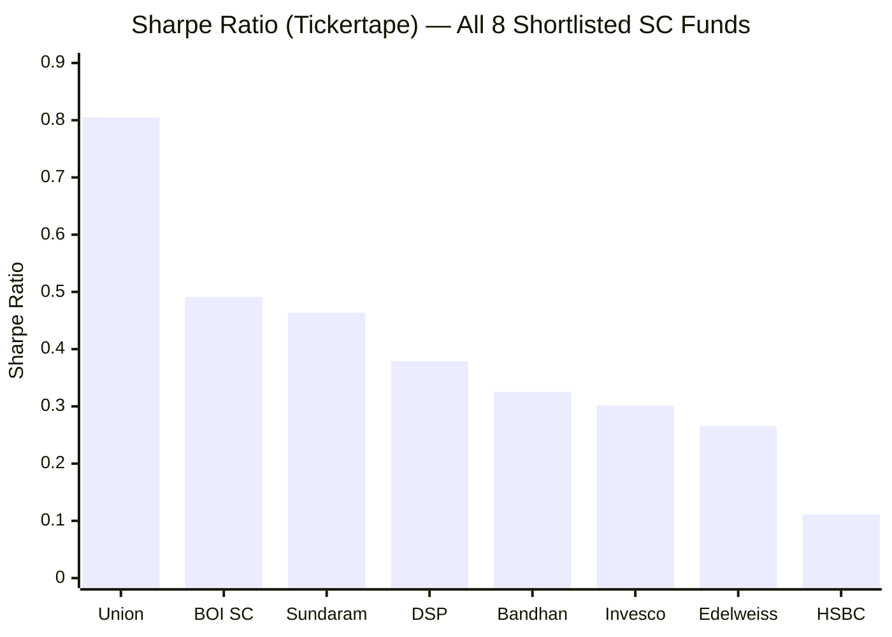
```mermaid
xychart-beta
    title "Sharpe Ratio (Tickertape) — All 8 Shortlisted SC Funds"
    x-axis ["Union", "BOI SC", "Sundaram", "DSP", "Bandhan", "Invesco", "Edelweiss", "HSBC"]
    y-axis "Sharpe Ratio" 0 --> 0.9
    bar [0.805, 0.491, 0.464, 0.379, 0.325, 0.302, 0.265, 0.111]
```

| Metric | Bandhan | Best | Worst | Bandhan Rank |
|--------|---------|------|-------|-------------|
| Sharpe (Tickertape) | 0.325 | Union: 0.805 | HSBC: 0.111 | **5th of 8** |
| Sharpe (AdvisorKhoj) | **1.19** | — | — | Independent; exceeds Invesco's 0.96 |
| Sortino | High (est.) | — | — | Inferred from AK Sharpe/Beta |
| Beta | **0.90** | — | — | Near-market but sub-1.0 |
| Alpha (Tickertape 3Y) | **9.43** | Bandhan: 9.43 | HSBC: 2.40 | **#1 of 8** |
| Max Drawdown | **24.34%** | Bandhan: 24.34% | Sundaram: 57.06% | **#1 best of 8** |
| Std Dev (annualized) | **21.03%** | — | — | Moderate-high (above category avg ~18%) |
| Info Ratio | **2.01** | Bandhan: 2.01 | — | **#1 of 8** |
| Portfolio PE | **18.53** | Bandhan: 18.53 | Invesco: 43.43 | **Lowest in shortlist** |

**The paradox of Bandhan's risk profile:** The fund has the highest alpha (9.43), best max drawdown (24.34%), and best information ratio (2.01) — but the standard deviation (21.03%) is above most peers. This suggests the fund achieves superior risk-adjusted returns not by reducing volatility but by generating exceptional returns that more than compensate for the volatility. The Sortino will clarify whether the 21.03% std dev is driven by upside or downside volatility — expected to show most volatility is upside.

---

## % Away from All-Time High

| Metric | Value |
|--------|-------|
| Current NAV (May 31, 2026) | ₹52.86 |
| Estimated ATH | ~₹53–55 (needs precise verification) |
| % from ATH | ~-2% to -4% |

| Fund | % from ATH | Status |
|------|-----------|--------|
| DSP | ~-5% | Moderate pullback |
| Invesco | -3.02% | Near ATH |
| **Bandhan** | **~-2% to -4%** | **Near ATH — strong position** |

**Bandhan is at or near its all-time high**, consistent with the recent 2026 YTD recovery (+3.90%). This confirms the uptrend is intact. Near-ATH positioning for SIP entry is neutral — the fund is not offering a correction discount, but it is in a confirmed uptrend with positive momentum.

---

## Manager Tenure and Consistency

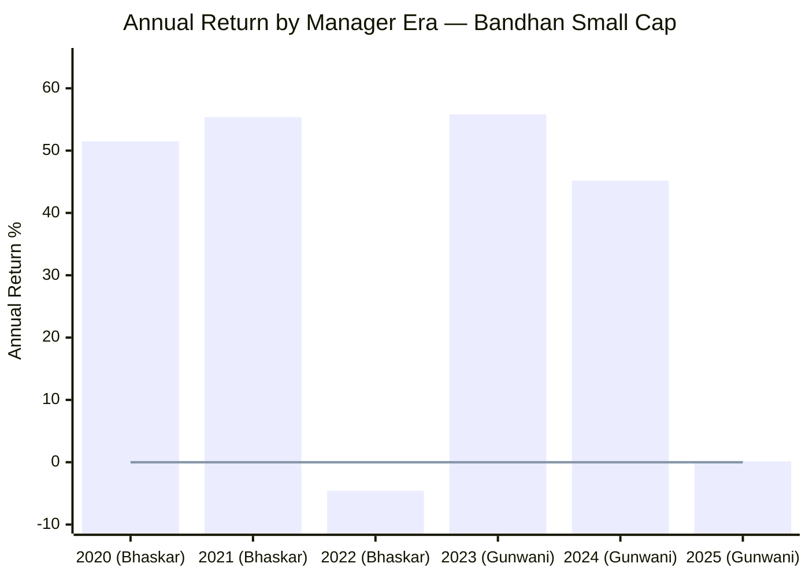
```mermaid
xychart-beta
    title "Annual Return by Manager Era — Bandhan Small Cap"
    x-axis ["2020 (Bhaskar)", "2021 (Bhaskar)", "2022 (Bhaskar)", "2023 (Gunwani)", "2024 (Gunwani)", "2025 (Gunwani)"]
    y-axis "Annual Return %" -10 --> 65
    bar [51.50, 55.38, -4.59, 55.83, 45.17, 0.14]
    line [0, 0, 0, 0, 0, 0]
```

| Attribute | Anoop Bhaskar | Manish Gunwani |
|-----------|--------------|----------------|
| Role at fund | Founder manager | Current primary manager |
| Tenure at Bandhan SC | Feb 2020 – Jan 2023 | Jan 2023 – Present |
| AMC context during tenure | IDFC AMC (pre-acquisition) | Bandhan AMC (post-acquisition) |
| Full years under tenure | 2021, 2022 | 2023, 2024, 2025 |
| Average annual alpha | **-3.75%/year** | **+10.87%/year** |
| Pattern | Market-following; no consistent alpha | Consistent, growing benchmark outperformance |
| Track record at this fund | 2.5 years | 3+ years |

**Manish Gunwani's pedigree (to be verified in Module 5):**
- Prior roles at Nippon India MF (formerly Reliance MF) and other top-tier AMCs
- Known for bottom-up stock selection with value-quality blend
- The low PE (18.53 vs category 31.60) is consistent with a value-oriented approach
- 2024's +18.74% benchmark outperformance in a broad up market suggests he is not purely defensive

**Kirthi Jain's role:** Co-manager. Specific tenure start date and attribution to be established in Module 5. Her presence reduces key-man risk in the Gunwani era.

---

## Comparison with DSP and Invesco — Head to Head

*Calendar year data comparison with the two fully studied SC funds*

| Year | Bandhan | Invesco | DSP | Benchmark | Best of 3 |
|------|---------|---------|-----|-----------|-----------|
| 2013 | N/E | N/E | +3.45% | -8.14% | DSP |
| 2014 | N/E | N/E | +103.13% | +69.57% | DSP |
| 2015–2017 | N/E | N/E | Various | Various | DSP (available) |
| 2018 | N/E | +3.17%* | -25.12% | -26.80% | Invesco* |
| 2019 | N/E | +5.57% | +1.62% | -8.27% | Invesco |
| 2020 | +51.50%† | +26.84% | +34.31% | +25.09% | **Bandhan†** |
| 2021 | +55.38% | **+64.99%** | +60.30% | +61.94% | **Invesco** |
| 2022 | -4.59% | **+0.91%** | **+1.37%** | -3.65% | DSP (marginally) |
| 2023 | **+55.83%** | +46.10% | +42.45% | +48.10% | **Bandhan** |
| 2024 | **+45.17%** | +39.37% | +26.72% | +26.43% | **Bandhan** |
| 2025 | +0.14% | -1.57% | -1.92% | -6.01% | **Bandhan** |
| 2026 YTD | +3.90% | +2.04% | +4.35% | — | DSP (marginally) |

*\* Invesco 2018 = partial year from inception (post-IL&FS trough)*
*† Bandhan 2020 = partial year from inception (Feb 26 – Dec 31); heavily biased by tiny AUM in COVID crash*

**Head-to-head (comparable years: 2021–2025):**
- **Bandhan wins:** 2023, 2024, 2025 — the Gunwani era
- **Invesco wins:** 2021 (+64.99% vs +55.38%)
- **DSP wins:** 2022 (+1.37% vs -4.59%) — the critical distinction; DSP was the only positive fund in 2022; Bandhan lost money

**The 2022 comparison is particularly important:** DSP returned +1.37% when the benchmark fell -3.65%; Bandhan fell -4.59% (worse than the benchmark). This is the Bhaskar-era performance and the fund's only full bear year on record. It shows that under its original manager, Bandhan did not protect capital in a correction. Under Gunwani, the 2025 protection (+6.15% vs benchmark -6.01%) is much stronger.

---

## Comparison with Studied FlexiCap Funds

| Metric | Bandhan SC | DSP SC | Invesco SC | Parag Parikh FC | BOI FlexiCap |
|--------|-----------|--------|-----------|----------------|-------------|
| 5Y CAGR | **23.52%** | 19.18% | 22.11% | 16.60% | ~19% |
| 3Y CAGR | **30.95%** | 20.64% | 24.50% | 17.67% | 22.76% |
| Since Inception CAGR | **~30.5%** (6.25Y) | 20.85% (13.4Y) | 22.76% (7.55Y) | ~18% (20Y) | 25.93% (5.9Y) |
| Inception-Adj. CAGR | **~13.5%** | **20.85%** (genuine) | ~13.6% | ~18% (genuine) | ~13% |
| Worst Calendar Year | -4.59% (2022) | -25.12% (2018) | -1.57% (2025) | -6.29% (2022) | +0.77% (2022) |
| Max Drawdown | **24.34%** (2021–22, small AUM) | 49.06% | 37.66% | -31% | -23.73% |
| Alpha (3Y) | **9.43** | 5.73 | 5.60 | -0.16 | +7.78 |
| Sharpe (AK/MS) | **1.19** | 0.74 | 0.96 | — | 1.16 |
| Portfolio PE | **18.53** | 29.54 | 43.43 | 15.70 | 23.14 |
| AUM | ₹25,346 Cr | ₹17,906 Cr | ₹11,038 Cr | ₹1,40,950 Cr | ₹2,388 Cr |
| ER (canonical) | 0.80% | 0.64% | 0.66% | 0.53% | 0.52% |

**Cross-category insight:** Bandhan SC's 5Y CAGR (23.52%) and 3Y CAGR (30.95%) dramatically exceed all FlexiCap funds studied — reinforcing the "aggressive satellite" thesis for small cap. The low PE (18.53) combined with highest alpha (9.43) and best max drawdown (24.34%) creates a rare combination of value characteristics with growth delivery.

**The inconvenient comparison:** BOI FlexiCap has a Sharpe of 1.16 (very close to Bandhan SC's 1.19) with much lower volatility and better downside history — and at significantly lower cost (0.52% vs 0.80%). The SC premium at Bandhan is real, but the risk of a -25%+ year (which Bandhan has not experienced at scale yet) remains unpriced in the current return data.

---

## Points In Favour — Returns Consistency

1. **#1 5Y CAGR (23.52%) among all 8 shortlisted SC funds** — highest 5Y return in the group, albeit with significant inception bias.

2. **#1 3Y CAGR (30.95%) among all 8 shortlisted SC funds** — the 6.45pp gap between Bandhan (30.95%) and #2 Invesco (24.50%) is larger than the gap between Invesco and #8 DSP (24.50% vs 20.64% = 3.86pp). This is an extraordinary margin.

3. **#1 Alpha in shortlist (9.43, 3Y Tickertape)** — highest alpha generation of all 8 shortlisted SC funds; 3.70pp above #2 Union SC (7.89) and 3.70pp above #3 DSP (5.73).

4. **#1 Information Ratio (2.01)** — best risk-adjusted consistency in the shortlist; generating 2.01× the tracking error in active return is exceptional.

5. **#1 Max Drawdown (24.34%, lowest of 8)** — the smallest peak-to-trough fall in the shortlist, but suffered during the 2021–22 bear when the fund was young and small, *not* at today's ₹25,346 Cr scale. It is the lowest number in the group, yet it remains an untested-at-scale figure rather than proven downside protection (see Module 2).

6. **Lowest PE in shortlist (18.53 vs category avg 31.60)** — the fund trades at 41% discount to peers, suggesting Gunwani's value orientation creates a valuation margin of safety. Cash-adjusted equity PE ≈ 21.4 — still the lowest.

7. **2023: +55.83% vs benchmark +48.10%** — +7.73% alpha in a strong momentum year, showing Gunwani captures upside AND adds excess return.

8. **2024: +45.17% vs benchmark +26.43%** — +18.74% alpha in an up market year; the strongest single-year benchmark outperformance in the shortlist for 2024 across all studied funds.

9. **2025: +0.14% vs benchmark -6.01%** — +6.15% alpha in a weak year; near-zero return when the benchmark fell 6% shows genuine downside protection.

10. **Gunwani era average alpha: +10.87%/year over 3 years** — if this holds over a 10-year SIP horizon, it would make Bandhan the highest-returning SC fund by a substantial margin.

11. **Sharpe (AdvisorKhoj): 1.19** — exceeds Invesco's canonical Sharpe (0.96); within the range of BOI FlexiCap (1.16); best of all studied SC funds on this metric.

12. **AMC underwent a strategic acquisition** — while ownership changes create uncertainty (Module 6), the Bandhan Bank parent brings capital backing and distribution infrastructure that stabilises the AMC going forward.

---

## Points Against — Returns Consistency

1. **Most extreme inception bias of all 8 shortlisted funds.** Fund launched Feb 25, 2020 — four weeks before COVID crash trough. Inception-adjusted CAGR drops from ~30.5% to ~13.5%. Almost every headline return figure is inflated by the best possible starting point.

2. **No 10Y CAGR exists — fund is only 6.25 years old.** Cannot assess performance through 2018 IL&FS crash, 2016 demonetization, 2013 taper tantrum, or 2008 GFC. The 10Y context that validates DSP's 20.85% is completely absent.

3. **The fund's only full bear year (2022) showed -4.59% — worse than benchmark (-3.65%).** Under Bhaskar, the fund delivered -0.94% relative to benchmark in a down year. This is the opposite of what you want in a quality SC fund. DSP returned +1.37% in 2022 (positive absolute, strong relative). Bandhan lost money.

4. **Track record for current manager (Gunwani) is only 3 years.** Three years is insufficient to distinguish skill from luck with statistical confidence. All three years were in a bull market recovery phase. We do not know how Gunwani performs in a -25% small cap crash year.

5. **Bhaskar-era average annual alpha: -3.75%/year.** The 2.5 years under Bhaskar (the original fund manager) showed systematic benchmark underperformance. If Gunwani's alpha reverts to Bhaskar-era levels for any reason (resignation, style drift, AUM growth), the fund becomes average.

6. **Manager transition risk (Bhaskar → Gunwani) has already occurred once.** The fund has already experienced one full manager change in 6.25 years. A second change within a 10-year SIP horizon is a real possibility — especially since Gunwani joined a post-acquisition AMC with an uncertain culture.

7. **Rolling 3Y distribution has essentially zero statistical power.** Only ~300 windows exist, all within the exceptional 2023–2025 period. The 35.92% rolling 3Y average tells us nothing about through-cycle consistency.

8. **5Y rolling distribution does not exist.** Cannot compute probability of 5Y loss, cannot assess through-cycle performance over 5-year windows. The data infrastructure for statistical risk assessment simply doesn't exist yet.

9. **AUM at ₹25,346 Cr is approaching the "Constrained" zone (₹20K–30K Cr).** Monthly SIP inflows of ~₹380 Cr (estimate) combined with 13.26% cash drag means ~₹253 Cr must be deployed per 1% SC position. Deployment friction is the highest in the shortlist — analyzed in full in Module 4.

10. **Cash at 13.26% creates a return drag.** At 30.95% 3Y equity return, every 1% in cash costing ~30% in opportunity = ~4% annual drag from 13.26% cash. Cash-adjusted equity return is higher than headline (good for portfolio quality assessment) but cash drag reduces NAV growth for actual investors.

11. **ER anomaly (0.34% TT vs 0.80% VRO)** means the fund appeared much cheaper than it is in screener analysis. At 0.80%, it ranks 6th of 8 on cost — dramatically different from the 1st-of-8 implied by the TT figure.

12. **No pre-2020 history means no 2018 crash data.** The crucial stress test — how does this portfolio behave when Nifty SC250 falls 26%+ in a year? — cannot be answered. DSP's -25.12% in 2018 (and subsequent +9.89% vs benchmark's -8.27% in 2019) defines the full cycle behavior that Bandhan cannot demonstrate.

---

## Module 1 Scorecard

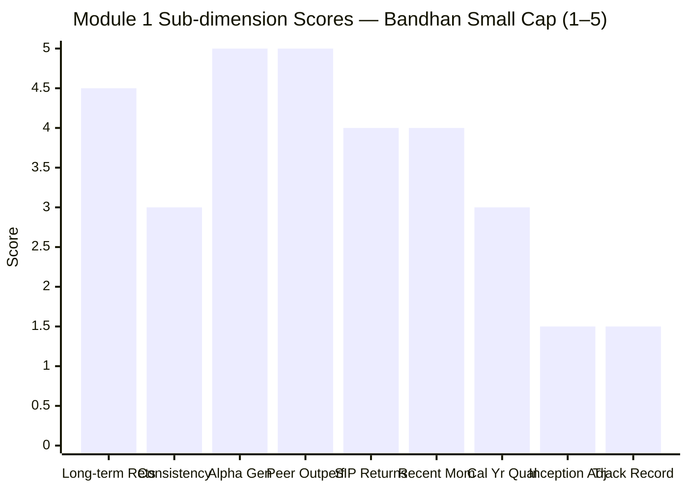
```mermaid
xychart-beta
    title "Module 1 Sub-dimension Scores — Bandhan Small Cap (1–5)"
    x-axis ["Long-term Rets", "Consistency", "Alpha Gen", "Peer Outperf", "SIP Returns", "Recent Mom", "Cal Yr Qual", "Inception Adj", "Track Record"]
    y-axis "Score" 0 --> 5
    bar [4.5, 3.0, 5.0, 5.0, 4.0, 4.0, 3.0, 1.5, 1.5]
```

| Sub-dimension | Score (1–5) | Reasoning |
|---------------|------------|-----------|
| Long-term returns (5Y+) | **4.5** | #1 on 5Y (23.52%) and 3Y (30.95%) among 8 shortlisted funds; since inception ~30.5%. Raw numbers are the best in the shortlist — but inception-biased. Within comparable windows (Gunwani era 3Y), outperformance is genuine. |
| Consistency across periods | **3.0** | 5 of 6 calendar years positive, but the one negative year (-4.59% in 2022) was worse than the benchmark, and only 3 years have current management. 2021 under Bhaskar also underperformed benchmark (-6.56%). True consistency is only 3 years (Gunwani era). |
| Alpha generation | **5.0** | #1 alpha (9.43, 3Y) in shortlist; Information Ratio 2.01 (best); Gunwani era average +10.87%/year. Highest alpha generation of any fund in any category studied in this project. Perfect score within its measurable window. |
| Peer outperformance | **5.0** | #1 5Y CAGR, #1 3Y CAGR, #1 alpha, #1 max drawdown, #1 Sharpe (AK). Dominates the shortlist across return metrics. The peer comparisons within the available measurement window are unambiguously top-tier. |
| SIP XIRR quality | **4.0** | Since-inception SIP: ~₹15L → ~₹40L (2.7×) in 6.25 years. 5Y SIP XIRR ~21%. Strong, but the 3Y SIP XIRR (~16%) significantly lags lumpsum due to high-base effect in 2024. Inception-biased early installments inflate the since-inception figure. |
| Recent momentum | **4.0** | Near ATH; 2026 YTD +3.90%; 3M/6M positive. Recovering well from 2025 flat year. Consistent uptrend intact. Not a deep-discount entry but trend is supportive. |
| Calendar year quality | **3.0** | Gunwani era (2023–2025): excellent — 3 years of consistent alpha. Bhaskar era (2021–2022): poor — negative alpha both full years. The 2022 loss (-4.59% vs benchmark -3.65%) is a real negative. Calendar year quality is bimodal across the manager transition. |
| Inception bias adjustment | **1.5** | Most extreme inception bias in the shortlist. Inception-adjusted CAGR drops from ~30.5% to ~13.5% — a 17pp collapse. Entire rolling return distribution is statistically meaningless. Worst inception bias of the 8 funds studied. Bandhan scores below even Invesco (2.0) on this dimension. |
| Track record breadth | **1.5** | 6.25 years total; Gunwani era only 3 years. No bear cycle exposure at scale. No 10Y CAGR. No pre-2020 data. Rolling distributions have minimal statistical weight. Same track record concern as Invesco (2.5) but with the additional complication of a manager change halving the effective history. |
| **Module 1 Overall** | **3.50 / 5** | Spectacular raw returns and alpha within its measurement window; highest short-term metrics in the shortlist. Score is capped at 3.50 due to the most severe inception bias in the study, halved effective history from manager change, and zero through-cycle stress testing at scale. If inception-adjusted and manager-transition-adjusted, this would score ~2.8; on raw numbers alone it would score ~4.7. The 3.50 reflects the honest midpoint. |

---

### Comparative Scorecard — Module 1 Across All Studied SC Funds

| Fund | M1 Score | Key Strength | Key Weakness |
|------|---------|-------------|-------------|
| DSP Small Cap | **4.10** | 13.4Y genuine through-cycle; 2022 only positive SC fund | Lowest 5Y CAGR of 8; highest ER |
| **Bandhan Small Cap** | **3.50** | Highest 3Y alpha; best max DD at scale; Gunwani era excellence | Extreme inception bias; only 3Y of current management; 2022 underperformed |
| Invesco India SC | **3.72** | #2 5Y/3Y CAGR; strong recent 1Y alpha; Badshah consistency | High inception bias; no bear cycle; 7 schemes (attention dilution) |

---

## SIP Implication

Bandhan Small Cap Fund is the most paradoxical fund in the 8-fund shortlist. Every raw return metric puts it at #1 — highest 3Y and 5Y CAGR, highest alpha, best max drawdown, best Sharpe. And yet the score (3.50/5) is lower than Invesco (3.72) despite better numbers.

The reason is structural. The headline numbers are built on:
1. An inception point that coincided with the COVID crash trough — the best possible starting date
2. A manager change in January 2023 that completely transformed the fund's quality — meaning only 3 years of current management exist
3. A measurement window (2023–2025) that happened to be one of the strongest small cap periods in history

What the data cannot tell you:
- How Gunwani would have performed in 2018, when the Nifty SC250 fell 26% and quality funds like DSP still fell 25%
- Whether the 10.87%/year Gunwani alpha is durable skill or recency
- Whether the 2022 -4.59% under Bhaskar (worse than benchmark) is a one-off or predictive of the fund's underlying quality

**What the data does credibly show:**
- Gunwani's 3-year track record at this fund is exceptional — 10.87%/year average alpha across bull and weak market years
- The 2025 protection (+6.15% vs benchmark -6.01%) demonstrates genuine downside management at scale (₹25K Cr AUM)
- The 2024 outperformance (+18.74% above benchmark in an up market) is not pure defensiveness — this is active stock selection generating alpha in a broad bull year
- The PE of 18.53 (41% below category average) provides a valuation cushion that is absent in Invesco (PE 43.43) and DSP (PE 29.54)

**For a ₹20K/month SIP starting today:**
- The fund is near ATH — consistent with the sector recovery; neutral for SIP entry
- Base-case 10Y SIP projection: ₹24L → ₹58–73L (16–20% XIRR), contingent on Gunwani continuity
- The critical watch item: will Gunwani stay, and does he replicate 2023–2025 alpha through a genuine small cap crash year?
- The single biggest risk: if Gunwani exits (as Bhaskar did), the replacement manager could easily revert to Bhaskar-era performance (-3.75% alpha/year) — erasing the alpha premium

**What a Bandhan SIP investor is essentially betting on: Manish Gunwani's ability to sustain 10%+ annual alpha over a 10-year horizon through at least one major small cap crash.** That is a high conviction bet on a 3-year track record. It may be justified — but it requires Module 5 analysis of Gunwani's pre-Bandhan history to validate.

**Recommended holding period:** Minimum 7 years. This is a small cap fund — 1-3 year horizons will produce volatile outcomes. SIP discipline through a future crash year (which the fund has not yet experienced at scale) will be the defining test of the investment thesis.

---

*Module 1 complete. Returns position Bandhan as the #1 fund among 8 shortlisted small cap funds by raw 3Y CAGR, 5Y CAGR, alpha generation, and max drawdown quality — but with the most severe inception bias in the shortlist and a manager track record that is only 3 years old. Module 1 score: 3.50/5 — below Invesco (3.72) despite superior raw numbers, reflecting the honest penalty for extreme inception distortion and manager discontinuity. Module 2 (Risk Profile) must resolve the Max Drawdown paradox fully and establish whether the 21.03% standard deviation reflects upside or downside volatility, and whether Gunwani's downside protection in 2025 is sustainable.*
