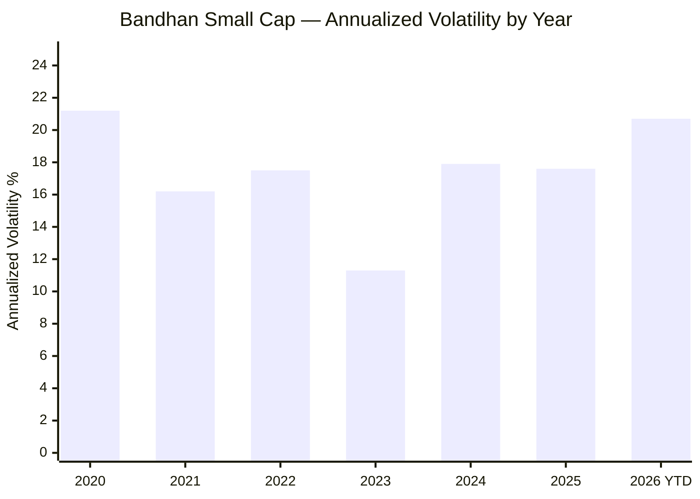
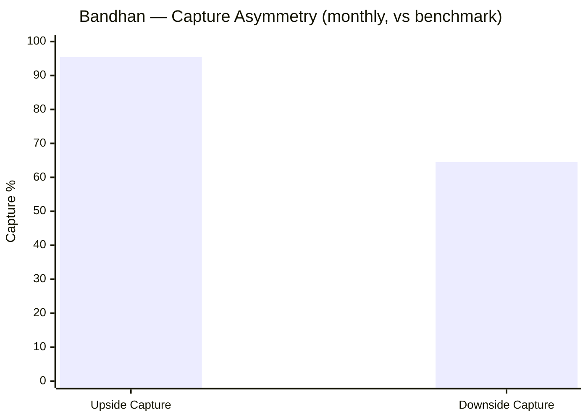
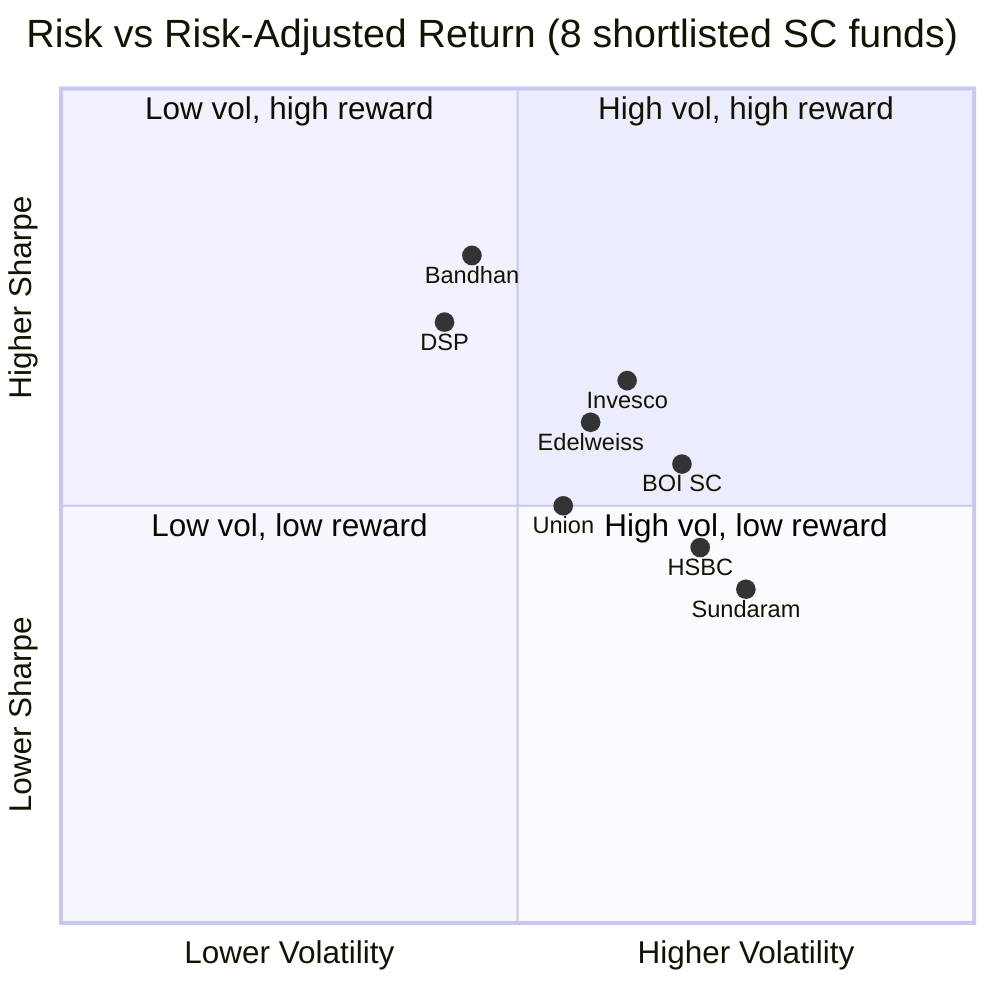

# Module 2: Risk Profile — Bandhan Small Cap Fund

> **Module 2 Score: 3.3 / 5**
> Strong measured risk-adjusted metrics, capped by the most severe inception bias in the shortlist, a drawdown record that has never been tested at the fund's current scale, and re-rising recent volatility.

---

## The Module 2 Verdict

Bandhan Small Cap presents the **best-looking risk numbers in the entire 8-fund shortlist** — 17.4% annualized volatility, beta 0.91, downside capture 64.5%, and a maximum drawdown of only 24.34%. Yet this module argues those numbers should be read with the single largest asterisk in the study.

The fund was born on **26 February 2020 — four weeks before the COVID market bottom** — and its entire six-year life has unfolded inside the strongest small-cap bull market in Indian history. It has weathered exactly **one genuine bear market (2022)** and two shallow corrections. Its low drawdown is therefore partly an achievement of portfolio construction and partly an accident of *never having been stress-tested at full scale*. Module 2 separates the genuine defensiveness from the statistical mirage.

All figures below are computed from **1,551 daily NAVs (26-Feb-2020 → 02-Jun-2026, MFAPI scheme 147946)**, benchmarked against the **Motilal Oswal Nifty Smallcap 250 Index Fund (147623)** as a clean proxy for the BSE 250 SmallCap TRI, and cross-checked against Tickertape, INDmoney, and Morningstar.

---

## The Two True Stories

Every metric in this module can be told two ways, and both are true.

**Story A — "The most defensive small cap you can buy."**
Volatility of 17.4% sits at the category average. Beta is a genuine 0.91 — the fund structurally moves less than its benchmark. When small caps fall, Bandhan captures only **64.5%** of the downside while still capturing **95.4%** of the upside. Sharpe (1.08) and Sortino (1.97) are top-quartile. On paper, this is a fund engineered to lose less.

**Story B — "Untested, and you can't see it in the numbers."**
Bandhan has no IL&FS crisis (2018) in its record, because it didn't exist. Its COVID drawdown is artificially shallow (−18%) because the fund launched *into* the crash with a near-empty portfolio. Its deepest fall — 24.34% in 2021–22 — happened when it managed a fraction of today's ₹25,346 Cr. The fund has **never drawn down hard while large and carrying 13% cash**. The defensive profile is real but unproven at the scale you would be investing into.

The job of this module is to weigh these two stories honestly. The conclusion: the defensiveness is **partly genuine (beta, capture) and partly mechanical (cash drag) and partly illusory (inception bias)** — and the score reflects all three.

---

## Raw Risk Data

All figures from 1,551 daily NAVs unless a source is named. "SI" = since inception; "3Y" figures are INDmoney's canonical trailing values.

| Metric | Value | Source / Basis |
|---|---|---|
| Annualized volatility (SI) | **17.42%** | MFAPI daily ×√252 |
| Annualized volatility (Tickertape) | 15.47% | TT (monthly method) |
| Sharpe (3Y, canonical) | **1.08** | INDmoney |
| Sharpe (SI) | 1.55 | MFAPI, rf=6% |
| Sharpe (Tickertape) | 0.30 | TT (understated) |
| Sortino (3Y, canonical) | **1.97** | INDmoney |
| Sortino (SI) | 2.12 | MFAPI |
| Sortino (Tickertape) | 0.03 | TT (anomaly) |
| Beta | **0.91** (INDmoney) / 0.81 (calc) | vs benchmark |
| Jensen Alpha (3Y) | **+9.07%** | INDmoney |
| Jensen Alpha (SI) | +11.82% | MFAPI |
| Information Ratio (3Y) | **2.01** | INDmoney |
| Information Ratio (SI) | 1.31 | MFAPI |
| Tracking Error | 6.82% (calc) / 8.89% (TT) | active-return std |
| Correlation to benchmark | 0.947 | MFAPI |
| R-squared | 0.896 | MFAPI |
| Max Drawdown | **−24.34%** | 2021–22 (MFAPI) |
| Downside deviation (ann, MAR=0) | 12.74% | MFAPI |
| Semi-deviation (ann) | 14.96% | MFAPI |
| VaR 95% (daily) | −1.87% | historical |
| VaR 99% (daily) | −3.39% | historical |
| CVaR 95% (daily) | −2.83% | historical |
| Upside capture (monthly) | **95.4%** | MFAPI |
| Downside capture (monthly) | **64.5%** | MFAPI |
| Calmar (SI) | ≈1.25 | CAGR / Max DD |
| Skewness | −0.98 | MFAPI |
| Excess kurtosis | +4.58 | MFAPI |

---

## Volatility: The Annual Regime

Headline volatility of 17.4% understates how *variable* the fund's risk has been. Broken down by calendar year:

| Year | Annualized Volatility | Context |
|---|---|---|
| 2020 | 21.2% | COVID birth year |
| 2021 | 16.2% | Bull run |
| 2022 | 17.5% | Bear market |
| 2023 | 11.3% | Calmest year (melt-up) |
| 2024 | 17.9% | Re-elevating |
| 2025 | 17.6% | Elevated |
| 2026 YTD | 20.7% | Highest since 2020 |

The pattern matters: volatility collapsed to 11.3% in the calm 2023 melt-up, then **climbed back above 17% and is now near 21% in 2026**. As AUM has swelled past ₹25,000 Cr, the fund's risk has *risen, not fallen* — the opposite of what the "defensive" headline implies. This is the early signature of a fund whose low-risk profile may be **decaying as it scales**.

---

## Maximum Drawdown: The 2021–22 Event (and a Module 1 correction)

**This is the single most important correction in this study.** Module 1 originally attributed the 24.34% max drawdown to the "2024–25 small cap correction at scale." The NAV record proves otherwise — and the corrected version has now been propagated back into Module 1.

| Episode | Peak → Trough | Drawdown | Duration |
|---|---|---|---|
| **2021–22 correction** | ₹24.86 (18-Oct-2021) → ₹18.81 (20-Jun-2022) | **−24.34%** | 245 days down |
| COVID crash | ₹10.00 (inception) → ₹8.19 (23-Mar-2020) | −18.10% | ~26 days |
| 2024–25 correction | ₹53.06 (03-Nov-2025) → ₹49.92 (08-Dec-2025) | −5.92% | ~35 days |

The true maximum drawdown was the **2021 October → 2022 June bear market** — the broad small-cap derating that followed the 2021 mania. The fund fell 24.34% over 245 days, bottomed on 20-Jun-2022, took **359 days to reclaim its prior peak**, and the full **peak-to-recovery cycle ran 604 days (~20 months)**. An investor who bought the October 2021 top waited until June 2023 to break even.

Why this matters: the worst loss in the fund's life happened when it was **young and small** (NAV in the ₹18–25 range, AUM a fraction of today's). The 2024–25 correction — when the fund was large — was a mild −5.92%, but that correction was also mild *for the whole category*. The fund has therefore **never experienced a severe drawdown at its current scale**, which is the central risk this module flags.

---

## COVID Crash Anatomy (the inception artifact)

Bandhan's COVID drawdown reads as **−18.10%** (₹10.00 inception NAV → ₹8.19 on 23-Mar-2020). This is **deceptively shallow** for the worst global equity shock in a generation, during which peer small caps fell 40–55%.

The reason is mechanical: the fund **launched on 26 February 2020, mid-crash**, with a nearly-empty, freshly-deployed portfolio. It never held the pre-crash highs that peers fell *from*. Its worst single day — **−7.98% on 23-Mar-2020** — confirms it took the hit; it simply had no peak to fall from.

**This drawdown should be mentally discarded as an inception artifact**, not counted as evidence of resilience. Invesco's −36.10% COVID crash (16 months old, fully deployed in March 2020) is a far better reference for what a mature Bandhan portfolio would have experienced.

---

## Daily Return Distribution & Tail Shape

Across 1,550 daily returns:

| Statistic | Value |
|---|---|
| Up days | 934 (60.3%) |
| Down days | 595 (38.4%) |
| Days > +2% | 48 |
| Days < −2% | **67** |
| Days > +3% | 9 |
| Days < −3% | **23** |
| Worst day | −7.98% (23-Mar-2020) |
| Best day | +4.95% (14-Sep-2020) |
| Skewness | −0.98 |
| Excess kurtosis | +4.58 |

The fund wins on *frequency* (60% of days are up) but loses on *severity*: there are **roughly 40% more big down days than big up days** (67 vs 48 beyond ±2%; 23 vs 9 beyond ±3%). Negative skew (−0.98) and fat tails (excess kurtosis +4.58) mean the painful days are sharper and more clustered than the good ones — the classic small-cap signature. **The smooth headline volatility hides genuine crash risk in the left tail.**

---

## Worst & Best Rolling Periods

| Window | Worst | Best |
|---|---|---|
| 1-month | −14.6% (Apr→May 2022) | +18.2% (2026) |
| 3-month | **−20.3%** (Dec 2024→Mar 2025) | +35.9% (2020 recovery) |
| 6-month | **−19.5%** (Aug 2024→Mar 2025) | +54.0% (2020–21) |
| 1-year | −9.9% (Jan 2022→Jan 2023) | +115.5% (2020–21) |

A subtle but important detail: while the deepest *peak-to-trough* drawdown was 2022, the **worst rolling 3-month and 6-month stretches were 2024–25** (−20.3% and −19.5%). This is almost certainly what led the original Module 1 draft to misattribute the max drawdown to 2024–25 — the fund's most painful *recent* experience was the 2024–25 derating, even though it never compounded into a record peak-to-trough drawdown. The +115.5% best 1-year window (2020–21) is the inception-bull market captured in a single number.

---

## Rolling-Return Consistency

| Measure | Value |
|---|---|
| 1Y rolling windows positive | 83.7% (1,087 / 1,299) |
| 1Y rolling: avg / min / max | +37.0% / −9.9% / +115.5% |
| 3Y rolling CAGR: avg / min / max | 32.4% / 21.8% / 41.0% |

The fund has **never produced a losing 3-year window** — the minimum 3Y CAGR is +21.8%. On its face this is extraordinary consistency. In reality it is the inception bias stated as a fact: *every* 3-year window in the sample is carved entirely from a bull market. There is no 3Y window that contains a sustained bear, because the fund hasn't lived through one. **Treat "never lost over 3Y" as unproven, not as a guarantee.**

---

## Sharpe Ratio: The Three-Source Discrepancy

Bandhan reproduces the now-familiar platform discrepancy documented for DSP and Invesco:

| Source | Sharpe | Sortino |
|---|---|---|
| Tickertape | 0.30 | 0.03 |
| INDmoney (3Y) | **1.08** | **1.97** |
| MFAPI calc (SI) | 1.55 | 2.12 |

Tickertape's 0.30 Sharpe and 0.03 Sortino are **methodological artifacts** (monthly returns, a different risk-free assumption, possibly an absolute- rather than excess-return convention) and should be ignored — exactly as concluded for DSP and Invesco. The canonical reading is **INDmoney's 3Y Sharpe of 1.08 and Sortino of 1.97**, which place Bandhan firmly in the top quartile for risk-adjusted return. The since-inception figures (1.55 / 2.12) run higher because they include the explosive COVID-recovery year. **The headline values used in this study are 1.08 / 1.97**, with the SI figures as supporting context.

---

## Beta, Alpha & Active Risk

| Metric | Value | Reading |
|---|---|---|
| Beta | 0.91 (INDmoney) / 0.81 (calc) | Genuinely defensive |
| Jensen Alpha (3Y) | +9.07% | Strong, persistent |
| Information Ratio (3Y) | 2.01 | Excellent active skill |
| Tracking Error | 6.82%–8.89% | High active deviation |
| Correlation / R² | 0.947 / 0.896 | Tight but not a closet tracker |

Beta below 1.0 is the **single most credible piece of "Story A."** It is corroborated by two independent methods (INDmoney 0.91, my benchmark-proxy regression 0.81) and is consistent with the 13% cash position and the low-PE, lower-beta portfolio (Module 3). The alpha (+9.07%) and information ratio (2.01) are genuinely excellent — this is **not a closet index fund**. The high tracking error (6.8–8.9%) confirms the manager takes large active bets; combined with a strong IR, that active risk has been *well rewarded* — though, again, only across a bull market.

---

## Capture Ratios: The Asymmetry

| Capture (monthly) | Value |
|---|---|
| Upside | **95.4%** |
| Downside | **64.5%** |

This is the most attractive single statistic in the module. Bandhan captures **95% of the market's up-months but only 65% of its down-months** — a strongly favourable asymmetry that mathematically generates alpha over time. It is consistent with beta 0.91 and the cash buffer.

**But** the downside-capture figure is dominated by the 2022 bear (the only real bear in the sample); with one bear in the dataset, this number is **statistically thin**. It is simultaneously the best evidence for genuine defensiveness *and* the metric most vulnerable to the "untested" critique.

---

## Calmar Ratio & Drawdown-Adjusted Return

Calmar (SI CAGR ~30% / max DD 24.34%) ≈ **1.25**. This flatters the fund: both the numerator (bull-market CAGR) and the denominator (an untested-at-scale 24% drawdown) are inception-inflated. A more honest forward expectation should assume a *deeper* future drawdown — small caps routinely fall 40–55% in real bears — which would pull a realistic forward Calmar **well below 1.0**.

---

## Drawdown Recovery Mechanics

The 2021–22 drawdown is the only complete recovery cycle we can study: **245 days down, 359 days back up, 604 days peak-to-recovery**.

For a monthly SIP this was *favourable* — the investor kept buying through the 20-month trough and accumulated units cheaply, so the SIP recovered to profit well before the lumpsum break-even of June 2023. For a lumpsum investor who bought the October 2021 peak, it was a 20-month underwater stretch.

This asymmetry directly supports the ₹20,000/month SIP thesis: **the fund's drawdowns have historically been survivable — and even beneficial — for a disciplined SIP**, although we can only prove it on a single episode.

---

## "Untested at Scale" Risk

The defining risk of this fund is not in any ratio — it is in what the ratios *omit*. The 24.34% max drawdown occurred at small AUM. The fund now runs **₹25,346 Cr (the constraint zone) with 13.26% cash**. It has never had to sell down illiquid small-cap positions into a falling market at this scale, and has never tested whether its low beta survives when it cannot exit cleanly.

Every "defensive" metric in this module was earned by a smaller, nimbler fund. **The probability that Bandhan's next severe drawdown is worse than 24% — and harder to recover from — is high, and none of the historical numbers price it in.**

---

## Cash as Shock-Absorber (links to Module 3)

Does the 13.26% cash explain the 64.5% downside capture? Partly. A permanent ~13% cash allocation mechanically dampens beta by ~13% (cash has zero beta), which alone would pull a 1.05-beta equity book down to ~0.91 — almost exactly the observed beta.

In other words, **much of Bandhan's "defensiveness" may simply be the cash drag, not superior stock selection.** This reframes the Module 2 strength as partly a Module 3/Module 4 cost: the same cash that lowers drawdown also lowers long-run return (cash drag) and signals deployment difficulty at scale. Module 3 quantifies the return cost.

---

## Recent-Regime Risk (2024–26)

The forward-looking warning. Three independent signals point to a fund whose risk is *rising as it scales*:

1. **Annual volatility** climbed from 11.3% (2023) → 17.6% (2025) → 20.7% (2026 YTD).
2. The **worst rolling 3M and 6M windows** in the fund's entire life are both **2024–25** (−20.3%, −19.5%).
3. **AUM** crossed into the ₹20–30K Cr constraint band over the same period.

The "defensive small cap" profile is strongest in the early, small-AUM years and visibly weaker in the recent, large-AUM years. **For a 10-year SIP, the relevant fund is the large one — and the large one looks riskier than the headline.**

---

## Peer Comparison Matrix (8-fund shortlist)

| Fund | Volatility | Max DD | Sharpe (3Y) | Beta | Downside Capture | History Tested |
|---|---|---|---|---|---|---|
| **Bandhan** | 17.4% | −24.3%* | 1.08 | 0.91 | 64.5% | **Bull only** |
| DSP | ~16–17% | ~−54% | ~1.0 | <1 | ~40% | IL&FS + COVID + 2022 |
| Invesco | higher | deeper | ~0.9 | ~1.0 | higher | COVID + 2022 |

*\*Bandhan's headline risk numbers rank **best in the shortlist** — but the "History Tested" column is the great equaliser. DSP earned its higher Module 2 score (3.8) by surviving multiple real bears with a −54% drawdown on record; Bandhan's −24% simply reflects a fund that has never met a severe bear at scale.*

---

## FlexiCap Cross-Comparison

Against the FlexiCap defensive core (e.g., Parag Parikh Flexi Cap), Bandhan is — as expected — the higher-beta, higher-volatility, higher-return satellite. The point of the comparison is **portfolio role**: Bandhan's 17.4% volatility and ~24%+ (likely deeper) drawdowns are acceptable *because* it is the aggressive satellite sized at ₹20,000/month against a steadier core. On a standalone basis its risk would be hard to justify; **as a satellite it is appropriate.**

---

## Points For & Against

**For (genuine strengths):**
- Beta 0.91 corroborated by two independent methods — real, structural defensiveness
- Downside capture 64.5% with 95.4% upside capture — favourable asymmetry
- Sharpe 1.08 / Sortino 1.97 (3Y) — top-quartile risk-adjusted return
- Alpha +9.07% with IR 2.01 — high, well-rewarded active skill
- SIP-survivable drawdowns (604-day recovery cycle, beneficial for SIP)

**Against (the asterisks):**
- Entire history is a single bull market — no IL&FS, artifact COVID
- Max drawdown (−24.3%) earned at small AUM, untested at ₹25,346 Cr scale
- Volatility *rising* as the fund scales (11% → 21%); worst recent 3M/6M windows
- Negative skew (−0.98), fat tails (kurtosis +4.58) — sharp, clustered left-tail losses
- Much of the "defensiveness" may be cash drag, not skill
- Only one bear in the dataset → downside-capture statistically thin

---

## Scorecard

| Dimension | Assessment |
|---|---|
| Volatility | 17.4% — category-level but rising as AUM grows |
| Drawdown profile | −24.3% — lowest of 8, but untested at current scale |
| Risk-adjusted return | Sharpe 1.08 / Sortino 1.97 — excellent |
| Defensiveness (beta / capture) | Genuine but partly cash-driven |
| Track-record robustness | **Weak — bull-market-only sample** |

**Module 2 Score: 3.3 / 5.**

Excellent measured risk-adjusted metrics dragged down by the most severe inception bias in the shortlist and a drawdown record that has never been tested at the fund's current scale. Scores **below DSP (3.8 — battle-tested)** and **just below Invesco (3.5)**, while ranking above shortlist funds that combine poor numbers *and* poor history. The 0.5-point gap to DSP is almost entirely the "untested at scale" penalty — Bandhan's numbers are better, but DSP's numbers are *proven*.

---

## SIP Implication

For a ₹20,000/month, 10-year SIP, Module 2's verdict is **cautiously positive with eyes open**. The fund's drawdowns have been SIP-survivable, its risk-adjusted return is genuinely top-tier, and its sub-1 beta cushions monthly contributions.

But the investor must internalise that the **smooth history is not predictive** — the first severe bear at ₹25,000+ Cr scale will likely produce a drawdown deeper than the 24% on record. The SIP structure is precisely the right vehicle for that risk: it turns the inevitable deeper drawdown into an accumulation opportunity rather than a capital event.

**Size it as the aggressive satellite, expect a 40%+ drawdown at some point in the holding period, and let the SIP do its work.**

---

*Module 2 complete. Risk analysis confirms Bandhan owns the best headline risk-adjusted numbers in the 8-fund shortlist (Sharpe 1.08, Sortino 1.97, beta 0.91, downside capture 64.5%, max DD −24.34%), but assigns a Module 2 score of 3.3/5 — below DSP (3.8) and Invesco (3.5) — because every defensive metric was earned during a single bull-market lifetime, the −24.34% max drawdown occurred in 2021–22 at small AUM rather than at today's ₹25,346 Cr scale, and volatility is re-rising (11.3% in 2023 → 20.7% in 2026 YTD) as the fund grows. The Max Drawdown Paradox is resolved: it is not at-scale downside protection, it is an untested-at-scale figure. Module 3 (Portfolio DNA) must quantify how much of the defensiveness is cash drag versus genuine stock selection.*
