# Module 3: Portfolio DNA — Bandhan Small Cap Fund

*Sources: Groww (holdings, 31-May-26), INDmoney (sector + market-cap + turnover, 14-May-26), Value Research / Tickertape CSV (PE, PB, stock count), MFAPI NAV history (scheme 147946), computed concentration math.*

---

## Module 3 Score: 3.2 / 5

The most diversified, lowest-valuation, highest-cash portfolio in the entire study. Best valuation discipline (PE 18.53) and lowest single-stock risk of any fund examined — but undermined by a 256-stock "spray" that raises a closet-index question, small-cap purity drifting toward the SEBI floor, the highest cash drag in the shortlist, and the highest turnover, which contradicts a patient buy-and-hold thesis.

---

## The Headline Finding — The Most Diversified Fund in the Entire Study

Before any chart, this is the single most important discovery in Module 3:

**Bandhan Small Cap holds 239–256 stocks.** DSP holds 81. Invesco holds 67. PP FlexiCap holds ~28.

This is not a small-cap fund run as a high-conviction vehicle. It is run as a **near-index, long-tail "spray" portfolio.** After the top ~19 equity names (which together account for only 28% of assets), roughly **237 stocks share the remaining ~58% of the portfolio at an average weight of 0.25% each.**

The arithmetic consequence is severe: a position of 0.25% cannot move the fund. A holding that triples (a 3× return) in a 0.25% position adds just 0.5% to NAV. The bottom ~230 positions therefore function as **diversification insurance, not as alpha generators.** They reduce the damage any single fraud or blow-up can do — but they also guarantee the portfolio behaves close to the small-cap index for most of its weight.

This is the structural opposite of DSP, whose entire identity is concentrated conviction. The rest of this module is, in effect, the story of that contrast.

---

## The Misleading "Top-10 Concentration" — A Data Correction

The Tickertape screener reports **top-10 concentration = 31.64%**, a figure that would look perfectly normal for a small-cap fund. It is misleading. That number counts **Reverse Repo (cash, 13.98%) as the single largest "holding."**

Strip the cash out and the **true top-10 equity concentration is just ~18.9%** — the **lowest of every fund in this study.**

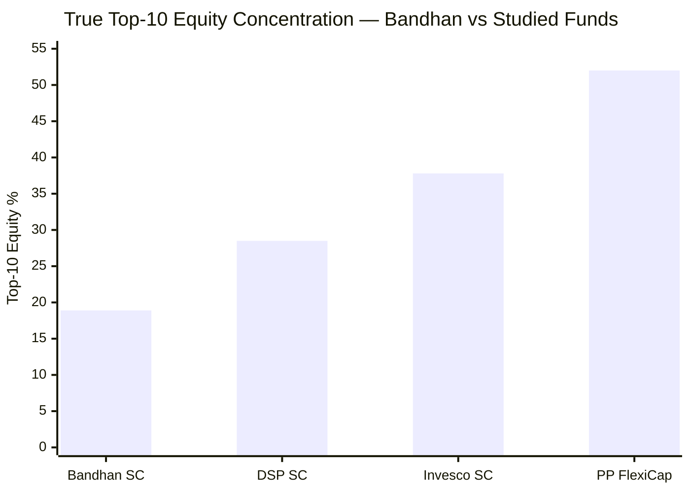

| Fund | Top-10 equity | Top holding | # stocks |
|---|---|---|---|
| **Bandhan** | **~18.9%** | REC Ltd 3.49% | **239–256** |
| DSP | 28.5% | Lumax 5.38% | 81 |
| Invesco | 37.8% | Amber 4.87% | 67 |
| PP FlexiCap | ~52% | ~6% | ~28 |

**Computed concentration ladder (equity only, excluding repo):**
Top-5 = 12.23% · Top-10 = 18.93% · Top-15 = 24.38% · Top-19 = 28.22%.

When a fund's single largest position is cash, and its largest *equity* position is only 3.49%, you are looking at a portfolio engineered to minimise idiosyncratic risk above all else.

---

## Raw Data (Compiled Across Sources)

| Metric | Value | Source |
|---|---|---|
| Equity % | **86.7%** | INDmoney |
| Cash + Debt % | **13.3%** (Reverse Repo 13.98%, net payables −0.9%) | Groww / INDmoney |
| Small Cap % | **66.9%** (was 71.7% in Dec-2025) | INDmoney |
| Mid Cap % | 15.0% | INDmoney |
| Large Cap % | 4.0% | INDmoney |
| Total Stocks | **239–256** | Value Research / Groww |
| Top Holding (equity) | REC Ltd — 3.49% | Groww |
| Top-5 equity | ~12.2% | Computed |
| Top-10 equity | ~18.9% | Computed |
| Top-20 equity | ~28.2% | Computed |
| Portfolio PE | **18.53** (VRO 18.29; category ~31.49) | Tickertape CSV |
| Portfolio PB | ~2.13 (Regular plan) | Value Research |
| Portfolio Turnover | **51.96%** | INDmoney |
| Implied Avg Holding Period | **~2 years** | Computed from turnover |
| AUM | **₹25,346 Cr** (largest in shortlist) | AMFI |
| SEBI SC Mandate Minimum | 65% | Universal |
| Bandhan SC vs Minimum | **+1.9pp above floor** | Barely compliant |
| Stated Philosophy | "Quality + Growth + Reasonable Valuation" | Bandhan AMC |

---

## The Core Thesis — A Diffuse Deep-Value Index-Plus Fund

SEBI's Small Cap mandate requires a minimum 65% in small-cap stocks at all times, with up to 35% deployable elsewhere. The way a manager *uses* that flexibility reveals the philosophy. DSP runs 87% small cap (maximal commitment). Invesco runs 65% (multi-cap in disguise). Bandhan runs **66.9% and falling** — closer to Invesco's floor-running than DSP's purity, but with a completely different internal construction.

Where Invesco expresses low purity through 14% deliberate large-cap bets, **Bandhan expresses it through cash (13.3%) and a vast diffuse tail of 250+ small-cap names.** The result is a portfolio that, for most of its weight, resembles the small-cap *index* — but tilted hard toward **value and cyclicals**, and cushioned by a large cash buffer.

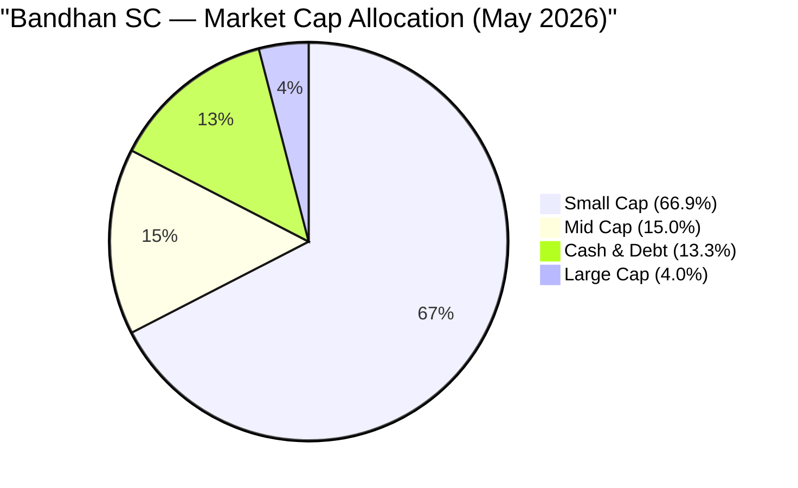

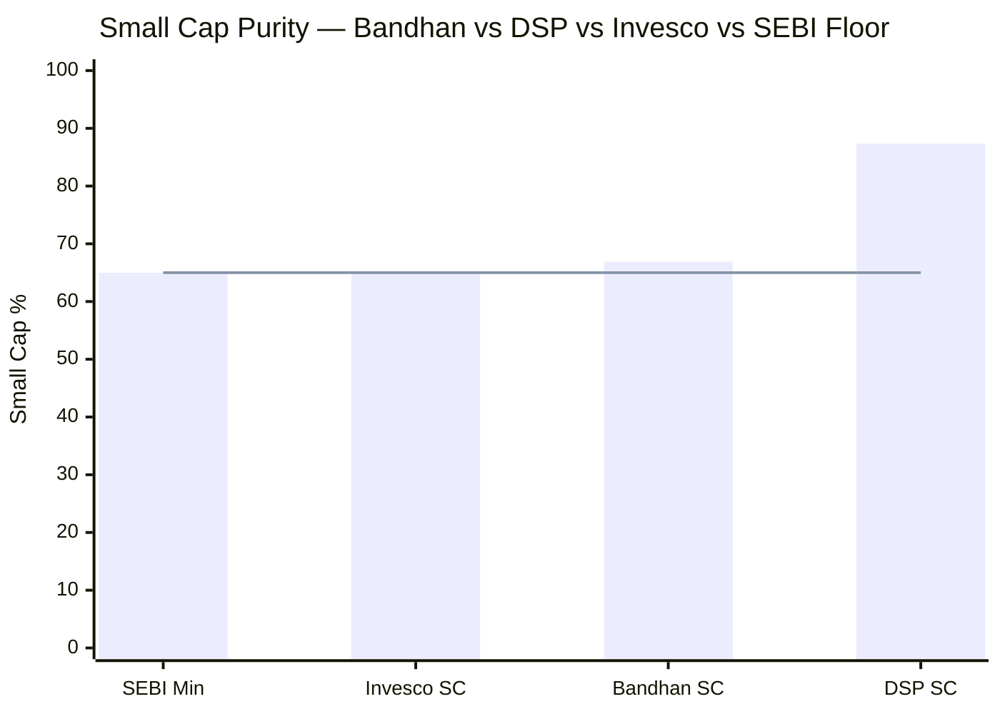
> Line = SEBI mandatory floor (65%). Bandhan sits just 1.9pp above it — and the weight has been falling (71.7% → 66.9% over six months).

---

## Asset Allocation — The Highest Cash Buffer in the Study

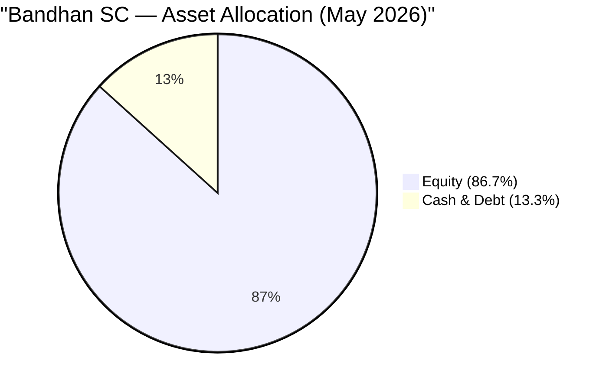

| Asset Class | Bandhan SC | DSP SC | Invesco SC | Implication |
|---|---|---|---|---|
| Equity | 86.7% | 91.62% | 99.9% | Bandhan least deployed |
| Cash & Equivalents | **13.3%** | 8.38% | 0.1% | **Highest buffer of all 8** |
| Debt | ~0% | 0% | 0% | All pure equity mandates |

**The 13.3% cash position (₹3,370 Cr) is the single most consequential number in this table.** It is the highest cash balance — both in percentage and absolute terms — of any fund in the study. It has three possible explanations, and the evidence points to all three operating at once:

1. **Deployment lag at scale.** At ₹25,346 Cr, each 1% position requires ~₹253 Cr. Monthly SIP inflows (estimated ₹300–400 Cr) arrive faster than the manager can deploy ₹253 Cr clips into illiquid small caps without moving prices. Cash accumulates in a queue.

2. **Deliberate dry powder.** Gunwani's value style holds cash for corrections, buying cheap without being forced to sell existing names.

3. **AUM-driven de-risking.** As the fund has grown, cash has stayed elevated while small-cap weight has fallen — the signature of a fund managing its own size.

Whatever the mix, the consequence for the investor is identical: **a permanent cash drag.** At ~6.5% repo yield versus ~20%+ equity potential, the 13.3% allocation is a structural return cost — quantified in the cash drag section below and tied directly to the Module 2 beta finding.

---

## Market Cap Allocation — Purity Drifting Toward the Floor

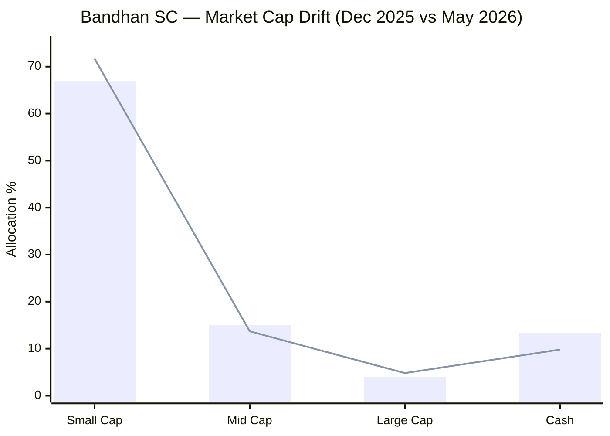
> Bar = May 2026 | Line = December 2025. Over six months, small-cap weight fell ~4.8pp and cash rose ~3.5pp.

The trajectory matters as much as the level. In **December 2025 the fund held 71.7% small cap and ~9.8% cash. By May 2026 that was 66.9% small cap and 13.3% cash.** In six months the fund **reduced genuine small-cap exposure and raised cash** — drifting toward the 65% SEBI floor.

This is the classic fingerprint of a fund **hitting deployment constraints at scale.** It corroborates two earlier findings: the Module 2 observation that volatility is *rising* as AUM grows, and the broader thesis that Bandhan's "constraint zone" AUM (₹20–30K Cr) is beginning to shape portfolio construction. An investor buying today is buying a fund that is becoming *less* of a pure small-cap vehicle over time, not more.

Understanding the 15% mid-cap allocation: unlike Invesco's deliberate large-cap bets, Bandhan's mid-cap exposure is largely composed of stocks that were originally purchased as small caps and have since graduated upward — a natural consequence of successful stock selection held over time. The 4% large-cap similarly reflects a handful of positions at the upper edge of the market-cap spectrum. These are not the deliberate multi-cap bets that define Invesco's structure; they are drift, not design.

---

## Top 20 Holdings — Stock-by-Stock Analysis

Total portfolio: **239–256 stocks.** The single largest position is **Reverse Repo (cash) at 13.98%** — itself a telling fact. The largest *equity* holding, REC Ltd, is only 3.49%. The top 19 equity names below account for just ~28% of assets. The remaining ~237 stocks average 0.25% each.

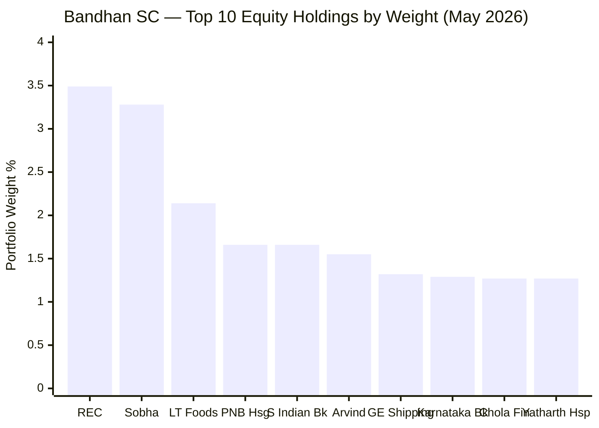

| # | Stock | Wt% | Sector | Thesis / Why It Drives the Low PE |
|---|---|---|---|---|
| 1 | **REC Ltd** | 3.49% | Financials (PSU) | Power-sector infrastructure financier; trades ~6–8× PE, high dividend yield; deep-value PSU anchor and the most significant single-stock bet in the portfolio |
| 2 | **Sobha Ltd** | 3.28% | Real Estate | South/premium real estate developer; cyclical recovery play; asset-heavy, low-multiple; the defining Real Estate bet |
| 3 | **LT Foods** | 2.14% | Consumer Defensive | Daawat basmati rice; ~55% export revenue (natural USD hedge); quality branded food — also a top DSP holding, confirming its quality credentials |
| 4 | **PNB Housing Finance** | 1.66% | Financials | Housing finance NBFC turnaround; trades near/below book; asset-quality recovery story following 2020–21 governance crisis |
| 5 | **South Indian Bank** | 1.66% | Financials | Kerala regional bank; deep-value at <1× book; NIM and asset-quality improvement story; a classic Gunwani-style recovery bet |
| 6 | **Arvind Ltd** | 1.55% | Basic Materials | Textiles and denim manufacturer; cyclical value; low-PE; US fabric exports beneficiary |
| 7 | **Great Eastern Shipping** | 1.32% | Industrial | India's largest private shipping company; freight-cycle play; classic low-PE cyclical with high dividend yield; benefits from global shipping rates |
| 8 | **Karnataka Bank** | 1.29% | Financials | Regional private bank; trades below book; value/turnaround; South India franchise similar to South Indian Bank |
| 9 | **Cholamandalam Fin. Holdings** | 1.27% | Financials | Holdco for Chola Investment & Finance; holdco-discount value play; the holding company structure creates a structural PE discount vs NAV |
| 10 | **Yatharth Hospital & Trauma Care** | 1.27% | Health | North India hospital chain (Noida, Greater Noida); healthcare premiumisation; genuine small-cap growth story — the one name here that fits a "Quality + Growth" rather than pure value thesis |
| 11 | **Jubilant Pharmova** | 1.20% | Health | Pharma/CDMO/radiopharma conglomerate; turnaround optionality after demerger from Jubilant Life Sciences; radiopharma is a high-growth niche |
| 12 | **Shaily Engineering Plastics** | 1.13% | Industrial | Precision plastics manufacturer; pen-injector / GLP-1 drug delivery device tailwind; one of the portfolio's highest-quality small caps |
| 13 | **Cyient** | 1.05% | Tech | Engineering R&D services; mid-cap value in IT; aerospace + rail + semiconductor design services |
| 14 | **Paradeep Phosphates** | 1.05% | Basic Materials | Fertiliser manufacturer; cyclical, low-PE, policy-linked; benefits from India's import-substitution push in fertilisers |
| 15 | **Apar Industries** | 1.02% | Industrial | Conductors, cables, and transformer oils; direct power-capex and data-centre buildout beneficiary; quality industrial |
| 16 | **ICICI Lombard General Insurance** | 1.02% | Financials | General insurer; quality compounder — a rare growth name in an otherwise value-tilted portfolio; demonstrates the "Quality" filter still operates |
| 17 | **DCB Bank** | 0.97% | Financials | Small private bank; trades at ~0.8× book; deep-value; management has been improving return on assets gradually |
| 18 | **One 97 Communications (Paytm)** | 0.97% | Tech | Fintech turnaround optionality; the portfolio's clearest contrarian bet — Gunwani buying distressed after the regulatory crisis |
| 19 | **Glenmark Pharmaceuticals** | 0.88% | Health | Branded generics + innovation pipeline; value pharma recovering from balance-sheet stress; licensing optionality in dermatology |

### Three Patterns in the Top 20

**Pattern 1 — Deep value and cyclicals dominate.** REC (PSU financier), Sobha (real estate), South Indian / Karnataka / DCB Bank (sub-book regional banks), Great Eastern Shipping, Paradeep Phosphates (fertiliser), Arvind (textiles) — this is a roster of **low-multiple, mean-reversion, cycle-sensitive businesses.** It is the single clearest explanation for the portfolio's 18.53 PE. Gunwani is running a value-recovery screen across the small-cap universe, not a quality-compounder filter.

**Pattern 2 — Financials are the defining sector bet (24.1%).** Seven of the top 19 are financial-services names, mostly **regional banks and NBFCs trading below or near book value.** REC (PSU power financier), PNB Housing, South Indian Bank, Karnataka Bank, Cholamandalam Holdings, DCB Bank, ICICI Lombard — this is a bet on financial-sector re-rating and credit-cycle normalisation. It is high-beta to interest rates and NPA cycles simultaneously. Invesco also runs a ~28% financials position, but at growth multiples; Bandhan owns the same sector at value multiples.

**Pattern 3 — Turnaround and optionality tilt.** PNB Housing, Jubilant Pharmova, Paytm, Glenmark, DCB Bank are all "broken-and-mending" stories — businesses that have suffered governance issues, regulatory shocks, or earnings collapses and are bought at distressed multiples with recovery upside. This is a very different game from DSP's "buy quality compounders" or Invesco's "pay up for growth." It is closer to a **special-situations value fund** than a pure small-cap growth vehicle.

---

## Sector Allocation — Financials and Real Estate Define the Value Tilt

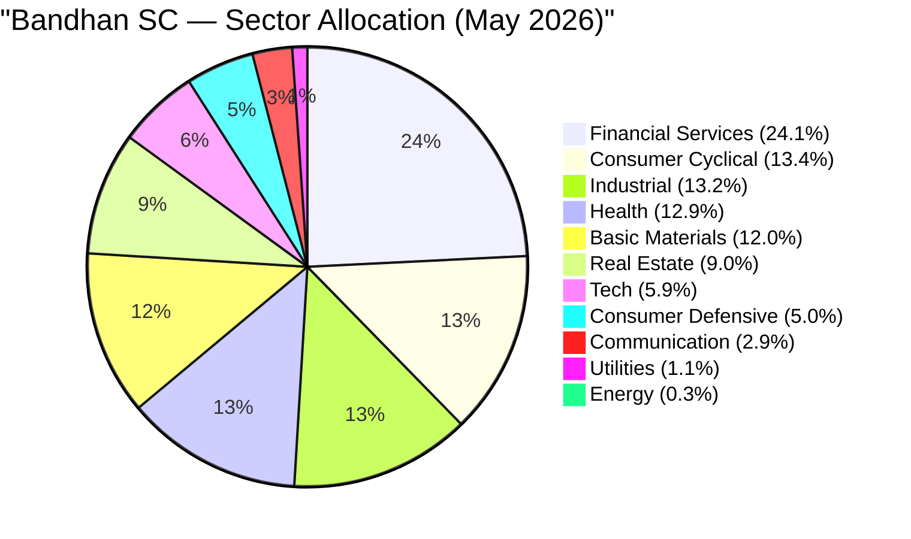

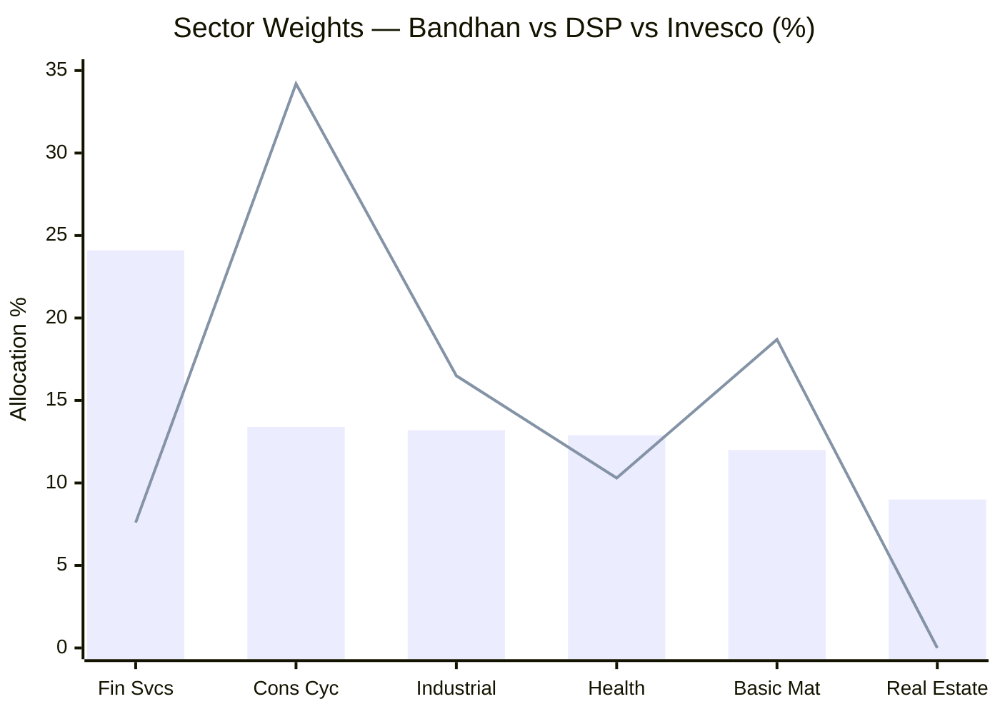
> Bar = Bandhan | Line = DSP. The Financial Services and Real Estate overweights — and the Consumer Cyclical underweight — are the structural differences.

| Sector | Bandhan | DSP | Invesco | Interpretation |
|---|---|---|---|---|
| **Financial Services** | **24.1%** | 7.6% | 27.7% | Defining bet; regional banks/NBFCs at value multiples |
| Consumer Cyclical | 13.4% | **34.2%** | 19.1% | Far less consumer-heavy than DSP |
| Industrial | 13.2% | 16.5% | 16.7% | In line across all three |
| Health | 12.9% | 10.3% | 18.3% | Balanced; turnaround pharma + small-cap hospitals |
| Basic Materials | 12.0% | **18.7%** | 6.3% | Cyclical materials; fertiliser, textiles |
| **Real Estate** | **9.0%** | ~0% | 5.7% | High; DSP avoids it entirely |
| Tech | 5.9% | 3.9% | 4.4% | Slightly higher; Cyient + Paytm contrarian |
| Consumer Defensive | 5.0% | 7.9% | 1.3% | Modest; LT Foods as anchor |

**The macro philosophy:** Bandhan is **India's financial-deepening + cyclical-recovery value fund.** Financial Services (24.1%) + Real Estate (9%) + Basic Materials (12%) = 45% in rate-sensitive, cycle-sensitive, low-multiple sectors. Where DSP bets on consumer formalisation and Invesco on healthcare/financial premiumisation, Bandhan bets on **cheap cyclicals mean-reverting upward.** Outside the financials overweight, the book is unusually *balanced* across sectors — a direct consequence of the 256-stock diffuse construction, which naturally pulls sector weights toward index-like levels.

### Financial Services Deep-Dive (24.1%) — The Regional-Bank Value Cluster

At 24.1%, Financial Services is Bandhan's largest sector — over 3× DSP's 7.6%. But the *composition* differs sharply from Invesco's similarly-sized financials bet. Invesco owns exchange infrastructure and turnaround banks at growth multiples; **Bandhan owns a cluster of sub-book-value regional banks and NBFCs** — South Indian Bank, Karnataka Bank, DCB Bank, PNB Housing, Cholamandalam Holdings, plus PSU financier REC.

This is a **pure value-and-recovery thesis on Indian credit:** banks trading below book re-rate toward book as asset quality normalises and credit growth resumes. The risk concentration is real:
- **Interest-rate sensitivity:** All regional banks compress NIM simultaneously when RBI cuts rates
- **Synchronised NPA cycles:** A domestic economic slowdown deteriorates all bank positions together — no diversification within financials in a credit event
- **Regulatory risk:** RBI norm changes (capital requirements, MSME classification, priority-sector norms) hit the entire sector at once
- **Leverage-inherent binary risk:** A bank's equity is tiny relative to its balance sheet; a bad credit cycle amplifies losses disproportionately

Sambre at DSP explicitly avoids leveraged-balance-sheet businesses. Gunwani at Bandhan takes the opposite, value-maximalist side of that bet — betting that cheap multiples compensate for the structural risks.

### Real Estate Deep-Dive (9.0%) — The DSP Contrast

DSP holds essentially **zero** real estate by deliberate choice. Bandhan holds **9%** — Sobha (3.28%) plus a tail of developers. Real estate is the archetypal low-PE, high-cyclicality, balance-sheet-heavy sector: it rewards value investors handsomely in upcycles and punishes them brutally in downcycles. Sobha specifically is a premium residential developer with strong execution but is inherently exposed to interest-rate cycles (higher rates compress buyer affordability) and inventory cycles (unsold stock in a slowdown destroys working capital). Its presence is a major reason Bandhan's PE is so low — and a major reason a future property-cycle downturn would hit Bandhan harder than DSP.

### Healthcare Deep-Dive (12.9%) — Turnaround Tilt, Not Premium Hospitals

Unlike Invesco's premium-hospital cluster (Max Healthcare, KIMS, Medanta — all at elevated multiples), Bandhan's healthcare is a **value/turnaround mix**: Jubilant Pharmova (CDMO/radiopharma turnaround recovering from conglomerate discount), Glenmark Pharmaceuticals (branded generics recovering from balance-sheet stress), Yatharth Hospital (genuine small-cap, accessible valuations), and Shaily Engineering (GLP-1 drug delivery device — a high-quality growth company that is the portfolio's clearest "growth" bet in this sector). Same broad sector exposure as Invesco — but cheaper entry points, more recovery risk, and more GLP-1 adjacency.

---

## Portfolio Concentration Analysis — Maximum Diversification

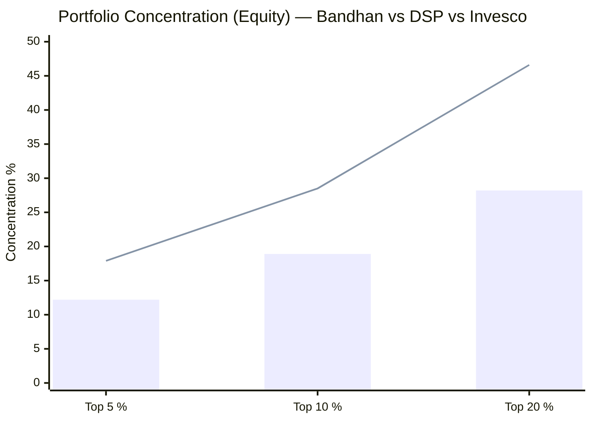
> Bar = Bandhan | Line = DSP. Bandhan is the least concentrated portfolio at every level — by a wide margin.

| Metric | Bandhan | DSP | Invesco | Interpretation |
|---|---|---|---|---|
| Total Stocks | **239–256** | 81 | 67 | 3× more than DSP; ~4× Invesco |
| Top Holding (equity) | 3.49% | 5.38% | 4.87% | No dominant position |
| Top 5 % | **12.2%** | 17.9% | 21.5% | Lowest of all studied funds |
| Top 10 % | **18.9%** | 28.5% | 37.8% | Lowest by a wide margin |
| Top 20 % | **28.2%** | 46.6% | 49.1% | Lowest by a wide margin |

**Is 256 stocks the right number?** Academic portfolio theory shows idiosyncratic-risk reduction plateaus at 25–30 stocks. At 256, Bandhan is roughly **8–10× past the theoretical optimum.** The benefit is real but narrow: near-zero single-stock blow-up risk. A complete write-off of any bottom-tier position (~0.25%) costs the NAV essentially nothing — the polar opposite of Invesco, where a top-5 failure costs 3–5% with no cash cushion.

The cost is equally real: **the bottom ~230 positions cannot generate meaningful alpha,** and collectively they force the portfolio's behaviour toward the small-cap index. A 3× return on a 0.25% position adds 0.5% to NAV. A 3× return on DSP's 5.38% top position adds 10.76% to NAV. The upside from conviction simply cannot express itself through 256 positions.

---

## The 256-Stock Paradox — Closet Indexing at a Bargain Price?

Three facts, taken together, raise an uncomfortable question:

1. The fund holds **239–256 stocks** — approaching the investable small-cap universe itself
2. The top-10 equity weight is just **18.9%**; ~90% of the equity book sits in sub-1% positions
3. The **Direct ER is the cheapest in the shortlist** (0.33–0.34%)

A portfolio this diffuse will, for most of its weight, **track the small-cap index closely** — recall the Module 2 R² of 0.896. The question is whether the investor is paying for genuine active small-cap stock-picking, or for a **quasi-index product with a value tilt and a cash overlay** — delivered cheaply precisely *because* it is index-like and less research-intensive per rupee managed.

The honest answer is nuanced. The active return is genuine — Module 2 found alpha of +9.07% and an information ratio of 2.01, which a pure index fund cannot produce. That alpha comes from the **deliberate value/cyclical tilt** (overweight cheap financials, real estate, cyclicals) and the **cash-timing overlay**, not from concentrated stock picks. So Bandhan is not a closet index fund — but it is closer to **"smart-beta value tilt + tactical cash"** than to **"concentrated bottom-up conviction."** For a satellite SIP whose entire purpose is concentrated small-cap alpha, that distinction matters. The low ER (a Module 4 strength) and the diffuse construction (a Module 3 caveat) should be read together, not separately.

---

## The Value Engine — Why the PE is 18.53

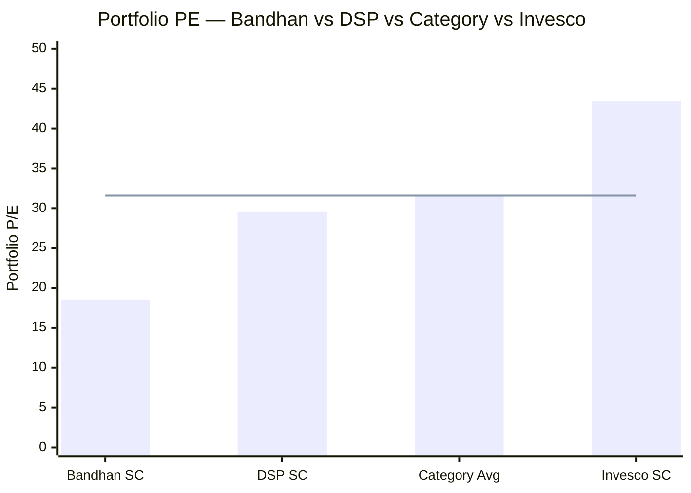
> Line = small-cap category average PE (31.60). Bandhan trades ~41% below category — the largest valuation discount in the study.

| Metric | Value |
|---|---|
| Bandhan Portfolio PE | **18.53** (VRO 18.29) |
| Category Average PE | 31.60 |
| Bandhan Discount to Category | **−41%** |
| Cash-Adjusted PE (PE ÷ equity%) | **~21.4** — still lowest in shortlist |
| Portfolio PB | ~2.13 (Regular plan) |
| DSP PE / Category / Invesco PE | 29.54 / 31.60 / 43.43 |

The 18.53 is not a measurement quirk — it is the direct output of the holdings. The portfolio is anchored by **sub-8× PSU financiers (REC), sub-book regional banks (South Indian, Karnataka, DCB), cyclical real estate (Sobha), and low-multiple cyclicals (Great Eastern Shipping, Paradeep Phosphates, Arvind).** Financial Services (24%) + Real Estate (9%) + Basic Materials (12%) = 45% in inherently low-multiple sectors.

**The value investor's double-edged sword:**

*Upside:* A portfolio bought at PE 18 has far less multiple-compression risk than Invesco at PE 43. In a PE-derating bear market — where the shock is sentiment-driven valuation contraction rather than earnings collapse — Bandhan should fall structurally less than Invesco. This is genuine downside protection that complements the cash buffer.

*Downside:* Deep-value cyclicals are cheap for reasons. Regional banks, real estate, shipping, and fertiliser are economically sensitive; in a genuine slowdown their *earnings* collapse even as multiples look optically cheap. A bank at 0.8× book that then reports a surge in NPAs and halves its book value is not "cheap" — it was a value trap all along. The low PE protects against multiple compression but **not** against earnings compression — the more insidious risk.

This is the philosophical fork: DSP buys quality at fair value, Invesco buys growth at a premium, **Bandhan buys cyclicals at a discount and bets on mean reversion.** Over a full market cycle, all three approaches can work; they simply perform at different times.

---

## The Two Contradictions

**Contradiction 1 — Highest cash AND highest turnover.**

Bandhan holds the **most cash in the shortlist (13.3%)** — a defensive, patient posture — while simultaneously running the **highest portfolio turnover (51.96%)** versus DSP's 19–24% and Invesco's 29%. The fund is both the most cautious *and* the most hyperactive.

The reconciliation: this is not patient buy-and-hold; it is a **value-rotation style** that continuously trims names that have re-rated toward fair value and recycles the proceeds into cheaper ones, while parking unallocated SIP inflows in reverse repo meanwhile. The implied holding period is **~2 years** — less than half of DSP's ~4.5 years. An investor expecting DSP-style "buy great businesses and sit" is instead getting active valuation-driven rotation. Whether the higher churn generates enough additional alpha to justify the higher transaction costs and short-term capital-gains tax friction is assessed in Module 4.

**Contradiction 2 — De-risking at scale.**

As AUM swelled to ₹25,346 Cr (largest in the shortlist), small-cap weight *fell* (71.7% → 66.9%) and cash *rose* (~9.8% → 13.3%). A fund that is growing should, all else equal, be deploying more into its mandate — Bandhan is doing the opposite. This is the clearest portfolio-level evidence that **AUM scale is now actively constraining the strategy**. It dovetails with the Module 2 finding of rising volatility and with the Module 4 AUM analysis: the fund is mechanically becoming less of a pure small-cap vehicle as it attracts more capital.

---

## Cash Drag Quantification

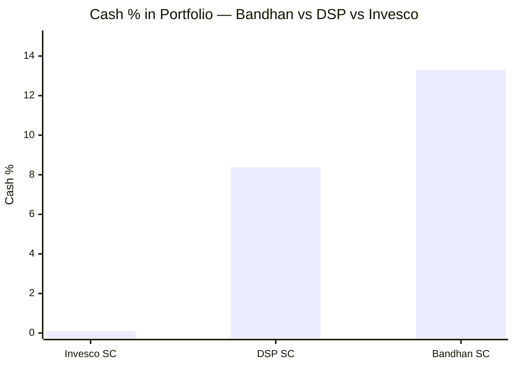

The 13.3% cash, held in reverse repo at ~6.5%, against an equity book targeting ~20%+, is a permanent structural drag. For a **₹20,000/month SIP**, the monthly allocation breaks down as:

| Destination | Monthly | Annual |
|---|---|---|
| Small cap equity (66.9%) | ₹13,380 | ₹1,60,560 |
| Mid cap equity (15.0%) | ₹3,000 | ₹36,000 |
| Large cap equity (4.0%) | ₹800 | ₹9,600 |
| **Cash / Reverse Repo (13.3%)** | **₹2,660** | **₹31,920** |

Roughly **₹2,660 of every ₹20,000 SIP instalment sits in overnight money,** and only ₹13,380 reaches genuine small caps — versus ~₹17,500 in DSP and ~₹13,000 in Invesco. The crucial cross-module link: **Module 2 showed the ~13% cash mechanically explains almost the entire sub-1 beta (0.91).** Bandhan's headline "defensiveness" is therefore largely a cash artifact, not superior stock selection — and that same cash is the return cost measured here. The defensiveness and the drag are two sides of one coin.

---

## Portfolio Turnover & Investment Philosophy

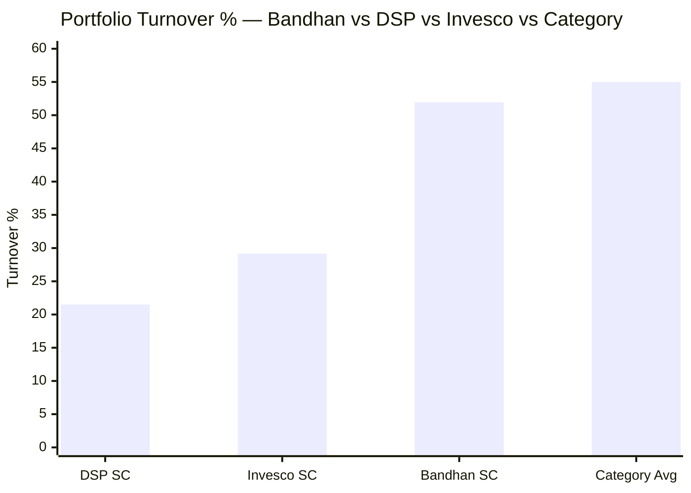

**Turnover 51.96% → implied average holding period ~2 years.** This is the highest of the three studied small-cap funds and near the category average (~55%). Combined with 256 holdings, it paints a clear picture of the manager's process:

**Manish Gunwani's implied philosophy** (the portfolio's fingerprint; full treatment in Module 5):
- **Valuation-first:** PE 18.53 and a roster of sub-book financials/cyclicals confirm price discipline is the dominant filter — the opposite of Invesco's price-permissive growth approach
- **Diffuse / quant-influenced:** 256 positions suggests a screening-driven, semi-systematic process rather than 67 hand-crafted deep-dives. Gunwani's background includes quantitative and macro-aware investing at ICICI Prudential and Franklin Templeton
- **Rotational:** 52% turnover means he actively harvests mean reversion — trim on re-rating, rotate into the next cheap name. This is the opposite of DSP's "hold until the thesis breaks"
- **Macro-cyclical:** the financials/real-estate/materials tilt is a top-down cyclical-recovery bet layered onto bottom-up value screens

This is a coherent, legitimate style — but it is **the least "small-cap-purist, high-conviction" of the three funds**, and the most index-and-cash-shaped. It is more comparable to a value-factor smart-beta product than to either DSP's concentrated quality-buy-and-hold or Invesco's concentrated growth conviction.

---

## AUM Scalability — At the Constraint Ceiling

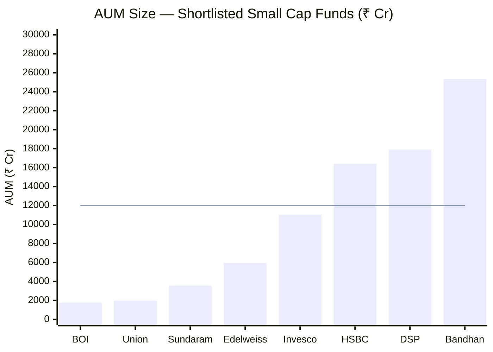
> Line = approximate ₹12,000 Cr threshold above which small-cap alpha generation becomes structurally constrained. Bandhan is the largest fund in the shortlist, well into the constraint zone.

| Scenario | Bandhan (₹25,346 Cr) | DSP (₹17,906 Cr) | Invesco (₹11,038 Cr) |
|---|---|---|---|
| 1% position requires | **₹253 Cr** | ₹179 Cr | ₹110 Cr |
| 1% position = % of a ₹5,000 Cr company | **~5% of float** | ~3.6% | ~2.2% |
| Monthly SIP inflows (est.) | **~₹380 Cr** | ~₹320 Cr | ~₹180 Cr |
| Deployment constraint | **Severe** | Significant | None |
| Coping mechanism | **256 stocks + 13% cash** | 81 stocks + 8% cash | 67 stocks + 0% cash |

**Bandhan's 256-stock, 13%-cash structure is not an aesthetic choice — it is an AUM survival mechanism.** At ₹25,346 Cr, the fund *cannot* run a concentrated 60-stock book without owning dominant stakes in illiquid small caps. It is forced to spray capital across the universe and queue the overflow in cash. This is the same constraint DSP faces, but one size class worse — and it explains why both the diffuse construction and the cash drag should be understood as **consequences of scale**, not pure management preference.

At this AUM, even with 256 stocks, the fund's **estimated stress-test liquidation time** (SEBI's 25% portfolio liquidation metric) would be among the longest of the shortlist — likely comparable to or worse than DSP's 21–25 days for 25% liquidation, given the larger absolute AUM despite the more diffuse construction.

---

## The Manish Gunwani Factor — A Value-Macro Manager at Scale

The portfolio reflects a manager who joined in **January 2023** and demonstrably re-shaped the book toward value and diffusion. The pre-Gunwani portfolio (Bhaskar era) was more momentum-oriented and generated negative alpha; the current deep-value, 256-stock, high-cash approach is entirely Gunwani's fingerprint.

Gunwani's measured alpha in his Bandhan tenure (+10.87%/year, per Module 1) is strong, but his tenure on this fund is **only ~3 years** — and, critically, that tenure has coincided almost entirely with a small-cap bull market that rewarded the value/cyclical tilt (2023–2024 especially: financial stocks, real estate, cyclicals all re-rated sharply). Whether the deep-value, 256-stock, high-cash approach protects capital in a genuine bear at ₹25K+ Cr scale is **untested** — the same caveat that capped Module 2. Module 5 assesses the manager directly.

---

## Comparison with All Studied Funds

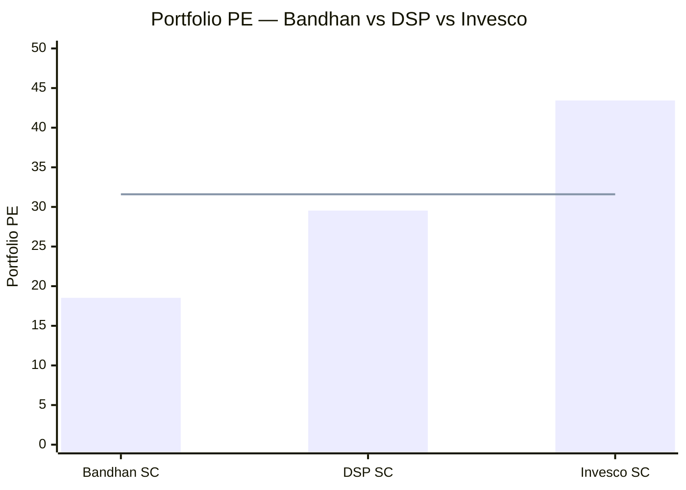
> Line = category average (31.60). Three completely different valuation philosophies.

| Dimension | Bandhan SC | DSP SC | Invesco SC | PP FlexiCap |
|---|---|---|---|---|
| # Stocks | **239–256** | 81 | 67 | ~28 |
| Top-10 equity | **18.9%** | 28.5% | 37.8% | ~52% |
| SC Purity | 66.9% (falling) | **87.4%** | 65.1% | N/A |
| Portfolio PE | **18.53** (value) | 29.54 | 43.43 (growth) | ~22 |
| Turnover | **51.96%** (highest) | 19–24% | 29% | ~15–20% |
| Cash | **13.3%** (highest) | 8.38% | 0.1% | ~8% |
| Core Sector Bet | Financials 24% + RE 9% | Cons Cyclical 34% | Financials 28% + Health | Intl Tech + Value |
| Style | Diffuse deep-value rotation | Concentrated quality-value hold | Concentrated growth-at-premium | Global value |
| AUM | **₹25,346 Cr** (largest) | ₹17,906 Cr | ₹11,038 Cr | ₹78,000+ Cr |
| AUM Constraint | **Severe** | High | Low | Very Low |

**Bandhan's distinctive positioning across all studied funds:**
- **Most diversified** portfolio of any fund examined (239–256 stocks)
- **Lowest portfolio PE** — the only genuine deep-value fund in the small-cap shortlist
- **Lowest single-stock concentration risk** (top-10 equity 18.9%)
- **Highest cash buffer** (13.3%) and **highest turnover** (51.96%)
- **Largest AUM** and most scale-constrained
- The only fund whose construction raises a **quasi-index / closet-diversification** question

**Three genuinely different funds, three different return engines:**
- **DSP** = concentrated quality-value buy-and-hold (earn alpha from picking great businesses cheap and holding 4–5 years)
- **Invesco** = concentrated growth-at-premium conviction (earn alpha from owning category-leading businesses at premium multiples)
- **Bandhan** = diffuse deep-value rotation (earn alpha from systematic mean-reversion of cheap cyclicals + cash-timing + sector tilt)

---

## Points For (Portfolio Angle)

1. **Lowest portfolio PE (18.53)** — genuine protection against multiple-compression in a bear market; 41% below category; the biggest structural valuation cushion in the shortlist
2. **Lowest single-stock blow-up risk** — at 0.25% average weight, no individual fraud or collapse can meaningfully damage the portfolio
3. **13.3% cash buffer** — largest dry-powder reserve; provides buying capacity in corrections without forced selling; partially explains the best downside-capture ratio (Module 2)
4. **Coherent value-recovery thesis** — financial deepening + cyclical mean-reversion are legitimate multi-year themes; regional banks re-rating from sub-book to book is a real return source
5. **Balanced sector exposure** — beyond financials, no sector exceeds 13.4%; the diffuse construction naturally prevents runaway sector concentration
6. **Shaily Engineering / GLP-1 adjacency** — quality small-cap positioning in the global GLP-1 drug delivery supply chain; genuine growth embedded in a value portfolio
7. **Real Estate 9%** — if a multi-year residential upcycle continues (driven by urbanisation, income growth, and formalisation), Sobha and peers deliver outsized returns from a low base

---

## Points Against (Portfolio Angle)

1. **256 stocks — closet-index / smart-beta concern** — the portfolio cannot generate concentrated alpha; the bottom 230 names at ~0.25% average are noise, not conviction; academic portfolio optimum is 25–30 stocks, not 256
2. **Small cap purity 66.9% and falling** — actively drifting toward the SEBI floor; investors expecting pure small-cap satellite exposure are receiving a diluted product that is becoming more diluted over time
3. **13.3% cash drag** — ₹2,660 of every ₹20,000 monthly SIP sits idle; only ₹13,380 reaches genuine small caps vs ₹17,500 in DSP; compounding cost over 10 years is material
4. **51.96% turnover — highest studied** — implies ~2-year average hold; active rotation generates short-term capital gains tax friction and transaction costs; the low headline ER advantage shrinks on a true all-in cost basis (Module 4)
5. **Financial Services 24% concentration risk** — regional bank/NBFC cluster is synchronised in its exposure to NPA cycles, RBI rate decisions, and credit slowdowns; not true diversification despite the 256-stock count
6. **Real Estate 9% at scale** — property cycles can be brutal; Sobha and real-estate peers are the portfolio's most earnings-cyclical cluster; a rate-rise or demand-compression cycle would compress earnings and multiples simultaneously
7. **Deep-value cyclicals = value-trap risk** — Paytm, PNB Housing, DCB Bank, South Indian Bank are "cheap for a reason" stories; recovery is not guaranteed; a single NPA cycle can turn sub-book banks into permanent capital impairment
8. **₹25,346 Cr AUM — most constrained** — the fund is already a size above DSP, which itself has stress-test liquidity concerns; Bandhan's coping mechanism (256 stocks + cash) has limits; further AUM growth makes the situation worse, not better
9. **Gunwani's tenure only 3 years** — the current portfolio is entirely his construction, but 3 years in a bull market is insufficient to validate the full-cycle defensiveness of a value/rotation style at this AUM scale

---

## Module 3 Scorecard

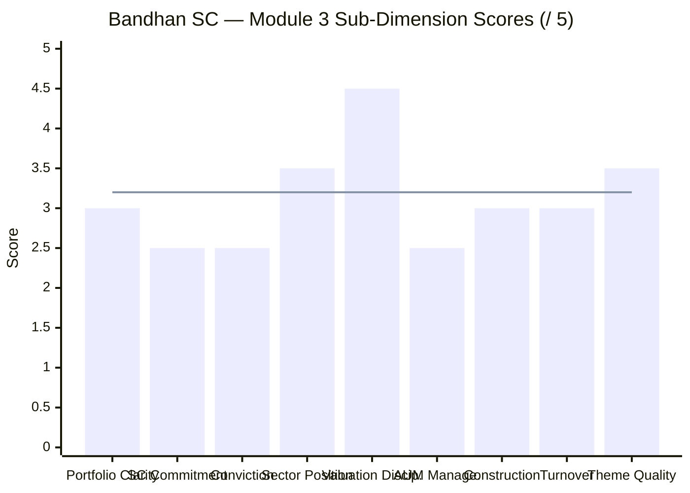
> Line = Module 3 overall score (3.2/5)

| Sub-Dimension | Score | Reasoning |
|---|---|---|
| Portfolio Clarity / Identity | **3.0/5** | Clear value-cyclical identity, but 256-stock diffusion blurs conviction and raises a quasi-index question |
| Small Cap Commitment | **2.5/5** | 66.9% and falling toward floor; cash + de-risking trend dilute genuine SC exposure |
| Manager Conviction Quality | **2.5/5** | Top-10 equity only 18.9%; conviction spread thin across 256 names; cash is the #1 position |
| Sector Positioning | **3.5/5** | Financials + cyclical-recovery is a coherent value thesis; real-estate/regional-bank concentration is rate-cycle risk |
| Valuation Discipline | **4.5/5** | PE 18.53 — best in the study by far; genuine multiple-compression protection; the portfolio's standout strength |
| AUM Manageability | **2.5/5** | ₹25,346 Cr — largest, most constrained; 256 stocks + 13% cash are scale-coping mechanisms, not choices |
| Portfolio Construction | **3.0/5** | Excellent single-stock risk control; diffusion + cash undercut alpha potential and raise the closet-index question |
| Turnover & Cost Efficiency | **3.0/5** | 51.96% is the highest studied; ~2-year hold contradicts patient investing; raises true all-in cost vs headline ER |
| Theme Quality | **3.5/5** | Financial deepening + cyclical mean-reversion are real; more cyclical and less secular than DSP's consumer-formalization themes |
| **Module 3 Overall** | **3.2 / 5** | Best valuation discipline and lowest single-stock risk, weighed down by diffuse construction, falling SC purity, highest cash drag, severe AUM constraint, and a high turnover that contradicts the value-investing holding-period ideal |

---

## Comparative Module 3 Scores

| Fund | Module 3 Score | Portfolio Identity |
|---|---|---|
| DSP Small Cap | **3.8/5** | Pure India SC; concentrated quality-value; lowest turnover; 18-year tenure |
| **Bandhan Small Cap** | **3.2/5** | **Diffuse deep-value rotation; lowest PE; lowest stock risk; highest cash drag and turnover; AUM-constrained** |
| Invesco India SC | 3.1/5 | Multi-cap growth-at-premium in SC wrapper; highest PE; zero cash buffer |

Bandhan's 3.2/5 sits between DSP (3.8) and Invesco (3.1). It earns the study's best valuation discipline and diversification, but cannot match DSP's purity, conviction, and turnover discipline. It edges past Invesco mainly because the deep-value PE and large cash buffer provide genuine downside protection that Invesco's PE-43, zero-cash book lacks. The 0.6-point gap to DSP is driven primarily by the diffuse construction, falling SC purity, and the AUM-scale penalty.

---

## SIP Implication

For a ₹20,000/month satellite SIP with a 10+ year horizon:

**What you are actually buying:** A diffuse, deep-value small-cap fund — ~67% genuine small cap spread across 256 names, tilted hard toward cheap financials, real estate, and cyclicals, with a large 13% cash buffer and active ~2-year rotation. It is the **value-and-diversification** option among the three studied funds, not a concentrated-conviction or growth vehicle.

**Where the portfolio DNA helps:**
- PE 18.53 gives real protection against multiple-compression bears (the opposite of Invesco's PE-43 fragility); entering a bear market from a 41% valuation discount to the category is a genuine structural advantage
- 13% cash + 256-stock diffusion minimise both single-stock blow-up risk and drawdown depth; no position can cause a catastrophic NAV event
- Financial-deepening and cyclical-recovery are legitimate multi-year themes that compound quietly through a full market cycle

**Where it hurts:**
- ~₹2,660 of every ₹20,000 sits idle in cash — a permanent drag compounding at 6.5% instead of 20%+
- 256 stocks + 18.9% top-10 mean you are buying something close to a value-tilted small-cap index — at a low fee, but with limited concentrated-alpha potential; the satellite SIP's purpose (capture concentrated small-cap alpha) is only partially fulfilled
- Falling SC purity + ₹25K Cr AUM mean the fund is becoming *less* of a pure small-cap vehicle as it grows — the product you buy today may be materially different in 5 years
- Deep-value cyclicals (real estate, regional banks, shipping, fertiliser) carry earnings-collapse risk in a genuine slowdown; cheap multiples do not protect against earnings compression

**What to monitor:**
1. **SC purity trend:** if it falls below 66%, the satellite thesis erodes; if it approaches 65%, the fund is effectively at the SEBI floor with no buffer
2. **Cash level:** persistently above 13–15% signals worsening deployment problems; watch for AMC communications on SIP/lumpsum restrictions (Module 4 topic)
3. **Stock count:** if it climbs above ~280, the quasi-index concern strengthens further
4. **Turnover:** if it stays above 50%, confirm the true all-in cost in Module 4 — high churn materially erodes the headline-low ER advantage
5. **Gunwani's tenure:** the entire current portfolio character is his construction; his exit would change the fund's identity more than for a system-driven AMC

---

*Module 3 complete. Portfolio DNA is diffuse deep-value: 239–256 stocks, PE 18.53 (lowest in study, 41% below category), 13.3% cash (highest studied), 51.96% turnover (highest studied), financials + real estate + cyclicals as the defining value tilt. Best valuation discipline and lowest single-stock risk of any fund examined, offset by a quasi-index construction, small-cap purity falling toward the SEBI floor, the heaviest cash drag, and the most severe AUM constraint in the shortlist. Module 3 score: 3.2/5.*

*Next: [Module 4 — Cost & AUM Impact](module4_cost.md)*
