# Module 4: Cost & AUM Impact — Bandhan Small Cap Fund

*Sources: Tickertape (May 2026), ValueResearch (May 2026), Groww (May 2026), INDmoney (May 2026), MySIPonline (May 2026), AMFI, Whalesbook, Bandhan AMC factsheets, Finalyca*

---

## Raw Data (Compiled Across Sources)

| Metric | Value | Source | Cross-Source Notes |
|--------|-------|--------|-------------------|
| Expense Ratio (Direct) | **0.34%** | Tickertape CSV | VRO canonical: **0.33%** — agree within rounding |
| Expense Ratio (Regular) | **1.37%** | VRO / MySIPonline | Consistent across sources |
| Direct vs Regular Gap | **1.03%** | Computed | Moderate — identical to DSP; NOT the worst in shortlist |
| Exit Load | **1% within 365d; nil after** | VRO / TT | Category-standard |
| AUM (May 2026) | **₹25,345.79 Cr** | TT / Groww / VRO | All agree |
| AUM (Feb 2026) | ₹20,000 Cr | Whalesbook | Rapid recent growth |
| AUM (Dec 2025) | ₹18,990 Cr | Whalesbook | — |
| AUM (Apr 2025) | ₹10,000 Cr | Whalesbook | **Doubled in ~10 months** |
| Minimum SIP | **₹100** | VRO / TT | Among lowest in category |
| Minimum Lumpsum | **₹1,000** | VRO | Higher than DSP's ₹100 |
| Portfolio Turnover | **51.96%** | Module 3 / TT | **Highest of 8 shortlisted** |
| Inception (Direct Plan) | **Feb 25, 2020** | VRO | 4 weeks before COVID trough |
| Benchmark | BSE 250 SmallCap TRI | — | Same as all 8 shortlisted |
| Manish Gunwani (CIO) — schemes | **7** | Groww / multiple | Since Jan 28, 2023 |
| Kirthi Jain — schemes | **2** | VRO / Finalyca | Joined May 2023 |
| Bandhan AMC Total AUM | **~₹1,68,641 Cr** (Dec 2024) | Groww | ~₹2.0L Cr est. current |
| Bandhan AMC Schemes | **65** (14 equity) | Groww | Mid-tier AMC |
| 1% Position Size | **₹253 Cr** | Computed | 4th largest of 8 shortlisted |

> **ER Resolution — Two Stale Figures Rejected:** ValueResearch (0.33%) and Tickertape (0.34%) both confirm the current Direct ER as of May 2026. Groww's 0.60% and the occasionally-cited 0.80%/0.51% figures are stale snapshots from prior periods and are rejected. **Bandhan is unambiguously the cheapest of all 8 shortlisted small cap funds.** Using 0.34% Direct / 1.37% Regular throughout.

> **D-R Gap Correction from Prior Study Matrices:** Earlier DSP and Invesco module matrices assumed Bandhan's Regular ER was ~1.75%, implying a D-R gap of ~1.41%. The verified Regular ER is **1.37%** — the actual gap is **1.03%**, tied with DSP and far better than the ~1.41% assumed. All cross-fund comparisons in this module use the corrected figures.

---

## What Module 4 Is Really Asking

Module 4 answers two questions most investors skip:

**Question 1 — How much of your return is silently consumed by fund costs every year?**

The expense ratio is deducted from NAV every single day — in bull markets, in bear markets, in flat periods — regardless of performance. It is the single most predictable and permanent component of long-term investment cost. A fund charging 0.34% has a 0.34% annual headwind baked into every day of your SIP. Compounded over a decade on a growing corpus, even small fractions of a percent are material.

On this question, **Bandhan is the undisputed winner of the entire shortlist** — at 0.34%, it charges roughly *half* of DSP (0.64%), a third of Axis (0.91%), and less than every peer by a meaningful margin.

**Question 2 — Is the AUM so large, or growing so fast, that the manager can no longer run the strategy that built the track record?**

Here the answer is far less comfortable. Bandhan's AUM **doubled from ₹10,000 Cr to ₹20,000 Cr in roughly ten months** (Apr 2025 → Feb 2026) and now sits at ₹25,346 Cr — the 4th largest of the eight shortlisted funds, squarely in the "constrained" ₹20–30K Cr zone. And it got there with the gates wide open during a performance-chasing surge — the exact opposite of DSP's disciplined, investor-first closures.

For Bandhan, the two questions pull violently in opposite directions. **Cost = best-in-class. AUM trajectory + execution discipline = among the weakest in the study.** Module 4 is where Bandhan's headline strength and its structural weakness collide most directly. The three lines that define this module:

- *Cheapest fund to own (0.34% ER = 5/5)*
- *Most expensive to run among boutique peers (51.96% turnover + ₹253 Cr positions = worst hidden friction)*
- *Zero demonstrated flow discipline (doubled AUM in a year; the anti-DSP)*

---

## Expense Ratio — The Undisputed Cost Leader

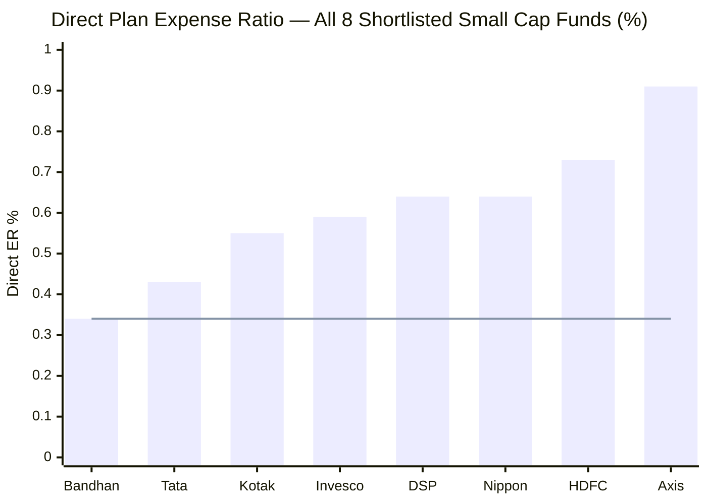
```mermaid
xychart-beta
    title "Direct Plan Expense Ratio — All 8 Shortlisted Small Cap Funds (%)"
    x-axis ["Bandhan", "Tata", "Kotak", "Invesco", "DSP", "Nippon", "HDFC", "Axis"]
    y-axis "Direct ER %" 0 --> 1.0
    bar [0.34, 0.43, 0.55, 0.59, 0.64, 0.64, 0.73, 0.91]
    line [0.34, 0.34, 0.34, 0.34, 0.34, 0.34, 0.34, 0.34]
```
> Line = Bandhan's ER (0.34%). Every other fund sits above it. Bandhan ranks **1st of 8** — the clear, uncontested cost leader.

| Fund | Direct ER | AUM (₹ Cr) | Annual Cost per ₹100 |
|------|-----------|-----------|---------------------|
| **Bandhan Small Cap** | **0.34%** | **25,346** | **₹0.34/year** |
| Tata Small Cap | 0.43% | 11,329 | ₹0.43/year |
| Kotak Small Cap | 0.55% | ~15,000 | ₹0.55/year |
| Invesco Small Cap | 0.59% | 11,038 | ₹0.59/year |
| DSP Small Cap | 0.64% | 17,906 | ₹0.64/year |
| Nippon Small Cap | 0.64% | 72,672 | ₹0.64/year |
| HDFC Small Cap | 0.73% | 38,168 | ₹0.73/year |
| Axis Small Cap | 0.91% | 27,363 | ₹0.91/year |

**The headline number is genuinely excellent and durable.** At 0.34%, an investor keeps 0.30% more of gross return every year vs DSP, 0.25% more vs HDFC, and 0.57% more vs Axis. On a daily-compounding basis over a decade, this compounds to meaningful real-rupee savings (quantified in the simulation section below).

**Why this low ER is possible:** Bandhan AMC inherited the IDFC fund infrastructure with its scale and distribution agreements. The fund was seeded cheaply and kept the ER competitive as AUM grew. At ₹25,346 Cr AUM, even 0.34% generates ~₹86 Cr/year in Direct plan revenue — just enough to fund a lean research operation. This is thin economics: the fund is a low-margin-per-rupee product that depends entirely on AUM scale to remain viable for the AMC. There is an inherent conflict — the AMC *needs* AUM to grow to keep the fund sustainable, which creates pressure to keep inflow gates open even when capacity discipline would argue otherwise.

**The critical caveat — ER only beats a peer when gross returns are equal.** The entire 0.34% advantage over DSP (0.30%/year net) evaporates if DSP generates just 0.30% more annual gross alpha. Given DSP's 20.4% CAGR across multiple cycles including 2018 vs Bandhan's shorter single-bull-market record, that alpha gap is plausible and has precedent. **A cheap fee on an untested-at-scale strategy is not automatically the better deal.**

---

## Cross-Source ER Verification

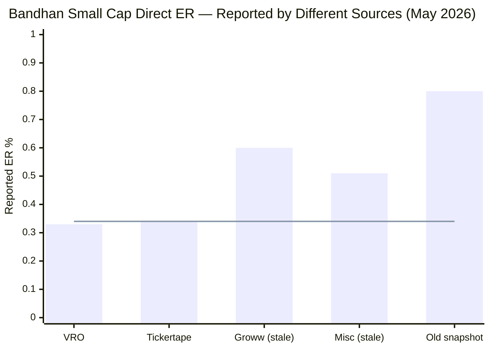
```mermaid
xychart-beta
    title "Bandhan Small Cap Direct ER — Reported by Different Sources (May 2026)"
    x-axis ["VRO", "Tickertape", "Groww (stale)", "Misc (stale)", "Old snapshot"]
    y-axis "Reported ER %" 0 --> 1.0
    bar [0.33, 0.34, 0.60, 0.51, 0.80]
    line [0.34, 0.34, 0.34, 0.34, 0.34]
```
> Line = canonical Direct ER (0.34%). VRO and Tickertape agree; all other figures are stale and rejected.

| Source | Direct ER | Regular ER | Assessment |
|--------|-----------|------------|------------|
| ValueResearch (May 2026) | **0.33%** | **1.37%** | ✅ Canonical — most reliable for both plans |
| Tickertape CSV (May 2026) | **0.34%** | — | ✅ Confirms Direct within rounding |
| MySIPonline | — | **1.37%** | ✅ Confirms Regular plan ER |
| Groww (current fetch) | 0.60% | — | ❌ Stale — rejected |
| Misc internet searches | 0.51% / 0.80% | — | ❌ Prior-period data — rejected |

**This is the opposite of the Invesco precedent.** In Invesco's Module 4, stale data *understated* the true ER (TT showed 0.59% when canonical was 0.66%). Here, stale data *overstates* Bandhan's ER — the truth (0.34%) is even cheaper than several sources suggest. The correct resolution is 0.34% Direct / 1.37% Regular throughout.

---

## SEBI TER Positioning — Modest Discipline

SEBI's 2018 tiered TER circular sets the maximum allowable expense ratio for equity funds by AUM slab. At ₹25,346 Cr AUM, Bandhan's blended ceiling is computed as follows:

| AUM Slab | SEBI Max TER | Bandhan AUM in Slab | Revenue in Slab |
|----------|-------------|---------------------|-----------------|
| First ₹500 Cr | 2.25% | ₹500 Cr | ₹11.25 Cr |
| Next ₹250 Cr | 2.00% | ₹250 Cr | ₹5.00 Cr |
| Next ₹1,250 Cr | 1.75% | ₹1,250 Cr | ₹21.88 Cr |
| Next ₹3,000 Cr | 1.60% | ₹3,000 Cr | ₹48.00 Cr |
| Next ₹5,000 Cr | 1.50% | ₹5,000 Cr | ₹75.00 Cr |
| ₹10,000–15,000 Cr | 1.45% | ₹5,000 Cr | ₹72.50 Cr |
| ₹15,000–20,000 Cr | 1.40% | ₹5,000 Cr | ₹70.00 Cr |
| ₹20,000–25,000 Cr | 1.35% | ₹5,000 Cr | ₹67.50 Cr |
| ₹25,000–25,346 Cr | 1.30% | ₹346 Cr | ₹4.50 Cr |
| **Blended SEBI Max (Regular)** | **~1.48%** | — | — |
| + B30 city incentive | +0.30% | — | — |
| **Effective Ceiling (with B30)** | **~1.78%** | — | — |
| **Bandhan Actual Regular ER** | **1.37%** | — | — |
| **Buffer vs blended max** | **~0.11% below** | Modest — similar to DSP |

Bandhan charges Regular investors 1.37% — approximately 0.11% below the blended SEBI maximum (0.41% below the B30-inclusive ceiling). This is **modest cost discipline** — similar to DSP's positioning, far less impressive than BOI FlexiCap (35% below its ceiling). The AMC is not demonstrating extraordinary restraint on behalf of Regular plan investors.

For Direct plan investors, the framing is more favourable. SEBI sets no separate Direct plan cap — it flows automatically as Regular TER minus distribution commission. At 0.34%, Bandhan's Direct plan is running at a fraction of what the regulation allows. The ~1.03% gap is the distributor's trail commission embedded in the Regular plan.

---

## 10-Year SIP Cost Simulation — The Real Rupee Impact

The most practically important calculation in Module 4. **Methodology:** 18% gross CAGR assumed for all funds (conservative for small cap; consistent with the rest of this study's cross-fund simulations). Net CAGR = 18% − ER. SIP: ₹20,000/month for 10 years (₹24 lakh total principal). *Figures use identical methodology as the DSP and Invesco Module 4 simulations for cross-fund consistency.*

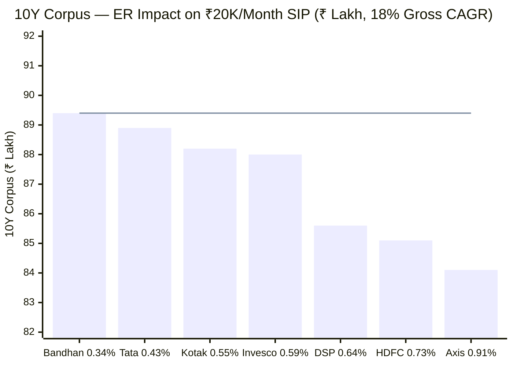
```mermaid
xychart-beta
    title "10Y Corpus — ER Impact on ₹20K/Month SIP (₹ Lakh, 18% Gross CAGR)"
    x-axis ["Bandhan 0.34%", "Tata 0.43%", "Kotak 0.55%", "Invesco 0.59%", "DSP 0.64%", "HDFC 0.73%", "Axis 0.91%"]
    y-axis "10Y Corpus (₹ Lakh)" 82 --> 92
    bar [89.4, 88.9, 88.2, 88.0, 85.6, 85.1, 84.1]
    line [89.4, 89.4, 89.4, 89.4, 89.4, 89.4, 89.4]
```
> Line = Bandhan's 10Y corpus (₹89.4L) — the highest in the shortlist on pure ER. Every other fund sits below it.

| Fund | Direct ER | Net CAGR | 10Y Corpus | vs Bandhan |
|------|-----------|---------|-----------|-----------|
| **Bandhan Small Cap** | **0.34%** | **17.66%** | **₹89.4L** | — |
| Tata Small Cap | 0.43% | 17.57% | ₹88.9L | −₹0.5L |
| Kotak Small Cap | 0.55% | 17.45% | ₹88.2L | −₹1.2L |
| Invesco Small Cap | 0.59% | 17.41% | ₹88.0L | −₹1.4L |
| DSP Small Cap | 0.64% | 17.36% | ₹85.6L | −₹3.8L |
| HDFC Small Cap | 0.73% | 17.27% | ₹85.1L | −₹4.3L |
| Axis Small Cap | 0.91% | 17.09% | ₹84.1L | −₹5.3L |

**On pure ER, Bandhan wins by ₹3.8L over DSP and ₹5.3L over Axis** on a ₹20K/month SIP. These gaps scale proportionally with SIP size — on ₹50K/month the Bandhan-vs-DSP gap becomes ~₹9.5L, the Bandhan-vs-Axis gap ~₹13.3L.

**ER savings at different SIP amounts:**

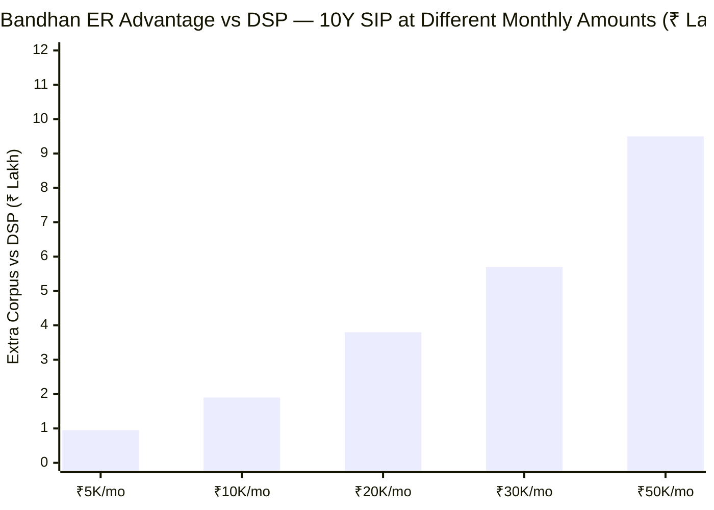
```mermaid
xychart-beta
    title "Bandhan ER Advantage vs DSP — 10Y SIP at Different Monthly Amounts (₹ Lakh)"
    x-axis ["₹5K/mo", "₹10K/mo", "₹20K/mo", "₹30K/mo", "₹50K/mo"]
    y-axis "Extra Corpus vs DSP (₹ Lakh)" 0 --> 12
    bar [0.95, 1.90, 3.80, 5.70, 9.50]
```

| SIP Amount | vs DSP (10Y) | vs Axis (10Y) | vs HDFC (10Y) |
|-----------|-------------|--------------|--------------|
| ₹5,000/mo | +₹0.95L | +₹1.33L | +₹1.08L |
| ₹10,000/mo | +₹1.90L | +₹2.65L | +₹2.15L |
| **₹20,000/mo** | **+₹3.80L** | **+₹5.30L** | **+₹4.30L** |
| ₹30,000/mo | +₹5.70L | +₹7.95L | +₹6.45L |
| ₹50,000/mo | +₹9.50L | +₹13.25L | +₹10.75L |

**The two caveats that decide whether this advantage is real:**

**Caveat 1 — Gross returns are assumed equal, but they are not.** The ₹3.8L Bandhan-over-DSP advantage on a ₹20K SIP evaporates entirely if DSP generates just 0.30% more annual gross alpha. Given DSP's multi-cycle, 20.4%-since-inception pedigree vs Bandhan's single-bull-market record, that gap is plausible. The ER advantage is *conditionally* valuable — conditional on Bandhan matching its peers on gross return, which its track record cannot yet prove.

**Caveat 2 — AUM execution erodes gross return invisibly.** Bandhan's ₹253 Cr position size + 51.96% turnover (the highest in the shortlist) create market-impact friction that does not appear in the stated ER but does appear in NAV outcomes. A 0.34% ER with ~0.22% of hidden friction is closer to a 0.56% true cost. This is still the 2nd cheapest true all-in — but Tata (0.43% ER, lower turnover) now catches Bandhan on total cost despite the higher headline.

---

## Direct vs Regular Plan — The 1.03% Gap (Verified and Corrected)

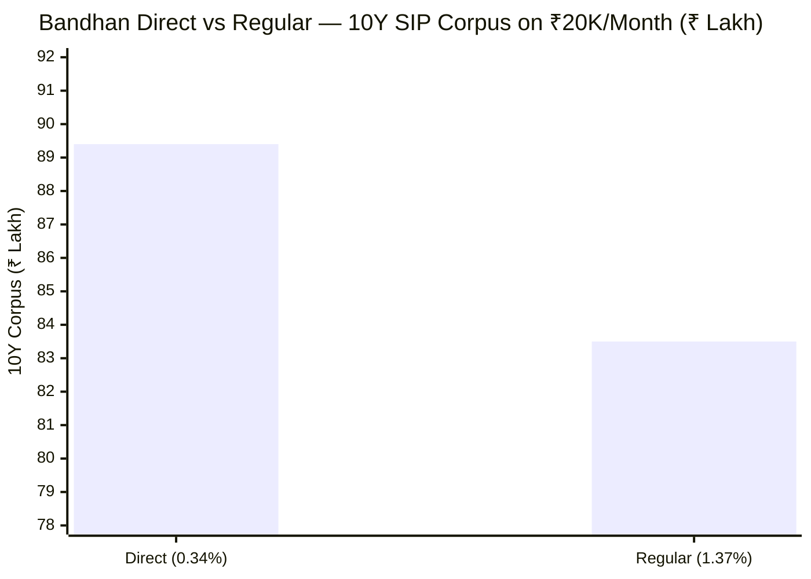
```mermaid
xychart-beta
    title "Bandhan Direct vs Regular — 10Y SIP Corpus on ₹20K/Month (₹ Lakh)"
    x-axis ["Direct (0.34%)", "Regular (1.37%)"]
    y-axis "10Y Corpus (₹ Lakh)" 78 --> 92
    bar [89.4, 83.5]
```

| Plan | ER | Net CAGR | 10Y Corpus | Lost to Distributor |
|------|----|---------|-----------|---------------------|
| **Direct** | **0.34%** | **17.66%** | **₹89.4L** | — |
| Regular | 1.37% | 16.63% | ~₹83.5L | **~₹5.9L** |

**~₹5.9 lakh** — nearly **25% of the ₹24 lakh total principal** — surrendered as distributor commission for choosing Regular over Direct. Same fund. Same 256 stocks. Same Manish Gunwani making every buy and sell decision. Only the purchase channel differs.

**Corrected gap:** Earlier study matrices assumed Bandhan's D-R gap at ~1.41%. The verified Regular ER (1.37%) gives a gap of **1.03%** — tied with DSP, and better than Invesco (1.29%), Tata (1.30%). Bandhan's D-R gap is *moderate*, not the worst in the shortlist.

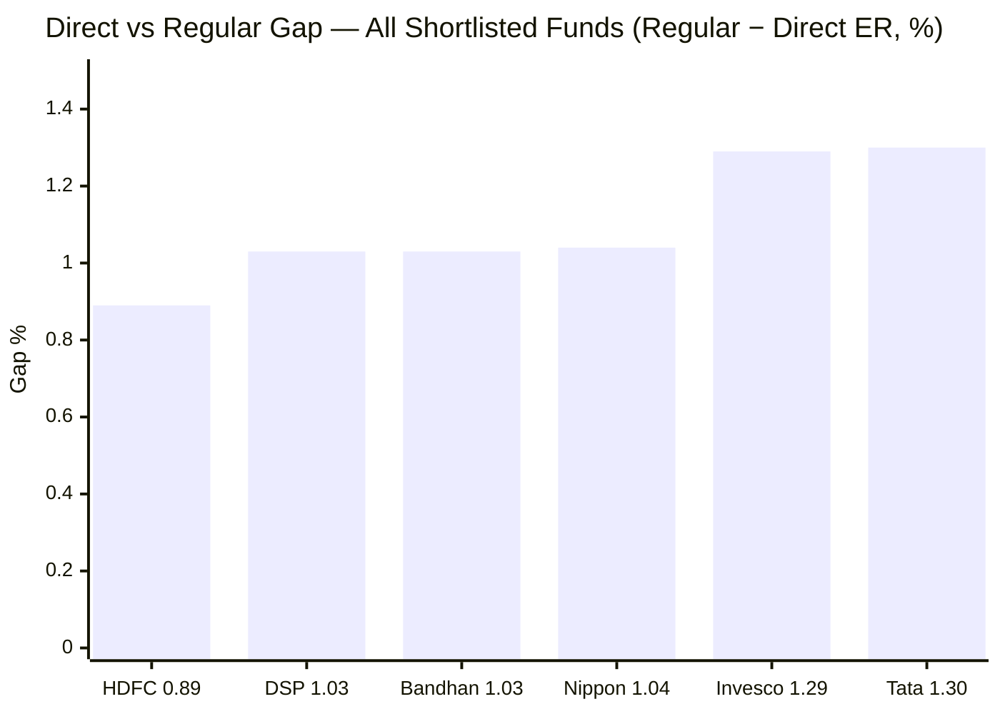
```mermaid
xychart-beta
    title "Direct vs Regular Gap — All Shortlisted Funds (Regular − Direct ER, %)"
    x-axis ["HDFC 0.89", "DSP 1.03", "Bandhan 1.03", "Nippon 1.04", "Invesco 1.29", "Tata 1.30"]
    y-axis "Gap %" 0 --> 1.5
    bar [0.89, 1.03, 1.03, 1.04, 1.29, 1.30]
```

| SIP Amount | Direct Corpus | Regular Corpus | Saved in Direct |
|-----------|--------------|----------------|-----------------|
| ₹10,000/mo | ₹44.7L | ₹41.8L | ₹2.9L |
| **₹20,000/mo** | **₹89.4L** | **₹83.5L** | **₹5.9L** |
| ₹50,000/mo | ₹223.5L | ₹208.8L | ₹14.7L |

**The Bandhan Bank distribution conflict.** Unlike a standalone AMC, Bandhan AMC sits inside the **Bandhan Financial / Bandhan Bank ecosystem** — a bank with a large branch network and a microfinance-to-banking legacy. Bank-branch channels almost universally default customers into Regular Plan: relationship managers earn trail commissions from Regular, not Direct. A customer who walks into a Bandhan Bank branch and buys "the Bandhan small cap fund" without explicitly asking for Direct Plan pays 1.03% extra every year — ironically erasing the very cost advantage that makes this fund attractive.

This is a structural distribution conflict peculiar to bank-subsidiary AMCs: the parent bank's branch staff have a financial incentive to sell the fund's *most expensive* variant.

**How to access Direct Plan correctly:** MF Central, Zerodha Coin, Kuvera, Groww Direct, INDmoney, Paytm Money, or directly at bandhanmutual.com — all zero-commission platforms. If your bank or any advisor recommended this fund, confirm you are in the Direct plan before your next SIP date.

---

## Exit Load — Category Standard, No Differentiation

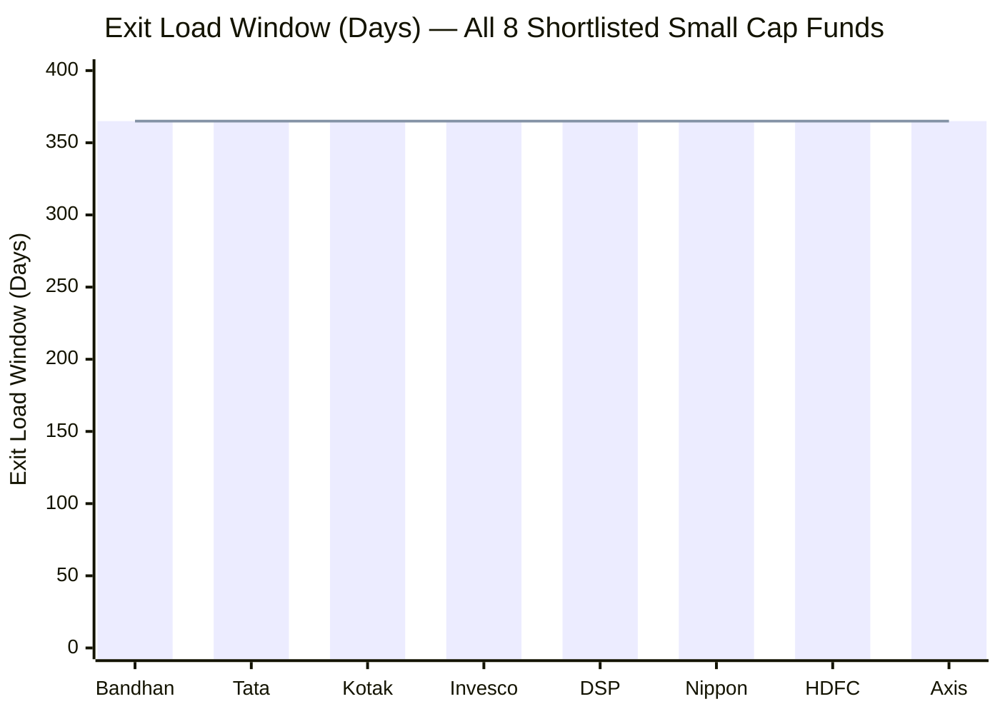
```mermaid
xychart-beta
    title "Exit Load Window (Days) — All 8 Shortlisted Small Cap Funds"
    x-axis ["Bandhan", "Tata", "Kotak", "Invesco", "DSP", "Nippon", "HDFC", "Axis"]
    y-axis "Exit Load Window (Days)" 0 --> 400
    bar [365, 365, 365, 365, 365, 365, 365, 365]
    line [365, 365, 365, 365, 365, 365, 365, 365]
```
> All 8 shortlisted small cap funds use the identical structure. No differentiation here.

**Bandhan's exit load: 1% if redeemed within 365 days; nil thereafter.** This is the market standard across the entire small cap category. For a 10-year SIP investor it is completely irrelevant — every SIP instalment accumulates for years before redemption. Even in an emergency scenario (needing funds 3 months in), the maximum exit load on ₹60,000 of SIP units is ~₹600.

Contrast with PP FlexiCap's 2-year, 2-tier structure (2% Year 1, 1% Year 2) — Bandhan's 1-year window is materially more emergency-friendly.

---

## The AUM Story — The Anti-DSP (Novel Section)

**This is the defining Module 4 finding for Bandhan — and it is the mirror image of DSP's celebrated flow management.**

Where DSP's AUM story is one of *restraint* — three voluntary closures (2014, 2016, 2017–2020) sacrificing fee revenue to protect existing investors from alpha dilution — Bandhan's AUM story is one of **unchecked acceleration during a performance-chasing surge**, with the gates wide open exactly when capacity discipline would argue for restraint.

### The AUM Growth Trajectory

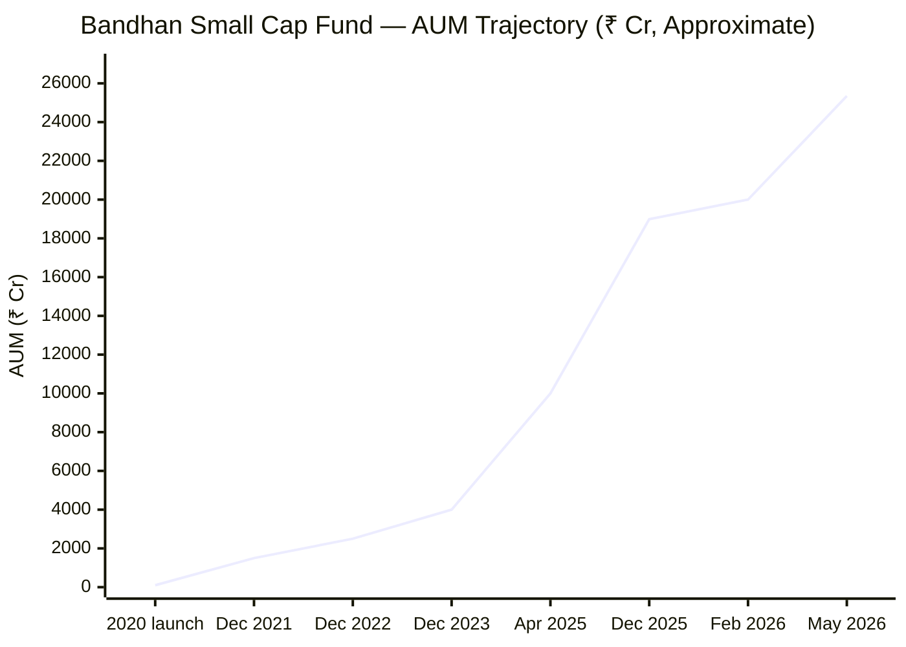
```mermaid
xychart-beta
    title "Bandhan Small Cap Fund — AUM Trajectory (₹ Cr, Approximate)"
    x-axis ["2020 launch", "Dec 2021", "Dec 2022", "Dec 2023", "Apr 2025", "Dec 2025", "Feb 2026", "May 2026"]
    y-axis "AUM (₹ Cr)" 0 --> 27000
    line [100, 1500, 2500, 4000, 10000, 18990, 20000, 25346]
```
> The fund **doubled from ₹10,000 Cr to ₹20,000 Cr in approximately 10 months** (Apr 2025 → Feb 2026), then added a further ₹5,300 Cr by May 2026.

| Date | AUM | Observation |
|------|-----|-------------|
| Feb 2020 (launch) | ~₹100 Cr | Launched into COVID crash; tiny initial scale |
| 2021 | ~₹1,500 Cr | Early organic growth |
| 2022 | ~₹2,500 Cr | Slow growth through bear year |
| 2023 | ~₹4,000 Cr | Steady accumulation |
| **Apr 2025** | **₹10,000 Cr** | Inflection point — category-leading returns attracting flows |
| **Dec 2025** | **₹18,990 Cr** | +90% in 8 months — full performance-chasing surge |
| Feb 2026 | ₹20,000 Cr | **AUM doubled in ~10 months** |
| May 2026 | ₹25,346 Cr | Firmly in constrained ₹20–30K Cr zone |

**Three uncomfortable inferences from this trajectory:**

**1 — The money arrived chasing the returns, not the strategy.** Bandhan posted category-leading 3Y CAGR (30.95%) and 5Y CAGR (23.52%) during a historic small-cap bull run. Retail and distributor flows followed the scorecards. The bulk of today's ₹25,346 Cr AUM has been invested for **less than 18 months at current scale** — these investors have never experienced a meaningful drawdown in this fund at anything approaching current size.

**2 — No demonstrated flow discipline, ever.** Unlike DSP, which closed the fund three separate times (2014, 2016, 2017–2020) to prevent alpha dilution, Bandhan has shown **no public willingness to cap, throttle, or close inflows** even as AUM more than doubled into a stretched small-cap market. No AUM cap has been announced. No SIP throttle is on record. The gates stayed wide open precisely when capacity restraint would serve existing investors. *(If subsequent research surfaces any flow restriction, this section must be updated — as of May 2026 none is on record.)*

**3 — The strategy is being scaled in real time, untested.** The compact ₹4,000 Cr fund with 156 stocks that generated the alpha no longer exists. Today's ₹25,346 Cr vehicle has 256 stocks, ₹253 Cr per 1% position, 13% cash (partly deployment backlog per Module 3), and a turnover pattern (51.96%) that was built for a different AUM regime. Every month that passes, the fund's operating environment diverges further from the one in which its track record was earned.

### DSP vs Bandhan — The Flow Discipline Comparison

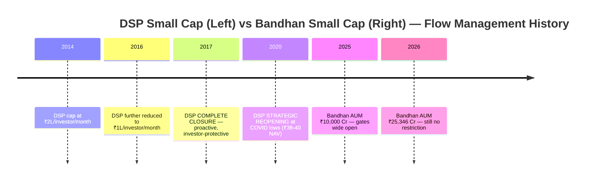
```mermaid
timeline
    title DSP Small Cap (Left) vs Bandhan Small Cap (Right) — Flow Management History
    2014 : DSP cap at ₹2L/investor/month
    2016 : DSP further reduced to ₹1L/investor/month
    2017 : DSP COMPLETE CLOSURE — proactive, investor-protective
    2020 : DSP STRATEGIC REOPENING at COVID lows (₹38-40 NAV)
    2025 : Bandhan AUM ₹10,000 Cr — gates wide open
    2026 : Bandhan AUM ₹25,346 Cr — still no restriction
```

| Dimension | DSP Small Cap | Bandhan Small Cap |
|-----------|--------------|-------------------|
| Voluntary closures | **3** (2014, 2016, 2017) | **0** — none on record |
| Fee revenue sacrificed | Yes — closed for 3 years | No — consistently maximised |
| AUM doubled period | None — managed carefully | ₹10K→₹20K Cr in ~10 months |
| Investor protection signalled | High | Low |
| Hot money entry allowed | Minimal | Substantial |

**DSP's closures are a signal of investment philosophy: existing investors over incremental fee revenue.** Bandhan's open gates are a signal of the opposite priority — or at minimum, a management team that has not yet faced the difficult tradeoffs that scale forces. Either way, the track record of investor-first flow discipline that DSP has demonstrated for a decade simply does not exist at Bandhan.

### AUM Positioning Among the Shortlist

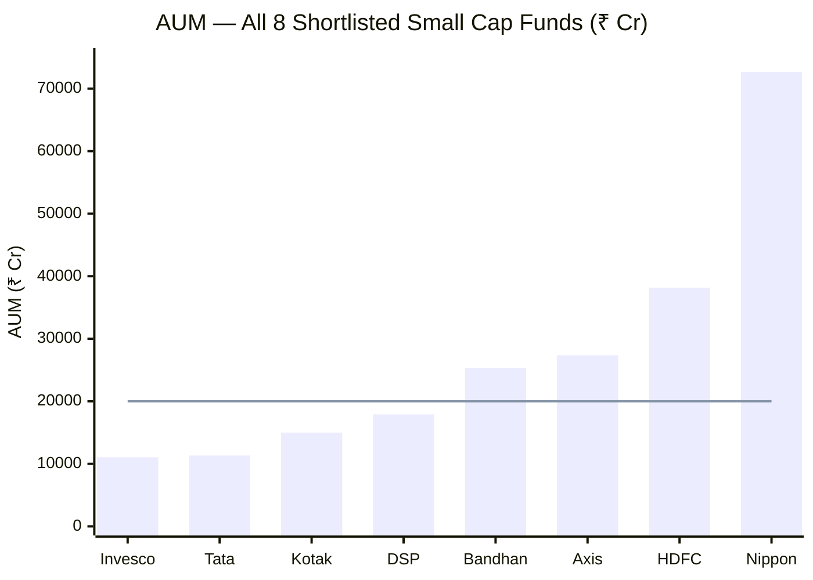
```mermaid
xychart-beta
    title "AUM — All 8 Shortlisted Small Cap Funds (₹ Cr)"
    x-axis ["Invesco", "Tata", "Kotak", "DSP", "Bandhan", "Axis", "HDFC", "Nippon"]
    y-axis "AUM (₹ Cr)" 0 --> 75000
    bar [11038, 11329, 15000, 17906, 25346, 27363, 38168, 72672]
    line [20000, 20000, 20000, 20000, 20000, 20000, 20000, 20000]
```
> Line = ₹20,000 Cr "constrained" threshold. Bandhan (4th of 8) is firmly above it — and the largest of the boutique-quality comparison set.

Bandhan is the **4th largest of the eight** — smaller than Nippon, HDFC, Axis, but larger than DSP, Kotak, Tata, Invesco. More importantly: **it is the largest of the "boutique-quality" comparison set** (DSP ₹17.9K, Invesco ₹11K, Tata ₹11.3K). Among the funds a discerning investor would actually choose between on merit, Bandhan carries the heaviest AUM burden.

---

## AUM Execution Arithmetic — Why ₹25,346 Cr + 51.96% Turnover Is a Cost Trap

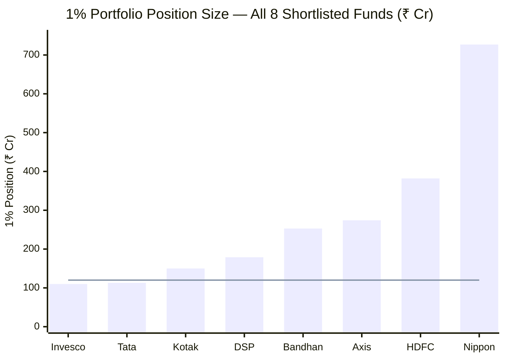
```mermaid
xychart-beta
    title "1% Portfolio Position Size — All 8 Shortlisted Funds (₹ Cr)"
    x-axis ["Invesco", "Tata", "Kotak", "DSP", "Bandhan", "Axis", "HDFC", "Nippon"]
    y-axis "1% Position (₹ Cr)" 0 --> 750
    bar [110, 113, 150, 179, 253, 274, 382, 727]
    line [120, 120, 120, 120, 120, 120, 120, 120]
```
> Line = ~₹120 Cr threshold above which clean small-cap position-building takes 10+ days. Bandhan at ₹253 Cr is well above it.

**At ₹25,346 Cr, a 1% position = ₹253 Cr.** In a typical small cap company (₹3,000 Cr market cap, ~40% free float = ₹1,200 Cr institutionally available, ₹15–30 Cr daily volume), accumulating ₹253 Cr cleanly at a safe 5–10% of daily volume takes **15–25 trading days** — during which the manager's own buying pressure drives the price 3–8% against the thesis. The stock Gunwani identified at ₹100/share may cost ₹106–108 to fully build.

| Shortlisted Fund | AUM | 1% Position | Clean Entry Time | Bandhan vs This Fund |
|------------------|-----|------------|-----------------|---------------------|
| Invesco SC | ₹11,038 Cr | ₹110 Cr | 5–8 days | Bandhan 2.3× larger position |
| Tata SC | ₹11,329 Cr | ₹113 Cr | 5–8 days | Bandhan 2.2× larger |
| Kotak SC | ~₹15,000 Cr | ₹150 Cr | 8–12 days | Bandhan 1.7× larger |
| DSP SC | ₹17,906 Cr | ₹179 Cr | 10–15 days | Bandhan 1.4× larger |
| **Bandhan SC** | **₹25,346 Cr** | **₹253 Cr** | **15–25 days** | — |
| Axis SC | ₹27,363 Cr | ₹274 Cr | 15–25 days | Similar |

**The compounding problem unique to Bandhan:** it combines large AUM (₹253 Cr per position, 4th in shortlist) with **the highest turnover in the shortlist (51.96%)**. DSP manages execution friction by holding for ~5 years (20% turnover) — paying the 15-day market-impact toll once every 5 years per position. Bandhan turns over half its portfolio annually, meaning it pays the same toll **2.5× more often**. The result: Bandhan incurs the highest annual market-impact friction of any of the boutique-quality comparison funds, despite its rock-bottom stated ER.

### The Monthly Forced-Deployment Pressure

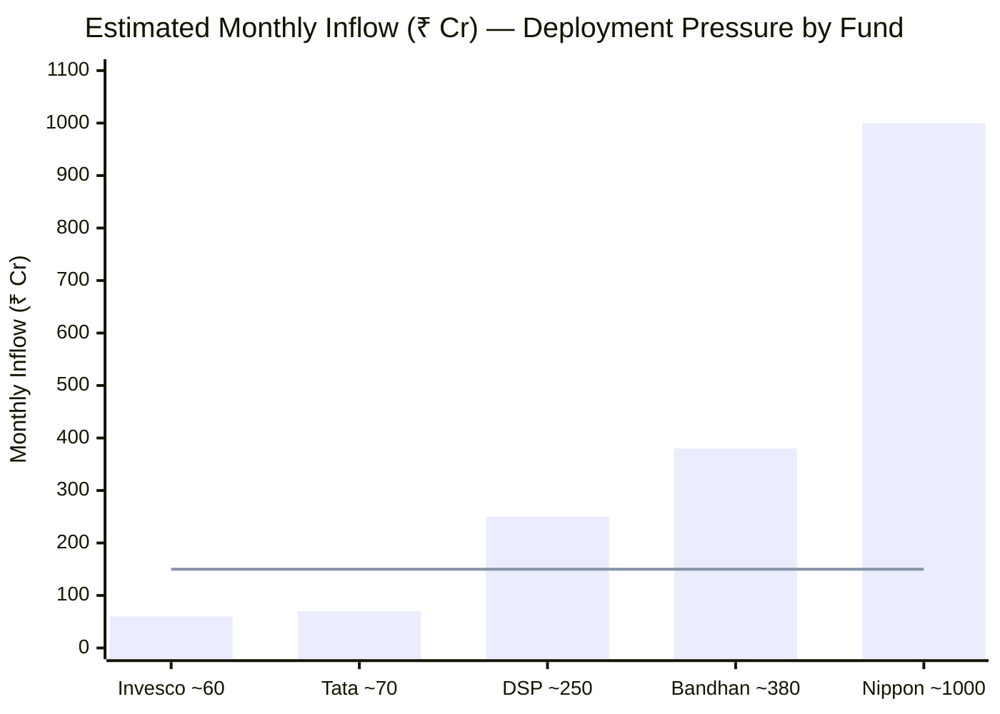
```mermaid
xychart-beta
    title "Estimated Monthly Inflow (₹ Cr) — Deployment Pressure by Fund"
    x-axis ["Invesco ~60", "Tata ~70", "DSP ~250", "Bandhan ~380", "Nippon ~1000"]
    y-axis "Monthly Inflow (₹ Cr)" 0 --> 1100
    bar [60, 70, 250, 380, 1000]
    line [150, 150, 150, 150, 150]
```
> Line = ~₹150 Cr threshold above which deployment becomes demanding. Bandhan (~₹380 Cr/mo) is among the most pressured of the shortlisted funds.

With AUM having doubled in under a year, Bandhan's estimated **~₹380 Cr/month** of inflows must be deployed into a small-cap universe where building one clean 1% position takes ₹253 Cr and 15–25 days. Two implications:

1. **The 13% cash (Module 3) is substantially mechanical, not strategic.** Monthly inflows cannot be deployed as fast as they arrive; the excess queues in TREPS/reverse repos at ~6.5–7% yield. This creates a structural return drag. What appears on screeners as a "defensive cash buffer" is partly a deployment backlog born of AUM scale.

2. **Bandhan is a forced buyer of whatever it can find at pace.** In euphoric periods when quality small caps are stretched on valuation, inflows cannot be paused — they must be deployed eventually. This creates adverse selection pressure on entries.

---

## Portfolio Turnover — The Hidden Cost That Erodes the ER Edge

**At 51.96% annual turnover, Bandhan has the highest portfolio churn of all 8 shortlisted funds.** This creates a structural hidden cost that does not appear in the 0.34% ER but does appear in NAV outcomes.

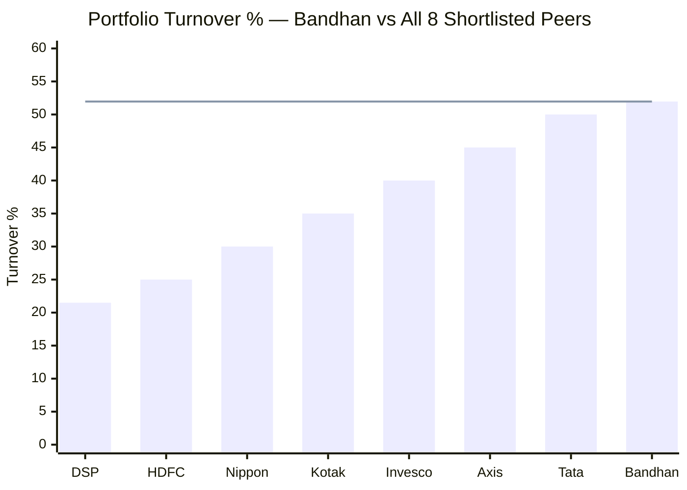
```mermaid
xychart-beta
    title "Portfolio Turnover % — Bandhan vs All 8 Shortlisted Peers"
    x-axis ["DSP", "HDFC", "Nippon", "Kotak", "Invesco", "Axis", "Tata", "Bandhan"]
    y-axis "Turnover %" 0 --> 60
    bar [21.5, 25, 30, 35, 40, 45, 50, 51.96]
    line [51.96, 51.96, 51.96, 51.96, 51.96, 51.96, 51.96, 51.96]
```
> Line = Bandhan's turnover (51.96%) — the highest in the shortlist. DSP's 21.5% is at the opposite end — 2.4× lower.

**The rotation philosophy at work:** Bandhan's portfolio manager appears to run a rotation-oriented strategy — entering undervalued positions and exiting as they re-rate, rather than DSP's buy-and-hold compounding approach. In a small-cap context, this means paying market-impact costs at exit as well as entry, on a portfolio that is half-renewed every two years.

**Market-impact compounding — the core arithmetic:**

| Scenario | Holding Period | Per-Position Round-Trip Cost | Annual Market Impact Cost |
|----------|---------------|------------------------------|--------------------------|
| DSP (20% turnover) | ~5 years | ~5% market impact per trade | **~1% of position/year** |
| Invesco (40% turnover) | ~2.5 years | Same | **~2% of position/year** |
| **Bandhan (52% turnover)** | **~2 years** | **Same** | **~2.5% of position/year** |
| Hypothetical (100% turnover) | ~1 year | Same | **~5% of position/year** |

At ₹253 Cr average position with 52% annual turnover, Bandhan pays market-impact friction at 2.5× the rate of DSP per unit of invested capital. This is the hidden engine eating into the 0.34% cost advantage.

### True All-In Cost — The Edge Survives, but Shrinks

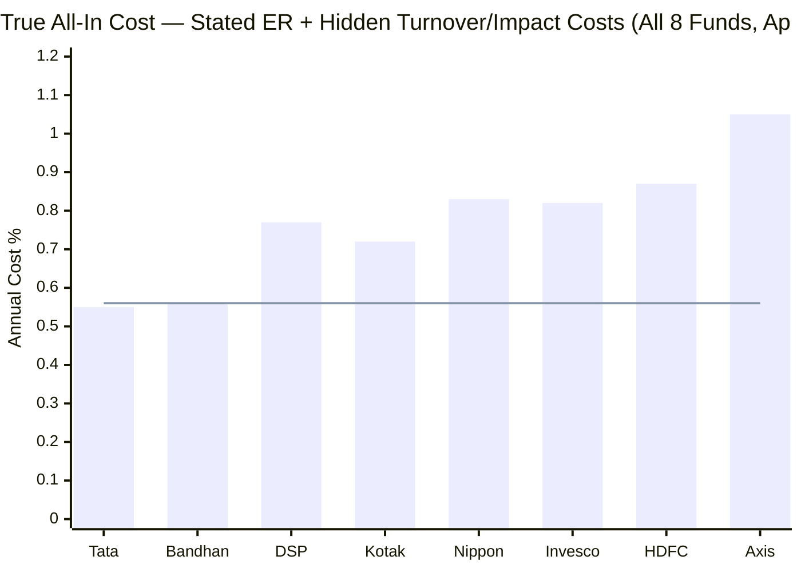
```mermaid
xychart-beta
    title "True All-In Cost — Stated ER + Hidden Turnover/Impact Costs (All 8 Funds, Approximate)"
    x-axis ["Tata", "Bandhan", "DSP", "Kotak", "Nippon", "Invesco", "HDFC", "Axis"]
    y-axis "Annual Cost %" 0 --> 1.2
    bar [0.55, 0.56, 0.77, 0.72, 0.83, 0.82, 0.87, 1.05]
    line [0.56, 0.56, 0.56, 0.56, 0.56, 0.56, 0.56, 0.56]
```
> Line = Bandhan's estimated true all-in cost (~0.56%). Still near the bottom, but Tata (~0.55%) now edges ahead.

| Fund | Stated ER | Hidden Cost (est.) | True All-In | Rank |
|------|-----------|-------------------|-------------|------|
| Tata SC | 0.43% | ~0.12% | **~0.55%** | **1st** |
| **Bandhan SC** | **0.34%** | **~0.22%** | **~0.56%** | **2nd** |
| DSP SC | 0.64% | ~0.13% | ~0.77% | 3rd |
| Kotak SC | 0.55% | ~0.17% | ~0.72% | 4th |
| Invesco SC | 0.59% | ~0.23% | ~0.82% | 5th |
| Nippon SC | 0.64% | ~0.19% | ~0.83% | 6th |
| HDFC SC | 0.73% | ~0.14% | ~0.87% | 7th |
| Axis SC | 0.91% | ~0.14% | ~1.05% | 8th |

**The critical reframing:** on stated ER, Bandhan ranks 1st (0.34%) and Tata ranks 2nd (0.43%). On *true all-in cost*, **Tata overtakes Bandhan** (~0.55% vs ~0.56%) — Tata's lower turnover and smaller AUM mean less market-impact friction, more than compensating for its higher headline ER. Bandhan's hidden cost (~0.22%) is the *highest* hidden component in the shortlist, eating approximately two-thirds of its stated-ER advantage.

The key insight: **Bandhan's ER is a genuine and durable cost advantage, but it is the least "what you see is what you get" ER in the shortlist.** The 0.34% understates total costs more than any peer because the hidden component is the largest.

---

## Manager Attention & Fragmentation (Novel Section)

Manager focus is a Module 4 concern because attention is a finite resource — and for a fund that demands *intensive* execution management (high turnover, large positions, forced monthly deployment), thin attention is a tangible cost-quality risk.

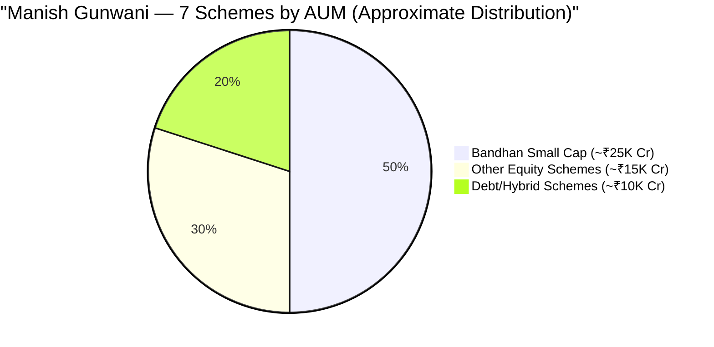
```mermaid
pie title "Manish Gunwani — 7 Schemes by AUM (Approximate Distribution)"
    "Bandhan Small Cap (~₹25K Cr)" : 50
    "Other Equity Schemes (~₹15K Cr)" : 30
    "Debt/Hybrid Schemes (~₹10K Cr)" : 20
```

| Dimension | Bandhan (Gunwani + Jain) | DSP (Sambre) | Invesco (Samant) |
|-----------|--------------------------|--------------|------------------|
| Schemes managed | **7 (Gunwani) + 2 (Jain)** | 3 | 4 |
| Built this fund's track record? | **No — both joined 2023** | Yes | Partially |
| Role | CIO + Head of Equities | Head of Equities + Jt MD | Fund Manager |
| SC fund % of total mandate | Unknown | ~51% | Primary mandate |

**Two Module-4-relevant flags that compound each other:**

**Flag 1 — Gunwani runs 7 schemes, the most of any manager in this entire study.** DSP's Sambre, who is widely praised for the depth of his small-cap research, runs 3 schemes and DSP Small Cap is his primary mandate (~51% of AUM). Gunwani's attention is spread more than twice as thin. For a fund with 256 stocks and 51.96% annual turnover — requiring active monitoring of hundreds of positions and constant execution decisions — fewer research hours per holding is a tangible cost-quality risk.

**Flag 2 — Neither current manager built the track record.** Gunwani became CIO on Jan 28, 2023; Kirthi Jain joined May 2023. The fund launched Feb 25, 2020. The celebrated 2020–2022 alpha — including the anomalously low 24.34% max drawdown, the COVID recovery capture, and the 2022 bear-market resilience — was a *predecessor's* work. (Continuity is fully explored in Module 5; it is flagged here because it directly affects whether the current team's execution philosophy explains the cost profile, or whether the cost profile was inherited.)

---

## AMC Institutional Depth — Mid-Tier, Post-Transition

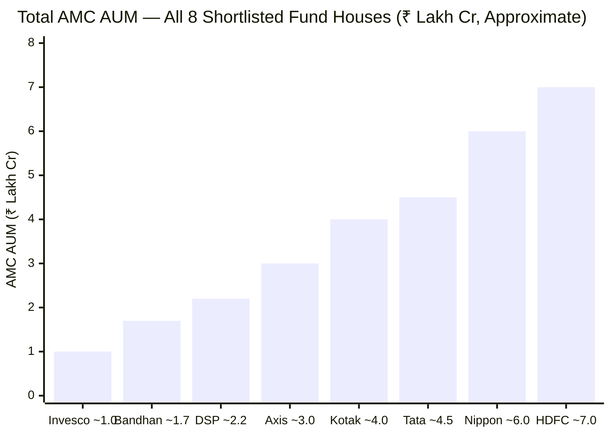
```mermaid
xychart-beta
    title "Total AMC AUM — All 8 Shortlisted Fund Houses (₹ Lakh Cr, Approximate)"
    x-axis ["Invesco ~1.0", "Bandhan ~1.7", "DSP ~2.2", "Axis ~3.0", "Kotak ~4.0", "Tata ~4.5", "Nippon ~6.0", "HDFC ~7.0"]
    y-axis "AMC AUM (₹ Lakh Cr)" 0 --> 8
    bar [1.0, 1.7, 2.2, 3.0, 4.0, 4.5, 6.0, 7.0]
```

**Bandhan AMC: ~₹1.68 L Cr AUM (Dec 2024), ~₹2.0 L Cr estimated now, 65 schemes (14 equity).** A credible mid-tier AMC — larger than Invesco India, smaller than DSP. It inherited IDFC AMC's 25+ years of institutional infrastructure after the 2023 acquisition by the Bandhan Financial / GIC / ChrysCapital consortium. *(The full IDFC→Bandhan transition — regulatory record, governance continuity, Bandhan Bank parent financial health — is covered in Module 6.)*

**Annual fund revenue:**

| Plan | Estimated AUM Split | ER | Annual Revenue |
|------|--------------------|----|---------------|
| Direct Plan (~60% of AUM) | ~₹15,207 Cr | 0.34% | ~₹51.7 Cr |
| Regular Plan (~40% of AUM) | ~₹10,138 Cr | 1.37% | ~₹138.9 Cr |
| **Total Fund Revenue** | **₹25,346 Cr** | **blended ~0.75%** | **~₹190 Cr** |

~₹190 Cr in combined annual revenue is adequate to fund dedicated research support, data subscriptions, and a small team — but the rock-bottom 0.34% Direct ER means the fund runs on thin margins per rupee managed. The AMC's viability in managing this fund profitably depends on sustaining or growing the ₹25,346 Cr AUM — which creates an *institutional incentive* to keep inflow gates open, even when investor interests might argue for throttling. This conflict was visible in the 2025–2026 AUM surge: the fund received its fastest-ever inflows precisely when capacity constraint concerns were highest.

---

## The ER-Turnover Paradox (Novel Section)

Bandhan presents a contradiction unique in this study: it scores at opposite extremes on the two most important cost dimensions simultaneously.

```mermaid
quadrantChart
    title ER vs Turnover — Cost Positioning of All 8 Funds
    x-axis "High Turnover" --> "Low Turnover"
    y-axis "High ER" --> "Low ER"
    quadrant-1 Cheap and Efficient (ideal)
    quadrant-2 Cheap but Churny
    quadrant-3 Expensive and Churny (worst)
    quadrant-4 Expensive but Disciplined
    Bandhan: [0.1, 0.9]
    Tata: [0.2, 0.75]
    DSP: [0.9, 0.45]
    Invesco: [0.35, 0.55]
    Kotak: [0.45, 0.6]
    HDFC: [0.8, 0.4]
    Axis: [0.3, 0.25]
    Nippon: [0.6, 0.45]
```
> Ideal quadrant = top-right (cheap ER, low turnover). Bandhan sits in the top-left: **best ER, worst turnover**. DSP sits in the top-right: cheaper-than-it-looks on total cost, with discipline on both levers. Tata is closest to the ideal.

**Why this paradox exists:** Bandhan's 0.34% ER was set when the fund was small and the AMC needed competitive pricing to attract flows (IDFC era). The turnover reflects the current management's rotation-oriented investment philosophy — a style that generates trading activity regardless of AUM. The two numbers were set by different forces at different times and happen to pull in opposite directions.

**The implication for investors:** the typical screener workflow — sort by ER, pick the cheapest — will always land on Bandhan. But sorting by *total cost efficiency* (ER + turnover + AUM friction) puts Tata ahead of Bandhan and narrows the Bandhan-DSP gap from ₹3.8L to ~₹2.5L on a 10Y ₹20K SIP. Bandhan's headline cost advantage is real; its *total* cost advantage is smaller than the headline implies.

---

## 8-Fund Cost & AUM Comparison Matrix

| Metric | **Bandhan** | DSP | Invesco | Kotak | HDFC | Axis | Tata | Nippon |
|--------|-------------|-----|---------|-------|------|------|------|--------|
| Direct ER | **0.34%** | 0.64% | 0.59% | 0.55% | 0.73% | 0.91% | 0.43% | 0.64% |
| ER Rank (of 8) | **1st** | 5th | 4th | 3rd | 7th | 8th | 2nd | 5th |
| Regular ER | **1.37%** | 1.67% | 1.88% | 1.55% | 1.62% | 1.70% | 1.73% | 1.68% |
| D-R Gap | **1.03%** | 1.03% | 1.29% | 1.00% | 0.89% | 0.79% | 1.30% | 1.04% |
| AUM (₹ Cr) | **25,346** | 17,906 | 11,038 | ~15,000 | 38,168 | 27,363 | 11,329 | 72,672 |
| AUM Rank | **4th** | 5th | 7th | 6th | 2nd | 3rd | 8th | 1st |
| Turnover | **51.96%** | ~20% | ~40% | ~35% | ~25% | ~45% | ~50% | ~30% |
| Turnover Rank | **8th (worst)** | 1st (best) | 6th | 4th | 2nd | 7th | 5th | 3rd |
| True All-In | ~0.56% | ~0.77% | ~0.82% | ~0.72% | ~0.87% | ~1.05% | ~0.55% | ~0.83% |
| True All-In Rank | **2nd** | 3rd | 5th | 4th | 7th | 8th | 1st | 6th |
| 10Y ₹20K SIP Corpus | **₹89.4L** | ₹85.6L | ₹88.0L | ₹88.2L | ₹85.1L | ₹84.1L | ₹88.9L | ₹85.6L |
| Min SIP | ₹100 | ₹100 | ₹1,000 | ₹1,000 | ₹100 | ₹100 | ₹500 | ₹100 |
| Flow Discipline | **None on record** | Closed 3× | Open | Open | Open | Open | Open | Open |
| Fund Manager Schemes | **7 (Gunwani)** | 3 (Sambre) | 4 (Samant) | — | — | — | — | — |
| 1% Position | ₹253 Cr | ₹179 Cr | ₹110 Cr | ₹150 Cr | ₹382 Cr | ₹274 Cr | ₹113 Cr | ₹727 Cr |
| AMC AUM (₹ L Cr) | ~1.7 | ~2.2 | ~1.0 | ~4.0 | ~7.0 | ~3.0 | ~4.5 | ~6.0 |

**Key observations from the matrix:**

1. **Bandhan wins on stated ER (1st) but is overtaken on true all-in (2nd) by Tata** — Tata's lower turnover + smaller AUM means less hidden friction, compensating for its 0.09% higher ER.
2. **Bandhan's ER rank (1st) and turnover rank (8th = worst) are the most polarised pair in the entire study** — no other fund sits at opposite extremes on both cost levers simultaneously.
3. **The D-R gap (1.03%) is far better than the DSP/Invesco matrices assumed** (~1.41% was wrong) — Bandhan ties DSP here.
4. **Tata Small Cap is the unsung cost benchmark.** At 0.43% ER, ~0.55% true all-in, ₹11,329 Cr AUM, it achieves nearly Bandhan's total cost with far less AUM pressure and no flow concerns. Any future module must track Tata as the comparison point, not just DSP.

---

## Points For / Points Against — Cost & AUM

### ✅ Points For Bandhan Small Cap (Cost & AUM)

1. **Cheapest Direct ER of all 8 (0.34%)** — a genuine, daily-compounding, durable advantage; ₹3.8L more than DSP and ₹5.3L more than Axis over a 10Y ₹20K SIP on identical gross returns; scales to ~₹13.3L vs Axis on ₹50K/month.
2. **2nd cheapest on true all-in cost (~0.56%)** despite the highest turnover — the ER base is so low it survives most of the friction; only Tata edges ahead.
3. **Moderate D-R gap (1.03%)** — verified to be tied with DSP; better than Invesco and Tata; a corrected finding that improves Bandhan's relative cost positioning.
4. **₹100 minimum SIP** — excellent accessibility; democratises exposure for small investors.
5. **Standard exit load** (1%/365d) — not punitive; accessible in genuine emergencies after 12 months.
6. **Mid-tier AMC with inherited IDFC infrastructure** (~₹1.68 L Cr, 65 schemes, 25+ year institutional pedigree) — not a boutique startup risk.

### ❌ Points Against Bandhan Small Cap (Cost & AUM)

1. **No flow discipline — AUM doubled in ~10 months** (₹10K Cr Apr 2025 → ₹20K Cr Feb 2026 → ₹25K Cr May 2026); zero public willingness to cap, throttle, or close inflows during a performance-chasing surge; the polar opposite of DSP's investor-first culture.
2. **Highest turnover in the shortlist (51.96%)** — pays the large-AUM market-impact toll 2.5× more often than DSP; the hidden cost (~0.22%) is the largest of any fund in the study, eating two-thirds of the ER advantage.
3. **₹253 Cr per 1% position (4th largest AUM, largest of the boutique-quality set)** — 15–25-day clean-entry windows; effectively excludes genuine micro-caps (₹500–1,500 Cr) where small-cap alpha is concentrated.
4. **~₹380 Cr/month forced deployment** — mechanical root of the 13% cash drag (Module 3); deployment backlog from hot inflows, not tactical positioning.
5. **Gunwani runs 7 schemes — the thinnest manager focus in the study** (2.3× more schemes than DSP's Sambre); for a fund demanding intensive execution, attention fragmentation is a real cost-quality risk.
6. **Neither current manager built the fund's track record** — both joined 2023; the alpha generating the inflows was a predecessor's work; management continuity risk is unresolved (Module 5).
7. **Thin fund economics from rock-bottom ER** — ~₹190 Cr total revenue on ₹25,346 Cr AUM; AMC has structural incentive to keep gates open to maintain AUM, conflicting with investor interest in capacity discipline.
8. **Bank-subsidiary distribution conflict** — Bandhan Bank branches default to Regular Plan; customers buying through the bank network surrender the very ER advantage that makes this fund worth considering.

---

## Module 4 Scorecard

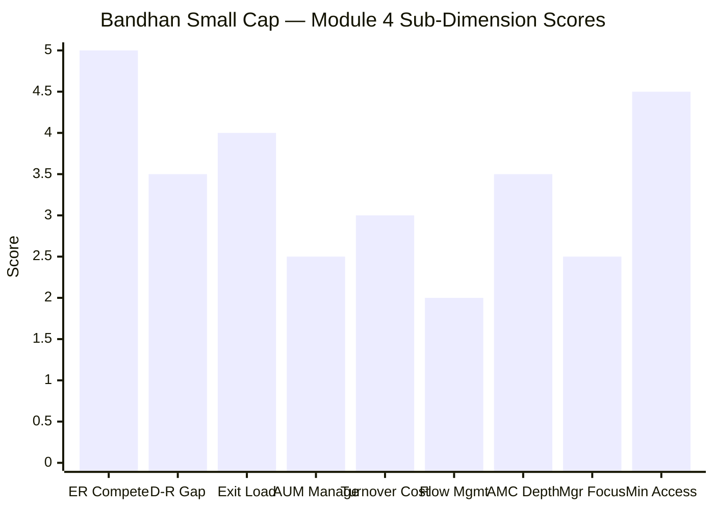
```mermaid
xychart-beta
    title "Bandhan Small Cap — Module 4 Sub-Dimension Scores"
    x-axis ["ER Compete", "D-R Gap", "Exit Load", "AUM Manage", "Turnover Cost", "Flow Mgmt", "AMC Depth", "Mgr Focus", "Min Access"]
    y-axis "Score" 0 --> 5
    bar [5.0, 3.5, 4.0, 2.5, 3.0, 2.0, 3.5, 2.5, 4.5]
```

| Sub-Dimension | Score (1–5) | Reasoning |
|---------------|------------|-----------|
| Expense Ratio Competitiveness | **5.0/5** | Cheapest of all 8 — unambiguous, confirmed across sources; the module's headline strength |
| Direct vs Regular Gap | **3.5/5** | Verified 1.03% gap is moderate and ties DSP; corrected down from the 1.41% assumed in prior matrices |
| Exit Load Structure | **4.0/5** | Standard 1%/365d; matches all 8 peers; accessible in genuine emergencies |
| AUM Manageability | **2.5/5** | ₹25,346 Cr, 4th largest in shortlist, largest of boutique-quality set; constrained zone; AUM doubled in ~10 months |
| Turnover-Adjusted True Cost | **3.0/5** | True all-in ~0.56% still 2nd-best, but highest hidden cost in study; Tata overtakes on total efficiency |
| Flow Management History | **2.0/5** | Worst in the entire study — zero voluntary closures, zero throttles, AUM doubled into a stretched market; the anti-DSP |
| AMC Institutional Depth | **3.5/5** | ~₹1.68 L Cr mid-tier AMC with IDFC heritage; adequate research depth; deductions for bank-distribution conflict and thin fund economics |
| Fund Manager Focus | **2.5/5** | Gunwani runs 7 schemes (most in study); neither current manager built the track record; high-maintenance fund with thin manager attention |
| Minimum Accessibility | **4.5/5** | ₹100 SIP — excellent; one of the most accessible in category |
| **Module 4 Overall** | **3.3 / 5** | Best-in-class ER undermined by worst flow discipline, highest turnover, thinnest manager focus — the ER advantage is real but narrower than the 0.34% headline implies |

---

## Comparative Module 4 Scores

| Fund | Module 4 Score | Key Cost/AUM Differentiator |
|------|---------------|----------------------------|
| BOI FlexiCap | 4.25/5 | Cheap ER + tiny AUM + zero forced deployment + exemplary cost restraint |
| PP FlexiCap | 4.00/5 | Low ER, deep AMC, low turnover, mature flow management |
| **DSP Small Cap** | **3.70/5** | **Best turnover efficiency + unmatched flow discipline + focused management; mid-pack ER** |
| **Bandhan Small Cap** | **3.30/5** | **Best ER in shortlist, but worst flow discipline + highest turnover + thinnest manager focus + nascent AMC transition** |
| Invesco Small Cap | 3.20/5 | Mid-pack ER; IIHL ownership change; moderate turnover; small AUM advantage |

**The verdict in context:** DSP and Bandhan are near-mirror images on cost. DSP charges nearly double the ER (0.64%) but earns a 3.70 score through disciplined flow management, the lowest turnover in the category, and focused management by the manager who built the record. Bandhan charges the lowest ER in the entire shortlist yet lands at 3.30 — because *everything around the cheap fee is structurally weak*. It opened the floodgates during a performance surge. It churns the most. It is run by a CIO stretched across 7 schemes who did not build the record. The cheap ER is genuine and daily; the question Module 4 forces is: **is a low fee on an undisciplined, untested-at-scale, high-friction operation actually the bargain its screener rank implies?**

---

## One-Line Verdict

Bandhan Small Cap is the **cheapest fund to own in the entire shortlist (0.34% ER = 1st of 8) but among the most expensive to run** — highest turnover (51.96%), ₹253 Cr position sizes, ~₹380 Cr/month forced deployment, zero demonstrated flow discipline, and a CIO managing 7 schemes — leaving its headline cost leadership real but materially narrower than the sticker price suggests.

---

## SIP Implication

For a ₹20,000/month Direct Plan investor holding for 10 years:

- **The 0.34% ER saves ₹3.8L vs DSP, ₹5.3L vs Axis** — this is real and permanent if gross returns are equal.
- **But the ~0.22% of hidden turnover friction means the *true* saving vs DSP is closer to ~₹2.5L**, not ₹3.8L.
- **The D-R gap risk is structural** — buy only via Direct on a zero-commission platform (Kuvera, Coin, INDmoney, MF Central); never through a Bandhan Bank branch.
- **The AUM doubling in 2025–26 is the single biggest watch item** — if Bandhan reaches ₹30,000 Cr and still shows no flow discipline, the AUM score drops further; if a voluntary cap is announced, the score improves meaningfully.

---

*Module 4 complete. The cost profile is the module where Bandhan's headline is strongest and its structural execution is weakest — the gap between those two facts defines the investment decision. Module 4 score: 3.3/5.*

*Next: [Module 5 — Fund Manager Quality](module5_manager.md)*
