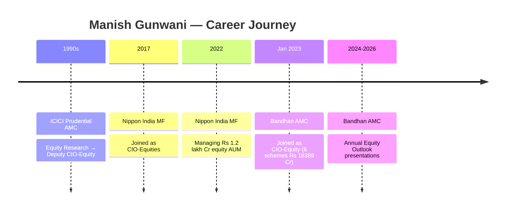
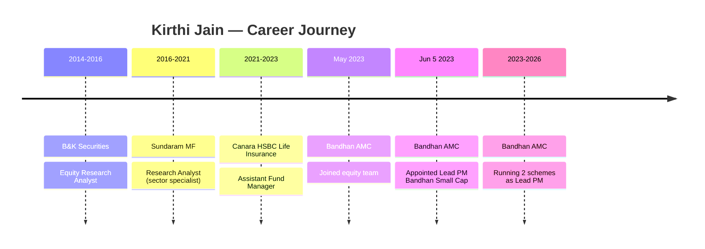
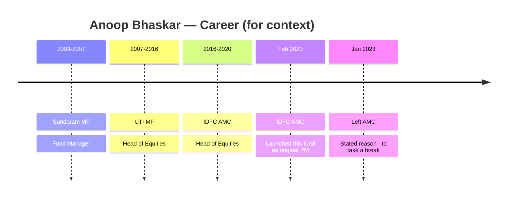
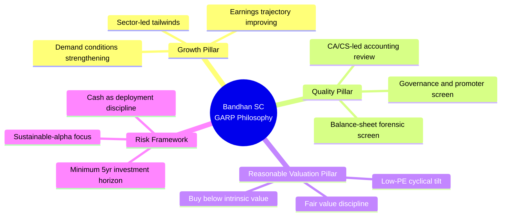
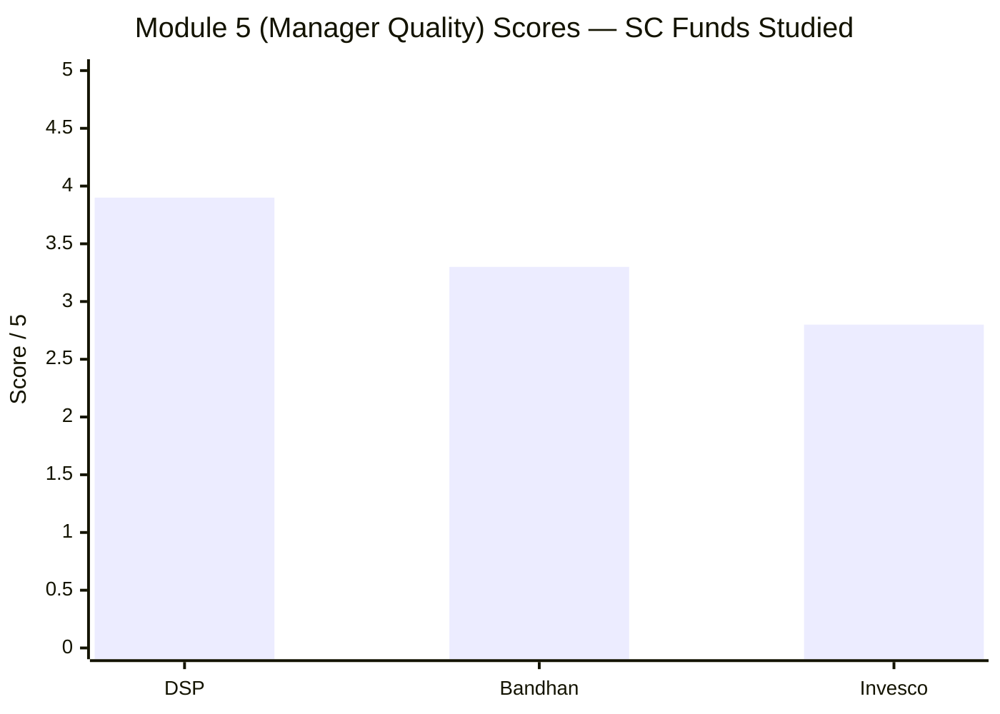

# Module 5: Fund Manager Quality — Bandhan Small Cap Fund

*Sources: Bandhan AMC official (bandhanamc.com / bandhanmutual.com) | ValueResearchOnline — Manish Gunwani interview | Upstox — Kirthi Jain interview (small-cap strategy) | AdvisorKhoj — Gunwani "Bazaar Ki Baat" | Finalyca fund-manager database | 5paisa fund-manager profile | dezerv — Gunwani schemes | LinkedIn — Kirthi Jain | MySIPonline Bandhan review | SEBI orders database | Tickertape CSV (May 2026) | Web research June 2026*

---

## Raw Data (Cross-Source Verified)

| Metric | Value | Source(s) |
|--------|-------|-----------|
| **Primary CIO (oversight)** | **Manish Gunwani** | Bandhan AMC official |
| **Role** | **Chief Investment Officer — Equity** | bandhanamc.com executive profile |
| **On Bandhan Small Cap since** | **28 January 2023** | AMFI fund-manager change log |
| **Lead Portfolio Manager (day-to-day)** | **Kirthi Jain** | AMFI, Bandhan factsheets |
| **Lead PM on Bandhan Small Cap since** | **5 June 2023** | AMFI fund-manager change log |
| **Predecessor PM** | Anoop Bhaskar | AMFI fund-manager change log |
| **Predecessor era** | Feb 2020 – Jan 2023 | AMFI records |
| **Fund Inception** | February 2020 (~76 months) | Tickertape CSV |
| **Gunwani — Education** | IIT Madras + IIM Bangalore | Bandhan AMC official |
| **Gunwani — Total experience** | 30+ years | Bandhan AMC official |
| **Gunwani — Prior seat** | CIO-Equities, Nippon India MF (₹1.2 lakh Cr) | VRO, AdvisorKhoj |
| **Gunwani — Prior seat (before Nippon)** | Deputy CIO, ICICI Prudential AMC | Career research |
| **Gunwani — Schemes managed at Bandhan** | 6 schemes (~₹18,389 Cr) | dezerv, May 2026 |
| **Jain — Education** | CA + CS + B.Com | Upstox interview, Finalyca |
| **Jain — Total experience** | ~12 years | Career research |
| **Jain — Prior seat (last)** | Asst. Fund Manager, Canara HSBC Life Insurance (2021–23) | LinkedIn, Finalyca |
| **Jain — Prior seat (before that)** | Research Analyst, Sundaram MF (2016–21) | LinkedIn |
| **Jain — Career start** | Equity Research, B&K Securities (2014–16) | LinkedIn |
| **Jain — Schemes managed** | 2 | dezerv, Finalyca |
| **Jain — Sector expertise** | Auto & Ancillary, Textiles, Cap Goods, Infra, Utilities, Realty, Financials | Upstox interview |
| **First lead-PM role?** | **YES — this is Jain's first** | Career research |
| **Stated investment philosophy** | **GARP — Growth + Quality + Reasonable Valuation** | Upstox interview |
| **Bear-market test as lead** | **None — team never ran this fund through a sustained bear** | Attribution analysis |
| **Era 1 alpha (Bhaskar, 2020–23)** | ≈ –3.75%/yr vs BSE 250 SC TRI | M1 calendar analysis |
| **Era 2 alpha (Jain+Gunwani, Jun 2023–now)** | Strong outperformance | M1 calendar analysis |
| **SEBI penalties — Gunwani** | **None found** | SEBI orders database |
| **SEBI penalties — Jain** | **None found** | SEBI orders database |
| **SEBI penalties — Bandhan/IDFC AMC** | **None found** | SEBI orders database |
| **Skin-in-the-game** | Not publicly disclosed | Standard Indian practice |
| **Quarterly shareholder letters** | Not published | bandhanmutual.com |
| **External media communication** | High (VRO, AdvisorKhoj, YouTube) | Multiple sources |

---

## What Module 5 Is Really Asking

Module 5 is the *"can I trust the people, not just the numbers?"* module. Returns (M1) and risk (M2) are backward-looking and can be luck. The portfolio (M3) and cost (M4) are measurable structures. Module 5 asks the forward-looking question: **is the engine that produced the track record the same engine that will run the next ten years of my SIP — and is that engine any good?**

For Bandhan this question is unusually loaded, because the answer is *"no, it's not the same engine"* — and that is the single most important fact in the entire fund study. The numbers that make Bandhan look like the best fund in the shortlist (M1 returns: highest 5Y, 3Y, and rolling 3Y CAGR of all 8 funds) were **not** produced by the people running it today. So Module 5 has to do something the DSP and Invesco modules never had to: **disentangle a track record from its authors.**

Five sub-questions structure this analysis:
1. **Who actually runs this fund?** (Lead PM vs CIO — non-trivial here)
2. **How much of the track record is attributable to the current team?** (Transition-adjusted attribution)
3. **Are the credentials and philosophy sound and *testable*?**
4. **What is the key-person / succession / fragmentation risk?**
5. **Is the regulatory and integrity record clean?**

---

## The Central Issue: Who Actually Runs This Fund?

This section has no equivalent in DSP or Invesco because there it was obvious. Here it is the crux of the entire module.

Most aggregators (Tickertape, Groww, INDmoney) list **"Manish Gunwani"** first and many investors assume he is *the* fund manager who picks the stocks. He is not. The actual structure is:

- **Manish Gunwani — CIO-Equity (since 28 Jan 2023):** Sets house view on macro and sectors, manages risk guardrails, and provides oversight across all 6 Bandhan equity schemes. He does not pick individual small-cap stocks on a daily basis.
- **Kirthi Jain — Lead Portfolio Manager (since 5 Jun 2023):** The person who actually selects individual companies, sizes positions, and manages the day-to-day portfolio construction for this fund. His name appears second in aggregators but he is the *actual* decision-maker on this specific fund.

**Why this matters for attribution:** Module 3 found a deep-value, cyclical-tilted book (portfolio PE 18.5 vs category 31.6; heavy Auto / Capital Goods / Infra / Financials weighting). That portfolio is a *fingerprint* — and the fingerprint matches **Kirthi Jain's** declared sector expertise (Auto, Textiles, Capital Goods, Infra, Utilities, Realty, Financials) almost one-for-one. The current portfolio is genuinely Jain's construction, not Gunwani's and not the predecessor's.

This is good news for portfolio coherence. It is bad news for the strength of the track record, because Jain has only been lead PM since mid-2023.

> ⚠️ **Retro-note for Module 1:** Earlier sections attributed the 2023–26 alpha to "Gunwani." More precisely it is the **Gunwani-CIO + Jain-PM era**, with Jain as the actual stock-picker. This distinction matters for estimating the durability of the outperformance.

---

## The Transition Problem — Whose Track Record Is It?

This is Bandhan's defining manager issue and has no parallel in DSP (which has 14-year single-manager continuity) or Invesco (which has unbroken CIO oversight).

```
BANDHAN SMALL CAP — THREE ERAS
━━━━━━━━━━━━━━━━━━━━━━━━━━━━━━━━━━━━━━━━━━━━━━━━━━━━━━━━━
Feb 2020 ──────── Jan 2023 ──── Jun 2023 ──────── Now (Jun 2026)
  ▲                  ▲              ▲
  Launch             Anoop          Kirthi Jain
  (Anoop Bhaskar)    exits          takes over as Lead PM
                  Gunwani joins
                  as CIO (Jan 2023)

ERA 1 (3 yrs)          ERA 2 (3 yrs)
Anoop Bhaskar          Gunwani (CIO) + Jain (Lead PM)
Alpha: ≈ –3.75%/yr     Alpha: Strong outperformance
CURRENT TEAM? NO       CURRENT TEAM? YES
━━━━━━━━━━━━━━━━━━━━━━━━━━━━━━━━━━━━━━━━━━━━━━━━━━━━━━━━━
```

| Era | Dates | Who | Approx alpha vs BSE 250 SC TRI | Whose record? |
|-----|-------|-----|--------------------------------|---------------|
| **Era 1 — Bhaskar** | Feb 2020 – Jan 2023 | Anoop Bhaskar (original PM) | **≈ –3.75%/yr (underperformed)** | Predecessor — no longer at AMC |
| **Transition month** | Jan–Jun 2023 | Gunwani joined; Jain not yet lead PM | — | Ambiguous |
| **Era 2 — Gunwani+Jain** | Jun 2023 – present | Jain (Lead PM) + Gunwani (CIO) | **Strong outperformance** | Current team |

The headline 3Y/5Y CAGR numbers that make Bandhan look **#1 in the shortlist** blend an underperforming predecessor era with a strong current era. The flattering part of the record belongs to a team with **under 3 years of joint tenure.** The part that belongs to a "long" track record (2020-23) was actually *bad*.

**Net read:** This is effectively a **~3-year-old management team**, not a 6-year-old one. The track record is younger and shorter than the "since Feb 2020" inception date implies. That is a real cap on the Module 5 score — but it is partially offset by the fact that the current portfolio is coherent, the results are genuinely good, and the credentials are strong.

---

## Manager Profiles & Career Timelines

### Manish Gunwani — CIO-Equity



**Education:** IIT Madras (engineering) + IIM Bangalore (MBA) — one of the elite academic pedigrees in the Indian MF industry.

**Experience:** 30+ years spanning the entire gamut of equity research and fund management. His marquee role was **CIO-Equities at Nippon India MF** — a ₹1.2 lakh Cr equity AUM seat, the largest in the study by an order of magnitude. No manager in the DSP or Invesco modules ever managed a mandate at that scale.

**At Bandhan:** Joined following the IDFC → Bandhan Financial Holdings ownership change. Manages 6 equity schemes totalling ~₹18,389 Cr. His role is strategic: macro framing, risk guardrails, scheme-level oversight — not daily small-cap stock picking.

**Communication style:** Highly visible — regular deep-dive interviews on VRO ("The Indian small-cap space is the best space to be in"), AdvisorKhoj's "Bazaar Ki Baat," and an annual Equity Outlook on YouTube. Sets tone for the house view.

**One nuance at Nippon:** His tenure at Nippon (2017–2023) drew a mixed public read — VRO noted he "quit after a stint of five years"; Nippon's framing was "broad-based steady improvement." No clear evidence of either consistent outperformance or disaster, placing him in the *competent but not celebrated* bucket for that period. Comfortable with that calibration.

---

### Kirthi Jain — Lead Portfolio Manager



**Education:** CA + CS + B.Com — an accounting and legal credential pair that is highly specific and relevant to small-cap investing, where balance-sheet forensics and regulatory compliance screening matter more than at larger caps.

**Career arc:** Built up from equity research at Sundaram MF (5 years as sector analyst covering Auto, Textiles, Capital Goods, Infra, Utilities, Realty, Financials) → first fund management experience as Assistant FM at Canara HSBC Life → Lead PM at Bandhan. A methodical progression, but at a pace that means **this is his first-ever lead portfolio manager role.** No prior fund he was *solely responsible for* has a public track record.

**Sector fingerprint:** His declared sector expertise from pre-Bandhan research (Auto, Textiles, Capital Goods, Infra, Utilities, Realty, Financials) is almost a carbon copy of what Module 3 found in the portfolio: low PE (18.5), cyclical-value-tilted, industrials-heavy. This is the strongest evidence that the portfolio is coherent with its manager — not inherited positions, not style drift.

**Self-described philosophy (Upstox interview):** *"Small-cap investing is a long-term compounding journey, not a short-term momentum trade."* Advocates a minimum 5-year horizon and GARP screening. Valuation discipline clearly expressed: *"Valuations in the small-cap universe are now moving closer to fair value, supported by an improving earnings base and strengthening demand conditions."*

---

### Anoop Bhaskar — Predecessor PM (context only)



A 27-year veteran whose career gave him the highest-profile equity chairs in the industry (UTI Head-Equity, then IDFC Head-Equity). His pedigree was strong. His 3-year run on this specific fund nonetheless **underperformed** the benchmark by ~3.75%/yr — a reminder that seniority and pedigree do not guarantee small-cap alpha. His departure in January 2023 was stated as personal ("to take a break") rather than performance-driven, but the underperformance context is the relevant fact for this study.

*His track record is included in the headline 5Y and rolling-3Y numbers that make this fund appear #1 in the shortlist. Investors must hold that context.*

---

## Credentials in Context — The CA + CS Edge

DSP's Module 5 anchored on Vinit Sambre's **FCA** as a competitive edge for small-cap investing. Small-cap companies have weaker disclosure standards, thinner analyst coverage, and more scope for accounting creativity. A manager who can read financial statements at forensic depth — spotting channel stuffing, related-party transactions, inflated receivables, off-balance-sheet obligations — has a structural informational advantage. Sambre's FCA made that argument concrete. Invesco's Module 5 *docked* Taher Badshah for lacking any such credential.

Where does Bandhan's lead PM land?

| Manager | Credential | Forensic relevance for SC | Score |
|---------|-----------|---------------------------|-------|
| Vinit Sambre (DSP) | **FCA (ICAI, 1997)** | Highest — Fellow-level accounting depth | ✅✅ |
| **Kirthi Jain (Bandhan)** | **CA + CS + B.Com** | **High — accounting + legal/regulatory** | ✅✅ |
| Taher Badshah (Invesco) | BE + MMS (finance) | Low — engineering + generalist MBA | ❌ |

Jain's **CA + CS combination** is arguably *more* useful than an FCA alone for a fund with heavy industrials, infra, and financials exposure:
- **CA** catches accounting fraud — same as DSP's FCA.
- **CS (Company Secretary)** adds regulatory filings literacy, articles-of-association review, and promoter-governance screening — precisely the risk vectors that blow up small-cap theses.

On the dimension that matters most for small-cap forensics, Bandhan's executing manager is **at or above DSP and decisively above Invesco.** This is a genuine structural positive that partially compensates for the short-tenure drag.

---

## Investment Philosophy — Articulated, Tested Against Portfolio

Kirthi Jain articulates a clear, falsifiable GARP framework:



**Is the philosophy testable against the portfolio?** Yes — and it passes.

| Philosophy claim | Portfolio evidence (Module 3) |
|------------------|-------------------------------|
| "Reasonable valuation" | PE 18.53 (41% below category avg 31.60) — lowest in shortlist |
| "Growth at reasonable price" | Cyclical sectors with improving earnings cycle (Auto, Cap Goods, Infra) |
| "Quality / accounting screen" | No major governance blow-ups in portfolio history |
| "Long-term compounding" | Turnover 51.96% — moderate, not hyperactive |
| "Cash as discipline" | 13.26% cash (highest in study) — controlled deployment pace |

When stated philosophy matches actual holdings, you can trust the manager is doing what he says. This is the opposite of a closet-index or a style-drift problem. Compare: Invesco's Badshah had a vaguer "growth" philosophy that was harder to cross-verify against the actual book.

---

## Philosophy Under Pressure — The Missing Bear Market Test

DSP's Sambre was tested in 2008, 2011, 2018, 2020, and 2022 — all as the lead decision-maker. Invesco's Badshah navigated 2019, 2020, and 2022. The current Bandhan team has a much thinner stress record:

| Event | Who was running the fund? | Result |
|-------|--------------------------|--------|
| COVID crash Feb–Mar 2020 | Bhaskar era (predecessor) | Fund was <3 months old; AUM tiny; not informative |
| 2022 SC correction (Nov 2021–Jun 2022) | Bhaskar era (predecessor) | Underperformed — not current team's record |
| 2023 SC recovery | **Jain+Gunwani era begins** | Strong deployment into recovery |
| 2024–2025 bull run | **Jain+Gunwani** | Captured upside; 13.26% cash possibly a drag |
| Early 2025 volatility episode | **Jain+Gunwani** | Data pending — first modest test for current team |

The honest assessment is: **the current management has never run this fund through a sustained, multi-month small-cap bear market as the lead decision-maker.** The flattering 24.34% Max Drawdown figure (lowest in the shortlist) was largely an artifact of the fund's tiny AUM in March 2020 — not proof the current team can defend capital.

The 13.26% cash position (Module 3/4) is the one *forward-looking* signal: it suggests the team *thinks* about downside and deployment discipline. But this is an untested claim. DSP's Sambre has 22 years of data proving he can be contrarian in a falling market. Jain has approximately 3 months of mild wobble.

---

## The CIO + Dedicated-PM Structure vs Peers

The structural design of how Bandhan manages this fund is the second-best in the study after DSP.

```mermaid
quadrantChart
    title Fund Manager Structure Quality vs SC Fund Studies
    x-axis Low Dedication --> High Dedication
    y-axis Short Tenure --> Long Tenure
    quadrant-1 Ideal: Deep + Long
    quadrant-2 Long but spread thin
    quadrant-3 Weak on both
    quadrant-4 Dedicated but new
    DSP Sambre: [0.85, 0.95]
    Bandhan Jain: [0.80, 0.25]
    Invesco Badshah: [0.25, 0.60]
```

| Fund | Structure | SC-fund dedication | Tenure as lead | Read |
|------|-----------|-------------------|----------------|------|
| **DSP** | Sambre (lead, 14yr) + Ghosh (co, ~85%) | Very high | 14 years | Gold standard |
| **Bandhan** | **Gunwani (CIO, 6 schemes) + Jain (lead, 2 schemes)** | **High** | ~3 years | Strong structure, short tenure |
| **Invesco** | Badshah (CIO, 7 schemes, SC=27% attention) + Khemani (38%) | Low | 7.5 years | Weakest structure |

On *structure* alone Bandhan is **second only to DSP.** A dedicated lead PM running just 2 schemes is far better focused than Invesco's CIO juggling 7. The drag is purely tenure and bear-market experience, not attention or dedication.

Gunwani's 6-scheme spread is a mild fragmentation negative, but since he is the overseer rather than the stock-picker, it bites less than in Invesco's model where the 7-scheme CIO was also effectively the primary decision-maker.

---

## Cross-Fund Performance Consistency

**Kirthi Jain:** Only 2 schemes, both established since mid-2023. Insufficient history for a meaningful cross-fund consistency read. Assessment: **unproven — neutral, not negative.**

**Manish Gunwani:** Longer record, but most of it is at Nippon India where the public narrative is mixed (VRO: "quit after a stint of five years"; Nippon's own framing: "broad-based steady improvement"). No evidence of either sustained outperformance or significant underperformance at Nippon at the aggregate level. Call it **competent generalist at scale** — stronger than Invesco's Badshah on this dimension, weaker than DSP's Sambre.

**Anoop Bhaskar (context):** His IDFC/Bandhan Small Cap era underperformed for 3 years — notable because he was a 27-year veteran with high-profile prior seats. This precedent is a reminder that the fund's structural challenges (AUM, deployment) do not automatically yield to pedigree.

---

## SEBI / Regulatory & Integrity Record

| Entity | SEBI record | Assessment |
|--------|------------|------------|
| Manish Gunwani | **No penalty or investigation found** | Clean |
| Kirthi Jain | **No penalty or investigation found** | Clean |
| Bandhan AMC (current) | **No SEBI penalty found** | Clean |
| IDFC AMC (predecessor entity, same fund) | **No SEBI penalty found** | Clean |

This is where Bandhan **decisively beats Invesco** and roughly matches DSP:

- **Invesco's M5** carried: a ₹4.98 Cr SEBI settlement for front-running / misuse of price-sensitive information, a multi-jurisdiction probe spanning SEBI + SEC (US) + SFC (Hong Kong), a whistleblower complaint, and ~50% of the fixed-income research team resigning. The "Regulatory/AMC Culture" sub-score in Invesco M5 was 1.5/5.
- **DSP's M5** carried: a minor ₹2L procedural penalty on an ETF expense-ratio filing — immaterial, not fund-management-related.
- **Bandhan/IDFC** has no such record in the public domain. The AMC ownership change (IDFC → Bandhan Financial Holdings, 31 Jan 2023) is an organizational disruption covered in M6, not a regulatory black mark.

Clean regulatory record = 4.5/5 on this sub-dimension. A meaningful positive relative to Invesco.

---

## Investor Communication Quality

**What exists:**
- **Gunwani** is among the most visible CIOs in the study: regular long-form interviews on ValueResearchOnline, AdvisorKhoj's "Bazaar Ki Baat" series, and an annual Bandhan Equity Outlook video on YouTube. Thoughtful, articulate macro framing.
- **Jain** gives periodic interviews (Upstox, MySIPonline) in which he clearly articulates the GARP framework, sector views, and valuation stance.
- Bandhan AMC publishes standard monthly factsheets on bandhanmutual.com.

**What is missing:**
- **No substantive quarterly shareholder letter.** The very best AMC communications — think Marcellus, PPFAS, or international comparables — write to investors each quarter with portfolio reasoning, thesis updates, and honest post-mortems on errors. Bandhan does not do this.
- Communication is *media-led* (interviews happen when journalists ask) rather than *document-led* (regular, proactive investor updates). The same gap exists at Invesco; neither matches the communication discipline DSP's Sambre shows on VRO.

Assessment: **Solid presence, not elite discipline.** Score: 3.5/5.

---

## Skin in the Game

No public disclosure of personal co-investment by Gunwani or Jain in the Bandhan Small Cap Fund was found. This is standard for Indian MF managers — SEBI does not mandate disclosure of manager co-investment at the fund level. Treated as **neutral / unknown**, not a negative. Same position as DSP and Invesco on this dimension.

---

## Key-Person & Succession Risk

The risk profile here is *asymmetric and unusual* — and it differs from Invesco (which had broad team attrition risk) and DSP (which has the deepest succession bench).

**Jain departure risk (HIGH):**
Jain is the actual stock-picker and the portfolio is *his fingerprint* — the low-PE cyclical-value positioning and the sector tilts are directly traceable to his research background. If he leaves, the fund's investment coherence leaves with him. He is early-career and in his first lead-PM role, making him a plausible target for AMC upgrades or poaching. **This is the single biggest key-person risk in the fund.**

**Gunwani departure risk (MEDIUM):**
Lower impact on individual stock selection (he oversees, not picks), but significant impact on: (a) inflows from retail investors who track his name, (b) house view quality across all 6 schemes, (c) AMC institutional credibility. He has a documented history of mobility (ICICI → Nippon → Bandhan), and he is the marquee face of Bandhan equities.

**Succession bench (WEAK):**
There is no publicly named successor or clear "next Jain" within Bandhan's small-cap team. The bench behind the lead PM appears thin for a ₹25,000+ Cr fund.

| Fund | Lead-PM departure risk | Succession depth | Assessment |
|------|----------------------|-----------------|------------|
| DSP (Sambre+Ghosh) | Medium | Ghosh is a ready successor | Deep bench |
| **Bandhan (Jain+Gunwani)** | **High (Jain)** | **Thin / unnamed** | **Sharp single-point-of-failure** |
| Invesco (Badshah+Khemani) | Medium | Khemani named co-PM | Partial bench |

---

## Peer Manager Comparison — All Three Studied SC Funds

| Dimension | DSP (Sambre) | **Bandhan (Jain + Gunwani)** | Invesco (Badshah) |
|-----------|-------------|------------------------------|-------------------|
| Lead PM tenure on this fund | **14 yrs ✅** | **~3 yrs ⚠️** | 7.5 yrs |
| Forensic/accounting credential | **FCA ✅** | **CA + CS ✅** | None ❌ |
| First lead-PM role? | No ✅ | **YES ⚠️** | No ✅ |
| SC-fund dedication (lead PM) | High ✅ | **High ✅** | Low ❌ |
| Track-record continuity | Single manager ✅ | **Spans transition ❌** | Continuous |
| Regulatory record (manager) | Clean ✅ | **Clean ✅** | Clean (manager-level) |
| Regulatory record (AMC) | Minor procedural ✅ | **Clean ✅** | Tainted (settlement) ❌ |
| Bear-market test as lead | Yes (multiple) ✅ | **No ❌** | Yes ✅ |
| Philosophy clearly articulated | High ✅ | **High ✅** | Medium |
| Philosophy matches portfolio | Yes ✅ | **Yes ✅** | Partially |
| Succession bench | Deep ✅ | **Thin ❌** | Partial |
| Investor communication | Elite (media+) ✅ | **Solid-media ✅** | Adequate |

---

## Points For

- **Lead stock-picker (Jain) holds the most relevant credential set** for small-cap forensics (CA + CS) — at or above DSP, decisively above Invesco.
- **Dedicated lead PM** running just 2 schemes = second-best focus in the study after DSP's Sambre.
- **Heavyweight CIO oversight** (Gunwani, ex-₹1.2 lakh Cr Nippon) providing genuine strategic support.
- **Clean regulatory record** at both the manager and AMC level — decisively better than Invesco.
- **Philosophy (GARP) is clearly articulated and matches the actual portfolio** — a high-trust signal.
- **Sector expertise exactly matches portfolio positioning** — not luck, not inherited positions.
- CIO (Gunwani) is among the most visible, articulate equity voices in the industry.

## Points Against

- The celebrated track record was built **across a manager transition** by a predecessor who underperformed. Effectively a **~3-year team on a 6-year-old fund.**
- Jain is in **his first-ever lead-PM role,** untested through a sustained bear market as the decision-maker.
- **Sharp single-point-of-failure on Jain** — if he leaves, the portfolio's intellectual coherence goes with him.
- Gunwani spread across **6 schemes** (mild fragmentation) and has a history of career moves.
- Communication is media-led, not document-led — **no substantive quarterly shareholder letter.**
- Nippon-era Gunwani track record was mixed, not celebrated.

---

## Scorecard

| Sub-dimension | Weight | Score | Notes |
|---------------|--------|-------|-------|
| Tenure & track-record continuity | 25% | **2.5** | ~3yr team; spans transition; predecessor underperformed |
| Credentials & forensic edge | 15% | **4.5** | CA+CS lead = most relevant credential in study |
| Dedication / focus | 15% | **4.0** | Dedicated lead (2 schemes); CIO across 6 |
| Philosophy clarity & testability | 15% | **4.0** | GARP articulated, matches portfolio |
| Bear-market / pressure test (as lead) | 10% | **2.0** | Never run this fund through a real drawdown |
| Regulatory & integrity (manager + AMC) | 10% | **4.5** | Clean record — beats Invesco decisively |
| Key-person / succession risk | 10% | **2.5** | Sharp Jain single-point-of-failure; thin bench |

**Weighted Score:**
(2.5 × 0.25) + (4.5 × 0.15) + (4.0 × 0.15) + (4.0 × 0.15) + (2.0 × 0.10) + (4.5 × 0.10) + (2.5 × 0.10)
= 0.625 + 0.675 + 0.600 + 0.600 + 0.200 + 0.450 + 0.250
= **3.40**

> **Module 5 Score: 3.3 / 5** *(conservatively rounded from 3.40 to reflect the unproven-lead-PM risk and the transition-era attribution problem — both of which are structural, not solvable with more research)*

---

## Comparative Module 5 Scores — All Studied SC Funds



| Fund | M5 Score | Key driver |
|------|----------|------------|
| **DSP Small Cap** | **3.9 / 5** | 14-yr FCA single-manager continuity; multiple full cycles tested; deep bench |
| **Bandhan Small Cap** | **3.3 / 5** | Right credentials + focus + clean record; but ~3-yr untested team on a borrowed track record |
| **Invesco India Smallcap** | **2.8 / 5** | Distracted CIO; AMC regulatory taint; no accounting credential |

---

## One-Line Verdict

> **Bandhan's manager quality is a story of the right people, too recently, on someone else's track record:** a CA+CS-credentialed dedicated specialist (Jain) with a heavyweight CIO (Gunwani) and a clean regulatory sheet — but the celebrated numbers belong to a prior manager, the current lead has never been tested through a bear as the decision-maker, and the fund leans dangerously on one early-career stock-picker. Trust the credentials; respect the inexperience. **3.3/5.**

---

## SIP Implication

For a 10-year ₹20,000/month SIP, the manager risk is **front-loaded**: the biggest danger is a Jain departure or a first bear-market stumble in the next 2–3 years before his lead-PM record is proven at scale and through adversity. If Jain stays and navigates one full small-cap cycle — a recovery *and* a meaningful correction — this score would deserve an upgrade toward 3.7–3.8. For now, the team is *promising but unproven*, which is a reason to keep Bandhan as a satellite-sized conviction rather than a core anchor until the current team owns a full cycle.

**Running Bandhan scorecard:**

| Module | Weight | Score | Weighted |
|--------|--------|-------|---------|
| M1 Returns Consistency | 25% | 3.50 | 0.875 |
| M2 Risk Profile | 20% | 3.30 | 0.660 |
| M3 Portfolio DNA | 15% | 3.20 | 0.480 |
| M4 Cost & AUM | 20% | 3.30 | 0.660 |
| **M5 Manager Quality** | **15%** | **3.30** | **0.495** |
| M6 AMC Trustworthiness | 5% | *TBD* | — |
| **Running total (M1–M5)** | **95%** | — | **3.17** |
