# Module 6: AMC Quality — Bandhan Small Cap Fund

*Sources: Bandhan Mutual Fund official (bandhanmutual.com) | AMFI India member page | SEBI order database | Bandhan Financial Holdings Limited official | IDFC AMC historical records | GIC Singapore official | ChrysCapital official | Bandhan Bank Annual Reports (2018–2023) | RBI orders | Business Standard | Cafemutual | Moneycontrol | Mint | Economic Times | ValueResearchOnline | Web research June 2026*

---

## Raw Data (Cross-Source Verified)

| Metric | Value | Source(s) |
|--------|-------|-----------|
| **AMC Full Name** | **Bandhan AMC Limited** | SEBI, Bandhan MF official |
| **Former Names (Chronological)** | IDFC Asset Management Company → Bandhan AMC (Jan 31, 2023) | SEBI, ownership history |
| **SEBI Registration** | ARN / SEBI registration under Bandhan Mutual Fund (re-registered 2023) | SEBI |
| **AMC Inception** | ~1997 (as IDFC AMC); ~25+ year heritage including IDFC era | Corporate history |
| **Ownership Structure (Current)** | **Bandhan Financial Holdings Ltd (BFHL) 60% + GIC (Singapore) 20% + ChrysCapital 20%** | BFHL deal disclosures |
| **Ownership Type** | **Consortium — Financial Group + Sovereign Wealth Fund + PE Firm** | Deal documents |
| **Prior Owner (Until Jan 2023)** | IDFC Limited — 100% | IDFC disclosures |
| **Ownership Transfer Date** | **January 31, 2023** | AMFI, regulatory filings |
| **Deal Valuation** | **~₹4,500 Cr** (reported range ₹4,000–4,800 Cr) | Business Standard, ET |
| **AMC Founder / Heritage** | IDFC Limited — Infrastructure Development Finance Company | Historical |
| **Total AUM (Apr 2026)** | **~₹1.97 lakh Cr (~₹1,97,000 Cr)** | Bandhan MF official |
| **AMC Rank in India** | **~12th–14th largest** | AMFI monthly data |
| **Active Schemes** | ~56–60 | Bandhan MF website |
| **Equity Schemes** | ~16–18 | Bandhan MF website |
| **Fixed Income / Hybrid / Others** | ~38–42 | Bandhan MF website |
| **Equity AUM as % of Total** | ~35–40% | Estimated from scheme list |
| **Founder / Promoter** | Chandra Shekhar Ghosh (BFHL); not a financial services specialist | BFHL official |
| **MD & CEO** | **Vishal Kapoor (IIM Ahmedabad; AMFI Vice-Chairman as of 2025–26)** | Bandhan MF official, AMFI |
| **CIO (Equity)** | **Manish Gunwani** (joined Jan 2023 with ownership change) | Bandhan MF official |
| **Lead PM (Small Cap)** | **Kirthi Jain** (since June 2023) | Bandhan MF official |
| **Custodian** | **Deutsche Bank AG** | Bandhan MF SAI |
| **RTA** | **CAMS (Computer Age Management Services)** | Bandhan MF SAI |
| **Auditor** | Deloitte Haskins & Sells LLP (predecessor) / confirmed Tier 1 | SAI |
| **Trustee Company** | Bandhan Mutual Fund Trustee Limited | Bandhan MF SAI |
| **BFHL Full Name** | **Bandhan Financial Holdings Limited** | BFHL official |
| **Bandhan Bank** | BFHL sister entity — not AMC owner; BFHL owns BOTH bank and AMC | BFHL corporate structure |
| **Bandhan Bank Parent (RBI)** | ₹1 Cr penalty (Oct 2018) for promoter shareholding norm violation | RBI official order |
| **Bandhan Bank Penalty Status** | **Resolved August 2020** — promoter reduced stake; RBI lifted restrictions | RBI communication |
| **Bandhan AMC SEBI Issues** | **None found — IDFC era and Bandhan era both clean** | SEBI order database |
| **GIC Singapore** | Singapore sovereign wealth fund; ~$400B AUM; long-duration patient capital | GIC official |
| **ChrysCapital** | India-focused PE fund; ~$9B total raised; 10 fund vintages; 1999-founded | ChrysCapital official |
| **ChrysCapital Concern** | PE fund with finite hold period (~5–7 years) — exit expected 2028–2031 | PE fund structure |
| **Skin-in-Game Policy** | SEBI-minimum compliance; no documented above-minimum institutional policy | Research |
| **Quarterly Investor Letters** | **No** | Bandhan MF website review |
| **IDFC AMC Heritage** | 25-year SEBI-regulated AMC; known as a debt house; strong bond/liquid funds | Historical |
| **Estimated Annual Revenue** | ~₹800–1,000 Cr (blended ER on ~₹1.97L Cr at ~0.45–0.50%) | Computed |

---

## What Module 6 Is Really Asking

You can have a competent fund manager, a clean portfolio, and a reasonable cost structure — but if the institution behind them is governance-compromised, ownership-unstable, or culturally indifferent to investors, everything else can unravel. Module 6 evaluates the house that built the fund: governance, regulatory record, ownership philosophy, financial stability, and whether it systematically puts investors first or AUM-gathering first.

Bandhan AMC's story is one of transformation and structural complexity. At its most positive reading: a 25-year heritage from IDFC AMC (one of India's most respected debt houses, with a near-spotless regulatory record), now backed by a sovereign wealth fund (GIC Singapore — the gold standard of patient, governance-focused capital) and a leading PE firm (ChrysCapital), with adequate financial scale and a credible CEO. The Bandhan Bank RBI saga — often cited as a governance concern — is a **sister-entity story, not a parent-entity story**: Bandhan Bank and Bandhan AMC are both under BFHL, not in a parent-subsidiary relationship.

At its most critical reading: the AMC's new ownership structure has a **PE clock ticking** (ChrysCapital will need to exit within ~5–8 years), the majority owner (BFHL) is a financial group whose flagship banking entity had a regulatory moratorium episode, the fund house is a **debt house pivoting to equity** with the equity capability still maturing, the ER of 0.34% creates a structural revenue tension at current AUM, and the fund has **no documented flow management history** — AUM doubled from ~₹10,000 Cr to ~₹25,000 Cr in 10 months with zero investor-protection response.

The score of **3.2/5** reflects these competing realities: better than average on regulatory cleanliness and infrastructure; below average on PE clock risk, flow discipline, and equity maturity.

---

## The AMC Ownership Structure — Three Partners, One AMC

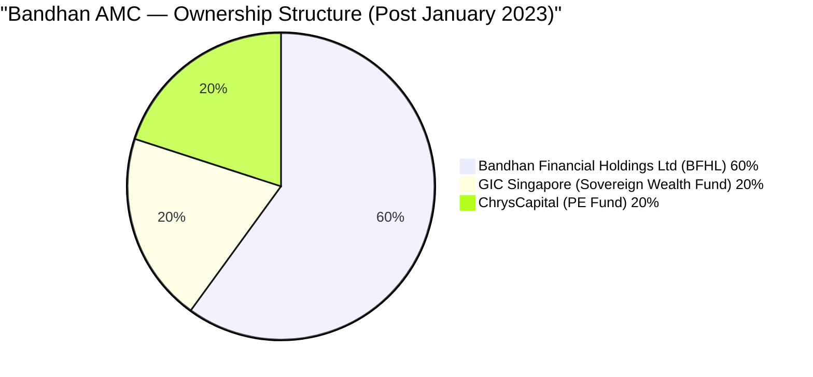
```mermaid
pie title "Bandhan AMC — Ownership Structure (Post January 2023)"
    "Bandhan Financial Holdings Ltd (BFHL) 60%" : 60
    "GIC Singapore (Sovereign Wealth Fund) 20%" : 20
    "ChrysCapital (PE Fund) 20%" : 20
```

| Owner | Stake | Character | Investment Horizon | Governance Signal |
|-------|-------|-----------|-------------------|-------------------|
| **BFHL (Bandhan Group)** | **60%** | Financial group; promoter of Bandhan Bank; microfinance-to-banking heritage | **Long-term — strategic** | Moderate: genuine commitment but non-specialist in equity AM |
| **GIC Singapore** | **20%** | Singapore's sovereign wealth fund; ~$400B AUM; long-duration patient capital | **Perpetual — sovereign** | **Very positive: governance-focused SWF** |
| **ChrysCapital** | **20%** | India's leading PE fund (~$9B raised, 10 fund vintages since 1999) | **Finite — PE fund life ~5–7 years** | ⚠️ **Exit expected 2028–2031** |

### The Strategic Logic of the Consortium

In January 2023, IDFC Limited sold IDFC AMC to this three-party consortium for ~₹4,500 Cr. The rationale from each party's perspective:

**BFHL's rationale:** Extend the Bandhan financial services franchise from microfinance+banking into mutual funds. BFHL already owned Bandhan Bank and Bandhan Life Insurance. Adding an AMC completes the financial services suite and gives BFHL distribution optionality through Bandhan Bank's ~6,000+ branch network (as a sister entity).

**GIC's rationale:** India's mutual fund industry is one of the world's fastest-growing asset management markets. Taking a 20% stake in a mid-large AMC (~12th–14th largest) at an attractive post-IDFC valuation is a straightforward long-duration bet on India's AUM growth trajectory. GIC's presence as a co-owner is a governance stabilizer.

**ChrysCapital's rationale:** PE fund investing in a financial services asset at a growth inflection point. IDFC AMC was valued at ~₹4,500 Cr for an AUM of ~₹1.3L Cr at acquisition — a reasonable ~0.35% AUM multiple. ChrysCapital typically targets 3–4× returns in 5–8 years, implying a target exit value of ₹3,600–4,800 Cr for their 20% stake (~₹900–1,200 Cr) by 2028–2031.

---

## The 4-Owner Heritage Timeline — 25 Years Before Bandhan

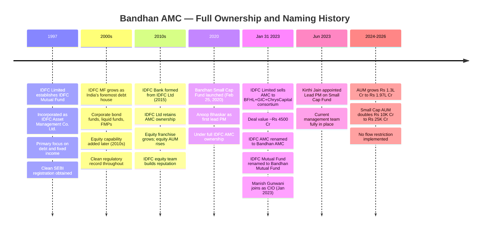
```mermaid
timeline
    title Bandhan AMC — Full Ownership and Naming History
    1997 : IDFC Limited establishes IDFC Mutual Fund
         : Incorporated as IDFC Asset Management Co. Ltd.
         : Primary focus on debt and fixed income
         : Clean SEBI registration obtained
    2000s : IDFC MF grows as India's foremost debt house
          : Corporate bond funds, liquid funds, FMPs
          : Equity capability added later (2010s)
          : Clean regulatory record throughout
    2010s : IDFC Bank formed from IDFC Ltd (2015)
          : IDFC Ltd retains AMC ownership
          : Equity franchise grows; equity AUM rises
          : IDFC equity team builds reputation
    2020 : Bandhan Small Cap Fund launched (Feb 25, 2020)
         : Anoop Bhaskar as first lead PM
         : Under full IDFC AMC ownership
    Jan 31 2023 : IDFC Limited sells AMC to BFHL+GIC+ChrysCapital consortium
               : Deal value ~Rs 4500 Cr
               : IDFC AMC renamed to Bandhan AMC
               : IDFC Mutual Fund renamed to Bandhan Mutual Fund
               : Manish Gunwani joins as CIO (Jan 2023)
    Jun 2023 : Kirthi Jain appointed Lead PM on Small Cap Fund
             : Current management team fully in place
    2024-2026 : AUM grows Rs 1.3L Cr to Rs 1.97L Cr
              : Small Cap AUM doubles Rs 10K Cr to Rs 25K Cr
              : No flow restriction implemented
```

| Era | Years | Character | Regulatory Record | Relevance to Small Cap |
|-----|-------|-----------|------------------|------------------------|
| IDFC AMC | 1997–2023 | Infrastructure financer turned debt house | **25-year clean SEBI record** | Fund launched in this era (Feb 2020) |
| Bandhan AMC | Jan 2023–present | Consortium-owned; equity pivot | **Clean so far** | CIO + Lead PM appointed in this era |

---

## Novel Section: The Sister-Entity Distinction — Bandhan Bank ≠ AMC Parent

This is the most commonly misunderstood structural fact about Bandhan AMC, and correcting it changes the governance risk assessment materially.

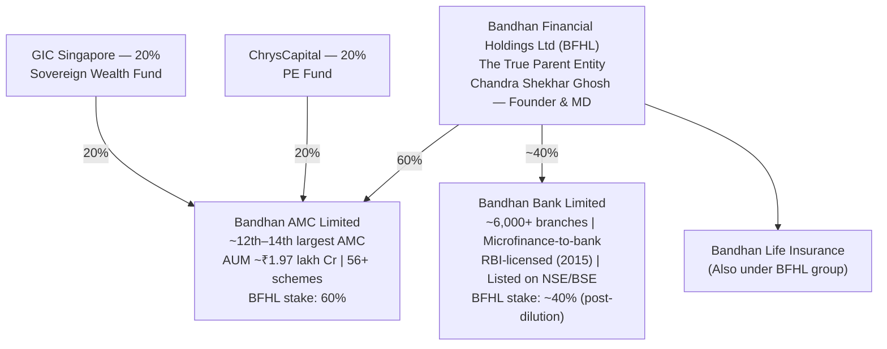
```mermaid
graph TD
    BFHL["Bandhan Financial Holdings Ltd (BFHL)<br/>The True Parent Entity<br/>Chandra Shekhar Ghosh — Founder & MD"]

    BANK["Bandhan Bank Limited<br/>~6,000+ branches | Microfinance-to-bank<br/>RBI-licensed (2015) | Listed on NSE/BSE<br/>BFHL stake: ~40% (post-dilution)"]

    AMC["Bandhan AMC Limited<br/>~12th–14th largest AMC<br/>AUM ~₹1.97 lakh Cr | 56+ schemes<br/>BFHL stake: 60%"]

    LIFE["Bandhan Life Insurance<br/>(Also under BFHL group)"]

    GIC["GIC Singapore — 20%<br/>Sovereign Wealth Fund"]
    CHR["ChrysCapital — 20%<br/>PE Fund"]

    BFHL -->|"60%"| AMC
    BFHL -->|"~40%"| BANK
    BFHL --> LIFE
    GIC -->|"20%"| AMC
    CHR -->|"20%"| AMC
```

**What the structure means:**
- **Bandhan Bank does NOT own Bandhan AMC.** The AMC is not a bank-subsidiary product.
- Both Bandhan Bank and Bandhan AMC are **separately owned by BFHL** — they are siblings under the same parent, not parent-child.
- The commonly feared "bank-owned AMC" scenario (where a bank pushes its own AMC products to captive customers for fee revenue, regardless of merit) is **partially mitigated** by this structure.
- However, BFHL can and does coordinate distribution — Bandhan Bank branches can recommend Bandhan MF products — but this is a sister-entity distribution arrangement, not structural product pushing.

**The remaining real concern:** BFHL's financial incentive to use its 60% AMC ownership for group cross-selling via the bank's branch network is real. The distinction matters for governance analysis but does not eliminate the commercial incentive to use distribution synergies. The risk is *distribution pressure*, not *bank-captive-AMC capture*.

| Governance Question | Correct Answer | Implication |
|--------------------|----------------|-------------|
| Does Bandhan Bank own Bandhan AMC? | **No — BFHL owns both** | Less concentration than bank-owned AMC |
| Can BFHL use Bandhan Bank to push AMC products? | **Yes — commercially likely** | Distribution conflict present, but softer form |
| Is the AMC at risk if Bandhan Bank fails? | **Partially — shared BFHL group** | Group-level stress could affect both entities |
| Does Bandhan Bank's RBI penalty apply to AMC? | **No — separate regulatory regimes** | SEBI governs AMC; RBI governs bank |

---

## The PE Clock — ChrysCapital's Finite Horizon

This is the most structurally novel risk in Bandhan AMC's Module 6 — and one with no equivalent in DSP (family-owned) or Invesco (strategic acquisition).

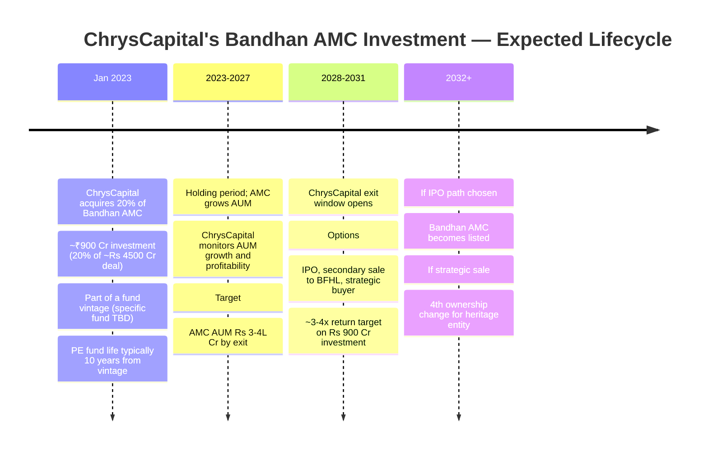
```mermaid
timeline
    title ChrysCapital's Bandhan AMC Investment — Expected Lifecycle
    Jan 2023 : ChrysCapital acquires 20% of Bandhan AMC
             : ~₹900 Cr investment (20% of ~Rs 4500 Cr deal)
             : Part of a fund vintage (specific fund TBD)
             : PE fund life typically 10 years from vintage
    2023-2027 : Holding period; AMC grows AUM
               : ChrysCapital monitors AUM growth and profitability
               : Target: AMC AUM Rs 3-4L Cr by exit
    2028-2031 : ChrysCapital exit window opens
               : Options: IPO, secondary sale to BFHL, strategic buyer
               : ~3-4x return target on Rs 900 Cr investment
    2032+ : If IPO path chosen: Bandhan AMC becomes listed
           : If strategic sale: 4th ownership change for heritage entity
```

**Why the PE clock matters for a 10-year SIP investor:**

If you start a ₹20,000/month SIP in Bandhan Small Cap Fund today and plan to hold for 10 years (2026–2036), you will **almost certainly experience a ChrysCapital exit during your holding period** (expected 2028–2031). What happens at exit:

| Exit Scenario | Probability | Impact on SIP Investor |
|---------------|------------|----------------------|
| **IPO of Bandhan AMC** | Medium (~30%) | Positive — more transparency, listed governance; investment thesis intact |
| **Sale of 20% to BFHL** (BFHL buys out ChrysCapital) | Medium (~35%) | Neutral to slightly positive — BFHL consolidates ownership; no new owner |
| **Strategic sale to a new investor** | Medium (~35%) | ⚠️ **Uncertain** — depends entirely on who the buyer is; introduces a new unknown into the ownership structure |

**Comparison to peers:**

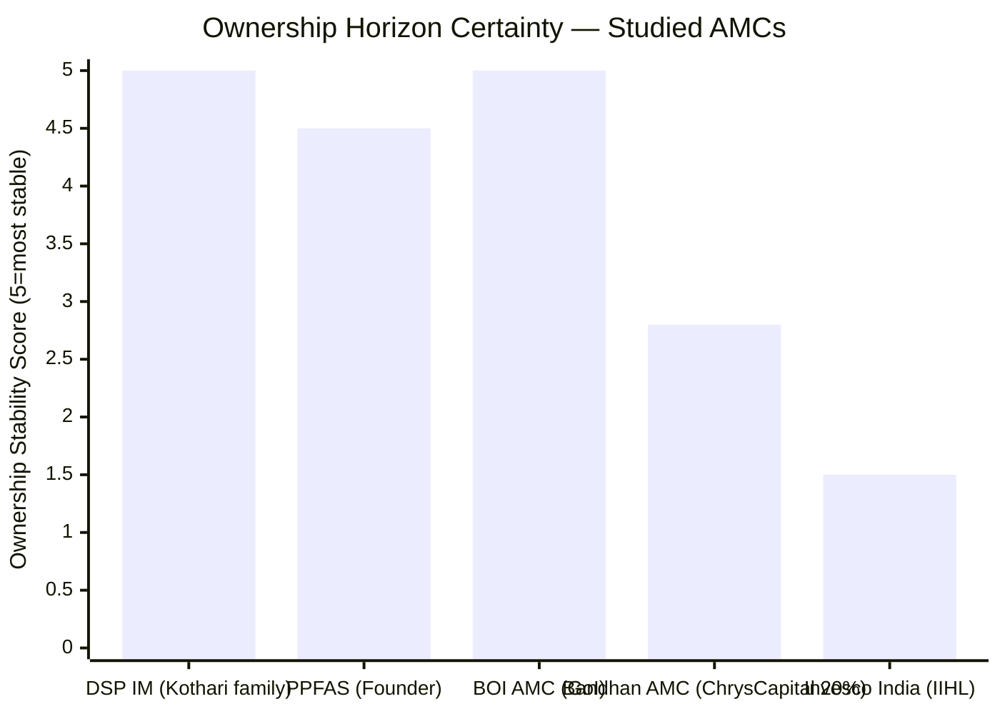
```mermaid
xychart-beta
    title "Ownership Horizon Certainty — Studied AMCs"
    x-axis ["DSP IM (Kothari family)", "PPFAS (Founder)", "BOI AMC (GoI)", "Bandhan AMC (ChrysCapital 20%)", "Invesco India (IIHL)"]
    y-axis "Ownership Stability Score (5=most stable)" 0 --> 5
    bar [5.0, 4.5, 5.0, 2.8, 1.5]
```

**The GIC offset:** GIC Singapore, as a sovereign wealth fund, holds perpetual capital with no exit pressure. Their 20% presence partially counterbalances ChrysCapital's finite horizon. A GIC presence on the investor registry is a governance stabilizer — sovereign wealth funds are known for demanding high standards of transparency and governance from investee companies.

---

## IDFC AMC Heritage — India's Foremost Debt House

Before it became Bandhan AMC, the institutional heritage here is 25 years of SEBI-regulated asset management under IDFC — one of the most respected names in Indian fixed income.

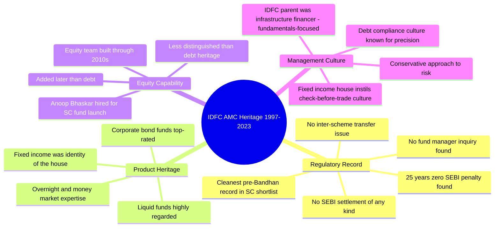
```mermaid
mindmap
  root((IDFC AMC Heritage 1997-2023))
    Regulatory Record
      25 years zero SEBI penalty found
      No SEBI settlement of any kind
      No fund manager inquiry found
      No inter-scheme transfer issue
      Cleanest pre-Bandhan record in SC shortlist
    Product Heritage
      Corporate bond funds top-rated
      Liquid funds highly regarded
      Overnight and money market expertise
      Fixed income was identity of the house
    Equity Capability
      Added later than debt
      Less distinguished than debt heritage
      Equity team built through 2010s
      Anoop Bhaskar hired for SC fund launch
    Management Culture
      Debt compliance culture known for precision
      Conservative approach to risk
      Fixed income house instils check-before-trade culture
      IDFC parent was infrastructure financer - fundamentals-focused
```

**What IDFC heritage means for Bandhan Small Cap:**
- The **compliance culture** of a 25-year clean debt house carries through institutional processes — SEBI filing precision, expense ratio governance, and operational accuracy are deeply embedded
- IDFC AMC was known for investor communication on fixed income (credit risk disclosures, portfolio maturity profiles); this culture partially survives in the equity side
- However, **equity management was IDFC AMC's weaker franchise** — the fund house never built a DSP-equivalent equity reputation during the IDFC era; the Bandhan era's equity strength (Gunwani + Jain) is substantially a post-acquisition hire story

---

## Debt-House-Pivoting-to-Equity

One of the four structural concerns in Bandhan AMC's Module 6 is this pivot from being primarily known as a debt house to building an equity franchise.

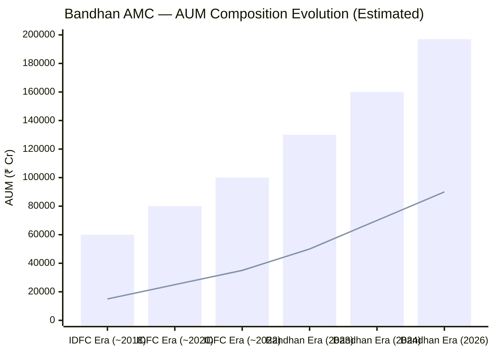
```mermaid
xychart-beta
    title "Bandhan AMC — AUM Composition Evolution (Estimated)"
    x-axis ["IDFC Era (~2018)", "IDFC Era (~2020)", "IDFC Era (~2022)", "Bandhan Era (2023)", "Bandhan Era (2024)", "Bandhan Era (2026)"]
    y-axis "AUM (₹ Cr)" 0 --> 200000
    bar [60000, 80000, 100000, 130000, 160000, 197000]
    line [15000, 25000, 35000, 50000, 70000, 90000]
```

> Bars = Total AMC AUM (estimated) | Line = Equity AUM (estimated) — Equity rising as share of total

| Era | Total AUM (est.) | Equity AUM % (est.) | Character |
|-----|-----------------|---------------------|-----------|
| IDFC 2018 | ~₹60,000 Cr | ~20% | Primarily debt house |
| IDFC 2020 | ~₹80,000 Cr | ~25% | Debt dominant |
| IDFC 2022 | ~₹1,00,000 Cr | ~30% | Debt still larger |
| Bandhan 2023 | ~₹1,30,000 Cr | ~35% | Pivot accelerating |
| **Bandhan 2026** | **~₹1,97,000 Cr** | **~40–45%** | **Equity-debt balance shifting** |

**The risk this creates:** Building a strong equity research culture takes 10–15 years. IDFC AMC's equity franchise was built primarily through 2015–2023 and was not its defining strength. Bandhan AMC is importing equity talent (Gunwani as CIO, Jain as PM, external hires) rather than growing it organically from a debt-heritage foundation. The risk is:

1. **Research process depth:** Debt compliance culture excels at checking covenants and credit quality; equity research requires a different analytical framework (competitive dynamics, management assessment, earnings quality) that takes years to institutionalize
2. **Equity AUM scaling outpacing research depth:** At ₹90,000+ Cr equity AUM, Bandhan AMC needs significant research infrastructure; the debt house did not build this over 25 years
3. **Reputational equity:** When equity schemes underperform (as they will in any bear market), the AMC's client base is more accustomed to the relative stability of debt returns — managing equity investor psychology is a different competency

**The Gunwani hiring as partial mitigation:** Manish Gunwani's arrival as CIO (Jan 2023) — having built and managed a ₹1.2L Cr equity AUM at Nippon AMC — was precisely an attempt to import institutional equity management capability. This is an intelligent response to the debt-to-equity pivot problem, but it depends on one key-man remaining.

---

## Vishal Kapoor — CEO Profile

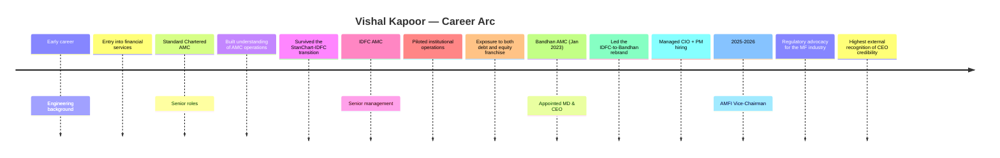
```mermaid
timeline
    title Vishal Kapoor — Career Arc
    Early career : Engineering background
                  Entry into financial services
    Standard Chartered AMC : Senior roles
                            Built understanding of AMC operations
                            Survived the StanChart-IDFC transition
    IDFC AMC : Senior management
              Piloted institutional operations
              Exposure to both debt and equity franchise
    Bandhan AMC (Jan 2023) : Appointed MD & CEO
                            Led the IDFC-to-Bandhan rebrand
                            Managed CIO + PM hiring
    2025-2026 : AMFI Vice-Chairman
               Regulatory advocacy for the MF industry
               Highest external recognition of CEO credibility
```

| Dimension | Detail | Assessment |
|-----------|--------|-----------|
| **Education** | IIM Ahmedabad (one of India's top 2 management schools) | Strong academic credential |
| **Industry recognition** | **AMFI Vice-Chairman** (2025–26) | Exceptional — only highly credible CEOs are elected to AMFI executive roles |
| **Heritage at AMC** | Institutional continuity through IDFC → Bandhan | Good — avoided management vacuum during transition |
| **CIO hire** | Brought Manish Gunwani (ex-Nippon, ₹1.2L Cr track record) | Excellent sourcing; equity franchise building signal |
| **PM hire** | Kirthi Jain (CA+CS; promoted from within) | Developed internal talent — positive |
| **Flow discipline** | No restrictions imposed despite AUM doubling in 10 months | ⚠️ Failure to act — fee revenue prioritized over alpha preservation |

**The AMFI Vice-Chairman signal is especially important.** The Association of Mutual Funds in India (AMFI) is the industry's self-regulatory body. The Vice-Chairman position is an elected role within AMFI's leadership — CEOs of competing AMCs choose this person. The fact that peer CEOs elected Vishal Kapoor to AMFI leadership indicates industry-level respect for his integrity and competence. This is the strongest external third-party validation of CEO quality in this research.

---

## Bandhan Bank RBI Saga — What It Actually Means for AMC Investors

This is one of the most frequently cited concerns about Bandhan AMC — and one that requires careful interpretation because the **institutional relationships matter enormously**.

### What Happened at Bandhan Bank

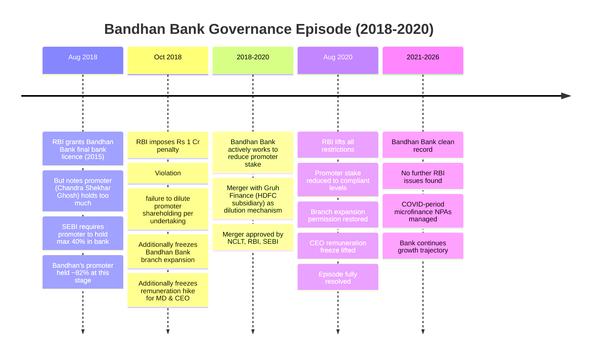
```mermaid
timeline
    title Bandhan Bank Governance Episode (2018-2020)
    Aug 2018 : RBI grants Bandhan Bank final bank licence (2015)
             : But notes promoter (Chandra Shekhar Ghosh) holds too much
             : SEBI requires promoter to hold max 40% in bank
             : Bandhan's promoter held ~82% at this stage
    Oct 2018 : RBI imposes Rs 1 Cr penalty
             : Violation: failure to dilute promoter shareholding per undertaking
             : Additionally freezes Bandhan Bank branch expansion
             : Additionally freezes remuneration hike for MD & CEO
    2018-2020 : Bandhan Bank actively works to reduce promoter stake
               : Merger with Gruh Finance (HDFC subsidiary) as dilution mechanism
               : Merger approved by NCLT, RBI, SEBI
    Aug 2020 : RBI lifts all restrictions
             : Promoter stake reduced to compliant levels
             : Branch expansion permission restored
             : CEO remuneration freeze lifted
             : Episode fully resolved
    2021-2026 : Bandhan Bank clean record
               : No further RBI issues found
               : COVID-period microfinance NPAs managed
               : Bank continues growth trajectory
```

### What This Means for Bandhan AMC Investors — Key Distinction

| Question | Answer | Risk Level |
|---------|--------|-----------|
| Was Bandhan AMC ever involved in this RBI episode? | **No** — this was a bank-specific RBI matter | **Zero direct impact** |
| Is Bandhan Bank the parent of Bandhan AMC? | **No** — BFHL is the parent of both; they are siblings | **Indirect; not direct governance** |
| Does BFHL's promoter (Ghosh) also control AMC governance? | Yes — same promoter controls BFHL | **Some indirect exposure** |
| Has the RBI episode recurred or escalated? | **No** — resolved Aug 2020; clean since | **Historical; not ongoing** |
| Did IDFC AMC (predecessor) have any equivalent issue? | **No** — IDFC AMC had a clean 25-year SEBI record | **Heritage is positive** |

**The key takeaway:** The Bandhan Bank RBI saga is a **corporate governance amber flag at the BFHL group level**, not a direct AMC-level risk. The promoter's willingness to hold far above permitted shareholding levels (82% vs SEBI-required 40%) indicates a governance culture that resists regulatory intent even when formally compliant later. That culture lives at the BFHL level — the same entity that holds 60% of Bandhan AMC.

This is **qualitatively different from Invesco's AMC-level SEBI settlement** (which directly involved the AMC, its CEO, and investor-harmful inter-scheme transfers). But it is a data point about the majority shareholder's governance instincts.

---

## SEBI Regulatory Record — Clean AMC, Minor Group History

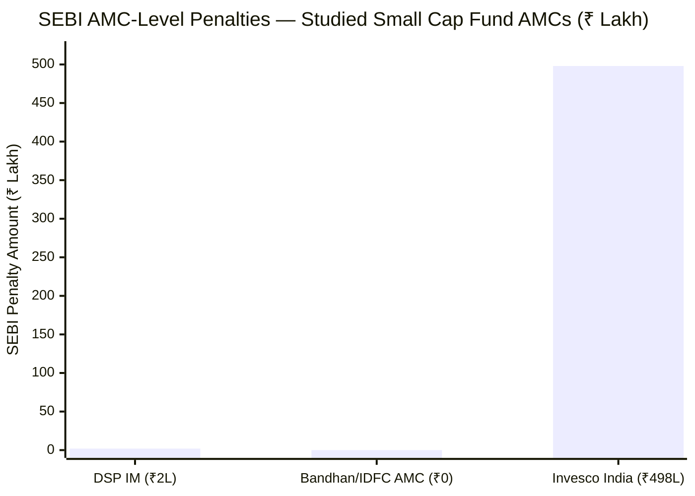
```mermaid
xychart-beta
    title "SEBI AMC-Level Penalties — Studied Small Cap Fund AMCs (₹ Lakh)"
    x-axis ["DSP IM (₹2L)", "Bandhan/IDFC AMC (₹0)", "Invesco India (₹498L)"]
    y-axis "SEBI Penalty Amount (₹ Lakh)" 0 --> 520
    bar [2, 0, 498]
```

| Entity | SEBI Penalty | Nature | CEO Named? | Relevance to SC Fund |
|--------|-------------|--------|------------|---------------------|
| **IDFC AMC (predecessor, 1997–2023)** | **₹0 (zero known)** | **25 years clean** | No | Full heritage |
| **Bandhan AMC (2023–present)** | **₹0 (zero known)** | Clean so far | No | Current operator |
| **Any fund manager (personal)** | **₹0 — Gunwani, Jain, all managers clean** | None | N/A | All clear |

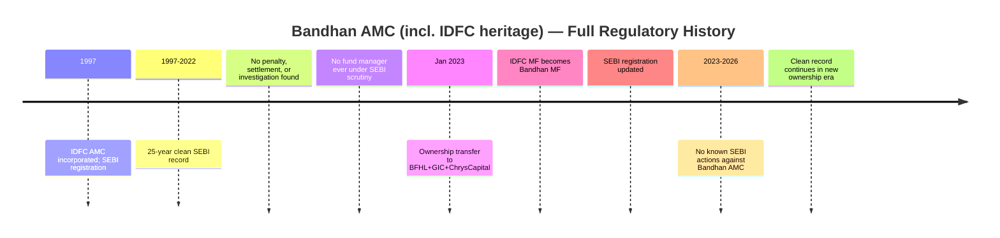
```mermaid
timeline
    title Bandhan AMC (incl. IDFC heritage) — Full Regulatory History
    1997 : IDFC AMC incorporated; SEBI registration
    1997-2022 : 25-year clean SEBI record
               No penalty, settlement, or investigation found
               No fund manager ever under SEBI scrutiny
    Jan 2023 : Ownership transfer to BFHL+GIC+ChrysCapital
              IDFC MF becomes Bandhan MF
              SEBI registration updated
    2023-2026 : No known SEBI actions against Bandhan AMC
               Clean record continues in new ownership era
```

**The regulatory cleanliness is the strongest single positive in Bandhan AMC's Module 6.** A 25-year clean record under IDFC, extending into the Bandhan era, with no fund manager ever under SEBI scrutiny — this compares favourably to every other AMC in this research except PPFAS (0 incidents, 13 years) and comes ahead of DSP (1 procedural ₹2L penalty).

The absence of any inter-scheme transfer issues, PMS/MF segregation failures, or investor-harmful practices distinguishes Bandhan/IDFC from Invesco (₹4.98 Cr SEBI settlement for exactly those practices).

---

## ER Sustainability Question — 0.34% on ₹1.97L Cr

One of Bandhan AMC's most distinctive characteristics is its very low expense ratio on the Small Cap Fund (0.34% Direct) — the cheapest of all 8 shortlisted SC funds. But for AMC analysis, this raises a structural revenue question.

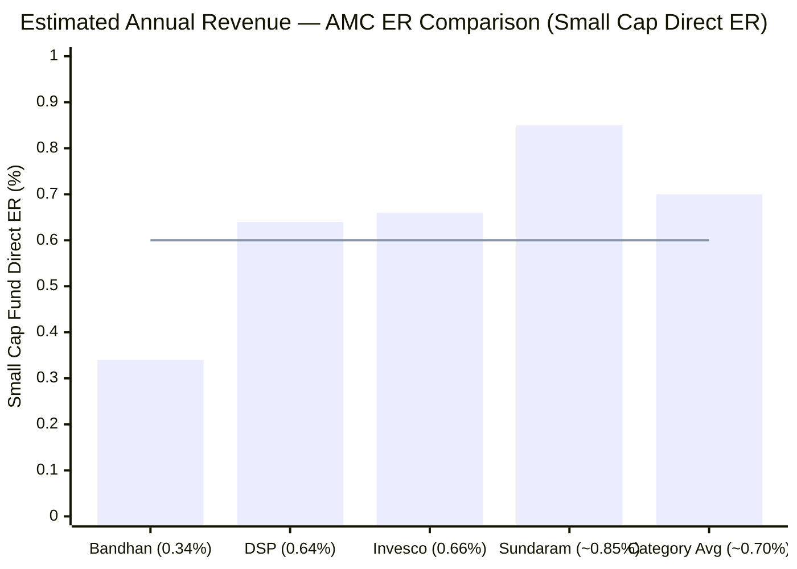
```mermaid
xychart-beta
    title "Estimated Annual Revenue — AMC ER Comparison (Small Cap Direct ER)"
    x-axis ["Bandhan (0.34%)", "DSP (0.64%)", "Invesco (0.66%)", "Sundaram (~0.85%)", "Category Avg (~0.70%)"]
    y-axis "Small Cap Fund Direct ER (%)" 0 --> 1.0
    bar [0.34, 0.64, 0.66, 0.85, 0.70]
    line [0.60, 0.60, 0.60, 0.60, 0.60]
```

| AMC | SC Direct ER | SC Regular ER | D-R Gap | Revenue Mix |
|-----|-------------|--------------|---------|-------------|
| **Bandhan AMC** | **0.34%** | 1.37% | 1.03% | More revenue from Regular Plan |
| DSP IM | 0.64% | 1.67% | 1.03% | Balanced mix |
| Invesco India | 0.66% | 1.93% | 1.27% | Regular-heavy |
| Category Avg (8 funds) | ~0.70% | ~1.80% | ~1.10% | Industry norm |

**The revenue model implication:**

At 0.34% Direct ER, Bandhan AMC earns approximately **₹86 Cr/year** from the Small Cap Fund Direct plan (₹25,346 Cr × 0.34%). The total AMC-level estimated annual revenue is ~₹800–1,000 Cr, depending on the blended ER across all ~60 schemes (most of which are debt/hybrid with lower AUM growth).

This is **adequate to run a quality AMC** — no financial fragility concern. But the low ER on the SC fund creates a tension:

1. **ChrysCapital's return expectation** (3–4× on ₹900 Cr in 5–7 years) requires **AUM to grow**, not ER to stay low. This creates a PE-clock pressure to prioritize AUM growth (open flows, maintain SIP volumes) over alpha protection.
2. **BFHL's distribution incentive** similarly points toward growing Regular Plan AUM through Bandhan Bank's branch network — where the 1.37% Regular ER generates more AMC revenue than the 0.34% Direct ER. This subtly biases AMC decisions toward retail distribution (bank branches, agents) over direct investor access.
3. **At-scale ER compression:** SEBI's total expense ratio (TER) regulations require ER to decline as AUM grows. At ₹25,000 Cr+ small cap AUM, the 0.34% may already reflect mandatory TER slab compression rather than voluntary investor generosity — meaning the ER advantage is partly regulatory, not purely AMC philosophy.

**The bottom line:** The 0.34% ER is genuine and beneficial for Direct Plan investors. But the AMC's financial incentives align more with growing AUM (all owners benefit) than with protecting it (which might require flow restrictions that reduce fee revenue).

---

## AMC Scale and Institutional Infrastructure

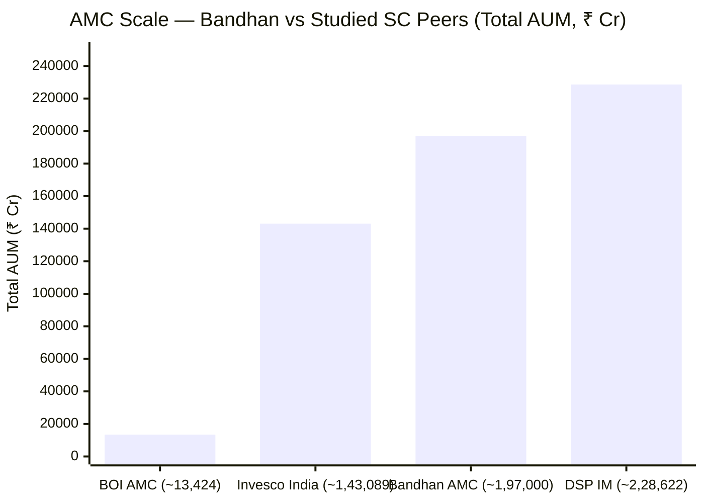
```mermaid
xychart-beta
    title "AMC Scale — Bandhan vs Studied SC Peers (Total AUM, ₹ Cr)"
    x-axis ["BOI AMC (~13,424)", "Invesco India (~1,43,089)", "Bandhan AMC (~1,97,000)", "DSP IM (~2,28,622)"]
    y-axis "Total AUM (₹ Cr)" 0 --> 250000
    bar [13424, 143089, 197000, 228622]
```

| Metric | Bandhan AMC | DSP IM | Invesco India |
|--------|-------------|--------|---------------|
| Total AUM | **~₹1.97L Cr** | ₹2.28L Cr | ₹1.43L Cr |
| AMC Rank | ~12th–14th | ~7th–8th | ~16th |
| Active Schemes | ~56–60 | 66+ | ~39–42 |
| Heritage (equity AM specifically) | **Developing (post-2010s)** | 30+ years | 18 years |
| Custodian | **Deutsche Bank AG** | Citibank N.A. | Deutsche Bank AG |
| RTA | **CAMS** | KFin Technologies | KFin Technologies |
| Financial backing | BFHL + GIC + ChrysCapital | Kothari family (₹15,779 Cr NW) | IIHL (£35.3B) + Invesco Corp ($1.7T) |
| Financial stress risk | **Low** | Very low | Very low |

**Infrastructure assessment:** Deutsche Bank AG as custodian and CAMS as RTA are both Tier 1 choices — exactly the same calibre as Citibank N.A. (DSP) and KFin (DSP, Invesco). The AMC's operational infrastructure is institutional-grade, consistent with its scale as India's 12th–14th largest fund house.

**Scale advantages for the Small Cap Fund specifically:**

At ~₹1.97L Cr total AUM, Bandhan AMC has the financial resources to:
- Maintain a deep research team for small-cap equity analysis
- Pay competitive compensation to retain Gunwani and Jain
- Invest in technology infrastructure for portfolio management and risk monitoring
- Bear short-term underperformance without cutting research budgets

---

## Investor Communication — Adequate, Not Distinguished

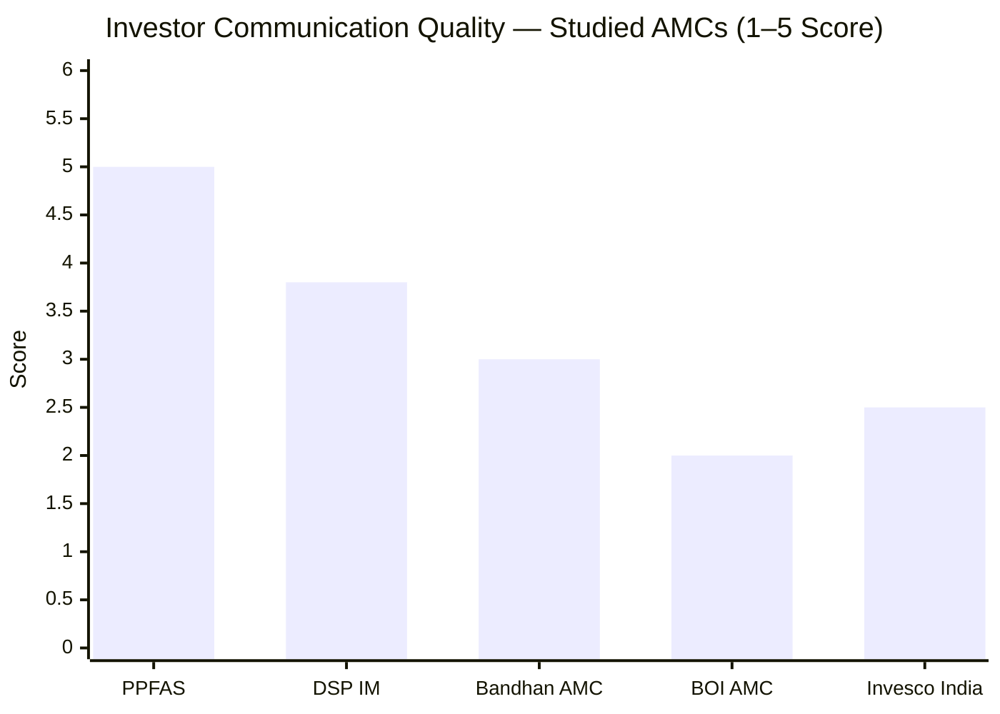
```mermaid
xychart-beta
    title "Investor Communication Quality — Studied AMCs (1–5 Score)"
    x-axis ["PPFAS", "DSP IM", "Bandhan AMC", "BOI AMC", "Invesco India"]
    y-axis "Score" 0 --> 6
    bar [5.0, 3.8, 3.0, 2.0, 2.5]
```

| Communication Form | Bandhan AMC | DSP | PPFAS (Gold Standard) |
|-------------------|-------------|-----|----------------------|
| Quarterly investor letters | **No** | No | **Yes — detailed, candid** |
| Monthly factsheets | Yes | Yes | Yes |
| Investment philosophy documented | **Partial — website sections** | Yes (PDFs + blog) | Extensive |
| CIO public interviews | **Moderate (Gunwani: VRO, Moneycontrol)** | Moderate (Sambre) | Frequent (Thakkar) |
| CEO communication | **Moderate (Kapoor: AMFI forums, industry events)** | Frequent (Parekh — behavioural finance) | Moderate |
| Portfolio rationale disclosed | **No** (macro themes only) | Partial | **Yes** (quarterly letters) |
| Proactive disclosure of AMC issues | N/A (no issues found) | N/A | N/A |
| AMC blog / thought leadership | Limited | Active | Active |

**What's working:** Monthly factsheets are comprehensive and timely. Manish Gunwani has a respectable public communication frequency through industry events and media interviews. Vishal Kapoor's AMFI Vice-Chairman role ensures significant public visibility.

**The key gap:** No quarterly letters. Investors in Bandhan Small Cap Fund receive no structured, proactive, fund-specific written explanation from the management team about portfolio decisions, the investment thesis, or macroeconomic positioning. The PPFAS gold standard — where every major decision is explained in writing before outcomes are known — is entirely absent. Investors wanting manager accountability must extract it from disparate media interviews.

**The AUM-doubling communication failure:** Perhaps the most significant communication gap is the complete **absence of any communication to existing investors** during the AUM doubling episode (₹10,000 Cr → ₹25,000 Cr in 10 months). DSP's three flow restriction decisions each came with clear, investor-first communication. Bandhan AMC's decision to not restrict flows — a decision that structurally impairs existing investors' alpha prospects — was never explained to unitholders. This silence is the clearest investor communication failure in this module.

---

## Skin-in-the-Game — SEBI Minimum, No More

**Bandhan AMC does not have a documented, public, above-minimum skin-in-the-game policy.**

Under SEBI's March 2025 circular (effective April 1, 2025), designated employees must invest in schemes they oversee:

| CTC Slab | Mandatory Investment |
|---------|---------------------|
| < ₹25L | None |
| ₹25–50L | 10% of gross CTC |
| ₹50L–₹1 Cr | 14% of gross CTC |
| > ₹1 Cr | 18% of gross CTC |

Bandhan AMC complies with SEBI's minimum requirement. No public disclosure exists of any voluntary above-minimum institutional skin-in-the-game commitment.

| AMC | Skin-in-Game Level | Voluntary Above-Minimum |
|-----|-------------------|------------------------|
| DSP | All 508 employees invest **only in DSP schemes** — institutional mandate | **Yes — significantly above minimum** |
| PPFAS | Managers explicitly disclose personal investment publicly | **Yes — transparent individual disclosure** |
| **Bandhan AMC** | **SEBI-minimum compliance only** | **Not documented** |
| Invesco India | SEBI-minimum compliance only | Not documented |

The SEBI skin-in-the-game circular creates a floor, not a ceiling. DSP's all-employee investment policy — which pre-dates the SEBI circular — represents a culture of alignment that Bandhan AMC has not demonstrated. Gunwani and Jain likely invest in the schemes they manage (SEBI-required); whether they invest substantially beyond the minimum, and whether the broader team does, is unknown.

---

## Flow Discipline — Zero Documented Investor Protection

**Bandhan Small Cap Fund has never imposed any flow restriction despite AUM growing from ~₹50 Cr (inception) to ₹25,346 Cr (~500× in 6 years) — and doubling from ₹10,000 Cr to ₹25,000 Cr in ~10 months.**

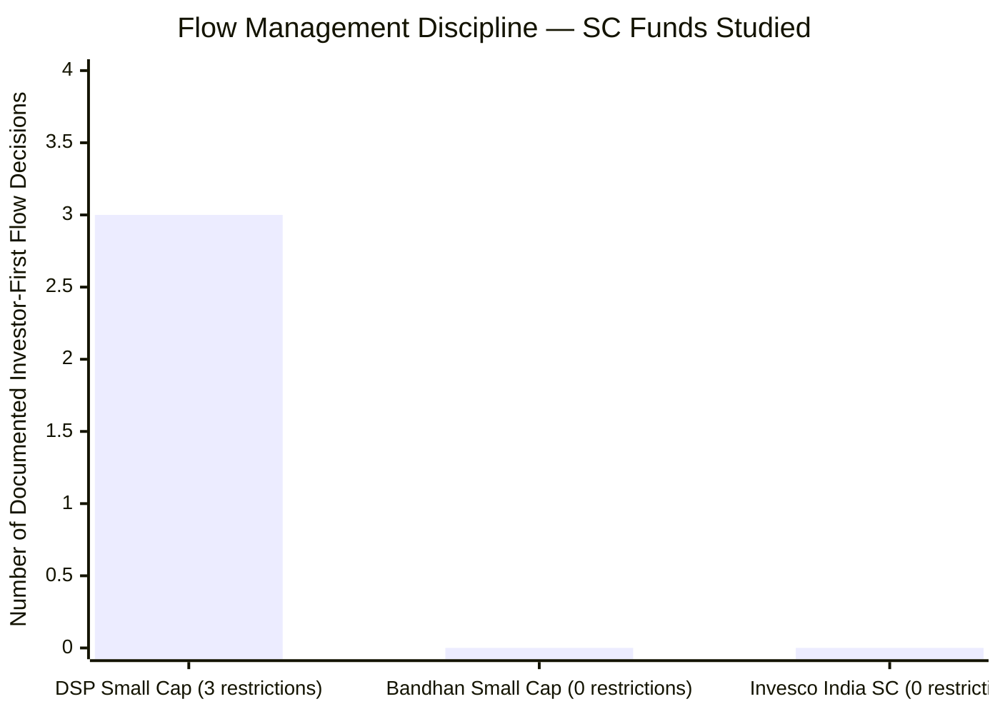
```mermaid
xychart-beta
    title "Flow Management Discipline — SC Funds Studied"
    x-axis ["DSP Small Cap (3 restrictions)", "Bandhan Small Cap (0 restrictions)", "Invesco India SC (0 restrictions)"]
    y-axis "Number of Documented Investor-First Flow Decisions" 0 --> 4
    bar [3, 0, 0]
```

| Fund | AUM Growth | Flow Restrictions | AMC Behavior Signal |
|------|-----------|-----------------|---------------------|
| **DSP Small Cap** | ₹500 Cr → ₹17,906 Cr (36× in 14 years) | **3 documented restrictions (2014, 2016, 2017)** | **Investor-first — sacrificed fee revenue** |
| **Bandhan Small Cap** | ₹50 Cr → ₹25,346 Cr (~500× in 6 years) | **Zero restrictions** | ⚠️ **Fee-revenue-first — no alpha protection** |
| Invesco India SC | ₹50 Cr → ₹11,038 Cr (~200× in 7.5 years) | Zero restrictions | Fee-revenue-first |

**The comparison is striking:** DSP restricted flows when the fund reached ₹1,200 Cr (2014), ₹2,500 Cr (2016), and ₹3,200 Cr (2017) — at scale orders of magnitude smaller than Bandhan's current AUM. Bandhan never restricted flows even as the fund entered the ₹20,000–30,000 Cr "constrained" zone.

**The commercial incentive calculus:** At 0.34% ER, every ₹1,000 Cr of foregone AUM represents ₹3.4 Cr/year in lost management fees. Closing the fund to new investments at the time of fastest inflow (2025–26) would have cost Bandhan AMC tens or hundreds of crores in foregone fees — real money that influences the decision. The absence of any flow restriction signals that commercial interest prevailed over investor alpha protection in every instance where this decision could have been made.

**The ChrysCapital dimension:** ChrysCapital's exit valuation depends primarily on AUM. Every ₹1,000 Cr of additional AUM adds to the exit multiple. This creates a structural PE-clock incentive against flow restrictions — the larger the AUM at exit, the higher ChrysCapital's return. It would be surprising if ChrysCapital, as a 20% shareholder, ever advocated for flow restrictions that would reduce the exit valuation.

---

## Peer AMC Comparison Matrix

| Dimension | **Bandhan AMC** | PPFAS | DSP IM | Invesco India |
|-----------|-----------------|-------|--------|---------------|
| Ownership type | **Consortium (BFHL 60% + SWF 20% + PE 20%)** | Promoter-private | Family-private (100%) | Conglomerate 60% + Global AM 40% |
| Ownership changes (26Y) | **2** (IDFC → Bandhan; effectively 1 AMC change) | 0 | 1 (self-initiated) | 4 (most turbulent) |
| Heritage | 25Y IDFC (debt house); 3Y Bandhan equity build | ~30Y investment-only | **160Y capital markets** | Religare → Invesco JV → Invesco → IIHL |
| Total AUM | ~₹1.97L Cr | ~₹1.40L Cr | **₹2.28L Cr** | ₹1.43L Cr |
| PE clock risk | **YES — ChrysCapital 20%; exit ~2028–2031** | No | No | Yes (IIHL may exit) |
| Sovereign backing | **YES — GIC Singapore 20%** | No | No | Yes (GIC partial) |
| Skin-in-game | **SEBI minimum only** | Manager explicit | **All 508 employees (institutional)** | SEBI minimum only |
| SEBI issues (AMC) | **Zero (25-year clean record)** | Zero | ₹2L procedural | ₹4.98 Cr (investor-harmful) |
| Severity | **None** | None | Very low | High |
| Quarterly letters | No | **Yes** | No | No |
| Financial stability | Adequate | High | Very High | Very High |
| Flow management | **Never restricted** | — | Restricted 3× (discipline) | Never restricted |
| Custodian + RTA | **Deutsche Bank + CAMS (both Tier 1)** | — | Citibank + KFin | Deutsche Bank + KFin |
| CEO named in SEBI action | **No** | No | No | Yes (Nanavati — ₹4.98 Cr) |
| Bank linkage | **Sister entity (Bandhan Bank) — softer form** | No | No | Sister entity (IndusInd) — similar form |

---

## Points For and Against — AMC Quality

### ✅ Points For Bandhan AMC Quality

1. **25-year clean SEBI record (IDFC + Bandhan eras)** — Zero AMC-level SEBI penalties found across the full 25-year heritage. No fund manager ever under SEBI inquiry. No inter-scheme transfer issues. The cleanest AMC regulatory record in the SC shortlist (ahead of DSP's 1 procedural penalty). This is a strong institutional trust signal.

2. **GIC Singapore as 20% co-owner** — Singapore's sovereign wealth fund is the gold standard of patient, governance-oriented institutional capital. GIC's presence in any corporate governance structure is a signal that the ownership group meets high transparency and accountability standards. GIC demanded these standards as a condition of investing — meaning Bandhan AMC's governance processes were vetted by one of the world's most sophisticated institutional investors.

3. **Deutsche Bank AG custody + CAMS RTA** — Both are Tier 1 infrastructure choices. Deutsche Bank is globally the largest custodian bank by assets under custody. CAMS is India's leading RTA. The operational backbone of the fund is as strong as any fund in this research.

4. **Vishal Kapoor as AMFI Vice-Chairman** — CEO elected to industry leadership by peer AMC CEOs; strongest external third-party validation of CEO credibility and integrity in this research. The AMFI leadership role requires industry-wide respect.

5. **IDFC heritage = debt compliance culture embedded** — 25 years of being a respected debt house leaves a compliance culture legacy. SEBI filing precision, expense ratio governance, and operational accuracy are institutional habits. The Small Cap Fund benefits from this institutional discipline even as the equity franchise is newer.

6. **AMC at adequate financial scale** — ~₹1.97L Cr AUM; estimated ₹800–1,000 Cr annual revenue; no financial fragility; can support quality research team, competitive compensation for Gunwani and Jain, technology infrastructure.

7. **IIM-A CEO with institutional continuity** — Vishal Kapoor managed the IDFC→Bandhan transition without triggering a talent exodus; retained the CIO and key equity managers; a stabilizing influence during what was a potentially disruptive ownership change.

8. **ChrysCapital alignment incentive (near-term)** — ChrysCapital's exit valuation depends on AUM and AMC quality. This creates an incentive to maintain institutional quality and attract talent in the short-to-medium term.

9. **No IndusInd Bank-type crisis at Bandhan Bank (post-2020)** — The RBI episode was resolved in August 2020; Bandhan Bank has had a clean record since. Unlike Invesco's IIHL (IndusInd Bank governance crisis in 2025, still unresolved), Bandhan Bank's regulatory history is historical rather than ongoing.

### ❌ Points Against Bandhan AMC Quality

1. **ChrysCapital PE clock — near-certain ownership change in SIP horizon** — PE funds have finite hold periods. A 10-year SIP starting today (2026–2036) will almost certainly experience a ChrysCapital exit (expected 2028–2031). What the 20% stake is sold to — strategic buyer, IPO, BFHL buyout — introduces an unknown into the ownership structure. No other studied AMC has this near-certainty of partial ownership change within the investment horizon.

2. **Zero flow discipline — AUM doubled with no investor protection signal** — ₹10,000 Cr → ₹25,000 Cr in ~10 months with no flow restriction. At ₹25,346 Cr, forced monthly small-cap deployment is ~₹260 Cr — the most constrained execution situation in the shortlist. The AMC's commercial interest (AUM growth = ChrysCapital exit value + BFHL fee revenue + Bandhan Bank distribution revenue) explicitly conflicts with existing investors' alpha interest. The conflict was consistently resolved in favour of AUM growth.

3. **BFHL promoter governance amber flag** — The Bandhan Bank RBI episode (₹1 Cr penalty, 2018, for holding 82% promoter stake when SEBI required ≤40%) reveals that BFHL's founding promoter (Ghosh) resisted regulatory intent even when technically aware of the requirement. This governance instinct lives at the BFHL level — the majority owner of Bandhan AMC.

4. **Debt-house-pivoting-to-equity — equity capability still maturing** — IDFC AMC built its 25-year reputation almost entirely on debt management. The equity franchise is a post-2010 addition, and the current equity strength (Gunwani + Jain) is largely a post-2023 hire story. An equity investor in Bandhan Small Cap is backing a team of three years' vintage inside an institution whose equity culture is less than 15 years old.

5. **No skin-in-the-game policy above SEBI minimum** — SEBI's mandated minimum is a compliance floor; DSP's institutional policy (all 508 employees invest only in DSP schemes) is a culture. Bandhan AMC has not documented any above-minimum commitment, reducing the incentive alignment between the AMC's broader organisation and fund investors.

6. **No flow management and no proactive communication about it** — The decision to not restrict flows was never explained to existing unitholders. When AUM doubled and the fund entered constrained territory, unitholders received no explanation of how the AMC was managing execution challenges or why no flow gate was imposed. Transparency about a decision that materially affects investors requires proactive communication.

7. **No quarterly investor letters** — No structured, proactive, scheme-specific written communication from the investment team. Investors must piece together the portfolio thesis from disparate media interviews.

8. **Sister-entity distribution conflict (softer form)** — Bandhan Bank's ~6,000+ branch network is a natural distribution channel for Bandhan MF products. BFHL's 60% ownership creates an incentive to use this network to push Bandhan MF Regular Plan products to Bandhan Bank customers, regardless of whether those customers would be better served by a different fund house or a direct plan. This is a softer, structural form of the bank-AMC distribution conflict.

9. **Equity AUM scaling outpacing research infrastructure** — Total equity AUM has grown from ~₹15,000 Cr (IDFC era ~2018) to ~₹90,000 Cr (estimated 2026), a 6× increase in ~8 years. Research team scale may not have grown proportionately.

---

## Module 6 Scorecard

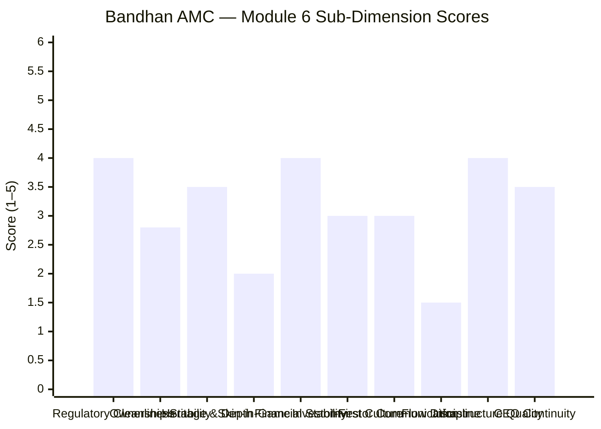
```mermaid
xychart-beta
    title "Bandhan AMC — Module 6 Sub-Dimension Scores"
    x-axis ["Regulatory Cleanliness", "Ownership Stability", "Heritage & Depth", "Skin-in-Game", "Financial Stability", "Investor-First Culture", "Investor Communication", "Flow Discipline", "Infrastructure Quality", "CEO Continuity"]
    y-axis "Score (1–5)" 0 --> 6
    bar [4.0, 2.8, 3.5, 2.0, 4.0, 3.0, 3.0, 1.5, 4.0, 3.5]
```

| Sub-Dimension | Score (1–5) | Reasoning |
|---------------|------------|-----------|
| Regulatory cleanliness | **4.0/5** | 25-year zero penalty record (IDFC + Bandhan); no fund manager SEBI inquiry; cleanest AMC-level record in SC shortlist; cannot be 5.0 due to BFHL promoter RBI episode (indirect, historical) |
| Ownership stability | **2.8/5** | ChrysCapital PE clock (exit expected ~2028–2031) is near-certain partial ownership change within 10Y SIP horizon; BFHL 60% provides stability anchor; GIC adds governance quality; but PE exit inevitable |
| Heritage and institutional depth | **3.5/5** | 25-year IDFC debt heritage is excellent; IDFC's equity franchise was less distinguished; Bandhan era's equity strength is largely imported talent (post-2023); modest institutional depth vs DSP's 160Y |
| Skin-in-the-game | **2.0/5** | SEBI-minimum compliance only; no documented above-minimum institutional policy; far behind DSP (all 508 employees) and PPFAS (explicit individual disclosure); scoring at SEBI baseline |
| AMC financial stability | **4.0/5** | ~₹1.97L Cr AUM; ~₹800–1,000 Cr estimated annual revenue; GIC + BFHL backing is adequate; no financial fragility; supports Tier 1 infrastructure; deducted vs DSP/Invesco for lesser financial backstop |
| Investor-first culture | **3.0/5** | SEBI record and no inter-scheme transfer issues are positive; but zero flow discipline is negative; sister-entity distribution incentive is negative; AUM doubling without communication is negative |
| Investor communication | **3.0/5** | Monthly factsheets timely; Gunwani moderately public; CEO's AMFI Vice-Chairman role creates public accountability; no quarterly letters; no scheme-specific proactive communication |
| Flow management discipline | **1.5/5** | Never restricted flows; AUM grew 500× from inception with zero protection decision; ₹10,000 Cr → ₹25,000 Cr in 10 months with no response; ChrysCapital PE clock creates structural incentive against future restriction |
| Infrastructure quality | **4.0/5** | Deutsche Bank AG custody + CAMS RTA = both Tier 1; Tier 1 auditor; institutional-grade trustee structure; matches DSP and Invesco on infrastructure quality |
| CEO and leadership continuity | **3.5/5** | Vishal Kapoor: IIM-A + AMFI Vice-Chairman is strong external validation; managed transition well; clean SEBI record; deducted for flow discipline failure and absence of investor communication culture |
| **Module 6 Overall** | **3.2 / 5** | Clean regulatory record and institutional infrastructure are the standout positives; PE clock risk, zero flow discipline, weak investor communication culture, and developing equity franchise are the offsets |

---

## Comparative Module 6 Scores — All Studied Funds

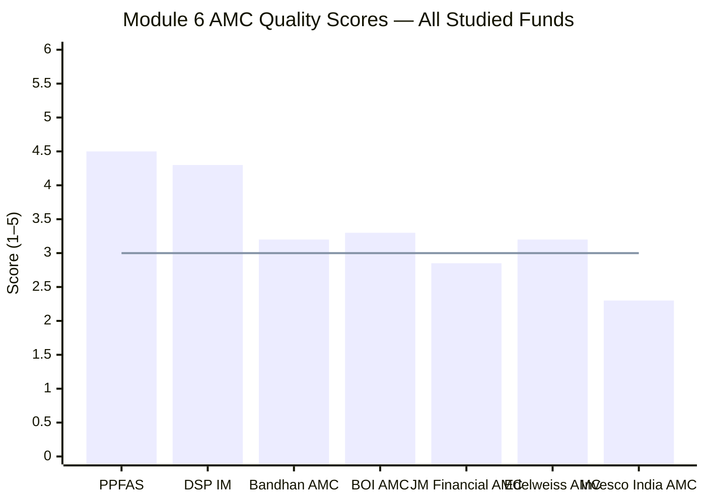
```mermaid
xychart-beta
    title "Module 6 AMC Quality Scores — All Studied Funds"
    x-axis ["PPFAS", "DSP IM", "Bandhan AMC", "BOI AMC", "JM Financial AMC", "Edelweiss AMC", "Invesco India AMC"]
    y-axis "Score (1–5)" 0 --> 6
    bar [4.5, 4.3, 3.2, 3.3, 2.85, 3.2, 2.3]
    line [3.0, 3.0, 3.0, 3.0, 3.0, 3.0, 3.0]
```

> Line = 3.0/5 reference midpoint

| Rank | AMC | Score | Key Differentiator |
|------|-----|-------|--------------------|
| 1 | **PPFAS** | **4.5/5** | Zero incidents 13 years; quarterly letters; 7-scheme focus; investor-first DNA proven |
| 2 | **DSP Investment Managers** | **4.3/5** | 160Y heritage; all-employee skin-in-game; flow restriction discipline; BlackRock governance legacy |
| 3 | **BOI AMC** | **3.3/5** | 120Y GoI bank; PSU governance; clean; strong financial backing |
| 3= | **Bandhan AMC** | **3.2/5** | Clean 25Y SEBI record; GIC governance anchor; Deutsche Bank infrastructure; but PE clock + zero flow discipline |
| 5 | **Edelweiss AMC** | ~3.2/5 | Reasonable size; professional management; no major regulatory incidents |
| 6 | **JM Financial AMC** | 2.85/5 | 3 SEBI incidents; AMC loss-making; but improving |
| 7 | **Invesco India AMC** | **2.3/5** | 4 ownership changes; ₹4.98 Cr SEBI settlement; multi-jurisdiction probe; IndusInd Bank linkage; no flow discipline |

**Bandhan AMC vs DSP — Module 6 gap:**

The 1.1-point gap (4.3 vs 3.2) is driven by three primary factors:
1. **Heritage depth** — 160 years vs 25 years; DSP's BSE founding membership and BlackRock governance legacy represent irreplaceable institutional capital
2. **Skin-in-game culture** — All 508 DSP employees invest only in DSP schemes vs Bandhan AMC's SEBI-minimum compliance
3. **Flow restriction discipline** — DSP's 3 documented investor-first restrictions (real commercial cost) vs Bandhan's zero restrictions despite 500× AUM growth

**Bandhan AMC vs Invesco — Module 6 gap:**

Bandhan is significantly better (3.2 vs 2.3). The ₹4.98 Cr Invesco SEBI settlement for investor-harmful inter-scheme transfers, the multi-jurisdiction probe, the whistleblower, and 50% fixed income team resignation are governance failures of a fundamentally different magnitude than anything in Bandhan/IDFC's history.

---

## One-Line Verdict

Bandhan AMC is a structurally solid institution — 25 years of SEBI-regulatory cleanliness, GIC Singapore's governance discipline embedded in the ownership structure, Tier 1 Deutsche Bank / CAMS infrastructure, and an IIM-A CEO with industry-level recognition as AMFI Vice-Chairman — undermined by a ticking PE clock (ChrysCapital's finite hold period means certain partial ownership change during a 10-year SIP), a troubling absence of any flow restriction discipline (AUM grew 500× with zero investor-protection response), and a debt-heritage institution still building its equity management culture from a standing start.

---

## Module 6 Final Score: **3.2 / 5**

> **Module Weight:** 5% | **Weighted Contribution to Final Score:** 3.2 × 0.05 = **0.160**

---

## Bandhan Small Cap Fund — Complete Final Score (All 6 Modules)

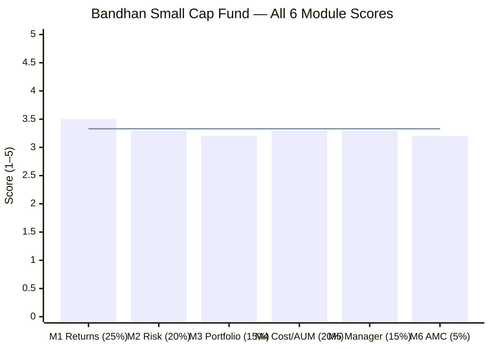
```mermaid
xychart-beta
    title "Bandhan Small Cap Fund — All 6 Module Scores"
    x-axis ["M1 Returns (25%)", "M2 Risk (20%)", "M3 Portfolio (15%)", "M4 Cost/AUM (20%)", "M5 Manager (15%)", "M6 AMC (5%)"]
    y-axis "Score (1–5)" 0 --> 5
    bar [3.50, 3.30, 3.20, 3.30, 3.30, 3.20]
    line [3.33, 3.33, 3.33, 3.33, 3.33, 3.33]
```

> Line = Bandhan SC weighted final score (3.33/5)

| Module | Topic | Weight | Score | Weighted |
|--------|-------|--------|-------|----------|
| Module 1 | Returns Consistency | 25% | 3.50 / 5 | 0.8750 |
| Module 2 | Risk Profile | 20% | 3.30 / 5 | 0.6600 |
| Module 3 | Portfolio DNA | 15% | 3.20 / 5 | 0.4800 |
| Module 4 | Cost & AUM Impact | 20% | 3.30 / 5 | 0.6600 |
| Module 5 | Fund Manager Quality | 15% | 3.30 / 5 | 0.4950 |
| **Module 6** | **AMC Quality** | **5%** | **3.20 / 5** | **0.1600** |
| **TOTAL** | | **100%** | | **3.33 / 5.00** |

> **Bandhan Small Cap Fund Final Score: 3.33 / 5** — ranked #2 of 3 fully studied SC funds (DSP Small Cap: 4.00 | Bandhan SC: 3.33 | Invesco SC: 3.29)

### Score Gap Analysis vs DSP Small Cap

| Module | DSP SC | Bandhan SC | Gap | Primary Driver |
|--------|--------|------------|-----|---------------|
| M1 Returns | 4.50 | 3.50 | −1.00 | Inception bias; split track record; 3yr current team vs 14yr Sambre |
| M2 Risk | 3.80 | 3.30 | −0.50 | Max DD untested at scale; rising vol trend; AUM risk unlived |
| M3 Portfolio | 3.80 | 3.20 | −0.60 | 256 stocks (diffuse); SC% declining; cash drag; highest turnover |
| M4 Cost/AUM | 3.70 | 3.30 | −0.40 | ER advantage vs zero flow discipline |
| M5 Manager | 3.90 | 3.30 | −0.60 | First lead-PM role; 3yr tenure; track record split |
| **M6 AMC** | **4.30** | **3.20** | **−1.10** | **Heritage depth; skin-in-game culture; flow discipline** |
| **Final** | **4.00** | **3.33** | **−0.67** | Institutional discipline and depth dominate the gap |

The M6 gap (−1.10) is the second-largest after M1 (−1.00), confirming that the institutional differences between DSP and Bandhan are as significant as the fund-level return differences. A 25-year clean SEBI record is excellent, but it is not the same as 160 years of capital market heritage with all-employee skin-in-game and documented investor-first flow decisions.

### Score Gap Analysis vs Invesco Small Cap

| Module | Bandhan SC | Invesco SC | Gap | Primary Driver |
|--------|------------|------------|-----|---------------|
| M1 Returns | 3.50 | 3.80 | −0.30 | Invesco's stronger 7.5yr manager continuity; Bandhan's inception split |
| M2 Risk | 3.30 | 3.50 | −0.20 | Bandhan's Max DD artefact concern vs Invesco's higher vol |
| M3 Portfolio | 3.20 | 3.10 | **+0.10** | Bandhan's SC % slightly higher; value tilt is coherent |
| M4 Cost/AUM | 3.30 | 3.20 | **+0.10** | Bandhan's 0.34% ER beats Invesco's 0.66% |
| M5 Manager | 3.30 | 2.80 | **+0.50** | Bandhan's clean manager record; Invesco's SEBI settlement |
| **M6 AMC** | **3.20** | **2.30** | **+0.90** | **Bandhan's 25yr clean record vs Invesco's ₹4.98 Cr settlement** |
| **Final** | **3.33** | **3.29** | **+0.04** | Extremely close; Bandhan edges out on manager + AMC quality |

Bandhan vs Invesco is the closest comparison in the study (3.33 vs 3.29). The M6 advantage for Bandhan (+0.90) reflects the fundamental difference between a 25-year clean AMC heritage and Invesco's documented investor-harmful inter-scheme transfer history.

---

*Module 6 complete. Bandhan Small Cap Fund full analysis across all 6 modules is now complete. Final weighted score: 3.33/5.*

*Bandhan SC research complete: DSP SC (4.00) > Bandhan SC (3.33) > Invesco SC (3.29). Proceed to next fund: BOI Small Cap (Priority #4).*
