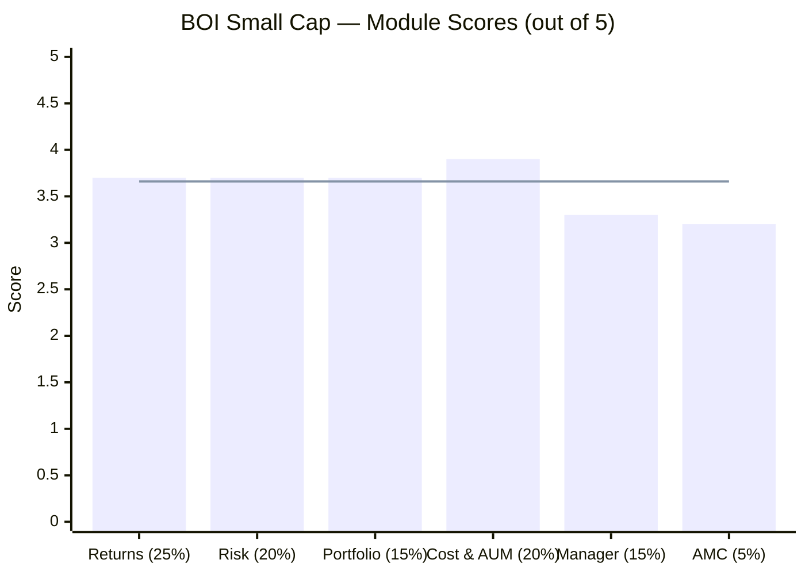
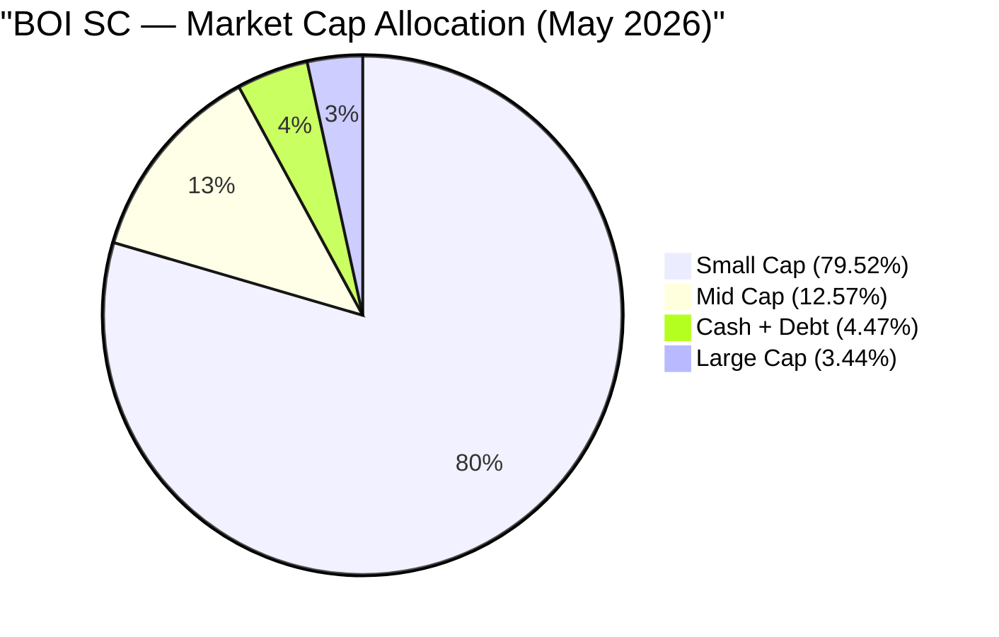
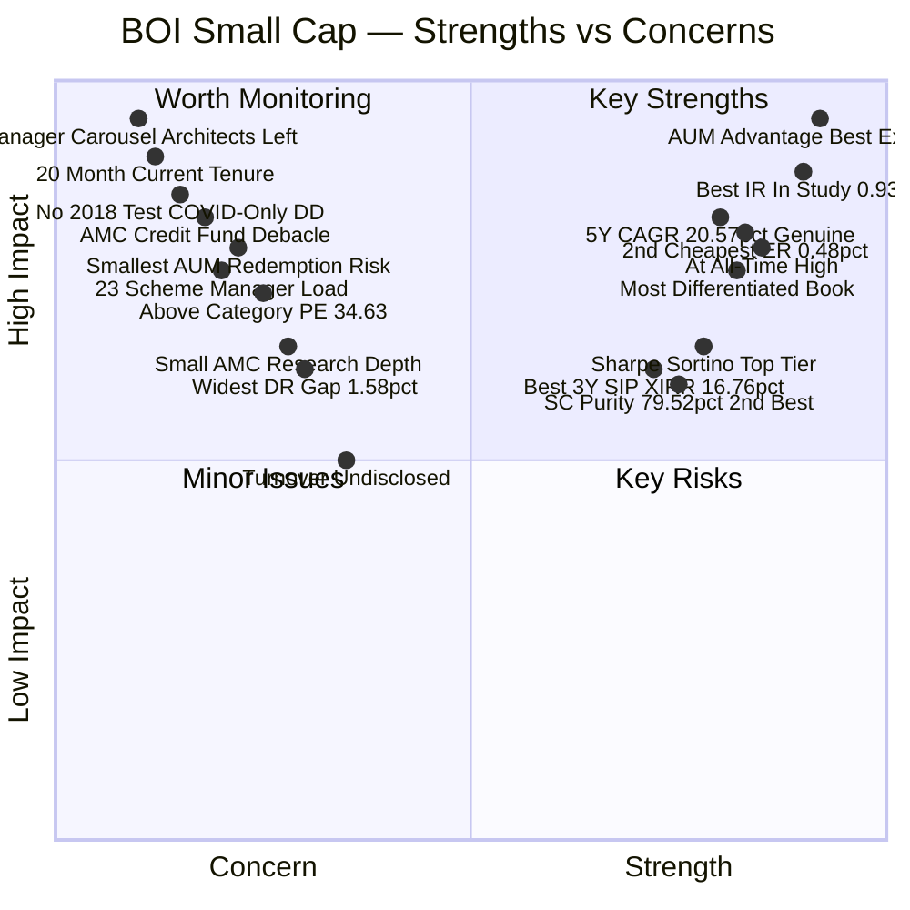
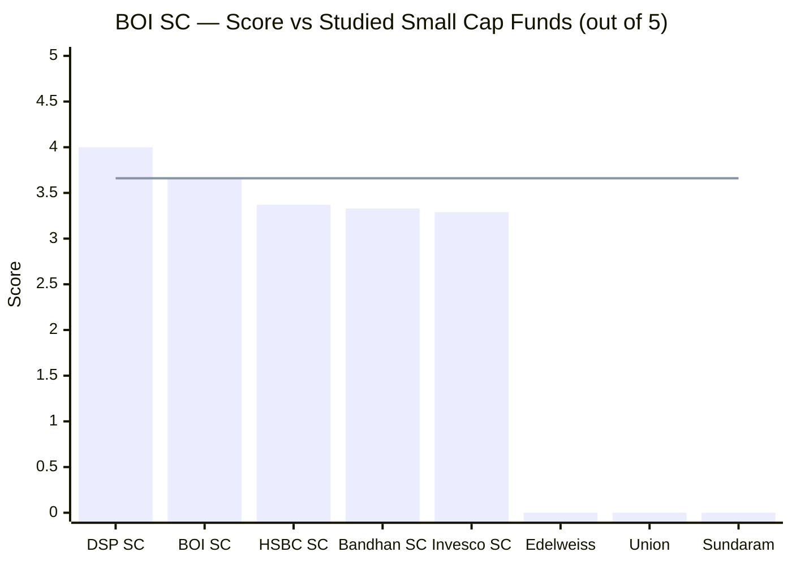
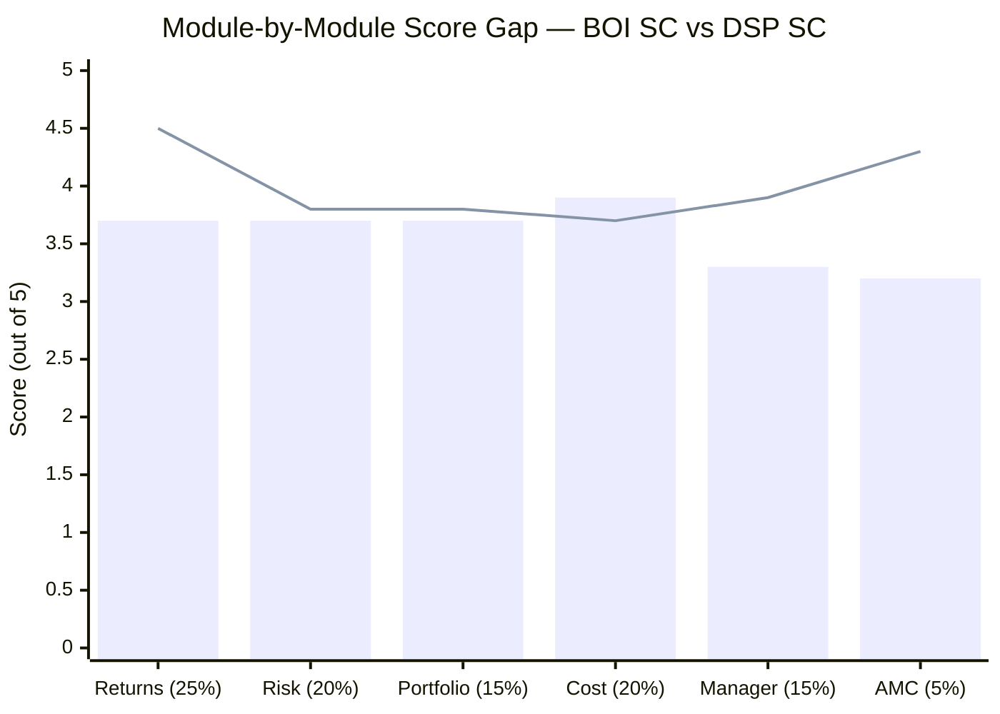
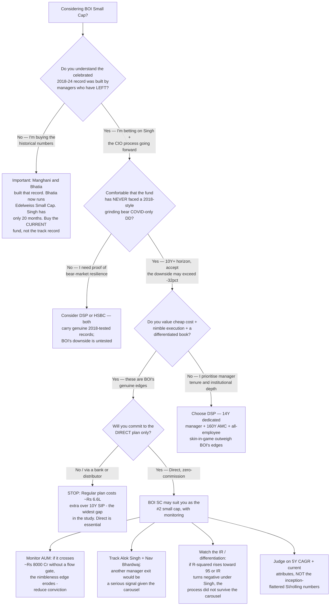
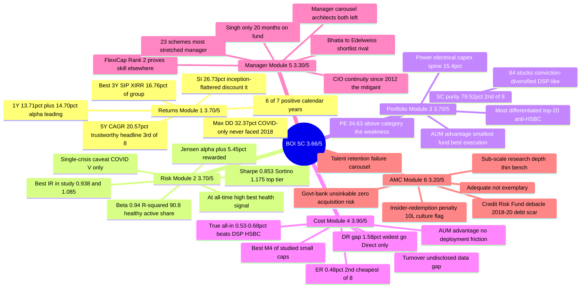

# BOI Small Cap Fund — Deep Study

## Fund Identity

| Field | Value |
|-------|-------|
| **AMC** | Bank of India Investment Managers Pvt. Ltd. |
| **AMC Parent** | Bank of India (government-owned PSU bank; GoI ~73%) — 100% owned since AXA exit |
| **AMC Heritage** | Formerly BOI AXA Investment Managers (JV est. 2008); AXA stake bought out Dec 2021; renamed **April 12, 2022** |
| **Fund Inception** | **December 19, 2018** (~7.5 years; inception NAV ₹10.01) |
| **Manager Since** | **October 1, 2024** — Alok Singh (CIO) — **~20 months** |
| **Co-Manager Since** | **July 14, 2025** — Nav Bhardwaj |
| **Predecessor PMs** | Dhruv Bhatia (2022–Oct 2024 → **left for Edelweiss Small Cap**); Aakash Manghani (2018–22 → **left for Trust MF**) |
| **Category** | Small Cap Fund (Equity) |
| **Benchmark** | Nifty Smallcap 250 TRI (mandate: BSE 250 SmallCap TRI) |
| **AUM (Direct Plan)** | ₹2,318 Cr (June 2026) — **smallest of the 8 shortlisted** |
| **Current NAV (Direct Growth)** | ₹58.59 (June 12, 2026) — **at all-time high** |
| **Expense Ratio (Direct)** | **~0.48%** — 2nd cheapest of the 8 shortlisted |
| **Expense Ratio (Regular)** | ~2.07% |
| **Direct-Regular Gap** | **~1.58%** — widest of all studied SC funds |
| **Exit Load** | 1% beyond 10% units within 365 days; Nil after |
| **Min SIP** | ₹1,000 |
| **Min Lumpsum** | ₹5,000 |
| **Lock-in** | None |
| **VRO Rating** | **4★** — highest of any studied SC fund |

---

## The One-Line Context

BOI Small Cap Fund is the study's **"buy the current fund, not the historical track record"** case — a cheap (~0.48% ER), nimble (₹2,318 Cr, smallest of the shortlist), genuinely differentiated small-cap fund whose *current* attributes are excellent: it sits at its all-time high, posts the best Information Ratio of any studied SC fund (0.938), runs the most non-consensus top-20 in the study, and enjoys the one structural edge every larger fund lacks — full access to the inefficient micro-cap universe with no deployment friction. But its celebrated 2018–2024 record (26.7% since-inception CAGR, +55%/+74% capture years) was built by **two managers who have both left the AMC** (Aakash Manghani → Trust MF; Dhruv Bhatia → *Edelweiss Small Cap, a shortlist rival*), leaving a proven-but-stretched CIO (Alok Singh, 23 schemes) with only ~20 months on the fund; the record is also **inception-flattered** (Dec-2018 launch skipped the 2018 IL&FS crash, so its only real drawdown is a fast COVID V) and sits on a **small, government-bank AMC carrying a genuine debt-side governance scar** (the 2018–20 BOI AXA Credit Risk Fund debacle + an insider-redemption penalty). The result — **3.66/5, #2 of the studied small caps behind only DSP** — is honest: the cheap-nimble-differentiated strengths sit in the high-weight modules (M1/M2/M4 = 65%), and the manager/AMC concerns sit in the low-weight modules (M5/M6 = 20%).

---

## Module Status

| Module | Weight | Status | Score | File |
|--------|--------|--------|-------|------|
| 1 — Returns Consistency | 25% | ✅ Complete | 3.70/5 | [module1_returns.md](module1_returns.md) |
| 2 — Risk Profile | 20% | ✅ Complete | 3.70/5 | [module2_risk.md](module2_risk.md) |
| 3 — Portfolio DNA | 15% | ✅ Complete | 3.70/5 | [module3_portfolio.md](module3_portfolio.md) |
| 4 — Cost & AUM Impact | 20% | ✅ Complete | 3.90/5 | [module4_cost.md](module4_cost.md) |
| 5 — Fund Manager Quality | 15% | ✅ Complete | 3.30/5 | [module5_manager.md](module5_manager.md) |
| 6 — AMC Quality | 5% | ✅ Complete | 3.20/5 | [module6_amc.md](module6_amc.md) |

---

## Final Scorecard

> Bars = module scores | Line = overall weighted score (3.66/5)

| Module | Score | Weight | Weighted Score |
|--------|-------|--------|----------------|
| 1 — Returns Consistency | 3.70/5 | 25% | 0.9250 |
| 2 — Risk Profile | 3.70/5 | 20% | 0.7400 |
| 3 — Portfolio DNA | 3.70/5 | 15% | 0.5550 |
| 4 — Cost & AUM Impact | 3.90/5 | 20% | 0.7800 |
| 5 — Fund Manager Quality | 3.30/5 | 15% | 0.4950 |
| 6 — AMC Quality | 3.20/5 | 5% | 0.1600 |
| **Overall** | — | **100%** | **3.66 / 5.00** |

> **The structural story in one line:** BOI's strengths sit in the high-weight modules (Returns 25% + Risk 20% + Cost 20% = 65%) and its weaknesses in the low-weight modules (Manager 15% + AMC 5% = 20%). The weighting rewards the cheap-nimble-differentiated profile, landing BOI at **#2 overall**.

---

## Key Performance Metrics

| Metric | Value | Context |
|--------|-------|---------|
| **1Y CAGR** | **13.71%** | **+14.70% alpha** (benchmark −0.99%) — leading strongly |
| **3Y CAGR** | **22.56%** | +4.18% vs benchmark — genuine recent alpha |
| **5Y CAGR** | **20.57%** | ⭐ **The trustworthy headline — #3 of 8; +5.39% vs benchmark** |
| **7Y CAGR** | **27.61%** | Inception-flattered (post-IL&FS start) |
| **Since Inception CAGR** | **26.73%** (Dec 2018–Jun 2026) | ⚠️ **Heavily inception-flattered — discount this** |
| **Max Drawdown** | **−32.37%** | ✅ 2nd-shallowest of 8 — but **COVID-only V (137-day recovery); never faced 2018** |
| **% from ATH** | **0.00%** | ⭐ **At all-time high — best portfolio-health signal in the study** |
| **Sharpe (3Y / 5Y)** | **0.853 / 0.802** | Top-tier, stable; screening Sharpe 0.491 = 2nd of 8 |
| **Sortino (3Y / 5Y)** | **1.175 / 1.099** | Above 1.0 on both windows |
| **Beta (3Y)** | **0.94** | Sensible — market-coupled, not a leveraged tracker |
| **R² (3Y)** | **90.8** | ✅ Healthy active share (~9% independent) — not index-hugging |
| **Jensen Alpha (3Y / 5Y)** | **+5.45% / +6.47%** | ⭐ Active management genuinely rewarded (inverse of HSBC) |
| **Information Ratio (3Y / 5Y)** | **0.938 / 1.085** | ⭐ **Best IR of any studied SC fund** |
| **Calmar (5Y)** | **0.636** | 2nd-best of 8 (flattered by shallow COVID-only DD) |
| **Up-Capture (annual)** | **126%** | Aggressive, proven participation |
| **Down-Capture** | Mixed | Positive in 2 of 3 down-years; mild 2025 miss — **largely unproven** |
| **3Y SIP XIRR** | **16.76%** | ⭐ Best of group through the 2025 slump (HSBC 8.71%, DSP 12.78%) |
| **Portfolio PE** | **34.63** | ⚠️ Above category (31.60) — thin valuation cushion |
| **Portfolio Turnover** | **Undisclosed** | ⚠️ Not published anywhere — the one unresolved cost variable |
| **Total Holdings** | **84 stocks** | Conviction-diversified (DSP-like) |
| **Small Cap %** | **79.52%** | 2nd-highest purity of 8 (after DSP) |
| **Cash** | ~3.1% | Thin operational buffer |

---

## ⚠️ The Five Critical Flags — Read Before the Numbers

### Flag 1 — ⭐ The Manager Carousel: The Track Record Belongs to Departed Managers
This is the single most important fact about BOI Small Cap. The celebrated 2018–2024 record was built across **three manager regimes in 7.5 years**: Aakash Manghani + Dhruv Bhatia (2018–22, built the +55% 2020 / +74% 2021 years), then Dhruv Bhatia solo (2022–24, built the +43% 2023), then **Alok Singh from October 1, 2024 (~20 months)**. Both architects left the AMC — Manghani to Trust MF, and **Dhruv Bhatia to Edelweiss Small Cap, a fund in this very shortlist.** Alok Singh built *none* of the historical numbers. The mitigant: Singh has been BOI's CIO since April 2012 (process owner since before the fund launched) and runs the Rank-#2 BOI FlexiCap — so it's process continuity, not a cold handover. But read the track record as the work of people who no longer run the fund.

### Flag 2 — Inception Bias: The Record Skipped the 2018 Crash
BOI launched December 19, 2018 — two months *after* the IL&FS small-cap bottom. Its entire history begins at the post-crash floor and rides the recovery up. The since-inception CAGR (26.73%), the 7Y (27.61%), and the spotless zero-negative rolling distributions are **inception-flattered** — measured from the floor of the worst small-cap bear, which the fund never actually experienced. The trustworthy number is the **5Y CAGR (20.57%)**; discount the SI/7Y/rolling figures. Consequence: the fund's only real drawdown (−32.37%) is a fast COVID V — it has **never been tested by a grinding multi-year bear** like DSP and HSBC have.

### Flag 3 — ⭐ The AUM Advantage (The Positive Flag): Smallest Fund = Best Execution
Uniquely among the studied funds, BOI's size is a *strength*, not a constraint. At ₹2,318 Cr — the smallest in the shortlist — a 1% position requires only ~₹23 Cr, deployable in 1–3 days with negligible market impact. BOI has **full access to the inefficient micro-cap universe** that DSP (₹17,906 Cr) and HSBC (₹16,394 Cr) have structurally outgrown, with no forced-buyer dynamics and no deployment backlog. This is the structural source of its best-in-study Information Ratio (0.938) and its differentiated, non-consensus portfolio. The flip side: **redemption fragility** — the smallest fund is most vulnerable to forced selling in a sustained-outflow bear (untested).

### Flag 4 — The AMC's Debt-Side Governance Scar
BOI's AMC carries a genuine governance blemish — not on equity, but on the debt side. The **BOI AXA Credit Risk Fund debacle (2018–2020)** destroyed real capital: an IL&FS write-off, a single defaulted issuer (Sintex-BAPL) at >20% of scheme assets, a full DHFL write-off, and ~30% of capital wiped. Layered on top, SEBI fined BOI's **Head of Operations ₹10 lakh for redeeming his own units using non-public devaluation information** — a compliance-culture lapse. These are confined to the debt franchise and predate the 2022 rename, but they're worse *in character* than DSP's or HSBC's procedural fines. The equity CIO (Singh) is personally clean.

### Flag 5 — The "Stay Small" Paradox + the Widest Direct-Regular Gap
BOI's entire edge depends on it **staying small.** If strong performance and the 4★ rating drive AUM toward ₹8,000–10,000 Cr, the fund inherits exactly the deployment friction that hobbles DSP/HSBC — and there's no track record of the AMC restricting flows to protect the strategy (it's never been big enough to need to). Separately, the **Direct–Regular ER gap (~1.58%) is the widest in the study** — a regular-plan investor surrenders ~₹6.6L over a 10-year ₹20K SIP. **For BOI, going Direct is non-negotiable.**

---

## Portfolio DNA

| Metric | Value | Significance |
|--------|-------|--------------|
| **Equity** | **~95.5–96.9%** | Near-fully invested |
| **Small Cap %** | **79.52%** | ✅ 2nd-highest purity of 8 (after DSP 87.35%) |
| Mid Cap % | 12.57% | Graduation drift |
| Large Cap % | 3.44% | Minor PSU drift (Indian Bank, Hindustan Copper) |
| Cash + Debt | **~4.5%** | Thin operational buffer |
| **Total Holdings** | **84 stocks** | Conviction-diversified — DSP-like, not diffuse |
| Top-10 Concentration | **26.6%** | Genuine conviction; top holding only 3.86% |
| Top-20 Concentration | ~45.3% | — |
| Portfolio PE | **34.63** | ⚠️ Above category (31.60) — the clear weakness |
| Turnover | **Undisclosed** | Not published anywhere |
| AUM | ₹2,318 Cr | ⭐ Smallest of 8 — the execution advantage |
| Lead Sector | **Electrical/Power-Capex 15.4%** | Energy-transition spine, played via small names |
| Top-20 consensus overlap | **~1 name (Apar)** | ⭐ Most differentiated book in the study (anti-HSBC) |

### Key Structural Insight — The Nimbleness Triad

Three portfolio facts that explain BOI's best-in-study Information Ratio (0.938):

1. **₹2,318 Cr AUM** — small enough to take meaningful positions in genuine micro-caps without market impact
2. **84 conviction-diversified stocks** — DSP-like concentration (top-10 26.6%), not an AUM-forced 109-stock spray
3. **~1 consensus name in the top-20** — genuinely differentiated, independent stock-picking

These three together make genuine active return *possible* — the structural opposite of HSBC's index-hugging triad (109 stocks + zero cash + category PE → R² 95.96). BOI's R² of 90.8 and IR of 0.938 are the output.

---

## Strengths vs Concerns

---

## Key Strengths

- **⭐ The AUM advantage — the inverse of every larger fund's weakness.** At ₹2,318 Cr, BOI has full access to the inefficient micro-cap universe (1% position ≈ ₹23 Cr, deployable in days), no deployment friction, and no forced-buyer dynamics. DSP and HSBC are fighting an AUM ceiling; BOI can actually do what a small-cap fund is supposed to do. This is the structural source of its differentiated book and best-in-study IR.

- **⭐ Best Information Ratio of any studied SC fund (0.938 / 1.085).** Active management is genuinely rewarded — positive Jensen alpha (+5.45% 3Y / +6.47% 5Y), healthy R² (90.8, ~9% independent return), sensible beta (0.94). The exact inverse of HSBC's index-hugging (IR −0.61).

- **At its all-time high (0.00% from ATH).** The cleanest portfolio-health signal in the entire study — ahead of DSP (−2.22%) and far ahead of HSBC (−8.74%, 548 days underwater). The underlying book fully recovered from both COVID and the 2025 dip.

- **2nd-cheapest Direct ER (~0.48%) — paired with a 4★ rating.** Cheaper than DSP (0.64%), HSBC (0.73%), Invesco (0.59%); only Bandhan (0.34%) is lower. Uniquely, it is simultaneously among the cheapest *and* the highest-rated — cheap is not a proxy for low quality.

- **Most differentiated portfolio in the study.** Only ~1 of the top-20 (Apar Industries) overlaps with peers' top holdings — the anti-HSBC. Distinctive picks (Wockhardt, Sky Gold, Acutaas Chemicals, Lloyds Metals, Quality Power, CAMS) reflect genuine independent stock-picking enabled by the small AUM.

- **Strong, stable risk-adjusted metrics.** Sharpe 0.853 (3Y) / 0.802 (5Y), Sortino 1.175 / 1.099, Calmar 0.636 (2nd-best) — no recent collapse (unlike HSBC), no negative-Sharpe artifact.

- **2nd-highest small-cap purity (79.52%).** Genuine, pure small-cap exposure — second only to DSP; for a ₹20K SIP, ~₹15,900/month reaches actual small caps.

- **Best 3Y SIP resilience through the 2025 slump (16.76% XIRR).** Sailed through 2025 far better than HSBC (8.71%) and DSP (12.78%) on a SIP basis.

- **Government-bank parent = financial unsinkability + zero acquisition risk.** Bank of India (GoI-owned) guarantees the AMC's survival and ownership continuity — the opposite of Invesco's four ownership changes.

---

## Key Concerns

- **⭐ The manager carousel — the track record belongs to departed managers.** Both architects of the 2018–2024 record left (Manghani → Trust MF; Bhatia → Edelweiss Small Cap, a shortlist rival). Current lead Alok Singh has only ~20 months on the fund and built none of the celebrated history. Cushioned by 14-year CIO continuity, but the attribution seam is the largest of any studied fund.

- **No 2018 / multi-cycle test.** The record begins post-IL&FS; the only real drawdown (−32.37%) is a fast COVID V. The fund has never lived through a grinding small-cap winter — its celebrated resilience is unproven in the stress that matters most, and the current manager has faced *no* crisis on this mandate.

- **The AMC's debt-side governance scar.** The BOI AXA Credit Risk Fund debacle (2018–20: Sintex >20% concentration, DHFL write-off, ~30% capital wiped) plus a ₹10L insider-redemption penalty are genuine governance/competence failures — worse in character than DSP/HSBC's procedural fines, though confined to the debt side.

- **Above-category portfolio PE (34.63).** No valuation cushion — a small-cap de-rating would bite harder than the lower-PE peers (DSP 29.54, Bandhan 18.53). The clearest portfolio weakness, and looser than Singh's own cheaper FlexiCap.

- **Smallest-AUM redemption fragility.** The execution advantage's flip side: in a sustained-outflow bear, the smallest fund faces forced selling of illiquid small-caps at distressed prices — the one stress the 2018-free history has never tested.

- **23-scheme manager load + sub-scale AMC research depth.** Alok Singh runs 23 schemes (the most stretched manager of the group); the small AMC (~₹13,400 Cr, ~₹85 Cr revenue) funds a thin research bench versus DSP/HSBC's ~₹170–179 Cr.

- **Widest Direct–Regular gap (~1.58%).** Regular-plan investors surrender ~₹6.6L over a 10-year ₹20K SIP; the regular ER (~2.07%) sits near the SEBI ceiling.

- **Turnover undisclosed.** Not published anywhere — the one unresolved cost variable; true all-in cost is a range (~0.53–0.68%) rather than a point estimate.

- **The edge depends on staying small.** Success could drive AUM up and erode the execution advantage; no flow-discipline track record exists.

---

## Comparison vs Small Cap Shortlist

> Line = BOI score (3.66/5) | 3 peers not yet studied

| Rank | Fund | Score | Status | Key Differentiator |
|------|------|-------|--------|-------------------|
| 1 | **DSP Small Cap** | **4.00/5** | ✅ Complete | 14Y dedicated manager; all-employee skin-in-game; flow discipline; 87% SC |
| 2 | **BOI Small Cap** | **3.66/5** | ✅ Complete | Cheap + nimble + differentiated + best IR — vs manager carousel, no 2018 test, AMC scar |
| 3 | **HSBC Small Cap** | **3.37/5** | ✅ Complete | 12Y genuine record, 2018 protection — vs open-door AUM, highest cost, index-hugging |
| 4 | **Bandhan Small Cap** | **3.33/5** | ✅ Complete | Cheapest ER — vs inception bias, first-PM risk, AUM explosion |
| 5 | **Invesco India SC** | **3.29/5** | ✅ Complete | AUM sweet spot; raw returns — vs SEBI settlement, 4 ownership changes |
| — | Edelweiss Small Cap | Pending | — | Now run by ex-BOI Dhruv Bhatia (built BOI's record) |
| — | Union Small Cap | Pending | — | Highest Tickertape alpha (7.89) |
| — | Sundaram Small Cap | Pending | — | Longest track record (20Y+) |

> **BOI vs HSBC (3.66 vs 3.37):** BOI wins on the high-weight modules — cheaper (0.48% vs 0.73% ER), nimbler (₹2,318 Cr vs ₹16,394 Cr), more differentiated (R² 90.8/IR +0.938 vs R² 95.96/IR −0.61), and at its ATH vs HSBC's 548 days underwater. HSBC wins on the things BOI lacks — a genuine 2018-tested record and 6.5 years of continuous manager tenure vs BOI's 20-month carousel. The verdict favours BOI because the cost/execution/differentiation advantages sit in the 65%-weight modules, while the manager/heritage gaps sit in the 20%-weight modules.

---

## Score Gap Analysis — BOI vs DSP (Reference Fund)

> Bars = BOI SC | Line = DSP SC

| Module | BOI | DSP | Gap | Primary Driver of Gap |
|--------|-----|-----|-----|-----------------------|
| Returns (25%) | 3.70 | 4.50 | **−0.80** | Inception bias (no 2018 test); record built by departed managers; SI/rolling flattered |
| Risk (20%) | 3.70 | 3.80 | **−0.10** | Near-parity — BOI at ATH + best IR offset by single-crisis (COVID-only) history |
| Portfolio (15%) | 3.70 | 3.80 | **−0.10** | Near-parity — BOI's AUM advantage + differentiation offset by above-category PE |
| Cost (20%) | 3.90 | 3.70 | **+0.20** | ✅ BOI *wins* — cheaper ER + best execution headroom |
| Manager (15%) | 3.30 | 3.90 | **−0.60** | 20-month carousel vs 14Y dedicated Sambre + Ghosh co-manager |
| AMC (5%) | 3.20 | 4.30 | **−1.10** | Small PSU AMC + debt-fund scar vs 160Y family house + all-employee skin-in-game |
| **Overall** | **3.66** | **4.00** | **−0.34** | Manager + AMC are the dominant gaps; BOI actually *leads* on cost |

**Key insight:** BOI is the *only* studied fund to **beat DSP on a module (Cost, +0.20)** — its small-AUM execution edge is genuinely superior to DSP's scale-constrained position. BOI also runs near-parity with DSP on Risk and Portfolio. The entire 0.34-point gap to DSP is concentrated in **Manager (−0.60) and AMC (−1.10)** — i.e., DSP's 14-year dedicated manager and 160-year institutional house vs BOI's 20-month manager carousel and small PSU AMC. If BOI had DSP's manager/AMC stability, it would be the #1 fund. That single sentence is the BOI investment case and its caveat.

---

## ₹20K/Month SIP Projections (10 Years)

| Scenario | CAGR Assumption | Projected Corpus | Multiple of Principal |
|----------|----------------|------------------|-----------------------|
| Bear (AUM bloat erodes edge + SC cycle down) | 13% | ₹48.5 lakh | 2.02× |
| Conservative (edge partly fades as fund grows) | 16% | ₹60.1 lakh | 2.50× |
| Base case (nimble edge + Singh process holds) | 18% | ₹69.1 lakh | 2.88× |
| Optimistic (stays small; IR sustains under Singh) | 21% | ₹86.1 lakh | 3.59× |

**Total invested over 10 years:** ₹24,00,000

**Cost comparison on identical gross returns (18% CAGR, ₹20K SIP, 10Y):**
- BOI at ~0.48% Direct ER: among the lowest total cost of the studied funds (~₹0.8L cheaper than DSP, ~₹1.1L cheaper than HSBC on ER drag alone)
- **BOI Regular plan at ~2.07%: costs ~₹6.6L extra vs BOI Direct over 10Y — the widest Direct-Regular penalty in the study; never invest in regular**

> **The cost reality:** BOI's ~0.48% Direct ER is the 2nd-cheapest of the shortlist, and its small AUM caps hidden turnover/impact costs regardless of the (undisclosed) turnover figure — making its true all-in (~0.53–0.68%) competitive with the cheapest funds. But the ~1.58% Direct-Regular gap means the *route* of purchase matters more for BOI than for any other studied fund.

---

## Investment Decision Framework

---

## BOI Small Cap — In One View

---

## The Critical Facts — In 10 Sentences

1. BOI Small Cap is the #2 small cap in the study (3.66/5) behind only DSP (4.00) — its strengths (cheap cost, nimble AUM, differentiated portfolio, strong risk-adjusted returns) sit in the high-weight modules (M1/M2/M4 = 65%), and its weaknesses (manager carousel, small-AMC scar) sit in the low-weight modules (M5/M6 = 20%).

2. The celebrated 2018–2024 track record was built by Aakash Manghani and Dhruv Bhatia — both of whom left the AMC; Bhatia now runs Edelweiss Small Cap, a fund in this very shortlist — and the current lead, Alok Singh, has managed the fund for only ~20 months and built none of the historical numbers.

3. Alok Singh has been BOI's CIO since April 2012 (the process owner since before the fund launched) and runs the Rank-#2 BOI FlexiCap — so his October-2024 takeover is process continuity, not a cold handover, but his small-cap track record is just 20 months long.

4. The since-inception CAGR (26.73%) is heavily inception-flattered — the fund launched in December 2018, two months after the IL&FS bottom, and skipped the 2018 crash entirely; the trustworthy headline is the 5Y CAGR of 20.57% (#3 of 8), and the fund's only real drawdown (−32.37%) is a fast COVID V, not a grinding bear.

5. BOI's defining edge is its AUM: at ₹2,318 Cr — the smallest of the shortlist — it has full access to the inefficient micro-cap universe with no deployment friction, the structural source of its best-in-study Information Ratio (0.938) and its most-differentiated-in-study portfolio (only ~1 consensus name in the top-20).

6. The fund sits at its all-time high (0.00% from peak) — the cleanest portfolio-health signal in the entire study — with top-tier, stable risk-adjusted metrics (Sharpe 0.853, Sortino 1.175, Calmar 0.636) and positive Jensen alpha (+5.45% 3Y), the exact inverse of HSBC's index-hugging.

7. The Direct ER (~0.48%) is the 2nd-cheapest of the 8 shortlisted funds, paired with the only 4★ rating in the study — but the Direct–Regular gap (~1.58%) is the widest in the study, so a regular-plan investor surrenders ~₹6.6L over a 10-year ₹20K SIP.

8. The AMC (Bank of India Investment Managers, 100% government-bank-owned since the 2021 AXA exit) is financially unsinkable with zero acquisition risk — but carries a genuine debt-side governance scar: the 2018–20 BOI AXA Credit Risk Fund debacle (Sintex >20% concentration, DHFL write-off, ~30% capital wiped) plus a ₹10L insider-redemption penalty.

9. The portfolio's clear weakness is its above-category PE (34.63, vs category 31.60) — thin valuation cushion in a de-rating — and the small AMC's sub-scale research budget (~₹85 Cr revenue) plus Singh's 23-scheme load constrain the institutional depth behind the fund.

10. BOI is a genuine #2 for a Direct-plan SIP investor who buys the *current* fund — cheap, nimble, differentiated, at ATH — rather than the *historical* track record, provided they judge it on the 5Y CAGR (not the inception-flattered SI figures), commit to the Direct plan, and monitor AUM growth (the edge depends on staying small) and manager continuity (given the carousel).

---

## Quick Verdict

**Best suited for:**
- **Cost-and-execution-focused Direct-plan investors** — BOI offers the 2nd-cheapest ER + the best execution headroom in the study; for a self-directed SIP investor, this is the most efficient cost/AUM package available
- Those who want **genuine, differentiated small-cap alpha** — the non-consensus book (best IR in study, 0.938) is the structural opposite of HSBC's index-hugging; if you already hold a large-cap-tilted core, BOI is a true differentiated satellite
- Investors who value **portfolio health and risk-adjusted quality** — at ATH, top-tier Sharpe/Sortino, positive alpha, healthy active share
- **Believers in Alok Singh's process** — those who trust the proven CIO (FlexiCap #2) and the house process to reproduce results going forward, rather than needing the historical track record to be the current manager's
- Investors comfortable with a **small, government-bank AMC** — who value financial unsinkability and zero acquisition risk over deep research infrastructure

**Not suited for:**
- Investors who **buy the historical track record** — that record belongs to departed managers; the current manager has 20 months and the fund has never faced a 2018-style bear
- Those who **need bear-market-tested resilience** — BOI's only drawdown is a fast COVID V; its celebrated downside protection is largely unproven (the 2025 down-year was a mild miss)
- **Manager-continuity purists** — a 3-regime carousel in 7.5 years, with both architects gone, is the weakest tenure profile of the studied funds
- Investors who weight **institutional depth and governance heritage** heavily — a small PSU AMC with a debt-fund scar and a thin research bench is a clear tier below DSP/PP
- **Regular-plan / distributor-channel investors** — the ~1.58% Direct-Regular gap is the widest in the study; BOI must be bought Direct
- **Set-and-forget investors** — BOI requires monitoring AUM growth (the edge depends on staying small) and manager continuity (given the carousel history)

---

## BOI SC vs DSP vs HSBC — Three-Fund Comparison

| Dimension | BOI SC | DSP SC | HSBC SC |
|-----------|--------|--------|---------|
| **Headline 5Y CAGR** | 20.57% | 19.18% | 18.93% |
| **Inception-adjusted** | ⚠️ flattered (no 2018) | **~20.85% ✅ (no bias)** | **~20.18% ✅ (no bias)** |
| SC purity | 79.52% | **87.35% ✅** | 69.5% |
| Max drawdown | **−32.37% (COVID-only)** | −49% (2 crises) | −52.45% (2 crises) |
| % from ATH | **0.00% ✅** | −2.22% | −8.74% |
| AUM | **₹2,318 Cr (advantage) ✅** | ₹17,906 Cr (constrained) | ₹16,394 Cr (constrained) |
| ER (Direct) | **~0.48% ✅** | 0.64% | 0.73% |
| Direct-Regular gap | ⚠️ 1.58% (widest) | 1.03% | **0.70% ✅** |
| Information Ratio (3Y) | **+0.938 ✅ (best)** | +0.17 | −0.61 ⚠️ |
| R² (3Y) | 90.8 ✅ | 90.95 ✅ | 95.96 ⚠️ |
| Portfolio PE | ⚠️ 34.63 | **29.54 ✅** | 32.25 |
| Lead manager tenure | ⚠️ 20 months | **14 years ✅** | 6.5 years |
| Bear-tested (as lead) | ❌ No | **Yes ✅** | **Yes ✅** |
| Manager stability | ⚠️ 3-regime carousel | **Stable + co-mgr ✅** | Co-mgr carousel |
| AMC quality | Govt-bank; debt scar | **160Y family; skin-in-game ✅** | Global bank; open-door |
| **Final Score** | **3.66/5** | **4.00/5** | **3.37/5** |

---

## One-Line Verdict

BOI Small Cap is the study's cheap, nimble, differentiated #2 — the only fund whose smallest-in-shortlist AUM is a genuine execution *advantage*, delivering the best Information Ratio in the study, a fresh all-time high, and the 2nd-cheapest cost, all of which sit in the high-weight modules — let down by a manager carousel whose track-record architects have both departed (one to a shortlist rival), an inception-flattered, 2018-untested history, and a small government-bank AMC carrying a debt-side governance scar, all of which sit in the low-weight modules. **A fund to buy for what it is now, not for the record it inherited: 3.66/5, #2 behind only DSP.**

---

*Study completed: June 2026 | Framework: 6-Module Weighted Scoring | Final Score: 3.66/5 | Small Cap Rank: #2 of 5 evaluated (8 funds shortlisted; 3 pending)*
