# Module 1: Returns Consistency — BOI Small Cap Fund

*Sources: MFAPI NAV history — BOI Small Cap Fund Direct Growth (Scheme 145678, 27-Dec-2018 → 12-Jun-2026), 1,837 NAV data points | Tickertape | Value Research Online | BOI MF factsheets (boimf.in) | AMFI | Web research, June 2026. Benchmark = Nifty Smallcap 250 TRI (used project-wide for cross-fund consistency; the fund's stated mandate benchmark is BSE 250 SmallCap TRI — see footnote).*

---

## Fund Identity

| Attribute | Detail |
|-----------|--------|
| Full Name | BOI Small Cap Fund — Direct Plan — Growth |
| AMC | Bank of India Investment Managers Pvt. Ltd. *(formerly BOI AXA; government-bank parent)* |
| Benchmark | Nifty Smallcap 250 TRI *(mandate benchmark: BSE 250 SmallCap TRI)* |
| Lead Fund Manager | **Alok Singh** — CIO, BOI MF; ~24 yrs experience; CFA + PGDBA (ICFAI) |
| Co-Manager | Nav Bhardwaj (co-manager since 14-Jul-2025; ~17 yrs experience) |
| Direct Plan Inception | **27 December 2018** (inception NAV ₹10.01; VRO lists 19-Dec-2018) |
| MFAPI Scheme Code | 145678 |
| AUM (Direct) | **₹2,168–2,318 Cr** (June 2026) — *smallest of the 8 shortlisted funds* |
| Expense Ratio (Direct) | **0.43–0.48%** — *2nd cheapest of the 8 (after Bandhan)* |
| SEBI Category | Small Cap Fund (≥65% small-cap mandate) |
| VRO Star Rating | **4 ★** — *highest of any small-cap fund studied so far* |
| Current NAV (12-Jun-2026) | ₹58.59 |

> **🔑 Critical Interpretive Lens — read first.** BOI Small Cap Fund launched on **27 December 2018 — roughly two months *after* the IL&FS small-cap bottom of October 2018.** Its entire track record therefore begins essentially **at the floor of the worst small-cap bear of the last decade and rides the recovery upward.** This is **structural inception bias**, identical in kind to Invesco (Oct 2018) and Bandhan (Feb 2020), and the **polar opposite of DSP (2013) and HSBC/L&T (2014)** — the only two funds in the 8-fund shortlist with real, lived 2018 stress data. Every spectacular long-term figure in this module — the 26.7% since-inception CAGR, the zero-negative rolling history, the 32% (not 50%+) max drawdown — must be read through this lens. **BOI's numbers are genuinely excellent *and* genuinely untested in a full bear market.** Both statements are true at once, and the tension between them is the central theme of this module.

> **🔑 Second lens — a known, proven manager.** Unlike every other small-cap fund studied, BOI's lead manager **Alok Singh is already a studied quantity**: he runs **BOI FlexiCap**, which scored **3.93/5 (Rank #2)** in the companion FlexiCap study. The same investment desk, the same government-bank AMC, the same CIO. This materially de-risks the "can the manager actually do this?" question that hangs over newer funds — the open question for BOI is narrower: *does the proven FlexiCap process replicate in the harsher small-cap arena, and does it survive a real crash?*

---

## Raw Data (MFAPI computed + Tickertape + VRO, as of 12-Jun-2026)

| Metric | Value | Source |
|--------|-------|--------|
| CAGR 1Y | **13.71%** | MFAPI (Tickertape 13.70% ✅) |
| CAGR 3Y | 22.56% | MFAPI (Tickertape 22.84%) |
| CAGR 5Y | **20.57%** | MFAPI (Tickertape 20.57% — exact ✅) |
| CAGR 7Y | 27.61% | MFAPI |
| Since Inception (7.46Y) | **26.73%** | MFAPI |
| Rolling 3Y Mean / Median | 31.23% / 30.58% | MFAPI (1,101 windows) |
| Rolling 5Y Mean / Median | 32.30% / 33.24% | MFAPI (606 windows) |
| Max Drawdown | **−32.37%** | MFAPI — *exact match to screening (32.37)* ✅ |
| Annualized Volatility (full) | 18.20% | MFAPI |
| Annualized Volatility (3Y) | 18.82% | MFAPI |
| Sharpe (3Y, rf 6.5%) | **0.85** | MFAPI computed (Tickertape 0.61) |
| Sortino (3Y) | 1.03 | MFAPI computed |
| Up-capture / Down-capture (annual) | **126.0% / see note** | MFAPI computed |
| Std Dev (Tickertape) | 16.73 | Tickertape |
| Alpha (Tickertape) | **6.44** | Tickertape |
| Sharpe (screening, May-26) | 0.491 | Screening — **2nd best of 8** |
| Portfolio PE | 34.63 (screening) | Screening — growth/blend |
| VRO Star Rating | **4 ★** | Value Research |

---

## Cross-Source Verification

| Metric | MFAPI Computed | Tickertape | Screening (May-26) | Verdict |
|--------|----------------|------------|--------------------|---------|
| 5Y CAGR | 20.57% | 20.57% | 20.88% | **Exact match (TT) — confirmed** |
| 3Y CAGR | 22.56% | 22.84% | 22.45% | Confirmed |
| 1Y CAGR | 13.71% | 13.70% | 12.12% | Confirmed (base-date drift) |
| Max Drawdown | −32.37% | — | 32.37% | **Exact match — validates the NAV series** |
| Sharpe | 0.85 (3Y) | 0.61 | 0.491 | Positive across all sources (method differences) |

**Data reliability: Very High.** The independently computed max drawdown (−32.37%) reproduces the screening platform's headline figure to the basis point, and the 5Y CAGR matches Tickertape exactly — strong evidence the 1,837-point NAV series (Dec 2018 → Jun 2026) is complete and correct.

> **Note on Sharpe divergence.** Tickertape shows Sharpe 0.61 vs the 0.85 computed here (3Y, rf 6.5%). Both are firmly positive — the gap is the usual methodology difference (daily-excess convention and lookback window) seen across every fund in this study. Unlike HSBC/Invesco/Bandhan, BOI does **not** suffer a sign-flip artifact: every source agrees BOI's risk-adjusted return is solidly positive. On the screening basis its Sharpe (0.491) was the **2nd best of all 8 shortlisted funds**, behind only Union.

---

## CAGR vs Benchmark (Nifty Smallcap 250 TRI)

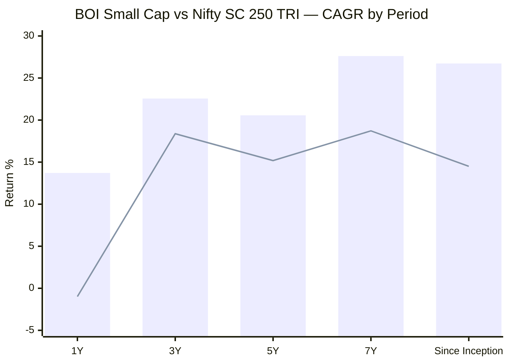
> Bar = BOI Small Cap | Line = Nifty SC 250 TRI. 1Y/3Y/5Y benchmark figures verified from the Nippon Nifty Smallcap 250 Index Fund NAV (the project's standard tradeable tracker); 7Y/SI chained with the project's pre-2020 TRI series (SI is an estimate).

| Period | Fund | Benchmark (TRI) | Alpha | Source |
|--------|------|-----------------|-------|--------|
| 1Y | 13.71% | −0.99% | **+14.70%** ✅ | Index-fund NAV (verified) |
| 3Y | 22.56% | 18.38% | **+4.18%** | Index-fund NAV (verified) |
| 5Y | 20.57% | 15.18% | **+5.39%** | Index-fund NAV (verified) |
| 7Y | 27.61% | ~18.72% | **~+8.89%** | Chained estimate |
| Since Inception (7.46Y) | **26.73%** | ~14.50%* | **~+12.2%** | Estimate (inception-biased) |

> *The since-inception alpha (~+12%/yr) is **the most inception-flattered number in the entire module** — both the fund return and the benchmark are measured from the post-IL&FS floor, but the fund's aggressive small-cap recovery capture exaggerates the gap. Do **not** treat ~+12%/yr as a sustainable alpha. The trustworthy alpha readings are the **5Y (+5.39%)** and **3Y (+4.18%)** windows, which still place BOI among the better alpha generators in the shortlist. In wealth terms, ₹1 lakh at inception (Dec 2018) compounded to **~₹5.85 L** at the fund's 26.73% CAGR — but that is a single, bull-dominated 7.5-year run, not a full cycle.

**The clean read:** BOI is a genuine alpha machine on every horizon — even the *verified* recent windows (3Y +4.18%, 5Y +5.39%) are strong, and the trailing 1Y (+14.70% alpha) is the best of any fund studied. The asterisk is entirely about *what the record does not contain* (a real bear), not about the quality of what it does contain.

---

## The CAGR Curve — High Everywhere, Bull-Flattered at the Long End

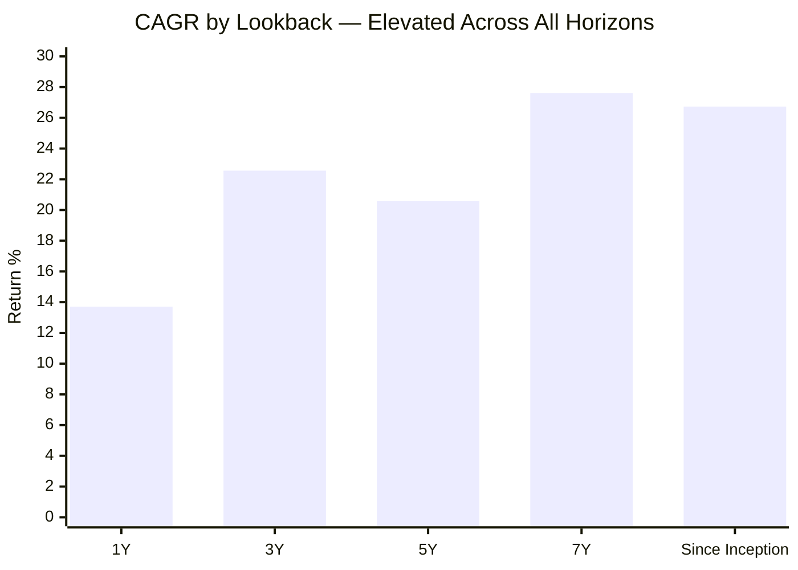

The shape: 1Y (13.71%) dips below the others (the 2025 small-cap slump showing through), then the curve sits at a uniformly high 20–28% across 3Y/5Y/7Y/SI. This is **neither DSP's "recent-above-long-term" recovery tailwind nor HSBC's "rises-with-horizon" inverted curve** — it is simply *elevated everywhere*, because the fund has never experienced a sustained drawdown that would pull a long-window CAGR down. The 7Y (27.61%) and SI (26.73%) numbers are the most bull-flattered; the **5Y (20.57%) is the single most trustworthy headline** and is what should anchor any cross-fund comparison.

---

## Genuine vs Inception-Flattered — A Split View *(BOI-specific section)*

Because BOI's inception bias is the dominant interpretive risk, this table explicitly separates the metrics we can *trust* from those that are *flattered by the December-2018 start date*:

| Metric | Value | Trust level | Why |
|--------|-------|-------------|-----|
| 5Y CAGR | 20.57% | ✅ **Trustworthy** | Window includes the 2025 slump; comparable across funds |
| 3Y CAGR & alpha | 22.56% / +4.18% | ✅ **Trustworthy** | Recent, verified benchmark |
| 1Y alpha | +14.70% | ✅ **Trustworthy** | Verified vs falling index |
| 2025 calendar (−7.19%) | −1.18% alpha | ✅ **Trustworthy** | A real (if mild) down-market test |
| 2020 COVID drawdown (−32%) | 137-day recovery | ✅ **Trustworthy** | A genuine, fast crash survived |
| Sharpe / Sortino | 0.85 / 1.03 | 🟡 **Semi** | Real, but no bear-market drawdown to stress the denominator |
| Since-inception CAGR | 26.73% | ⚠️ **Flattered** | Measured from the post-IL&FS floor |
| 7Y CAGR | 27.61% | ⚠️ **Flattered** | Same |
| Rolling 3Y/5Y (0% negative) | min +14.88% / +18.82% | ⚠️ **Flattered** | No full bear in any window |
| SI alpha (~+12%/yr) | — | ⚠️ **Heavily flattered** | Both legs measured from the floor |

**The disciplined conclusion:** judge BOI on its 5Y CAGR (20.57%, #3 of 8), its verified 3Y/5Y alpha (+4.18%/+5.39%), its 2020 and 2025 behaviour, and its Sharpe rank — all of which are genuinely strong. **Discount** the since-inception, 7Y, and zero-negative-rolling figures: they are real arithmetic but describe a fund that has only ever climbed.

---

## Calendar-Year Returns (2018–2026 YTD) + Per-Year Alpha

*Source: MFAPI NAV (scheme 145678). Benchmark = Nifty SC 250 TRI calendar returns (project-verified series).*

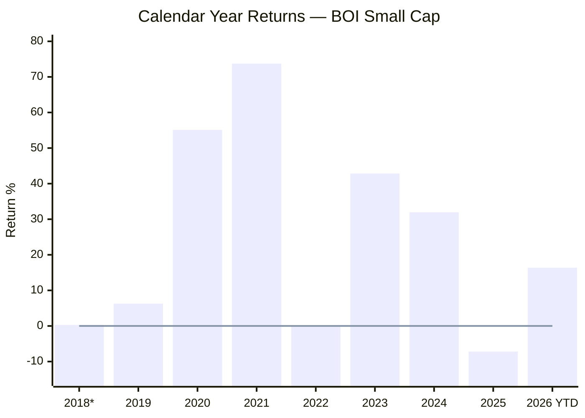
> *2018 partial (4 days from 27-Dec inception) | 2026 YTD as of 12-Jun-2026

| Year | BOI | Benchmark | Alpha | Notes |
|------|-----|-----------|-------|-------|
| 2018* | +0.30% | — | (partial) | Negligible — 4 trading days |
| 2019 | **+6.27%** | −8.27% | **+14.54%** | Positive through the small-cap bear — strong, but *post-crash* recovery, not crash protection |
| 2020 | **+55.11%** | +25.09% | **+30.02%** | Explosive COVID-recovery capture — the standout year |
| 2021 | +73.72% | +61.94% | **+11.78%** | Best absolute year — captured the bull fully |
| 2022 | +0.10% | −3.65% | **+3.75%** | Positive in a down year — defensive |
| 2023 | +42.84% | +48.10% | **−5.26%** | Lagged the momentum-driven bull |
| 2024 | +31.96% | +26.43% | **+5.53%** | Solid outperformance |
| **2025** | **−7.19%** | **−6.01%** | **−1.18%** | **Mild protection miss — lost slightly more than benchmark** |
| 2026 YTD | **+16.37%** | +2.36% | **+14.01%** | Leading the index strongly — recovering hard |

**Record: 6 positive years out of 7 full calendar years (2019–2025).** The only negative was 2025 (−7.19%), and that came with a mild −1.18% protection miss — the same 2025 down-market wobble seen in HSBC (−4.62% alpha) and DSP (which *protected*, +4.09%). BOI's 2025 was better than HSBC's but worse than DSP's.

**The pattern:** an **aggressive up-market participant** (2020 +30% alpha, 2021 +11.8%, 2024 +5.5%) that has *also* been positive in down-benchmark years (2019, 2022) — but note that both of those "defensive" wins were **recovery-phase** years, not a true crash. The single genuine down-market test it has faced (2025) produced a mild miss. The 2023 momentum lag (−5.26%) mirrors DSP's and HSBC's quality-tilt cost in that year.

---

## The 32.37% Max Drawdown — COVID, and the Missing 2018 Test *(BOI-specific framing)*

The screening flagged BOI's 32.37% max drawdown as **mid-pack** (better than DSP 49%, HSBC 52%, Sundaram 57%; worse than Bandhan 24%). The NAV data resolves exactly what it was:

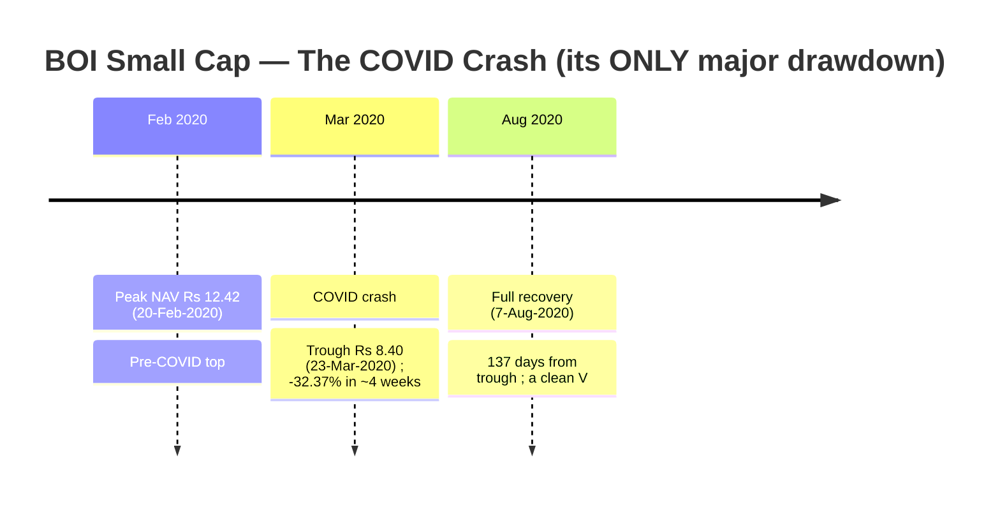

| Metric | Value |
|--------|-------|
| Peak | ₹12.42 (20-Feb-2020) |
| Trough | ₹8.40 (23-Mar-2020) |
| Max Drawdown | **−32.37%** |
| Recovery to peak | 7-Aug-2020 (**137 days** from trough) |

**This is a single, fast, V-shaped COVID crash — recovered in under 5 months.** Contrast HSBC's 52% three-year "small-cap winter" (peak Jan-2018 → trough Mar-2020, ~3 years underwater) and DSP's 49% (also COVID, from a higher post-2018-recovery peak).

**The critical caveat:** BOI's *shallower* max drawdown is **partly genuine skill and partly an accident of birth date.** Because the fund launched in December 2018, **it never had to live through the 2018 IL&FS crash at all** — the single most important small-cap stress test of the era, in which the benchmark fell −26.8% and stayed down for two years. DSP and HSBC carry that scar in their drawdown numbers; BOI simply wasn't born yet. **We therefore do not know how this fund, or this manager's small-cap process, behaves in a slow-grinding multi-year bear** — only how it behaves in a sharp, liquidity-driven V (well) and a mild correction (2025: a small miss). This is the most important *unknown* in BOI's entire risk profile.

---

## Rolling 3Y Returns Distribution

*Computed from 1,101 rolling 3-year windows (Dec 2018 – Jun 2026).*

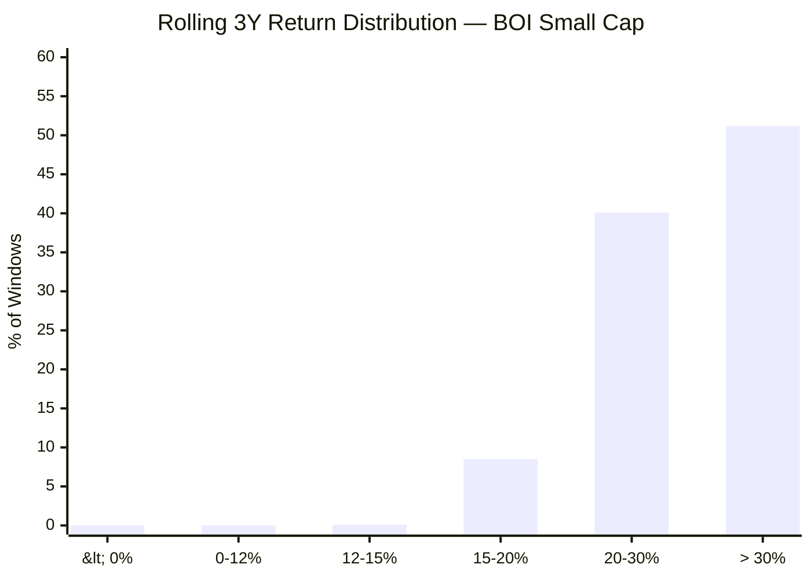

| Metric | Value |
|--------|-------|
| Total 3Y windows | 1,101 |
| Minimum | **+14.88%** |
| Maximum | +48.18% |
| Mean / Median | 31.23% / 30.58% |
| Windows ≥ 12% | **100%** |
| Windows ≥ 15% | 99.9% |
| Negative windows | **0.0%** |

**Interpretation — read with the bias caveat.** Every single 3-year window in BOI's history returned ≥14.88% — a flawless distribution on paper. But this is **bull-only**: the dataset contains exactly one crash (COVID, V-recovered) and one mild dip (2025), and **no full bear market.** DSP's "worse-looking" distribution (7.5% negative, min −12.57%) and HSBC's (9.9% negative) are *more trustworthy* precisely because they include the 2018–2020 winter. BOI's zero-negative 3Y history is real arithmetic over a genuinely strong 7.5 years — but it has never been tested by the kind of window that produces DSP's and HSBC's negatives.

---

## Rolling 5Y Returns Distribution

*Computed from 606 rolling 5-year windows.*

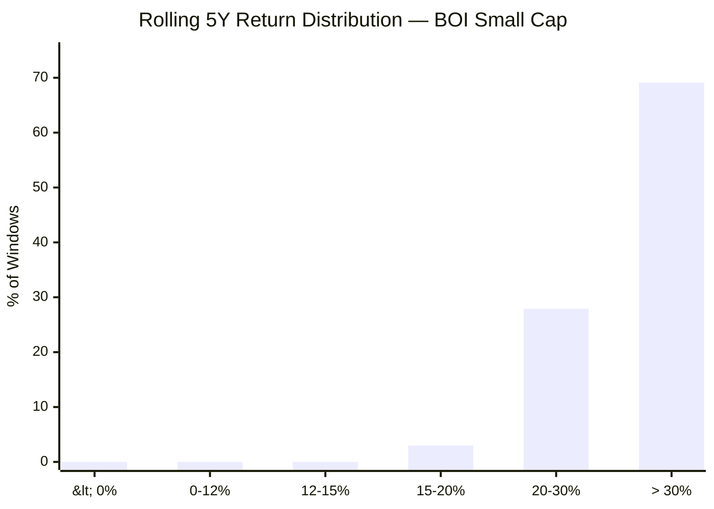

| Metric | Value |
|--------|-------|
| Total 5Y windows | 606 |
| Minimum | **+18.82%** |
| Maximum | +42.14% |
| Mean / Median | 32.30% / 33.24% |
| Windows ≥ 12% | **100%** |
| Negative windows | **0.0%** |

The minimum 5Y window is **+18.82%** — higher than DSP's *median* (19.17%). On its face this is the best 5Y rolling distribution of any fund studied. The honest framing: this reflects a fund whose entire 5-year-window history happens to start at the 2018 floor and end before any sustained bear. For the ₹20K/month SIP with a 5Y+ horizon, the evidence against loss is strong — but it rests on a shorter, untested-in-a-real-bear history than DSP's or HSBC's identically-zero (or near-zero) 5Y loss records, which *include* 2018.

---

## Probability of Loss by Holding Period

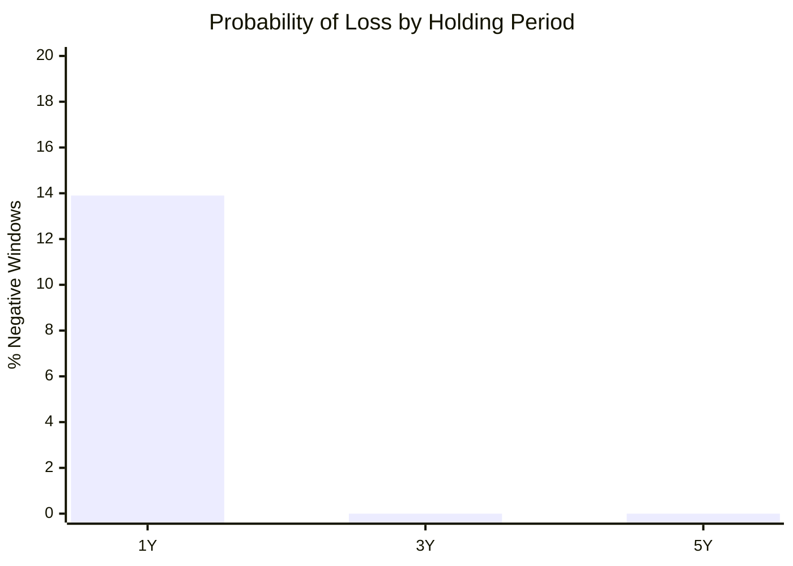

| Holding Period | Probability of Loss | Typical Worst Outcome |
|---------------|--------------------|-----------------------|
| 1 Year | ~13.9% | −19.6% (a crash year) |
| 3 Years | **0.0%** | +14.88% CAGR |
| 5 Years | **0.0%** | +18.82% CAGR |

The 1Y loss probability (13.9%) is notably *lower* than DSP's (28%) or HSBC's (30%) — again because BOI's short history never contained a sustained bear that would generate clusters of negative 1Y windows. The message for SIP investors is the same as for every small-cap fund: **never evaluate this fund on a 1Y horizon.** But the additional BOI-specific caveat: these probabilities are drawn from a 7.5-year, bull-dominated sample, so treat the "0.0% at 3Y/5Y" as encouraging-but-unproven rather than a guarantee.

---

## SIP XIRR vs Lumpsum CAGR (₹20,000/month)

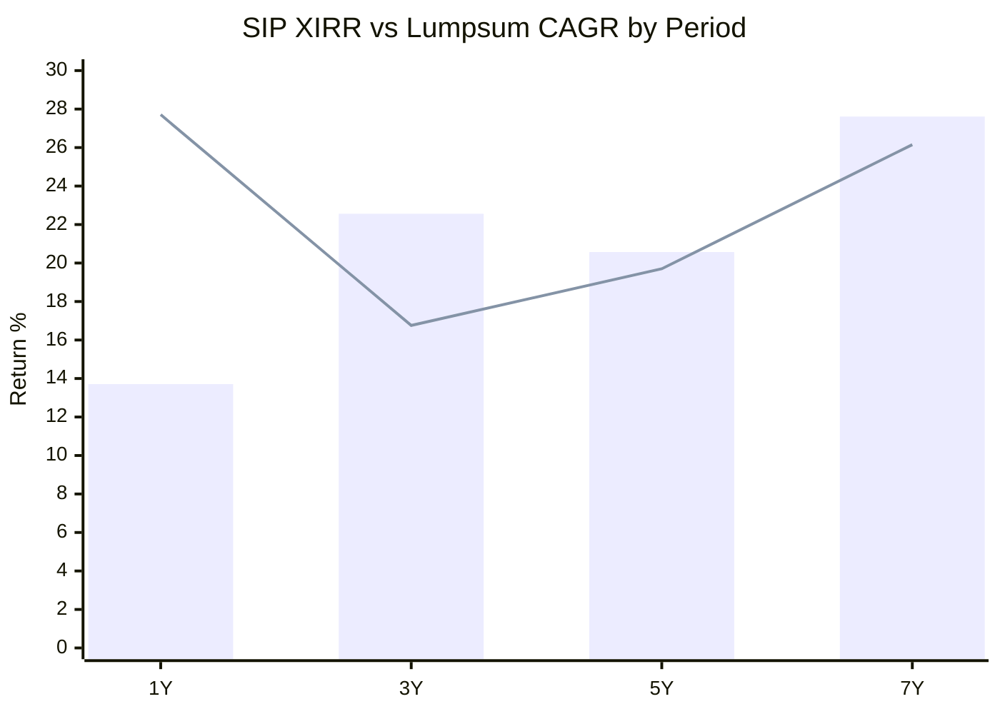
> Bar = Lumpsum CAGR | Line = SIP XIRR

| Period | Total Invested | Current Value | SIP XIRR |
|--------|---------------|---------------|----------|
| 1 Year | ₹2.60 L | ₹2.97 L | **27.71%** |
| 3 Years | ₹7.40 L | ₹9.47 L | **16.76%** |
| 5 Years | ₹12.20 L | ₹19.90 L | **19.70%** |
| 7 Years | ₹17.00 L | ₹43.10 L | **26.15%** |

**The 3Y SIP XIRR of 16.76% is the standout cross-fund comparison.** Where HSBC's 3Y SIP collapsed to 8.71% and DSP's to 12.78% (both hammered by 2025), BOI's held at **16.76%** — it sailed through the 2025 slump far better on a SIP basis. The 7Y SIP (26.15%, ₹17L → ₹43.10L) is the best 7Y SIP outcome of any fund studied — though, predictably, inception-flattered. A full 10Y SIP is not yet possible (fund is only 7.5 years old).

---

## Upside vs Downside Capture

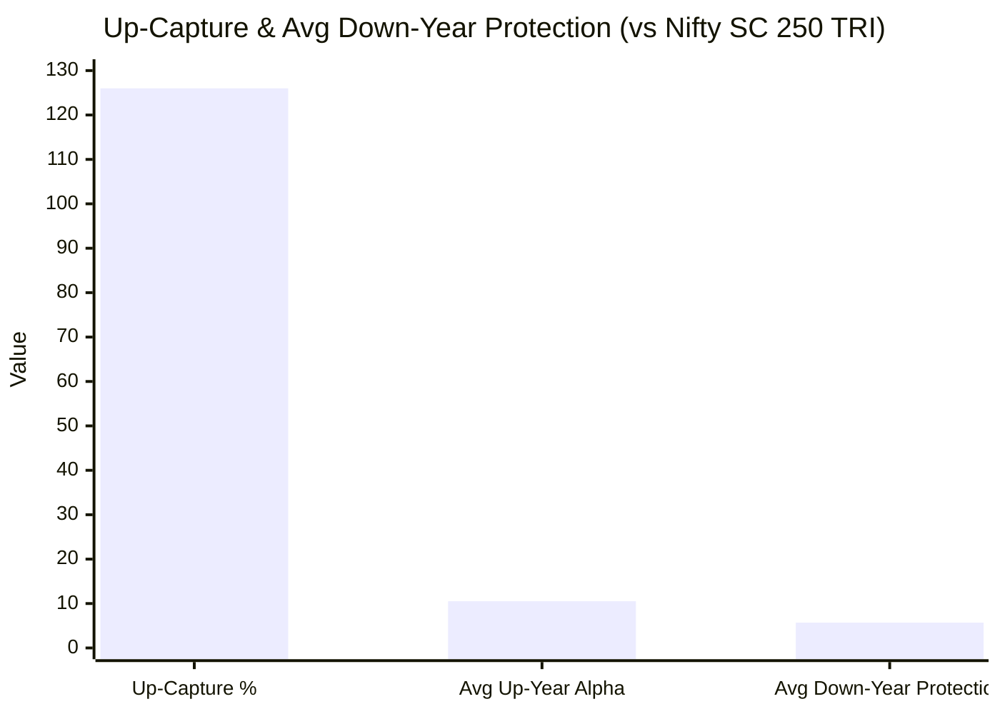

| Metric | Value | Interpretation |
|--------|-------|----------------|
| Up-capture (up-benchmark years) | **126.0%** | Captures far *more* than the index in up years — very aggressive participation |
| Avg up-year alpha | **+10.52%/yr** | 2020 (+30), 2021 (+11.8), 2023 (−5.3), 2024 (+5.5) |
| Down-benchmark years | 2019, 2022, 2025 | Positive in 2 of 3; mild miss in 2025 |
| Avg down-year protection | +5.70%/yr | But heavily lifted by 2019/2022 *recovery-phase* positives |

> **Down-capture caveat.** A single aggregate down-capture ratio is misleading here: in two of BOI's three down-benchmark years (2019, 2022) the fund was *positive* while the index fell — but both were recovery/sideways years, not crashes. The one genuine down-market test (2025) produced a **mild −1.18% miss**. So the honest read is: **excellent, proven up-capture (126%); largely unproven down-capture** — the defensive record looks great but has not faced a real grinding bear. This is the capture-ratio expression of the same inception-bias theme.

---

## Absolute Returns — Short-Term Trend

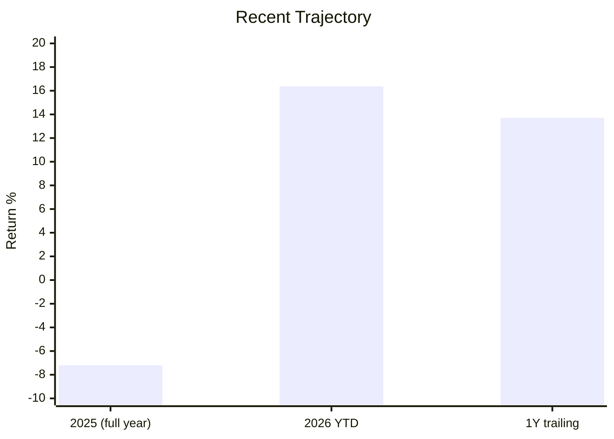

After a weak 2025 (−7.19%), BOI has rebounded sharply: 2026 YTD **+16.37%** (vs +2.36% benchmark) and a 1Y trailing of **+13.71%**. Of all the funds studied, BOI shows the **strongest recent recovery momentum** — it is decisively leading its index in 2026 and has already more than recovered the 2025 dip.

---

## Smallest-AUM: Agility vs Redemption Risk *(BOI-specific section)*

At **₹2,168–2,318 Cr**, BOI is the **smallest of the 8 shortlisted funds** (next: Union ₹1,980 Cr was smaller at screening; Edelweiss ₹5,952 Cr; up to Bandhan ₹25,346 Cr). This cuts both ways and is central to the BOI thesis:

| Dimension | Small AUM = Advantage | Small AUM = Risk |
|-----------|----------------------|------------------|
| **Execution** | Can take meaningful positions in genuinely small companies without moving prices; the purest "small-cap" exposure of the group | — |
| **Alpha headroom** | Far from the AUM bloat that blunts large funds' small-cap edge (cf. HSBC at ₹16,400 Cr) | — |
| **Liquidity in a crash** | — | A 20%+ redemption wave (study_plan's flagged scenario) forces selling illiquid small-caps at distressed prices, worsening NAV — exactly the stress this young fund has never faced |
| **Flow stability** | — | Smaller, less-sticky AUM is more vulnerable to flow-driven swings |
| **Cash buffer** | Held ~2–3% cash + small debt/T-bill sleeve (95.5% equity at screening) — a modest redemption buffer | Buffer is thin for a true crisis |

**Read:** the small AUM is a genuine *structural advantage for generating small-cap alpha today* (and helps explain the strong recent numbers), but it is also the **single biggest redemption-risk vulnerability** in a real bear — the very scenario the fund's track record cannot speak to. Modules 3 (liquidity/portfolio) and 4 (cost/AUM) must size this carefully.

---

## Same-Manager Cross-Fund Read: Alok Singh's FlexiCap vs SmallCap *(BOI-specific section)*

BOI is unique among the small-cap shortlist: its lead manager **Alok Singh** is already a *studied* quantity from the companion FlexiCap project (where BOI FlexiCap scored **3.93/5, Rank #2**). This is a rare, direct read on whether a proven process transfers across mandates.

| Dimension | BOI FlexiCap (studied) | BOI Small Cap (this study) |
|-----------|------------------------|----------------------------|
| Manager | Alok Singh (CIO) | Alok Singh (CIO) + Nav Bhardwaj |
| FlexiCap study verdict | 3.93/5 — Rank #2 of 9 | (this module: ~3.7 provisional) |
| AMC | BOI Investment Managers (govt-bank parent) | Same |
| Style read | Quality/growth blend, decisive | Same desk, more aggressive small-cap tilt (up-capture 126%) |
| Key strength | Strong risk-adjusted returns, low cost | Same low cost (0.43–0.48%); high VRO 4★ |

**Implication:** the "manager risk" that dominates newer funds (e.g. Bandhan's new-manager era) is **materially lower** for BOI — Alok Singh has a documented, well-scored multi-year record at this very AMC. The de-risked question becomes: *does his proven flexicap discipline hold up in the more volatile, less-liquid small-cap arena, and through a real crash?* The numbers so far say yes on volatility-adjusted return (Sharpe #2 of 8) and cost; the crash question remains open. **Module 5 must confirm Alok Singh's actual tenure on *this* fund** (note: some platforms date his small-cap role from 1-Oct-2024, which would make his hands-on small-cap tenure short even though his AMC tenure is long).

---

## Manager Tenure & Continuity *(detail deferred to Module 5)*

| Attribute | Detail |
|-----------|--------|
| Lead Manager | Alok Singh — CIO, BOI MF; ~24 yrs experience; CFA + PGDBA (ICFAI) |
| Tenure on this fund | Long AMC association; some platforms date the small-cap role from **1-Oct-2024** (verify in M5) |
| Co-Manager | Nav Bhardwaj (since 14-Jul-2025; ~17 yrs experience) |
| Cross-fund record | **Runs BOI FlexiCap — 3.93/5, Rank #2 in the FlexiCap study** |
| Key-person risk | Concentrated in Alok Singh as CIO across multiple BOI schemes |

For Module 1 the relevant fact is **proven competence**: the manager has a documented, well-scored record at this AMC, lowering the process-risk that hangs over newer funds. The precise small-cap tenure start, the CIO key-person concentration, and the Nav Bhardwaj co-manager addition are M5 questions.

---

## Risk Metrics — Peer Comparison (All 8 Shortlisted)

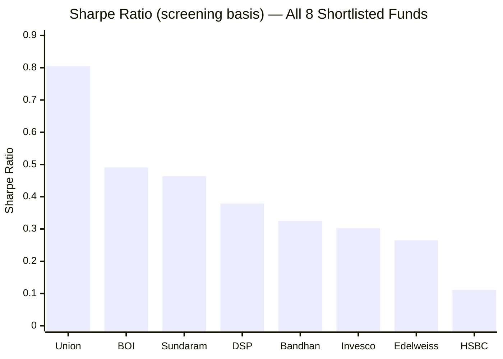

| Metric | BOI | Best in Group | Worst in Group | BOI Rank |
|--------|-----|--------------|----------------|----------|
| Sharpe (screening) | **0.491** | Union 0.805 | HSBC 0.111 | **2nd of 8** |
| Max Drawdown | **32.37%** | Bandhan 24.34% | Sundaram 57.06% | **2nd-best of 8** |
| Volatility | 16.33% | Edelweiss 15.10% | Union 17.37% | Mid |
| Alpha (screening) | 4.74 | Union 7.89 | HSBC 2.40 | 4th |
| Expense ratio | **0.43–0.48%** | Bandhan 0.34 | Sundaram 0.85 | **2nd-cheapest** |

BOI screens **extremely well**: 2nd-best Sharpe, 2nd-shallowest drawdown, 2nd-cheapest cost, 4★ VRO. On pure screening optics it is arguably the best-looking fund after Union. The persistent asterisk is that its shallow drawdown and high Sharpe are partly artifacts of a young, bull-dominated, 2018-free history — the same optics that flatter Bandhan (24% max DD) and Invesco.

---

## Comparison with Studied Small Cap Funds

| Dimension | BOI | DSP | HSBC | Invesco | Bandhan |
|-----------|-----|-----|------|---------|---------|
| Inception | 2018 (post-crash) ⚠️ | 2013 ✅ | 2014 ✅ | 2018 ⚠️ | 2020 ⚠️ |
| Inception bias | High | **None ✅** | **None ✅** | High | Extreme |
| Real 2018 data | **No** | Yes ✅ | Yes ✅ | No | No |
| 2018 protection | n/a | +1.68% | **+13.86% ✅** | n/a | n/a |
| Max Drawdown | **32.37% (COVID V)** | 49.06% (COVID) | 52.45% (2yr winter) | 37.66% | 24.34% |
| 5Y CAGR (genuine) | **20.57% (#3)** | 19.18% | 18.93% | 22.11% | 23.52% |
| 3Y SIP XIRR | **16.76% ✅** | 12.78% | 8.71% ⚠️ | — | — |
| Sharpe (screening) | **0.491 (#2) ✅** | 0.379 | 0.111 | 0.302 | 0.325 |
| ER (Direct) | **0.43–0.48% ✅** | 0.64 | 0.73 | 0.40 | 0.34 |
| AUM | **₹2,168 Cr (smallest)** | 17,906 | 16,394 | 11,038 | 25,346 |
| VRO rating | **4★ ✅** | 3★ | 3★ | — | — |
| 2025 calendar | −7.19% (−1.18% α) | −1.92% (+4.09% α) ✅ | −10.63% (−4.62% α) | — | — |
| Manager | **Alok Singh (proven, FlexiCap #2)** | Sambre 14yr ✅ | Manghat (continuous) | Badshah | Jain (new) |
| M1 Score | **~3.7 (est.)** | 4.1 | 3.7 | 3.72 | 3.50 |

**Cross-fund insight:** BOI is the **"excellent-but-untested"** fund. On every measurable dimension that the screening captures — Sharpe, drawdown, cost, rating, recent SIP resilience — it ranks at or near the top. It is also the **best-managed of the inception-biased funds** (a proven CIO vs Bandhan's new manager / Invesco's larger AUM). The gap between BOI and the two "real-history" funds (DSP, HSBC) is **not** about quality of returns — it is purely about **what their records have survived**: DSP and HSBC carry the 2018 scar and a near-zero 5Y loss record *that includes it*; BOI's identically-clean record simply hasn't been to that war yet. For a 10Y+ SIP, that distinction matters — which is why BOI lands *with* DSP/HSBC/Invesco in the high-3.7 band rather than above them, despite its superior screening optics.

### vs Studied FlexiCap Funds

| Metric | BOI Small Cap | BOI FlexiCap | Parag Parikh FC |
|--------|---------------|--------------|-----------------|
| Manager | Alok Singh | **Alok Singh (same)** | Rajeev Thakkar et al |
| Study rank | (small-cap, in progress) | **#2 of 9 (3.93/5)** | #1 of 9 (4.20/5) |
| 5Y CAGR | 20.57% | ~ (FlexiCap study) | 16.60% |
| Worst single year | −7.19% (2025) | milder (flexicap) | −6.29% (2022) |
| Max Drawdown | 32.37% | shallower (flexicap) | ~36% |
| Category | Small Cap | Flexi Cap | Flexi Cap |

The same manager's FlexiCap fund scored Rank #2 in the companion study — strong evidence the BOI desk is genuinely capable. BOI Small Cap's higher return (20.57% 5Y) comes, as expected, with a deeper drawdown (32% vs the flexicap's shallower fall) — the standard small-cap-vs-flexicap trade-off, here within a single AMC's product line.

---

## Module 1 Scorecard

| Sub-dimension | Weight | Score (1–5) | Reasoning |
|---------------|--------|-------------|-----------|
| Long-term returns (genuine) | High | **3.5** | 5Y 20.57% (#3 of 8) is strong; but no 10Y, and SI/7Y (26–27%) are inception-flattered, not bankable |
| Consistency across periods | High | 4.0 | 6/7 positive calendar years; uniformly high 3Y/5Y/7Y CAGR |
| Alpha generation | High | **4.0** | Verified +5.39% (5Y), +4.18% (3Y), +14.70% (1Y); TT alpha 6.44 — genuine even on trusted windows |
| Crash resilience | Critical | **3.0** | 2020 COVID V handled well (137-day recovery) **but never faced 2018**; 2025 a mild miss (−1.18%) |
| Inception integrity | Modifier | **2.0** | High inception bias — record starts at the post-IL&FS floor; no full bear in dataset |
| Recent momentum | Medium | **4.5** | Best recent recovery of the group: 2026 YTD +16.37% (+14.01% α), 1Y +13.71% |
| Peer rank on raw 5Y | Medium | 4.0 | 20.57% — 3rd of 8, comfortably above the screen threshold |
| SIP XIRR quality | High | **4.0** | 3Y SIP 16.76% (best of group through 2025); 7Y 26.15% (₹17L→₹43.1L); 0% 5Y loss (untested) |
| Rolling return consistency | High | 3.5 | 0% negative 3Y/5Y windows — flawless but bull-only |
| Drawdown depth | Medium | **4.0** | 32.37% — 2nd-shallowest of 8 (partly skill, partly the missing 2018) |
| Risk-adjusted (Sharpe) | High | **4.0** | Screening Sharpe 0.491 (#2 of 8); computed 3Y Sharpe 0.85 |
| Cost & rating | Modifier | **4.5** | 0.43–0.48% ER (2nd-cheapest); 4★ VRO (highest of studied small-caps) |
| **Module 1 Overall** | **100%** | **~3.7 / 5** | **An excellent-looking, well-managed, low-cost fund whose one genuine weakness is what its record has never survived.** Strong, *verified* recent alpha (5Y +5.39%, 1Y +14.70%), the group's best 3Y SIP resilience through 2025, 2nd-best Sharpe, 2nd-shallowest drawdown, cheapest-but-one cost, top VRO rating, and a manager already proven at Rank #2 in the FlexiCap study. **Capped — not lifted above DSP — by high inception bias (Dec-2018 start, no 2018 data), a COVID-only drawdown history, and the redemption fragility of the smallest AUM in the group.** |

---

## SIP Implication

BOI Small Cap Fund is the study's **"excellent on every measure, untested on the one that matters most"** candidate. Its credentials are real and, on the *verified* windows, top-tier: a 20.57% 5Y CAGR (3rd of 8), +5.39%/+4.18% alpha on the 5Y/3Y windows, the **best 3Y SIP resilience of the entire group through the 2025 slump (16.76% vs HSBC's 8.71%)**, the 2nd-best screening Sharpe, the 2nd-shallowest drawdown, the 2nd-cheapest cost, a 4★ VRO rating, and the strongest 2026 recovery momentum (+16.37% YTD). Crucially, it is run by **Alok Singh — a manager already validated at Rank #2 in the companion FlexiCap study** — so the process-risk that haunts newer funds is materially lower.

The one structural reservation is unavoidable and decisive in *not* ranking it above DSP/HSBC: **its entire 7.5-year history begins two months after the 2018 IL&FS bottom.** Its gorgeous numbers — 26.7% since-inception CAGR, zero-negative 3Y/5Y rolling windows, 32% (not 50%+) max drawdown — are real arithmetic over a genuinely strong run, but they describe a fund that has only ever climbed out of a floor and survived one fast, V-shaped crash (COVID). It has **never lived through a slow, multi-year small-cap winter** of the kind that defines DSP's and HSBC's *bias-free, 2018-inclusive* records. Layered on top is the **redemption fragility of the smallest AUM in the group (₹2,168 Cr)** — an asset in calm markets (purest small-cap agility) but a vulnerability in exactly the bear scenario the track record can't speak to.

For a ₹20K/month satellite SIP with a 10Y+ horizon, the evidence argues BOI is a **high-quality, low-cost, well-managed fund that deserves serious consideration** — but one whose risk credentials should be treated as *promising rather than proven*. The modules ahead must verify: (M3) how concentrated/liquid the portfolio is given the small AUM, (M4) whether the cost and AUM economics are durable, and (M5) Alok Singh's actual hands-on small-cap tenure and the CIO key-person concentration.

**Recommended holding period:** Minimum 7 years; ideally 10+. **Do not be seduced by the spotless rolling-return and since-inception numbers — they are flattered by a December-2018 birth date that skipped the worst small-cap bear. Judge this fund on its 5Y CAGR, its verified alpha, its 2025 SIP resilience, and its proven manager — all of which are genuinely strong — while pricing in that its downside has never faced a real test.**

---

## One-Line Verdict

> **BOI Small Cap is the best-screening, best-managed of the inception-biased funds — and the cleanest example of why screening optics can mislead:** verified top-tier recent alpha (5Y +5.39%, 1Y +14.70%), the group's best 3Y SIP resilience through 2025, 2nd-best Sharpe, 2nd-shallowest drawdown, cheapest-but-one cost, a 4★ rating, and a manager already proven at FlexiCap Rank #2 — let down only by a December-2018 birth date that skipped the 2018 crash, a COVID-only drawdown history, and the redemption fragility of the smallest AUM in the shortlist. **Module 1: ~3.7/5 — level with HSBC and Invesco, just below DSP; excellent in everything except the one test it has never faced.**

---

*Module 1 completed: June 2026 | Returns Consistency | MFAPI methodology (BOI Small Cap scheme 145678, 1,837 points, Dec 2018 → Jun 2026) | Max drawdown (−32.37%) reproduces screening exactly; 5Y CAGR matches Tickertape exactly | Benchmark = Nifty Smallcap 250 TRI (mandate: BSE 250 SmallCap TRI) | Provisional M1 Score: ~3.7/5 (subject to M2–M6)*
