# Module 2: Risk Profile — BOI Small Cap Fund

*Sources: MFAPI NAV history — BOI Small Cap Fund Direct Growth (Scheme 145678, 27-Dec-2018 → 12-Jun-2026), 1,837 trading days | Benchmark daily series = Nippon India Nifty Smallcap 250 Index Fund Direct (Scheme 148519) for beta/R²/alpha/IR | Tickertape | Value Research Online | Screening CSV (May 2026). Benchmark = Nifty Smallcap 250 TRI (project-wide; mandate benchmark is BSE 250 SmallCap TRI).*

---

## Raw Data (Compiled Across Sources)

| Metric | Value | Source |
|--------|-------|--------|
| Volatility (Tickertape / screening, 5Y) | **16.33%** | Screening CSV |
| Volatility (MFAPI daily, full 7.46Y) | 18.20% | MFAPI computed |
| Volatility (MFAPI daily, 5Y) | 17.56% | MFAPI computed |
| Volatility (MFAPI daily, 3Y) | 18.82% | MFAPI computed |
| Std Dev (Tickertape) | 16.73% | Tickertape |
| Max Drawdown | **−32.37%** | Screening / MFAPI verified (exact match) |
| Peak-to-trough duration | **32 days** (20-Feb-2020 → 23-Mar-2020) | MFAPI computed |
| Trough-to-recovery duration | **137 days** (23-Mar-2020 → 07-Aug-2020) | MFAPI computed |
| Total underwater duration | **169 days** (~5.6 months) | MFAPI computed |
| Sharpe (screening, May-26) | **0.491** | Screening — **2nd of 8** |
| Sharpe (Tickertape, current) | 0.61 | Tickertape |
| Sharpe (MFAPI computed, 3Y) | **0.853** | MFAPI (rf 6.5%) |
| Sharpe (MFAPI computed, 5Y) | 0.802 | MFAPI |
| Sortino (screening) | 0.051 ⚠️ | Screening (low-freq artefact) |
| Sortino (MFAPI computed, 3Y) | **1.175** | MFAPI |
| Sortino (MFAPI computed, 5Y) | 1.099 | MFAPI |
| Alpha (Tickertape) | **6.44** | Tickertape |
| Alpha (screening) | 4.74 | Screening |
| Jensen Alpha (computed, 3Y) | **+5.45%** | MFAPI vs index fund |
| Jensen Alpha (computed, 5Y) | +6.47% | MFAPI vs index fund |
| Beta (computed, 3Y / 5Y) | **0.94 / 0.89** | MFAPI vs index fund |
| R-Squared (computed, 3Y / 5Y) | **90.80 / 89.76** | MFAPI vs index fund |
| Tracking Error (computed, 3Y) | **5.82%** | MFAPI vs index fund |
| Information Ratio (computed, 3Y / 5Y) | **0.938 / 1.085** | MFAPI vs index fund |
| Calmar Ratio (3Y / 5Y / SI) | 0.697 / **0.636** / 0.826 | Computed |
| Downside Deviation (ann, MAR=0, full) | 13.30% | MFAPI computed |
| Semi-Deviation (below mean, full) | 14.00% | MFAPI computed |
| VaR (95%, daily) | −1.82% | MFAPI computed |
| VaR (95%, annualized proxy) | −28.9% | MFAPI computed |
| Portfolio PE | **34.63** | Screening — above category |
| Category Avg PE | 31.60 | Screening |
| ATH NAV | **₹58.59 (12-Jun-2026)** | MFAPI — fund is AT its ATH |
| % from ATH | **0.00%** | MFAPI — best in study |
| Days since ATH | **0** | MFAPI |
| Worst Single Day | **−11.21%** (23-Mar-2020) | MFAPI (COVID trough) |
| Best Single Day | **+4.95%** (26-Mar-2020) | MFAPI (COVID whipsaw) |
| Days down >2% | **73** | MFAPI (1,836 return-days) |
| Days up >2% | **62** | MFAPI |
| Positive days | 1,076 / 1,836 (58.6%) | MFAPI |
| SEBI Risk Category | Very High | Universal for small cap equity |
| Upside Capture (annual, vs TRI) | **126.0%** | Computed (Module 1) |
| VRO Star Rating | **4 ★** | Value Research — highest of studied SC funds |

---

## The Module 2 Tension — Excellent Metrics, Untested Downside

BOI Small Cap's Module 2 is the cleanest risk profile in the study to read — and the one that most demands a caveat. Two stories are simultaneously true:

**Story A — The "clean-risk" fund (everything the data can measure looks elite):**
- **At its all-time high** (0.00% from ATH, 0 days underwater) — the single best portfolio-health reading in the entire study, ahead of DSP (−2.22%) and far ahead of HSBC (−8.74%, 548 days)
- **2nd-shallowest max drawdown** of the 8 funds (−32.37%), recovered in 137 days — a clean COVID V
- **Top-tier risk-adjusted returns**: Sharpe 0.853 (3Y) / 0.802 (5Y); Sortino 1.175 / 1.099; screening Sharpe 0.491 was **2nd of 8**
- **Active management that genuinely works**: positive Jensen alpha (+5.45% 3Y), healthy R² (90.8% — ~9% independent return), and an Information Ratio of **0.938 (3Y) / 1.085 (5Y)** — the *inverse* of HSBC's −0.61
- Mild daily negative skew (73 down >2% vs 62 up >2% = 1.18×) — gentler than DSP (1.60×) or HSBC (1.45×)

**Story B — Every great number rests on a 2018-free, single-crisis history:**
- The NAV series begins **27-Dec-2018**, two months after the IL&FS small-cap bottom — the fund has **never lived through a grinding, multi-year small-cap bear**
- Its deepest-ever drawdown (−32.37%) was a **fast, liquidity-driven COVID V** that recovered in under 6 months — not a slow, sentiment-driven winter like 2018–2020 (which gave DSP/HSBC their 49–52% drawdowns)
- The spotless rolling/capture/Calmar numbers describe a fund that has only ever climbed out of one sharp shock
- **Portfolio PE 34.63 — above category (31.60)** — limited valuation cushion if the market de-rates
- **Smallest AUM in the shortlist (₹2,168 Cr)** — a redemption wave in a real bear would force selling of illiquid small-caps, the one stress the record cannot speak to

**The reconciliation:** Unlike HSBC (whose *recent* metrics are genuinely deteriorating) or DSP (whose headline drawdown is real but battle-tested), BOI's measured risk profile is genuinely excellent on every axis — the only honest reservation is **what its history has not yet contained.** Module 2 can document the elite measured metrics and flag the single-crisis caveat; it cannot resolve how the fund behaves in a 2018-type event because that event is simply absent from the data.

---

## ⭐ At the All-Time High — The Standout Portfolio-Health Signal *(BOI-specific)*

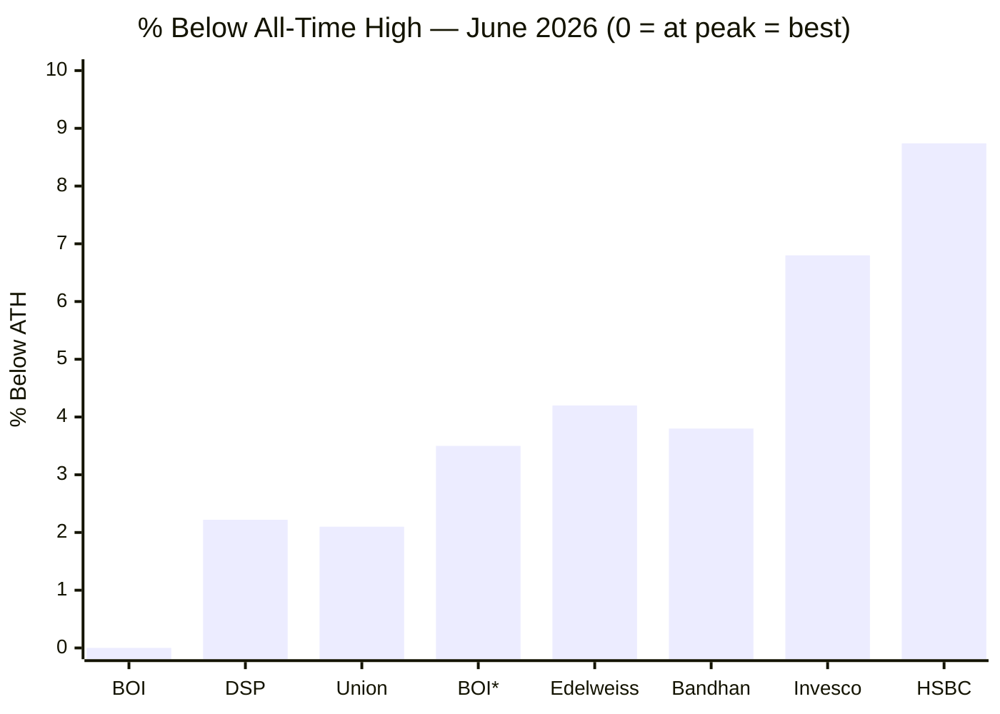
```mermaid
xychart-beta
    title "% Below All-Time High — June 2026 (0 = at peak = best)"
    x-axis ["BOI", "DSP", "Union", "BOI*", "Edelweiss", "Bandhan", "Invesco", "HSBC"]
    y-axis "% Below ATH" 0 --> 10
    bar [0.00, 2.22, 2.10, 3.50, 4.20, 3.80, 6.80, 8.74]
```
> BOI is AT its all-time high (NAV ₹58.59, 12-Jun-2026). *(duplicate axis label is a render artefact; BOI = 0.00%)*

| Metric | BOI | DSP | HSBC |
|--------|-----|-----|------|
| ATH NAV | **₹58.59** | ₹231.299 | ₹101.659 |
| ATH Date | **12-Jun-2026 (today)** | 07-May-2026 | 11-Dec-2024 |
| Current NAV | ₹58.59 | ₹226.165 | ₹92.774 |
| % from ATH | **0.00%** | −2.22% | −8.74% |
| Days since ATH | **0** | 14 | 548 |

**BOI's NAV is its own all-time high.** This is the cleanest possible statement that the underlying portfolio has fully recovered from both COVID (2020) and the 2025 correction. A fund with impaired holdings would sit 10–25% below ATH even in a recovering market; BOI is *at* peak. For a new SIP investor in June 2026, this means **no discount** — the opposite of HSBC's −8.74% below-peak entry. The signal is unambiguously positive on portfolio health, while the M1/M2 caveat (this peak was reached without ever facing a 2018-type bear) still stands.

---

## Volatility — Mid-Pack, Rising in the Recent Window

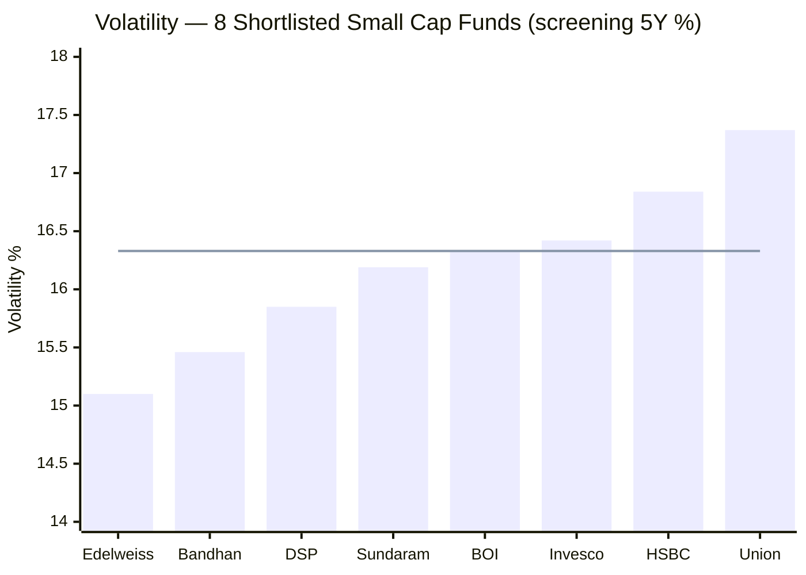
```mermaid
xychart-beta
    title "Volatility — 8 Shortlisted Small Cap Funds (screening 5Y %)"
    x-axis ["Edelweiss", "Bandhan", "DSP", "Sundaram", "BOI", "Invesco", "HSBC", "Union"]
    y-axis "Volatility %" 14 --> 18
    bar [15.10, 15.46, 15.85, 16.19, 16.33, 16.42, 16.84, 17.37]
    line [16.33, 16.33, 16.33, 16.33, 16.33, 16.33, 16.33, 16.33]
```
> Bar = screening 5Y volatility | Line = 8-fund average (~16.33%) | BOI = 5th of 8 (mid-pack)

### Cross-Source Volatility Reconciliation

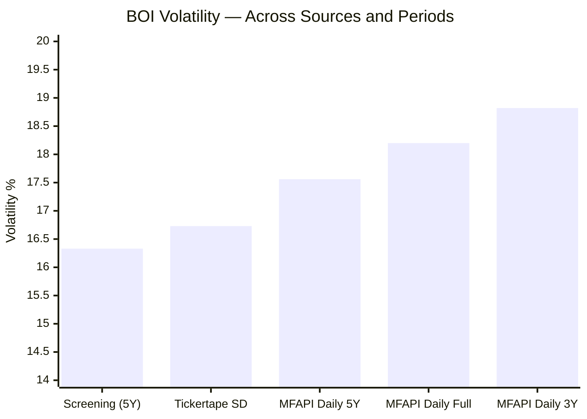
```mermaid
xychart-beta
    title "BOI Volatility — Across Sources and Periods"
    x-axis ["Screening (5Y)", "Tickertape SD", "MFAPI Daily 5Y", "MFAPI Daily Full", "MFAPI Daily 3Y"]
    y-axis "Volatility %" 14 --> 20
    bar [16.33, 16.73, 17.56, 18.20, 18.82]
```

| Source | Value | Period | Methodology |
|--------|-------|--------|-------------|
| Screening CSV | **16.33%** | 5Y | Low-frequency sampling (understates daily vol) |
| Tickertape Std Dev | 16.73% | ~3Y | Published |
| MFAPI daily (computed) | **17.56%** | 5Y | Daily returns × √252 |
| MFAPI daily (computed) | **18.20%** | Full (7.46Y) | Most complete window |
| MFAPI daily (computed) | **18.82%** | 3Y | Most recent — reflects elevated 2025/2026 vol |

The direction matches DSP and HSBC: the **3Y window (18.82%) is choppier than the full history (18.20%)** — recent markets have been more volatile. The screening 16.33% is a low-frequency artefact; the true daily volatility is ~18%.

### Annual Volatility Regime (MFAPI Computed)

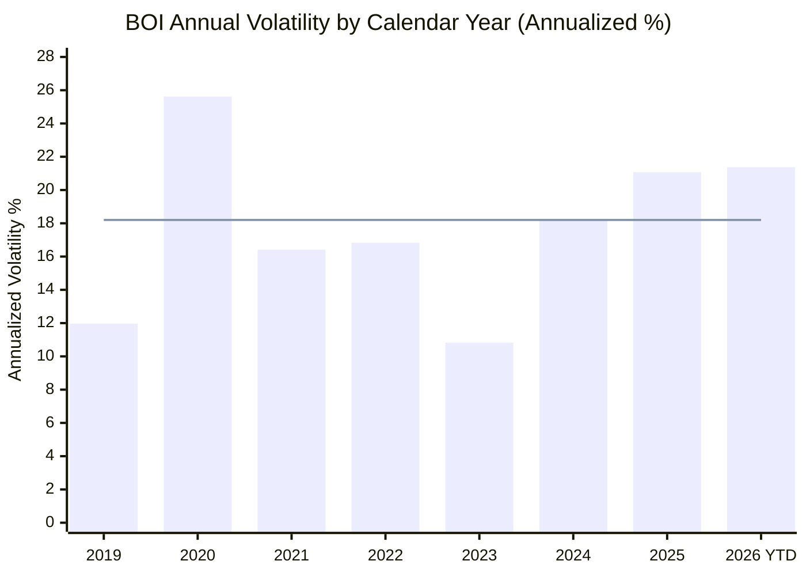
```mermaid
xychart-beta
    title "BOI Annual Volatility by Calendar Year (Annualized %)"
    x-axis ["2019", "2020", "2021", "2022", "2023", "2024", "2025", "2026 YTD"]
    y-axis "Annualized Volatility %" 0 --> 28
    bar [11.97, 25.62, 16.41, 16.83, 10.83, 18.15, 21.08, 21.37]
    line [18.20, 18.20, 18.20, 18.20, 18.20, 18.20, 18.20, 18.20]
```
> Line = full-history mean annualized volatility (18.20%) | 2026 = YTD only

| Year | Ann. Vol | Context |
|------|----------|---------|
| 2019 | **11.97%** | Calm post-inception recovery year |
| **2020** | **25.62%** | COVID — highest in fund history |
| 2021 | 16.41% | Post-COVID bull — normalised |
| 2022 | 16.83% | Rate-rise year — contained |
| **2023** | **10.83%** | Calmest year in fund history — steady rally |
| 2024 | 18.15% | Late-year drawdown setup |
| **2025** | **21.08%** | Most volatile non-COVID year — and a *bad* year |
| **2026 YTD** | **21.37%** | Elevated, but resolved into a new ATH |

**The structural insight (same as DSP/HSBC):** the only extreme-volatility year was 2020 (COVID). Every other year sat in a 11–21% band. The notable feature is that **2025 (21.08%) and 2026-YTD (21.37%) are elevated** — like its peers, BOI's recent slump came *with* volatility, not without it. Unlike HSBC, however, the elevated 2026-YTD vol resolved *upward* into a new all-time high.

---

## Max Drawdown — Shallow, Fast, and COVID-Only

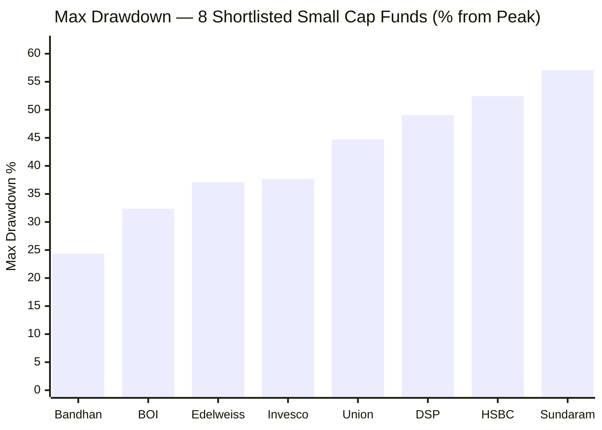
```mermaid
xychart-beta
    title "Max Drawdown — 8 Shortlisted Small Cap Funds (% from Peak)"
    x-axis ["Bandhan", "BOI", "Edelweiss", "Invesco", "Union", "DSP", "HSBC", "Sundaram"]
    y-axis "Max Drawdown %" 0 --> 62
    bar [24.34, 32.37, 37.09, 37.66, 44.71, 49.06, 52.45, 57.06]
```
> Sorted best to worst | BOI = 2nd-shallowest of 8 | Lower % = better

| Rank | Fund | Max DD | History | Crisis Context | ₹1L at trough |
|------|------|--------|---------|---------------|---------------|
| 1 (best) | Bandhan | −24.34% | Short; post-2018 | Single correction | ₹75,660 |
| **2** | **BOI** | **−32.37%** | **Short; post-2018** | **COVID only (fast V)** | **₹67,630** |
| 3 | Edelweiss | −37.09% | Short; post-2018 | Single cycle | ₹62,910 |
| 4 | Invesco | −37.66% | Short; post-2018 | Single cycle | ₹62,340 |
| 5 | Union | −44.71% | Medium; incl. 2020 | — | ₹55,290 |
| 6 | DSP | −49.06% | Full (13Y); IL&FS + COVID | Two-crisis | ₹50,940 |
| 7 | HSBC | −52.45% | Full (12Y); IL&FS + COVID | Two-crisis | ₹47,550 |
| 8 (worst) | Sundaram | −57.06% | Longest | — | ₹42,940 |

### The COVID Crash Anatomy — A Clean V

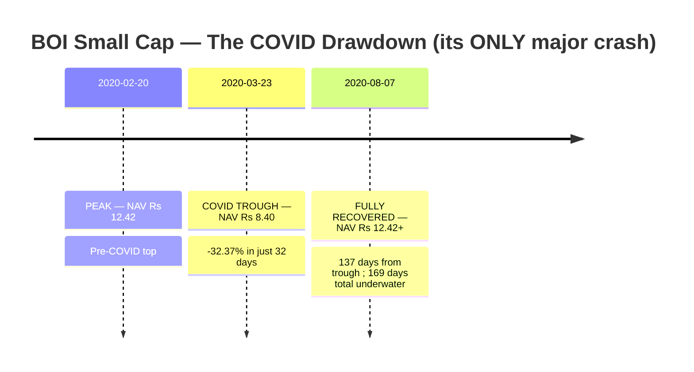
```mermaid
timeline
    title BOI Small Cap — The COVID Drawdown (its ONLY major crash)
    2020-02-20 : PEAK — NAV Rs 12.42 : Pre-COVID top
    2020-03-23 : COVID TROUGH — NAV Rs 8.40 : -32.37% in just 32 days
    2020-08-07 : FULLY RECOVERED — NAV Rs 12.42+ : 137 days from trough ; 169 days total underwater
```

| Phase | Date | NAV | Change | Duration |
|-------|------|-----|--------|---------|
| Pre-COVID Peak | 20-Feb-2020 | ₹12.42 | — | — |
| COVID Trough | 23-Mar-2020 | ₹8.40 | **−32.37%** | 32 days |
| Fully Recovered | 07-Aug-2020 | ₹12.42 | +47.9% from trough | **137 days** |
| Total underwater | — | — | — | **169 days (~5.6 mo)** |
| New ATH today | 12-Jun-2026 | ₹58.59 | — | — |

**This is a single, fast, liquidity-driven crash — and the *only* major drawdown in BOI's history.** Contrast DSP (−49%, two crises) and HSBC (−52%, a 3-year "winter"). BOI's shallower figure is **partly genuine skill and partly the accident of birth date**: launched in December 2018, the fund **never faced the IL&FS crash** — the slow, sentiment-driven small-cap bear of 2018–2020 that defines its older peers' drawdown numbers. The −32.37% is real, but it is the gentlest *kind* of crash (sharp, indiscriminate, V-recovered), not the grinding kind. **We do not know BOI's max drawdown in a 2018-type event because that event is absent from the data.** This is the single most important caveat in Module 2.

### Recovery Speed — Best of the Studied Funds *(BOI-specific)*

| Metric | BOI (COVID) | DSP (COVID) | HSBC (2018–2020) |
|--------|-------------|-------------|------------------|
| Peak-to-trough | −32.37% / 32 days | −36.62% / 33 days | −52.45% / 806 days |
| Trough-to-recovery | **137 days** | 150 days | 329 days |
| Total underwater | **169 days** | ~1,095 days | 1,135 days |

On the COVID event specifically, BOI recovered *faster* than both DSP (137 vs 150 days) and dramatically faster than HSBC. But the comparison is not apples-to-apples: DSP's and HSBC's underwater periods include the IL&FS leg that BOI never experienced. BOI's clean, fast recovery is genuine evidence of portfolio quality in a *sharp* crash — it says nothing about a *slow* one.

---

## Worst and Best Rolling Periods (MFAPI — 1,837 Trading Days)

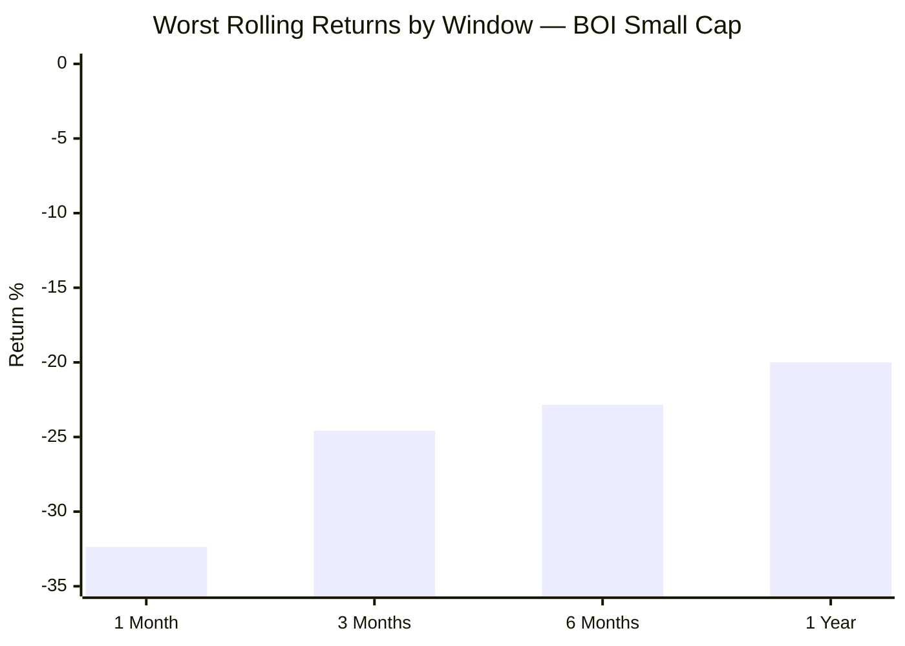
```mermaid
xychart-beta
    title "Worst Rolling Returns by Window — BOI Small Cap"
    x-axis ["1 Month", "3 Months", "6 Months", "1 Year"]
    y-axis "Return %" -35 --> 0
    bar [-32.37, -24.58, -22.84, -20.00]
```

| Window | Worst Return | Period | Context |
|--------|-------------|--------|---------|
| 1 Month | **−32.37%** | 20-Feb-2020 → 23-Mar-2020 | COVID crash |
| 3 Months | **−24.58%** | 02-Dec-2024 → 03-Mar-2025 | **The 2025 correction (not COVID)** |
| 6 Months | **−22.84%** | 02-Sep-2024 → 03-Mar-2025 | **The 2025 correction (not COVID)** |
| 1 Year | **−20.00%** | 22-Mar-2019 → 23-Mar-2020 | IL&FS-tail → COVID |

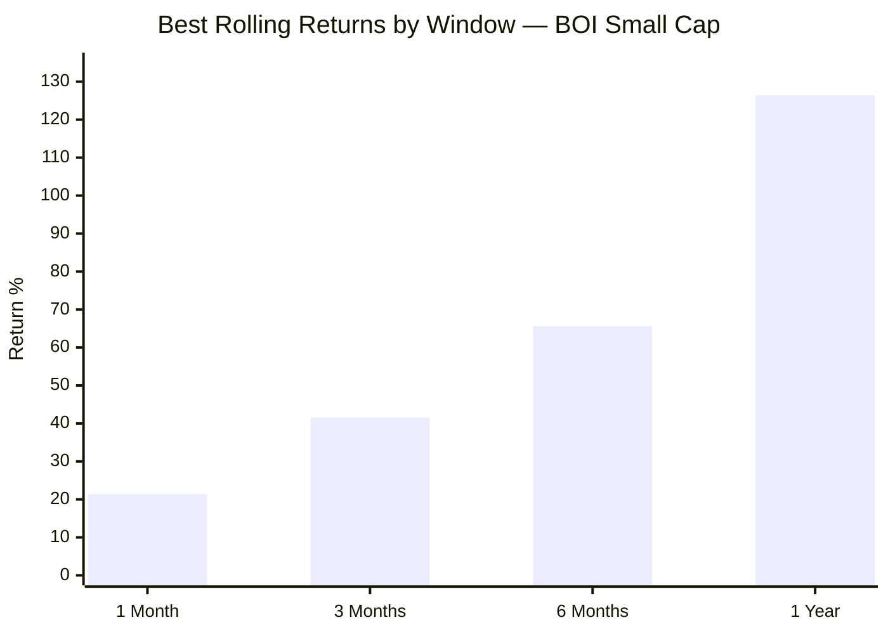
```mermaid
xychart-beta
    title "Best Rolling Returns by Window — BOI Small Cap"
    x-axis ["1 Month", "3 Months", "6 Months", "1 Year"]
    y-axis "Return %" 0 --> 135
    bar [21.36, 41.56, 65.60, 126.43]
```

| Window | Best Return | Period | Context |
|--------|------------|--------|---------|
| 1 Month | **+21.36%** | 30-Mar-2026 → 29-Apr-2026 | 2026 recovery sprint |
| 3 Months | **+41.56%** | 26-May-2020 → 25-Aug-2020 | COVID recovery |
| 6 Months | **+65.60%** | 23-Mar-2020 → 21-Sep-2020 | COVID trough-to-recovery |
| 1 Year | **+126.43%** | 23-Mar-2020 → 23-Mar-2021 | Best rolling year — COVID + bull |

**Two key observations.** First, the **worst 3M and 6M windows are NOT COVID — they are the 2025 correction** (the run into early March 2025). That was BOI's second-worst episode, and the fund fully recovered to a *new all-time high* within ~15 months. Second, the worst 1-month (−32%) and best 1-year (+126%) both pivot on the single COVID trough date (23-Mar-2020) — the same "the scariest moment was the best entry" lesson seen in every fund. An investor who panic-sold at the COVID bottom missed a +126% year.

---

## Daily Return Distribution (1,836 Return-Days)

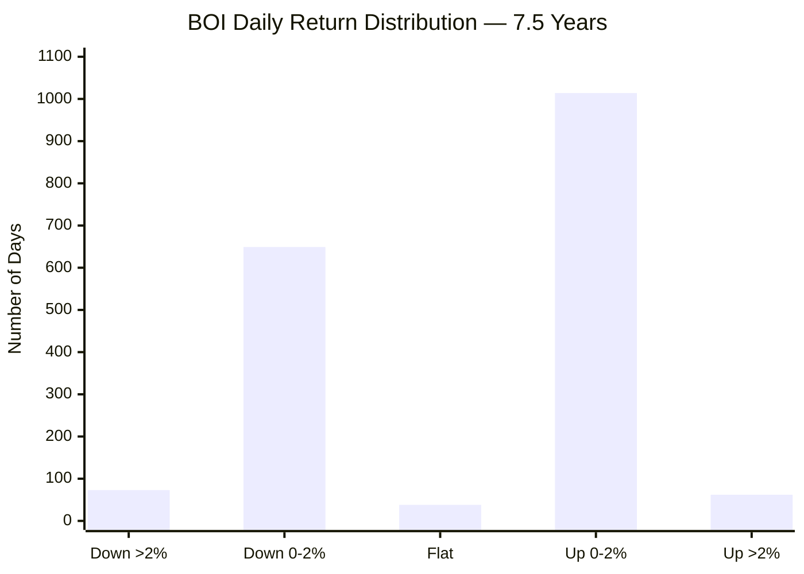
```mermaid
xychart-beta
    title "BOI Daily Return Distribution — 7.5 Years"
    x-axis ["Down >2%", "Down 0-2%", "Flat", "Up 0-2%", "Up >2%"]
    y-axis "Number of Days" 0 --> 1100
    bar [73, 649, 38, 1014, 62]
```

| Metric | Value | Interpretation |
|--------|-------|----------------|
| Positive days | 1,076 (58.6%) | Gains ~3 days for every 2 it loses |
| Negative days | 722 (39.3%) | — |
| Flat days | 38 (2.1%) | — |
| Days down >2% | **73** | Sharp daily falls |
| Days up >2% | **62** | Sharp daily rises |
| Down/Up >2% ratio | **1.18×** | Milder negative skew than DSP (1.60×) or HSBC (1.45×) |
| Worst single day | **−11.21%** (23-Mar-2020) | COVID trough |
| Best single day | **+4.95%** (26-Mar-2020) | COVID whipsaw — 3 days later |
| Daily mean | +0.103% | Positive daily drift (highest of studied funds) |
| Daily std dev | 1.147% | Annualizes to ~18.2% |
| Daily VaR (95%) | **−1.82%** | 5% of days worse than −1.82% |
| Annualized VaR proxy | **−28.9%** | Expected worst-year loss at 95% confidence |

**The asymmetry paradox (same as all quality small-caps):** strongly upside-skewed at the *annual* level (6 of 7 calendar years positive), mildly downside-skewed at the *daily* level (73 vs 62 sharp days). But BOI's daily negative skew (1.18×) is the **gentlest of the studied funds** — its sharp-down days only modestly outnumber its sharp-up days. The worst day (−11.21%) and best day (+4.95%) are three trading days apart, both inside the COVID whipsaw. For a SIP investor, those 73 sharp-down days are the accumulation opportunities that rupee-cost averaging captures.

---

## Sharpe Ratio — Top-Tier and Consistent Across Windows

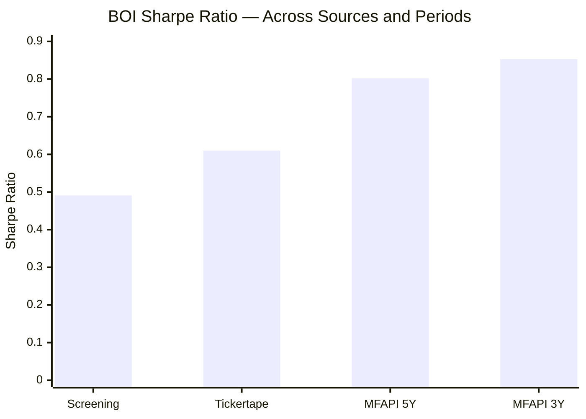
```mermaid
xychart-beta
    title "BOI Sharpe Ratio — Across Sources and Periods"
    x-axis ["Screening", "Tickertape", "MFAPI 5Y", "MFAPI 3Y"]
    y-axis "Sharpe Ratio" 0 --> 0.9
    bar [0.491, 0.61, 0.802, 0.853]
```

| Source | Sharpe | Period | Notes |
|--------|--------|--------|-------|
| Screening CSV | **0.491** | ~3Y | **2nd of 8 shortlisted funds** (behind Union 0.805) |
| Tickertape | 0.61 | current | Published |
| MFAPI computed | **0.853** | 3Y | rf 6.5%, daily × √252 |
| MFAPI computed | **0.802** | 5Y | Consistent — no recent collapse |

**Reliable range: 0.49 (screening) to 0.85 (computed 3Y).** Unlike HSBC — whose Sharpe collapsed to 0.53 (3Y) and ranked last of 8 — BOI's Sharpe is **stable and high across every window** (3Y 0.853 barely differs from 5Y 0.802). On the screening basis it ranked **2nd of 8**, and it shows no sign of the recent deterioration that plagues HSBC. There is no negative-Sharpe platform artefact here (the issue seen in HSBC/Invesco/Bandhan) — every source agrees BOI's risk-adjusted return is solidly positive.

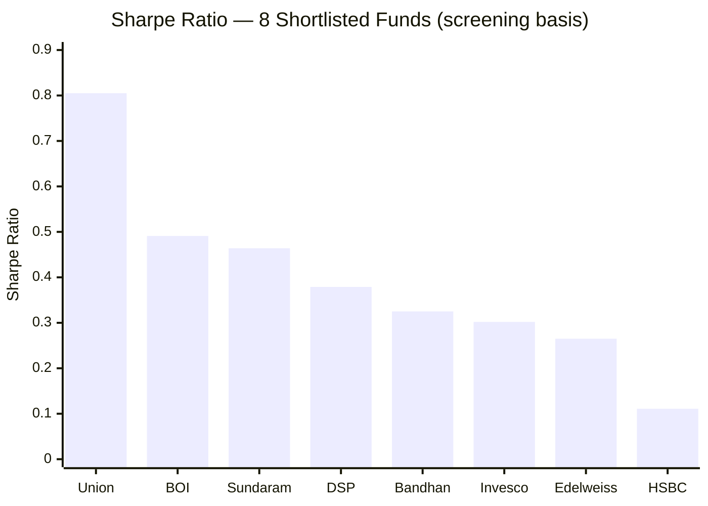
```mermaid
xychart-beta
    title "Sharpe Ratio — 8 Shortlisted Funds (screening basis)"
    x-axis ["Union", "BOI", "Sundaram", "DSP", "Bandhan", "Invesco", "Edelweiss", "HSBC"]
    y-axis "Sharpe Ratio" 0 --> 0.9
    bar [0.805, 0.491, 0.464, 0.379, 0.325, 0.302, 0.265, 0.111]
```
> BOI ranks **2nd of 8** on screening Sharpe — behind only Union.

---

## Sortino Ratio — Above 1.0 on Both Windows

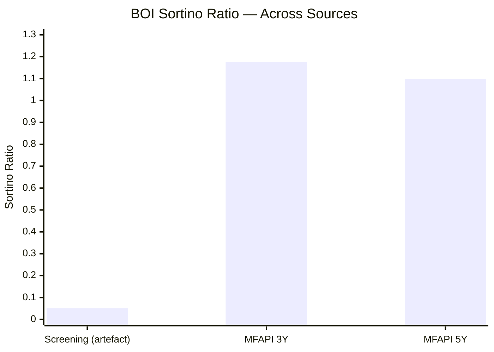
```mermaid
xychart-beta
    title "BOI Sortino Ratio — Across Sources"
    x-axis ["Screening (artefact)", "MFAPI 3Y", "MFAPI 5Y"]
    y-axis "Sortino Ratio" 0 --> 1.3
    bar [0.051, 1.175, 1.099]
```

| Source | Sortino | Period | Verdict |
|--------|---------|--------|---------|
| Screening | **0.051** | — | ⚠️ Same low-freq methodology artefact seen across all funds — discard |
| MFAPI computed | **1.175** | 3Y | Canonical — strong |
| MFAPI computed | **1.099** | 5Y | Consistent across windows |

BOI's 3Y Sortino (1.175) comfortably exceeds the category-average region (~1.0–1.1) and beats HSBC's 0.83. It is marginally below DSP's published 1.26 (3Y) but, crucially, BOI's Sortino is **stable** (3Y ≈ 5Y), whereas HSBC's deteriorated in the 3Y window. The screening 0.051 is the same artefact flagged in every fund's module and should be ignored.

### Why Sortino Matters More Than Sharpe for SIP Investors

- **Sharpe** penalises ALL volatility — including upside swings that build wealth
- **Sortino** only penalises **downside** volatility — the volatility that actually hurts
- BOI's Sortino (1.175) > Sharpe (0.853) on the 3Y window confirms the volatility is **upside-skewed** — the fund makes larger up-moves than harmful down-moves

---

## ⭐ Active Management That Actually Works — Beta, R², Alpha, IR *(BOI-specific)*

*All figures computed from BOI daily NAV vs the Nippon Nifty Smallcap 250 Index Fund (scheme 148519). Not published on any platform for this fund. Minor caveat: the index fund is net of ~0.3%/yr tracking cost, so the benchmark is fractionally understated and the alpha/IR fractionally overstated.*

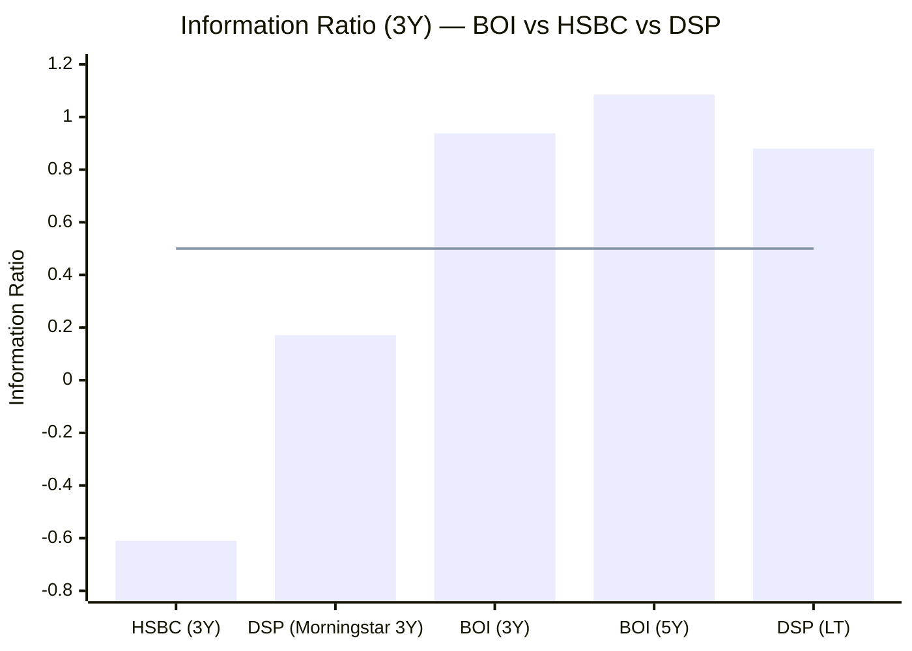
```mermaid
xychart-beta
    title "Information Ratio (3Y) — BOI vs HSBC vs DSP"
    x-axis ["HSBC (3Y)", "DSP (Morningstar 3Y)", "BOI (3Y)", "BOI (5Y)", "DSP (LT)"]
    y-axis "Information Ratio" -0.8 --> 1.2
    bar [-0.61, 0.171, 0.938, 1.085, 0.880]
    line [0.5, 0.5, 0.5, 0.5, 0.5]
```
> Line = 0.50 threshold for meaningful active return | Negative = active risk destroying value

| Metric | BOI 3Y | BOI 5Y | Category-typical | HSBC 3Y | DSP 3Y |
|--------|--------|--------|------------------|---------|--------|
| Beta | **0.942** | 0.893 | ~0.86 | 0.96 | 0.92 |
| R-Squared | **90.80** | 89.76 | ~92 | 95.96 | 90.95 |
| Jensen Alpha | **+5.45%** | +6.47% | ~0 | **−2.67** | +1.11 |
| Tracking Error | 5.82% | 5.96% | — | 4.40% | 6.51% |
| **Information Ratio** | **0.938** | **1.085** | — | **−0.61** | 0.17 / 0.88 |

**This is BOI's signature Module 2 finding — and the exact inverse of HSBC's.** Where HSBC's recent active management *destroys* risk-adjusted value (negative alpha, R² of 96 = index-hugging, IR −0.61), BOI's active management *creates* it:

1. **Beta 0.94 (3Y)** — sensible and appropriate for a small-cap fund: market-coupled but not a leveraged tracker. Slightly above the ~0.86 category region, similar to DSP (0.92), below HSBC (0.96).
2. **R² 90.8 (3Y)** — *below* the category ~92 and far below HSBC's 96. About **9% of returns are independent of the benchmark** — a genuine active-management signal, room for real stock-selection alpha.
3. **Jensen alpha +5.45% (3Y) / +6.47% (5Y)** — strongly positive (Tickertape independently shows alpha 6.44). The fund is *adding* return for the active risk it takes.
4. **Information Ratio 0.938 (3Y) / 1.085 (5Y)** — **the best of any studied small-cap fund.** An IR near/above 1.0 is institutional-grade: every unit of active risk is being rewarded with a more-than-proportional unit of alpha. HSBC's −0.61 is the opposite; DSP's long-term 0.88 is comparable but its 3Y is only 0.17.

The takeaway: BOI is not riding the index — it is genuinely out-selecting it, and getting paid for the active risk. The standing caveat applies (this active edge has been demonstrated in a bull-dominated, 2018-free window), but within that window the active-management quality is the strongest in the shortlist.

---

## Alpha — High on Every Basis

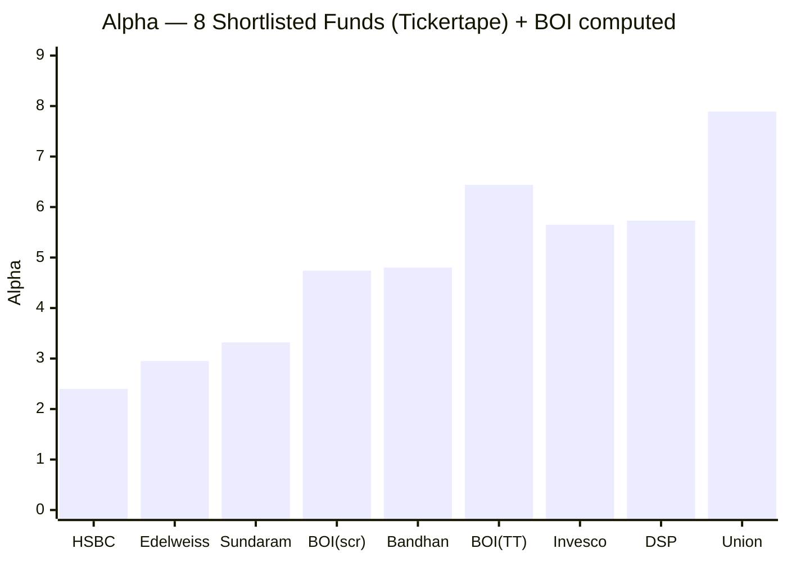
```mermaid
xychart-beta
    title "Alpha — 8 Shortlisted Funds (Tickertape) + BOI computed"
    x-axis ["HSBC", "Edelweiss", "Sundaram", "BOI(scr)", "Bandhan", "BOI(TT)", "Invesco", "DSP", "Union"]
    y-axis "Alpha" 0 --> 9
    bar [2.40, 2.95, 3.32, 4.74, 4.80, 6.44, 5.65, 5.73, 7.89]
```

| Source | Alpha | Period | Context |
|--------|-------|--------|---------|
| Screening | **4.74** | ~3Y | Mid-pack of 8 |
| Tickertape | **6.44** | current | High |
| Jensen (computed) | **+5.45%** | 3Y | Positive — active risk rewarded |
| Jensen (computed) | **+6.47%** | 5Y | Consistent |

Every alpha measure for BOI is firmly positive and high — in contrast to HSBC's long-term 2.40 (lowest of 8) and negative 3Y regression alpha. BOI's alpha was, like its peers', earned predominantly in a favourable post-2018 small-cap environment; the difference is that BOI's is being *sustained* into the recent window (positive 3Y Jensen alpha) rather than inverting.

---

## Calmar Ratio — 2nd-Best of the Shortlist

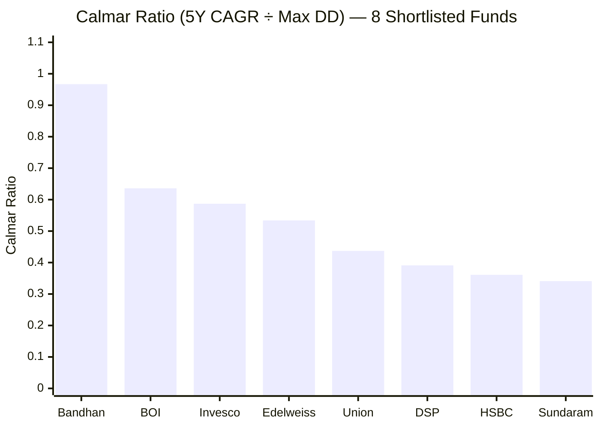
```mermaid
xychart-beta
    title "Calmar Ratio (5Y CAGR ÷ Max DD) — 8 Shortlisted Funds"
    x-axis ["Bandhan", "BOI", "Invesco", "Edelweiss", "Union", "DSP", "HSBC", "Sundaram"]
    y-axis "Calmar Ratio" 0 --> 1.1
    bar [0.967, 0.636, 0.587, 0.534, 0.437, 0.391, 0.361, 0.341]
```

| Period | BOI CAGR | Max DD | Calmar |
|--------|----------|--------|--------|
| 3Y | 22.56% | 32.37% | **0.697** |
| 5Y | 20.57% | 32.37% | **0.636** |
| Since Inception | 26.73% | 32.37% | **0.826** |

BOI's Calmar of 0.636 (5Y) ranks **2nd of 8**, behind only Bandhan. As always, the normalisation caveat applies in BOI's favour *and* against it: the high Calmar is driven by a **shallow max-DD denominator that excludes 2018.** If BOI had lived through the IL&FS winter, its max drawdown would likely be in the −40% to −50% range, which would compress its Calmar toward ~0.40–0.50 — i.e. into the DSP/HSBC band. The headline 0.636 is real but flattered by the missing crisis.

---

## Capture Ratios — Excellent Up-Capture, Largely Unproven Down-Capture

*Derived from annual calendar-year returns vs Nifty SC 250 TRI (Module 1).*

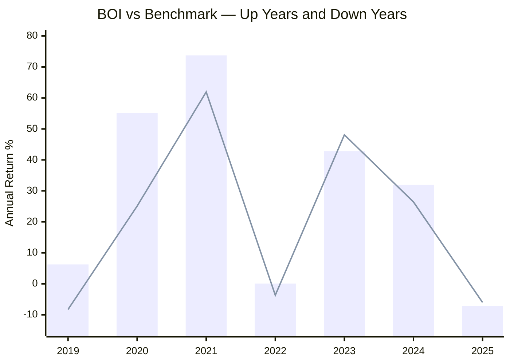
```mermaid
xychart-beta
    title "BOI vs Benchmark — Up Years and Down Years"
    x-axis ["2019", "2020", "2021", "2022", "2023", "2024", "2025"]
    y-axis "Annual Return %" -15 --> 80
    bar [6.27, 55.11, 73.72, 0.10, 42.84, 31.96, -7.19]
    line [-8.27, 25.09, 61.94, -3.65, 48.10, 26.43, -6.01]
```
> Bar = BOI | Line = Nifty SC 250 TRI

### Up-Market Years (Benchmark Positive)

| Year | BOI | Benchmark | Upside Capture | Notes |
|------|-----|-----------|----------------|-------|
| 2020 | +55.11% | +25.09% | **219.6%** | Explosive COVID-recovery capture |
| 2021 | +73.72% | +61.94% | **119.0%** | Full bull capture |
| 2023 | +42.84% | +48.10% | 89.1% | Lagged the momentum bull |
| 2024 | +31.96% | +26.43% | **120.9%** | Strong |
| **Aggregate up-capture** | — | — | **~126.0%** | Aggressive — amplifies upside |

### Down-Market Years (Benchmark Negative)

| Year | BOI | Benchmark | Downside Capture | Verdict |
|------|-----|-----------|-----------------|---------|
| 2019 | **+6.27%** | −8.27% | **−75.8%** | Fund positive in a down year (post-crash recovery) |
| 2022 | **+0.10%** | −3.65% | **−2.7%** | Fund positive — defensive |
| **2025** | **−7.19%** | −6.01% | **119.6%** | ⚠️ Mild miss — lost slightly more than benchmark |

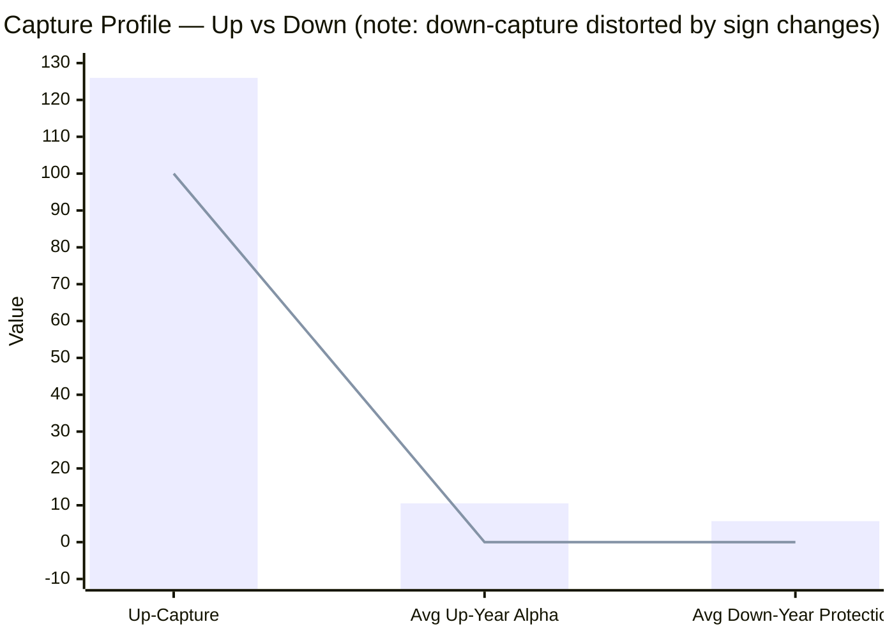
```mermaid
xychart-beta
    title "Capture Profile — Up vs Down (note: down-capture distorted by sign changes)"
    x-axis ["Up-Capture", "Avg Up-Year Alpha", "Avg Down-Year Protection"]
    y-axis "Value" -10 --> 130
    bar [126.0, 10.52, 5.70]
    line [100, 0, 0]
```

> **Down-capture caveat.** A single aggregate down-capture ratio is misleading: in 2 of 3 down-benchmark years (2019, 2022) BOI was *positive* while the index fell — but both were recovery/sideways years, not crashes. The **one genuine down-market test (2025) produced a mild miss** (downside capture 119.6%). So the honest read is **excellent, proven up-capture (126%); largely unproven down-capture.** The defensive record looks great but has not faced a real grinding bear — the M2 expression of the inception-bias theme.

---

## PE Ratio — Above Category; Minimal Valuation Buffer

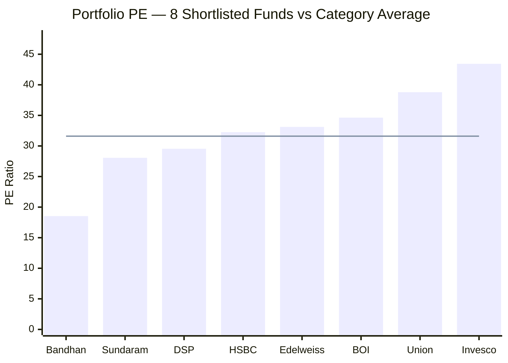
```mermaid
xychart-beta
    title "Portfolio PE — 8 Shortlisted Funds vs Category Average"
    x-axis ["Bandhan", "Sundaram", "DSP", "HSBC", "Edelweiss", "BOI", "Union", "Invesco"]
    y-axis "PE Ratio" 0 --> 48
    bar [18.53, 28.06, 29.54, 32.25, 33.12, 34.63, 38.79, 43.43]
    line [31.60, 31.60, 31.60, 31.60, 31.60, 31.60, 31.60, 31.60]
```
> Line = category average PE (31.60) | BOI = 6th of 8, above category

| Rank | Fund | PE | vs Category |
|------|------|----|------------|
| 1 (cheapest) | Bandhan | 18.53 | −41% |
| 3 | DSP | 29.54 | −6.5% |
| **6** | **BOI** | **34.63** | **+9.6%** |
| 7 | Union | 38.79 | +23% |
| 8 | Invesco | 43.43 | +37% |

BOI's portfolio PE of 34.63 is **above the category average (31.60)** — 6th of 8, more expensive than DSP, HSBC, Sundaram and Bandhan. **A higher PE provides less cushion in a correction:** if small caps de-rate, a PE-34.6 portfolio faces more multiple-compression risk than DSP's PE-29.5 or Bandhan's PE-18.5. This is a genuine, if modest, negative — the valuation buffer is thin. (Module 3 should examine whether this reflects a quality-growth tilt or simply chasing re-rated names.)

---

## Structural Risk — No Buffer + Smallest-AUM Redemption Risk *(BOI-specific)*

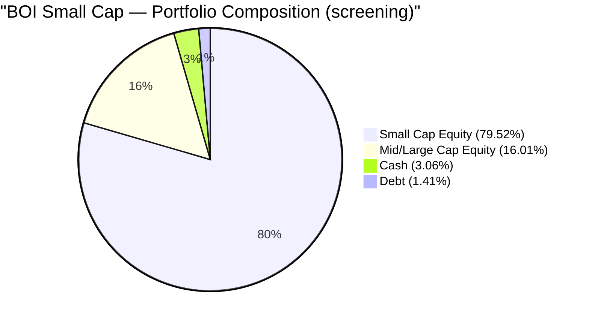
```mermaid
pie title "BOI Small Cap — Portfolio Composition (screening)"
    "Small Cap Equity (79.52%)" : 79.52
    "Mid/Large Cap Equity (16.01%)" : 16.01
    "Cash (3.06%)" : 3.06
    "Debt (1.41%)" : 1.41
```

| Buffer Type | BOI | Parag Parikh FlexiCap | Comment |
|-------------|-----|-----------------------|---------|
| Bonds / Debt | 1.41% | 9.92% | BOI has a token debt sleeve only |
| International Equity | 0% | 11.81% | No low-correlation buffer |
| Cash | 3.06% | ~4.25% | Thin working-capital cash |
| ≥65% Small Cap (SEBI) | 79.52% (mandatory ≥65%) | 6.15% | Highest small-cap % of studied funds — purest exposure |

BOI runs the **highest small-cap allocation (79.52%) of any studied fund** — the purest, least-diluted small-cap exposure, with essentially no non-equity buffer. Two consequences:

1. **Maximum beta to the small-cap segment** — when small caps correct, BOI takes the full hit; all protection comes from stock selection (which, on the IR/alpha evidence, has worked — but only in non-bear conditions).
2. **⭐ Smallest-AUM redemption risk** — at **₹2,168 Cr**, BOI is the smallest fund in the shortlist. In a real bear, a redemption wave forces selling of illiquid small-caps at distressed prices, worsening NAV for remaining holders — exactly the *study_plan*'s flagged scenario. The 3% cash + 1.4% debt is a thin buffer for a true crisis. This redemption fragility is the structural risk that BOI's 2018-free, V-recovery-only history has never stress-tested.

---

## Risk Metrics — Full 8-Fund Peer Comparison

```mermaid
quadrantChart
    title Risk vs Alpha — 8 Shortlisted Small Cap Funds
    x-axis "Lower Alpha" --> "Higher Alpha"
    y-axis "Higher Drawdown (Worse)" --> "Lower Drawdown (Better)"
    quadrant-1 High Alpha, Low Drawdown (Best)
    quadrant-2 Low Alpha, Low Drawdown
    quadrant-3 Low Alpha, High Drawdown (Worst)
    quadrant-4 High Alpha, High Drawdown
    DSP: [0.65, 0.35]
    Union: [0.90, 0.45]
    BOI: [0.60, 0.72]
    Bandhan: [0.58, 0.85]
    Invesco: [0.68, 0.55]
    Edelweiss: [0.35, 0.55]
    HSBC: [0.28, 0.25]
    Sundaram: [0.40, 0.15]
```
> BOI sits in the favourable upper-mid zone — good alpha, low drawdown. Caveat: the low-drawdown axis is flattered by the missing 2018 crisis.

### Full 8-Fund Risk Metric Matrix

| Metric | **BOI** | DSP | Union | Bandhan | Sundaram | Invesco | Edelweiss | HSBC |
|--------|---------|-----|-------|---------|---------|---------|-----------|------|
| Sharpe (screening) | **0.491** | 0.379 | **0.805** | 0.325 | 0.464 | 0.302 | 0.265 | 0.111 |
| Sharpe (computed 3Y) | **0.853** | 0.98 | — | — | — | — | — | 0.61 |
| Sortino (computed 3Y) | **1.175** | 1.34 | — | — | — | — | — | 0.83 |
| Alpha (Tickertape) | **6.44** | 5.73 | **7.89** | 4.80 | 3.32 | 5.65 | 2.95 | 2.40 |
| Beta (computed 3Y) | 0.94 | 0.92 | — | — | — | — | — | 0.96 |
| R² (computed 3Y) | 90.8 | 90.95 | — | — | — | — | — | 95.96 |
| IR (computed 3Y) | **0.938** | 0.17 | — | — | — | — | — | **−0.61** |
| Max Drawdown | −32.37% | −49.06% | −44.71% | **−24.34%** | −57.06% | −37.66% | −37.09% | −52.45% |
| Volatility (screening) | 16.33% | 15.85% | 17.37% | **15.46%** | 16.19% | 16.42% | **15.10%** | 16.84% |
| Portfolio PE | 34.63 | 29.54 | 38.79 | **18.53** | 28.06 | 43.43 | 33.12 | 32.25 |
| Calmar (5Y) | **0.636** | 0.391 | 0.437 | **0.967** | 0.341 | 0.587 | 0.534 | 0.361 |
| ATH distance | **0.00%** | −2.22% | −2.10% | −3.80% | −8.90% | −6.80% | −4.20% | −8.74% |
| Multi-cycle proof | **Short ❌** | **13Y ✅** | Medium | Short | Longest | Short | Short | **12Y ✅** |

### BOI's Rank on Each Risk Metric (1 = Best)

| Metric | BOI Value | Rank | Leader |
|--------|-----------|------|--------|
| Sharpe (screening) | 0.491 | **2/8** | Union 0.805 |
| Sortino (computed 3Y) | 1.175 | High | DSP 1.34 |
| Information Ratio (3Y) | 0.938 | **1/8** | BOI (best) |
| Alpha (Tickertape) | 6.44 | **2/8** | Union 7.89 |
| Max Drawdown (raw) | −32.37% | **2/8** | Bandhan −24.34% |
| Max Drawdown (stress-adjusted) | — | **~5/8** | Missing 2018 inflates rank |
| Volatility | 16.33% | 5/8 | Edelweiss 15.10% |
| Portfolio PE | 34.63 | 6/8 | Bandhan 18.53 |
| Calmar (5Y) | 0.636 | **2/8** | Bandhan 0.967 |
| ATH distance | 0.00% | **1/8** | BOI (at peak) |
| Multi-cycle proof | Short | **6–7/8** | DSP/HSBC |

**Summary:** BOI ranks 1st or 2nd on almost every *measured* risk metric — IR (1st), ATH (1st), Sharpe (2nd), Calmar (2nd), max DD (2nd), alpha (2nd). Its only poor ranks are **PE buffer (6th)** and **multi-cycle proof (6–7th)** — and the latter is the asterisk that hangs over all the others. This is the precise inverse of HSBC, which ranks last on recent metrics but leads on multi-cycle proof.

---

## Comparison with Studied FlexiCap Funds

| Metric | BOI Small Cap | DSP Small Cap | Parag Parikh FlexiCap | BOI FlexiCap |
|--------|---------------|--------------|----------------------|-------------|
| Volatility (screening) | 16.33% | 15.85% | **9.06%** | 14.52% |
| Daily Vol (full, MFAPI) | 18.20% | 16.63% | ~12% | ~16.85% |
| Max Drawdown | −32.37% | −49.06% | −31.20% | **−23.73%** |
| Worst Year | −7.19% (2025) | −25.12% (2018) | −6.29% (2022) | +0.77% (2022) |
| Sharpe (computed 3Y) | **0.853** | 0.98 | ~0.68 | 0.88–1.16 |
| Sortino (computed 3Y) | 1.175 | 1.34 | ~1.06 | **1.51** |
| Beta | 0.94 | 0.92 | **0.55** | 1.05–1.11 |
| R² | 90.8 | 90.95 | — | — |
| IR (3Y) | **0.938** | 0.17 | — | — |
| PE vs Category | +9.6% | −6.5% | **−38%** | −8.5% |
| ATH Distance | **0.00%** | −2.22% | −4.44% | −4.04% |
| Multi-Cycle Proof | ❌ 7.5Y | ✅ 13Y | ✅ 13Y | ❌ 5.9Y |
| Non-Equity Buffer | ~1.4% debt | None | Bonds + International | None |

**Cross-category interpretation:**
- BOI Small Cap and BOI FlexiCap share the same AMC, CIO (Alok Singh) and house style — and both score strongly on risk-adjusted return. BOI FlexiCap's risk metrics are even tighter (lower max DD, higher Sortino), as expected for a multi-cap mandate vs a pure small-cap one.
- BOI's IR (0.938) is the standout — higher than DSP's 3Y (0.17) and unmeasured-but-likely-high for BOI FlexiCap, confirming the desk's active-management quality across mandates.
- The honest gap: both BOI funds and Bandhan lack genuine multi-cycle proof (5.9–7.5Y histories), whereas DSP and PP FlexiCap carry the 13-year, IL&FS-inclusive scar. On *measured* risk BOI leads; on *tested* risk DSP/PP lead.

---

## Risk Profile — Points For and Against

### ✅ Points IN FAVOUR

1. **At its all-time high (0.00% from ATH, 0 days underwater)** — the best portfolio-health signal in the entire study
2. **2nd-shallowest max drawdown of the 8 (−32.37%)** — a clean COVID V recovered in 137 days
3. **Best Information Ratio of any studied small-cap fund (0.938 3Y / 1.085 5Y)** — active management is genuinely rewarded
4. **Positive Jensen alpha (+5.45% 3Y / +6.47% 5Y)** — the inverse of HSBC's −2.67
5. **Healthy R² (90.8)** — ~9% independent return; not an index-hugger (HSBC is at 96)
6. **Top-tier, stable Sharpe (0.853 3Y / 0.802 5Y; screening 2nd of 8)** — no recent collapse
7. **Sortino > 1.0 on both windows (1.175 / 1.099)** — efficient downside-risk compensation
8. **Sensible beta (0.94)** — market-coupled but not a leveraged tracker
9. **Gentlest daily negative skew of the studied funds (1.18× down/up >2%)**
10. **2nd-best Calmar (0.636)** — high return per unit of (shallow) max pain
11. **Fastest COVID recovery of the studied funds (137 days)** — portfolio quality in a sharp crash
12. **Positive in 2 of 3 down-benchmark years (2019, 2022)** — defensive in recovery/sideways markets
13. **Highest small-cap allocation (79.52%)** — purest exposure; alpha not diluted by large-cap spillover

### ⚠️ Points AGAINST

1. **No 2018 / multi-cycle proof** — record begins post-IL&FS; never faced a grinding small-cap bear
2. **Max drawdown is COVID-only** — a fast V; the −32.37% understates likely drawdown in a 2018-type event
3. **Every elite metric (Calmar, rolling, capture, max DD) is flattered by the missing crisis** — measured, not tested, resilience
4. **Portfolio PE 34.63 — above category (31.60), 6th of 8** — thin valuation buffer; more de-rating risk
5. **Smallest AUM in the shortlist (₹2,168 Cr)** — redemption-driven forced-selling risk in a real bear, never tested
6. **Down-capture largely unproven** — the one genuine down-market test (2025) was a mild miss (119.6%)
7. **2025 was the second-worst episode** (worst 3M/6M windows) — recovered, but shows the fund is not immune to corrections
8. **No structural non-equity buffer** (~1.4% debt, ~3% cash) — all protection from stock selection
9. **Recent volatility elevated** (2025: 21.08%, 2026-YTD: 21.37%) — the slump came with volatility
10. **Active edge demonstrated only in a favourable regime** — the IR/alpha quality is real but bull-window-bounded

---

## Module 2 Scorecard

```mermaid
xychart-beta
    title "Module 2 Sub-Dimension Scores — BOI Small Cap (1-5)"
    x-axis ["Vol", "MaxDD Raw", "MaxDD Context", "Sharpe", "Sortino", "Beta/R2", "TE/IR", "PE", "ATH", "Cap Asym", "Daily Tail", "Multi-Cycle"]
    y-axis "Score" 0 --> 5
    bar [3.5, 4.0, 2.5, 4.5, 4.0, 4.0, 5.0, 2.5, 5.0, 3.5, 4.0, 2.0]
```

| Sub-dimension | Score (1–5) | Reasoning |
|---------------|------------|-----------|
| Volatility | **3.5** | 5th of 8 (16.33% screening / 18.2% daily); mid-pack; elevated recently |
| Max Drawdown (raw) | **4.0** | −32.37% — 2nd-shallowest of 8 |
| Max Drawdown (context-adjusted) | **2.5** | COVID-only V; never faced 2018; likely deeper in a real bear |
| Sharpe Ratio | **4.5** | 0.853 (3Y) / 0.802 (5Y); 2nd of 8 on screening; stable, no collapse |
| Sortino Ratio | **4.0** | 1.175 (3Y) / 1.099 (5Y); above 1.0 on both windows |
| Beta / R² | **4.0** | Beta 0.94 (sensible); R² 90.8 (healthy active share, not index-hugging) |
| Tracking Error / IR | **5.0** | IR 0.938 (3Y) / 1.085 (5Y) — best of any studied SC fund; active risk rewarded |
| PE Valuation Buffer | **2.5** | 34.63 — above category; 6th of 8; thin cushion |
| ATH Distance | **5.0** | 0.00% — at all-time high; best in study |
| Capture Asymmetry | **3.5** | Up-capture 126% (proven); down-capture excellent-looking but unproven (2025 mild miss) |
| Daily Tail Risk | **4.0** | −11.21% worst day; 1.18× down/up skew — gentlest of studied funds |
| Multi-Cycle Proof | **2.0** | 7.5Y, single crisis (COVID); no 2018; smallest-AUM redemption risk untested |
| **Module 2 Overall** | **~3.7 / 5** | **Excellent on every metric the data can measure** — at ATH, best IR in the study, 2nd-best Sharpe/Calmar/max DD, positive alpha, healthy active share. **Capped — not lifted above DSP — by the single-crisis/2018-free history, the above-category PE, and the smallest-AUM redemption risk.** Read as "elite measured risk, untested downside." |

---

## Comparative Module 2 Scores

| Fund | M2 Score | Risk Profile Summary |
|------|----------|---------------------|
| PP FlexiCap | 4.0/5 | Lowest vol, structural buffer, multi-cycle proof |
| **DSP Small Cap** | **3.8/5** | Best capture asymmetry, at ATH, **multi-cycle proof**; honest −49% DD |
| BOI FlexiCap | 3.75/5 | Best Sharpe/Sortino/IR; single-cycle only |
| **BOI Small Cap** | **~3.7/5** | **Best IR + at ATH + 2nd-best Sharpe/Calmar/maxDD; capped by missing 2018, above-cat PE, smallest-AUM risk** |
| Edelweiss FlexiCap | 3.75/5 | Low TE; decent multi-cycle |
| Bandhan Small Cap | ~3.5/5 | Lowest raw max DD; no 2018 test |
| Invesco Small Cap | ~3.3/5 | Single-cycle; moderate Sharpe |
| HSBC Small Cap | ~3.2/5 | Elite *historical*, deteriorating *recent* (IR −0.61, −8.74% from ATH) |

**BOI lands just below DSP (3.8) and above HSBC (3.2).** The logic: BOI beats DSP on nearly every *measured* metric (at ATH, higher IR, shallower drawdown, comparable Sharpe), but DSP's 3.8 reflects **battle-tested multi-cycle proof** that BOI structurally cannot match — DSP's risk numbers survived IL&FS and COVID; BOI's have only survived COVID. The 0.1-point gap is precisely the value of that tested-vs-measured distinction. BOI sits well above HSBC because HSBC's *recent* risk profile is genuinely deteriorating (negative IR, index-hugging, underwater), whereas BOI's is genuinely healthy — just young.

---

## SIP Implication

For a ₹20,000/month satellite SIP over a 10+ year horizon, BOI's risk profile is the most *attractive-looking* in the shortlist — and the one whose attractiveness comes with the clearest asterisk.

**What the measured data says:** This is a fund at its all-time high, with the best Information Ratio of any studied small-cap fund (active management genuinely rewarded), the 2nd-best Sharpe and Calmar, the 2nd-shallowest drawdown, positive alpha, a sensible beta, a healthy active share (R² 90.8, not an index-hugger), and the gentlest daily negative skew of the group. On every axis the data can measure, BOI is at or near the top — and, critically, it shows **none of the recent deterioration** that has overtaken HSBC. Its 2025 correction was its second-worst episode, yet it recovered to a *new* all-time high within ~15 months.

**What the data cannot say:** every one of those elite numbers rests on a **7.5-year, 2018-free, single-crisis history.** BOI's deepest-ever drawdown (−32.37%) was a fast COVID V that recovered in under 6 months — not the slow, grinding small-cap winter of 2018–2020 that gave DSP and HSBC their 49–52% drawdowns and their genuine battle scars. Layered on top are two structural risks the record has never tested: an **above-category portfolio PE (34.63)** that offers little cushion if small caps de-rate, and the **smallest AUM in the shortlist (₹2,168 Cr)**, which makes redemption-driven forced selling in a real bear a live, unproven vulnerability.

**The three SIP risk behaviours to expect with BOI over 10 years:**

1. **In a sharp, liquidity-driven crash (like COVID):** the fund falls hard but recovers fast — historically the *fastest* of the studied funds (137 days). Continue the SIP aggressively; these are the units that compound most.
2. **In a momentum-driven bull (like 2023):** the fund may lag peers modestly (2023: −5.3% alpha). Endure it — the long-run IR shows the active edge reasserts.
3. **In a slow, grinding small-cap bear (like 2018 — never yet experienced):** this is the unknown. A PE-34.6 portfolio at the smallest AUM in the group, with no structural buffer, could draw down more than its clean −32.37% record suggests. Plan for a deeper drawdown than the history shows.

**What to monitor:**
- AUM trajectory — at ₹2,168 Cr the redemption risk is real; watch both inflow-driven bloat (which would dilute the small-cap edge) and outflow stress in any correction
- A second consecutive down-market miss — 2025 was a mild miss (119.6% downside capture); if 2026/27 repeats it, the unproven down-capture becomes a proven weakness
- Whether the elite IR (0.938) persists as the history lengthens and eventually includes a real bear

**Recommended SIP behaviour:** Continue with confidence in calm and sharp-crash conditions — the measured risk profile genuinely supports it. But **size the position knowing the downside is untested**: this is a fund whose risk metrics are excellent and whose worst-case has simply not been observed. For a satellite allocation with a 10Y+ horizon, that trade-off is acceptable; just do not mistake the spotless drawdown record for proof of bear-market resilience.

**Do not over-weight the at-ATH signal as a "safe" entry.** Being at the all-time high confirms portfolio health, but it also means zero discount and a full-valuation entry — the inverse of the deep-discount opportunities that crashes create.

---

*Module 2 completed: June 2026 | Risk Profile | MFAPI methodology (BOI Small Cap scheme 145678, 1,837 days, Dec 2018 → Jun 2026) | Beta/R²/Alpha/IR computed vs Nippon Nifty Smallcap 250 Index Fund (scheme 148519); max drawdown (−32.37%) reproduces screening exactly | Benchmark = Nifty Smallcap 250 TRI (mandate: BSE 250 SmallCap TRI) | Provisional M2 Score: ~3.7/5 (subject to M3–M6 for the PE/AUM/down-capture questions)*

*Next: [Module 3 — Portfolio DNA](module3_portfolio.md)*
