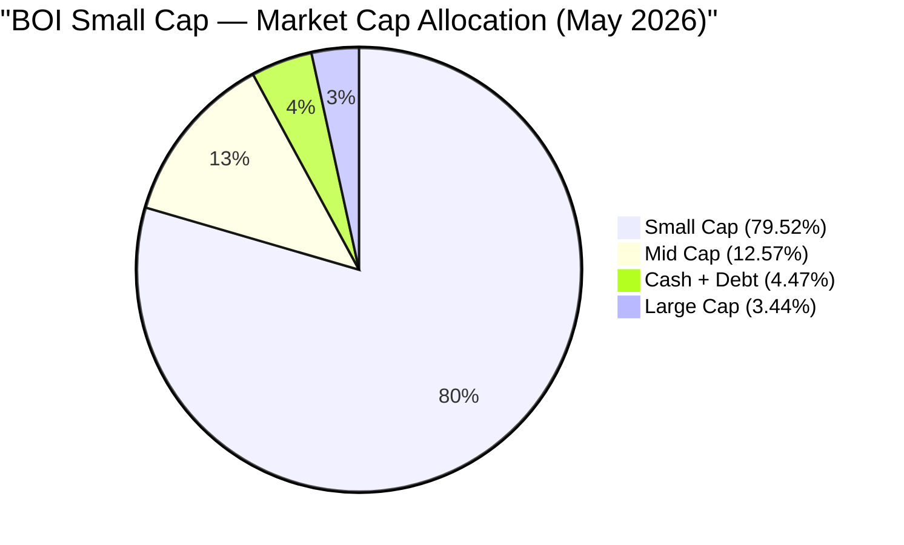
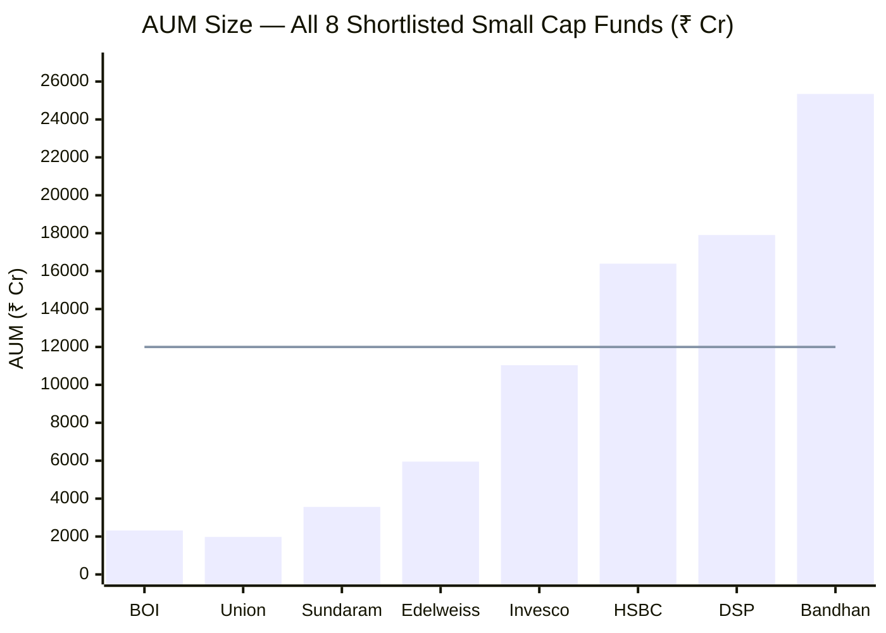
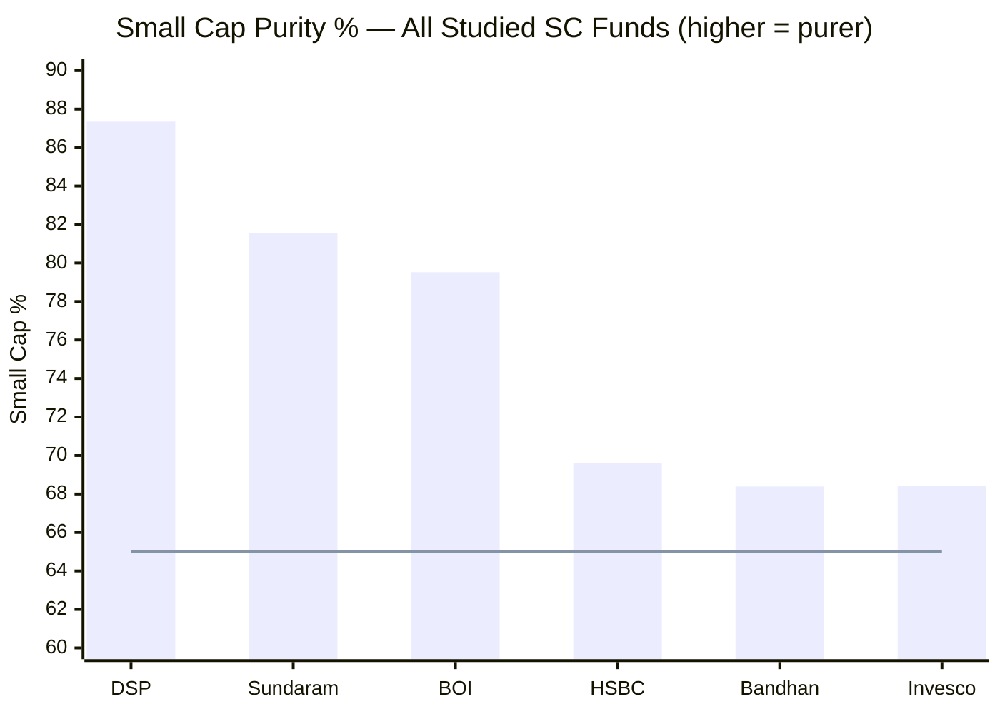
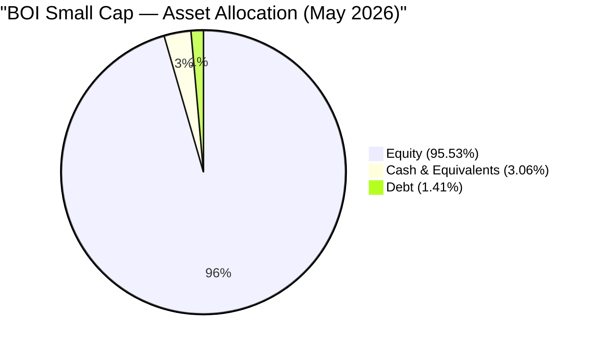
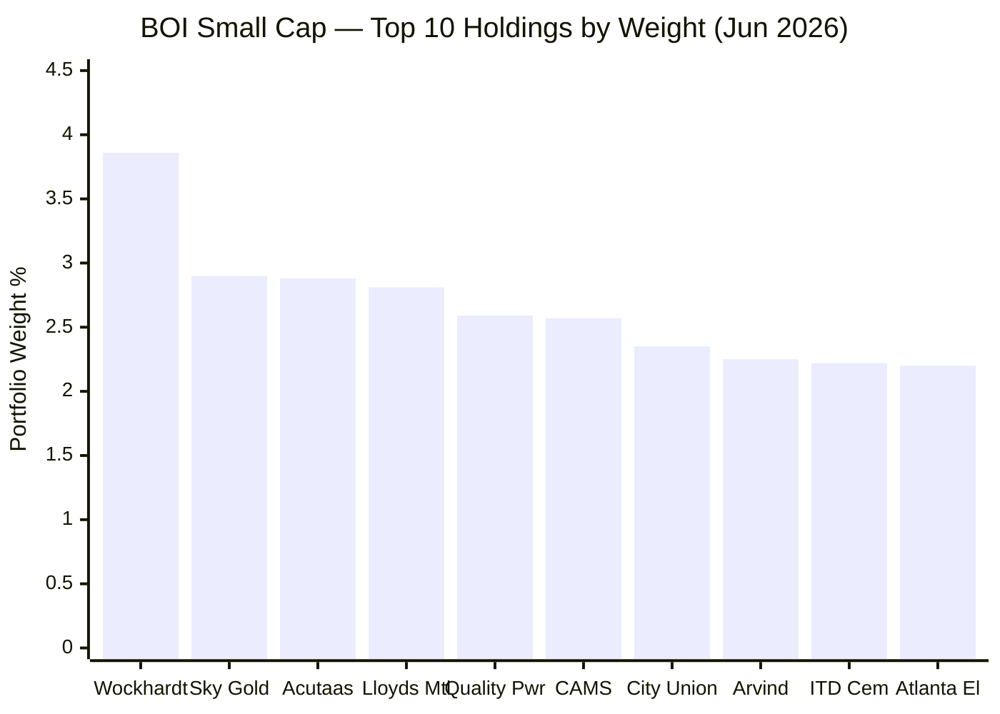
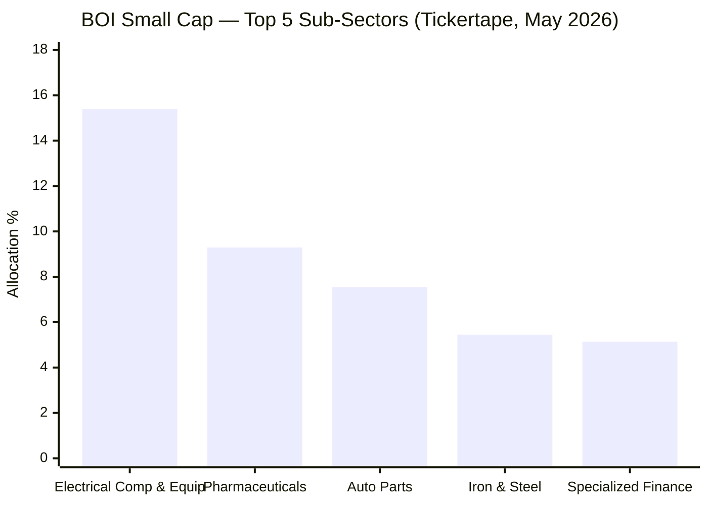
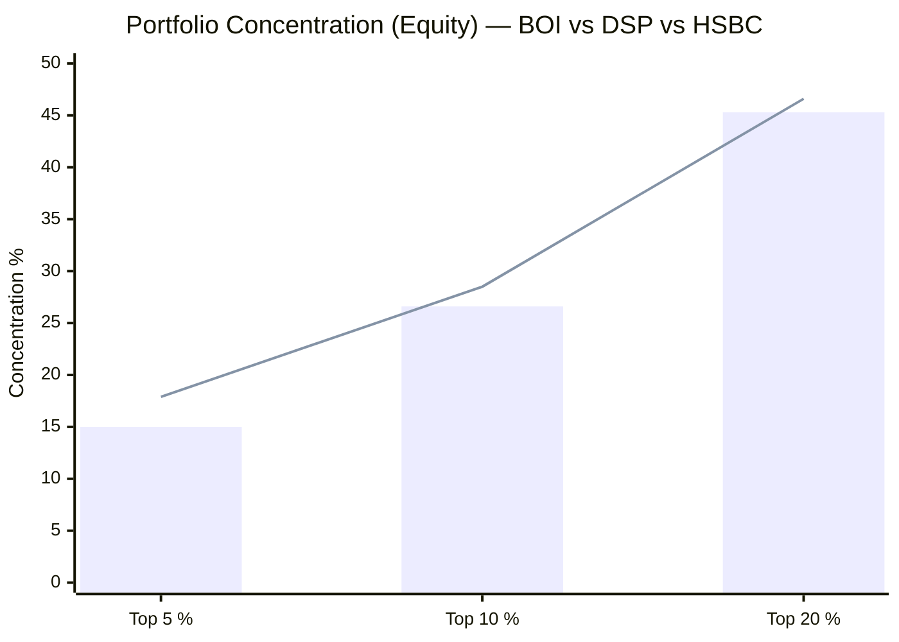
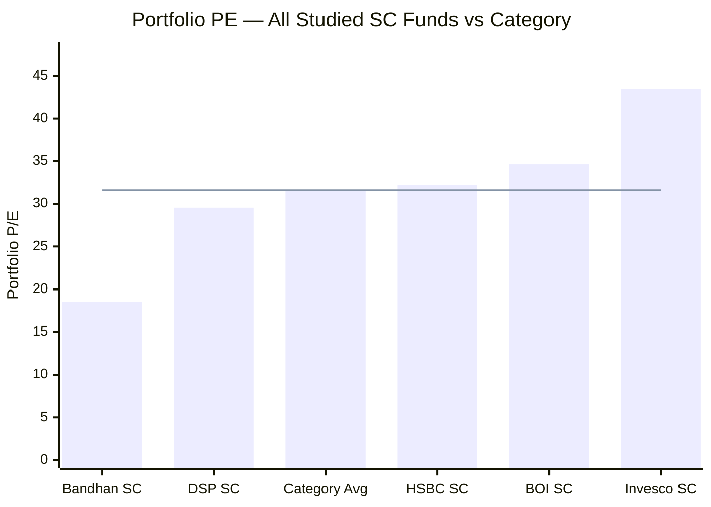
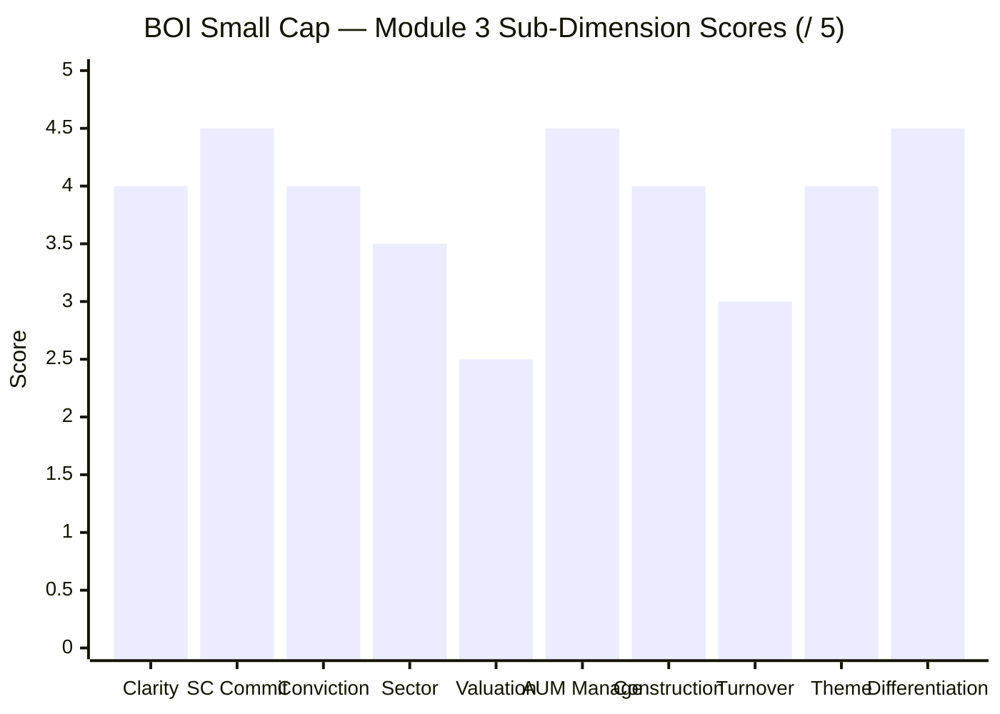
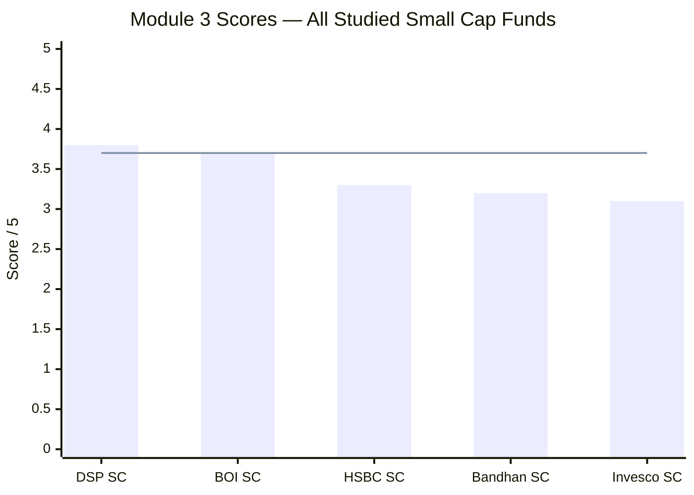

# Module 3: Portfolio DNA — BOI Small Cap Fund

*Sources: Groww (top-20 holdings + stock count + cash, Jun 2026), Tickertape (sub-sector allocation + concentration, May 2026), Value Research Online (holdings + AUM + ER, Jun 2026), Screening CSV (market-cap split + concentration, May 2026), MFAPI NAV history (scheme 145678). Benchmark = Nifty Smallcap 250 TRI (mandate: BSE 250 SmallCap TRI).*

---

## Module 3 Score: ~3.7 / 5

BOI's portfolio is the study's **"nimble, pure, differentiated small-cap fund"** — and Module 3 introduces the one genuinely *new and positive* structural story that the return/risk numbers cannot show. At **₹2,168–2,318 Cr, BOI is by far the smallest fund in the shortlist**, and in portfolio-construction terms that is a decisive *advantage*: where DSP (₹17,906 Cr) and HSBC (₹16,394 Cr) are fighting an AUM ceiling that forces them toward index-like breadth, BOI can actually do what a small-cap fund is *supposed* to do — fish in the smallest, least-covered names and take meaningful positions without moving prices. Combined with the 2nd-highest small-cap purity of the 8 funds (79.52%) and a genuinely differentiated (non-consensus) top-20, this is the cleanest expression of small-cap intent in the study. The offsets are an above-category PE (34.63, no valuation buffer), the redemption fragility of the smallest AUM, and an **undisclosed turnover ratio** (a genuine data gap, deferred to Module 4).

---

## The Headline Finding — AUM as a Superpower, Not a Constraint

Modules 1–2 kept circling the same tension: excellent metrics, untested in a real bear. Module 3 introduces a *different* axis entirely — and on this one, BOI's defining characteristic is a clear **structural edge**:

| The Edge | BOI | The Big-Fund Problem (DSP / HSBC) |
|---|---|---|
| **AUM ₹2,168–2,318 Cr** | 1% position ≈ **₹22 Cr** | DSP/HSBC: ₹164–179 Cr per 1% |
| **Access to sub-₹2,000 Cr micro-caps** | **Full** | Largely closed (market impact too high) |
| **Coping mechanism needed for scale** | **None** | DSP: 8.4% cash; HSBC: 109 stocks + index-hug |
| **Small-cap purity 79.52%** | 2nd-highest of 8 | HSBC 69.5%, Invesco 65.1%, Bandhan 66.9% |

This is the exact inverse of HSBC's Module 3 (whose "index-hugging triad" was driven by an AUM-forced 109-stock book) and of DSP's (whose 8.4% cash and 81 stocks are scale-coping mechanisms). **BOI has no scale problem to cope with** — and that freedom is the structural explanation for its elite Information Ratio from Module 2 (0.938): a nimble fund hunting in an inefficient universe. Every subsequent section is a layer of evidence on this central edge — and on its one genuine cost (redemption fragility).

```mermaid
quadrantChart
    title Portfolio Positioning Matrix (Studied SC Funds)
    x-axis Low Concentration → High Concentration
    y-axis Low SC Purity → High SC Purity
    quadrant-1 Pure + Concentrated (Ideal)
    quadrant-2 Pure + Diffuse
    quadrant-3 Diluted + Diffuse
    quadrant-4 Diluted + Concentrated
    DSP SC: [0.62, 0.93]
    BOI SC: [0.55, 0.80]
    HSBC SC: [0.28, 0.72]
    Invesco SC: [0.72, 0.10]
    Bandhan SC: [0.05, 0.08]
```
> BOI sits in the favourable "high-purity, moderate-concentration" zone — close to DSP, and the polar opposite of Bandhan's diffuse deep-value spray.

---

## Raw Data (Compiled and Cross-Verified Across Sources)

| Metric | Value | Source(s) | Confidence |
|---|---|---|---|
| **Total equity stocks** | **84** | Groww | ✅ Single-source |
| **Small Cap %** | **79.52%** | Screening | ✅ |
| **Mid Cap %** | **12.57%** | Screening | ✅ |
| **Large Cap %** | **3.44%** | Screening | ✅ |
| **Equity %** | **95.5–96.9%** | Screening 95.53% / Tickertape 96.87% | ✅✅ |
| **Cash & Equivalents %** | **~3.1%** | Groww (repo 1.56 + receivables 0.67 + T-bill 0.28 + CD 0.63) | ✅ |
| **Debt %** | **1.41%** | Screening | ✅ |
| **Portfolio PE** | **34.63** (cat 31.60) | Screening | ✅ |
| **Portfolio Turnover** | **Not disclosed** ⚠️ | — | ❌ Data gap → M4 |
| **AUM** | **₹2,168–2,318 Cr** | VRO / Tickertape | ✅ Smallest of 8 |
| **Top Holding (Wockhardt)** | **3.86%** | Groww / Tickertape | ✅✅ |
| **Top 3 concentration** | **~9.6%** | Computed (screening 9.38%) | ✅ |
| **Top 5 concentration** | **~15.0%** | Computed (Tickertape 15.04%, screening 14.81%) | ✅✅ |
| **Top 10 concentration** | **~26.6%** | Computed (screening 26.58%) | ✅✅ |
| **Top 20 concentration** | **~45.3%** | Computed from Groww | ✅ |
| **Lead sub-sector** | Electrical Components & Equipments **15.39%** | Tickertape | ✅ |
| **Manager** | **Alok Singh** + Nav Bhardwaj (co, 14-Jul-2025) | VRO / web | ✅ |
| **Direct Expense Ratio** | **0.43–0.48%** | Tickertape / VRO | Resolved in M4 |
| **SEBI SC Mandate Minimum** | 65% | Universal | — |
| **BOI SC vs Minimum** | **+14.5pp above floor** | Computed | — |

---

## The Core Thesis — A Nimble, Pure, Conviction-Diversified Small-Cap Fund

SEBI's Small Cap mandate requires a minimum 65% in small-cap stocks at all times. A manager's *choices* on top of that floor reveal the philosophy. BOI's choices form a coherent picture:

- **79.52% small cap** — 2nd-highest of the 8 funds (behind DSP 87.35%, ahead of Sundaram 81.55%, HSBC 69.5%, Invesco 65.1%, Bandhan 66.9%)
- **12.57% mid cap** — modest graduation drift, not deliberate dilution
- **3.44% large cap** — minimal (a little PSU drift: Indian Bank, Hindustan Copper)
- **~3.1% cash + 1.4% debt** — thin operational buffer, near-fully invested
- **84 stocks** — conviction-diversified (similar to DSP's 81; far tighter than HSBC's 109 or Bandhan's 256)
- **PE 34.63** — *above* category (the one clear weakness)

Alok Singh's philosophy (inferred from the portfolio): **deploy the small-AUM advantage to build a pure, genuinely small-cap book of 80-odd names around a power/electrical-capex spine, mixing distinctive turnaround and new-listing picks with quality compounders, held with real conviction (top-10 ~27%) but spread enough to contain single-stock blow-up risk.** This is a "use the nimbleness to out-select the index" approach — and the differentiated top-20 (below) plus the positive Module 2 IR are the evidence that it works.



---

## ⭐ The AUM Advantage — Module 3's Defining Edge *(BOI-specific)*


> Line = ~₹12,000 Cr threshold above which small-cap deployment friction becomes structurally significant. BOI is the smallest of the 8 — and that is, for portfolio construction, an *advantage*.

The arithmetic that *hurts* the big funds *helps* BOI:

| Scenario | BOI (₹2,318 Cr) | DSP (₹17,906 Cr) | HSBC (₹16,394 Cr) |
|----------|----------------|------------------|-------------------|
| 1% position requires | **~₹23 Cr** | ₹179 Cr | ₹164 Cr |
| 1% = % of a ₹3,000 Cr small-cap's mcap | **~0.8%** | ~6% | ~5.5% |
| Access to sub-₹2,000 Cr micro-caps | **Full** | Largely closed | Largely closed |
| Forced coping mechanism | **None** | 81 stocks + 8.4% cash | 109 stocks (index-hug) |
| Can own recent IPOs / illiquid names | **Yes** (TBO Tek, Sky Gold, Atlanta Electricals, Shreeji Shipping) | Hard | Hard |

**Why this matters:** A ₹23 Cr position is small enough to build or exit in genuine micro-caps without moving the price. BOI is the **only studied fund with effectively zero deployment friction** — it retains full access to the bottom quartile of the small-cap universe (₹500–2,000 Cr market cap) where the most asymmetric return opportunities exist, and which DSP/HSBC have structurally outgrown. This is the portfolio-level explanation for BOI's standout Module 2 Information Ratio (0.938) and positive Jensen alpha (+5.45%): nimbleness in an inefficient market.

**The flip side — redemption fragility (carry from M1/M2).** Small AUM cuts both ways. In normal conditions BOI can liquidate fast (a 25% liquidation ≈ ₹540–580 Cr across 84 names, likely **under 10 days** — better than DSP's 21–25 and HSBC's 15–20). But a redemption *wave* in a genuine bear forces selling of illiquid small-caps at distressed prices, worsening NAV for remaining holders — exactly the *study_plan*-flagged scenario, and the one stress BOI's 2018-free history has never tested. The thin cash buffer (~3%) is little protection in a true crisis.

> **The net read:** the AUM advantage is real and currently a tailwind to alpha; the redemption risk is real and currently dormant. Both are the same fact (smallness) viewed from opposite market regimes.

---

## Market Cap Allocation — 2nd-Highest Small-Cap Purity


> Line = SEBI 65% minimum | BOI runs 79.52% — 14.5pp above the floor, 3rd-purest of the 8 and 2nd among the deeply-studied funds.

| Fund | Small Cap | Mid Cap | Large Cap | Cash+Debt | Identity |
|---|---|---|---|---|---|
| DSP SC | **87.35%** | 4.29% | ~0% | 8.4% | Purest SC + cash buffer |
| **BOI SC** | **79.52%** | 12.57% | 3.44% | 4.5% | **Pure SC, nimble, near-fully invested** |
| HSBC SC | 69.5% | 27.0% | 2.1% | 1.4% | Smid-cap, fully invested |
| Invesco SC | 65.1% | 19.6% | 13.8% | 0.1% | Multi-cap growth wrapper |
| Bandhan SC | 66.9% | 15.0% | 4.0% | 13.3% | Diffuse deep-value |

**Two findings:**

**Finding 1 — Genuinely pure small-cap exposure.** At 79.52% small cap *and* the smallest AUM, BOI delivers the most authentic "small + actually-small" exposure of the deeply-studied non-DSP funds. The mid-cap (12.57%) is graduation drift, not allocation. For a ₹20,000/month SIP, roughly **₹15,900/month reaches genuine small caps** — second only to DSP (₹17,500) and well ahead of HSBC (₹13,900) and Invesco (₹13,000).

**Finding 2 — Minor PSU large-cap drift.** The 3.44% large cap is mostly PSU names (Indian Bank, Hindustan Copper) — an echo of Alok Singh's BOI FlexiCap PSU tilt. It is small and mandate-clean, but worth noting as a stylistic fingerprint carried over from his other fund.

---

## Asset Allocation — Near-Fully Invested, Thin Buffer



| Fund | Cash % | Implication |
|---|---|---|
| Invesco SC | 0.1% | Essentially zero |
| HSBC SC | 1.4% | Negligible |
| **BOI SC** | **~3.1%** | **Thin operational float** |
| DSP SC | 8.4% | Meaningful war chest |
| Bandhan SC | 13.3% | Maximum dry powder |

BOI runs **~3% cash + 1.4% debt** — a thin, operational buffer, not a strategic reserve. Consequences:

1. **Limited opportunistic dry powder.** Unlike DSP's ₹1,499 Cr war chest, BOI's ~₹70 Cr cash can't fund meaningful dip-buying without trimming existing names. *However*, the AUM advantage partly compensates: even small redeployments move the needle in micro-caps, and the fund's nimbleness means it doesn't *need* a large cash queue (it has no deployment backlog like DSP).
2. **Near-full downside participation.** ~96% equity + beta 0.94 means BOI participates in essentially all of a small-cap decline — the structural reason its 2025 down-capture was a mild miss (M2). No cash/valuation dampening.
3. **Full bull-market compounding.** ~96% deployed means minimal cash drag in up-markets — consistent with the explosive 2020/2021 capture.

The thin buffer is a smaller concern for BOI than for HSBC, because BOI's nimbleness substitutes for a cash queue — but in a redemption-driven bear it offers little protection.

---

## Top 20 Holdings — Stock-by-Stock Analysis

Total portfolio: **84 stocks**. Top 20 ≈ **45.3%** of assets; top holding only **3.86%** (no dominant position — a 50% collapse in Wockhardt costs ~1.9% of NAV).



| # | Stock | Wt% | Sector | Investment Thesis | Cross-Fund |
|---|---|---|---|---|---|
| 1 | **Wockhardt** | 3.86% | Pharma | Turnaround pharma; novel-antibiotic pipeline (Zaynich/WCK 5222) with global breakthrough designation; deleveraging story | BOI-distinctive |
| 2 | **Sky Gold** | 2.90% | Consumer Disc | B2B gold-jewellery manufacturer supplying large organised retailers; formalisation/organised-jewellery play; recent listing | BOI-distinctive |
| 3 | **Acutaas Chemicals** (ex-Ami Organics) | 2.88% | Pharma / Specialty Chem | Advanced pharma intermediates + specialty chemicals; China+1; rebranded from Ami Organics in 2025 | BOI-distinctive |
| 4 | **Lloyds Metals & Energy** | 2.81% | Materials | Integrated iron-ore mining + sponge iron/steel; Maharashtra captive ore; capacity expansion | BOI-distinctive |
| 5 | **Quality Power Electrical Equipments** | 2.59% | Industrial | Grid/transmission equipment — reactors, HVDC, FACTS; direct energy-transition play; recent IPO | BOI-distinctive |
| 6 | **Computer Age Management Services (CAMS)** | 2.57% | Financial | RTA duopoly for Indian mutual funds; asset-light near-monopoly; financialisation toll-booth, zero credit risk | BOI-distinctive |
| 7 | **City Union Bank** | 2.35% | Financial | Old South-India (TN) private bank; SME lending; conservative underwriting | Quality regional bank |
| 8 | **Arvind Ltd** | 2.25% | Consumer Disc | Textiles/denim + garments; advanced-materials optionality; turnaround | BOI-distinctive |
| 9 | **ITD Cementation India** | 2.22% | Industrial | Marine/urban-infra/heavy-civil EPC; strong order book; infra-capex cycle | BOI-distinctive |
| 10 | **Atlanta Electricals** | 2.20% | Industrial | Power & distribution transformers; grid capex; recent IPO | BOI-distinctive |
| 11 | **Krishna Institute of Medical Sciences (KIMS)** | 2.20% | Health | South-India hospital chain; bed-capacity expansion; affordable-premium model | Quality hospital |
| 12 | **Fiem Industries** | 2.07% | Consumer Disc (Auto Parts) | Automotive LED lighting for 2-wheelers; EV-agnostic (lighting is powertrain-neutral) | BOI-distinctive |
| 13 | **Apar Industries** | 1.98% | Diversified / Industrial | Conductors, cables, transformer oils; power-capex + data-centre play | **Also HSBC, Bandhan** |
| 14 | **Indian Bank** | 1.90% | Financial (PSU) | PSU bank; improving asset quality; the large-cap PSU drift | Alok Singh PSU fingerprint |
| 15 | **TBO Tek** | 1.83% | Consumer Disc / Tech | B2B travel-distribution platform; asset-light global travel network; recent IPO | BOI-distinctive |
| 16 | **Shreeji Shipping Global** | 1.78% | Industrial | Dry-bulk shipping/logistics; coastal cargo; recent listing | BOI-distinctive |
| 17 | **Stylam Industries** | 1.77% | Industrial / Materials | Decorative laminates; export-led; building-materials formalisation | BOI-distinctive |
| 18 | **KSH International** | 1.74% | Industrial | Cables & wires / electrical; power-capex adjacency; recent listing | BOI-distinctive |
| 19 | **Eris Lifesciences** | 1.73% | Health | Branded domestic pharma — chronic (cardio/diabetes); high-margin, low-capex | BOI-distinctive |
| 20 | **Hindustan Copper** | 1.67% | Materials (PSU) | PSU copper miner; electrification/copper-demand play; the second PSU drift name | Alok Singh PSU fingerprint |

### Four Patterns in the Top 20

**Pattern 1 — Power / electrical-capex is the defining spine.**
Quality Power (HVDC/reactors), Atlanta Electricals (transformers), Apar (conductors/cables), KSH (cables), Stylam-adjacent industrials — this cluster expresses India's grid-buildout and energy-transition theme. Critically, BOI plays it through **smaller, less-covered names** (Quality Power, Atlanta Electricals) than HSBC's larger consensus picks (GE Vernova, Polycab) — the AUM advantage visible in stock selection.

**Pattern 2 — Broad, multi-angle healthcare.**
Wockhardt (antibiotic turnaround), Acutaas (specialty-chem/intermediates), KIMS (hospitals), Eris (branded chronic pharma) — four genuinely different healthcare business models, not a single pharma bet. ~10% of the book.

**Pattern 3 — Asset-light, quality financials (no NBFC credit risk).**
CAMS (RTA monopoly), City Union (conservative SME bank), Indian Bank (PSU). The flagship is CAMS — a financialisation toll-booth with zero balance-sheet risk — echoing DSP's preference for Prudent Corporate over leveraged NBFCs.

**Pattern 4 — Willingness to own recent IPOs / illiquid names (the AUM dividend).**
Sky Gold, Quality Power, Atlanta Electricals, TBO Tek, Shreeji Shipping, KSH — a notable cluster of recently-listed, lower-liquidity names. This is exactly what the small AUM *enables*: BOI can take meaningful early positions in fresh listings that DSP/HSBC cannot touch without market impact. It is the single clearest fingerprint of the AUM advantage in the holdings.

---

## ⭐ Differentiation vs Consensus — The Anti-HSBC Finding *(BOI-specific)*

HSBC's Module 3 flagged a "consensus construction" problem: 7 of its top-20 were the same institutional small-cap names other funds own, mechanically producing R² 95.96 and a *negative* information ratio. **BOI is the opposite.**

| Differentiation Test | BOI | HSBC |
|---|---|---|
| Top-20 names shared with other studied funds | **~1 (Apar Industries)** | ~7 |
| R² (Module 2) | **90.8** (~9% independent) | 95.96 (index-hugging) |
| Information Ratio (Module 2) | **+0.938** | −0.61 |
| Distinctive top names | Wockhardt, Sky Gold, Acutaas, Lloyds Metals, Quality Power, CAMS | PNB Housing, Karur Vysya, BSE, Federal Bank (all consensus) |

BOI's top holdings are genuinely *its own* — turnaround pharma, B2B jewellery, integrated metals, niche grid equipment, an RTA monopoly. Only **Apar Industries** clearly overlaps with peers. This differentiation is the portfolio-level cause of BOI's healthy R² (90.8) and positive IR (0.938): a fund that owns different things than the index, and gets paid for it. The small AUM is what makes this independent stock-picking possible — BOI doesn't *need* to crowd into the same liquid consensus names that a ₹16,000 Cr fund is forced toward.

---

## Sector Allocation — Power/Electrical Capex Leads a Very Broad Book


> These are the top 5 of **39 sectors** the fund holds — confirming a very broad, well-diversified book beneath a clear power/electrical-capex lead.

| Sub-Sector | BOI % | Read |
|---|---|---|
| **Electrical Components & Equipments** | **15.39%** | The signature overweight — grid/transmission/transformer capex (Quality Power, Atlanta Electricals, Apar, KSH) |
| Pharmaceuticals | 9.29% | Multi-model healthcare (Wockhardt, Acutaas, Eris) |
| Auto Parts | 7.55% | Fiem and others — EV-agnostic ancillary |
| Iron & Steel | 5.45% | Lloyds Metals, Hindustan Copper — metals/electrification |
| Specialized Finance | 5.14% | CAMS-led asset-light financials |
| (+ 34 more sectors) | balance | Long, diversified tail |

**BOI's macro identity:** **"India power-grid + electrical capex, expressed through nimble small-cap names, around a broadly diversified base."** The electrical/power-equipment lead (15.4%) is thematically close to HSBC's industrial/power-grid tilt (27.1%) — but BOI's is smaller in weight, expressed through *less-covered* companies, and sits atop a far broader 39-sector spread. The chief sector risk is the same as HSBC's: the power-capex theme is **sensitive to government capex continuity** — a budget cut, project delays, or L1-margin pressure would hit the cluster together.

> *Note: an approximate macro-sector grouping (Groww estimate) is Industrials ~22%, Consumer Discretionary ~14%, Healthcare ~10%, Financials ~10%, Materials ~8%, Tech ~4%, Staples ~4%. Treat as indicative — the Tickertape sub-sector figures above are the precise data.*

---

## Portfolio Concentration Analysis


> Bar = BOI | Line = DSP. BOI's concentration profile is almost identical to DSP's — conviction-diversified, not diffuse.

| Metric | BOI SC | DSP SC | HSBC SC | Bandhan SC |
|---|---|---|---|---|
| Total Stocks | **84** | 81 | 109 | 239–256 |
| Top Holding % | 3.86% | **5.38%** | 3.65% | 3.49% |
| Top 5 % | 15.0% | 17.9% | 11.5% | 12.2% |
| Top 10 % | 26.6% | 28.5% | 20.3% | 18.9% |
| Top 20 % | 45.3% | 46.6% | 35.0% | 28.2% |

**BOI's concentration mirrors DSP's almost exactly** — 84 vs 81 stocks, top-10 ~26.6% vs 28.5%, top-20 ~45.3% vs 46.6%. This is the **"conviction-diversified" sweet spot**: enough concentration that the top-10 (26.6%) genuinely drives returns, but enough breadth that no single small-cap blow-up is catastrophic (top holding only 3.86%). It is materially tighter than HSBC's diffuse 109-stock book (top-10 20.3%) and the polar opposite of Bandhan's 256-stock spray.

**The long tail:** positions ~21–84 (≈ 64 names) average ~0.8% each — small but not infinitesimal (a 3× return on a 0.8% position adds 1.6% to NAV). At 84 stocks BOI is past the ~30-stock theoretical diversification optimum, but far less so than HSBC/Bandhan — and, crucially, BOI's breadth is a *conviction choice* (small-cap blow-up insurance), not an AUM-forced necessity.

---

## Portfolio Turnover — A Genuine Data Gap *(to be resolved in Module 4)*

**BOI's portfolio turnover ratio is not publicly disclosed** on any of the major platforms checked (Groww, Tickertape, Value Research, Advisorkhoj all omit it; the AMC factsheet was not retrievable for this snapshot). This is a real gap, because turnover answers a question Module 3 cannot otherwise settle: **is BOI a patient buy-and-hold fund (like DSP, ~20%) or a rotational one (like Bandhan, ~52%)?**

Indirect evidence is mixed:
- The presence of multiple **recent IPOs in the top 20** (Sky Gold, Quality Power, Atlanta Electricals, TBO Tek, Shreeji Shipping, KSH) suggests the fund actively adds new listings — consistent with *higher* turnover.
- The **conviction-diversified, DSP-like concentration** and quality-compounder names (CAMS, Eris, City Union) suggest a *core* of patient holds.

**Best current inference:** likely moderate turnover, probably above DSP's ~20% given the IPO activity, but unconfirmed. This directly affects (a) transaction-cost drag and (b) STCG tax friction — both Module 4 questions. **Action: source the turnover figure from the BOI MF factsheet / AMFI disclosure in Module 4 and revise the cost analysis accordingly.**

---

## Portfolio PE — Above Category (the Clear Weakness)


> Line = category average PE (31.60). BOI at 34.63 trades at a ~9.6% premium — no valuation cushion.

| Fund | PE | vs Category | Interpretation |
|---|---|---|---|
| Bandhan SC | 18.53 | −41% | Maximum valuation protection |
| DSP SC | 29.54 | −6.5% | Meaningful cushion |
| HSBC SC | 32.25 | +2% | Slight premium |
| **BOI SC** | **34.63** | **+9.6%** | **No cushion; the highest of the deeply-studied funds bar Invesco** |
| Invesco SC | 43.43 | +37% | Maximum fragility |

**BOI's PE 34.63 is the portfolio's clearest weakness** — 9.6% above category and richer than DSP, HSBC, Sundaram and Bandhan. A growth/quality-tilt explains some of it (turnaround and high-growth names like Wockhardt, Quality Power, TBO Tek carry premium multiples), but the consequence is real: **in a small-cap de-rating, BOI has less valuation buffer than its lower-PE peers.** Combined with the thin cash (~3%) and near-full equity deployment, BOI — like HSBC — enters a correction without a structural cushion; protection rests entirely on stock selection. This is the M3 fingerprint of the M2 down-capture caveat.

---

## Same-Manager Portfolio Transfer — Alok Singh's FlexiCap → SmallCap *(BOI-specific)*

BOI is unique among the small-cap shortlist: its lead manager **Alok Singh** is already studied (BOI FlexiCap, Rank #2, 3.93/5). Module 3 lets us see whether his *construction style* transfers across mandates:

| Construction Dimension | BOI FlexiCap (studied) | BOI Small Cap (this fund) |
|---|---|---|
| Manager | Alok Singh (CIO) | Alok Singh + Nav Bhardwaj |
| Stock count | ~49–55 | 84 (more, as SC blow-up insurance) |
| PSU fingerprint | Strong (PSU financials/defence) | **Present but muted** (Indian Bank, Hindustan Copper ≈ 3.6%) |
| Capex/power theme | Yes | **Yes — the defining spine (15.4%)** |
| Asset-light financial preference | Yes | Yes (CAMS over NBFCs) |
| Valuation discipline | Cheaper (FlexiCap PE ~16–23) | **Richer (34.63)** — small-cap growth tilt |

**Read:** the desk's signatures clearly transfer — a capex/power theme, asset-light financials, a willingness to own PSUs, broad diversification. The notable *difference* is valuation: the FlexiCap ran cheap (PE ~16–23), whereas the SmallCap runs rich (34.63). This suggests Alok Singh applies a more growth-tilted lens in the small-cap arena — appropriate for the category, but it removes the valuation cushion that defined his FlexiCap. M5 must confirm his hands-on small-cap tenure (some platforms date it from 1-Oct-2024).

---

## AUM Scalability & Liquidity — The Stress-Test Angle

| Scenario | BOI (₹2,318 Cr) | DSP (₹17,906 Cr) | HSBC (₹16,394 Cr) |
|---|---|---|---|
| 1% position | ₹23 Cr | ₹179 Cr | ₹164 Cr |
| Est. days to liquidate 25% | **<10 days** | 21–25 days | 15–20 days |
| Deployment friction | **None** | Significant | Significant |
| Alpha headroom from size | **High** | Constrained | Constrained |
| Redemption-wave vulnerability | **High** (smallest, thin cash) | Moderate | Moderate |

BOI's small size gives it the **best liquidity profile for a going-concern** (fast, low-impact trading) and the **most alpha headroom** (full access to micro-caps) — but the **highest redemption-wave vulnerability**. The asymmetry: in calm/sharp-crash markets the smallness is pure advantage; in a grinding bear with sustained outflows it becomes the structural risk. SEBI stress-test disclosures (M4) should quantify the liquidation days precisely.

---

## Points For / Points Against (Portfolio Angle)

### ✅ Points For

1. **AUM advantage (₹2,318 Cr)** — full access to the most inefficient micro-cap names; no deployment friction; the structural source of the elite Module 2 IR
2. **2nd-highest small-cap purity (79.52%)** — genuine, pure small-cap exposure; ~₹15,900 of a ₹20K SIP reaches real small caps
3. **Differentiated, non-consensus top-20** — only ~1 name (Apar) shared with peers; explains the healthy R² (90.8) and positive IR (+0.938)
4. **Conviction-diversified concentration (DSP-like)** — top-10 26.6% drives returns; top holding only 3.86% contains blow-up risk
5. **Coherent power/electrical-capex spine (15.4%)** — a real India energy-transition theme, played through nimble small names
6. **Willingness to own recent IPOs** — the AUM dividend; early positions in fresh listings DSP/HSBC can't touch
7. **Asset-light financial bias (CAMS)** — avoids NBFC balance-sheet/credit risk, echoing DSP's quality filter
8. **Best going-concern liquidity** — fastest portfolio to liquidate (<10 days for 25%)

### ❌ Points Against

1. **Portfolio PE 34.63 — above category (+9.6%)** — no valuation cushion; richer than DSP/HSBC/Bandhan; more de-rating risk
2. **Redemption fragility** — smallest AUM + thin ~3% cash = forced-selling risk in a sustained-outflow bear (untested)
3. **Turnover undisclosed** — cannot yet confirm buy-and-hold vs rotational; transaction-cost/STCG implications open (→ M4)
4. **Thin cash/no structural buffer** — ~96% equity; full downside participation; protection rests entirely on stock selection
5. **Power-capex theme is policy-sensitive** — the 15.4% electrical cluster is exposed to government capex continuity
6. **Some PSU drift (Indian Bank, Hindustan Copper)** — minor, but a stylistic carry-over that adds policy/governance beta
7. **84-stock long tail** — ~64 names at ~0.8% each contribute modestly while consuming research bandwidth (milder critique than HSBC/Bandhan)
8. **Differentiation/AUM edge is regime-bounded** — demonstrated only in a bull-dominated, 2018-free window

---

## Module 3 Scorecard



| Sub-Dimension | Score | Reasoning |
|---|---|---|
| Portfolio Clarity / Identity | **4.0** | Clear "nimble pure small-cap with power-capex spine"; distinctive and coherent |
| Small Cap Commitment | **4.5** | 79.52% — 2nd-highest of studied funds; genuine small-cap purity |
| Manager Conviction Quality | **4.0** | Top-10 26.6%, top holding 3.86% — conviction-diversified like DSP |
| Sector Positioning | **3.5** | Power/electrical-capex spine is coherent and differentiated; policy-sensitive |
| Valuation Discipline | **2.5** | PE 34.63 — above category; the clear weakness; richer than FlexiCap sibling |
| AUM Manageability | **4.5** | ₹2,318 Cr — full micro-cap access, no deployment friction (the inverse of DSP/HSBC); redemption risk the only caveat |
| Portfolio Construction | **4.0** | 84 stocks, DSP-like concentration; breadth is conviction (blow-up insurance), not scale-forced |
| Turnover & Cost Efficiency | **3.0** | Undisclosed — cannot confirm patience; IPO activity hints at moderate-to-higher turnover (→ M4) |
| Theme Quality | **4.0** | Energy-transition/grid + healthcare breadth + financialisation are real multi-year themes |
| Peer Differentiation | **4.5** | Non-consensus top-20; the anti-HSBC; the cause of the positive IR |
| **Module 3 Overall** | **~3.7 / 5** | **The cleanest expression of small-cap intent in the study** — AUM advantage, genuine purity, differentiated construction, DSP-like conviction. Held just below DSP (3.8) by the above-category PE, the redemption fragility of small AUM, and the undisclosed turnover. Clearly above HSBC (3.3) and Invesco (3.1). |

---

## Comparison with All Studied Funds


> Line = BOI score (3.7) for reference

| Dimension | BOI SC | DSP SC | HSBC SC | Invesco SC | Bandhan SC |
|---|---|---|---|---|---|
| Total Stocks | 84 | 81 | 109 | 67 | 239–256 |
| Small Cap % | 79.52% | **87.35%** | 69.5% | 65.1% | 66.9% |
| Cash % | ~3.1% | 8.38% | 1.4% | 0.1% | 13.3% |
| Top Holding % | 3.86% | **5.38%** | 3.65% | 4.87% | 3.49% |
| Top-10 % | 26.6% | 28.5% | 20.3% | 37.8% | 18.9% |
| Portfolio PE | 34.63 | 29.54 | 32.25 | 43.43 | **18.53** |
| AUM | **₹2,318 Cr** | ₹17,906 Cr | ₹16,394 Cr | ₹11,038 Cr | ₹25,346 Cr |
| AUM as constraint | **Advantage** | High | High | Low | Severe |
| Top-20 consensus overlap | **~1 (lowest)** | Low | ~7 (high) | Medium | Medium |
| Defining sector | Electrical/Power 15.4% | Consumer Cyc 34.2% | Industrial 27.1% | Financials 27.7% | Financials 24.1% |
| Style | Nimble pure SC | Concentrated quality SC | Broad smid-cap | Multi-cap growth | Diffuse deep-value |
| Module 3 Score | **3.7/5** | **3.8/5** | **3.3/5** | **3.1/5** | **3.2/5** |

**BOI's distinctive positioning across all studied funds:**
- **Only fund where AUM is an advantage** — full micro-cap access while every other deeply-studied fund fights a scale ceiling
- **2nd-highest small-cap purity** — genuine small-cap exposure, second only to DSP
- **Most differentiated top-20** — lowest consensus overlap; the cause of the positive information ratio
- **DSP-like conviction-diversification** — the construction sweet spot, by choice not scale
- **The clear cost:** above-category PE (no valuation buffer) and redemption fragility from the small AUM

### vs Studied FlexiCap Funds

| Metric | BOI Small Cap | BOI FlexiCap (same manager) | PP FlexiCap | DSP Small Cap |
|---|---|---|---|---|
| Manager | Alok Singh | **Alok Singh** | Rajeev Thakkar et al | Vinit Sambre |
| Stocks | 84 | ~49–55 | ~25–30 | 81 |
| Portfolio PE | 34.63 | ~16–23 | ~22 | 29.54 |
| AUM constraint | **Advantage** | Very low | Low (closed SIPs) | High |
| Study M3 rank | (this: 3.7) | 3.75/5 | 4.20/5 | 3.8/5 |

The same desk runs both BOI funds; the construction signatures (capex theme, asset-light financials, PSU willingness, broad diversification) clearly transfer. The key divergence is valuation — the SmallCap runs notably richer than the FlexiCap, a growth-tilt appropriate to the category but one that removes the cushion that defined the FlexiCap.

---

## SIP Implication

For a ₹20,000/month satellite SIP with a 10+ year horizon, BOI's portfolio DNA is, on balance, the **most "correctly built" small-cap fund of the study** — and the one whose single structural weakness (smallness) is also its greatest strength.

**What you are actually buying:** Genuine, nimble, pure small-cap exposure — 79.52% small cap across 84 conviction-diversified names, built around an energy-transition/power-grid spine, with a genuinely differentiated (non-consensus) top-20 that the fund can hold precisely *because* its ₹2,318 Cr AUM is small enough to fish in the inefficient micro-cap universe that DSP and HSBC have outgrown. This is the portfolio-level reason BOI generates the study's best information ratio. For a satellite SIP whose entire purpose is *differentiated* small-cap alpha to complement a large-cap-tilted core, BOI fulfils the mandate better than any other studied fund except DSP.

**What you must accept:** an above-category portfolio PE (34.63) that offers no valuation cushion in a de-rating, a thin ~3% cash buffer, and — most importantly — the **redemption fragility of the smallest fund in the shortlist.** The same smallness that lets BOI out-select the index would, in a sustained-outflow bear, force selling of illiquid small-caps at distressed prices. In calm and sharp-crash markets the smallness is pure advantage; in a grinding bear it is the risk. And BOI's 2018-free history has never tested the latter.

**What to monitor:**
1. **AUM trajectory** — the advantage holds only while the fund stays nimble. If success drives AUM toward ₹8,000–10,000 Cr, BOI begins to inherit the same deployment friction as its larger peers, and the differentiation edge erodes. *Paradoxically, you want this fund to stay small.*
2. **Portfolio PE** — at 34.63 it is already rich; a further rise toward 40+ (Invesco territory) would materially raise correction risk.
3. **Turnover** (once sourced in M4) — if it proves high (>50%), the cost/tax drag offsets part of the low headline ER.
4. **PSU drift** — Indian Bank + Hindustan Copper are minor now; a rising PSU weight would import the FlexiCap's policy beta.

**SIP verdict:** BOI Small Cap is a nimble, differentiated, genuinely-small small-cap fund whose portfolio construction is the cleanest small-cap expression in the study after DSP. For a ₹20K/month satellite allocation with a 10Y+ horizon, the portfolio DNA strongly supports it — provided you price in the above-category valuation and the untested redemption fragility, and you accept that the fund's edge depends on it *staying small*.

---

## Comparative Module 3 Scores

| Fund | M3 Score | Portfolio Identity |
|---|---|---|
| **DSP SC** | **3.8/5** | Pure SC concentrated conviction; 18-yr tenure; lowest turnover; AUM ceiling the constraint |
| **BOI SC** | **3.7/5** | **Nimble pure SC; AUM advantage; differentiated non-consensus book; above-category PE + redemption risk the constraints** |
| HSBC SC | 3.3/5 | Broad smid-cap quality; index-hugging triad; cleanest mandate but consensus construction |
| Bandhan SC | 3.2/5 | Diffuse deep-value; lowest PE; highest cash drag; AUM-constrained |
| Invesco SC | 3.1/5 | Multi-cap growth wrapper; highest PE; mandate misalignment |

BOI's M3 of 3.7/5 places it **second only to DSP** — and on the single dimension DSP most lacks (AUM headroom), BOI is the clear leader. The 0.1-point gap to DSP is the price of BOI's above-category PE and its 7.5-year, smaller-AUM, untested-in-a-bear track record versus DSP's 18-year tenure and valuation discipline. BOI sits comfortably above HSBC (whose AUM-forced index-hugging is the inverse of BOI's nimble differentiation) and Invesco/Bandhan.

---

*Module 3 complete. Portfolio DNA is nimble, pure, and differentiated: 84 stocks, 79.52% small cap (2nd-highest of studied funds), ~3% cash, PE 34.63 (above category), top-10 26.6% (DSP-like conviction), power/electrical-capex spine (15.4%), and the lowest consensus overlap of any studied fund — all enabled by the ₹2,318 Cr AUM advantage that gives full access to the inefficient micro-cap universe. Offsets: above-category valuation, redemption fragility, and an undisclosed turnover (→ Module 4). Module 3 score: ~3.7/5.*

*Next: [Module 4 — Cost & AUM Impact](module4_cost.md)*
