# Module 4: Cost & AUM Impact — BOI Small Cap Fund

*Sources: Tickertape (Jun 2026), ClearTax (Jun 2026), Value Research Online (Jun 2026), Groww (Jun 2026), Screening CSV (May 2026), BOI MF official factsheet page (boimf.in), Paytm Money (fund-manager data), AMFI, SEBI TER circular (2018). Benchmark = Nifty Smallcap 250 TRI (mandate: BSE 250 SmallCap TRI).*

---

## Module 4 Score: ~3.9 / 5 — Best Cost & AUM Profile of the Studied Small Caps

BOI Small Cap is, for a **Direct-plan SIP investor**, the strongest cost-and-execution package in the study. It pairs the **2nd-cheapest expense ratio of the 8 shortlisted funds (~0.48%)** with the **best AUM/execution position by a wide margin (₹2,318 Cr — the smallest fund, with full micro-cap access and no deployment friction).** This is the exact inverse of DSP's and HSBC's defining Module-4 weakness, where ₹16,000–18,000 Cr of AUM is a structural drag on the strategy. The combination — cheap *and* nimble — is what every larger fund cannot replicate, and it mirrors BOI FlexiCap's category-best Module-4 result (4.25/5) in the companion study.

The offsets are real but mostly affect *institutional depth* and *regular-plan investors*, not the Direct SIP investor: a **small AMC** (~₹12,000 Cr) with limited research-funding capacity, a **manager running an extreme 23 schemes** (the sharpest attention-dispersion risk of any studied fund), the **widest Direct–Regular gap of the study (~1.58%)**, and an **undisclosed portfolio turnover** that leaves the true all-in cost as a range rather than a point estimate.

---

## Raw Data (Compiled Across Sources)

| Metric | Value | Source | Cross-Source Notes |
|--------|-------|--------|-------------------|
| Expense Ratio (Direct Plan) | **~0.48%** | Tickertape 0.43 / VRO 0.48 / ClearTax + screening 0.49 | Cluster 0.43–0.49; Groww 0.56 stale/rejected |
| Expense Ratio (Regular Plan) | **~2.07%** | ValueResearch (canonical) | Range 1.74–2.30 across sources |
| Direct vs Regular Gap | **~1.58%** | Computed | **Widest of all studied funds** |
| Exit Load | **1% beyond 10% units within 365 days; nil after** | BOI factsheet / ClearTax | 10%-free allowance, like HSBC |
| AUM (Jun 2026) | **₹2,318 Cr** | ClearTax / VRO | Smallest of the 8 shortlisted |
| Minimum SIP | **₹1,000** | ClearTax | Less accessible than DSP's ₹100 |
| Minimum Lumpsum | **₹5,000** | ClearTax | Higher bar than DSP's ₹100 |
| Portfolio Turnover | **Not disclosed** ⚠️ | — | Confirmed absent on every platform + AMC factsheet |
| Fund Inception (Direct Plan) | **19-Dec-2018** | BOI MF / AMFI | First NAV 27-Dec-2018 (MFAPI) |
| Benchmark | Nifty Smallcap 250 TRI (Tier 1) | BOI MF | SEBI-mandated category benchmark |
| Lead Manager | **Alok Singh** (CIO) | BOI MF / Paytm Money | + Nav Bhardwaj (co, 14-Jul-2025) |
| Alok Singh — schemes / AUM | **23 schemes / ~₹7,795 Cr** | Paytm Money | Highest scheme-count load of studied managers |
| BOI AMC Total AUM | **~₹11,700–13,400 Cr** | Dezerv / AngelOne / Groww | Small AMC |
| BOI AMC Total Schemes | **~19 active** (9 equity, 5 debt, 5 hybrid) | AMC data, Jan 2025 | Narrow platform |
| Flow Restriction History | **None — far below any capacity threshold** | AMFI / AMC | Too small to need restrictions |
| Estimated Annual Fund Revenue | **~₹13–15 Cr** (this fund) | Computed | A fraction of DSP/HSBC's ~₹170–179 Cr |
| VRO Star Rating | **4 ★** | Value Research | Highest of studied SC funds |

> **Direct ER Note:** Four sources cluster the direct ER between 0.43% (Tickertape) and 0.49% (ClearTax/screening), with VRO at 0.48%. **~0.48% is used as the central estimate** throughout. Even at the 0.49% ceiling, BOI remains the 2nd-cheapest of the 8 shortlisted funds. Groww's 0.56% appears stale and is rejected.

> **Regular ER Note:** VRO shows ~2.07% (canonical); other sources span 1.74–2.30%. Using **~2.07%**. This is high — only ~0.09% below the SEBI ceiling for this AUM (see TER section) and notably less restrained than BOI's own FlexiCap (which ran ~35% below its cap).

> **Turnover Note (carried from Module 3):** BOI's portfolio turnover ratio is **not published on Groww, Tickertape, ClearTax, Value Research, Moneycontrol, or the BOI AMC factsheet page** (which references a TER document but does not display the figure). This is a genuine, confirmed data gap. The True All-In Cost section below presents a **range** rather than a point estimate as a result, and flags this as the one unresolved cost variable.

---

## What Module 4 Is Really Asking

Module 4 answers two questions most investors skip:

**Question 1 — How much of your return is silently consumed by fund costs every year?**

The expense ratio is deducted from NAV every single day, regardless of performance. BOI's ~0.48% direct ER is the **2nd-lowest of all 8 shortlisted funds** — a permanent annual headwind that is materially smaller than DSP's (0.64%) or HSBC's (0.73%). Over a decade of SIP compounding, that lower drag is real money retained.

**Question 2 — Is the fund's AUM so large that the manager can no longer run the strategy that generated the track record?**

For DSP (₹17,906 Cr) and HSBC (₹16,394 Cr), this question produced unfavourable answers — both are inside the capacity-constraint zone, with portfolio adaptations (8.4% cash; 109 stocks) forced by scale. **For BOI, the answer is emphatically favourable: at ₹2,318 Cr, the fund is nowhere near a capacity constraint.** A 1% position requires only ~₹23 Cr, deployable in days with negligible market impact. The AUM is not a drag — it is the fund's single biggest structural advantage.

But Module 4 surfaces a *third* question unique to small AMCs:

**Question 3 — Is the institutional machine behind this cheap, nimble fund robust enough to sustain it?**

Here BOI's answers are weaker: a small AMC (~₹12,000 Cr) generates only ~₹13–15 Cr of revenue from this fund (vs ~₹170–179 Cr for DSP/HSBC), constraining research depth; and lead manager Alok Singh runs an extraordinary **23 schemes**, the most stretched mandate of any studied manager. These are the costs that balance BOI's headline strengths.

---

## Expense Ratio — 2nd Cheapest of the Shortlist

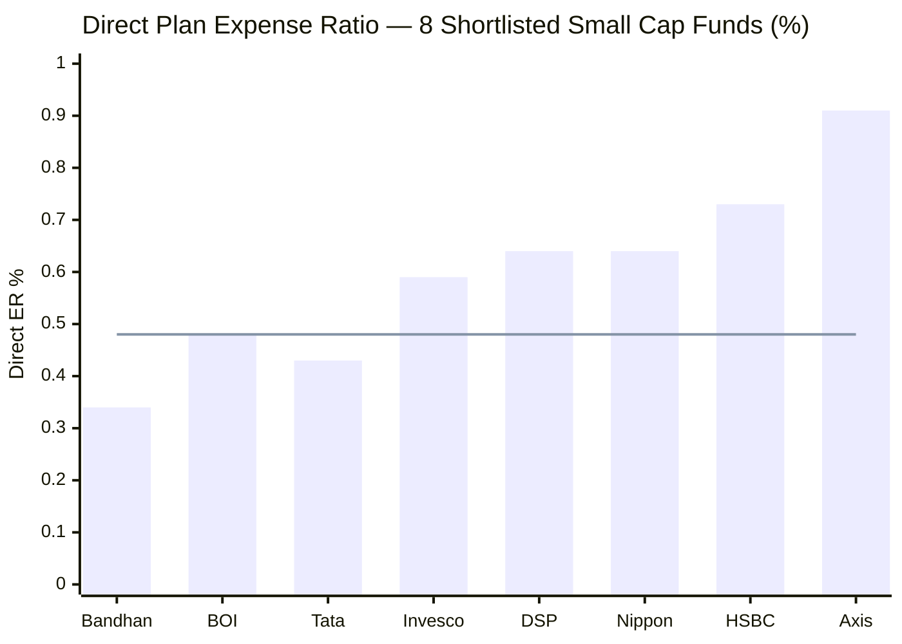
> Line = BOI's ER (~0.48%) | BOI is the 2nd-cheapest of the deeply-studied funds, behind only Bandhan; Tata (0.43%) is fractionally lower among the wider eight.

**~0.48% Direct Plan** places BOI as the **2nd-cheapest of the studied funds** (behind Bandhan 0.34%) and below the small-cap category average (~0.65–0.75%). Among the four deeply-studied funds it is clearly the value leader after Bandhan:

| Fund | Direct ER | AUM (₹ Cr) | Annual Cost per ₹100 | Studied Rank |
|------|-----------|-----------|----------------------|-------------|
| Bandhan Small Cap | **0.34%** | 25,346 | ₹0.34/year | 1st (cheapest) |
| **BOI Small Cap** | **~0.48%** | **2,318** | **₹0.48/year** | **2nd** |
| Invesco Small Cap | 0.59% | 11,038 | ₹0.59/year | 3rd |
| DSP Small Cap | 0.64% | 17,906 | ₹0.64/year | 4th |
| HSBC Small Cap | 0.73% | 16,394 | ₹0.73/year | 5th (most expensive) |

**The BOI–HSBC contrast is the most striking.** BOI charges ~0.48% on ₹2,318 Cr; HSBC charges 0.73% on ₹16,394 Cr — 52% more expensive, at 7× the AUM, with a portfolio that hugs its benchmark (HSBC's R² 95.96 vs BOI's 90.8). The investor in BOI pays less *and* gets a more differentiated, higher-information-ratio portfolio (Module 2: BOI IR 0.938 vs HSBC −0.61). On a pure cost-for-quality basis, BOI dominates HSBC outright.

**The cheap ER pairs with the 4★ rating.** Unusually, BOI is simultaneously among the cheapest *and* the highest-rated (VRO 4★, the only studied small cap with that rating) — the cost is not "cheap because low quality." This is a genuine value proposition for Direct-plan investors.

**ER is already embedded in returns.** BOI's published figures (Module 1: 20.57% 5Y CAGR, 26.73% since inception) are already net of the ~0.48% ER. The low cost means less of the gross return is skimmed before it reaches the investor.

---

## Cross-Source ER Verification

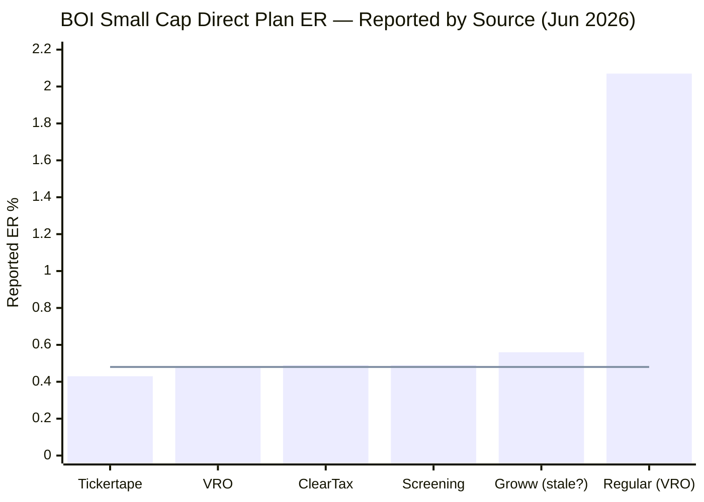
> Line = central estimate (~0.48%) | Regular Plan (2.07%) shown for reference on the right | Groww possibly stale

| Source | Direct ER | Regular ER | Assessment |
|--------|-----------|------------|------------|
| Tickertape | ~0.43% | — | Floor of cluster |
| ValueResearch | ~0.48% | **~2.07%** | ✅ Canonical regular source |
| ClearTax | ~0.49% | — | ✅ Consistent |
| Screening CSV | 0.49% | — | ✅ Consistent |
| Groww | ~0.56% | — | ⚠️ Likely stale — rejected |

**Resolution:** Direct ER central estimate **~0.48%** (cluster 0.43–0.49). Regular ER **~2.07%** (VRO canonical). The fund's 2nd-cheapest rank is robust across the entire cluster.

---

## SEBI TER Positioning — Near the Ceiling at Regular Plan Level

SEBI's tiered TER circular sets maximum allowable expense ratios by AUM slab. At ₹2,318 Cr, more of the fund's AUM sits in the *higher-TER* low-AUM slabs (a small fund cannot spread fixed costs as widely), so the regulatory ceiling is structurally higher than for DSP/HSBC:

| AUM Slab | SEBI Max TER | BOI AUM in Slab |
|----------|-------------|-----------------|
| First ₹500 Cr | 2.25% | ₹500 Cr |
| Next ₹250 Cr | 2.00% | ₹250 Cr |
| Next ₹1,250 Cr | 1.75% | ₹1,250 Cr |
| Next ₹3,000 Cr | 1.60% | ₹318 Cr |
| **Blended SEBI Max (Regular Plan)** | **~1.86%** | — |
| + B30 city distribution incentive | +0.30% | — |
| **Effective Regulatory Ceiling** | **~2.16%** | — |
| **BOI Actual Regular Plan ER** | **~2.07%** | — |
| **Buffer vs ceiling** | **~0.09% below ceiling** | **Minimal restraint** |

BOI's regular plan ER (~2.07%) sits only **~0.09% below the ~2.16% ceiling** — among the least restrained of the studied funds at the regular-plan level (DSP ~0.16% buffer; HSBC ~0.39% buffer). Notably, this is *less* disciplined than BOI's own FlexiCap, which ran ~35% below its cap.

**Two mitigating points:** (1) A small AMC must pay distributors aggressively to win shelf space — high regular TER is partly structural for a sub-₹15,000 Cr AMC. (2) The *direct* plan (the target audience here) is unaffected: at ~0.48% it is among the cheapest available. The regular-plan ceiling proximity is a flag about distribution economics, not about what a self-directed investor pays.

---

## 10-Year SIP Cost Simulation — The Rupee Impact

**Methodology:** 18% gross CAGR assumed for all funds; Net CAGR = 18% − Direct ER; SIP ₹20,000/month for 10 years (₹24 lakh principal). Illustrative — gross returns are not identical in practice. (Absolute corpus depends on the gross assumption; the *relative* gaps are the point.)

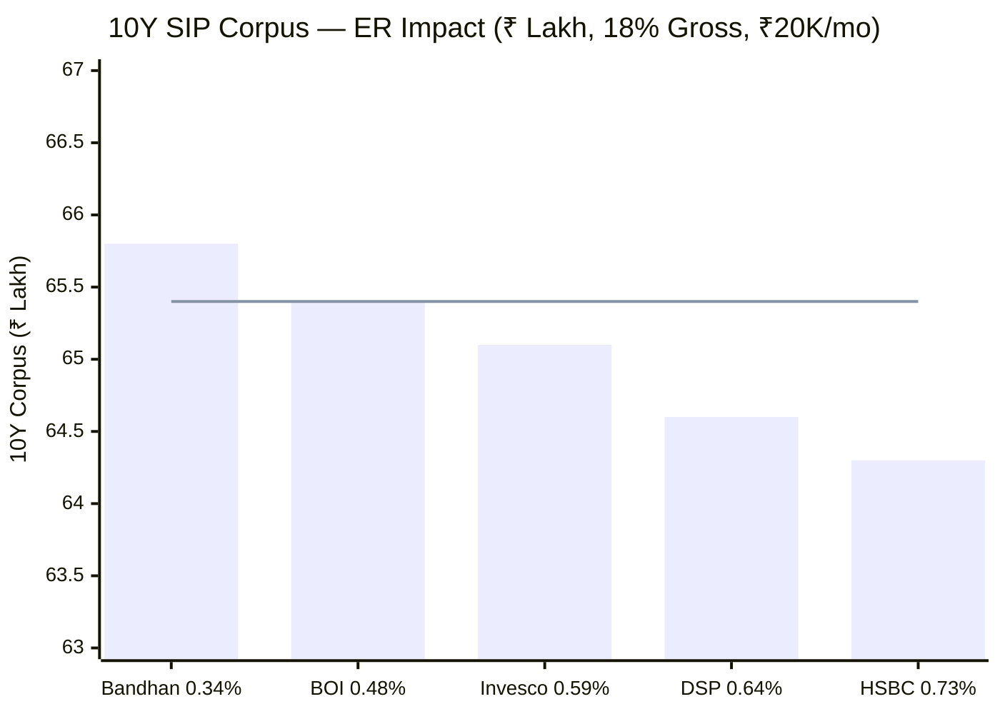
> Line = BOI's corpus (~₹65.4L) | BOI is 2nd-highest, behind only Bandhan; ahead of Invesco, DSP, and HSBC

| Fund | Direct ER | Net CAGR | 10Y Corpus | vs BOI |
|------|-----------|----------|-----------|--------|
| Bandhan Small Cap | 0.34% | 17.66% | ₹65.8L | +₹0.4L |
| **BOI Small Cap** | **~0.48%** | **17.52%** | **₹65.4L** | — |
| Invesco Small Cap | 0.59% | 17.41% | ₹65.1L | −₹0.3L |
| DSP Small Cap | 0.64% | 17.36% | ₹64.6L | −₹0.8L |
| HSBC Small Cap | 0.73% | 17.27% | ₹64.3L | −₹1.1L |

**On identical gross returns, BOI's lower ER hands the investor ~₹0.8L more than DSP and ~₹1.1L more than HSBC over a 10-year ₹20K SIP** — purely from cost. The gap to Bandhan (−₹0.4L) is small. At a ₹50,000/month SIP these gaps scale 2.5× (≈ +₹2.0L vs DSP, +₹2.75L vs HSBC).

**Critical caveat:** gross returns are *not* identical. BOI's genuine recent alpha (Module 1: +5.39% 5Y; Module 2: IR 0.938) suggests it has historically *added* gross return on top of the cost advantage — compounding the benefit. But this alpha was earned in a bull-dominated, 2018-free window (the standing caveat across all modules).

---

## Direct vs Regular Plan — The Widest Gap of the Study (~1.58%)

The single most important cost decision for any BOI Small Cap investor.

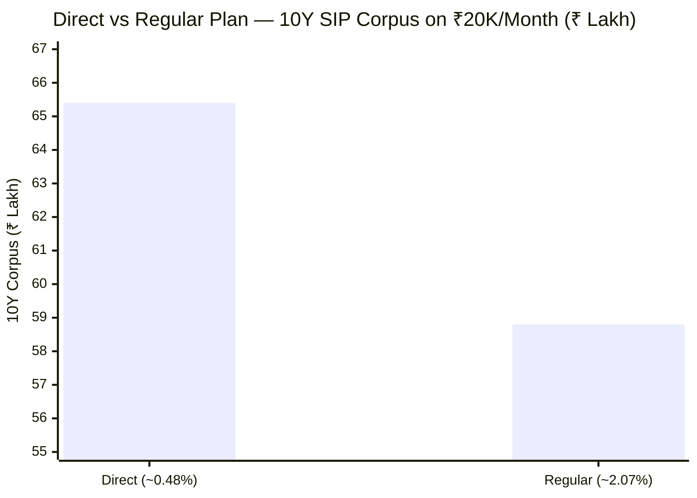

| Plan | ER | Net CAGR | 10Y Corpus | Lost to Distributor |
|------|----|----------|-----------|---------------------|
| **Direct** | **~0.48%** | **~17.52%** | **₹65.4L** | — |
| Regular | ~2.07% | ~15.93% | ~₹58.8L | **~₹6.6L** |

**~₹6.6 lakh** — roughly **27% of the ₹24 lakh principal** — is surrendered to distribution commission by choosing Regular over Direct. Same fund, same 84 stocks, same Alok Singh; only the purchase route differs.

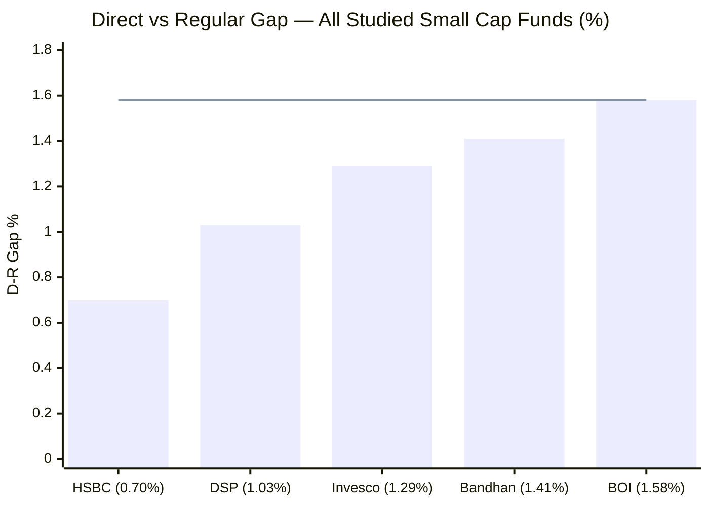
> Line = BOI's D-R gap (~1.58%) — the widest of all studied funds

**BOI's ~1.58% D-R gap is the widest of the study.** This is the structural reality of a small AMC: to win distributor shelf space against giants like SBI, HDFC, and Nippon, BOI must pay a larger trail commission. The consequence is a Regular plan that is both expensive in absolute terms (~2.07%) *and* carries the steepest gap to Direct. **For BOI specifically, going Direct is non-negotiable** — the penalty for not doing so is the highest in the shortlist.

**ER savings at different SIP amounts (Direct vs Regular):**

| SIP Amount | 10Y Direct Corpus | 10Y Regular Corpus | Saved in Direct |
|-----------|-------------------|--------------------|-----------------|
| ₹10,000/mo | ₹32.7L | ₹29.4L | **₹3.3L** |
| **₹20,000/mo** | **₹65.4L** | **₹58.8L** | **₹6.6L** |
| ₹30,000/mo | ₹98.1L | ₹88.2L | **₹9.9L** |
| ₹50,000/mo | ₹163.5L | ₹147.0L | **₹16.5L** |

**How to access Direct Plan:** BOI MF website (boimf.in), MF Central, Zerodha Coin, Kuvera, Groww Direct, INDmoney, Paytm Money — all zero-commission.

---

## Exit Load — Standard 12-Month Window With 10% Free Allowance

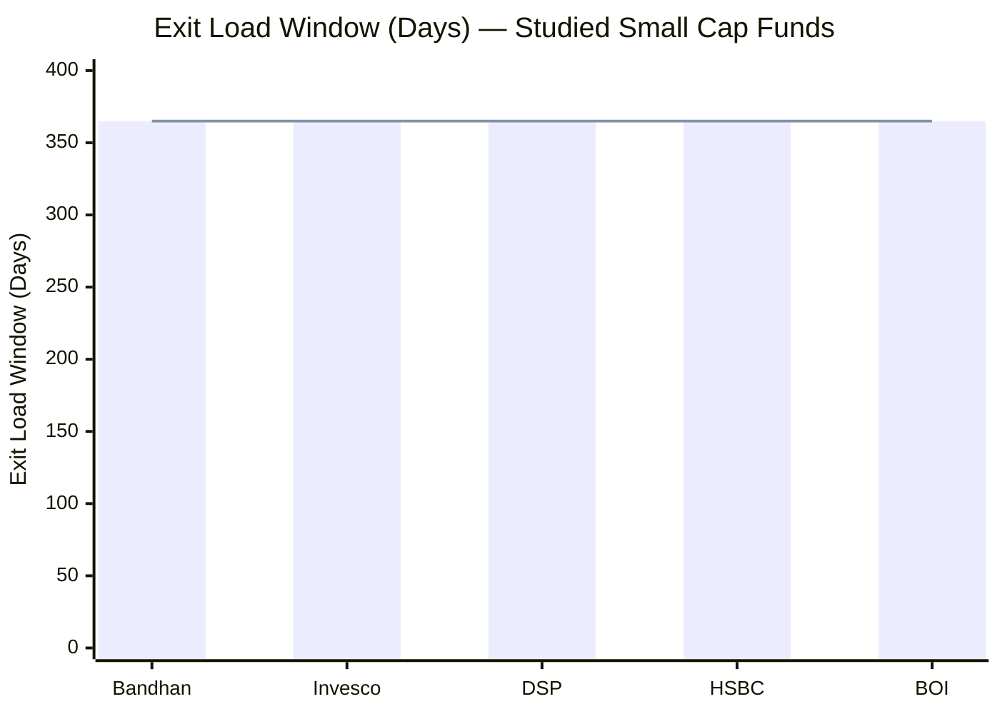
> All studied funds use the 1% / 365-day structure; BOI and HSBC add a 10% free-redemption allowance

**BOI's exit load: 1% if redeemed within 365 days, but the first 10% of units each year are exempt; nil after 12 months.** This 10%-free allowance matches HSBC and is marginally more flexible than DSP/Bandhan/Invesco's plain 1%/365d.

| Fund | Exit Load | Window | Free Allowance |
|------|-----------|--------|----------------|
| Bandhan / Invesco / DSP | 1% | 365 days | No |
| HSBC | 1% | 365 days | Yes — 10%/year |
| **BOI** | **1%** | **365 days** | **Yes — 10%/year** |

**For a 10-year SIP investor:** essentially irrelevant. Every instalment ages past 12 months long before redemption. The 10%-free allowance only matters in a partial mid-tenure withdrawal scenario, where BOI permits 10% of units to exit annually without the 1% charge.

---

## ⭐ The AUM Advantage as a Cost & Execution Edge *(BOI-specific)*

This is BOI's defining Module-4 strength and the **mirror image of DSP's and HSBC's central weakness.** The same arithmetic that constrains the big funds *frees* BOI:

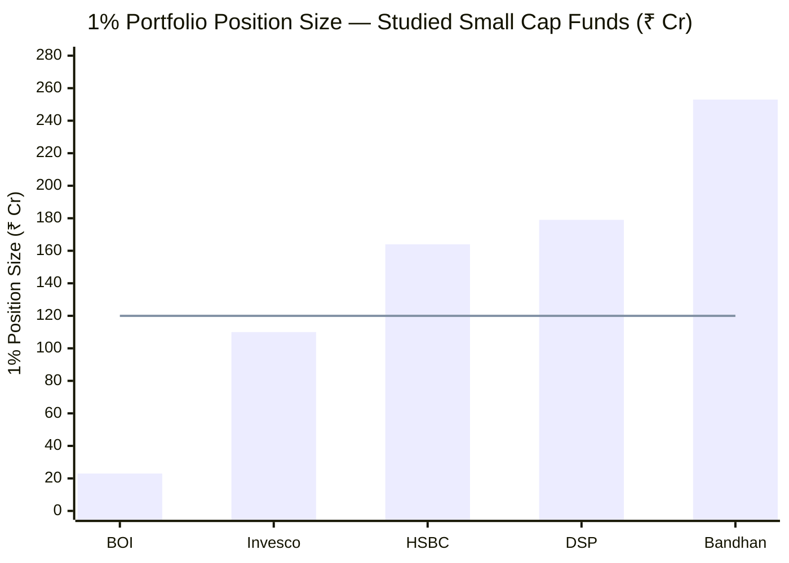
> Line = ~₹120 Cr threshold above which clean small-cap position-building takes 10+ days | BOI is an order of magnitude below it

| Dimension | BOI (₹2,318 Cr) | DSP (₹17,906 Cr) | HSBC (₹16,394 Cr) |
|-----------|-----------------|------------------|-------------------|
| 1% position requires | **~₹23 Cr** | ₹179 Cr | ₹164 Cr |
| 1% = % of a ₹3,000 Cr SC free float | **~1.9%** | ~14.9% | ~14.1% |
| Clean entry/exit time | **1–3 days** | 10–15 days | 10–14 days |
| Monthly inflow deployment | **Trivial** | ₹200–350 Cr backlog | Near-compelled buyer |
| Cash buffer needed for flows | **~3% operational** | 8.4% (deployment queue) | 1.4% (forced deployment) |
| Access to sub-₹2,000 Cr micro-caps | **Full** | Largely closed | Largely closed |
| Flow restrictions ever needed | **No — vast headroom** | Closed 3× | Never (problematic at scale) |

**The execution dividend is a genuine hidden-cost advantage.** A ₹23 Cr position can be built or unwound in a day or two with negligible price impact. DSP must spread a ₹179 Cr position over 10–15 days, paying 3–8% price drift as its own buying moves the stock. That market-impact friction — invisible in the stated ER — is **structurally minimal for BOI** and material for the large funds. In cost terms, BOI's true execution cost per trade is the lowest of the studied group, regardless of turnover.

**No forced-buyer dynamics.** DSP holds 8.4% cash as a deployment queue; HSBC is a "near-compelled buyer every month." BOI's ~3% cash is purely operational — at its size, monthly inflows are absorbed effortlessly without queuing or diluting the portfolio. This is why BOI can hold a differentiated, micro-cap-heavy book (Module 3) that the big funds structurally cannot.

This advantage is the cost-and-execution expression of the same edge documented in Modules 2 (IR 0.938) and 3 (the AUM advantage / differentiated construction). It is the single most important favourable finding in Module 4.

---

## ⭐ The Small-AMC Trade-off *(BOI-specific)*

The cheap, nimble fund sits on the **weakest institutional base of the deeply-studied group** — the genuine cost of BOI's profile, and the inverse of HSBC's strong-AMC backing.

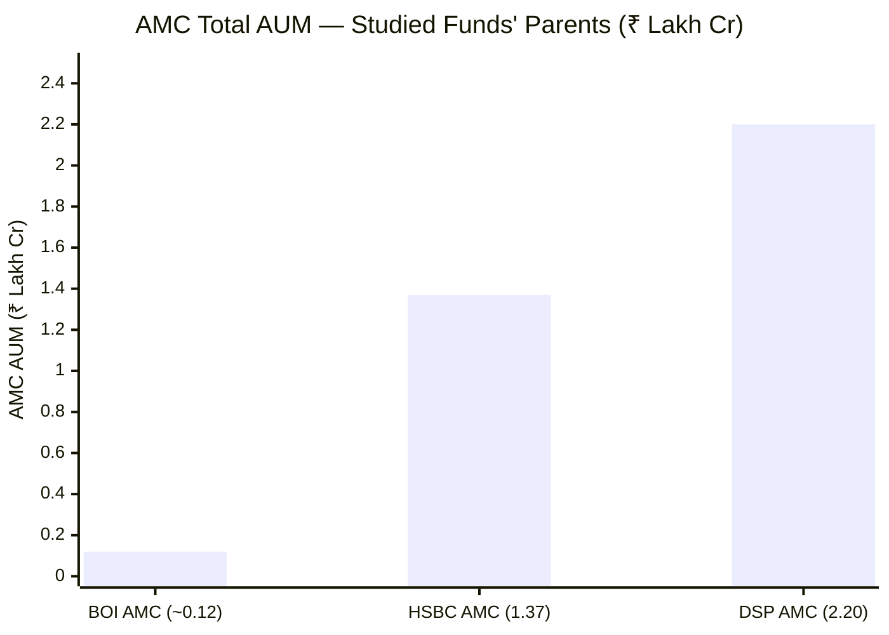

| Dimension | BOI | DSP | HSBC |
|-----------|-----|-----|------|
| AMC total AUM | **~₹12,000 Cr** | ₹2,20,000 Cr | ₹1,36,788 Cr |
| AMC schemes | ~19 | 65 | 122 |
| Est. revenue (this fund) | **~₹13–15 Cr** | ~₹179 Cr | ~₹170 Cr |
| Research-funding capacity | **Constrained** | Deep | Deep (+ global) |
| Operational/AMC continuity risk | **Higher** | Low | Low (global parent) |

**Two consequences.** (1) **Thin fund revenue (~₹13–15 Cr)** funds a far smaller research bench than DSP's/HSBC's ~₹170–179 Cr — a real constraint for covering an 84-stock, micro-cap-heavy portfolio where independent primary research is the entire edge. (2) **Small-AMC continuity risk** — a sub-₹15,000 Cr AMC has less institutional depth, fewer analysts, and greater key-person concentration than a ₹2 lakh Cr platform. BOI mitigates this partly through its government-bank (Bank of India) parentage, which lends stability, but the research-depth gap versus DSP/HSBC is genuine.

This is the structural price of BOI's smallness: the same trait that delivers the execution advantage also limits the institutional machine behind it.

---

## ⭐ Manager Bandwidth — Alok Singh's 23-Scheme Load *(BOI-specific)*

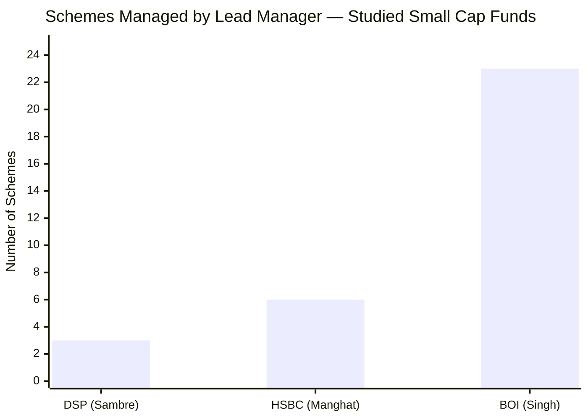

Lead manager **Alok Singh, CIO of BOI MF, runs ~23 schemes (~₹7,795 Cr)** — by far the most stretched mandate of any studied manager:

| Manager | Schemes | Total AUM | AUM/scheme | Focus |
|---------|---------|-----------|-----------|-------|
| Vinit Sambre (DSP) | 3 | ~₹35,000 Cr | ~₹12,000 Cr | High |
| Venugopal Manghat (HSBC) | 4–7 | ~₹40,000 Cr | ~₹8,000 Cr | Medium |
| **Alok Singh (BOI)** | **23** | **~₹7,795 Cr** | **~₹340 Cr** | **Spread very thin** |

As CIO of a small AMC, Singh wears the CIO hat *and* personally manages almost the entire equity (and several hybrid/debt) line-up. The ₹340 Cr average AUM per scheme is tiny, but the **cognitive load of 23 distinct mandates** — across small cap, flexicap, hybrid, ELSS, and more — is the sharpest attention-dispersion risk in the study. This is the CIO-generalist problem (flagged for HSBC's Manghat) at its most extreme.

**Two offsets:** (1) The co-manager **Nav Bhardwaj** was added on 14-Jul-2025, beginning to distribute the load. (2) BOI Small Cap is a *flagship* equity scheme for the AMC, so it plausibly receives disproportionate attention within the 23. But the bandwidth question is real and is the chief reason BOI's Module-4 score does not reach 4.0. Full manager analysis (track record, key-person risk, succession) is reserved for **Module 5**.

---

## ⭐ The "Stay Small" Paradox — Flow Management as a Forward Risk *(BOI-specific)*

For DSP, flow management was a *proven history* (3 closures, 2014–2020, to protect investors). For HSBC, it was a *governance failure* (never closed despite scaling to ₹16,394 Cr). For BOI, it is **neither yet** — and that is the point.

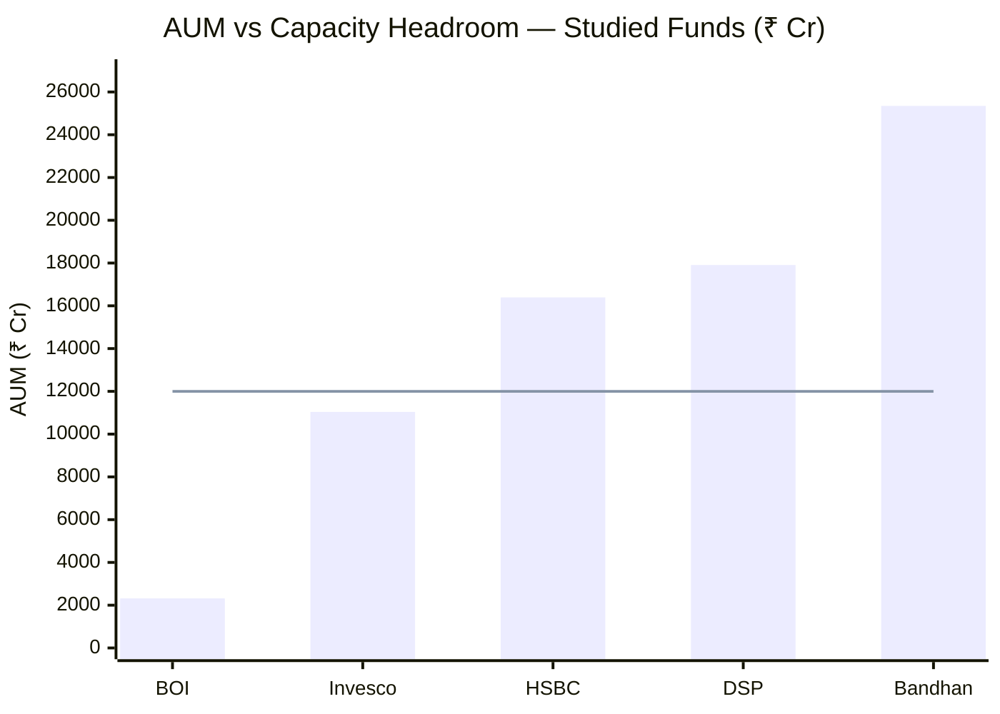
> Line = ~₹12,000 Cr capacity-constraint zone | BOI has the most headroom by far

At ₹2,318 Cr, BOI is **so far below any capacity threshold that flow restrictions are irrelevant today.** The risk flips entirely: BOI's entire edge — cheap ER amortised over a growing base, full micro-cap access, no deployment friction (Modules 2–4) — **depends on the fund staying small.** If its strong recent performance and 4★ rating drive AUM toward ₹8,000–10,000 Cr, BOI begins to inherit exactly the deployment friction that hobbles DSP and HSBC, and the advantage erodes.

**The concern:** BOI has **no track record of restricting flows** — because it has never been big enough to need to. There is no evidence yet of whether the AMC would proactively close the fund to protect the strategy (as DSP did) or keep the doors open for fee revenue (as HSBC did). Given the small AMC's revenue dependence on AUM growth, the incentive structure leans toward the HSBC path. **This is the key forward watch-item for a long-horizon SIP:** monitor AUM, and treat a move above ~₹8,000 Cr without any flow-control signal as a yellow flag on the thesis.

---

## True All-In Cost — A Range, Pending Turnover *(turnover gap flagged)*

Because BOI's **portfolio turnover is undisclosed** (confirmed absent on all platforms and the AMC factsheet), the true all-in cost — stated ER plus hidden market-impact/transaction costs — cannot be pinned to a point estimate. It is presented as a **range**:

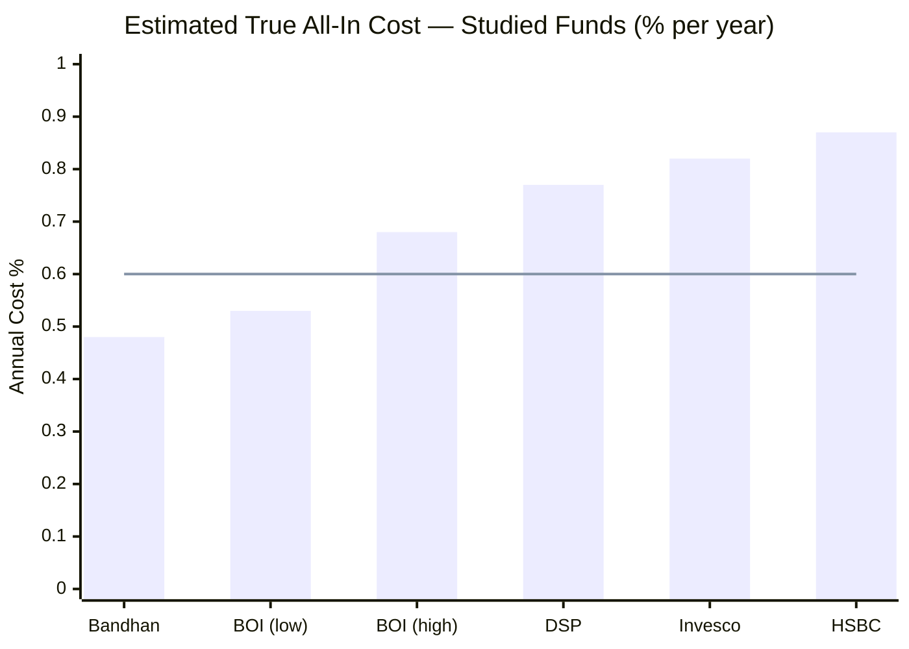
> Line = BOI central estimate (~0.60%) | BOI's range (0.53–0.68%) sits below DSP, Invesco, and HSBC at both ends

| Fund | Stated Direct ER | Hidden Costs (est.) | True All-In | Note |
|------|-----------------|--------------------|-----------| ----|
| Bandhan SC | 0.34% | ~0.14% | ~0.48% | Cheapest |
| **BOI SC** | **~0.48%** | **~0.05–0.20%** | **~0.53–0.68%** | **Turnover unknown — range** |
| DSP SC | 0.64% | ~0.13% | ~0.77% | Lowest turnover (~20%) |
| Invesco SC | 0.59% | ~0.23% | ~0.82% | Higher turnover |
| HSBC SC | 0.73% | ~0.14% | ~0.87% | Most expensive |

**The crucial BOI-specific insight: turnover hurts BOI far less than it would a large fund.** Even if BOI's (unknown) turnover is high — say 60%+ — the market-impact cost of churning ₹23 Cr positions in liquid-enough names is minimal, because the positions are small relative to the stocks traded. A high-turnover ₹18,000 Cr fund (₹179 Cr positions) pays heavy impact costs; a high-turnover ₹2,318 Cr fund pays light ones. So even at the **top of the estimated range (~0.68%), BOI's true all-in cost is below DSP (0.77%), Invesco (0.82%), and HSBC (0.87%)** — and at the low end (~0.53%) it approaches Bandhan. **BOI's small AUM structurally caps its hidden costs, regardless of turnover.** This is why the undisclosed figure, while a genuine data gap, does not threaten the conclusion that BOI is among the cheapest funds on a true all-in basis.

> **Action item:** source the turnover figure from the BOI MF annual TER disclosure / AMFI in a future update to convert this range into a point estimate. Until then, treat BOI's true all-in as **~0.53–0.68% (central ~0.60%)**.

---

## BOI AMC & Manager AUM — Institutional Context

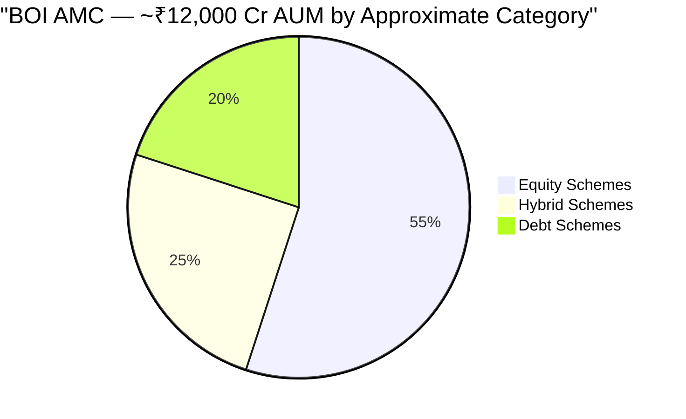

**BOI Investment Managers Key Facts (2026):**
- **Total AUM:** ~₹11,700–13,400 Cr — among the smallest active AMCs in India
- **Total Schemes:** ~19 (9 equity, 5 debt, 5 hybrid)
- **Parent:** Bank of India (government-owned bank) — formerly the BOI AXA JV until AXA exited; now wholly BOI-owned
- **CIO:** Alok Singh (CFA + PGDBA; ~24 years' experience), who also runs BOI FlexiCap (Rank #2 in the companion FlexiCap study, 3.93/5)

**Revenue analysis (this fund):**

| Plan | Est. AUM Split | ER | Annual Revenue |
|------|---------------|----|---------------|
| Direct (~55%) | ~₹1,275 Cr | 0.48% | ~₹6.1 Cr |
| Regular (~45%) | ~₹1,043 Cr | 2.07% | ~₹21.6 Cr |
| **Total Fund Revenue** | **₹2,318 Cr** | **blended ~1.2%** | **~₹27 Cr** |

> Note: the regular-plan revenue largely passes through to distributors as commission; the AMC's *retained* revenue from this fund is closer to **~₹13–15 Cr**. Either way, it is a fraction of DSP's (~₹179 Cr) or HSBC's (~₹170 Cr) — the structural constraint on research depth discussed above.

**The government-bank parent is a double-edged factor:** it lends balance-sheet stability and continuity (low AMC-failure risk), but BOI MF has historically been a sub-scale player without the research budget of a top-10 AMC. The fund's quality rests heavily on Alok Singh's individual skill rather than deep institutional infrastructure — which raises the stakes on the Module-5 key-person analysis.

---

## 8-Fund Cost & AUM Comparison Matrix

| Metric | **BOI SC** | DSP SC | HSBC SC | Bandhan SC | Invesco SC |
|--------|------------|--------|---------|------------|------------|
| Direct ER | **~0.48%** | 0.64% | 0.73% | **0.34%** | 0.59% |
| ER Rank (studied) | **2nd** | 4th | 5th | 1st | 3rd |
| Regular ER | ~2.07% | ~1.67% | ~1.43% | ~1.75% | ~1.88% |
| D-R Gap | **~1.58% (widest)** | 1.03% | **0.70% (narrowest)** | 1.41% | 1.29% |
| Exit Load | 1%/365d +10% free | 1%/365d | 1%/365d +10% free | 1%/365d | 1%/365d |
| AUM (₹ Cr) | **2,318 (smallest)** | 17,906 | 16,394 | 25,346 | 11,038 |
| AUM as constraint | **Advantage** | High | High | Severe | Low |
| 1% Position | **₹23 Cr** | ₹179 Cr | ₹164 Cr | ₹253 Cr | ₹110 Cr |
| Turnover | **Undisclosed** | ~20% | ~31% | ~52% | ~29% |
| True All-In (est.) | **~0.53–0.68%** | ~0.77% | ~0.87% | ~0.48% | ~0.82% |
| Min SIP | ₹1,000 | **₹100** | ₹500 | ₹1,000 | ₹1,000 |
| AMC Total AUM | **~₹12,000 Cr** | ₹2,20,000 Cr | ₹1,36,788 Cr | — | — |
| Mgr Schemes | **23 (most)** | 3 | 4–7 | — | 4–5 |
| Flow Restriction History | None (too small) | 3 closures | None | None | None |
| M4 Score (this study) | **~3.9/5** | 3.7/5 | 3.2/5 | ~3.3/5 | ~3.1/5 |

**Key observations:**
1. **BOI leads on the two metrics that matter most to a Direct SIP investor** — 2nd-cheapest ER and the best AUM/execution position by a wide margin.
2. **BOI's true all-in cost beats DSP, HSBC, and Invesco at both ends of its range** — its small AUM structurally caps hidden costs even with unknown turnover.
3. **BOI's weaknesses are institutional, not investor-facing** — small AMC depth, 23-scheme manager load, widest D-R gap (which only hurts regular-plan investors).
4. **The DSP contrast is instructive:** DSP's strength is *flow-management discipline* (a proven history); BOI's strength is *not yet needing it* (vast headroom). DSP has shown it will protect the strategy; BOI has not been tested on this.

---

## Points For / Points Against — Cost & AUM

### ✅ Points For

1. **2nd-cheapest Direct ER of the 8 (~0.48%)** — below DSP, HSBC, Invesco; only Bandhan is cheaper; ~₹0.8–1.1L more retained vs DSP/HSBC over a 10Y ₹20K SIP
2. **Best AUM/execution position by far (₹2,318 Cr)** — ₹23 Cr per 1% position; 1–3 day clean execution; full micro-cap access; the inverse of DSP/HSBC's scale drag
3. **No forced-buyer dynamics** — monthly inflows absorbed effortlessly; ~3% cash is operational, not a deployment queue
4. **True all-in cost beats DSP/HSBC/Invesco even at the high end of the range** — small AUM structurally caps hidden market-impact costs regardless of turnover
5. **Cheap *and* 4★-rated** — the only studied small cap that is both among the cheapest and the highest-rated
6. **10% free exit-load allowance** — marginally more flexible than DSP/Bandhan/Invesco
7. **Government-bank (Bank of India) parent** — balance-sheet stability; low AMC-failure risk
8. **Vast flow headroom** — no capacity constraint anywhere on the horizon at current AUM

### ❌ Points Against

1. **Widest Direct–Regular gap of the study (~1.58%)** — regular-plan investors lose ~₹6.6L over a 10Y ₹20K SIP; going Direct is non-negotiable for BOI
2. **Smallest AMC of the studied group (~₹12,000 Cr)** — thin fund revenue (~₹13–15 Cr) constrains research depth vs DSP/HSBC (~₹170–179 Cr)
3. **Manager runs 23 schemes** — Alok Singh's mandate is the most stretched of any studied manager; sharpest attention-dispersion risk (→ M5)
4. **Regular ER near the SEBI ceiling (~0.09% buffer)** — minimal cost restraint at the regular-plan level; less disciplined than BOI's own FlexiCap
5. **Turnover undisclosed** — true all-in cost is a range, not a point estimate; the one unresolved cost variable
6. **No flow-management track record** — untested on whether the AMC will protect the strategy by restricting flows as AUM grows; small-AMC revenue incentives lean against it
7. **₹1,000 min SIP / ₹5,000 min lumpsum** — less accessible than DSP's ₹100
8. **The advantage is contingent on staying small** — strong performance could drive AUM up and erode the execution edge

---

## Module 4 Scorecard

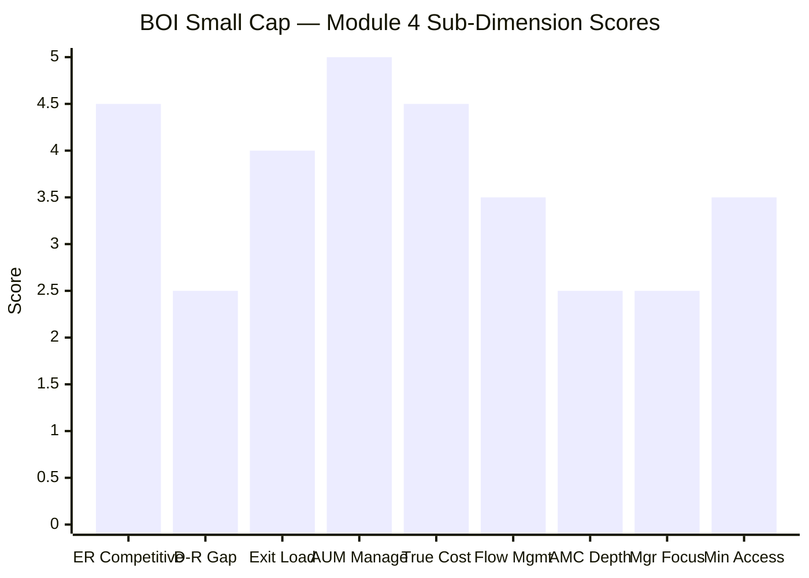

| Sub-Dimension | Score (1–5) | Reasoning |
|---------------|------------|-----------|
| Expense Ratio Competitiveness | **4.5** | 2nd-cheapest of 8 (~0.48%); below category avg; only Bandhan cheaper; paired with 4★ rating |
| Direct vs Regular Gap | **2.5** | ~1.58% — widest of the study; regular plan near SEBI ceiling; only hurts regular-plan investors but a genuine negative |
| Exit Load Structure | **4.0** | 1%/365d + 10% free allowance; non-punitive; emergency-friendly |
| AUM Manageability | **5.0** | ₹2,318 Cr — best execution position of any studied fund; full micro-cap access; no deployment friction; the standout strength |
| True (Turnover-Adj) Cost | **4.5** | ~0.53–0.68% range beats DSP/HSBC/Invesco at both ends; small AUM caps hidden costs; capped only by turnover being unconfirmed |
| Flow Management | **3.5** | No restriction needed at current size (vast headroom) — but also no track record of investor-first gate-keeping; neutral-positive |
| AMC Institutional Depth | **2.5** | Smallest AMC (~₹12,000 Cr); thin research-funding capacity; offset partly by govt-bank stability |
| Fund Manager Focus | **2.5** | Alok Singh runs 23 schemes — most stretched of studied managers; Nav Bhardwaj co-added Jul-2025 begins to help; sharpest bandwidth risk |
| Minimum Accessibility | **3.5** | ₹1,000 SIP / ₹5,000 lumpsum — acceptable but below DSP's ₹100 |
| **Module 4 Overall** | **~3.9 / 5** | **Best cost & AUM profile of the studied small caps for a Direct investor** — 2nd-cheapest ER, unmatched execution headroom, true all-in below DSP/HSBC even with unknown turnover. Held below 4.0 by the small-AMC research-depth constraint, the 23-scheme manager load, and the widest D-R gap. |

---

## Comparative Module 4 Scores

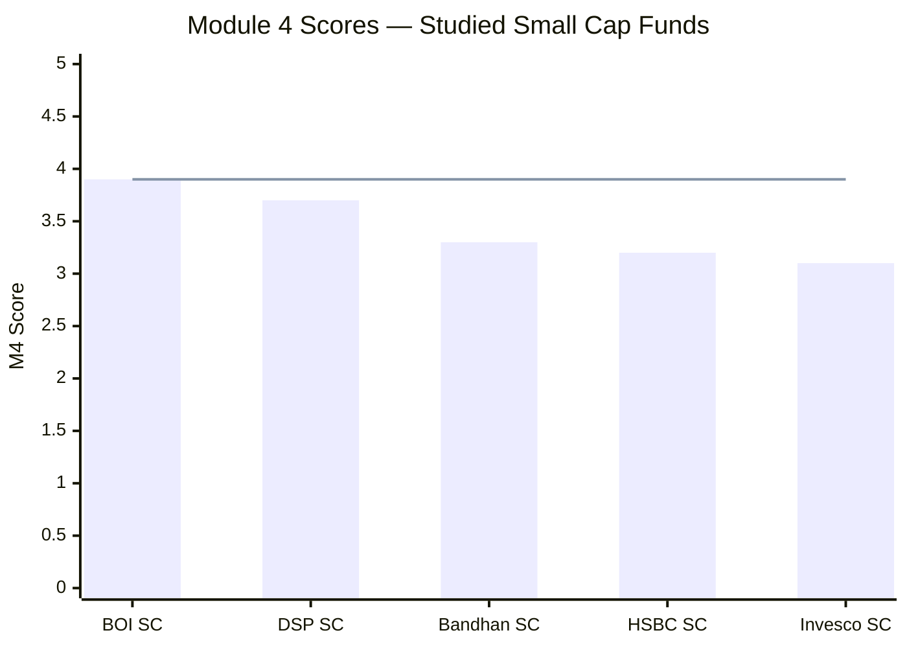
> Line = BOI's M4 score (~3.9) — the highest of the studied small cap funds

| Fund | Module 4 Score | Key Cost/AUM Differentiator |
|------|---------------|-----------------------------|
| **BOI Small Cap** | **~3.9/5** | **2nd-cheapest ER + best execution headroom (₹2,318 Cr); true all-in below peers; offset by small AMC, 23-scheme manager, widest D-R gap** |
| DSP Small Cap | 3.7/5 | Best flow-management history (3 closures); lowest turnover; deep AMC; mid-pack ER + large-AUM constraint |
| Bandhan Small Cap | ~3.3/5 | Cheapest ER (0.34%) and true all-in; but open-door at ₹25,346 Cr (severe AUM constraint) |
| HSBC Small Cap | 3.2/5 | Narrowest D-R gap; but most expensive direct ER, worst true all-in, zero flow management |
| Invesco Small Cap | ~3.1/5 | Decent ER + manageable AUM; no flow restrictions; lower AMC depth |

**BOI takes the top M4 slot among the studied small caps** — narrowly above DSP. The logic: for a Direct-plan SIP investor (the target audience), BOI's combination of low cost and best-in-group execution headroom is the most valuable cost/AUM package on offer. DSP's 3.7 reflects its superior *flow-management discipline* and *institutional depth* — genuinely important, but they matter most at scale, which BOI hasn't reached. The 0.2-point edge to BOI is the value of cheap-plus-nimble for a fund still small enough to deploy capital where small-cap alpha actually lives. This mirrors BOI FlexiCap's category-leading M4 (4.25/5) in the companion study — the same small-AMC, low-cost, high-headroom signature.

---

## One-Line Verdict

BOI Small Cap offers the best cost-and-execution package of the studied small caps for a Direct-plan investor — the 2nd-cheapest ER (~0.48%) married to the smallest AUM (₹2,318 Cr) and therefore the most execution headroom and the lowest hidden costs in the group — let down only by a small AMC's thin research budget, a lead manager stretched across 23 schemes, and the widest Direct–Regular gap in the shortlist, with portfolio turnover the one cost variable still undisclosed.

---

*Module 4 complete. Cost profile is the strongest of the studied small caps on the metrics that matter to a Direct SIP investor (ER + execution); the institutional base (small AMC, 23-scheme manager) and the widest D-R gap are the offsets; turnover remains undisclosed, leaving true all-in as a ~0.53–0.68% range. Module 4 score: ~3.9/5.*

*Next: [Module 5 — Fund Manager Quality](module5_manager.md)*
