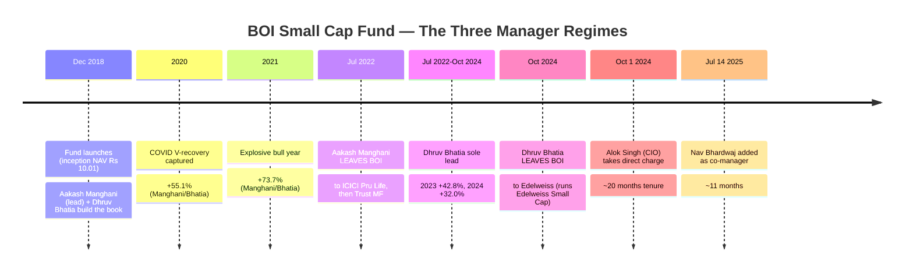
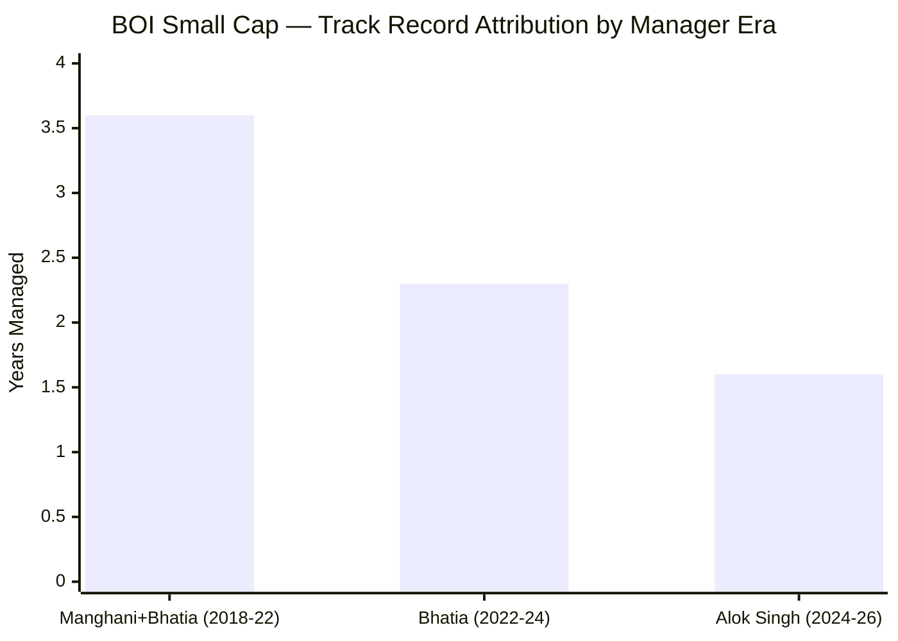
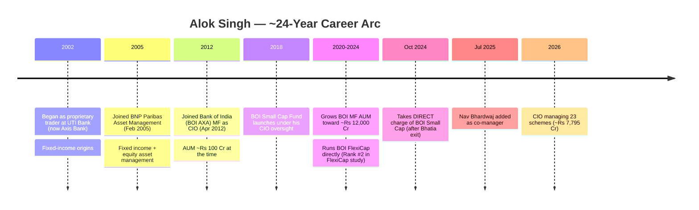
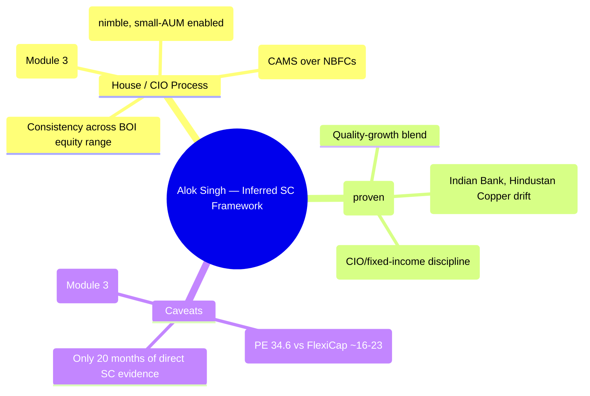
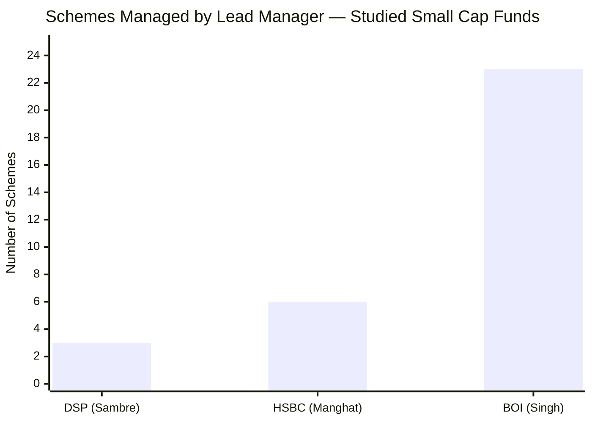
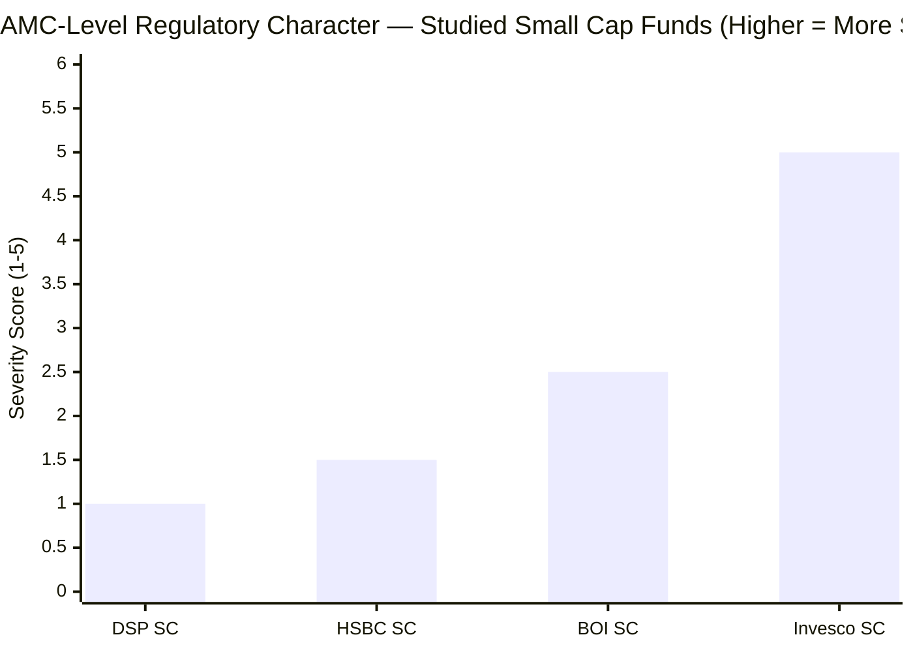
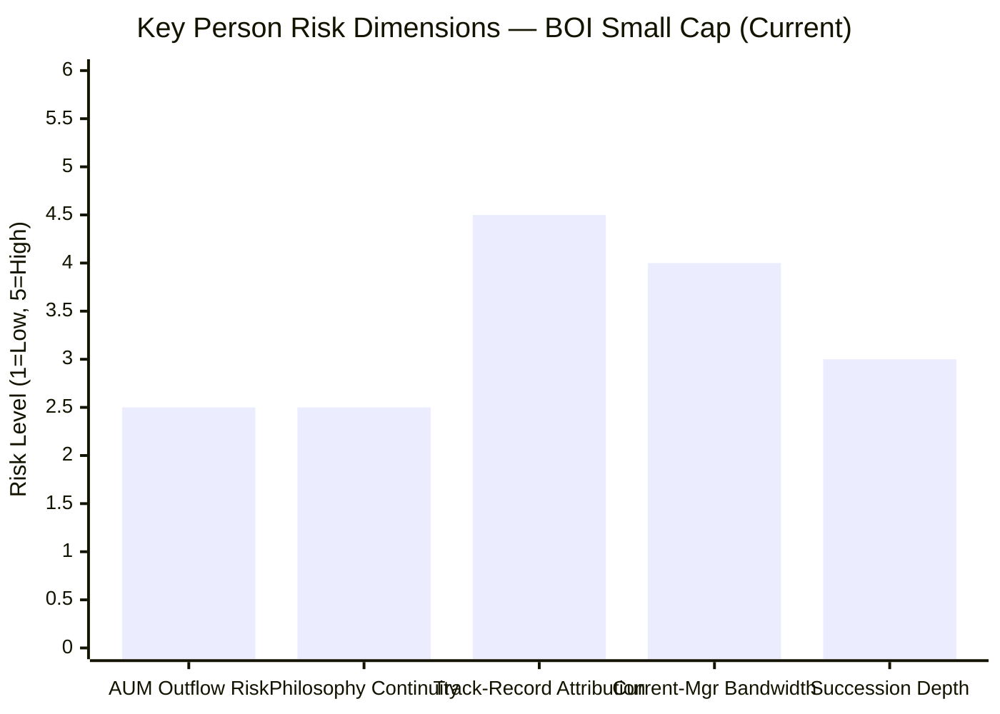
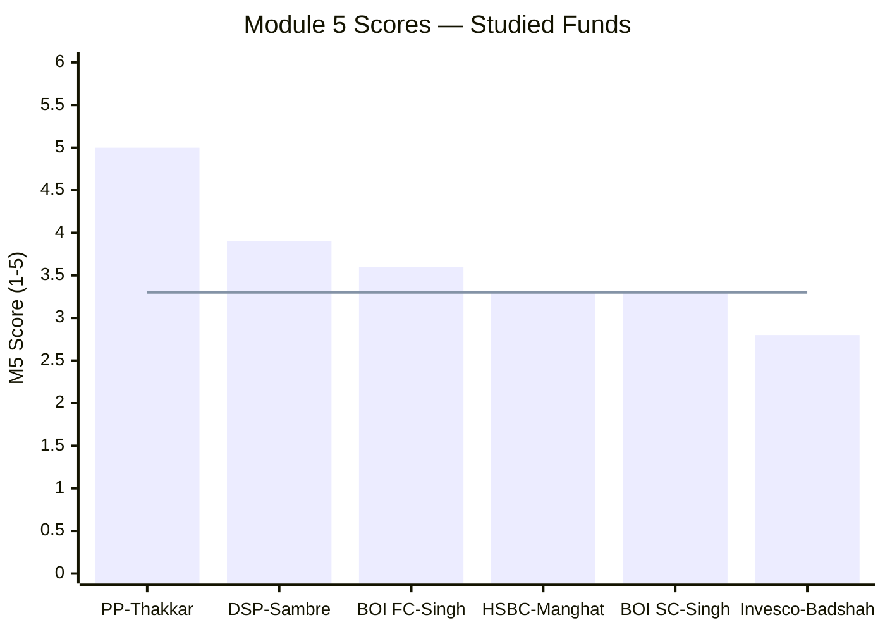
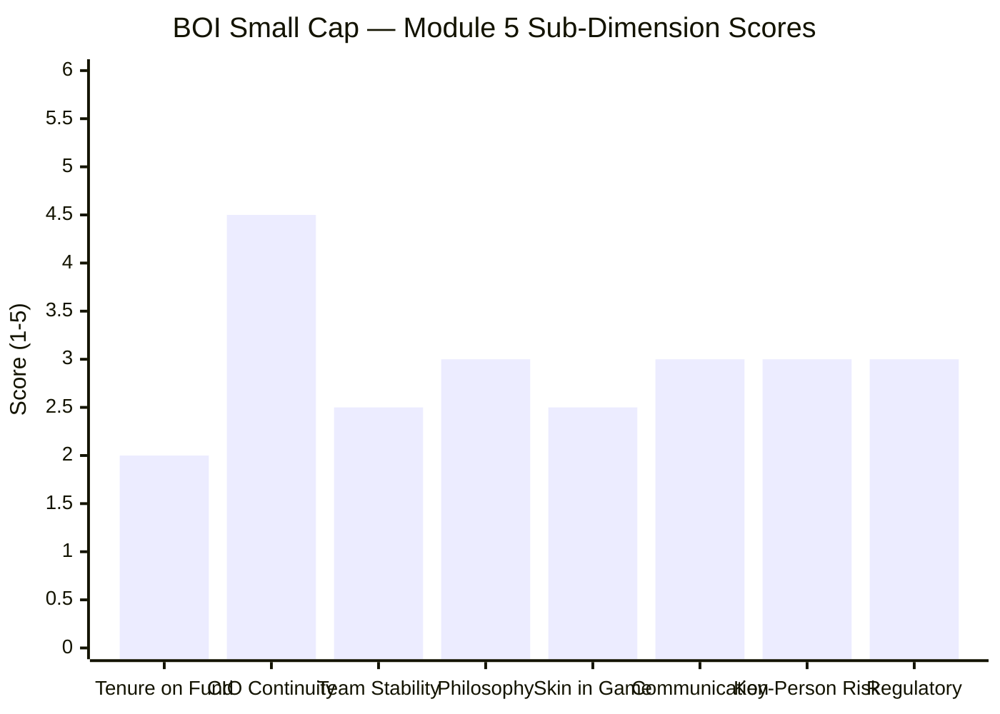

# Module 5: Fund Manager Quality — BOI Small Cap Fund

*Sources: BOI MF official (boimf.in) | Value Research Online — Alok Singh interviews | Dezerv / 5paisa / Finalyca fund-manager databases | Paytm Money / ICICIdirect fund-manager pages | LinkedIn (Alok Singh, Aakash Manghani, Dhruv Bhatia career histories) | Cafemutual / RupeeIQ (manager moves) | Edelweiss MF factsheets (Dhruv Bhatia) | Trust MF (Aakash Manghani) | Business Standard / Moneylife (SEBI orders) | AMFI fund-manager change records | Web research, June 2026*

---

## Module 5 Score: ~3.3 / 5 — BOI's Weakest Module

Module 5 is the dimension where BOI Small Cap is **structurally weakest** — and it materially qualifies the "proven manager" comfort that Modules 1–4 leaned on. The reality, established here for the first time in the study, is stark: **BOI Small Cap is a manager carousel. The two managers who built its celebrated 2018–2024 track record have *both left the AMC*, and the current lead — Alok Singh, the CIO — has managed the fund for only ~20 months (since 1 October 2024).** The 26.7% since-inception CAGR, the +55%/+74% capture years of 2020–21, the 4★ rating — none of it is attributable to the person running the money today.

This is a larger attribution seam than any other studied fund. It is **partially cushioned** by a genuine and important mitigant — Alok Singh has been BOI MF's CIO and investment-process owner since April 2012, *six years before this fund even launched*, and personally runs the Rank-#2 BOI FlexiCap — so the takeover is "the process-owner formalizes direct control," not a cold handover. But the cushion does not erase the facts: highest named-manager turnover of the group, a 20-month current tenure, a lead stretched across 23 schemes, and no FCA. The net is a score (~3.3) level with HSBC's Manghat and well below DSP's Sambre (3.9).

---

## What Module 5 Is Really Asking

Mutual fund returns are the output. The fund manager is the machine that produces them. Module 5 asks: who is running this machine, why should you trust them with ₹20,000 every month for the next 10 years, and what happens to your investment if they leave?

A fund's NAV chart tells you what happened. The manager's profile tells you whether it is *repeatable* — because the same human decisions, running through the same framework, must navigate the next cycle for you to benefit. For a long-horizon SIP, you are betting on a person, a team, and an institution being in place for the duration.

**BOI Small Cap's case is the most cautionary in this research.** The data investors anchor on — a spectacular 2018–2024 run — was produced by managers who are now at *competitor* firms. The current manager inherited the fund 20 months ago and has navigated only one mild correction (2025) and one recovery (2026 YTD) on it. The central Module 5 question for BOI is therefore unusually pointed: **does the celebrated track record tell you anything about what you are buying today?** The honest answer is *less than you would assume* — and Module 5 exists to make that explicit.

---

## ⭐ The Manager Carousel — BOI Small Cap's Defining Attribution Problem

This is the most important section of the module. BOI Small Cap has cycled through **three distinct management regimes in 7.5 years**, and the architects of its track record have all departed:



| Period | Lead Manager(s) | Calendar Years Covered | Status Today |
|--------|-----------------|------------------------|--------------|
| Dec 2018 – Jul 2022 | **Aakash Manghani** (lead) + Dhruv Bhatia | 2019 +6.3%, **2020 +55.1%**, **2021 +73.7%** | **Left BOI (Jul 2022)** → ICICI Pru Life → now **Trust MF** |
| Jul 2022 – Oct 2024 | **Dhruv Bhatia** (sole lead) | 2022 +0.1%, **2023 +42.8%**, 2024 +32.0% | **Left BOI (Oct 2024)** → now runs **Edelweiss Small Cap** |
| **Oct 2024 – present** | **Alok Singh** (CIO) | 2025 −7.2%, 2026 YTD +16.4% | **Current lead — ~20 months** |
| Jul 2025 – present | + Nav Bhardwaj (co) | — | Co-manager, ~11 months |

**The attribution verdict:**



- **Since-inception CAGR (26.73%), 2020 (+55%), 2021 (+74%):** built by **Manghani + Bhatia** — both gone
- **2023 (+43%), 2024 (+32%):** built by **Dhruv Bhatia** — gone (to Edelweiss)
- **Only 2025 (−7.2%) and 2026 YTD (+16.4%):** Alok Singh's work on this fund
- **The 4★ VRO rating, the elite rolling-return distributions, the IR of 0.938** (Modules 1–2) — all earned under departed managers

**This is the largest attribution seam of any studied fund.** HSBC's Manghat at least has 6.5 continuous years and built the *recent* record; DSP's Sambre has 14 years. BOI's current lead has ~20 months and built *none* of the celebrated history. **A new investor must read essentially the entire BOI track record as the work of people who no longer run the fund.**

---

## ⭐ The CIO-Continuity Mitigant — Why This Isn't a Cold Handover

The carousel is real, but it would be a serious misreading to treat Alok Singh's October-2024 takeover as a stranger inheriting a black box. One fact reframes the entire picture:

**Alok Singh has been the Chief Investment Officer of BOI MF since April 2012 — six years before the Small Cap fund even launched.**

```mermaid
mindmap
  root((Alok Singh — CIO since Apr 2012))
    Process Ownership
      CIO/oversight over ALL BOI equity funds since 2012
      The house framework Manghani/Bhatia operated within was his
      Small Cap launched 2018 UNDER his CIO tenure
      Direct takeover Oct 2024 = formalizing existing oversight
    Proven Skill (Elsewhere)
      Runs BOI FlexiCap directly — Rank #2 (3.93/5) in FlexiCap study
      Grew BOI MF AUM from ~Rs 100 Cr to ~Rs 12,000 Cr (120x)
      AMC-builder credibility
    The Caveat
      20 months direct tenure on THIS fund
      Stretched across 23 schemes
      Did NOT personally build the SC track record
```

**What CIO continuity provides:**
1. **Process/philosophy continuity.** The investment framework, risk guardrails, and house style that produced the 2018–2024 record were governed by Singh as CIO throughout. The named managers changed; the *process owner* did not. This is genuine continuity that HSBC (where the entire L&T team transferred) and DSP (single manager) express differently.
2. **A proven hand.** Singh is not unproven — he runs **BOI FlexiCap (Rank #2, 3.93/5)** directly and built the AMC's AUM 120-fold. His skill is demonstrated, just not *on this fund yet*.
3. **No "succession gap."** Unlike DSP (where a Sambre exit would leave a void), BOI's most senior, most stable investment person *is already* the lead. The CIO is the backstop — there's no "what if the manager leaves and there's no successor" problem because the successor (the CIO) is already in the chair.

**The honest synthesis:** named-manager turnover is the highest of any studied fund (a real red flag), **substantially but not fully cushioned** by 14 years of unbroken CIO-level process ownership under a proven manager. The residual risk: the *track record* attribution is broken, the current lead is stretched thin (23 schemes), and his direct small-cap tenure is too short to evaluate independently.

---

## ⭐ The "Departed to a Competitor" Irony — Bhatia Now Runs Edelweiss Small Cap

A striking cross-fund footnote: **Dhruv Bhatia, who co-built and then solely led BOI Small Cap through its best years (2018–2024), left BOI in October 2024 and now manages Edelweiss Small Cap Fund** (from 14 October 2024) — *another fund in this very 8-fund shortlist.*

| Fund | Built BOI SC's record? | Where the talent is now |
|------|------------------------|--------------------------|
| Aakash Manghani | Yes (2018–22, lead) | **Trust MF** (Executive VP, Equity) |
| Dhruv Bhatia | Yes (2018–24, then sole lead) | **Edelweiss Small Cap Fund** (shortlist peer!) |
| Alok Singh | No (took over Oct 2024) | BOI Small Cap (current) |

**The implication for the cross-fund decision:** an investor who admired BOI Small Cap's 2018–2024 performance should note that the manager most responsible (Bhatia) now runs **Edelweiss Small Cap** — itself a studied shortlist fund. In a head-to-head, the "manager who built the BOI record" is on the Edelweiss side of the table, not the BOI side. This does not automatically make Edelweiss better (Edelweiss has its own AUM, cost, and portfolio profile), but it is a genuine consideration the attribution analysis surfaces: **BOI retained the brand and the CIO; Edelweiss got the hands-on architect.**

---

## Manager Profile: Alok Singh — The CIO-Generalist

### Career Timeline



### Who Is Alok Singh?

Alok Singh is the **Chief Investment Officer of BOI Mutual Fund**, a post he has held since **April 2012** — making him one of the longest-serving CIOs at any Indian AMC. Over ~24 years in finance, his career is distinctive for its **fixed-income origins**: he began as a *proprietary trader at UTI Bank (now Axis Bank)*, spent seven years at **BNP Paribas Asset Management (2005–2012)** across fixed income and equities, then joined BOI AXA as CIO in 2012, where he grew AUM from ~₹100 Cr to ~₹12,000 Cr.

His identity is that of an **AMC-builder and CIO-generalist**, not a small-cap specialist. He oversees — and largely personally manages — BOI MF's entire equity (and several hybrid/debt) line-up. His direct flagship is **BOI FlexiCap**, which earned Rank #2 (3.93/5) in the companion FlexiCap study. He took direct control of the Small Cap fund in October 2024 only after Dhruv Bhatia's departure left the seat open.

**The fixed-income origin is worth flagging.** Unlike Sambre (FCA, 27 years pure equity research) or Manghat (29 years pure equity), Singh's foundation is debt/prop-trading, with equity expertise built over the BNP Paribas and BOI years. This is a different analytical DNA — strong on macro, rates, and risk; less rooted in the bottom-up financial-statement forensics that define the FCA-trained small-cap specialists.

---

## Credentials in Context

| Manager | Qualification | Interpretation |
|---------|--------------|----------------|
| Rajeev Thakkar (PP) | FCA (ICAI) | Deepest accounting forensics |
| Vinit Sambre (DSP) | FCA (ICAI) | Same — critical for SC governance risk |
| **Alok Singh (BOI)** | **CFA + PGDBA (ICFAI)** | **Quant/institutional blend; macro + risk strength; no FCA forensics depth; fixed-income roots** |
| Venugopal Manghat (HSBC) | MBA Finance + B.Sc Math | Strategic finance + quant; no FCA |
| Taher Badshah (Invesco) | BE + MMS Finance | Similar tier; no FCA |

**The CFA + PGDBA is a strong institutional credential** — the CFA in particular signals rigorous investment-analysis training. But like Manghat and Badshah, Singh **lacks the FCA** that gives Sambre and Thakkar exceptional depth in financial-statement forensics — revenue-recognition games, related-party tunneling, expense capitalisation — risks that are *most* acute in the small-cap universe. Combined with his fixed-income origin, Singh is the **least bottom-up-equity-specialist** of the small-cap leads studied. His edge is macro/risk/portfolio-construction and CIO-level process discipline, not forensic stock-level accounting.

---

## The COVID-Test Gap — Singh Did Not Manage This Fund Through Any Crisis

A critical contrast with HSBC's Manghat: **Alok Singh did not manage BOI Small Cap through COVID or any genuine crisis on this mandate.** Manghani and Bhatia did. Singh's only crisis-equivalent test *on this fund* is the mild 2025 correction (−7.2%), which he navigated into a 2026 recovery (+16.4% YTD).

| Manager | Crisis Test on THIS Fund | At What AUM |
|---------|--------------------------|-------------|
| Sambre (DSP) | 2020 COVID + 2018 IL&FS | ₹7,000–15,000 Cr |
| Manghat (HSBC) | 2020 COVID | ~₹5,000 Cr |
| **Singh (BOI SC)** | **Only the mild 2025 dip** | **~₹2,300 Cr** |

**What this means:** Singh's crisis-management composure *at scale* is demonstrated on **BOI FlexiCap** (which he ran through COVID), not on the Small Cap fund. The small-cap-specific question — how does *this* manager handle a violent small-cap crash on *this* mandate? — is **unanswered.** The fund's celebrated COVID/2018-adjacent resilience belongs to Manghani/Bhatia. This compounds the M1–M2 "single-crisis caveat" (the fund itself never faced 2018): not only has the *fund* not faced a grinding bear, the *current manager* has not faced *any* small-cap crash on it.

---

## Investment Philosophy — Inferred, Not Yet Proven on This Fund

Because Singh's direct tenure is only 20 months, his small-cap philosophy must be inferred from (a) his CIO-level house framework, (b) his BOI FlexiCap approach, and (c) the 20 months of portfolio evidence.



**What the 20-month portfolio shows (Module 3 cross-link):** a differentiated, non-consensus book (only ~1 top-20 name shared with peers), a power/electrical-capex spine (15.4%), asset-light financials (CAMS), and a willingness to own recent IPOs (enabled by the small AUM). The PSU drift (Indian Bank, Hindustan Copper) is a fingerprint carried from his FlexiCap. The notable divergence: the Small Cap runs a *richer* valuation (PE 34.6) than his cheaper FlexiCap — a growth tilt appropriate to the category but a departure from his FlexiCap discipline.

**The honest limitation:** with only 20 months, we cannot yet say whether this is a stable, repeatable philosophy or a transitional portfolio still bearing Bhatia's legacy positions. The framework is *plausible and coherent* but *unproven over a full cycle under Singh*.

---

## Cross-Fund Performance — The FlexiCap Proof (The Positive Counterweight)

The single strongest argument for Alok Singh is **not** on this fund — it is on his flagship:

| Fund | Singh's Role | Study Result | Signal |
|------|-------------|--------------|--------|
| **BOI FlexiCap** | Direct manager (since inception) | **Rank #2 of 9 (3.93/5)** | **His skill is real and demonstrated** |
| BOI Small Cap | Direct manager since Oct 2024 | This study (M1–M4 ~3.7–3.9) | Track record built by others; 20-mo tenure |
| BOI Manufacturing / others | CIO oversight + co-management | Various | House-process consistency |

This mirrors HSBC's "Value Fund signal" for Manghat: when Singh has a fund he has run from inception (FlexiCap), the result is strong — confirming the skill is genuine. **The caveat is that FlexiCap is a different mandate** (multi-cap, cheaper, less volatile) than pure small-cap. The FlexiCap proof supports "Singh is a capable manager"; it does **not** prove "Singh can replicate the *departed managers'* small-cap alpha." Those are different claims, and only the first is evidenced.

---

## Co-Manager: Nav Bhardwaj — Very New, Limited Buffer

| Attribute | Detail |
|-----------|--------|
| Role | Co-manager, BOI Small Cap |
| Added | **14 July 2025 (~11 months)** |
| Experience | ~17 years |
| Function | Distributes some of Singh's 23-scheme load |

Nav Bhardwaj was added in July 2025, beginning to relieve Singh's extreme bandwidth. But at ~11 months, he is **too new to constitute meaningful key-person mitigation** — comparable to HSBC's Chaturvedi (8 months) and far short of DSP's Ghosh (3.5 years dedicated). If Singh were pulled away, the fund would rest on an 11-month co-manager plus whatever CIO backstop remains. The co-management structure is **nascent, not yet a genuine succession buffer.**

---

## Manager Bandwidth — The 23-Scheme Problem (Carried from Module 4)



Alok Singh runs **~23 schemes (~₹7,795 Cr)** — by far the most stretched mandate of any studied manager (Sambre 3, Manghat 4–7). As CIO of a small AMC, he wears the CIO hat *and* personally manages almost the entire equity (plus hybrid/debt) line-up. The ₹340 Cr average AUM per scheme is tiny, but the **cognitive load of 23 distinct mandates** is the sharpest attention-dispersion risk in the study. For a fund that *just* lost its dedicated hands-on manager (Bhatia), having the replacement be the most-stretched person at the AMC is a genuine concern — partially offset by the nascent Bhardwaj co-management and the fact that the Small Cap is a flagship likely to get prioritized attention.

---

## SEBI Regulatory History — Clean Manager, an AMC Yellow Flag on the Debt Side



| Entity | SEBI Issue | Amount | Character |
|--------|-----------|--------|-----------|
| **Alok Singh (personal)** | **None found** | **₹0** | **Clean** |
| **BOI Investment Managers** | Head of Operations (S.S. Das Sarma) redeemed personal holdings in **BOI AXA Credit Risk Fund** using unpublished info on defaulted-security devaluation (Valuation Committee member) | **₹10 lakh** | **Insider-misuse — but on the *debt* side, one operations officer** |
| DSP AMC | ETF expense-ratio procedural | ₹2 lakh | Procedural |
| HSBC AMC | Inadequate decision documentation (L&T era) | ₹5 lakh | Procedural |
| Invesco India AMC | Inter-scheme transfers / investor-harm; multi-jurisdiction probe | ₹4.98 Cr | Severe |

**The BOI penalty is a moderate yellow flag — worse in *character* than DSP/HSBC's procedural fines, but confined to the debt franchise.** The ₹10L action against the Head of Operations for redeeming his own units in the BOI AXA Credit Risk Fund using non-public information about defaulted securities is **genuine insider misuse** — qualitatively more serious than a documentation lapse. However: (a) **Alok Singh and the equity team are not implicated** — the issue was an operations/valuation-committee officer; (b) it is tied to the **2019–20 BOI AXA Credit Risk Fund default episode** on the *debt* side, not the equity process; (c) it is far less severe than Invesco's ₹4.98 Cr investor-harm settlement. The takeaway: a **clean personal record for Singh**, and an **AMC governance culture that had a real lapse on the debt/operations side** — a reason for vigilance on AMC governance (Module 6 territory), not a strike against the equity manager.

---

## Investor Communication and Transparency

| Communication Form | BOI SC (Singh) | DSP SC (Sambre) | PP FC (Thakkar) |
|-------------------|----------------|-----------------|-----------------|
| Quarterly letters to unitholders | No | No | **Yes** |
| Standalone philosophy document | No (factsheets only) | Yes (framework PDF) | Yes |
| Public interview frequency | **Moderate** (VRO interviews on equity funds, mid-cap launch) | Moderate | High |
| Acknowledges limitations openly | Partial | Yes | Yes |
| Manager-change disclosure | Via SEBI addenda only | N/A | N/A |

**Assessment:** BOI's communication is at the category minimum-to-moderate level — below DSP, well below PP. Singh does give Value Research interviews (on his equity funds' returns, the mid-cap launch) and comes across as articulate on house strategy. But there is **no standalone philosophy document and no quarterly letters.** Most importantly for *this* fund, **the manager carousel was disclosed only through dry SEBI addenda** — an investor relying on the AMC's marketing would have little sense that the people behind the celebrated track record had departed. For a fund whose entire historical appeal rests on a track record built by now-departed managers, this lack of proactive transparency about the attribution is a genuine shortcoming.

---

## Key Person Risk Assessment



| Risk Dimension | Assessment | Score (5 = highest risk) |
|----------------|-----------|--------------------------|
| AUM outflow on Singh exit | **Low-Medium (2.5)** | BOI SC's brand is the AMC/CIO, not a star manager; less personality-driven than DSP-Sambre |
| Philosophy continuity | **Low-Medium (2.5)** | CIO process owner since 2012; house framework stable across manager changes |
| **Track-record attribution** | **High (4.5)** | The celebrated record belongs to departed managers; current lead has 20 months — the dominant risk |
| Current-manager bandwidth | **High (4.0)** | Singh across 23 schemes; Bhardwaj co (11 months) only beginning to help |
| Succession depth | **Medium (3.0)** | The CIO *is* the succession (no "no-successor" gap), but the bench below is thin/new |

**The key-person profile is unusual.** BOI's risk is *not* the classic "star manager might leave and there's no successor" (DSP's Sambre problem). It is the **inverse**: the fund has *already lost* the managers who mattered, and now depends on a stretched CIO whose direct track record on the fund is 20 months. The CIO-as-backstop structure means there's no succession *void* — but there's also no proof the current arrangement reproduces the departed managers' alpha. The risk is **attribution and bandwidth, not succession.**

---

## Peer Manager Comparison


> Line = BOI Small Cap's M5 score (~3.3)

| Fund | Manager | Tenure on Fund | Key Strength | Key Weakness | M5 Score |
|------|---------|---------------|-------------|--------------|---------|
| PP FlexiCap | Thakkar | 13Y (inception) | FCA; quarterly letters; skin-in-game | Retirement horizon | 5.0 |
| DSP SmallCap | Sambre | 14Y | FCA; dedicated co-mgr; flow discipline | No letters | 3.9 |
| BOI FlexiCap | Singh | 6Y (inception) | AMC-builder; ran from inception | Sole mgr; tiny AMC | 3.6 |
| HSBC SmallCap | Manghat | 6.5Y | 29Y exp; COVID at scale; value/cyclical DNA | Co-mgr carousel; no FCA | 3.3 |
| **BOI SmallCap** | **Singh** | **~20 months** | **14Y CIO continuity; FlexiCap #2 proof; AMC-builder; clean personal record** | **Carousel — both architects departed; 20-mo tenure; 23 schemes; no FCA; no crisis test on this fund** | **~3.3** |
| Invesco SmallCap | Badshah | 7.5Y (inception) | Inception clarity; 27Y exp | Severe AMC SEBI history; fragmentation | 2.8 |

**How BOI's Singh ranks vs HSBC's Manghat (the level peer at 3.3):**

| Dimension | Singh (BOI SC) | Manghat (HSBC SC) | Edge |
|-----------|----------------|-------------------|------|
| Tenure on *this* fund | **20 months** | 6.5 years | **Manghat** |
| Built the track record? | No | Yes (recent) | **Manghat** |
| Continuity backstop | **CIO since 2012** | Team transfer | **Singh** |
| Cross-fund proof | FlexiCap #2 | Value Fund | Even |
| Crisis test on fund | None | COVID at scale | **Manghat** |
| Bandwidth | 23 schemes | 4–7 schemes | **Manghat** |
| AMC SEBI character | Debt insider (₹10L) | Documentation (₹5L) | **Manghat** |
| Co-manager maturity | Bhardwaj 11mo | Chaturvedi 8mo | Even |

**The two land at the same ~3.3 by different routes.** Manghat has continuous tenure and built the recent record but runs a benchmark-hugging book under a carousel of co-managers. Singh has a near-total attribution seam and extreme bandwidth but offers genuine CIO continuity, a cleaner personal record, and a stronger cross-fund proof (FlexiCap #2 vs Value Fund). Neither approaches Sambre (3.9) or Thakkar (5.0).

---

## Points For / Points Against — Fund Manager Quality

### ✅ Points For

1. **14 years of CIO continuity (since Apr 2012)** — process/philosophy owner over all BOI equity funds since *before* this fund launched; the takeover is formalization, not a cold handover
2. **Proven on his flagship — BOI FlexiCap Rank #2 (3.93/5)** — genuine, demonstrated stock-picking and portfolio skill on a fund he ran from inception
3. **AMC-builder credibility** — grew BOI MF AUM from ~₹100 Cr to ~₹12,000 Cr (120×) over 14 years
4. **Clean personal SEBI record** — no action against Singh; the AMC's one notable penalty was on the debt-operations side, not equity
5. **CIO-as-backstop removes the succession void** — unlike DSP (Sambre has no successor), BOI's most senior, most stable investment person is already the lead
6. **CFA + PGDBA + ~24 years' experience** — strong institutional/quant credential; macro and risk discipline from fixed-income origins
7. **Coherent, differentiated 20-month portfolio** (Module 3) — non-consensus book, capex spine, navigated 2025 dip into 2026 recovery
8. **Nav Bhardwaj co-added (Jul 2025)** — begins to address the bandwidth/succession gap

### ❌ Points Against

1. **The manager carousel — the entire track record belongs to departed managers** — Manghani (→ Trust MF) and Bhatia (→ Edelweiss) built 2018–2024; Singh built none of it
2. **~20 months direct tenure on this fund** — the shortest of any studied lead; cannot evaluate his small-cap process over a full cycle
3. **Architect now at a shortlist competitor** — Dhruv Bhatia runs Edelweiss Small Cap; the hands-on talent left the building
4. **23-scheme bandwidth** — the most stretched manager of the group; sharpest attention-dispersion risk
5. **No FCA + fixed-income origin** — least bottom-up-equity-specialist of the small-cap leads; weaker financial-statement forensics for the governance-risky SC universe
6. **No crisis test on this fund** — Singh has navigated only the mild 2025 dip; the fund's celebrated resilience is the departed managers' work
7. **Co-manager too new (Bhardwaj 11 months)** — nascent succession buffer, not yet meaningful
8. **AMC governance yellow flag** — the ₹10L debt-side insider-redemption penalty signals a real (if non-equity) culture lapse
9. **Weak attribution transparency** — the manager turnover was disclosed only via dry SEBI addenda; no proactive communication that the track-record architects had left
10. **Richer valuation discipline than his FlexiCap** — PE 34.6 vs FlexiCap's ~16–23; the value discipline that defined his proven fund is looser here

---

## Module 5 Scorecard



| Sub-Dimension | Score (1–5) | Reasoning |
|---------------|------------|-----------|
| Manager tenure on this fund | **2.0** | ~20 months — shortest of any studied lead; built none of the track record; the dominant weakness |
| CIO / process continuity | **4.5** | CIO since Apr 2012, before the fund launched; genuine house-process ownership across all manager changes — the key mitigant |
| Team stability | **2.5** | Three manager regimes in 7.5Y; both architects departed (one to a competitor); Bhardwaj co only 11 months |
| Philosophy consistency | **3.0** | Coherent inferred framework + FlexiCap-proven house style; but only 20 months of direct SC evidence; richer-valuation drift vs FlexiCap |
| Skin in the game | **2.5** | Not publicly disclosed; same gap as Sambre/Manghat/Badshah vs PPFAS |
| Investor communication | **3.0** | Moderate (VRO interviews); no philosophy doc, no letters; weak proactive disclosure of the manager carousel |
| Key person / succession risk | **3.0** | CIO-as-backstop removes the succession void, but attribution + 23-scheme bandwidth keep risk elevated |
| Regulatory / AMC culture | **3.0** | Singh personally clean; AMC ₹10L debt-side insider penalty is a moderate yellow flag on culture (not equity) |
| **Module 5 Overall** | **~3.3 / 5** | **BOI's weakest module.** A proven, 14-year CIO with genuine process continuity and a Rank-#2 FlexiCap to his name — but he inherited this fund only 20 months ago, built none of its celebrated record (whose architects have both left, one to a shortlist competitor), is stretched across 23 schemes, lacks FCA forensics, and has faced no crisis on this mandate. CIO continuity cushions the carousel; it does not erase it. Level with HSBC's Manghat; clearly below DSP's Sambre. |

---

## Comparative Module 5 Scores — All Studied Funds

| Fund | Module 5 Score | Manager | One-Line |
|------|---------------|---------|----------|
| PP FlexiCap | 5.0/5 | Thakkar | FCA; 13Y inception; letters; skin-in-game |
| DSP SmallCap | 3.9/5 | Sambre | FCA; 14Y; dedicated co-mgr; flow discipline |
| BOI FlexiCap | 3.6/5 | Singh | AMC-builder; ran from inception |
| HSBC SmallCap | 3.3/5 | Manghat | 29Y; COVID at scale; co-mgr carousel; benchmark-hug |
| **BOI SmallCap** | **~3.3/5** | **Singh** | **14Y CIO continuity + FlexiCap proof — but 20-mo tenure; carousel; 23 schemes** |
| Invesco SmallCap | 2.8/5 | Badshah | Inception clarity; severe AMC SEBI history |

**BOI Small Cap and HSBC Small Cap tie at ~3.3 by opposite routes:** HSBC has tenure-and-recent-record but a structurally constrained, benchmark-hugging book; BOI has a near-total attribution seam but genuine CIO continuity and a stronger cross-fund proof. Both sit a clear notch below DSP (3.9), whose 14-year single-manager tenure with a dedicated co-manager is the small-cap gold standard of the group.

---

## SIP Implication — What Module 5 Means for Your ₹20,000/Month

For a ₹20K/month satellite SIP, Module 5 is the **single biggest reason to temper the enthusiasm** that Modules 1–4 generated:

1. **Read the track record as the work of departed managers.** The 26.7% SI CAGR, the +55%/+74% capture years, the 4★ rating — these were built by Manghani and Bhatia, who are now at Trust MF and Edelweiss respectively. They tell you the *fund's process* (under Singh's CIO oversight) *can* produce excellent small-cap results — but they are **not** evidence about the current hands-on manager's small-cap execution.

2. **You are betting on Alok Singh + the CIO process, not on the historical numbers.** The investable thesis is: "a proven CIO (FlexiCap #2), who owned the house process throughout the good years, has now taken direct control and will reproduce the results with a stretched bandwidth and a new co-manager." That is a *plausible* bet — but it is a forward bet on process continuity, not a backward extrapolation of the track record.

3. **Monitor three things every quarter:** (a) whether Singh remains lead and Bhardwaj's role grows (succession maturing); (b) whether the fund's differentiation and IR hold up over the next 2–3 years *under Singh* (proof the process survived the carousel); (c) AUM — if it balloons, Singh's 23-scheme bandwidth plus a bigger book is a double constraint.

4. **The Edelweiss cross-reference is a genuine decision input.** If you want exposure to the *manager* who built BOI Small Cap's record, that manager (Bhatia) is now at Edelweiss Small Cap. BOI retained the brand, the rating, and the CIO; Edelweiss got the architect. Weigh both when choosing between the two shortlist funds.

5. **Do not pay up for the historical numbers.** The fund's M1–M4 strengths (cheap, nimble, differentiated, at-ATH) are real and *current*. The M5 finding means the *historical returns* deserve a discount in your decision weighting — they are the least transferable part of the BOI case.

---

## One-Line Verdict

BOI Small Cap is a manager carousel whose celebrated 2018–2024 record was built by two managers who have both left the AMC — one now running a shortlist competitor (Edelweiss) — leaving a proven 14-year CIO (Alok Singh, FlexiCap Rank #2) who has run *this* fund for only ~20 months, across 23 schemes, with no FCA and no crisis test on the mandate; the CIO-level process continuity genuinely cushions the seam but cannot erase it, landing manager quality (~3.3/5) level with HSBC and a clear notch below DSP.

---

*Module 5 complete. Fund manager quality is BOI Small Cap's weakest dimension: a near-total attribution seam (current lead built none of the track record) and extreme bandwidth (23 schemes), cushioned but not erased by 14 years of CIO process continuity and a proven Rank-#2 FlexiCap. Module 5 score: ~3.3/5.*

*Next: [Module 6 — AMC Quality](module6_amc.md)*
