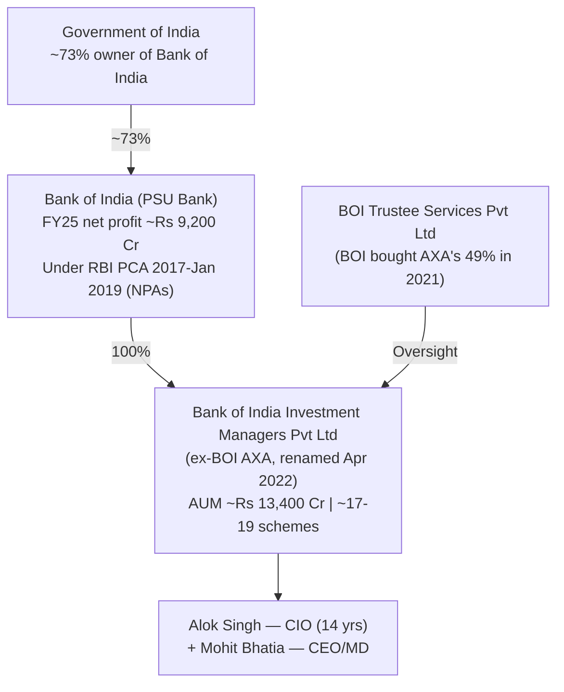
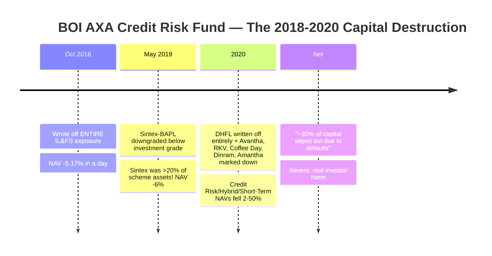
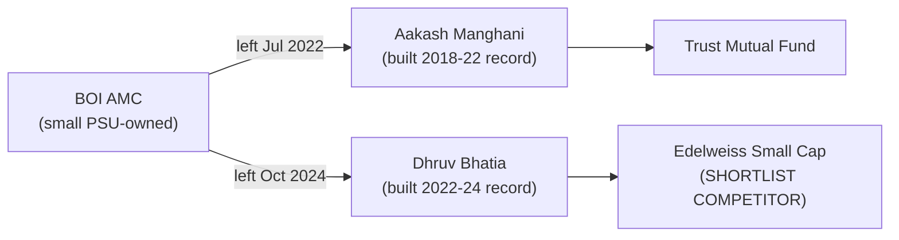
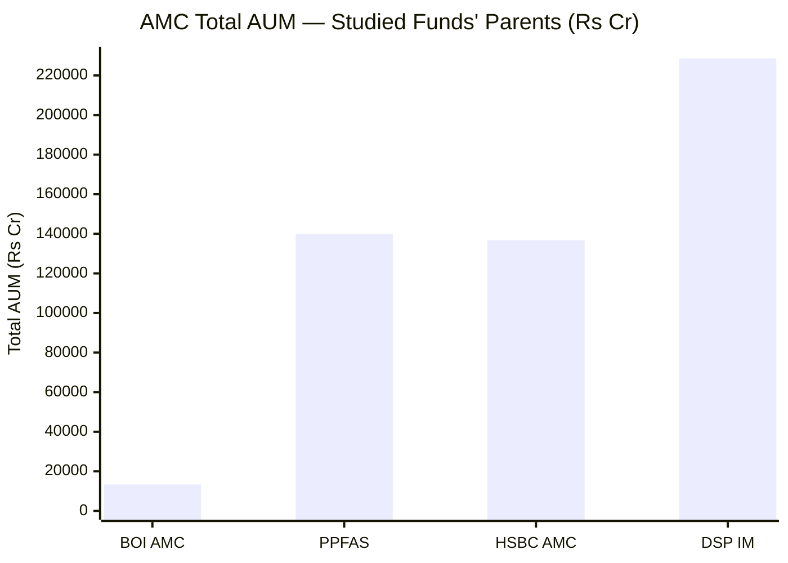
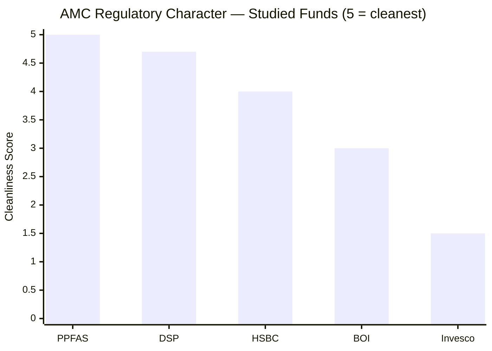
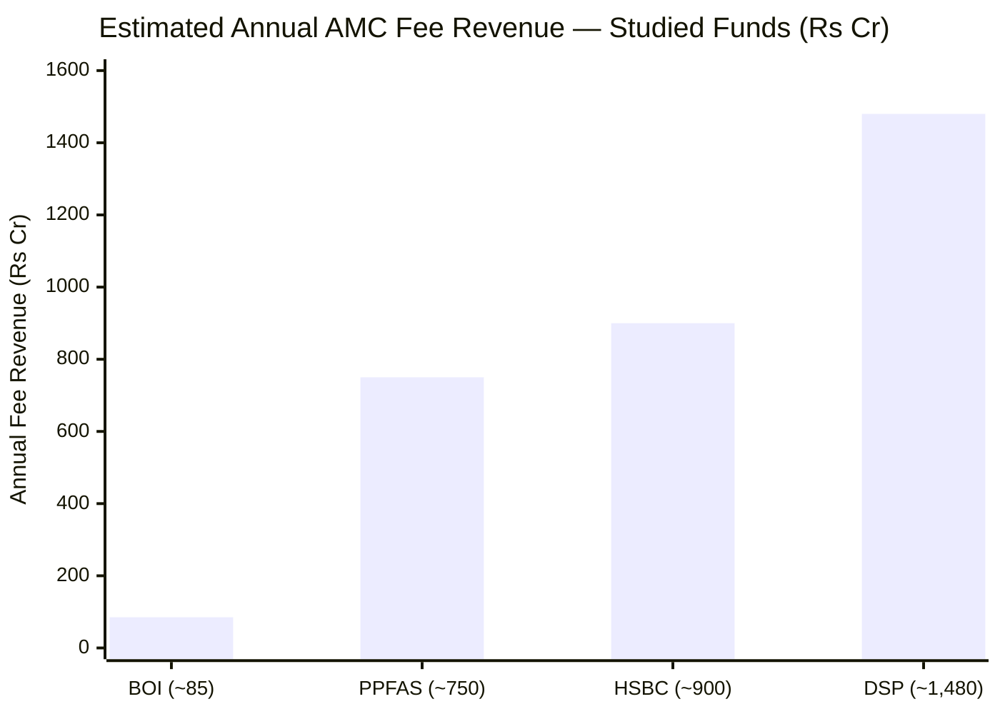
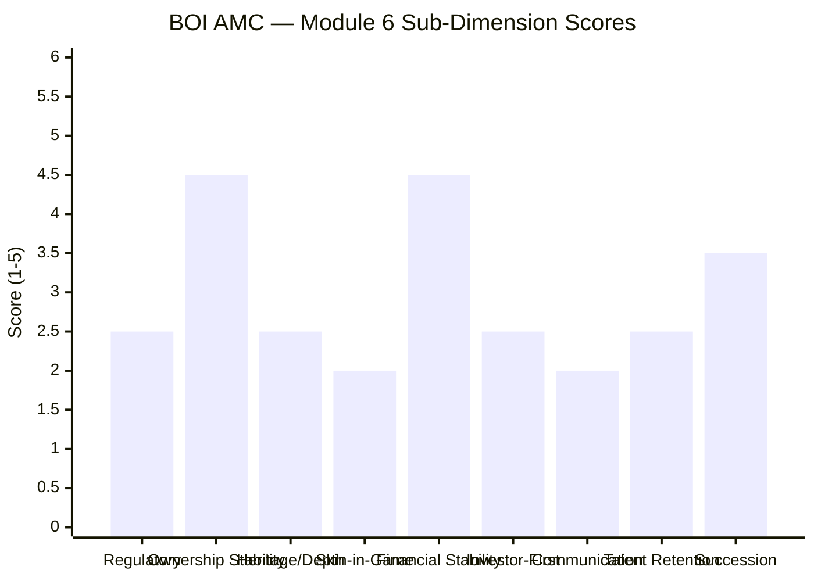
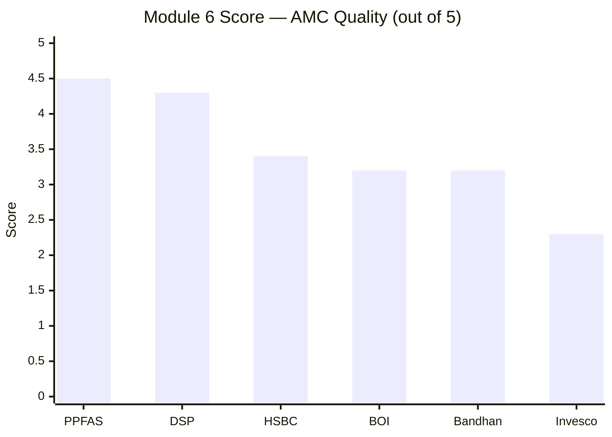

# Module 6: AMC Quality — BOI Small Cap Fund

*Sources: BOI MF official (boimf.in) | AMFI member data | Business Standard (BOI–AXA stake acquisition, Credit Risk Fund write-offs) | Daijiworld / Business Standard (BOI AXA debt mark-downs 2018–2020) | Moneylife / Value Research (SEBI ₹10L insider order) | ICRA rating rationale (BOI Investment Managers) | Dezerv / Groww / INDmoney AMC pages | Wikipedia (Bank of India, RBI PCA history) | Value Research (Alok Singh interviews) | Web research, June 2026*

---

## Module 6 Score: ~3.2 / 5

BOI's AMC story is the study's clearest case of a **good equity franchise inside a small, government-bank-owned house with a real governance scar.** The positives are genuine: a government-bank parent (Bank of India) that guarantees financial survival and removes acquisition risk, a stable 14-year CIO (Alok Singh), 100% clean ownership after the AXA exit, and the cheapest-but-one direct-plan cost culture (Module 4). The negatives are equally genuine and more serious in *character* than any procedural fine seen at DSP or HSBC: a **multi-year debt-side risk-management failure (the BOI AXA Credit Risk Fund debacle, 2018–2020)**, an **insider-redemption SEBI penalty** that exposed a compliance-culture lapse, a **talent-retention problem** (the equity managers who built this fund's record left for competitors), and **sub-scale economics** that constrain research depth.

The net is a mid-pack ~3.2 — consistent with the companion FlexiCap study's ~3.30 AMC anchor, nudged marginally lower by the more-acute small-cap manager carousel and full weighting of the credit-fund episode. It sits roughly level with HSBC (3.4), well above Invesco (2.3), and a clear tier below DSP (4.3) and PP (4.5).

---

## Raw Data (Cross-Source Verified)

| Metric | Value | Source(s) |
|--------|-------|-----------|
| **AMC Full Name** | **Bank of India Investment Managers Pvt. Ltd.** | AMFI, BOI MF |
| **Formerly Known As** | BOI AXA Investment Managers Pvt. Ltd. (until 12-Apr-2022) | Business Standard |
| **Ownership** | **100% Bank of India** (government bank; GoI-majority) | BOI MF, ICRA |
| **AXA Exit** | BOI acquired AXA's 47.07% AMC stake + 49% trustee stake (announced 21-Dec-2021; renamed 12-Apr-2022) | Business Standard |
| **Parent (Bank of India)** | Public-sector bank; GoI ~73% owned; FY25 net profit ~₹9,200 Cr | Wikipedia, bank filings |
| **Parent regulatory note** | BOI was under **RBI Prompt Corrective Action (PCA) 2017–Jan 2019** for high NPAs | RBI / Wikipedia |
| **CEO / MD** | **Mohit Bhatia** | BOI MF, Dezerv |
| **CIO** | **Alok Singh** (since Apr 2012, ~14 yrs) | BOI MF |
| **Total AMC AUM** | **~₹13,400 Cr** (avg, Q-end Sep 2025) | ICRA / AMC data |
| **Total Schemes** | **~17–19** (≈9 equity, 5 debt, 5 hybrid) | AMC data |
| **Avg AUM per scheme** | **~₹700–750 Cr** (several sub-scale) | Computed |
| **Custodian** | **Deutsche Bank** | AMFI / SAI |
| **RTA** | **KFin Technologies** | SAI |
| **Trustee** | BOI Trustee Services Pvt. Ltd. (BOI acquired AXA's 49% in 2021) | Business Standard |
| **Estimated annual fee revenue** | **~₹80–90 Cr** (whole AMC) | Computed |
| **SEBI — AMC** | **₹10 lakh on Head of Operations** (insider redemption, Credit Risk Fund) | Moneylife / SEBI |
| **SEBI — Alok Singh (personal)** | **None found** | Web research |
| **Major risk-management episode** | **BOI AXA Credit Risk Fund debacle (2018–2020)** — IL&FS, Sintex (>20% concentration), DHFL write-offs; ~30% capital wiped | Business Standard / Daijiworld |
| **Quarterly investor letters** | **No** | Web review |
| **Skin-in-game disclosure** | **Not disclosed** | Not found |
| **Flow-restriction history** | **None** (never large enough to need one) | AMC history |
| **Equity-talent retention** | **Weak** — Manghani → Trust MF; Bhatia → Edelweiss (Module 5) | Module 5 |

---

## What Module 6 Is Really Asking

You can have a capable fund manager, but if the institution around them is regulatorily compromised, financially fragile, or culturally indifferent to investors, everything else can unravel. Module 6 evaluates the *house* that runs the fund: governance, regulatory record, ownership, financial stability, and whether it systematically puts investors first or AUM/fees first.

For BOI, the question is unusually pointed because the institution and the fund pull in opposite directions. The fund's *current* attributes (Modules 1–4) are excellent. But the *institution's* recent history contains a genuine capital-destroying failure (on the debt side), a compliance lapse, and a pattern of losing its equity talent. **Module 6 asks whether a government-bank-owned small AMC — financially unsinkable but governance-scarred and sub-scale — is a trustworthy 10-year custodian for a small-cap SIP.** The answer is a qualified "adequate, not exemplary."

---

## The AMC Structure — Who You Are Actually Backing

| Dimension | BOI | DSP | PPFAS | Invesco |
|-----------|-----|-----|-------|---------|
| Ownership type | **Govt-bank PSU (100% BOI)** | Family-private (independent) | Promoter-private | Foreign → IIHL |
| Heritage | Bank since 1906; AMC since 2008 (BOI AXA) | 160+ years | ~30 years | Multiple owners |
| Government backing | **Yes (GoI via BOI)** | No | No | No |
| Can AMC be acquired? | **No (govt won't sell)** | Very unlikely | Possible | **4 changes already** |
| Parent financial strength | **Govt bank (sovereign-adjacent)** | ₹15,779 Cr family wealth | Self-sustaining | Hinduja/IIHL |
| Decision independence | **Constrained by PSU culture** | Complete | Complete | Constrained |

**What government-bank ownership means for investors — a genuine double-edge:**
- **Upside:** the AMC is *financially unsinkable* (a GoI-owned bank parent), and there is **zero acquisition/ownership-change risk** — the opposite of Invesco's four ownership changes. Ownership continuity over a 10-year horizon is effectively guaranteed.
- **Downside:** PSU-owned AMCs typically carry bureaucratic, conservative, less investor-centric cultures; cannot match private-house compensation (driving the talent flight in Module 5); and the parent itself (Bank of India) is no governance exemplar — it spent 2017–2019 under the RBI's **Prompt Corrective Action** framework for high non-performing assets. The parent's own asset-quality history is a reminder that "government-owned" guarantees survival, not excellence.

---

## ⭐ The Credit Risk Fund Debacle (2018–2020) — The AMC's Defining Scar

This is the centerpiece negative of Module 6 and the most serious AMC-governance finding of the entire BOI study. During 2018–2020, BOI AXA's **debt franchise suffered a severe, repeated risk-management failure** in its Credit Risk Fund (and adjacent debt/hybrid schemes):

| Episode | Detail | Why It's Damning |
|---------|--------|------------------|
| IL&FS (Oct 2018) | Entire holding written off; NAV −5.17% | Held a paper that went to zero |
| **Sintex-BAPL (May 2019)** | **A single defaulted credit was >20% of the scheme's assets** | **Textbook concentration failure** — no debt fund should have 20%+ in one risky issuer |
| DHFL + others (2020) | DHFL written off entirely; Coffee Day haircut raised 50%→90%; multiple others marked down | Repeated poor credit selection |
| Cumulative | "~30% of capital wiped out" | Genuine, permanent capital loss for debt investors |

**Why this matters for an equity small-cap investor (and why it's worse than DSP/HSBC's fines):** DSP's ₹2L (ETF expense procedural) and HSBC's ₹5L (documentation) penalties were *procedural* — no investor was harmed. BOI's Credit Risk Fund debacle **destroyed real investor capital** through poor credit selection and a >20% single-issuer concentration that violates basic risk-management discipline. It is a *competence and culture* failure, not a paperwork lapse.

**The mitigants (why it's a scar, not a disqualifier):**
1. **It was on the DEBT side** — the equity team (Alok Singh, the small-cap/flexicap managers) was not involved; the failure was in credit research and the debt risk framework.
2. **It was the BOI AXA JV era** (pre-2022 rename) — arguably a different governance regime, and the industry-wide credit-fund reckoning of 2018–2020 (Franklin Templeton's far larger blow-up being the extreme) caught many AMCs.
3. **The AMC has since de-emphasised credit risk** — like much of the industry, post-2020.

But the scar is real: it tells you BOI's *institutional* risk-management and concentration discipline failed badly in living memory, in a franchise the same CIO (Alok Singh) ultimately oversaw.

---

## ⭐ The Insider-Redemption Penalty — A Compliance-Culture Signal

Layered directly onto the debacle is a **compliance-culture lapse** that elevates it from "bad credit calls" to "governance concern":

> SEBI penalised **Shubro Sankha Das Sarma, BOI's Head of Operations, ₹10 lakh** for redeeming his *own* holdings in the BOI AXA Credit Risk Fund using **unpublished material information about the devaluation of defaulted securities** — information he was privy to as a member of the **Valuation Committee**.

| Aspect | Read |
|--------|------|
| What happened | A senior officer protected his personal money ahead of retail investors, using non-public knowledge of the coming NAV markdown |
| Severity | Genuine insider misuse — worse in *character* than any procedural fine at DSP/HSBC |
| Scope | One operations officer, debt side — not the equity team or the CIO |
| Signal | The AMC's compliance environment in that era allowed a Valuation-Committee member to front-run his own fund's investors |

**This is the qualitative crux of BOI's M6 weakness.** A capital-destroying debt fund is a competence failure; an insider redeeming ahead of investors is a *culture* failure. Even confined to one officer on the debt side, it tells you the institutional guardrails were not robust during the very episode that harmed investors most. No comparable insider-misuse finding exists at DSP, HSBC, or PP.

---

## ⭐ The Talent-Retention Problem (Module 5 ↔ Module 6 Bridge)

The manager carousel documented in Module 5 is not just a fund-level issue — it is an **AMC-quality signal.** A house that cannot keep its equity talent has a structural weakness:

Both managers who built BOI Small Cap's celebrated track record **left for other firms** — and Dhruv Bhatia took his small-cap expertise directly to **Edelweiss Small Cap, a fund in this very shortlist.** The root cause is structural: a small, PSU-owned AMC (~₹13,400 Cr, ~₹80–90 Cr revenue) **cannot match the compensation, equity upside, or brand prestige** of larger private houses. It becomes a *training ground* whose managers graduate to competitors. For a 10-year SIP investor, this is a recurring risk: the person managing your money today may be a flight risk tomorrow, and the institution has a demonstrated inability to retain its best equity people. The one stabiliser is that the *CIO* (Alok Singh) has stayed 14 years — but he is now the over-stretched fallback (23 schemes, Module 4/5), precisely because the bench keeps leaving.

---

## ⭐ AXA Exit vs DSP's BlackRock Buyout — Reactive vs Proactive Independence

Both BOI and DSP ended foreign-partner JVs and emerged 100%-domestically-owned. But the *causation* — which is what reveals governance character — was opposite:

| Dimension | BOI (AXA exit, 2021–22) | DSP (BlackRock buyout, 2018) |
|-----------|------------------------|------------------------------|
| Who initiated | **AXA retreating from Indian retail AM** | **Kothari family proactively chose to buy** |
| Nature | **Reactive** — absorbed a departing partner's stake | **Proactive** — strategic choice for independence |
| Financial backer | Government bank balance sheet | ₹15,779 Cr family wealth |
| Post-deal trajectory | Small AMC, talent attrition | AUM +165%, London office, talent retained |
| Governance signal | Continuity by default (govt won't sell) | Conviction (chose to control destiny) |

DSP *chose* independence and thrived; BOI *inherited* full ownership because its foreign partner left. Both outcomes remove foreign-JV-exit overhang, but choosing independence (DSP) is a stronger governance signal than having it handed to you by a departing partner (BOI). That said, BOI's outcome — a government bank as sole owner — does deliver the one thing DSP's family ownership also delivers: **near-zero risk of future ownership churn**, in sharp contrast to Invesco's serial changes.

---

## Government-Bank Parent — Stability vs PSU Culture

**The stability case (genuine positives):**
- **Bank of India is a government-owned bank** with a sovereign-adjacent backstop and ~₹9,200 Cr FY25 profit — the AMC cannot become insolvent.
- **Zero acquisition risk** — a PSU bank will not sell its AMC; ownership continuity over a 10-year SIP is effectively guaranteed (the antithesis of Invesco's 4 changes).

**The PSU-culture caveat (genuine negatives):**
- PSU-owned AMCs are typically **bureaucratic and conservative**, with weaker investor-centric marketing and communication (no quarterly letters, minimal philosophy disclosure — confirmed for BOI).
- **Compensation constraints** drive the talent flight (above).
- The **parent's own governance history is unimpressive** — Bank of India was under the RBI's **Prompt Corrective Action** framework from 2017 to January 2019 due to high NPAs and weak capital. "Government-owned" guaranteed its survival and recapitalisation, but did *not* prevent the asset-quality crisis that put it under PCA in the first place. The parent is a survivor, not a paragon.

The honest synthesis: BOI offers **survival and continuity without excellence** — the financial unsinkability of a government bank, paired with the cultural and resourcing limitations of a sub-scale PSU AMC.

---

## Regulatory Record — Equity Clean, Debt-Side Scarred

| Entity | Issue | Amount | Character |
|--------|-------|--------|-----------|
| **Alok Singh (personal)** | **None found** | **₹0** | Clean |
| BOI equity franchise | None | — | Clean |
| **BOI AMC (debt side)** | Head of Ops insider redemption in Credit Risk Fund | **₹10 lakh** | **Insider misuse — culture flag** |
| BOI AMC (debt side) | Credit Risk Fund capital destruction (not a "penalty" but a competence failure) | ~30% capital wiped | **Risk-management failure** |
| DSP AMC | ETF expense procedural | ₹2 lakh | Procedural only |
| HSBC AMC | Decision-documentation (L&T era) | ₹5 lakh | Procedural only |
| Invesco AMC | Inter-scheme transfers / multi-jurisdiction probe | ₹4.98 Cr | Severe investor-harm |

**BOI's regulatory record is bifurcated:** the **equity side is clean** (no action against Singh or the equity managers), but the **debt side carries a genuine governance scar** (insider redemption + capital-destroying credit calls). This places BOI **below DSP and HSBC** (whose only blemishes are procedural) but **clearly above Invesco** (whose violations were severe, investor-harming, and multi-jurisdiction). The debt-vs-equity distinction is the saving grace: an equity small-cap investor is not directly exposed to the credit-fund process — but the *culture* that produced the insider redemption is an institution-wide signal that warrants the mid-pack score.

---

## Investor-First Signals — Thin

| Signal | BOI | DSP | PP |
|--------|-----|-----|-----|
| Flow-restriction history | **None** (never needed — too small) | 3 closures | SIP cap on flagship |
| Quarterly investor letters | **No** | No | **Yes** |
| Standalone philosophy doc | **No** | Yes | Yes |
| Skin-in-game disclosed | **No** | All-employee policy | Manager-disclosed |
| Cheap direct ER | **Yes (~0.48%, 2nd cheapest)** | Mid-pack | Cheap |
| Direct–Regular gap | **Widest of study (~1.58%)** | Moderate | Narrow |

BOI's investor-first profile is **thin but not hostile.** The one genuine pro-investor signal is the cheap direct-plan ER (Module 4) — but it's undercut by the *widest* Direct–Regular gap in the study, meaning regular-plan (distributor-sold) investors pay heavily. There are no quarterly letters, no philosophy document, no disclosed skin-in-game, and no flow-discipline track record (the fund has never been large enough to test it). This is **category-minimum communication and alignment** — well below DSP, far below PP. For a self-directed Direct investor, the low ER is what matters; for everyone else, the AMC does little to demonstrate investor-first intent.

---

## AMC Scale, Economics & Research Depth

| Metric | BOI | DSP | HSBC |
|--------|-----|-----|------|
| Total AUM | ~₹13,400 Cr | ₹2,28,622 Cr | ₹1,36,788 Cr |
| Est. AMC revenue | **~₹80–90 Cr** | ~₹1,480 Cr | ~₹900 Cr |
| Schemes | ~17–19 | 66+ | 122 |
| Avg AUM/scheme | **~₹700–750 Cr (sub-scale)** | ~₹3,464 Cr | ~₹1,120 Cr |
| Research depth | **Thin (small bench)** | Deep (508 staff) | Deep (+ global) |

**The sub-scale problem is structural.** At ~₹13,400 Cr across ~17–19 schemes, BOI's average scheme is **~₹700–750 Cr — several below economic viability**, and total AMC revenue (~₹80–90 Cr) is a fraction of DSP's (~₹1,480 Cr) or HSBC's (~₹900 Cr). This **constrains the research budget** — the analyst bench covering an 84-stock, micro-cap-heavy small-cap portfolio is necessarily shallow versus the institutional platforms at DSP/HSBC. It also explains the talent flight (can't pay up) and the CIO's 23-scheme overload (can't hire enough managers). The fund's edge therefore rests heavily on **Alok Singh's individual skill plus the nimbleness of small AUM**, rather than on deep institutional infrastructure. This is the small-AMC trade-off, viewed from the AMC angle.

---

## Peer AMC Comparison — Full Picture

| Dimension | BOI | DSP | PPFAS | HSBC | Invesco |
|-----------|-----|-----|-------|------|---------|
| Ownership | **Govt-bank PSU** | Family-private | Promoter-private | Global bank | Hinduja/IIHL |
| Total AUM | ~₹13,400 Cr | ₹2.29L Cr | ₹1.40L Cr | ₹1.37L Cr | ~₹1.1L Cr |
| Financial stability | **Very high (sovereign-adjacent)** | Very high | High | Very high | Moderate |
| Acquisition risk | **None (govt)** | Very low | Low | Low | **High (serial)** |
| Regulatory character | **Debt-side scar (₹10L insider + Credit Risk debacle)** | Procedural only | Clean | Procedural | **Severe** |
| Talent retention | **Weak (carousel)** | Strong | Strong | Moderate | Weak |
| Investor communication | **Minimal** | Above-avg | **Best** | Moderate | Below-avg |
| Skin-in-game | Not disclosed | **All-employee** | Manager-disclosed | Not disclosed | Not disclosed |
| Research depth | **Thin (sub-scale)** | Deep | Moderate | Deep | Moderate |
| M6 Score | **~3.2** | 4.3 | 4.5 | 3.4 | 2.3 |

---

## Points For / Points Against — AMC Quality

### ✅ Points For

1. **Government-bank parent = financial unsinkability** — Bank of India (GoI-majority, ~₹9,200 Cr FY25 profit) guarantees the AMC's survival; zero insolvency risk
2. **Zero acquisition/ownership-change risk** — a PSU bank won't sell its AMC; 10-year ownership continuity is effectively assured (the opposite of Invesco's 4 changes)
3. **100% clean ownership post-AXA exit** — no foreign-JV-exit overhang; structurally simple
4. **Stable 14-year CIO (Alok Singh)** — the one element of genuine continuity through the manager carousel; a proven equity hand (FlexiCap #2)
5. **Equity franchise regulatory record is clean** — no SEBI action against Singh or the equity managers
6. **Cheapest-but-one direct-plan cost culture** (Module 4) — the one clear pro-investor signal
7. **Tier-1 service providers** — Deutsche Bank custody, KFin RTA

### ❌ Points Against

1. **The Credit Risk Fund debacle (2018–2020)** — capital-destroying debt-side risk-management failure (IL&FS, DHFL write-offs, Sintex >20% concentration, ~30% capital wiped) — far worse in character than DSP/HSBC's procedural fines
2. **Insider-redemption SEBI penalty (₹10L)** — Head of Operations front-ran his own fund's investors using non-public devaluation info — a genuine compliance-culture lapse
3. **Talent-retention failure** — both managers who built this fund's record left (one to shortlist rival Edelweiss); a small PSU AMC can't match private-house comp
4. **Sub-scale economics** — ~₹13,400 Cr / ~17–19 schemes (~₹700 Cr/scheme); ~₹80–90 Cr revenue constrains research depth
5. **Minimal investor communication** — no quarterly letters, no philosophy doc, no disclosed skin-in-game; category-minimum alignment
6. **PSU-culture limitations + parent's own PCA history** — bureaucratic, conservative; Bank of India was under RBI PCA 2017–19 for NPAs (parent is a survivor, not an exemplar)
7. **Widest Direct–Regular gap (~1.58%)** — regular-plan investors heavily penalised
8. **CIO over-concentration** — talent flight has left Alok Singh stretched across 23 schemes (Modules 4/5), itself an AMC-resourcing failure

---

## Module 6 Scorecard

| Sub-Dimension | Score (1–5) | Reasoning |
|---------------|------------|-----------|
| Regulatory cleanliness | **2.5** | Equity side clean, but debt-side Credit Risk debacle + ₹10L insider penalty are genuine governance scars (worse in character than DSP/HSBC procedural fines) |
| Ownership stability | **4.5** | Govt-bank 100% ownership; zero acquisition risk; continuity assured |
| Heritage & institutional depth | **2.5** | Bank since 1906 but AMC only since 2008 (BOI AXA); sub-scale, thin research bench |
| Skin-in-the-game | **2.0** | Not disclosed; no all-employee or manager-level policy on record |
| Financial stability | **4.5** | Government-bank backstop — unsinkable; but parent's own PCA history caps it below 5 |
| Investor-first culture | **2.5** | Cheap direct ER is the one signal; offset by widest D-R gap, no flow discipline, no letters |
| Investor communication | **2.0** | Category-minimum; no quarterly letters, no philosophy doc; below DSP, far below PP |
| Talent retention | **2.5** | Both track-record architects left (one to a shortlist rival); structural comp/prestige weakness; CIO stability the sole offset |
| Succession / continuity | **3.5** | CIO Alok Singh = stable backstop and de facto succession; but bench is thin/new (Bhardwaj 11 mo) |
| **Module 6 Overall** | **~3.2 / 5** | **Financial unsinkability and ownership continuity (govt-bank) genuinely offset by a real debt-side governance scar, talent flight, sub-scale research depth, and minimal investor communication. A good equity franchise in an adequate-not-exemplary institution. Roughly level with HSBC; well above Invesco; a clear tier below DSP/PP.** |

---

## Comparative Module 6 Scores — All Studied Funds

| Rank | AMC | Score | Key Differentiator |
|------|-----|-------|--------------------|
| 1 | PPFAS | 4.5 | Zero incidents; quarterly letters; 7-scheme focus |
| 2 | DSP | 4.3 | 160Y heritage; all-employee skin-in-game; flow discipline |
| 3 | HSBC | 3.4 | Global parent ($3T); but open-door AUM; grafted heritage |
| 4 | **BOI** | **~3.2** | **Govt-bank unsinkability + clean equity CIO; debt-side scar, talent flight, sub-scale, minimal communication** |
| 5 | Bandhan | 3.2 | IDFC heritage; consortium ownership; ChrysCapital PE clock |
| 6 | Invesco | 2.3 | 4 ownership changes; multi-jurisdiction SEBI probe |

BOI and Bandhan effectively tie at ~3.2 by different routes: Bandhan has cleaner risk-management but a PE-investor exit clock and consortium ownership; BOI has guaranteed ownership continuity but a debt-side governance scar and talent flight. Both sit below HSBC's global-parent backstop and a clear tier under DSP/PP.

---

## One-Line Verdict

BOI Investment Managers is a financially unsinkable, ownership-stable government-bank AMC with a clean equity franchise and a 14-year CIO — but it carries a genuine debt-side governance scar (the 2018–2020 Credit Risk Fund capital destruction plus an insider-redemption penalty), a demonstrated inability to retain its equity talent (both architects of this fund's record left, one to a shortlist rival), and sub-scale research economics, making it an *adequate-not-exemplary* custodian (~3.2/5) — level with HSBC, well above Invesco, a clear tier below DSP and PP.

---

## Module 6 Final Score: **~3.2 / 5**

> **Module Weight:** 5% | **Weighted Contribution:** 3.2 × 0.05 = **0.160**

---

## BOI Small Cap Fund — Complete Final Score (All 6 Modules)

| Module | Topic | Weight | Score | Weighted |
|--------|-------|--------|-------|----------|
| Module 1 | Returns Consistency | 25% | 3.7/5 | 0.925 |
| Module 2 | Risk Profile | 20% | 3.7/5 | 0.740 |
| Module 3 | Portfolio DNA | 15% | 3.7/5 | 0.555 |
| Module 4 | Cost & AUM Impact | 20% | 3.9/5 | 0.780 |
| Module 5 | Fund Manager Quality | 15% | 3.3/5 | 0.495 |
| **Module 6** | **AMC Quality** | **5%** | **3.2/5** | **0.160** |
| **TOTAL** | | **100%** | | **≈ 3.66 / 5** |

> **BOI Small Cap Fund final weighted score: ≈ 3.66 / 5 — the #2 small cap fund in this study, behind only DSP (4.00).**

**The structural reason BOI ranks #2:** its weaknesses (Module 5 manager carousel = 3.3, Module 6 AMC = 3.2) sit in the *low-weight* modules (15% + 5% = 20%), while its strengths (Module 1 returns, Module 4 cost, Module 2 risk) sit in the *high-weight* modules (25% + 20% + 20% = 65%). The cheap, nimble, differentiated, strong-risk-adjusted profile of a small-AUM fund — captured in M1–M4 — outweighs the genuine manager and institutional concerns. The result is honest: **BOI is the second-best small cap on the numbers, with the clearest caveats** (track record built by departed managers; an AMC with a debt-side governance scar). For a Direct-plan SIP investor who buys the *current* fund (low cost, full micro-cap access, differentiated book) rather than the *historical* track record, BOI is a genuine #2 — provided they monitor the manager-continuity and AUM-growth risks the later modules surface.

---

*Module 6 complete. AMC quality is adequate-not-exemplary: government-bank financial unsinkability and ownership continuity, offset by a debt-side governance scar (Credit Risk Fund debacle + insider penalty), talent flight, sub-scale research depth, and minimal investor communication. Module 6 score: ~3.2/5. **BOI Small Cap final score ≈ 3.66/5 — #2 of the studied small caps.***

*Next: [README — Final Scorecard & Verdict](README.md)*
