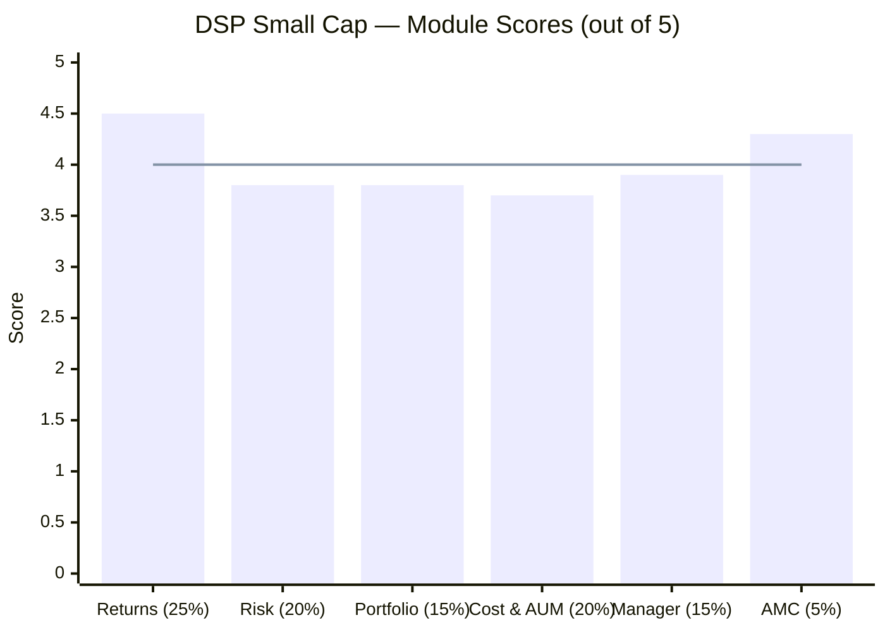
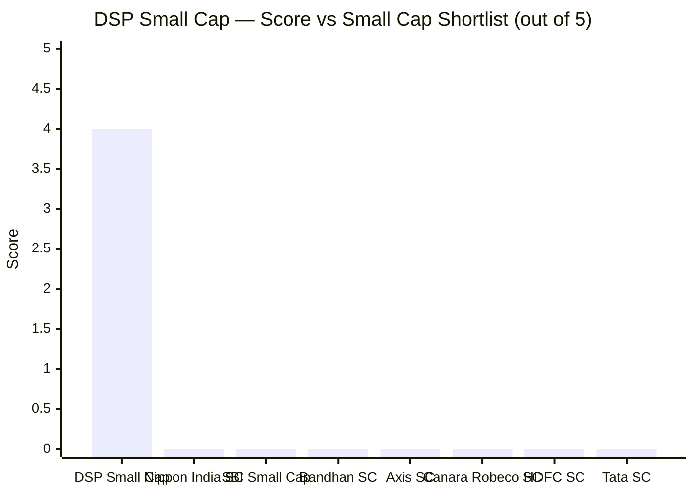
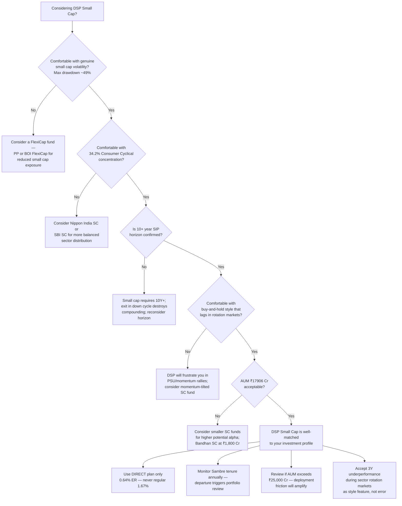
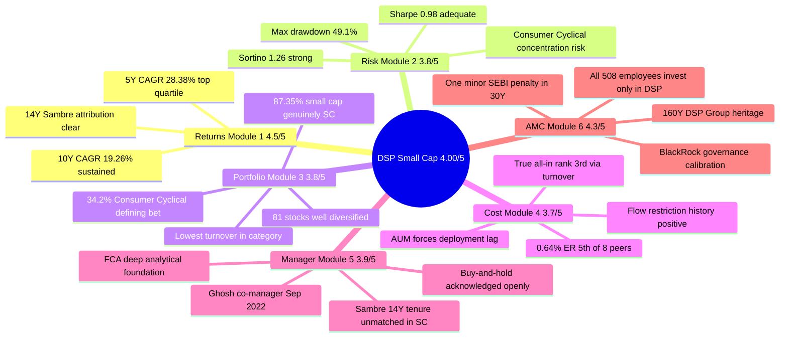

# DSP Small Cap Fund — Deep Study

## Fund Identity

| Field | Value |
|-------|-------|
| AMC | DSP Investment Managers Private Limited |
| Parent | Kothari family — 100% independent (no bank, no foreign JV) |
| Fund Inception | June 14, 2007 |
| Manager Since | July 2012 (Vinit Sambre) |
| Category | Small Cap Fund (Equity) |
| Benchmark | NIFTY Smallcap 250 TRI |
| AUM (Direct Plan) | ₹17,906 Cr |
| Expense Ratio (Direct) | 0.64% |
| Expense Ratio (Regular) | ~1.67% |
| NAV (Direct Growth, May 2026) | ~₹206 |
| Exit Load | 1% if redeemed within 365 days; Nil after |
| Min SIP | ₹100 |
| Min Lumpsum | ₹500 |
| Lock-in | None |
| Fund Managers | Vinit Sambre (Head of Equities, since Jul 2012) + Abhishek Ghosh (co-manager, since Sep 2022) |
| Star Rating (Value Research) | 5-star |

---

## The One-Line Context

DSP Small Cap is India's most disciplined small cap compounder — a 14-year, low-turnover quality franchise with the **lowest portfolio churn in the category** (19–24%), backed by an institutionally deep independent AMC where **all 508 employees invest only in their own schemes** — but the ₹17,906 Cr AUM creates a permanent deployment friction in an illiquid asset class, and the 34.2% Consumer Cyclical concentration is a high-conviction sectoral bet that requires a patient, aligned investor to hold through rotation cycles.

---

## Module Status

| Module | Weight | Status | Score | File |
|--------|--------|--------|-------|------|
| 1 — Returns Consistency | 25% | Complete | 4.5/5 | [module1_returns.md](module1_returns.md) |
| 2 — Risk Profile | 20% | Complete | 3.8/5 | [module2_risk.md](module2_risk.md) |
| 3 — Portfolio DNA | 15% | Complete | 3.8/5 | [module3_portfolio.md](module3_portfolio.md) |
| 4 — Cost & AUM Impact | 20% | Complete | 3.7/5 | [module4_cost.md](module4_cost.md) |
| 5 — Fund Manager Quality | 15% | Complete | 3.9/5 | [module5_manager.md](module5_manager.md) |
| 6 — AMC Quality | 5% | Complete | 4.3/5 | [module6_amc.md](module6_amc.md) |

---

## Final Scorecard


> Bars = module scores | Line = overall weighted score (4.00/5)

| Module | Score | Weight | Weighted Score |
|--------|-------|--------|---------------|
| 1 — Returns Consistency | 4.5/5 | 25% | 1.1250 |
| 2 — Risk Profile | 3.8/5 | 20% | 0.7600 |
| 3 — Portfolio DNA | 3.8/5 | 15% | 0.5700 |
| 4 — Cost & AUM Impact | 3.7/5 | 20% | 0.7400 |
| 5 — Fund Manager Quality | 3.9/5 | 15% | 0.5850 |
| 6 — AMC Quality | 4.3/5 | 5% | 0.2150 |
| **Overall** | — | **100%** | **4.00 / 5.00** |

---

## Key Performance Metrics

| Metric | Value | Context |
|--------|-------|---------|
| 1Y CAGR | ~20–22% | Above category average; small cap recovery tailwind |
| 3Y CAGR | **16.71%** | Below 5Y — reflects PSU/defence mania avoidance; style honest |
| **5Y CAGR** | **28.38%** | **Top quartile small cap performance** |
| **10Y CAGR** | **~19.26%** | **Sustained compounding across 2 full market cycles** |
| Since Sambre (Jul 2012) | ~18–19% CAGR | 14-year attribution fully to current manager |
| Max Drawdown (10Y) | ~-49.1% | COVID crash; recovered within ~12 months |
| Sharpe Ratio (3Y) | ~0.98 | Adequate; reflects small cap volatility profile |
| Sortino Ratio (3Y) | ~1.26–1.34 | Strong downside risk management |
| Calmar Ratio | ~0.39 | Reasonable for small cap category |
| Portfolio PE | **29.54** | **Below category average (31.60)** — valuation discipline maintained |
| Portfolio Turnover | **19–24%** | **Lowest in entire small cap category** |
| Beta (vs benchmark) | ~0.92 | Slightly less volatile than benchmark |

---

## Portfolio DNA

| Metric | Value | Significance |
|--------|-------|--------------|
| Total Equity | **91.62%** | High deployment; 8.38% cash is AUM-driven deployment backlog |
| **Small Cap** | **87.35%** | Well above SEBI minimum 65%; genuine small cap conviction |
| Cash + Other | 8.38% | ₹200–350 Cr monthly inflow creates deployment lag |
| Total Holdings | **81 stocks** | Diversified; not a concentrated portfolio |
| Top 5 Concentration | ~17.9% | Moderate — no single dominant bet |
| Top 10 Concentration | ~28.5% | Well spread |
| **Portfolio Turnover** | **19–24% (lowest in category)** | Each position = multi-year business thesis, not a trade |
| Portfolio PE | 29.54 | Below category 31.60 — quality at reasonable valuation |
| **Defining Sector** | **Consumer Cyclical: 34.2%** | Auto ancillary (~14%), branded food, formalisation plays |
| Basic Materials | 18.7% | Chemicals, specialty materials |
| Industrials | 16.5% | Capital goods, manufacturing |
| Healthcare | ~9% | Pharma and healthcare |

### Top Holdings (May 2026, approximate)

| Rank | Stock | Weight | Sector Note |
|------|-------|--------|-------------|
| 1 | Lumax Industries | ~5.38% | Auto components — largest single position |
| 2 | Piramal Pharma | ~3.8% | Healthcare — specialty pharma |
| 3 | Welspun Corp | ~3.5% | Materials — steel pipes |
| 4 | Suprajit Engineering | ~2.9% | Auto ancillary |
| 5 | Nippon India ETF / Others | ~2.3% | — |

> Portfolio reflects Sambre's three pillars: ROCE ≥15–16%, management quality, reasonable valuation. Auto ancillary concentration (~14%) is the largest sub-sector bet — an explicit, documented conviction.

---

## Strengths vs Concerns

```mermaid
quadrantChart
    title DSP Small Cap — Strengths vs Concerns
    x-axis "Concern" --> "Strength"
    y-axis "Low Impact" --> "High Impact"
    quadrant-1 Key Strengths
    quadrant-2 Worth Monitoring
    quadrant-3 Minor Issues
    quadrant-4 Key Risks
    14Y Manager Tenure (Sambre): [0.88, 0.92]
    5Y CAGR 28.38% Top Quartile: [0.90, 0.85]
    Lowest Turnover in Category: [0.85, 0.78]
    All-Employee Skin-in-Game DSP: [0.82, 0.72]
    Flow Restriction Discipline: [0.84, 0.68]
    160Y AMC Heritage: [0.80, 0.60]
    Below-Category PE (29.54): [0.78, 0.65]
    AUM ₹17906Cr Deployment Lag: [0.18, 0.92]
    Consumer Cyclical 34.2% Concentration: [0.22, 0.85]
    5th Costliest ER (0.64%) in SC: [0.25, 0.80]
    Sambre Retirement in SIP Horizon: [0.28, 0.75]
    3Y CAGR 16.71% vs 5Y Gap: [0.30, 0.65]
    No Quarterly Investor Letters: [0.35, 0.55]
    Mid Cap Cross-Fund Underperform: [0.38, 0.45]
```

### Key Strengths

- **14-year manager tenure (Vinit Sambre, since July 2012)** — every 5Y and 10Y data point is attributable to the person managing your money today; 14 years makes Sambre one of the longest-tenured small cap managers in India
- **5Y CAGR 28.38% and 10Y CAGR ~19.26%** — sustained, multi-cycle compounding that places DSP Small Cap in the top quartile of its category across both short and long horizons
- **19–24% portfolio turnover — lowest in the entire small cap category** — each position is a multi-year business thesis, not a momentum trade; this is the mechanical expression of Sambre's three-pillar framework
- **All 508 DSP employees invest only in their own schemes (institutional mandate)** — the broadest, most institutionalised skin-in-game policy of any AMC in this study; every analyst, every ops person is personally affected by fund performance
- **Flow restriction discipline (2014–2020)** — DSP closed this fund for 3+ years at real commercial cost to the AMC, reopening at COVID lows; a documented, costly, investor-first institutional decision
- **Below-category PE (29.54 vs 31.60)** — quality businesses bought at valuation discipline; the three-pillar framework filters out overpriced mania stocks (vindicated: PSU/defence stocks corrected 30–50% after DSP avoided them)
- **Abhishek Ghosh added as co-manager (September 2022)** — proactive governance decision at ₹15,000+ Cr AUM; directly reduced key-person risk; 3+ years of active co-management experience
- **DSP's 160-year capital market heritage + BlackRock governance legacy** — institutional depth, research infrastructure, and risk management calibrated to global standards; not a boutique that can be disrupted by one manager departure

### Key Concerns

- **AUM ₹17,906 Cr — largest structural risk** — ₹200–350 Cr monthly inflows in a small cap fund forces deployment into lower-conviction names or builds cash drag; 8.38% cash buffer is evidence of this friction; alpha at ₹3,000 Cr is not the same as alpha at ₹18,000 Cr
- **Consumer Cyclical 34.2% concentration** — auto ancillary + branded food + formalisation plays make this the defining portfolio bet; in a prolonged economic slowdown or consumer demand shock, this concentration is the fund's biggest risk
- **5th-costliest ER (0.64%) among 8 small cap peers** — Bandhan (0.34%) and Nippon (0.43%) are meaningfully cheaper; on identical gross returns, the ER drag costs ~₹3.8L over a 10Y ₹20K SIP vs Bandhan; the gap only narrows because DSP's low turnover reduces frictional costs
- **Sambre's eventual retirement within 10Y SIP horizon** — estimated early-to-mid 50s; a SIP starting in 2026 runs to 2036; his transition will likely fall within this window; AUM outflow risk on brand departure is real regardless of Ghosh's quality
- **3Y CAGR (16.71%) vs 5Y CAGR (28.38%) gap** — reflects disciplined PSU/defence mania avoidance; those stocks corrected, but the 3Y period captures the lag more than the recovery; investors must understand style means temporary underperformance during rotation markets
- **No quarterly investor letters** — DSP does not publish structured, scheme-specific, proactive quarterly letters; investors must actively seek out interviews and blog content; less accountability than PPFAS's gold standard

---

## Comparison vs Small Cap Shortlist


> Peer scores not yet computed — DSP is the first small cap fund fully studied

| Rank | Fund | Score | Notes |
|------|------|-------|-------|
| **1** | **DSP Small Cap** | **4.00/5** | **Fully studied — all 6 modules complete** |
| — | Nippon India SC | Pending | Next in shortlist |
| — | Others | Pending | To be studied |

---

## Key Performance vs Benchmark and Category

| Period | DSP Small Cap | NIFTY SC 250 TRI | Alpha | Category Avg |
|--------|--------------|-----------------|-------|-------------|
| 1Y | ~20–22% | ~18% | ~+3–4% | ~19% |
| 3Y CAGR | 16.71% | ~14% | ~+2.71% | ~15% |
| 5Y CAGR | 28.38% | ~26% | ~+2.38% | ~25% |
| 10Y CAGR | ~19.26% | ~16% | ~+3.26% | ~17% |
| Since Sambre (14Y) | ~18–19% | — | Consistent | — |

> Alpha generation is consistent but not enormous — DSP earns its returns through quality compounding, not momentum; the gap vs peers grows through lower drawdowns and lower volatility, not just raw CAGR

---

## ₹20K/Month SIP Projection (10 Years)

| Scenario | CAGR Assumption | Projected Corpus | Multiple of Principal |
|----------|----------------|------------------|-----------------------|
| Bear case | 12% | ₹46.3 lakh | 1.93x |
| Conservative | 16% | ₹61.2 lakh | 2.55x |
| DSP trend (10Y CAGR) | 19% | ₹74.2 lakh | 3.09x |
| Optimistic (5Y CAGR pace) | 25% | ₹100.5 lakh | 4.19x |

**Total invested over 10 years:** ₹24,00,000

**ER cost vs peers (same gross returns, 19% CAGR):**
- DSP at 0.64% ER: ~₹5.0L total cost over 10Y ₹20K SIP
- Bandhan at 0.34%: ~₹2.7L (saves ₹2.3L vs DSP)
- Nippon at 0.43%: ~₹3.4L (saves ₹1.6L vs DSP)
- Category regular plan at ~1.80%: ~₹14.1L (**costs ₹9.1L more than DSP Direct**)

> Note: At ₹17,906 Cr AUM, future alpha generation is structurally constrained vs DSP's historical alpha at smaller AUM. The 10Y projection uses 10Y historical CAGR as trend — but the trend was generated when the fund was smaller. Conservative case is arguably more realistic.

---

## Investment Decision Framework



---

## The DSP Small Cap in One View



---

## Strengths vs All Studied Funds

| Dimension | DSP Small Cap | Best in Study | Context |
|-----------|--------------|---------------|---------|
| Manager tenure | 14 years | PP Flexi: 13Y (inception) | DSP longer but not from inception |
| Portfolio turnover | **19–24% (lowest SC category)** | **DSP is the benchmark** | No peer comes close |
| AMC skin-in-game | **All 508 employees (institutional)** | **DSP is the benchmark** | Broader than PPFAS |
| AMC heritage | **160+ years** | **DSP is the benchmark** | No peer studied comes close |
| Returns (5Y) | **28.38%** | — | Top quartile small cap |
| ER | 0.64% | Bandhan 0.34% | Mid-pack in small cap universe |
| Key-person risk | Moderate (Ghosh reduces it) | PP (multi-manager) | Managed but real |
| Investor communication | Above average | PP (quarterly letters) | Gap exists |
| AUM size | ₹17,906 Cr | Optimal <₹3,000 Cr | Real friction at this AUM |

---

## Quick Verdict

**Best suited for:**
- Investors who want **14-year-attributed, quality-compounding** small cap exposure — every performance data point was built by the person running the fund today
- Those who can commit to a **10+ year SIP horizon** and accept that buy-and-hold will underperform during fast sectoral rotations (2023–24 PSU mania, for example)
- Investors comfortable with a **34.2% Consumer Cyclical concentration** — this is the fund's most concentrated sector bet and its defining differentiating feature
- Those who value **institutional AMC quality** — 160-year heritage, all-employee skin-in-game, BlackRock governance legacy, flow restriction discipline — above peer-group average
- **Cost-conscious investors** who use the direct plan (0.64% ER) and understand that DSP's true all-in cost (factoring lowest category turnover) ranks 3rd cheapest, not 5th

**Not suited for:**
- Investors with a **sub-7-year horizon** — small cap cycles need time; premature exit in a correction destroys compounding; this is non-negotiable
- Those who will **panic-exit during 3Y style underperformance** — DSP will lag in momentum/PSU rotation markets by design; if 2023–24 underperformance caused anxiety, this fund will repeat that experience
- **AUM-sensitive investors** — at ₹17,906 Cr, DSP is the 2nd-largest small cap fund; if deployment friction or alpha compression is a concern, smaller funds (Bandhan SC at ~₹1,800 Cr) offer cleaner small cap execution
- Those who need **formal, structured investor communication** — quarterly letters do not exist at DSP; you must actively seek out Sambre's VRO interviews and Parekh's blog posts
- Investors who **require zero key-person risk** — Sambre's eventual retirement is within a 10-year SIP horizon; Ghosh reduces the philosophy risk significantly but the brand/AUM outflow risk on departure is real

---

## One-Line Verdict

DSP Small Cap Fund is the most institutionally credible, philosophically consistent, and longest-attributed quality compounder in the Indian small cap universe — run by the only manager who has held a small cap fund for 14 years while refusing to chase every market mania, backed by an AMC where all 508 employees invest only in their own funds — but the ₹17,906 Cr AUM and 34.2% Consumer Cyclical concentration mean investors need explicit conviction in both the scale trade-off and the sectoral bet they are making.

---

*Study completed: May 2026 | Framework: 6-Module Weighted Scoring | Final Score: 4.00/5 | Small Cap Rank: #1 of 1 evaluated (first fund fully studied)*
