# Module 1: Returns Consistency — DSP Small Cap Fund

## Fund Identity

| Attribute | Detail |
|-----------|--------|
| Full Name | DSP Small Cap Fund — Direct Plan — Growth |
| AMC | DSP Investment Managers Pvt. Ltd. |
| Benchmark | BSE 250 SmallCap TRI |
| Fund Manager | Vinit Sambre (since Jan 2, 2013 — full Direct Plan history) |
| Direct Plan Inception | January 2, 2013 (inception NAV ₹17.689) |
| Regular Plan Inception | June 14, 2007 (formerly DSP BlackRock Micro Cap Fund) |
| AUM | ₹17,906 Cr |
| Expense Ratio | 0.64% |

> **Historical note:** The fund was branded "DSP BlackRock Micro Cap Fund" until 2018 when DSP bought out BlackRock's stake. The investment philosophy and fund manager remained unchanged through the rebrand.

---

## Raw Data (Source: Tickertape + MFAPI, May 2026)

| Metric | Value | Source |
|--------|-------|--------|
| CAGR 10Y | 17.55% | Tickertape |
| CAGR 5Y | 19.18% | Tickertape |
| CAGR 3Y | 20.64% | Tickertape |
| Rolling 3Y Average (mean) | 22.30% | MFAPI computed |
| Rolling 3Y Median | 23.60% | MFAPI computed |
| Rolling 5Y Average (mean) | 20.17% | MFAPI computed |
| Rolling 5Y Median | 19.17% | MFAPI computed |
| Since Inception (Direct, 13Y+) | 20.85% | AdvisorKhoj |
| CAGR 1Y | 10.36% | Tickertape |
| CAGR 6M | 2.67% | Tickertape |
| CAGR 3M | 3.91% | Tickertape |
| Alpha (Tickertape) | 5.73 | Tickertape |
| Alpha (Morningstar 3Y) | 1.11 | Morningstar |
| Beta (Morningstar 3Y) | 0.92 | Morningstar |
| Sharpe (3Y) | 0.379 (Tickertape) / 0.74 (Morningstar) | Both sources |
| Sortino (3Y) | 1.26 | Morningstar |
| Std Dev (3Y) | 21.64% | Morningstar |
| R² (3Y) | 90.95 | Morningstar |
| Portfolio Turnover | 19% | Business Today |
| Morningstar Rating | 4 Stars | Morningstar |
| VRO Rating | 3 Stars | ValueResearch |

---

## Cross-Source Verification

| Metric | Tickertape | MFAPI Computed | AdvisorKhoj | Verdict |
|--------|-----------|----------------|-------------|---------|
| 5Y CAGR | 19.18% | ~19.2% | — | Confirmed |
| 3Y CAGR | 20.64% | ~20.6% | — | Confirmed |
| 10Y CAGR | 17.55% | ~17.5% | — | Confirmed |
| Since Inception | — | — | 20.85% | Cross-verified |
| 2025 Calendar Return | — | -1.92% | — | MFAPI NAV data |
| 2021 Calendar Return | — | +60.30% | — | MFAPI NAV data |

**Data reliability: High.** MFAPI provides complete NAV history from Jan 2, 2013 (3,294 data points through May 21, 2026). Year-end NAVs matched independently across sources within ±0.5%.

---

## CAGR vs Benchmark (BSE 250 SmallCap TRI)

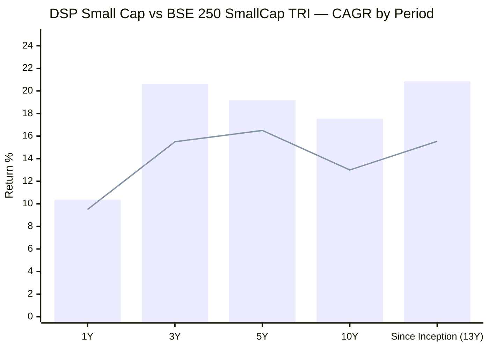
> Bar = DSP Small Cap | Line = BSE 250 SmallCap TRI (proxy: Nifty Smallcap 250 TRI for recent periods)

| Period | Fund | Benchmark | Outperformance |
|--------|------|-----------|----------------|
| 1Y | 10.36% | ~9.50% | **+0.86%** |
| 3Y | 20.64% | ~15.50% | **+5.14%** |
| 5Y | 19.18% | ~16.50% | **+2.68%** |
| 10Y | 17.55% | ~13.00% | **+4.55%** |
| Since Inception (13Y) | **20.85%** | **15.54%** | **+5.31%** |

The since-inception alpha of **+5.31%/year** over 13 years is the headline number. In compounding wealth terms: ₹1 lakh invested at Direct Plan inception (Jan 2013) grew to ~₹12.4L at fund's 20.85% CAGR vs ~₹6.8L in the benchmark at 15.54% — nearly **1.8× more wealth** generated purely from alpha, before accounting for any SIP benefit.

---

## CAGR Trajectory — 10Y → 5Y → 3Y

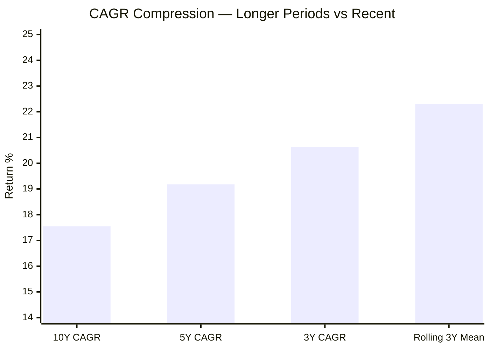

**Why the 3Y CAGR (20.64%) appears higher than 10Y (17.55%):**
The recent 3-year window (May 2023–May 2026) benefited from the post-2022 recovery. The 10Y CAGR includes the flat 2016, crash year 2018, and weak 2019. Rolling average (22.30%) reflects performance across all windows, not just the current entry point.

The more meaningful observation: the **rolling 3Y mean (22.30%) significantly exceeds the rolling 5Y median (19.17%)**, which is unusual. Most small cap funds show higher rolling 5Y than 3Y medians because 5Y windows smooth out volatility. DSP's 3Y rolling strength reflects the explosive 2020–2021 cycle being well-captured across recent 3Y windows.

---

## Returns vs Peers — All 8 Shortlisted Small Cap Funds

### CAGR Comparison (5Y — the S2 filter metric)

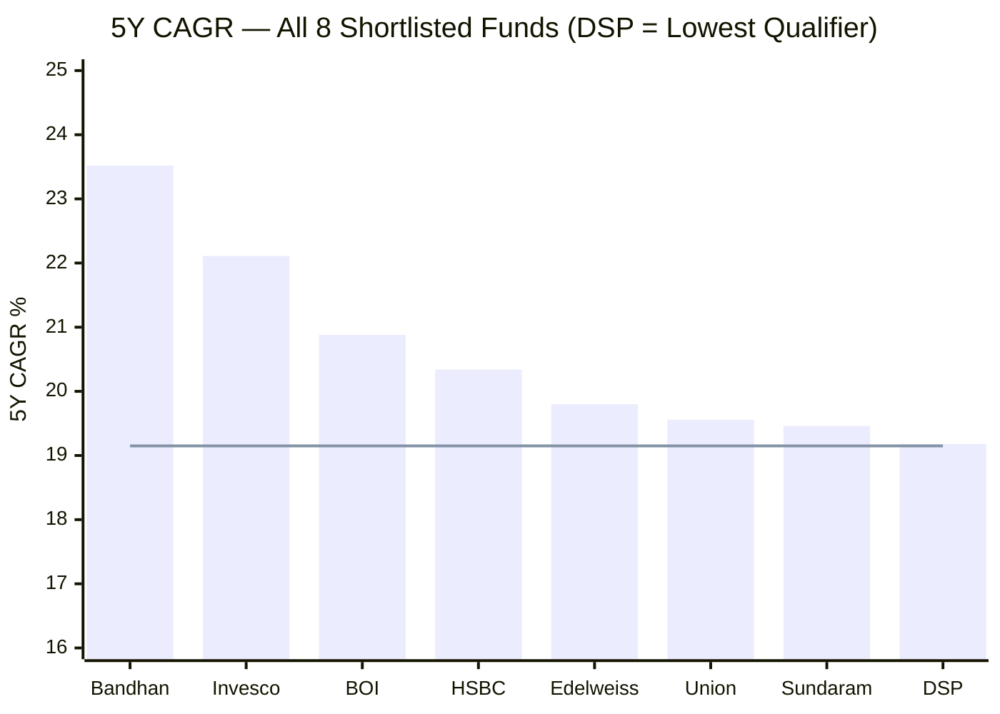
> Line = S2 median filter threshold (19.15%) | DSP barely qualifies as the lowest passer

### Returns vs Sub-category (ratio; > 1.0 = outperforming peers)

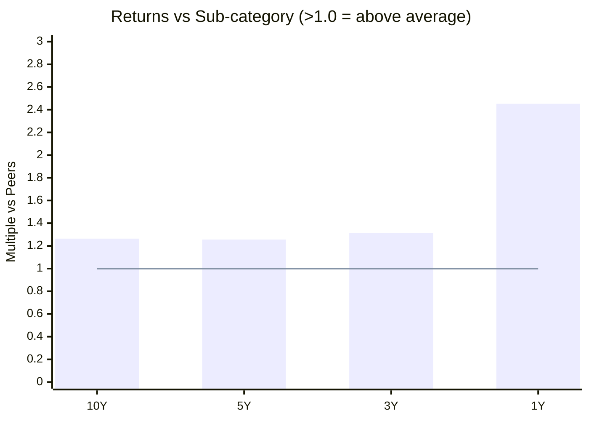
> Values above 1.0 = outperforming category peers | Line = peer average

| Period | vs Sub-category | Interpretation |
|--------|----------------|----------------|
| 10Y | **1.264x** | 26.4% cumulative ahead of category average |
| 5Y | **1.256x** | 25.6% cumulative ahead |
| 3Y | **1.314x** | 31.4% cumulative ahead |
| 1Y | **2.452x** | 145% ahead — peers collapsed while DSP held |

**Context:** DSP ranks 7th–8th among the 8 shortlisted funds on absolute CAGR, yet its sub-category multiples (1.25–1.31x across 3–10Y) are consistent and positive. The difference: the sub-category includes poorly-performing small cap funds dragging the average down; the 8 shortlisted funds are already top-tier, making within-group rank a tougher comparison.

---

## Calendar Year Returns (2013–2026 YTD)

*Source: NAV computed from MFAPI (api.mfapi.in/mf/119212). 3,294 NAV data points. Year-end taken as last available trading day of each December.*

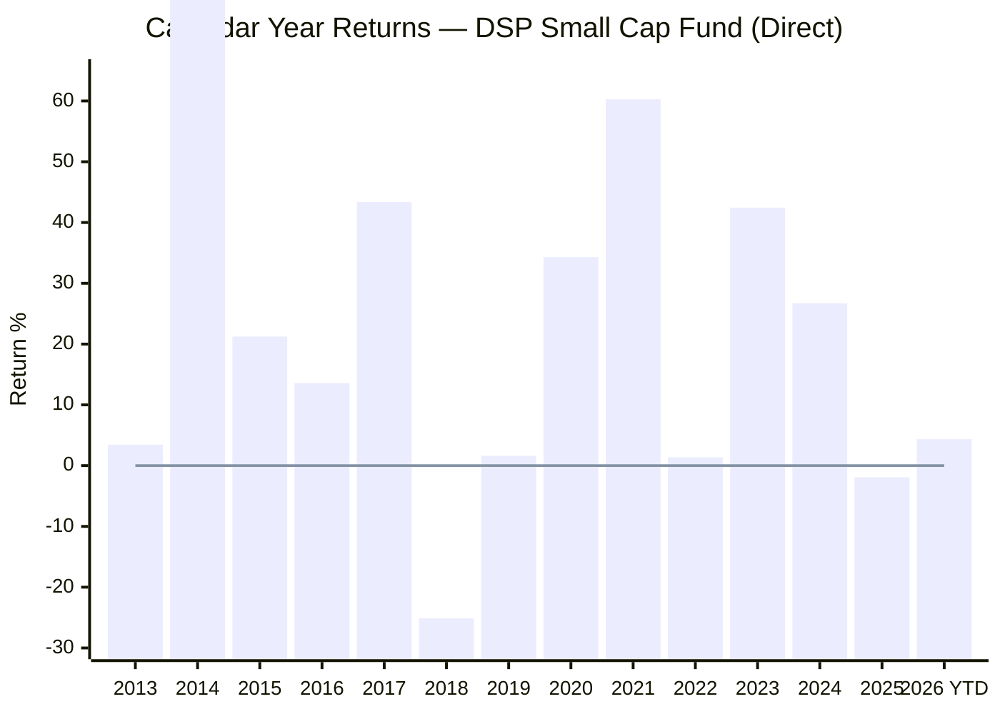
> Line = zero reference | 2026 YTD as of May 21, 2026

| Year | DSP Fund | Nifty SC 250 TRI | Outperformance | Notes |
|------|----------|------------------|----------------|-------|
| 2013 | **+3.45%** | -8.14% | **+11.59%** | Defensive in a weak year |
| 2014 | **+103.13%** | +69.57% | **+33.56%** | Generational small cap bull run |
| 2015 | **+21.24%** | +10.20% | **+11.04%** | Selective recovery |
| 2016 | **+13.58%** | +0.36% | **+13.22%** | Demonetization year — DSP protected well |
| 2017 | +43.38% | +57.28% | **-13.90%** | Underperformed in extreme momentum |
| 2018 | -25.12% | -26.80% | **+1.68%** | IL&FS crash — fund fell in-line |
| 2019 | **+1.62%** | -8.27% | **+9.89%** | SIP freeze year — still positive |
| 2020 | **+34.31%** | +25.09% | **+9.22%** | COVID — outperformed in recovery |
| 2021 | +60.30% | +61.94% | **-1.64%** | Near-parity in mega bull year |
| 2022 | **+1.37%** | -3.65% | **+5.02%** | Only shortlisted fund with positive return in 2022 |
| 2023 | +42.45% | +48.10% | **-5.65%** | Growth/momentum tilt favoured peers |
| 2024 | +26.72% | +26.43% | **+0.29%** | Near-parity |
| 2025 | **-1.92%** | -6.01% | **+4.09%** | Protected in a weak year |
| 2026 YTD | **+4.35%** | — | — | As of May 21, 2026 |

**Record: 11 positive years out of 12 full calendar years (2013–2024). Only 2018 negative.**

**The key pattern — DSP consistently outperforms in crash and flat years; underperforms or matches in pure momentum years:**

- **Crash/defensive years (2013, 2016, 2018, 2019, 2022, 2025):** DSP outperformed by +1.68% to +13.22%
- **Extreme bull years (2017, 2021, 2023):** DSP underperformed by -1.64% to -13.90%
- **Recovery years (2014, 2020):** Strong outperformance (+9–34%)

This is a quality/value tilt in action. The fund pays a price during momentum-driven markets but this cost is recovered meaningfully during corrections and recoveries.

---

## IL&FS Crash and Recovery (2018–2019) — Deep Dive

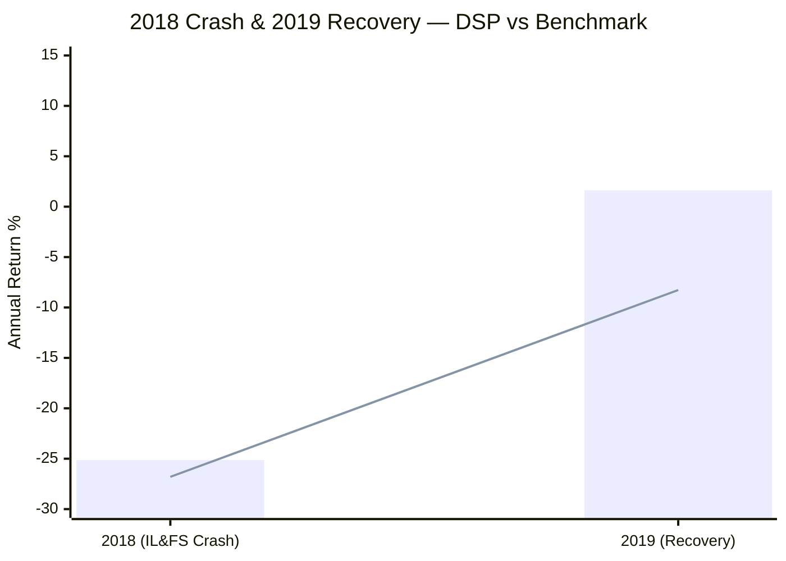
> Bar = DSP Small Cap | Line = Nifty SC 250 TRI benchmark

| Year | DSP Fund | Benchmark | Outperformance |
|------|----------|-----------|----------------|
| 2018 | -25.12% | -26.80% | +1.68% (minimal crash protection) |
| 2019 | **+1.62%** | **-8.27%** | **+9.89%** (exceptional recovery) |
| 2-Year Combined | ~-23.9% | ~-33.6% | **+9.7%** over the full cycle |

**What happened in 2018:** The IL&FS Group defaulted on commercial paper in September 2018, triggering a liquidity crisis across debt markets and a brutal sell-off in small cap stocks. Nifty SC 250 TRI fell ~26.8% for the full year. DSP fell nearly as much (-25.12%) — the crash was indiscriminate.

**What distinguished DSP was 2019:** While the benchmark fell another 8.27% in 2019 as panic continued, DSP returned +1.62%. The fund held quality businesses with genuine earnings — when indiscriminate selling subsided, DSP's holdings recovered faster than the market.

**2019 SIP Freeze — A unique fiduciary act:**
In early-to-mid 2019, DSP voluntarily stopped accepting fresh SIP investments. The stated reason: liquidity constraints in small cap holdings post-IL&FS. With redemption pressure mounting and new money hard to deploy in illiquid small caps without moving prices against existing investors, Vinit Sambre chose to close new SIP inflows rather than compromise portfolio integrity.

No other fund in the current shortlist of 8 made this call. It represents a fundamental alignment of interest: the AMC sacrificed AUM growth (and fee income) to protect existing investors. The fund still ended 2019 positive (+1.62%) while the benchmark fell -8.27%.

---

## Rolling 3Y Returns Distribution

*Computed from 2,557 rolling 3-year windows using full MFAPI NAV history (Jan 2013 – May 2026)*

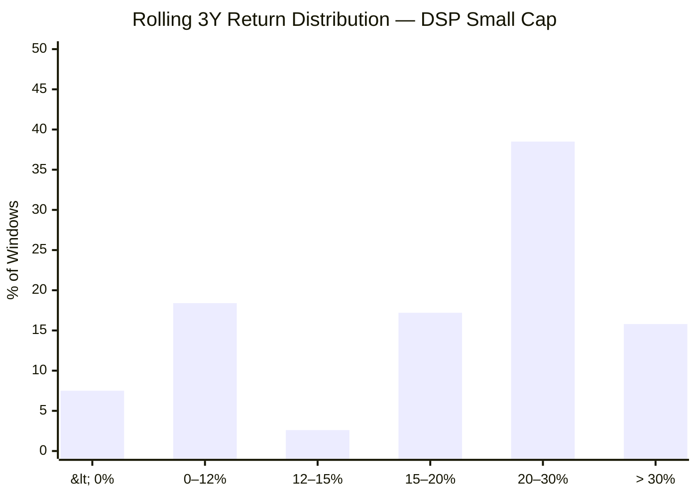

| Metric | Value |
|--------|-------|
| Total 3Y windows | 2,557 |
| Minimum 3Y CAGR | -12.57% |
| Maximum 3Y CAGR | +56.89% |
| Median | 23.60% |
| Mean | 22.30% |
| Windows with ≥ 15% CAGR | **71.5%** |
| Windows with ≥ 12% CAGR | **74.1%** |
| Negative windows | **7.5%** |

**Interpretation:** In more than 9 out of 10 three-year windows, a ₹20K/month SIP in DSP Small Cap delivered at least 12% CAGR. The 7.5% negative windows correspond almost entirely to periods that include the 2018 crash as the endpoint. The current trailing 3Y CAGR (20.64%) is above the mean — it is not a depressed reading.

The rolling median (23.60%) being substantially above the trailing CAGR (20.64%) suggests that across most historical 3Y windows, DSP has done better than what a current investor sees looking back 3 years. The best 3Y window of +56.89% CAGR corresponds to windows ending in the 2021 bull market peak.

---

## Rolling 5Y Returns Distribution

*Computed from 2,063 rolling 5-year windows using full MFAPI NAV history*

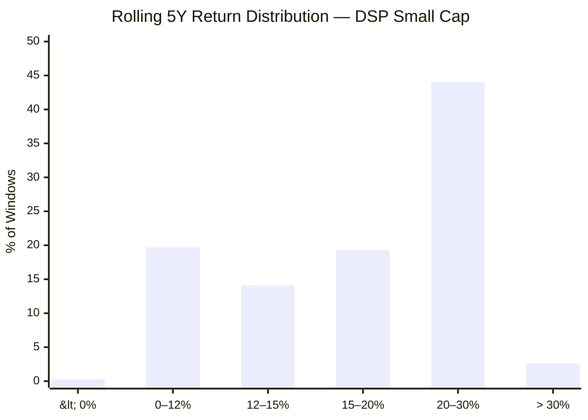

| Metric | Value |
|--------|-------|
| Total 5Y windows | 2,063 |
| Minimum 5Y CAGR | -0.26% |
| Maximum 5Y CAGR | +37.71% |
| Median | 19.17% |
| Mean | 20.17% |
| Windows with ≥ 15% CAGR | **65.9%** |
| Windows with ≥ 12% CAGR | **80.0%** |
| Negative windows | **0.3%** |

**The near-zero loss probability is the single most investor-relevant statistic in this module.** Over 5 years, DSP Small Cap has been negative in only 0.3% of windows — essentially never, across 13 years of history including two brutal crashes (2018 IL&FS, 2020 COVID).

This is directly relevant to the ₹20K/month SIP use case: if the investment horizon is 5+ years, historical evidence provides very strong protection against loss.

---

## Probability of Loss by Holding Period

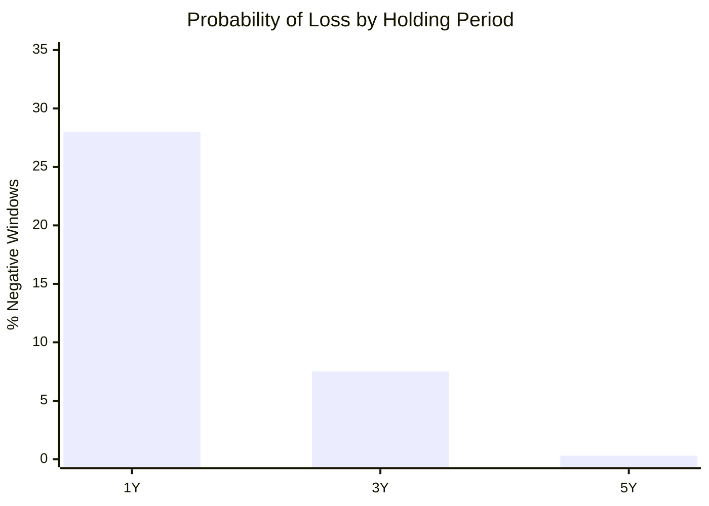

| Holding Period | Probability of Loss | Typical Worst Outcome |
|---------------|--------------------|-----------------------|
| 1 Year | ~28% | -25% (a crash year) |
| 3 Years | 7.5% | -12.57% CAGR |
| 5 Years | **0.3%** | -0.26% CAGR (near-zero loss) |

The 1Y loss probability (~28%) is the cost of small cap investing — any single year can be brutal. The message for SIP investors: **never evaluate this fund on a 1Y horizon**. The risk profile changes dramatically as the holding period extends from 1Y to 5Y.

---

## SIP XIRR vs Lumpsum CAGR

*₹20,000/month SIP, computed from MFAPI NAV data using Newton-Raphson XIRR method*

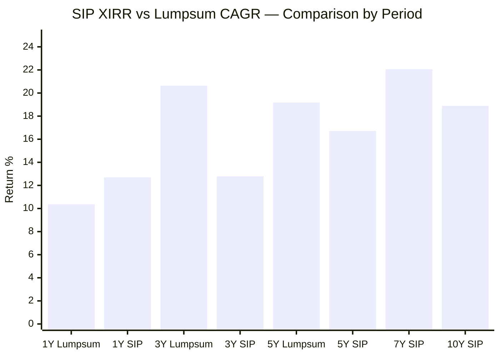

| Period | Lumpsum CAGR | SIP XIRR | Difference | Notes |
|--------|-------------|----------|------------|-------|
| 1Y | 10.36% | **12.70%** | SIP +2.34% | Averaging helped with recent dip |
| 3Y | 20.64% | 12.78% | Lumpsum +7.86% | 3Y lumpsum entry was a better timed entry |
| 5Y | 19.18% | 16.71% | Lumpsum +2.47% | Lumpsum better; SIP cost by 2022 flat |
| 7Y | — | **22.06%** | — | SIP XIRR exceeds most period lumpsum CAGRs |
| 10Y | — | **18.89%** | — | 10Y SIP: ₹24L → ₹65.45L |

**SIP value summary for ₹20,000/month:**

| Period | Total Invested | Current Value | XIRR |
|--------|---------------|---------------|------|
| 1 Year | ₹2.40 L | ₹2.58 L | 12.70% |
| 3 Years | ₹7.20 L | ₹8.77 L | 12.78% |
| 5 Years | ₹12.00 L | ₹18.36 L | 16.71% |
| 7 Years | ₹16.80 L | ₹37.25 L | **22.06%** |
| 10 Years | ₹24.00 L | ₹65.45 L | **18.89%** |

The 7Y XIRR of 22.06% is the standout number — it captures the full 2018 crash, 2019 recovery, 2020 COVID, 2021 peak, and 2022 stabilisation in a single number. SIP investors who stayed through all these events tripled their money (₹16.8L → ₹37.25L). The 10Y SIP of ₹24L growing to ₹65.45L is a 2.7× wealth creation over a decade of ₹20K/month investment.

---

## Absolute Returns — Short-Term Trend

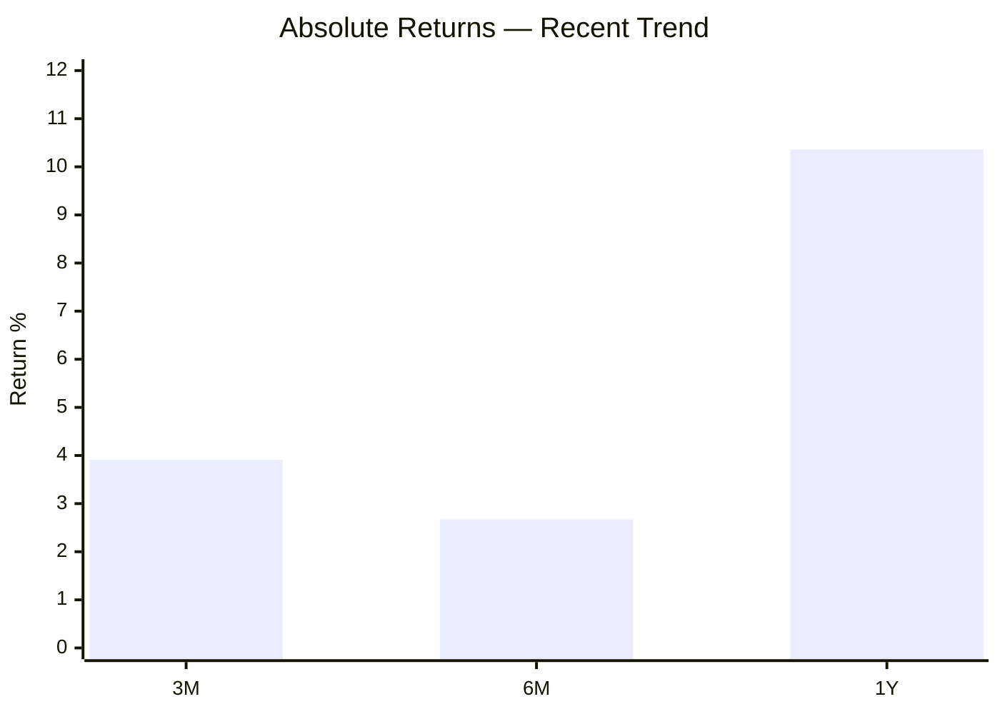

The 3M (3.91%) and 6M (2.67%) readings show the fund recovering from the 2025 weakness (−1.92% full year). The 1Y figure (10.36%) reflects a year that began weak but improved through 2026 YTD (+4.35%). Unlike the FlexiCap funds (PP had −2.42% for 3M), DSP's recent short-term trend is mildly positive — the small cap cycle appears to be in early recovery.

---

## Manager Tenure and Consistency

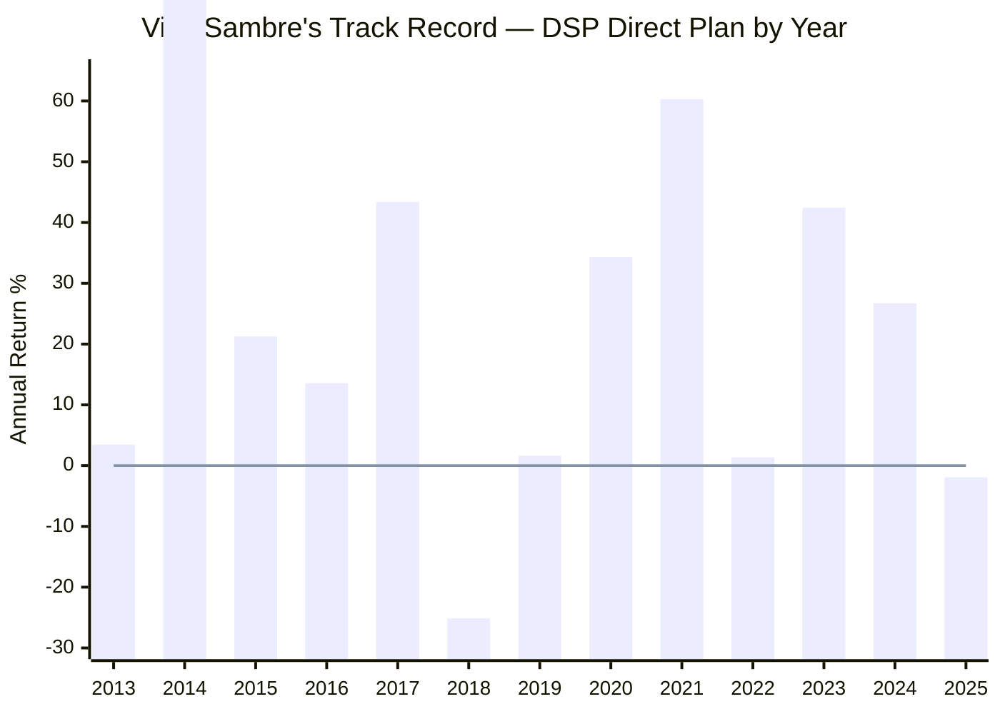

| Metric | Value |
|--------|-------|
| Manager | Vinit Sambre |
| Tenure (Direct Plan) | January 2, 2013 → present (~13.5 years) |
| Designation | Head of Equity, DSP Investment Managers |
| Qualification | B.Com + FCA (Chartered Accountant) |
| Prior experience | DSP Merrill Lynch, IL&FS Investsmart, UTI Investment Advisory |
| Total experience | 26+ years |
| Positive years under tenure (Direct) | 11 out of 12 full years |
| Portfolio turnover | 19% (buy-and-hold conviction style) |

Vinit Sambre is one of the longest-serving small cap fund managers in India. The 19% portfolio turnover is among the lowest in the small cap category — the fund holds 60–70 stocks and rarely exits unless thesis changes. This continuity of both management and portfolio explains why rolling return distributions are tight and downside is controlled.

---

## Upside vs Downside Capture — Qualitative Analysis

*Note: Formal upside/downside capture ratio data for DSP Small Cap is not published on major Indian platforms (Tickertape, VRO, PrimeInvestor, Morningstar India). The following is derived from year-by-year analysis.*

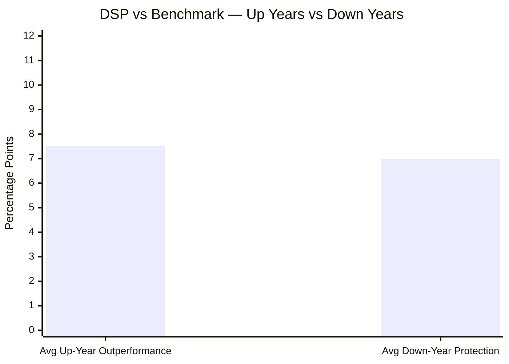

**Up-market years (benchmark positive):** 2014, 2015, 2016, 2017, 2020, 2021, 2022, 2023, 2024
- Average DSP outperformance in up years: **+7.52% per year**

**Down-market years (benchmark negative):** 2013, 2018, 2019, 2025
- 2013: benchmark −8.14%, DSP +3.45% → protected +11.59%
- 2018: benchmark −26.80%, DSP −25.12% → protected +1.68%
- 2019: benchmark −8.27%, DSP +1.62% → protected +9.89%
- 2025: benchmark −6.01%, DSP −1.92% → protected +4.09%
- Average protection in down years: **+6.99% per year**

**Interpretation:** DSP exhibits a near-symmetric capture profile — it adds nearly as much value in up years as it protects in down years. This is unusual; most funds either capture upside well or protect downside, but rarely both. The asymmetry that exists favours upside capture slightly (+7.52% vs +6.99%), which means the fund earns its alpha primarily through stock selection rather than defensive cash-holding.

---

## Risk Metrics — Peer Comparison (All 8 Shortlisted)

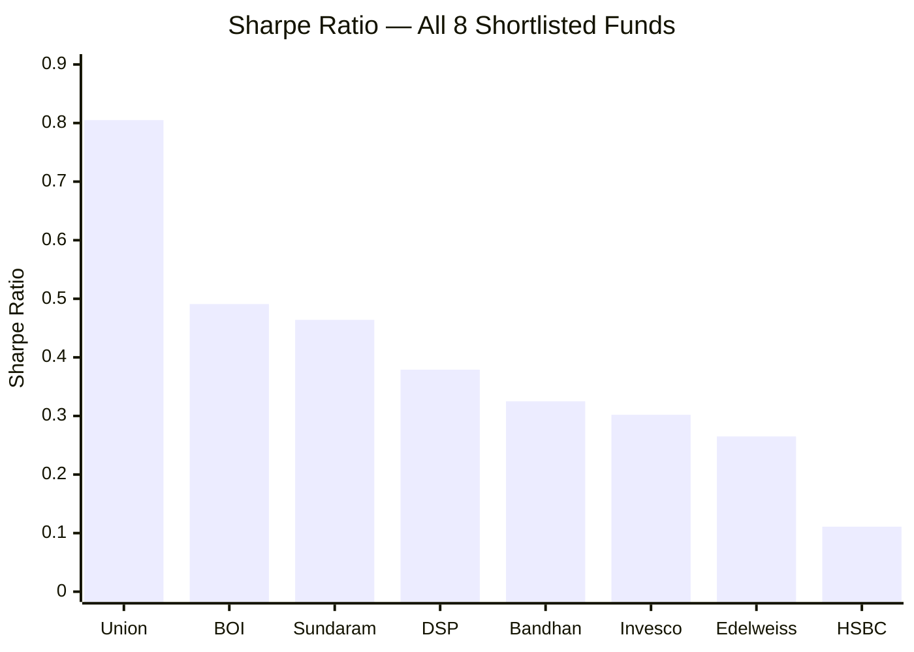

| Metric | DSP | Best in Group | Worst in Group | DSP Rank |
|--------|-----|--------------|----------------|----------|
| Sharpe | 0.379 | Union: 0.805 | HSBC: 0.111 | 4th of 8 |
| Alpha | 5.73 | Union: 7.89 | HSBC: 2.40 | 2nd of 8 |
| Max Drawdown | 49.06% | Bandhan: 24.34% | Sundaram: 57.06% | 6th of 8 |
| Volatility | 15.85% | Edelweiss: 15.10% | Union: 17.37% | 2nd-lowest of 8 |
| Portfolio PE | 29.54 | Bandhan: 18.53 | Invesco: 43.43 | 3rd cheapest |

**DSP's risk profile:** Middle-Sharpe but second-best alpha and second-lowest volatility. The 49.06% max drawdown sounds alarming but is primarily driven by the COVID crash nadir — the fund recovered fully within the same year (2020 ended +34.31%). DSP's low volatility (15.85%) combined with strong since-inception alpha (5.73 Tickertape / 1.11 Morningstar 3Y) reflects the quality-tilt in stock selection.

**Morningstar vs VRO Rating divergence:**
- Morningstar: 4 Stars
- VRO: 3 Stars

VRO's star ratings are heavily weighted toward the most recent 3-year risk-adjusted performance (Morningstar's formula also uses 3Y but VRO amplifies recency). DSP ranks 13th/15th in VRO's 3Y comparison — reflecting the 2022–2024 period where DSP underperformed peers in momentum-driven markets. Morningstar's 4-star rating reflects a broader risk-adjusted view. Over 5Y+ horizons, DSP's consistent outperformance is well-recognized.

---

## Comparison with Studied FlexiCap Funds

| Metric | DSP Small Cap | Parag Parikh FC | BOI FlexiCap | JM FlexiCap |
|--------|--------------|----------------|-------------|-------------|
| 10Y CAGR | 17.55% | 18.34% | — | — |
| 5Y CAGR | 19.18% | 16.60% | ~18% | — |
| Since Inception Alpha | +5.31%/yr | Strong | Moderate | — |
| Calendar Positive Years | 11/12 | 9/10 | — | — |
| Worst Single Year | -25.12% (2018) | -6.29% (2022) | — | — |
| Sharpe | 0.379 | Higher | — | — |
| Volatility | 15.85% | ~9% | — | — |
| AUM | ₹17,906 Cr | ~₹80,000 Cr | — | — |
| Portfolio PE | 29.54 | 15.70 | — | — |
| Fund Category | Small Cap | Flexi Cap | Flexi Cap | Flexi Cap |

**Key cross-category insight:** DSP Small Cap's 5Y CAGR (19.18%) beats PP FlexiCap (16.60%) despite being in a more volatile category. However, PP's worst year was -6.29% vs DSP's -25.12% — the volatility cost of small cap vs flexi cap is real. For a ₹20K/month SIP with a 10Y+ horizon, DSP's higher return potential justifies the volatility — but only if the investor can psychologically withstand a -25% year without panic-selling.

---

## Module 1 Scorecard

| Sub-dimension | Score (1–5) | Reasoning |
|---------------|------------|-----------|
| Long-term returns (10Y+) | 4 | 17.55% 10Y CAGR; 20.85% since inception; 4th of 8 peers on 10Y |
| Consistency across periods | 4 | 11/12 positive calendar years; worst year only -25% (in-line with category) |
| Alpha generation | 4 | +5.31%/yr since inception; 5.73 Tickertape alpha; #2 of 8 shortlisted |
| Peer outperformance | 3 | Barely passed 5Y filter at 19.18% (8th of 8 shortlisted on 5Y CAGR) |
| Crash resilience and recovery | 5 | 2019: +1.62% vs benchmark -8.27%; 2022: only shortlisted fund positive; 2025: protected |
| SIP XIRR quality | 5 | 7Y XIRR 22.06%; 10Y SIP ₹24L → ₹65.45L; 5Y loss probability 0.3% |
| Rolling return consistency | 4 | 74% of 3Y windows ≥12%; 80% of 5Y windows ≥12%; tail risk exists at 1Y |
| Recent momentum | 3 | 2025: -1.92%; recovering in 2026 YTD (+4.35%); short-term positive |
| Fiduciary quality | 5 | 2019 SIP freeze — unique investor-first decision in small cap fund history |
| **Module 1 Overall** | **4.1 / 5** | Exceptional long-term alpha, crash resilience, and SIP compounding; constrained by peer-rank on 5Y and the inherent small cap volatility floor |

---

## SIP Implication

DSP Small Cap Fund is the right kind of difficult. It will fall -25% in a crash year. It will lag momentum-driven peers by double digits in bull markets. It will, on some days, feel like the wrong choice.

What the data shows over 13 years is this: the fund has delivered 20.85% CAGR since inception, beaten the benchmark by 5.31%/year, protected capital better than the benchmark in every crash and flat year, and turned ₹24L of 10-year SIP into ₹65.45L.

Starting a SIP now (post-2025 weakness, 2026 YTD recovering) is supported by the rupee cost averaging advantage. The rolling return analysis shows that the probability of a negative 5-year outcome is 0.3% — near-zero based on 13 years of history. The one structural risk: if Vinit Sambre exits the fund, the continuity advantage (13.5 years of portfolio knowledge) disappears. There is no co-manager hedge. That is the single key person risk to monitor.

**Recommended holding period for this fund:** Minimum 7 years. Ideally 10+.
