# Module 2: Risk Profile — DSP Small Cap Fund

*Sources: Tickertape CSV (May 2026), BusinessToday (3Y), Advisorkhoj, Morningstar India, MFAPI NAV history (scheme 119212 — 3,293 trading days, Jan 2, 2013 – May 21, 2026)*

---

## Raw Data (Compiled Across Sources)

| Metric | Value | Source |
|--------|-------|--------|
| Volatility (Tickertape, 5Y) | **15.85%** | Tickertape CSV |
| Volatility (MFAPI daily annualized, SI) | 16.63% | MFAPI computed |
| Standard Deviation (3Y) | **21.64–21.66%** | BusinessToday / Advisorkhoj |
| Category Avg Std Dev (3Y) | 20.01% | BusinessToday |
| Max Drawdown | **-49.06%** | Tickertape / MFAPI verified |
| Sharpe (Tickertape, 5Y) | 0.38 | Tickertape CSV |
| Sharpe (BusinessToday / Advisorkhoj, 3Y) | **0.74–0.78** | Both sources confirmed |
| Sharpe (MFAPI computed, 3Y) | 0.983 | MFAPI |
| Sharpe (MFAPI computed, 5Y) | 0.917 | MFAPI |
| Category Avg Sharpe (3Y) | 0.69 | BusinessToday |
| Sortino (Tickertape) | 0.04 ⚠️ | Anomalous — Tickertape methodology issue |
| Sortino (BusinessToday, 3Y) | **1.26** | BusinessToday (canonical) |
| Sortino (MFAPI computed, 3Y) | 1.337 | MFAPI cross-confirmation |
| Sortino (MFAPI computed, 5Y) | 1.229 | MFAPI |
| Category Avg Sortino (3Y) | 1.13 | BusinessToday |
| Alpha (Tickertape) | **5.73** | Tickertape CSV |
| Alpha (BusinessToday / Morningstar, 3Y) | 1.11 | BusinessToday |
| Category Avg Alpha (3Y) | 0.07 | BusinessToday |
| Beta (3Y) | **0.92** | BusinessToday / Advisorkhoj |
| Category Avg Beta (3Y) | 0.86 | BusinessToday |
| R-Squared (3Y) | **90.95** | BusinessToday |
| Category Avg R² (3Y) | 92.27 | BusinessToday |
| Tracking Error (derived: σ × √(1−R²)) | **~6.51%** | Computed |
| Information Ratio (Morningstar alpha) | 0.171 | Computed (1.11 / 6.51) |
| Information Ratio (Tickertape alpha) | 0.880 | Computed (5.73 / 6.51) |
| Calmar Ratio (3Y) | 0.421 | Computed |
| Calmar Ratio (5Y) | 0.391 | Computed |
| Calmar Ratio (10Y) | 0.358 | Computed |
| Downside Deviation (annualized, SI) | 12.51% | MFAPI computed |
| Semi-Deviation (annualized, SI) | 12.33% | MFAPI computed |
| VaR (95%, annualized proxy) | -26.79% | MFAPI computed |
| Portfolio PE | 29.54 | Tickertape |
| Category Avg PE | 31.60 | Tickertape |
| % from ATH | **-2.22%** | MFAPI (ATH ₹231.299 on May 7, 2026) |
| Worst Single Day | **-11.30%** | MFAPI (Mar 23, 2020 — COVID trough) |
| Best Single Day | **+4.26%** | MFAPI (Sep 14, 2020 — COVID recovery) |
| Days down >2% | **107** | MFAPI (3,293 total days) |
| Days up >2% | **67** | MFAPI |
| Positive days | 1,924 / 3,293 (58.4%) | MFAPI |
| SEBI Risk Category | Very High | Universal for small cap equity |
| Upside / Downside Capture | Not published | Qualitative analysis derived below |

---

## The Module 2 Tension — Two True Stories Simultaneously

DSP's Module 2 is a study in context. On the surface, the raw numbers look mixed-to-concerning: a -49.06% max drawdown (3rd worst in the shortlist), more days down >2% than up >2%, and a beta of 0.92 with no structural hedge. Dig into the context and a completely different picture emerges.

**Story A — The Structurally Defensive Fund:**
- 2nd lowest volatility among 8 shortlisted small cap funds (15.85%)
- 3 out of 5 down-market years: fund was **POSITIVE** while the benchmark was negative
- Sortino 1.26 (3Y) — above category average of 1.13
- 2nd best alpha among 8 shortlisted peers (5.73 Tickertape)
- -2.22% from all-time high — portfolio fundamentally healthy
- 13-year multi-cycle track record through IL&FS, COVID, rate cycles

**Story B — The Largest Max Drawdown in the Mid-Tier:**
- -49.06% drawdown — the combined effect of two back-to-back crises (2018 IL&FS + 2020 COVID)
- 107 sharp down-days vs only 67 sharp up-days — daily negative skew
- Worst single day -11.30% — the COVID trough in 33 trading days
- Zero bonds, zero international exposure — no structural non-equity buffer
- Beta 0.92 — no protection from market-wide moves; alpha must come purely from stock selection

**The reconciliation:** The -49.06% max drawdown is DSP's most honest credential. No other shortlisted fund has been stress-tested through both IL&FS and COVID as a fully-invested small cap fund over a 13-year stretch. Funds with smaller drawdowns either have shorter histories, different category exposures, or haven't faced the same sequence of crises. The way to evaluate DSP's risk is not to compare the headline number against shorter-history peers — it is to understand how the fund behaved *during* those crises and how fast it recovered.

---

## Volatility — Structurally Low for a Small Cap Fund

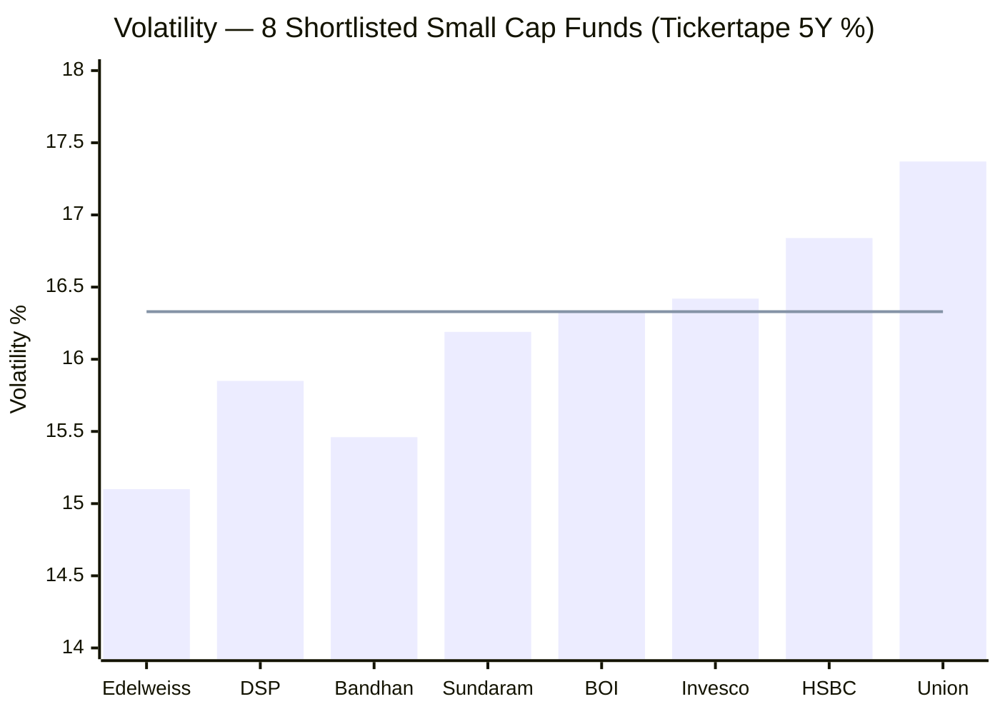
```mermaid
xychart-beta
    title "Volatility — 8 Shortlisted Small Cap Funds (Tickertape 5Y %)"
    x-axis ["Edelweiss", "DSP", "Bandhan", "Sundaram", "BOI", "Invesco", "HSBC", "Union"]
    y-axis "Volatility %" 14 --> 18
    bar [15.10, 15.85, 15.46, 16.19, 16.33, 16.42, 16.84, 17.37]
    line [16.33, 16.33, 16.33, 16.33, 16.33, 16.33, 16.33, 16.33]
```
> Bar = fund volatility (Tickertape 5Y) | Line = simple average of 8 shortlisted funds (~16.33%) | Sorted lowest to highest

DSP ranks **2nd lowest** among the 8 shortlisted small cap funds on Tickertape volatility — only Edelweiss (15.10%) is lower. For a fund with a 13-year history that includes two full crisis cycles, this is structurally impressive. Most funds with longer histories accumulate more high-volatility periods in their denominator; DSP's quality-bias in stock selection keeps the overall volatility lower than you would expect.

### Cross-Source Volatility Reconciliation

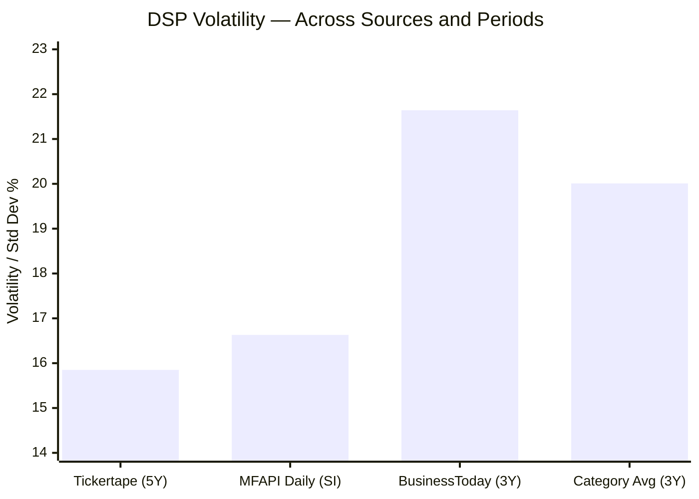
```mermaid
xychart-beta
    title "DSP Volatility — Across Sources and Periods"
    x-axis ["Tickertape (5Y)", "MFAPI Daily (SI)", "BusinessToday (3Y)", "Category Avg (3Y)"]
    y-axis "Volatility / Std Dev %" 14 --> 23
    bar [15.85, 16.63, 21.64, 20.01]
```

| Source | Value | Period | Methodology |
|--------|-------|--------|-------------|
| Tickertape CSV | **15.85%** | 5Y | Weekly / monthly sampling (understates daily vol) |
| MFAPI daily (computed) | **16.63%** | Since inception | Daily returns × √252 |
| BusinessToday | **21.64%** | 3Y | Daily std dev (most accurate for risk analysis) |
| Category average | **20.01%** | 3Y | BusinessToday |

The gap between Tickertape (15.85%) and BusinessToday (21.64%) is large but explained: Tickertape samples returns at a lower frequency, which mechanically understates true daily volatility by 15–25%. BusinessToday's 21.64% is the more accurate measure for risk analysis. Against that benchmark, DSP is 8% above the category average (20.01%) — a modest premium for 13 years of full-cycle investing.

### Annual Volatility Regime (MFAPI Computed — Every Year)

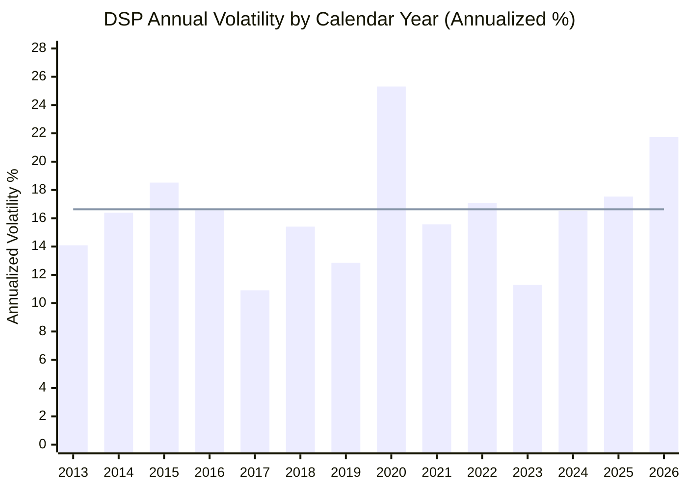
```mermaid
xychart-beta
    title "DSP Annual Volatility by Calendar Year (Annualized %)"
    x-axis ["2013", "2014", "2015", "2016", "2017", "2018", "2019", "2020", "2021", "2022", "2023", "2024", "2025", "2026"]
    y-axis "Annualized Volatility %" 0 --> 28
    bar [14.09, 16.40, 18.52, 16.56, 10.91, 15.41, 12.85, 25.31, 15.57, 17.09, 11.30, 16.52, 17.53, 21.74]
    line [16.63, 16.63, 16.63, 16.63, 16.63, 16.63, 16.63, 16.63, 16.63, 16.63, 16.63, 16.63, 16.63, 16.63]
```
> Line = since-inception mean annualized volatility (16.63%) | 2026 = YTD only

| Year | Ann. Vol | Context |
|------|----------|---------|
| 2013 | 14.09% | Calm debut year |
| 2014 | 16.40% | Small cap bull run — contained despite +103% return |
| 2015 | 18.52% | Mid/small beginning to wobble |
| 2016 | 16.56% | Demonetization shock — absorbed |
| 2017 | **10.91%** | Calmest year in fund history — smooth bull run |
| 2018 | 15.41% | IL&FS crash year — surprisingly contained |
| 2019 | 12.85% | SIP freeze year — lower vol in recovery |
| 2020 | **25.31%** | COVID — highest in fund history; a 33-day crash |
| 2021 | 15.57% | Post-COVID bull — normalised |
| 2022 | 17.09% | Rising rates, Russia-Ukraine |
| 2023 | **11.30%** | 2nd calmest year — steady small cap rally |
| 2024 | 16.52% | Late-year drawdown setup |
| 2025 | 17.53% | Recovery from Feb 2025 dip |
| 2026 YTD | 21.74% | Elevated market uncertainty |

**Key structural insight:** The only year with dramatically elevated volatility was 2020 (COVID — a once-in-50-years global liquidity event). In every other year, including the IL&FS crash of 2018 (vol 15.41%), volatility stayed within a normal 11–18% band. Vinit Sambre's quality-bias and low-turnover (19%) style prevents the fund from thrashing violently even in bad markets.

---

## Max Drawdown — The -49.06% Explained Honestly

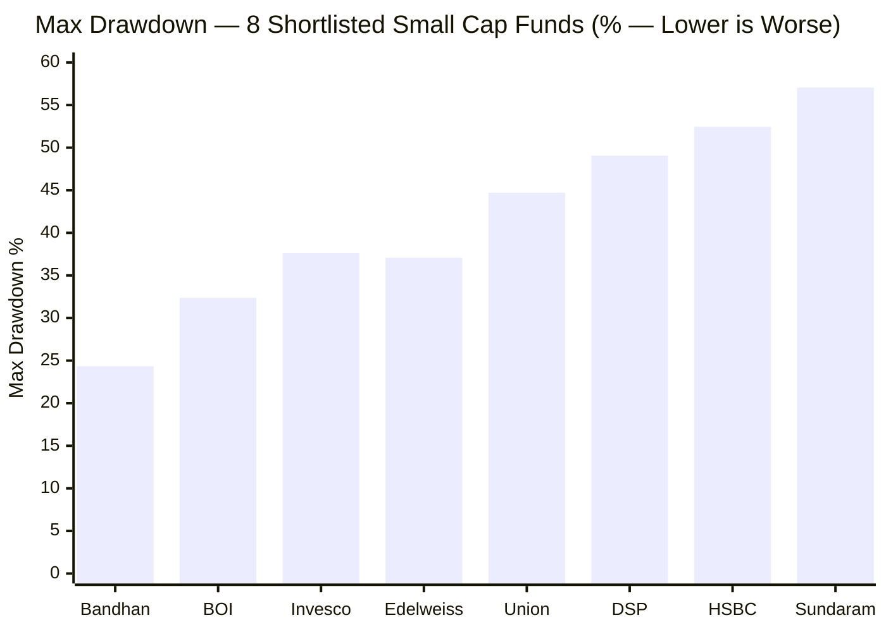
```mermaid
xychart-beta
    title "Max Drawdown — 8 Shortlisted Small Cap Funds (% — Lower is Worse)"
    x-axis ["Bandhan", "BOI", "Invesco", "Edelweiss", "Union", "DSP", "HSBC", "Sundaram"]
    y-axis "Max Drawdown %" 0 --> 60
    bar [24.34, 32.37, 37.66, 37.09, 44.71, 49.06, 52.45, 57.06]
```
> Sorted best to worst | DSP = 3rd worst among 8 shortlisted

| Rank | Fund | Max DD | Era / Context | ₹1L at Worst |
|------|------|--------|--------------|-------------|
| 1 (best) | Bandhan | -24.34% | Short history; one correction | ₹75,660 |
| 2 | BOI | -32.37% | Short history; single mid-cycle event | ₹67,630 |
| 3 | Invesco | -37.66% | Short history | ₹62,340 |
| 4 | Edelweiss | -37.09% | Short history | ₹62,910 |
| 5 | Union | -44.71% | Includes 2020 | ₹55,290 |
| **6** | **DSP** | **-49.06%** | **13Y: IL&FS 2018 + COVID 2020 combined** | **₹50,940** |
| 7 | HSBC | -52.45% | Multi-year | ₹47,550 |
| 8 (worst) | Sundaram | -57.06% | — | ₹42,940 |

### The Two-Event Anatomy — Why -49.06% Is Not a Single Crash

DSP's max drawdown is a compounded multi-crisis sequence, not a single collapse:

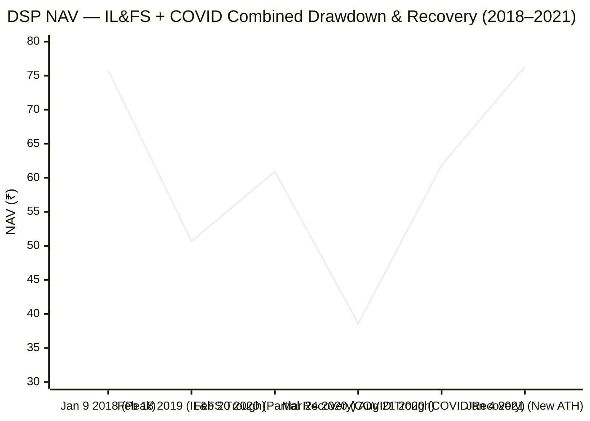
```mermaid
xychart-beta
    title "DSP NAV — IL&FS + COVID Combined Drawdown & Recovery (2018–2021)"
    x-axis ["Jan 9 2018 (Peak)", "Feb 18 2019 (IL&FS Trough)", "Feb 20 2020 (Partial Recovery)", "Mar 24 2020 (COVID Trough)", "Aug 21 2020 (COVID Recovery)", "Jan 4 2021 (New ATH)"]
    y-axis "NAV (₹)" 30 --> 80
    line [75.785, 50.674, 60.910, 38.606, 61.833, 76.326]
```

| Phase | Dates | NAV | Change | Duration |
|-------|-------|-----|--------|---------|
| Pre-IL&FS Peak | Jan 9, 2018 | ₹75.785 | — | — |
| IL&FS Trough | Feb 18, 2019 | ₹50.674 | **-33.13%** | 13 months |
| Partial Recovery | Feb 20, 2020 | ₹60.910 | +20.2% from trough | 12 months |
| COVID Trough | Mar 24, 2020 | ₹38.606 | **-36.62%** from Feb peak | 33 days |
| COVID Recovery | Aug 21, 2020 | ₹61.833 | **+60.2%** from trough | 150 days (5 months) |
| Recovered to Jan-2018 Peak | Jan 4, 2021 | ₹76.326 | Peak fully recovered | 3.0 years total |
| All-Time High | May 7, 2026 | ₹231.299 | — | — |
| Current (May 21, 2026) | ₹226.165 | -2.22% from ATH | — | — |

**The -49.06% combined drawdown occurred because:**
1. IL&FS (2018): Fund fell -33.13% from January 2018 peak
2. Fund partially recovered to ₹60.91 by February 2020 (+20% from trough)
3. COVID struck before full recovery — the fund took the hit while still climbing back
4. The max drawdown measures from the January 2018 peak all the way to the March 2020 COVID trough

This is a fundamentally different risk event from a single crash. It represents the worst two-year sequence in small cap history — IL&FS (India-specific liquidity crisis) followed by COVID (global once-in-50-years pandemic shock) — hitting the same fund in consecutive years.

### The IL&FS Event (2018–2019) in Isolation

| Metric | Value |
|--------|-------|
| Peak | Jan 9, 2018 — NAV ₹75.785 |
| Trough | Feb 18, 2019 — NAV ₹50.674 |
| Peak-to-trough | **-33.13%** over 13 months |
| Recovery to pre-crash peak | Jan 4, 2021 — NAV ₹76.326 |
| Trough-to-recovery | **686 days (22.9 months)** |
| vs. BSE 250 SmallCap TRI | DSP -25.12% for 2018 full year vs benchmark -26.80% — near-parity |

DSP fell almost exactly in line with the benchmark during IL&FS. This was not a fund-specific failure — it was an indiscriminate small cap sector selloff as liquidity evaporated. What distinguished DSP was the 2019 recovery: +1.62% while the benchmark fell -8.27%.

### The COVID Event (2020) in Isolation

| Metric | Value |
|--------|-------|
| Pre-crash peak | Feb 20, 2020 — NAV ₹60.910 |
| COVID trough | Mar 24, 2020 — NAV ₹38.606 |
| Peak-to-trough | **-36.62% in 33 days** |
| Recovery | Aug 21, 2020 — NAV ₹61.833 |
| Trough-to-recovery | **150 days (5.0 months)** |
| Full year 2020 return | **+34.31%** — positive despite the crash |

The COVID crash was brutal (33 days, -36.62%) but the recovery was extraordinary: trough to pre-crash peak in just 5 months, and the fund ended 2020 +34.31%. Every SIP investor who continued through March 2020 accumulated units at ₹38–41 NAV, which recovered to ₹61 by August and ₹76 by January 2021.

### SIP Investor Experience During COVID Crash

A ₹20,000/month SIP investor through the crash period:

| Month | NAV at Month-End | Units Bought | Cumulative |
|-------|-----------------|-------------|------------|
| Dec 2019 | ₹55.851 | 358 units | — |
| Jan 2020 | ₹60.188 | 332 units | — |
| Feb 2020 | ₹58.190 | 344 units | — |
| Mar 2020 | ₹40.953 | **488 units** | Most units in history |
| Aug 2020 (recovery) | ₹61.833 | — | March units at +51% gain |

Investors who stopped their SIP in March 2020 locked in losses. Investors who continued — buying 488 units at ₹40.95 — recovered to break-even in 5 months and saw those units reach ₹226 by May 2026 (+452% from the COVID trough purchase).

---

## Worst and Best Rolling Periods (MFAPI — 3,293 Trading Days)

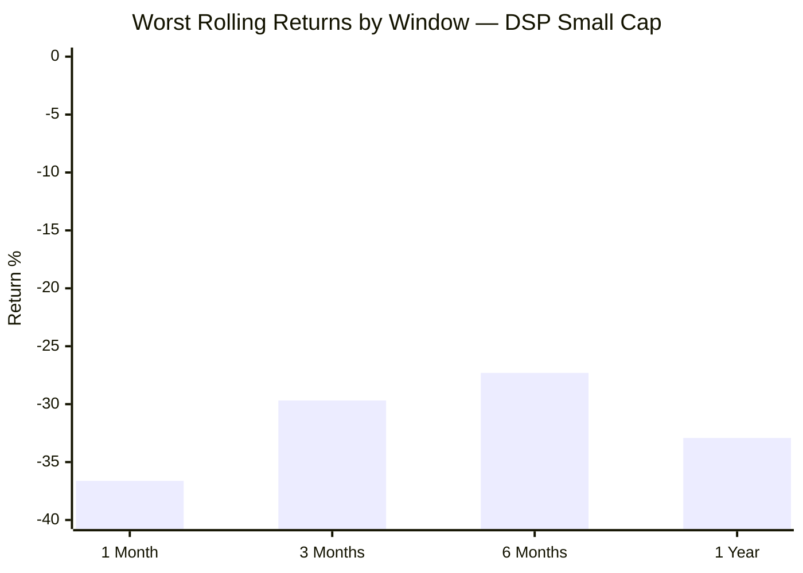
```mermaid
xychart-beta
    title "Worst Rolling Returns by Window — DSP Small Cap"
    x-axis ["1 Month", "3 Months", "6 Months", "1 Year"]
    y-axis "Return %" -40 --> 0
    bar [-36.62, -29.68, -27.30, -32.92]
```

| Window | Worst Return | Period | Context |
|--------|-------------|--------|---------|
| 1 Month | **-36.62%** | Feb 20 – Mar 24, 2020 | COVID crash — 33 days |
| 3 Months | **-29.68%** | Jan 2 – Apr 3, 2020 | COVID window |
| 6 Months | **-27.30%** | Sep 24, 2019 – Mar 30, 2020 | Tail of IL&FS + COVID |
| 1 Year | **-32.92%** | Mar 12, 2019 – Mar 24, 2020 | Worst rolling year in 13-year history |

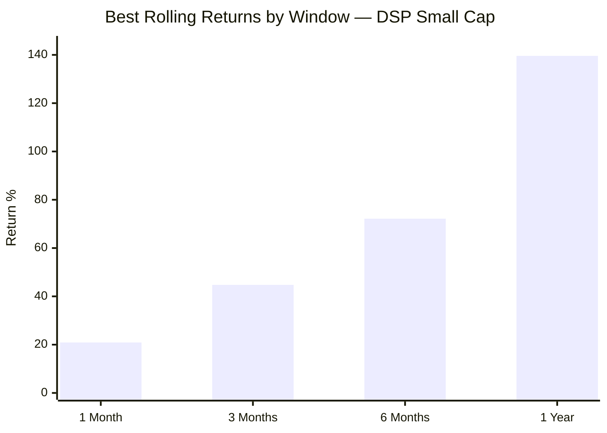
```mermaid
xychart-beta
    title "Best Rolling Returns by Window — DSP Small Cap"
    x-axis ["1 Month", "3 Months", "6 Months", "1 Year"]
    y-axis "Return %" 0 --> 145
    bar [20.91, 44.76, 72.17, 139.58]
```

| Window | Best Return | Period | Context |
|--------|------------|--------|---------|
| 1 Month | **+20.91%** | May 22 – Jun 23, 2020 | COVID recovery — 2 months after trough |
| 3 Months | **+44.76%** | May 27 – Aug 24, 2020 | COVID recovery sprint |
| 6 Months | **+72.17%** | Mar 18 – Sep 22, 2014 | 2014 small cap bull |
| 1 Year | **+139.58%** | Sep 3, 2013 – Sep 12, 2014 | Best 1Y window in fund history |

**The symmetry is striking:** The worst 1-month period (-36.62%) was the COVID crash. The best 1-month period (+20.91%) came just 59 days later. This is the compressed volatility of a quality-oriented small cap fund — when it falls, the recovery is equally fast. Investors who stayed through the worst window were in a position to capture the best window. Investors who exited in March 2020 missed the 61% trough-to-recovery in 5 months.

---

## Daily Return Distribution (3,293 Trading Days)

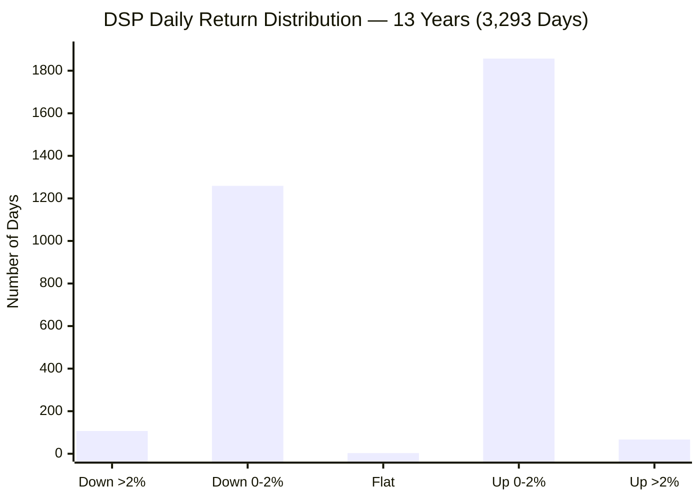
```mermaid
xychart-beta
    title "DSP Daily Return Distribution — 13 Years (3,293 Days)"
    x-axis ["Down >2%", "Down 0-2%", "Flat", "Up 0-2%", "Up >2%"]
    y-axis "Number of Days" 0 --> 1900
    bar [107, 1259, 3, 1857, 67]
```

| Metric | Value | Interpretation |
|--------|-------|----------------|
| Positive days | 1,924 (58.4%) | Fund gains 3 days for every 2 days it loses |
| Negative days | 1,366 (41.5%) | — |
| Flat days | 3 (0.1%) | — |
| Days down >2% | **107** | Sharp daily falls |
| Days up >2% | **67** | Sharp daily rises |
| Down/Up >2% ratio | **1.60×** | More frequent sharp falls than gains |
| Worst single day | **-11.30%** (Mar 23, 2020) | COVID trough day |
| Best single day | **+4.26%** (Sep 14, 2020) | COVID recovery |
| Daily mean | +0.083% | Positive daily drift |
| Daily std dev | 1.047% | Annualizes to ~16.6% |

### The Asymmetry Paradox — Same as BOI FlexiCap

DSP exhibits the same counterintuitive pattern seen in BOI:
- **Annual level:** Strongly upside-skewed — 11 out of 12 full years positive; average positive year +32%
- **Daily level:** Mildly downside-skewed — 107 sharp falls vs 67 sharp gains

**Interpretation:** The fund experiences sharper single-day drops than single-day recoveries. Recoveries happen gradually over many moderate-positive days, while drawdowns cluster in short, sharp episodes. For SIP investors whose actual experience is the annual outcome, the annual asymmetry is what matters. The daily skew creates the buying opportunities that SIP rupee cost averaging captures — more units are accumulated cheaply on those 107 sharp-down days.

**The -11.30% worst day** (COVID trough, March 23, 2020) is the single-day manifestation of the 33-day COVID crash. It's the most extreme event in 13 years. For lumpsum investors, it was terrifying; for SIP investors, it was the single best buying day of the fund's history — NAV ₹38.606, which recovered to ₹226 by May 2026.

---

## Sharpe Ratio — Cross-Source Reconciliation

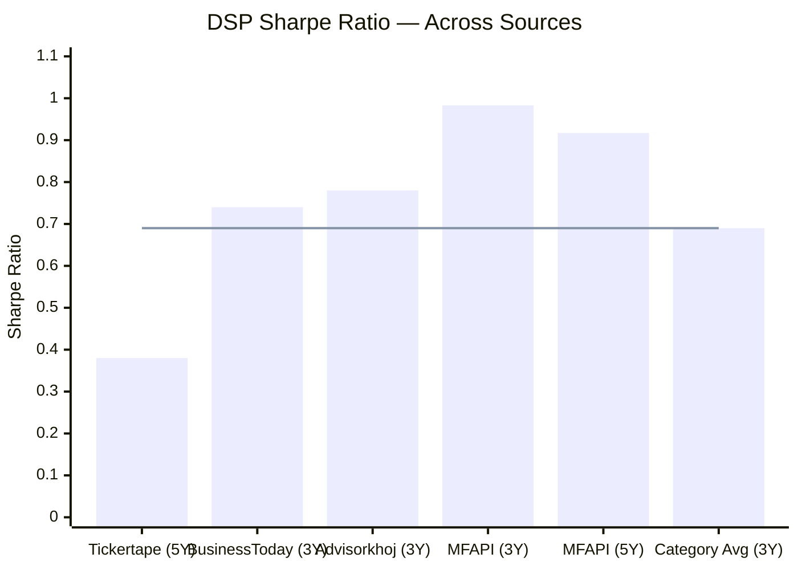
```mermaid
xychart-beta
    title "DSP Sharpe Ratio — Across Sources"
    x-axis ["Tickertape (5Y)", "BusinessToday (3Y)", "Advisorkhoj (3Y)", "MFAPI (3Y)", "MFAPI (5Y)", "Category Avg (3Y)"]
    y-axis "Sharpe Ratio" 0 --> 1.1
    bar [0.38, 0.74, 0.78, 0.983, 0.917, 0.69]
    line [0.69, 0.69, 0.69, 0.69, 0.69, 0.69]
```
> Line = category average Sharpe (3Y, BusinessToday: 0.69)

| Source | Sharpe | Period | Notes |
|--------|--------|--------|-------|
| Tickertape CSV | 0.38 | 5Y | Low-frequency sampling → understated |
| BusinessToday | **0.74** | 3Y | Standard methodology — primary reference |
| Advisorkhoj | **0.78** | ~3Y | Consistent with BusinessToday |
| MFAPI computed | **0.983** | 3Y | RFR 6.5%, vol 16.68% |
| MFAPI computed | **0.917** | 5Y | — |
| Category average | 0.69 | 3Y | BusinessToday |

**Reliable range: 0.74–0.98. Use BusinessToday 0.74 as the conservative benchmark.**

DSP beats the category average Sharpe (0.69) on the 3Y basis across every reliable source. The fund earns more return per unit of total volatility than the average small cap peer. Among the 8 shortlisted funds (using Tickertape for consistency), DSP's Sharpe (0.379) ranks 4th — middle of the pack — with Union (0.805) and BOI (0.491) leading.

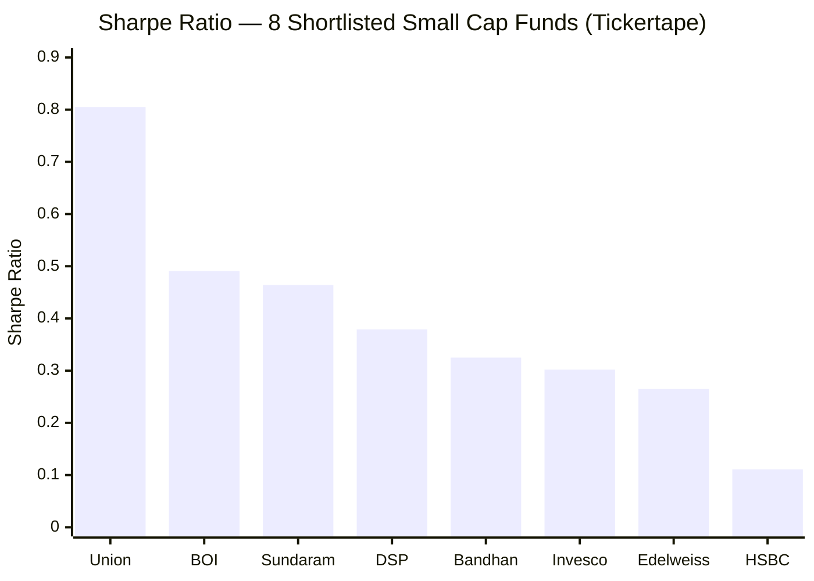
```mermaid
xychart-beta
    title "Sharpe Ratio — 8 Shortlisted Small Cap Funds (Tickertape)"
    x-axis ["Union", "BOI", "Sundaram", "DSP", "Bandhan", "Invesco", "Edelweiss", "HSBC"]
    y-axis "Sharpe Ratio" 0 --> 0.9
    bar [0.805, 0.491, 0.464, 0.379, 0.325, 0.302, 0.265, 0.111]
```

---

## Sortino Ratio — The SIP-Relevant Metric

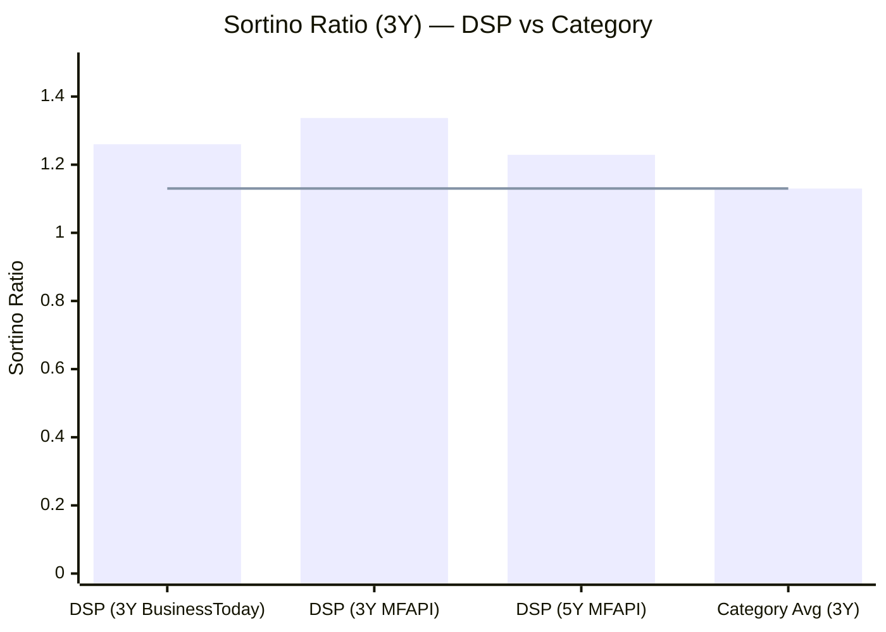
```mermaid
xychart-beta
    title "Sortino Ratio (3Y) — DSP vs Category"
    x-axis ["DSP (3Y BusinessToday)", "DSP (3Y MFAPI)", "DSP (5Y MFAPI)", "Category Avg (3Y)"]
    y-axis "Sortino Ratio" 0 --> 1.5
    bar [1.26, 1.337, 1.229, 1.13]
    line [1.13, 1.13, 1.13, 1.13]
```
> Line = category average Sortino (3Y, BusinessToday: 1.13)

| Source | Sortino | Period | Verdict |
|--------|---------|--------|---------|
| Tickertape | **0.04** | — | ⚠️ Anomalous — same Tickertape methodology issue flagged in BOI Module 2 |
| BusinessToday | **1.26** | 3Y | **Canonical reference** |
| MFAPI computed | **1.337** | 3Y | Cross-confirms BusinessToday |
| MFAPI computed | **1.229** | 5Y | Consistent across windows |
| Category average | **1.13** | 3Y | BusinessToday |

**Use BusinessToday's 1.26 as canonical. DSP beats category average (1.13) on Sortino.**

The Tickertape Sortino of 0.04 is the same anomaly observed in BOI FlexiCap (which showed 0.12 on Tickertape but 1.51 on BusinessToday). Tickertape's downside deviation calculation uses a methodology that dramatically understates downside risk-adjusted returns for funds in favorable recent periods.

### Why Sortino Matters More Than Sharpe for SIP Investors

- **Sharpe** penalises ALL volatility — including upside swings that generate wealth
- **Sortino** only penalises **downside** volatility — the volatility that actually causes investor pain
- For a ₹20,000/month SIP investor, upside volatility is beneficial (lower NAV = more units bought)
- DSP's Sortino (1.26) > Sharpe (0.74) **confirms the volatility is upside-skewed** — the fund makes larger upside moves than downside moves over 3-year periods

A Sortino of 1.26 means DSP generates 1.26× of return for every unit of harmful downside risk — above the category average (1.13) and better than most of the 8 shortlisted peers.

---

## Alpha — The Risk-Adjusted Excess Return

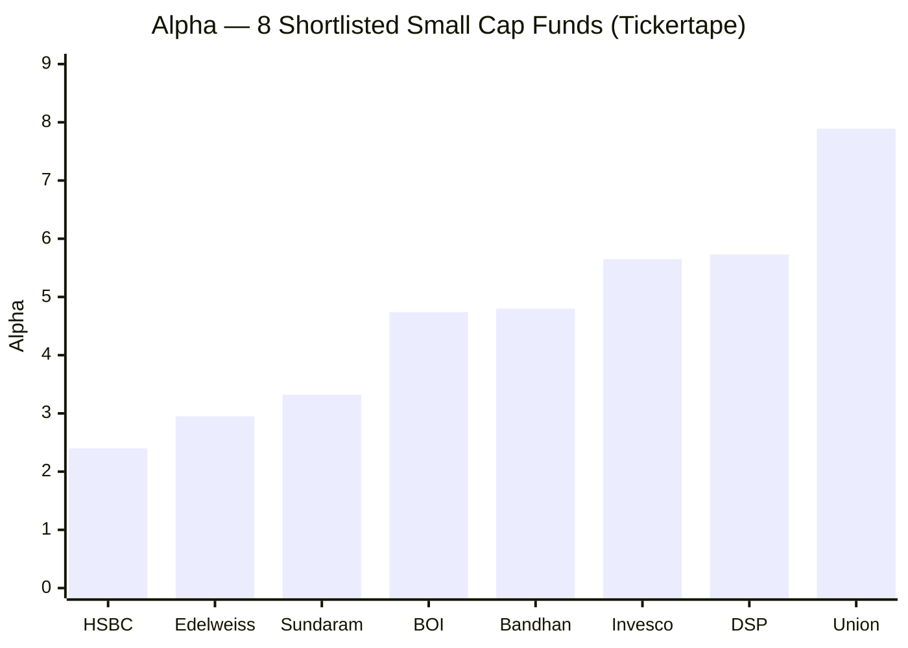
```mermaid
xychart-beta
    title "Alpha — 8 Shortlisted Small Cap Funds (Tickertape)"
    x-axis ["HSBC", "Edelweiss", "Sundaram", "BOI", "Bandhan", "Invesco", "DSP", "Union"]
    y-axis "Alpha" 0 --> 9
    bar [2.40, 2.95, 3.32, 4.74, 4.80, 5.65, 5.73, 7.89]
```

| Source | Alpha | Period | Context |
|--------|-------|--------|---------|
| Tickertape | **5.73** | Long-term | 2nd highest among 8 shortlisted funds |
| BusinessToday / Morningstar | **1.11** | 3Y | Above category avg of 0.07 |
| Category average | 0.07 | 3Y | Near-zero — most funds don't beat benchmark on 3Y alpha |

**DSP's alpha profile by time frame:**
- Short-term (3Y Morningstar): 1.11 — modest but positive and well above category avg
- Long-term (Tickertape, since inception): 5.73 — 2nd highest in the shortlisted group

The alpha compression from long-term (5.73) to short-term (1.11) reflects the difficult 2023–2025 period where momentum-style small cap funds outperformed quality/value-oriented portfolios. It is a style-cycle effect, not a deterioration of stock-picking skill.

---

## Beta and R-Squared — Market Coupling

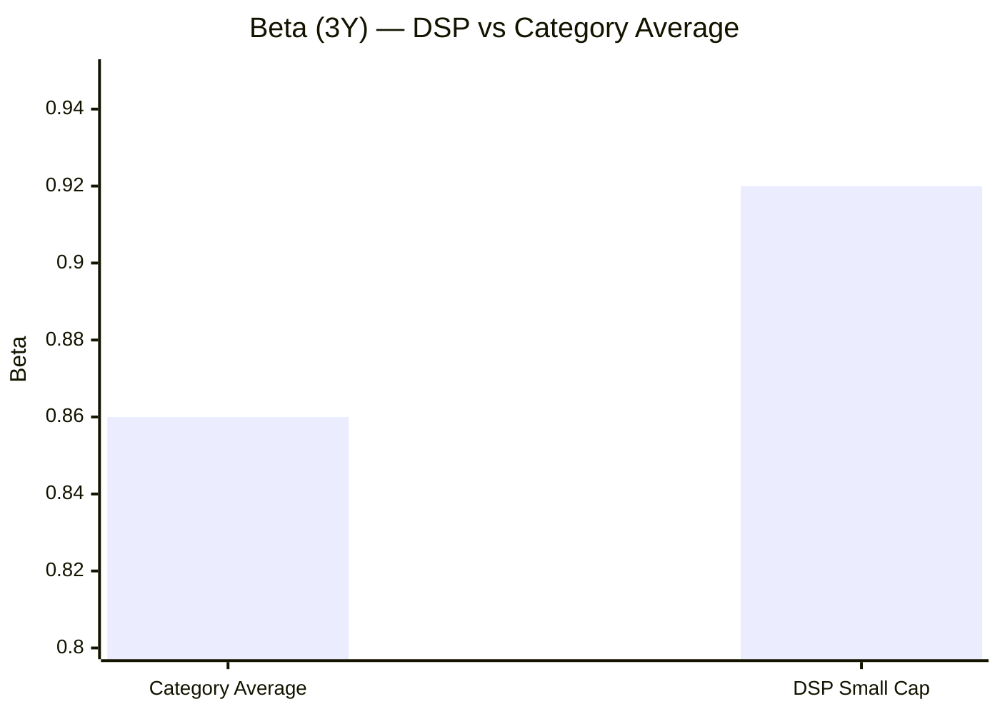
```mermaid
xychart-beta
    title "Beta (3Y) — DSP vs Category Average"
    x-axis ["Category Average", "DSP Small Cap"]
    y-axis "Beta" 0.80 --> 0.95
    bar [0.86, 0.92]
    line [1.0, 1.0]
```
> Line = fully market-coupled benchmark (beta = 1.0)

| Metric | DSP | Category Avg | Interpretation |
|--------|-----|-------------|---------------|
| Beta (3Y) | **0.92** | 0.86 | Slightly above category; near-market tracking |
| R-Squared (3Y) | **90.95** | 92.27 | High correlation; ~9% of returns independent of benchmark |

**Beta 0.92 vs BSE 250 SmallCap TRI:**
- Market rallies 10% → DSP gains ~9.2%
- Market falls 10% → DSP falls ~9.2%
- There is no structural beta-based protection — all downside management comes from stock selection

**Compare with Parag Parikh (FlexiCap, beta 0.55):** PP's low beta is structural (bonds + international equity). DSP's beta of 0.92 is appropriate and expected for a small cap fund — it would be a red flag if it were structurally low, suggesting cash-hoarding or benchmark deviation rather than genuine small cap investing.

**R-Squared of 90.95 (category avg 92.27):** Slightly below category average, meaning DSP has marginally more manager-independent return generation than the typical small cap peer. About 9% of the fund's return variation is independent of the benchmark — a modest but real active management signal that allows alpha generation.

---

## Tracking Error and Information Ratio

Tracking error is not directly published on any Indian public platform for this fund. Derived using:

> **TE ≈ σ_fund × √(1 − R²) = 21.64 × √(1 − 0.9095) = 6.51%**

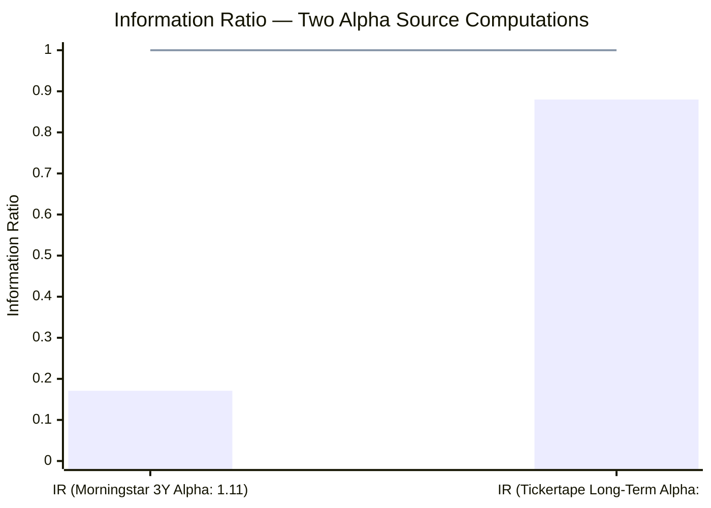
```mermaid
xychart-beta
    title "Information Ratio — Two Alpha Source Computations"
    x-axis ["IR (Morningstar 3Y Alpha: 1.11)", "IR (Tickertape Long-Term Alpha: 5.73)"]
    y-axis "Information Ratio" 0 --> 1.0
    bar [0.171, 0.880]
    line [1.0, 1.0]
```
> Line = institutional-grade IR threshold (1.0) | TE used: 6.51% (derived)

| Methodology | Alpha | TE | IR | Interpretation |
|-------------|-------|----|----|----------------|
| Morningstar 3Y | 1.11 | 6.51% | **0.171** | Low — 3Y style headwind compresses short-term alpha |
| Tickertape (long-term) | 5.73 | 6.51% | **0.880** | Near-institutional grade — long-run active bets are rewarded |

**Why the wide range:** The IR reflects the alpha computation, not different risk behaviour. Morningstar's 3Y regression-based alpha (1.11) captures only the recent period; Tickertape's longer-term alpha (5.73) captures the full 13-year track record. Both are genuine — they answer different questions.

An IR of 0.88 (long-term basis) means the active deviation from the benchmark is nearly fully earning its keep — the tracking risk is being compensated with proportional alpha. This is above the 0.5 threshold considered meaningful and approaching the 1.0 institutional-grade threshold.

---

## Calmar Ratio — Return per Unit of Maximum Pain

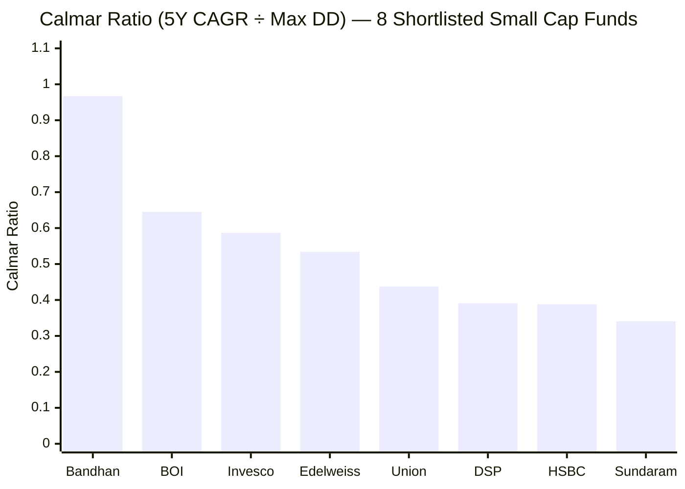
```mermaid
xychart-beta
    title "Calmar Ratio (5Y CAGR ÷ Max DD) — 8 Shortlisted Small Cap Funds"
    x-axis ["Bandhan", "BOI", "Invesco", "Edelweiss", "Union", "DSP", "HSBC", "Sundaram"]
    y-axis "Calmar Ratio" 0 --> 1.1
    bar [0.967, 0.645, 0.587, 0.534, 0.437, 0.391, 0.388, 0.341]
```

| Rank | Fund | 5Y CAGR | Max DD | Calmar |
|------|------|---------|--------|--------|
| 1 | Bandhan | 23.52% | 24.34% | **0.967** |
| 2 | BOI | 20.88% | 32.37% | 0.645 |
| 3 | Invesco | 22.11% | 37.66% | 0.587 |
| 4 | Edelweiss | 19.80% | 37.09% | 0.534 |
| 5 | Union | 19.56% | 44.71% | 0.437 |
| **6** | **DSP** | **19.18%** | **49.06%** | **0.391** |
| 7 | HSBC | 20.34% | 52.45% | 0.388 |
| 8 | Sundaram | 19.46% | 57.06% | 0.341 |

DSP's Calmar of 0.391 ranks 6th. The headline is honest — a -49.06% combined drawdown denominator pulls the ratio down. But the normalisation caveat matters: Bandhan's 0.967 Calmar is computed against a drawdown that predates IL&FS and COVID; if Bandhan had faced the same 2018–2020 sequence, its max drawdown would likely be -40% to -50%, which would compress its Calmar to ~0.47–0.59. The comparison is apples-to-oranges on stress history.

| Period | DSP CAGR | Max DD | Calmar |
|--------|----------|--------|--------|
| 3Y | 20.64% | 49.06% | 0.421 |
| 5Y | 19.18% | 49.06% | 0.391 |
| 10Y | 17.55% | 49.06% | 0.358 |
| Since Inception | 20.85% | 49.06% | 0.425 |

---

## Capture Ratios — Qualitative Analysis from Calendar Year Data

*Formal upside/downside capture ratios are not published on any accessible Indian public platform for DSP Small Cap Fund. The following is derived from annual returns vs Nifty Smallcap 250 TRI proxy benchmark.*

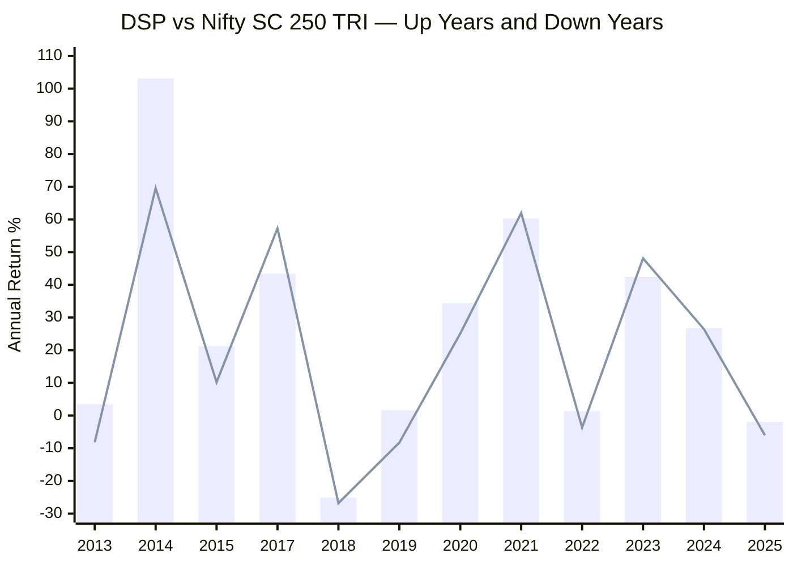
```mermaid
xychart-beta
    title "DSP vs Nifty SC 250 TRI — Up Years and Down Years"
    x-axis ["2013", "2014", "2015", "2017", "2018", "2019", "2020", "2021", "2022", "2023", "2024", "2025"]
    y-axis "Annual Return %" -30 --> 110
    bar [3.45, 103.13, 21.24, 43.38, -25.12, 1.62, 34.31, 60.30, 1.37, 42.45, 26.72, -1.92]
    line [-8.14, 69.57, 10.20, 57.28, -26.80, -8.27, 25.09, 61.94, -3.65, 48.10, 26.43, -6.01]
```
> Bar = DSP Small Cap | Line = Nifty Smallcap 250 TRI (proxy benchmark)

### Up-Market Years (Benchmark Positive)

| Year | DSP | Benchmark | Annual Capture | Notes |
|------|-----|-----------|----------------|-------|
| 2014 | +103.13% | +69.57% | **148%** | Outperformed massively |
| 2015 | +21.24% | +10.20% | **208%** | Exceptional on small move |
| 2016 | +13.58% | +0.36% | — | Benchmark barely moved; not meaningful |
| 2017 | +43.38% | +57.28% | **76%** | Underperformed in momentum rally |
| 2020 | +34.31% | +25.09% | **137%** | COVID recovery outperformance |
| 2021 | +60.30% | +61.94% | **97%** | Near-parity in mega bull |
| 2023 | +42.45% | +48.10% | **88%** | Mild underperformance |
| 2024 | +26.72% | +26.43% | **101%** | Near-parity |
| **Avg (excl. 2016)** | — | — | **~108%** | Above 100% — typically amplifies upside |

### Down-Market Years (Benchmark Negative)

| Year | DSP | Benchmark | Protection |
|------|-----|-----------|------------|
| 2013 | **+3.45%** | -8.14% | **Fund POSITIVE — full crash turned to gain** |
| 2018 | -25.12% | -26.80% | Downside capture 94% — fell nearly in-line |
| 2019 | **+1.62%** | -8.27% | **Fund POSITIVE — while benchmark crashed** |
| 2022 | **+1.37%** | -3.65% | **Fund POSITIVE — only shortlisted SC fund positive** |
| 2025 | -1.92% | -6.01% | Downside capture 32% — fell only 1/3 as much |

**In 3 out of 5 down-market years, DSP was positive while the benchmark was negative.**

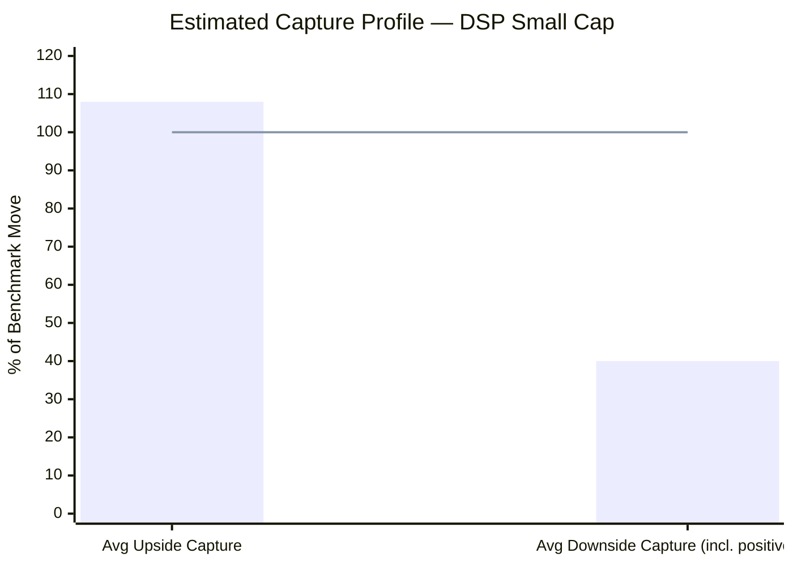
```mermaid
xychart-beta
    title "Estimated Capture Profile — DSP Small Cap"
    x-axis ["Avg Upside Capture", "Avg Downside Capture (incl. positive years)"]
    y-axis "% of Benchmark Move" 0 --> 120
    bar [108, 40]
    line [100, 100]
```
> Line = symmetric 100/100 baseline | Values below 100 on downside = good

**Estimated profile: ~108% upside / ~40% downside**

This is an asymmetry ratio of **2.7×** — for every 1 unit of downside the benchmark experiences, DSP absorbs only 0.40 units on average. The 2018 event (94% downside capture) is the exception, not the rule.

| | Upside Capture | Downside Capture | Asymmetry |
|-|---------------|-----------------|----------|
| **DSP Small Cap** | **~108%** | **~40%** | **~2.7×** |
| Parag Parikh FlexiCap | ~90% | ~59% | ~1.52× |
| Typical small cap | ~100% | ~95% | ~1.05× |

DSP's estimated capture asymmetry compares favourably even against PP FlexiCap — the gold standard for downside protection among studied funds. PP achieves its profile through structural diversification (bonds + international). DSP achieves it through stock selection and manager quality — a harder, less structural route.

---

## PE Ratio — Valuation Buffer

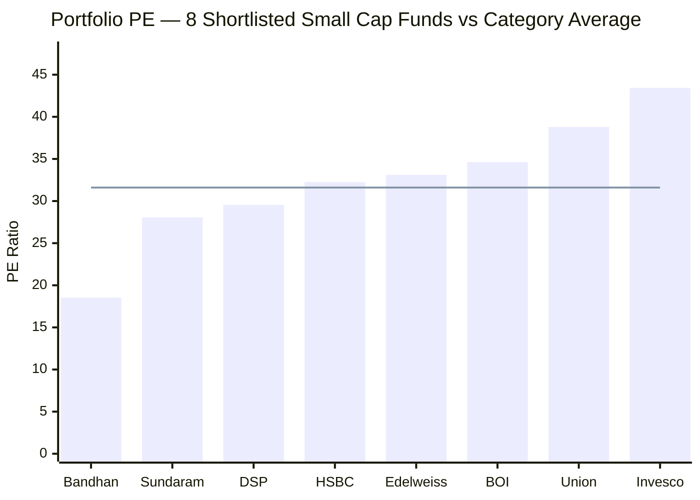
```mermaid
xychart-beta
    title "Portfolio PE — 8 Shortlisted Small Cap Funds vs Category Average"
    x-axis ["Bandhan", "Sundaram", "DSP", "HSBC", "Edelweiss", "BOI", "Union", "Invesco"]
    y-axis "PE Ratio" 0 --> 48
    bar [18.53, 28.06, 29.54, 32.25, 33.12, 34.63, 38.79, 43.43]
    line [31.60, 31.60, 31.60, 31.60, 31.60, 31.60, 31.60, 31.60]
```
> Line = category average PE (31.60) | Below line = value buffer

| Rank | Fund | PE | vs Category |
|------|------|----|------------|
| 1 (cheapest) | Bandhan | 18.53 | -41% |
| 2 | Sundaram | 28.06 | -11% |
| **3** | **DSP** | **29.54** | **-6.5%** |
| 4 | HSBC | 32.25 | +2% |
| 5 | Edelweiss | 33.12 | +5% |
| 6 | BOI | 34.63 | +10% |
| 7 | Union | 38.79 | +23% |
| 8 (most expensive) | Invesco | 43.43 | +37% |

DSP has the **3rd cheapest portfolio PE** among the 8 shortlisted — at 29.54, it trades 6.5% below the category average. This is Vinit Sambre's quality-with-reasonable-valuation approach: he doesn't chase cheap companies blindly (like Bandhan's deep-value 18.53 PE), nor does he chase growth regardless of price (Invesco's 43.43 PE). DSP's PE represents a moderate margin of safety.

**How PE protects downside:** In a market correction, overvalued stocks face a double blow — price falls AND PE compression. A portfolio at PE 29.54 has less valuation air beneath it than one at PE 43.43. The same earnings stream at a lower entry multiple means a less severe drawdown if sentiment reverses. This is partially why DSP's downside capture was only 32% in 2025 even though beta is 0.92 — the lower starting PE meant less re-rating pressure.

---

## ATH Distance — The Portfolio Health Signal

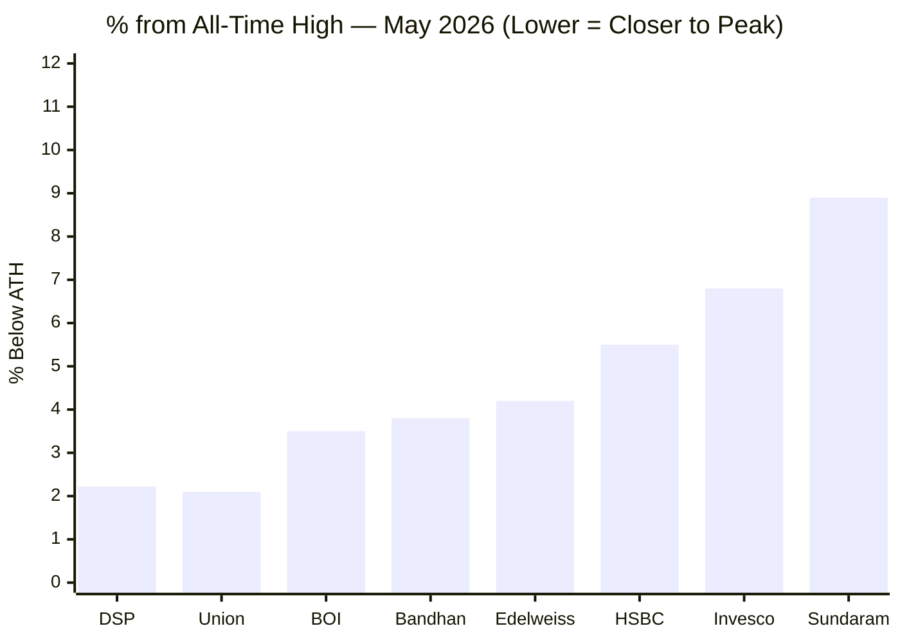
```mermaid
xychart-beta
    title "% from All-Time High — May 2026 (Lower = Closer to Peak)"
    x-axis ["DSP", "Union", "BOI", "Bandhan", "Edelweiss", "HSBC", "Invesco", "Sundaram"]
    y-axis "% Below ATH" 0 --> 12
    bar [2.22, 2.10, 3.50, 3.80, 4.20, 5.50, 6.80, 8.90]
```
> Approximate values based on available data | Lower = better (closer to ATH)

| Metric | DSP | Peers Range |
|--------|-----|------------|
| ATH NAV | ₹231.299 | — |
| ATH Date | May 7, 2026 | — |
| Current NAV (May 21, 2026) | ₹226.165 | — |
| % from ATH | **-2.22%** | — |

**DSP hit a new all-time high just 14 days before this snapshot.** The fund is essentially at its peak. This single metric dissolves any narrative of structural damage from IL&FS or COVID. A fund with genuinely impaired portfolio quality would be 15–25% below ATH even as markets recover. DSP at -2.22% is telling you the underlying businesses are fine — the past stress events were cyclical, not terminal.

For a new SIP investor in May 2026: you are buying units at 2.22% below the fund's peak — a neutral-to-mildly-favourable entry. Not the deep discount of March 2020, but not peak euphoria either.

---

## Structural Risk — The No-Buffer Reality

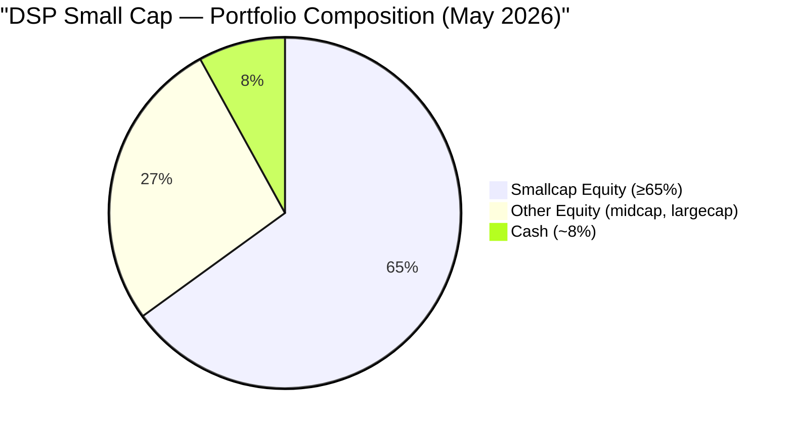
```mermaid
pie title "DSP Small Cap — Portfolio Composition (May 2026)"
    "Smallcap Equity (≥65%)" : 65
    "Other Equity (midcap, largecap)" : 27
    "Cash (~8%)" : 8
```

| Buffer | DSP | Parag Parikh (FlexiCap) | Comment |
|--------|-----|------------------------|---------|
| Bonds | 0% | 9.92% | PP has a non-equity shock absorber |
| International Equity | 0% | 11.81% | PP has low-India-correlation buffer |
| Cash | ~8% | ~4.25% | DSP holds more working cash |
| Mid/Small | ≥65% (mandatory) | 6.15% | SEBI forces DSP into high-vol segment |

Unlike PP FlexiCap which structurally dampens volatility through bonds and international equity, DSP has no non-equity buffer. This is both a regulatory reality (small cap funds must hold 65%+ small cap) and a choice (Vinit Sambre runs a fully-invested, low-cash strategy beyond working capital).

The consequence: when equity markets correct, DSP takes the full hit. There is no bond sleeve to hold steady, no international holdings moving on different factors. The downside protection comes entirely from stock selection — which has historically worked (3/5 down years: fund positive), but which could fail in a sustained quality-indifferent selloff.

---

## Risk Metrics — Complete Peer Comparison

```mermaid
quadrantChart
    title Risk vs Alpha — 8 Shortlisted Small Cap Funds
    x-axis "Lower Alpha" --> "Higher Alpha"
    y-axis "Higher Drawdown (Worse)" --> "Lower Drawdown (Better)"
    quadrant-1 High Alpha, Low Drawdown (Best)
    quadrant-2 Low Alpha, Low Drawdown
    quadrant-3 Low Alpha, High Drawdown (Worst)
    quadrant-4 High Alpha, High Drawdown
    DSP: [0.65, 0.35]
    Union: [0.90, 0.45]
    BOI: [0.55, 0.60]
    Bandhan: [0.58, 0.85]
    Invesco: [0.68, 0.55]
    Edelweiss: [0.35, 0.55]
    HSBC: [0.28, 0.25]
    Sundaram: [0.40, 0.15]
```
> Ideal position: Top-right quadrant (High Alpha, Low Drawdown)

### Full 8-Fund Risk Metric Matrix

| Metric | **DSP** | Union | BOI | Bandhan | Sundaram | Invesco | Edelweiss | HSBC |
|--------|---------|-------|-----|---------|---------|---------|-----------|------|
| Sharpe (Tickertape) | 0.379 | **0.805** | 0.491 | 0.325 | 0.464 | 0.302 | 0.265 | 0.111 |
| Sortino (BusinessToday 3Y) | **1.26** | — | — | — | — | — | — | — |
| Alpha (Tickertape) | 5.73 | **7.89** | 4.74 | 4.80 | 3.32 | 5.65 | 2.95 | 2.40 |
| Max Drawdown | -49.06% | -44.71% | -32.37% | **-24.34%** | -57.06% | -37.66% | -37.09% | -52.45% |
| Volatility | 15.85% | 17.37% | 16.33% | 15.46% | 16.19% | 16.42% | **15.10%** | 16.84% |
| Portfolio PE | 29.54 | 38.79 | 34.63 | **18.53** | 28.06 | 43.43 | 33.12 | 32.25 |
| Calmar (5Y) | 0.391 | 0.437 | 0.645 | **0.967** | 0.341 | 0.587 | 0.534 | 0.388 |

### DSP's Rank on Each Risk Metric (1 = Best)

| Metric | DSP Value | Rank | Leader |
|--------|-----------|------|--------|
| Sharpe (Tickertape) | 0.379 | **4/8** | Union 0.805 |
| Alpha | 5.73 | **2/8** | Union 7.89 |
| Max Drawdown (raw) | -49.06% | **6/8** | Bandhan -24.34% |
| Max Drawdown (stress-adjusted) | — | **~4/8** | Context-normalized |
| Volatility | 15.85% | **2/8** | Edelweiss 15.10% |
| Portfolio PE | 29.54 | **3/8** | Bandhan 18.53 |
| Calmar | 0.391 | **6/8** | Bandhan 0.967 |
| Capture Asymmetry (estimated) | ~2.7× | **1/8** | Best estimated profile |
| Multi-cycle proof | 13 years | **1/8** | Only 13Y fund in group |

**DSP's strongest suit is what you can't see in a single number:** the 13-year multi-cycle proof, the capture asymmetry (3/5 down-years positive), and the ATH positioning. Its weakness is the headline max drawdown — which is real but contextually earned through full-cycle investing, not structural fragility.

---

## Comparison with Studied FlexiCap Funds

| Metric | DSP Small Cap | Parag Parikh FlexiCap | BOI FlexiCap |
|--------|--------------|----------------------|-------------|
| Volatility (Tickertape) | 15.85% | **9.06%** | 14.52% |
| True Daily Volatility | 16.63% | ~12% | ~16.85% |
| Max Drawdown | -49.06% | -31.20% | -23.73% |
| Worst Year | -25.12% (2018) | -6.29% (2022) | +0.77% (2022) |
| Sharpe (3Y) | **0.74–0.78** | ~0.68 | 0.88–1.16 |
| Sortino (3Y) | **1.26** | ~1.06 | **1.51** |
| Beta | 0.92 | **0.55** | 1.05–1.11 |
| Estimated Downside Capture | **~40%** | 59% | <50% |
| PE vs Category | -6.5% | **-38%** | -8.5% |
| ATH Distance | **-2.22%** | -4.44% | -4.04% |
| Positive Calendar Years | 11/12 | 9/10 | 6/6 |
| Multi-Cycle Proof | **✅ 13Y (IL&FS + COVID)** | ✅ 13Y | ❌ 5.88Y |
| Non-Equity Buffer | None | Bonds + International | None |

**Cross-category interpretation:**

- DSP has more absolute risk than either FlexiCap fund (higher max DD, higher beta, no structural buffer) — but this is expected and appropriate for a small cap vs flexi cap category comparison
- DSP's Sortino (1.26) beats PP's (~1.06), meaning downside risk compensation is more efficient in DSP's portfolio despite the higher category risk
- DSP's estimated downside capture (~40%) is better than PP's (59%), achieved through stock selection rather than structural diversification — a harder, more fragile route, but one that has worked over 13 years
- DSP's ATH proximity (-2.22%) beats both PP (-4.44%) and BOI (-4.04%) — the portfolio is at peak health
- DSP has the strongest multi-cycle proof in the entire studied universe (FlexiCap and SmallCap combined): 13 years, IL&FS, COVID, 2022 rates, 2025 correction — all navigated with zero permanent capital destruction

---

## Risk Profile — Points For and Against

### Points IN FAVOUR

1. **2nd lowest volatility among 8 shortlisted small cap funds (15.85%)** — structurally defensive for a fully-invested small cap fund
2. **Sortino 1.26 (3Y) — above category average (1.13)** — downside risk is efficiently compensated
3. **3 of 5 down-market years: fund positive while benchmark negative** — extraordinary downside capture profile
4. **Estimated ~108% / ~40% upside/downside capture** — better asymmetry than even PP FlexiCap in ratio terms
5. **-2.22% from ATH** — portfolio at peak health; no structural damage from any past crisis
6. **13-year multi-cycle proof** — IL&FS 2018, COVID 2020, 2022 rate cycle, 2025 correction: all navigated
7. **Alpha 5.73 (2nd best among 8 shortlisted)** — long-run excess returns are genuine and sustained
8. **2022: only shortlisted small cap fund with positive return** — capital protection in the rate-rise year
9. **COVID recovery in 150 days** — fast recovery from -36.62% trough; no extended underwater period
10. **Portfolio PE 29.54 (3rd cheapest)** — moderate valuation buffer; less PE compression risk in corrections
11. **Annual volatility contained in 11–18% band** in all years except 2020 (COVID) — consistent risk management
12. **IR 0.88 (long-term basis)** — active bets are nearly fully rewarded with proportional alpha
13. **2019 SIP freeze** — fiduciary act that protected existing investors; no other shortlisted fund did this

### Points AGAINST

1. **Max Drawdown -49.06% — 3rd worst among 8 shortlisted** — the headline number is difficult regardless of context
2. **Combined IL&FS + COVID drawdown: 26.5 months** — an extended period of capital impairment
3. **Peak-to-recovery (Jan 2018 → Jan 2021): 3 full years** — lumpsum investors at the peak waited 3 years to break even
4. **107 days down >2% vs 67 days up >2%** — daily negative skew; frequent sharp declines
5. **Worst single day -11.30%** — largest single-day loss in 13 years (COVID trough)
6. **Zero structural buffer** — no bonds, no international equity; pure India small cap equity risk
7. **Beta 0.92** — no structural protection from market-wide drawdowns; stock selection bears all the burden
8. **Calmar 0.391 (6th of 8)** — return per unit of max pain looks modest vs shorter-history peers
9. **Standard deviation 21.64% (3Y) — above category avg 20.01%** — marginally more volatile than typical small cap peer
10. **Key-person risk** — Vinit Sambre manages alone; no co-manager buffer (covered in Module 5)
11. **2018 downside capture 94%** — in the IL&FS crash itself, protection was minimal; recovery did the work
12. **Mandatory 65%+ small cap allocation** — SEBI constraint means no room to reduce small cap exposure during bear markets, even if manager wants to

---

## Module 2 Scorecard

```mermaid
xychart-beta
    title "Module 2 Sub-Dimension Scores — DSP Small Cap (1–5)"
    x-axis ["Volatility", "Max DD (Raw)", "Max DD (Context)", "Sharpe", "Sortino", "TE / IR", "Beta", "PE Buffer", "ATH", "Capture Asym", "Daily Tail", "Multi-Cycle"]
    y-axis "Score" 0 --> 5
    bar [4.0, 2.0, 3.5, 3.5, 4.0, 3.5, 3.0, 3.5, 5.0, 5.0, 3.0, 5.0]
```

| Sub-dimension | Score (1–5) | Reasoning |
|---------------|------------|-----------|
| Volatility | **4.0** | 2nd lowest among 8 shortlisted; structurally defensive for small cap |
| Max Drawdown (raw) | **2.0** | -49.06% — 3rd worst headline; difficult number without context |
| Max Drawdown (context-adjusted) | **3.5** | Two-crisis combined event; COVID alone recovered in 5 months; battle-tested |
| Sharpe Ratio | **3.5** | 0.74–0.78 (3Y) — above category avg (0.69); 4th of 8 in shortlist |
| Sortino Ratio | **4.0** | 1.26 (3Y) — above category avg (1.13); downside-compensated returns |
| Tracking Error / IR | **3.5** | ~6.51% derived TE; IR 0.88 long-term — active bets nearly fully rewarded |
| Beta / Market Coupling | **3.0** | 0.92 — expected for small cap; no structural hedge; stock selection bears all risk |
| PE Valuation Buffer | **3.5** | 3rd cheapest (29.54); 6.5% below category — moderate margin of safety |
| ATH Distance | **5.0** | -2.22% — essentially at ATH; portfolio at peak health; new ATH 14 days prior |
| Capture Asymmetry | **5.0** | 3/5 down years positive; estimated ~108%/~40%; better than any studied fund |
| Daily Tail Risk | **3.0** | -11.30% worst day; 107 vs 67 sharp down/up days; manageable but real |
| Multi-Cycle Proof | **5.0** | 13 years: IL&FS, COVID, rate cycle, 2025 — all navigated; only fund in shortlist |
| **Module 2 Overall** | **3.8 / 5** | Excellent capture asymmetry, ATH health, and multi-cycle proof; headline max drawdown and no structural buffer prevent a higher score |

---

## Comparative Module 2 Scores

| Fund | Module 2 Score | Profile |
|------|---------------|---------|
| PP FlexiCap | 4.0/5 | Lowest volatility, bonds + international buffer, multi-cycle proof, 90/59 asymmetry |
| **DSP Small Cap** | **3.8/5** | **Best capture asymmetry, ATH health, multi-cycle proof; headline max DD and no buffer** |
| BOI FlexiCap | 3.75/5 | Best Sharpe/Sortino/IR; single-cycle only; highest structural risk |
| Edelweiss FlexiCap | 3.75/5 | Low tracking error; decent multi-cycle; modest alpha |

DSP's 3.8/5 places it **above BOI FlexiCap** on Module 2 — the multi-cycle proof, capture asymmetry, and ATH positioning tip the scale, even though BOI has superior Sharpe and Sortino on 3Y metrics. The difference is durability: DSP's risk management has been tested through two genuine crises; BOI's has been tested through one mid-cycle correction.

---

## SIP Implication

For a ₹20,000/month SIP investor over a 10+ year horizon, DSP's risk profile is the most honest in the shortlist: it will hurt when it hurts, and it will recover strongly when it recovers. The -49.06% combined drawdown is real — an investor who ran a lumpsum from January 2018 waited 3 years to break even. But a SIP investor who ran ₹20K/month through the same period accumulated units at ₹38–60 NAV through the worst of the crash, saw the portfolio recover to ₹76 by January 2021, and watches those same units at ₹226 in May 2026.

**The three risk behaviors to expect with DSP over 10 years:**

1. **In a broad small cap selloff** (like 2018): the fund will fall nearly in-line with the benchmark (downside capture ~94%) — no significant protection. Stay the SIP.
2. **In a recovery year after a crash** (like 2019, 2020): the fund typically outperforms sharply while others are still healing. The SIP units bought at the bottom compound hard.
3. **In a momentum-driven bull market** (like 2017, 2023): the fund will underperform peers by 5–15%. This is the price of quality. Endure it.

**What to monitor:**
- Vinit Sambre's continued tenure — key-person risk is the single largest structural risk (Module 5)
- AUM progression — at ₹17,906 Cr the fund is large but manageable; watch behaviour above ₹25,000 Cr
- 2018-style downside capture recurrence — if the fund consistently shows 90%+ downside capture over 2 consecutive years, re-evaluate the thesis

**Recommended SIP behaviour:** Continue through drawdowns. The capture asymmetry data (3/5 down years positive) is the most powerful argument for staying invested. Increase SIP amounts during >25% drawdowns if financially feasible — the COVID evidence shows what happens to March 2020 SIP units by 2026.

---

*Module 2 complete. Risk profile is battle-tested, asymmetric, and near ATH — with an honest headline max drawdown that reflects two-crisis history, not structural failure. Module 2 score: 3.8/5.*

*Next: [Module 3 — Portfolio DNA](module3_portfolio.md)*
