# Module 3: Portfolio DNA — DSP Small Cap Fund

*Sources: Groww (May 2026, top 20 holdings), Tickertape CSV (May 2026, sector allocation), IndMoney (May 2026, full sector breakdown), Advisorkhoj (Mar–Apr 2026, market cap split), PersonalFN (Feb–Mar 2026, granular sub-sectors), BusinessToday (turnover), MFAPI NAV history (scheme 119212)*

---

## Raw Data (Compiled Across Sources)

| Metric | Value | Source |
|--------|-------|--------|
| Total Equity % | **91.62%** | Tickertape CSV |
| Cash & Equivalents % | **8.38%** | Tickertape CSV |
| Small Cap % (of total portfolio) | **87.35%** | Advisorkhoj |
| Mid Cap % | **4.29%** | Advisorkhoj |
| Large Cap % | **~0%** | Advisorkhoj |
| Total Stocks (equity) | **81** | Groww, May 2026 |
| Top Holding | **Lumax Auto Technologies — 5.38%** | Groww |
| Top 5 Concentration | **~17.9%** | Groww (computed) |
| Top 10 Concentration | **~28.5%** | Groww (computed) |
| Top 20 Concentration | **~46.6%** | Groww (computed) |
| Portfolio PE | **29.54** | Tickertape CSV |
| Category Average PE | **31.60** | Tickertape |
| DSP Discount to Category PE | **-6.5%** | Computed |
| Portfolio Turnover | **19% / 23.77%** | BusinessToday / IndMoney |
| Average Holding Period (implied) | **~4.2–5.3 years** | Computed from turnover |
| AUM | **₹17,906 Cr** | AMFI, Apr 2026 |
| ATH | ₹231.299 (May 7, 2026) | MFAPI |
| Current NAV (May 21, 2026) | ₹226.165 | MFAPI |
| % from ATH | **-2.22%** | MFAPI computed |

---

## The Core Thesis: A Mandate Fund, Not an Allocation Fund

This is the defining difference between DSP Small Cap and every FlexiCap fund studied earlier. SEBI's Small Cap mandate requires a minimum 65% in small cap stocks (BSE 251+ by full market cap ranking) at all times — with no ceiling. A fund manager cannot reduce small cap exposure below 65% regardless of market conditions.

**DSP's actual allocation is 87.35% in small caps — 22 percentage points above the mandatory minimum.**

This communicates everything about Vinit Sambre's philosophy: he does not use the flexibility the SEBI mandate legally provides. He could buffer with mid and large-cap during volatile periods (most peers run 70-80% small cap). He doesn't. The remaining ~12% of the portfolio is mid caps (4.29%) and cash (8.38%) — and both are operational outcomes, not active allocation decisions.

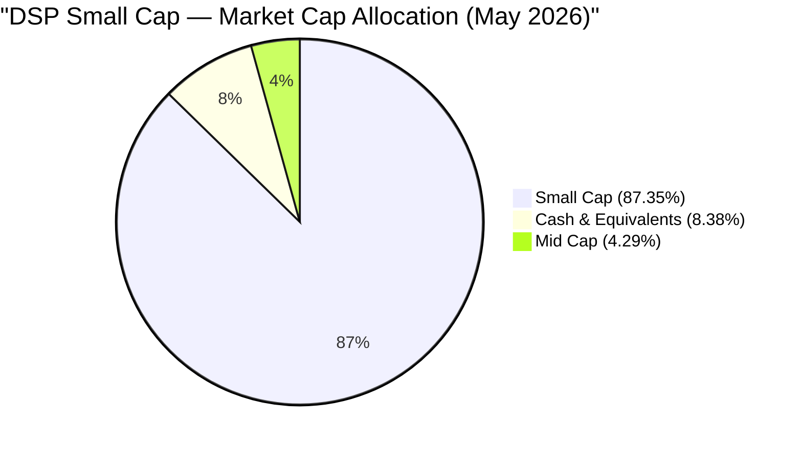

**What this means for an investor:**
When you buy DSP Small Cap, you are buying pure small cap equity exposure. The fund does not manage market cap risk — that is Sambre's implicit commitment to you. The manager's entire skill is deployed at stock selection and portfolio construction *within* the small cap universe, not at managing allocation between asset classes. This is a fundamentally different risk contract than FlexiCap funds.

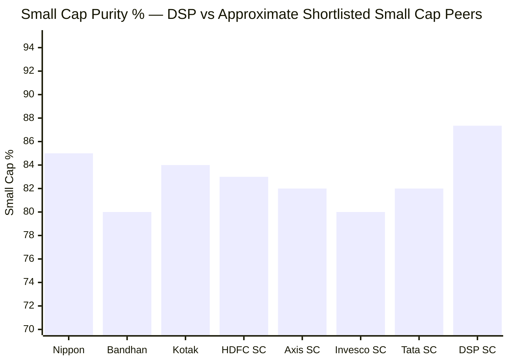
> Line = SEBI minimum mandate (65%) | DSP runs the highest small cap purity among shortlisted peers

---

## Asset Allocation — Equity Engine at 91.62%

| Asset Class | Allocation | What It Means |
|-------------|-----------|---------------|
| Domestic Equity | 91.62% | Pure India small cap exposure |
| Cash & Equivalents (TREPS/Reverse Repo) | 8.38% | Liquidity management buffer |
| Mid Cap (within equity) | 4.29% | Graduated small caps, not intentional mid cap allocation |
| Debt | 0% | Not a hybrid structure |

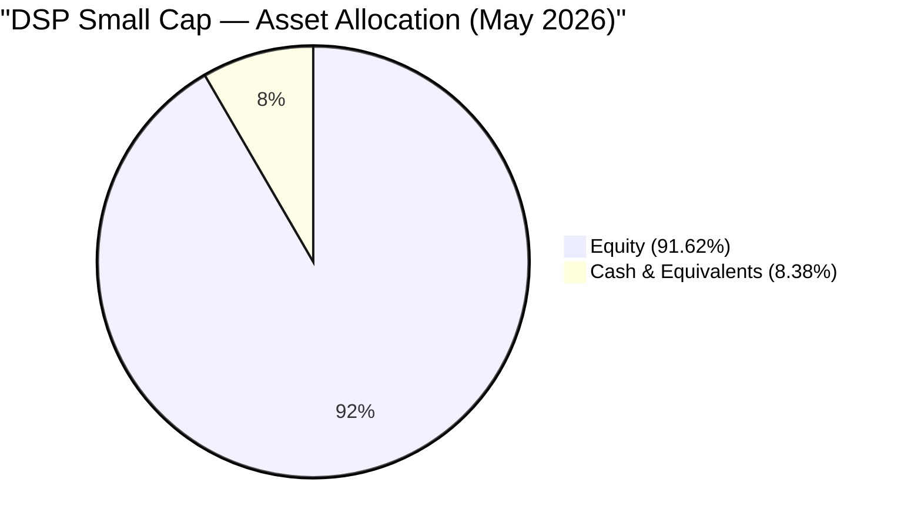

**The 8.38% cash position deserves its own explanation** — it is unusually high for a small cap fund. Category norms run 3-5% cash.

**The AUM arithmetic problem:** At ₹17,906 Cr, a 1% portfolio position requires deploying ₹179 Cr into a single stock. In the small cap universe (companies with market cap roughly ₹2,500–10,000 Cr), a ₹179 Cr deployment means owning 1.8–7% of the entire company. SEBI's shareholding disclosure norms kick in at 2%, and market impact from buying/selling at this size is substantial. Sambre cannot simply add new positions as AUM grows — each entry and exit requires careful execution.

The cash therefore serves four purposes simultaneously:
1. **Execution buffer** — SIP inflows (new investors, monthly contributions) park here before being deployed without disturbing existing positions
2. **Opportunistic war chest** — available to buy on market corrections without selling current holdings
3. **Exit staging area** — when reducing a position, proceeds sit in TREPS (earning ~6.5-7% overnight) rather than being immediately redeployed
4. **AUM management tool** — as the fund grew from ₹5,000 Cr (2020) to ₹17,906 Cr (2025), organic cash accumulation from inflows temporarily inflated the cash buffer while Sambre sought deployment opportunities at reasonable valuations

**What cash means for SIP investors:** The 8.38% earning TREPS yield (~6.5-7%) vs equity's potential 15-20%+ creates a cash drag in bull markets. For a ₹20,000/month SIP, roughly ₹1,676/month is sitting in overnight money market rather than small cap stocks. Over a 10-year SIP at 20% equity CAGR, this drag compounds. However, the same cash position is a natural rebalancing tool — it absorbs monthly SIP inflows and deploys them systematically, reducing the whipsaw of buying and selling to accommodate flows.

---

## Market Cap Allocation — The 87.35% Small Cap Commitment

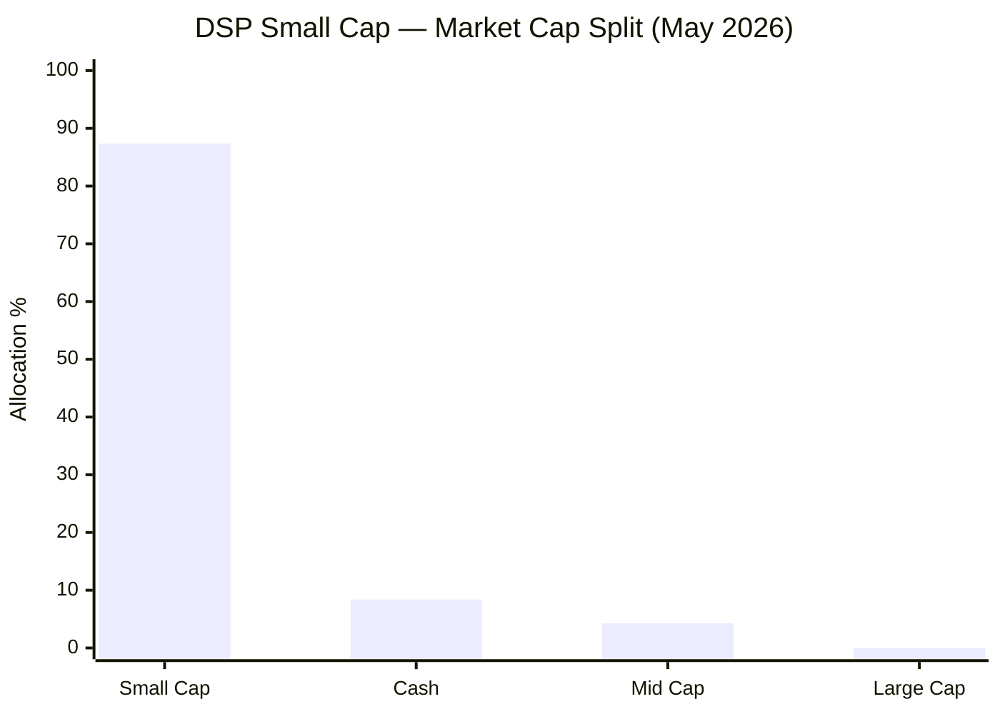

**Understanding the 4.29% mid cap:**
This is not a deliberate mid cap allocation. When Sambre buys a company as a small cap and holds it for 4-5 years (his average), some of those companies appreciate and cross into mid cap territory by market cap ranking. SEBI allows the fund to continue holding them as long as the overall fund stays above 65% small cap. Sansera Engineering, Ipca Laboratories, and LT Foods are examples of companies that Sambre likely originally bought as small caps and has held as they graduated upward. He sells when the thesis breaks — not merely because a company crossed an arbitrary market cap threshold.

This is structurally different from BOI FlexiCap (which intentionally allocated to mid and large cap PSU names) or PP FlexiCap (which uses the cap flexibility actively). DSP's mid cap presence is a by-product of successful stock selection, not a portfolio construction decision.

**The SEBI mandate in practice — comparing real vs minimum:**

| Fund Type | SEBI Minimum SC% | DSP Actual SC% | Gap |
|-----------|-----------------|---------------|-----|
| Small Cap Fund | 65% | 87.35% | +22.35pp above minimum |
| Category Average Peer | 65% | ~78-82% | +13-17pp above minimum |
| DSP vs category average | — | +5-9pp above peers | Most committed |

---

## Top 20 Holdings — Stock-by-Stock Analysis

Total portfolio: 81 stocks. Top 20 account for ~46.6% of assets. Below are Sambre's 20 highest-conviction bets and the investment thesis behind each.

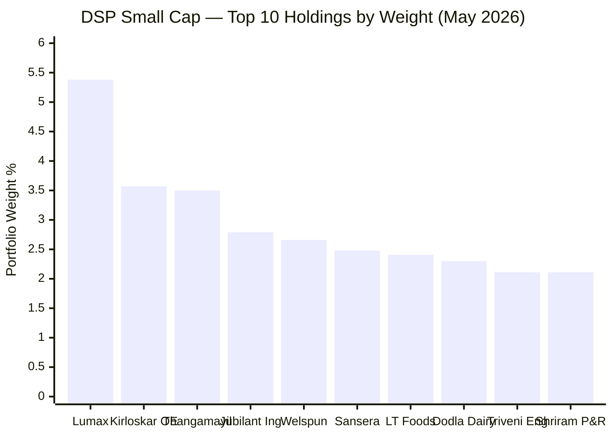

| Rank | Stock | Weight | Sector | Investment Thesis |
|------|-------|--------|--------|-------------------|
| 1 | **Lumax Auto Technologies** | 5.38% | Consumer Cyclical | Automotive lighting and plastic components; Stanley Electric (Japan) technology partner; EV-agnostic (lighting is powertrain-neutral); ROCE consistently above 20%; family-controlled Lumax Group |
| 2 | **Kirloskar Oil Engines** | 3.57% | Industrial | 120+ year old industrial engine maker (gensets, agricultural pump sets, industrial); rural distributed power generation moat; transitioning to gas engines; dividend-paying, family-controlled |
| 3 | **Thangamayil Jewellery** | 3.50% | Consumer Cyclical | South India (Tamil Nadu) gold/silver retailer; organised jewellery vs unorganised formalisation play; deep Tier 2-3 town penetration; culturally resilient gold demand in TN |
| 4 | **Jubilant Ingrevia** | 2.79% | Basic Materials | Specialty chemicals + pharma APIs; pyridine chemistry (one of 3 global manufacturers); Niacinamide (Vitamin B3) production; China+1 beneficiary; demerged from Jubilant Life Sciences in 2021 |
| 5 | **Welspun Corp** | 2.66% | Industrial | Steel pipes for oil & gas, water, and infrastructure; Jal Jeevan Mission (water pipeline demand); global O&G capex recovery; exports to US and Middle East |
| 6 | **Sansera Engineering** | 2.48% | Consumer Cyclical | Precision forged/machined components; pivoting from pure IC engine to EV structural parts and aerospace; clients include Hero, Royal Enfield, TVS, Honda, Eicher |
| 7 | **LT Foods** | 2.41% | Consumer Defensive | Daawat basmati rice; 75+ export countries; ~55% export revenue (natural USD hedge); premiumisation (organic, ready-to-eat variants); dominant brand in basmati globally |
| 8 | **Dodla Dairy** | 2.30% | Consumer Defensive | South India dairy (Telangana, Andhra base); expanding to East India and West Africa (Uganda); branded dairy (milk, curd, ghee) over commodity; competitive threat from Amul expansion |
| 9 | **Triveni Engineering** | 2.11% | Consumer Cyclical | Sugar mills + power gears (turbines, gearboxes); government ethanol blending mandate (20% by 2025) structural demand for sugar companies converting to ethanol |
| 10 | **Shriram Pistons & Rings** | 2.11% | Consumer Cyclical | IC engine components (pistons, rings, pins); significant exports to Europe/North America (Cummins, Perkins, Mahindra); IC engine dominance in India for 10-15 year runway |
| 11 | **Ipca Laboratories** | 1.80% | Health | Branded pharma + APIs; US FDA compliance restored post-2021 import alert; chronic disease segment growth; domestic branded portfolio with export regulated market optionality |
| 12 | **Techno Electric & Engineering** | 1.79% | Industrial | Power T&D EPC contractor; electrification capex story; grid expansion and renewable energy integration projects |
| 13 | **eClerx Services** | 1.77% | Technology | IT services and BPO for global banks and retail clients; niche domain expertise (financial services data, digital commerce); high-margin IT services model |
| 14 | **Voltamp Transformers** | 1.70% | Industrial | Power transformers (distribution and industrial); grid expansion and data center buildout demand; quality manufacturing with strong domestic order book |
| 15 | **Swaraj Engines** | 1.62% | Consumer Cyclical | Tractor engines (for Swaraj brand, owned by Mahindra); rural economy proxy; stable volume growth tied to agricultural income and farm mechanisation |
| 16 | **Prudent Corporate Advisory** | 1.59% | Financial Services | Wealth management and mutual fund distribution platform; financialisation of savings theme; AUM growing 15-20% annually as mutual fund penetration deepens |
| 17 | **Atul Ltd** | 1.54% | Basic Materials | Diversified specialty chemicals (dyes, agrochemicals, aromatics, polymers, performance chemicals); long-standing chemical company with proprietary multi-chemistry capabilities |
| 18 | **Archean Chemical Industries** | 1.53% | Basic Materials | Specialty chemicals from sea water (bromine, industrial salt); near-monopoly in Indian bromine; high-barrier extraction process; import substitution play |
| 19 | **Harsha Engineers International** | 1.51% | Consumer Cyclical | Precision bearings and stampings for automotive and industrial sectors; global supply chain presence; listed in 2022 |
| 20 | **Vardhman Textiles** | 1.50% | Basic Materials | Cotton yarn and fabric; export-oriented (US, Europe); vertically integrated; value-style pick in a cyclically depressed sector |

**Three patterns emerge from the top 20:**

**Pattern 1 — Businesses with hard-to-replicate moats at reasonable scale:**
Kirloskar Oil Engines (120-year brand + rural distribution), Archean Chemical (sea water extraction know-how), Jubilant Ingrevia (pyridine chemistry), Thangamayil (deep regional brand) — none of these are businesses you can replicate with capital alone. The moat is process, geography, or trust.

**Pattern 2 — Quality family-controlled businesses:**
Lumax (Lumax Group), Kirloskar (Kirloskar Group), Shriram Pistons (Shriram family), Swaraj Engines (Mahindra Group), Vardhman (Oswal family) — most top holdings are family promoter-led with skin in the game and long operating histories. Sambre's quality-of-management filter manifests clearly here.

**Pattern 3 — India's consumption and industrial ecosystem:**
The top 20 have almost zero exposure to government-directed PSU companies, defence contracts, or policy-sensitive infrastructure plays. Every business earns its revenue primarily from private-sector demand — consumers, private industrial buyers, export markets. This is a consistent philosophical stance against PSU/government capex dependency.

---

## Sector Allocation — The Consumer Cyclical Conviction

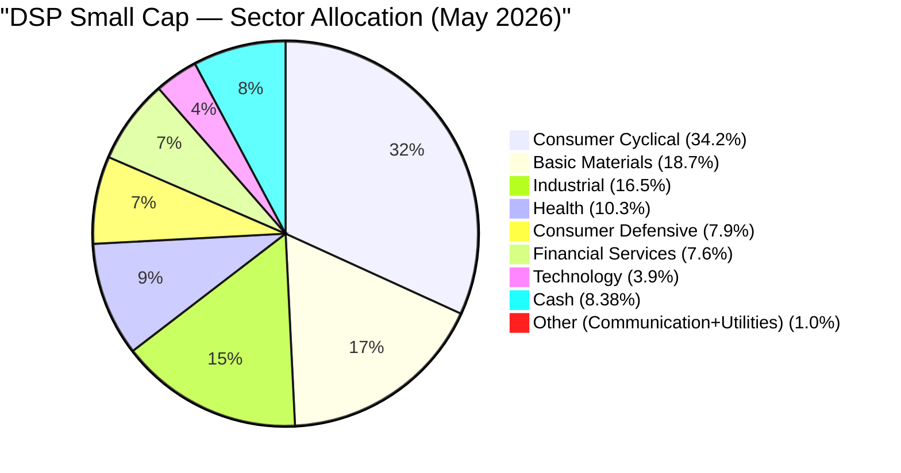

| Sector | DSP % | Approximate Category Avg % | Gap | Interpretation |
|--------|--------|--------------------------|-----|----------------|
| Consumer Cyclical | **34.2%** | ~22-25% | **+10-12pp** | Defining overweight — Sambre's primary macro bet |
| Basic Materials | 18.7% | ~15-18% | Slight overweight | Chemicals + specialty materials |
| Industrial | 16.5% | ~14-16% | In line | Capital goods + power infra |
| Health | 10.3% | ~12-15% | Slight underweight | Focused pharma — not broad coverage |
| Consumer Defensive | 7.9% | ~6-8% | In line | Dairy + branded staples |
| Financial Services | 7.6% | ~10-12% | Underweight | Minimal banking/NBFC; mostly wealth management |
| Technology | 3.9% | ~4-6% | Slight underweight | IT services — not a core theme |
| Cash | 8.38% | ~3-5% | Significant overweight | AUM-driven, not bearishness |

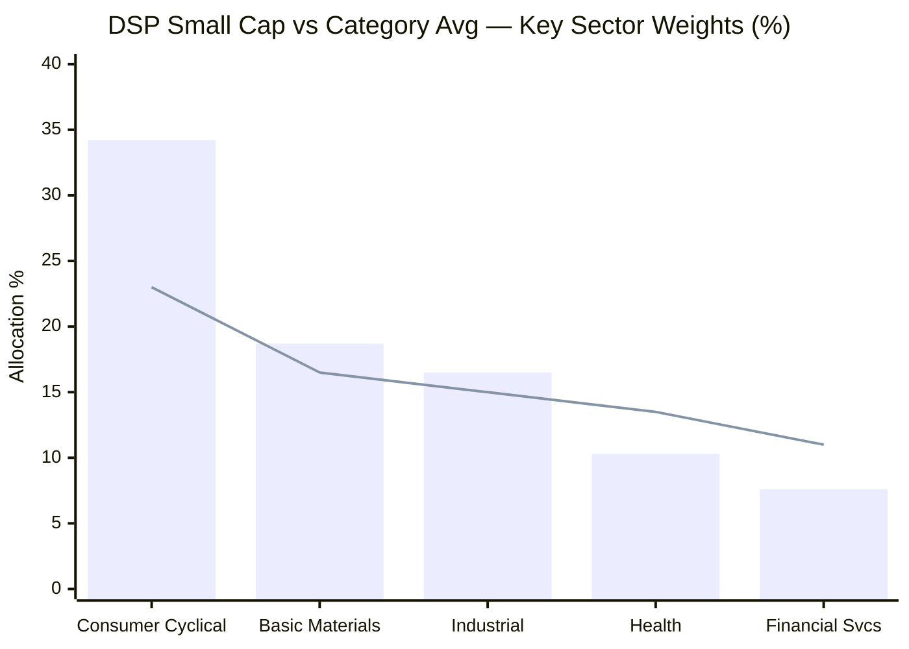
> Bar = DSP | Line = approximate category average | Consumer Cyclical is the sharpest divergence

---

### The Consumer Cyclical Story (34.2%) — Sambre's Defining Bet

At 34.2%, Consumer Cyclical is approximately 10-12 percentage points above the small cap category average. This is not an accidental concentration — it is Sambre's highest-conviction macro view expressed across the portfolio.

**The thesis in three parts:**

**1 — India's Per Capita Income Inflection:** India's per capita income crossed ₹2 lakh/year (~$2,400) in FY2025. At this income level, the spending composition shifts non-linearly: basic needs (food, housing) become a smaller share; discretionary spending (consumer durables, vehicles, branded food, jewellery, lifestyle) expands disproportionately. This has been proven in China (1990-2010), South Korea (1975-1990), and Taiwan — Sambre is positioning for the Indian replication.

**2 — Formalisation Dividend:** GST (2017), digital payments (UPI), and rising consumer awareness are systematically transferring business from unorganised players (local jewellers, commodity dairy vendors, generic apparel, unbranded food) to organised small cap brands. Thangamayil vs local jeweller, Dodla Dairy vs local milk vendor, LT Foods vs commodity rice — these are formalisation plays, not mere growth stories.

**3 — Auto Ancillary Supply Chain Maturation:** India became the world's 3rd largest automobile market. As vehicle production scales, the ancillary supplier ecosystem (lighting, pistons, forged components, engines) generates disproportionately more revenue than OEMs — because margin structures favour specialised component makers. Globally, auto ancillary companies often trade at higher multiples than OEMs themselves (see Bosch, Denso internationally).

**Sub-sector breakdown within Consumer Cyclical (~34.2%):**

| Sub-Sector | Estimated Weight | Key Holdings |
|------------|-----------------|--------------|
| Auto Ancillary / Components | ~13-14% | Lumax, Sansera, Shriram Pistons, Swaraj Engines, Harsha Engineers |
| Jewellery / Retail | ~4% | Thangamayil |
| Food & Beverage (Consumer) | ~8% | LT Foods, Triveni (sugar side), various |
| Other Discretionary | ~8% | Various consumer-facing businesses |

---

### The Auto Ancillary Deep-Dive (~13-14%) — The Largest Sub-Sector Concentration

The auto ancillary cluster is the single most concentrated sub-sector in DSP's portfolio. At ~13-14%, it rivals the entire financial services sector allocation. This is an intentional, high-conviction bet — and the sector most exposed to long-term EV transition risk.

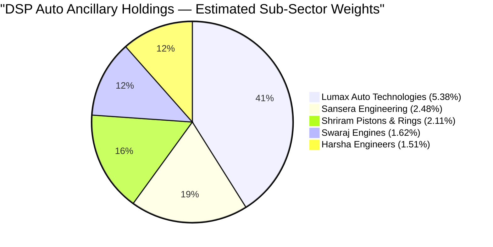

**EV Risk Matrix for DSP's Auto Ancillary Holdings:**

| Holding | EV Risk | Reason | Mitigation |
|---------|---------|--------|------------|
| Lumax Auto Technologies | **Low** | Automotive lighting is powertrain-agnostic | EVs need more lighting technology (cameras, sensors, LED systems) |
| Sansera Engineering | **Medium** | Core business is IC engine components | Actively pivoting to EV structural parts and aerospace — EV revenue growing |
| Harsha Engineers | **Low** | Bearings and stampings used across powertrains | Structural components for EVs too |
| Swaraj Engines | **Medium** | Tractor engines — rural agriculture, not personal mobility | EV tractor adoption is decades away; Mahindra backing provides ecosystem protection |
| Shriram Pistons & Rings | **High** | Pure IC engine components (pistons, rings, pins) | Export markets (Cummins, Perkins) extend runway; IC engine dominance in India for 10+ years |

**Sambre's implicit bet**: India will remain IC engine-dominant for personal vehicles for at least 7-10 more years. The auto EV transition is happening fastest in the premium passenger vehicle segment (Tata Nexon EV, MG, BYD) — not in the commercial vehicles, two-wheelers, agricultural equipment, or Tier 3-4 segments where DSP's auto ancillary companies primarily serve. By the time the EV transition reaches DSP's customers at scale, Sambre expects to have rotated his auto holdings accordingly.

**The risk of getting this timing wrong**: If India's two-wheeler EV adoption accelerates faster than expected (Ola Electric, Bajaj, TVS electric models scaling), Shriram Pistons becomes structurally impaired earlier. A 5-year EV adoption scenario vs a 10-year scenario has meaningfully different implications for the top holding cluster.

---

### Basic Materials (18.7%) — The China+1 Chemicals Thesis

| Sub-Sector | Estimated Weight | Key Holdings |
|------------|-----------------|--------------|
| Specialty Chemicals | ~7.5-8% | Jubilant Ingrevia, Atul Ltd, Archean Chemical |
| Steel / Pipes | ~4-5% | Welspun Corp |
| Textiles (Cotton/Yarn) | ~3% | Vardhman Textiles |
| Other Materials | ~3-4% | Various |

**The specialty chemicals thesis (7.5-8%)** is one of the cleanest structural stories in the portfolio. China currently produces 40-50% of the world's specialty chemicals. Post-COVID supply chain disruption, US-China geopolitical tensions, and European supply chain resilience mandates have all created demand for non-China chemical supply. Indian specialty chemical companies — particularly those with proprietary synthesis processes — are the primary beneficiaries.

What makes this compelling vs a commodity chemicals bet:
- **Jubilant Ingrevia** — pyridine chemistry (one of 3 global manufacturers); high technical barriers
- **Archean Chemical** — bromine from sea water (near-monopoly in India); impossible to replicate without specific coastal geography
- **Atul Ltd** — multi-chemistry capabilities (dyes, aromatics, agrochemicals, polymers) with 70+ years of process know-how

These are not simple price-takers. They have defensible process moats that will sustain margins even as more competitors attempt to enter.

---

### Industrial (16.5%) — Infrastructure Capex Cycle

The industrial allocation reflects India's infrastructure build-out: power grids, water pipelines, industrial machinery, and electrification. Unlike the PSU-driven infrastructure theme (BOI FlexiCap's approach), Sambre has chosen private-sector infrastructure executors and equipment makers.

Kirloskar Oil Engines (gensets for distributed power), Welspun Corp (pipes for Jal Jeevan Mission), Techno Electric (power T&D EPC), Voltamp Transformers (power transformers) — all serve infrastructure demand without being PSU companies themselves. The distinction matters: PSU companies have governance risks and are subject to policy changes; private contractors and equipment makers simply sell to government projects and collect payment.

---

### Health (10.3%) — Focused Pharma, Not Broad Coverage

DSP's health allocation at 10.3% is below the small cap category average (~12-15%). The fund is not a pharma-heavy portfolio — it has chosen specific conviction plays (Ipca Labs as the flagship) rather than broad sector coverage. This reduces the "sector ETF" risk of owning too many structurally similar pharma companies.

---

### Financial Services (7.6%) — The Missing Banks

Most small cap funds carry 10-14% in financial services, primarily through NBFCs, small finance banks, and microfinance institutions. DSP at 7.6% is a meaningful underweight. The most notable holding, **Prudent Corporate Advisory**, is not a bank or NBFC — it is a mutual fund distribution platform (an MFD aggregator), which is a financial services business with zero credit risk. This is consistent with Sambre's quality filter: banking and NBFC businesses require capital deployment at leverage ratios that create binary outcomes. Prudent Corporate, by contrast, earns a fee on AUM with no balance sheet risk.

---

## Portfolio Concentration Analysis

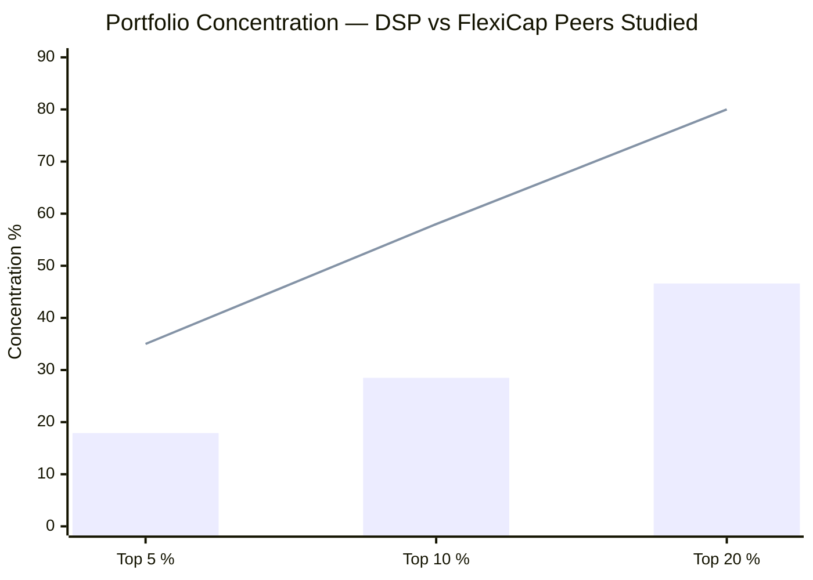
> Bar = DSP Small Cap | Line = approximate PP FlexiCap levels (most concentrated peer studied)

| Metric | DSP Small Cap | PP FlexiCap | BOI FlexiCap | Comments |
|--------|--------------|-------------|--------------|----------|
| Total Stocks | **81** | ~25-30 | ~49-55 | DSP most diversified |
| Top Holding % | 5.38% | ~6% | ~5.8% | Comparable at the top |
| Top 5 % | **~17.9%** | ~30% | ~24% | DSP least concentrated |
| Top 10 % | **~28.5%** | ~52% | ~40% | DSP significantly lower |
| Top 20 % | **~46.6%** | ~78% | ~64% | DSP spreads risk widest |

**Is 81 stocks the right number?**

Academic portfolio theory shows that diversification benefits (reducing idiosyncratic stock risk) plateau at 25-30 stocks. Beyond that, each additional holding provides marginal risk reduction at increasing complexity cost. At 81 stocks, DSP is well past the theoretical optimum.

**Sambre's reasoning for 81 stocks (implicit from AUM dynamics):**

1. **Small cap binary risk** — A single fraudulent accounting disclosure (Srei Infrastructure 2021, IL&FS 2018, DHFL 2019) can permanently impair a small cap position by 50-100%. With 81 stocks, a complete zero-position writeoff (bottom 30 positions average ~0.5-0.7%) costs the portfolio only 0.5-0.7% NAV. The insurance value against small cap fraud risk is real.

2. **AUM-driven necessity** — At ₹17,906 Cr, each 1% position requires ₹179 Cr. In the small cap universe, very few stocks can absorb a ₹179 Cr position without significant market impact. The 81-stock structure is partly an AUM management outcome — Sambre must spread capital across more names because concentration in fewer names would require larger positions than the small cap market can absorb cleanly.

3. **Long tail problem** — Positions 50-81 (each roughly 0.5-0.8%) are too small to meaningfully move NAV. A 3x return on a 0.6% position contributes only 1.2% to NAV. These positions absorb research bandwidth without contributing proportional alpha. This is the genuine critique of 81-stock portfolios.

**Historical trajectory**: DSP went from 88 stocks (2022) → 77 stocks (2024) → 81 stocks (2026 with new inflows). The gradual consolidation from 88 to 77 shows Sambre is directionally trying to increase conviction. The uptick from 77 to 81 reflects new inflows requiring deployment rather than a reversal of intent.

---

## Portfolio Turnover & Investment Philosophy

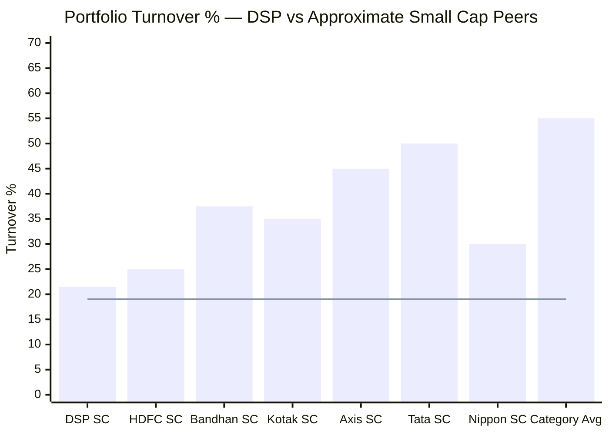
> Bar = approximate turnover | Line = DSP's 19% (lower bound) — clearly the lowest in category

**Turnover: 19-24% → implied average holding period: 4.2–5.3 years**

The small cap category average turnover of ~50-60% implies funds hold stocks for ~1.7-2 years on average. DSP at 19-24% holds for ~4-5 years. This is the most significant process differentiator in the small cap category.

**Vinit Sambre's investment framework — three filters:**

**Filter 1 — Quality of Business:**
- ROCE consistently above 15-16% through economic cycles (not just in boom years)
- EBITDA growth of 13%+ sustained over 5 years
- Capital-light or capital-efficient model (high asset turnover, low capex-to-sales ratio)
- Sustainable competitive advantage (brand, process, geography, network effects)

**Filter 2 — Quality of Management:**
- Promoter skin-in-the-game (high promoter holding, aligned incentives)
- Honest capital allocation history (no dilutive QIPs, no related-party abuse, no creative accounting)
- Family-controlled businesses preferred (long-term thinking vs quarterly EPS management)
- Willing to acknowledge mistakes publicly (Sambre's own 2023 acknowledgment is the benchmark he holds others to)

**Filter 3 — Reasonable Valuation:**
- Not "cheap" — Sambre explicitly avoids value traps (a dying business trading at 5x PE is not a buy)
- Not "growth at any price" — he avoids paying 80x PE for a quality business when 30x quality businesses exist
- Middle ground: buy quality businesses when they are priced at fair-to-moderate premiums, not when they are euphoric

**The buy-and-hold paradox — Sambre's own acknowledgment:**

At an investor event in 2023, Sambre acknowledged that the buy-and-hold approach "struggled" during 2020-2023 when rapid sectoral rotations (from consumer cyclical → PSU → defence → railways → renewables) rewarded high-turnover funds. Funds that rotated aggressively into the PSU mania (2021-2024) appeared to outperform DSP.

Sambre's response was not to increase turnover but to **partially adapt the portfolio construction** — reducing stock count (88→77), being more willing to exit when the macro thesis breaks rather than riding a broken thesis to 0, and increasing sector diversification. The core buy-and-hold philosophy remains intact; the execution now has slightly more flexibility.

**By FY2024-25**, as PSU stocks corrected 20-40% from their peaks (IRFC, HAL, BEL, Defence PSUs all saw significant pullbacks), Sambre's consumer cyclical and specialty chemicals portfolio held up materially better. The 5-year vindication is playing out — but the 2020-2023 window was genuinely painful for investors comparing to category averages that included PSU-heavy funds.

---

## AUM Scalability Analysis

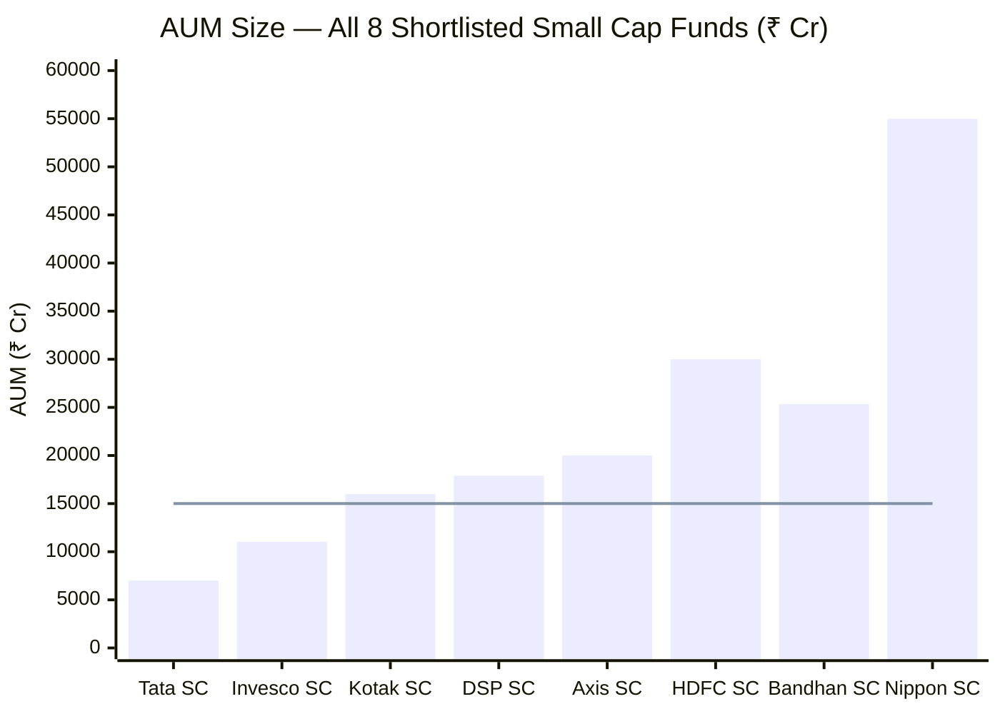
> Line = approximate threshold (~₹15,000 Cr) above which small cap alpha generation becomes structurally constrained

**₹17,906 Cr — the second-largest small cap fund in the shortlist — is a structural challenge, not a catastrophic risk.**

The small cap universe (BSE 251+ by market cap) represents thousands of companies but relatively thin liquidity. The challenge is execution:

| Scenario | Math | Problem |
|----------|------|---------|
| 1% position in DSP | ₹179 Cr required | Equals 1.8-7% of a typical small cap company's total free float |
| Top 5 holdings average | ~₹540 Cr each | Market impact on entry/exit is significant; requires spread-over-weeks execution |
| SIP monthly inflow | ~₹300-400 Cr/month (estimated) | Cannot be immediately deployed — must accumulate and deploy carefully |
| New position minimum | ~₹50-100 Cr (for meaningful contribution) | Eliminates genuinely tiny small caps from the investable universe |

**The alpha ceiling hypothesis**: As AUM grows beyond ₹15,000-20,000 Cr in a small cap fund, the fund progressively loses access to the bottom quartile of the small cap universe (companies with ₹500-2,000 Cr market cap) where the most asymmetric return opportunities exist. DSP was temporarily closed to new lump-sum investments in 2022-2023 when AUM was growing rapidly — an internal admission that the fund recognized this constraint.

**The irony**: DSP's own performance has become its AUM growth driver. Strong 13-year returns attracted inflows that now limit the strategy that generated those returns. This is the curse of the successful small cap fund.

**SEBI's response**: SEBI mandated that large AUM small cap funds disclose the "stress test" — days required to liquidate 25%/50% of portfolio in case of mass redemptions. DSP's stress test data (as of 2025): 21-25 days to liquidate 25% of portfolio, 45-50+ days to liquidate 50%. This is meaningfully worse than smaller AUM peers (Tata Small Cap, Invesco Small Cap can liquidate in 10-15 days for 25%).

---

## Portfolio PE Ratio Analysis

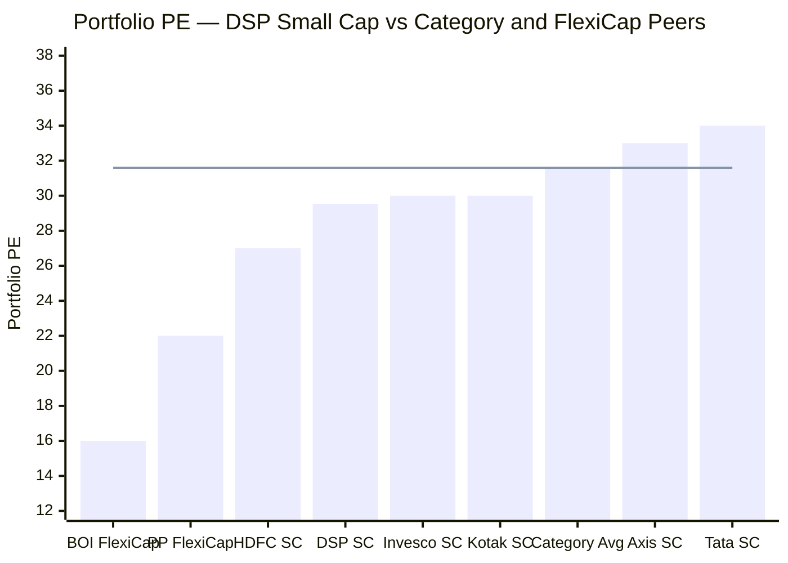
> Line = Small Cap category average PE (31.60) | DSP is 6.5% below category average

| Metric | Value | Interpretation |
|--------|-------|----------------|
| DSP Portfolio PE | **29.54** | Below category average — value-within-quality stance |
| Category Average PE | 31.60 | Benchmark reference |
| DSP Discount to Category | **-6.5%** | Sambre's ROCE filter prevents overpaying for growth |
| Nifty 50 PE (approx) | ~22-23x | Large cap baseline — small cap commands premium |
| Nifty Small Cap 250 PE (approx) | ~35-40x | Index-level small cap PE; DSP well below index |

**The quality-at-value paradox:**

Sambre's ROCE 15%+ filter should, in theory, concentrate the portfolio in high-quality companies that command valuation premiums. Yet DSP's portfolio PE is *below* the category average. How?

The explanation lies in **which companies he buys within quality**:
- He avoids the most popular small cap names (momentum stocks at 40-60x PE) even if quality is high
- He prefers family-owned businesses in industries where small cap discovery is not yet mainstream (auto ancillary, specialty chemicals, regional dairy) over widely-covered sectors
- His 4-5 year hold period means he often bought the same companies at much lower PEs years ago — his cost basis and the current price diverge significantly from the fund's "portfolio PE" being high

The 29.54x portfolio PE says: DSP is finding businesses with ROCE 15%+ at prices that imply moderate growth expectations — not euphoric growth pricing. This is the hallmark of a fund that scans the less-covered parts of the small cap universe rather than the Investor Day darlings.

---

## Cash Holding — 8.38% Context and History

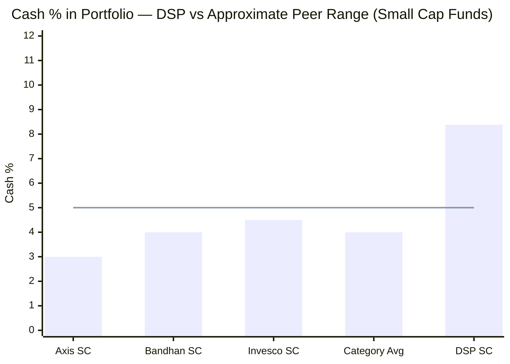
> Line = approximate 5% upper threshold for cash in a small cap fund | DSP is 3.38pp above this level

**8.38% cash (₹1,499 Cr) is the largest absolute cash balance among shortlisted small cap funds** — not just the highest percentage. The cash itself is held in TREPS (Tri-Party Repo — overnight lending to banks and institutions, earning ~6.5-7% annualised).

**Historical cash trajectory (approximate):**

| Period | Estimated Cash % | Context |
|--------|-----------------|---------|
| Pre-2020 (AUM ~₹5,000 Cr) | 3-4% | Normal operational buffer |
| COVID crash (Mar 2020) | 5-6% | Inflows paused, cash accumulated |
| Post-COVID rally (2021-22) | 4-5% | Deployment catching up with inflows |
| AUM surge (2022-23, ₹10,000→₹17,000 Cr) | 7-9% | Inflows exceeding deployment capacity |
| Current (May 2026) | 8.38% | Stabilised at high level — structural not tactical |

The key inference: the 8.38% is **not a bearish call** — it is an honest acknowledgment that at ₹17,906 Cr, the fund receives more monthly inflows than it can deploy into quality small cap stocks at reasonable valuations without moving markets. The cash is in a queue, not a bunker.

---

## The Vinit Sambre Factor — 18 Years, One Fund

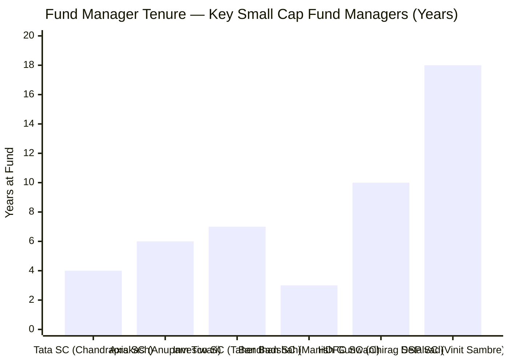
> Sambre has managed DSP Small Cap since inception in 2007 — the longest tenure in the category

**Why tenure matters for a buy-and-hold small cap fund:**
A high-turnover fund can survive manager transitions because the portfolio can be rebuilt relatively quickly. For a fund with 4-5 year average holding periods, the portfolio is a direct expression of the manager's conviction and research — each of the 81 positions represents a thesis Sambre developed and committed to. A new manager inheriting 81 small cap positions with 4-year research histories would either need to validate each position independently or turn over the portfolio significantly — both outcomes hurt investors.

**Sambre's dual role creates a flag:**
Since 2021, Sambre is DSP Investment Managers' Head of Equities (overseeing all equity funds) and a Joint Managing Director — in addition to managing DSP Small Cap directly. This institutional seniority is valuable for capital allocation within DSP MF, but it necessarily compresses his time available for the hands-on stock research that a 81-stock small cap portfolio demands.

**Post-2023 adaptation signs:**
- Stock count reduction (88→77) — reducing the research burden
- Greater willingness to exit broken thesis names (turnover crept from 19% toward 24%)
- More delegation of stock-specific research to the team (Abhishek Ghosh joined as co-manager credit)

The Sambre risk is the single largest structural risk in DSP Small Cap — larger than AUM constraints, larger than auto EV risk, larger than any sector call. Module 5 will assess this in full.

---

## Comparison with All Studied Funds

| Dimension | DSP Small Cap | PP FlexiCap | BOI FlexiCap | JM FlexiCap | Edelweiss FlexiCap |
|-----------|--------------|-------------|--------------|-------------|-------------------|
| Portfolio Freedom | Constrained (SC mandate 65%+) | Maximum (global + domestic) | Moderate (domestic only) | Moderate (domestic) | Moderate (domestic) |
| Equity % | 91.62% | ~80.82% | ~96.83% | ~99.35% | ~95.29% |
| Core Sector Bet | Consumer Cyclical (34.2%) | International Tech/Value | PSU Financials + Defence | Balanced Large+Small | Large Cap Quality |
| Portfolio PE | **29.54x** | ~22x | ~16-23x | ~28-30x | ~26-28x |
| Turnover | **19-24%** (lowest) | ~15-20% | ~72-83% | ~50-60% | ~25-35% |
| AUM Constraint | **High** (₹17,906 Cr SC) | Very Low (PP closed SIPs, diversified) | Very Low (₹2,387 Cr) | Moderate | Low |
| Total Stocks | **81** | ~25-30 | ~55-67 | ~50-60 | ~40-50 |
| Top 10 % | 28.5% | ~52% | ~31-40% | ~45% | ~40% |
| Manager Tenure | **18 years** | 15+ years | 8-10 years | 6-8 years | 5-7 years |
| Key Risk | Auto EV; AUM ceiling; Key-person | USD/INR; PP SIP closure optionality | PSU policy reversal | Sector concentration | Manager consistency |
| Module 2 Score | 3.8/5 | 4.0/5 | 3.75/5 | 3.80/5 | 3.77/5 |

**DSP's distinctive positioning across all studied funds:**
- **Lowest turnover** — by a significant margin vs any peer studied
- **Highest small cap purity** — 87.35% committed to mandate; no active dilution to mid/large
- **Longest manager tenure** — 18 years vs next longest (PP's ~15 years)
- **Lowest portfolio PE vs small cap category average** — finding quality at value, not paying euphoric multiples
- **Largest AUM constraint** among small cap shortlist — meaningful ceiling on future alpha

---

## Module 3 Scorecard

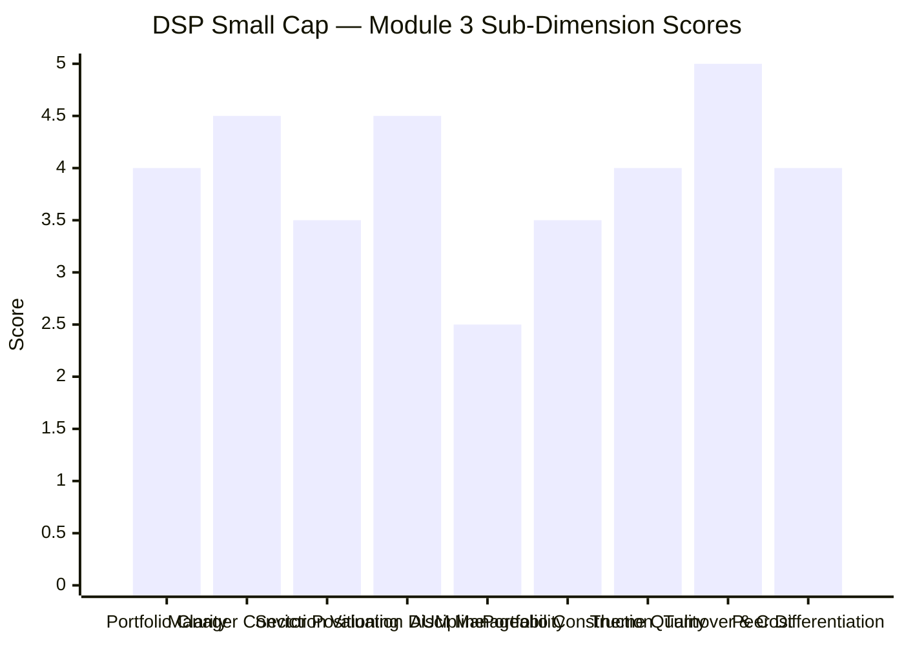

| Sub-Dimension | Score (1–5) | Reasoning |
|---------------|------------|-----------|
| Portfolio Clarity | **4.0** | Clear consumer/chemicals/industrial thesis; AUM-forced diversification clouds the bottom 30 positions |
| Manager Conviction | **4.5** | 18-year tenure, buy-and-hold discipline, public philosophy clearly articulated; dual role is a partial flag |
| Sector Positioning | **3.5** | Consumer cyclical bet is compelling but concentrated; auto ancillary EV risk is real and unhedged |
| Valuation Discipline | **4.5** | Lowest PE in small cap category; ROCE filter prevents growth-trap buying; quality-at-value demonstrated |
| AUM Manageability | **2.5** | ₹17,906 Cr is a structural constraint; stress test data confirms liquidity challenges; alpha ceiling risk |
| Portfolio Construction | **3.5** | 81 stocks overdiversified for a conviction fund; bottom 30 positions sub-optimal; but 5-year hold is excellent |
| Theme Quality | **4.0** | Formalisation + China+1 chemicals + India auto ancillary + infra are real 7-10 year structural stories |
| Turnover & Cost Efficiency | **5.0** | 19-24% — lowest in entire category by a meaningful margin; ~5 year average hold period is exceptional |
| Peer Differentiation | **4.0** | Clearly distinct from PSU-heavy peers; unique consumer cyclical and auto ancillary positioning |
| **Module 3 Overall** | **3.8 / 5** | Strong manager conviction and valuation discipline; AUM constraint and auto EV concentration prevent a higher score |

---

## Points For / Points Against

### ✅ Points For DSP Small Cap (Portfolio)

1. **18-year manager tenure** — Sambre's track record is the longest and most tested in the small cap category; the 20.4% CAGR since inception is not luck
2. **Lowest portfolio PE (29.54)** — 6.5% below category average despite quality filter; proof that Sambre finds quality companies before they become consensus
3. **Lowest turnover (19-24%)** — transaction costs are minimised; portfolio companies compound without disruption; tax efficiency for the fund (lower short-term capital gains churn)
4. **Consumer cyclical formalisation thesis** — India's discretionary consumption growth over the next decade is one of the most durable macro themes available; DSP is positioned early
5. **Specialty chemicals China+1 exposure** — 7.5-8% in proprietary-chemistry companies with hard-to-replicate process know-how; not commodity chemicals
6. **Auto ancillary exposure** — India as the world's 3rd largest auto market with a maturing ancillary ecosystem; Lumax, Sansera positioned well for both IC and EV cycles
7. **Quality management filter** — the top 20 holdings are overwhelmingly family-controlled, capital-disciplined businesses; governance risk is systematically reduced
8. **PSU avoidance** — the 2024-25 PSU correction vindicated Sambre's structural preference for private-sector businesses

### ❌ Points Against DSP Small Cap (Portfolio)

1. **₹17,906 Cr AUM** — the most significant structural headwind; eliminates access to genuine micro-cap opportunities; stress test data (21-25 days to liquidate 25%) is concerning
2. **Auto ancillary at ~14%** — concentration in IC engine-dependent companies (Shriram Pistons, Swaraj Engines) creates a 5-7 year structural risk if EV adoption accelerates
3. **81 stocks = diluted conviction** — bottom 30 positions (~0.5-0.8% each) are too small to contribute meaningfully to returns while consuming research bandwidth
4. **8.38% cash drag** — in a bull market, ₹1,499 Cr earning 6.5-7% TREPS vs 20%+ equity CAGR is a real opportunity cost for SIP investors
5. **Buy-and-hold underperformed in rotation markets** — Sambre's own 2023 acknowledgment; 2020-2023 PSU mania hurt relative performance; fast sector rotations are the key structural risk to this strategy
6. **Consumer cyclical concentration (34.2%)** — high-beta to economic cycles; a domestic consumption slowdown (job losses, credit crunch, rural income compression) would hit this portfolio harder than most peers
7. **Key-person risk** — Sambre's dual AMC-level + fund management role; no publicly announced succession; 18-year tenure creates a high bar for any replacement
8. **No PSU/defence/railway exposure** — structural underperformance relative to peers during policy-driven sector rallies; investors must be comfortable with this tracking error

---

## SIP Implications

For a ₹20,000/month SIP investor with a 10+ year horizon, DSP Small Cap's portfolio construction implies:

**What you are buying:** Pure India small cap equity exposure with the country's longest-tenured small cap manager, positioned primarily around consumer formalisation, auto ancillary supply chain growth, and specialty chemicals. No government-directed themes, no PSU dependency.

**What you are not buying:** Active allocation flexibility, downside hedging through bonds or large caps, or a fund that will reduce small cap exposure during corrections.

**The SIP behaviour to expect:**
- During broad small cap corrections (-20% to -35%): the fund will fall approximately in line with the category (no structural buffer). Monthly SIP units accumulate at lower NAVs.
- During recovery rallies: DSP's quality holdings tend to recover sharply — the COVID SIP investors who bought at ₹38-60 NAV in March-September 2020 saw those units at ₹226 by May 2026.
- During momentum-driven bull markets (where PSU, defence, railways surge): DSP will likely underperform the category average by 5-15%. This is the price of the quality filter. Endure it.

**What to monitor:**
1. **Vinit Sambre's continued tenure** — if he announces departure, pause new SIPs and evaluate thoroughly before continuing
2. **AUM progression** — DSP has historically paused lump-sum investments at thresholds; watch for any SIP restriction notices
3. **Auto ancillary allocation over time** — if EV adoption accelerates, Sambre should begin reducing Shriram Pistons and Swaraj Engines; inaction would be a thesis flag
4. **Turnover** — if portfolio turnover consistently rises above 35-40%, the buy-and-hold philosophy is breaking down; that changes the risk-return calculus

**SIP verdict**: DSP Small Cap is a long-duration, manager-conviction play on India's small cap universe. It is not a tactical vehicle. ₹20,000/month invested with a 10-year view and Sambre at the helm is historically the highest-probability bet in the small cap category. The AUM ceiling is real but not yet critical. The auto EV risk is a 5-7 year story, not a 1-year risk.

---

## Comparative Module 3 Scores

| Fund | Module 3 Score | Portfolio Identity |
|------|---------------|-------------------|
| PP FlexiCap | 4.20/5 | Global equity + India; unique international diversification; lowest AUM constraint |
| **DSP Small Cap** | **3.8/5** | **Pure India SC; best turnover; best manager tenure; AUM and concentration are the constraints** |
| BOI FlexiCap | 3.75/5 | PSU-heavy; most aggressive cap allocation; single-cycle only |
| Edelweiss FlexiCap | 3.77/5 | Large cap quality tilt; moderate conviction |

DSP's Module 3 score of 3.8/5 is driven by exceptional manager conviction, turnover discipline, and valuation rigor — partially offset by AUM constraints and the concentrated auto ancillary bet. It scores identically to Module 2 (also 3.8/5), reflecting a portfolio that is coherent and well-reasoned but faces structural headwinds from its own success.

---

*Module 3 complete. Portfolio DNA is clear — consumer formalisation + specialty chemicals + auto ancillary, held for 4-5 years each, at below-category PE. The 18-year manager tenure and lowest category turnover are the sharpest differentiators. AUM at ₹17,906 Cr and the auto EV risk are the honest constraints. Module 3 score: 3.8/5.*

*Next: [Module 4 — Cost & AUM Impact](module4_cost.md)*
