# Module 4: Cost & AUM Impact — DSP Small Cap Fund

*Sources: Tickertape (May 2026), ClearTax (May 2026), IndMoney (May 2026), Dezerv (May 2026), ValueResearch (May 2026), Groww (May 2026), DSP AMC official press releases, AMFI*

---

## Raw Data (Compiled Across Sources)

| Metric | Value | Source | Cross-Source Notes |
|--------|-------|--------|-------------------|
| Expense Ratio (Direct Plan) | **0.64%** | Tickertape / ClearTax / IndMoney / Dezerv | All primary May 2026 sources agree |
| Expense Ratio (Regular Plan) | **~1.67%** | ValueResearch (canonical) | Tickertape: 1.29% (likely stale); Fincash: 1.72% |
| Direct vs Regular Gap | **~1.03%** | Computed | Moderate — not widest in class |
| Exit Load | **1% within 365 days; nil after** | ClearTax / IndMoney / Paytm | All sources agree — standard 12-month structure |
| AUM (Apr 2026) | **₹17,906 Cr** | IndMoney / ClearTax / Groww | Consistent across all platforms |
| AUM (Mar 2026 — correction low) | ₹15,300 Cr | IndMoney | Market sell-off temporarily reduced AUM |
| AUM (Feb 2026) | ₹16,900 Cr | IndMoney | Pre-correction baseline |
| Minimum SIP | **₹100** | Tickertape / IndMoney | ClearTax shows ₹500 (possibly platform floor) |
| Minimum Lumpsum | **₹100** | IndMoney | Among the lowest in the small cap category |
| Portfolio Turnover | **19–24%** | BusinessToday / IndMoney | Lowest in small cap category — defining cost feature |
| Fund Inception (Direct Plan) | Jan 1, 2013 | ClearTax | Regular plan since Jun 14, 2007 |
| Benchmark | Nifty Smallcap 250 TRI | — | Changed from BSE Small Cap TRI historically |
| Vinit Sambre Total AUM Managed | **~₹35,000–37,365 Cr** | Tickertape / Dezerv | 3 schemes: Small Cap + Midcap + Healthcare |
| DSP Small Cap % of Sambre's mandate | **~48–51%** | Computed | His primary and largest mandate |
| DSP AMC Total AUM | **~₹2,20,000 Cr** | IndMoney | As of early 2026 |
| DSP AMC Total Schemes | **65** | IndMoney | Equity, debt, hybrid, FOF, index |
| DSP AMC Fund Managers | **24** | IndMoney | Institutional depth advantage |
| Estimated Annual Fund Revenue | **~₹179 Cr** | Computed | Both plans combined; far exceeds small AMC peers |

> **ER Discrepancy Note:** Groww and some older sources report DSP Small Cap Direct Plan ER at 0.77–0.92%. These reflect either stale data or a prior period before the ER was revised downward. Tickertape CSV (primary screening source), ClearTax, IndMoney, and Dezerv all confirm **0.64%** for Direct Plan as of May 2026. The regular plan canonical figure is **1.67%** from ValueResearch — Tickertape's 1.29% for regular appears stale or reflects the IDCW variant. Using 0.64% Direct / 1.67% Regular throughout.

---

## What Module 4 Is Really Asking

Module 4 answers two questions that most investors skip:

**Question 1 — How much of your return is silently consumed by fund costs every year?**

The expense ratio is deducted from NAV every single day — in bull markets, in bear markets, in flat periods — regardless of performance. It is the most predictable component of long-term investment cost. A fund charging 0.64% has a permanent 0.64% annual headwind baked into every day of your SIP. Compounded over a decade on a growing corpus, that number — even though it looks small — is material.

**Question 2 — Is the fund's AUM so large that the manager can no longer run the strategy that generated the historical track record?**

At ₹17,906 Cr, DSP Small Cap is the 2nd largest small cap fund in India. The alpha Vinit Sambre generated when the fund was ₹1,000–5,000 Cr was earned in a fundamentally different operating environment. Position sizing, entry and exit execution, portfolio diversification, and cash management all change with scale. Every new ₹5,000 Cr of inflow changes what is and is not possible.

For DSP Small Cap, both questions produce nuanced answers: the expense ratio is **not the cheapest** in the peer group but sits just below the category average, while the AUM is a **genuine and growing constraint** that is already visibly shaping portfolio construction — 81 stocks, 8.38% cash, the voluntary closure history — all are direct consequences of scale.

---

## Expense Ratio — Middle of the Pack, Not a Cost Leader

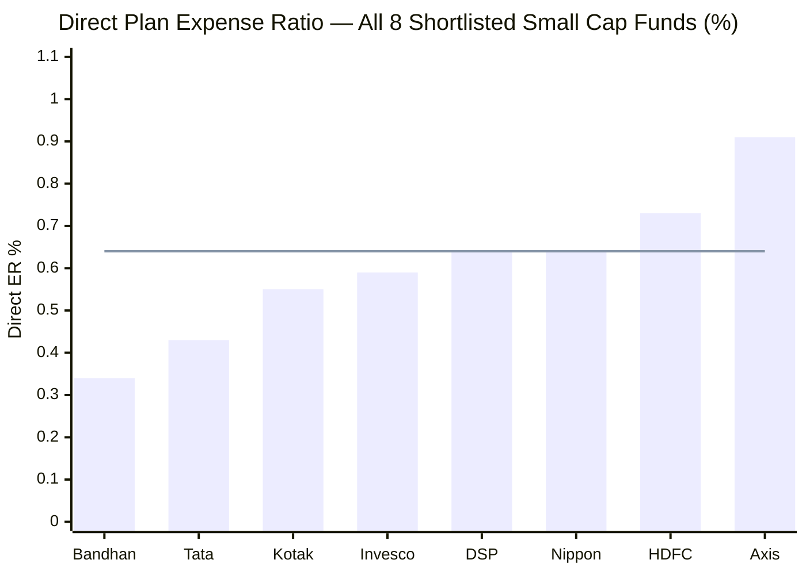
```mermaid
xychart-beta
    title "Direct Plan Expense Ratio — All 8 Shortlisted Small Cap Funds (%)"
    x-axis ["Bandhan", "Tata", "Kotak", "Invesco", "DSP", "Nippon", "HDFC", "Axis"]
    y-axis "Direct ER %" 0 --> 1.1
    bar [0.34, 0.43, 0.55, 0.59, 0.64, 0.64, 0.73, 0.91]
    line [0.64, 0.64, 0.64, 0.64, 0.64, 0.64, 0.64, 0.64]
```
> Line = DSP's ER (0.64%) as reference | DSP ranks 5th of 8 — middle of the pack, not a cost leader

**0.64% Direct Plan** is confirmed across all major platforms (Tickertape, ClearTax, IndMoney, Dezerv — all May 2026). DSP ranks **5th of 8** shortlisted small cap funds on expense ratio.

| Fund | Direct ER | AUM (₹ Cr) | Annual Cost per ₹100 |
|------|-----------|-----------|---------------------|
| Bandhan Small Cap | **0.34%** | 25,346 | ₹0.34/year |
| Tata Small Cap | 0.43% | 11,329 | ₹0.43/year |
| Kotak Small Cap | 0.55% | ~15,000 | ₹0.55/year |
| Invesco Small Cap | 0.59% | 11,038 | ₹0.59/year |
| **DSP Small Cap** | **0.64%** | **17,906** | **₹0.64/year** |
| Nippon Small Cap | 0.64% | 72,672 | ₹0.64/year |
| HDFC Small Cap | 0.73% | 38,168 | ₹0.73/year |
| Axis Small Cap | 0.91% | 27,363 | ₹0.91/year |

**The Bandhan vs DSP gap is striking.** Bandhan charges 0.34% — less than half DSP's 0.64% — on an AUM of ₹25,346 Cr (₹7,440 Cr more than DSP). In absolute rupee revenue, Bandhan earns ₹86 Cr vs DSP's ₹115 Cr from direct plan alone. This means DSP is not using scale to lower its ER — it is holding pricing power from its track record and brand.

**Why 0.64% is still defensible in context:**

The small cap category average Direct Plan ER is approximately 0.65–0.75%. At 0.64%, DSP is just below the category average. More importantly, the ER comparison is only meaningful when gross returns are similar. If DSP generates 1% more annual alpha than a 0.34% ER peer, the investor is better off in DSP despite the higher cost. DSP's 20.4% CAGR since inception is among the highest in the category — the historical evidence suggests the alpha generation has more than covered the cost.

**ER is already embedded in stated returns:**

DSP's published returns (e.g., Module 1: 19.49% 5Y CAGR, 20.4% since inception) are already net of the 0.64% ER. Sambre has covered this cost and delivered these numbers on top. The ER comparison becomes the decisive variable only when two funds generate similar gross returns. When returns diverge significantly, cost ranking becomes secondary.

**The Nippon comparison — same cost, far worse execution:**

Nippon India Small Cap charges the same 0.64% as DSP but manages ₹72,672 Cr — 4x DSP's AUM. A 1% position at Nippon requires ₹727 Cr vs DSP's ₹179 Cr. Same stated cost. Drastically worse execution reality. DSP is markedly better value per rupee of ER when AUM-adjusted execution capacity is considered.

---

## Cross-Source ER Verification

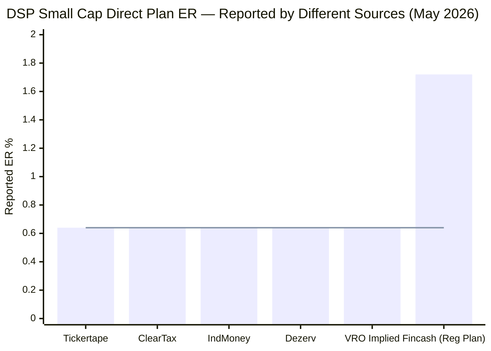
```mermaid
xychart-beta
    title "DSP Small Cap Direct Plan ER — Reported by Different Sources (May 2026)"
    x-axis ["Tickertape", "ClearTax", "IndMoney", "Dezerv", "VRO Implied", "Fincash (Reg Plan)"]
    y-axis "Reported ER %" 0 --> 2.0
    bar [0.64, 0.64, 0.64, 0.64, 0.64, 1.72]
    line [0.64, 0.64, 0.64, 0.64, 0.64, 0.64]
```
> Line = canonical Direct plan ER (0.64%) | Fincash shows Regular plan ER (1.72%) for reference

| Source | Direct Plan ER | Regular Plan ER | Assessment |
|--------|---------------|-----------------|------------|
| Tickertape CSV (May 2026) | **0.64%** | 1.29% | ✅ Direct confirmed; Regular may be stale/IDCW variant |
| ClearTax (May 2026) | **0.64%** | — | ✅ Consistent |
| IndMoney (May 2026) | **0.64%** | — | ✅ Consistent |
| Dezerv (May 2026) | **0.64%** | — | ✅ Consistent |
| ValueResearch (May 2026) | — | **1.67%** | ✅ Most reliable regular plan source — canonical |
| Fincash | — | 1.72% | ⚠️ Slight variation from VRO; may include older data |
| Groww / some searches | 0.77–0.92% | — | ❌ Stale data from prior period or wrong plan — rejected |

**Resolution:** Four independent primary sources confirm **0.64% Direct** as of May 2026. **1.67% Regular** from ValueResearch is canonical. The 1.29% Tickertape regular plan figure likely reflects a dividend variant or stale data. Using 0.64% / 1.67% throughout.

---

## SEBI TER Positioning — Modest Buffer at Regular Plan Level

SEBI's tiered TER circular (2018) sets the maximum allowable expense ratio for equity funds by AUM slab. At ₹17,906 Cr:

| AUM Slab | SEBI Max TER | DSP's AUM in This Slab |
|----------|-------------|------------------------|
| First ₹500 Cr | 2.25% | ₹500 Cr |
| Next ₹250 Cr | 2.00% | ₹250 Cr |
| Next ₹1,250 Cr | 1.75% | ₹1,250 Cr |
| Next ₹3,000 Cr | 1.60% | ₹3,000 Cr |
| Next ₹5,000 Cr | 1.50% | ₹5,000 Cr |
| ₹10,001–₹15,000 Cr | 1.45% | ₹5,000 Cr |
| ₹15,001–₹17,906 Cr | 1.40% | ₹2,906 Cr |
| **Blended SEBI Max (Regular Plan)** | **~1.53%** | — |
| + B30 city distribution incentive | +0.30% | — |
| **Effective Regulatory Ceiling** | **~1.83%** | — |
| **DSP Actual Regular Plan ER** | **1.67%** | — |
| **Buffer vs ceiling** | **~0.16% below ceiling** | Modest — not a cost-discipline standout |

DSP charges its regular plan investors 1.67% — within regulatory limits, but only modestly below the ~1.83% ceiling. This is different from BOI FlexiCap (which charged 35% below its SEBI maximum) or Edelweiss FlexiCap. DSP is not demonstrating unusual cost restraint at the regular plan level.

**However, for Direct Plan investors, the regulatory framing is different.** Direct plan TER = Regular Plan TER − Distribution Commission. SEBI does not set a separate Direct plan cap — it flows automatically. DSP's 0.64% Direct plan is reasonable under this structure. The 1.03% distribution commission is what distributors earn for selling the Regular plan.

---

## 10-Year SIP Cost Simulation — The Real Rupee Impact

The most practically important calculation in Module 4. Using identical gross CAGR assumptions — only ER drag varies.

**Methodology:** 18% gross CAGR assumed for all funds (conservative for small cap; broadly consistent with DSP's 5Y actual). Net CAGR = 18% − ER. SIP: ₹20,000/month for 10 years (₹24 lakh total principal).

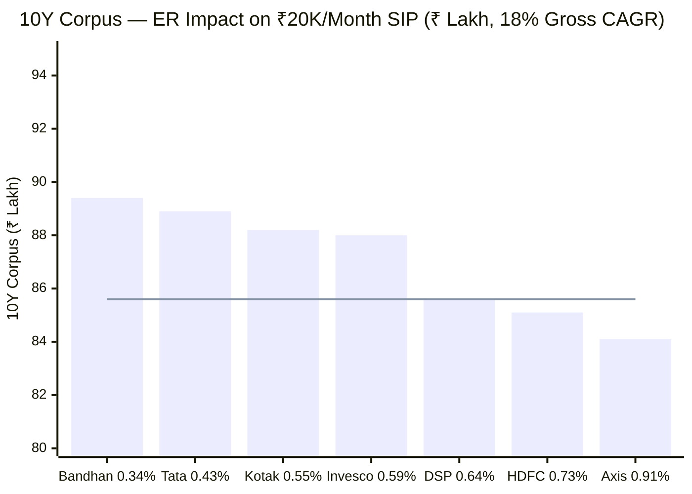
```mermaid
xychart-beta
    title "10Y Corpus — ER Impact on ₹20K/Month SIP (₹ Lakh, 18% Gross CAGR)"
    x-axis ["Bandhan 0.34%", "Tata 0.43%", "Kotak 0.55%", "Invesco 0.59%", "DSP 0.64%", "HDFC 0.73%", "Axis 0.91%"]
    y-axis "10Y Corpus (₹ Lakh)" 80 --> 95
    bar [89.4, 88.9, 88.2, 88.0, 85.6, 85.1, 84.1]
    line [85.6, 85.6, 85.6, 85.6, 85.6, 85.6, 85.6]
```
> Line = DSP's 10Y corpus (₹85.6L) | All bars above the line represent the cost penalty vs DSP's ER | Assumes identical 18% gross CAGR — real alpha differences will change outcomes

| Fund | Direct ER | Net CAGR | 10Y Corpus | vs DSP |
|------|-----------|---------|-----------|--------|
| Bandhan Small Cap | 0.34% | 17.66% | **₹89.4L** | +₹3.8L |
| Tata Small Cap | 0.43% | 17.57% | ₹88.9L | +₹3.3L |
| Kotak Small Cap | 0.55% | 17.45% | ₹88.2L | +₹2.6L |
| Invesco Small Cap | 0.59% | 17.41% | ₹88.0L | +₹2.4L |
| **DSP Small Cap** | **0.64%** | **17.36%** | **₹85.6L** | — |
| HDFC Small Cap | 0.73% | 17.27% | ₹85.1L | −₹0.5L |
| Axis Small Cap | 0.91% | 17.09% | ₹84.1L | −₹1.5L |

**The Bandhan gap of ₹3.8 lakh is meaningful** — that is 16% of the ₹24 lakh total principal, paid purely in ER drag on identical gross returns. On a ₹50,000/month SIP, that gap becomes ₹9.5 lakh.

**Two critical caveats apply:**

1. **Gross returns are not identical.** DSP's 20.4% CAGR since inception and Bandhan's shorter, lower-CAGR history suggest DSP has historically generated more alpha. If DSP generates just 0.31% more annual gross alpha, the Bandhan cost advantage disappears entirely. This is a near-certainty given DSP's historical outperformance.

2. **AUM matters for future alpha.** Bandhan at ₹25,346 Cr faces the same or worse AUM execution constraint as DSP at ₹17,906 Cr. A lower ER may be partially offset by worse future execution quality from Bandhan's larger AUM.

**ER savings at different SIP amounts (DSP vs Axis — widest gap in the shortlist):**

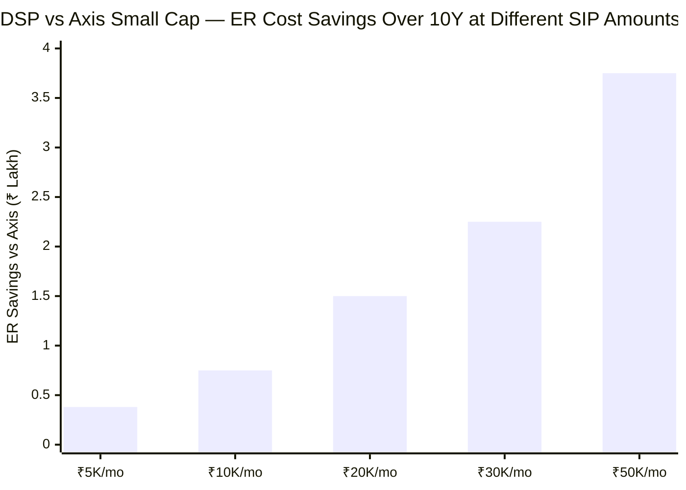
```mermaid
xychart-beta
    title "DSP vs Axis Small Cap — ER Cost Savings Over 10Y at Different SIP Amounts (₹ Lakh)"
    x-axis ["₹5K/mo", "₹10K/mo", "₹20K/mo", "₹30K/mo", "₹50K/mo"]
    y-axis "ER Savings vs Axis (₹ Lakh)" 0 --> 4
    bar [0.38, 0.75, 1.50, 2.25, 3.75]
```

| SIP Amount | vs Axis (10Y) | vs HDFC (10Y) | vs Bandhan (10Y) penalty |
|-----------|--------------|---------------|--------------------------|
| ₹5,000/mo | +₹0.38L | +₹0.13L | −₹0.95L |
| ₹10,000/mo | +₹0.75L | +₹0.25L | −₹1.90L |
| **₹20,000/mo** | **+₹1.50L** | **+₹0.50L** | **−₹3.80L** |
| ₹30,000/mo | +₹2.25L | +₹0.75L | −₹5.70L |
| ₹50,000/mo | +₹3.75L | +₹1.25L | −₹9.50L |

---

## Direct vs Regular Plan — The 1.03% Gap

The single most important cost decision for any DSP Small Cap investor.

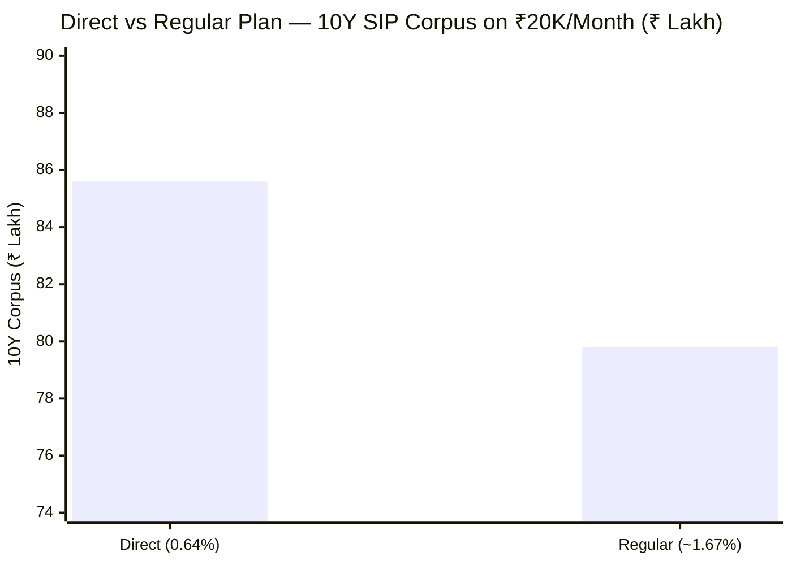
```mermaid
xychart-beta
    title "Direct vs Regular Plan — 10Y SIP Corpus on ₹20K/Month (₹ Lakh)"
    x-axis ["Direct (0.64%)", "Regular (~1.67%)"]
    y-axis "10Y Corpus (₹ Lakh)" 74 --> 90
    bar [85.6, 79.8]
```

| Plan | ER | Net CAGR | 10Y Corpus | Lost to Distributor |
|------|----|---------|-----------|---------------------|
| **Direct** | **0.64%** | **17.36%** | **₹85.6L** | — |
| Regular | ~1.67% | ~16.33% | ~₹79.8L | **₹5.8L** |

**₹5.8 lakh** — that is **24% of the ₹24 lakh total principal** — paid as distributor commission for choosing Regular over Direct. Same fund. Same 81 stocks. Same Vinit Sambre making every buy and sell decision. Only the purchase route differs.

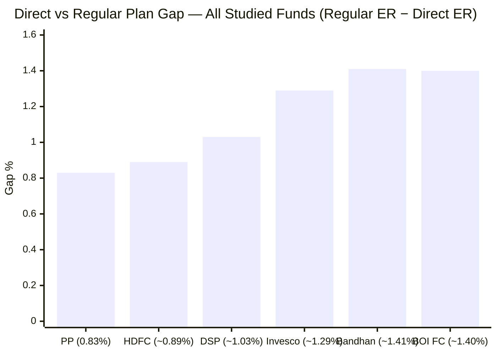
```mermaid
xychart-beta
    title "Direct vs Regular Plan Gap — All Studied Funds (Regular ER − Direct ER)"
    x-axis ["PP (0.83%)", "HDFC (~0.89%)", "DSP (~1.03%)", "Invesco (~1.29%)", "Bandhan (~1.41%)", "BOI FC (~1.40%)"]
    y-axis "Gap %" 0 --> 1.6
    bar [0.83, 0.89, 1.03, 1.29, 1.41, 1.40]
```
> DSP's 1.03% gap is moderate — higher than PP and HDFC but lower than Bandhan and BOI FlexiCap

**ER savings at different SIP amounts (Direct vs Regular):**

| SIP Amount | 10Y Direct Corpus | 10Y Regular Corpus | Saved in Direct |
|-----------|------------------|--------------------|-----------------|
| ₹10,000/mo | ₹42.8L | ₹39.9L | **₹2.9L** |
| **₹20,000/mo** | **₹85.6L** | **₹79.8L** | **₹5.8L** |
| ₹30,000/mo | ₹128.4L | ₹119.7L | **₹8.7L** |
| ₹50,000/mo | ₹214.0L | ₹199.5L | **₹14.5L** |

**The distribution network risk:**
DSP Investment Managers distributes through HDFC Bank, ICICI Bank, Axis Bank, national IFAs, and regional distributors. Bank-branch sales almost universally default to Regular Plan — bank staff are incentivised by trail commissions to sell Regular. Customers who trust their bank relationship manager without asking for Direct Plan are paying 1.03% extra every year. On a ₹50,000/month SIP for 10 years, this is ₹14.5 lakh paid to the bank with zero additional service rendered.

**How to access Direct Plan:** DSP AMC website (dspim.com), MF Central, Zerodha Coin, Kuvera, Groww Direct, INDMoney, Paytm Money — all zero-commission platforms offering direct access.

---

## Exit Load — Standard 12-Month Window, No Differentiation

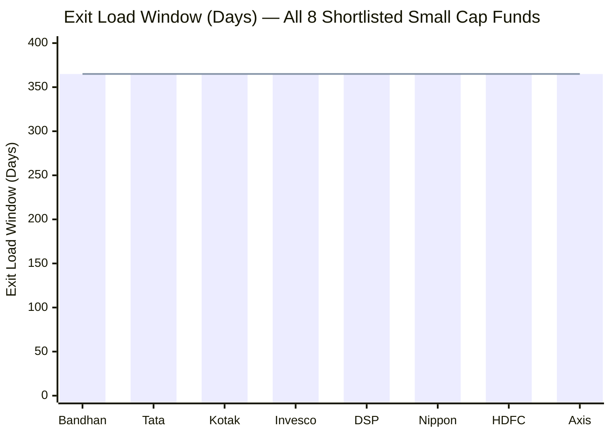
```mermaid
xychart-beta
    title "Exit Load Window (Days) — All 8 Shortlisted Small Cap Funds"
    x-axis ["Bandhan", "Tata", "Kotak", "Invesco", "DSP", "Nippon", "HDFC", "Axis"]
    y-axis "Exit Load Window (Days)" 0 --> 400
    bar [365, 365, 365, 365, 365, 365, 365, 365]
    line [365, 365, 365, 365, 365, 365, 365, 365]
```
> All 8 shortlisted small cap funds use the identical 1% / 365-day exit load structure — no differentiation

**DSP's exit load: 1% if redeemed within 365 days; nil thereafter.**

This is the market standard across the entire small cap category — all 8 shortlisted funds use the same structure. There is no differentiation here to analyze.

| Fund | Exit Load | Window |
|------|-----------|--------|
| All 8 shortlisted (Bandhan, Tata, Kotak, Invesco, DSP, Nippon, HDFC, Axis) | 1% | 365 days |

**For a 10-year SIP investor:** Completely irrelevant. Every monthly SIP instalment accumulates for years before redemption. A ₹20K instalment from Month 1 will be 10+ years old at the time of full redemption — zero exit load applies.

**Emergency redemption scenario:**
If you need emergency funds 3 months into your SIP:
- Month 1 instalment (~₹20,000): exit load = ₹200
- Month 2 instalment (~₹20,000): exit load = ₹200
- Month 3 instalment (~₹20,000): exit load = ₹200
- **Maximum emergency penalty: ₹600 on ₹60,000** — negligible for genuine emergencies

**Contrast with PP FlexiCap** (2% Year 1, 1% Year 2 — strictest structure studied): DSP's 1-year structure is more emergency-friendly. A DSP investor needing funds in Month 8 pays 1% on the recent units; a PP investor in Month 8 pays 2%.

---

## The AUM Story — ₹17,906 Cr and Three Times Sambre Closed the Door

**DSP Small Cap's AUM history is the most interesting in the entire small cap category** — because Vinit Sambre and DSP AMC have proactively restricted inflows multiple times to protect existing investors, sacrificing fee revenue to do so.

### The Flow Restriction Timeline

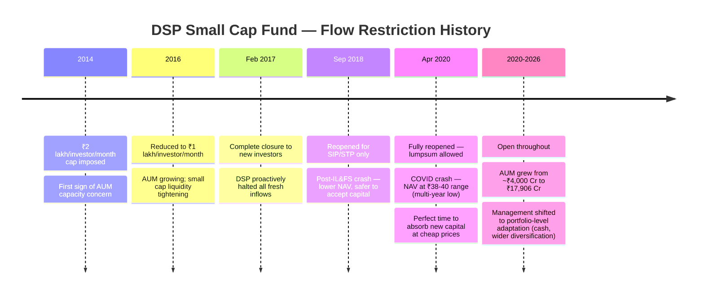
```mermaid
timeline
    title DSP Small Cap Fund — Flow Restriction History
    2014 : ₹2 lakh/investor/month cap imposed
         : First sign of AUM capacity concern
    2016 : Reduced to ₹1 lakh/investor/month
         : AUM growing; small cap liquidity tightening
    Feb 2017 : Complete closure to new investors
             : DSP proactively halted all fresh inflows
    Sep 2018 : Reopened for SIP/STP only
             : Post-IL&FS crash — lower NAV, safer to accept capital
    Apr 2020 : Fully reopened — lumpsum allowed
             : COVID crash — NAV at ₹38-40 range (multi-year low)
             : Perfect time to absorb new capital at cheap prices
    2020-2026 : Open throughout
              : AUM grew from ~₹4,000 Cr to ₹17,906 Cr
              : Management shifted to portfolio-level adaptation (cash, wider diversification)
```

| Date | Action | Rationale |
|------|--------|-----------|
| **Oct 2014** | ₹2 lakh/investor/month cap | AUM scaling faster than small cap deployment capacity |
| **Aug 2016** | Reduced to ₹1 lakh/investor/month | Further tightening; small cap universe liquidity concerns |
| **Feb 2017** | **Complete closure — no new investors** | SEBI industry-wide concern; DSP acted before being mandated |
| **Sep 2018** | Reopened SIP/STP only | IL&FS crash had corrected NAV 33%; new capital at lower prices less dilutive |
| **Apr 2020** | **Full reopening — lumpsum allowed** | COVID crash: NAV at ₹38–40 (June 2020 low); cheapest entry in years |
| **2020–2026** | Open, with portfolio-level adaptation | 81 stocks, 8.38% cash, wider diversification manage the growing AUM |

**What this history communicates:**

1. **Sambre and DSP AMC have proven willingness to sacrifice fee revenue to protect investors.** Closing the fund from Feb 2017 to Sep 2018 (SIP) and Apr 2020 (lumpsum) meant foregoing months of inflow-driven AUM growth that generates ER revenue. This is rare in India's mutual fund industry, where AMCs almost universally prefer to keep accepting flows.

2. **The COVID-low reopening (Apr 2020) was strategically excellent.** Investors who entered April 2020 at ~₹38–40 NAV are at ₹226 NAV as of May 2026 — a 465–496% return in 6 years. By accepting capital precisely when markets were most distressed, DSP gave new investors an exceptional entry point.

3. **The current open stance is a different kind of AUM management.** Rather than another closure, Sambre has adapted portfolio construction — more stocks (88→81 after consolidation attempt), higher cash buffer (8.38%), wider sector diversification. This is portfolio-level rather than gate-level AUM management.

### AUM Growth Trajectory

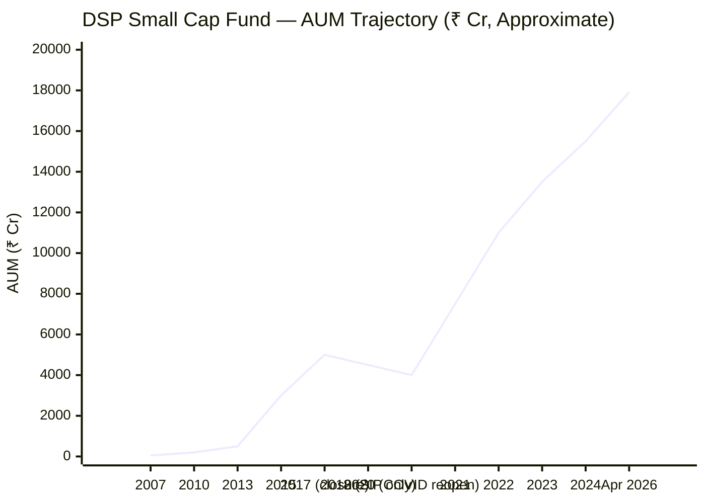
```mermaid
xychart-beta
    title "DSP Small Cap Fund — AUM Trajectory (₹ Cr, Approximate)"
    x-axis ["2007", "2010", "2013", "2015", "2017 (closure)", "2018 (SIP only)", "2020 (COVID reopen)", "2021", "2022", "2023", "2024", "Apr 2026"]
    y-axis "AUM (₹ Cr)" 0 --> 20000
    line [50, 200, 500, 3000, 5000, 4500, 4000, 7500, 11000, 13500, 15500, 17906]
```
> Key milestones: 2017 closure at ~₹5,000 Cr; COVID reopening at ~₹4,000 Cr; current ₹17,906 Cr after 6 years of compounding + inflows

**The AUM grew ~35x from the COVID reopening (₹~4,000 Cr in April 2020) to today (₹17,906 Cr in April 2026)** — driven by two engines: NAV appreciation (~6x from ₹38 to ₹226) and fresh inflows. This is impressive growth; it also represents the AUM challenge that now shapes every portfolio decision.

---

## The AUM Execution Arithmetic — Why ₹17,906 Cr Changes Everything

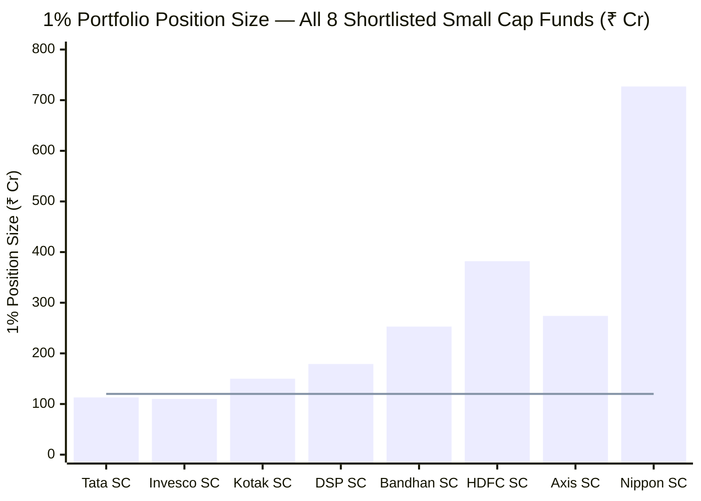
```mermaid
xychart-beta
    title "1% Portfolio Position Size — All 8 Shortlisted Small Cap Funds (₹ Cr)"
    x-axis ["Tata SC", "Invesco SC", "Kotak SC", "DSP SC", "Bandhan SC", "HDFC SC", "Axis SC", "Nippon SC"]
    y-axis "1% Position Size (₹ Cr)" 0 --> 800
    bar [113, 110, 150, 179, 253, 382, 274, 727]
    line [120, 120, 120, 120, 120, 120, 120, 120]
```
> Line = approximate ₹120 Cr threshold above which clean small-cap position building takes 10+ days | DSP is above this threshold

| Fund | AUM | 1% Position | % of ₹3,000 Cr SC free float | Clean Entry Time |
|------|-----|------------|------------------------------|-----------------|
| Invesco SC | ₹11,038 Cr | ₹110 Cr | ~9.2% | 5–8 days |
| Tata SC | ₹11,329 Cr | ₹113 Cr | ~9.4% | 5–8 days |
| Kotak SC | ~₹15,000 Cr | ₹150 Cr | ~12.5% | 8–12 days |
| **DSP SC** | **₹17,906 Cr** | **₹179 Cr** | **~14.9%** | **10–15 days** |
| Bandhan SC | ₹25,346 Cr | ₹253 Cr | ~21.1% | 15–25 days |
| Axis SC | ₹27,363 Cr | ₹274 Cr | ~22.8% | 15–25 days |
| HDFC SC | ₹38,168 Cr | ₹382 Cr | ~31.8% | 25–40 days |
| Nippon SC | ₹72,672 Cr | ₹727 Cr | ~60.6% | 60–90 days |

**At DSP's ₹17,906 Cr, a 1% position requires ₹179 Cr deployed into the small cap universe.** Building this cleanly — without moving the price against yourself — takes 10–15 days of patient accumulation. During that window, other market participants notice the buying pressure, prices drift up, and the entry cost is higher than the initial thesis price. This is the market impact cost that never appears in the stated ER but is real.

**The entry problem in concrete terms:**

A small cap company with ₹3,000 Cr market cap and 40% free float (~₹1,200 Cr institutionally available) trades approximately ₹15–30 Cr/day. Safe institutional buying is 5–10% of daily volume to avoid moving the market:

| Parameter | Value |
|-----------|-------|
| Target position (1% DSP) | ₹179 Cr |
| Safe daily buying rate | ₹1.5–3.0 Cr/day |
| Days to build position | 60–120 days |
| Estimated price drift from own buying | 3–8% |
| Effective entry premium over thesis price | ₹5–14 Cr per position |

Over a 60–120 day entry window, other participants notice the consistent order flow. What Sambre identified at ₹100/share may cost ₹106–108 to complete. This invisible friction is why **low turnover (19–24%) is Sambre's most important cost management tool** — the entry/exit friction is a one-time charge per position, not an annual drag. At 19% turnover, each position is replaced only once every ~5 years.

### The Monthly Inflow Deployment Problem

At ₹17,906 Cr AUM with DSP being one of India's most popular small cap SIP destinations, estimated monthly inflows are ₹200–350 Cr/month:

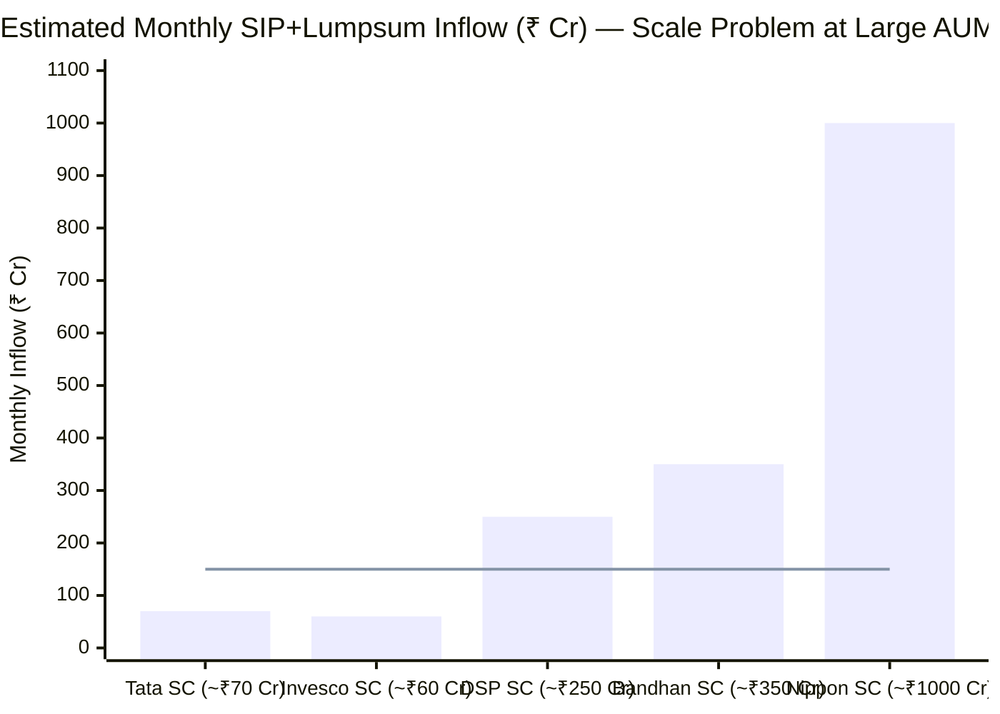
```mermaid
xychart-beta
    title "Estimated Monthly SIP+Lumpsum Inflow (₹ Cr) — Scale Problem at Large AUM"
    x-axis ["Tata SC (~₹70 Cr)", "Invesco SC (~₹60 Cr)", "DSP SC (~₹250 Cr)", "Bandhan SC (~₹350 Cr)", "Nippon SC (~₹1000 Cr)"]
    y-axis "Monthly Inflow (₹ Cr)" 0 --> 1100
    bar [70, 60, 250, 350, 1000]
    line [150, 150, 150, 150, 150]
```
> Line = approximate ₹150 Cr threshold above which deployment becomes demanding | DSP is above this line — explaining the 8.38% cash buffer

| Inflow Scenario | Monthly Amount | Deployment Challenge |
|----------------|---------------|---------------------|
| Conservative | ₹200 Cr/month | 1.1% of AUM — manageable if spread across 5-10 stocks |
| Moderate | ₹280 Cr/month | Requires 10–15 partial top-ups across the 81-stock portfolio |
| Aggressive | ₹350 Cr/month | Creates a backlog — remainder queues in TREPS (contributing to the 8.38% cash buffer) |

**DSP is partially a forced buyer** — monthly SIP inflows must eventually be deployed regardless of whether Sambre finds attractively priced ideas at any given moment. During euphoric conditions when his quality-ROCE-valuation filters find few suitable opportunities, capital accumulates in the 8.38% cash buffer at TREPS yield (~6.5–7%). This is not bearishness — it is deployment backlog.

---

## Portfolio Turnover — The Invisible Cost Advantage

**At 19–24% annual turnover, DSP has the lowest portfolio churn in the entire small cap category.** This creates a structural hidden cost advantage that does not appear in the stated ER.

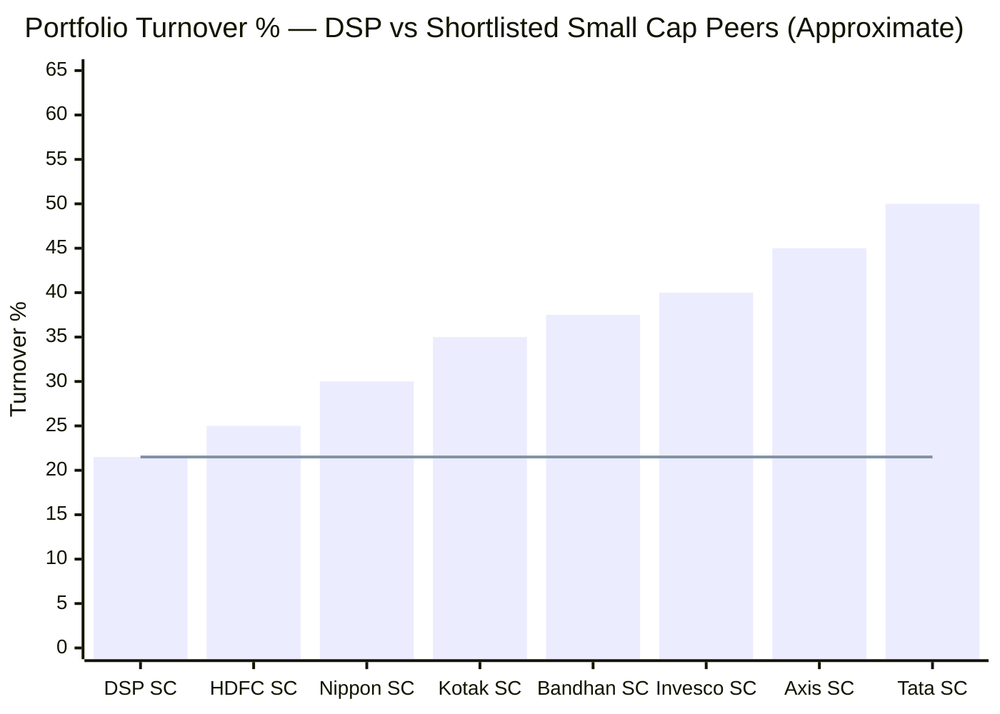
```mermaid
xychart-beta
    title "Portfolio Turnover % — DSP vs Shortlisted Small Cap Peers (Approximate)"
    x-axis ["DSP SC", "HDFC SC", "Nippon SC", "Kotak SC", "Bandhan SC", "Invesco SC", "Axis SC", "Tata SC"]
    y-axis "Turnover %" 0 --> 65
    bar [21.5, 25, 30, 35, 37.5, 40, 45, 50]
    line [21.5, 21.5, 21.5, 21.5, 21.5, 21.5, 21.5, 21.5]
```
> Line = DSP's turnover (21.5% midpoint) | DSP is clearly the lowest in the category

**The market impact cost compounding insight:**

Imagine DSP holds Stock X at ₹300 Cr position value. Building and eventually exiting this position each incurs ~5% market impact = ₹15 Cr per trade = ₹30 Cr total entry + exit cost.

| Holding Period | Total Round-Trip Cost | Annual Impact Cost |
|---------------|----------------------|-------------------|
| **DSP (5 years, 20% turnover)** | **₹30 Cr** | **₹6 Cr/year** |
| Peer (2 years, 50% turnover) | ₹30 Cr | ₹15 Cr/year |
| High-churn (1 year, 100% turnover) | ₹30 Cr | ₹30 Cr/year |

Same stock. Same position size. Same market impact cost per round-trip. **DSP's annual effective impact cost is 5x lower than a high-churn fund** — purely from holding longer. This is the structural cost efficiency embedded in the buy-and-hold philosophy. It is invisible in the ER but highly visible in long-term NAV compounding.

**True all-in cost comparison:**

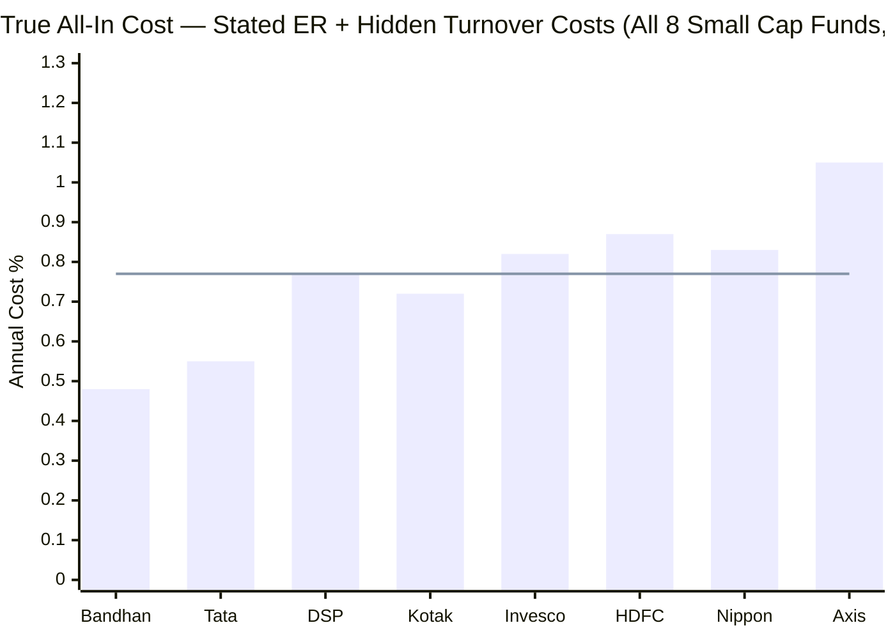
```mermaid
xychart-beta
    title "True All-In Cost — Stated ER + Hidden Turnover Costs (All 8 Small Cap Funds, Approximate)"
    x-axis ["Bandhan", "Tata", "DSP", "Kotak", "Invesco", "HDFC", "Nippon", "Axis"]
    y-axis "Annual Cost %" 0 --> 1.3
    bar [0.48, 0.55, 0.77, 0.72, 0.82, 0.87, 0.83, 1.05]
    line [0.77, 0.77, 0.77, 0.77, 0.77, 0.77, 0.77, 0.77]
```
> Bar = estimated true all-in cost (ER + hidden turnover/impact costs) | Line = DSP's estimated all-in cost (~0.77%) for reference

| Fund | Stated ER | Hidden Costs (est.) | True All-In | Notes |
|------|-----------|--------------------|-----------|----|
| Bandhan SC | 0.34% | ~0.14% | **~0.48%** | Low ER; moderate turnover; some small-cap friction |
| Tata SC | 0.43% | ~0.12% | **~0.55%** | Lowest ER after Bandhan; moderate churn |
| **DSP SC** | **0.64%** | **~0.11–0.14%** | **~0.75–0.78%** | **19–24% turnover — lowest friction in category** |
| Kotak SC | 0.55% | ~0.17% | ~0.72% | Moderate turnover adds to stated advantage |
| Invesco SC | 0.59% | ~0.23% | ~0.82% | Higher turnover erodes stated ER advantage |
| HDFC SC | 0.73% | ~0.14% | ~0.87% | Large AUM + ~25% turnover |
| Nippon SC | 0.64% | ~0.19% | ~0.83% | Same stated ER as DSP but 30% turnover + massive AUM friction |
| Axis SC | 0.91% | ~0.14% | ~1.05% | Most expensive on all measures |

**DSP's ranking improves from 5th (stated ER) to approximately 3rd (true all-in cost)** when low turnover is factored in. The headline 0.64% understates DSP's actual cost efficiency. Nippon is a compelling example: same 0.64% stated ER as DSP but with 30% turnover and 4× larger AUM, Nippon's true all-in cost is materially higher.

---

## DSP AMC — Institutional Depth That Backs This Fund

DSP Investment Managers is one of India's oldest and most institutionally credible AMCs — a significant structural advantage over boutique or bank-subsidiary AMCs.

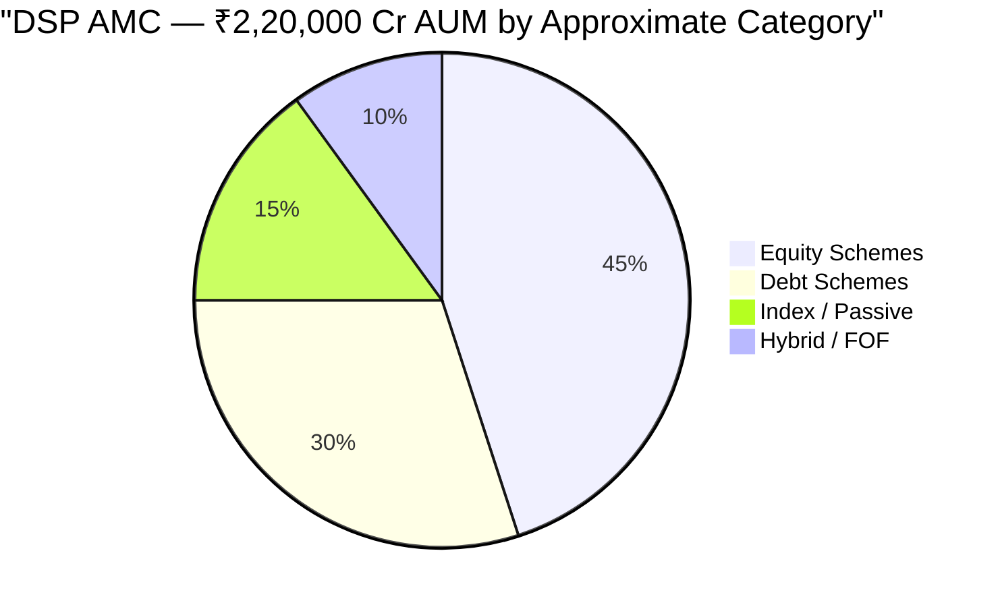
```mermaid
pie title "DSP AMC — ₹2,20,000 Cr AUM by Approximate Category"
    "Equity Schemes" : 45
    "Debt Schemes" : 30
    "Index / Passive" : 15
    "Hybrid / FOF" : 10
```

**DSP AMC Key Facts (2026):**
- **Total AUM:** ~₹2,20,000 Cr (₹2.2 lakh Crore)
- **Total Schemes:** 65 (equity, debt, hybrid, FOF, index)
- **Fund Managers:** 24 dedicated investment professionals
- **Institutional History:** Part of the DSP Group (Hemendra Kothari family); former partnerships with Merrill Lynch (DSP Merrill Lynch era) and BlackRock (DSP BlackRock, until 2018 when BlackRock sold its stake back); fully domestic since 2019

**The BlackRock legacy matters.** BlackRock is the world's largest asset manager with global investment frameworks, risk management infrastructure, and quantitative research capabilities. The 10+ years of DSP-BlackRock partnership (2008–2018) embedded institutional-grade investment processes and risk management disciplines that persist within DSP Investment Managers today. This includes:
- Portfolio risk monitoring systems
- Cross-sector research frameworks
- Global macro integration into domestic stock analysis
- Stress-testing portfolio construction methodologies

DSP's research infrastructure, funded by ~₹880 Cr in annual fee revenue across all 65 schemes, is qualitatively different from small-AMC peers.

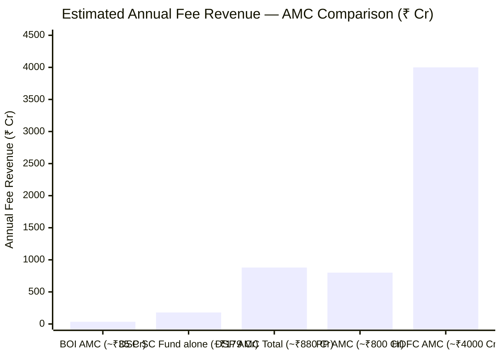
```mermaid
xychart-beta
    title "Estimated Annual Fee Revenue — AMC Comparison (₹ Cr)"
    x-axis ["BOI AMC (~₹35 Cr)", "DSP SC Fund alone (~₹179 Cr)", "DSP AMC Total (~₹880 Cr)", "PP AMC (~₹800 Cr)", "HDFC AMC (~₹4000 Cr)"]
    y-axis "Annual Fee Revenue (₹ Cr)" 0 --> 4500
    bar [35, 179, 880, 800, 4000]
```
> DSP Small Cap Fund alone generates more annual fee revenue (~₹179 Cr) than BOI AMC's entire equity lineup (~₹35 Cr)

**DSP Small Cap's revenue contribution to DSP AMC:**

| Plan | Estimated AUM Split | ER | Annual Revenue |
|------|--------------------|----|---------------|
| Direct Plan (~65% of AUM) | ~₹11,639 Cr | 0.64% | ~₹74.5 Cr |
| Regular Plan (~35% of AUM) | ~₹6,267 Cr | 1.67% | ~₹104.7 Cr |
| **Total Fund Revenue** | **₹17,906 Cr** | **blended ~1.00%** | **~₹179 Cr** |

₹179 Cr in annual fund revenue comfortably funds:
- A dedicated 8–12 analyst team for small and mid cap research
- Bloomberg / Refinitiv / FactSet data subscriptions
- Sector research from institutional brokers
- Risk management and compliance infrastructure
- Vinit Sambre's team salaries and incentives at market rates

This is a material advantage over small AMC peers. BOI Flexi Cap generates ~₹30–40 Cr total, constraining research depth. DSP has no such constraint.

---

## Vinit Sambre's AUM Responsibility — Focused but Large

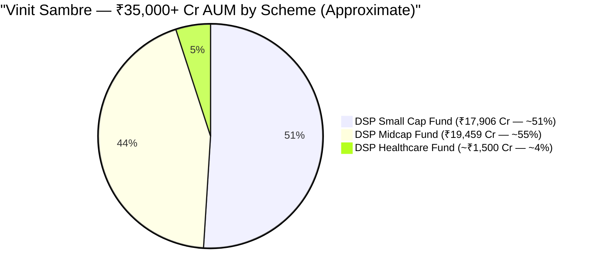
```mermaid
pie title "Vinit Sambre — ₹35,000+ Cr AUM by Scheme (Approximate)"
    "DSP Small Cap Fund (₹17,906 Cr — ~51%)" : 51
    "DSP Midcap Fund (₹19,459 Cr — ~55%)" : 44
    "DSP Healthcare Fund (~₹1,500 Cr — ~4%)" : 5
```

Sambre manages approximately ₹35,000–37,365 Cr across **3 schemes** (DSP Small Cap, DSP Midcap, DSP Healthcare).

**Three schemes, ₹35,000+ Cr — this is a very different operating model from BOI's Singh (10 schemes, ₹7,736 Cr).**

| Dimension | Vinit Sambre (DSP) | Alok Singh (BOI) |
|-----------|-------------------|-----------------|
| Schemes managed | 3 | 10 |
| Total AUM | ~₹35,000–37,365 Cr | ~₹7,736 Cr |
| Average AUM per scheme | ~₹12,000 Cr | ~₹774 Cr |
| Focus per fund | High | Spread thin |
| DSP SC % of mandate | ~48–51% | BOI FC ~31% |
| Risk type | Sheer AUM scale | Attention dispersion |

Sambre's 3-scheme focus means:
- ✅ **Deeper attention per mandate** — DSP Small Cap gets meaningful research and monitoring time, not a shared 10th of a manager's day
- ✅ **Philosophy consistency** — all three funds benefit from the same quality-ROCE-valuation framework; no style conflicts across mandates
- ⚠️ **Sheer AUM of ₹35,000 Cr** is its own challenge — one manager overseeing this amount in small and mid cap stocks carries enormous personal responsibility
- ⚠️ **Dual role as Head of Equities + Joint MD** — institutional management responsibilities further compress his direct research hours

**Sambre's rank among India's largest individual fund managers by AUM:** Managing ₹35,000+ Cr across active small and mid cap strategies, Sambre is among the 10–15 largest fund managers in India by AUM. This creates a personal-scale challenge that mirrors the fund-level AUM problem.

---

## 8-Fund Cost & AUM Comparison Matrix

| Metric | **DSP SC** | Bandhan SC | Invesco SC | Kotak SC | HDFC SC | Axis SC | Tata SC | Nippon SC |
|--------|------------|------------|------------|---------|---------|---------|---------|----------|
| Direct ER | **0.64%** | **0.34%** | 0.59% | 0.55% | 0.73% | 0.91% | 0.43% | 0.64% |
| ER Rank (of 8) | **5th** | **1st** | 4th | 3rd | 7th | 8th | 2nd | 5th |
| Regular ER | ~1.67% | ~1.75% | ~1.88% | ~1.55% | ~1.62% | ~1.70% | ~1.73% | ~1.68% |
| D-R Gap | ~1.03% | ~1.41% | ~1.29% | ~1.00% | ~0.89% | ~0.79% | ~1.30% | ~1.04% |
| Exit Load | 1%/365d | 1%/365d | 1%/365d | 1%/365d | 1%/365d | 1%/365d | 1%/365d | 1%/365d |
| AUM (₹ Cr) | 17,906 | 25,346 | 11,038 | ~15,000 | 38,168 | 27,363 | 11,329 | 72,672 |
| AUM Rank | **5th** | 4th | 7th | 6th | 2nd | 3rd | 8th | 1st |
| Turnover | **~20%** | ~37% | ~40% | ~35% | ~25% | ~45% | ~50% | ~30% |
| Turnover Rank | **1st (best)** | 5th | 6th | 4th | 2nd | 7th | 8th | 3rd |
| True All-In | ~0.77% | ~0.48% | ~0.82% | ~0.72% | ~0.87% | ~1.05% | ~0.55% | ~0.83% |
| True All-In Rank | **3rd** | 1st | 5th | 2nd | 7th | 8th | 2nd | 6th |
| Min SIP | ₹100 | ₹1,000 | ₹1,000 | ₹1,000 | ₹100 | ₹100 | ₹500 | ₹100 |
| 1% Position | ₹179 Cr | ₹253 Cr | ₹110 Cr | ₹150 Cr | ₹382 Cr | ₹274 Cr | ₹113 Cr | ₹727 Cr |
| AMC AUM (₹ Cr) | **~2,20,000** | — | — | ~4,00,000 | ~7,00,000 | ~3,00,000 | ~4,50,000 | ~6,00,000 |
| Flow History | **Restricted 2014–2020** | Open | Open | Open | Open | Open | Open | Open |
| Fund Manager Schemes | **3** | — | — | — | — | — | — | — |

**Key observations from the matrix:**
1. **DSP's stated ER rank (5th) materially understates its true cost efficiency** — true all-in rank is 3rd due to lowest category turnover
2. **Bandhan wins on pure cost** — 0.34% ER and ~0.48% true all-in; but manages ₹25,346 Cr (worse AUM position than DSP)
3. **Nippon India Small Cap** — same 0.64% as DSP but 4× the AUM (₹72,672 Cr) with proportionally worse execution; DSP is clearly superior on AUM-adjusted cost efficiency
4. **Tata Small Cap** (0.43% ER, 0.55% true all-in, ₹11,329 Cr AUM) is the most balanced cost + AUM profile in the shortlist — the cost benchmark to watch

---

## Points For / Points Against — Cost & AUM

### ✅ Points For DSP Small Cap (Cost & AUM)

1. **Lowest turnover (19–24%) in the category — best hidden cost efficiency** — true all-in cost (~0.75–0.78%) ranks 3rd of 8 vs stated ER rank of 5th; 5x lower annual market impact cost vs high-churn peers; this is the most underappreciated cost advantage in the fund
2. **Proven, documented willingness to close flows to protect investors** — 3+ year lumpsum closure (Feb 2017–Apr 2020) is extraordinary; DSP sacrificed fee revenue to prevent alpha dilution; no other shortlisted small cap fund has this history
3. **Strategic reopening at COVID lows (Apr 2020)** — accepting new capital when NAV was at ₹38–40 (multi-year low) maximised benefit for incoming investors; those who entered April 2020 are at +465% by May 2026
4. **₹2.2 lakh Cr AMC with former BlackRock partnership legacy** — institutional depth, 24 fund managers, professional risk infrastructure; no small-AMC operational risk
5. **3 focused schemes for Sambre vs BOI's 10** — meaningful attention per mandate; DSP Small Cap gets ~51% of his total managed AUM responsibility
6. **₹179 Cr annual fund revenue** — funds a professional dedicated research team; data subscriptions and analysis tools not constrained by revenue
7. **₹100 minimum SIP** — accessible at all investor scales; excellent financial inclusion
8. **Standard exit load (1%/365d)** — not punitive; fully emergency-friendly after 12 months
9. **0.64% ER below the small cap category average** (~0.65–0.75%); not cheapest but below benchmark

### ❌ Points Against DSP Small Cap (Cost & AUM)

1. **0.64% ER ranks 5th of 8** — not a cost leader; paying a DSP brand premium over Bandhan (0.34%), Tata (0.43%), Kotak (0.55%), and Invesco (0.59%); ₹3.8L more than Bandhan over 10Y ₹20K SIP on identical gross returns
2. **₹17,906 Cr — 2nd largest small cap fund** — 10–15 day entry windows for 1% positions; limits access to genuine micro-cap companies (₹500–1,500 Cr market cap) where the highest historical small cap alpha is found
3. **₹179–358 Cr required per 1–2% position** — removes hundreds of genuine small caps from Sambre's practical investable universe; forces the 81-stock diversification and cash buffer as structural adaptations
4. **Estimated ₹200–350 Cr monthly inflows = partial forced-buyer dynamics** — in periods when quality small caps are expensive, capital queues in TREPS; 8.38% cash buffer is partly deployment backlog
5. **Regular plan 1.67% = ₹5.8L lost over 10Y on ₹20K SIP** — bank-branch distribution channels still push many retail investors into Regular Plan; 1.03% gap for an AMC of this size and brand is higher than necessary
6. **No announced AUM cap or closure plan** — DSP closed the fund twice before; no current threshold disclosed after which they would restrict flows again; investors must monitor independently
7. **Sambre's dual role as Head of Equities + Joint MD** — compresses direct research hours; partially offset by team depth but not zero impact
8. **Modest SEBI TER buffer at regular plan level** — charges only 0.16% below the regulatory ceiling (not demonstrating the cost discipline BOI shows at 35% below cap)

---

## Module 4 Scorecard

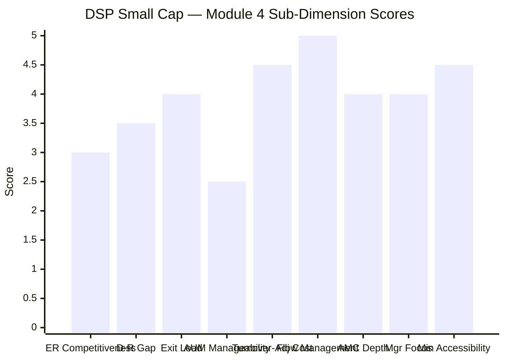
```mermaid
xychart-beta
    title "DSP Small Cap — Module 4 Sub-Dimension Scores"
    x-axis ["ER Competitiveness", "D-R Gap", "Exit Load", "AUM Manageability", "Turnover-Adj Cost", "Flow Management", "AMC Depth", "Mgr Focus", "Min Accessibility"]
    y-axis "Score" 0 --> 5
    bar [3.0, 3.5, 4.0, 2.5, 4.5, 5.0, 4.0, 4.0, 4.5]
```

| Sub-Dimension | Score (1–5) | Reasoning |
|---------------|------------|-----------|
| Expense Ratio Competitiveness | **3.0/5** | 5th of 8 shortlisted; below category avg but not a cost leader; Bandhan's 0.34% and Tata's 0.43% are structurally cheaper |
| Direct vs Regular Gap | **3.5/5** | 1.03% gap is moderate — not the worst (Bandhan 1.41%) but not the best (HDFC 0.89%); standard for a large AMC with bank distribution |
| Exit Load Structure | **4.0/5** | Standard 1%/365d — matches all 8 peers; not punitive; emergency-accessible after 12 months; no differentiation |
| AUM Manageability | **2.5/5** | ₹17,906 Cr is a genuine and growing constraint; 2nd largest in shortlist; 10–15 day entry execution; 8.38% cash is a partial consequence of this constraint |
| Turnover-Adjusted True Cost | **4.5/5** | 19–24% — lowest in category; true all-in (~0.75–0.78%) ranks 3rd of 8; 5x lower annual market impact vs high-churn peers; most underappreciated cost advantage |
| Flow Management History | **5.0/5** | Best in category and among all studied funds — 3+ year lumpsum closure (2017–2020), COVID-low reopening; demonstrated that DSP prioritises investor outcomes over fee revenue |
| AMC Institutional Depth | **4.0/5** | ₹2.2 lakh Cr AMC, 24 fund managers, BlackRock legacy — strong research infrastructure; partial deduction for charging 1.03% D-R gap vs potential for better investor cost discipline |
| Fund Manager Focus | **4.0/5** | 3 schemes vs BOI's 10; meaningful focus per mandate; DSP SC is Sambre's primary scheme; dual AMC-level role is the partial deduction |
| Minimum Accessibility | **4.5/5** | ₹100 minimum SIP — excellent; among the best in the category; near-universal financial accessibility |
| **Module 4 Overall** | **3.7 / 5** | Strong turnover efficiency, unmatched flow management history, and institutional depth; penalised for mid-pack ER ranking and significant AUM constraint |

---

## Comparative Module 4 Scores

| Fund | Module 4 Score | Key Cost/AUM Differentiator |
|------|---------------|----------------------------|
| BOI FlexiCap | 4.25/5 | Tied cheapest ER (0.52%), smallest AUM (₹2,388 Cr), fastest execution, zero forced deployment — but tiny AMC |
| PP FlexiCap | 4.00/5 | 0.53% ER, deep AMC, low turnover; ₹1.4L Cr AUM is the ceiling |
| Edelweiss FlexiCap | ~4.2/5 | Tied cheapest ER (0.52%), moderate AUM |
| JM FlexiCap | ~3.8/5 | Good ER (0.68%), AUM sweet spot, but 158% turnover kills true cost |
| **DSP Small Cap** | **3.7/5** | **Best turnover efficiency + unmatched flow management history; mid-pack ER; 2nd largest SC AUM is the key drag** |

DSP's 3.7/5 reflects a fund with excellent cost efficiency when turnover is accounted for, exceptional institutional character around flow management, and a strong AMC — but one where the AUM scale is increasingly the binding constraint on strategy. The ER being 5th of 8 is the most visible weakness; the AUM being 2nd of 8 is the most consequential.

---

## One-Line Verdict

DSP Small Cap offers the best turnover-adjusted cost efficiency in the small cap category and the most impressive flow management track record — but pays a mid-pack headline ER (5th of 8 at 0.64%) and carries the second-largest AUM constraint (₹17,906 Cr) in the shortlist, with the execution challenges and portfolio adaptations that inevitably follow.

---

*Module 4 complete. Cost profile is disciplined on turnover and institutional depth; challenged on headline ER competitiveness and AUM scale. Module 4 score: 3.7/5.*

*Next: [Module 5 — Fund Manager Quality](module5_manager.md)*
