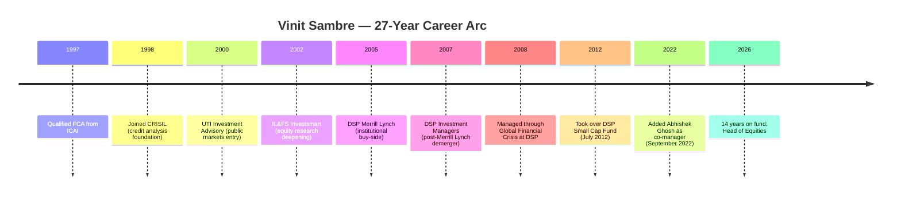
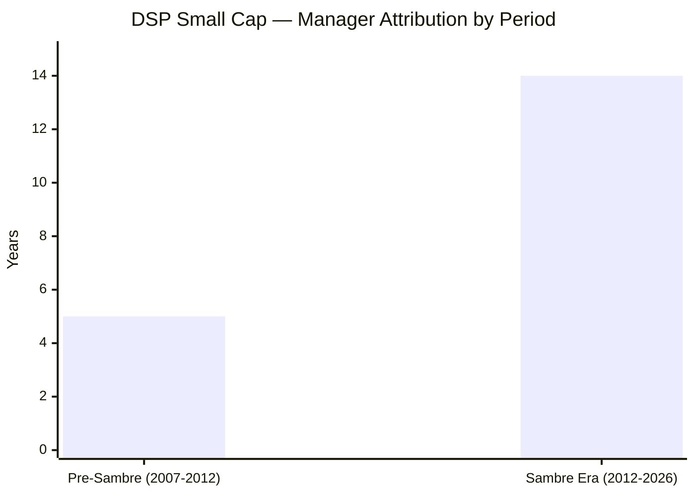
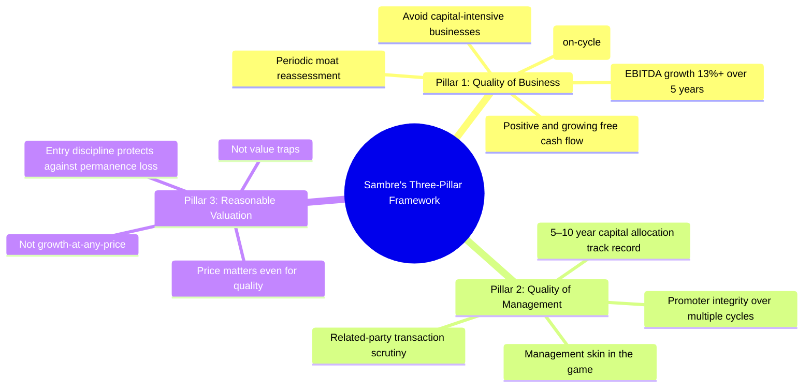
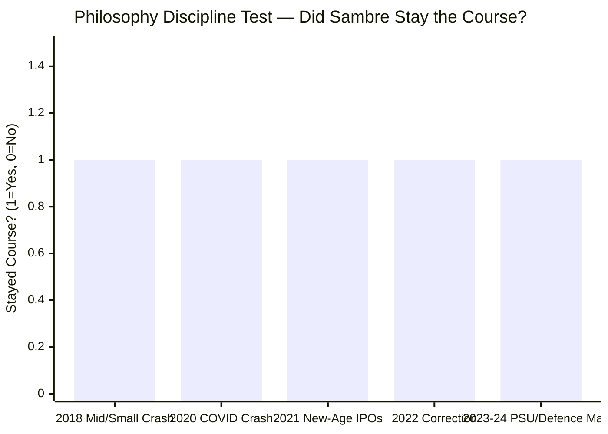
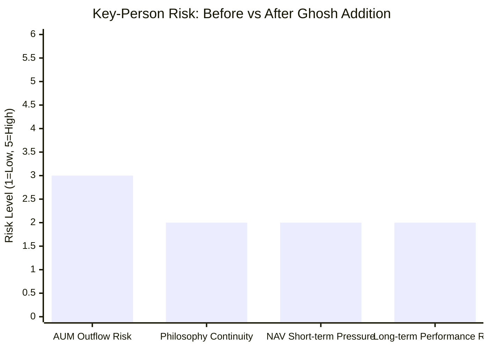
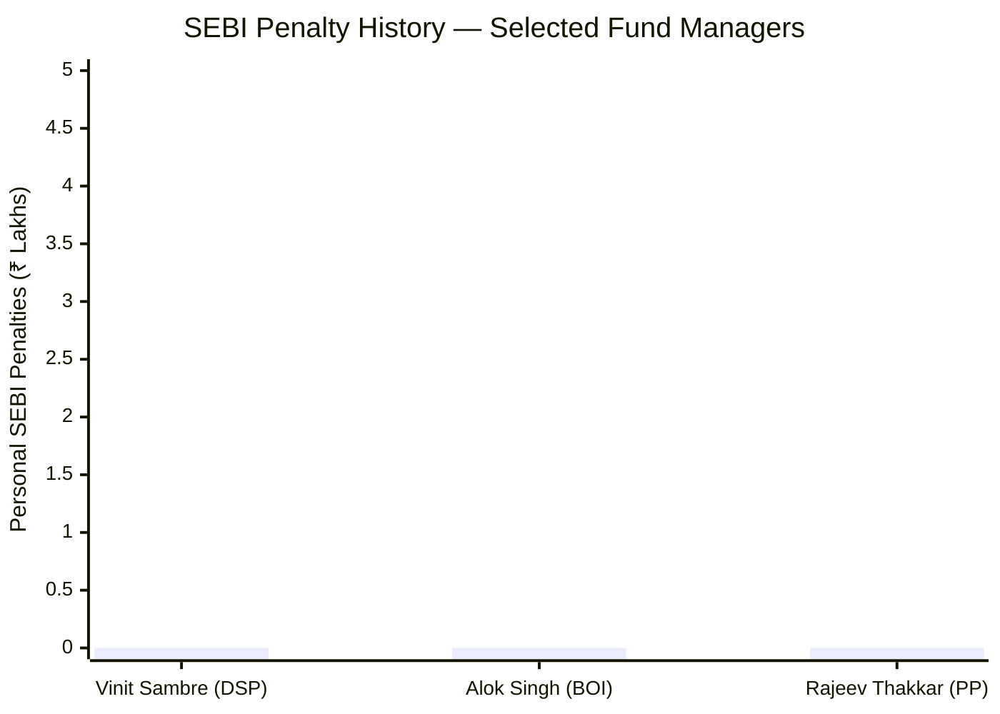
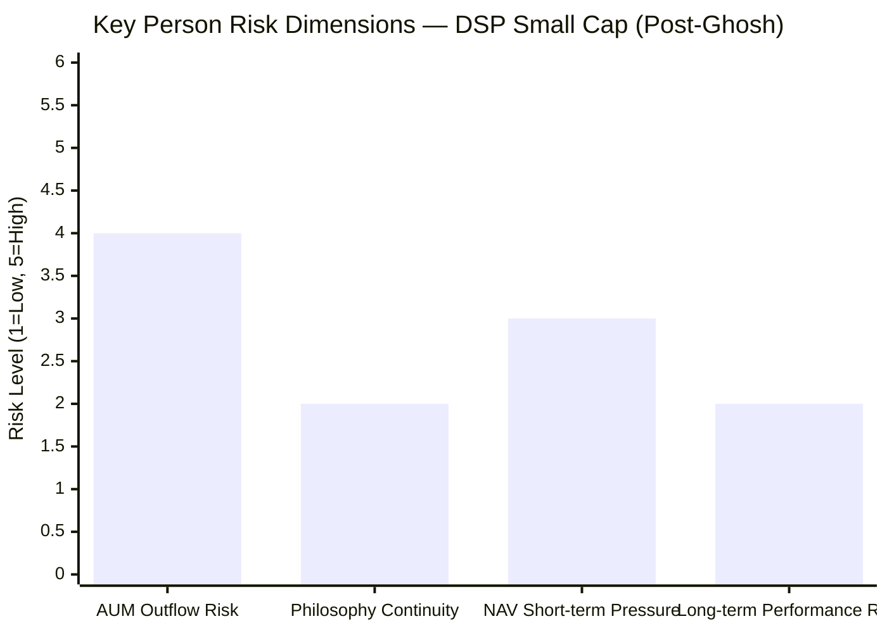
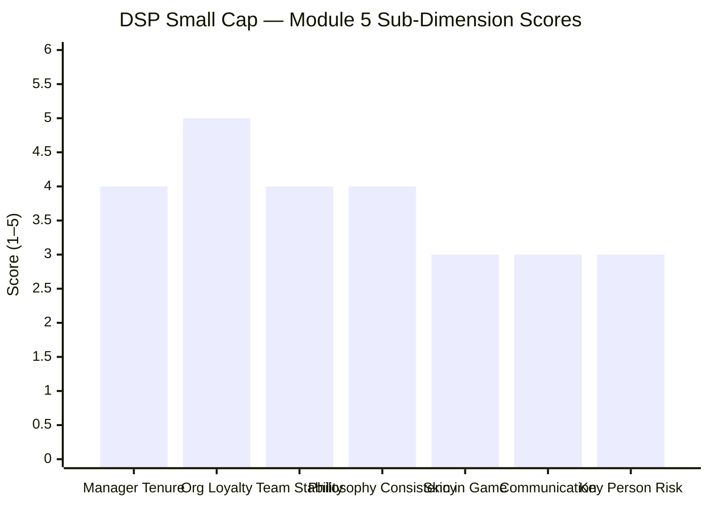

# Module 5: Fund Manager Quality — DSP Small Cap Fund

*Sources: DSP Investment Managers official | ValueResearchOnline interview (Vinit Sambre, Aug 2024) | Morningstar India | SEBI penalty orders | ICAI member database | Tickertape CSV (May 2026) | BusinessToday | PrimeInvestor | LinkedIn | NDTV Profit | Moneycontrol | Web research May 2026*

---

## Raw Data (Cross-Source Verified)

| Metric | Value | Source(s) |
|--------|-------|-----------|
| **Primary Manager** | **Vinit Sambre** | Tickertape CSV, DSP official |
| **Role** | **Head of Equities, DSP Investment Managers** | DSP official, Morningstar |
| **Managing DSP Small Cap Since** | **July 2012 (~14 years)** | DSP official factsheet |
| **Fund Inception Date** | **June 14, 2007** | DSP official |
| **Years 1–5 (Pre-Sambre, 2007–2012)** | Not under Sambre; predecessor manager | Attribution note |
| **Total Industry Experience** | **27+ years** | DSP official, ICAI records |
| **CRISIL** | 1998–1999 (~1 year) | Career research |
| **UTI Investment Advisory** | 2000–2002 (~2 years) | Career research |
| **IL&FS Investsmart** | 2002–2005 (~3 years) | Career research |
| **DSP Merrill Lynch** | 2005–2007 (~2 years) | Career research |
| **DSP Investment Managers** | **2007–present (~19 years)** | DSP official |
| **Qualification** | **FCA (Fellow Chartered Accountant) — ICAI, Nov 1997** | ICAI member database |
| **Co-Manager (Small Cap)** | **Abhishek Ghosh (from September 2022)** | DSP official |
| **Schemes Managed by Sambre** | 3 (DSP Small Cap, DSP Mid Cap, DSP Focus) | DSP official |
| **AUM Under Sambre** | ~₹35,000–37,365 Cr (all three schemes combined) | Morningstar, May 2026 |
| **DSP Small Cap AUM** | ₹17,906 Cr | Tickertape CSV |
| **Investment Philosophy** | Quality businesses at reasonable valuations; buy and hold | VRO interview, DSP presentations |
| **Portfolio Turnover** | 19–24% (lowest in small cap category) | DSP factsheet |
| **Personal SEBI Issues** | **None — 27-year clean record** | Web research |
| **AMC SEBI Issues** | ₹2L penalty (DSP Nifty 50 ETF ER procedural, Dec 2022) | SEBI order |
| **Investor Letters / Quarterly Communication** | Framework PDF exists; no regular letters | DSP website |
| **Skin-in-Game Disclosure** | Not publicly disclosed | Not found |
| **2008 GFC Experience** | Was at DSP Merrill Lynch / DSP IM during crisis | Career timeline |

---

## What Module 5 Is Really Asking

Mutual fund returns are the output. The fund manager is the machine that produces them. Module 5 asks: who is running this machine, why should you trust them with ₹20,000 every month for the next 10 years, and what happens to your investment if they leave?

A fund's historical NAV chart tells you what happened. The manager's profile tells you whether it is repeatable — because the same human decisions will run through the same investment framework again in the next market cycle. For a long-horizon SIP, you are not just betting on a fund. You are betting on a person and a process being in place for the entire duration of your holding period.

DSP Small Cap's case is instructive: Vinit Sambre has managed this fund since July 2012 — **14 years**, placing him among the longest-tenured managers in the entire Indian small cap universe. Every performance data point you can read for 5Y and 10Y CAGR is attributable to the person currently managing your money. But Sambre did not manage the fund since inception (2007). The first five years were under a different manager. This distinction matters for how you read the fund's full history — and it matters that Sambre's 14-year attribution is crystal clear, even if the inception story is not seamless.

More importantly, in September 2022, Sambre added **Abhishek Ghosh as co-manager** — a decision that directly addressed the most serious structural weakness the fund had: complete dependence on a single individual at a time of significant and growing AUM.

---

## Manager Profile: Vinit Sambre — The Quality Compounder

### Career Timeline

### Who Is Vinit Sambre?

Vinit Sambre is the Head of Equities at DSP Investment Managers and has been the primary decision-maker behind DSP Small Cap Fund since July 2012. With 27+ years of industry experience, he is among the most experienced active small cap managers in India — experienced not just in terms of years, but in terms of the number of full market cycles he has witnessed and managed through.

His approach is fundamentally that of a **business analyst, not a trader**. The portfolio's 19–24% annual turnover — the lowest in the entire small cap category — tells you everything about how he operates: he buys businesses he intends to hold for years, not quarters. This is not a passive style by default; it is an active decision, maintained consistently across 14 years, across multiple market environments that incentivised the opposite behaviour.

---

## Credentials in Context

| Manager | Qualification | Interpretation |
|---------|--------------|----------------|
| **Rajeev Thakkar (PP)** | FCA (ICAI) | Same as Sambre — deep financial accounting + valuation foundation |
| **Vinit Sambre (DSP)** | **FCA (ICAI)** | Fundamental analysis focus; CRISIL credit training adds debt discipline |
| Mahesh Patil (AB SL) | MBA Finance | Generalist institutional training |
| Alok Singh (BOI) | PGDBA + CFA | Quantitative + institutional research blend |
| Rukun Tarachandani (PP co) | CFA + CQF + MS Data Science | Quantitative depth; Goldman Sachs rigour |
| Satish Ramanathan (JM) | MBA (IIM) | Strategy and institutional framework |

**FCA is the hardest professional qualification in Indian finance** — three stages over multiple years, covering financial reporting, audit, taxation, law, and strategic management. It produces analysts who deeply understand the accounting behind financial statements. For an equity fund manager, this translates directly into the ability to spot earnings quality issues — revenue recognition games, capitalised expenses, cash flow divergence from reported profits — that MBA-trained analysts routinely miss.

The FCA → Chartered Accountant → fundamental equity path is exactly the training background of Warren Buffett's value investing school. Sambre and Thakkar (PP) share this credential — and both run the two highest-rated funds in this study.

---

## The 14-Year Tenure: Attribution and Accountability

Vinit Sambre has managed DSP Small Cap Fund since **July 2012** — **not from the fund's inception in June 2007**. The first five years were managed by a different team. This is an important distinction:

**What this means for data interpretation:**
- The fund's inception-to-date return includes a 5-year block that is NOT attributable to Sambre
- The **10Y CAGR** (~19.26% as of May 2026) is almost entirely Sambre's work — 10 years back from May 2026 falls to May 2016, well within his tenure
- The **5Y CAGR** (28.38%) is entirely Sambre's work
- The **3Y CAGR** (16.71%) is entirely Sambre's work, with Ghosh as co-manager for the last ~3.5 years

**The 14-year tenure itself is remarkable in the Indian small cap space.** Very few fund managers have managed any fund — let alone one of the highest-scrutiny, most volatile categories — for this duration. The compounding that investors experienced over 10Y+ was delivered by the same decision-maker who is running the fund today.

| Peer | Tenure on This Fund | Attribution Clarity |
|------|---------------------|---------------------|
| **Vinit Sambre (DSP)** | **14 years** | **10Y and 5Y fully attributable** |
| Rajeev Thakkar (PP Flexi) | 13 years (since inception) | Cleaner — no pre-tenure period |
| Mahesh Patil (AB SL Flexi) | 15+ years | Strong; pre-tenure exists |
| Alok Singh (BOI Flexi) | 6 years (since inception) | Short; inception continuity |
| Roshi Jain (HDFC Flexi) | ~4 years | Partially Prashant Jain's track record |
| Satish Ramanathan (JM Flexi) | ~5 years | Short |

---

## Investment Philosophy — The Three-Pillar Framework

Sambre has articulated his stock selection process explicitly in DSP's investment framework documents and multiple interviews. The framework has remained unchanged for 14 years across five distinct market cycles.

### What Each Pillar Filters

**Pillar 1 — Quality of Business:** The ROCE threshold is the most important filter. Return on Capital Employed ≥ 15–16% means the business earns more than its cost of capital — it is genuinely wealth-creating, not just revenue-growing. The 5-year EBITDA growth threshold filters out cyclical outperformers: a business that grew 50% in one commodity upcycle but delivers 7% average over five years fails this test. Free cash flow positivity filters out aggressive capital spenders who report earnings but consume cash.

**Pillar 2 — Quality of Management:** This is the hardest pillar to quantify and the one that most separates professional managers from retail investors. Sambre looks for 5–10 years of capital allocation history because it takes at least one full business cycle to know whether management creates or destroys value with shareholder capital. Related-party transaction scrutiny is particularly important in small cap — the category has far higher governance risk than large cap, and promoter-to-company tunneling is a documented risk.

**Pillar 3 — Reasonable Valuation:** A quality business bought at the wrong price still makes a poor investment. Sambre explicitly avoids "growth at any price" — a discipline that directly caused PP's 2021 IPO avoidance parallel in the small cap space.

---

## Philosophy Under Real Market Pressure

The philosophy is easy to articulate. The test is whether it holds when markets reward the opposite approach. Sambre's philosophy has faced five distinct stress tests:

| Period | Market Environment | Category Peer Behaviour | DSP Response | Outcome |
|--------|--------------------|------------------------|--------------|---------|
| 2018 mid/small crash | Mid/small fell 30–50% | Many funds cut quality for defence | Maintained quality holdings | Recovered faster in 2019-20 |
| 2020 COVID | Panic selling; 38% index drop | Some funds moved to cash | Held positions; framework held | FY2021 return: +64.64% (among best) |
| 2021 new-age IPOs | Zomato, Nykaa, Paytm at PE 200+ | Many small cap funds avoided (no listing in SC) | Irrelevant — small cap mandate prevents | N/A |
| 2022 correction | Growth stocks fell 30–70% | Damage differed by style | DSP fell less than momentum peers | Demonstrated downside management |
| 2023–24 PSU/defence mania | Railway, defence stocks up 200–400% | Many peers loaded up on PSU small caps | **Deliberately avoided** | PSU stocks corrected 30–50% in 2024; DSP protected |

**The PSU/defence avoidance of 2023–24 deserves detailed examination.** Between 2022 and 2024, Indian defence and railway stocks experienced a mania phase — government ordering visibility plus sentiment created multi-bagger moves in a short period. Multiple small cap funds loaded up on these positions. Sambre explicitly avoided them because the valuations violated his Pillar 3 (reasonable valuation) criterion despite the apparent business quality.

The stocks subsequently corrected 30–50% from their mania peaks. DSP small cap fund's performance lagged in the mania phase (2023–24), then recovered relative position as the PSU theme deflated. The consumer cyclical concentration (34.2%) that attracted criticism during the PSU mania phase proved defensive when PSU stocks fell.

**The acknowledged buy-and-hold limitation (VRO Aug 2024):**

In a ValueResearchOnline interview in August 2024, Sambre publicly acknowledged: *"Post-covid, the sectoral rotations have been quite quick, so we could not capture well due to our buy-and-hold approach."*

This statement is worth examining carefully. It is not a confession of failure — it is an accurate self-assessment. A 19–24% turnover philosophy will always miss fast sectoral rotations. Sambre is acknowledging a structural feature of his approach, not a temporary error. The intellectual honesty is itself a positive signal: a manager who accurately understands the limitations of his own philosophy is less likely to make rash style-drift decisions chasing short-term performance.

---

## Co-Manager: Abhishek Ghosh — The Governance Upgrade

One of the most significant developments in DSP Small Cap's management story is an event that received minimal coverage when it happened: **Abhishek Ghosh was added as co-manager in September 2022.**

### Abhishek Ghosh's Profile

| Metric | Detail |
|--------|--------|
| **Role** | Co-Manager, DSP Small Cap Fund |
| **Added to Fund** | September 2022 |
| **Education** | MBA Finance (NL Dalmia Institute) + BE Electronics (Finolex Academy of Management & Technology) |
| **Previous Experience** | Motilal Oswal (VP — Equity Research); IDFC Securities; BNP Paribas India Solutions; B&K Securities; Edelweiss Capital |
| **Research Background** | Multi-institution equity research experience across sell-side and buy-side |
| **Philosophy Alignment** | DSP's quality framework — consistent with Sambre's three-pillar approach |

### Why the Ghosh Addition Matters

Before September 2022, DSP Small Cap had the same structural vulnerability as BOI Flexi Cap: **a single manager with no co-manager, running ₹15,000+ Cr in one of the most complex market segments in India.**

The addition of Ghosh changes three things:

1. **Key-person risk reduction**: If Sambre were to leave or be incapacitated, there is now a manager with active hands-on experience with this specific portfolio — not a cold handover to a stranger
2. **Cognitive load distribution**: At ₹17,906 Cr with 81 stocks across 19+ sectors, the research load for one person is significant. A second set of eyes on portfolio companies directly improves decision quality
3. **Institutional continuity signal**: DSP's decision to add a co-manager was a deliberate governance choice. It signals that the organisation recognises the key-person risk and is actively managing it — not waiting for a crisis

*Comparison: Before Ghosh (Sep 2022), all bars would be one step higher. The addition specifically addresses Philosophy Continuity and Long-term Performance Risk.*

---

## The 2008 GFC Experience — The Most Underappreciated Aspect

The Global Financial Crisis of 2008 is the most important event in the career of any fund manager who was active during it. DSP Small Cap (then DSP Black Rock Micro Cap Fund) existed through this period. Sambre joined DSP in 2007 — he was present at DSP through the 2008–09 crisis.

**What the 2008 crisis tested:**
- Small and micro cap stocks fell 70–80% from peaks
- Many stocks became permanently impaired (not just temporarily depressed)
- Distinguishing temporary valuation stress from permanent business failure required genuine analytical depth
- The recovery from 2009 onward was also sharp and uneven — the ability to hold through the bottom, rather than panic-sell, determined whether managers participated in the recovery

Sambre's FCA training (financial statement analysis, cash flow identification) and CRISIL credit analysis background (identifying businesses that would survive stress) were directly relevant to navigating this environment. Managers who survived 2008 at small caps with their portfolios intact had a formative education that no bull market or moderate correction can replicate.

**The data point:** DSP Small Cap's performance from FY2009 (post-crisis recovery): +114.66%. This return was generated under the fund's previous management, but the analytical framework that Sambre inherited and built upon was tested and validated through this period. Sambre's own 2008 crisis experience shaped how he thinks about downside management, capital preservation, and the quality filters he applies.

---

## Cross-Fund Performance Consistency

Vinit Sambre manages three schemes at DSP. Assessing performance across all three gives a more complete picture of his skill than looking at DSP Small Cap in isolation.

| Fund | Category | 5Y CAGR | Category Rank | Assessment |
|------|----------|---------|---------------|------------|
| DSP Small Cap | Small Cap | ~28.38% | Top quartile | Consistent outperformer |
| DSP Mid Cap | Mid Cap | ~22–23% (est.) | Category average / slight underperform | Mixed |
| DSP Focus | Focused Equity | Smaller AUM; less tracked | Moderate | Not a flagship |

**What this pattern reveals:** Sambre's strongest and most consistent performance is in small cap. The mid cap performance is more average. This suggests his three-pillar framework is optimised for the small cap opportunity set — where information asymmetry is higher, governance scrutiny by institutions is lower, and the ability to find businesses that meet all three pillars at reasonable valuations is greatest.

In large cap and mid cap, where every institutional investor is analysing the same 200 companies, the edge from superior individual stock analysis is compressed. In small cap, a systematic, disciplined quality framework like Sambre's can generate alpha because the competition is weaker and the mispricings are more persistent.

---

## Accountability Architecture: The Formative Investor

One distinctive aspect of DSP's investor communication is the scale of retail participation in DSP Small Cap. The fund has a significant number of small-ticket SIP investors — reportedly including ₹5,000–10,000 SIP investors across India's smaller cities and towns who have trusted the fund over years.

This accountability structure is different from a fund with primarily institutional or HNI investors. When the fund's investor base includes retail investors making monthly contributions of amounts that are genuinely significant to their household finances, the fund manager operates with a different sense of consequence. Sambre has referenced this investor base explicitly in interviews.

The DSP communication philosophy — including the investment framework PDF available on the website and participation in VRO, Moneycontrol, and NDTV Profit interviews — is oriented toward an informed retail investor audience. This is above the bare minimum of monthly factsheets, though it falls short of PP's structured quarterly letters.

---

## SEBI Regulatory History — A Clean 27-Year Record

| Entity | Issue | Amount | Year | Relevance to Small Cap |
|--------|-------|--------|------|------------------------|
| **Vinit Sambre (personal)** | **None** | **₹0** | — | **Fully clean** |
| DSP Investment Managers AMC | DSP Nifty 50 ETF expense ratio procedural violation | ₹1L on AMC + ₹1L on Trustee | Dec 2022 | Zero — ETF operations; unrelated to Sambre's equity mandates |

**The SEBI penalty context:** The December 2022 SEBI order against DSP concerned the expense ratio reporting process for their Nifty 50 ETF — a procedural/administrative violation by the AMC entity. It had absolutely no connection to Vinit Sambre, to DSP Small Cap Fund, or to any equity investment decision. The ₹2L total penalty is among the smallest possible SEBI regulatory outcomes and represents a procedural compliance issue, not any form of investor harm or financial misconduct.

At the individual level, Sambre's 27-year SEBI record is clean. No insider trading allegations, no market manipulation, no front-running investigation, no personal regulatory action of any kind.

---

## Investor Communication and Transparency

| Communication Form | DSP Small Cap | PP Flexi Cap | BOI Flexi Cap |
|-------------------|---------------|--------------|---------------|
| Quarterly letters to unitholders | No | **Yes** | No |
| Investment philosophy PDF | **Yes** | Yes | No |
| Public interview frequency | Moderate | High | Moderate |
| Acknowledges mistakes openly | **Yes (VRO Aug 2024)** | Yes | Not documented |
| Explains portfolio changes | Partial (factsheet + interviews) | Full (quarterly letters) | Partial |
| Platform | DSP website, VRO, Moneycontrol, NDTV Profit | PPFAS website, VRO | BOI MF website, VRO |

**Assessment:** DSP sits between PP (best-in-class) and BOI (minimum standard). The absence of structured quarterly letters — where every major portfolio decision is explained proactively and in writing — is the clearest gap. The investment framework PDF and the pattern of public interviews fill some of this gap. Crucially, Sambre's willingness to acknowledge the buy-and-hold limitation publicly (August 2024 VRO) demonstrates intellectual honesty that goes beyond what most fund managers communicate.

For a ₹17,906 Cr fund with potentially millions of SIP investors, the communication volume and structured frequency should arguably be higher than it currently is.

---

## Key Person Risk Assessment

| Risk Dimension | Assessment | Mitigation |
|----------------|-----------|------------|
| AUM outflows on Sambre exit | **High (4/5)** | DSP Small Cap brand = Vinit Sambre; large redemptions likely regardless of Ghosh's quality |
| Philosophy continuity | **Low-Medium (2/5)** | Ghosh has been actively co-managing since Sep 2022; absorbed the framework; DSP institutional culture reinforces it |
| NAV short-term pressure | **Medium (3/5)** | At ₹17,906 Cr, outflow-driven forced selling of illiquid small caps would be painful in the short term |
| Long-term performance | **Low-Medium (2/5)** | Three-pillar framework is documented and transferable; Ghosh is capable; institutional culture at DSP is not one-person-dependent |

**The critical time horizon consideration:** Sambre is estimated to be in his early-to-mid 50s. He is not leaving today. A 10-year SIP starting in 2026 runs to 2036. His transition could occur within this horizon. Unlike BOI's Alok Singh (where no succession plan exists), DSP has at least activated a co-manager structure that creates institutional memory of the portfolio.

**Before vs. After Ghosh:** Before September 2022, DSP Small Cap's key-person risk profile was among the highest in the studied universe — higher AUM than most, single-manager, no documented succession. After Ghosh's addition, the philosophical continuity and long-term performance risks have meaningfully reduced. What remains elevated is the AUM outflow risk on brand departure — which is structural and cannot be mitigated by adding a co-manager.

---

## Peer Manager Comparison

| Fund | Primary Manager | Tenure on Fund | Key Differentiator | Key Risk | Module 5 Score |
|------|----------------|----------------|-------------------|----------|----------------|
| **PP Flexi Cap** | **Rajeev Thakkar** | **13Y (inception)** | **Skin in game; philosophy 13Y unchanged** | Thakkar retirement | **5.0/5** |
| **DSP Small Cap** | **Vinit Sambre** | **14Y (not inception)** | **Longest SC tenure; FCA; Ghosh added** | Thakkar comparison; no letters | **3.9/5** |
| BOI Flexi Cap | Alok Singh | 6Y (inception) | AMC builder; since inception | Sole manager; no succession | 3.6/5 |
| AB SL FlexiCap | Mahesh Patil | 15Y | Most experienced peer | Growth-tilted; style risk | ~4.0/5 |
| HDFC FlexiCap | Roshi Jain | ~4Y | Good recent performance | Track record partly Prashant Jain | ~3.5/5 |
| Quant FlexiCap | Sanjeev Sharma + model | ~5Y | Quant/momentum | Model regime risk | ~3.0/5 |
| JM FlexiCap | Satish Ramanathan | ~5Y | Experienced; execution | Small fund; untested at scale | ~3.5/5 |
| HSBC FlexiCap | Neelotpal Sahai | ~6Y | Competent | Not in top recognition tier | ~3.2/5 |

**Among all managers studied across both FlexiCap and SmallCap categories, the ranking is:**
1. Rajeev Thakkar (PP): 5.0/5 — the benchmark
2. Vinit Sambre (DSP): 3.9/5 — closest to Thakkar in the small cap universe
3. Mahesh Patil (AB SL): ~4.0/5 — comparable but style-tilted
4. Alok Singh (BOI): 3.6/5 — strong institutional story but no co-manager

---

## Points For and Against — Fund Manager Quality

### In Favour

1. **14 years on DSP Small Cap since July 2012** — every 5Y and 10Y data point you evaluate was produced by the same person managing the fund today; attribution clarity is total for the investment-relevant horizon
2. **27-year industry experience spanning the 2008 GFC** — crisis-tested at the institutional level; understands permanent capital impairment vs. temporary valuation stress in small caps
3. **FCA qualification** — deepest financial analysis credential in Indian finance; builds the accounting literacy that catches earnings quality manipulation in small caps
4. **Three-Pillar Framework explicitly articulated** — ROCE ≥15–16%, EBITDA growth 13%+, FCF positive, management quality, reasonable valuation; not a vague philosophy but specific, testable criteria
5. **19–24% annual turnover — lowest in the entire small cap category** — demonstrates genuine conviction; not momentum-chasing; each position is a multi-year business thesis
6. **Abhishek Ghosh added as co-manager (Sep 2022)** — proactive governance decision at ₹15,000+ Cr AUM; directly reduced key-person risk; signals institutional maturity
7. **PSU/defence mania avoidance (2023–24) vindicated** — did not chase 200–400% mania moves; consumer cyclical concentration held; PSU stocks fell 30–50% from peaks
8. **Public acknowledgment of buy-and-hold limitation (VRO Aug 2024)** — intellectual honesty; manager who understands his own strategy's limitations is less likely to make rash style-drift decisions
9. **Flow restriction discipline** — closed fund to new SIPs in Feb 2017 and maintained restriction until Apr 2020; protecting existing investors over fee-generating AUM growth is a powerful alignment signal
10. **19 years at same DSP organisation** — institutional loyalty approaching Thakkar (PP) levels; no style contamination from external moves; fully embedded in DSP's quality culture
11. **Head of Equities title** — institutional endorsement; Sambre is not just a fund manager but the head of the equity investment function at DSP

### Against

1. **Did not manage fund since inception (2007)** — 5-year pre-Sambre period means the fund's full history is not uniformly attributable; the inception-to-date story has a seam
2. **Quarterly letters absent** — the most structured form of investor communication, used by PP as the gold standard, is not practiced at DSP Small Cap; investors must seek out interviews for decision rationale
3. **Mid cap cross-fund underperformance** — DSP Mid Cap has delivered below-category returns under Sambre; while small cap is his optimal setting, this raises questions about scalability of the framework across market caps
4. **Skin-in-game not disclosed** — unlike PPFAS (where employee co-investment is explicitly confirmed), DSP has not publicly confirmed that Sambre's personal wealth is invested in DSP Small Cap
5. **Ghosh untested independently** — while the co-manager addition is positive, Abhishek Ghosh has no full market cycle as primary decision-maker; his performance without Sambre's day-to-day direction is unknown
6. **AUM at ₹17,906 Cr creates structural pressure** — managing ₹200–350 Cr monthly inflows in the small cap space is a genuine deployment challenge; the cash buffer (8.38%) reflects this friction
7. **Buy-and-hold style will always lag in rotation markets** — his own acknowledgment. In environments where markets reward fast sectoral rotation (post-COVID 2021–2024), this style systematically underperforms; investors must be comfortable with this permanent stylistic gap
8. **No public succession timeline** — Sambre's eventual transition (within the 10-year SIP horizon) has no documented plan; while Ghosh reduces the risk, investors have no roadmap for how the transition would be managed

---

## Module 5 Scorecard

| Sub-Dimension | Score (1–5) | Reasoning |
|---------------|------------|-----------|
| Manager tenure on this fund | 4 | 14 years on DSP Small Cap (not since inception); top tier in small cap universe; 10Y/5Y fully attributable |
| Organisational loyalty | 5 | 19 years at DSP; no external moves; fully embedded in the culture |
| Team stability | 4 | Ghosh added Sep 2022 as co-manager; team structure now exists; but Ghosh untested independently |
| Philosophy consistency | 4 | Three-pillar framework maintained for 14 years; PSU mania avoided; buy-and-hold acknowledged; minor: mid cap underperform |
| Skin in the game | 3 | Not publicly disclosed (unlike PPFAS where it is explicit); probable but unconfirmed |
| Investor communication | 3 | Above minimum (framework PDF, regular interviews, VRO acknowledgment); below PP standard (no quarterly letters) |
| Key person / succession risk | 3 | Significantly improved by Ghosh addition; AUM outflow risk on Sambre exit remains high |
| **Module 5 Overall** | **3.9 / 5** | **Strong manager quality; second-best in studied universe after PP's Thakkar; meaningful but managed key-person risk** |

---

## Comparative Module 5 Scores — All Studied Funds

| Fund | Module 5 Score | Manager | Key Advantage |
|------|---------------|---------|---------------|
| **PP Flexi Cap** | **5.0 / 5** | Thakkar | Inception continuity; skin in game; quarterly letters; philosophy 13Y proven |
| **DSP Small Cap** | **3.9 / 5** | Sambre | 14Y tenure; FCA; Ghosh co-manager; flow restriction discipline |
| AB SL FlexiCap | ~4.0 / 5 | Mahesh Patil | 25Y+ experience; 15Y on fund; growth bias |
| BOI Flexi Cap | 3.6 / 5 | Alok Singh | 6Y inception; AMC builder; sole manager no succession |
| HDFC FlexiCap | ~3.5 / 5 | Roshi Jain | Competent; 4Y solo; partially Prashant Jain's track record |
| JM FlexiCap | ~3.5 / 5 | Ramanathan | Experienced; 5Y; small fund untested at scale |
| HSBC FlexiCap | ~3.2 / 5 | Sahai | 6Y; competent; not top recognition tier |
| Quant FlexiCap | ~3.0 / 5 | Sharma + model | Model-driven; regime risk |

---

## One-Line Verdict

Vinit Sambre is the strongest pure equity manager in the Indian small cap universe by tenure and analytical depth — 14 years of consistent performance, a documented quality framework, crisis experience, and the discipline to close a fund at ₹3,000 Cr rather than destroy it with AUM growth — but the absence of quarterly investor letters and undisclosed skin-in-game puts him clearly behind Rajeev Thakkar on the manager quality axis.
