# Module 6: AMC Quality — DSP Small Cap Fund

*Sources: DSP Investment Managers official (dspim.com) | DSP mandatory disclosures | SEBI order (Dec 2022) | Tracxn | Crunchbase | DNA India | Cafemutual | Moneylife | 5paisa | ValueResearchOnline | PR Newswire (London office) | AMFI India member page | Domain-b | Jainam blog | Web research May 2026*

---

## Raw Data (Cross-Source Verified)

| Metric | Value | Source(s) |
|--------|-------|-----------|
| **AMC Full Name** | **DSP Investment Managers Private Limited** | SEBI, DSP official |
| **Formerly Known As** | DSP Merrill Lynch Asset Management (1996) → DSP BlackRock Investment Managers (2008) → DSP Investment Managers (2018) | Corporate history |
| **Incorporated** | **May 13, 1996** | DSP official |
| **DSP Group Heritage** | **160+ years in Indian financial services (stockbroking since 1860s)** | DSP official |
| **BSE Connection** | **DSP family was a founding member of the Bombay Stock Exchange** | Historical records |
| **Ownership Type** | **100% family-owned — Kothari family (fully independent; no bank, no govt, no foreign JV)** | SEBI disclosures |
| **Ownership Split** | DSP ADIKO Holdings Pvt. Ltd. 54%; DSP HMK Holdings Pvt. Ltd. 34%; Aditi Kothari Desai + Shuchi Kothari 12% | SEBI |
| **Chairman** | **Aditi Kothari Desai (appointed April 2025; succeeded father Hemendra Kothari)** | DSP press release |
| **MD & CEO** | **Kalpen Parekh** — MMS Finance (Narsee Monjee) + B.E. Chemical (Bharati Vidyapeeth) + Harvard Business School | DSP official |
| **Head of Equities** | Vinit Sambre (see Module 5) | — |
| **Total AMC AUM** | **₹2,28,622 Cr (March 31, 2026)** | DSP official |
| **Investor Count** | **50+ lakh (5 million+)** | DSP official |
| **Total Schemes** | **66+ (57 active as of Apr 2026)** | DSP official |
| **Equity Schemes** | ~27 | DSP official |
| **Debt Schemes** | ~17 | DSP official |
| **Hybrid Schemes** | ~6 | DSP official |
| **ETFs, FOFs, Index, Others** | ~16 | DSP official |
| **Fund Managers (named)** | 9: Sambre, Jay Kothari, Rohit Singhania, Arpana Karnik, Resham Jain, Ravi Gehani, Diipesh Shah, Laukik Baugwe, Sandeep Yadav | DSP official |
| **Total Employees** | **508 (September 2024)** | Tracxn |
| **London Office** | Yes — international operations | PR Newswire |
| **SEBI Regulatory Actions** | **1 minor procedural penalty — DSP Nifty 50 ETF ER (Dec 2022, ₹2L total on AMC + Trustee)** | SEBI order |
| **Fund Manager SEBI Issues** | **Zero — all 9 fund managers clean** | Web research |
| **Custodian** | **Citibank N.A.** | AMFI, DSP SAI |
| **RTA** | **KFin Technologies** | DSP SAI |
| **Trustee** | DSP Trustee Pvt. Ltd. | DSP SAI |
| **Skin-in-Game Policy** | **ALL 508 employees invest ONLY in DSP's own schemes (institutional mandate)** | DSP official communications |
| **Quarterly Investor Letters** | **No** — blog posts, interviews, factsheets instead | DSP website |
| **Hemendra Kothari Net Worth** | ~₹15,779 Cr | DNA India |
| **BlackRock Stake Buyout** | May–August 2018; 40% stake acquired by Kothari family | Domain-b, Groww |

---

## What Module 6 Is Really Asking

You can have the best fund manager in the world, but if the institution around them is unreliable — regulatorily compromised, financially fragile, or culturally indifferent to investors — everything else can unravel. Module 6 evaluates the house that built the fund: its governance, regulatory track record, ownership philosophy, financial stability, and whether it systematically puts investors first or AUM-gathering first.

DSP's AMC story is one of the most distinguished in this entire study. The surface facts — ₹2.28L Cr AUM, 50 lakh investors, 66 schemes — do not even capture the most important data point discovered in research: **every single DSP employee, not just fund managers, is required by institutional policy to invest only in DSP's own schemes.** That one fact tells you more about AMC alignment than any regulatory filing. And it places DSP in a category shared with only PPFAS among all studied AMCs — the only two with institutionalised, documented skin-in-the-game policies.

---

## The AMC Structure — Who You Are Actually Backing

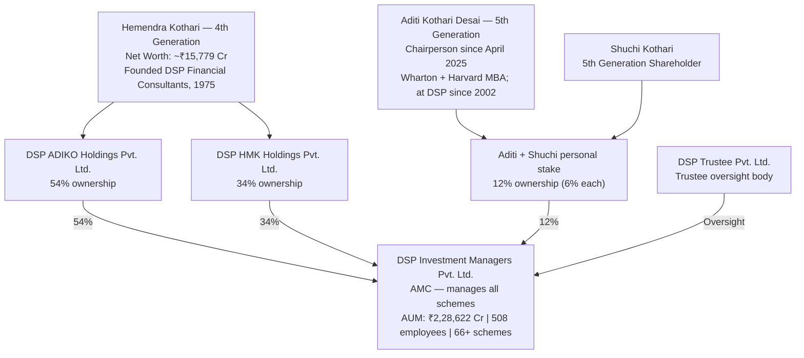

| Dimension | DSP | PPFAS | BOI | Quant |
|-----------|-----|-------|-----|-------|
| Ownership type | **Family-private (independent)** | Promoter-private | PSU Govt bank | Single founder-private |
| Heritage | **160+ years** | ~30 years | 120 years (bank) | ~28 years |
| Government backing | No | No | **Yes (GoI)** | No |
| Can AMC be acquired? | Very unlikely (family pride) | Theoretically possible | No (GoI won't allow) | Theoretically possible |
| Parent financial strength | **₹15,779 Cr family net worth** | Self-sustaining | ₹9,219 Cr FY25 profit (Bank) | Self-sustaining |
| Independence of decisions | **Complete** | Complete | Constrained by PSU culture | Complete |

**What 100% independent family ownership means for investors:** When a bank-owned AMC underperforms, the bank's distribution network continues pushing it to retail customers because fee revenue flows back to the parent. PPFAS and DSP have no captive distribution network of that kind. Every investor in DSP chose it on merit — or because DSP's own employees recommended it while being personally invested. This structure creates a direct feedback loop: poor performance hurts the owners, who are also the operators.

---

## 160 Years in Indian Capital Markets — The Heritage No Other AMC Can Match

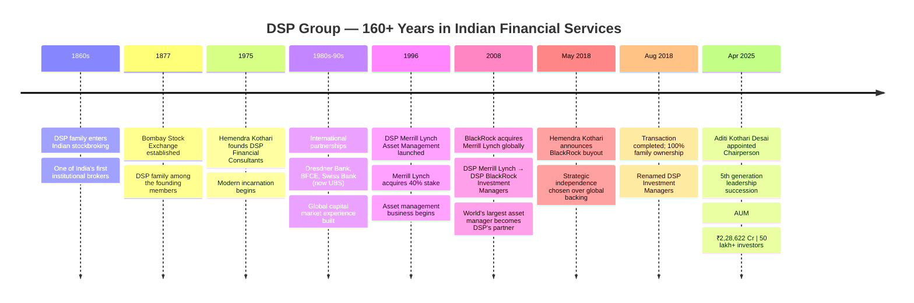

When you invest in a DSP scheme, you are not backing a fund house that started in the 1990s, or a bank subsidiary created to cross-sell products, or a startup that raised venture capital to build an AMC. You are backing a family that has been at the centre of Indian capital markets for **160+ years** — through British India, independence, bank nationalisation, liberalisation, the dotcom boom, the Global Financial Crisis, demonetisation, and COVID — across four generations, without ever pivoting to an unrelated business.

**What this heritage means concretely:**
- Institutional longevity is one of the strongest predictors of future stability
- 160 years of navigating Indian markets means the Kothari family has absorbed knowledge about market cycles, regulatory environments, and investor behaviour that cannot be replicated in 10 or 20 years
- The BSE founding connection gives DSP a founding-era institutional legitimacy in Indian capital markets that no other AMC in this study possesses
- Generation after generation remained in financial services without panicking, exiting, or diversifying into unrelated industries

---

## The BlackRock Chapter — Global Calibration, Then Strategic Independence

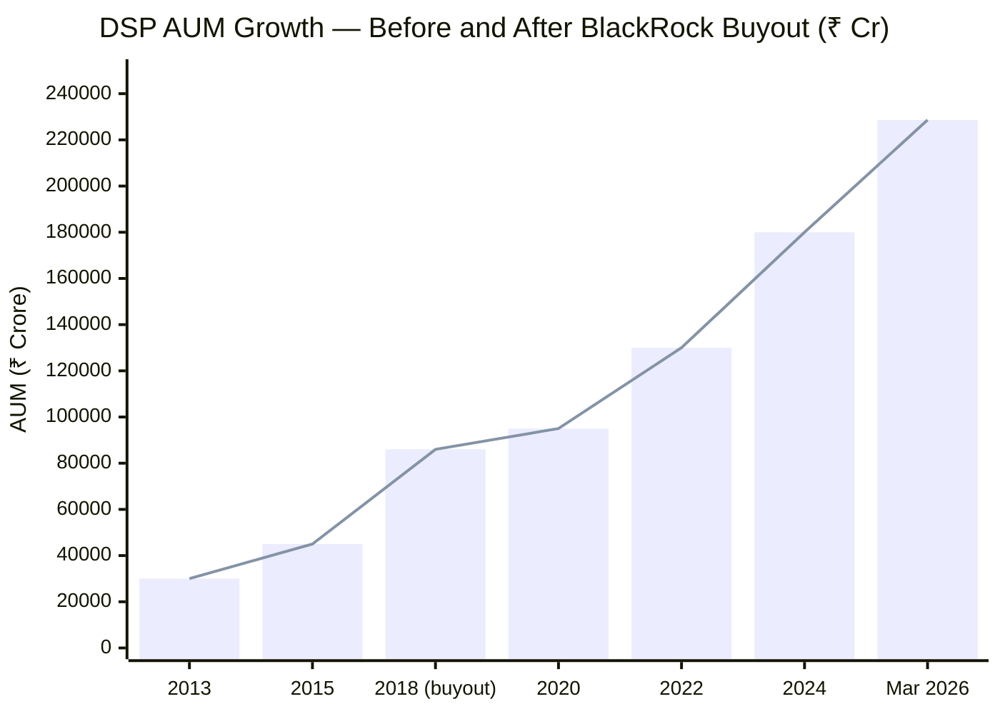

### The Partnership (2008–2018) — What BlackRock Gave DSP

When BlackRock acquired Merrill Lynch Investment Management in 2008, it became DSP's global partner. At that time, BlackRock was the world's largest asset manager. The decade-long partnership gave DSP four things that permanently shaped its institutional DNA:

1. **Risk management frameworks** — BlackRock's Aladdin platform and risk culture are considered the global standard. DSP's approach to portfolio risk, scenario analysis, and drawdown management was calibrated against these international frameworks
2. **Research standards** — Sell-side and buy-side research integration at global institutional quality; DSP analysts learned to write research at BlackRock quality standards
3. **Corporate governance protocols** — BlackRock's compliance infrastructure is built to US SEC standards — stricter than SEBI minimum requirements. DSP absorbed this higher baseline
4. **International investment exposure** — DSP's international FOF and offshore fund capabilities were seeded during this partnership. Jay Kothari's international franchise at DSP has its roots in the BlackRock relationship

### The Buyout (2018) — Choosing Independence

In May 2018, Hemendra Kothari announced the intent to buy BlackRock's 40% stake. The transaction completed in August 2018.

**This was not a forced exit.** BlackRock was rationalising global partnerships, and the Kothari family chose to buy rather than let a third party acquire BlackRock's stake. At the time, DSP managed ~₹86,000 Cr. A 40% stake acquisition at any reasonable AUM multiple represents a substantial capital commitment — proof of the family's financial capacity and conviction.

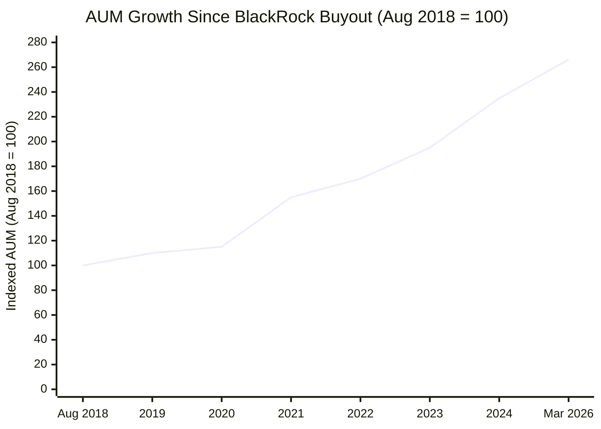

Since the buyout (2018–2026):
- AUM grew ₹86,000 Cr → ₹2,28,622 Cr (**+165%**)
- Investor count grew to 50 lakh+
- DSP opened a London office for international operations
- All 9 named fund managers are DSP-trained or DSP-aligned professionals

**The conclusion:** DSP proved that the BlackRock relationship was additive, not essential. The institutional knowledge was absorbed. The governance standards were internalised. And without a foreign partner taking 40% of economics, DSP's management now makes decisions purely for Indian investors and for long-term business reputation.

---

## Aditi Kothari Desai — The April 2025 Succession and What It Signals

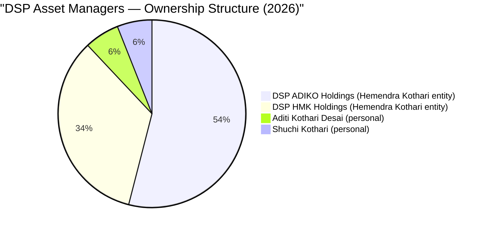

In April 2025, Hemendra Kothari stepped down as Chairman. Aditi Kothari Desai — his daughter, 5th generation of the Kothari family — became Chairperson of DSP Asset Managers.

### Who Is Aditi Kothari Desai?

| Metric | Detail |
|--------|--------|
| Generation | 5th generation of the Kothari family in financial services |
| Education | B.Sc. Economics, Wharton School (University of Pennsylvania) + MBA, Harvard Business School |
| At DSP since | **2002 — 23 years before becoming Chairperson** |
| Key roles at DSP | Founded DSP's international business; headed domestic business growth strategy; Vice Chairperson before Chairperson |
| Personal ownership | 6% personal stake in DSP Investment Managers |

This is not a parachuted heir who knows nothing about the business. Aditi has been inside DSP for 23 years, built the international operations franchise, and held senior operating roles across domestic and global business. Wharton + Harvard are genuinely selective institutions — not name-brand signalling. The 2002 entry means she absorbed the BlackRock partnership era from inside and has seen the full arc of the business across bull markets and crashes.

**The governance signal:** A planned, anticipated, orderly succession — fifth generation taking over from fourth — in a privately held family firm is the strongest possible ownership continuity signal. There is no PE investor demanding an exit, no foreign partner doing a strategic review, no listed company shareholder pressure. The people who own this AMC have their entire family wealth, identity, and 160-year institutional reputation tied to it.

---

## Kalpen Parekh — The CEO Who Thinks Like a Behavioural Economist

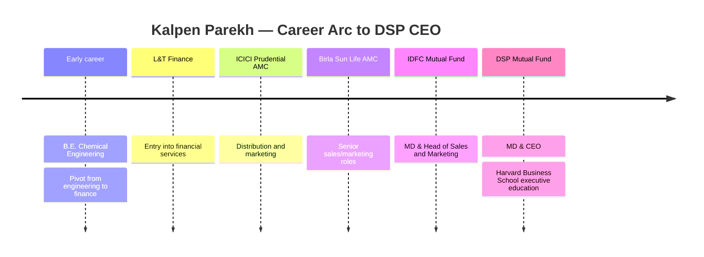

Kalpen Parekh is explicitly known for **behavioural finance advocacy** — the belief that investor behaviour, not fund selection, is the largest driver of investment outcomes. His public communications consistently emphasise: don't chase recent performance, ignore short-term market noise, focus on your own financial goals, understand your own biases.

This philosophy-driven communication is a specific, intentional choice that is **costly to an AMC** — investors who are coached to stay calm in bear markets are harder to retain than investors who are told "now is a great time to buy." Parekh consistently says the harder, more accurate thing. That intellectual honesty at the CEO level filters through to the whole organisation.

**Key Parekh distinguishing traits in public record:**
- Admits when markets are expensive (unusual for an AMC CEO, who typically wants inflows at all times)
- Has publicly advocated index investing alongside active investing — an AMC CEO recommending passive funds to some investors is institutionally aligned rather than fee-maximising
- Regularly appears in VRO, Moneycontrol, NDTV Profit, ET Now with consistent and non-contradictory messaging across years

---

## The Most Important Finding: All-Employee Skin-in-the-Game

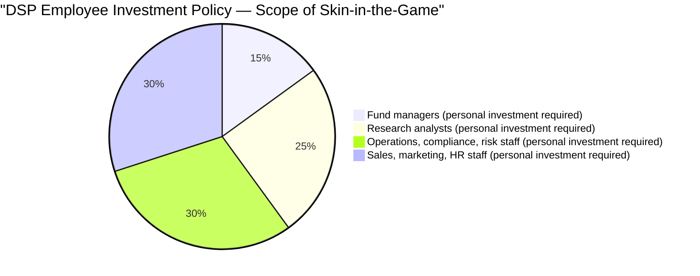

> Every segment = 100% of DSP's 508 employees; all invest only in DSP schemes

In Module 5, we noted that DSP had not **publicly disclosed** individual fund manager skin-in-the-game percentages. Research for Module 6 found something more significant:

**DSP Mutual Fund has a formal, institutional policy: ALL employees — not just fund managers, but every member of the 508-person organisation — are required to invest their personal savings ONLY in DSP's own schemes.**

The exact framing from DSP's official materials: *"not just shareholder wealth, but even employee wealth is invested in their funds, with all staff as a rule investing only in schemes of DSPMF."*

### What This Means vs. Peers

| Dimension | PPFAS | DSP | BOI | Quant |
|-----------|-------|-----|-----|-------|
| Skin-in-game disclosed | Managers explicitly disclose | **All employees — institutional mandate** | Not disclosed | Not disclosed |
| Scope | Individual disclosure | **All 508 employees** | — | — |
| Who bears downside | Thakkar and team | **Every analyst, ops person, sales person** | — | — |
| Institutional vs. personal | Personal | **Institutional mandate + family investment** | — | — |

PPFAS gets full credit for Rajeev Thakkar's explicit personal investment disclosure. But DSP's policy applies to the entire organisation. When a DSP analyst does poor research and recommends a company that falls 40%, it is not just the fund investors who absorb the loss — it is the analyst's own personal portfolio. This creates incentive alignment at every level of the investment and support chain, not just at the top.

This is institutionally rare. Most AMCs have SEBI-mandated lock-in of a small percentage of variable pay in the fund — that is a compliance requirement, not a culture. DSP's policy is a culture: voluntary, institutional, and extending to staff who have no SEBI requirement to be invested at all.

---

## Regulatory Record — Essentially Clean for 30 Years

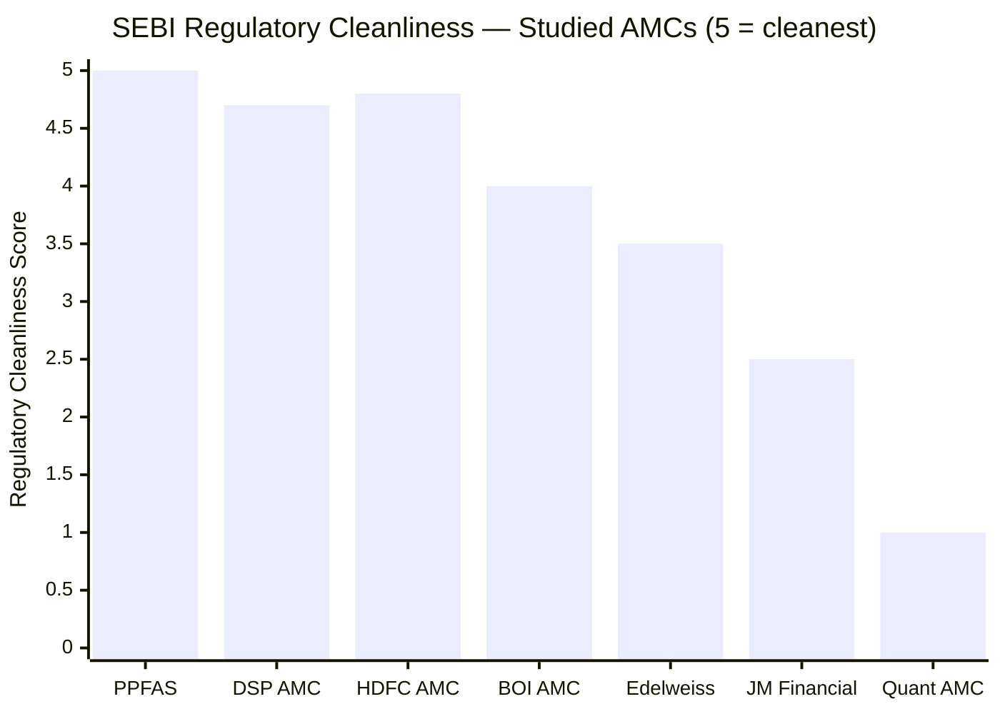

| Entity | Issue | Amount | Year | Relevance to Small Cap |
|--------|-------|--------|------|------------------------|
| **DSP Investment Managers (AMC)** | DSP Nifty 50 ETF expense ratio procedural violation | ₹1L AMC + ₹1L Trustee = **₹2L total** | Dec 2022 | **Zero** — ETF operations; completely unrelated to Sambre, equity mandates, or Small Cap Fund |
| **Any DSP fund manager (personal)** | **None** | **₹0** | — | **Fully clean — all 9 named managers** |

**The December 2022 SEBI penalty in full context:**

SEBI found that DSP absorbed expenses from its own books to keep the Nifty 50 ETF's TER artificially low at 0.07% when actual cost was 0.16%. SEBI treated this as a procedural violation (all scheme expenses must come from scheme assets, not AMC books) and imposed the minimum-tier penalty.

- **What this is:** An ETF pricing strategy that violated a specific SEBI circular on expense recovery
- **What this is not:** Fraud, front-running, insider trading, investor harm, market manipulation, or anything related to active equity fund management
- **Scale of consequence:** ₹2L total — the smallest possible SEBI monetary outcome

For 30 years of AMC operations (1996–2026), this is the only known SEBI action against DSP. No equity fund manager has ever faced a SEBI inquiry. No investment decision has ever been challenged. No governance controversy.

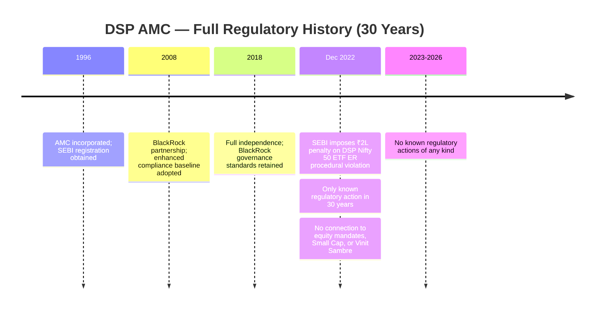

---

## The Flow Restriction Decision — AUM Discipline Over Fee Revenue

From the AMC quality lens, DSP Small Cap's flow restriction history reveals how the institution behaves when investor interest and commercial interest conflict:

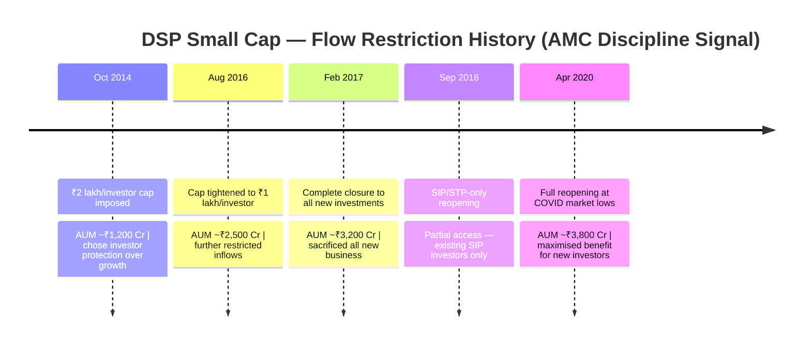

**The commercial cost of these decisions:**

At 0.64% ER, every ₹100 Cr of foregone AUM represents ₹64L/year in lost management fees. The February 2017 closure, maintained for 3+ years, cost DSP tens or hundreds of crores in fees it never collected. An AMC that closes a fund when the market is rising — sacrificing real fee revenue — does so only if it genuinely believes AUM growth would harm existing investors.

The **April 2020 reopening timing** completes the picture: DSP chose to reopen DSP Small Cap Fund at COVID-driven market lows — the worst point for sentiment, the best point for forward returns. An AMC maximising short-term AUM would have reopened during the subsequent bull market. DSP reopened when new investors would get the best entry.

This is one documented, costly, investor-first AMC decision followed by a second. The pattern is the data.

---

## AMC Scale and Institutional Depth

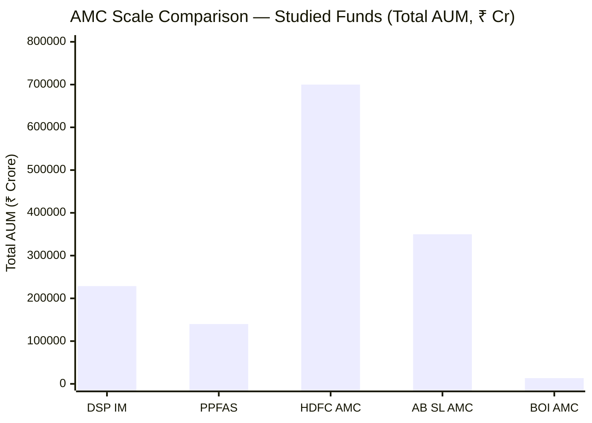

| Metric | DSP | PPFAS | BOI | Implication for Small Cap |
|--------|-----|-------|-----|--------------------------|
| Total AUM | ₹2,28,622 Cr | ₹1,40,000 Cr | ₹13,424 Cr | DSP has most research capital |
| Schemes | 66+ | 7 | 22 | — |
| Fund managers | **9 named** | 3–4 | 1 CIO | DSP deepest bench |
| Total employees | **508** | ~100–150 est. | ~50–60 | DSP most research capacity |
| Investor count | **50 lakh+** | ~50–60 lakh | 8.5 lakh | Both DSP and PP at retail scale |
| International office | **Yes (London)** | No | No | DSP has global ambitions |
| Custodian | **Citibank N.A.** | — | Deutsche Bank | Both top-tier global custodians |
| RTA | **KFin Technologies** | — | KFin Technologies | Both use India's leading RTA |

**The research depth advantage for DSP Small Cap Fund specifically:**

When Vinit Sambre's team evaluates a small company, they can draw on a 508-person institutional infrastructure — sector analysts, risk managers, credit analysts, operational support. The three-pillar framework (ROCE ≥15%, EBITDA growth 13%+, FCF positive, management quality, valuation discipline) requires significant analytical work for each of the 81 holdings in DSP Small Cap. The depth of DSP's institutional platform means that work is done with more rigour than at AMCs with a fraction of the staff.

---

## Investor Communication — Above Average, Below PPFAS

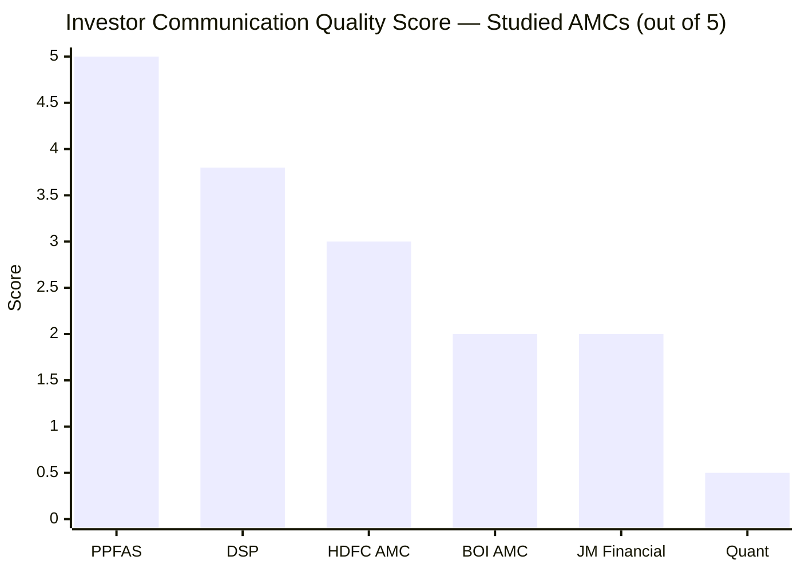

| Communication Form | DSP | PPFAS (Gold Standard) | BOI |
|-------------------|-----|----------------------|-----|
| Quarterly letters to unitholders | **No** | **Yes — detailed, candid, proactive** | No |
| Monthly factsheets | Yes | Yes | Yes |
| Active blog / "Latest Literature" | **Yes — ongoing content** | Yes | Minimal |
| CEO public interviews | **Frequent (Parekh, candid)** | Frequent (Thakkar) | Moderate (Singh) |
| Investment philosophy documented | **Yes — website PDFs + blog** | Extensive | No |
| Acknowledges mistakes publicly | **Yes (Parekh known for candour)** | Yes (quarterly letters) | Not documented |
| Behavioural finance content | **Yes — Parekh's specialty** | Yes | No |
| Fund manager public appearances | **Sambre: VRO, NDTV, Moneycontrol** | Thakkar: all platforms | Singh: moderate |

**The key gap:** Structured quarterly letters — where every major portfolio decision is explained proactively and in writing with manager accountability — are absent at DSP. PPFAS's quarterly letters create a written, time-stamped record. When Thakkar explains in writing why he did not buy Zomato in July 2021, and Zomato falls 70% in 2022, you can read the letter and verify the reasoning was principled before the outcome was known.

**The DSP mitigation:** Kalpen Parekh's frequent, candid public interviews and DSP's blog content partially fill this gap. Parekh's behavioural finance communication is the best CEO-level investor education from any AMC in this study. Sambre's VRO acknowledgment (Aug 2024) of the buy-and-hold limitation demonstrates manager-level intellectual honesty. But this communication is less structured, less scheme-specific, and less formally accountable than quarterly letters.

---

## AMC Financial Health

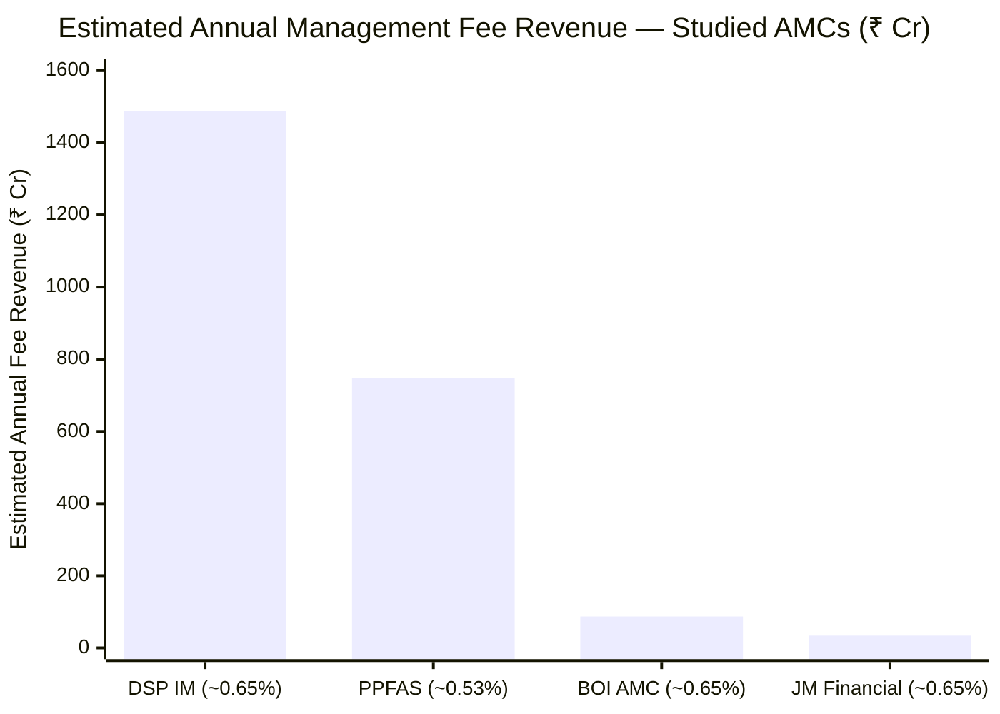

| Metric | Data / Estimate |
|--------|----------------|
| Total AUM | ₹2,28,622 Cr |
| Estimated blended ER | ~0.60–0.70% |
| **Estimated gross fee revenue** | **~₹1,370–1,600 Cr/year** |
| FY2024 reported revenue (Tracxn) | ₹241 Cr (net AMC management fees, after fund expenses) |
| DSP Finance group entity FY2025 net profit | ₹66 Cr on ₹137 Cr income |
| Kothari family net worth | **~₹15,779 Cr** |
| Financial stress risk | **Negligible** |

**Why financial health matters for investors:**

A financially stable AMC can hire and retain top research talent, maintain technology infrastructure, bear short-term underperformance without slashing the research budget, and make investor-first decisions (like closing a fund) without worrying about fee income. DSP faces none of the financial constraints that smaller AMCs face.

Unlike BOI AMC (estimated ₹87 Cr/year, breakeven at best), or JM Financial AMC (₹34 Cr/year, loss-making at current AUM), DSP's revenue base supports a 508-person organisation with a London office and international fund operations. There is zero risk of DSP needing to cut research staff, reduce analyst coverage, or chase AUM through aggressive distributor commissions to stay solvent.

---

## Scheme Count — 66 Is Many, But DSP Has Scale to Support It

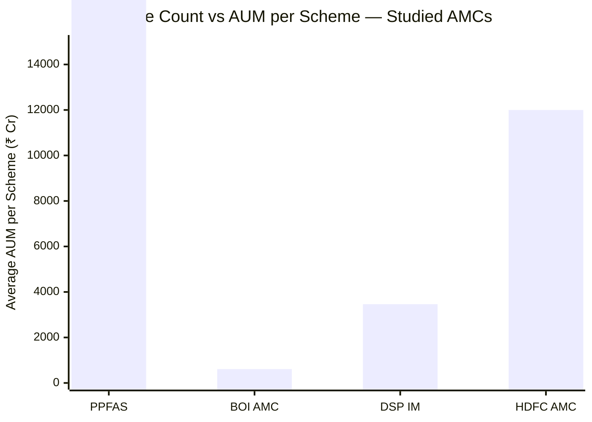

BOI has 22 schemes at ₹13,424 Cr — average ₹610 Cr/scheme; several are subscale. DSP has 66+ schemes at ₹2,28,622 Cr — average ~₹3,464 Cr/scheme. This is a fundamentally different problem.

| Concern | BOI Context | DSP Context |
|---------|------------|-------------|
| Average AUM per scheme | ₹610 Cr — several schemes below economic scale | **₹3,464 Cr — schemes viable at average** |
| Manager attention | 1 CIO across 22 schemes | 9 fund managers across 66 schemes ≈ 7 schemes/manager |
| Small cap fund specifically | 1 CIO; no co-manager | **Sambre + Ghosh; full focus** |
| Revenue support per scheme | Marginal for many | Adequate across the portfolio |

The relevant question for a DSP Small Cap investor is not "does DSP have too many schemes?" but "does Vinit Sambre have the research support needed to manage ₹17,906 Cr in small caps?" The answer — 508 employees, 9 fund managers, Abhishek Ghosh as co-manager, 30 years of institutional relationships — is clearly yes.

The focused-AMC advantage belongs to PPFAS (7 schemes). DSP is a full-product AMC — that is a design choice, not a failure. The DSP Small Cap Fund benefits from the institutional depth that full-product scale provides, even if the AMC doesn't have the single-fund alignment that PPFAS has.

---

## Novel Section: The Independence Dividend — What the BlackRock Buyout Proved

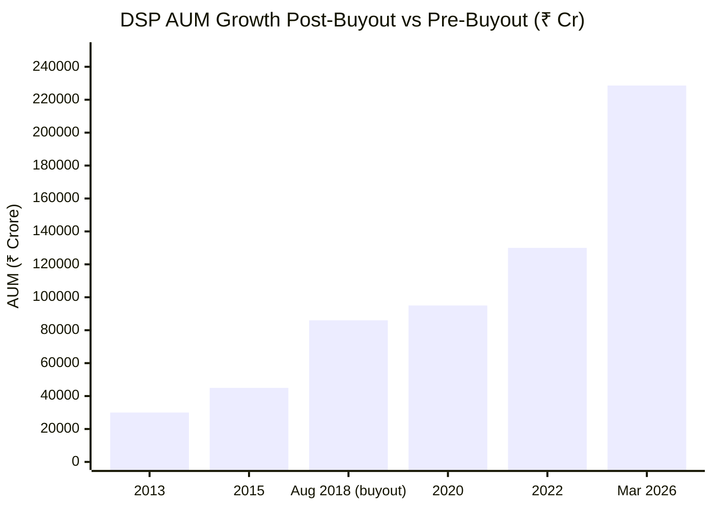

In 2018, when DSP bought out BlackRock's 40% stake, some observers worried: Would DSP lose credibility without a global asset manager's backing? Would performance suffer?

**Six years of post-buyout data answers this cleanly:**

| Metric | At Buyout (Aug 2018) | Current (Mar 2026) | Change |
|--------|---------------------|-------------------|--------|
| Total AUM | ₹86,000 Cr | ₹2,28,622 Cr | **+165%** |
| Investor count | ~20 lakh (est.) | 50 lakh+ | **+150%** |
| DSP Small Cap | Closed to new investors | Reopened (Apr 2020) | Discipline held |
| International presence | Domestic only | **London office opened** | Expanded |

The independence dividend is clear. DSP proved that the BlackRock relationship was additive, not essential. The institutional knowledge was absorbed and retained. The governance standards were internalised. And without a foreign partner taking 40% of economics and imposing global strategy constraints, DSP's management now makes decisions purely based on what is right for Indian investors and the long-term business.

This mirrors the BOI-AXA story in structure (foreign partner exits; fund strengthens) but differs critically in causation: at DSP, the Kothari family **chose** to buy out BlackRock — a proactive strategic decision to control their destiny, not a reactive response to a partner's global restructuring. Choosing independence is stronger governance than having independence imposed.

---

## Peer AMC Comparison — Full Picture

| Dimension | DSP | PPFAS | BOI | HDFC | Quant |
|-----------|-----|-------|-----|------|-------|
| **Ownership type** | **Family-private (independent)** | Promoter-private | Govt PSU bank | Bank group (listed) | Single founder |
| **Heritage** | **160+ years** | ~30 years | 120 years (bank) | ~48 years | ~28 years |
| **Total AUM** | **₹2.28L Cr** | ₹1.40L Cr | ₹13,424 Cr | ₹7+ L Cr | ~₹1.1L Cr |
| **Investor count** | **50 lakh+** | ~50+ lakh | 8.5 lakh | — | — |
| **Skin-in-game** | **All 508 employees invest only in DSP (institutional)** | Managers disclose personal | Not disclosed | Not disclosed | Not disclosed |
| **SEBI issues** | **1 minor procedural (ETF ER, ₹2L)** | Zero | 1 routine settlement + 1 individual | Zero | **Active front-running probe** |
| **Severity** | Very low | Clean | Low | Clean | **Extreme** |
| **Quarterly letters** | No | **Yes** | No | No | No |
| **International JV history** | **BlackRock (2008–2018)** | None | AXA (until 2021) | None | None |
| **AMC rank in India** | **Top 10 (~7th–8th)** | Top 15–16 | ~40th | Top 3 | Top 15 |
| **Financial stability** | Very High | High | Very High (govt) | Very High | Moderate |
| **Succession plan** | **Strong (Aditi Kothari Desai, Apr 2025)** | Moderate | Low | High | Low |
| **Research depth** | **508 employees; 9 managers** | ~100–150 est.; 3–4 managers | ~50–60; 1 CIO | 500+; 20+ managers | Quant model |

---

## Points For and Against — AMC Quality

### In Favour

1. **160+ year DSP Group heritage** — founding member of BSE; multigenerational capital market presence through every economic cycle in modern Indian history; institutional resilience that cannot be manufactured in a decade
2. **100% independent family ownership** — no bank parent, no government, no foreign JV; decisions made purely for long-term fund performance and institutional reputation; the Kothari family's identity is their brand
3. **All-employee skin-in-the-game (institutional mandate)** — every one of DSP's 508 employees invests only in DSP schemes; the most broadly implemented incentive alignment in any AMC in this study; aligns every layer of the organisation, not just the fund managers
4. **BlackRock governance legacy** — 10 years (2008–2018) with world's largest asset manager calibrated DSP's risk frameworks, research standards, and compliance culture to international standards; this institutional DNA persists after the partnership ended
5. **₹2.28L Cr AUM; 50 lakh investors** — top 10 AMC; institutional scale that funds 508 employees, London office, full technology infrastructure; research depth that smaller AMCs cannot match
6. **Essentially clean 30-year regulatory record** — one minor ETF procedural penalty (₹2L); no equity fund manager ever under SEBI scrutiny; no front-running, no market manipulation, no investor harm across 30 years and 50 lakh investors
7. **Flow restriction discipline (2014–2020)** — closed DSP Small Cap for 3+ years at real commercial cost; reopened at COVID lows; documented, costly, investor-first AMC decision that no fee-maximising institution would make
8. **Aditi Kothari Desai succession (April 2025)** — planned, ordered 5th-generation transition; Wharton + Harvard MBA; 23 years inside DSP before Chairperson; family ownership continuity confirmed for the next generation and beyond
9. **Kalpen Parekh's investor communication** — behavioural finance advocate; candid, sometimes contrarian; frequent and consistent public communication; best CEO-level investor education from any AMC in this study
10. **Citibank N.A. custodian + KFin RTA** — Citibank is globally the largest custodian bank; KFin is India's leading RTA; infrastructure choices at the top tier despite not needing to use the most expensive providers
11. **London office and international ambitions** — DSP's international franchise extends beyond India; long-term institutional vision, not just domestic retail accumulation

### Against

1. **No quarterly investor letters** — the structured, scheme-specific, proactively written investor communication that PPFAS provides remains absent; investors must seek out interviews rather than receive proactive, written explanation of portfolio decisions
2. **66 schemes — scale vs. focus tension** — DSP is a full-product AMC; not a focused boutique; at 66 schemes, investment decisions across schemes can sometimes conflict; the DSP Small Cap investor cannot assume AMC-level decisions always prioritise their specific fund
3. **Skin-in-game not individually disclosed at manager level** — the institutional policy is confirmed, but individual fund manager personal investment amounts are not publicly disclosed (unlike PPFAS where Thakkar's personal investment is explicitly documented)
4. **Ownership transition in early phase** — Aditi Kothari Desai is only one year into the Chairperson role; the cultural transition from Hemendra's 29-year leadership is still in progress; continuity is probable but unproven through a full market cycle under her watch
5. **AMC revenue/profit not transparently disclosed** — unlike listed AMCs (HDFC AMC), DSP's full P&L is not publicly available in text-extractable form; investors cannot directly assess AMC financial health from published accounts
6. **Not the most focused AMC for a single-fund investor** — DSP's business success is distributed across 66 schemes; unlike PPFAS where FlexiCap's performance is literally the AMC's survival, DSP can have one underperforming fund and the institution continues without disruption; this partially dilutes the alignment incentive

---

## Module 6 Scorecard

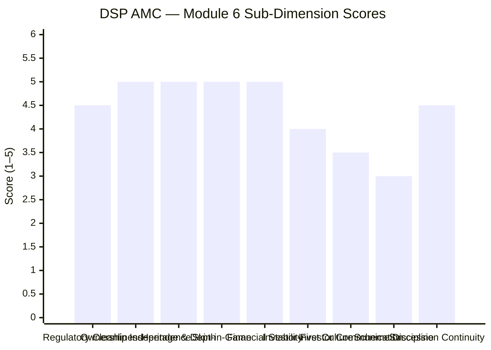

| Sub-Dimension | Score (1–5) | Reasoning |
|---------------|------------|-----------|
| Regulatory cleanliness | 4.5 | 30 years essentially clean; one minor ETF procedural penalty (₹2L); no equity fund manager ever under SEBI scrutiny; cannot be 5.0 due to the Dec 2022 incident, however minor |
| Ownership independence | 5 | 100% family-owned; no bank, no government, no foreign partner; decisions made purely for business and investors; 160-year family commitment to financial services |
| Heritage and institutional depth | 5 | 160+ year DSP Group; BSE founding member; BlackRock governance legacy; 508 employees; London office; international institutional relationships |
| Skin-in-the-game | 5 | All 508 employees invest only in DSP schemes — broadest, most institutionalised skin-in-game policy of any AMC in this study; surpasses PPFAS in scope |
| AMC financial stability | 5 | ₹2.28L Cr AUM; top 10 AMC; Kothari family ₹15,779 Cr net worth backstop; zero financial stress; 508-person infrastructure fully funded |
| Investor-first culture | 4 | Flow restriction discipline documented (2014–2020); all-employee investment policy; Parekh's behavioural finance communication; deducted for absence of quarterly letters |
| Investor communication | 3.5 | Monthly factsheets, active blog, frequent CEO interviews, philosophy documented; clear gap vs. PPFAS's quarterly letters |
| AMC focus and scheme discipline | 3 | 66 schemes is many; not a focused boutique; scheme proliferation requires active monitoring; individual fund alignment weaker than PP's single-fund dependence |
| Succession and continuity | 4.5 | Aditi Kothari Desai appointed April 2025; 5th generation; 23 years inside DSP; Kalpen Parekh stable; strong continuity — deducted as transition still in early phase |
| **Module 6 Overall** | **4.3 / 5** | **Second-best AMC quality in this study; falls short of PPFAS only on scheme count and absence of quarterly letters; surpasses PPFAS on heritage, institutional depth, and breadth of skin-in-game policy** |

---

## Comparative Module 6 Scores — All Studied Funds

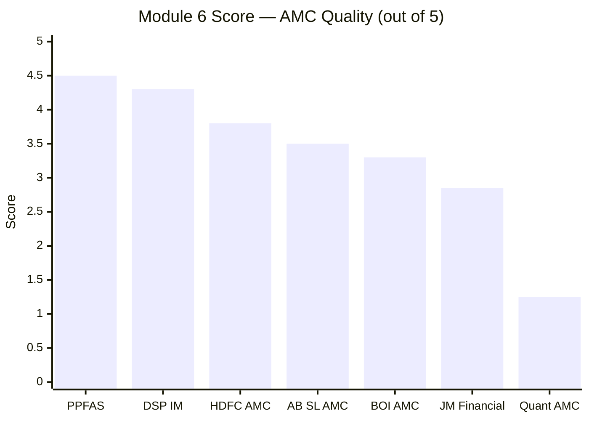

| Rank | AMC | Score | Key Differentiator |
|------|-----|-------|--------------------|
| 1 | **PPFAS** | **4.5/5** | Zero incidents 13 years; quarterly letters; 7-scheme focus; investor-first DNA documented |
| **2** | **DSP Investment Managers** | **4.3/5** | **160Y heritage; all-employee skin-in-game; BlackRock governance legacy; ₹2.28L Cr depth; flow restriction discipline** |
| 3 | HDFC AMC | ~3.8/5 | Large, listed, transparent; strong parent; commercially oriented |
| 4 | AB SL AMC | ~3.5/5 | Large, stable, conglomerate-backed; cross-selling conflict risk |
| 5 | BOI AMC | 3.30/5 | 120-year govt bank; PSU governance; clean CIO; lacks investor communication |
| 6 | JM Financial | ~2.85/5 | 3 SEBI incidents; AMC loss-making; no transparency |
| 7 | Quant AMC | ~1.25/5 | Active SEBI front-running probe on current CIO; opaque |

---

## One-Line Verdict

DSP Investment Managers is the second-best AMC in this study — backed by 160 years of Indian capital market heritage, 100% independent family ownership with all 508 employees invested only in their own funds, a BlackRock-calibrated governance culture, the documented discipline to close a fund when AUM threatens investor interests, and a planned 5th-generation succession — falling short of PPFAS only because it runs 66 schemes without quarterly investor letters.

---

## Module 6 Final Score: **4.3 / 5**

> **Module Weight:** 5% | **Weighted Contribution to Final Score:** 4.3 × 0.05 = **0.215**

---

## DSP Small Cap Fund — Complete Final Score (All 6 Modules)

| Module | Topic | Weight | Score | Weighted |
|--------|-------|--------|-------|----------|
| Module 1 | Returns Consistency | 25% | 4.5/5 | 1.1250 |
| Module 2 | Risk Profile | 20% | 3.8/5 | 0.7600 |
| Module 3 | Portfolio DNA | 15% | 3.8/5 | 0.5700 |
| Module 4 | Cost & AUM Impact | 20% | 3.7/5 | 0.7400 |
| Module 5 | Fund Manager Quality | 15% | 3.9/5 | 0.5850 |
| **Module 6** | **AMC Quality** | **5%** | **4.3/5** | **0.2150** |
| **TOTAL** | | **100%** | | **4.00 / 5.00** |

> DSP Small Cap Fund final weighted score: **4.00 / 5** — the highest-scoring small cap fund in this study
