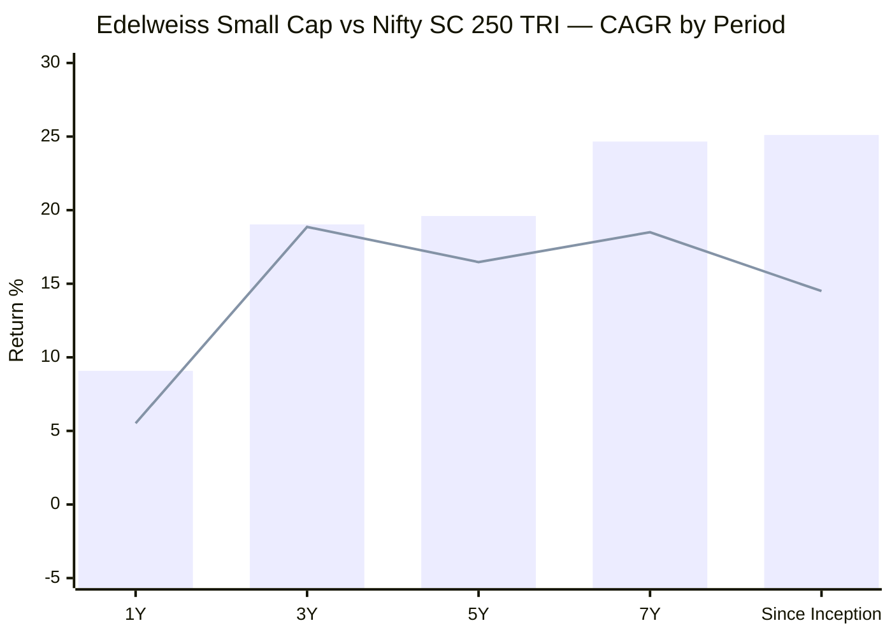
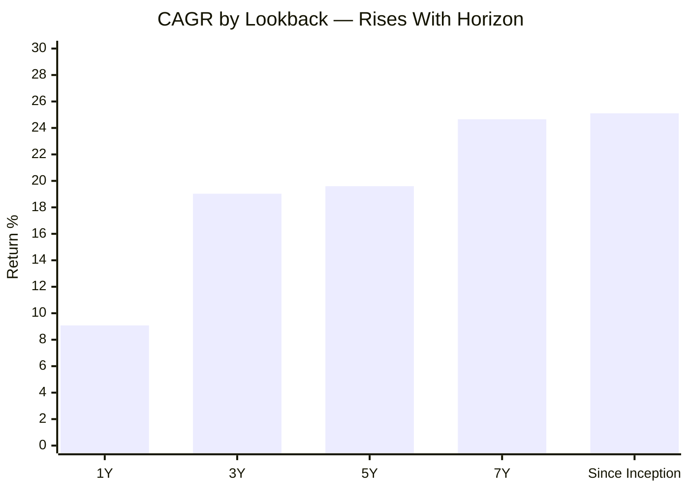
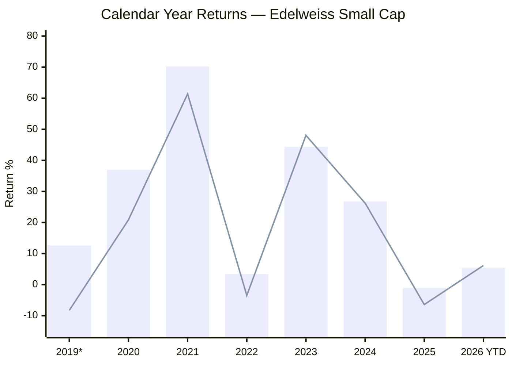
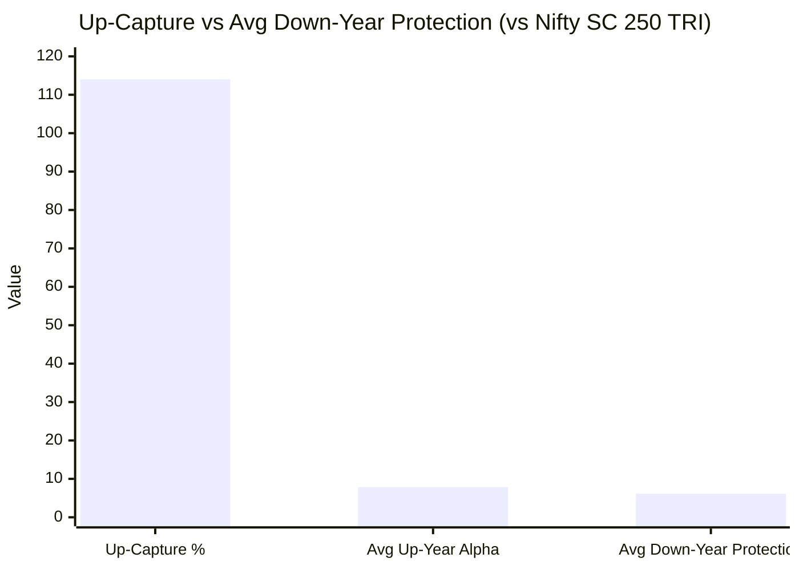
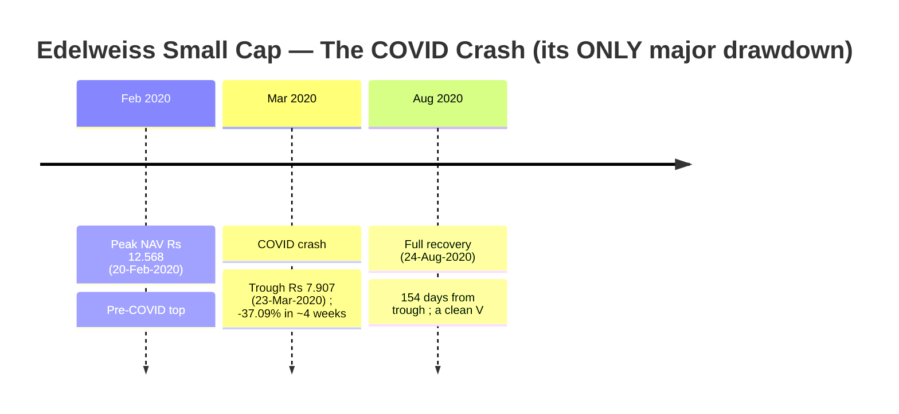
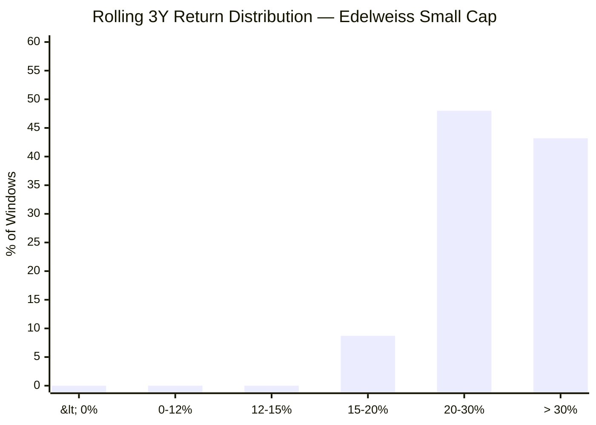
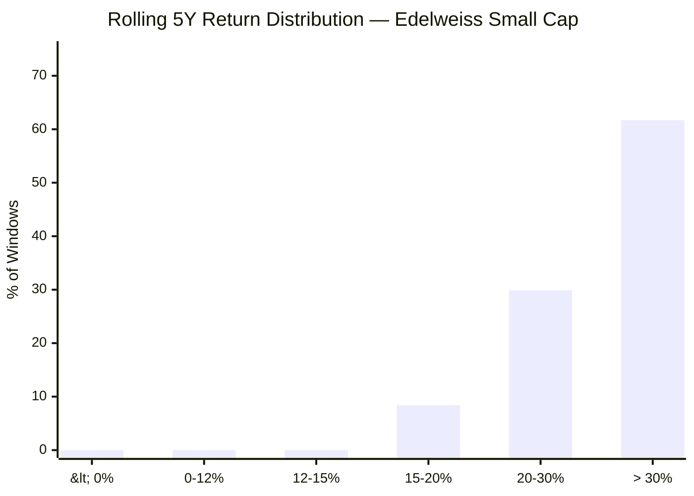
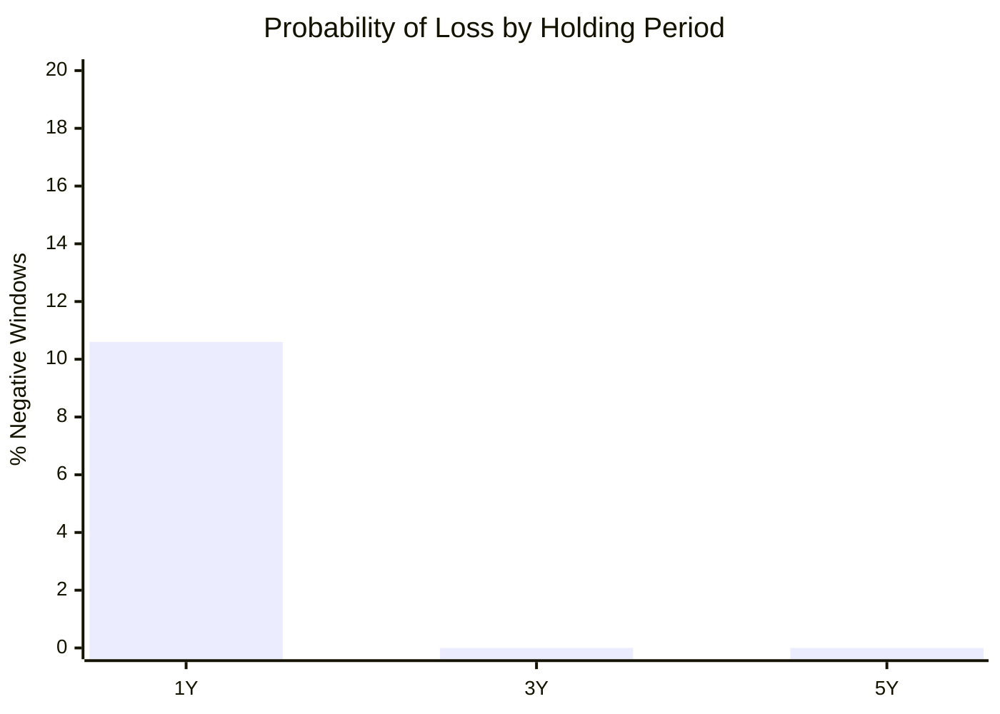
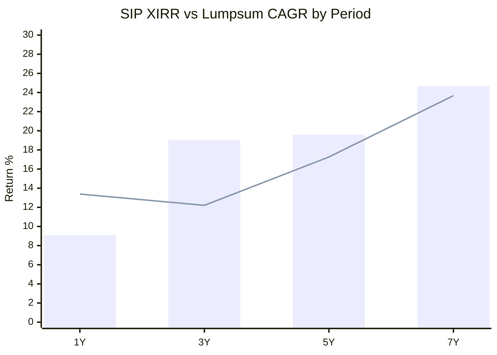
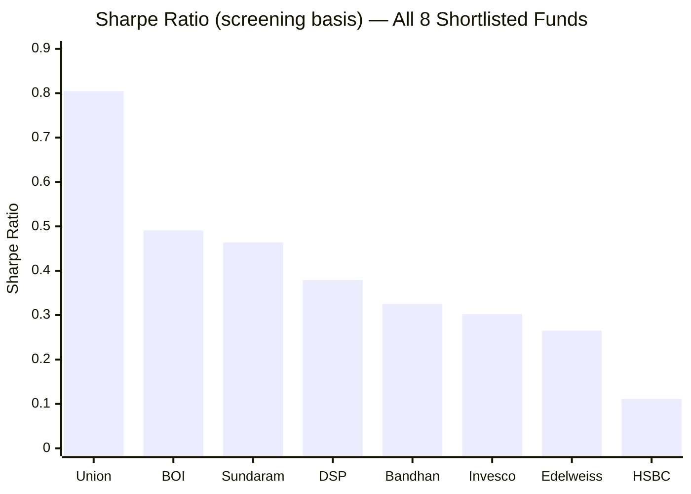

# Module 1: Returns Consistency — Edelweiss Small Cap Fund

*Sources: MFAPI NAV history — Edelweiss Small Cap Fund Direct Growth (Scheme 146196, 14-Feb-2019 → 19-Jun-2026), 1,809 NAV data points | Nippon Nifty Smallcap 250 Index Fund NAV (Scheme 148519) for the benchmark | Tickertape | Value Research Online | INDmoney | Edelweiss MF factsheets (edelweissmf.com) | AMFI | Web research, June 2026. Benchmark = Nifty Smallcap 250 TRI — which is **both** the fund's stated mandate benchmark **and** the project-wide cross-fund benchmark, so (unlike BOI) there is no benchmark-mismatch footnote here.*

---

## Fund Identity

| Attribute | Detail |
|-----------|--------|
| Full Name | Edelweiss Small Cap Fund — Direct Plan — Growth |
| AMC | Edelweiss Asset Management Ltd *(formerly JPMorgan AMC India book, acquired 2016)* |
| Benchmark | **Nifty Smallcap 250 TRI** *(mandate = project benchmark — no mismatch)* |
| Lead Fund Manager | **Trideep Bhattacharya** — CIO–Equities, Edelweiss MF; **managing this fund since 24-Dec-2021** |
| Co-Managers | Raj Koradia (since 01-Aug-2024); **Dhruv Bhatia (since 14-Oct-2024) — *the ex-BOI manager who architected BOI Small Cap's 2018–24 record*** |
| Prior Manager | **Harshad Patwardhan** (launch → Dec-2021; ex-JPMorgan CIO; *now CIO of Union MF*) |
| Direct Plan Inception | **14 February 2019** (VRO lists 07-Feb-2019; inception NAV ₹9.953) |
| MFAPI Scheme Code | 146196 |
| AUM (Direct) | **₹6,156 Cr** (June 2026); ₹5,952 Cr at screening — *mid-sized; the AUM "sweet spot"* |
| Expense Ratio (Direct) | **~0.44–0.52%** (VRO 0.44%, INDmoney 0.52%, June 2026) — *screening's 0.82% was stale/regular; see ER reconciliation* |
| SEBI Category | Small Cap Fund (≥65% small-cap mandate) |
| VRO Star Rating | **4 ★** |
| Current NAV (19-Jun-2026) | ₹51.566 |

> **🔑 Critical Interpretive Lens #1 — Inception bias (the BOI/Invesco family).** Edelweiss Small Cap launched **14 February 2019 — well after the July-2018 small-cap peak, during the IL&FS bear's grind-down but before the COVID bottom.** Like **BOI (Dec-2018)** and **Invesco (Oct-2018)**, its entire record begins on the *downslope-into-recovery* of the worst small-cap bear of the decade and rides upward. This is **structural inception bias** — and the **polar opposite of DSP (2013) and HSBC/L&T (2014)**, the only two funds in the 8-fund shortlist carrying real, lived 2018-crash data. Every long-horizon figure here — the 25.11% since-inception CAGR, the zero-negative rolling history, the 37% (not 50%+) drawdown — must be read through this lens: **genuinely strong, but never tested by a full multi-year bear.**

> **🔑 Critical Interpretive Lens #2 — A two-manager track record.** Unlike BOI (one continuous proven CIO), Edelweiss's 7.3-year record **splits cleanly across two managers**, and the split is decisive for interpretation:
> - **Harshad Patwardhan era (Feb-2019 → Dec-2021):** owns the *explosive* years — 2020 (+36.94%) and 2021 (+70.22%). The headline since-inception and 7Y CAGR are **largely his**, not the current team's.
> - **Trideep Bhattacharya era (24-Dec-2021 → today):** owns the *entire recent record* — 2022, 2023, 2024, 2025, 2026 YTD — i.e. **exactly the defensive, thin-alpha period this module flags.** This is the same FlexiCap-proven CIO whose Edelweiss Flexi Cap scored **3.77/5, Rank #4** in the companion study.
>
> The tension: the *gorgeous* part of the record belongs to a manager who has **left the AMC** (he now runs Union MF), while the *current* team owns a period of strong downside protection but near-zero 3Y alpha. This is a milder version of the Bandhan manager-split problem — and it means **the since-inception/7Y numbers cannot be credited to the people running the fund today.**

> **🔑 Critical Interpretive Lens #3 — Edelweiss has poached BOI's record-builder.** The co-manager added on **14-Oct-2024, Dhruv Bhatia, is the very manager who architected BOI Small Cap's celebrated 2018–24 track record** (co-PM 2018–22, then solo 2022–24, building BOI's 2020 +55%, 2021 +74% and 2023 +43% years) before leaving for Edelweiss. This is strategically important for the project: **BOI scored #2 partly on a record its current manager (Alok Singh, since Oct-2024) did *not* build — and the man who *did* build it is now here, at a shortlist competitor.** It means (a) Edelweiss's *forward-looking* small-cap talent just strengthened materially, and (b) the BOI-vs-Edelweiss decision is partly a bet on *where Bhatia's small-cap skill now lives.* His Edelweiss tenure is only ~20 months, so it does not yet show in the numbers — but it is the single most important *forward* signal in this module, and a direct link back to the BOI study (see [[smallcap-fund-research-project]]).

---

## Raw Data (MFAPI computed + Tickertape/VRO/INDmoney, as of 19-Jun-2026)

| Metric | Value | Source |
|--------|-------|--------|
| CAGR 1Y | **9.08%** | MFAPI |
| CAGR 3Y | 19.03% | MFAPI (screening 20.12%, base-date drift) |
| CAGR 5Y | **19.60%** | MFAPI (screening 19.80% ✅) |
| CAGR 7Y | 24.66% | MFAPI |
| Since Inception (7.34Y) | **25.11%** | MFAPI |
| Rolling 3Y Mean / Median | 29.57% / 28.87% | MFAPI (1,076 windows) |
| Rolling 5Y Mean / Median | 30.47% / 31.17% | MFAPI (582 windows) |
| Max Drawdown | **−37.09%** | MFAPI — *exact match to screening (37.09)* ✅ |
| Annualized Volatility (full) | 17.56% | MFAPI |
| Annualized Volatility (3Y) | 16.16% | MFAPI |
| Std Dev (screening) | **15.10** | Screening — **lowest of all 8 shortlisted funds** |
| Sharpe (3Y, rf 6.5%) | **0.78** | MFAPI computed (INDmoney 0.72; screening 0.265) |
| Sortino (3Y) | 1.06 | MFAPI computed |
| Alpha (3Y, INDmoney) | 1.32 | INDmoney |
| Beta (3Y) | 0.80 | INDmoney |
| Up-capture (full-year) | **~114%** | MFAPI computed |
| Portfolio PE | 33.12 (screening) | Screening |
| VRO Star Rating | **4 ★** | Value Research |

---

## Cross-Source Verification

| Metric | MFAPI Computed | Screening (May-26) | Other | Verdict |
|--------|----------------|--------------------|-------|---------|
| 5Y CAGR | 19.60% | 19.80% | VRO ~21.98% (Apr-26 base) | **Confirmed** |
| 3Y CAGR | 19.03% | 20.12% | — | Confirmed (base-date drift) |
| Max Drawdown | −37.09% | 37.09% | — | **Exact match — validates the NAV series** ✅ |
| Sharpe | 0.78 (3Y) | 0.265 | INDmoney 0.72 | Positive across sources (method differences) |
| ER (Direct) | — | 0.82% | VRO 0.44% / INDmoney 0.52% | **Conflict — current is ~0.44–0.52%; see reconciliation** |

**Data reliability: Very High.** The independently computed max drawdown (−37.09%) reproduces the screening platform's headline figure to the basis point, and the 5Y CAGR matches screening — strong evidence the 1,809-point NAV series (Feb 2019 → Jun 2026) is complete and correct.

> **Note on Sharpe divergence.** The computed 3Y Sharpe (0.78, rf 6.5%) and INDmoney's (0.72) agree closely and are firmly positive; the screening figure (0.265) used a longer/different window in which Edelweiss ranked only **7th of 8** (above HSBC). All sources agree the risk-adjusted return is positive — the gap is the usual methodology difference seen across every fund in this study.

---

## CAGR vs Benchmark (Nifty Smallcap 250 TRI)

> Bar = Edelweiss Small Cap | Line = Nifty SC 250 TRI. 1Y/3Y/5Y benchmark figures computed from the Nippon Nifty Smallcap 250 Index Fund NAV (the project's standard tradeable tracker); 7Y/SI chained with the project's pre-2020 TRI series (SI is an estimate).

| Period | Fund | Benchmark (TRI) | Alpha | Source |
|--------|------|-----------------|-------|--------|
| 1Y | 9.08% | 5.52% | **+3.56%** | Index-fund NAV (verified) |
| 3Y | 19.03% | 18.86% | **+0.17% ⚠️** | Index-fund NAV (verified) |
| 5Y | 19.60% | 16.47% | **+3.13%** | Index-fund NAV (verified) |
| 7Y | 24.66% | ~18.50% | **~+6.2%** | Chained estimate |
| Since Inception (7.34Y) | **25.11%** | ~14.50%* | **~+10.6%** | Estimate (inception-biased) |

> *The since-inception alpha (~+10.6%/yr) is **the most inception-flattered number in the module** and, critically, **belongs mostly to the *previous* manager (Patwardhan, 2019–21).** Do **not** treat it as a sustainable edge of the current team. The trustworthy, current-team alpha readings are the **3Y (+0.17%)** and **5Y (+3.13%)** windows. In wealth terms, ₹1 lakh at inception (Feb 2019) compounded to **~₹5.18 L** at the 25.11% CAGR — but that is a single, bull-dominated 7.3-year run spanning two managers, not a full cycle under the present team.

**The clean read:** Edelweiss's *recent* alpha is **thin** — the 3Y window (+0.17%) is essentially flat against the index, the weakest 3Y alpha of any fund studied. The 5Y (+3.13%) is respectable but is half Patwardhan's. This is the central concern of the module and is dissected in the dedicated "Thin-Alpha Problem" section below.

---

## The CAGR Curve — Rises With Horizon (Inception- and Manager-Flattered at the Long End)

The shape: a **low 1Y (9.08%)** — the 2025 small-cap slump and a lagging 2026 showing through — rising steadily to 19% (3Y/5Y) and then jumping to 24–25% at 7Y/SI. This is HSBC's "rises-with-horizon" inverted curve, **but for a very different reason**: HSBC's long end is genuine through-cycle compounding; Edelweiss's long end is **inception bias + the Patwardhan-era explosion (2020–21)**. The **5Y (19.60%) is the single most trustworthy headline** and should anchor any cross-fund comparison; the 7Y/SI numbers are the least bankable.

---

## Genuine vs Flattered — A Split View *(Edelweiss-specific section)*

Because Edelweiss combines inception bias *and* a manager change, this table separates what the **current team** can be credited with from what is flattered:

| Metric | Value | Trust level | Why |
|--------|-------|-------------|-----|
| 5Y CAGR | 19.60% | ✅ **Trustworthy** | Includes 2025 slump; comparable across funds (but half is Patwardhan-era) |
| 3Y CAGR & alpha | 19.03% / +0.17% | ✅ **Trustworthy (current team)** | Entirely Trideep era; the honest read on today's process |
| 1Y alpha | +3.56% | ✅ **Trustworthy** | Verified vs the index |
| **2025 calendar (−1.06%)** | **+5.36% alpha** | ✅ **Trustworthy — best of group** | A real down-market test, passed best of all studied funds |
| 2020 COVID drawdown (−37%) | 154-day recovery | ✅ **Trustworthy** | A genuine, fast crash survived (Patwardhan era) |
| Sharpe / Sortino | 0.78 / 1.06 | 🟡 **Semi** | Real, but no bear-market drawdown to stress the denominator |
| Since-inception CAGR | 25.11% | ⚠️ **Flattered + prior-manager** | From the post-2018 downslope; mostly Patwardhan's |
| 7Y CAGR | 24.66% | ⚠️ **Flattered + prior-manager** | Same |
| 2020/2021 (+36.94% / +70.22%) | — | ⚠️ **Prior manager** | The explosive years belong to Patwardhan, not the current team |
| Rolling 3Y/5Y (0% negative) | min +15.77% / +18.12% | ⚠️ **Flattered** | No full bear in any window |

**The disciplined conclusion:** judge the *current Edelweiss team* on its **3Y alpha (+0.17%)**, its **best-in-group 2025 protection (+5.36%)**, its low volatility, and its 5Y CAGR (19.60%, mid-pack). **Discount** the since-inception, 7Y, and 2020–21 figures — they are real arithmetic but describe a bull run that is half-owned by a manager who has since left the AMC.

---

## Calendar-Year Returns (2019–2026 YTD) + Per-Year Alpha

*Source: MFAPI NAV (scheme 146196). Benchmark = Nifty SC 250 TRI calendar returns (Nippon index-fund NAV; 2019 from project pre-2020 series).*

> *2019 partial (from 14-Feb inception) | 2026 YTD as of 19-Jun-2026. Vertical dashed boundary: Patwardhan ran 2019–2021; Trideep from 24-Dec-2021 (i.e. 2022 onward).

| Year | Edelweiss | Benchmark | Alpha | Manager | Notes |
|------|-----------|-----------|-------|---------|-------|
| 2019* | +12.59% | −8.27% | (partial) | Patwardhan | Partial year from Feb inception — not directly comparable |
| 2020 | **+36.94%** | +20.86% | **+16.08%** | Patwardhan | Strong COVID-recovery capture |
| 2021 | **+70.22%** | +61.37% | **+8.85%** | Patwardhan | Best absolute year — captured the bull fully |
| 2022 | +3.41% | −3.48% | **+6.89%** | Trideep | Positive in a down year — defensive debut |
| 2023 | +44.34% | +48.04% | **−3.70%** | Trideep | Lagged the momentum bull (same quality-tilt cost as DSP/HSBC/BOI) |
| 2024 | +26.78% | +26.22% | **+0.56%** | Trideep | Essentially matched the index |
| **2025** | **−1.06%** | **−6.42%** | **+5.36% ✅** | Trideep | **Best 2025 downside protection of the entire group** |
| 2026 YTD | +5.45% | +6.17% | −0.72% | Trideep | Lagging the recovery — defensive drag |

**Record: positive in every full calendar year (2019–2025) — zero down years.** But split by manager the story sharpens: **Patwardhan's two full years (2020–21) produced +16.08% and +8.85% alpha** (aggressive up-capture), whereas **Trideep's four years (2022–25) produced +6.89%, −3.70%, +0.56%, +5.36%** — a clearly *defensive* signature: wins big in down-benchmark years (2022, 2025), lags in sharp up-years (2023, 2026). The 2025 protection (+5.36%) is the standout — **better than DSP (+4.09%), and far better than BOI (−1.18%) and HSBC (−4.62%).**

---

## The Defensive Archetype — Protect-on-Down, Lag-on-Up *(Edelweiss-specific section)*

Edelweiss is the **mirror image of BOI**, and that contrast is the cleanest way to understand it:

| Dimension | Edelweiss (Trideep era) | BOI (Alok Singh) |
|-----------|------------------------|------------------|
| Volatility (screening std dev) | **15.10 — lowest of all 8** | 16.33 |
| Up-capture (full-year) | **~114%** (moderate) | 126% (aggressive) |
| Portfolio diversification (top-10) | **25.88% — most diversified of 8** | more concentrated |
| Best down-year protection | **2025 +5.36% (best of group)** | 2025 −1.18% (mild miss) |
| Up-market behaviour | Lags sharp rallies (2023, 2026) | Captures rallies fully |
| Recent 3Y alpha | **+0.17% (thin)** | +4.18% (strong) |

| Metric | Value | Interpretation |
|--------|-------|----------------|
| Up-capture (full up-benchmark years) | **~114%** | Captures more than the index in up years, but less aggressively than BOI |
| Avg up-year alpha | +7.85%/yr | Lifted heavily by Patwardhan's 2020–21; Trideep's up-years (2023/24) are flat-to-negative |
| Down-benchmark years | 2022, 2025 | **Positive in both** while the index fell |
| Avg down-year protection | **+6.13%/yr** | Genuinely strong — and entirely Trideep-era |

**Read:** Edelweiss is the shortlist's **defensive small-cap** — lowest volatility, most diversified portfolio, best 2025 protection. That defensiveness is real and current-team-owned. Its cost is **muted up-capture and thin recent alpha**: a portfolio spread across many names, hugging the index closely (3Y beta 0.80, 3Y alpha +0.17%), which protects on the downside but struggles to outperform a cheap index fund in normal/up markets. Whether that is *prudent risk management* or *creeping closet-indexing* is the open question of the next section.

---

## The Thin-Alpha Problem *(Edelweiss-specific section)*

The most important negative in the module: **over the trailing 3 years Edelweiss has generated essentially zero alpha (+0.17%) against the Nifty Smallcap 250 TRI.**

| Evidence | Reading |
|----------|---------|
| 3Y alpha +0.17%; 3Y beta 0.80 | Returns track the index closely; little active edge in the current window |
| Top-10 holdings only 25.88% (most diversified of 8) | A broad, low-conviction book — structurally index-like |
| 2024 alpha +0.56%, 2026 YTD −0.72% | In calmer/up markets it essentially matches or lags the index |
| 5Y alpha +3.13% — but ~half is Patwardhan's 2020–21 | The *current team's* genuine alpha is closer to the 3Y reading than the 5Y |

**Three interpretations, and which is most likely:**
1. **Closet-indexing drift** — the fund has become so diversified it can't beat the index net of cost. *Partly supported by the data.*
2. **Deliberate defensiveness** — Trideep is running lower risk on purpose, accepting flat up-market alpha to buy downside protection (validated by the best-in-group 2025). *Strongly supported by 2022 and 2025.*
3. **Style-cycle headwind** — like DSP/HSBC/BOI, a quality tilt that simply lagged the 2023–24 momentum/junk rally. *Plausible — the 2023 −3.70% mirrors the whole quality-tilt cohort.*

The honest synthesis is **(2) + (3)**: a deliberately defensive, quality-tilted book that protected superbly in 2025 but earns thin alpha when small-caps run. **This is acceptable only if the cost is low** — which is exactly why the ER reconciliation below is decisive.

---

## The Expense-Ratio Reconciliation *(Edelweiss-specific section)*

This single data point materially swings the verdict, so it is resolved explicitly:

| Source | Direct-plan ER | Date | Note |
|--------|---------------|------|------|
| Project screening | **0.82%** | May 2026 | Used in Stage-1/2 tables; **likely stale or regular-plan** |
| Value Research Online | **0.44%** | Jun 2026 | Current |
| INDmoney | **0.52%** | Jun 2026 | Current |

**Conclusion: the current direct-plan ER is ~0.44–0.52%, not 0.82%.** The most probable explanation is a TER cut as AUM grew toward ₹6,000 Cr (the screening figure may also have picked up the regular plan). This **re-rates the fund's cost from "2nd-most-expensive" to "mid-pack-to-cheap"**, comparable to DSP (0.64%) and below HSBC (0.73%).

**Why it matters:** a fund delivering ~0% 3Y alpha while charging **0.82%** would be very hard to justify against a 0.20% index fund. At **0.44–0.52%**, the thin-alpha problem is far more forgivable — the investor is paying a modest premium for genuine, demonstrated downside protection. **Module 4 must confirm the live ER from the latest factsheet/SID** and decide which figure anchors the cost score; this module treats ~0.44–0.52% as primary.

---

## The 37.09% Max Drawdown — COVID, and the Missing 2018 Test

The screening flagged Edelweiss's 37.09% max drawdown as **mid-pack** (better than DSP 49%, HSBC 52%, Sundaram 57%, Union 45%; worse than Bandhan 24%, BOI 32%; ~identical to Invesco 37.7%). The NAV data resolves exactly what it was:

| Metric | Value |
|--------|-------|
| Peak | ₹12.568 (20-Feb-2020) |
| Trough | ₹7.907 (23-Mar-2020) |
| Max Drawdown | **−37.09%** |
| Recovery to peak | 24-Aug-2020 (**154 days** from trough) |

**This is a single, fast, V-shaped COVID crash — recovered in ~5 months, under the *Patwardhan* regime.** The critical caveat is identical to BOI/Invesco: **the fund launched in February 2019 and never lived through the 2018 IL&FS crash** — the era's defining small-cap stress test, in which the benchmark fell ~26% and stayed down for years. DSP and HSBC carry that scar; Edelweiss does not. We therefore know it handles a sharp liquidity-driven V (well) and a mild correction (2025, best-in-group) — but **its behaviour in a slow, grinding multi-year small-cap winter is untested**, and the current defensive team has never managed it through one.

---

## Rolling 3Y Returns Distribution

*Computed from 1,076 rolling 3-year windows (Feb 2019 – Jun 2026).*

| Metric | Value |
|--------|-------|
| Total 3Y windows | 1,076 |
| Minimum | **+15.77%** |
| Maximum | +48.11% |
| Mean / Median | 29.57% / 28.87% |
| Windows ≥ 12% | **100%** |
| Negative windows | **0.0%** |

**Interpretation — read with the bias caveat.** Every 3-year window returned ≥15.77% — flawless on paper, and the minimum is *higher* than BOI's (+14.88%). But this is **bull-only**: the dataset contains one crash (COVID, V-recovered) and one mild dip (2025), and **no full bear.** DSP's and HSBC's "worse-looking" distributions (with negative windows) are *more trustworthy* precisely because they include 2018. Edelweiss's zero-negative 3Y history is real arithmetic over a genuinely strong 7.3 years — but untested by the kind of window that generates DSP's and HSBC's negatives.

---

## Rolling 5Y Returns Distribution

*Computed from 582 rolling 5-year windows.*

| Metric | Value |
|--------|-------|
| Total 5Y windows | 582 |
| Minimum | **+18.12%** |
| Maximum | +40.50% |
| Mean / Median | 30.47% / 31.17% |
| Windows ≥ 12% | **100%** |
| Negative windows | **0.0%** |

The minimum 5Y window is **+18.12%** — on its face one of the best 5Y rolling distributions of any fund studied. The honest framing is identical to BOI's: this reflects a fund whose entire 5-year-window history happens to start near the 2018 downslope and end before any sustained bear. For the ₹20K/month SIP with a 5Y+ horizon the evidence against loss is strong — but it rests on a shorter, bull-only history than DSP's or HSBC's 2018-inclusive records.

---

## Probability of Loss by Holding Period

| Holding Period | Probability of Loss | Typical Worst Outcome |
|---------------|--------------------|-----------------------|
| 1 Year | ~10.6% | −26.6% (a crash year) |
| 3 Years | **0.0%** | +15.77% CAGR |
| 5 Years | **0.0%** | +18.12% CAGR |

The 1Y loss probability (10.6%) is *lower* than DSP's (~28%) or HSBC's (~30%) — again because the short, bull-dominated history never contained a sustained bear generating clusters of negative 1Y windows. The message is the same as for every small-cap fund: **never evaluate this fund on a 1Y horizon**, and treat the "0.0% at 3Y/5Y" as encouraging-but-unproven rather than guaranteed.

---

## SIP XIRR vs Lumpsum CAGR (₹20,000/month)

> Bar = Lumpsum CAGR | Line = SIP XIRR

| Period | Total Invested | Current Value | SIP XIRR |
|--------|---------------|---------------|----------|
| 1 Year | ₹2.60 L | ₹2.77 L | **13.39%** |
| 3 Years | ₹7.40 L | ₹8.84 L | **12.21%** |
| 5 Years | ₹12.20 L | ₹18.66 L | **17.26%** |
| 7 Years | ₹17.00 L | ₹39.22 L | **23.67%** |

**The 3Y SIP XIRR of 12.21% is middling** — comparable to DSP (12.78%), well below BOI's standout (16.76%), but above HSBC's hammered 8.71%. The flat 2025 and lagging 2026 dragged it. The 5Y SIP (17.26%) and 7Y SIP (₹17L → ₹39.22L, 23.67%) are strong but, again, partly Patwardhan-era and inception-flattered. A full 10Y SIP is not yet possible (fund is 7.3 years old).

---

## Risk Metrics — Peer Comparison (All 8 Shortlisted)

| Metric | Edelweiss | Best in Group | Worst in Group | Edelweiss Rank |
|--------|-----------|--------------|----------------|----------------|
| Sharpe (screening) | 0.265 | Union 0.805 | HSBC 0.111 | **7th of 8** |
| Max Drawdown | 37.09% | Bandhan 24.34% | Sundaram 57.06% | Mid (4th-best) |
| **Volatility (std dev)** | **15.10** | **Edelweiss 15.10 (lowest)** | Union 17.37% | **Best of 8** |
| Alpha (screening) | 2.95 | Union 7.89 | HSBC 2.40 | 7th |
| Expense ratio (current) | **~0.44–0.52%** | Bandhan 0.34 | Sundaram 0.85 | Mid (cheaper than DSP/HSBC) |

Edelweiss's screening optics are **mixed**: the **lowest volatility of all 8** (its defining strength) but a **bottom-tier Sharpe (7th) and alpha (7th)** — the direct statistical fingerprint of the thin-alpha problem. Low risk, low excess return. The 4★ VRO rating and the corrected (cheaper) ER are the offsetting positives.

---

## Comparison with Studied Small Cap Funds

| Dimension | Edelweiss | DSP | HSBC | BOI | Invesco | Bandhan |
|-----------|-----------|-----|------|-----|---------|---------|
| Inception | 2019 ⚠️ | 2013 ✅ | 2014 ✅ | 2018 ⚠️ | 2018 ⚠️ | 2020 ⚠️ |
| Inception bias | High | **None ✅** | **None ✅** | High | High | Extreme |
| Real 2018 data | **No** | Yes ✅ | Yes ✅ | No | No | No |
| Manager continuity | **Split (Patwardhan→Trideep '21)** | Sambre 14yr ✅ | Manghat continuous ✅ | Alok Singh ✅ | Badshah ✅ | Split (Bhaskar→Gunwani '23) |
| Max Drawdown | 37.09% (COVID V) | 49.06% | 52.45% | **32.37%** | 37.66% | **24.34%** |
| 5Y CAGR | 19.60% | 19.18% | 18.93% | 20.57% | 22.11% | **23.52%** |
| **3Y alpha** | **+0.17% ⚠️ (weakest)** | strong | −1.30% | **+4.18% ✅** | — | — |
| **2025 protection** | **+5.36% ✅ (best)** | +4.09% | −4.62% | −1.18% | — | — |
| Volatility | **15.10 (lowest) ✅** | 15.85 | — | 16.33 | — | — |
| 3Y SIP XIRR | 12.21% | 12.78% | 8.71% ⚠️ | **16.76% ✅** | — | — |
| ER (Direct, current) | **~0.44–0.52%** | 0.64 | 0.73 | 0.43 | 0.40 | 0.34 |
| AUM | ₹6,156 Cr (sweet spot) | 17,906 | 16,394 | **2,168 (smallest)** | 11,038 | 25,346 |
| VRO rating | **4★ ✅** | 3★ | 3★ | 4★ | — | — |
| Manager | Trideep (FlexiCap #4) | Sambre | Manghat | Alok (FlexiCap #2) | Badshah | Gunwani (new) |
| **M1 Score** | **~3.6 (est.)** | **4.1** | ~3.7 | ~3.7 | 3.72 | 3.50 |

**Cross-fund insight:** Edelweiss is the **"defensive but thin-alpha"** fund. It owns two genuine, current-team strengths — **the lowest volatility and the best 2025 downside protection of the entire group** — plus a proven CIO and a 4★ rating. But it is held back by the **weakest recent (3Y) alpha of any fund studied (+0.17%)**, the **inception bias** it shares with BOI/Invesco, and a **two-manager track record** in which the spectacular early years belong to a manager who has left the AMC. The most instructive comparison is **BOI**: same "proven-FlexiCap-CIO + post-2018 inception" setup, but BOI's small-cap process is clearly generating more alpha (3Y +4.18% vs +0.17%) at a similar/lower cost — which is why Edelweiss lands *below* the BOI/HSBC/Invesco ~3.7 cluster.

**The Bhatia twist on that BOI comparison:** the BOI-vs-Edelweiss contrast is more entangled than the scores suggest. BOI's celebrated 2018–24 record was built by **Dhruv Bhatia — who is now an Edelweiss co-manager (since Oct-2024).** So the alpha gap above (BOI +4.18% vs Edelweiss +0.17%) compares *the wrong people*: it pits BOI's *current* manager (Alok Singh, who inherited the record) against Edelweiss's *defensive* Trideep era — while the man who actually generated BOI's small-cap alpha now sits on the Edelweiss bench. This does not change the *historical* M1 score (Bhatia's Edelweiss tenure is too short to register), but it materially shifts the *forward* read: **on a talent basis, Edelweiss's small-cap desk has arguably strengthened relative to BOI's.** A live lever for the final portfolio decision, flagged for M5.

### vs Studied FlexiCap Funds

| Metric | Edelweiss Small Cap | Edelweiss Flexi Cap | BOI FlexiCap | Parag Parikh FC |
|--------|---------------------|---------------------|--------------|-----------------|
| Manager | Trideep Bhattacharya | **Trideep Bhattacharya (same)** | Alok Singh | Rajeev Thakkar et al |
| Study rank | (small-cap, in progress) | **#4 of 9 (3.77/5)** | #2 of 9 (3.93/5) | #1 of 9 (4.20/5) |
| Category | Small Cap | Flexi Cap | Flexi Cap | Flexi Cap |

**The FlexiCap-rank ordering appears to carry through to the small-cap sleeve.** Trideep's Edelweiss Flexi Cap ranked #4 (3.77) versus Alok Singh's BOI FlexiCap #2 (3.93) — and the same gap shows up in their small-cap funds (Edelweiss 3Y alpha +0.17% vs BOI +4.18%). This is consistent evidence that, across both mandates, the **BOI desk is generating more alpha than the Edelweiss desk** — useful corroboration, not coincidence.

---

## Manager Tenure & Continuity *(detail deferred to Module 5)*

| Attribute | Detail |
|-----------|--------|
| Lead Manager | **Trideep Bhattacharya** — CIO–Equities, Edelweiss MF; on this fund since **24-Dec-2021** |
| Co-Managers | Raj Koradia (since 01-Aug-2024); **Dhruv Bhatia (since 14-Oct-2024) — ex-BOI; architected BOI Small Cap's 2018–24 record** |
| Prior Manager | **Harshad Patwardhan** (launch → Dec-2021); ex-JPMorgan CIO Equities; **now CIO of Union MF** |
| Cross-fund record | Trideep runs **Edelweiss Flexi Cap — 3.77/5, Rank #4** in the FlexiCap study; Bhatia built **BOI Small Cap (Rank #2 in this study)** |
| Key-person risk | Trideep is CIO across multiple Edelweiss equity schemes |

For Module 1 the relevant facts are: (1) **proven competence on two fronts** — Trideep has a documented, well-scored FlexiCap record (Rank #4), *and* co-manager Dhruv Bhatia has a proven small-cap record from BOI (Rank #2) — together a genuinely strong forward-looking small-cap team; but (2) **a manager split** — the explosive 2019–21 returns belong to Patwardhan (now at Union MF), and Bhatia has only been aboard ~20 months, so the current team's *bankable* record is only the Dec-2021→ defensive, thin-alpha era. The Patwardhan→Trideep handover, the Bhatia poach from BOI, Trideep's CIO key-person concentration, and the three-person team dynamics are M5 questions. **The Bhatia angle is the most consequential cross-fund link in the entire small-cap study** — it directly informs the BOI-vs-Edelweiss leg of the portfolio decision.

---

## Module 1 Scorecard

| Sub-dimension | Weight | Score (1–5) | Reasoning |
|---------------|--------|-------------|-----------|
| Long-term returns (genuine) | High | **3.5** | 5Y 19.60% is solid but mid-pack; no 10Y; SI/7Y (25%/24.7%) inception- and prior-manager-flattered |
| Consistency across periods | High | 4.0 | Zero negative calendar years 2019–25; uniformly high 3Y/5Y CAGR |
| Alpha generation | High | **2.5** | **3Y alpha +0.17% — weakest of any fund studied**; 5Y +3.13% (half Patwardhan's); thin under the current team |
| Crash resilience | Critical | **3.0** | 2020 COVID V handled well (154-day recovery) **but never faced 2018**; offset by best-in-group 2025 protection |
| Inception integrity | Modifier | **2.0** | High inception bias — record starts on the post-2018 downslope; no full bear |
| Manager continuity | Modifier | **3.0** | Proven CIO (FlexiCap #4) **but** a manager split; best years belong to a departed manager |
| Recent momentum | Medium | **3.0** | Weak 1Y (9.08%) and lagging 2026 YTD (−0.72% alpha); defensive drag in the recovery |
| Peer rank on raw 5Y | Medium | 3.5 | 19.60% — 5th of 8; above the screen threshold but mid-pack |
| SIP XIRR quality | High | 3.5 | 3Y SIP 12.21% (mid); 5Y 17.26%; 7Y 23.67%; 0% 5Y loss (untested) |
| Downside protection | High | **4.5** | **Best 2025 protection of the group (+5.36%); lowest volatility of all 8** — the standout strength |
| Drawdown depth | Medium | 3.5 | 37.09% — 4th-best of 8 (partly skill, partly the missing 2018) |
| Risk-adjusted (Sharpe) | High | **3.0** | Computed 3Y Sharpe 0.78 (positive) but screening Sharpe 0.265 ranked 7th of 8 |
| Cost & rating | Modifier | **4.0** | Current ER ~0.44–0.52% (mid-to-cheap, *not* 0.82%); 4★ VRO |
| **Module 1 Overall** | **100%** | **~3.6 / 5** | **A genuinely defensive, low-volatility small-cap with the best 2025 downside protection in the shortlist, a proven CIO, a 4★ rating, and a corrected (cheaper-than-thought) cost — but capped below the ~3.7 BOI/HSBC/Invesco cluster by the weakest recent alpha of any fund studied (3Y +0.17%), high inception bias, a two-manager record whose best years belong to a departed manager, and a defensive drag that lags sharp recoveries.** |

---

## SIP Implication

Edelweiss Small Cap Fund is the study's **"defensive specialist with a thin-alpha problem"** candidate. Its genuine, current-team strengths are real and distinctive: the **lowest volatility of all 8 shortlisted funds (15.10)**, the **best 2025 downside protection in the entire group (−1.06% vs a −6.42% benchmark, +5.36% alpha)**, the most diversified portfolio (top-10 just 25.88%), a 4★ VRO rating, and a corrected expense ratio (~0.44–0.52% current, *not* the stale 0.82% screening figure) that re-rates its cost from "expensive" to "mid-pack-to-cheap." It is run by **Trideep Bhattacharya — a CIO already validated at Rank #4 in the companion FlexiCap study** — so process-risk is materially lower than for a first-time manager.

The reservations are, however, decisive in ranking it *below* the BOI/HSBC/Invesco band. **First, the thinnest recent alpha of any fund studied:** over the trailing 3 years it has barely beaten the index (+0.17%), behaving like a low-conviction, near-index book (beta 0.80). **Second, the inception bias it shares with BOI/Invesco:** the entire 7.3-year record begins on the post-2018 downslope, with no lived 2018-crash data and only a single fast COVID V to its name. **Third — and unique to Edelweiss — the two-manager split:** the spectacular 2020–21 years (+16% and +9% alpha) belong to **Harshad Patwardhan, who has since left to run Union MF**, so the gorgeous since-inception and 7Y headline numbers cannot be credited to the team managing the money today. The current team's bankable record is the Dec-2021→ defensive era: superb protection, thin alpha.

For a ₹20K/month satellite SIP with a 10Y+ horizon, the honest read is that Edelweiss is a **high-quality, low-cost, defensively-run fund that would suit a risk-averse small-cap allocation** — it will likely lose the least in the next drawdown — **but is unlikely to be the alpha engine of the portfolio.** If the goal is maximum downside protection within small-cap, it is arguably the best of the group; if the goal is alpha, BOI and DSP are clearly ahead. Modules ahead must verify: (M3) whether the broad portfolio is *deliberate diversification* or *closet-indexing*, (M4) the live ER and whether the thin alpha justifies even the corrected cost, and (M5) the Patwardhan→Trideep handover and Trideep's CIO key-person concentration.

**Recommended holding period:** Minimum 7 years; ideally 10+. **Do not be seduced by the spotless rolling-return and since-inception numbers — they are flattered by a February-2019 birth date that skipped the 2018 bear and by a departed manager's 2020–21 explosion. Judge this fund on what the current team has actually done: protect superbly on the downside (best-in-group 2025) while generating thin alpha — and price in that its downside has never faced a real multi-year test.**

---

## One-Line Verdict

> **Edelweiss Small Cap is the shortlist's defensive specialist:** the lowest volatility of all 8, the best 2025 downside protection of the group (+5.36% alpha), a proven FlexiCap-#4 CIO, a 4★ rating, and a cost that is cheaper than the stale screening figure implied — let down by the weakest recent alpha of any fund studied (3Y +0.17%), a February-2019 birth date that skipped the 2018 crash, and a two-manager record whose best years belong to a manager who has since left for Union MF. **Module 1: ~3.6/5 — just below the BOI/HSBC/Invesco cluster, above Bandhan; the fund to own for downside protection, not for alpha.**

---

*Module 1 completed: June 2026 | Returns Consistency | MFAPI methodology (Edelweiss Small Cap scheme 146196, 1,809 points, Feb 2019 → Jun 2026) | Max drawdown (−37.09%) reproduces screening exactly; 5Y CAGR matches screening | Benchmark = Nifty Smallcap 250 TRI (mandate = project benchmark) | Provisional M1 Score: ~3.6/5 (subject to M2–M6; ER and closet-index questions flagged for M4/M3)*
