# Module 2: Risk Profile — Edelweiss Small Cap Fund

*Sources: MFAPI NAV history — Edelweiss Small Cap Fund Direct Growth (Scheme 146196, 14-Feb-2019 → 19-Jun-2026), 1,809 trading days | Benchmark daily series = Nippon India Nifty Smallcap 250 Index Fund Direct (Scheme 148519, common window from 19-Oct-2020) for beta/R²/alpha/IR | Tickertape | Value Research Online | INDmoney | Screening CSV (May 2026). Benchmark = Nifty Smallcap 250 TRI (both the mandate benchmark and the project-wide benchmark — no mismatch footnote needed, unlike BOI).*

---

## Raw Data (Compiled Across Sources)

| Metric | Value | Source |
|--------|-------|--------|
| Volatility (screening, 5Y) | **15.10%** | Screening CSV — **lowest of all 8 shortlisted funds** |
| Volatility (MFAPI daily, full 7.34Y) | 17.56% | MFAPI computed |
| Volatility (MFAPI daily, 5Y) | 15.81% | MFAPI computed |
| Volatility (MFAPI daily, 3Y) | 16.16% | MFAPI computed |
| Max Drawdown | **−37.09%** | Screening / MFAPI verified (exact match) |
| Peak-to-trough duration | **32 days** (20-Feb-2020 → 23-Mar-2020) | MFAPI computed |
| Trough-to-recovery duration | **154 days** (23-Mar-2020 → 24-Aug-2020) | MFAPI computed |
| Total underwater duration | **~186 days** (~6.1 months) | MFAPI computed |
| 2nd-worst drawdown (2024–25) | **−22.86%** (11-Dec-2024 → 03-Mar-2025) | MFAPI computed |
| Sharpe (screening, May-26) | **0.265** | Screening — **7th of 8** ⚠️ |
| Sharpe (INDmoney, 3Y) | 0.72 | INDmoney |
| Sharpe (MFAPI computed, 3Y) | **0.775** | MFAPI (rf 6.5%) |
| Sharpe (MFAPI computed, 5Y) | 0.828 | MFAPI |
| Sortino (MFAPI computed, 3Y) | **1.063** | MFAPI |
| Sortino (MFAPI computed, 5Y) | 1.130 | MFAPI |
| Alpha (Tickertape / screening) | **2.95** | Screening — 2nd-lowest of 8 |
| Jensen Alpha (computed, 3Y) | **+2.06%** | MFAPI vs index fund |
| Jensen Alpha (computed, 5Y) | +4.37% | MFAPI vs index fund |
| Beta (computed, 3Y / 5Y) | **0.816 / 0.812** | MFAPI vs index fund — **lowest of studied SC funds** |
| R-Squared (computed, 3Y / 5Y) | **92.24 / 91.47** | MFAPI vs index fund |
| Tracking Error (computed, 3Y / 5Y) | **5.71% / 5.80%** | MFAPI vs index fund |
| Information Ratio (computed, 3Y / 5Y) | **−0.065 / +0.390** | MFAPI vs index fund |
| Calmar Ratio (3Y / 5Y / SI) | 0.513 / **0.528** / 0.677 | Computed |
| Downside Deviation (ann, MAR=0, full) | 12.99% | MFAPI computed |
| Semi-Deviation (below mean, full) | 13.64% | MFAPI computed |
| VaR (95%, daily) | −1.68% | MFAPI computed |
| VaR (95%, annualized proxy) | −26.7% | MFAPI computed |
| Skewness (daily) | **−1.38** | MFAPI computed |
| Excess Kurtosis (daily) | **+11.13** | MFAPI computed — **fat tails** |
| Portfolio PE | **33.12** | Screening — above category |
| Category Avg PE | 31.60 | Screening |
| ATH NAV | **₹51.566 (19-Jun-2026)** | MFAPI — **fund is AT its ATH** |
| % from ATH | **0.00%** | MFAPI — tied best in study (with BOI) |
| Days since ATH | **0** | MFAPI |
| Worst Single Day | **−11.61%** (23-Mar-2020) | MFAPI (COVID trough) |
| Best Single Day | **+5.82%** (14-Sep-2020) | MFAPI (COVID recovery) |
| Days down >2% | **65** | MFAPI (1,808 return-days) |
| Days up >2% | **52** | MFAPI |
| Positive days | 1,095 / 1,808 (60.6%) | MFAPI — highest of studied funds |
| 2025 Downside Capture | **16.5%** | Computed — **best genuine down-market test of any studied fund** |
| Upside Capture (annual, vs TRI) | **~114%** | Computed (Module 1) |
| SEBI Risk Category | Very High | Universal for small cap equity |
| VRO Star Rating | **4 ★** | Value Research |

---

## The Module 2 Tension — Best-in-Class Defense, Flat Recent Edge, Untested Downside

Edelweiss Small Cap's Module 2 is the risk-side mirror of its Module 1 personality. **Three stories are simultaneously true**, and holding all three at once is the discipline this module demands:

**Story A — the most genuinely defensive fund in the shortlist (everything that measures *downside risk* looks elite):**
- **Lowest volatility of all 8 funds** (screening 15.10%) and the **lowest beta of any studied small-cap fund (0.82)** — it takes meaningfully less market risk than BOI (0.94) or DSP (0.92)
- **Best genuine down-market test of any studied fund**: in 2025 it captured only **16.5%** of the benchmark's fall (−1.06% vs −6.42%)
- **At its all-time high** (0.00% from ATH, 0 days underwater) — tied with BOI for the best portfolio-health signal in the study
- Its **worst 3M/6M rolling windows are all COVID, not the 2025 correction** — the cleanest possible proof that 2025 barely dented it
- Highest share of positive days (60.6%) and a mild daily negative skew (1.25×)

**Story B — the *active edge* has gone flat in the recent window (the risk-side face of the M1 thin-alpha problem):**
- The **3Y Information Ratio is essentially zero (−0.065)** — over the last three years the active risk taken vs the index earned no excess return
- 3Y Jensen alpha is only **+2.06%** (vs BOI's +5.45%) — positive but modest, and beta-adjusted
- Screening Sharpe **0.265 ranked 7th of 8** — the low-beta/low-return combination scores poorly on a pure risk-adjusted-*return* basis even though downside protection is excellent
- This is **not** HSBC-style value destruction (IR −0.61) — but it is no longer BOI-style value creation (IR +0.94) either; Edelweiss sits *between* them

**Story C — every great defensive number rests on a 2018-free, single-crisis history:**
- The NAV series begins **14-Feb-2019**, on the downslope of the IL&FS bear — the fund has **never lived through a grinding multi-year small-cap winter**
- Its deepest-ever drawdown (−37.09%) was a **fast, liquidity-driven COVID V** recovered in 154 days — not the slow 2018–2020 winter that gave DSP/HSBC their 49–52% drawdowns
- **Excess kurtosis +11.13** — fat tails; the distribution is prone to occasional extreme days
- **Portfolio PE 33.12 — above category (31.60)** — a thin valuation cushion, mildly at odds with the defensive story

**The reconciliation:** Edelweiss is the shortlist's **defensive specialist** — on every axis that measures *how much you lose*, it is at or near the top of the group, and uniquely it has a *proven, recent* down-capture result (2025) rather than BOI's "unproven" one. The honest counterweight is that its *active edge* has flattened (3Y IR ~0) and, like BOI/Invesco, its downside has never met a 2018-type bear. Module 2 can document elite *defensive* metrics and a *flat active edge*; it cannot resolve how the fund behaves in a slow grinding bear because that event is absent from the data.

---

## ⭐ At the All-Time High — and a Correction to the Earlier Estimate *(Edelweiss-specific)*

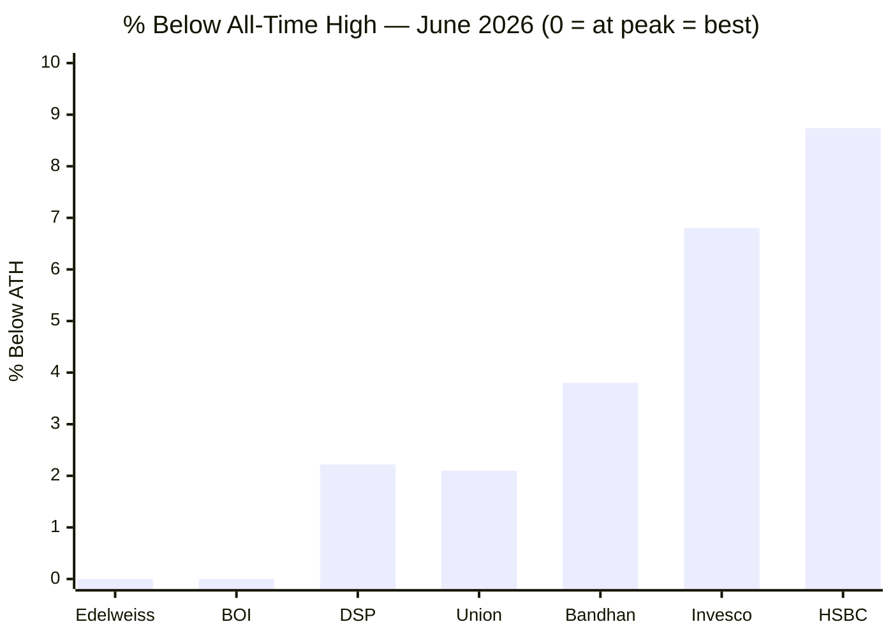
```mermaid
xychart-beta
    title "% Below All-Time High — June 2026 (0 = at peak = best)"
    x-axis ["Edelweiss", "BOI", "DSP", "Union", "Bandhan", "Invesco", "HSBC"]
    y-axis "% Below ATH" 0 --> 10
    bar [0.00, 0.00, 2.22, 2.10, 3.80, 6.80, 8.74]
```
> Edelweiss is AT its all-time high (NAV ₹51.566, 19-Jun-2026), tied with BOI for the best reading in the study.

| Metric | Edelweiss | BOI | DSP | HSBC |
|--------|-----------|-----|-----|------|
| ATH NAV | **₹51.566** | ₹58.59 | ₹231.299 | ₹101.659 |
| ATH Date | **19-Jun-2026 (today)** | 12-Jun-2026 | 07-May-2026 | 11-Dec-2024 |
| Current NAV | ₹51.566 | ₹58.59 | ₹226.165 | ₹92.774 |
| % from ATH | **0.00%** | 0.00% | −2.22% | −8.74% |
| Days since ATH | **0** | 0 | 14 | 548 |

**Edelweiss's NAV is its own all-time high — and this corrects the −4.20% estimate carried in BOI's Module 2** (which was drawn from May-2026 screening data, before the fund's June recovery to a new peak). Like BOI, this is the cleanest possible statement that the underlying portfolio has fully recovered from both COVID (2020) and the 2025 correction; a fund with impaired holdings would sit well below peak. For a new SIP investor in June 2026, there is **no discount** on entry — the opposite of HSBC's −8.74% below-peak position. The signal is unambiguously positive on portfolio health, while the single-crisis/2018-free caveat still stands.

---

## ⭐ The Low-Beta Defensive Engine *(Edelweiss-specific)*

The single organizing fact of Edelweiss's risk profile is its **beta of 0.816 (3Y) / 0.812 (5Y) — the lowest of any studied small-cap fund.** Almost every other defensive metric flows from it.

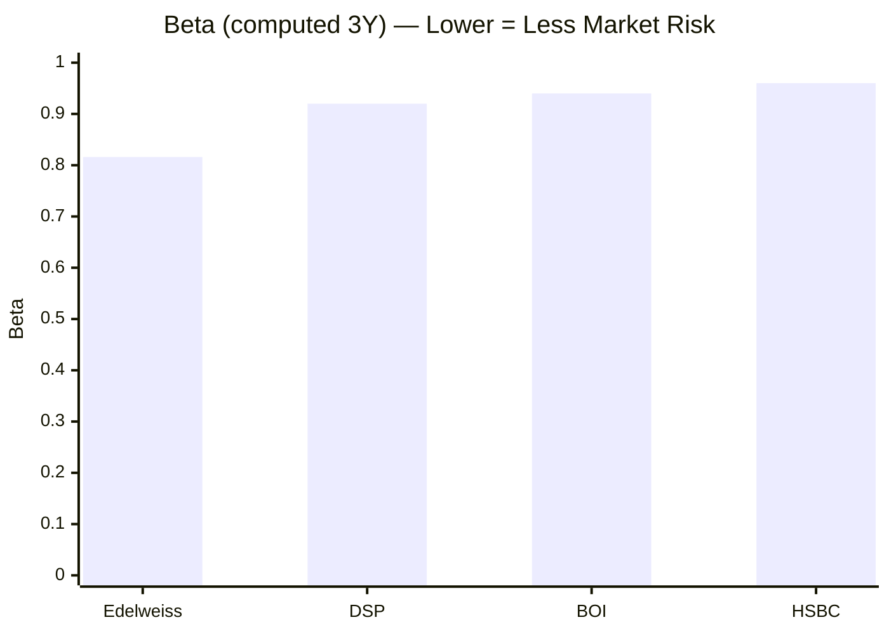
```mermaid
xychart-beta
    title "Beta (computed 3Y) — Lower = Less Market Risk"
    x-axis ["Edelweiss", "DSP", "BOI", "HSBC"]
    y-axis "Beta" 0 --> 1.0
    bar [0.816, 0.92, 0.94, 0.96]
```

| Consequence of low beta | Edelweiss reading | Evidence |
|-------------------------|-------------------|----------|
| Lowest volatility | 15.10% (screening) — 1st of 8 | A 0.82-beta fund swings less than the index |
| Best down-capture | 16.5% in 2025 — best of group | Falls far less than the index in down markets |
| Muted up-capture | ~114% | Participates, but less aggressively than BOI's 126% |
| Lower raw return in up-markets | 1Y 9.08%, 2026 lag | A low-beta fund mechanically trails a rising index |
| Thinner raw alpha recently | 3Y IR −0.065 | The defensive posture caps upside excess return |

**Read:** the low beta is the *source* of both Edelweiss's strength (downside protection) and its weakness (flat recent alpha). It is a deliberate risk choice — accept muted upside participation in exchange for genuine downside cushioning — and the 2025 result proves the trade-off pays off *in a down market*. The question Module 3 must answer is whether this low beta comes from **deliberate quality/diversification** (durable) or from a **near-index, low-conviction book** (fragile, a closet-index risk flagged in M1).

---

## Volatility — The Lowest of the Eight

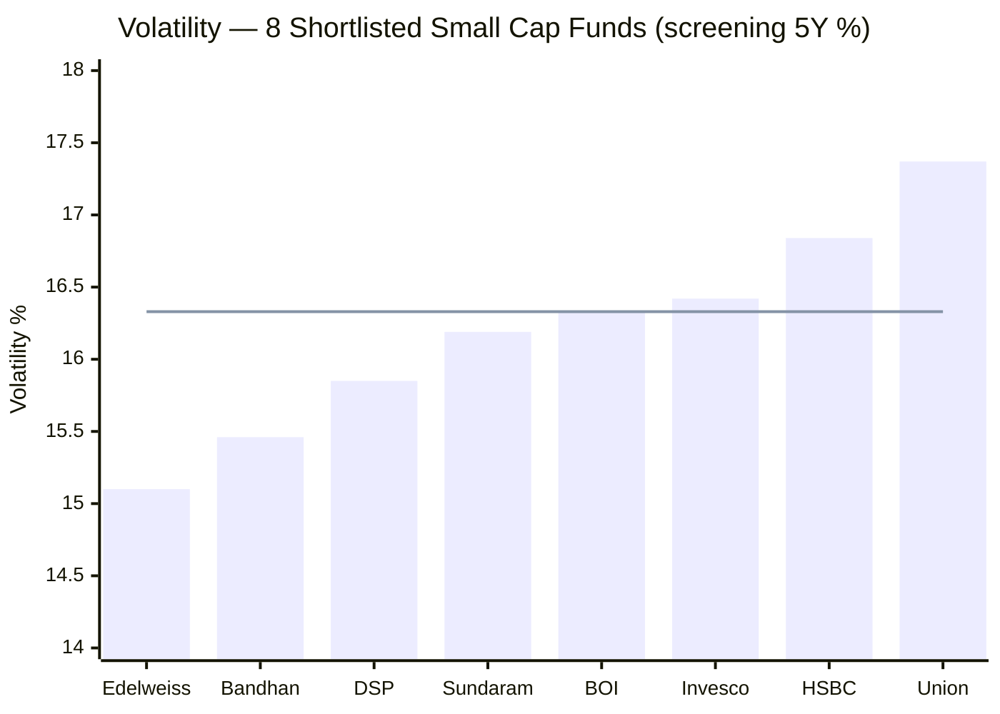
```mermaid
xychart-beta
    title "Volatility — 8 Shortlisted Small Cap Funds (screening 5Y %)"
    x-axis ["Edelweiss", "Bandhan", "DSP", "Sundaram", "BOI", "Invesco", "HSBC", "Union"]
    y-axis "Volatility %" 14 --> 18
    bar [15.10, 15.46, 15.85, 16.19, 16.33, 16.42, 16.84, 17.37]
    line [16.33, 16.33, 16.33, 16.33, 16.33, 16.33, 16.33, 16.33]
```
> Bar = screening 5Y volatility | Line = 8-fund average (~16.33%) | Edelweiss = **lowest of 8**

### Cross-Source Volatility Reconciliation

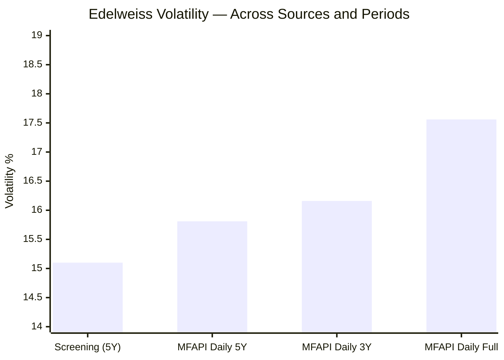
```mermaid
xychart-beta
    title "Edelweiss Volatility — Across Sources and Periods"
    x-axis ["Screening (5Y)", "MFAPI Daily 5Y", "MFAPI Daily 3Y", "MFAPI Daily Full"]
    y-axis "Volatility %" 14 --> 19
    bar [15.10, 15.81, 16.16, 17.56]
```

| Source | Value | Period | Methodology |
|--------|-------|--------|-------------|
| Screening CSV | **15.10%** | 5Y | Low-frequency sampling (understates daily vol) |
| MFAPI daily (computed) | **15.81%** | 5Y | Daily returns × √252 |
| MFAPI daily (computed) | **16.16%** | 3Y | Most recent window |
| MFAPI daily (computed) | **17.56%** | Full (7.34Y) | Most complete window — includes the 2020 COVID spike |

Unlike BOI/DSP/HSBC (whose **3Y window is *choppier* than the full history**, reflecting elevated recent markets), Edelweiss's 3Y (16.16%) is actually *calmer* than its full history (17.56%) — because its full history is dominated by the one-off 2020 COVID spike, and its recent years have been notably contained. This is itself a defensive signal: Edelweiss has not participated in the recent volatility surge the way its higher-beta peers have.

### Annual Volatility Regime (MFAPI Computed)

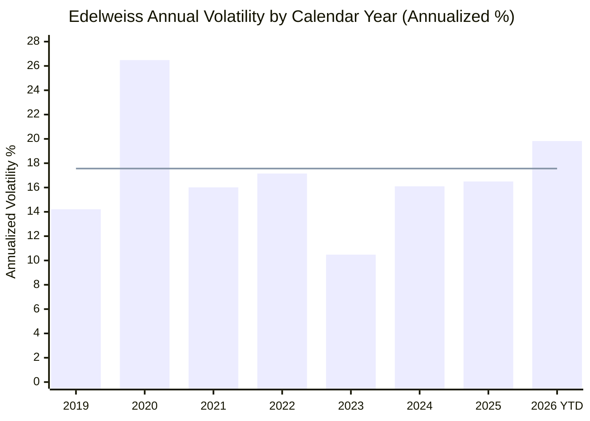
```mermaid
xychart-beta
    title "Edelweiss Annual Volatility by Calendar Year (Annualized %)"
    x-axis ["2019", "2020", "2021", "2022", "2023", "2024", "2025", "2026 YTD"]
    y-axis "Annualized Volatility %" 0 --> 28
    bar [14.21, 26.48, 16.01, 17.15, 10.48, 16.10, 16.50, 19.82]
    line [17.56, 17.56, 17.56, 17.56, 17.56, 17.56, 17.56, 17.56]
```
> Line = full-history mean annualized volatility (17.56%) | 2026 = YTD only

| Year | Ann. Vol | Context |
|------|----------|---------|
| 2019 | 14.21% | Calm post-inception year |
| **2020** | **26.48%** | COVID — highest in fund history |
| 2021 | 16.01% | Post-COVID bull — normalised |
| 2022 | 17.15% | Rate-rise year |
| **2023** | **10.48%** | Calmest year in fund history |
| 2024 | 16.10% | Steady |
| **2025** | **16.50%** | **Contained — vs BOI's 21.08% in the same year** |
| 2026 YTD | 19.82% | Mildly elevated |

**The structural insight — and the key contrast with BOI:** every fund's only extreme-volatility year was 2020 (COVID). But where **BOI's 2025 ran hot at 21.08%** (its slump came *with* volatility), **Edelweiss's 2025 stayed contained at 16.50%** — the defensive profile shows up directly in the volatility regime. Edelweiss simply did not experience the 2025 turbulence its higher-beta peers did.

---

## Max Drawdown — −37.09%, COVID-Only, Mid-Pack

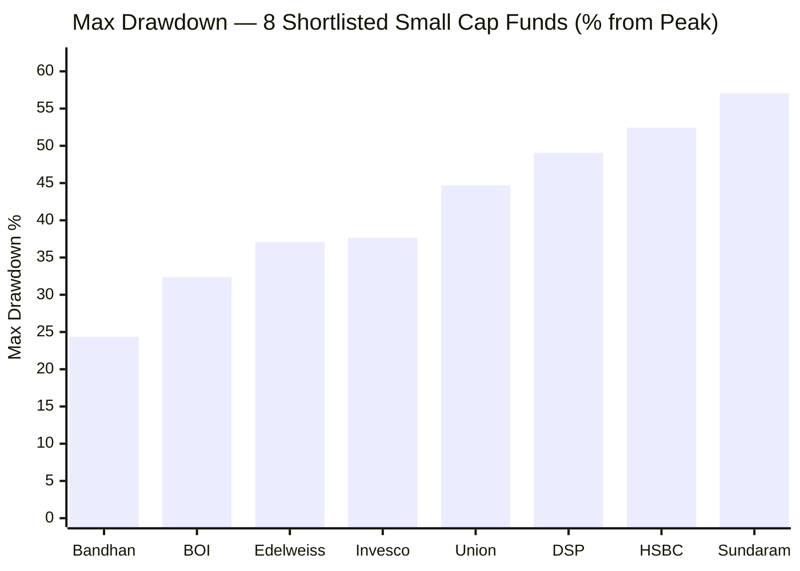
```mermaid
xychart-beta
    title "Max Drawdown — 8 Shortlisted Small Cap Funds (% from Peak)"
    x-axis ["Bandhan", "BOI", "Edelweiss", "Invesco", "Union", "DSP", "HSBC", "Sundaram"]
    y-axis "Max Drawdown %" 0 --> 62
    bar [24.34, 32.37, 37.09, 37.66, 44.71, 49.06, 52.45, 57.06]
```
> Sorted best to worst | Edelweiss = 3rd-shallowest of 8 | Lower % = better

| Rank | Fund | Max DD | History | Crisis Context | ₹1L at trough |
|------|------|--------|---------|---------------|---------------|
| 1 (best) | Bandhan | −24.34% | Short; post-2018 | Single correction | ₹75,660 |
| 2 | BOI | −32.37% | Short; post-2018 | COVID only (fast V) | ₹67,630 |
| **3** | **Edelweiss** | **−37.09%** | **Short; post-2019** | **COVID only (fast V)** | **₹62,910** |
| 4 | Invesco | −37.66% | Short; post-2018 | Single cycle | ₹62,340 |
| 5 | Union | −44.71% | Medium; incl. 2018+COVID | Two-crisis | ₹55,290 |
| 6 | DSP | −49.06% | Full (13Y); IL&FS + COVID | Two-crisis | ₹50,940 |
| 7 | HSBC | −52.45% | Full (12Y); IL&FS + COVID | Two-crisis | ₹47,550 |
| 8 (worst) | Sundaram | −57.06% | Longest | — | ₹42,940 |

### The COVID Crash Anatomy — A Clean V

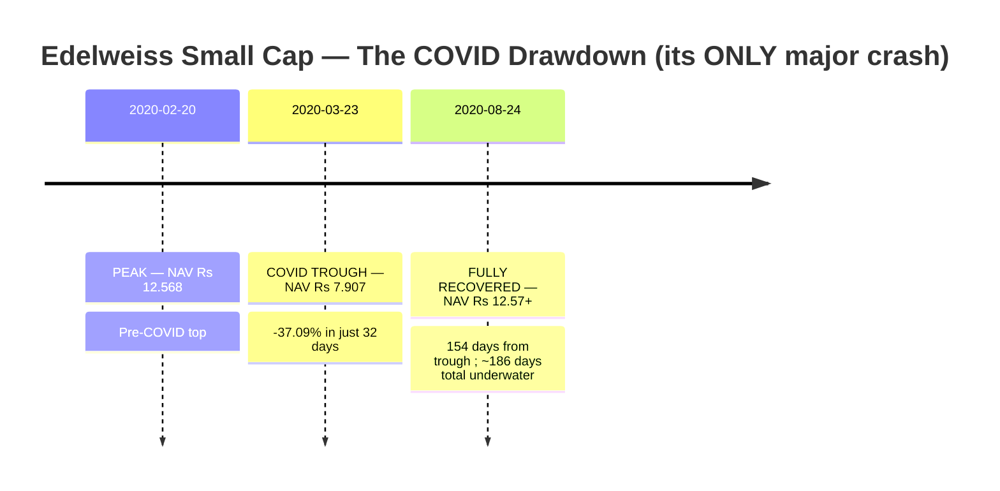
```mermaid
timeline
    title Edelweiss Small Cap — The COVID Drawdown (its ONLY major crash)
    2020-02-20 : PEAK — NAV Rs 12.568 : Pre-COVID top
    2020-03-23 : COVID TROUGH — NAV Rs 7.907 : -37.09% in just 32 days
    2020-08-24 : FULLY RECOVERED — NAV Rs 12.57+ : 154 days from trough ; ~186 days total underwater
```

| Phase | Date | NAV | Change | Duration |
|-------|------|-----|--------|---------|
| Pre-COVID Peak | 20-Feb-2020 | ₹12.568 | — | — |
| COVID Trough | 23-Mar-2020 | ₹7.907 | **−37.09%** | 32 days |
| Fully Recovered | 24-Aug-2020 | ₹12.57+ | +58.9% from trough | **154 days** |
| Total underwater | — | — | — | **~186 days (~6.1 mo)** |
| New ATH today | 19-Jun-2026 | ₹51.566 | — | — |

**This is a single, fast, liquidity-driven crash — the *only* major drawdown in Edelweiss's history**, recovered in ~5 months under the *Patwardhan* regime. The caveat is identical to BOI/Invesco: launched February 2019, the fund **never faced the IL&FS crash** — the slow, sentiment-driven small-cap bear of 2018–2020 that defines DSP's and HSBC's drawdown numbers. The −37.09% is real, but it is the gentlest *kind* of crash (sharp, indiscriminate, V-recovered). **We do not know Edelweiss's max drawdown in a 2018-type event because that event is absent from the data.**

### The 2024–25 Correction — Its 2nd-Worst Episode, and Where the Defense Showed

| Phase | Date | NAV | Change |
|-------|------|-----|--------|
| Peak | 11-Dec-2024 | ₹51.48 | — |
| Trough | 03-Mar-2025 | ₹39.71 | **−22.86%** |
| Recovered | by Jun-2026 | ₹51.566 (new ATH) | — |

Edelweiss's 2nd-worst episode was a **−22.86% peak-to-trough drawdown** during the 2024–25 small-cap correction. On a *calendar-year* basis this translated to only **−1.06% for full-year 2025** (vs BOI's −7.19%) — the defensive engine working. The fund recovered fully to a new all-time high by June 2026.

---

## Worst and Best Rolling Periods (MFAPI — 1,809 Trading Days)

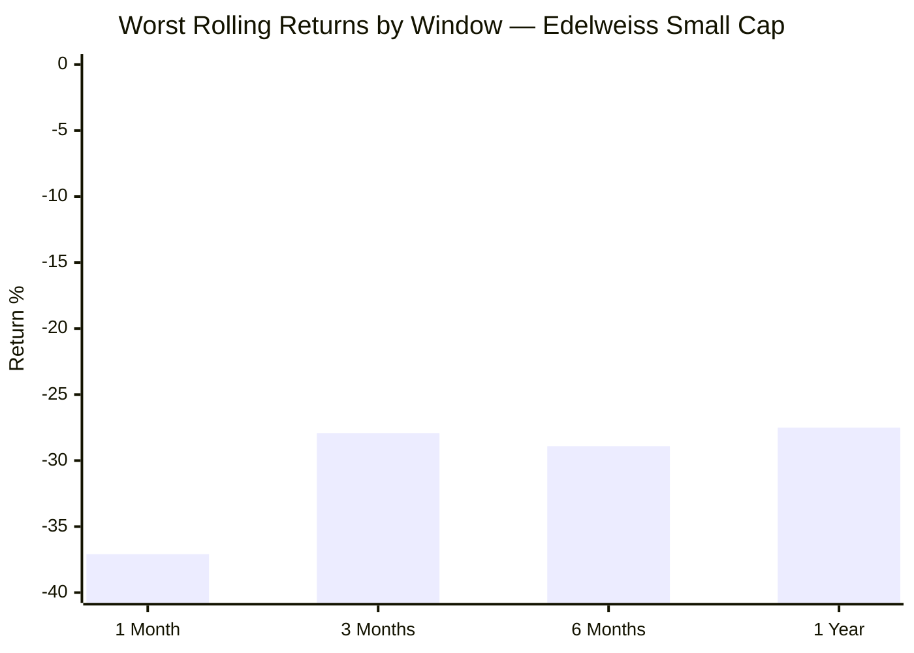
```mermaid
xychart-beta
    title "Worst Rolling Returns by Window — Edelweiss Small Cap"
    x-axis ["1 Month", "3 Months", "6 Months", "1 Year"]
    y-axis "Return %" -40 --> 0
    bar [-37.09, -27.92, -28.91, -27.50]
```

| Window | Worst Return | Period | Context |
|--------|-------------|--------|---------|
| 1 Month | **−37.09%** | 20-Feb-2020 → 23-Mar-2020 | COVID crash |
| 3 Months | **−27.92%** | 23-Dec-2019 → 23-Mar-2020 | **COVID (NOT the 2025 correction)** |
| 6 Months | **−28.91%** | 23-Sep-2019 → 23-Mar-2020 | **COVID (NOT the 2025 correction)** |
| 1 Year | **−27.50%** | 22-Mar-2019 → 23-Mar-2020 | IL&FS-tail → COVID |

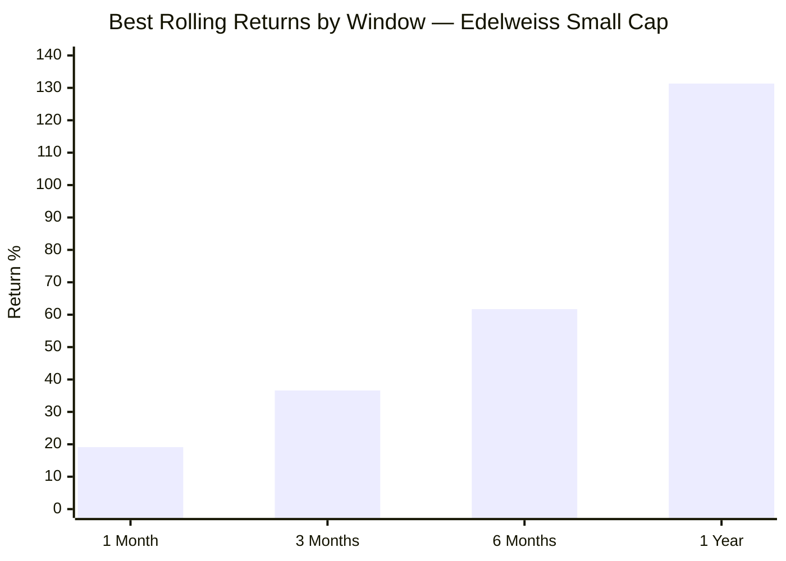
```mermaid
xychart-beta
    title "Best Rolling Returns by Window — Edelweiss Small Cap"
    x-axis ["1 Month", "3 Months", "6 Months", "1 Year"]
    y-axis "Return %" 0 --> 140
    bar [19.13, 36.62, 61.72, 131.31]
```

| Window | Best Return | Period | Context |
|--------|------------|--------|---------|
| 1 Month | **+19.13%** | 24-Mar-2020 → 23-Apr-2020 | COVID rebound |
| 3 Months | **+36.62%** | 27-May-2020 → 26-Aug-2020 | COVID recovery |
| 6 Months | **+61.72%** | 23-Mar-2020 → 21-Sep-2020 | COVID trough-to-recovery |
| 1 Year | **+131.31%** | 23-Mar-2020 → 23-Mar-2021 | Best rolling year — COVID + bull |

**The standout observation — and the cleanest evidence of Edelweiss's 2025 defensiveness:** unlike **BOI, whose worst 3M (−24.58%) and 6M (−22.84%) windows were the *2025 correction***, **every one of Edelweiss's worst rolling windows is COVID.** The 2024–25 correction (−22.86% peak-to-trough) was severe enough to be its 2nd-worst episode, yet it still did *not* produce the fund's worst 3M or 6M return. This is hard quantitative confirmation that Edelweiss weathered 2025 better than its peers. As with every fund, the worst 1-month (−37%) and best 1-year (+131%) both pivot on the single COVID trough date (23-Mar-2020): the scariest moment was the best entry.

---

## Daily Return Distribution (1,808 Return-Days) — Mild Skew, Fat Tails

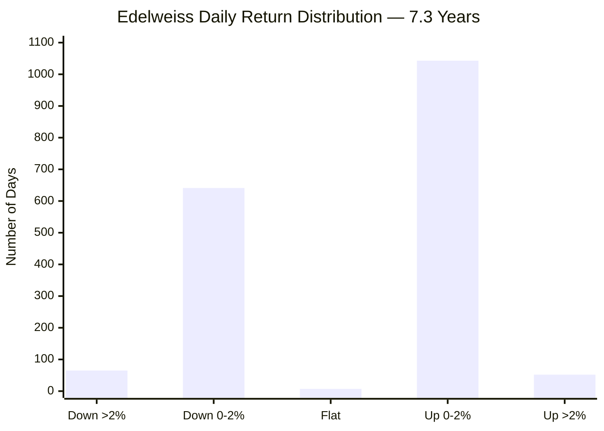
```mermaid
xychart-beta
    title "Edelweiss Daily Return Distribution — 7.3 Years"
    x-axis ["Down >2%", "Down 0-2%", "Flat", "Up 0-2%", "Up >2%"]
    y-axis "Number of Days" 0 --> 1100
    bar [65, 641, 7, 1043, 52]
```

| Metric | Value | Interpretation |
|--------|-------|----------------|
| Positive days | 1,095 (60.6%) | **Highest of studied funds** — gains ~3 days for every 2 it loses |
| Negative days | 706 (39.0%) | — |
| Flat days | 7 (0.4%) | — |
| Days down >2% | **65** | Sharp daily falls |
| Days up >2% | **52** | Sharp daily rises |
| Down/Up >2% ratio | **1.25×** | Mild negative skew — between BOI (1.18×) and DSP (1.60×) |
| Worst single day | **−11.61%** (23-Mar-2020) | COVID trough |
| Best single day | **+5.82%** (14-Sep-2020) | COVID recovery |
| Daily mean | +0.097% | Positive daily drift |
| Daily std dev | 1.106% | Annualizes to ~17.56% |
| Skewness | **−1.38** | Negatively skewed |
| Excess kurtosis | **+11.13** | ⚠️ **Fat tails** — far above normal |
| Daily VaR (95%) | **−1.68%** | 5% of days worse than −1.68% |
| Annualized VaR proxy | **−26.7%** | Expected worst-year loss at 95% confidence |

**The one blemish in an otherwise clean distribution: excess kurtosis of +11.13** — markedly fatter tails than a normal distribution. This means that while Edelweiss is mild day-to-day (1.25× skew, highest share of positive days), it is **prone to occasional extreme moves** — the distribution has more mass in the tails than its low volatility alone would suggest. The −11.61% worst day (deeper than BOI's −11.21%) is the visible expression. For a SIP investor the practical reading is benign — those 65 sharp-down days are accumulation opportunities — but the fat tail is a reminder that "low volatility" does not mean "no extreme days."

---

## Sharpe Ratio — Positive and Stable, but Bottom-Tier on Screening

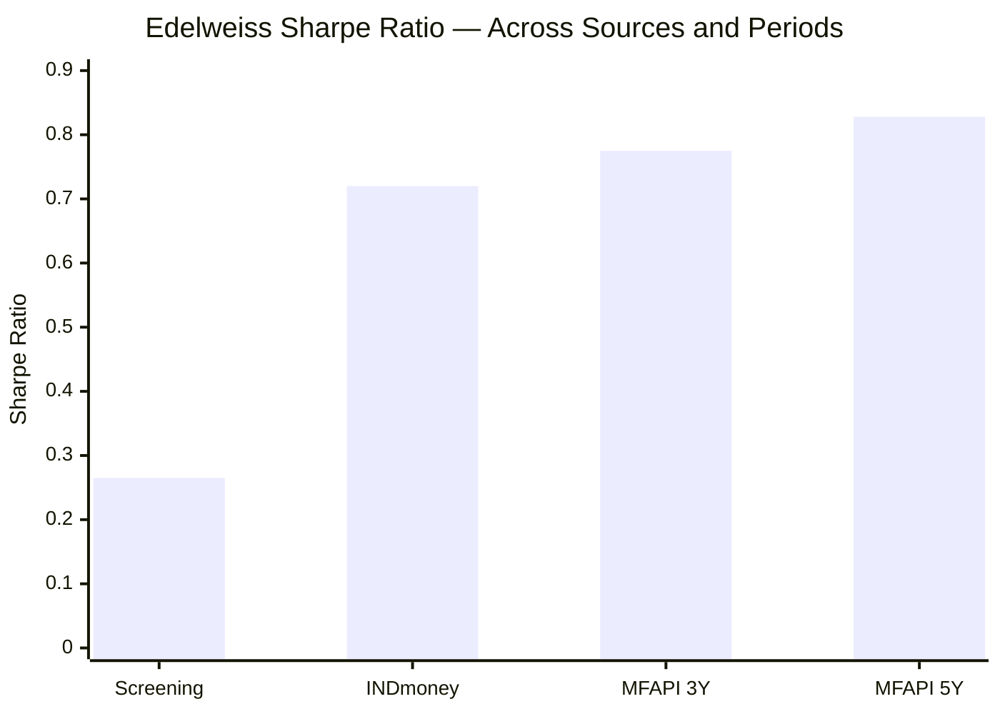
```mermaid
xychart-beta
    title "Edelweiss Sharpe Ratio — Across Sources and Periods"
    x-axis ["Screening", "INDmoney", "MFAPI 3Y", "MFAPI 5Y"]
    y-axis "Sharpe Ratio" 0 --> 0.9
    bar [0.265, 0.72, 0.775, 0.828]
```

| Source | Sharpe | Period | Notes |
|--------|--------|--------|-------|
| Screening CSV | **0.265** | ~3Y | **7th of 8 shortlisted funds** (only above HSBC) ⚠️ |
| INDmoney | 0.72 | 3Y | Published |
| MFAPI computed | **0.775** | 3Y | rf 6.5%, daily × √252 |
| MFAPI computed | **0.828** | 5Y | Stable — slightly higher than 3Y |

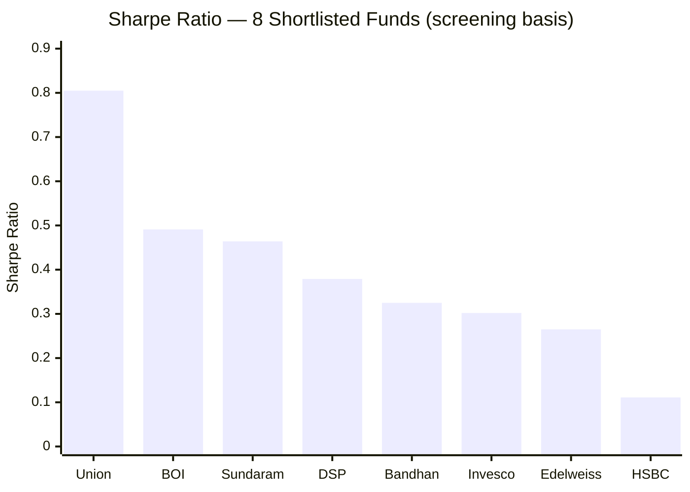
```mermaid
xychart-beta
    title "Sharpe Ratio — 8 Shortlisted Funds (screening basis)"
    x-axis ["Union", "BOI", "Sundaram", "DSP", "Bandhan", "Invesco", "Edelweiss", "HSBC"]
    y-axis "Sharpe Ratio" 0 --> 0.9
    bar [0.805, 0.491, 0.464, 0.379, 0.325, 0.302, 0.265, 0.111]
```
> Edelweiss ranks **7th of 8** on screening Sharpe — the paradox of the defensive profile.

**The Sharpe paradox:** Edelweiss is the *least* volatile fund, yet ranks 7th of 8 on screening Sharpe. This is because Sharpe rewards *excess return per unit of total volatility* — and Edelweiss's low-beta posture caps its excess return more than it caps its volatility. The computed figures (0.775–0.828) are healthier and stable across windows (no HSBC-style collapse), and INDmoney's 0.72 corroborates. The honest read: **risk-adjusted *return* is mid-tier, not top-tier — the fund's strength is loss-avoidance, not return-per-risk.**

---

## Sortino Ratio — Above 1.0 on Both Windows

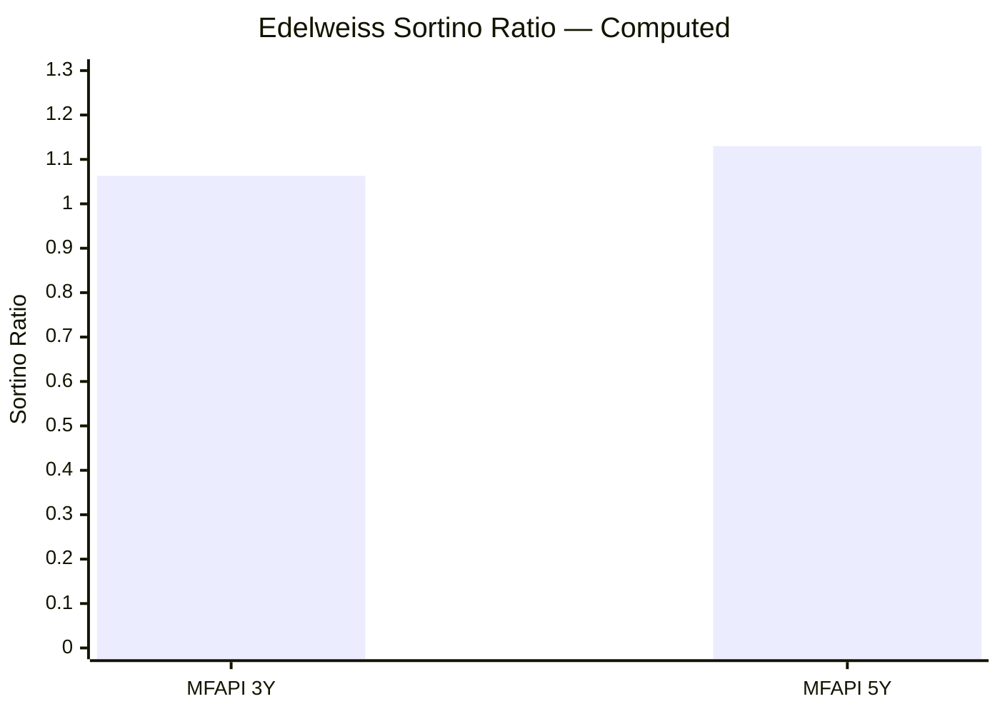
```mermaid
xychart-beta
    title "Edelweiss Sortino Ratio — Computed"
    x-axis ["MFAPI 3Y", "MFAPI 5Y"]
    y-axis "Sortino Ratio" 0 --> 1.3
    bar [1.063, 1.130]
```

| Source | Sortino | Period | Verdict |
|--------|---------|--------|---------|
| MFAPI computed | **1.063** | 3Y | Above 1.0 — solid |
| MFAPI computed | **1.130** | 5Y | Consistent, slightly higher |

Edelweiss's Sortino exceeds 1.0 on both windows and, like Sharpe, is *higher than Sharpe* (1.063 vs 0.775 on 3Y), confirming the volatility is **upside-skewed** — the fund makes larger up-moves than harmful down-moves. It sits just below BOI's (1.175 3Y) and DSP's (1.34), but is stable across windows.

### Why Sortino Matters More Than Sharpe for SIP Investors
- **Sharpe** penalises ALL volatility — including upside swings that build wealth
- **Sortino** only penalises **downside** volatility — the volatility that actually hurts
- Edelweiss's Sortino (1.063) > Sharpe (0.775) confirms the volatility is upside-skewed — and the gap is *wider* for a defensive fund whose downside is well-controlled (downside deviation 12.99% vs total volatility 16.16%)

---

## ⭐ Beta, R², Alpha, IR — The Flat Active Edge *(Edelweiss-specific)*

*All figures computed from Edelweiss daily NAV vs the Nippon Nifty Smallcap 250 Index Fund (scheme 148519), common window from Oct-2020. Not published on any platform for this fund. Minor caveat: the index fund is net of ~0.3%/yr tracking cost, so the benchmark is fractionally understated and alpha/IR fractionally overstated.*

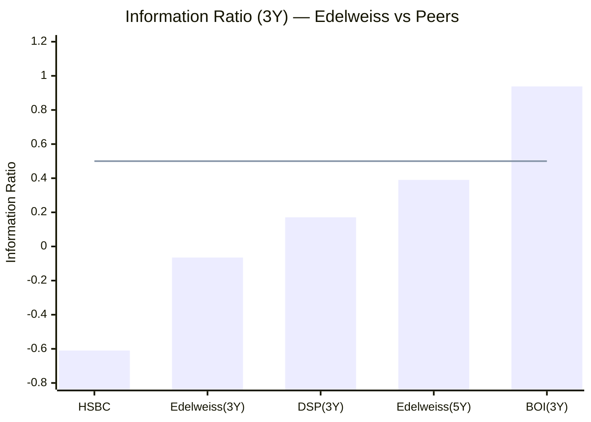
```mermaid
xychart-beta
    title "Information Ratio (3Y) — Edelweiss vs Peers"
    x-axis ["HSBC", "Edelweiss(3Y)", "DSP(3Y)", "Edelweiss(5Y)", "BOI(3Y)"]
    y-axis "Information Ratio" -0.8 --> 1.2
    bar [-0.61, -0.065, 0.171, 0.390, 0.938]
    line [0.5, 0.5, 0.5, 0.5, 0.5]
```
> Line = 0.50 threshold for meaningful active return | Edelweiss 3Y IR sits at ~0 — between HSBC's value destruction and BOI's value creation

| Metric | Edelweiss 3Y | Edelweiss 5Y | Edelweiss Full | BOI 3Y | HSBC 3Y |
|--------|--------------|--------------|----------------|--------|---------|
| Beta | **0.816** | 0.812 | 0.819 | 0.94 | 0.96 |
| R-Squared | 92.24 | 91.47 | 91.14 | 90.8 | 95.96 |
| Jensen Alpha | **+2.06%** | +4.37% | +5.49% | +5.45% | −2.67% |
| Tracking Error | 5.71% | 5.80% | 5.80% | 5.82% | 4.40% |
| **Information Ratio** | **−0.065** | **+0.390** | +0.365 | **0.938** | **−0.61** |

**This is Edelweiss's signature Module 2 finding — a *decaying* active edge, sitting between BOI and HSBC:**

1. **Beta 0.82 (3Y)** — the lowest of any studied small-cap fund. A deliberate defensive posture, not a leveraged tracker. This is the engine of the whole risk profile.
2. **R² 92.24 (3Y)** — healthy-ish; ~8% of returns independent of the benchmark. Higher than BOI (90.8) but well below HSBC's index-hugging 96 — Edelweiss is *not* a closet indexer on this measure, though M1's diversification data (top-10 just 25.88%) keeps the question open.
3. **Jensen alpha +2.06% (3Y) / +4.37% (5Y)** — positive but *modest and fading*. The 3Y (+2.06%) is less than half BOI's (+5.45%). It stays positive only because it is *beta-adjusted* (a 0.82-beta fund that roughly matches the index has, by definition, beaten its beta-predicted return).
4. **Information Ratio −0.065 (3Y) / +0.390 (5Y)** — **the decay is the story.** Over 5 years the active management added genuine value (IR +0.39); over the recent 3 years it has added essentially *nothing* on a tracking basis (IR ~0). This is the risk-side expression of the M1 thin-alpha problem. Critically, it is **not** HSBC-style destruction (−0.61) — Edelweiss isn't losing on its active risk, it has simply stopped *winning* on it recently.

The takeaway: Edelweiss is a low-beta defensive fund whose active edge was real over the medium term but has flattened in the recent window. Combined with the elite down-capture, the honest characterisation is **"protects superbly, no longer out-selects."** Whether the flat 3Y IR is a temporary style-cycle headwind (the quality-tilt lag that also hit DSP/HSBC/BOI in 2023) or a structural drift toward the index is the central open question — and the reason the score is capped rather than lifted.

---

## Alpha — Low on Every Basis

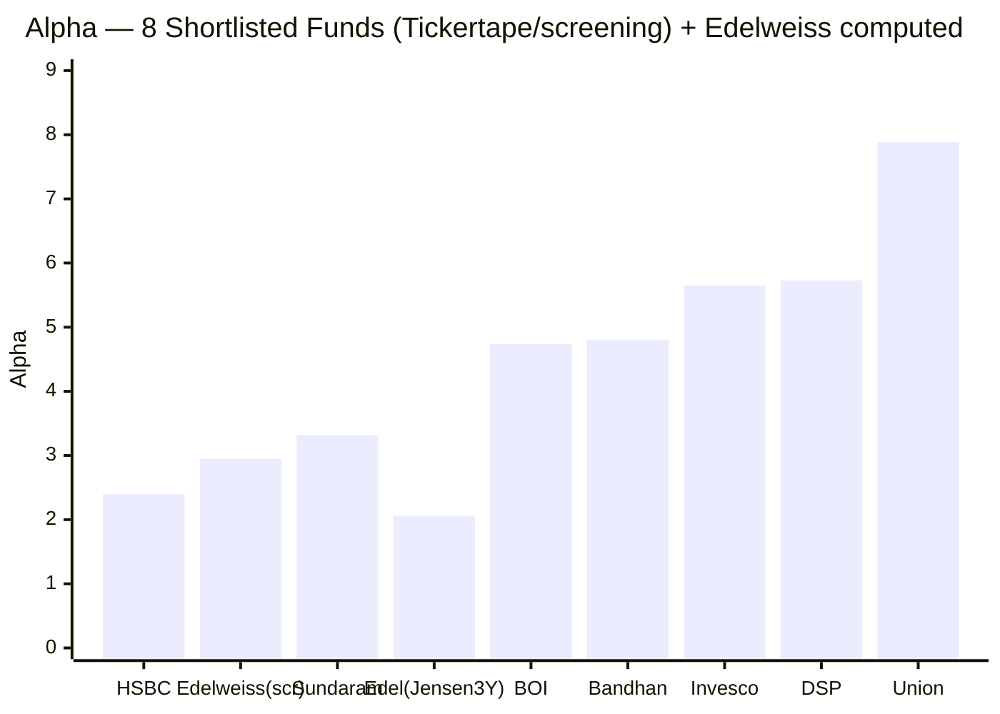
```mermaid
xychart-beta
    title "Alpha — 8 Shortlisted Funds (Tickertape/screening) + Edelweiss computed"
    x-axis ["HSBC", "Edelweiss(scr)", "Sundaram", "Edel(Jensen3Y)", "BOI", "Bandhan", "Invesco", "DSP", "Union"]
    y-axis "Alpha" 0 --> 9
    bar [2.40, 2.95, 3.32, 2.06, 4.74, 4.80, 5.65, 5.73, 7.89]
```

| Source | Alpha | Period | Context |
|--------|-------|--------|---------|
| Screening | **2.95** | ~3Y | **2nd-lowest of 8** (only HSBC lower) |
| Jensen (computed) | **+2.06%** | 3Y | Positive but modest |
| Jensen (computed) | **+4.37%** | 5Y | Better over the longer window |

Edelweiss's alpha is **near the bottom of the shortlist on every basis** — screening 2.95 (2nd-lowest, ahead of only HSBC's 2.40), computed 3Y Jensen +2.06%. This is the direct numerical fingerprint of the defensive, low-beta profile: it protects on the downside but generates little excess return. The contrast with the down-capture (best of group) is the whole Edelweiss story in two numbers — **elite at avoiding losses, weak at generating gains.**

---

## Calmar Ratio — Mid-Pack

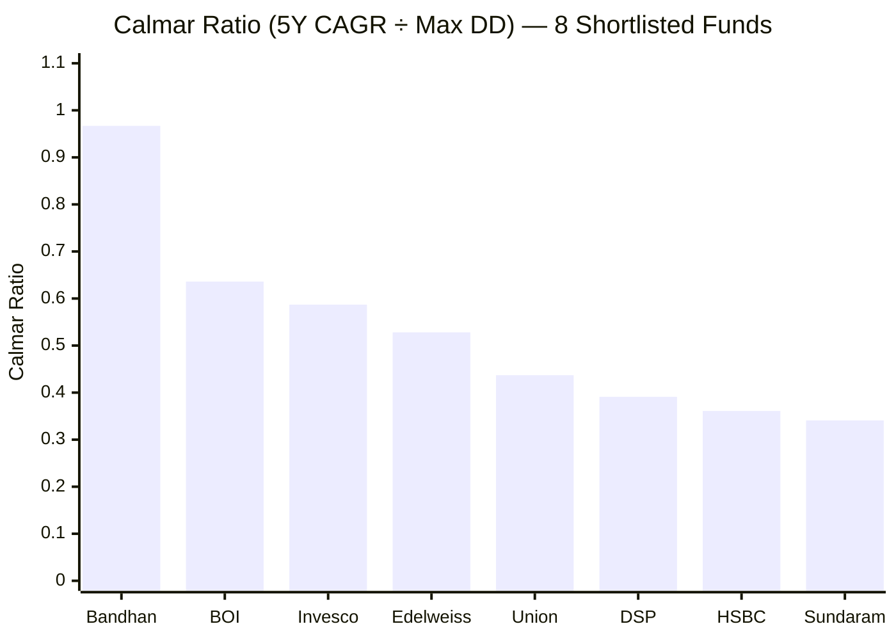
```mermaid
xychart-beta
    title "Calmar Ratio (5Y CAGR ÷ Max DD) — 8 Shortlisted Funds"
    x-axis ["Bandhan", "BOI", "Invesco", "Edelweiss", "Union", "DSP", "HSBC", "Sundaram"]
    y-axis "Calmar Ratio" 0 --> 1.1
    bar [0.967, 0.636, 0.587, 0.528, 0.437, 0.391, 0.361, 0.341]
```

| Period | Edelweiss CAGR | Max DD | Calmar |
|--------|----------------|--------|--------|
| 3Y | 19.03% | 37.09% | **0.513** |
| 5Y | 19.60% | 37.09% | **0.528** |
| Since Inception | 25.11% | 37.09% | **0.677** |

Edelweiss's Calmar of 0.528 (5Y) ranks **4th of 8** — mid-pack. The same normalisation caveat applies as for all post-2018 funds: the Calmar is flattered by a **shallow max-DD denominator that excludes the 2018 winter.** Had Edelweiss lived through IL&FS, its max drawdown would likely sit in the −40% to −50% range, compressing its Calmar toward ~0.40. The headline 0.528 is real but, like its peers', partly an accident of birth date.

---

## Capture Ratios — Best Down-Capture of Any Studied Fund

*Derived from annual calendar-year returns vs Nifty SC 250 TRI (Module 1).*

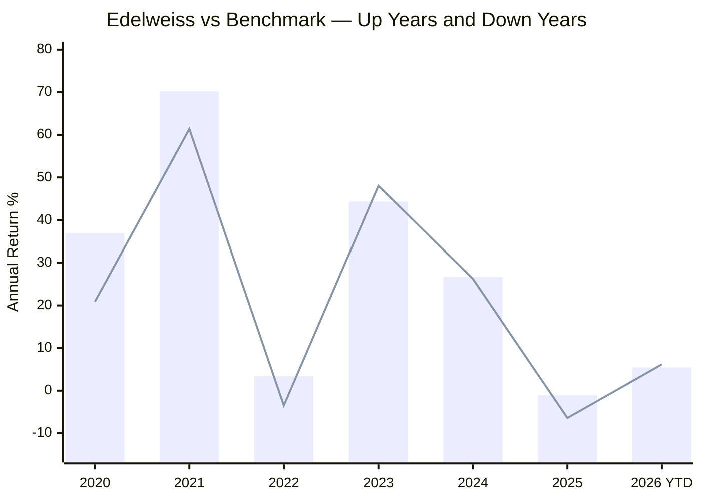
```mermaid
xychart-beta
    title "Edelweiss vs Benchmark — Up Years and Down Years"
    x-axis ["2020", "2021", "2022", "2023", "2024", "2025", "2026 YTD"]
    y-axis "Annual Return %" -15 --> 80
    bar [36.94, 70.22, 3.41, 44.34, 26.78, -1.06, 5.45]
    line [20.86, 61.37, -3.48, 48.04, 26.22, -6.42, 6.17]
```
> Bar = Edelweiss | Line = Nifty SC 250 TRI

### Up-Market Years (Benchmark Positive)

| Year | Edelweiss | Benchmark | Upside Capture | Notes |
|------|-----------|-----------|----------------|-------|
| 2020 | +36.94% | +20.86% | **177.1%** | Strong COVID-recovery capture (Patwardhan era) |
| 2021 | +70.22% | +61.37% | **114.4%** | Full bull capture (Patwardhan era) |
| 2023 | +44.34% | +48.04% | 92.3% | Lagged the momentum bull (Trideep era) |
| 2024 | +26.78% | +26.22% | 102.1% | Roughly matched (Trideep era) |
| **Aggregate up-capture** | — | — | **~114%** | Moderate — less aggressive than BOI's 126% |

### Down-Market Years (Benchmark Negative)

| Year | Edelweiss | Benchmark | Downside Capture | Verdict |
|------|-----------|-----------|-----------------|---------|
| 2022 | **+3.41%** | −3.48% | **negative** | Fund *positive* while index fell — defensive (Trideep era) |
| **2025** | **−1.06%** | −6.42% | **16.5%** | ⭐ **Lost only 1/6 of the benchmark's fall — best down-capture of any studied fund** |

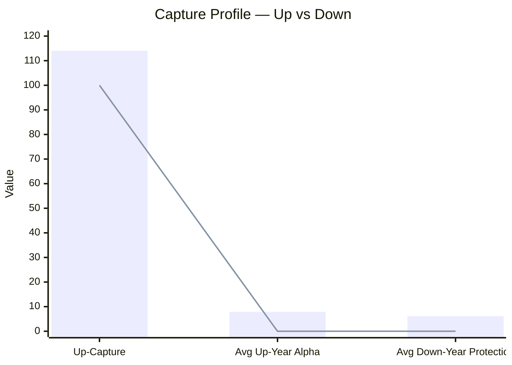
```mermaid
xychart-beta
    title "Capture Profile — Up vs Down"
    x-axis ["Up-Capture", "Avg Up-Year Alpha", "Avg Down-Year Protection"]
    y-axis "Value" 0 --> 120
    bar [114.0, 7.85, 6.13]
    line [100, 0, 0]
```

> **The down-capture is Edelweiss's single best risk credential — and, crucially, it is *proven and recent*.** Where BOI's down-capture is "largely unproven" (positive only in recovery-phase down years, with a mild *miss* in 2025), Edelweiss has a genuine, recent down-market test (2025) in which it captured just **16.5%** of the benchmark's fall — the best result of any studied fund. It was also positive in 2022 while the index fell. Both down-years are in the *Trideep* era, so this defensive skill is **current-team-owned**, not inherited from Patwardhan. The standing caveat remains: neither down-year was a 2018-type grinding bear.

---

## PE Ratio — Above Category; Thin Valuation Buffer

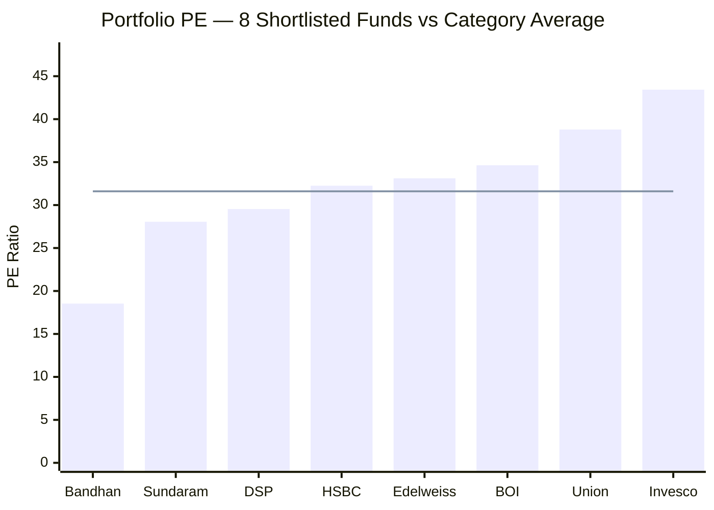
```mermaid
xychart-beta
    title "Portfolio PE — 8 Shortlisted Funds vs Category Average"
    x-axis ["Bandhan", "Sundaram", "DSP", "HSBC", "Edelweiss", "BOI", "Union", "Invesco"]
    y-axis "PE Ratio" 0 --> 48
    bar [18.53, 28.06, 29.54, 32.25, 33.12, 34.63, 38.79, 43.43]
    line [31.60, 31.60, 31.60, 31.60, 31.60, 31.60, 31.60, 31.60]
```
> Line = category average PE (31.60) | Edelweiss = 5th of 8, above category

| Rank | Fund | PE | vs Category |
|------|------|----|------------|
| 1 (cheapest) | Bandhan | 18.53 | −41% |
| 3 | DSP | 29.54 | −6.5% |
| **5** | **Edelweiss** | **33.12** | **+4.8%** |
| 6 | BOI | 34.63 | +9.6% |
| 8 | Invesco | 43.43 | +37% |

Edelweiss's portfolio PE of 33.12 is **above the category average (31.60)** — 5th of 8, more expensive than DSP, HSBC, Sundaram and Bandhan. **This is mildly at odds with the defensive story:** a genuinely defensive fund would typically carry a *valuation* cushion (low PE) as well as a *beta* cushion. Edelweiss's defense comes entirely from **low beta and diversification, not from cheapness** — its holdings are not bargains. If small caps de-rate, a PE-33 portfolio faces more multiple-compression risk than DSP's PE-29.5 or Bandhan's PE-18.5. Module 3 should examine whether this reflects a quality-growth tilt (Trideep's FlexiCap DNA) or simply broad ownership of fully-priced names.

---

## Structural Risk — Buffer & AUM Position

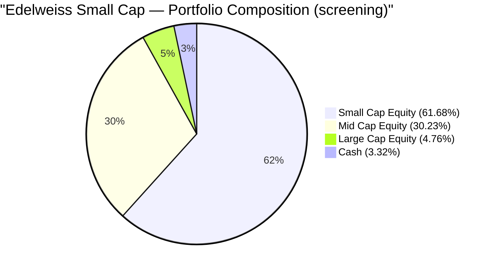
```mermaid
pie title "Edelweiss Small Cap — Portfolio Composition (screening)"
    "Small Cap Equity (61.68%)" : 61.68
    "Mid Cap Equity (30.23%)" : 30.23
    "Large Cap Equity (4.76%)" : 4.76
    "Cash (3.32%)" : 3.32
```

| Buffer / Structure | Edelweiss | BOI | Comment |
|--------------------|-----------|-----|---------|
| Cash | 3.32% | 3.06% | Modest working-capital cash |
| Mid-cap allocation | **30.23%** | ~13% | **Highest mid-cap tilt of the purer SC funds** — a built-in liquidity/stability cushion |
| Small-cap % | 61.68% | 79.52% | *Lowest* small-cap purity of the deeply-studied funds — smid drift |
| Top-10 concentration | **25.88%** | ~27% | **Most diversified portfolio of the 8** |
| AUM | ₹6,156 Cr | ₹2,168 Cr | **Mid-sized — the AUM sweet spot** |

Two structural points distinguish Edelweiss from BOI:

1. **High mid-cap allocation (30.23%) + most-diversified book (top-10 25.88%)** — both *reduce* portfolio risk. Mid-caps are more liquid than micro-caps, and a 60-stock-style spread dampens single-name blowups. This is the portfolio-construction source of the low beta and best-in-group down-capture. The trade-off, flagged in M1, is dilution of the pure small-cap alpha engine (a "smid" drift) and the thin recent alpha.
2. **Mid-sized AUM (₹6,156 Cr) — the sweet spot.** Edelweiss does *not* share BOI's smallest-AUM redemption fragility, nor DSP's/HSBC's large-AUM deployment friction. At ₹6,000 Cr it is large enough for flow stability and small enough for genuine small-cap execution — the most comfortable AUM position of the deeply-studied funds. This is a quiet but real structural advantage over BOI on the redemption-risk axis.

---

## Risk Metrics — Full 8-Fund Peer Comparison

```mermaid
quadrantChart
    title Risk vs Alpha — 8 Shortlisted Small Cap Funds
    x-axis "Lower Alpha" --> "Higher Alpha"
    y-axis "Higher Drawdown (Worse)" --> "Lower Drawdown (Better)"
    quadrant-1 High Alpha, Low Drawdown (Best)
    quadrant-2 Low Alpha, Low Drawdown
    quadrant-3 Low Alpha, High Drawdown (Worst)
    quadrant-4 High Alpha, High Drawdown
    DSP: [0.65, 0.35]
    Union: [0.90, 0.45]
    BOI: [0.60, 0.72]
    Bandhan: [0.58, 0.85]
    Invesco: [0.68, 0.55]
    Edelweiss: [0.33, 0.58]
    HSBC: [0.28, 0.25]
    Sundaram: [0.40, 0.15]
```
> Edelweiss sits in the **upper-left** zone: low drawdown (good) but low alpha — the defensive-specialist quadrant. The low-drawdown axis is flattered by the missing 2018 crisis.

### Full 8-Fund Risk Metric Matrix

| Metric | **Edelweiss** | DSP | Union | BOI | Bandhan | Sundaram | Invesco | HSBC |
|--------|---------------|-----|-------|-----|---------|---------|---------|------|
| Sharpe (screening) | **0.265** | 0.379 | **0.805** | 0.491 | 0.325 | 0.464 | 0.302 | 0.111 |
| Sharpe (computed 3Y) | 0.775 | 0.98 | — | 0.853 | — | — | — | 0.61 |
| Sortino (computed 3Y) | 1.063 | 1.34 | — | 1.175 | — | — | — | 0.83 |
| Alpha (Tickertape/scr) | **2.95** | 5.73 | **7.89** | 4.74 | 4.80 | 3.32 | 5.65 | 2.40 |
| Beta (computed 3Y) | **0.82** | 0.92 | — | 0.94 | — | — | — | 0.96 |
| R² (computed 3Y) | 92.24 | 90.95 | — | 90.8 | — | — | — | 95.96 |
| IR (computed 3Y) | **−0.065** | 0.17 | — | **0.938** | — | — | — | **−0.61** |
| Max Drawdown | −37.09% | −49.06% | −44.71% | −32.37% | **−24.34%** | −57.06% | −37.66% | −52.45% |
| Volatility (screening) | **15.10%** | 15.85% | 17.37% | 16.33% | 15.46% | 16.19% | 16.42% | 16.84% |
| Portfolio PE | 33.12 | 29.54 | 38.79 | 34.63 | **18.53** | 28.06 | 43.43 | 32.25 |
| Calmar (5Y) | 0.528 | 0.391 | 0.437 | 0.636 | **0.967** | 0.341 | 0.587 | 0.361 |
| 2025 down-capture | **16.5%** ⭐ | ~ (protected) | ~ (protected) | 119.6% | — | — | — | 165.6% |
| ATH distance | **0.00%** | −2.22% | −2.10% | 0.00% | −3.80% | −8.90% | −6.80% | −8.74% |
| Multi-cycle proof | **Short ❌** | **13Y ✅** | Medium ✅ | Short ❌ | Short ❌ | Longest | Short ❌ | **12Y ✅** |

### Edelweiss's Rank on Each Risk Metric (1 = Best)

| Metric | Edelweiss Value | Rank | Leader |
|--------|-----------------|------|--------|
| Volatility | 15.10% | **1/8** | Edelweiss (lowest) |
| Beta | 0.82 | **1/8** | Edelweiss (lowest) |
| 2025 down-capture | 16.5% | **1/8** | Edelweiss (best) |
| ATH distance | 0.00% | **T-1/8** | Edelweiss & BOI |
| Max Drawdown (raw) | −37.09% | 3/8 | Bandhan −24.34% |
| Sortino (computed 3Y) | 1.063 | Mid | DSP 1.34 |
| Calmar (5Y) | 0.528 | 4/8 | Bandhan 0.967 |
| R² | 92.24 | Mid | — |
| Sharpe (screening) | 0.265 | **7/8** ⚠️ | Union 0.805 |
| Information Ratio (3Y) | −0.065 | **6–7/8** ⚠️ | BOI 0.938 |
| Alpha | 2.95 | **7/8** ⚠️ | Union 7.89 |
| Multi-cycle proof | Short | **6–7/8** | DSP/HSBC |

**Summary — the cleanest "split" profile in the study.** Edelweiss ranks **1st on every pure *downside-risk* metric** (volatility, beta, 2025 down-capture, tied-1st on ATH) but **bottom-tier (7th) on every *return-per-risk* metric** (Sharpe, alpha, IR). This is the exact statistical signature of a defensive specialist: best at not losing, weakest at winning. It is the near-inverse of BOI (which leads on IR/alpha/Sharpe but has unproven down-capture) and a milder version of HSBC's problem (HSBC is bottom-tier on *both* — Edelweiss is at least top-tier on defense).

---

## Comparison with Studied FlexiCap Funds

| Metric | Edelweiss Small Cap | Edelweiss FlexiCap | BOI Small Cap | DSP Small Cap | Parag Parikh FlexiCap |
|--------|---------------------|--------------------|--------------|--------------|----------------------|
| Manager | Trideep Bhattacharya | **Trideep (same)** | Alok Singh | Vinit Sambre | Rajeev Thakkar et al |
| FlexiCap study M2 | — | **3.75/5** | — | — | 4.0/5 |
| Volatility (screening) | **15.10%** | ~13% | 16.33% | 15.85% | **9.06%** |
| Beta | **0.82** | ~0.9 | 0.94 | 0.92 | **0.55** |
| Max Drawdown | −37.09% | shallower (flexicap) | −32.37% | −49.06% | −31.20% |
| Information Ratio (3Y) | −0.065 | (low TE in FC study) | **0.938** | 0.17 | — |
| ATH Distance | **0.00%** | — | 0.00% | −2.22% | −4.44% |
| Multi-Cycle Proof | ❌ 7.3Y | partial | ❌ 7.5Y | ✅ 13Y | ✅ 13Y |

**Cross-category interpretation:**
- Edelweiss Small Cap and Edelweiss FlexiCap share the same CIO (Trideep Bhattacharya) and the same **low-beta, low-tracking-error, defensive house style** — the FlexiCap study flagged its "low TE" as a signature, and the small-cap fund expresses the identical DNA (beta 0.82, IR decaying toward the benchmark). This is consistent, *not* coincidental: Trideep runs a contained-risk book across both mandates.
- The trade-off is also consistent: the FlexiCap scored #4 (3.77) — solid but not top — and the small-cap fund lands in the same relative position, for the same reason (defense without standout alpha).
- The honest gap vs DSP/PP: both Edelweiss funds and BOI lack multi-cycle proof (7.3–7.5Y), whereas DSP and PP FlexiCap carry the 13-year IL&FS-inclusive scar. On *defensive measured* risk Edelweiss leads the SC group; on *tested* risk DSP/PP/Union lead.

---

## Risk Profile — Points For and Against

### ✅ Points IN FAVOUR

1. **Lowest volatility of all 8 funds (15.10% screening)** — the least turbulent ride in the shortlist
2. **Lowest beta of any studied small-cap fund (0.82)** — deliberately contained market risk
3. **Best genuine down-capture of any studied fund (16.5% in 2025)** — proven, recent, and current-team-owned
4. **At its all-time high (0.00% from ATH, 0 days underwater)** — tied with BOI for the best portfolio-health signal
5. **Worst 3M/6M rolling windows are COVID, not 2025** — hard proof of 2025 defensiveness (BOI's worst 3M/6M *were* 2025)
6. **2025 calendar year contained at −1.06%** with volatility of only 16.50% (vs BOI's 21.08%)
7. **Highest share of positive days (60.6%)** and a mild daily negative skew (1.25×)
8. **Sortino above 1.0 on both windows (1.063 / 1.130)** — efficient downside-risk compensation
9. **Mid-sized AUM (₹6,156 Cr) — the sweet spot** — no smallest-AUM redemption fragility (BOI's flaw), no large-AUM friction (DSP/HSBC's)
10. **High mid-cap allocation (30.23%) + most-diversified book (top-10 25.88%)** — structural risk-dampeners
11. **5Y active edge was genuine (IR +0.39, Jensen +4.37%)** — the management *has* added value over the medium term

### ⚠️ Points AGAINST

1. **3Y Information Ratio is flat (−0.065)** — the recent active edge has decayed to zero; the M1 thin-alpha problem in risk terms
2. **Screening Sharpe 0.265 — 7th of 8** — bottom-tier risk-adjusted *return*; alpha 2.95 is 2nd-lowest
3. **No 2018 / multi-cycle proof** — record begins Feb-2019; never faced a grinding small-cap winter
4. **Max drawdown is COVID-only (−37.09%)** — a fast V; understates likely drawdown in a 2018-type event
5. **Fat tails (excess kurtosis +11.13)** — prone to occasional extreme days despite low day-to-day volatility; worst day −11.61% (deeper than BOI's)
6. **Portfolio PE 33.12 — above category** — defense comes from low beta, *not* a valuation cushion; thin de-rating buffer
7. **Lowest small-cap purity of the deeply-studied funds (61.68%)** — a "smid" drift dilutes the pure small-cap engine
8. **Every defensive metric is flattered by the missing 2018 crisis** — measured, not battle-tested, resilience
9. **Calmar mid-pack (0.528, 4th)** — and itself flattered by the shallow 2018-free drawdown denominator
10. **Two-manager record (M1)** — the strong 5Y IR is partly Patwardhan-era; the current team owns the flat 3Y window

---

## Module 2 Scorecard

```mermaid
xychart-beta
    title "Module 2 Sub-Dimension Scores — Edelweiss Small Cap (1-5)"
    x-axis ["Vol", "MaxDD Raw", "MaxDD Context", "Sharpe", "Sortino", "Beta/R2", "TE/IR", "PE", "ATH", "Down-Cap", "Daily Tail", "Multi-Cycle"]
    y-axis "Score" 0 --> 5
    bar [4.5, 4.0, 2.5, 3.0, 3.5, 4.0, 2.5, 2.5, 5.0, 5.0, 3.5, 2.0]
```

| Sub-dimension | Score (1–5) | Reasoning |
|---------------|------------|-----------|
| Volatility | **4.5** | 15.10% — **lowest of 8**; 2025 contained at 16.5% vs BOI's 21% |
| Max Drawdown (raw) | **4.0** | −37.09% — 3rd-shallowest of 8 |
| Max Drawdown (context-adjusted) | **2.5** | COVID-only V; never faced 2018; likely deeper in a real bear |
| Sharpe Ratio | **3.0** | Computed 0.775 (3Y) / 0.828 (5Y) positive & stable, but screening 0.265 = 7th of 8 |
| Sortino Ratio | **3.5** | 1.063 (3Y) / 1.130 (5Y); above 1.0 both windows |
| Beta / R² | **4.0** | Beta 0.82 (lowest, deliberate defense); R² 92 (healthy active share, not index-hugging) |
| Tracking Error / IR | **2.5** | IR +0.39 (5Y) decaying to −0.065 (3Y) — flat recent edge; the key demerit |
| PE Valuation Buffer | **2.5** | 33.12 — above category; defense from beta not cheapness; 5th of 8 |
| ATH Distance | **5.0** | 0.00% — at all-time high; tied best in study |
| Down-Capture | **5.0** | 16.5% (2025) — **best proven down-capture of any studied fund** |
| Daily Tail Risk | **3.5** | 1.25× down/up skew (mild) but excess kurtosis +11.13 (fat tails); worst day −11.61% |
| Multi-Cycle Proof | **2.0** | 7.3Y, single crisis (COVID); no 2018; two-manager record |
| **Module 2 Overall** | **~3.6 / 5** | **The shortlist's defensive specialist — best-in-class on every downside-risk metric (lowest vol, lowest beta, best proven down-capture, at ATH, contained 2025) but bottom-tier on risk-adjusted *return* (screening Sharpe 7th, alpha 2nd-lowest) with a *decaying* active edge (3Y IR −0.065 vs 5Y +0.39). Capped — like its M1 — by the flat recent alpha, the single-crisis/2018-free history, fat tails, and a thin PE buffer; lifted by genuine, proven, current-team downside protection and the most comfortable AUM position of the group.** |

---

## Comparative Module 2 Scores

| Fund | M2 Score | Risk Profile Summary |
|------|----------|---------------------|
| PP FlexiCap | 4.0/5 | Lowest vol, structural buffer, multi-cycle proof |
| **DSP Small Cap** | **3.8/5** | Best capture asymmetry, at ATH, **multi-cycle proof**; honest −49% DD |
| **Union Small Cap** | **3.8/5** | #1 Sharpe, **genuine 2018-tested** asymmetric capture (47% down) |
| BOI FlexiCap | 3.75/5 | Best Sharpe/Sortino/IR; single-cycle only |
| Edelweiss FlexiCap | 3.75/5 | Low TE; defensive house style; decent multi-cycle |
| **BOI Small Cap** | **~3.7/5** | Best IR + at ATH + 2nd-best Sharpe/Calmar/maxDD; missing 2018, smallest-AUM risk |
| **Edelweiss Small Cap** | **~3.6/5** | **Lowest vol/beta + best proven down-capture + at ATH; capped by flat 3Y IR, 7th Sharpe, no-2018, fat tails** |
| Bandhan Small Cap | ~3.5/5 | Lowest raw max DD; no 2018 test |
| Invesco Small Cap | ~3.3–3.5/5 | Single-cycle; moderate Sharpe |
| HSBC Small Cap | ~3.2/5 | Elite *historical*, deteriorating *recent* (IR −0.61, −8.74% from ATH) |

**Edelweiss lands just below BOI (3.7) and the DSP/Union pair (3.8), and above Bandhan/Invesco/HSBC.** The logic vs BOI: the two funds are near-mirror images — **BOI wins the *return-per-risk* axis** (IR 0.938 vs −0.065, Sharpe, alpha) while **Edelweiss wins the *pure-defense* axis** (lower vol, lower beta, *proven* down-capture vs BOI's unproven one, more comfortable AUM). BOI edges ahead by ~0.1 because in a small-cap satellite the *return-generating* edge (BOI's IR) is the primary job and downside protection the secondary one — but for a risk-averse investor prioritising loss-avoidance, Edelweiss's M2 is arguably the more reassuring. Both sit clearly below DSP/Union, whose comparable-or-better risk numbers are **battle-tested through 2018**, which Edelweiss's are not.

---

## SIP Implication

For a ₹20,000/month satellite SIP over a 10+ year horizon, Edelweiss's risk profile is the **most defensive in the shortlist — and the one whose defensiveness is most *proven*, even as its return-edge has faded.**

**What the measured data says:** This is the least volatile fund of the eight (15.10%), with the lowest beta of any studied small-cap fund (0.82), the best genuine down-capture of any studied fund (16.5% in 2025), a portfolio at its all-time high, and the most comfortable AUM position of the group (₹6,156 Cr — no smallest-AUM redemption fragility, no large-AUM friction). Uniquely, its 2025 defensiveness is not a story but a *fact*: its worst 3M and 6M rolling windows are still COVID, not the 2024–25 correction, and full-year 2025 was contained at −1.06% with volatility of just 16.5%. If the single most important job of the *defensive* leg of a portfolio is to lose less when small-caps fall, Edelweiss does that job best of the eight.

**What the data cannot say — and the genuine demerit:** the same low-beta posture that protects on the downside has **flattened the active edge.** The 3Y Information Ratio is essentially zero (−0.065) and 3Y alpha is the 2nd-lowest of the group — over the recent window the fund has *protected* well but stopped *out-selecting* the index. This is the risk-side face of the M1 thin-alpha problem. It is not HSBC-style value destruction (the 5Y IR was a healthy +0.39), but it is a real question mark over whether the fund can still generate the excess return a small-cap satellite is supposed to deliver. Layered on top are the familiar caveats: the −37.09% max drawdown is COVID-only (no 2018), the portfolio carries fat tails (excess kurtosis +11.13) and an above-category PE (33.12, defense-from-beta-not-cheapness), and the strong 5Y numbers are partly the departed Patwardhan's.

**The three SIP risk behaviours to expect with Edelweiss over 10 years:**

1. **In a sharp, liquidity-driven crash (like COVID):** the fund falls hard but less than its higher-beta peers, and recovers cleanly (154 days in 2020). Continue the SIP aggressively.
2. **In a momentum-driven bull (like 2023, or 2026 so far):** the fund will *lag* — its low beta mechanically trails a rising index (2023 −3.70% alpha, 2026 YTD −0.72%). Expect underperformance in roaring markets; this is the cost of the defense.
3. **In a slow, grinding small-cap bear (like 2018 — never yet experienced):** the unknown. The low-beta, high-mid-cap, diversified book *should* protect better than its peers — the 2025 evidence is encouraging — but a PE-33 portfolio with no valuation cushion, never tested through a multi-year winter, could still draw down more than its clean −37.09% record suggests.

**What to monitor:**
- **The Information Ratio trajectory** — if the 3Y IR stays at/below zero into 2027, the "flat active edge" becomes a structural closet-index problem rather than a style-cycle blip; if it recovers, the defense-with-alpha thesis is intact
- **Small-cap purity** — at 61.68% (lowest of the studied funds) the smid drift is already notable; further drift toward mid-caps would erode the small-cap mandate
- **Whether the proven down-capture repeats** — 2025 was excellent; a second strong down-market result (or the first real grinding bear) would convert "proven in one correction" into "genuinely battle-tested"
- **The Dhruv Bhatia effect (M1/M5)** — the ex-BOI small-cap architect joined Oct-2024; watch whether the active edge re-sharpens under his influence

**Recommended SIP behaviour:** Continue with confidence — the *defensive* risk profile genuinely supports it, and it is the best loss-avoider in the group. But **understand what you are buying: protection, not alpha.** Edelweiss is the natural **risk-dampening / defensive leg** of a small-cap allocation — a fund to pair *against* a higher-beta, higher-alpha satellite (BOI, DSP) rather than to rely on as the portfolio's return engine. Size it for stability, not for outperformance.

**Do not over-weight the at-ATH or low-volatility signals as "safety."** Being at the all-time high confirms portfolio health but means zero discount on entry; the low volatility is real but sits atop fat tails and a 2018-free history. The defense is genuine and proven-in-2025 — just not yet proven in a true bear.

---

*Module 2 completed: June 2026 | Risk Profile | MFAPI methodology (Edelweiss Small Cap scheme 146196, 1,809 days, Feb 2019 → Jun 2026) | Beta/R²/Alpha/IR computed vs Nippon Nifty Smallcap 250 Index Fund (scheme 148519, common window from Oct-2020); max drawdown (−37.09%) reproduces screening exactly | Benchmark = Nifty Smallcap 250 TRI (mandate = project benchmark) | Provisional M2 Score: ~3.6/5 (subject to M3–M6 for the PE/smid-drift/active-edge questions)*

*Next: [Module 3 — Portfolio DNA](module3_portfolio.md)*
