# Module 3: Portfolio DNA — Edelweiss Small Cap Fund

*Sources: Groww (top-20 holdings + stock count + cash, ~Mar 2026), Edelweiss MF Scheme Information Document (SID, dated Nov-2025: turnover 0.25× as on 30-Sep-2025) + Feb-2026 factsheet (turnover 28%), Morningstar (sector allocation), Value Research Online (rating + AUM + ER), Screening CSV (market-cap split + concentration, May 2026), MFAPI NAV history (scheme 146196). Benchmark = Nifty Smallcap 250 TRI (mandate = project benchmark — no mismatch).*

---

## Module 3 Score: ~3.4 / 5

Edelweiss's portfolio is the study's **"diversified, quality-defensive smid-cap fund wearing a small-cap label."** Module 3 is where the M1/M2 personality finally gets its *structural* explanation: the low beta (0.82), best-in-group 2025 down-capture, thin alpha and elevated R² all trace to one coherent set of construction choices — a **diffuse 92-stock book, financials/healthcare-led, with the lowest small-cap purity (61.68%) and highest mid-cap weight (30.23%) of any deeply-studied fund.** The construction is *internally consistent and genuinely defensive*, and it sits in the AUM sweet spot (~₹6,000 Cr) with a low, disclosed turnover (25–28%) — both real positives. But for a *small-cap satellite mandate*, the heavy smid drift and the more-consensus book are real demerits: this fund delivers less *pure* small-cap exposure, and less *independent* small-cap alpha, than BOI or DSP. The score lands below BOI (3.7), DSP (3.8) and Union (3.6), around HSBC (3.3, the other diffuse/consensus fund — but Edelweiss has a far better AUM position), and above Bandhan (3.2)/Invesco (3.1).

---

## The Headline Finding — The Portfolio That Explains the Defensiveness

Modules 1–2 established Edelweiss as the shortlist's **defensive specialist** (lowest vol, lowest beta, best proven down-capture) with a **flat recent active edge** (3Y IR −0.065). Module 3 reveals *why* — and it is one coherent story:

| The M1/M2 Trait | Its M3 Structural Cause |
|---|---|
| Lowest beta of any studied fund (0.82) | **30.23% mid-cap weight** — mid-caps swing less than micro-caps |
| Best 2025 down-capture (16.5%) | Smid book + asset-light/quality financials + healthcare ballast |
| Elevated R² (92.24) + flat 3Y IR | **More-consensus, diffuse 92-stock book** — tracks the index closely |
| Thin recent alpha | Diversification + smid drift dilute the pure small-cap edge |
| Lowest small-cap purity (61.68%) | The defining construction choice — a deliberate smid tilt |

This is the structural inverse of BOI's Module 3 (a *nimble, pure, non-consensus* book that produced a high IR). **Edelweiss buys defense and diversification; BOI buys purity and differentiation.** Every section below is a layer of evidence on that single contrast.

```mermaid
quadrantChart
    title Portfolio Positioning Matrix (Studied SC Funds)
    x-axis Low Concentration → High Concentration
    y-axis Low SC Purity → High SC Purity
    quadrant-1 Pure + Concentrated (Ideal)
    quadrant-2 Pure + Diffuse
    quadrant-3 Diluted + Diffuse
    quadrant-4 Diluted + Concentrated
    DSP SC: [0.62, 0.93]
    BOI SC: [0.55, 0.80]
    HSBC SC: [0.28, 0.72]
    Union SC: [0.60, 0.74]
    Edelweiss SC: [0.40, 0.12]
    Invesco SC: [0.72, 0.10]
    Bandhan SC: [0.05, 0.08]
```
> Edelweiss sits in the lower-mid "diluted + moderately-diffuse" zone — the lowest small-cap purity of the deeply-studied funds, with moderate concentration. The polar opposite of DSP/BOI's high-purity quadrant.

---

## Raw Data (Compiled and Cross-Verified Across Sources)

| Metric | Value | Source(s) | Confidence |
|---|---|---|---|
| **Total equity stocks** | **92** | Groww | ✅ Single-source |
| **Small Cap %** | **61.68%** | Screening | ✅ **Lowest of deeply-studied funds** |
| **Mid Cap %** | **30.23%** | Screening | ✅ **Highest of the group** |
| **Large Cap %** | **4.76%** | Screening | ✅ |
| **Equity %** | **96.68%** | Screening | ✅ |
| **Cash & Equivalents %** | **~2.6%** (CBLO 2.75% − net payables 0.11%) | Groww / screening 3.32% | ✅ |
| **Portfolio PE** | **33.12** (cat 31.60) | Screening | ✅ |
| **Portfolio Turnover** | **25% (30-Sep-2025, SID) / 28% (Feb-2026)** | Edelweiss SID + factsheet | ✅ **Disclosed & low** |
| **AUM** | **~₹5,481–6,156 Cr** | April factsheet / VRO Jun | ✅ Sweet spot |
| **Top Holding (MCX)** | **3.37%** | Groww | ✅ |
| **Top 3 concentration** | **~9.1%** | Computed (screening 10.51%) | ✅ |
| **Top 5 concentration** | **~13.9%** | Computed (screening 15.50%) | ✅ |
| **Top 10 concentration** | **~24.5%** | Computed (screening 25.88%) | ✅✅ |
| **Top 20 concentration** | **~42.2%** | Computed from Groww | ✅ |
| **Lead sector** | Financial Services **25.1%** | Morningstar | ✅ |
| **Manager** | **Trideep Bhattacharya** + Raj Koradia + **Dhruv Bhatia (ex-BOI)** | VRO / web | ✅ |
| **Direct Expense Ratio** | **~0.44–0.52%** | VRO / INDmoney | Resolved in M4 |
| **SEBI SC Mandate Minimum** | 65% | Universal | — |

---

## The Core Thesis — A Diversified, Quality-Defensive Smid-Cap Book

SEBI's Small Cap mandate requires a minimum 65% in small-cap stocks at all times (by SEBI's official "251st-company-onward" list). A manager's *choices* on top of that floor reveal the philosophy — and Edelweiss's choices form a coherent, defensive picture:

- **61.68% small cap** (platform bucket) — the **lowest of the deeply-studied funds** (DSP 87.35%, BOI 79.52%, HSBC 69.5%, Bandhan 66.9%, Invesco 65.1%)
- **30.23% mid cap** — the **highest of the group**, a deliberate smid tilt (not incidental drift)
- **4.76% large cap** — minor, mostly graduated winners + Indian Bank (PSU)
- **~2.6% cash** — near-fully invested, thin operational float
- **92 stocks** — moderately diffuse (more than BOI 84 / DSP 81; far fewer than HSBC 109 / Bandhan 256)
- **PE 33.12** — modestly *above* category

Trideep Bhattacharya's philosophy (inferred from the portfolio): **build a broadly-diversified, quality-tilted book anchored in asset-light financials and multi-model healthcare, hold winners as they graduate into mid-cap, and accept muted small-cap purity in exchange for genuine downside stability.** This is a "defense-and-diversification" approach — the portfolio-level source of the M2 low beta and best-in-group down-capture, and equally the source of the diluted small-cap mandate and the flat recent IR.

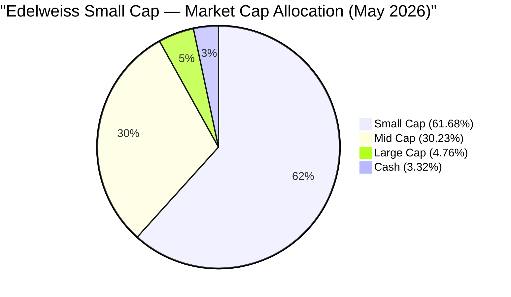

---

## ⭐ The Smid Drift — Module 3's Defining Feature *(Edelweiss-specific)*

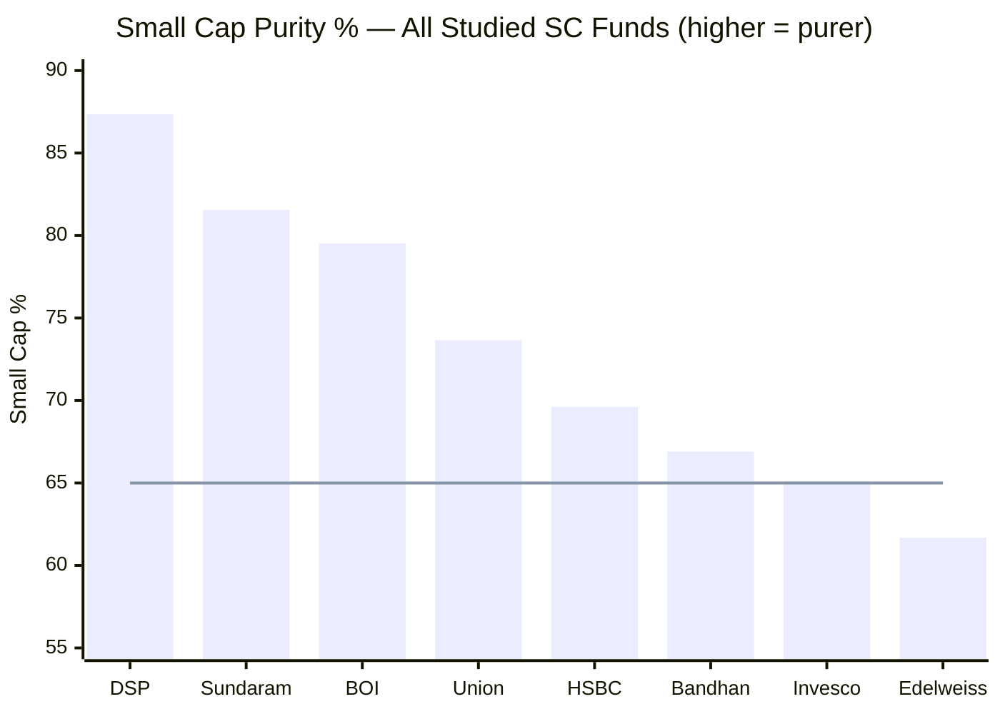
> Line = SEBI 65% minimum (official-list basis) | Edelweiss runs the **lowest platform small-cap % of all studied funds (61.68%)** — and the highest mid-cap weight (30.23%).

**The single most important Module 3 fact: Edelweiss has the lowest small-cap purity and the highest mid-cap weight of any deeply-studied fund.** And it is visible directly in the holdings — several top-20 names have **graduated well beyond the small-cap range**:

| "Small cap" holding | Approx. market cap today | Reality |
|---|---|---|
| UNO Minda | ~₹60,000 Cr | **Large cap** |
| Fortis Healthcare | ~₹55,000 Cr | **Large cap** |
| APL Apollo Tubes | ~₹45,000 Cr | **Large cap** |
| MCX (top holding) | ~₹35,000 Cr | **Large/upper-mid** |
| Radico Khaitan | ~₹35,000 Cr | Mid cap |
| City Union Bank | ~₹15,000 Cr | Mid cap |

**Two readings of the same fact — the "smid drift" cuts both ways:**

| Reading | Implication |
|---|---|
| **Source of the defensiveness (positive)** | Mid/large-caps are more liquid and less volatile than micro-caps. This is the *structural reason* for the M2 low beta (0.82), lowest volatility, and best-in-group 2025 down-capture. The defense is not magic — it is a smid book. |
| **Dilution of the mandate (negative)** | A small-cap *satellite* SIP exists to deliver pure small-cap exposure. At 61.68%, only **~₹12,340 of a ₹20,000/month SIP reaches genuine small caps** — the lowest of the group (DSP ~₹17,500, BOI ~₹15,900). The investor is partly buying a mid-cap fund. |

> **Definitional caveat:** the 61.68% is the *platform's market-cap-bucket* figure. By SEBI's official small-cap definition (251st company onward), the fund remains ≥65%-compliant — many of the "graduated" names are still on the SEBI small-cap list because they re-rated *in price* without leaving the eligible universe, and the genuine mid-caps sit within the 35% non-small-cap allowance. So this is a **style choice, not a mandate breach.** But for an investor seeking *pure* small-cap exposure, the platform figure is the honest read of what they are getting.

This is a "let-winners-ride" style closest to **Union** (which also drifts smid and holds graduated compounders) — but Edelweiss's drift is the **most pronounced of all eight funds.**

---

## Market Cap Allocation — Lowest Purity, Highest Mid-Cap

| Fund | Small Cap | Mid Cap | Large Cap | Cash | Identity |
|---|---|---|---|---|---|
| DSP SC | **87.35%** | 4.29% | ~0% | 8.4% | Purest SC + cash buffer |
| BOI SC | 79.52% | 12.57% | 3.44% | ~3% | Pure SC, nimble |
| HSBC SC | 69.5% | 27.0% | 2.1% | 1.4% | Smid-cap, fully invested |
| Bandhan SC | 66.9% | 15.0% | 4.0% | 13.3% | Diffuse deep-value |
| Invesco SC | 65.1% | 19.6% | 13.8% | 0.1% | Multi-cap growth wrapper |
| **Edelweiss SC** | **61.68%** | **30.23%** | 4.76% | ~2.6% | **Diversified quality-defensive smid** |

**Two findings:**

**Finding 1 — The heaviest smid tilt in the study.** At 61.68% small + 30.23% mid, Edelweiss has the most mid-cap-heavy book of the eight. This is the most direct expression of its defensive identity — and the clearest dilution of its small-cap mandate. It is, structurally, closer to a "small-and-mid" fund than a pure small-cap one.

**Finding 2 — Near-fully invested.** ~2.6% cash + 96.68% equity means no meaningful strategic cash buffer (unlike DSP 8.4% or Bandhan 13.3%). The downside protection comes entirely from the *smid + quality* construction, not from holding cash — consistent with the M2 finding that its defense is positional, not a dry-powder reserve.

---

## Asset Allocation — Near-Fully Invested, Thin Cash

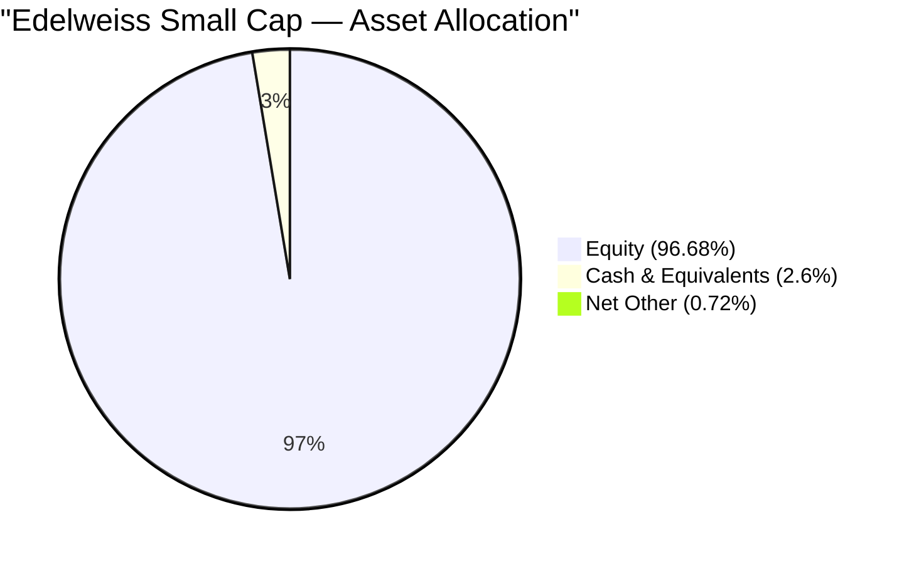

| Fund | Cash % | Implication |
|---|---|---|
| Invesco SC | 0.1% | Essentially zero |
| HSBC SC | 1.4% | Negligible |
| **Edelweiss SC** | **~2.6%** | **Thin operational float** |
| BOI SC | ~3.1% | Thin operational float |
| DSP SC | 8.4% | Meaningful war chest |
| Bandhan SC | 13.3% | Maximum dry powder |

Edelweiss runs **~2.6% cash** — operational, not strategic. Its low beta is therefore *not* a cash artefact (unlike Bandhan, whose sub-1 beta was partly a 13% cash overlay); it comes purely from the **mid-cap-heavy, quality-tilted equity book.** This makes the defensiveness more "real" (it is the equity selection, not a cash cushion) but also means **near-full downside participation in any decline** — protection rests on the smid/quality positioning, which worked in 2025 but has never met a 2018-type bear.

---

## Top 20 Holdings — Stock-by-Stock Analysis

Total portfolio: **92 stocks**. Top 20 ≈ **42.2%** of assets; top holding only **3.37%** (no dominant position — a 50% collapse in MCX costs ~1.7% of NAV).

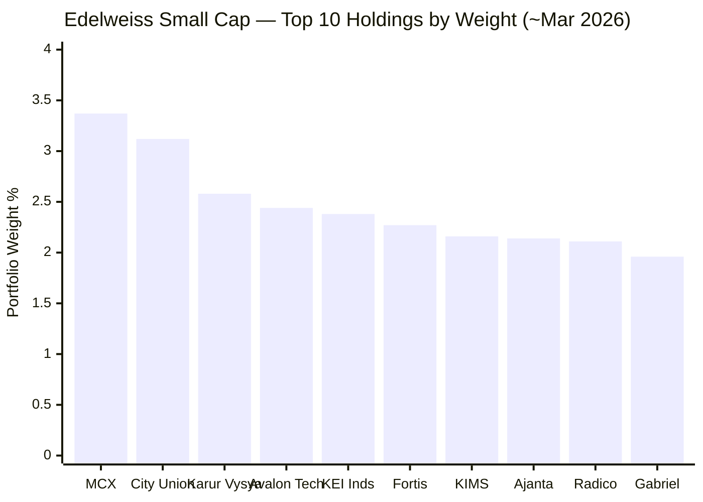

| # | Stock | Wt% | Sector | Investment Thesis | Cross-Fund |
|---|---|---|---|---|---|
| 1 | **Multi Commodity Exchange (MCX)** | 3.37% | Financial | Commodity-exchange near-monopoly; asset-light, fee-based, zero credit risk; financialisation toll-booth | **Also Union** |
| 2 | **City Union Bank** | 3.12% | Financial | Old South-India (TN) private bank; conservative SME lending | **Also BOI (#7), Union** |
| 3 | **Karur Vysya Bank** | 2.58% | Financial | Conservative TN regional bank; improving asset quality | **Also Union/HSBC** |
| 4 | **Avalon Technologies** | 2.44% | Industrials | Electronics manufacturing services (EMS); India-EMS structural growth | Edelweiss-distinctive |
| 5 | **KEI Industries** | 2.38% | Industrials | Cables & wires; power-capex + housing demand | **Also Union** |
| 6 | **Fortis Healthcare** | 2.27% | Healthcare | Pan-India hospital chain (now large-cap); premium care | Quality hospital |
| 7 | **Krishna Institute of Medical Sciences (KIMS)** | 2.16% | Healthcare | South-India hospital chain; bed expansion | **Also BOI (#11), Union** |
| 8 | **Ajanta Pharma** | 2.14% | Healthcare | Branded pharma — domestic + emerging markets; high-margin | Quality pharma |
| 9 | **Radico Khaitan** | 2.11% | Consumer Staples | Premium IMFL/spirits; premiumisation play | **Also Union** |
| 10 | **Gabriel India** | 1.96% | Consumer Disc | Auto suspension components; EV-agnostic ancillary | Edelweiss-distinctive |
| 11 | **PNB Housing Finance** | 1.95% | Financial | Housing finance; turnaround + asset-quality clean-up | **Also Bandhan** |
| 12 | **Indian Bank** | 1.89% | Financial (PSU) | PSU bank; improving asset quality | **Also BOI (#14)** |
| 13 | **UNO Minda** | 1.86% | Consumer Disc | Auto components (now large-cap); diversified, EV-ready | Quality auto ancillary |
| 14 | **Inventurus Knowledge Solutions (IKS)** | 1.77% | Industrials / Healthcare-tech | Healthcare BPO/RCM; asset-light global services; recent listing | Edelweiss-distinctive |
| 15 | **Bikaji Foods International** | 1.77% | Consumer Staples | Branded ethnic snacks; distribution expansion | Quality staples |
| 16 | **Century Plyboards (India)** | 1.74% | Materials | Plywood/laminates; building-materials formalisation | Building materials |
| 17 | **Equitas Small Finance Bank** | 1.74% | Financial | Small finance bank; microfinance + retail | Edelweiss-distinctive |
| 18 | **JB Chemicals & Pharmaceuticals** | 1.66% | Healthcare | Branded domestic + CDMO; high-quality pharma | Quality pharma |
| 19 | **APL Apollo Tubes** | 1.65% | Industrials / Materials | Structural steel tubes (now large-cap); market leader | Quality leader |
| 20 | **Kirloskar Pneumatic** | 1.62% | Industrials | Compressors / capital goods; industrial + gas-infra capex | Capital goods |

### Four Patterns in the Top 20

**Pattern 1 — Asset-light, quality financials lead (no NBFC credit risk).**
MCX (exchange), City Union + Karur Vysya (conservative regional banks), Equitas (SFB), Indian Bank (PSU), PNB Housing. Financials ~25% — but tilted to **fee-based and conservatively-underwritten** names, deliberately avoiding leveraged NBFC balance-sheet risk. This is the same quality filter Union and DSP apply, and a core source of the defensiveness.

**Pattern 2 — Broad, multi-model healthcare (~13%).**
Fortis + KIMS (hospitals), Ajanta + JB Chemicals (branded pharma) — four different healthcare business models. A genuinely defensive, low-cyclicality theme that ballasts the book in down-markets.

**Pattern 3 — Quality compounders allowed to graduate (the smid signature).**
UNO Minda, Fortis, APL Apollo, MCX, Radico — held well past small-cap into mid/large cap. This "let-winners-ride" pattern is the holdings-level expression of the smid drift, and the reason the small-cap purity is the lowest of the group.

**Pattern 4 — Industrials/capex via established names, not micro-cap IPOs.**
KEI, Avalon, Kirloskar, APL Apollo — solid mid-cap industrials, *not* the fresh, illiquid micro-cap IPOs that define BOI's book (Quality Power, Atlanta Electricals, Shreeji Shipping). This is the clearest stock-selection contrast with BOI: Edelweiss buys *established quality*, BOI buys *nimble newness*.

---

## ⭐ The Consensus Question — The Anti-BOI Finding *(Edelweiss-specific)*

BOI's Module 3 highlighted a *differentiated, non-consensus* book (~1 overlapping name → R² 90.8, IR +0.938). **Edelweiss is meaningfully more consensus** — and this is the portfolio-level cause of its M2 results.

| Differentiation Test | Edelweiss | BOI |
|---|---|---|
| Top-20 names shared with other studied funds | **~6–7** | ~1 (Apar) |
| R² (Module 2) | **92.24** (more index-like) | 90.8 |
| Information Ratio (Module 2, 3Y) | **−0.065** (flat) | +0.938 |
| Construction | Diffuse (92), smid, consensus | Nimble (84), pure, distinctive |

| Shared name | Also held by |
|---|---|
| City Union Bank | **BOI (#7)**, Union |
| KIMS | **BOI (#11)**, Union |
| Indian Bank | **BOI (#14)** |
| MCX, KEI, Radico | Union |
| Karur Vysya Bank | Union / HSBC |
| PNB Housing | Bandhan |

**This higher consensus overlap is the structural cause of the M2 findings.** A more diversified, more widely-held, smid-tilted book naturally tracks the index more closely (R² 92.24) and generates less independent alpha (3Y IR ~0). It is the exact inverse of BOI's nimble differentiation — and the portfolio-level reason BOI out-selects the index while Edelweiss recently tracks it. For a satellite whose purpose is *differentiated* small-cap alpha, this is a genuine demerit; for an investor wanting a *steady, diversified* small-cap exposure, it is the flip side of the safety.

---

## ⭐ The Bhatia Fingerprint — Holdings Evidence of the Manager Poach *(Edelweiss-specific)*

The most concrete cross-fund link in the entire small-cap study sits in the holdings. **City Union Bank, KIMS, and Indian Bank appear in *both* BOI's and Edelweiss's top-20** — and these are exactly the kind of conservative-financials + hospital names that **Dhruv Bhatia built at BOI Small Cap (2018–24)** before joining Edelweiss as co-manager (since 14-Oct-2024).

| Name | BOI rank | Edelweiss rank | Read |
|---|---|---|---|
| City Union Bank | #7 (2.35%) | #2 (3.12%) | Conservative regional bank — a Bhatia-style pick |
| KIMS | #11 (2.20%) | #7 (2.16%) | South-India hospital chain — held in both |
| Indian Bank | #14 (1.90%) | #12 (1.89%) | PSU bank — appears in both books |

This overlap is consistent with **Bhatia carrying elements of his BOI playbook into Edelweiss** — a tangible, holdings-level trace of the manager move flagged in M1/M2. It does two things: (a) it lends the *current* Edelweiss team genuine small-cap pedigree (Bhatia's proven BOI record), and (b) it means a slice of the BOI-vs-Edelweiss decision is now "which fund gets the better of Bhatia's skill." His Edelweiss tenure is only ~20 months, so the *effect* is not yet in the numbers — but the fingerprint is already in the portfolio. (M5 to develop.)

---

## Sector Allocation — Financials + Healthcare Defensive Core

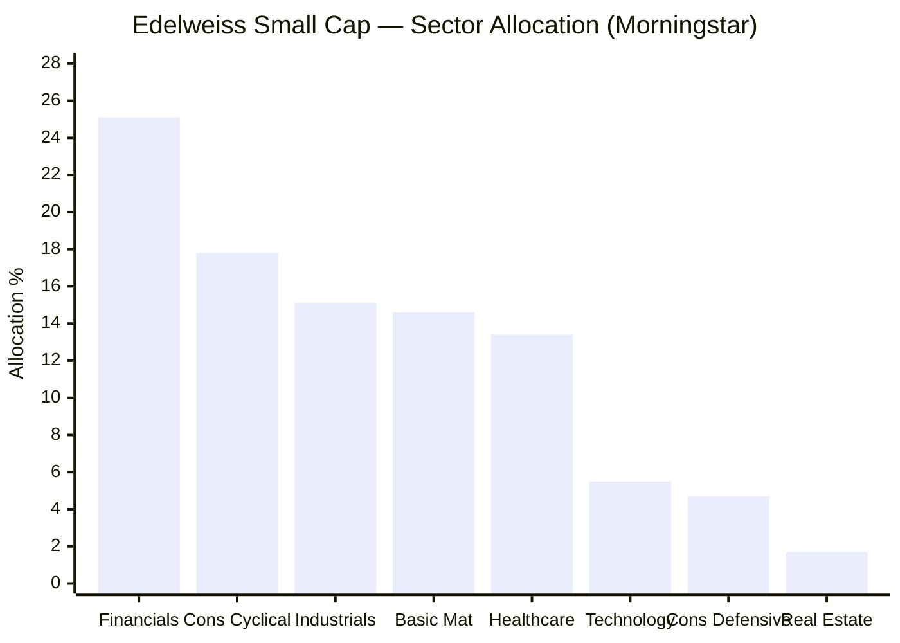

| Sector | Edelweiss % | Read |
|---|---|---|
| **Financial Services** | **25.1%** | The lead — but **fee-based + conservative banks** (MCX, City Union, Karur Vysya), low credit risk |
| Consumer Cyclical | 17.8% | Auto ancillaries (UNO Minda, Gabriel) + discretionary |
| Industrials | 15.1% | Cables/EMS/capital goods (KEI, Avalon, Kirloskar) |
| Basic Materials | 14.6% | Building materials + steel (Century Ply, APL Apollo) |
| **Healthcare** | **13.4%** | **Defensive ballast** — hospitals + branded pharma (Fortis, KIMS, Ajanta, JB Chem) |
| Technology | 5.5% | Modest |
| Consumer Defensive | 4.7% | Staples (Radico, Bikaji) |
| Real Estate | 1.7% | Minor |

**Edelweiss's macro identity:** **"a quality-defensive book led by asset-light financials and broad healthcare, spread across cyclicals/industrials/materials."** The combination of fee-based financials (no credit risk) + ~13% defensive healthcare + ~5% staples is the **sector-level source of the low beta and downside protection** — these are lower-cyclicality businesses than BOI's power-capex spine or DSP's consumer-cyclical concentration. The trade-off is the absence of a single high-conviction thematic engine (BOI's grid-capex, DSP's consumer): Edelweiss's sectors are *balanced and defensive* rather than *concentrated and aggressive* — coherent with the whole fund, and with the thin alpha.

---

## Portfolio Concentration Analysis

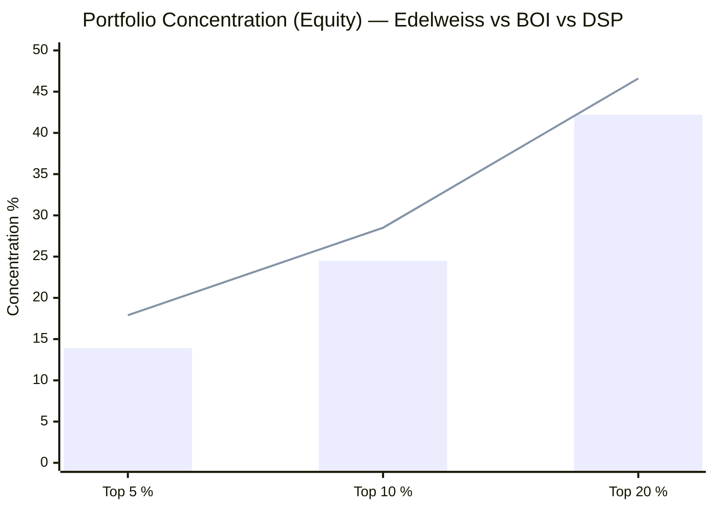
> Bar = Edelweiss | Line = DSP. Edelweiss is moderately *less* concentrated than DSP across every band — the 92-stock book spreads thinner.

| Metric | Edelweiss SC | DSP SC | BOI SC | HSBC SC | Bandhan SC |
|---|---|---|---|---|---|
| Total Stocks | **92** | 81 | 84 | 109 | 239–256 |
| Top Holding % | 3.37% | **5.38%** | 3.86% | 3.65% | 3.49% |
| Top 5 % | 13.9% | 17.9% | 15.0% | 11.5% | 12.2% |
| Top 10 % | 24.5% | 28.5% | 26.6% | 20.3% | 18.9% |
| Top 20 % | 42.2% | 46.6% | 45.3% | 35.0% | 28.2% |

**Edelweiss sits between the conviction funds (DSP/BOI) and the diffuse funds (HSBC/Bandhan)** — moderately diversified. The top-10 (24.5%) and top-20 (42.2%) are a touch below BOI/DSP, and the 92-stock count is the highest of the conviction-style funds. The practical read: enough concentration that the top holdings matter, but the 92-name breadth dilutes conviction relative to DSP's 81 — and, combined with the consensus overlap, contributes to the index-like R² and flat IR.

**The long tail:** positions ~21–92 (≈ 72 names) average ~0.8% each. At 92 stocks Edelweiss carries a longer tail than BOI/DSP — more blow-up insurance, but also more names than a high-conviction small-cap process strictly needs, consuming research bandwidth and nudging the book toward the index.

---

## ⭐ Portfolio Turnover — Disclosed and Low (the Anti-BOI Data Point) *(Edelweiss-specific)*

Where BOI's Module 3 hit a genuine *data gap* (turnover undisclosed everywhere), **Edelweiss discloses its turnover — and it is reassuringly low:**

| Source | Turnover | Date |
|---|---|---|
| Edelweiss SID (statutory) | **0.25× (25%)** | 30-Sep-2025 |
| Edelweiss factsheet | **28%** | Feb-2026 |
| SID philosophy statement | *"The Scheme will endeavour to keep the portfolio turnover at a minimum"* | — |

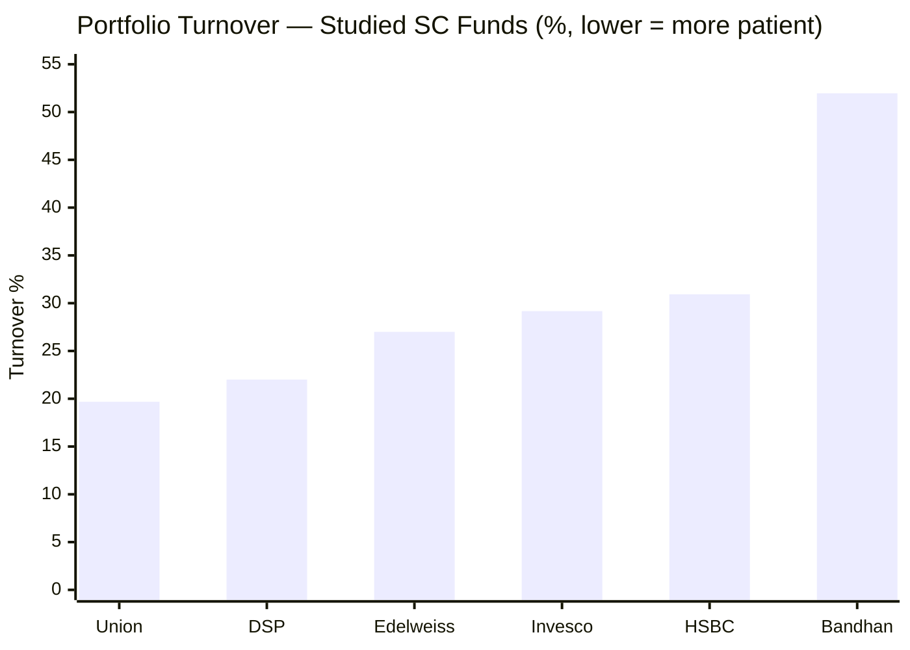

At **~25–28%, Edelweiss is a genuinely patient holder** — DSP/Union-tier, far below Bandhan's 52% churn, and below Invesco/HSBC. Three implications, all favourable:

1. **Low transaction-cost drag** — minimal hidden trading cost on top of the ~0.44–0.52% headline ER (a Module 4 positive).
2. **Tax-efficient** — low churn means fewer realised short-term capital gains passed implicitly to holders.
3. **Confirms the "let-winners-ride" smid style** — low turnover + smid drift + quality names are *one coherent strategy*: buy small, hold quality compounders as they graduate to mid-cap. The low turnover is what *produces* the smid drift over time.

This is a clear structural advantage over BOI on the cost/patience axis, and resolves a question the BOI study had to leave open.

---

## Portfolio PE — Above Category (Defense From Beta, Not Cheapness)

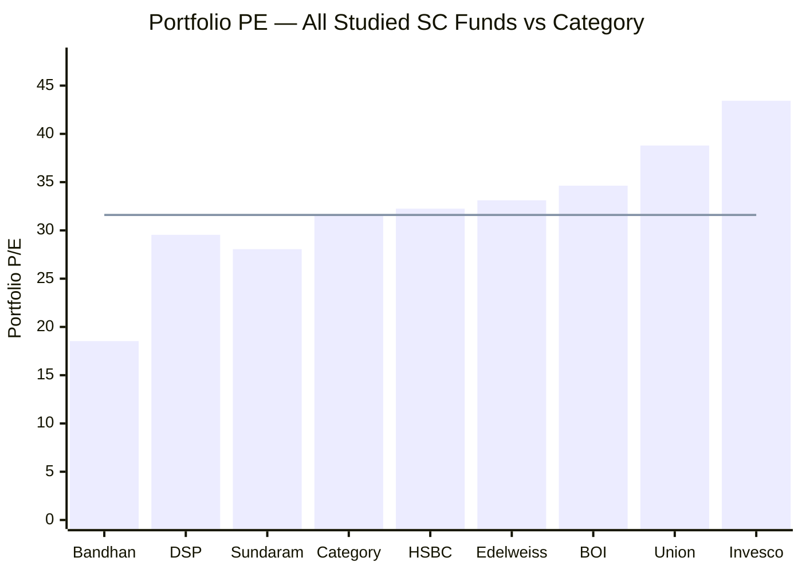
> Line = category average PE (31.60). Edelweiss at 33.12 trades at a ~4.8% premium — a thin valuation cushion.

| Fund | PE | vs Category | Interpretation |
|---|---|---|---|
| Bandhan SC | 18.53 | −41% | Maximum valuation protection |
| DSP SC | 29.54 | −6.5% | Meaningful cushion |
| HSBC SC | 32.25 | +2% | Slight premium |
| **Edelweiss SC** | **33.12** | **+4.8%** | **Defense from low beta, not cheapness** |
| BOI SC | 34.63 | +9.6% | No cushion |
| Invesco SC | 43.43 | +37% | Maximum fragility |

**Edelweiss's PE 33.12 is modestly above category** — a mild negative, and a subtle tension with the defensive thesis. A *valuation*-defensive fund would carry a low PE (like Bandhan); Edelweiss's defense comes entirely from **low beta + mid-cap stability + quality**, not from owning cheap stocks. Its holdings are quality compounders at full-ish prices (Fortis, MCX, Ajanta, UNO Minda all trade at premium multiples). The consequence: in a *de-rating* (multiple compression), Edelweiss has less PE cushion than DSP/Bandhan — though its low beta should still cushion a *beta-driven* sell-off (as 2025 showed). The defense is real but **positional, not valuation-based.**

---

## Same-Manager Portfolio Transfer — Trideep's FlexiCap → SmallCap *(Edelweiss-specific)*

Like BOI (Alok Singh), Edelweiss's lead is already studied: **Trideep Bhattacharya** runs Edelweiss Flexi Cap (Rank #4, 3.77/5). Module 3 lets us see whether his construction style transfers:

| Construction Dimension | Edelweiss FlexiCap (studied) | Edelweiss Small Cap (this fund) |
|---|---|---|
| Manager | Trideep Bhattacharya | Trideep + Raj Koradia + Dhruv Bhatia |
| Style signature | Low tracking error, diversified, quality | **Same — diffuse, quality, defensive (R² 92, low beta)** |
| Concentration | Diversified | Diversified (92 stocks, top-10 24.5%) |
| Financials preference | Quality/asset-light | Quality/asset-light (MCX, conservative banks) |
| Valuation | Quality-at-a-price | Quality-at-a-price (PE 33.12) |

**Read:** Trideep's signatures transfer cleanly — **broad diversification, low tracking error, quality-tilt, asset-light financials.** The FlexiCap study's "low TE / steady" verdict is exactly what the small-cap book expresses (diffuse, smid, R² 92, low beta). This consistency is a *positive* for process reliability — Edelweiss runs a recognisable, repeatable house style across mandates — but it also means the small-cap fund inherits the FlexiCap's relative-to-peers position: solid and defensive (#4), not a standout alpha generator (#1-2). The *new* ingredient is Dhruv Bhatia's small-cap pedigree (the Bhatia Fingerprint above) — the one element that could sharpen the alpha if his influence grows.

---

## AUM Scalability & Liquidity — The Sweet Spot *(an advantage over BOI)*

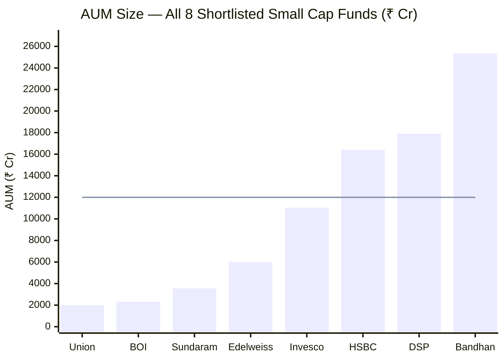
> Line = ~₹12,000 Cr threshold above which small-cap deployment friction becomes structurally significant. Edelweiss (~₹6,000 Cr) sits comfortably below it — the AUM sweet spot.

| Scenario | Edelweiss (~₹6,000 Cr) | BOI (₹2,318 Cr) | DSP (₹17,906 Cr) |
|---|---|---|---|
| 1% position requires | ~₹60 Cr | ~₹23 Cr | ₹179 Cr |
| Deployment friction | **Low** | None | Significant |
| Micro-cap access | **Good** | Full | Largely closed |
| Redemption-wave vulnerability | **Low–moderate** | **High** (smallest) | Moderate |

**Edelweiss has the most comfortable AUM position of the deeply-studied funds — and this is a genuine structural advantage over BOI.** At ~₹6,000 Cr it is:
- **Large enough for flow stability** — no BOI-style smallest-AUM redemption fragility (BOI's single biggest structural risk)
- **Small enough for genuine small-cap execution** — no DSP/HSBC deployment friction (a ₹60 Cr position is easily built/exited)

This is the quiet structural reason Edelweiss never needed BOI's nimbleness *or* DSP's cash buffer. The mid-cap tilt further enhances liquidity (mid-caps trade more freely than micro-caps), so Edelweiss's portfolio is **among the most liquid and redemption-resilient of the studied funds** — a real plus that the return/risk numbers don't capture, and a direct offset to one of BOI's key weaknesses.

---

## Points For / Points Against (Portfolio Angle)

### ✅ Points For

1. **AUM sweet spot (~₹6,000 Cr)** — no smallest-AUM redemption fragility (BOI's flaw), no large-AUM friction (DSP/HSBC's); the most comfortable AUM of the deeply-studied funds
2. **Low, disclosed turnover (25–28%)** — DSP/Union-tier patience; low cost/tax drag; resolves the gap BOI left open
3. **Coherent quality-defensive identity** — asset-light financials + broad healthcare = the structural source of the M2 low beta and best-in-group down-capture
4. **No dominant-position risk** — top holding 3.37%; 92-name spread contains single-stock blow-ups
5. **Quality compounders (no NBFC credit risk)** — MCX, conservative regional banks, branded pharma; the same quality filter as DSP/Union
6. **High portfolio liquidity** — mid-cap tilt + sweet-spot AUM make it among the most redemption-resilient books in the study
7. **The Bhatia pedigree** — ex-BOI small-cap architect now co-managing; holdings already show his fingerprint (City Union, KIMS, Indian Bank)
8. **Process consistency** — Trideep's low-TE, quality, diversified FlexiCap style transfers cleanly (repeatable house style)

### ❌ Points Against

1. **Lowest small-cap purity of any studied fund (61.68%)** — the heaviest smid drift; only ~₹12,340 of a ₹20K SIP reaches genuine small caps; weakest mandate-alignment for a *small-cap* satellite
2. **Highest mid-cap weight (30.23%)** — structurally closer to a smid fund than a pure small-cap one
3. **More-consensus book (~6–7 shared top names)** — the portfolio cause of the elevated R² (92) and flat 3Y IR; the anti-BOI
4. **92-stock diffuse construction** — dilutes conviction; longer tail than DSP/BOI; nudges the book toward the index
5. **PE 33.12 — above category** — defense from beta, not cheapness; thin de-rating cushion
6. **Thin cash (~2.6%)** — no strategic dry powder; near-full downside participation
7. **No single high-conviction thematic engine** — balanced/defensive sectors rather than a concentrated alpha theme (BOI's grid-capex, DSP's consumer)
8. **The defensive construction is regime-bounded** — proven in 2025, but never tested through a 2018-type grinding bear

---

## Module 3 Scorecard

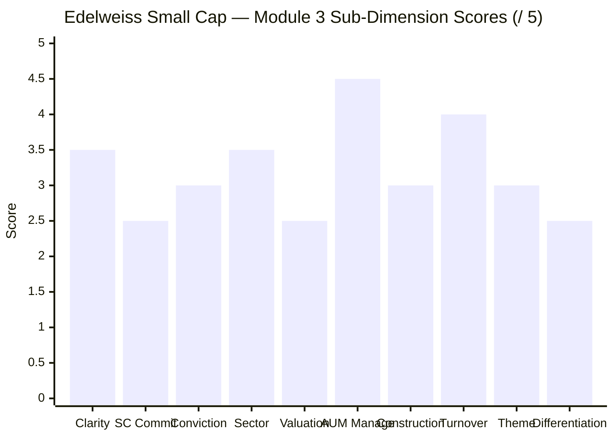

| Sub-Dimension | Score | Reasoning |
|---|---|---|
| Portfolio Clarity / Identity | **3.5** | Clear "diversified quality-defensive smid" identity; coherent and recognisable |
| Small Cap Commitment | **2.5** | 61.68% — **lowest of studied funds**; heaviest smid drift; weakest mandate-alignment |
| Manager Conviction Quality | **3.0** | Top-10 24.5%, top holding 3.37% — moderate; 92-stock spread dilutes conviction |
| Sector Positioning | **3.5** | Defensive financials/healthcare core is coherent; no single concentrated alpha theme |
| Valuation Discipline | **2.5** | PE 33.12 — above category; defense from beta not cheapness; thin cushion |
| AUM Manageability | **4.5** | ~₹6,000 Cr sweet spot — best of deeply-studied funds; liquid, redemption-resilient |
| Portfolio Construction | **3.0** | 92 stocks, moderate concentration; longer tail; index-leaning breadth |
| Turnover & Cost Efficiency | **4.0** | 25–28%, disclosed and low — DSP/Union-tier patience; tax-efficient |
| Theme Quality | **3.0** | Balanced defensive themes (financials/healthcare); coherent but not high-conviction |
| Peer Differentiation | **2.5** | More-consensus book (~6–7 shared names); the cause of the flat IR; the anti-BOI |
| **Module 3 Overall** | **~3.4 / 5** | **A coherent, defensively-built, well-diversified book in the AUM sweet spot with patient, low turnover — but the lowest small-cap purity and a more-consensus construction than its peers. The smid drift is simultaneously the source of its defensiveness (M2) and the dilution of its small-cap mandate. Below BOI (3.7)/DSP (3.8)/Union (3.6); around HSBC (3.3, but Edelweiss has a far better AUM position); above Bandhan (3.2)/Invesco (3.1).** |

---

## Comparison with All Studied Funds

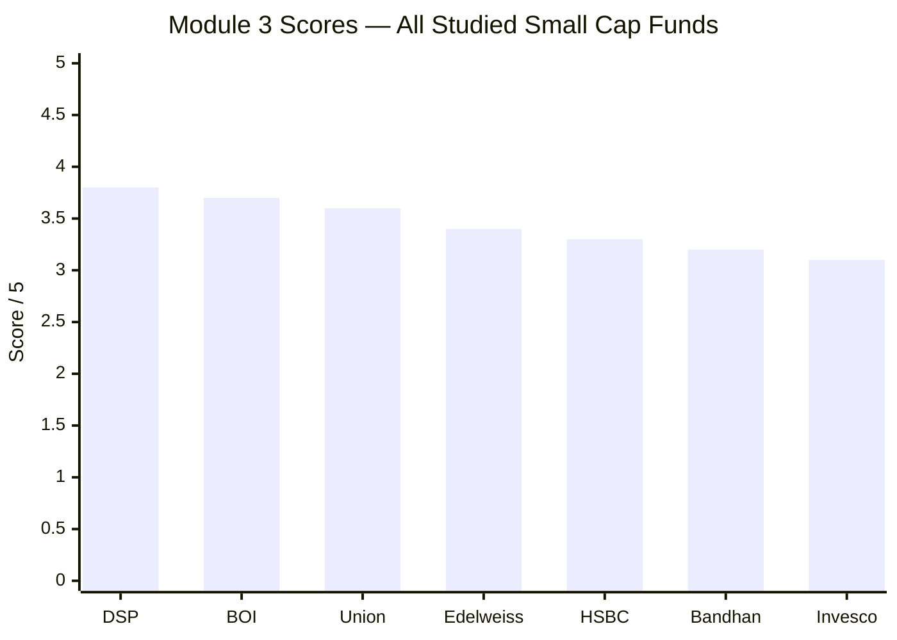

| Dimension | Edelweiss SC | DSP SC | BOI SC | Union SC | HSBC SC | Bandhan SC |
|---|---|---|---|---|---|---|
| Total Stocks | 92 | 81 | 84 | ~70 | 109 | 239–256 |
| Small Cap % | **61.68%** (lowest) | **87.35%** | 79.52% | 73.66% | 69.5% | 66.9% |
| Mid Cap % | **30.23%** (highest) | 4.29% | 12.57% | ~22% | 27.0% | 15.0% |
| Cash % | ~2.6% | 8.38% | ~3.1% | ~1.1% | 1.4% | 13.3% |
| Top Holding % | 3.37% | 5.38% | 3.86% | 4.20% | 3.65% | 3.49% |
| Top-10 % | 24.5% | 28.5% | 26.6% | 33.45% | 20.3% | 18.9% |
| Turnover | **27%** | ~22% | undisclosed | 19.68% | 30.93% | 51.96% |
| Portfolio PE | 33.12 | 29.54 | 34.63 | 38.79 | 32.25 | **18.53** |
| AUM | **~₹6,000 Cr (sweet spot)** | ₹17,906 Cr | ₹2,318 Cr | ₹1,980 Cr | ₹16,394 Cr | ₹25,346 Cr |
| Top-20 consensus overlap | High (~6–7) | Low | **~1 (lowest)** | Moderate (~4) | High (~7) | Medium |
| Defining sector | Financials 25.1% | Consumer Cyc 34.2% | Electrical 15.4% | Electrical 13.5% | Industrial 27.1% | Financials 24.1% |
| Style | Diversified quality-defensive smid | Concentrated quality SC | Nimble pure SC | Quality let-winners-ride | Broad smid index-hug | Diffuse deep-value |
| Module 3 Score | **3.4/5** | **3.8/5** | **3.7/5** | **3.6/5** | **3.3/5** | **3.2/5** |

**Edelweiss's distinctive positioning across all studied funds:**
- **Lowest small-cap purity (61.68%) + highest mid-cap (30.23%)** — the heaviest smid drift of the eight; the weakest pure-small-cap mandate-alignment
- **Best AUM position of the deeply-studied funds (~₹6,000 Cr)** — liquid and redemption-resilient; a real advantage over BOI's fragility and DSP/HSBC's friction
- **Patient, low, disclosed turnover (27%)** — DSP/Union-tier; the anti-Bandhan
- **More-consensus, diffuse construction** — the portfolio cause of the elevated R² and flat IR; the anti-BOI
- **Coherent quality-defensive identity** — the structural source of the M2 best-in-group down-capture

**The Edelweiss-vs-BOI portfolio contrast in one line:** BOI uses a small AUM to build a *pure, nimble, differentiated* book (high purity, low overlap, high IR) at the cost of redemption fragility; Edelweiss uses a comfortable AUM to build a *diversified, quality-defensive, smid* book (low purity, high overlap, low IR) that is liquid and protective but mandate-diluted and index-leaning. Two opposite philosophies — and the reason BOI scores higher on the *small-cap* dimension while Edelweiss wins on *liquidity/redemption-resilience*.

### vs Studied FlexiCap Funds

| Metric | Edelweiss Small Cap | Edelweiss FlexiCap (same CIO) | BOI Small Cap | DSP Small Cap |
|---|---|---|---|---|
| Manager | Trideep Bhattacharya | **Trideep Bhattacharya** | Alok Singh | Vinit Sambre |
| Stocks | 92 | ~50–60 | 84 | 81 |
| Style | Diffuse, smid, quality | Diversified, low-TE, quality | Nimble pure SC | Concentrated quality SC |
| Portfolio PE | 33.12 | ~quality-at-a-price | 34.63 | 29.54 |
| Study M3 rank | (this: 3.4) | 3.77/5 (#4) | 3.7/5 | 3.8/5 |

The same CIO runs both Edelweiss funds; the construction signatures (broad diversification, low tracking error, quality-tilt, asset-light financials) clearly transfer. The small-cap fund's relative position (#4-ish, defensive, not standout) mirrors the FlexiCap's — a consistent, repeatable house style rather than a category-beating small-cap specialist.

---

## SIP Implication

For a ₹20,000/month satellite SIP with a 10+ year horizon, Edelweiss's portfolio DNA is **coherent, defensive, and well-built — but the least "purely small-cap" of the studied funds, and the least differentiated.**

**What you are actually buying:** A broadly-diversified (92-stock), quality-defensive book anchored in asset-light financials (MCX, conservative regional banks) and multi-model healthcare (hospitals + branded pharma), tilted heavily toward mid-caps (30.23%) and held patiently (turnover 25–28%). This construction is the *structural source* of everything Modules 1–2 found attractive — the lowest beta of the group, the best 2025 downside protection, the most liquid and redemption-resilient portfolio. It sits in the AUM sweet spot (~₹6,000 Cr), free of both BOI's redemption fragility and DSP/HSBC's deployment friction. For an investor who wants the *defensive, stable* leg of a small-cap allocation, this is genuinely the best-built book in the study.

**What you must accept:** This is, in market-cap terms, the **least small-cap of the small-cap funds** — 61.68% purity, with multiple holdings (Fortis, APL Apollo, UNO Minda, MCX) that have graduated to mid/large cap. Only ~₹12,340 of a ₹20K SIP reaches genuine small caps, the lowest of the group. Layered on that is a **more-consensus, more index-leaning construction** (R² 92, ~6–7 shared top names) that is the portfolio reason for the flat 3Y information ratio: this book tracks the small-cap index more than it out-selects it. If the *purpose* of a small-cap satellite is differentiated, pure small-cap alpha, Edelweiss fulfils that mandate **less well than BOI or DSP** — it is closer to a defensive smid-cap fund.

**What to monitor:**
1. **Small-cap purity** — at 61.68% and drifting, watch whether the mid-cap weight keeps rising. Further drift would erode the small-cap mandate toward a de-facto smid fund.
2. **Consensus overlap / IR** — if the book stays this index-leaning, the flat IR (M2) becomes a structural feature; watch whether Dhruv Bhatia's influence sharpens differentiation.
3. **The Bhatia effect** — the shared BOI names (City Union, KIMS, Indian Bank) are an early fingerprint; if his small-cap pedigree pulls the book toward more distinctive, purer small-cap picks, both purity and alpha could improve.
4. **Turnover** — staying low (25–28%) keeps cost/tax drag minimal; a rise would signal a style shift.

**SIP verdict:** Edelweiss Small Cap is a coherently-built, defensive, liquid, patiently-managed book — the **best portfolio in the study for downside resilience and redemption safety**, and the worst for *pure* small-cap exposure and differentiation. For a ₹20K/month satellite, the portfolio DNA supports it specifically as a **defensive / risk-dampening leg** (to pair against a higher-purity, higher-alpha satellite like BOI or DSP) — not as the portfolio's pure small-cap engine. Price in that you are buying a quality smid book with index-leaning construction, and judge it on the protection it provides rather than the alpha it generates.

---

## Comparative Module 3 Scores

| Fund | M3 Score | Portfolio Identity |
|---|---|---|
| **DSP SC** | **3.8/5** | Pure SC concentrated conviction; lowest turnover; AUM ceiling the constraint |
| **BOI SC** | **3.7/5** | Nimble pure SC; AUM advantage; differentiated non-consensus book; above-cat PE + redemption risk |
| **Union SC** | **3.6/5** | Quality let-winners-ride; low turnover; smid drift but quality-anchored |
| **Edelweiss SC** | **3.4/5** | **Diversified quality-defensive smid; sweet-spot AUM + low turnover; lowest SC purity + most-consensus book the constraints** |
| HSBC SC | 3.3/5 | Broad smid index-hug; consensus construction; large AUM |
| Bandhan SC | 3.2/5 | Diffuse deep-value; lowest PE; highest cash drag |
| Invesco SC | 3.1/5 | Multi-cap growth wrapper; highest PE; mandate misalignment |

Edelweiss's M3 of 3.4/5 places it **mid-pack** — below the three high-purity funds (DSP/BOI/Union) but clearly above the weaker-construction funds (Bandhan/Invesco), and a notch above HSBC despite a similar diffuse/consensus style (Edelweiss wins decisively on AUM position and turnover). The gap to BOI/Union is the price of the **heaviest smid drift and the most index-leaning construction** of the studied funds — offset, but not erased, by the best AUM position and the most patient turnover.

---

*Module 3 complete. Portfolio DNA is diversified, quality-defensive, and smid-tilted: 92 stocks, 61.68% small cap (lowest of studied funds), 30.23% mid cap (highest), ~2.6% cash, PE 33.12 (above category), top-10 24.5% (moderate), turnover 25–28% (low, disclosed), financials/healthcare defensive core, ~₹6,000 Cr AUM (sweet spot — the best redemption-resilience of the deeply-studied funds), and a more-consensus book (~6–7 shared top names) that is the structural cause of the flat M2 information ratio. The smid drift is simultaneously the source of the fund's defensiveness and the dilution of its small-cap mandate. Module 3 score: ~3.4/5.*

*Next: [Module 4 — Cost & AUM Impact](module4_cost.md)*
