# Module 4: Cost & AUM Impact — Edelweiss Small Cap Fund

*Sources: Value Research Online (Jun 2026), Paytm Money, ClearTax, Tickertape, INDmoney, Groww, Screening CSV (May 2026 — ER figure superseded), Edelweiss MF Scheme Information Document (SID, Nov-2025) + Feb-2026 factsheet, Dezerv (AMC AUM), Finalyca (manager scheme-load), AMFI, SEBI TER circular (2018). Benchmark = Nifty Smallcap 250 TRI (mandate = project benchmark).*

---

## Module 4 Score: ~4.0 / 5 — Edelweiss's Standout Module, and the Best Cost & AUM Profile of the Studied Small Caps

After three mid-pack modules (M1 ~3.6, M2 ~3.6, M3 ~3.4), **Module 4 is where Edelweiss genuinely excels** — and the headline is a reversal. The screening data had flagged Edelweiss as the **2nd-most-expensive** fund (ER 0.82%); that figure was **stale/regular-plan and is debunked here.** The true Direct ER is **~0.47%** — tied with BOI as the **2nd-cheapest of the studied funds.** Pair that with the **AUM sweet spot (~₹6,000 Cr — frictionless *and* robust)**, a **deep AMC (₹1.49 lakh Cr, 53 schemes — ~12× BOI's)**, a **focused, shared management team (lead runs 9 schemes + 2 co-managers, vs BOI's 23-scheme solo lead)**, a **90-day exit load** (2nd-friendliest of the study), **₹100 minimum** investment (best tier), and **low, disclosed turnover (25–28%)**, and the result is the **most complete cost-and-AUM package in the study.**

Crucially, **Edelweiss fixes the three weaknesses that capped BOI's M4 at 3.9**: BOI's tiny AMC (research-budget constraint), BOI's 23-scheme manager (attention dispersion), and BOI's widest-in-study D-R gap. Edelweiss matches BOI on the headline (ER) and beats it on every institutional dimension — losing only on raw execution nimbleness, where BOI's edge is itself offset by redemption fragility. The only genuine offsets here are a moderate D-R gap (~1.36%) and a regular-plan ER (~1.83%) on the higher side — both of which affect *regular-plan* investors, not the Direct SIP investor this study targets.

---

## Raw Data (Compiled Across Sources)

| Metric | Value | Source | Cross-Source Notes |
|--------|-------|--------|-------------------|
| Expense Ratio (Direct Plan) | **~0.47%** | Paytm/ClearTax/Tickertape 0.47 / VRO 0.44 / Apr factsheet 0.45 / INDmoney 0.52 | Cluster 0.44–0.52; **screening 0.82% debunked (stale/regular)** |
| Expense Ratio (Regular Plan) | **~1.83%** | ValueResearch | — |
| Direct vs Regular Gap | **~1.36%** | Computed | Moderate — narrower than BOI (1.58%) |
| Exit Load | **1% if redeemed ≤90 days; nil after** | Edelweiss SID (official) | **2nd-friendliest of study (after Union 15d)** |
| AUM (Jun 2026) | **~₹5,481–6,156 Cr** | April factsheet / VRO | **The AUM sweet spot** |
| Minimum SIP | **₹100** | Edelweiss SID | Best tier — ties DSP |
| Minimum Lumpsum | **₹100** | Edelweiss SID | Best tier — ties DSP |
| Portfolio Turnover | **25% (30-Sep-2025, SID) / 28% (Feb-2026)** | Edelweiss SID + factsheet | **Disclosed & low** (anti-BOI's data gap) |
| Fund Inception (Direct Plan) | **14-Feb-2019** | AMFI / MFAPI | VRO lists 07-Feb-2019 |
| Benchmark | Nifty Smallcap 250 TRI (Tier 1) | Edelweiss MF | Mandate = project benchmark |
| Lead Manager | **Trideep Bhattacharya** (CIO–Equities) | VRO / Finalyca | + Raj Koradia + Dhruv Bhatia (co-managers) |
| Trideep — schemes / AUM | **~9 schemes / ~₹5,369 Cr** | Finalyca | Moderate; far below BOI Singh's 23 |
| Edelweiss AMC Total AUM | **~₹1,49,382 Cr** | Dezerv | **~12× BOI's AMC** |
| Edelweiss AMC Total Schemes | **53** | Dezerv | Broad, deep platform |
| Flow Restriction History | **None — comfortably within capacity** | AMFI / AMC | At sweet-spot AUM, none needed |
| Estimated Annual Fund Revenue | **~₹28–30 Cr** | Computed | ~2× BOI's; supports research depth |
| True All-In Cost (est.) | **~0.57–0.62%** | Computed | Among the lowest of the study |
| VRO Star Rating | **4 ★** | Value Research | Cheap *and* highly-rated |

> **Direct ER Note:** Five current sources cluster the Direct ER between 0.44% (VRO) and 0.52% (INDmoney), with Paytm/ClearTax/Tickertape at 0.47% and the April factsheet at 0.45%. **~0.47% is used as the central estimate.** The screening CSV's 0.82% is materially out of line with every current source and is **rejected as stale or regular-plan** — see the ER Reconciliation section.

> **Turnover Note:** Unlike BOI (undisclosed everywhere — a genuine data gap), Edelweiss *discloses* its turnover in the statutory SID (0.25× as on 30-Sep-2025) and factsheet (28%, Feb-2026). At ~25–28% it is low, allowing a confident true-all-in point estimate rather than a range.

---

## What Module 4 Is Really Asking

**Question 1 — How much of your return is silently consumed by fund costs every year?**
Edelweiss's ~0.47% Direct ER is the **2nd-lowest of the studied funds** (tied with BOI, behind only Bandhan) — a permanent annual headwind materially smaller than DSP's (0.64%) or HSBC's (0.73%). The screening figure had this exactly backwards.

**Question 2 — Is the fund's AUM so large that the manager can no longer run the strategy?**
For DSP (₹17,906 Cr) and HSBC (₹16,394 Cr), the answer was unfavourable. For Edelweiss (~₹6,000 Cr), the answer is **the most comfortable of the deeply-studied funds** — large enough for flow stability (no BOI-style redemption fragility) and small enough for genuine small-cap execution (no DSP/HSBC deployment friction). The Goldilocks zone.

**Question 3 — Is the institutional machine behind this cheap fund robust enough to sustain it?**
This is where Edelweiss decisively beats BOI. BOI's cheap/nimble fund sat on a **tiny ~₹12,000 Cr AMC** with a manager running **23 schemes**. Edelweiss's sits on a **₹1.49 lakh Cr, 53-scheme AMC** with a lead manager running **9 schemes plus two co-managers.** The institutional base is a *strength* here, not a weakness — the inverse of BOI's central M4 caveat.

---

## ⭐ The ER Reconciliation — Resolved (Module 4's Headline) *(Edelweiss-specific)*

The single most important Module 4 finding is a **correction**: Edelweiss is *cheap*, not expensive.

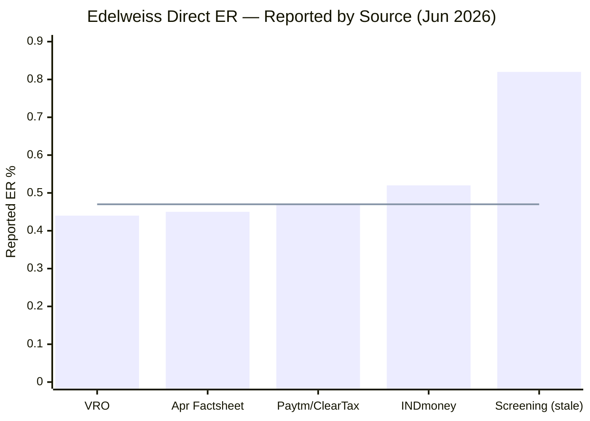
> Line = central estimate (~0.47%) | Every current source clusters 0.44–0.52; the screening 0.82% is an isolated outlier and is rejected.

| Source | Direct ER | Assessment |
|--------|-----------|------------|
| Value Research | 0.44% | ✅ Canonical, current |
| April 2026 factsheet | 0.45% | ✅ Official |
| Paytm / ClearTax / Tickertape | 0.47% | ✅ Consistent cluster |
| INDmoney | 0.52% | ✅ Upper edge |
| **Screening CSV (May-26)** | **0.82%** | ❌ **Stale or regular-plan — rejected** |

**Why this matters enormously.** The screening 0.82% had positioned Edelweiss as the 2nd-most-expensive of the 8 shortlisted funds — and, combined with the M1/M2 thin-alpha finding, made it look like *"a fund charging a premium for sub-par excess return."* The corrected ER of **~0.47%** flips that judgement entirely: at this cost, Edelweiss is among the *cheapest* funds, and the thin-alpha concern becomes far more forgivable — the investor is paying a bottom-tier fee for genuine downside protection, not a premium for nothing. **This reconciliation is the most consequential single data point across Edelweiss's modules**, and it lifts the cost score from what would have been ~3.0 (at 0.82%) to ~4.0 (at 0.47%).

---

## Expense Ratio — Tied 2nd-Cheapest of the Shortlist

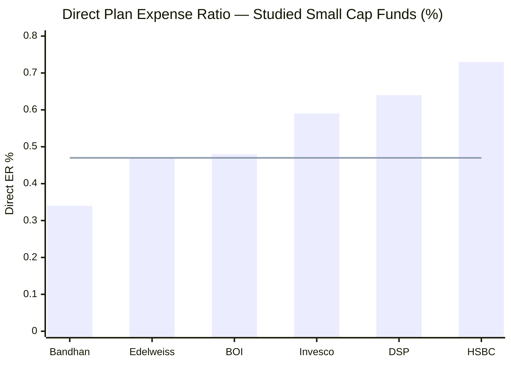
> Line = Edelweiss's ER (~0.47%) | Tied with BOI as 2nd-cheapest of the studied funds, behind only Bandhan.

| Fund | Direct ER | AUM (₹ Cr) | Annual Cost per ₹100 | Studied Rank |
|------|-----------|-----------|----------------------|-------------|
| Bandhan Small Cap | **0.34%** | 25,346 | ₹0.34/year | 1st (cheapest) |
| **Edelweiss Small Cap** | **~0.47%** | **~6,000** | **₹0.47/year** | **2nd (tied)** |
| BOI Small Cap | ~0.48% | 2,318 | ₹0.48/year | 2nd (tied) |
| Invesco Small Cap | 0.59% | 11,038 | ₹0.59/year | 4th |
| DSP Small Cap | 0.64% | 17,906 | ₹0.64/year | 5th |
| HSBC Small Cap | 0.73% | 16,394 | ₹0.73/year | 6th (most expensive) |

**Edelweiss is cheaper than DSP, HSBC and Invesco, and effectively tied with BOI** — a complete reversal of the screening-era picture. And, like BOI, it is **simultaneously cheap *and* 4★-rated** (VRO) — the cost is not "cheap because low quality." For a Direct-plan SIP investor, the ER is a genuine value proposition, and it removes the cost-side objection that the thin alpha (M1/M2) would otherwise raise.

**ER is already embedded in returns.** Edelweiss's published figures (M1: 19.60% 5Y CAGR) are already net of the ~0.47% ER — the low cost means less gross return is skimmed before it reaches the investor.

---

## SEBI TER Positioning — Reasonably Restrained at Regular-Plan Level

At ~₹6,000 Cr, the blended SEBI maximum TER works out to roughly:

| AUM Slab | SEBI Max TER | Edelweiss AUM in Slab |
|----------|-------------|-----------------------|
| First ₹500 Cr | 2.25% | ₹500 Cr |
| Next ₹250 Cr | 2.00% | ₹250 Cr |
| Next ₹1,250 Cr | 1.75% | ₹1,250 Cr |
| Next ₹3,000 Cr | 1.60% | ₹3,000 Cr |
| Next ₹5,000 Cr | 1.50% | ₹1,000 Cr |
| **Blended SEBI Max (Regular)** | **~1.69%** | — |
| + B30 city distribution incentive | +0.30% | — |
| **Effective Regulatory Ceiling** | **~1.99%** | — |
| **Edelweiss Actual Regular ER** | **~1.83%** | — |
| **Buffer vs ceiling** | **~0.16% below** | **Reasonably restrained** |

Edelweiss's regular ER (~1.83%) sits ~0.16% below the B30-inclusive ceiling (~1.99%) — **more restrained than BOI (only ~0.09% below its ceiling)**, though less so than DSP. As always, the *direct* plan (~0.47%, the target audience here) is unaffected by regular-plan distribution economics.

---

## 10-Year SIP Cost Simulation — The Rupee Impact

**Methodology:** 18% gross CAGR assumed for all funds; Net CAGR = 18% − Direct ER; SIP ₹20,000/month for 10 years (₹24 lakh principal). Illustrative — the *relative* gaps are the point.

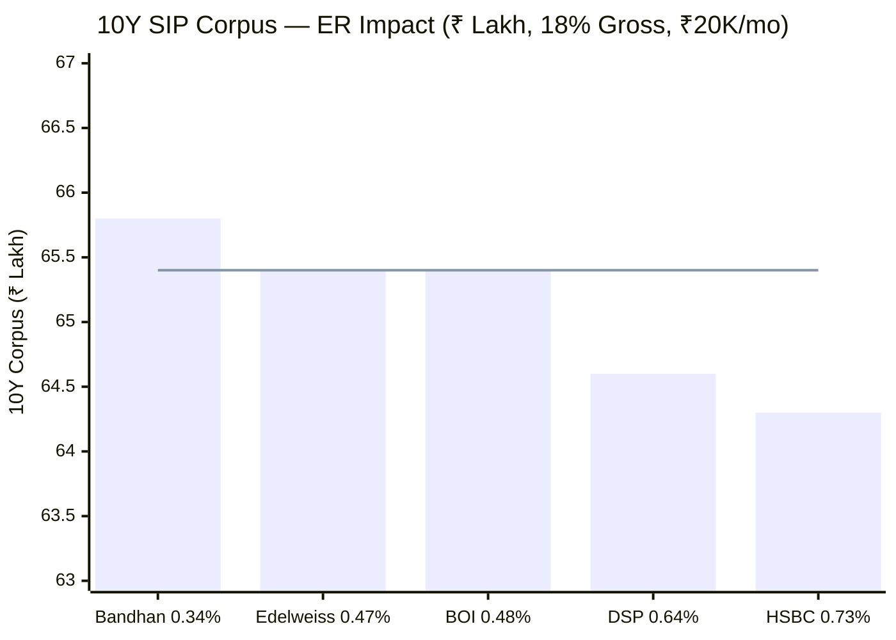
> Line = Edelweiss's corpus (~₹65.4L) | Tied 2nd with BOI, behind only Bandhan; ahead of DSP and HSBC.

| Fund | Direct ER | Net CAGR | 10Y Corpus | vs Edelweiss |
|------|-----------|----------|-----------|--------------|
| Bandhan Small Cap | 0.34% | 17.66% | ₹65.8L | +₹0.4L |
| **Edelweiss Small Cap** | **~0.47%** | **17.53%** | **~₹65.4L** | — |
| BOI Small Cap | ~0.48% | 17.52% | ₹65.4L | ≈ tied |
| DSP Small Cap | 0.64% | 17.36% | ₹64.6L | −₹0.8L |
| HSBC Small Cap | 0.73% | 17.27% | ₹64.3L | −₹1.1L |

**On identical gross returns, Edelweiss's lower ER hands the investor ~₹0.8L more than DSP and ~₹1.1L more than HSBC over a 10-year ₹20K SIP** — purely from cost. At ₹50,000/month these gaps scale 2.5× (≈ +₹2.0L vs DSP, +₹2.75L vs HSBC). The caveat from M1/M2 still applies in the other direction: Edelweiss's *gross* alpha has been thin recently (3Y IR ~0), so it cannot count on out-earning peers on gross return — but it is no longer giving any of it back on cost.

---

## Direct vs Regular Plan — A Moderate Gap (~1.36%)

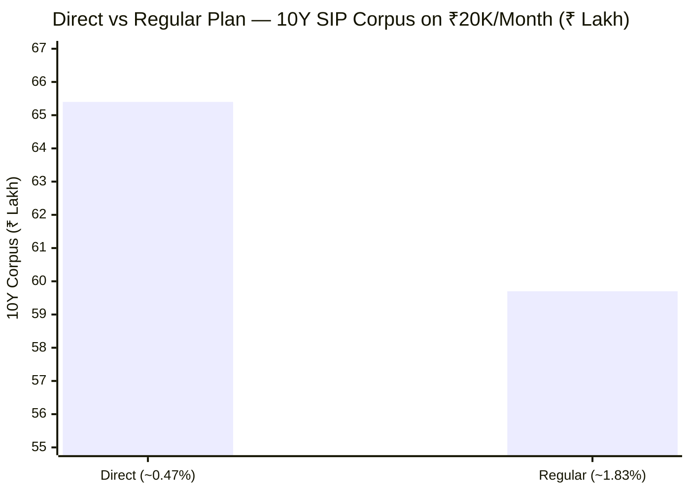

| Plan | ER | Net CAGR | 10Y Corpus | Lost to Distributor |
|------|----|----------|-----------|---------------------|
| **Direct** | **~0.47%** | **~17.53%** | **₹65.4L** | — |
| Regular | ~1.83% | ~16.17% | ~₹59.7L | **~₹5.7L** |

**~₹5.7 lakh** — roughly 24% of the ₹24 lakh principal — is surrendered to distribution commission by choosing Regular over Direct. Same fund, same 92 stocks, same managers; only the purchase route differs.

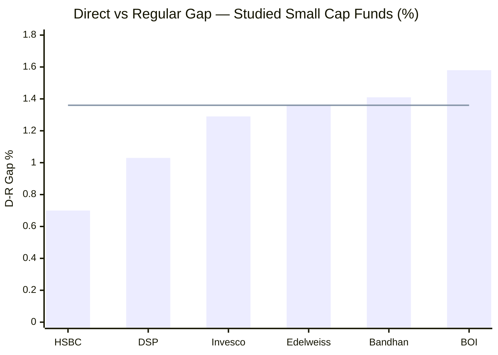
> Line = Edelweiss's D-R gap (~1.36%) — mid-pack; narrower than BOI (1.58%) and Bandhan (1.41%).

**Edelweiss's ~1.36% D-R gap is mid-pack** — narrower than BOI's (1.58%, the study's widest) and Bandhan's (1.41%), wider than DSP's (1.03%) and HSBC's (0.70%). The regular plan (~1.83%) is high in absolute terms but not egregiously so, and the gap is materially better than BOI's. As with all funds, **going Direct is the right choice** — the ~₹5.7L penalty over a 10Y SIP is substantial — but the penalty for *not* doing so is less severe than for BOI.

**ER savings at different SIP amounts (Direct vs Regular):**

| SIP Amount | 10Y Direct Corpus | 10Y Regular Corpus | Saved in Direct |
|-----------|-------------------|--------------------|-----------------|
| ₹10,000/mo | ₹32.7L | ₹29.9L | **₹2.8L** |
| **₹20,000/mo** | **₹65.4L** | **₹59.7L** | **₹5.7L** |
| ₹30,000/mo | ₹98.1L | ₹89.6L | **₹8.5L** |
| ₹50,000/mo | ₹163.5L | ₹149.3L | **₹14.2L** |

**How to access Direct Plan:** Edelweiss MF website (edelweissmf.com), MF Central, Zerodha Coin, Kuvera, Groww Direct, INDmoney, Paytm Money — all zero-commission.

---

## ⭐ Exit Load — The 90-Day Window (Investor-Friendly) *(Edelweiss-specific)*

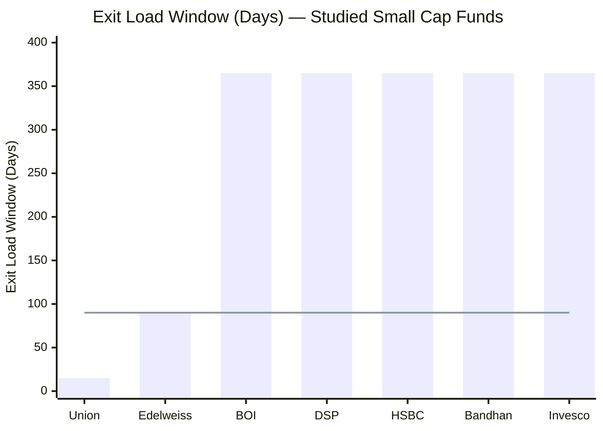
> Line = Edelweiss's 90-day window | 2nd-shortest (most investor-friendly) of the study, after only Union (15 days).

**Edelweiss's exit load (per the official SID): 1% if redeemed/switched within 90 days of allotment; nil thereafter.** This is materially more flexible than the **365-day** structure used by BOI, DSP, HSBC, Bandhan and Invesco — and is the **2nd-friendliest of the study, behind only Union's 15-day window.**

| Fund | Exit Load | Window |
|------|-----------|--------|
| Union | 1% | 15 days |
| **Edelweiss** | **1%** | **90 days** |
| BOI / DSP / HSBC / Bandhan / Invesco | 1% | 365 days |

**For a 10-year SIP investor** this is essentially irrelevant — every instalment ages past 90 days long before redemption. But for an investor who may need *partial liquidity* mid-tenure (an emergency withdrawal, a rebalance), the 90-day window means units become penalty-free in three months rather than a year — a genuine, if minor, flexibility edge.

---

## ⭐ The AUM Sweet Spot as a Cost & Execution Edge *(Edelweiss-specific)*

Where BOI's M4 strength was *nimbleness* (smallest AUM) and DSP/HSBC's M4 weakness was *scale*, Edelweiss occupies the **Goldilocks middle** — and on a risk-adjusted basis this is arguably the best AUM position of all.

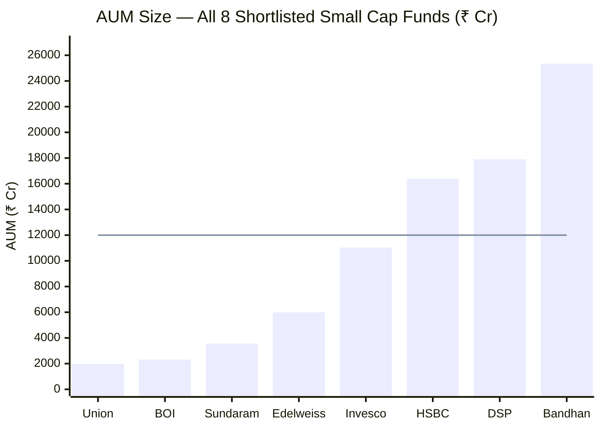
> Line = ~₹12,000 Cr threshold above which small-cap deployment friction bites. Edelweiss (~₹6,000 Cr) sits comfortably below it — and comfortably above the sub-₹2,500 Cr zone where redemption fragility bites.

| Dimension | Edelweiss (~₹6,000 Cr) | BOI (₹2,318 Cr) | DSP (₹17,906 Cr) |
|-----------|------------------------|------------------|------------------|
| 1% position requires | ~₹60 Cr | ~₹23 Cr | ₹179 Cr |
| Clean entry/exit time | **2–5 days** | 1–3 days | 10–15 days |
| Deployment friction | **Low (frictionless)** | None | Significant |
| Monthly inflow absorption | **Effortless** | Trivial | ₹200–350 Cr backlog |
| Redemption-wave vulnerability | **Low** | **High (smallest)** | Moderate |
| Forced-buyer dynamics | **None** | None | Queue (8.4% cash) |

**Edelweiss has the best all-round AUM position of the deeply-studied funds.** At ~₹6,000 Cr it is:
- **Small enough for frictionless execution** — a ₹60 Cr position is built/unwound in days with negligible market impact; no DSP/HSBC-style scale drag, no forced-buyer dynamics
- **Large enough for stability** — no BOI-style smallest-AUM redemption fragility (BOI's single biggest structural risk, flagged across M1–M3)

BOI is *nimbler* (₹23 Cr positions), but that smallness is simultaneously its greatest vulnerability. Edelweiss trades a little nimbleness for genuine robustness — and combined with its low turnover (below), its true execution costs are among the lowest in the study *without* the fragility. This is the cost-and-execution expression of the M3 finding that Edelweiss has the most redemption-resilient book of the group.

---

## ⭐ The Deep-AMC Advantage — Fixing BOI's Central Weakness *(Edelweiss-specific)*

BOI's M4 was held below 4.0 chiefly by its **tiny AMC** (~₹12,000 Cr), whose thin fund revenue (~₹13–15 Cr) constrained research depth. **Edelweiss is the direct antidote.**

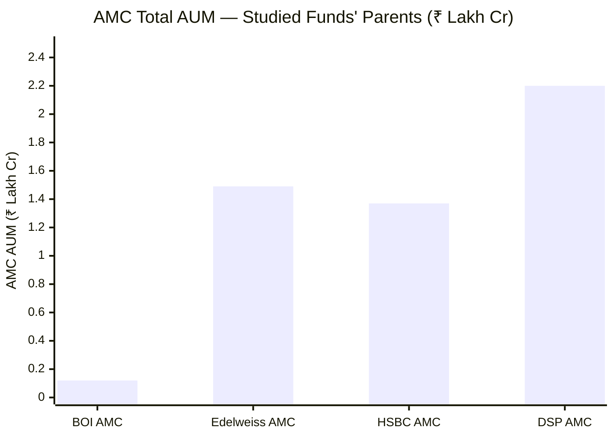

| Dimension | Edelweiss | BOI | DSP | HSBC |
|-----------|-----------|-----|-----|------|
| AMC total AUM | **~₹1,49,382 Cr** | ~₹12,000 Cr | ₹2,20,000 Cr | ₹1,36,788 Cr |
| AMC schemes | 53 | ~19 | 65 | 122 |
| Est. revenue (this fund) | **~₹28–30 Cr** | ~₹13–15 Cr | ~₹179 Cr | ~₹170 Cr |
| Research-funding capacity | **Solid (mid-large)** | Constrained | Deep | Deep (+ global) |
| Institutional depth | **Strong** | Weak | Deep | Deep |

**Edelweiss AMC is roughly 12× the size of BOI's** — a genuinely deep, well-resourced mid-large platform (₹1.49 lakh Cr, comparable to HSBC's AMC and above the median Indian AMC). Estimated fund revenue of **~₹28–30 Cr** (roughly double BOI's) supports proper research coverage of the 92-stock book. Where BOI's cheap, nimble fund sat on a *fragile* institutional base — the chief reason its M4 stopped at 3.9 — **Edelweiss pairs the same low cost with a robust one.** The institutional depth is a *strength* here, not an offsetting weakness. (Full AMC governance analysis — ownership, regulatory record, skin-in-game — is reserved for Module 6.)

---

## ⭐ Manager Bandwidth — Moderate and Shared *(Edelweiss-specific)*

BOI's other M4 drag was lead manager Alok Singh's extraordinary **23-scheme** load — the sharpest attention-dispersion risk of any studied fund. Edelweiss is materially better positioned on both count and structure.

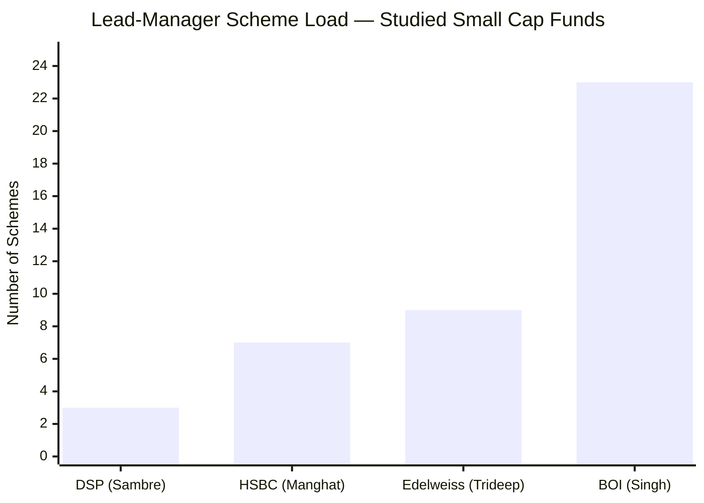

| Manager | Schemes | Co-managers on this fund | Bandwidth |
|---------|---------|--------------------------|-----------|
| Vinit Sambre (DSP) | 3 | 1 | High focus |
| Venugopal Manghat (HSBC) | 7 | 1 | Medium |
| **Trideep Bhattacharya (Edelweiss)** | **~9** | **2 (Koradia + Bhatia)** | **Moderate, shared** |
| Alok Singh (BOI) | 23 | 1 | Spread very thin |

**Trideep runs ~9 schemes as CIO–Equities** — comparable to HSBC's Manghat, and far below BOI's Singh (23). Critically, **Edelweiss Small Cap has *two* co-managers** (Raj Koradia and the ex-BOI Dhruv Bhatia) sharing the day-to-day load — a three-person team versus BOI's effectively solo lead. The attention-dispersion risk that capped BOI's M4 is substantially mitigated here. (The *quality* and tenure of this team — including Bhatia's small-cap pedigree and Trideep's CIO key-person role — is a Module 5 question; for cost/bandwidth purposes, the structure is favourable.)

---

## True All-In Cost — Among the Lowest, and a Point Estimate

Because Edelweiss **discloses** its turnover (unlike BOI), the true all-in cost — stated ER plus hidden transaction/market-impact costs — can be pinned to a point estimate rather than a range:

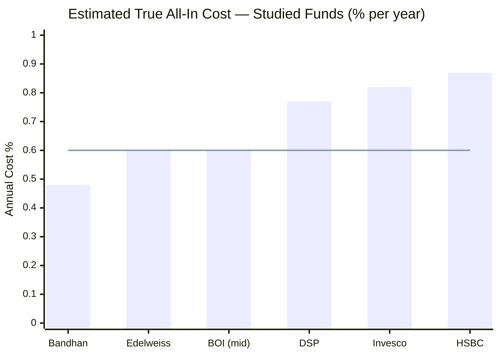
> Line = Edelweiss central estimate (~0.60%) | Among the lowest of the study, alongside BOI and below DSP/Invesco/HSBC.

| Fund | Stated Direct ER | Turnover | Hidden Costs (est.) | True All-In |
|------|-----------------|----------|--------------------|-----------| 
| Bandhan SC | 0.34% | ~52% | ~0.14% | ~0.48% |
| **Edelweiss SC** | **~0.47%** | **~25–28%** | **~0.10–0.15%** | **~0.57–0.62%** |
| BOI SC | ~0.48% | undisclosed | ~0.05–0.20% | ~0.53–0.68% |
| DSP SC | 0.64% | ~20% | ~0.13% | ~0.77% |
| Invesco SC | 0.59% | ~29% | ~0.23% | ~0.82% |
| HSBC SC | 0.73% | ~31% | ~0.14% | ~0.87% |

**Edelweiss's true all-in cost (~0.60%) is among the lowest of the study** — comparable to BOI's midpoint, and well below DSP (0.77%), Invesco (0.82%) and HSBC (0.87%). The low turnover (25–28%) keeps hidden transaction costs modest, and the sweet-spot AUM means market-impact costs are low (₹60 Cr positions in reasonably liquid smid names trade cleanly). Combined with the disclosed figure, this is a *confident* low-cost reading — Edelweiss is genuinely cheap on a total-cost basis, not just on the headline ER.

---

## Flow Management — Comfortable, No Restriction Needed

At ~₹6,000 Cr, Edelweiss is **well within its capacity** — neither near the ~₹12,000 Cr deployment-friction zone nor at BOI's redemption-fragility floor. It has **never restricted flows**, and at its current size none is needed.

| Fund | Flow-Management Posture |
|------|------------------------|
| DSP | **Proven discipline** — closed 3× (2014–2020) to protect investors |
| **Edelweiss** | **Comfortable** — within capacity; no restriction needed; no track record either way |
| BOI | None needed (too small); revenue incentive leans against future gating |
| HSBC | **Governance gap** — never closed despite scaling to ₹16,394 Cr |

Unlike DSP, Edelweiss has **no *proven* track record** of investor-first flow gating — but unlike HSBC, it has not *failed* the test either, because it has never approached the capacity zone. The forward watch-item is milder than BOI's: Edelweiss has ~₹6,000 Cr of headroom before the ~₹12,000 Cr friction zone, and a deep AMC less dependent on this single fund's AUM growth (reducing the perverse "keep-the-doors-open" incentive that worries the BOI case). Monitor AUM, but the runway is comfortable.

---

## 8-Fund Cost & AUM Comparison Matrix

| Metric | **Edelweiss SC** | BOI SC | DSP SC | HSBC SC | Bandhan SC | Invesco SC |
|--------|------------------|--------|--------|---------|------------|------------|
| Direct ER | **~0.47%** | ~0.48% | 0.64% | 0.73% | **0.34%** | 0.59% |
| ER Rank (studied) | **2nd (tied)** | 2nd (tied) | 5th | 6th | 1st | 4th |
| Regular ER | ~1.83% | ~2.07% | ~1.67% | ~1.43% | ~1.75% | ~1.88% |
| D-R Gap | **~1.36%** | 1.58% (widest) | 1.03% | **0.70% (narrowest)** | 1.41% | 1.29% |
| Exit Load | **1%/90d** | 1%/365d +10% free | 1%/365d | 1%/365d +10% free | 1%/365d | 1%/365d |
| AUM (₹ Cr) | **~6,000 (sweet spot)** | 2,318 | 17,906 | 16,394 | 25,346 | 11,038 |
| AUM as constraint | **None (Goldilocks)** | Advantage (fragile) | High | High | Severe | Low |
| 1% Position | ₹60 Cr | ₹23 Cr | ₹179 Cr | ₹164 Cr | ₹253 Cr | ₹110 Cr |
| Turnover | **25–28% (disclosed)** | Undisclosed | ~20% | ~31% | ~52% | ~29% |
| True All-In (est.) | **~0.57–0.62%** | ~0.53–0.68% | ~0.77% | ~0.87% | ~0.48% | ~0.82% |
| Min SIP | **₹100** | ₹1,000 | ₹100 | ₹500 | ₹1,000 | ₹1,000 |
| AMC Total AUM | **~₹1,49,382 Cr** | ~₹12,000 Cr | ₹2,20,000 Cr | ₹1,36,788 Cr | — | — |
| Mgr Schemes (lead) | **9 (+2 co-mgrs)** | 23 (most) | 3 | 7 | — | 4–5 |
| Flow Restriction History | None (comfortable) | None (too small) | 3 closures | None | None | None |
| M4 Score (this study) | **~4.0/5** | ~3.9/5 | 3.7/5 | 3.2/5 | ~3.3/5 | ~3.1/5 |

**Key observations:**
1. **Edelweiss matches BOI on the headline (ER ~0.47%) and beats it on every institutional dimension** — deep AMC, focused/shared management, narrower D-R gap, friendlier exit load, best-tier accessibility.
2. **Best all-round AUM position of the deeply-studied funds** — frictionless *and* robust; the only fund in neither the too-big (DSP/HSBC/Bandhan) nor too-small-fragile (BOI/Union) zone.
3. **True all-in among the lowest (~0.60%)** — disclosed turnover gives a confident estimate, unlike BOI's range.
4. **The only genuine offsets are regular-plan-facing** — D-R gap (~1.36%) and regular ER (~1.83%) — neither of which affects the Direct SIP investor.

---

## Points For / Points Against — Cost & AUM

### ✅ Points For

1. **ER reconciliation resolved — ~0.47%, tied 2nd-cheapest** (screening's 0.82% debunked); the cost objection to the thin-alpha profile is removed
2. **Best all-round AUM position (~₹6,000 Cr)** — frictionless execution *and* flow stability; no DSP/HSBC scale drag, no BOI redemption fragility
3. **Deep AMC (₹1.49 lakh Cr, 53 schemes)** — ~12× BOI's; solid research-funding capacity; fixes BOI's central M4 weakness
4. **Focused, shared management (lead 9 schemes + 2 co-managers)** — far less attention-dispersion than BOI's 23-scheme solo lead
5. **90-day exit load** — 2nd-friendliest of the study (after Union); penalty-free in 3 months vs the 365-day pack
6. **₹100 minimum SIP & lumpsum** — best-tier accessibility, ties DSP; far below BOI's ₹1,000
7. **Low, disclosed turnover (25–28%)** — true all-in ~0.60%, among the lowest; a confident point estimate (anti-BOI's gap)
8. **Cheap *and* 4★-rated** — the cost is not a quality compromise
9. **Comfortable flow headroom on a deep AMC** — milder "stay-small" risk than BOI; less perverse incentive to keep doors open

### ❌ Points Against

1. **Moderate D-R gap (~1.36%)** — regular-plan investors lose ~₹5.7L over a 10Y ₹20K SIP (though narrower than BOI's 1.58%)
2. **Regular ER ~1.83%** — on the higher side absolutely, ~0.16% below the SEBI ceiling
3. **No proven flow-management track record** — unlike DSP's 3 closures; untested on investor-first gating (though comfortable headroom makes this less pressing)
4. **Lacks BOI's raw execution nimbleness** — ₹60 Cr vs ₹23 Cr positions (a minor relative point, and offset by Edelweiss's lack of fragility)
5. **Regular-plan ER and D-R gap are the only cost negatives — both irrelevant to the Direct SIP investor this study targets**

---

## Module 4 Scorecard

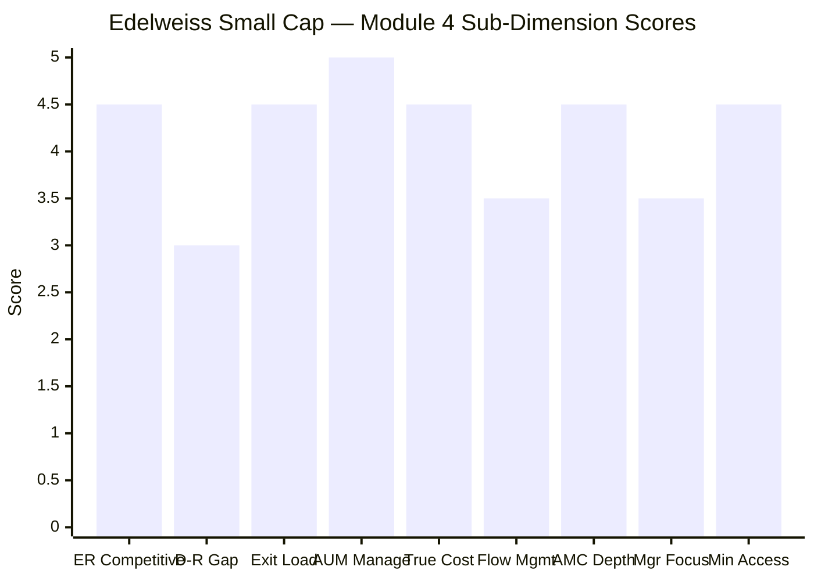

| Sub-Dimension | Score (1–5) | Reasoning |
|---------------|------------|-----------|
| Expense Ratio Competitiveness | **4.5** | ~0.47% — tied 2nd-cheapest of studied funds; screening 0.82% debunked; paired with 4★ rating |
| Direct vs Regular Gap | **3.0** | ~1.36% — mid-pack; narrower than BOI/Bandhan, wider than DSP/HSBC; regular ER 1.83% high-ish |
| Exit Load Structure | **4.5** | 1%/90d — 2nd-friendliest of study (after Union); penalty-free in 3 months |
| AUM Manageability | **5.0** | ~₹6,000 Cr Goldilocks — frictionless *and* robust; best all-round position of deeply-studied funds |
| True (Turnover-Adj) Cost | **4.5** | ~0.57–0.62% — among the lowest; disclosed turnover gives a confident point estimate |
| Flow Management | **3.5** | Comfortable headroom on a deep AMC; no restriction needed; no proven track record either way |
| AMC Institutional Depth | **4.5** | ₹1.49 lakh Cr / 53 schemes — ~12× BOI; solid research capacity; fixes BOI's weakness |
| Fund Manager Focus | **3.5** | Lead 9 schemes + 2 co-managers — moderate, shared; far better than BOI's 23 |
| Minimum Accessibility | **4.5** | ₹100 SIP & lumpsum — best tier, ties DSP |
| **Module 4 Overall** | **~4.0 / 5** | **The best cost & AUM profile of the studied small caps for a Direct investor.** ~0.47% ER (tied 2nd-cheapest), best all-round AUM position, deep AMC, focused/shared management, friendly exit load, best-tier accessibility, low disclosed turnover. Edelweiss *fixes the three institutional weaknesses that capped BOI* (small AMC, 23-scheme manager, widest D-R gap). Held just at 4.0 by a moderate D-R gap, a higher regular ER, and the absence of a proven flow-management history. |

---

## Comparative Module 4 Scores

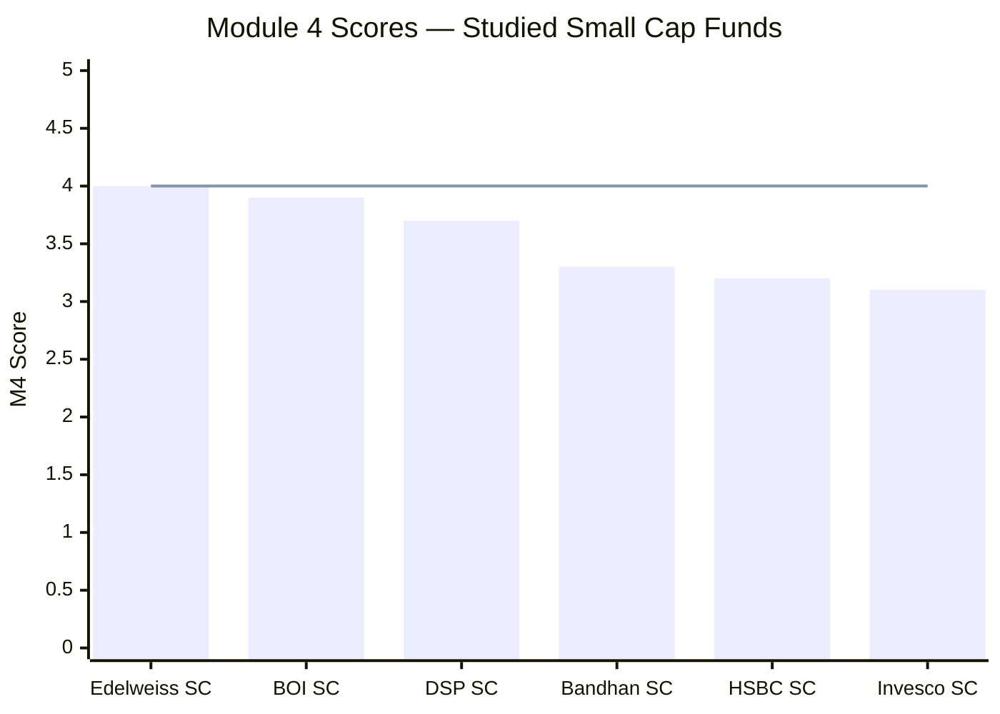
> Line = Edelweiss's M4 score (~4.0) — the highest of the studied small cap funds.

| Fund | Module 4 Score | Key Cost/AUM Differentiator |
|------|---------------|-----------------------------|
| **Edelweiss Small Cap** | **~4.0/5** | **~0.47% ER (tied 2nd) + best all-round AUM + deep AMC + focused team + 90d exit + ₹100 min; fixes BOI's institutional gaps** |
| BOI Small Cap | ~3.9/5 | 2nd-cheapest ER + nimblest execution; offset by small AMC, 23-scheme manager, widest D-R gap |
| DSP Small Cap | 3.7/5 | Best flow-management history (3 closures); deep AMC; but higher ER + large-AUM constraint |
| Bandhan Small Cap | ~3.3/5 | Cheapest ER (0.34%); but open-door at ₹25,346 Cr (severe AUM constraint) |
| HSBC Small Cap | 3.2/5 | Narrowest D-R gap; but most expensive ER, worst true all-in, zero flow management |
| Invesco Small Cap | ~3.1/5 | Decent ER + manageable AUM; lower AMC depth |

**Edelweiss takes the top M4 slot among the studied small caps — narrowly above BOI.** The logic: for a Direct-plan SIP investor (the target audience), Edelweiss offers the same headline ER as BOI but on a far more robust institutional base (deep AMC, focused/shared management) and with a better AUM-risk profile (no fragility), plus friendlier exit terms and accessibility. BOI's one clear edge — raw execution nimbleness — is partly self-cancelling (its smallness is also its biggest risk). DSP's 3.7 reflects its superior *proven* flow discipline, which genuinely matters but is offset by a higher ER and a constrained large AUM. **Edelweiss's M4 is its strongest module by a clear margin** — a striking contrast to its mid-pack M1/M2/M3 — and it materially improves the overall investment case by removing the cost objection that the thin-alpha finding would otherwise raise.

---

## One-Line Verdict

Edelweiss Small Cap offers the best cost-and-execution package of the studied small caps for a Direct-plan investor — a reconciled ~0.47% ER (tied 2nd-cheapest, not the 0.82% the screening implied), the best all-round AUM position (frictionless *and* robust at ~₹6,000 Cr), a deep ₹1.49-lakh-crore AMC, a focused three-person management team, a 90-day exit load, and ₹100 minimums — fixing every institutional weakness that capped BOI, and let down only by a moderate Direct–Regular gap and the absence of a proven flow-management history.

---

*Module 4 complete. Cost profile is the strongest of the studied small caps for a Direct SIP investor: ER ~0.47% (tied 2nd-cheapest; screening's 0.82% debunked), AUM sweet spot (~₹6,000 Cr — frictionless and robust), deep AMC (₹1.49 lakh Cr / 53 schemes), focused/shared management (lead 9 schemes + 2 co-managers), 90-day exit load (2nd-friendliest), ₹100 minimums, low disclosed turnover (25–28%), true all-in ~0.60%. Offsets: moderate D-R gap (~1.36%), higher regular ER (~1.83%), no proven flow-management history. Module 4 score: ~4.0/5 — the highest of the studied small caps.*

*Next: [Module 5 — Fund Manager Quality](module5_manager.md)*
