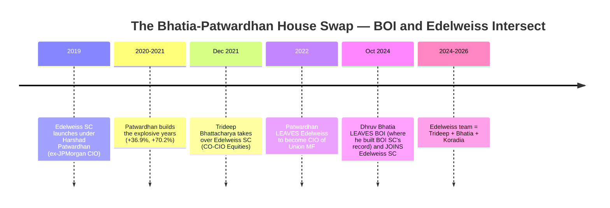
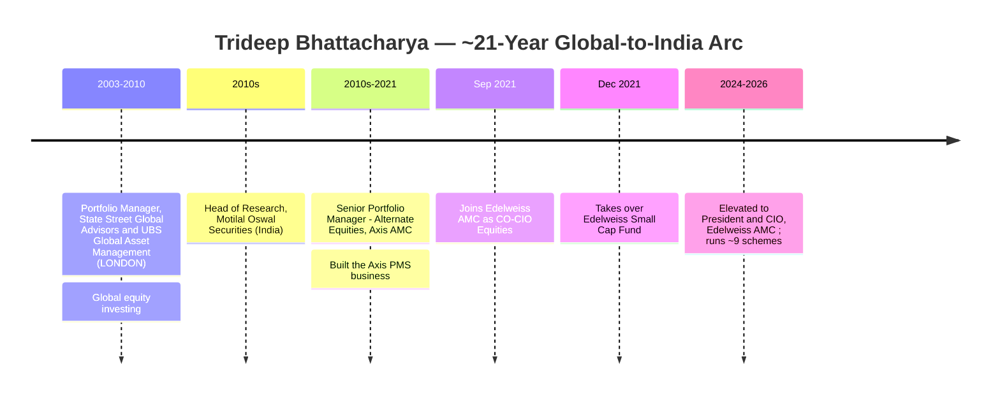
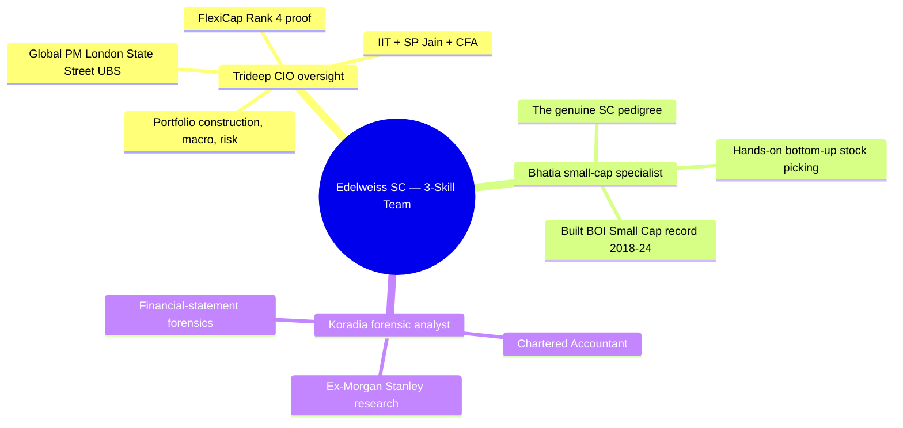
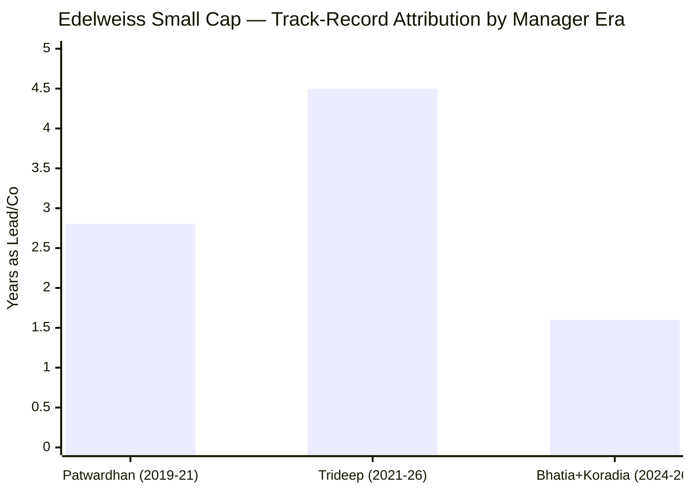
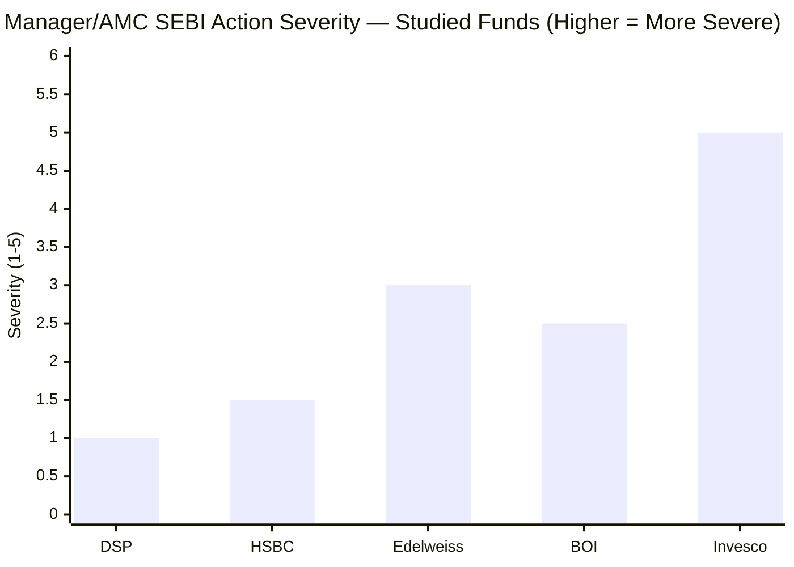
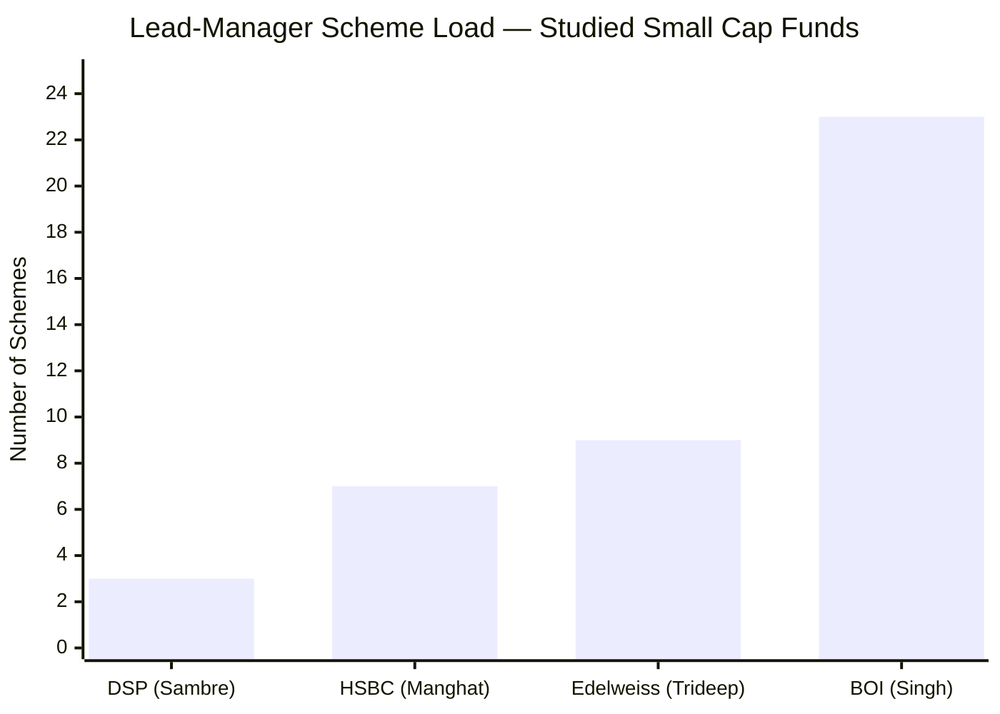
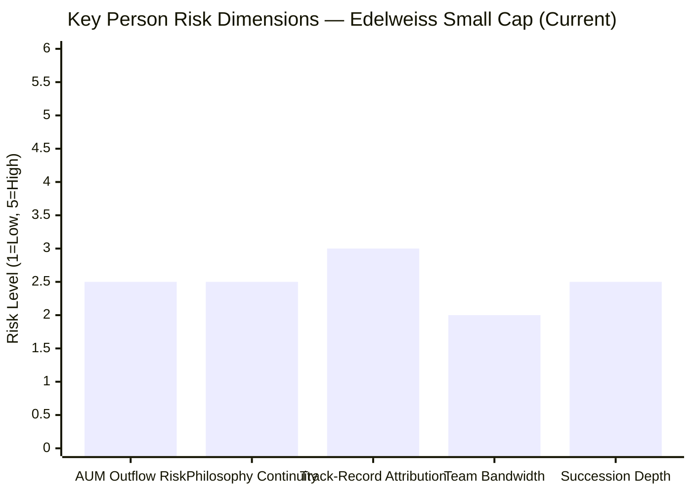
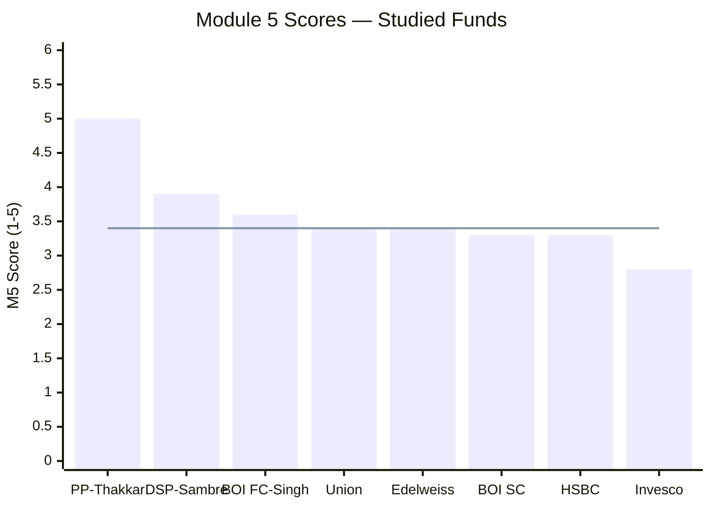
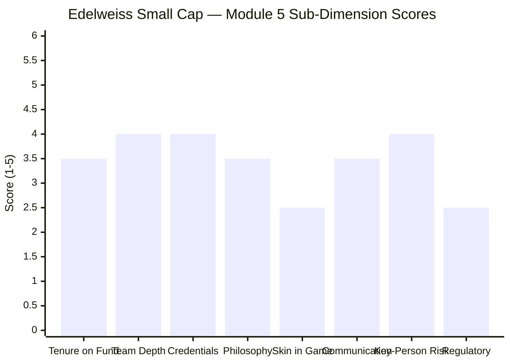

# Module 5: Fund Manager Quality — Edelweiss Small Cap Fund

*Sources: Edelweiss MF official (edelweissmf.com — factsheets, SAI, team page) | Morningstar / Cafemutual / BW People (Trideep Bhattacharya CO-CIO appointment, Sep 2021) | LinkedIn (Trideep Bhattacharya, Dhruv Bhatia, Raj Koradia career histories) | Finalyca / Paytm Money / ICICIdirect fund-manager databases | The Org / ZoomInfo (Bhatia, Koradia roles) | Business Standard / Cafemutual (SEBI ₹16L order, Oct 2024) | Value Research (manager-change records) | companion FlexiCap study (Trideep) + BOI Small Cap Module 5 (Bhatia, Patwardhan) | Web research, June 2026.*

---

## Module 5 Score: ~3.5 / 5 (revised) — A Deep, Well-Credentialed Team, Capped by a Manager-Level SEBI Mark and a Defensively-Earned Record

> **⚠ Retrofit correction (Jul 6, 2026 — from the MidCap study):** This module's "thin-alpha / defensive-not-alpha" characterization was based on the beta-adjusted **information ratio (IR ≈ 0)**. The later MidCap study computed Trideep's alpha the study-canonical way — vs the **matched investable Nifty Smallcap-250 index fund** (the "why not the index fund?" benchmark) — and found **+2.61%/yr genuine outperformance** over his Oct-2021→Jul-2026 tenure, earned **defensively** (up-capture 84 / down-capture 67). The same computation across all three funds he runs (**+3.18% FlexiCap, +2.92% MidCap, +2.61% SmallCap**) shows a **consistent, protection-tilted index-beating record, not "thin alpha."** The correct characterization is **genuine-but-defensively-earned alpha** (positive vs the buyable index; modest IR) — not "flat excess return." **Score revised 3.4 → 3.5** (the SEBI-mark and departed-Patwardhan caps still stand; the "thin-alpha" cap is downgraded to a "defensive-style" note). Where the scorecard rows and comparative tables below predate this correction and read "3.4 / thin alpha," read **"3.5 / defensively-earned alpha."** *(The fund's overall SmallCap score & README should be nudged correspondingly — flagged, not yet applied.)*

Module 5 is where Edelweiss's manager story diverges most sharply — and most favourably — from BOI's. Where BOI Small Cap is the study's cautionary **"carousel"** (both architects departed, one *to Edelweiss*), **Edelweiss is the mirror image: a net *recipient* of small-cap talent.** It lost its launch manager (Harshad Patwardhan, who built the explosive 2020–21 years and left to become Union MF's CIO) but kept a **proven CIO (Trideep Bhattacharya, ~4.5 years on the fund, Edelweiss Flexi Cap Rank #4)** and, in October 2024, **gained BOI Small Cap's own architect — Dhruv Bhatia.** The result is the **best-rounded credential mix of any studied team**: CFA/global-CIO oversight (Trideep) + hands-on small-cap pedigree (Bhatia) + CA forensics (Raj Koradia), on the deepest AMC backing of the deeply-studied funds (Module 4).

Three things cap the score at ~3.5 rather than higher: **(1) a personal SEBI penalty against lead manager Trideep Bhattacharya** (₹4 lakh, for a focused-fund 30-stock-limit breach) — a direct mark that DSP's Sambre and HSBC's Manghat do not carry; **(2) what Trideep has demonstrated *on this fund* is genuine-but-defensively-earned alpha** — positive vs the buyable Smallcap-250 index fund (+2.61%/yr, up-84/down-67) but with a modest information ratio (Modules 1–2), i.e. protection-led rather than high-IR differentiated selection; and **(3) the fund's explosive early years (2020–21) belong to the departed Patwardhan.** The deep team lifts Edelweiss above BOI/HSBC (3.3); the SEBI mark and defensive-style record keep it below DSP (3.9). Net: **~3.5** (revised from 3.4 post-retrofit), level-to-just-above Union.

---

## What Module 5 Is Really Asking

Mutual-fund returns are the output; the manager is the machine. Module 5 asks: who runs this machine, why trust them with ₹20,000/month for a decade, and what happens if they leave?

For Edelweiss the answers are **structurally more reassuring than BOI's but more ambiguous than DSP's.** Unlike BOI — whose celebrated record was built entirely by departed managers — Edelweiss's *current* lead (Trideep) has run the fund for 4.5 years and owns most of its calendar history. But what he owns is the **defensive era** — genuine alpha vs the buyable index (+2.61%/yr, per the retrofit note) earned through protection (up-84/down-67) rather than high-IR differentiated selection; the high-octane years belong to a manager now at a competitor. And uniquely among the studied leads, Trideep carries a personal SEBI penalty. The central Module 5 question for Edelweiss is therefore: **is this deep, well-credentialed team a genuine alpha engine, or a competent CIO running a defensive book who has just imported a specialist to sharpen it?** The honest answer: **a genuine, if defensively-earned, index-beater — with the Bhatia upgrade still unproven.**

---

## ⭐ The Anti-Carousel — Talent In-Flow, Not Out-Flow *(Edelweiss-specific)*

This is the defining Module 5 finding, and the exact inverse of BOI's. The two funds' manager histories are **mirror images that literally intersect:**

| Dimension | BOI Small Cap | Edelweiss Small Cap |
|-----------|---------------|---------------------|
| Launch architect | Manghani + **Bhatia** (2018–24) | **Patwardhan** (2019–21) |
| Where they went | Manghani → Trust MF; **Bhatia → Edelweiss** | **Patwardhan → Union MF (CIO)** |
| Net talent flow | **Lost both architects** | **Gained Bhatia (BOI's architect)** + kept proven CIO |
| Current lead tenure | Singh, ~20 months | **Trideep, ~4.5 years** |
| M5 verdict | "Carousel" (out-flow) | **"Anti-carousel" (in-flow)** |

**The cleanest cross-fund irony in the study:** the manager who built BOI's record (Bhatia) and the manager who built Edelweiss's launch years (Patwardhan) effectively **swapped houses** — Bhatia BOI→Edelweiss, Patwardhan Edelweiss→Union. Edelweiss emerged a **net winner on small-cap talent**, and its current lead has **2.7× the on-fund tenure** of BOI's Singh. For an investor weighing BOI vs Edelweiss, this is decisive context: *the hands-on architect of BOI's celebrated record now sits on the Edelweiss side of the table* (the same point flagged from the BOI side in BOI's Module 5).

---

## The Three Managers — Profiles

### Trideep Bhattacharya — Lead / President & CIO (since 24-Dec-2021, ~4.5 yrs on fund)

| Attribute | Detail |
|-----------|--------|
| Role | President & CIO, Edelweiss AMC; lead manager, Edelweiss Small Cap since 24-Dec-2021 |
| Experience | ~21 years, Indian + **global** |
| Education | **B.Tech Electrical Engineering (IIT Kharagpur) + MBA Finance (SP Jain) + CFA charterholder** |
| Career | State Street Global Advisors + **UBS Global Asset Management (London)** → Head of Research, Motilal Oswal → Senior PM Alternate Equities (PMS), Axis AMC → Edelweiss CO-CIO (2021) → President & CIO |
| Schemes managed | ~9 (CIO load — moderate) |
| Cross-fund proof | **Edelweiss Flexi Cap — Rank #4 (3.77/5)** in the companion FlexiCap study |
| Regulatory | **SEBI ₹4 lakh penalty (Oct 2024)** — see dedicated section |

Trideep holds **arguably the strongest academic pedigree of any studied small-cap lead** — IIT Kharagpur + SP Jain + CFA — and is the only one with genuine **global portfolio-management experience** (London, at two top-tier institutions). His career arc is *large-cap / global / PMS*, capped by a CIO role — **not** a bottom-up small-cap specialist's path. He took over the Small Cap fund in December 2021 and now serves as the AMC's President & CIO.

### Dhruv Bhatia — Co-Manager (since 14-Oct-2024, ~20 months) — *the ex-BOI architect*

| Attribute | Detail |
|-----------|--------|
| Role | Co-manager, Edelweiss Small Cap since 14-Oct-2024 |
| Education | PGDM Finance (SIES College) + BMS (MMK College) — modest academic tier |
| Career | **Bank of India Investment Managers** (Asst FM → Manager-Research → Fund Manager) — *co-built BOI Small Cap 2018–22, sole lead 2022–24*; before that Research Analyst, Sahara MF (consumer/auto/tech/media) |
| Significance | **The genuine small-cap hands-on specialist on the team** — the architect of BOI Small Cap's celebrated 2018–2024 record (per BOI's Module 5) |

Bhatia's academic credentials are modest, but his **hands-on small-cap track record is the most relevant of any recent hire in the study**: he is the manager whose stock selection powered BOI Small Cap through its best years. His arrival in October 2024 is the single most important *forward* signal in Edelweiss's manager picture (developed below).

### Raj Koradia — Co-Manager / Assistant FM (since 01-Aug-2024)

| Attribute | Detail |
|-----------|--------|
| Role | Assistant Fund Manager / co-manager, Edelweiss Small Cap since 01-Aug-2024 |
| Education | **Chartered Accountant (CA)** + B.Com (Mumbai University) |
| Experience | ~7 years, age ~29 |
| Career | Edelweiss Securities (Research Associate, 2017–19) → Morgan Stanley analyst via Optimum Infosystem (2020–23) → First Voyager Advisors (2023–24) → Edelweiss AMC (Jul 2024) |
| Significance | Young and junior — but the **CA brings forensic-accounting skill** (the FCA-type depth BOI's Singh lacked) |

Koradia is the junior member — first AFM role, only ~7 years' experience — but his **CA qualification adds genuine financial-statement-forensics capability** to the team, valuable in the governance-risky small-cap universe.

---

## ⭐ The Three-Skill Team — The Best Credential Mix of the Studied Funds *(Edelweiss-specific)*

Read together, the three managers form the **most complementary, best-rounded team of any studied fund** — each covering a different competency:

| Competency | Who provides it | Studied-peer comparison |
|------------|-----------------|------------------------|
| CIO oversight / portfolio construction / global macro | **Trideep (CFA, global PM)** | Stronger global pedigree than Singh/Manghat/Badshah |
| Bottom-up small-cap stock selection | **Bhatia (built BOI's record)** | The hands-on SC specialist BOI's Singh is *not* |
| Financial-statement forensics | **Koradia (CA)** | The FCA-type skill BOI lacked; matches Union's two-CA edge |

**No other studied team combines all three.** DSP's Sambre (FCA) is a one-man forensic-and-stock-picking specialist; BOI's Singh is a CIO-generalist without forensic depth or a hands-on SC specialist alongside; HSBC's Manghat runs a co-manager carousel. Edelweiss's three-person structure — proven CIO + small-cap architect + CA forensic — is, on paper, the **deepest and best-balanced bench in the small-cap study.** The caveats are tenure (Bhatia/Koradia both joined mid-2024) and that the *quality* of this combination is still unproven over a full cycle together.

---

## ⭐ The Patwardhan Seam — A Smaller Attribution Gap Than BOI's *(Edelweiss-specific)*

Like BOI, Edelweiss has an attribution seam — but a **materially smaller one.**

| Period | Lead | Calendar years | Status today |
|--------|------|----------------|--------------|
| Feb 2019 – Dec 2021 | **Harshad Patwardhan** | 2019 +12.6%, **2020 +36.9%**, **2021 +70.2%** | **Left → Union MF CIO** |
| **Dec 2021 – present** | **Trideep Bhattacharya** | 2022 +3.4%, 2023 +44.3%, 2024 +26.8%, **2025 −1.1%**, 2026 YTD +5.5% | **Current lead — ~4.5 years** |
| Aug/Oct 2024 – present | + Raj Koradia + Dhruv Bhatia | — | Current co-managers |

**The attribution verdict — and the contrast with BOI:**
- **Trideep owns ~4 of the 7 calendar years (2022–2025), including the best-in-group 2025 defensive result** — a far larger share of the record than BOI's Singh (who built *none*).
- Only the **explosive 2020–21 years (+36.9%, +70.2%)** belong to the departed Patwardhan.
- **The catch:** the years Trideep owns are precisely the **thin-alpha, defensive era** (3Y IR ≈ 0, from Modules 1–2). So his ownership of the record is *real and substantial* but demonstrates **excellent downside protection, not outperformance.** Patwardhan's era was the high-octane one.

**Net read:** Edelweiss's attribution seam is *smaller and more favourable* than BOI's — the current lead genuinely owns most of the fund's history. But what that history shows under him is defense, not alpha. The seam is about *what kind* of record Trideep built, not (as with BOI) *whether he built any of it.*

---

## ⭐ Generalist CIO + Specialist Co-Manager — The Structural Read on the Thin Alpha *(Edelweiss-specific)*

A subtle but important insight ties Module 5 back to the thin-alpha finding of Modules 1–3:

**Trideep's pedigree is large-cap / global / PMS — *not* small-cap-specialist.** His formative roles (State Street, UBS London, Axis PMS, Motilal research) were in global and large-cap mandates and portfolio-management/research leadership, not bottom-up small-cap stock-picking. The Module 3 portfolio (diffuse, smid-tilted, quality-defensive, more-consensus) and the thin small-cap alpha (Module 2 IR ≈ 0) are **exactly what one would expect from a CIO-generalist running a risk-controlled, diversified book** — rather than a hungry small-cap specialist hunting differentiated micro-caps (the BOI/Bhatia approach).

This reframes **the Bhatia hire (Oct 2024) as potentially the most important forward signal in the fund:**

| The gap | The fix |
|---------|---------|
| Trideep is a generalist CIO; his SC book is defensive/thin-alpha | Edelweiss imported **Bhatia — the actual small-cap specialist** who built BOI's differentiated, high-IR book |
| The thin alpha is a *structural* feature of a generalist-run diffuse book | Bhatia's hands-on bottom-up pedigree could **inject the stock-selection depth** the book lacks |
| But: Bhatia is only ~20 months in | The effect is **not yet visible** in the numbers; it's a forward bet, not a track record |

**The honest synthesis:** Edelweiss appears to have *recognised* its own thin-alpha gap and addressed it by hiring the specialist (Bhatia) to complement the generalist (Trideep). It is a *plausible and well-targeted* fix — but unproven. If Bhatia's influence grows and the differentiation/IR improves over 2026–28, the defensive-but-thin-alpha profile could evolve into defensive-*and*-alpha-generating. Until then, the team must be judged on what Trideep has demonstrated: **best-in-group downside protection, flat excess return.**

---

## ⭐ The Trideep SEBI Penalty — A Manager-Level Yellow Flag *(Edelweiss-specific)*

This is the finding that most directly caps Edelweiss's Module 5 score, and the clearest negative contrast with BOI (whose lead, Singh, is personally clean).

> **SEBI imposed a total ₹16 lakh penalty on Edelweiss AMC (Oct 2024): ₹8 lakh on the AMC, ₹4 lakh on CEO Radhika Gupta, and ₹4 lakh on fund manager Trideep Bhattacharya. The Edelweiss Focused Equity Fund breached the 30-stock regulatory limit for a focused fund on 88 occasions (Nov 2022 – Feb 2023).**

| Entity | SEBI Issue | Amount | Character |
|--------|-----------|--------|-----------|
| **Trideep Bhattacharya (personal)** | Lead manager of a focused fund that **exceeded the 30-stock cap on 88 occasions** | **₹4 lakh** | **Compliance/portfolio-construction breach — direct mark on the lead manager** |
| Edelweiss AMC | Same matter | ₹8 lakh | AMC-level oversight failure |
| CEO Radhika Gupta | Same matter | ₹4 lakh | Governance (→ Module 6) |
| *(For comparison)* Alok Singh (BOI) | None — personally clean | ₹0 | The BOI ₹10L was an *operations* officer's insider-redemption |
| *(For comparison)* Sambre (DSP) / Manghat (HSBC) | None personal | ₹0 | AMC-level procedural fines only |

**Character assessment — a *moderate* yellow flag:**
- It is a **compliance / portfolio-construction breach** (a focused fund holding more than 30 stocks), **not** fraud, insider-trading, front-running, or investor-harm. In *ethical* character it is less serious than BOI's ₹10L (an operations officer redeeming his own units on non-public information) and far less serious than Invesco's ₹4.98 Cr (investor-harm settlement).
- **But it is a *direct* mark on the lead manager** — Trideep is personally named and penalised. DSP's Sambre and HSBC's Manghat carry no personal SEBI action; BOI's Singh is personally clean. This is the one dimension where Edelweiss's lead is *worse* than the BOI/DSP/HSBC leads.
- It signals a **process-discipline lapse**: a CIO allowing a focused fund to breach its mandated stock cap 88 times over four months is an oversight failure, even if benign in intent.

**The net:** a genuine, if moderate, negative — enough to cap the score, not enough to be disqualifying. It is the principal reason Edelweiss's otherwise-strong team does not score in the 3.5–3.6 range. (The CEO's involvement is an AMC-governance item carried to Module 6.)

---

## Credentials in Context

| Manager | Qualification | Interpretation |
|---------|--------------|----------------|
| Rajeev Thakkar (PP) | FCA (ICAI) | Deepest accounting forensics |
| Vinit Sambre (DSP) | FCA (ICAI) | Same — critical for SC governance risk |
| **Trideep (Edelweiss, lead)** | **B.Tech IIT-KGP + MBA SP Jain + CFA** | **Strongest academic pedigree of SC leads; global PM experience; no FCA forensics** |
| **Raj Koradia (Edelweiss, co)** | **CA + B.Com** | **Adds forensic-accounting depth to the team (the FCA-type skill)** |
| Alok Singh (BOI) | CFA + PGDBA | Quant/institutional; no FCA; fixed-income roots |
| Venugopal Manghat (HSBC) | MBA + B.Sc Math | Strategic finance; no FCA |

**Trideep's IIT + SP Jain + CFA is the strongest individual academic credential among the small-cap leads** — and uniquely backed by global portfolio-management experience (London). Like most peers he lacks the FCA forensics depth that defines Sambre/Thakkar — **but the team compensates via Koradia's CA**, giving Edelweiss the financial-statement-forensics capability that BOI's team lacks entirely. On a *team* credential basis, Edelweiss is second only to DSP among the small-cap funds.

---

## Cross-Fund Performance — The FlexiCap Proof (Positive Counterweight)

The strongest evidence for Trideep is **not** on this fund — it is on his flagship:

| Fund | Trideep's Role | Study Result | Signal |
|------|---------------|--------------|--------|
| **Edelweiss Flexi Cap** | Lead (since 2021) | **Rank #4 of 9 (3.77/5)** in the FlexiCap study | **His CIO skill is real and demonstrated** |
| Edelweiss Small Cap | Lead since Dec 2021 | This study (defensive, thin alpha) | Owns the defensive era; alpha thin |

The FlexiCap Rank #4 confirms Trideep is a **capable, above-average CIO** — but it is a *different mandate* (multi-cap, less volatile, less reliant on bottom-up small-cap depth). The FlexiCap proof supports "Trideep is a competent manager"; it does **not** prove "Trideep can generate small-cap alpha." Notably, the FlexiCap's #4 ranking (vs BOI FlexiCap's #2 under Singh) **mirrors the relative positioning of the two small-cap funds** — consistent evidence that the Edelweiss desk is solid-but-not-standout, while the BOI desk generates more alpha. The Bhatia hire is precisely the attempt to close that gap.

---

## Manager Bandwidth — Moderate and Shared (the Anti-BOI)

| Manager | Schemes | Co-managers on this fund | Bandwidth |
|---------|---------|--------------------------|-----------|
| Vinit Sambre (DSP) | 3 | 1 (Ghosh) | High focus |
| Venugopal Manghat (HSBC) | 7 | 1 (Chaturvedi) | Medium |
| **Trideep (Edelweiss)** | **~9** | **2 (Bhatia + Koradia)** | **Moderate, shared** |
| Alok Singh (BOI) | 23 | 1 (Bhardwaj) | Spread very thin |

Trideep's ~9-scheme load is moderate (comparable to Manghat) and **far below BOI Singh's 23.** Critically, Edelweiss Small Cap is run by a **three-person team**, so day-to-day stock-level work is genuinely shared — Bhatia (specialist) and Koradia (analyst) carry meaningful weight, freeing the CIO from sole responsibility. The attention-dispersion risk that capped BOI's Module 4/5 is **substantially mitigated** here.

---

## Investor Communication and Transparency

| Communication Form | Edelweiss SC (Trideep) | DSP SC (Sambre) | PP FC (Thakkar) |
|-------------------|------------------------|-----------------|-----------------|
| Quarterly letters to unitholders | No | No | **Yes** |
| Standalone philosophy / "legends of tomorrow" deck | **Yes (regular fund presentations)** | Yes (framework PDF) | Yes |
| Public visibility of CIO | **High** (Trideep is a prominent media/CIO voice — interviews, LinkedIn, conference circuit) | Moderate | High |
| Acknowledges limitations openly | Partial | Yes | Yes |
| Manager-change disclosure | Via SEBI addenda + factsheets | N/A | N/A |

**Assessment:** Edelweiss's communication is **above category average** — Trideep is one of the more visible, articulate CIOs in the industry (regular interviews, an active public profile, and detailed monthly fund presentations like the "Identifying the legends of tomorrow" small-cap deck). This is better proactive communication than BOI's (factsheets-only) and approaches DSP's, though it falls short of PPFAS's quarterly-letter standard. The transparency around the Patwardhan→Trideep handover and the Bhatia hire is reasonable (factsheet/addendum disclosure), and the CIO's visibility means investors can readily follow the team's thinking.

---

## Key Person Risk Assessment

| Risk Dimension | Assessment | Score (5 = highest risk) |
|----------------|-----------|--------------------------|
| AUM outflow on a manager exit | **Low-Medium (2.5)** | Brand is the AMC/CIO, not a single star; three-person team diffuses dependence |
| Philosophy continuity | **Low-Medium (2.5)** | Trideep (CIO) is the process anchor; consistent low-TE/quality house style across funds |
| Track-record attribution | **Medium (3.0)** | Trideep owns most of the record (2022–25), but it's the thin-alpha era; best years are Patwardhan's |
| Team bandwidth | **Low (2.0)** | 9 schemes + a genuine three-person team — the lowest bandwidth risk of the post-2018 funds |
| Succession depth | **Low-Medium (2.5)** | Deep three-person bench + deep AMC; but Bhatia/Koradia both joined mid-2024 (short shared tenure) |

**Edelweiss's key-person profile is the most balanced of the post-2018 funds.** Unlike BOI (a stretched solo CIO who built none of the record) or DSP (a single star with a succession question), Edelweiss has a **genuine three-person team with complementary skills on a deep AMC** — diffusing dependence on any one person. The residual risks are the thin shared tenure (Bhatia/Koradia ~1.5–2 years) and the fact that the demonstrated record under the team is defensive rather than alpha-generating.

---

## Peer Manager Comparison

> Line = Edelweiss Small Cap's M5 score (~3.4)

| Fund | Manager(s) | Tenure on Fund | Key Strength | Key Weakness | M5 Score |
|------|-----------|---------------|-------------|--------------|---------|
| PP FlexiCap | Thakkar | 13Y | FCA; letters; skin-in-game | Retirement horizon | 5.0 |
| DSP SmallCap | Sambre | 14Y | FCA; built whole record; clean; flow discipline | No letters | 3.9 |
| BOI FlexiCap | Singh | 6Y | AMC-builder; ran from inception | Sole mgr; tiny AMC | 3.6 |
| Union SmallCap | Chopra/Dharmshi | ~1.5Y | "Carousel that wasn't"; 2 CAs; deep bench; clean | First-time leads | 3.4 |
| **Edelweiss SmallCap** | **Trideep + Bhatia + Koradia** | **4.5Y (lead)** | **Best team credential mix; talent in-flow (Bhatia); deep AMC; longest post-2018 lead tenure** | **Trideep SEBI ₹4L; thin alpha under lead; best years are Patwardhan's** | **~3.4** |
| BOI SmallCap | Singh | ~20 months | CIO continuity; FlexiCap #2 | Built none of record; 23 schemes | 3.3 |
| HSBC SmallCap | Manghat | 6.5Y | 29Y exp; COVID at scale | Benchmark-hug; co-mgr carousel | 3.3 |
| Invesco SmallCap | Badshah | 7.5Y | Inception clarity; 27Y exp | Severe AMC SEBI history | 2.8 |

**How Edelweiss's team ranks vs the carousel-cohort peers (BOI/HSBC/Union):**

| Dimension | Edelweiss | BOI | HSBC | Union |
|-----------|-----------|-----|------|-------|
| Lead tenure on fund | **4.5Y** | 20mo | 6.5Y | ~1.5Y |
| Built the record? | Most of it (defensive era) | None | Recent | Recent |
| Team depth | **3 (deep)** | 2 (solo+new) | 2 (carousel) | Deep bench |
| Credential mix | **CFA+SC-architect+CA (best)** | CFA only | MBA | 2 CAs |
| Talent flow | **In-flow (gained Bhatia)** | Out-flow (lost both) | Stable | "Carousel that wasn't" |
| Lead personal SEBI | **₹4L (yes)** | Clean | Clean | Clean |
| Demonstrated alpha on fund | Thin | Thin (20mo) | Negative IR | Lumpy |

**Edelweiss edges above BOI/HSBC (3.3) on team depth, credential mix, talent in-flow, and lead tenure** — but the **Trideep SEBI penalty and the thin-alpha demonstrated record** prevent it from reaching the 3.5–3.6 its team would otherwise justify, landing it level with Union (3.4) and a clear notch below DSP (3.9).

---

## Points For / Points Against — Fund Manager Quality

### ✅ Points For

1. **The anti-carousel — net talent in-flow** — gained BOI's small-cap architect (Bhatia) while keeping a proven CIO; the inverse of BOI's out-flow problem
2. **Best team credential mix of the studied funds** — CFA/global-CIO (Trideep) + small-cap architect (Bhatia) + CA forensics (Koradia); no other studied team combines all three
3. **Longest on-fund lead tenure of the post-2018 funds (~4.5 years)** — Trideep owns most of the calendar record (vs BOI's 20 months)
4. **Strongest individual academic pedigree of the SC leads** — IIT Kharagpur + SP Jain + CFA, plus unique global PM experience (State Street, UBS London)
5. **Proven CIO — Edelweiss Flexi Cap Rank #4 (3.77/5)** — demonstrated competence on his flagship
6. **Genuine three-person team on a deep AMC** — the lowest key-person/bandwidth risk of the post-2018 funds; Trideep at 9 schemes (vs BOI's 23)
7. **CA forensic capability (Koradia)** — the financial-statement-forensics skill BOI's team lacks entirely
8. **Above-average communication** — Trideep is a visible, articulate CIO with detailed fund presentations
9. **The Bhatia hire is a well-targeted fix** — importing the specialist to address the generalist-CIO thin-alpha gap

### ❌ Points Against

1. **Lead manager carries a personal SEBI penalty (₹4L)** — Trideep named for the Focused Equity Fund's 30-stock-limit breach; a direct mark the DSP/HSBC/BOI leads don't carry
2. **Defensively-earned alpha, not high-IR selection** — Trideep owns a genuine +2.61%/yr edge over the buyable Smallcap-250 index fund (up-84/down-67) but a modest information ratio (Modules 1–2); his SC record shows protection-led outperformance rather than differentiated stock-picking (see retrofit note)
3. **The explosive 2020–21 years belong to the departed Patwardhan** — the high-octane record is not the current team's
4. **Trideep's pedigree is generalist/large-cap/global, not small-cap-specialist** — the structural root of the thin small-cap alpha
5. **The specialist (Bhatia) has only ~20 months at Edelweiss** — the alpha-fixing thesis is unproven; his impact not yet visible
6. **No FCA on the lead** (mitigated by Koradia's CA) — though the team covers forensics
7. **Short shared team tenure** — Bhatia and Koradia both joined mid-2024; the trio is unproven over a full cycle together
8. **CEO also SEBI-named in the same order** — an AMC-governance shadow (carried to Module 6)

---

## Module 5 Scorecard

| Sub-Dimension | Score (1–5) | Reasoning |
|---------------|------------|-----------|
| Manager tenure on this fund | **3.5** | Trideep ~4.5Y — longest of the post-2018 funds; owns most of the record (though the defensive era) |
| Team depth & stability | **4.0** | Genuine three-person team (CIO + SC architect + CA analyst); deepest bench of the post-2018 funds; offset by short shared tenure |
| Credentials | **4.0** | Best team credential mix of the studied funds (CFA + SC pedigree + CA); strongest individual academic pedigree |
| Philosophy consistency | **3.5** | Coherent low-TE/quality house style; FlexiCap-proven — demonstrated SC record is genuine-but-defensively-earned alpha (+2.61%/yr vs the buyable index, up-84/down-67; modest IR), not "thin"; Bhatia specialist-upgrade unproven |
| Skin in the game | **2.5** | Not publicly disclosed; same gap as Sambre/Singh/Manghat vs PPFAS |
| Investor communication | **3.5** | Above average — visible, articulate CIO; detailed fund presentations; no quarterly letters |
| Key person / succession risk | **4.0** | Three-person team + deep AMC = lowest key-person risk of post-2018 funds; moderate bandwidth (9 schemes) |
| Regulatory / manager character | **2.5** | **Trideep personally SEBI-fined ₹4L (focused-fund 30-stock breach)** — moderate yellow flag; the direct mark BOI/DSP/HSBC leads lack |
| **Module 5 Overall** | **~3.5 / 5** (revised) | **A deep, well-credentialed, talent-gaining team — the anti-BOI — capped by a manager-level SEBI mark and a defensively-earned (modest-IR) record.** Best team credential mix of the studied funds (proven CIO + BOI's small-cap architect + a CA forensic), longest post-2018 lead tenure, lowest key-person/bandwidth risk — but Trideep is personally SEBI-penalised, his demonstrated SC record is genuine-but-defensively-earned alpha (+2.61%/yr vs the buyable index, not "thin"), and the explosive years belong to the departed Patwardhan. Edges above BOI/HSBC (3.3) on team depth; level-to-just-above Union (3.4); below DSP (3.9). |

---

## Comparative Module 5 Scores — All Studied Funds

| Fund | Module 5 Score | Manager(s) | One-Line |
|------|---------------|-----------|----------|
| PP FlexiCap | 5.0/5 | Thakkar | FCA; 13Y inception; letters; skin-in-game |
| DSP SmallCap | 3.9/5 | Sambre | FCA; 14Y; built whole record; flow discipline; clean |
| BOI FlexiCap | 3.6/5 | Singh | AMC-builder; ran from inception |
| **Edelweiss SmallCap** | **~3.4/5** | **Trideep + Bhatia + Koradia** | **Best team mix + talent in-flow; capped by Trideep SEBI mark + thin-alpha record** |
| Union SmallCap | 3.4/5 | Chopra/Dharmshi | "Carousel that wasn't"; 2 CAs; deep bench; first-time leads |
| BOI SmallCap | 3.3/5 | Singh | CIO continuity + FlexiCap #2; but 20-mo tenure; carousel; 23 schemes |
| HSBC SmallCap | 3.3/5 | Manghat | 29Y; COVID at scale; benchmark-hug; co-mgr carousel |
| Invesco SmallCap | 2.8/5 | Badshah | Inception clarity; severe AMC SEBI history |

**Edelweiss and Union tie at ~3.4 by similar routes** — both are "deep-bench, recently-reshuffled, clean-on-the-strategy" teams; Edelweiss has the longer-tenured proven lead and the genuine talent in-flow (Bhatia), while Union has the cleaner regulatory record (no manager personally fined) and the two-CA forensic depth. Both sit a clear notch below DSP (3.9), whose 14-year single-manager FCA tenure remains the small-cap gold standard, and above the BOI/HSBC pair (3.3), whose manager situations are more compromised (BOI's attribution seam, HSBC's benchmark-hug).

---

## SIP Implication — What Module 5 Means for Your ₹20,000/Month

For a ₹20K/month satellite SIP, Module 5 is a **moderate positive** for Edelweiss — a clear improvement on BOI's cautionary carousel, tempered by two real flags:

1. **You are backing a genuine, deep team — not a one-person bet or a hollowed-out brand.** Trideep (proven CIO, 4.5 years on the fund), Bhatia (the architect of BOI's celebrated small-cap record), and Koradia (CA forensic) form the best-rounded team in the small-cap study. The key-person and bandwidth risks that haunt BOI (Singh's 23 schemes) and the attribution void (Singh built nothing) are both materially milder here.

2. **But judge the demonstrated record honestly: it is defense, not alpha.** Trideep owns most of the calendar history — and what he built is the **best-in-group downside protection with flat excess return** (Modules 1–2). The explosive years (2020–21) belong to the departed Patwardhan. So the team's *proven* output on this fund is "protect well, don't outperform," not "generate small-cap alpha."

3. **The Bhatia hire is the thesis to watch.** Edelweiss appears to have diagnosed its own thin-alpha gap and imported the specialist (Bhatia) to fix it. This is a *well-targeted, plausible* upgrade — but it is ~20 months old and unproven. **Monitor 2026–28 for whether the differentiation/IR improves under Bhatia's growing influence.** If it does, Edelweiss evolves from defensive-only to defensive-and-alpha; if not, the thin alpha is structural.

4. **Price in the manager-level SEBI mark.** Trideep's personal ₹4L penalty (a focused-fund stock-cap breach) is a moderate process-discipline flag — not malfeasance, but a direct mark that the DSP/BOI/HSBC leads don't carry. It is one reason to keep Edelweiss in the "solid, not standout" manager tier.

5. **The BOI cross-reference cuts both ways.** If you want the *manager* who built BOI's record, he (Bhatia) is now at Edelweiss — a genuine point in Edelweiss's favour. But Bhatia is a *co-manager* under Trideep here, not the lead, so you are getting his input within a CIO-generalist's defensive framework, not a Bhatia-run small-cap fund.

---

## One-Line Verdict

Edelweiss Small Cap is the *anti-carousel*: it kept a proven, globally-credentialed CIO (Trideep, ~4.5 years, Flexi Cap Rank #4) and *gained* BOI's own small-cap architect (Dhruv Bhatia) plus a CA forensic analyst (Raj Koradia) — the best-rounded team in the small-cap study on the deepest AMC backing — but the score (~3.5/5, revised) is capped by a personal SEBI penalty on the lead manager, a demonstrated on-fund record that is genuine-but-defensively-earned alpha (+2.61%/yr vs the buyable index, not "thin") rather than high-IR differentiated selection, and the fact that the explosive early years belong to a manager who left to run a competitor; level-to-just-above Union, a notch above BOI/HSBC, clearly below DSP.

---

*Module 5 complete. Fund manager quality is a relative bright spot vs BOI: a deep three-person team (proven CIO Trideep + ex-BOI small-cap architect Bhatia + CA analyst Koradia), the longest post-2018 lead tenure, and a genuine talent in-flow — capped by a personal SEBI penalty on Trideep (₹4L, focused-fund stock-cap breach), a defensively-earned (modest-IR) demonstrated record under the current lead, and the departed Patwardhan owning the explosive 2020–21 years. Module 5 score: ~3.5/5 (revised Jul-6-2026 from 3.4 — retrofit: Trideep's alpha is genuine vs the buyable index, +2.61%/yr, not "thin"; see top-of-module correction note).*

*Next: [Module 6 — AMC Quality](module6_amc.md)*
