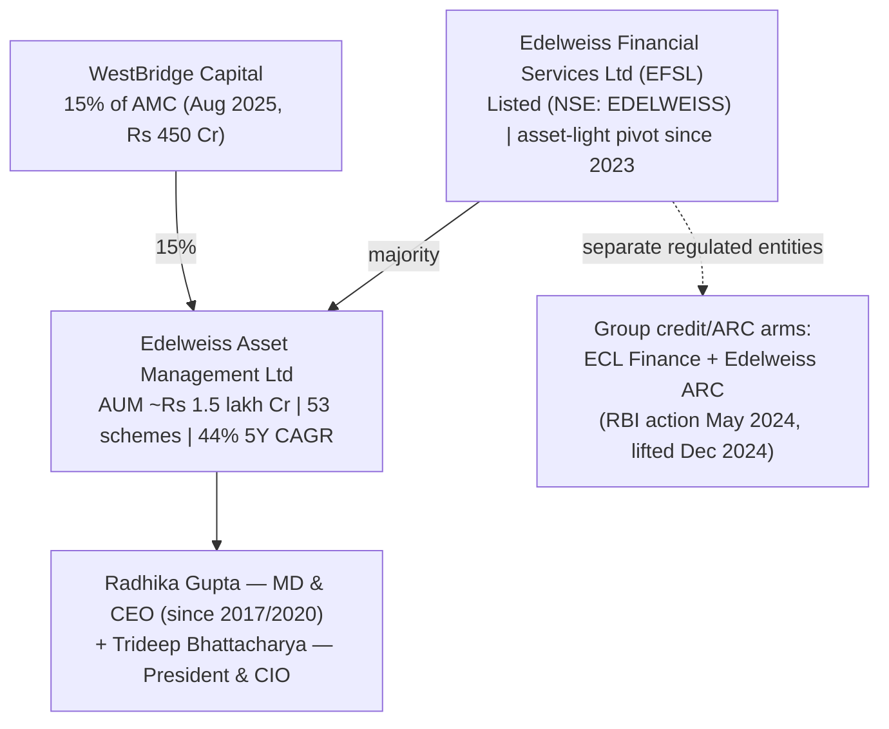
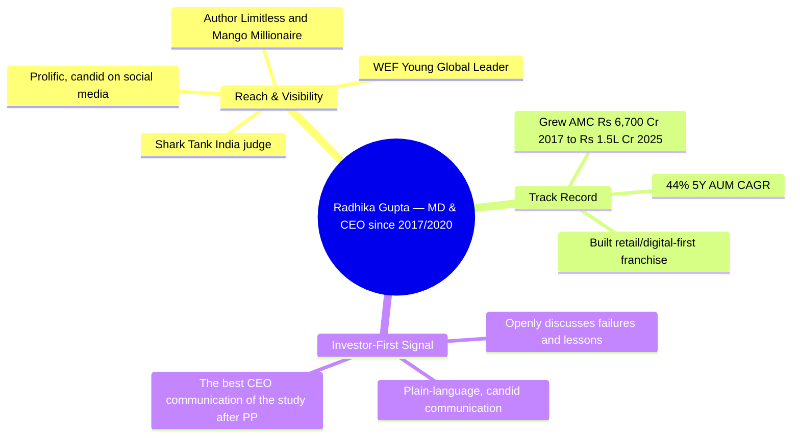
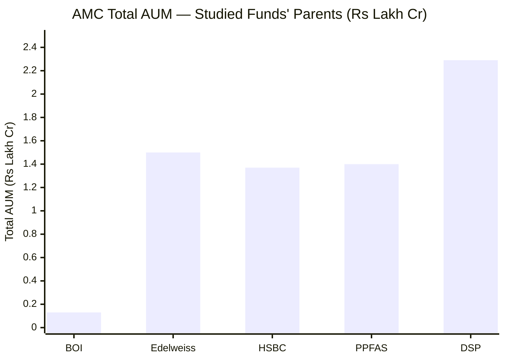
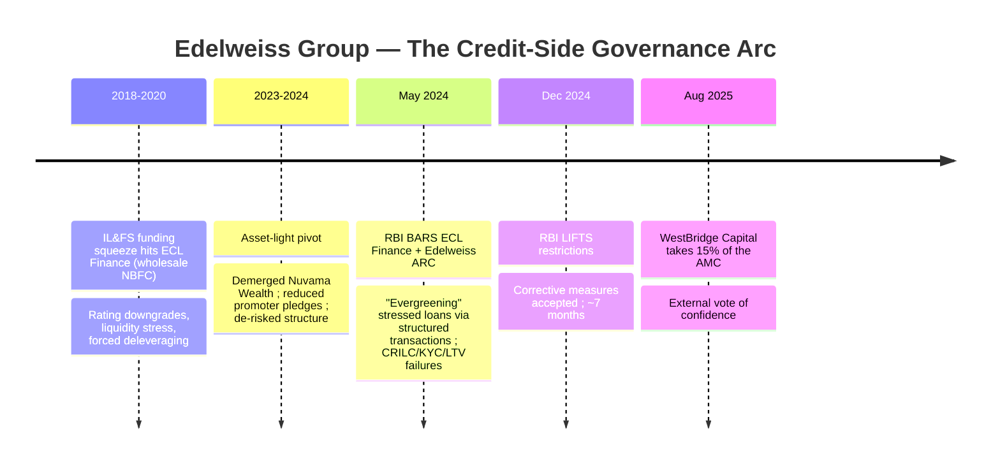
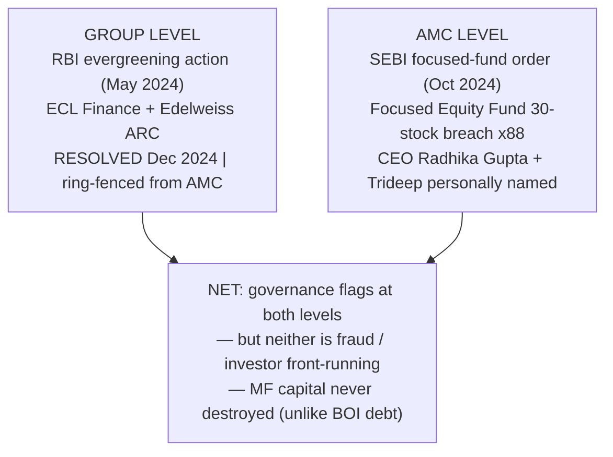
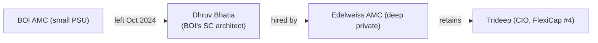
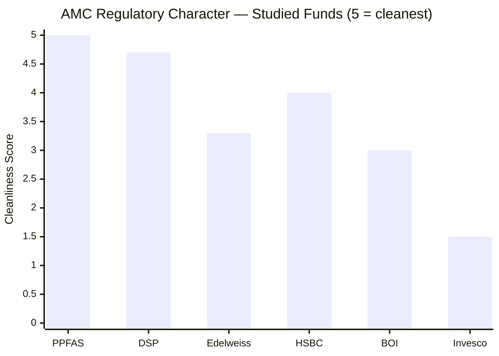
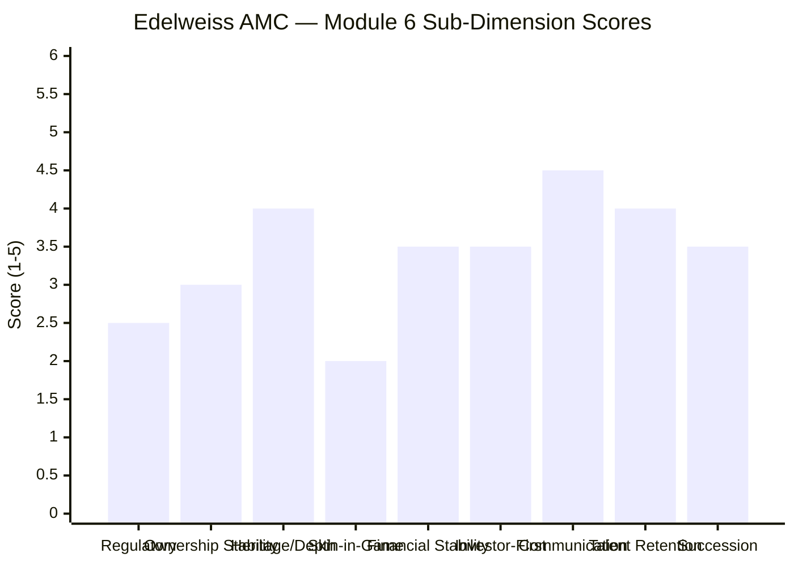
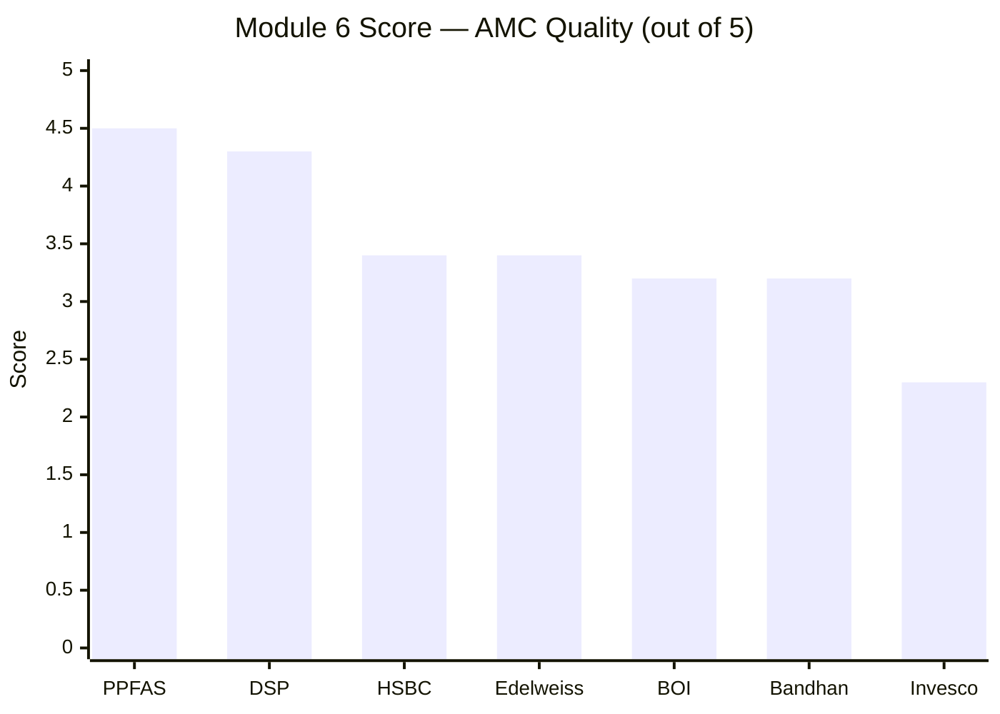
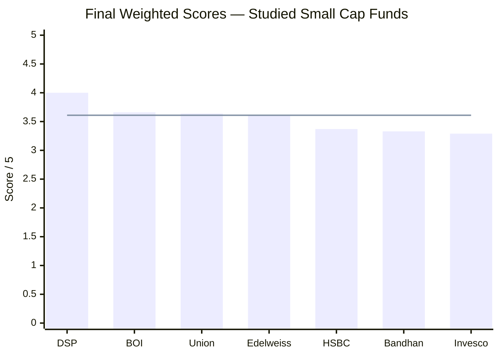

# Module 6: AMC Quality — Edelweiss Small Cap Fund

*Sources: Edelweiss MF official (edelweissmf.com — CEO page, SID, factsheets) | AMFI member data | Business Standard (WestBridge 15% stake, AMC stake-sale buzz) | Business Today / AngelOne (RBI ECL Finance + Edelweiss ARC restrictions and lifting) | The Wire / BusinessToday (NBFC-crisis context) | Business Standard / Cafemutual (SEBI ₹16L focused-fund order) | LinkedIn / WEF / Morningstar (Radhika Gupta profile) | Wikipedia (Edelweiss Group) | Screener (EFSL financials) | Edelweiss SID (RTA, service providers) | Web research, June 2026.*

---

## Module 6 Score: ~3.4 / 5

Edelweiss's AMC story is almost the **inverse of BOI's.** Where BOI was a tiny PSU-owned house with thin communication but government-bank unsinkability, **Edelweiss is a large, fast-growing, private AMC run by the most visible CEO in Indian asset management — with no mutual-fund-level debacle and a genuine talent in-flow — but carrying real governance flags at *both* the parent-group and AMC levels.** The positives are substantial and distinctive: a deep ₹1.5-lakh-crore platform (≈12× BOI's AMC) growing at a 44% five-year CAGR, exceptional investor communication under CEO Radhika Gupta (the best of the study after PPFAS), a clean mutual-fund regulatory record (no Credit-Risk-Fund-style capital destruction), and — uniquely — a house that *attracts* equity talent rather than bleeding it (it hired BOI's own small-cap architect).

The negatives are equally genuine: a **parent-group NBFC-crisis history culminating in a 2024 RBI "evergreening" action** on its lending and ARC arms (since resolved, and ring-fenced from the AMC); an **AMC-level SEBI order that personally named the CEO** (the focused-fund 30-stock breach from Module 5); and an **evolving ownership structure** (WestBridge's 15% PE entry, the parent's asset-light restructuring) that removes the ownership-continuity certainty BOI's government-bank parent provides. The net is a mid-pack ~3.4 — roughly level with HSBC, clearly above BOI/Bandhan (3.2) and Invesco (2.3), and a tier below DSP (4.3) and PPFAS (4.5).

---

## Raw Data (Cross-Source Verified)

| Metric | Value | Source(s) |
|--------|-------|-----------|
| **AMC Full Name** | **Edelweiss Asset Management Ltd** | AMFI, Edelweiss MF |
| **Sponsor / Parent** | **Edelweiss Financial Services Ltd (EFSL)** — listed (NSE: EDELWEISS) | EFSL filings |
| **New strategic investor** | **WestBridge Capital — 15% of the AMC (Aug 2025, ₹450 Cr; AMC valued ~₹3,000 Cr)** | Business Standard |
| **Built via acquisitions** | JPMorgan AMC India (2016); Ambit's schemes; organic growth | Wikipedia, web |
| **Total AMC AUM** | **~₹1.49–1.52 lakh Cr** (Jun 2025) | Dezerv / EFSL |
| **AUM 5Y CAGR** | **~44%** | EFSL |
| **Total Schemes** | **53** | Dezerv |
| **CEO / MD** | **Radhika Gupta** (CEO since 2017; MD & CEO since 2020) | Edelweiss MF |
| **CIO** | Trideep Bhattacharya (President & CIO) | Edelweiss MF |
| **RTA** | **KFin Technologies** | SID |
| **Custodian** | Tier-1 provider | SID |
| **SEBI — AMC + CEO + manager** | **₹16 lakh total** (₹8L AMC + ₹4L CEO Radhika Gupta + ₹4L Trideep) — Focused Equity Fund 30-stock breach, 88 occasions (Nov 2022–Feb 2023) | Business Standard |
| **RBI — group lending/ARC arms** | **ECL Finance + Edelweiss ARC barred (29-May-2024) for "evergreening"; restrictions lifted (17-Dec-2024)** | Business Today |
| **SEBI — group AIF** | Settlement ₹61.42 lakh; officials barred 1 year | The420 / web |
| **MF-level debt debacle** | **None** — no Credit-Risk-Fund-style capital destruction | Web review |
| **Parent NBFC-crisis history** | 2018–2020 IL&FS funding squeeze, rating downgrades, deleveraging; asset-light pivot (Nuvama demerger 2023–24) | The Wire / BusinessToday |
| **Quarterly investor letters** | No (but exceptional CEO-led communication) | Web review |
| **Skin-in-game disclosure** | Not specifically disclosed | Not found |
| **Flow-restriction history** | None (within capacity) | AMC history |
| **Equity-talent retention** | **Strong — net talent recipient** (hired BOI's architect, Module 5) | Module 5 |

---

## What Module 6 Is Really Asking

You can have a capable manager, but if the institution around them is regulatorily compromised, financially fragile, or culturally indifferent to investors, everything can unravel. Module 6 evaluates the *house*: governance, regulatory record, ownership, financial stability, and whether it systematically puts investors first.

For Edelweiss the answer is genuinely two-sided — but in the *opposite* configuration to BOI. BOI was "weak institution, strong continuity"; **Edelweiss is "strong institution, real governance flags."** The mutual fund itself is a deep, well-run, fast-growing, exceptionally-communicative franchise with a clean MF regulatory record. But the *group* around it carries a recent NBFC-crisis-era governance scar (the RBI evergreening action), the AMC's own leadership was personally named in a SEBI order, and the ownership is in flux. **Module 6 asks whether a large, communicative, fast-growing private AMC — embedded in a group with a chequered credit-side governance history — is a trustworthy 10-year custodian for a small-cap SIP.** The answer is a qualified "yes, with eyes open."

---

## The AMC Structure — Who You Are Actually Backing

| Dimension | Edelweiss | BOI | DSP | Invesco |
|-----------|-----------|-----|-----|---------|
| Ownership type | **Listed private (EFSL) + WestBridge PE 15%** | Govt-bank PSU (100% BOI) | Family-private | Foreign → IIHL |
| Heritage | Edelweiss since 1995; AMC built via acquisitions (JPMorgan India 2016) | Bank 1906; AMC since 2008 | 160+ years | Multiple owners |
| AMC scale | **~₹1.5L Cr (deep)** | ~₹13,400 Cr (sub-scale) | ₹2.29L Cr | ~₹1.1L Cr |
| Can AMC be acquired / change? | **Partially — PE entry + restructuring underway** | No (govt won't sell) | Very unlikely | **4 changes already** |
| Parent financial strength | Listed group, de-risking post-NBFC-crisis | Govt bank (sovereign-adjacent) | ₹15,779 Cr family wealth | Hinduja/IIHL |
| Investor communication | **Best of study after PP (CEO-led)** | Minimal | Above-avg | Below-avg |

**What this ownership means for investors — a different trade-off than BOI:** Edelweiss delivers **institutional depth, growth, and communication** that BOI's tiny PSU AMC cannot — but at the cost of **ownership-continuity certainty** (the structure is evolving) and with a **group governance history** that BOI's government parent, for all its PSU limitations, did not carry in the same integrity-charged form. It is the classic "vibrant private house vs stable public house" contrast, and Edelweiss sits firmly on the vibrant-but-flag-carrying side.

---

## ⭐ The Radhika Gupta Factor — The Communication Standout *(Edelweiss-specific)*

This is the dimension where Edelweiss most decisively beats BOI and most of the study. **CEO Radhika Gupta is the most visible, transparency-focused leader in Indian asset management:**

| Communication Form | Edelweiss (Gupta) | BOI (silent) | DSP | PP |
|-------------------|-------------------|--------------|-----|-----|
| CEO public visibility / candour | **Exceptional** | Minimal | Moderate | High |
| Plain-language investor education | **Extensive** (books, social, video) | None | Some | Yes |
| Quarterly unitholder letters | No | No | No | **Yes** |
| Acknowledges failures openly | **Yes (a hallmark)** | No | Partial | Yes |

Where BOI's Module 6 scored a **2.0 on communication** (factsheets only; the manager carousel disclosed via dry SEBI addenda), Edelweiss is the opposite: a **retail-first, unusually transparent house** whose CEO has grown the AMC 22-fold in eight years and built a public reputation on candour and investor education. Only PPFAS's formal quarterly letters rank higher on pure investor communication. This is a genuine, distinctive, investor-first strength — and the single clearest Module 6 advantage Edelweiss holds over the rest of the small-cap cohort.

> **The nuance:** Gupta's strength is *communication and franchise-building*, not a spotless compliance record — she was personally named (₹4L) in the focused-fund SEBI order (below). So the CEO factor is a strong *culture/communication* positive, tempered by a *process-discipline* flag at the very top.

---

## ⭐ Scale, Growth & Research Depth — The Anti-BOI *(Edelweiss-specific)*

| Metric | Edelweiss | BOI | DSP |
|--------|-----------|-----|-----|
| Total AUM | **~₹1.5 lakh Cr** | ~₹13,400 Cr | ₹2.29L Cr |
| Schemes | 53 | ~17–19 | 66+ |
| 5Y AUM CAGR | **~44% (fast-growing)** | modest | mature |
| Est. AMC revenue | **~₹500–600 Cr** | ~₹80–90 Cr | ~₹1,480 Cr |
| Research depth | **Solid (deep mid-large platform)** | Thin (sub-scale) | Deep |

**Edelweiss's scale fixes BOI's central institutional weakness.** At ~₹1.5 lakh crore across 53 schemes — roughly **12× BOI's AMC** and comparable to HSBC's — Edelweiss generates an estimated ~₹500–600 Cr of annual revenue, supporting a genuinely deep research bench (the structural constraint that capped BOI's M4/M5/M6). The **44% five-year AUM CAGR** marks it as one of the fastest-growing AMCs in India — a sign of strong franchise momentum, retail traction, and distribution reach. For the small-cap fund, this means the 92-stock book is researched by a well-resourced platform, not a thin sub-scale bench. Institutional depth here is a *strength*, the inverse of BOI's sub-scale problem.

> The flip side of rapid growth: an AMC scaling AUM at 44%/year must guard against the small-cap-specific capacity creep that hit DSP/HSBC — though the *fund* itself (~₹6,000 Cr, Module 4) remains comfortably within capacity, and the broad platform's growth is spread across 53 schemes.

---

## ⭐ The Parent-Group NBFC Scar — The Key Negative *(Edelweiss-specific)*

Just as BOI's Module 6 had to weigh the parent bank's RBI-PCA history, Edelweiss's must weigh the **Edelweiss Group's credit-side governance record** — and it is more integrity-charged.

| Episode | Detail | Why it matters |
|---------|--------|----------------|
| 2018–2020 NBFC crisis | ECL Finance (wholesale-credit arm) hit by IL&FS funding squeeze; downgrades; deleveraging | Group credit franchise under severe stress (industry-wide era) |
| **RBI action (29-May-2024)** | **ECL Finance barred from structured wholesale transactions; Edelweiss ARC barred from acquiring assets — for "evergreening" stressed loans** plus CRILC/KYC/LTV compliance failures | **A genuine governance/integrity flag — "evergreening" disguises the true extent of stressed assets** |
| RBI lifts (17-Dec-2024) | Corrective measures accepted; restrictions removed after ~7 months | Resolved relatively quickly; RBI satisfied |
| Group AIF (separate) | SEBI settlement ₹61.42 lakh; officials barred 1 year | A separate group-entity regulatory matter |

**Character assessment — more integrity-charged than BOI's parent issue, but ring-fenced and resolved:**
- "Evergreening to disguise stressed assets" is a **governance/integrity** failing — arguably more serious in *character* than BOI's parent-PCA (an NPA/asset-quality problem, not deception). It speaks to the promoter group's credit-side culture.
- **But three crucial mitigants:** (a) it was the **lending and ARC arms (ECL Finance, EARC) — separate, RBI-regulated entities, fully ring-fenced from the SEBI-regulated mutual fund**; a small-cap SIP investor is not exposed to them; (b) it was **resolved in ~7 months** (May→Dec 2024) with RBI satisfied; (c) the group has been **actively de-risking** — the asset-light pivot, the Nuvama demerger, and reduced promoter pledges all predate and outlast the action, and WestBridge's August-2025 entry is an external vote of confidence.

**The honest synthesis:** the mutual fund itself has a *clean* regulatory record (no Credit-Risk-Fund-style capital destruction — a meaningful contrast with BOI's MF-side debacle). The scar is at the **group/parent level**, in a different regulated entity, and it has been remediated. But it is *recent* (2024) and integrity-charged, so it cannot be dismissed — it is the principal reason Edelweiss's otherwise-strong AMC profile does not score higher.

---

## ⭐ Governance at Two Levels — Group and AMC *(Edelweiss-specific)*

What distinguishes Edelweiss's Module 6 is that governance flags appear at *both* levels — though neither is of the BOI-insider-redemption (front-running-investors) severity:

| Level | Issue | Severity | Investor exposure |
|-------|-------|----------|-------------------|
| **Group** | RBI evergreening (ECL Finance/EARC) | Serious-but-resolved integrity flag | **None** (separate entities; ring-fenced) |
| **AMC** | SEBI focused-fund 30-stock breach (CEO + manager named) | Moderate compliance/process lapse | Indirect (the AMC's own oversight) |
| *(Contrast: BOI)* | MF Credit-Risk-Fund capital destruction + insider redemption | Severe (capital destroyed; investor front-run) | **Direct** (MF investors harmed) |

**The crucial distinction from BOI:** BOI's worst governance failing was *inside the mutual fund* and *harmed MF investors directly* (capital destruction + an officer front-running his own fund). **Edelweiss's worst failings are (a) in a separate, ring-fenced group entity, and (b) a portfolio-construction compliance breach — neither destroyed MF capital nor involved front-running investors.** So while Edelweiss carries *more* governance flags (two levels vs BOI's one franchise), they are *less severe in direct investor impact*. The two AMCs' governance profiles are roughly a wash — Edelweiss's flags are broader but shallower; BOI's was narrower but cut deeper into the MF itself.

---

## ⭐ The Ownership Evolution — Continuity Trade-off vs BOI *(Edelweiss-specific)*

BOI's Module 6 prized one thing above all: **zero acquisition risk** (a government bank won't sell its AMC). Edelweiss is the opposite — an **actively evolving ownership structure:**

| Event | Detail | Read |
|-------|--------|------|
| Nuvama Wealth demerger (2023–24) | Parent EFSL spun off the wealth business | De-risking; sharpens focus on AMC + insurance + alternatives |
| Reduced promoter pledges (2024–25) | Promoter pledged shares materially declined | Improves parent creditworthiness |
| **WestBridge Capital 15% (Aug 2025)** | ₹450 Cr; AMC valued ~₹3,000 Cr | **Respected long-term PE; external validation, not a flip** |
| AMC stake-sale buzz | EFSL stock rose on MF-unit stake-sale reports | Further stake sales / an eventual AMC IPO are plausible |

**The trade-off:** unlike BOI's locked-in government ownership or DSP's stable family control, Edelweiss's AMC ownership is **in motion** — the parent has been monetizing stakes to de-risk, and a future AMC listing or further PE sale is plausible. This cuts both ways:
- **Positive:** WestBridge is a **respected, patient PE investor** (not a serial flipper); its entry is a vote of confidence and a stability-improving capital injection. The de-risking pivot genuinely strengthens the parent.
- **Negative:** ownership continuity over a 10-year SIP is **less certain** than BOI's or DSP's. It is, however, **far more stable than Invesco's serial churn** (4 owners) — this is *managed evolution*, not instability.

Net: a mild negative on the continuity axis, well short of Invesco's red flag, and partly offset by the quality of the incoming investor and the de-risking it funds.

---

## ⭐ Talent In-Flow — The Anti-BOI AMC Signal (M5 ↔ M6 Bridge) *(Edelweiss-specific)*

A positive AMC-quality signal carried directly from Module 5: where BOI's small PSU AMC *bled* its equity talent (both small-cap architects left, a structural weakness of a low-paying sub-scale house), **Edelweiss *attracts* talent.**

Edelweiss **hired BOI's own small-cap architect (Dhruv Bhatia)** and retains a high-profile CIO (Trideep Bhattacharya). A deep, well-resourced, well-paying private AMC that is a *net talent recipient* is a structurally healthier institution than a training-ground that loses its best managers to competitors. This is the AMC-level expression of the Module 5 "anti-carousel" finding, and a genuine institutional-quality positive that BOI structurally lacks.

---

## Regulatory Record — Clean MF Side, Group & Leadership Flags

| Entity | Issue | Amount | Character |
|--------|-------|--------|-----------|
| Edelweiss MF (the fund franchise) | **None** — no capital-destroying episode | ₹0 | **Clean MF record** |
| **Edelweiss AMC + CEO + manager** | Focused Equity Fund 30-stock breach (88×) | **₹16 lakh** | **Compliance/process — CEO + manager named** |
| **ECL Finance + Edelweiss ARC (group)** | RBI "evergreening" bar (May–Dec 2024) | Business restriction (lifted) | **Group integrity flag — ring-fenced, resolved** |
| Edelweiss AIF (group) | SEBI settlement | ₹61.42 lakh | Group-entity matter |
| *(Contrast)* BOI AMC (debt side) | Credit Risk Fund debacle + ₹10L insider redemption | capital destroyed | **Direct MF investor harm** |
| *(Contrast)* Invesco AMC | Inter-scheme transfers; multi-jurisdiction probe | ₹4.98 Cr | Severe |

**Edelweiss's regulatory record is "clean MF, flagged group/leadership."** The mutual fund itself has no capital-destruction or investor-harm episode (cleaner than BOI's MF side). The flags are: (1) a **compliance/process order at the AMC that named the CEO and lead manager** (the focused-fund breach), and (2) a **group-level integrity action (RBI evergreening)** in ring-fenced lending/ARC entities. This places Edelweiss **above BOI** on the *MF-investor-impact* axis (BOI destroyed debt-fund capital; Edelweiss did not) but **below DSP/HSBC** (whose only blemishes are purely procedural, with no CEO named and no group-integrity scar). Net regulatory character: mid-pack — broader flags than BOI but shallower direct impact; cleaner MF record but a more integrity-charged group history.

---

## Investor-First Signals — Strong on Communication, Mixed Elsewhere

| Signal | Edelweiss | BOI | DSP | PP |
|--------|-----------|-----|-----|-----|
| Investor communication / education | **Best of study after PP (CEO-led)** | Minimal | Above-avg | **Best** |
| Quarterly investor letters | No | No | No | **Yes** |
| Cheap direct ER | **Yes (~0.47%, tied 2nd)** | Yes (~0.48%) | Mid-pack | Cheap |
| Direct–Regular gap | Moderate (~1.36%) | Widest (~1.58%) | Moderate | Narrow |
| Exit load friendliness | **2nd-friendliest (90d)** | 365d | 365d | — |
| Min investment accessibility | **₹100 (best tier)** | ₹1,000 | ₹100 | — |
| Flow-restriction history | None (within capacity) | None (too small) | 3 closures | SIP cap |
| Skin-in-game disclosed | No | No | All-employee | Manager-disclosed |

**Edelweiss's investor-first profile is strong on the *accessible, communicative, low-cost* axes** (the Module 4 strengths — cheap ER, friendly exit load, ₹100 minimums — plus exceptional CEO-led communication) but **thinner on the *formal-alignment* axes** (no quarterly letters, no disclosed skin-in-game, no proven flow-discipline track record). It is clearly more investor-communicative than BOI and approaches DSP, but falls short of PPFAS's formal alignment standard. For a self-directed Direct investor, the combination of low cost, accessibility, and a candid, educative house culture is a genuine pro-investor package.

---

## Peer AMC Comparison — Full Picture

| Dimension | Edelweiss | BOI | DSP | PPFAS | HSBC | Invesco |
|-----------|-----------|-----|-----|-------|------|---------|
| Ownership | **Listed private + PE 15%** | Govt-bank PSU | Family-private | Promoter-private | Global bank | Hinduja/IIHL |
| Total AUM | ~₹1.5L Cr | ~₹13,400 Cr | ₹2.29L Cr | ₹1.40L Cr | ₹1.37L Cr | ~₹1.1L Cr |
| Growth | **44% 5Y CAGR (fast)** | Modest | Mature | Strong | Mature | Modest |
| Financial stability | High (de-risking parent) | Very high (sovereign-adjacent) | Very high | High | Very high | Moderate |
| Acquisition / ownership churn | **Moderate (evolving)** | None (govt) | Very low | Low | Low | **High (serial)** |
| Regulatory character | **Clean MF; group + CEO flags** | Debt-side scar (MF) | Procedural only | Clean | Procedural | **Severe** |
| Talent retention | **Strong (net recipient)** | Weak (carousel) | Strong | Strong | Moderate | Weak |
| Investor communication | **Excellent (CEO-led)** | Minimal | Above-avg | **Best** | Moderate | Below-avg |
| Research depth | **Deep** | Thin (sub-scale) | Deep | Moderate | Deep | Moderate |
| M6 Score | **~3.4** | 3.2 | 4.3 | 4.5 | 3.4 | 2.3 |

---

## Points For / Points Against — AMC Quality

### ✅ Points For

1. **Deep, fast-growing AMC (~₹1.5L Cr, 53 schemes, 44% 5Y CAGR)** — ~12× BOI; solid research depth; fixes the sub-scale weakness that capped BOI
2. **Exceptional investor communication under Radhika Gupta** — the best of the study after PPFAS; candid, educative, retail-first; the anti-BOI on transparency
3. **Clean mutual-fund regulatory record** — no Credit-Risk-Fund-style capital destruction; cleaner MF side than BOI
4. **Net talent recipient** — hired BOI's small-cap architect (Bhatia); a structurally healthy institution (M5↔M6 bridge)
5. **WestBridge Capital's 15% entry** — a respected long-term PE investor's vote of confidence; stability-improving capital
6. **Parent actively de-risking** — asset-light pivot, Nuvama demerger, reduced promoter pledges; the RBI action resolved in ~7 months
7. **Low-cost, accessible, investor-friendly fund mechanics** (Module 4) — ~0.47% ER, 90-day exit load, ₹100 minimums
8. **Strong franchise momentum** — 22× AUM growth under the current CEO (2017–2025)

### ❌ Points Against

1. **Parent-group RBI "evergreening" action (May 2024)** — a recent, integrity-charged governance flag on ECL Finance + Edelweiss ARC (resolved Dec 2024; ring-fenced from the AMC, but a culture signal)
2. **AMC SEBI order naming the CEO** — Radhika Gupta + Trideep personally fined (₹4L each) for the focused-fund 30-stock breach; a governance/process lapse at the very top
3. **Group NBFC-crisis history** — EFSL's 2018–2020 wholesale-credit stress, downgrades, deleveraging; reputational baggage
4. **Evolving ownership structure** — WestBridge PE entry + parent restructuring remove the continuity certainty BOI's govt-bank parent provides (though far more stable than Invesco)
5. **No quarterly letters / no disclosed skin-in-game** — formal-alignment signals thinner than PPFAS
6. **Group AIF SEBI settlement (₹61.42L)** — another group-entity regulatory matter
7. **Rapid AUM growth** requires capacity vigilance — though the fund itself remains within capacity (Module 4)

---

## Module 6 Scorecard

| Sub-Dimension | Score (1–5) | Reasoning |
|---------------|------------|-----------|
| Regulatory cleanliness | **2.5** | Clean MF record, but a group-level RBI evergreening flag + a CEO-named AMC SEBI order; broader flags than BOI, shallower direct MF impact |
| Ownership stability | **3.0** | Evolving (WestBridge PE + restructuring); less certain than BOI/DSP, far more stable than Invesco; quality incoming investor |
| Heritage & institutional depth | **4.0** | Deep ~₹1.5L Cr / 53-scheme platform; solid research bench; the anti-BOI on scale |
| Skin-in-the-game | **2.0** | Not specifically disclosed; same gap as most peers vs PPFAS |
| Financial stability | **3.5** | Listed group, materially de-risked (asset-light pivot); strengthened by WestBridge; not a sovereign-adjacent backstop like BOI/HSBC |
| Investor-first culture | **3.5** | Low cost, accessible, candid; offset by no letters/no disclosed skin-in-game |
| Investor communication | **4.5** | Radhika Gupta — best of study after PP; candid, educative, retail-first |
| Talent retention | **4.0** | Net talent recipient (hired BOI's architect); deep, well-paying platform |
| Succession / continuity | **3.5** | Deep bench + CIO anchor; but ownership in flux and leadership SEBI-flagged |
| **Module 6 Overall** | **~3.4 / 5** | **A deep, fast-growing, exceptionally-communicative private AMC that fixes BOI's sub-scale and communication weaknesses and attracts (not bleeds) talent — but carries governance flags at both the group level (the 2024 RBI evergreening action, since resolved and ring-fenced) and the AMC level (the CEO-named focused-fund order), plus an evolving ownership structure. A strong institution with real, if remediated, governance baggage. Roughly level with HSBC; clearly above BOI/Bandhan; a tier below DSP/PP.** |

---

## Comparative Module 6 Scores — All Studied Funds

| Rank | AMC | Score | Key Differentiator |
|------|-----|-------|--------------------|
| 1 | PPFAS | 4.5 | Zero incidents; quarterly letters; focused |
| 2 | DSP | 4.3 | 160Y heritage; all-employee skin-in-game; flow discipline |
| 3 | HSBC | 3.4 | Global parent ($3T); but open-door AUM; grafted heritage |
| 3 | **Edelweiss** | **~3.4** | **Deep, fast-growing, exceptionally-communicative; clean MF record + talent in-flow — but group RBI evergreening + CEO-named SEBI order + evolving ownership** |
| 5 | BOI | 3.2 | Govt-bank unsinkability + clean equity CIO; debt-side scar, talent flight, sub-scale |
| 5 | Bandhan | 3.2 | IDFC heritage; consortium ownership; PE exit clock |
| 7 | Invesco | 2.3 | 4 ownership changes; multi-jurisdiction SEBI probe |

**Edelweiss and HSBC tie at ~3.4 by opposite routes:** HSBC has a vast, stable global-bank parent but a grafted, open-door, benchmark-hugging franchise; Edelweiss has a vibrant, fast-growing, communicative domestic franchise with a clean MF record and talent in-flow, offset by group/leadership governance flags and ownership flux. Both sit above BOI/Bandhan (3.2) — Edelweiss clearing BOI on scale, communication, talent, and a clean MF record, while carrying its own broader-but-shallower governance baggage — and a clear tier below DSP/PP.

---

## One-Line Verdict

Edelweiss Asset Management is the anti-BOI AMC: a deep, fast-growing (₹1.5-lakh-crore, 44% CAGR), exceptionally-communicative private house under a star CEO, with a clean mutual-fund record and a genuine talent in-flow — but carrying real governance flags at both the group level (the 2024 RBI "evergreening" action on its lending/ARC arms, since resolved and ring-fenced) and the AMC level (the focused-fund SEBI order that personally named the CEO), plus an evolving ownership structure — making it a strong-but-flag-carrying custodian (~3.4/5), level with HSBC, clearly above BOI/Bandhan, a tier below DSP and PP.

---

## Module 6 Final Score: **~3.4 / 5**

> **Module Weight:** 5% | **Weighted Contribution:** 3.4 × 0.05 = **0.170**

---

## Edelweiss Small Cap Fund — Complete Final Score (All 6 Modules)

| Module | Topic | Weight | Score | Weighted |
|--------|-------|--------|-------|----------|
| Module 1 | Returns Consistency | 25% | 3.6/5 | 0.900 |
| Module 2 | Risk Profile | 20% | 3.6/5 | 0.720 |
| Module 3 | Portfolio DNA | 15% | 3.4/5 | 0.510 |
| Module 4 | Cost & AUM Impact | 20% | 4.0/5 | 0.800 |
| Module 5 | Fund Manager Quality | 15% | 3.4/5 | 0.510 |
| **Module 6** | **AMC Quality** | **5%** | **3.4/5** | **0.170** |
| **TOTAL** | | **100%** | | **≈ 3.61 / 5** |

> **Edelweiss Small Cap Fund final weighted score: ≈ 3.61 / 5 — #4 of the studied small caps, in a tight three-way cluster with Union (3.64) and BOI (3.66), behind only DSP (4.00).**

> Line = Edelweiss's final score (~3.61). Edelweiss, Union, and BOI form a near-tied #2–4 cluster behind DSP.

**The defining characteristic — Edelweiss is the most *consistent* fund of the study.** It has the **narrowest module spread of any studied fund (3.4–4.0)** — no glaring weakness anywhere, no module below 3.4 — in sharp contrast to BOI's spiky profile (M4 3.9 high, M5/M6 3.2–3.3 low) or HSBC's (strong heritage, weak recent execution). This consistency, anchored by the **best Cost & AUM profile of the study (M4 4.0)** and a coherent **defensive identity** (lowest volatility, best 2025 downside protection, sweet-spot AUM), earns it a legitimate place in the #2–4 cluster.

**Strategic role (carried from M1–M3):** Edelweiss is the study's **defensive / risk-dampening leg** — the fund to own for downside protection and stability rather than for alpha. It pairs naturally *against* a higher-beta, higher-alpha satellite (BOI or DSP), which connects directly to the existing decision-tree strategy (DSP 60% / BOI 40%): Edelweiss is the most credible *defensive alternative or third leg* for an investor prioritising loss-avoidance, low cost, and institutional depth over maximum small-cap alpha.

**The honest caveats that keep it at #4 rather than higher:** the thin recent alpha (M1/M2 — 3Y IR ≈ 0), the heaviest smid drift of the group (M3 — lowest small-cap purity), the manager-level SEBI mark (M5), and the group/AMC governance flags (M6). None is disqualifying; together they place Edelweiss as a **solid, consistent, defensively-built all-rounder** rather than a standout.

---

*Module 6 complete. AMC quality is a deep, fast-growing, exceptionally-communicative private franchise with a clean mutual-fund record and a genuine talent in-flow — offset by a group-level RBI evergreening flag (resolved), a CEO-named AMC SEBI order, and an evolving ownership structure. Module 6 score: ~3.4/5. **Edelweiss Small Cap final score ≈ 3.61/5 — #4 of the studied small caps, in a near-tie with Union (3.64) and BOI (3.66) behind DSP (4.00); the study's most consistent fund and the natural defensive leg.***

*Next: [README — Final Scorecard & Verdict](README.md)*
