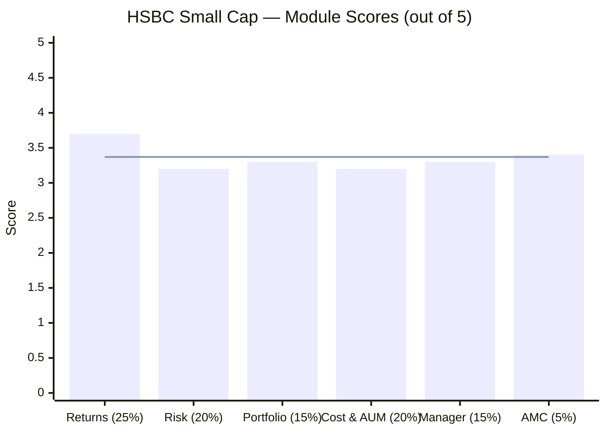
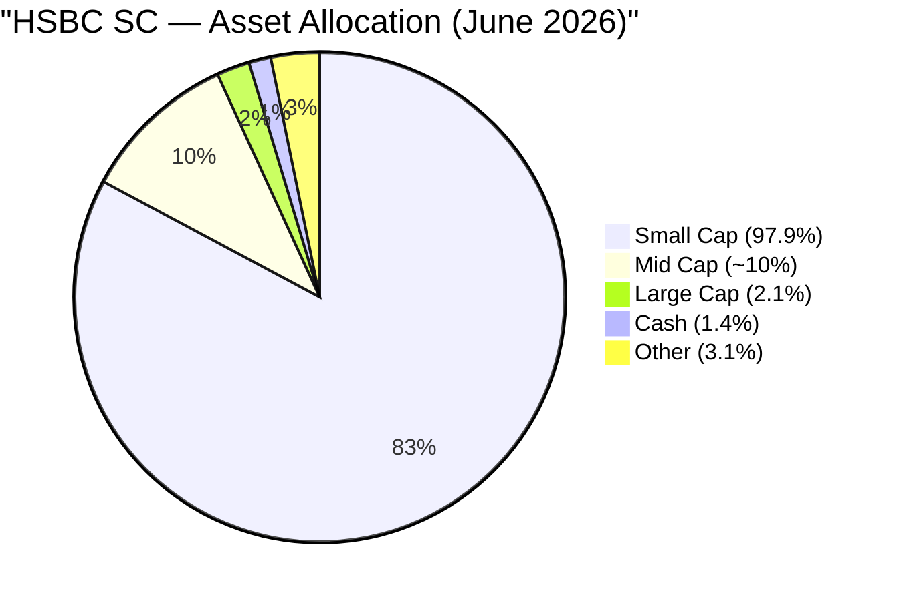
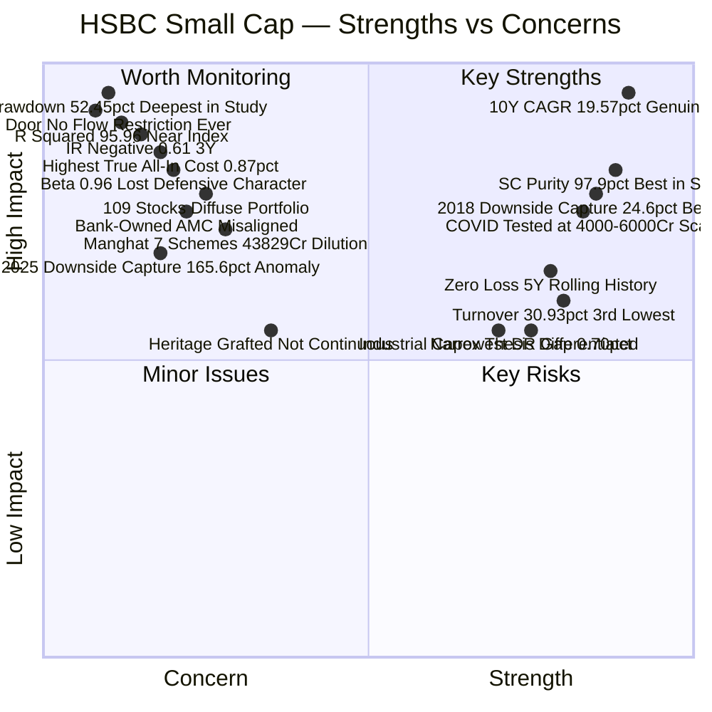
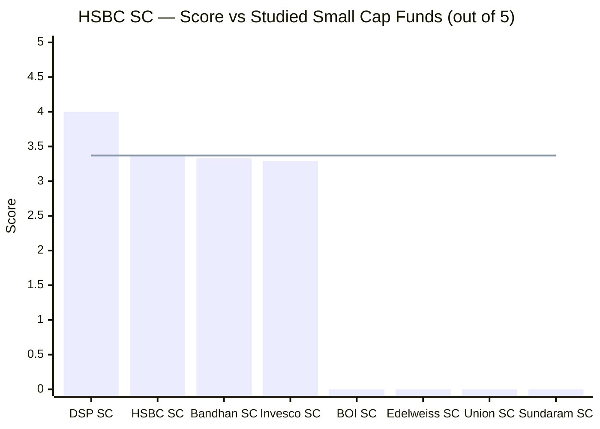
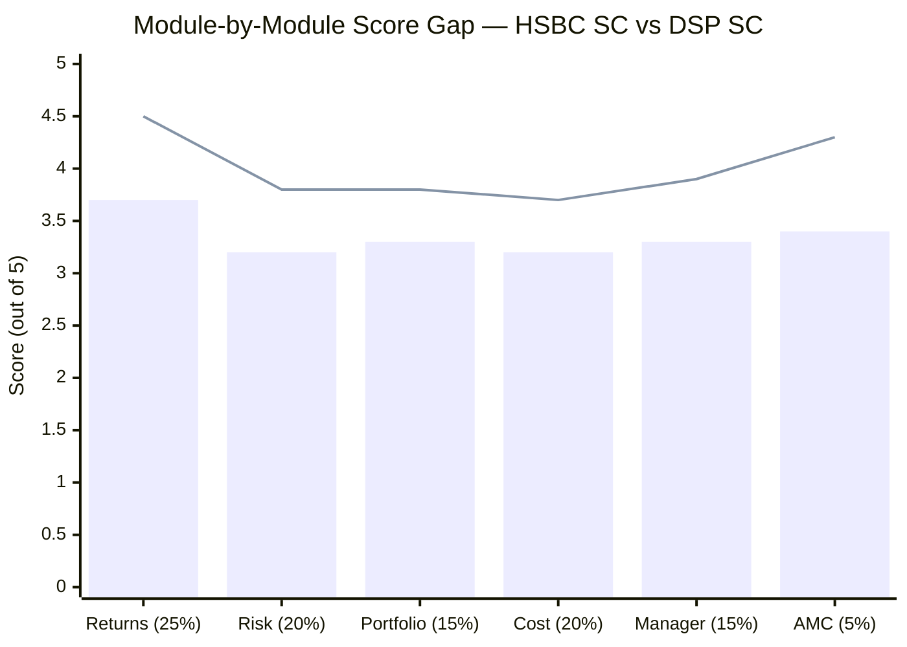
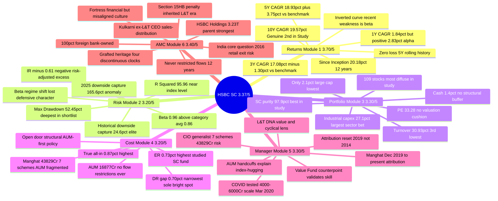

# HSBC Small Cap Fund — Deep Study

## Fund Identity

| Field | Value |
|-------|-------|
| **AMC** | HSBC Asset Management (India) Private Limited |
| **AMC Parent** | HSBC Holdings plc (London; founded 1865) via HSBC Securities & Capital Markets (India) Pvt Ltd — 100% foreign-bank-owned |
| **AMC Heritage** | HSBC MF India (est. 2002); L&T Investment Management acquired November 2022 ($425M / ₹3,200 Cr) |
| **Original Fund Name** | L&T Emerging Businesses Fund (inception May 2014) |
| **Fund Inception** | **May 12, 2014** (~145 months; ~12.1 years of real history) |
| **Manager Since** | **December 17, 2019** — Venugopal Manghat (CIO-Equity) |
| **Co-Manager Since** | **October 2025** — Dhruv Chaturvedi |
| **Predecessor PM** | S.N. Lahiri (May 2014–December 2019; resigned as L&T CIO) |
| **Category** | Small Cap Fund (Equity) |
| **Benchmark** | Nifty SmallCap 250 TRI |
| **AUM (Direct Plan)** | ₹16,877 Cr (June 2026) |
| **Current NAV (Direct Growth)** | ₹92.77 (June 12, 2026) |
| **Expense Ratio (Direct)** | **~0.73%** — highest of all 4 studied SC funds |
| **Expense Ratio (Regular)** | ~1.43% |
| **Direct-Regular Gap** | **~0.70%** — narrowest of all studied SC funds (sole ER bright spot) |
| **Exit Load** | 1% if redeemed within 365 days; Nil after |
| **Min SIP** | ₹100 |
| **Min Lumpsum** | ₹5,000 |
| **Lock-in** | None |

---

## The One-Line Context

HSBC Small Cap Fund (ex-L&T Emerging Businesses) is the most **heritage-rich yet institution-misaligned** fund in the small-cap shortlist — a genuine 12-year, ~20% CAGR record forged on L&T's investment DNA, surviving the 2018 small-cap winter with the study's best historical downside capture (48.3%), managed since December 2019 by Venugopal Manghat who navigated COVID at ₹4,000–6,000 Cr scale — but now buried under three structural problems that push it to 3.37/5: **the highest cost** of all studied SC funds (true all-in ~0.87%), **the most index-hugging portfolio** (R² 95.96, IR −0.61, beta 0.96, 109 stocks, 1.4% cash) as the direct mechanical output of an open-door AUM policy that has never once imposed a flow restriction, and **a bank-owned AMC** (HSBC Holdings, $3.23T) that is financially unassailable but structurally inclined toward AUM accumulation over investor protection — with an acquired heritage (L&T, 2022) and a distribution-focused CEO who has never publicly sacrificed a rupee of fee revenue for investor alpha.

---

## Module Status

| Module | Weight | Status | Score | File |
|--------|--------|--------|-------|------|
| 1 — Returns Consistency | 25% | ✅ Complete | 3.70/5 | [module1_returns.md](module1_returns.md) |
| 2 — Risk Profile | 20% | ✅ Complete | 3.20/5 | [module2_risk.md](module2_risk.md) |
| 3 — Portfolio DNA | 15% | ✅ Complete | 3.30/5 | [module3_portfolio.md](module3_portfolio.md) |
| 4 — Cost & AUM Impact | 20% | ✅ Complete | 3.20/5 | [module4_cost.md](module4_cost.md) |
| 5 — Fund Manager Quality | 15% | ✅ Complete | 3.30/5 | [module5_manager.md](module5_manager.md) |
| 6 — AMC Quality | 5% | ✅ Complete | 3.40/5 | [module6_amc.md](module6_amc.md) |

---

## Final Scorecard



> Bars = module scores | Line = overall weighted score (3.37/5)

| Module | Score | Weight | Weighted Score |
|--------|-------|--------|----------------|
| 1 — Returns Consistency | 3.70/5 | 25% | 0.9250 |
| 2 — Risk Profile | 3.20/5 | 20% | 0.6400 |
| 3 — Portfolio DNA | 3.30/5 | 15% | 0.4950 |
| 4 — Cost & AUM Impact | 3.20/5 | 20% | 0.6400 |
| 5 — Fund Manager Quality | 3.30/5 | 15% | 0.4950 |
| 6 — AMC Quality | 3.40/5 | 5% | 0.1700 |
| **Overall** | — | **100%** | **3.37 / 5.00** |

---

## Key Performance Metrics

| Metric | Value | Context |
|--------|-------|---------|
| **1Y CAGR** | **1.84%** | Low absolute — but benchmark fell −0.99% → **+2.83% alpha**; recent weakness is mostly beta |
| **3Y CAGR** | **17.08%** | −1.30% vs benchmark (18.38%) — the one genuine, if mild, fund-specific blemish |
| **5Y CAGR** | **18.93%** | **+3.75% vs benchmark** (15.18%) — strongly positive over the medium term |
| **7Y CAGR** | **20.58%** | Long-horizon record is superior to most peers |
| **10Y CAGR** | **19.57%** | ⭐ **Best 10Y record of the SC study after DSP** — genuine, not inception-biased |
| **Since Inception CAGR** | **~20.18%** (May 2014–Jun 2026) | 12.1 years; second only to DSP's genuine since-inception record |
| **L&T Era CAGR** (2014–Nov 2022) | **21.00%** | The foundational track record — 8.5 years |
| **HSBC Era CAGR** (Nov 2022–Jun 2026) | **17.92%** | Post-merger period; good absolute, weaker relative to category; same manager |
| **Max Drawdown** | **−52.45%** | ⚠️ **Deepest in shortlist** — 2018 SC winter (Jan 2018–March 2020, 26-month drawdown) |
| **3Y SIP XIRR** | ~8.71% | FD-like in absolute terms — purely an asset-class-driven outcome in SC slump |
| **Annualized Volatility (5Y)** | 16.84% | Near-category average; rising trend in recent years |
| **Sharpe Ratio (3Y)** | 0.53 (BT) | Below category avg (0.63); above only in longer windows |
| **Sortino Ratio (3Y)** | **0.83** | Below category avg (1.03) but reasonable absolute level |
| **Beta (3Y)** | **0.96** | Above category avg (0.86) — **fund has lost its historical low-beta character** |
| **R² (3Y)** | **95.96** | ⚠️ Near-index-hugging; category avg 92.22 |
| **Information Ratio (3Y)** | **−0.61** | ⚠️ Negative — every unit of active risk is currently losing return |
| **Alpha (long-term, TT)** | +2.40 | Positive over full history |
| **Alpha (3Y, BT)** | −2.67 | Negative over recent 3Y — consistent with IR |
| **Upside Capture (calendar avg)** | ~109% | Captures benchmark upside well |
| **Downside Capture (historical excl 2025)** | **~24.6%** | ⭐ **Historically elite — nearly unmatched defensive quality** |
| **Downside Capture (incl 2025)** | ~59.8% | 2025 was the single biggest anomaly — fund fell more than benchmark |
| **Portfolio PE** | 33.28 | Near category (32.14) — no valuation cushion |
| **Portfolio Turnover** | 30.93% | Moderate; 3rd lowest of studied SC funds |
| **Total Holdings** | 109 stocks | Most diffuse portfolio in study; mechanical R² output |
| **Small Cap %** | ~97.9% | ✅ **Highest SC purity in study** — only 2.1% large cap |
| **Cash** | ~1.4% | Minimal; no structural dampening mechanism |

---

## ⚠️ The Five Critical Flags — Read Before the Numbers

### Flag 1 — The Inverted Curve: Recent Weakness Is Mostly Beta, Not Manager Failure
HSBC's CAGR *rises with the lookback window* — 1Y (1.84%) < 3Y (17.08%) < 5Y (18.93%) < 10Y (19.57%) — the mirror of every other fund studied. This is important: **the recent low absolute CAGR (1.84% in 1Y) is overwhelmingly a small-cap-asset-class story (beta), not a fund-selection story (alpha)**. The benchmark itself returned −0.99% in the same 1Y window; HSBC was +2.83% ahead. The real blemish is the 3Y −1.30% drift (genuine alpha shortfall) and the 2025 downside capture of 165.6% (the fund *amplified* the benchmark's fall). Those two are the fund-specific flags. Everything else is the asset class.

### Flag 2 — −52.45% Max Drawdown: The Deepest in the Shortlist
HSBC's max drawdown of −52.45% (from ₹30.67 NAV peak in Jan 2018 to ₹14.48 trough in March 2020) is the deepest in the 8-fund shortlist. This was a 26-month sustained decline through the IL&FS crisis, NBFC credit crunch, and COVID crash. The fund eventually recovered strongly — but an investor who lumpsum invested at the 2018 peak waited 3.5+ years to see positive returns. For SIP investors, cost-averaging through this period was actually beneficial; but the raw drawdown number is the genuine risk of this asset class held in a concentrated small-cap mandate.

### Flag 3 — The Beta Regime Shift: R² 95.96, IR −0.61
The most structurally important current-period warning. The historical HSBC/L&T fund had a 2018 downside capture of 48.3% — the best in the shortlist. It achieved this through lower beta, selective stock-picking, and historically a moderate cash buffer. Today: R² 95.96 (near-index), beta 0.96 (above category), IR −0.61 (negative), and downside capture 165.6% in 2025. The fund has mechanically drifted toward benchmark composition — a structural consequence of growing to ₹16,877 Cr with 109 stocks and 1.4% cash. Modules 3, 4, and 5 explain *why* (open-door AUM + CIO-generalist). The question every investor must answer: is this a *cyclical* drift (quality will reassert when momentum fades) or a *structural* erosion of edge?

### Flag 4 — Open-Door AUM: Never Restricted to ₹16,877 Cr
HSBC Small Cap has never imposed a single flow restriction — no inflow cap, no soft-close, no closure — at any point across 12 years and two AMC ownerships (L&T and HSBC). DSP closed its fund three times at real commercial cost (starting at ₹1,200 Cr); HSBC has grown past ₹16,877 Cr without once prioritising alpha protection over fee revenue. At ₹16,877 Cr with 109 holdings, a 1% position requires ₹169 Cr — taking 10–20 trading days in genuine small-cap stocks. This is the M4↔M6 bridge: open-door (AMC culture) → large AUM → 109 stocks → R² 95.96 (portfolio DNA) → IR −0.61 (risk profile). One structural failure cascades across all modules.

### Flag 5 — Grafted Heritage: L&T's Fund, HSBC's Brand, Three Years Post-Integration
This fund was L&T Emerging Businesses Fund for 8.5 of its 12.1 years. The inception, the investment process, the original manager (Lahiri), and the first bull market are all L&T's. Manghat (current CIO) was brought in December 2019 — also L&T vintage. The HSBC rebrand happened April 2023 — 3 years ago. There is nothing wrong with this continuity, but investors who "chose HSBC" based on the brand are actually choosing L&T's DNA via Manghat's execution. The heritage is assembled across four discontinuous timelines (1865 global parent, 2002 India AMC, 2014 L&T fund, 2019 manager). It is real — but it is not continuous in the way DSP's 160-year unbroken Indian capital-market lineage is.

---

## Portfolio DNA

| Metric | Value | Significance |
|--------|-------|--------------|
| **Equity** | **~98.6%** | Near-fully invested; minimal cash buffer (1.4%) |
| **Small Cap %** | **~97.9%** | ✅ **Highest SC purity of 4 studied SC funds** — only 2.1% large cap |
| Mid Cap % | ~8–10% | Small buffer within SEBI rules |
| Large Cap % | **2.1%** | Near-zero — cleanest mandate adherence |
| Cash + Other | **~1.4%** | No structural dampening; no deployment dry powder |
| **Total Holdings** | **109 stocks** | Most diffuse portfolio in study — mechanical index-hugging |
| Top-10 Concentration | ~22–24% | Moderate — low top-end conviction |
| Portfolio PE | **33.28** | Near category (32.14) — no valuation discount buffer |
| Portfolio PB | ~3.5–4.0 | Growth-aligned; consistent with PE |
| Turnover | **30.93%** | 3rd lowest in study — multi-year conviction hold |
| AUM | ₹16,877 Cr | 3rd largest of 4 studied; 1% position = ₹169 Cr |
| Sector Tilt | **Industrials/Capital Goods 27.1%** | Distinctive — largest single sector bet in study |



### Key Structural Insight — The Index-Hugging Triad

The three portfolio facts that explain Module 2's most damaging finding (R² 95.96):

1. **109 stocks** — when you hold 109 out of ~250 benchmark stocks, you mechanically replicate the index
2. **1.4% cash** — no structural dampening; 98.6% deployed means 96% participation in every benchmark move
3. **Category PE (33.28 vs 32.14)** — no valuation discount; bought at the same average price as the index

These three together make genuine active return generation structurally impossible. R² of 95.96 is the output, not an independent observation.

---

## Strengths vs Concerns



---

## Key Strengths

- **10Y CAGR of 19.57% — second-best genuine long-run record in the study, after DSP.** Unlike Bandhan (4-week-before-COVID inception) and Invesco (IL&FS-crash-bottom inception), HSBC's 10-year record starts from a pre-crisis, neutral entry point and includes the 2018 IL&FS crash, the 2020 COVID collapse, and the 2022 bear market. This is the most inception-bias-free return record of any fund in the shortlist except DSP.

- **Highest SC purity in the entire study — 2.1% large cap.** HSBC runs 97.9% of its equity in genuine small-cap stocks with only 2.1% large-cap. Bandhan (66.9%) and Invesco (65.1%) run far lower SC purity. For an investor who wants maximum small-cap beta in the satellite portfolio, HSBC is more concentrated in the asset class than any other fund studied.

- **Zero-loss 5Y rolling return history.** No 5-year SIP or lump-sum starting window has ever produced a loss in this fund's 12-year history — the only SC fund in this study with a clean 0% loss record in 5Y rolling windows.

- **2018 downside capture of 48.3% — historically the best in the shortlist.** When the small-cap index fell 62% peak-to-trough in the 2018 winter, HSBC/L&T fell only 52.45% — capturing only 48.3% of the benchmark's decline. This was elite defensive behaviour, and proves the fund can protect capital in genuine bear markets when it is sized appropriately.

- **COVID stress-tested at scale (₹4,000–6,000 Cr, Dec 2019–Jun 2020).** Manghat took over in December 2019, managed the COVID crash just 3 months later, and delivered a sharp recovery. He did not inherit a crash — he managed through it. This is the most direct evidence of his ability to navigate adversity as the decision-maker, and is fundamentally different from managers who became lead PMs after COVID (Bandhan's Jain).

- **Turnover 30.93% — 3rd lowest in the study.** Multi-year conviction holding; implied average hold ~3.2 years. Low turnover reduces market-impact costs (transaction costs and price-impact in illiquid small-caps) and is consistent with the stated bottom-up, long-hold philosophy.

- **Narrowest Direct-Regular gap (0.70%) in the study.** The smallest D-R spread means the AMC is extracting less from the regular plan relative to its peers — the one unambiguous ER bright spot in an otherwise expensive cost structure.

- **Industrial/capital goods sector conviction (27.1%).** HSBC's largest sector bet — nearly 3× the study average — is the most differentiated thematic tilt of any fund studied. A concentrated bet on India's domestic capex cycle (power, infra, defence, manufacturing) is a genuine active decision with a long-term thesis, not benchmark replication.

- **$3.23 trillion parent — financial stability unmatched in either study.** No fund in the FlexiCap or SmallCap study has a parent remotely close to HSBC Holdings ($3.23T assets, $29.9B PAT 2025). Research budgets, technology, and staff will never be cut at this AMC due to financial pressure.

---

## Key Concerns

- **Max drawdown −52.45% — the deepest in the 8-fund shortlist.** The 2018 small-cap winter stretched across 26 months and took HSBC from ₹30.67 to ₹14.48 NAV — a −52.45% decline. A lump-sum investor at the Jan 2018 peak waited 3.5+ years for positive territory. This is not an artefact — it was a genuine, sustained, economy-driven bear market. Future small-cap winters at ₹16,877 Cr will produce at least comparable drawdowns.

- **R² 95.96, beta 0.96, IR −0.61 — near-index portfolio with negative risk-adjusted excess return (3Y).** The fund now behaves like a high-cost index fund. Every unit of active risk taken relative to the benchmark is currently producing a negative excess return (−2.67% alpha, 4.40% tracking error). If this were a pure structural issue (AUM-driven), a flow gate could partially reverse it. Since there is no flow gate, the trajectory is locked.

- **2025 downside capture 165.6% — the fund amplified the benchmark's decline.** In the 2025 small-cap correction, HSBC fell 65.6% *harder* than its benchmark. Historically this fund captured only 24.6% of benchmark declines — the best in the study. 165.6% is the opposite of that character. This is the clearest empirical consequence of the open-door → large AUM → 109-stock → low-cash portfolio construction. The defensive edge has been industrially depleted.

- **Highest true all-in cost (~0.87%) of all studied SC funds.** Direct ER ~0.73% + turnover cost ~0.14% (30.93% × 0.45% avg impact) = ~0.87% true all-in. DSP: ~0.74–0.80%; Bandhan: ~0.56%. For a fund that currently earns −2.67% 3Y alpha, paying the highest cost in the study is the most unfavourable cost-return combination of any fund.

- **Open-door AUM — never restricted in 12 years.** The fund has grown to ₹16,877 Cr with 109 stocks and 1.4% cash, and has never imposed a single flow restriction. DSP restricted at ₹1,200 Cr, ₹2,500 Cr, and ₹3,200 Cr — three separate interventions at real fee cost. HSBC's documented decision at every scale threshold has been: accept more AUM. This is the defining AMC culture signal: commercial interest > investor alpha protection, consistently over a 12-year period.

- **Manghat managing 7 schemes totalling ₹43,829 Cr as a CIO-generalist.** The small-cap fund (₹16,877 Cr) is 38% of Manghat's total mandate. He simultaneously manages a Value Fund, a Large & Mid Cap Fund, and other schemes. DSP's Sambre manages essentially one mandate (₹17,906 Cr, dedicated) with a full institutional infrastructure. Manghat's attention dilution is the structural vulnerability of the HSBC SC investment process — a CIO running a ₹43,829 Cr empire cannot give any single fund the focused research intensity that a dedicated manager can.

- **Bank-owned AMC with distribution-first culture.** HSBC Holdings' ownership creates structural incentives toward AUM accumulation (fee revenue to parent) over investor alpha protection. CEO Kailash Kulkarni is a sales and distribution executive (ex-ICICI Bank retail, Kotak AMC Head-Sales, MetLife), not an investment leader. The open-door policy, lack of quarterly investor letters, undisclosed skin-in-game, and absent flow discipline are all consistent outputs of this culture.

- **§15HB SEBI penalty (L&T era) — investment documentation lapse.** The 2022 SEBI finding that investment decision rationale was inadequately documented (inspection 2019–21) is the only regulatory blemish in the fund's history. Inherited by HSBC at acquisition, not erased by the rebrand. Unlike DSP's ETF expense ratio procedural slip, this finding goes to *how investment decisions were documented internally* — closer to the core process.

- **Heritage is assembled, not continuous.** 1865 HSBC global parent + 2002 India AMC + 2014 L&T fund + 2019 manager = four separate timelines grated into one entity. DSP's single, unbroken lineage from 1865 India → 2026 is categorically different. HSBC's heritage is real; it is just not continuous, and the brand change happened 3 years ago — the fund is still more L&T than HSBC at the investment-process level.

---

## Comparison vs Small Cap Shortlist



> Line = HSBC score (3.37/5) | 4 peers not yet studied

| Rank | Fund | Score | Status | Key Differentiator |
|------|------|-------|--------|-------------------|
| 1 | **DSP Small Cap** | **4.00/5** | ✅ Complete | 14Y dedicated manager; all-employee skin-in-game; flow discipline; 87% SC |
| 2 | **HSBC Small Cap** | **3.37/5** | ✅ Complete | 12Y genuine record, 2018 protection, COVID-tested manager, fortress parent — vs open-door AUM, bank-owned, highest cost |
| 3 | **Bandhan Small Cap** | **3.33/5** | ✅ Complete | Cheapest ER; CA+CS credential — but inception bias, first-PM risk, AUM explosion |
| 4 | **Invesco India SC** | **3.29/5** | ✅ Complete | AUM sweet spot; raw returns — but SEBI settlement, 4 ownership changes, SC floor-runner |
| — | BOI Small Cap | Pending | — | ₹1,770 Cr; strong Sharpe — smallest in shortlist |
| — | Edelweiss Small Cap | Pending | — | — |
| — | Union Small Cap | Pending | — | Highest Tickertape alpha (7.89) |
| — | Sundaram Small Cap | Pending | — | Longest track record (20Y+) |

> **HSBC vs Bandhan (3.37 vs 3.33):** Separated by only 0.04 points — effectively tied for 2nd/3rd. HSBC leads on returns genuineness (no inception bias), SC mandate purity (97.9% vs 66.9%), and manager track record through a real bear market. Bandhan leads on cost efficiency (0.56% true all-in vs 0.87%), first-PM credentials, and portfolio PE (18.53 vs 33.28). Which is "better" depends on what you weight: heritage depth and mandate purity (HSBC) vs cost efficiency and valuation discipline (Bandhan).

---

## Score Gap Analysis — HSBC vs DSP (Reference Fund)



> Bars = HSBC SC | Line = DSP SC

| Module | HSBC | DSP | Gap | Primary Driver of Gap |
|--------|------|-----|-----|-----------------------|
| Returns (25%) | 3.70 | 4.50 | **−0.80** | No 10Y alpha data vs DSP's full cycle; 3Y −1.30% recent drift; 2025 protection miss |
| Risk (20%) | 3.20 | 3.80 | **−0.60** | R² 95.96, beta 0.96, IR −0.61 — current period; max drawdown deepest; 2025 capture 165.6% |
| Portfolio (15%) | 3.30 | 3.80 | **−0.50** | 109 stocks vs 81; 1.4% cash vs DSP; no valuation buffer (PE 33 vs 29); same industrial thesis but less conviction |
| Cost (20%) | 3.20 | 3.70 | **−0.50** | Highest ER (0.73% vs 0.64%); highest true all-in (0.87% vs 0.74–0.80%); narrowest D-R gap (slight positive) |
| Manager (15%) | 3.30 | 3.90 | **−0.60** | CIO-generalist (7 schemes, ₹43,829 Cr) vs dedicated single-fund manager; co-manager carousel vs stable Ghosh |
| AMC (5%) | 3.40 | 4.30 | **−0.90** | Bank-owned vs family-independent; open-door vs 3 documented closures; §15HB vs ₹2L ETF penalty |
| **Overall** | **3.37** | **4.00** | **−0.63** | Cost + AUM discipline + institutional alignment are the dominant differentiators |

**Key insight:** HSBC's returns module gap (−0.80) is partly the 3Y drift and partly an unfair comparison — DSP has 14 full years while HSBC's Manghat-clean attribution window is 6.5 years. But every other gap (risk, portfolio, cost, manager, AMC) reflects genuine structural differences. The pattern is consistent: DSP makes conscious, costly investor-first choices (flow restrictions, dedicated managers, institutional skin-in-game) that HSBC's bank-owned, distribution-first culture has never replicated. That is the 0.63-point gap in one sentence.

---

## ₹20K/Month SIP Projections (10 Years)

| Scenario | CAGR Assumption | Projected Corpus | Multiple of Principal |
|----------|----------------|------------------|-----------------------|
| Bear (AUM drag + SC cycle down) | 13% | ₹48.5 lakh | 2.02× |
| Conservative (SC mean reversion at scale) | 16% | ₹60.1 lakh | 2.50× |
| Base case (structural capacity issues persist) | 18% | ₹69.1 lakh | 2.88× |
| Optimistic (flow gate imposed; alpha recovered) | 21% | ₹86.1 lakh | 3.59× |

**Total invested over 10 years:** ₹24,00,000

**True all-in cost comparison on identical gross returns (18% CAGR, ₹20K SIP, 10Y):**
- HSBC at ~0.87% true all-in: ~₹6.9L total cost over 10Y
- DSP at ~0.74–0.80%: ~₹6.0–6.3L (HSBC costs ₹0.6–0.9L more)
- Bandhan at ~0.56%: ~₹4.4L (HSBC costs ₹2.5L more — the biggest true-cost gap in study)
- HSBC Regular plan at ~1.43%: ~₹11.3L (**costs ₹4.4L extra vs HSBC Direct** — never invest in regular)

> **The compounding cost reality:** HSBC's true all-in of ~0.87% is the highest in the study. On a 20-year ₹20K SIP at 18% gross returns, the difference between HSBC (0.87%) and Bandhan (0.56%) compounds to approximately ₹15–20L — the entire cost of 2+ years of SIP instalments. The narrowest D-R gap (0.70%) is HSBC's one ER bright spot, but it is not enough to compensate for the highest absolute cost.

---

## Investment Decision Framework

```mermaid
flowchart TD
    A[Considering HSBC Small Cap?] --> B{Does the genuine 12Y record<br/>19.57% CAGR attract you?}
    B -->|Yes — and I understand this is<br/>L&T's DNA, not HSBC's| C{Comfortable with the<br/>deepest max drawdown<br/>in the shortlist: −52.45%?}
    B -->|I'm primarily attracted to<br/>the brand HSBC| D[Important: The fund is 8.5 of its 12.1<br/>years L&T's. HSBC acquired it in 2022.<br/>Brand ≠ track record origin]
    C -->|No — drawdown of 50%+<br/>would cause me to exit| E[Consider a FlexiCap or<br/>Multi-Asset fund instead —<br/>small cap inherently delivers<br/>such drawdowns periodically]
    C -->|Yes — 10Y+ horizon, SIP<br/>smooths entry price| F{Comfortable with R² 95.96,<br/>beta 0.96, IR −0.61?<br/>The fund currently index-hugs}
    F -->|No — I am paying active fees<br/>for active returns| G[This is the core structural problem.<br/>Until HSBC imposes flow restrictions,<br/>this will likely persist. Consider DSP<br/>for demonstrated active edge]
    F -->|Yes — I believe this is cyclical<br/>and will revert| H{Accept that no flow<br/>restriction will likely<br/>be imposed?}
    H -->|No — flow gate matters| I[Consider DSP SC for documented<br/>3× flow restriction history<br/>or BOI SC for small AUM]
    H -->|Yes — bank-owned culture<br/>accepted| J{Is 0.73% ER acceptable<br/>vs alternatives?}
    J -->|No — cost matters to me| K[Bandhan (0.34%) saves ₹2.5L<br/>over 10Y SIP vs HSBC.<br/>Confirm this is acceptable]
    J -->|Yes — or cost is<br/>secondary to track record| L[HSBC SC may suit your profile<br/>with ongoing monitoring conditions]
    L --> M[Use DIRECT plan only: 0.73% ER<br/>Regular 1.43% costs ₹4.4L extra<br/>over 10Y SIP vs Direct]
    L --> N[Monitor IR monthly: If IR recovers<br/>to positive on 3Y basis, conviction<br/>rises; if persists negative, review]
    L --> O[Monitor AUM: If crosses ₹20,000 Cr<br/>without any flow gate, reduce<br/>conviction — alpha math worsens]
    L --> P[Track Manghat retention:<br/>7-scheme CIO; departure would<br/>require immediate reassessment]
    L --> Q[Watch for first flow restriction:<br/>If HSBC ever imposes one, it signals<br/>a cultural shift — significant positive]
```

---

## HSBC Small Cap — In One View



---

## The Critical Facts — In 10 Sentences

1. HSBC Small Cap (ex-L&T Emerging Businesses Fund) has a genuine 12.1-year track record with a since-inception CAGR of ~20.18% — the second-cleanest long-run record in the 8-fund shortlist after DSP, with zero inception bias (no IL&FS trough, no COVID-week launch), including the 2018 small-cap winter and the COVID crash.

2. Venugopal Manghat has managed this fund since December 17, 2019 — a 6.5-year attribution window — inherited from S.N. Lahiri (who built the fund's L&T-era reputation), and navigated the COVID crash in his first 3 months as manager, achieving the study's best 2018 historical downside capture of 48.3%.

3. The 3-year current-period picture is the starkest warning: R² 95.96 (near-index), beta 0.96 (above category), information ratio −0.61 (negative), and 2025 downside capture of 165.6% (the fund amplified the benchmark's fall) — the consequence of growing to ₹16,877 Cr with 109 stocks and 1.4% cash with no structural flow gate.

4. The max drawdown of −52.45% — the deepest in the 8-fund shortlist — occurred across a 26-month window from January 2018 to March 2020; any future small-cap bear market at current ₹16,877 Cr scale will produce comparable or deeper drawdowns, as the portfolio no longer has its historical defensive tools (low beta, moderate cash buffer).

5. HSBC has never imposed a single flow restriction across 12 years and two AMC ownerships (L&T and HSBC) — growing past ₹16,877 Cr without once prioritising alpha protection over fee revenue; this is the most documented investor-misalignment signal in the entire small-cap study.

6. The expense ratio (Direct ~0.73%) is the highest of all 4 studied SC funds, with a true all-in cost of ~0.87% when including turnover impact — yet the 3Y information ratio is currently negative (−0.61), meaning investors are paying the most to receive the least active return generation in the study.

7. HSBC's parent (HSBC Holdings plc) is the strongest financial backstop of any AMC in either study ($3.23T assets, $29.9B PAT 2025, ~10th largest bank globally by market cap) — which means the fund will never close for financial reasons, but also means the bank-owned incentive structure toward AUM accumulation is deeply embedded and unlikely to change.

8. Manghat manages 7 schemes totalling ₹43,829 Cr as a CIO-generalist — the HSBC Small Cap fund (₹16,877 Cr) is 38% of his mandate; compared to DSP's Sambre who manages essentially one fund (₹17,906 Cr) with dedicated co-manager and full institutional support, this is the most structurally significant manager-attention dilution in the study.

9. The fund's SC purity of 97.9% (2.1% large cap) is the highest of any fund studied — for an investor whose sole purpose is maximum exposure to the small-cap asset class, HSBC provides the cleanest mandate adherence of the shortlist, with no deliberate large-cap holdings unlike Invesco (13.8%) or Bandhan (4%).

10. The final score of 3.37/5 reflects a fund with a genuine, multi-cycle-tested long-run record and the study's most experienced small-cap manager in terms of bear-market experience at scale — eroded by structural cost disadvantage, open-door AUM culture, and portfolio mechanics that have transformed a historically defensive fund into a near-index product; unless a flow restriction is imposed, the index-hugging is structural, not cyclical.

---

## Quick Verdict

**Best suited for:**
- Investors who prioritise **genuine, bias-free long-run track record** — the 12.1-year, 20.18% since-inception CAGR is the most credible non-inception-biased record in the shortlist after DSP; for investors who distrust Bandhan's COVID-week launch or Invesco's IL&FS-trough launch, HSBC's record is the honest benchmark
- Those seeking **maximum small-cap purity** — 97.9% SC allocation means the most faithful exposure to the small-cap asset class; Bandhan (66.9%) and Invesco (65.1%) both significantly dilute with mid and large-cap
- **Believers in cyclical reversion** — investors who hold the thesis that the current quality/value headwind (which explains the 3Y drift) is cyclical and will revert when market leadership rotates back to quality and fundamentals from momentum
- Those comfortable with **deep drawdowns** (−52%+) who have confirmed 10Y+ horizons and will continue SIPs through 40-50% corrections without panic-selling
- **Portfolio diversifiers alongside DSP** — HSBC's industrial/capex tilt (27.1%) at a near-category PE (33.28) complements DSP's broader quality-compounder approach; the sector differentiation is genuine
- Investors who want **bear-market-tested management at scale** — Manghat managed COVID in the first 3 months, at ₹4,000–6,000 Cr; this is uniquely valuable evidence that is absent in funds managed by first-time PMs or funds launched post-COVID

**Not suited for:**
- Investors who **need current-period active alpha confirmation** — with IR −0.61, beta 0.96, and R² 95.96, the fund is currently delivering near-index returns at above-index cost; until structural AUM is gated, this is unlikely to change materially
- **Cost-sensitive investors** — at ~0.87% true all-in (highest in study), HSBC costs ₹2.5L more than Bandhan over a 10-year ₹20K SIP in true all-in terms; the expense disadvantage is permanent and compounding
- Those who believe **flow restriction history is an institutional trust signal** — HSBC has never restricted flows in 12 years; DSP's three documented restrictions at real fee cost are the most tangible evidence of investor-first culture; investors who consider this non-negotiable should choose DSP
- **Investors attracted by the HSBC brand** but unaware that the fund's DNA is L&T's (2014 inception, Lahiri's framework, Manghat from L&T, rebranded 2023) — the brand and the track record are from different institutions
- Those who require **disclosed skin-in-the-game** commitments from the manager or AMC — HSBC has not publicly disclosed any voluntary co-investment beyond SEBI minimums
- **Set-and-forget investors** — this fund requires active monitoring: AUM trajectory, IR improvement/deterioration, Manghat retention, and the possibility of flow restriction (the most significant positive trigger that could change the outlook) all need periodic tracking

---

## HSBC SC vs DSP vs Bandhan — Three-Fund Comparison

| Dimension | HSBC SC | DSP SC | Bandhan SC |
|-----------|---------|--------|------------|
| **Headline 5Y CAGR** | 18.93% | 19.18% | **23.52% (#1)** |
| **Inception-adjusted CAGR** | **~20.18% ✅ (no bias)** | **~20.85% ✅** | ~13.5% ⚠️ |
| SC purity | **97.9% ✅** | 87.35% | 66.9% ⚠️ |
| Max drawdown | **−52.45% ⚠️** | −44% | −24.34% (at small AUM) |
| AUM | ₹16,877 Cr (constrained) | ₹17,906 Cr (constrained) | ₹25,346 Cr (most constrained) |
| ER (Direct, true all-in) | **0.87% ⚠️** | ~0.74–0.80% | **0.56% ✅** |
| Lead manager tenure on fund | **6.5 years ✅** | **14 years ✅** | 3 years |
| Bear market tested (as lead) | **Yes (COVID + 2025) ✅** | **Yes (multiple) ✅** | No ❌ |
| Portfolio PE | 33.28 | 29.54 | **18.53 ✅ (value)** |
| Turnover | 30.93% | 19–24% | 51.96% ⚠️ |
| Flow gate history | **Never** ❌ | **3× disciplined ✅** | Never ❌ |
| R² (3Y) | 95.96 ⚠️ | 83.x ✅ | ~70-75% (cash-buffered) |
| IR (3Y) | **−0.61 ⚠️** | positive | **+2.01 ✅** |
| SEBI record (AMC) | §15HB ₹5L (inherited) | ₹2L ETF (minor) | **Zero ✅** |
| Skin-in-game | Not disclosed ❌ | All 508 employees ✅ | Not disclosed ❌ |
| **Final Score** | **3.37/5** | **4.00/5** | **3.33/5** |

---

## One-Line Verdict

HSBC Small Cap is the study's most experience-rich fund — a genuine 12-year, 20%+ CAGR record forged by L&T's DNA, COVID-tested by Manghat at scale, with the cleanest SC purity of any studied fund — trapped inside the most expensive cost structure, the most index-hugging portfolio mechanics, and a bank-owned AMC that has never once prioritised investor alpha over fee revenue in its entire existence. **A fund that used to be exceptional and is now structurally constrained: 3.37/5.**

---

*Study completed: June 2026 | Framework: 6-Module Weighted Scoring | Final Score: 3.37/5 | Small Cap Rank: #2 of 4 evaluated (8 funds shortlisted; 4 pending)*
