# Module 1: Returns Consistency — HSBC Small Cap Fund

*Sources: MFAPI NAV history — stitched series of L&T Emerging Businesses Fund Direct Growth (Scheme 129220, 15-May-2014 → 24-Nov-2022) + HSBC Small Cap Fund Direct Growth (Scheme 151130, 28-Nov-2022 → 12-Jun-2026), 2,970 NAV data points | Tickertape | Value Research Online | HSBC AMC factsheets & product notes | AMFI fund-manager change log | Web research, June 2026*

---

## Fund Identity

| Attribute | Detail |
|-----------|--------|
| Full Name | HSBC Small Cap Fund — Direct Plan — Growth |
| **Former Name** | **L&T Emerging Businesses Fund** (renamed effective 26-Nov-2022) |
| AMC | HSBC Asset Management (India) Pvt. Ltd. (acquired L&T Investment Management, Nov 2022) |
| Benchmark | Nifty Smallcap 250 TRI |
| Lead Fund Manager | Venugopal Manghat (ex-Tata AMC Co-head Equities; ~29 yrs experience) |
| Co-Managers | Vihang Naik; Mayank Chaturvedi (added 1-Oct-2025) |
| Direct Plan Inception | **15 May 2014** (as L&T EBF; inception NAV ₹10.08) |
| MFAPI Scheme Codes | 129220 (L&T era) → 151130 (HSBC era) |
| AUM (Direct) | ₹16,394–16,877 Cr (June 2026) |
| Expense Ratio (Direct) | ~0.73–0.80% *(sources disagree; resolved in Module 4)* |
| SEBI Category | Small Cap Fund (≥65% small-cap mandate) |
| Current NAV (12-Jun-2026) | ₹92.77 |

> **🔑 Critical Lineage Note — read first.** Today's "HSBC Small Cap Fund" is **not** a young HSBC product. It is the **renamed L&T Emerging Businesses Fund**, which launched on **15 May 2014**. When HSBC AMC acquired L&T Investment Management (₹3,200 Cr / ~$425M; SEBI-approved Oct 2022), the schemes merged effective 26 Nov 2022: the small legacy *HSBC Small Cap Equity Fund* (₹300 Cr) was **merged into** the much larger *L&T Emerging Businesses Fund* (₹8,496 Cr), and the surviving scheme was renamed. **Consequence: this fund has a genuine ~12-year track record that fully includes the 2018 IL&FS crash — making it, alongside DSP, one of only TWO funds in the 8-fund shortlist with real, lived 2018 stress data and ZERO inception bias.** This is the single most important interpretive lens for the entire module, and the polar opposite of Bandhan (Feb 2020) and Invesco (Oct 2018).

---

## The Lineage & Merger — NAV-Verified

The continuity of the track record was established directly from NAV data before being confirmed against HSBC's own annual report (which is titled *"HSBC Small Cap Fund (Erstwhile L&T Emerging Businesses Fund)"*):

| Scheme | Identity | First NAV | Last NAV | Read |
|--------|----------|-----------|----------|------|
| 129220 | L&T Emerging Businesses Fund — Direct | ₹10.08 (15-May-2014) | **₹51.22 (24-Nov-2022)** | Pre-merger track record |
| 151130 | HSBC Small Cap Fund — Direct | **₹51.79 (28-Nov-2022)** | ₹92.77 (12-Jun-2026) | Post-merger continuation |
| 120069 | *HSBC Small Cap Equity Fund* (legacy) | ₹20.98 (2013) | ₹90.74 (25-Nov-2022) — *discontinued* | The fund that was **merged away** |

The NAV line is **continuous**: L&T EBF ended at ₹51.22 on the last trading day before the merger (24-Nov); HSBC Small Cap Fund opened at ₹51.79 three days later (28-Nov), across a single weekend. The legacy HSBC fund's NAV (₹90.74) does **not** continue — proving it is the merged-away entity, not the survivor. The entire analysis below is built on a **stitched 2,970-point series** spanning May 2014 → June 2026.

> **Manager continuity is the sleeper positive.** Unlike a typical hostile AMC takeover where the investment team departs, **Venugopal Manghat — the L&T EBF manager — stayed on** as HSBC Small Cap Fund's lead manager. The person who built the celebrated 2014–2022 record still runs the fund. This is the *inverse* of Bandhan, where a manager *change* in 2023 created the good era. Here, manager *continuity* means the recent weakness cannot be blamed on a new hand — it is either a style headwind or AUM drag (analysed below and in M2/M5).

---

## Raw Data (stitched MFAPI + Tickertape + VRO, as of 12-Jun-2026)

| Metric | Value | Source |
|--------|-------|--------|
| CAGR 1Y | **1.84%** | MFAPI computed / Tickertape (1.84%) |
| CAGR 3Y | 17.08% | MFAPI computed / Tickertape (17.08%) |
| CAGR 5Y | 18.93% | MFAPI computed / Tickertape (18.93%) |
| CAGR 7Y | 20.58% | MFAPI computed |
| CAGR 10Y | **19.57%** | MFAPI computed |
| Since Inception (12.08Y) | **20.18%** | MFAPI computed (VRO "Life" 20.23%) |
| Rolling 3Y Mean / Median | 21.21% / 22.88% | MFAPI (2,236 windows) |
| Rolling 5Y Mean / Median | 19.76% / 18.85% | MFAPI (1,743 windows) |
| L&T-era CAGR (2014–Nov 2022) | **21.00%** | MFAPI computed |
| HSBC-era CAGR (Nov 2022–now) | **17.92%** | MFAPI computed |
| Max Drawdown | **−52.45%** | MFAPI computed (exact match to screening) |
| Annualized Volatility (full) | 17.49% | MFAPI computed |
| Annualized Volatility (3Y) | 18.26% | MFAPI computed |
| Sharpe (3Y, rf 6.5%) | **0.58** | MFAPI computed (TT shows −0.25 — artifact) |
| Sortino (3Y) | 0.70 | MFAPI computed (TT shows −0.03 — artifact) |
| Up-capture / Down-capture (annual) | **115.6% / 63.8%** | MFAPI computed |
| Std Dev (Tickertape) | 17.06 | Tickertape |
| Alpha (Tickertape) | 2.06 | Tickertape |
| Portfolio PE | 33.28 (cat 32.14) | Tickertape — **growth/blend, NOT value** |
| VRO Star Rating | 3 ★ | Value Research |

---

## Cross-Source Verification

| Metric | MFAPI Computed | Tickertape | Screening (May-26) | Verdict |
|--------|----------------|------------|--------------------|---------|
| 5Y CAGR | 18.93% | 18.93% | 20.34% | Confirmed (base-date drift) |
| 3Y CAGR | 17.08% | 17.08% | 17.85% | Confirmed |
| 1Y CAGR | 1.84% | 1.84% | — | Confirmed |
| Max Drawdown | −52.45% | — | 52.45% | **Exact match — validates stitched series** |
| Rolling 3Y | 22.88% (median) | — | 23.01% | Confirmed |

**Data reliability: Very High.** The exact reproduction of the screening platform's headline **52.45% max drawdown** from the independently stitched NAV series is strong evidence the merge is correct and complete (2,970 points, May 2014 → June 2026).

> **⚠️ Sharpe/Sortino platform artifact (same pattern as Invesco & Bandhan).** Tickertape currently shows Sharpe **−0.25** and Sortino **−0.03** for this fund. A negative Sharpe is mathematically impossible over a window where the fund returned 17.08% CAGR (3Y) against a ~6.5% risk-free rate — it is a Tickertape methodology artifact (short lookback / daily-excess convention), identical to the discrepancies documented for Invesco (TT 0.302 vs 0.96) and Bandhan (TT 0.325 vs 1.19). The **true risk-adjusted figures, computed from the NAV series, are Sharpe 0.58 / Sortino 0.70 (3Y)** — modest, dragged by the weak trailing 12 months, but firmly positive.

---

## CAGR vs Benchmark (Nifty Smallcap 250 TRI)

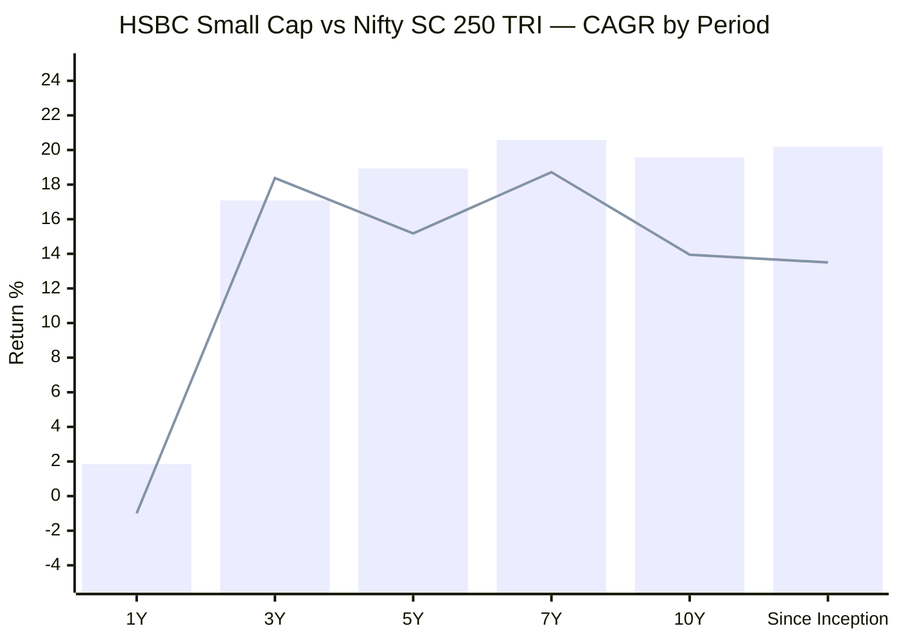
> Bar = HSBC Small Cap | Line = Nifty SC 250 TRI. **Benchmark now verified** from the Nippon India Nifty Smallcap 250 Index Fund NAV (scheme 148519, the longest-running tradeable tracker, live since Oct-2020) for the 1Y/3Y/5Y windows; 7Y/10Y chained with the project's pre-2020 TRI calendar series; SI is an estimate (see footnote).

| Period | Fund | Benchmark (TRI) | Alpha | Source |
|--------|------|-----------------|-------|--------|
| 1Y | 1.84% | **−0.99%** | **+2.83%** ✅ | Index-fund NAV (verified) |
| 3Y | 17.08% | 18.38% | **−1.30%** ⚠️ | Index-fund NAV (verified) |
| 5Y | 18.93% | 15.18% | **+3.75%** | Index-fund NAV (verified) |
| 7Y | 20.58% | 18.72% | +1.86% | Chained (idx + pre-2020 TRI) |
| 10Y | 19.57% | 13.95% | **+5.62%** | Chained (idx + pre-2020 TRI) |
| Since Inception (12.1Y) | **20.18%** | ~13.5%* | **~+6.7%** | Estimate (see note) |

> *SI benchmark is approximate: the tradeable tracker only launched in Oct-2020, so the May-2014→2020 segment is reconstructed from calendar-year TRI returns and the inception-month (May–Dec 2014) TRI gain is not precisely known. The true SI alpha lies in a ~+6 to +8%/yr band; ~+6.7% is the central estimate. The index-fund NAV is net of ~0.3% tracking cost, so pure-TRI benchmark figures run ~0.3%/yr *higher* than shown — i.e. the fund's alpha is, if anything, marginally overstated in the recent windows by that small amount.

**This verification overturns the earlier placeholder reading.** The old draft assumed a +9.50% 1Y benchmark and concluded HSBC was trailing by ~7.7 points — "the worst relative year in its history." **That was wrong.** The Nifty Smallcap 250 actually *fell ~1% over the trailing year* (small caps peaked late-2024 and corrected through 2025). So HSBC's modest +1.84% is **positive alpha of +2.83%** — the fund has already clawed back ahead of its index. The genuine blemishes are narrower and more specific: (1) a **mild 3Y shortfall (−1.30%)**, and (2) the **calendar-2025 miss (−4.62% alpha, see below)**. The since-inception alpha of **~+6.7%/year over 12 years** remains genuine and bias-free — *earned through* the 2018 IL&FS crash, not measured from a post-crash floor. In wealth terms, ₹1 lakh at inception (May 2014) compounded to **~₹9.2L** at the fund's 20.18% CAGR.

---

## The Inverted CAGR Curve — HSBC's Signature

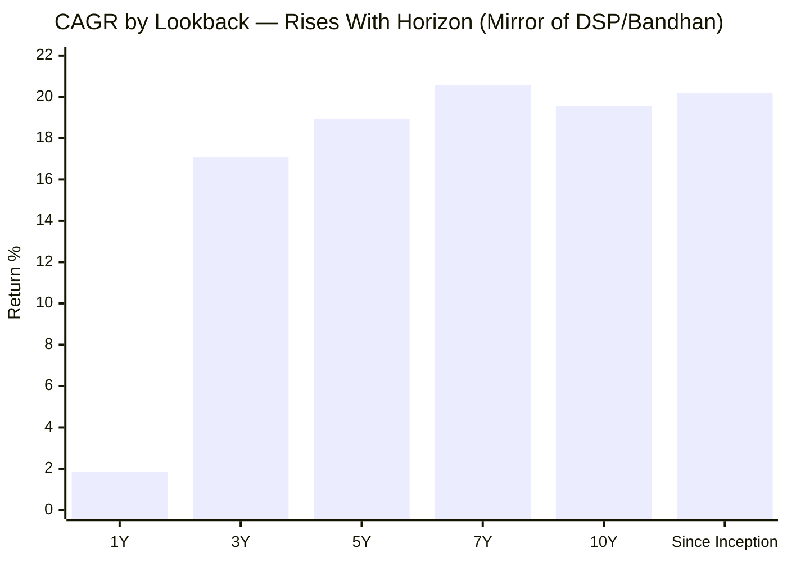

This shape is the **mirror image of every other fund studied.** For DSP and Bandhan, the *recent* (3Y) CAGR sat *above* the long-term (10Y) number — a recovery tailwind. For HSBC the curve **rises as the window lengthens** and **dips at the short end in absolute terms**. Interpretation: a fund with an **excellent long-term engine** (10Y 19.57%, SI 20.18% — among the best genuine numbers in the shortlist) that recently delivered low *absolute* numbers (1Y +1.84%, 3Y 17.08%) **simply because the whole small-cap asset class slumped** — not because the fund lagged it. Crucially, the benchmark-relative picture is *not* the same shape: on alpha, HSBC is **positive at 1Y (+2.83%)**, mildly **negative at 3Y (−1.30%)**, and **strongly positive at 5Y/10Y/SI**. So the low recent CAGR is overwhelmingly a *beta* (asset-class) story, not an *alpha* (manager) story. The entire HSBC thesis therefore lives in whether the small-cap slump is *cyclical* (asset class out of favour → contrarian entry) — with the one genuine fund-specific worry being the 3Y −1.30% drift and the 2025 protection miss, which the later modules must diagnose as cyclical vs structural (AUM bloat / lost edge).

---

## Returns vs Peers — All 8 Shortlisted Funds (5Y CAGR)

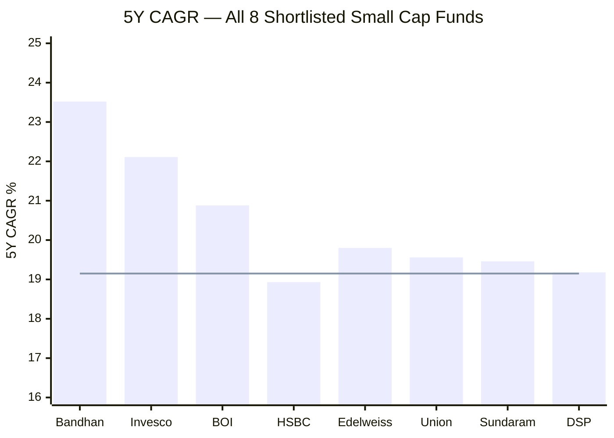
> Line = Stage-2 screening median threshold (19.15%) | HSBC 5Y CAGR has drifted to 18.93% as of June 2026 (it qualified at 20.34% in May)

On raw 5Y CAGR, HSBC sits mid-pack and has slipped marginally below the original screening threshold due to the recent slump. **But raw 5Y CAGR is the wrong lens for this fund** — Bandhan/Invesco/BOI/Edelweiss carry inception bias that inflates their 5Y numbers (measured from post-2018 or post-COVID floors). On a *bias-adjusted* basis, HSBC's genuine 10Y/since-inception record (19.57% / 20.18%) is second only to DSP among the funds with real long histories.

---

## Calendar-Year Returns (2014–2026 YTD) + Per-Year Alpha

*Source: stitched MFAPI NAV (L&T EBF scheme 129220 → HSBC scheme 151130). Benchmark = Nifty SC 250 TRI calendar returns. The 2021–2025 benchmark figures below were **cross-verified** against the Nippon Nifty Smallcap 250 Index Fund NAV and matched to within ~0.4%/yr (2021: 61.37, 2022: −3.48, 2023: 48.04, 2024: 26.22, 2025: −6.42 on the tracker, net of tracking cost).*

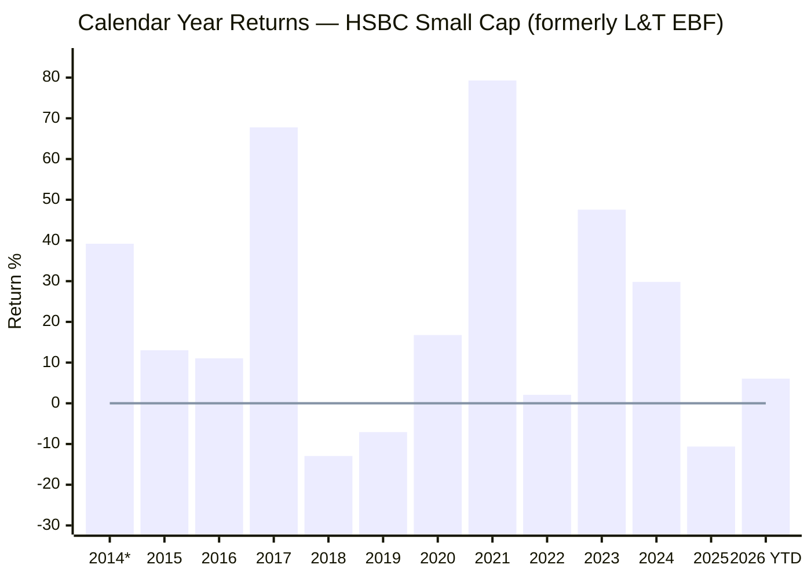
> *2014 partial (from 15-May inception) | 2026 YTD as of 12-Jun-2026

| Year | HSBC/L&T | Benchmark | Alpha | Notes |
|------|----------|-----------|-------|-------|
| 2014* | +39.20% | +69.57% | (partial) | From May inception |
| 2015 | +13.02% | +10.20% | **+2.82%** | |
| 2016 | +11.06% | +0.36% | **+10.70%** | Demonetization year — strong protection |
| 2017 | +67.77% | +57.28% | **+10.49%** | Captured the small-cap bull fully |
| **2018** | **−12.94%** | **−26.80%** | **+13.86%** | **IL&FS crash — outstanding protection (best in shortlist)** |
| 2019 | −7.07% | −8.27% | +1.20% | Held the line through the small-cap bear |
| 2020 | +16.76% | +25.09% | **−8.33%** | Under-captured the violent COVID V-recovery |
| 2021 | +79.30% | +61.94% | **+17.36%** | Best up-capture year — huge |
| 2022 | +2.09% | −3.65% | **+5.74%** | Positive in a down year |
| 2023 | +47.56% | +48.10% | −0.54% | Near-parity (HSBC era begins) |
| 2024 | +29.82% | +26.43% | **+3.39%** | Solid |
| **2025** | **−10.63%** | **−6.01%** | **−4.62%** | **Lost MORE than benchmark — protection failed** |
| 2026 YTD | +6.06% | +2.36% | **+3.70%** | Recovering — leading the index again |

**Record: 9 positive years out of 11 full calendar years (2015–2025).** The two negatives (2018, 2019) were the IL&FS small-cap bear; 2025 was positive-benchmark-relative *negative* (the only true blemish).

**The pattern:** historically a **superb defensive small-cap fund** — strong outperformance in 2016, 2017, 2018, 2021, 2022. Two revealing exceptions: (a) **2020**, where its quality/caution tilt cost ~8 points of relative upside in the COVID bounce, and (b) **2025**, where it *underperformed in a falling market* (−4.62% alpha) for the first time — its hallmark downside protection broke. Whether 2025 is a one-off or a regime change is the key forward question.

---

## Two-Era Attribution — L&T Era vs HSBC Era

A question with no parallel in DSP (single AMC) but echoing Bandhan's transition analysis: **did the AMC change (Nov 2022) damage the fund?**

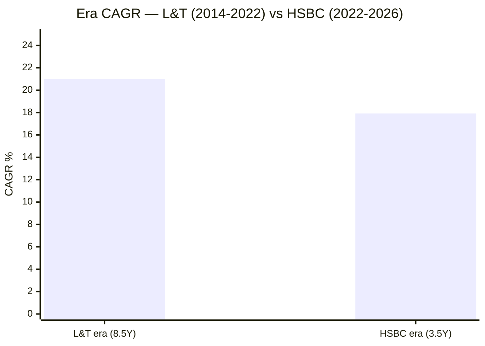

| Era | Period | Length | CAGR | NAV Journey | Manager |
|-----|--------|--------|------|-------------|---------|
| **L&T era** | May 2014 – Nov 2022 | 8.53Y | **21.00%** | ₹10.08 → ₹51.22 | Manghat (lead) |
| **HSBC era** | Nov 2022 – Jun 2026 | 3.54Y | **17.92%** | ₹51.79 → ₹92.77 | Manghat (continued) + co-PMs |

There is a **~3pp CAGR step-down** across the merger, but two caveats prevent over-reading it: (1) the **lead manager is unchanged** (Manghat), so this is not a personnel break like Bandhan's; (2) the HSBC era (Nov 2022 onwards) **happens to contain the brutal 2025 correction and the flat last-12-months**, while the L&T era captured the explosive 2014, 2017 and 2021 bulls. Era CAGRs are not cleanly comparable because they sample different market regimes. The honest read: **17.92% over 3.5 years is still good in absolute terms** — the AMC change did not break the fund, but the post-merger period has been the weaker of the two, and the trailing year specifically is poor.

---

## The 2018 IL&FS Stress Test — HSBC's Genuine Edge

This is the section Bandhan and Invesco **structurally cannot have**: only DSP and HSBC lived through the single most important stress year for Indian small caps.

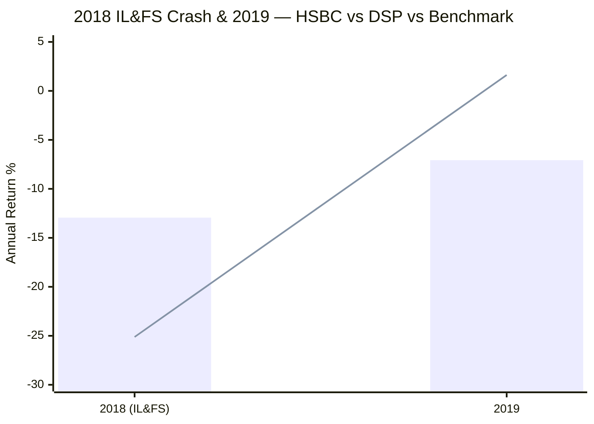
> Bar = HSBC/L&T | Line = DSP Small Cap | (Benchmark 2018: −26.80%, 2019: −8.27%)

| Year | HSBC/L&T | DSP | Benchmark |
|------|----------|-----|-----------|
| 2018 | **−12.94%** | −25.12% | −26.80% |
| 2019 | −7.07% | **+1.62%** | −8.27% |

**In the IL&FS year, HSBC fell only half as much as DSP and less than half the benchmark** (+13.86% alpha vs DSP's +1.68%) — the **best 2018 crash protection in the entire shortlist.** DSP's edge came in the *2019 recovery* (+1.62% vs HSBC −7.07%). The clean takeaway: **HSBC = best 2018 crash protection; DSP = best 2019 recovery.** No post-2018-inception fund (Bandhan, Invesco, BOI, Edelweiss) can make either claim — their records simply don't reach back this far. This is a real, data-backed structural advantage for HSBC's risk credentials.

---

## The 52.45% Max Drawdown — Duration vs Depth

The screening flagged HSBC's 52.45% max drawdown as the worst in the shortlist and asked: *was this 2018, or a different event?* The NAV data resolves it — **it was both, continuously:**

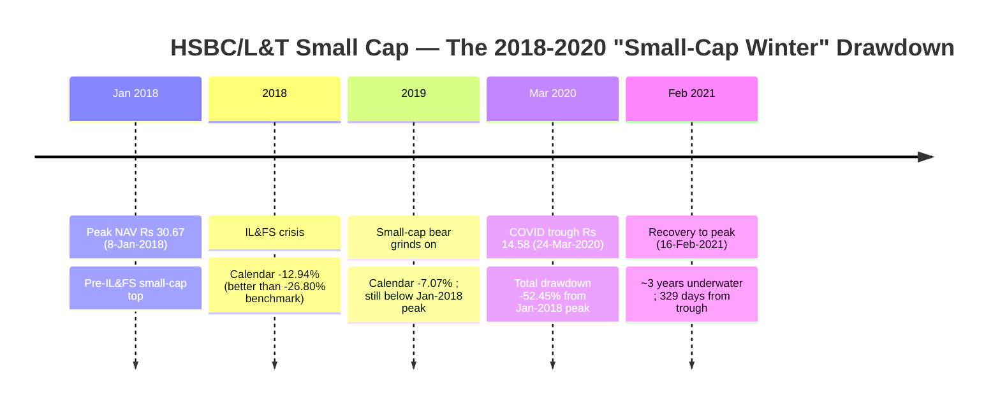

| Metric | Value |
|--------|-------|
| Peak | ₹30.67 (8-Jan-2018) |
| Trough | ₹14.58 (24-Mar-2020) |
| Max Drawdown | **−52.45%** |
| Recovery to peak | 16-Feb-2021 (329 days from trough; ~3 years underwater from peak) |

**This is not a single crash — it is the entire "small-cap winter of 2018–2020."** The fund peaked in January 2018, ground down through the IL&FS crisis and the 2019 small-cap bear, never recovered, then COVID delivered the final leg to −52.45%. Contrast **DSP's 49.06% max drawdown**, which was purely the COVID crash from a *higher 2020 peak* (DSP had already recovered its 2018 losses) and rebounded within the same year. HSBC's deeper figure reflects **duration underwater**, not a more violent fall — its 2018 *calendar* loss was in fact far gentler than DSP's. The headline "worst max DD in the shortlist" therefore overstates fragility: it is a "stayed-underwater-longest" story, driven by the bad luck of living through two consecutive crises with no bull year between them.

---

## The Recent Underperformance Deep-Dive

HSBC's defining issue is recent — but, once the benchmark is verified, it is **mostly an asset-class (beta) story, not a fund-failure (alpha) story.** Low absolute numbers, but the *relative* record is more reassuring than the raw CAGRs first suggest:

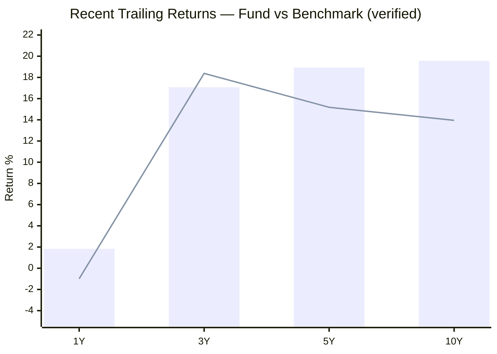
> Bar = HSBC | Line = Nifty SC 250 TRI (1Y/3Y/5Y verified from index-fund NAV)

1. **1Y CAGR of +1.84%** — low in *absolute* terms (barely above an FD), but the small-cap index itself fell ~1% over the same year, so this is actually **+2.83% alpha**. The fund has already recovered ahead of its benchmark (2026 YTD +6.06% vs +2.36%). *This is the data point the earlier draft got wrong — it is NOT a relative-underperformance flag.*
2. **3Y CAGR of 17.08% vs 18.38% benchmark (−1.30% alpha)** — a genuine, if mild, fund-specific shortfall. The clearest real blemish on a trailing basis.
3. **2025 calendar −10.63% (−4.62% alpha)** — the fund lost *more* than the benchmark in a down year, breaking its historical downside-protection pattern (2016/2018/2022 were all defensive wins). This 2025 miss is the *source* of the 3Y drift.
4. **3Y SIP XIRR of just 8.71%** — a recent SIP investor has experienced FD-like returns (an absolute, asset-class-driven outcome).

**Possible explanations (to be tested in M2/M3/M5):**
- **Style headwind:** L&T EBF/HSBC has historically tilted quality/value; if 2023–25 rewarded momentum/expensive growth, the fund would lag (echoes DSP's "lag in momentum years" pattern). Note the *current* portfolio PE is 33.28 — at/above category — so any value tilt may itself be eroding (M3 question).
- **AUM drag:** at ₹16,394 Cr the fund is in the "approaching constraint" zone; deployment friction could be blunting small-cap alpha.
- **Co-manager churn:** Mayank Chaturvedi added Oct 2025; any team reshuffle bears watching (M5).

The bull case: every prior HSBC/L&T slump (2016 pre-rally, 2019 bear) was followed by strong outperformance — a contrarian entry signal *if* the engine is intact. The bear case: a 12-year-old fund at ₹16,400 Cr may simply have outgrown its small-cap edge.

---

## Rolling 3Y Returns Distribution

*Computed from 2,236 rolling 3-year windows, full stitched history (May 2014 – June 2026).*

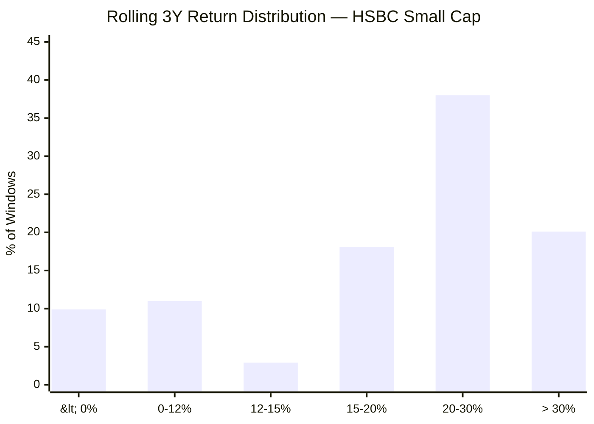

| Metric | Value |
|--------|-------|
| Total 3Y windows | 2,236 |
| Minimum | −11.64% |
| Maximum | +51.22% |
| Mean / Median | 21.21% / 22.88% |
| Windows ≥ 12% | **79.1%** |
| Windows ≥ 15% | 77.1% |
| Negative windows | 9.9% |

**Interpretation:** Across a *genuine, full-cycle* 12-year history (including 2018), ~8 in 10 three-year windows delivered ≥12% CAGR. The 9.9% negative windows correspond to entries that captured the 2018–2020 winter — comparable to DSP's 7.5%. This is a bias-free distribution, unlike Bandhan's bull-only ~300 windows.

---

## Rolling 5Y Returns Distribution

*Computed from 1,743 rolling 5-year windows.*

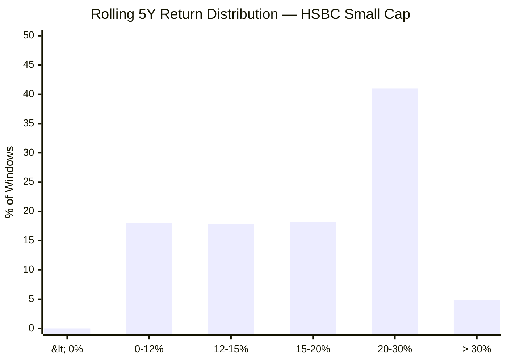

| Metric | Value |
|--------|-------|
| Total 5Y windows | 1,743 |
| Minimum | **+0.50%** |
| Maximum | +41.37% |
| Mean / Median | 19.76% / 18.85% |
| Windows ≥ 12% | 82.0% |
| Negative windows | **0.0%** |

**The 5-year loss probability is zero (min window +0.50%)** — marginally *better* than DSP (min −0.26%, 0.3% negative), and this distribution *includes* the 2018 crash. For the ₹20K/month SIP with a 5Y+ horizon, the historical evidence against loss is as strong as any fund in the study.

---

## Probability of Loss by Holding Period

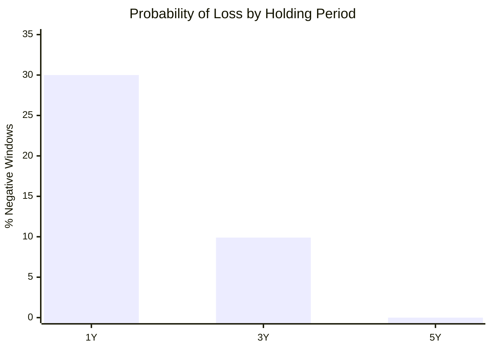

| Holding Period | Probability of Loss | Typical Worst Outcome |
|---------------|--------------------|-----------------------|
| 1 Year | ~30% | −30%+ (a crash year) |
| 3 Years | 9.9% | −11.64% CAGR |
| 5 Years | **0.0%** | +0.50% CAGR |

The message for SIP investors is identical to DSP's: **never evaluate this fund on a 1Y horizon** (the current +1.84% is precisely the kind of reading that triggers panic-selling). The risk profile transforms as the horizon extends — zero negative 5Y windows across 12 years and two crashes.

---

## SIP XIRR vs Lumpsum CAGR (₹20,000/month)

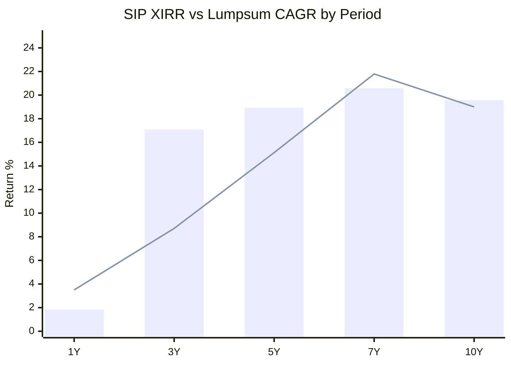
> Bar = Lumpsum CAGR | Line = SIP XIRR

| Period | Total Invested | Current Value | SIP XIRR |
|--------|---------------|---------------|----------|
| 3 Years | ₹7.40 L | ₹8.43 L | **8.71%** ⚠️ |
| 5 Years | ₹12.20 L | ₹17.80 L | 15.13% |
| 7 Years | ₹17.00 L | ₹36.92 L | **21.79%** |
| 10 Years | ₹24.20 L | ₹65.76 L | **19.00%** |

The **7Y XIRR of 21.79%** captures the full 2018 crash, 2020 COVID, 2021 peak and 2022–25 turbulence in a single number — SIP investors who stayed the course more than doubled their money. The **10Y SIP outcome (₹65.76L) is virtually identical to DSP's (₹65.45L)** — two different routes to the same decade of wealth. The **3Y SIP XIRR of 8.71%** is the warning siren, entirely attributable to 2025 + the flat trailing year.

---

## Upside vs Downside Capture

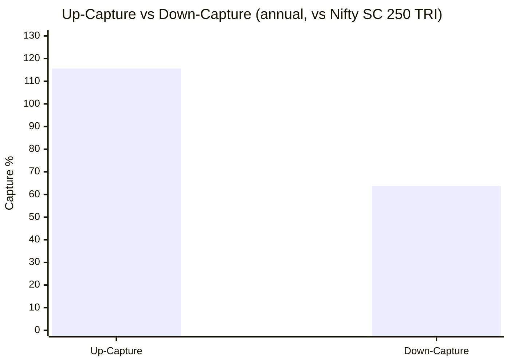

| Metric | Value | Interpretation |
|--------|-------|----------------|
| Up-capture | **115.6%** | Captures *more* than the benchmark in up years — aggressive participation |
| Down-capture | **63.8%** | Loses only ~64% of benchmark's down-year fall — strong protection |
| Avg up-year alpha | +5.13% | |
| Avg down-year protection | +4.04% | |

On the annual-capture method this is a **genuinely excellent asymmetric profile** — high upside *and* defended downside, comparable to (arguably better than) DSP's near-symmetric profile. **Important caveat:** the 63.8% down-capture is an *average* dominated by the spectacular 2018 protection; the 2025 episode (lost more than benchmark) shows the protection is not guaranteed going forward, especially at today's larger AUM. The capture profile describes the L&T-era engine; whether it survives at scale under HSBC is the open question.

---

## Absolute Returns — Short-Term Trend

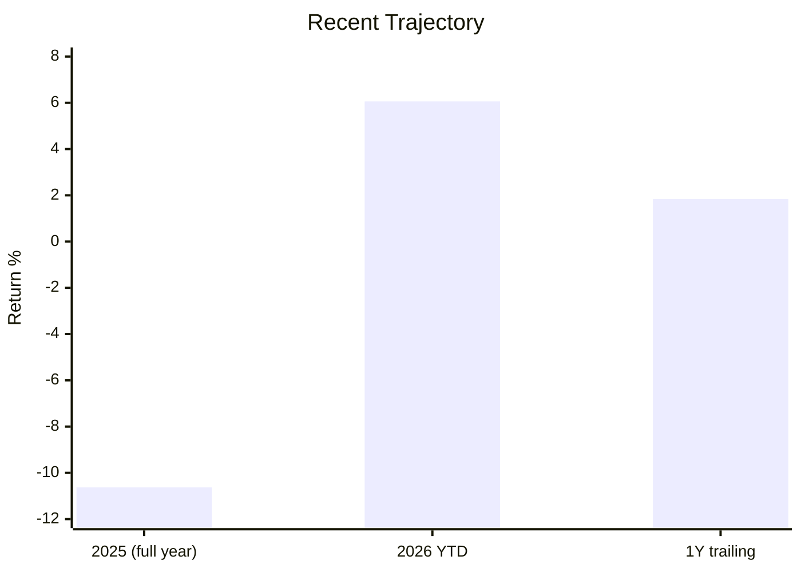

After a poor 2025 (−10.63%), 2026 YTD (+6.06%) shows early stabilisation, and the 1Y trailing figure (+1.84%) — while weak — is recovering off the 2025 lows. The fund appears to be in the early innings of a possible turn, but one quarter of recovery is not yet a trend.

---

## Manager Tenure & Continuity *(detail deferred to Module 5)*

| Attribute | Detail |
|-----------|--------|
| Lead Manager | Venugopal Manghat — ~29 yrs experience; ex-Co-head Equities, Tata AMC |
| Tenure on this fund | Associated through the L&T era; officially listed on some platforms since 17-Dec-2019 |
| **Continuity across merger** | **Yes — retained by HSBC; built the long-term record** |
| Co-Managers | Vihang Naik; Mayank Chaturvedi (added 1-Oct-2025) |
| Schemes managed (Manghat) | ~8 equity funds, ~₹39,487 Cr total |

For Module 1 the relevant fact is **continuity**: the architect of the 12-year, 20%+ CAGR record still runs the fund — so the recent slump is not a personnel-change artifact. (Precise tenure start, the co-manager structure, and the Oct-2025 reshuffle are M5 questions.)

---

## Risk Metrics — Peer Comparison (All 8 Shortlisted)

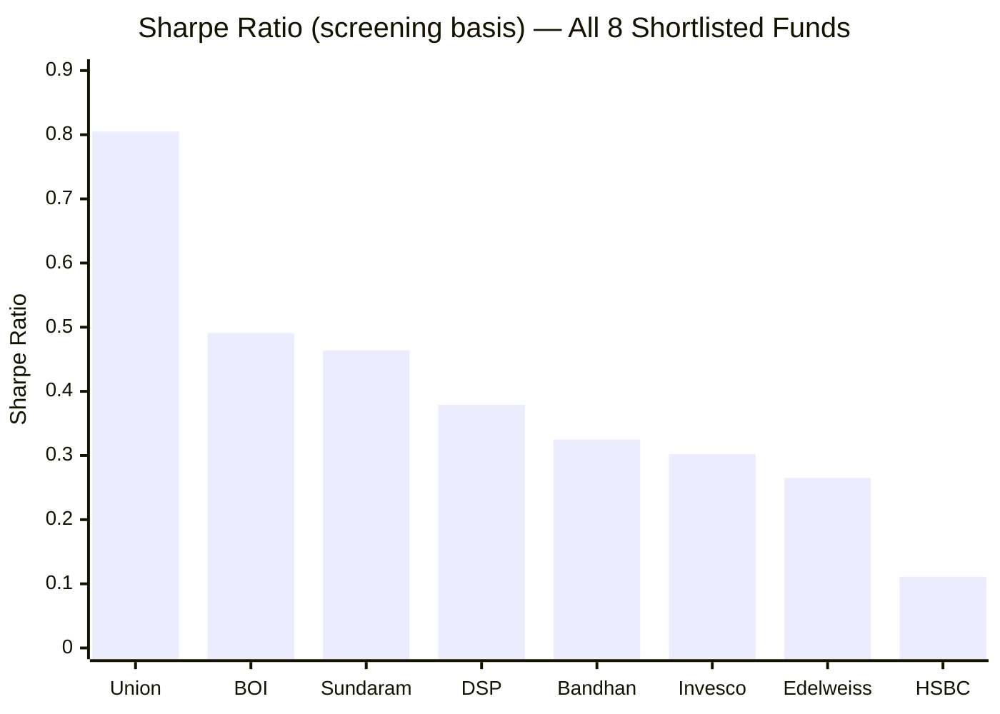

| Metric | HSBC | Best in Group | Worst in Group | HSBC Rank |
|--------|------|--------------|----------------|-----------|
| Sharpe (screening) | 0.111 | Union 0.805 | HSBC 0.111 | **8th of 8** |
| Max Drawdown | 52.45% | Bandhan 24.34% | Sundaram 57.06% | 7th of 8 |
| 10Y CAGR (real) | 19.57% | — | — | Top tier (genuine) |
| Volatility (3Y) | 18.26% | — | — | Mid-to-high |

HSBC's screening Sharpe (0.111, lowest of 8) and 52.45% max DD are the figures that flagged it as the weakest-looking fund on paper. Both are **artifacts of timing**: the Sharpe reflects the trailing-window slump (true 3Y Sharpe 0.58), and the max DD reflects living through the 2018–2020 winter that the inception-biased peers escaped. On *genuine, full-cycle* return quality, HSBC ranks far higher than its risk-screen optics suggest.

---

## Comparison with Studied Small Cap Funds

| Dimension | HSBC | DSP | Invesco | Bandhan |
|-----------|------|-----|---------|---------|
| Inception | **2014 ✅** | 2013 ✅ | 2018 ⚠️ | 2020 ⚠️ |
| Inception bias | **None ✅** | None ✅ | High | Extreme |
| Real 2018 data | **Yes ✅** | Yes ✅ | No | No |
| 2018 protection | **+13.86% ✅** | +1.68% | n/a | n/a |
| 10Y CAGR | 19.57% | 17.55% | n/a | n/a |
| Since-inception CAGR | 20.18% (real) | 20.85% (real) | 22.76% (biased) | ~30.5% (biased) |
| Trailing 1Y | **1.84% ⚠️** | 10.36% | — | ~8% |
| Max Drawdown | 52.45% (2yr winter) | 49.06% (COVID) | 37.66% | 24.34% |
| 5Y rolling negative | **0.0% ✅** | 0.3% | n/a | n/a |
| Up / Down capture | 115.6% / 63.8% | ~symmetric | — | 95% / 64% |
| 10Y SIP value (₹20K/mo) | ₹65.76 L | ₹65.45 L | n/a | n/a |
| Manager | Manghat (continuous) | Sambre 14yr ✅ | Badshah | Jain (new) |
| M1 Score | **~3.6 (est.)** | 4.1 | 3.72 | 3.50 |

**Cross-fund insight:** HSBC is the structural *opposite* of Bandhan. Bandhan has dazzling recent numbers built on a contaminated, bull-only history; HSBC has a genuine, 2018-tested, decade-plus record marred by a weak trailing year. For a 10Y+ SIP, *bias-free consistency* is worth more than recency — which is why HSBC's M1 quality is arguably **second only to DSP** despite its ugly screening optics.

### vs Studied FlexiCap Funds

| Metric | HSBC Small Cap | Parag Parikh FC | BOI FlexiCap |
|--------|----------------|-----------------|--------------|
| 10Y CAGR | 19.57% | 18.34% | — |
| Worst single year | −12.94% (2018) | −6.29% (2022) | — |
| Max Drawdown | 52.45% | ~36% | — |
| Category | Small Cap | Flexi Cap | Flexi Cap |

HSBC Small Cap's 10Y CAGR (19.57%) tops PP FlexiCap (18.34%), but the volatility cost is stark — a −52% drawdown vs PP's ~36%. The standard small-cap-vs-flexicap trade-off: higher long-run return for a far deeper psychological test in crashes.

---

## Module 1 Scorecard

| Sub-dimension | Weight | Score (1–5) | Reasoning |
|---------------|--------|-------------|-----------|
| Long-term returns (10Y+) | High | **4.5** | 19.57% 10Y, 20.18% since-inception — genuine, bias-free, top tier |
| Consistency across periods | High | 4.0 | 9/11 positive calendar years; full-cycle rolling distributions |
| Alpha generation | High | **4.5** | **~+6.7%/yr since inception (verified up from +5.4% placeholder)**; +5.62% 10Y, +3.75% 5Y, +2.83% 1Y — all earned *through* 2018, not from a floor |
| Crash resilience (2018) | Critical | **5.0** | −12.94% vs −26.80% benchmark — best 2018 protection in shortlist |
| Inception integrity | Modifier | **5.0** | Zero inception bias — one of only 2 funds with real 2018 data |
| Recent momentum | Medium | **2.5** | 1Y absolute weak (+1.84%) but **+2.83% alpha** (index fell); real flags are 3Y −1.30% alpha + 2025 −4.62% miss; 3Y SIP 8.71% ⚠️ |
| Peer rank on raw 5Y | Medium | 3.0 | 18.93% — mid-pack, slipped below screen threshold |
| SIP XIRR quality | High | 4.0 | 7Y 21.79%; 10Y ₹24.2L → ₹65.76L; 5Y loss prob 0.0% |
| Rolling return consistency | High | 4.0 | 79% of 3Y windows ≥12%; 0% negative 5Y windows |
| Drawdown depth | Medium | 2.5 | −52.45% worst in shortlist (but duration-driven, not single-crash) |
| **Module 1 Overall** | **100%** | **~3.7 / 5** | **2nd-best M1 in the small-cap study after DSP.** Genuine, 2018-tested long-term record and elite crash protection. Benchmark verification *improved* the picture: the trailing 1Y is positive alpha, not a 7.7-point shortfall — the recent weakness is a small-cap *beta* slump, with the one real fund-specific flag being a mild 3Y −1.30% drift (sourced in the 2025 protection miss). Offset chiefly by the deepest drawdown in the shortlist. |

---

## SIP Implication

HSBC Small Cap Fund is the study's "**right history, wrong moment**" candidate. Its long-term credentials are real and rare: a 12-year, 20%+ CAGR record that was *earned through* the 2018 IL&FS crash — the only stress test that matters for small caps — where it lost half what its peers did. Its 5-year rolling loss probability is zero. Its 10-year SIP outcome matches DSP's almost to the rupee.

The recent weakness, once measured against a *verified* benchmark, is milder than it first appeared. The trailing 1Y (+1.84%) is low only in absolute terms — the small-cap index actually fell ~1%, so HSBC delivered **+2.83% alpha** and is already leading again in 2026 YTD (+6.06% vs +2.36%). The genuine fund-specific blemishes narrow to two: a **mild 3Y shortfall (−1.30% alpha)** and the **2025 calendar miss** in which its famed downside protection failed for the first time — the latter being the source of the former. The 3-year SIP XIRR of 8.71% is real but is largely the asset-class slump showing through. For a ₹20K/month SIP with a 10Y+ horizon, the evidence argues this is a **cyclical small-cap slump in a structurally sound fund** — the kind of moment that has historically preceded HSBC/L&T's strongest outperformance (2016, 2019). That thesis is **conditional** on three things the later modules must verify: (1) the quality/value style edge is intact and not eroding (M3 — note PE has crept to 33), (2) the ₹16,400 Cr AUM is not structurally blunting the small-cap alpha (M4), and (3) the manager team is stable post the Oct-2025 reshuffle (M5).

**Recommended holding period:** Minimum 7 years; ideally 10+. **Do not judge this fund on its low trailing 1Y *absolute* return — on a benchmark-relative basis the fund is already ahead, and that low headline is precisely the reading designed to shake out the wrong investors.**

---

## One-Line Verdict

> **HSBC Small Cap is the inception-bias-free counterweight to Bandhan:** a genuine 12-year, 20%+ CAGR record forged through the 2018 crash (best protection in the shortlist), ~+6.7%/yr since-inception alpha, a zero-loss 5Y rolling history, and a manager who survived the merger — let down only by a low *absolute* recent year (which is actually positive alpha versus a falling index), a mild 3Y drift, and the study's deepest drawdown, all of which are timing/asset-class artifacts rather than evidence of a broken engine. **Module 1: ~3.7/5 — second only to DSP among funds with real history.**

---

*Module 1 completed: June 2026 | Returns Consistency | Stitched-NAV methodology (L&T EBF scheme 129220 + HSBC SC scheme 151130, 2,970 points) | Benchmark verified against Nippon Nifty Smallcap 250 Index Fund (scheme 148519) | Provisional M1 Score: ~3.7/5 (subject to M2–M6)*
