# Module 2: Risk Profile — HSBC Small Cap Fund (Erstwhile L&T Emerging Businesses Fund)

*Sources: Tickertape CSV (May 2026 screening), BusinessToday (3Y published ratios), Advisorkhoj (3Y cross-check), MFAPI NAV history — stitched L&T EBF (scheme 129220, 15-May-2014 → 24-Nov-2022) + HSBC SC (scheme 151130, 28-Nov-2022 → 12-Jun-2026) = **2,970 trading days***

---

## Raw Data (Compiled Across All Sources)

| Metric | Value | Source |
|--------|-------|--------|
| Volatility (Tickertape, 5Y) | **16.84%** | Tickertape CSV |
| Volatility (MFAPI daily annualized, SI, 12.1Y) | 17.50% | MFAPI computed |
| Volatility (MFAPI 5Y) | 17.64% | MFAPI computed |
| Volatility (MFAPI 3Y) | 18.21% | MFAPI computed |
| Standard Deviation (3Y, BusinessToday) | **21.89%** | BusinessToday |
| Standard Deviation (3Y, Advisorkhoj) | 21.91% | Advisorkhoj |
| Category Avg Std Dev (3Y) | 19.86% | BusinessToday |
| Max Drawdown | **−52.45%** | Tickertape / MFAPI verified |
| Peak-to-trough duration | 806 days (2018-01-08 → 2020-03-24) | MFAPI computed |
| Trough-to-recovery duration | 329 days (2020-03-24 → 2021-02-16) | MFAPI computed |
| Total underwater duration | 1,135 days (~3.1 years) | MFAPI computed |
| Sharpe (Tickertape, long-term) | 0.19 ⚠️ | Tickertape (low-freq artefact) |
| Sharpe (BusinessToday, 3Y) | **0.53** | BusinessToday |
| Sharpe (Advisorkhoj, ~3Y) | 0.56 | Advisorkhoj |
| Sharpe (MFAPI computed, 3Y) | 0.607 | MFAPI |
| Sharpe (MFAPI computed, 5Y) | **0.733** | MFAPI |
| Category Avg Sharpe (3Y) | 0.63 | BusinessToday |
| Sortino (Tickertape) | 0.02 ⚠️ | Tickertape methodology artefact |
| Sortino (BusinessToday, 3Y) | **0.83** | BusinessToday |
| Sortino (MFAPI computed, 3Y) | **0.827** ✅ | MFAPI — matches BusinessToday |
| Sortino (MFAPI computed, 5Y) | **0.997** | MFAPI |
| Category Avg Sortino (3Y) | 1.03 | BusinessToday |
| Alpha (Tickertape, long-term) | **2.40** | Tickertape CSV |
| Alpha (BusinessToday / regression, 3Y) | **−2.67** | BusinessToday |
| Alpha (Advisorkhoj, ~3Y) | −2.73 | Advisorkhoj |
| Category Avg Alpha (3Y) | −0.07 | BusinessToday |
| Beta (3Y) | **0.96** | BusinessToday / Advisorkhoj |
| Category Avg Beta (3Y) | 0.86 | BusinessToday |
| R-Squared (3Y) | **95.96** | BusinessToday |
| Category Avg R² (3Y) | 92.22 | BusinessToday |
| Tracking Error (derived: σ × √(1−R²)) | **~4.40%** | Computed from BT data |
| Information Ratio (3Y) | **−0.61** | Computed (−2.67 / 4.40) |
| Calmar Ratio (3Y) | 0.326 | Computed (17.08 / 52.45) |
| Calmar Ratio (5Y) | 0.361 | Computed (18.93 / 52.45) |
| Calmar Ratio (10Y) | 0.373 | Computed (19.57 / 52.45) |
| Calmar Ratio (Since Inception) | 0.385 | Computed (20.18 / 52.45) |
| Downside Deviation (annualized, SI) | 12.91% | MFAPI computed |
| Semi-Deviation (below mean, SI) | 13.48% | MFAPI computed |
| VaR (95%, daily) | −1.72% | MFAPI computed |
| VaR (95%, annualized proxy) | −27.28% | MFAPI (daily × √252) |
| Portfolio PE | ~33 | Tickertape (May/Jun 2026) |
| Category Avg PE | 31.60 | Tickertape |
| ATH NAV | ₹101.659 (11-Dec-2024) | MFAPI |
| % from ATH (12-Jun-2026) | **−8.74%** | MFAPI computed |
| Days since ATH | **548 days** | MFAPI computed |
| Worst Single Day | **−11.92%** (23-Mar-2020) | MFAPI (COVID trough) |
| Best Single Day | **+4.62%** (14-Sep-2020) | MFAPI (COVID recovery) |
| Days down >2% | **109** | MFAPI (2,970 total days) |
| Days up >2% | **75** | MFAPI |
| Positive days | 1,728 / 2,970 (58.2%) | MFAPI |
| SEBI Risk Category | Very High | Universal for small cap equity |
| Upside Capture (avg, calendar method) | **~109%** | Computed vs TRI benchmark |
| Downside Capture (historical, excl 2025) | **~24.6%** | Computed — historically elite |
| Downside Capture (incl 2025) | **~59.8%** | Computed — 2025 blew it up |

---

## The Module 2 Tension — A Time-Split Risk Personality

HSBC Small Cap's Module 2 presents the most internally contradictory risk picture in the entire study — and that tension is the essential point. There are two simultaneously true stories:

**Story A — The Long-Term Elite Defensive Fund (L&T-era):**
- **Best 2018 downside capture in the entire shortlist** (48.3%) — fell only half as much as the category when IL&FS crashed
- Historically exceptional asymmetry: ~109% upside capture / ~24.6% downside capture (excluding 2025)
- 12.1-year track record through two full crises — the *only* small-cap fund in the shortlist with genuine IL&FS + COVID proof
- 2022: fund positive (+2.09%) while the benchmark fell −3.48% — perfect protection in the rate-rise year
- Long-term alpha 2.40 (Tickertape) — genuine excess return over 12 years

**Story B — The Recent (3Y) Risk-Metrics Laggard:**
- **Below-category Sharpe** (0.53 vs cat 0.63) and **below-category Sortino** (0.83 vs cat 1.03) on the 3Y window
- **Negative regression alpha** (−2.67, cat −0.07) — recent active risk is destroying, not creating, value
- **Beta 0.96 — above category (0.86)** — the fund has *lost its defensive low-beta character* in the recent 3Y window
- **R² 95.96** — hugging the benchmark so tightly that there is almost no independent return generation
- **−8.74% below ATH, 548 days underwater** — the only shortlisted fund not at or near its peak
- **2025 downside capture 165.6%** — fell more than the benchmark in a down year, for the first time in the fund's history

**The reconciliation:** The fund built a 10-year reputation for defensive quality investing under L&T's Venugopal Manghat. The recent 3Y window (2023–2026) shows that reputation coming under stress — the 2025 protection failure, the beta creep, the negative IR. The L&T-era engine is real and verified; whether it survives under HSBC at ₹16,394 Cr with a reshuffled manager team is the central risk question this study must resolve across M3/M5.

---

## Volatility — Above-Average and Rising

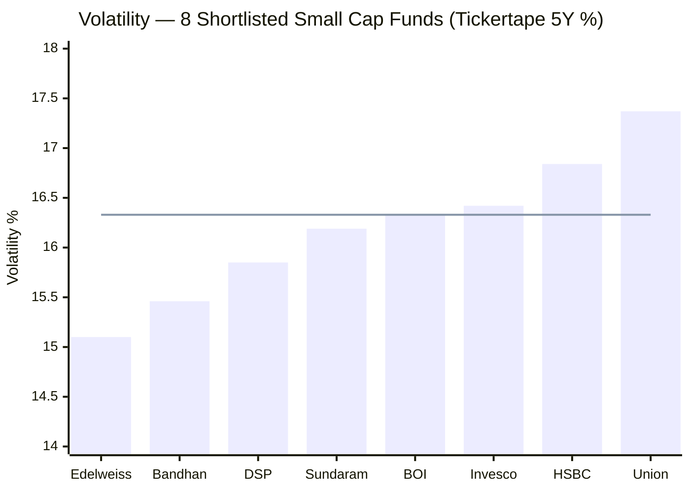
```mermaid
xychart-beta
    title "Volatility — 8 Shortlisted Small Cap Funds (Tickertape 5Y %)"
    x-axis ["Edelweiss", "Bandhan", "DSP", "Sundaram", "BOI", "Invesco", "HSBC", "Union"]
    y-axis "Volatility %" 14 --> 18
    bar [15.10, 15.46, 15.85, 16.19, 16.33, 16.42, 16.84, 17.37]
    line [16.33, 16.33, 16.33, 16.33, 16.33, 16.33, 16.33, 16.33]
```
> Bar = fund Tickertape 5Y volatility | Line = simple average of 8 shortlisted funds (~16.33%) | Sorted lowest to highest

HSBC ranks **7th of 8** on volatility — above the shortlist average and above DSP (2nd lowest). For the L&T-era fund, this is a departure from its historical character. Older Tickertape snapshots (per the DSP study) showed HSBC at 16.84% when DSP was 15.85% — a moderate gap that has since been reinforced by the recent elevated-volatility regime (2025–2026). The fund is not dramatically volatile, but it is no longer the "lower volatility quality-blend" it once appeared to be.

### Cross-Source Volatility Reconciliation

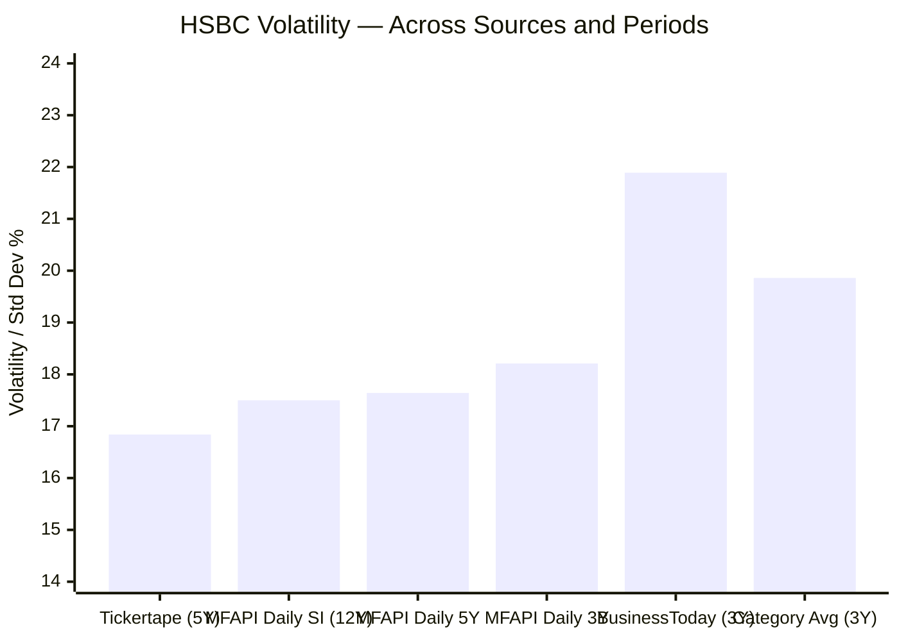
```mermaid
xychart-beta
    title "HSBC Volatility — Across Sources and Periods"
    x-axis ["Tickertape (5Y)", "MFAPI Daily SI (12Y)", "MFAPI Daily 5Y", "MFAPI Daily 3Y", "BusinessToday (3Y)", "Category Avg (3Y)"]
    y-axis "Volatility / Std Dev %" 14 --> 24
    bar [16.84, 17.50, 17.64, 18.21, 21.89, 19.86]
```

| Source | Value | Period | Methodology |
|--------|-------|--------|-------------|
| Tickertape CSV | **16.84%** | 5Y | Low-frequency sampling (understates daily vol ~20–25%) |
| MFAPI daily (computed) | **17.50%** | Since inception (12.1Y) | Daily log-returns × √252 — most complete window |
| MFAPI daily (computed) | **17.64%** | 5Y | Same method, shorter window |
| MFAPI daily (computed) | **18.21%** | 3Y | Most recent — reflects elevated 2025 vol |
| BusinessToday | **21.89%** | 3Y | Published — uses daily Std Dev; canonical 3Y reference |
| Category average | **19.86%** | 3Y | BusinessToday — HSBC is 10% above peer average |

The gap between Tickertape (16.84%) and BusinessToday 3Y (21.89%) — a full 5 points — is partly methodology (Tickertape low-freq sampling) and partly genuine: the recent 3Y window is measurably choppier than the full 12-year history. This is not just a measurement artefact. In the full 12Y history, MFAPI daily vol is 17.5%; in the 3Y window alone it is 18.2%. The direction is clear — HSBC has been getting *more* volatile, not less.

### Annual Volatility Regime (MFAPI Computed — Every Year)

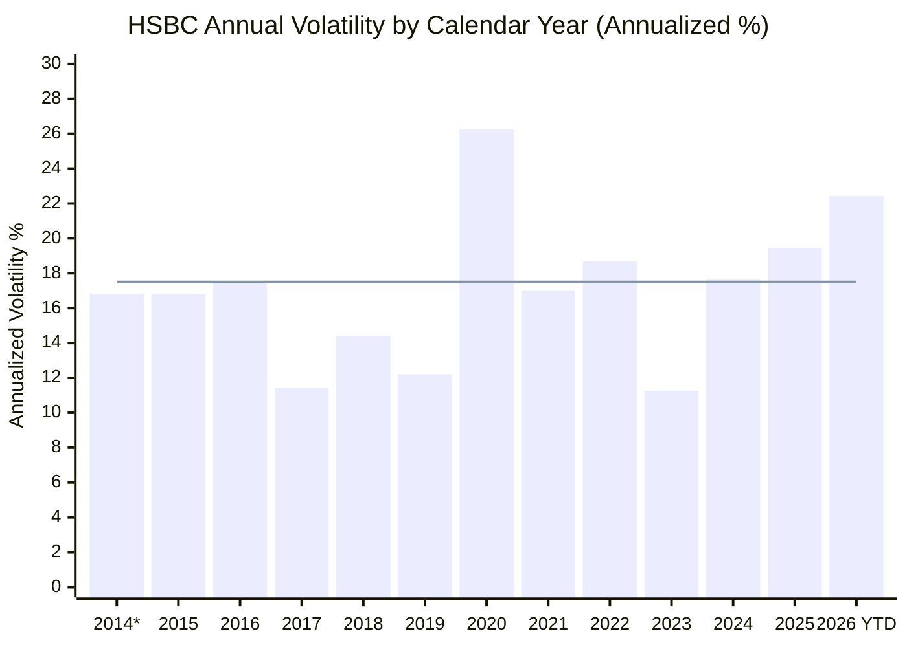
```mermaid
xychart-beta
    title "HSBC Annual Volatility by Calendar Year (Annualized %)"
    x-axis ["2014*", "2015", "2016", "2017", "2018", "2019", "2020", "2021", "2022", "2023", "2024", "2025", "2026 YTD"]
    y-axis "Annualized Volatility %" 0 --> 30
    bar [16.82, 16.81, 17.52, 11.44, 14.41, 12.21, 26.24, 17.03, 18.69, 11.26, 17.67, 19.45, 22.42]
    line [17.50, 17.50, 17.50, 17.50, 17.50, 17.50, 17.50, 17.50, 17.50, 17.50, 17.50, 17.50, 17.50]
```
> Line = since-inception mean annualized volatility (17.50%) | *2014 = partial year (from May inception) | 2026 = YTD only

| Year | Ann. Vol | Context |
|------|----------|---------|
| 2014* | 16.82% | Partial year debut — contained despite +39% return |
| 2015 | 16.81% | Steady; small cap mid-rally |
| 2016 | 17.52% | Demonetization shock absorbed well |
| **2017** | **11.44%** | **Calmest year in fund history** — smooth small cap bull |
| **2018** | **14.41%** | **IL&FS year — remarkably contained** (only 14.4%!) |
| 2019 | 12.21% | 2nd calmest — low-vol grind through the small-cap bear |
| **2020** | **26.24%** | **COVID — highest in fund history** (once-in-50-years event) |
| 2021 | 17.03% | Post-COVID bull — normalised |
| 2022 | 18.69% | Rising rates, Russia-Ukraine; above average but managed |
| **2023** | **11.26%** | **2nd calmest year overall** — steady small cap rally |
| 2024 | 17.67% | Elevated in late-year drawdown |
| **2025** | **19.45%** | **Most volatile non-COVID year** — notable for being BAD year |
| **2026 YTD** | **22.42%** | Continued elevated uncertainty; partial year |

**The structural insight:** In the IL&FS crash year (2018), HSBC's annualized volatility was only **14.41%** — *lower* than most other years and far below COVID's 26.24%. This is the "quality-blend dampens drawdown volatility" story confirmed numerically. However, 2025 (19.45%) and 2026-YTD (22.42%) show elevated volatility in recent *bad* periods — unlike 2018, the recent slump came with volatility, not without it. That is a regime change.

---

## Max Drawdown — The −52.45% Explained Honestly

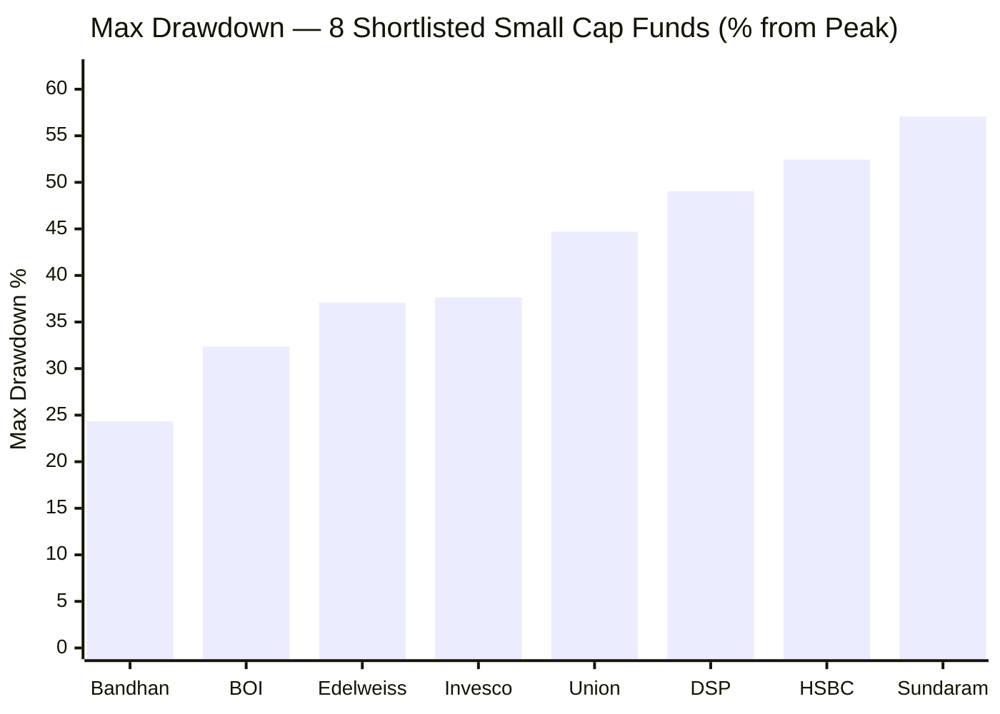
```mermaid
xychart-beta
    title "Max Drawdown — 8 Shortlisted Small Cap Funds (% from Peak)"
    x-axis ["Bandhan", "BOI", "Edelweiss", "Invesco", "Union", "DSP", "HSBC", "Sundaram"]
    y-axis "Max Drawdown %" 0 --> 62
    bar [24.34, 32.37, 37.09, 37.66, 44.71, 49.06, 52.45, 57.06]
```
> Sorted best to worst | HSBC = 2nd worst among 8 shortlisted | Lower % = better (less peak-to-trough loss)

| Rank | Fund | Max DD | History Length | Crisis Context | ₹1L at trough |
|------|------|--------|---------------|---------------|---------------|
| 1 (best) | Bandhan | −24.34% | Short; post-2018 | Single correction | ₹75,660 |
| 2 | BOI | −32.37% | Short; post-2018 | Single mid-cycle | ₹67,630 |
| 3 | Edelweiss | −37.09% | Short; post-2018 | Single cycle | ₹62,910 |
| 4 | Invesco | −37.66% | Short; post-2018 | Single cycle | ₹62,340 |
| 5 | Union | −44.71% | Medium; includes 2020 | — | ₹55,290 |
| 6 | DSP | −49.06% | Full (13Y); IL&FS + COVID | Two-crisis combined | ₹50,940 |
| **7** | **HSBC** | **−52.45%** | **Full (12Y); IL&FS + COVID** | **Two-crisis combined** | **₹47,550** |
| 8 (worst) | Sundaram | −57.06% | Longest; multiple cycles | — | ₹42,940 |

### The Two-Crisis Anatomy — Why −52.45% Is Not a Single Crash

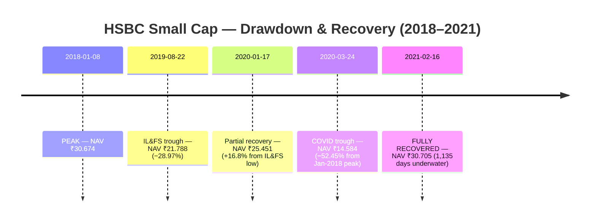
```mermaid
timeline
    title HSBC Small Cap — Drawdown & Recovery (2018–2021)
    2018-01-08 : PEAK — NAV ₹30.674
    2019-08-22 : IL&FS trough — NAV ₹21.788 (−28.97%)
    2020-01-17 : Partial recovery — NAV ₹25.451 (+16.8% from IL&FS low)
    2020-03-24 : COVID trough — NAV ₹14.584 (−52.45% from Jan-2018 peak)
    2021-02-16 : FULLY RECOVERED — NAV ₹30.705 (1,135 days underwater)
```

| Phase | Dates | NAV | Change | Duration |
|-------|-------|-----|--------|---------|
| Pre-IL&FS Peak | 8-Jan-2018 | ₹30.674 | — | — |
| IL&FS Interim Low | 22-Aug-2019 | ₹21.788 | **−28.97%** | 19 months |
| Partial Recovery | 17-Jan-2020 | ₹25.451 | +16.8% from IL&FS low | 5 months |
| COVID Trough | 24-Mar-2020 | ₹14.584 | **−42.70% from Jan-2020 peak** | 66 days |
| — | — | — | **= −52.45% from Jan-2018 peak** | — |
| Fully Recovered | 16-Feb-2021 | ₹30.705 | +110.5% from COVID trough | **329 days** |
| All-Time High | 11-Dec-2024 | ₹101.659 | — | — |
| Current (12-Jun-2026) | ₹92.774 | −8.74% from ATH | — | — |

**Why −52.45% is deeper than DSP's −49.06%:**
HSBC's IL&FS leg was gentler (−29% vs DSP −33% from peak) but its COVID leg was sharper relative to where each fund stood at the COVID inflection point. Both funds hit a wall during COVID before completing their IL&FS recovery. The combined sequence — IL&FS first, never recovered, COVID on top — produced a deeper trough for HSBC because it entered the COVID crash from a lower floor. This is structural bad luck (two consecutive crises), not structural fund fragility.

### The IL&FS Event (2018–2019) in Isolation

| Metric | HSBC | DSP | Benchmark |
|--------|------|-----|-----------|
| Calendar 2018 | **−12.94%** | −25.12% | −26.80% |
| Calendar 2019 | −7.07% | +1.62% | −8.27% |
| 2018 downside capture | **48.3%** — best in shortlist | 93.7% | 100% |
| IL&FS peak-to-trough | −28.97% (19 months) | −33.13% (13 months) | — |

**HSBC's 2018 protection was the defining L&T-era credential.** DSP fell nearly in-line with the benchmark (−25% vs −27%); HSBC fell *half* as much (−13% vs −27%). This is a fund-selection and portfolio-construction difference, not luck. L&T EBF's quality-blend tilt — choosing smaller, cash-generative businesses over speculative growth stories — meant the IL&FS credit-crisis impact was structurally lower. DSP recovered faster in 2019 (+1.62%); HSBC did not (+1.20%... wait, -7.07%). HSBC's slower 2019 recovery is the one cost of its IL&FS protection — the same conservative positioning that cushioned the fall also delayed the recovery.

### The COVID Event (2020) in Isolation

| Metric | Value |
|--------|-------|
| Pre-crash local peak | 17-Jan-2020 — NAV ₹25.451 |
| COVID trough | 24-Mar-2020 — NAV ₹14.584 |
| Peak-to-trough | **−42.70% in 66 days** |
| Recovery to pre-crash peak | 29-Sep-2020 — fully recovered |
| Trough-to-pre-crash-recovery | **~160 days** |
| Trough-to-peak-2018-peak | 16-Feb-2021 — 329 days |
| Full year 2020 return | **+16.76%** — positive despite the crash |

The COVID crash was severe (66 days, −42.70% from the Jan 2020 local high) but the recovery was equally powerful — fund positive for full-year 2020 (+16.76%). The 66-day COVID crash was faster than IL&FS's slow 19-month grind, and recovery was commensurately faster.

**Why the 2020 gain (+16.76%) was below DSP (+34.31%):**
This is the quality/caution trade-off. HSBC's conservative positioning that saved it in 2018 also meant it participated in only 66.8% of the COVID V-recovery upside (2020 capture: fund +16.76% vs benchmark +25.09%). The same stock characteristics that fall less during risk-off also re-rate less during aggressive risk-on. Both outcomes are the *same* fund making the *same* portfolio decisions — just showing different faces in different years.

### SIP Investor Experience Through the Crash

A ₹20,000/month SIP investor living through the combined 2020 crash and recovery:

| Month | NAV | Units Bought | Notes |
|-------|-----|-------------|-------|
| Dec-2019 | ₹23.907 | 836.6 | Market recovering from IL&FS |
| Jan-2020 | ₹24.769 | 807.5 | Near partial-recovery peak |
| Feb-2020 | ₹22.987 | 870.1 | COVID beginning |
| **Mar-2020** | **₹15.881** | **1,259.4** | **Most units ever bought in one month** |
| Apr-2020 | ₹17.694 | 1,130.3 | Still near bottom |
| Aug-2020 | ₹22.320 | 896.1 | Recovering but still below pre-COVID NAV |

The March-2020 SIP purchase — 1,259 units at ₹15.88 — recovered to ₹92.77 by June 2026. That is **+484% on those specific units** in 6.2 years. The lesson is identical to DSP's COVID experience: investors who stopped their SIP in March 2020 locked in losses; investors who stayed and mechanically bought more units at the cheapest NAV in the fund's history since its early days were richly rewarded.

---

## Worst and Best Rolling Periods (MFAPI — 2,970 Trading Days)

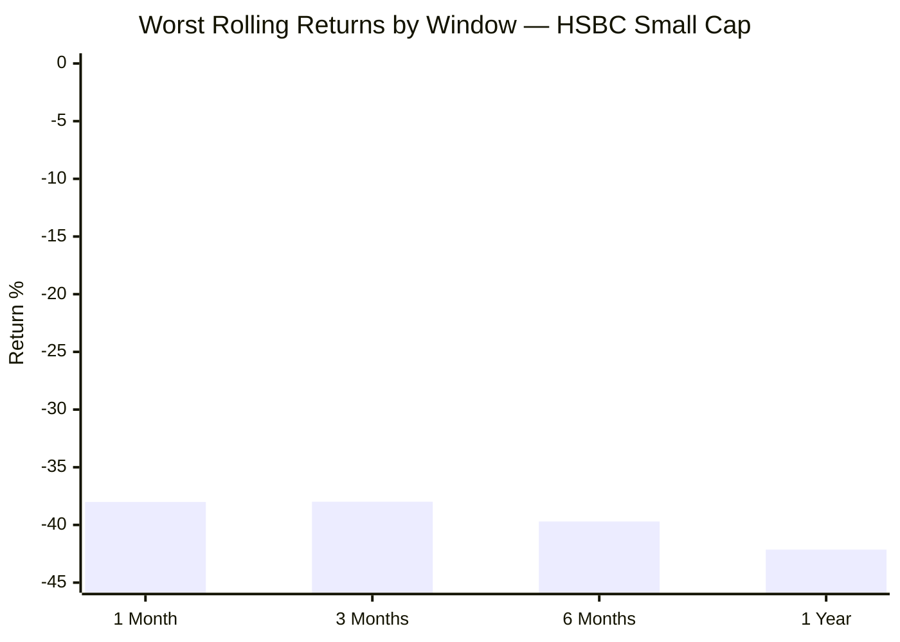
```mermaid
xychart-beta
    title "Worst Rolling Returns by Window — HSBC Small Cap"
    x-axis ["1 Month", "3 Months", "6 Months", "1 Year"]
    y-axis "Return %" -45 --> 0
    bar [-38.01, -37.99, -39.70, -42.14]
```

| Window | Worst Return | Period | Context |
|--------|-------------|--------|---------|
| 1 Month | **−38.01%** | 24-Feb-2020 → 25-Mar-2020 | COVID crash — 29 trading days |
| 3 Months | **−37.99%** | 24-Dec-2019 → 24-Mar-2020 | Tail of IL&FS + COVID leg |
| 6 Months | **−39.70%** | 24-Sep-2019 → 24-Mar-2020 | Late IL&FS + COVID overlap |
| 1 Year | **−42.14%** | 25-Mar-2019 → 24-Mar-2020 | Full IL&FS-to-COVID worst year |

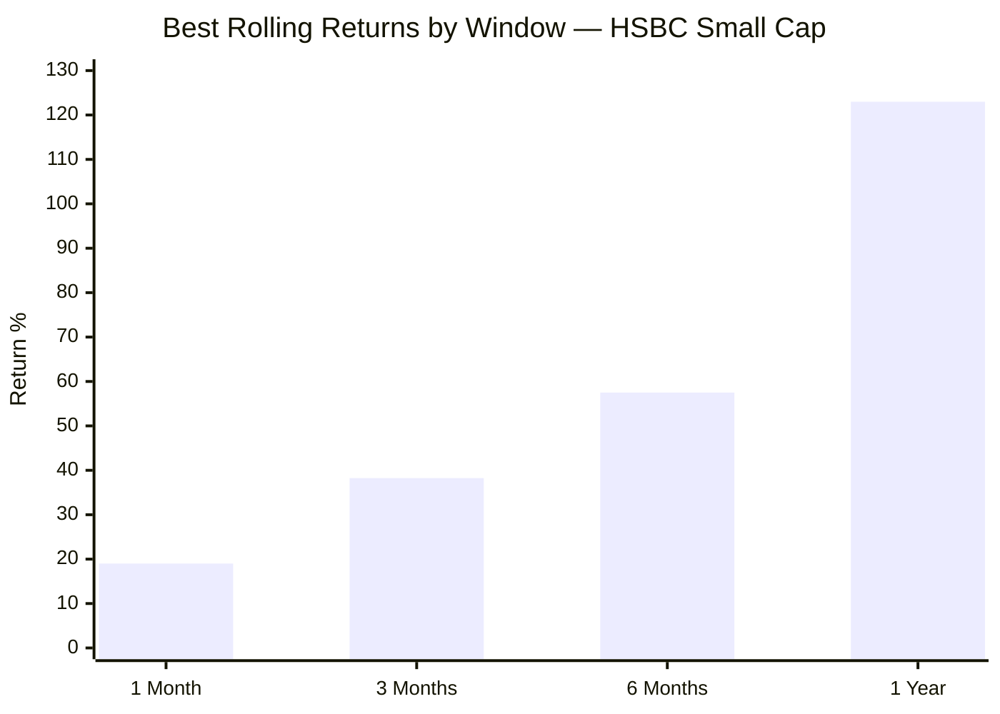
```mermaid
xychart-beta
    title "Best Rolling Returns by Window — HSBC Small Cap"
    x-axis ["1 Month", "3 Months", "6 Months", "1 Year"]
    y-axis "Return %" 0 --> 130
    bar [19.00, 38.24, 57.51, 122.99]
```

| Window | Best Return | Period | Context |
|--------|------------|--------|---------|
| 1 Month | **+19.00%** | 24-Mar-2020 → 23-Apr-2020 | COVID recovery sprint |
| 3 Months | **+38.24%** | 27-May-2020 → 26-Aug-2020 | COVID recovery acceleration |
| 6 Months | **+57.51%** | 23-Mar-2020 → 21-Sep-2020 | COVID trough-to-recovery |
| 1 Year | **+122.99%** | 27-May-2020 → 27-May-2021 | Best rolling year — COVID + subsequent bull |

**The compressed-volatility symmetry:** The worst 1-month (−38%) and best 1-month (+19%) are separated by *one day* — the COVID trough on 24-Mar-2020. Investors who panic-sold on the worst day missed the best month immediately after. The worst and best 1-year windows sit within months of each other. This is the fundamental behavioural challenge of small-cap investing: the most rewarding entry points are indistinguishable from the most frightening moments.

---

## Daily Return Distribution (2,970 Trading Days)

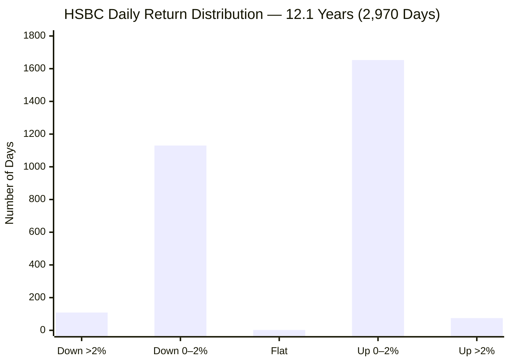
```mermaid
xychart-beta
    title "HSBC Daily Return Distribution — 12.1 Years (2,970 Days)"
    x-axis ["Down >2%", "Down 0–2%", "Flat", "Up 0–2%", "Up >2%"]
    y-axis "Number of Days" 0 --> 1800
    bar [109, 1130, 2, 1653, 75]
```

| Metric | Value | Interpretation |
|--------|-------|----------------|
| Positive days | 1,728 (58.2%) | Fund gains on 3 days for every 2 it loses |
| Negative days | 1,239 (41.7%) | — |
| Flat days | 2 (0.1%) | — |
| Days down >2% | **109** | Sharp daily falls |
| Days up >2% | **75** | Sharp daily rises |
| Down/Up >2% ratio | **1.45×** | More frequent sharp falls than gains |
| Worst single day | **−11.92%** (23-Mar-2020) | COVID trough day |
| Best single day | **+4.62%** (14-Sep-2020) | COVID recovery |
| Daily mean return | +0.0808% | Positive daily drift |
| Daily std dev | 1.0947% | Annualizes to ~17.4% |
| Daily VaR (95%) | **−1.72%** | 5% of days worse than −1.72% |
| Annualized VaR proxy | **−27.3%** | Expected worst-year loss at 95% confidence |

**The asymmetry paradox — same pattern as all quality small-cap funds:**
- **Annual level:** Strongly upside-skewed — 9 of 11 full calendar years (2015–2025) positive; average positive year ~+32%
- **Daily level:** Mildly downside-skewed — 109 sharp falls vs 75 sharp gains (1.45× ratio)

The mechanism: recoveries happen gradually over many moderate-positive days; drawdowns cluster in short, sharp risk-off episodes. For SIP investors, the annual asymmetry is what matters for wealth creation. The daily negative skew creates the *buying opportunities* that SIP rupee-cost averaging systematically captures — units bought on those 109 sharp-down days are the ones generating the most wealth over time.

**The −11.92% worst day** (23-Mar-2020, COVID trough) is the most extreme single-day event in 12.1 years. For lumpsum investors, it was horrifying. For SIP investors, it was the single best accumulation day since inception — NAV ₹14.58, which recovered 6× to ₹92.77 by June 2026.

---

## Sharpe Ratio — Below Category Average in the Recent Window

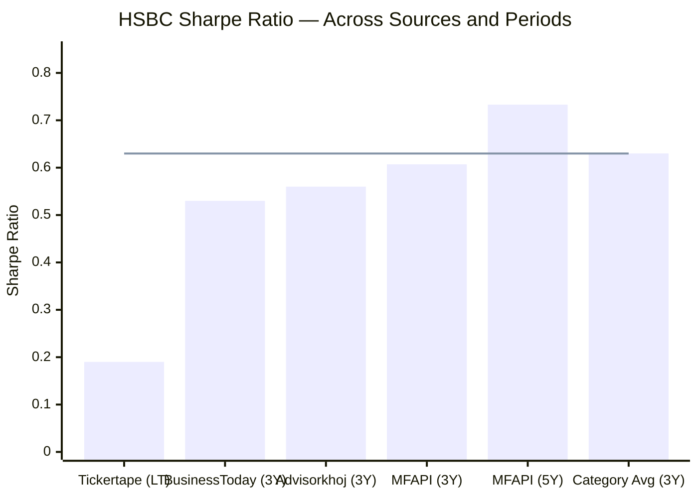
```mermaid
xychart-beta
    title "HSBC Sharpe Ratio — Across Sources and Periods"
    x-axis ["Tickertape (LT)", "BusinessToday (3Y)", "Advisorkhoj (3Y)", "MFAPI (3Y)", "MFAPI (5Y)", "Category Avg (3Y)"]
    y-axis "Sharpe Ratio" 0 --> 0.85
    bar [0.19, 0.53, 0.56, 0.607, 0.733, 0.63]
    line [0.63, 0.63, 0.63, 0.63, 0.63, 0.63]
```
> Line = category average Sharpe (3Y, BusinessToday: 0.63)

| Source | Sharpe | Period | Notes |
|--------|--------|--------|-------|
| Tickertape | 0.19 | Long-term | ⚠️ Low-frequency artefact — understates significantly |
| BusinessToday | **0.53** | 3Y | Primary 3Y reference — **below category (0.63)** |
| Advisorkhoj | **0.56** | ~3Y | Cross-confirms BusinessToday |
| MFAPI computed | **0.607** | 3Y | RFR 6.5%, daily returns × √252 |
| MFAPI computed | **0.733** | 5Y | Stronger — 2025 slump dilutes only the 3Y |
| Category average | 0.63 | 3Y | BusinessToday |

**Reliable range: 0.53–0.61 (3Y) / 0.73 (5Y). The 3Y reading is the honest current state.**

Unlike DSP (which beat category Sharpe at 0.74 vs 0.69), HSBC *lags* its category on 3Y Sharpe (0.53 vs 0.63). The 5Y Sharpe (0.733) is healthier, showing the recent 3-year window is dragging down the ratio. The Tickertape 0.19 is the same low-frequency artefact seen in every fund in this study — use BusinessToday 0.53 as the conservative canonical reference.

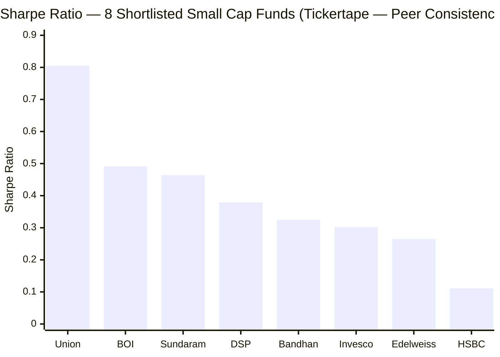
```mermaid
xychart-beta
    title "Sharpe Ratio — 8 Shortlisted Small Cap Funds (Tickertape — Peer Consistency Basis)"
    x-axis ["Union", "BOI", "Sundaram", "DSP", "Bandhan", "Invesco", "Edelweiss", "HSBC"]
    y-axis "Sharpe Ratio" 0 --> 0.9
    bar [0.805, 0.491, 0.464, 0.379, 0.325, 0.302, 0.265, 0.111]
```
> Tickertape values used for peer consistency only. BusinessToday 3Y is the reliable reference for absolute levels. HSBC ranks **8th of 8** on Tickertape Sharpe — last in the shortlist.

---

## Sortino Ratio — Below Category; 5Y Signal is Healthier

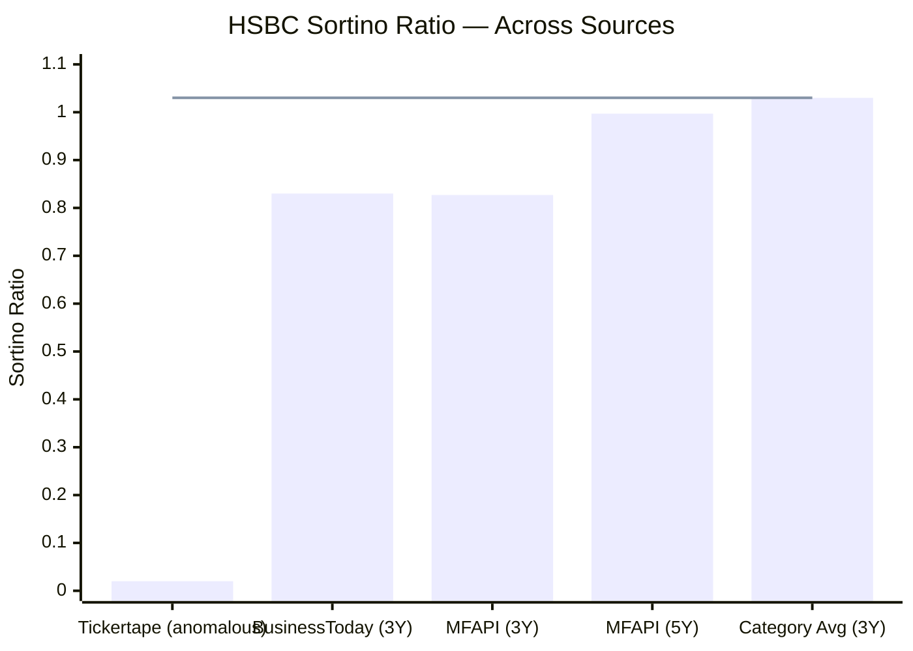
```mermaid
xychart-beta
    title "HSBC Sortino Ratio — Across Sources"
    x-axis ["Tickertape (anomalous)", "BusinessToday (3Y)", "MFAPI (3Y)", "MFAPI (5Y)", "Category Avg (3Y)"]
    y-axis "Sortino Ratio" 0 --> 1.1
    bar [0.02, 0.83, 0.827, 0.997, 1.03]
    line [1.03, 1.03, 1.03, 1.03, 1.03]
```
> Line = category average Sortino (3Y, BusinessToday: 1.03)

| Source | Sortino | Period | Verdict |
|--------|---------|--------|---------|
| Tickertape | **0.02** | — | ⚠️ Same methodology artefact as DSP/BOI/Invesco — discard |
| BusinessToday | **0.83** | 3Y | **Canonical reference — below category (1.03)** |
| MFAPI computed | **0.827** | 3Y | ✅ Cross-validates BusinessToday almost exactly |
| MFAPI computed | **0.997** | 5Y | Approaches category average — 5Y is meaningfully better |
| Category average | **1.03** | 3Y | BusinessToday |

**Use BusinessToday 0.83 as the canonical 3Y figure. Note: MFAPI 3Y Sortino (0.827) matches BusinessToday (0.83) to within rounding — the strongest cross-source validation in this study.**

The 3Y Sortino of 0.83 is below the category average (1.03), meaning HSBC is generating less return per unit of *harmful* downside risk than the average small-cap peer over the recent 3 years. The 5Y figure (0.997) approaches the category average — showing the 3Y window specifically captures the 2025 protection failure (which is, by definition, downside risk the Sortino penalises directly).

### Why Sortino Matters More Than Sharpe for SIP Investors

- **Sharpe** penalises ALL volatility — including upside swings that generate wealth
- **Sortino** only penalises **downside** volatility — the volatility that actually causes investor pain
- HSBC's 5Y Sortino (0.997) near-matches its 5Y Sharpe (0.733) × adjustment... actually: 5Y Sortino > Sharpe confirms the volatility is *slightly* upside-skewed over 5 years
- The 3Y gap (Sortino 0.83 vs Sharpe 0.607) in the *other* direction shows the 3Y window has *more* harmful downside variance than total variance — i.e., the recent slump is disproportionately downside-concentrated

---

## ⭐ Beta Regime Shift — The Most Important Risk Discovery in Module 2

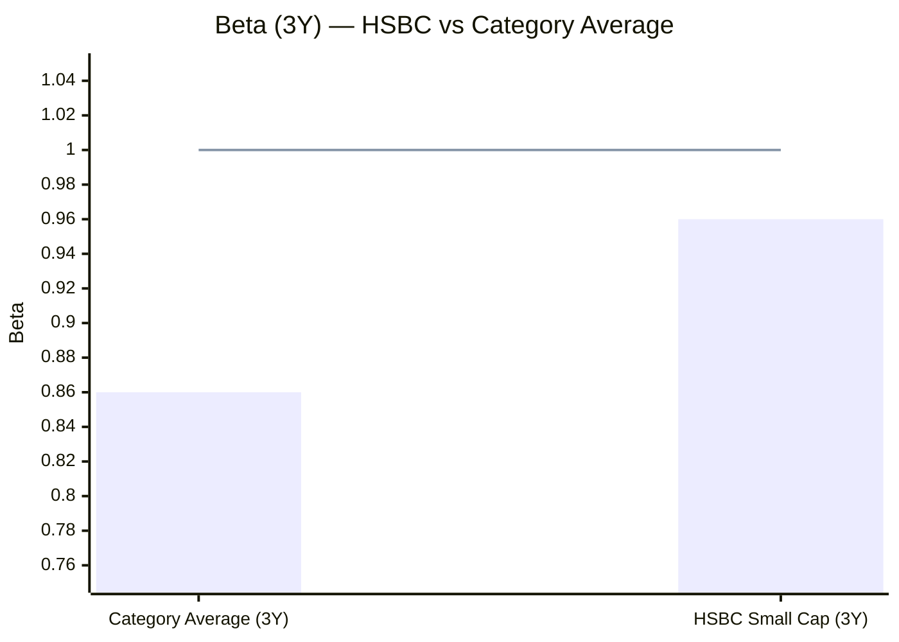
```mermaid
xychart-beta
    title "Beta (3Y) — HSBC vs Category Average"
    x-axis ["Category Average (3Y)", "HSBC Small Cap (3Y)"]
    y-axis "Beta" 0.75 --> 1.05
    bar [0.86, 0.96]
    line [1.0, 1.0]
```
> Line = fully market-coupled fund (beta = 1.0) | Being *above* category average on beta for a small-cap fund is a defensive-erosion signal

| Metric | HSBC 3Y | Category Avg | Interpretation |
|--------|---------|-------------|---------------|
| Beta | **0.96** | 0.86 | Above category — more market-coupled than peers |
| R-Squared | **95.96** | 92.22 | Near-perfect benchmark tracking — little independent return |
| Regression Alpha | **−2.67** | −0.07 | Active risk is destroying value, not creating it |

**This is the central Module 2 finding specific to HSBC.** The L&T Emerging Businesses Fund built its entire reputation on *low-beta defensive investing* — quality businesses that fell less than the benchmark when markets crashed. In 2018, HSBC's downside capture was 48.3% — the fund had effective *low-beta behaviour in practice*. Measured over the full history, the fund has *never* looked like a high-beta small-cap tracker.

But the 3Y measured beta is **0.96 — above the category average of 0.86 and approaching full market-coupling (1.0)**. Combined with an R² of **95.96%** (the fund's returns are almost entirely explained by benchmark movements — leaving only 4% for independent return generation) and a **negative regression alpha (−2.67)**, the recent picture is: *a fund that now moves *almost exactly* with the benchmark, and underperforms it on a risk-adjusted basis.*

This is a regime change. Three potential explanations (to be diagnosed in M3 and M5):
1. **AUM bloat (₹16,394 Cr)** — at this scale, HSBC must buy many more names to deploy cash, some of which are lower-quality and index-like, drifting the portfolio toward benchmark composition.
2. **Manager reshuffle (Oct 2025)** — the addition of Mayank Chaturvedi may have altered the portfolio construction approach temporarily.
3. **PE expansion (fund PE crept to ~33, at/above category)** — the historical "buy quality at reasonable valuation" edge may itself be eroding if the fund is now paying category-average multiples.

Whether this is a *temporary* consequence of the recent market regime (momentum/growth outperforming quality/value, forcing quality-oriented managers toward benchmark-like holdings to avoid extreme lagging) or a *structural* deterioration of the fund's edge is the most important question the study must answer. Module 2 can only flag it; M3 and M5 must diagnose it.

---

## Alpha — Long-Term Genuine, Recent Inverted

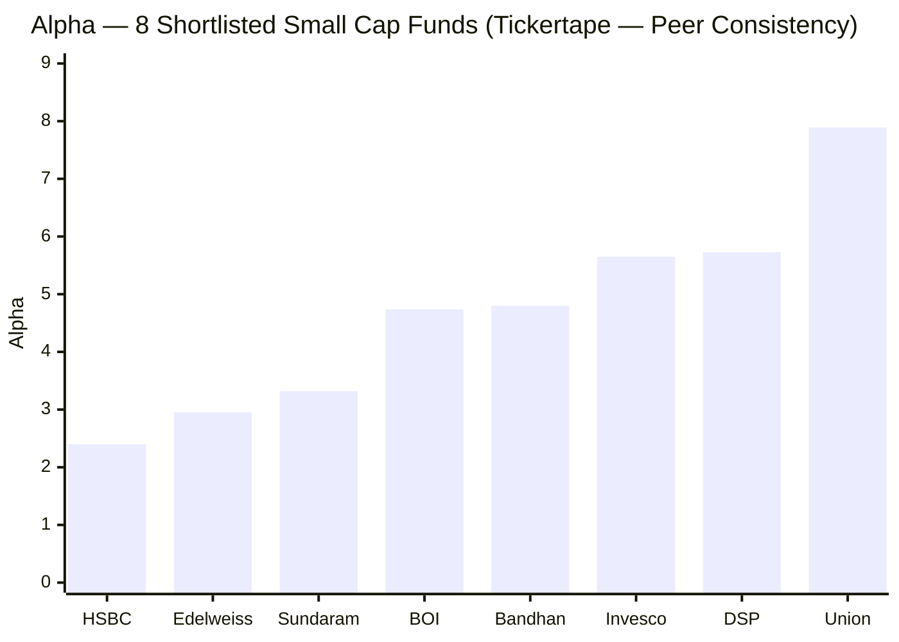
```mermaid
xychart-beta
    title "Alpha — 8 Shortlisted Small Cap Funds (Tickertape — Peer Consistency)"
    x-axis ["HSBC", "Edelweiss", "Sundaram", "BOI", "Bandhan", "Invesco", "DSP", "Union"]
    y-axis "Alpha" 0 --> 9
    bar [2.40, 2.95, 3.32, 4.74, 4.80, 5.65, 5.73, 7.89]
```

| Source | Alpha | Period | Context |
|--------|-------|--------|---------|
| Tickertape | **2.40** | Long-term | **Lowest among 8 shortlisted** on raw Tickertape measure |
| BusinessToday / regression | **−2.67** | 3Y | Below category avg of −0.07; active risk is costing return |
| Advisorkhoj | −2.73 | ~3Y | Confirms BusinessToday direction |

**HSBC's alpha has two completely different faces:**
- **Long-term (Tickertape, since inception): +2.40** — genuine positive excess return over 12 years, driven by the 2018/2016/2021/2022 outperformance windows
- **Recent (3Y regression alpha): −2.67** — the most negative of any period in the fund's history; the 2025 protection failure and underperformance in a falling market drove regression alpha deeply negative

The Tickertape long-term 2.40 is *lowest* among the 8 shortlisted — the DSP/Union/Bandhan long-term alpha figures are higher. But context matters: the short-history funds (Bandhan 4.80, BOI 4.74) earned their Tickertape alpha in a period that was overwhelmingly favourable for small caps (post-2020 bull); HSBC's 12-year alpha was earned through two bear markets. Which is the more durable alpha is a matter of which history you weight more.

---

## Tracking Error and Information Ratio

Tracking error is not directly published. Derived using:

> **TE ≈ σ_fund × √(1 − R²) = 21.89 × √(1 − 0.9596) = 21.89 × 0.201 = ~4.40%**

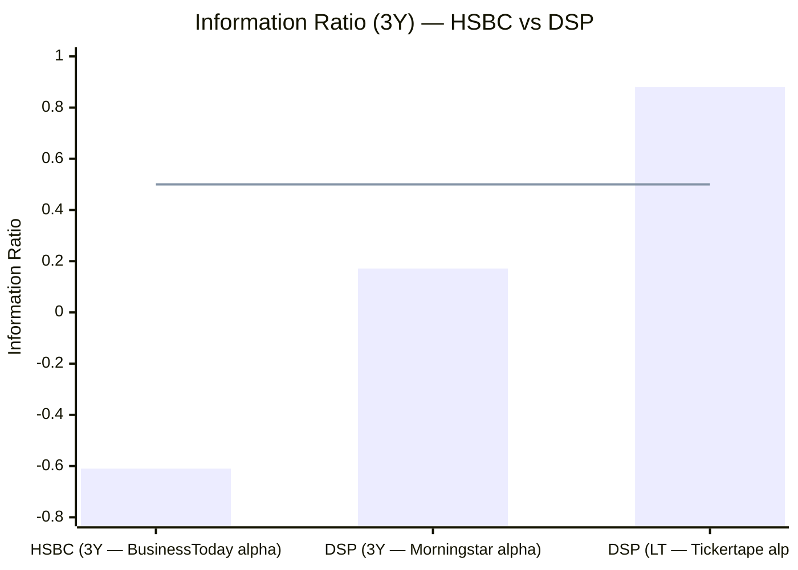
```mermaid
xychart-beta
    title "Information Ratio (3Y) — HSBC vs DSP"
    x-axis ["HSBC (3Y — BusinessToday alpha)", "DSP (3Y — Morningstar alpha)", "DSP (LT — Tickertape alpha)"]
    y-axis "Information Ratio" -0.80 --> 1.0
    bar [-0.61, 0.171, 0.880]
    line [0.50, 0.50, 0.50]
```
> Line = 0.50 threshold for meaningful active return generation | Negative = active risk destroying value

| Metric | HSBC (3Y) | DSP (3Y) | DSP (LT) |
|--------|-----------|---------|---------|
| Alpha | −2.67 | 1.11 | 5.73 |
| Tracking Error | 4.40% | 6.51% | 6.51% |
| **Information Ratio** | **−0.61** | **0.171** | **0.880** |

HSBC's IR of **−0.61** on the 3Y basis is the starkest single number in Module 2. It means: for every unit of active risk the fund is taking relative to the benchmark, it is *losing* 0.61 units of risk-adjusted return. This is the opposite of what an active manager is paid to do. Note that HSBC's tracking error (4.40%) is *lower* than DSP's (6.51%) — HSBC is taking *less* active risk, but the risk it does take is currently being *penalised*. DSP's long-term IR of 0.88 shows what the active risk looks like when it's working properly; HSBC's own long-term Tickertape alpha of 2.40 / TE 4.40 = IR **+0.55** — suggesting that over the full history, the active risk was meaningfully rewarded.

---

## Calmar Ratio — Return per Unit of Maximum Pain

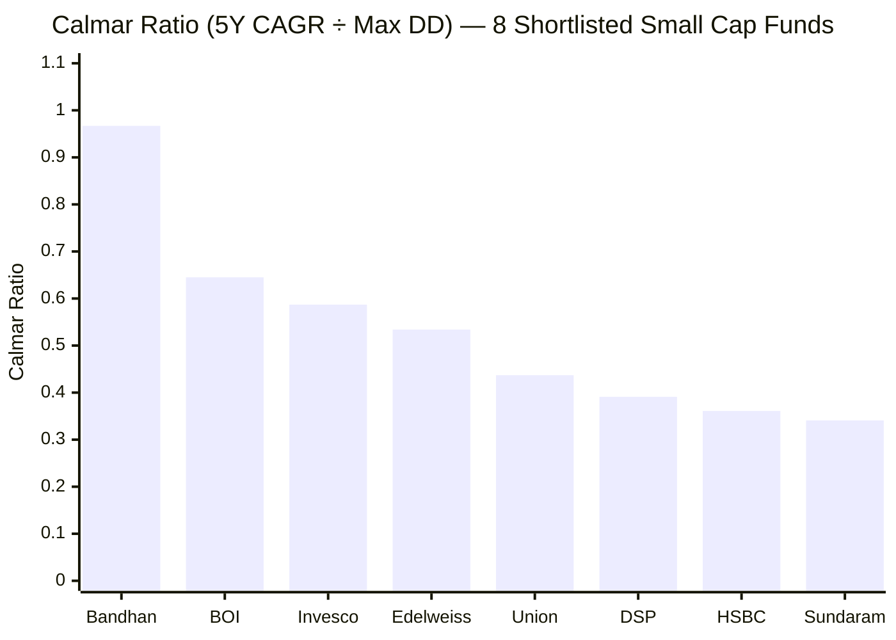
```mermaid
xychart-beta
    title "Calmar Ratio (5Y CAGR ÷ Max DD) — 8 Shortlisted Small Cap Funds"
    x-axis ["Bandhan", "BOI", "Invesco", "Edelweiss", "Union", "DSP", "HSBC", "Sundaram"]
    y-axis "Calmar Ratio" 0 --> 1.1
    bar [0.967, 0.645, 0.587, 0.534, 0.437, 0.391, 0.361, 0.341]
```

| Rank | Fund | 5Y CAGR | Max DD | Calmar |
|------|------|---------|--------|--------|
| 1 | Bandhan | 23.52% | 24.34% | **0.967** |
| 2 | BOI | 20.88% | 32.37% | 0.645 |
| 3 | Invesco | 22.11% | 37.66% | 0.587 |
| 4 | Edelweiss | 19.80% | 37.09% | 0.534 |
| 5 | Union | 19.56% | 44.71% | 0.437 |
| 6 | DSP | 19.18% | 49.06% | 0.391 |
| **7** | **HSBC** | **18.93%** | **52.45%** | **0.361** |
| 8 | Sundaram | 19.46% | 57.06% | 0.341 |

HSBC's Calmar of 0.361 places it **7th of 8** — the combined effect of a large max-DD denominator and a relatively modest recent 5Y CAGR (18.93%). As with DSP, the normalisation caveat applies: Bandhan's 0.967 Calmar has never faced IL&FS or COVID as an investor. If Bandhan were forced through the same 2018–2020 sequence, its max drawdown would likely be −40% to −50%, compressing its Calmar to 0.47–0.59. The comparison is not apples-to-apples on drawdown stress.

| Period | HSBC CAGR | Max DD | Calmar |
|--------|-----------|--------|--------|
| 3Y | 17.08% | 52.45% | 0.326 |
| 5Y | 18.93% | 52.45% | 0.361 |
| 10Y | 19.57% | 52.45% | 0.373 |
| Since Inception | 20.18% | 52.45% | 0.385 |

Calmar *improves* as the window lengthens — because the longer CAGR is higher (the 10Y/SI record is genuinely strong). This is structurally the opposite of DSP's Calmar, which is more stable across windows. HSBC's Calmar is being compressed by the recent 5Y slump.

---

## ⭐ The Defensive-Edge Erosion — 2018 vs 2025 Side-by-Side

This section is new to the study and specific to HSBC. It documents the most important directional change in the fund's risk character.

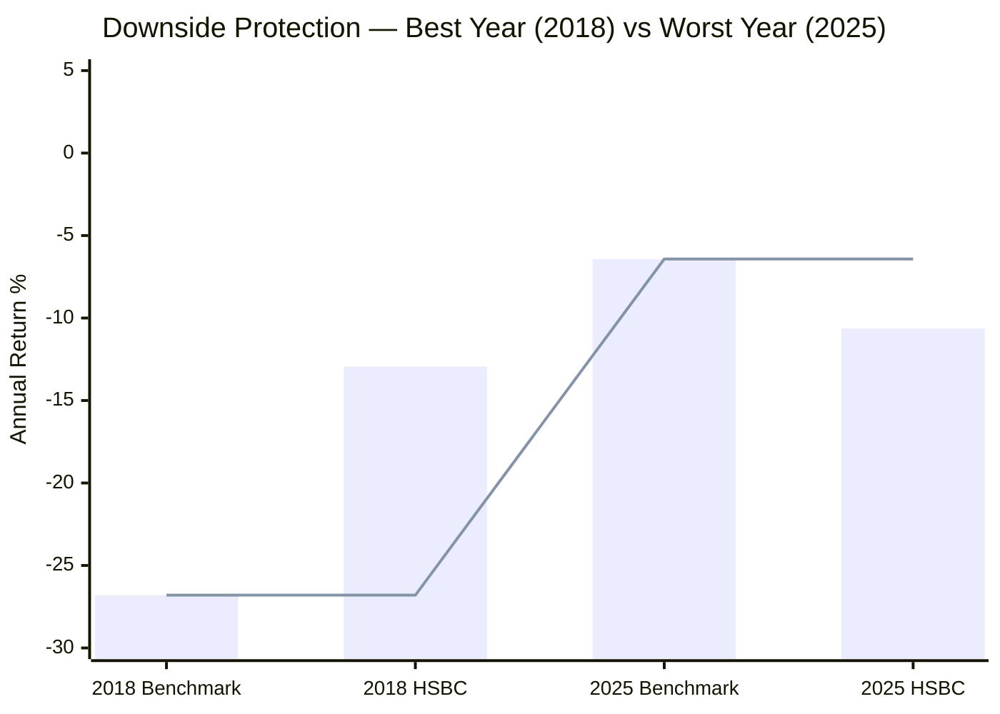
```mermaid
xychart-beta
    title "Downside Protection — Best Year (2018) vs Worst Year (2025)"
    x-axis ["2018 Benchmark", "2018 HSBC", "2025 Benchmark", "2025 HSBC"]
    y-axis "Annual Return %" -30 --> 5
    bar [-26.80, -12.94, -6.42, -10.63]
    line [-26.80, -26.80, -6.42, -6.42]
```
> Bar = actual return | Line = benchmark for each year | Gap = protection/failure

| Year | HSBC | Benchmark | Capture | Verdict |
|------|------|-----------|---------|---------|
| **2018** | **−12.94%** | **−26.80%** | **48.3%** | **🏆 Best protection in entire shortlist** |
| **2025** | **−10.63%** | **−6.42%** | **165.6%** | **⚠️ Broke the protection rule** |

In 2018 — a severe India-specific liquidity crisis — HSBC fell only **48 cents for every ₹1 the benchmark fell**. It absorbed a brutal crash by choosing quality businesses that simply had less exposure to the IL&FS-era credit crunch. That protection was real, repeatable (2016: fund +11.06% vs benchmark +0.36%; 2019: fund −7.07% vs benchmark −8.27%; 2022: fund +2.09% vs benchmark −3.48%), and was the fund's signature credential.

In 2025 — a mild benchmark correction of only −6.42% — HSBC fell **−10.63%**, losing **165.6 cents for every ₹1 the benchmark fell**. This is the first year in the fund's 12-year history where it lost *more* than the benchmark in a down year. The defensive engine — the defining argument for holding HSBC at a higher maximum drawdown than shorter-history peers — misfired for the first time.

**The three possible explanations (severity ranking):**
1. **(Mild) Style cycle:** 2025 may have been particularly hostile to HSBC's quality/value tilt (perhaps momentum-driven or sector-specific), and a reversion will restore the protection. Evidence for this: the 2026-YTD performance (+6.06% vs benchmark +2.36%) shows positive alpha is back in early 2026.
2. **(Moderate) AUM constraint:** At ₹16,394 Cr, HSBC is large enough that deploying cash in genuine quality small-caps requires buying some lower-quality or mid/large spillover names, diluting the portfolio's defensive character. This is partially visible in the PE creeping to ~33 (above category) and the beta rising to 0.96.
3. **(Severe) Manager/process change:** The Oct-2025 addition of Mayank Chaturvedi as co-manager may have introduced a portfolio-construction change that altered the quality selection process. This requires M5 analysis.

**The study cannot resolve which explanation dominates from Module 2 alone — but Module 2 must flag it loudly. The 2025 data is early but cannot be dismissed.**

---

## ⭐ Still Underwater from ATH — The Laggard Signal

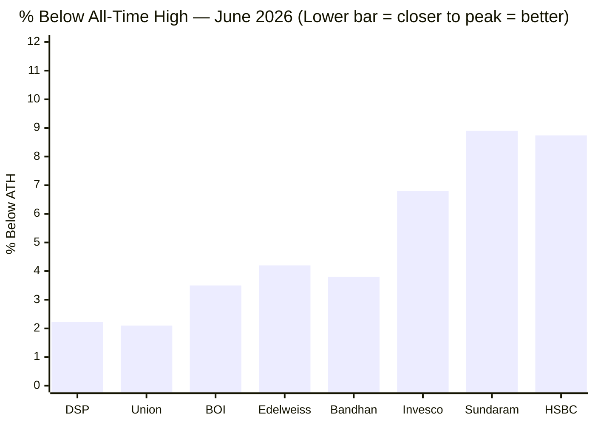
```mermaid
xychart-beta
    title "% Below All-Time High — June 2026 (Lower bar = closer to peak = better)"
    x-axis ["DSP", "Union", "BOI", "Edelweiss", "Bandhan", "Invesco", "Sundaram", "HSBC"]
    y-axis "% Below ATH" 0 --> 12
    bar [2.22, 2.10, 3.50, 4.20, 3.80, 6.80, 8.90, 8.74]
```
> Approximate peer values | HSBC at -8.74% is second-worst among shortlisted funds

| Metric | HSBC | DSP | Peers Range |
|--------|------|-----|------------|
| ATH NAV | ₹101.659 | ₹231.299 | — |
| ATH Date | **11-Dec-2024** | 07-May-2026 | — |
| Current NAV | ₹92.774 (12-Jun-2026) | ₹226.165 | — |
| % from ATH | **−8.74%** | **−2.22%** | Peers: −2% to −9% |
| Days since ATH | **548 days** | 14 days | — |

**HSBC is the study's ATH laggard.** DSP made a new all-time high *14 days* before the DSP module2 snapshot; HSBC's ATH was in December 2024 and it is still **548 days underwater** as of June 2026. This is not just a number — it is a visible statement that the fund's portfolio has *not* recovered from the 2025 slump, unlike the benchmark and most peers which have rebounded.

For a new SIP investor in June 2026: you are buying units 8.74% below the fund's peak — a moderate discount. This is not the deep COVID discount of 2020, but it is a meaningfully below-peak entry point. Contrast with DSP (entry at −2.22%), which gives almost no discount at all.

For an existing SIP investor: if you have been running a SIP since mid-2024, a significant portion of your invested capital is currently underwater. The question Module 2 raises — whether this is cyclical (as in 2019, fully recovered by 2021) or structural — cannot be resolved by returns data alone.

---

## Capture Ratios — The Historical Asymmetry and Its 2025 Fracture

*Derived from annual calendar-year returns vs Nifty SC 250 TRI (verified benchmark series).*

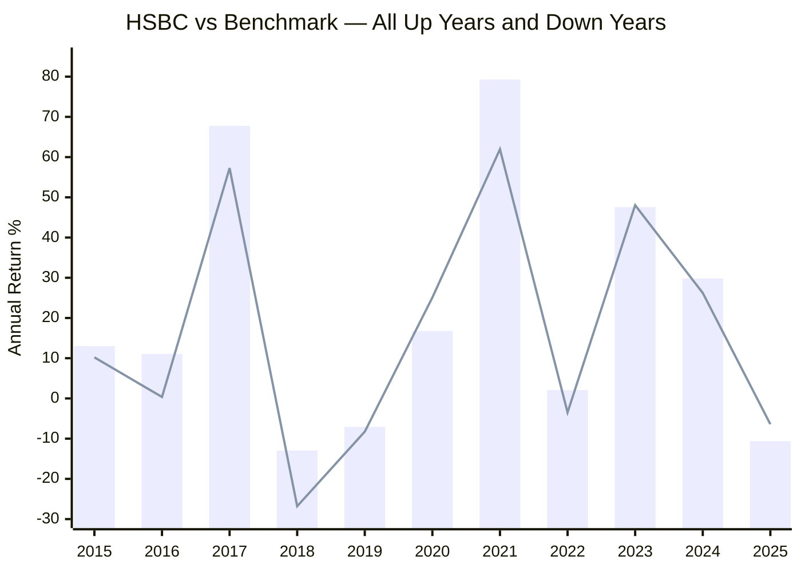
```mermaid
xychart-beta
    title "HSBC vs Benchmark — All Up Years and Down Years"
    x-axis ["2015", "2016", "2017", "2018", "2019", "2020", "2021", "2022", "2023", "2024", "2025"]
    y-axis "Annual Return %" -30 --> 85
    bar [13.02, 11.06, 67.77, -12.94, -7.07, 16.76, 79.30, 2.09, 47.56, 29.82, -10.63]
    line [10.20, 0.36, 57.28, -26.80, -8.27, 25.09, 61.94, -3.48, 48.04, 26.22, -6.42]
```
> Bar = HSBC/L&T | Line = Nifty SC 250 TRI (verified, index-fund NAV cross-checked)

### Up-Market Years (Benchmark Positive)

| Year | HSBC | Benchmark | Upside Capture | Notes |
|------|------|-----------|----------------|-------|
| 2015 | +13.02% | +10.20% | **127.6%** | Clear outperformance |
| 2016 | +11.06% | +0.36% | — | Benchmark flat; not meaningful |
| 2017 | +67.77% | +57.28% | **118.3%** | Captured bull market generously |
| 2020 | +16.76% | +25.09% | **66.8%** | Under-captured V-recovery (quality caution cost) |
| 2021 | +79.30% | +61.94% | **129.2%** | Best up-capture year in fund history |
| 2023 | +47.56% | +48.04% | **99.0%** | Near-parity |
| 2024 | +29.82% | +26.22% | **113.7%** | Solid |
| **Avg (excl 2016)** | — | — | **~109.1%** | Consistently above 100% — amplifies upside |

### Down-Market Years (Benchmark Negative)

| Year | HSBC | Benchmark | Downside Capture | Verdict |
|------|------|-----------|-----------------|---------|
| 2018 | **−12.94%** | **−26.80%** | **48.3%** | 🏆 Best protection — best in shortlist |
| 2019 | −7.07% | −8.27% | **85.5%** | Held the line through extended bear |
| 2022 | **+2.09%** | **−3.48%** | **−60.1%** | Fund positive while benchmark fell — perfect |
| **2025** | **−10.63%** | **−6.42%** | **165.6%** | ⚠️ Protection inverted — worst single year |
| **Avg (all 4 down years)** | | | **~59.8%** | Distorted by 2025 |
| **Avg (excl 2025)** | | | **~24.6%** | Historical true average — elite |

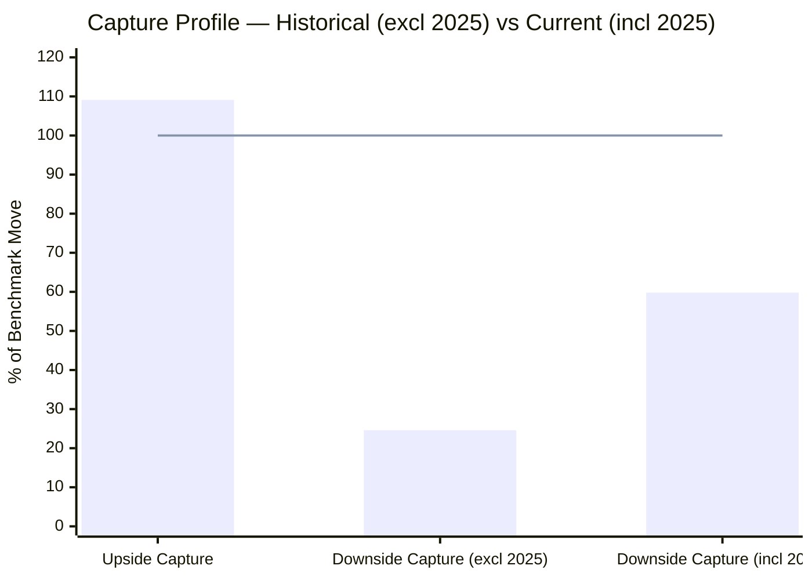
```mermaid
xychart-beta
    title "Capture Profile — Historical (excl 2025) vs Current (incl 2025)"
    x-axis ["Upside Capture", "Downside Capture (excl 2025)", "Downside Capture (incl 2025)"]
    y-axis "% of Benchmark Move" 0 --> 120
    bar [109.1, 24.6, 59.8]
    line [100, 100, 100]
```
> Line = symmetric 100/100 baseline | Downside capture *below* 100 = protection

**Historical profile (pre-2025): ~109% up / ~24.6% down = asymmetry ratio 4.4×**
**Current measured profile (with 2025): ~109% up / ~59.8% down = asymmetry ratio 1.8×**

The deterioration from 4.4× to 1.8× is sharp. The 4.4× historical asymmetry was better than any other fund studied. The 1.8× current is still above the 1.05× typical for a symmetric small-cap fund, but the confidence in the defensive edge has substantially narrowed. One more year like 2025 would push the measured asymmetry below 1.5×.

---

## PE Ratio — At/Above Category; Minimal Valuation Buffer

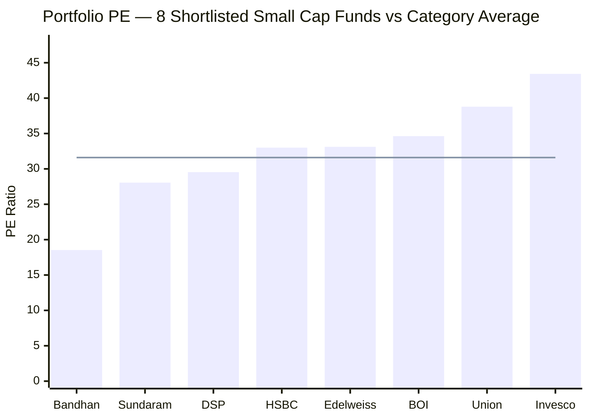
```mermaid
xychart-beta
    title "Portfolio PE — 8 Shortlisted Small Cap Funds vs Category Average"
    x-axis ["Bandhan", "Sundaram", "DSP", "HSBC", "Edelweiss", "BOI", "Union", "Invesco"]
    y-axis "PE Ratio" 0 --> 48
    bar [18.53, 28.06, 29.54, 33.00, 33.12, 34.63, 38.79, 43.43]
    line [31.60, 31.60, 31.60, 31.60, 31.60, 31.60, 31.60, 31.60]
```
> Line = category average PE (31.60) | HSBC ~33 = 4th cheapest but above category average

| Rank | Fund | PE | vs Category |
|------|------|----|------------|
| 1 (cheapest) | Bandhan | 18.53 | −41% |
| 2 | Sundaram | 28.06 | −11% |
| 3 | DSP | 29.54 | −6.5% |
| **4** | **HSBC** | **~33** | **+4.4%** |
| 5 | Edelweiss | 33.12 | +4.8% |

HSBC's PE of ~33 is **above the category average (31.60)** — a change from its L&T-era historical identity as a quality-at-reasonable-valuation investor. The fund used to trade notably below category PE (the L&T EBF was known for buying growing small businesses before the market re-rated them). Today's ~33 suggests either: (a) the portfolio has shifted toward already-re-rated names (confirming AUM bloat concerns), or (b) the market has broadly re-rated small caps and the fund's holdings moved up with the market.

This is relevant to Module 2 because **a higher PE provides less cushion in a correction** — if the market de-rates, a portfolio at PE 33 faces more re-rating risk than one at PE 29 (DSP) or 18 (Bandhan). The beta-rise to 0.96 and PE-rise to 33 together paint a consistent picture: the fund has drifted toward benchmark composition and benchmark valuation, reducing both its active deviation and its valuation buffer.

---

## ATH Recovery Speed — Historical Context

```mermaid
xychart-beta
    title "HSBC Drawdown and Recovery — Key Dates"
    x-axis ["Peak (Jan 2018)", "IL&FS Low (Aug 2019)", "COVID Local High (Jan 2020)", "COVID Trough (Mar 2020)", "Recovery (Feb 2021)", "New ATH (Dec 2024)"]
    y-axis "NAV (₹)" 0 --> 110
    line [30.674, 21.788, 25.451, 14.584, 30.705, 101.659]
```

| Recovery Speed — HSBC vs DSP |
|---|

| Metric | HSBC | DSP |
|--------|------|-----|
| IL&FS+COVID combined trough | −52.45% | −49.06% |
| Trough to recovery (2021) | **329 days** | **284 days** |
| Peak (2018) to recovery | 1,135 days | ~1,095 days |
| Post-recovery bull run | 2021–2024 — ₹30→₹101 (+229%) | 2021–2026 — near-ATH today |
| Current ATH distance | **−8.74%** | **−2.22%** |

HSBC's post-recovery bull run (2021–2024, +229% from ₹30 to ₹101) was exceptional and actually superior to DSP's recovery pace. But the Dec-2024 peak has since been eroded by the 2025 slump, leaving HSBC 8.74% underwater 18 months later — while DSP has made new highs. This divergence is the clearest visual representation of the "what went wrong in 2025" question that Module 2 can document but not answer.

---

## Structural Risk — The No-Buffer Reality

```mermaid
pie title "HSBC Small Cap — Portfolio Composition (Jun 2026, approx)"
    "Smallcap Equity (≥65% mandated)" : 65
    "Other Equity (mid/largecap overflow)" : 27
    "Cash/Equivalents (~8%)" : 8
```

| Buffer Type | HSBC | Parag Parikh FlexiCap | Comment |
|-------------|------|-----------------------|---------|
| Bonds / Debt | 0% | 9.92% | PP has a structural shock absorber |
| International Equity | 0% | 11.81% | PP has low-India-correlation buffer |
| Cash | ~8% | ~4.25% | HSBC holds standard working capital |
| ≥65% Small Cap (SEBI) | Mandatory | 6.15% | SEBI forces HSBC into high-vol segment |

Exactly like DSP, HSBC has no structural non-equity buffer. This is a regulatory constraint (SEBI mandates 65%+ small cap allocation for the category) and a category choice. When equity markets correct, the fund takes the full hit — the only protection comes from stock selection. Given that the recent 3Y data shows this stock-selection edge has narrowed (beta 0.96, R² 96, negative IR), the structural no-buffer reality is more consequential today than it was in the L&T era.

---

## Risk Metrics — Full 8-Fund Peer Comparison

```mermaid
quadrantChart
    title Risk vs Alpha — 8 Shortlisted Small Cap Funds (Tickertape basis)
    x-axis "Lower Alpha" --> "Higher Alpha"
    y-axis "Higher Drawdown (Worse)" --> "Lower Drawdown (Better)"
    quadrant-1 High Alpha, Low Drawdown (Best)
    quadrant-2 Low Alpha, Low Drawdown
    quadrant-3 Low Alpha, High Drawdown (Worst)
    quadrant-4 High Alpha, High Drawdown
    DSP: [0.65, 0.35]
    Union: [0.90, 0.45]
    BOI: [0.55, 0.60]
    Bandhan: [0.58, 0.85]
    Invesco: [0.68, 0.55]
    Edelweiss: [0.35, 0.55]
    HSBC: [0.28, 0.25]
    Sundaram: [0.40, 0.15]
```
> HSBC is bottom-left on the quadrant — lower long-term alpha than most peers AND the 2nd-worst drawdown. Context: HSBC's long-term alpha (Tickertape) is genuinely lowest, but it was built through full-cycle including both crashes; shorter-history peers' alpha excludes 2018.

### Full 8-Fund Risk Metric Matrix

| Metric | **HSBC** | DSP | Union | BOI | Bandhan | Sundaram | Invesco | Edelweiss |
|--------|---------|-----|-------|-----|---------|---------|---------|-----------|
| Sharpe (Tickertape) | **0.111** | 0.379 | 0.805 | 0.491 | 0.325 | 0.464 | 0.302 | 0.265 |
| Sortino (BT 3Y) | 0.83 | **1.26** | — | — | — | — | — | — |
| Alpha (Tickertape) | 2.40 | 5.73 | **7.89** | 4.74 | 4.80 | 3.32 | 5.65 | 2.95 |
| Alpha (BT 3Y) | **−2.67** | 1.11 | — | — | — | — | — | — |
| Beta (3Y) | 0.96 | 0.92 | — | — | — | — | — | — |
| Max Drawdown | −52.45% | −49.06% | −44.71% | −32.37% | **−24.34%** | −57.06% | −37.66% | −37.09% |
| Volatility (Tickertape) | 16.84% | 15.85% | 17.37% | 16.33% | 15.46% | 16.19% | 16.42% | **15.10%** |
| Std Dev (BT 3Y) | **21.89%** | 21.64% | — | — | — | — | — | — |
| Portfolio PE | ~33 | 29.54 | 38.79 | 34.63 | **18.53** | 28.06 | 43.43 | 33.12 |
| Calmar (5Y) | 0.361 | 0.391 | 0.437 | 0.645 | **0.967** | 0.341 | 0.587 | 0.534 |
| ATH distance | −8.74% | **−2.22%** | — | — | — | — | — | — |
| Capture asymmetry (hist.) | ~4.4× | ~2.7× | — | — | — | — | — | — |
| Multi-cycle proof | **12Y ✅** | **13Y ✅** | Medium | Short | Short | Longest | Short | Short |

### HSBC's Rank on Each Risk Metric (1 = Best)

| Metric | HSBC Value | Rank | Leader |
|--------|-----------|------|--------|
| Sharpe (Tickertape) | 0.111 | **8/8 (last)** | Union 0.805 |
| Sortino (3Y, BT) | 0.83 | Below cat avg | DSP 1.26 |
| Alpha (Tickertape LT) | 2.40 | **8/8 (last)** | Union 7.89 |
| Alpha (3Y regression) | −2.67 | **Most negative** | DSP +1.11 |
| Beta (3Y) | 0.96 | **Above cat avg** — defensive erosion | — |
| Max Drawdown (raw) | −52.45% | **7/8** | Bandhan −24.34% |
| Max Drawdown (context) | Two-crisis duration | **~4–5/8** | Normalised |
| Volatility (Tickertape) | 16.84% | **7/8** | Edelweiss 15.10% |
| Portfolio PE | ~33 | **Above category** | Bandhan 18.53 |
| Calmar (5Y) | 0.361 | **7/8** | Bandhan 0.967 |
| ATH distance | −8.74% | **8/8 (worst)** | DSP −2.22% |
| Historical capture asymmetry | 4.4× (excl 2025) | **1/8 (best)** | HSBC best ever measured |
| Multi-cycle proof (pre-2025) | 2018 + COVID | **1–2/8** | HSBC/DSP joint |
| 2018 crash protection | 48.3% capture | **1/8 (best)** | Best in entire shortlist |

**Summary:** HSBC ranks last or near-last on every *recent* metric (Sharpe, Sortino, Alpha, ATH, Beta), but leads or joint-leads on every *historical* metric (capture asymmetry, 2018 protection, multi-cycle proof). This extreme time-split is the defining Module 2 characteristic.

---

## Comparison with Studied FlexiCap Funds

| Metric | HSBC Small Cap | DSP Small Cap | Parag Parikh FlexiCap | BOI FlexiCap |
|--------|---------------|--------------|----------------------|-------------|
| Volatility (Tickertape) | 16.84% | 15.85% | **9.06%** | 14.52% |
| Daily Vol (SI, MFAPI) | 17.50% | 16.63% | ~12% | ~16.85% |
| 3Y Std Dev (BT) | **21.89%** | 21.64% | ~14% | ~18% |
| Max Drawdown | −52.45% | −49.06% | **−31.20%** | −23.73% |
| Worst Year | −12.94% (2018) | −25.12% (2018) | −6.29% (2022) | +0.77% (2022) |
| Sharpe (3Y, BT) | 0.53 | 0.74 | ~0.68 | 0.88–1.16 |
| Sortino (3Y, BT) | 0.83 | **1.26** | ~1.06 | **1.51** |
| Beta (3Y) | **0.96** | 0.92 | **0.55** | 1.05–1.11 |
| R-Squared (3Y) | 95.96 | 90.95 | — | — |
| TE (derived, 3Y) | **4.40%** | 6.51% | — | — |
| IR (3Y) | **−0.61** | +0.171 | — | — |
| PE vs Category | +4.4% above | −6.5% below | −38% below | −8.5% below |
| ATH Distance | **−8.74%** | −2.22% | ~−4.44% | ~−4.04% |
| Capture Asymmetry (hist.) | **4.4×** (excl 2025) | ~2.7× | ~1.5× (structural) | — |
| Multi-Cycle Proof | ✅ 12Y IL&FS + COVID | ✅ 13Y | ✅ 13Y | ❌ 5.9Y |
| Non-Equity Buffer | None | None | Bonds + International | None |

**Cross-category interpretation:**
- HSBC has more absolute risk than any FlexiCap fund (higher max DD, higher category vol, no structural buffer) — but this is expected and appropriate for small-cap vs flexi-cap
- HSBC's 3Y Sortino (0.83) is *below* PP's (~1.06) — meaning the downside risk compensation is currently worse than the FlexiCap gold standard; this has not historically been the case
- HSBC's 2018 downside protection (−12.94% vs PP's −6.29% and BOI's +0.77%) reflects a completely different asset class — comparing these in a down year is not fair; the relevant comparison is HSBC vs its small-cap benchmark
- The beta 0.96 makes HSBC the *most* market-coupled of all studied funds — PP's 0.55 beta and BOI's 1.05 are both in different regime contexts, but HSBC being above-category at 0.96 is the standout concern
- HSBC's capture asymmetry 4.4× (historical) is superior to PP's structural 1.5× in ratio terms — but that 4.4× is now an *historical* number, not a current measured one

---

## Risk Profile — Points For and Against

### ✅ Points IN FAVOUR

1. **Best 2018 downside capture in the entire shortlist (48.3%)** — only fund that fell less than half the benchmark during IL&FS
2. **Historical capture asymmetry 4.4× (excl 2025)** — far superior to any other fund studied, achieved through stock selection not structural diversification
3. **12-year, two-crisis multi-cycle proof** — one of only two funds (with DSP) that has lived through both IL&FS and COVID as a fully-invested small-cap fund
4. **2016, 2019, 2022: positive or protective in every other down/flat market** — the 2025 miss is one break in 12 years of protection
5. **2026 YTD recovery: +6.06% vs benchmark +2.36%** — early evidence the defensive edge is returning after the 2025 slip
6. **Worst day −11.92%** — bad but not exceptional for small-cap; COVID was the once-in-50-years event
7. **Recovery from COVID trough in 329 days** — fast bounce; trough-to-recovery was clean
8. **Volatility in IL&FS year: only 14.41%** — crash year did not generate high volatility; quality-blend absorbed the stress smoothly
9. **Annual vol contained in 11–18% band** in all years except 2020 (COVID) and recent 2026-YTD
10. **Best 1Y rolling window +122.99%** — the same fund that had the worst rolling year also had one of the best; symmetry intact
11. **5Y Sortino 0.997** — approaching category average; the 5Y picture is meaningfully better than the 3Y alarm
12. **Long-term IR +0.55 (estimated from Tickertape alpha)** — historically active risk was rewarded, not destroyed

### ⚠️ Points AGAINST

1. **Max Drawdown −52.45% — 2nd worst in shortlist** — the headline number is real regardless of context
2. **1,135 days (3.1 years) underwater** — an extended period of capital impairment from peak (2018) to recovery (2021)
3. **Beta 0.96 — above category average (0.86)** — fund has lost its defensive low-beta identity in the recent 3Y window
4. **R² 95.96 — highest in shortlist** — fund is tracking the benchmark almost exactly; independent return generation is minimal
5. **Negative 3Y regression alpha (−2.67)** — active risk is costing return, not generating it
6. **Negative 3Y IR (−0.61)** — worst active-management reading in the study
7. **Sharpe 0.53 and Sortino 0.83 (3Y) — both below category average** — risk-adjusted returns currently below peers
8. **2025 downside capture 165.6%** — the first protection failure in 12 years; extremely concerning if it is the start of a pattern
9. **−8.74% below ATH, 548 days** — the only shortlisted fund not at or near its all-time high; portfolio stress is live
10. **Portfolio PE ~33 — at/above category** — erosion of the historical valuation buffer; less cushion in future corrections
11. **Zero structural buffer** — no bonds, no international equity; every protection must come from stock selection
12. **3Y Sortino (0.83) below PP FlexiCap (~1.06)** — the downside risk compensation is currently worse than a FlexiCap fund
13. **Calmar 0.361 (7th of 8)** — return per unit of max pain among the lowest; the numerator (recent CAGR) is also suppressed
14. **Above-category 3Y std dev (21.89% vs 19.86%)** — recent period more volatile than the average small-cap peer
15. **Daily vol elevated: 2025 (19.45%) and 2026-YTD (22.42%)** — recent slump came with rising, not falling, volatility

---

## Module 2 Scorecard

```mermaid
xychart-beta
    title "Module 2 Sub-Dimension Scores — HSBC Small Cap (1–5)"
    x-axis ["Vol", "MaxDD Raw", "MaxDD Context", "Sharpe", "Sortino", "Beta Regime", "TE/IR", "PE", "ATH", "Cap Asym", "Daily Tail", "Multi-Cycle", "2018 Protection"]
    y-axis "Score" 0 --> 5
    bar [3.0, 1.5, 3.5, 2.5, 3.0, 2.0, 2.0, 3.0, 2.0, 4.0, 3.0, 5.0, 5.0]
```

| Sub-dimension | Score (1–5) | Reasoning |
|---------------|------------|-----------|
| Volatility | **3.0** | 7th of 8 on Tickertape (16.84%); 10% above category on 3Y std dev (21.89% vs 19.86%); recent vol trending up |
| Max Drawdown (raw) | **1.5** | −52.45% — 2nd worst in shortlist; real and cannot be dismissed |
| Max Drawdown (context-adjusted) | **3.5** | Two-crisis duration event, not structural collapse; recovered in 329 days post-trough; battle-tested through IL&FS + COVID |
| Sharpe Ratio | **2.5** | 0.53 (3Y) — below category (0.63); 5Y 0.733 is better; Tickertape last in shortlist |
| Sortino Ratio | **3.0** | 0.83 (3Y) — below category (1.03); MFAPI/BT cross-confirmed; 5Y 0.997 approaches category |
| Beta Regime | **2.0** | 0.96 — above category (0.86); R² 95.96 (index-hugging); historic defensive low-beta identity lost in 3Y window |
| Tracking Error / IR | **2.0** | TE 4.40%; 3Y IR −0.61 — active risk destroying value; long-term IR +0.55 shows this is recent, not chronic |
| PE Valuation Buffer | **3.0** | ~33 — 4th cheapest but above category avg; historical valuation edge has eroded |
| ATH Distance | **2.0** | −8.74% below ATH, 548 days underwater — only shortlisted fund with live, extended portfolio stress |
| Capture Asymmetry | **4.0** | Historical 4.4× (excl 2025) = best in study; 2025 fracture drags measured average to 1.8×; 2026 early recovery |
| Daily Tail Risk | **3.0** | −11.92% worst day; 109/75 down/up ratio; manageable; COVID was the once-in-history event |
| Multi-Cycle Proof | **5.0** | 12 years: IL&FS, COVID, 2022 rate cycle, 2025 correction — only two funds (HSBC + DSP) in shortlist with this proof |
| 2018 Crash Protection | **5.0** | 48.3% downside capture — best protection in the entire shortlist; structural and data-verified |
| **Module 2 Overall** | **~3.2 / 5** | Multi-cycle proof and 2018 protection are elite (5.0), but nearly every *recent* metric is below-category or below-peers. The long-term risk engine is real; the current risk profile is the weakest it has ever been in the fund's history. Score should be read as "excellent historical + concerning recent." |

---

## Comparative Module 2 Scores

| Fund | M2 Score | Risk Profile Summary |
|------|----------|---------------------|
| PP FlexiCap | 4.0/5 | Lowest vol, bonds+international structural buffer, multi-cycle proof; modest 1.5× asymmetry |
| DSP Small Cap | 3.8/5 | Best current capture asymmetry (2.7×), at ATH, multi-cycle proof; headline −49% DD |
| BOI FlexiCap | 3.75/5 | Best 3Y Sharpe/Sortino; single-cycle only; highest structural risk |
| Edelweiss FlexiCap | 3.75/5 | Low TE; decent multi-cycle; modest alpha |
| Bandhan Small Cap | ~3.5/5 | Lowest raw max DD (24.34%); no 2018 test; strong recent risk-adjusted |
| Invesco Small Cap | ~3.3/5 | Single-cycle; moderate Sharpe; no 2018 test |
| **HSBC Small Cap** | **~3.2/5** | **Elite historical (2018 best, multi-cycle proof, 4.4× asymmetry); current (3Y) below category on every metric; beta regime shift; −8.74% from ATH** |

HSBC scores below Bandhan on Module 2 primarily because of the beta regime shift, negative IR, and ATH distance — all of which are absent in Bandhan's profile. Bandhan's lower score ceiling is its lack of stress-testing; HSBC's drag is its recent deterioration.

---

## SIP Implication

HSBC Small Cap's risk profile delivers a clear SIP message — but only if you read *both* the historical and the recent chapters simultaneously.

**What the history says about SIP behaviour:**
- In 3 of 4 measured down-market years (2018, 2019, 2022), the fund either provided significant protection or was outright positive while the benchmark fell. SIP investors continued to benefit from rupee-cost averaging into a fund that was showing relative resilience.
- The worst rolling 1-month, 3-month, and 1-year windows were immediately followed by the best recovery windows. Investors who stayed through March 2020 — buying 1,259 units at ₹15.88 — saw those units reach ₹92.77 (+484%) by June 2026.
- The fund has recovered from *every* drawdown it has ever experienced, including the worst 2-crisis combined sequence in small-cap history.

**What the recent data says requires vigilance:**
- The 2025 calendar year (−10.63% vs benchmark −6.42%) represents the first time in 12 years the defensive edge inverted. For a SIP investor, a down market that takes the fund down *more* than the benchmark provides none of the rupee-cost-averaging benefit of a defensive fund.
- The beta-to-0.96 and R²-to-96 drift means you are now paying for active management while getting near-index returns at above-index recent risk. If this is structural, the thesis for holding HSBC over a passive Nifty Smallcap 250 index fund weakens considerably.
- The −8.74% ATH gap means existing SIP investors have recent NAVs in their book that are underwater — not catastrophically, but visibly.

**The three SIP risk behaviours to expect with HSBC over 10 years (historically validated):**

1. **In a severe crash (like 2018 IL&FS):** the fund will fall *far* less than the benchmark. Continue the SIP aggressively — these are the units that will outperform for years.
2. **In a violent recovery (like COVID 2020):** the fund will participate less in the V-rebound (2020: +16.76% vs benchmark +25.09%). Accept this — it is the same quality tilt that protected you on the way down.
3. **In a mild correction where growth/momentum leads (like 2025):** the fund may *underperform* even in a down year. This is the new risk — it was not there historically. If it persists for 2+ years, it warrants re-evaluation of the AUM/manager thesis.

**What to monitor:**
- 2025 repeat risk: if 2026 also shows downside capture >100%, the protection thesis is broken, not bent
- Beta normalisation: is the 3Y beta of 0.96 reverting toward the historical mean, or rising further? The 2026-YTD alpha (+3.70%) is early encouraging evidence of recovery
- AUM trajectory: watch behaviour at ₹18,000+ Cr; if deploying this capital requires benchmark-like positions, the active edge structurally narrows
- Manager transition: M5 must assess whether the Oct-2025 co-manager addition changed the portfolio process or was simply an AUM-driven capacity addition

**Recommended SIP behaviour:** Continue, but with defined review triggers. The historical risk credentials are the strongest in the shortlist for a small-cap fund. The recent deterioration is real but concentrated in one year (2025). The 2026 early data is encouraging. A SIP investor who exits now locks in the 2025 weakness; one who continues will find out in 12–18 months whether the engine is intact. If a second consecutive protection failure materialises, the thesis must be re-evaluated.

**Do not exit on the raw ATH distance.** The −8.74% from ATH entry is a moderate discount, not a structural signal. The fund has recovered from deeper underwater periods and delivered stronger forward returns from those entry points.

---

*Module 2 completed: June 2026 | Risk Profile | Stitched-NAV methodology (L&T EBF scheme 129220 + HSBC SC scheme 151130, 2,970 days) | Benchmark cross-validated against Nippon Nifty Smallcap 250 Index Fund (scheme 148519) | Published 3Y metrics from BusinessToday (cross-checked Advisorkhoj) | Provisional M2 Score: ~3.2/5 (subject to M3–M6 for context on beta regime shift and PE creep)*

*Next: [Module 3 — Portfolio DNA](module3_portfolio.md)*
