# Module 3: Portfolio DNA — HSBC Small Cap Fund

*Sources: Groww (holdings, Jun 2026), INDmoney (sector + market-cap + turnover, Jun 2026), Advisorkhoj (market-cap split, Apr 2026), BusinessToday (market-cap + turnover, Apr 2026), Tickertape (PE + sub-sectors, Jun 2026), MFAPI NAV history (Scheme 151130 + Scheme 129220 stitched), HSBC AMC factsheets (Mar/Apr 2026).*

---

## Module 3 Score: 3.3 / 5

HSBC's portfolio is the **"broad, fully-invested smid-cap quality fund"** — the cleanest no-large-cap mandate in the shortlist (only 2.1% large cap), a distinctive Industrial/capital-goods bet at 27.1%, and a patient low-turnover process. But its defining weakness is also the most important: a 109-stock, near-fully-invested, category-PE construction that mechanically produces benchmark-hugging behavior (R² 95.96 in Module 2) — with neither the cash buffer nor the valuation cushion to protect investors in a downturn. The portfolio DNA is the direct fingerprint of Module 2's "beta regime shift" finding.

---

## The Headline Finding — The Index-Hugging Triad

Before any chart or table, there is one architectural discovery that explains everything else in this module — and connects it directly to Module 2's most damaging finding (R² 95.96, beta 0.96, information ratio −0.61):

**HSBC's portfolio is constructed in a way that almost guarantees benchmark-like behavior:**

| The Triad | HSBC | Category-Neutral Behavior |
|---|---|---|
| **109 stocks** | ~27% top-10 concentration | Breadth alone → index-shaped returns |
| **~1.4% cash** | Near-fully invested | No buffer to deviate from benchmark on downside |
| **PE 33.28 ≈ category 32.14** | +3.5% above category | No valuation tilt; owns index at index PE |

A fund with 95.96% of its variance explained by the benchmark is, statistically, a fund that moves almost identically to its index. These three data points are the mechanical explanation. When 109 stock weights spread thinly and fairly evenly across the Nifty Smallcap 250 universe, the portfolio becomes a *replica* of that universe. The absence of cash (1.4%) removes any dampening buffer. The PE at category-average confirms no deliberate over- or under-valuation tilt.

**This is the central insight of Module 3.** Every subsequent section is a layer of evidence supporting, qualifying, or contextualising it.

```mermaid
quadrantChart
    title Portfolio Positioning Matrix (Studied SC Funds)
    x-axis Low Concentration → High Concentration
    y-axis Low SC Purity → High SC Purity
    quadrant-1 Pure + Concentrated (Ideal)
    quadrant-2 Pure + Diffuse
    quadrant-3 Diluted + Diffuse
    quadrant-4 Diluted + Concentrated
    DSP SC: [0.82, 0.93]
    HSBC SC: [0.28, 0.72]
    Invesco SC: [0.72, 0.10]
    Bandhan SC: [0.05, 0.08]
```
> HSBC sits in the "mid-purity, low-concentration" zone — a broad smid-cap vehicle, not a concentrated conviction fund.

---

## Raw Data (Compiled and Cross-Verified Across Sources)

| Metric | Value | Source(s) | Confidence |
|---|---|---|---|
| **Total equity stocks** | **109** | Groww | ✅ Single-source confirmed |
| **Small Cap %** | **69.5%** | INDmoney / BT (69.5%, 69.53%) | ✅✅ Two sources agree |
| **Mid Cap %** | **27.0%** | INDmoney / BT / Advisorkhoj (~26.83–27%) | ✅✅✅ Three sources |
| **Large Cap %** | **2.1%** | INDmoney / BT (2.1%, 2.12%) | ✅✅ Two sources agree |
| **Cash & Equivalents %** | **1.38–1.65%** | Tickertape 1.38% / INDmoney 1.4% / Groww 1.65% | ✅✅✅ Three sources |
| **Portfolio PE** | **33.28** (cat: 32.14) | Tickertape (confirmed twice) | ✅✅ |
| **Portfolio Turnover** | **30.93%** | Tickertape + INDmoney (BT: 14%, noted) | ✅✅ primary |
| **Implied Avg Holding Period** | **~3.2–7 years** | Computed (see turnover discussion) | Range |
| **AUM** | **₹16,394–16,877 Cr** | Apr factsheet / current | ✅ Both consistent |
| **Top Holding (MTAR Tech)** | **3.08–3.65%** | Groww 3.08% / INDmoney+BT 3.65% | Timing spread |
| **Top 5 concentration** | **~11.5%** | Computed from Groww | — |
| **Top 10 concentration** | **~20.3%** | Computed from Groww (equity only, ex-repo) | — |
| **Top 20 concentration** | **~35%** | Computed from Groww | — |
| **Manager** | **Venugopal Manghat** (17-Dec-2019) + **Mayank Chaturvedi** (1-Oct-2025) | HSBC AMC factsheet | ✅ |
| **Direct Expense Ratio** | **~0.73–0.76%** | BT/Groww (VRO 0.56% appears stale) | Resolved in M4 |
| **SEBI SC Mandate Minimum** | 65% | Universal | — |
| **HSBC SC vs Minimum** | **+4.5pp above floor** | Computed | — |

---

## The Core Thesis — An Index-Aware Smid-Cap Quality Fund

SEBI's Small Cap mandate requires a minimum 65% in small-cap stocks at all times. A fund manager's *choices* on top of that — how much cash to hold, how concentrated to run the book, what PE to target — reveal the underlying philosophy.

HSBC's choices form a coherent, consistent picture:
- **69.5% small cap** (above Invesco's 65.1% and Bandhan's 66.9%; below DSP's 87.35%)
- **27% mid cap** (highest of all 4 studied funds — winners held as they graduated)
- **2.1% large cap** (lowest of all 4 — no deliberate mega-cap positions)
- **1.4% cash** (near-fully invested — no cash drag, but no buffer)
- **109 stocks** (widely diversified — second only to Bandhan's 256)
- **PE 33.28 ≈ category** (no valuation tilt away from the benchmark)

Venugopal Manghat's philosophy (inferred from portfolio): **buy a broad, diversified universe of quality small and mid-cap businesses, hold patiently (~3–7 years), and avoid large-cap dilution while staying fully deployed.** This is a "capture the small/mid-cap risk premium in its entirety" approach — not a concentrated-conviction bet, not a deep-value rotation, not a growth-at-premium game.

The mandate is clear. The execution is consistent. The problem is that this approach — by construction — produces a portfolio that mirrors its benchmark closely. The **industrial/capital-goods tilt at 27.1%** is the *one* genuine active bet that distinguishes HSBC from a pure index replication strategy.

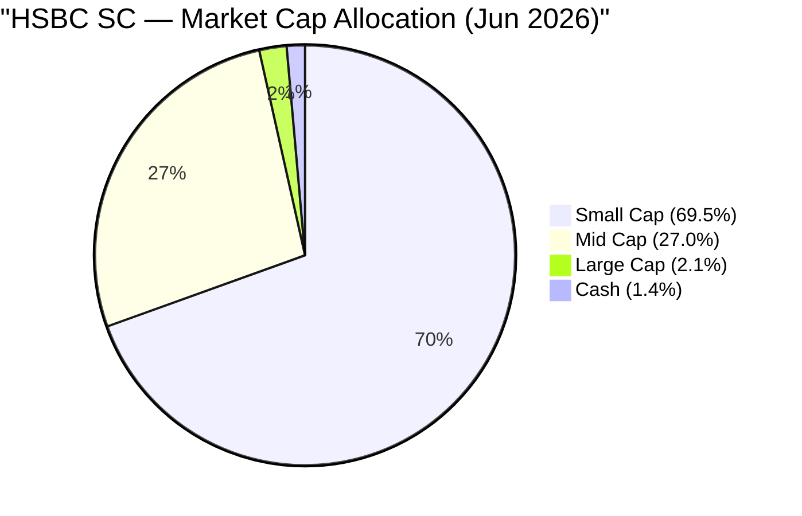

---

## Market Cap Allocation — The Smid-Cap Tilt

HSBC's market-cap profile is **genuinely distinct from all three studied peers**:

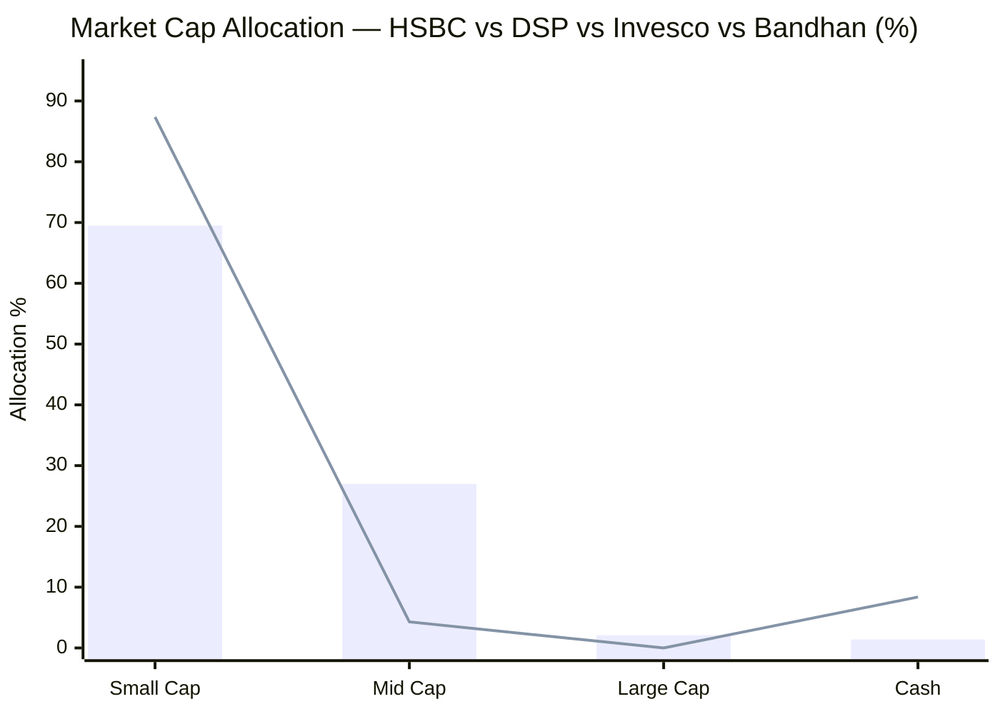
> Bar = HSBC SC | Line = DSP SC | The divergence on Mid Cap and Cash is the structural contrast

| Fund | Small Cap | Mid Cap | Large Cap | Cash | Identity |
|---|---|---|---|---|---|
| **DSP SC** | **87.35%** | 4.29% | ~0% | 8.38% | Pure SC + cash buffer |
| **HSBC SC** | **69.5%** | **27.0%** | **2.1%** | 1.4% | **Smid-cap, fully invested** |
| Bandhan SC | 66.9% (falling) | 15.0% | 4.0% | 13.3% | Diffuse deep-value |
| Invesco SC | 65.1% (floor) | 19.6% | 13.8% | 0.1% | Multi-cap growth wrapper |

**Two key structural findings:**

**Finding 1 — Lowest large-cap of the shortlist (2.1%).**
HSBC does *not* dilute its mandate with deliberate large-cap purchases. Unlike Invesco (13.8% in IndiGo, Zomato, Trent — companies that were never small caps), HSBC's 2.1% large-cap is most likely composed of **stocks originally purchased as small-caps that have since graduated** — a natural consequence of patient holding. This is mandate-clean and philosophically honest.

**Finding 2 — Highest mid-cap of the shortlist (27%).**
The 27% mid-cap figure is the *highest of all four studied funds* by a wide margin (DSP: 4.3%, Invesco: 19.6%, Bandhan: 15%). At first glance this seems like mandate drift, but the interpretation is more nuanced:

- Mid-cap stocks in a small-cap fund are primarily *graduation drift* — small-cap picks that have grown into mid-caps. Holding winners as they graduate is exactly what a patient, low-turnover manager should do.
- It does, however, reduce the "pure small-cap beta" that a satellite SIP is designed to capture. An investor buying HSBC gets ~69.5% in small caps and ~27% in mid-caps — effectively a **smid-cap fund** rather than a pure small-cap vehicle.
- The 27% mid-cap is also partly a scale artifact: at ₹16,877 Cr, the fund cannot build 109 meaningful positions purely in micro-caps — mid-cap exposure gives the manager investable liquidity.

**For a ₹20,000/month SIP, the actual allocation is:**

| Destination | Monthly (₹) | Annual (₹) |
|---|---|---|
| Small Cap Equity | ₹13,900 | ₹1,66,800 |
| Mid Cap Equity | ₹5,400 | ₹64,800 |
| Large Cap Equity | ₹420 | ₹5,040 |
| Cash / Repo | ₹280 | ₹3,360 |
| **Total Small Cap reach** | **₹13,900** | **₹1,66,800** |

Compare across funds: DSP delivers ₹17,500 to small caps per ₹20K; HSBC delivers ₹13,900; Invesco ₹13,000; Bandhan ₹13,380. HSBC ranks third — more genuine small-cap than Invesco/Bandhan, but materially less than DSP.

---

## Asset Allocation — Near-Fully Invested (No Cash, No Buffer)

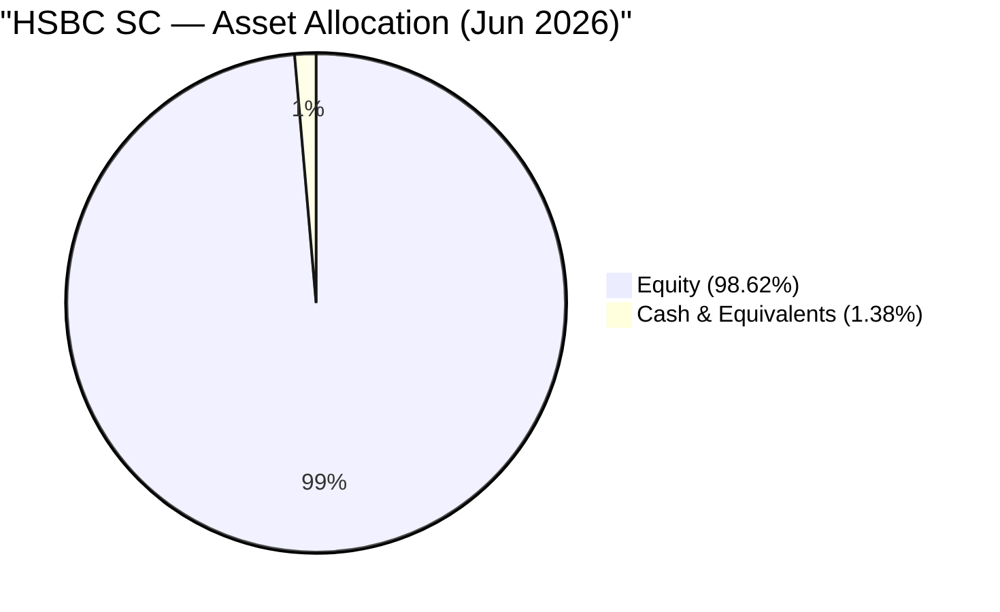

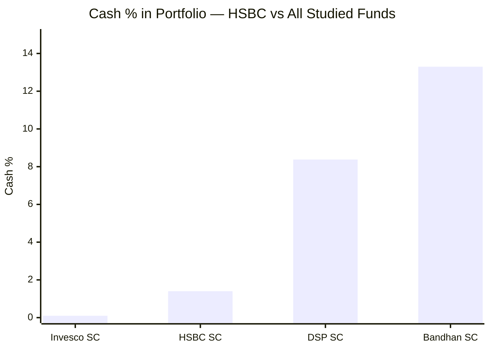

| Fund | Cash % | Cash (₹ Cr) | Implication |
|---|---|---|---|
| Invesco SC | 0.1% | ~₹11 Cr | Essentially zero |
| **HSBC SC** | **1.4%** | **~₹236 Cr** | **Negligible buffer** |
| DSP SC | 8.38% | ~₹1,499 Cr | Meaningful war chest |
| Bandhan SC | 13.3% | ~₹3,370 Cr | Maximum dry powder |

**HSBC at 1.4% cash (₹236 Cr) is nearly as fully invested as Invesco.** At ₹16,877 Cr AUM receiving ~₹200–250 Cr monthly SIP inflows, the ₹236 Cr cash is roughly 1 month of inflows — an operational float, not a strategic reserve.

**The consequences are direct:**

1. **No opportunistic buying in corrections.** When quality small-cap stocks fall 30–40%, DSP's ₹1,499 Cr sits ready to buy at depressed prices. HSBC has ₹236 Cr — barely enough to absorb one large block trade. Every rupee HSBC deploys in a correction requires trimming something else at depressed prices (zero-sum portfolio shift, not net buying).

2. **Full downside participation.** With 98.6% in equity and beta 0.96, HSBC participates in essentially 100% of any small-cap index decline. There is no structural dampening mechanism — neither cash nor a defensive valuation (PE is at-category, not below it). This is the *portfolio-level explanation* for Module 2's most damaging finding: **2025 downside capture ratio of 165.6%** (HSBC fell harder than its benchmark when the benchmark fell). A near-zero-cash, at-category-PE, 109-stock portfolio *cannot* structurally protect — the construction makes protection impossible.

3. **Maximum performance in pure bull runs.** 98.6% deployment means every rupee compounds in equity. In 2021, the extended 2023 rally, and the 2024 recovery, this full deployment translated directly into NAV gains with no cash drag.

**The defensive edge erosion (M2 ↔ M3 bridge):**
Module 2 showed the old L&T fund had a **2018 downside capture of 48.3%** — the best in the shortlist. That defensive character required either higher cash, lower-beta names, or both. Today's HSBC runs 1.4% cash vs a likely higher 2018 cash buffer. The loss of that defensive edge is not accidental — it's the direct consequence of a fully-invested, broad, index-weighted portfolio construction that evolved post-merger.

---

## Top 20 Holdings — Capital Goods, Financials, Healthcare

Total portfolio: **109 stocks**. Top 20 equity names account for **~35% of assets** — a broad spread where no single name dominates.

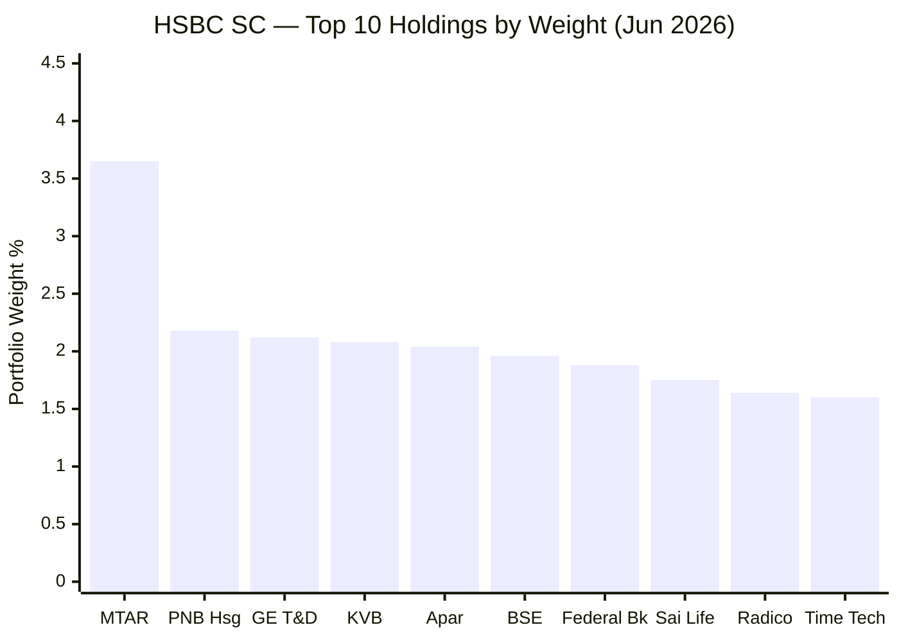

| # | Stock | Wt% | Sector | Investment Thesis | Cross-Fund Presence |
|---|---|---|---|---|---|
| 1 | **MTAR Technologies** | 3.08–3.65% | Capital Goods / Defence | Precision-engineered components for nuclear, space, defence, clean energy; ISRO + DRDO ecosystem; no domestic competitor at same quality | HSBC-unique in top 20 |
| 2 | **PNB Housing Finance** | 2.18% | Financials | Housing NBFC turnaround; recovering from 2020–21 governance crisis; trading near/below book; retail mortgage upcycle in India | Also in Bandhan |
| 3 | **GE Vernova T&D India** | 2.12% | Capital Goods | Power transmission & distribution equipment; direct beneficiary of India's ₹2.5L Cr power grid capex; energy transition hardware | HSBC-unique in top 20 |
| 4 | **Karur Vysya Bank** | 2.08% | Financials | South India regional bank; conservative lending culture; improving asset quality; deep Tamil Nadu + Andhra franchise | Also in Invesco |
| 5 | **Apar Industries** | 2.04% | Industrial | Conductors, cables, transformer oils; direct data-centre + power capex play; niche industrial compounder | Also in Bandhan |
| 6 | **BSE Ltd** | 1.96% | Financials | India's second stock exchange; derivatives market share expanding; regulated exchange infrastructure — a utility with pricing power | Also in Invesco |
| 7 | **Federal Bank** | 1.88% | Financials | Kerala private bank; Gulf NRI remittance corridor; conservative underwriting; strong CASA from NRI franchise | Also in Invesco |
| 8 | **Sai Life Sciences** | 1.75% | Health | CDMO / GLP-1 drug manufacturing; global pharma outsourcing tailwind; IPO Dec 2024; China+1 in small molecules | Also in Invesco (4.79%) |
| 9 | **Radico Khaitan** | 1.64% | Consumer Defensive | Premium spirits (Magic Moments, Rampur whisky); India premiumisation; rising IMFL share; strong brand moat | HSBC-unique in top 20 |
| 10 | **Time Technoplast** | 1.60% | Industrial | Industrial polymer packaging; composite cylinders; defence packaging foray; genuine small-cap industrialist | HSBC-unique in top 20 |
| 11 | **Engineers India** | 1.58% | Capital Goods (PSU) | Hydrocarbon engineering consultancy (EPC + EPCM); refinery modernisation + hydrogen projects; PSU with strong order book | HSBC-unique |
| 12 | **Kirloskar Pneumatic** | 1.56% | Industrial | Industrial compressors and air systems; niche engineering; deep manufacturing expertise; multi-decade compounder | HSBC-unique |
| 13 | **Aster DM Healthcare** | 1.53% | Health | Hospital chain (GCC + South India); post-Middle East restructuring; premium South India hospital network | HSBC-unique |
| 14 | **CCL Products** | 1.48% | Consumer Defensive | India's largest instant coffee B2B exporter; ~60% of Indian coffee exports; global private-label market expansion | HSBC-unique |
| 15 | **Neuland Labs** | 1.48% | Health | API manufacturer; peptide chemistry expertise; GLP-1 adjacency via niche APIs; CDMO transition | HSBC-unique |
| 16 | **Ratnamani Metals** | 1.48% | Industrial | Stainless steel + carbon steel pipes; oil & gas, chemical, power sector capex beneficiary | HSBC-unique |
| 17 | **Supreme Petrochem** | 1.48% | Basic Materials | India's largest polystyrene producer; polymer downstream; specialty materials | HSBC-unique |
| 18 | **Polycab India** | 1.46% | Industrial | Wires & cables market leader (now mid/large); FMEG diversification; direct infrastructure + real-estate capex play | HSBC-unique |
| 19 | **National Aluminium (NALCO)** | 1.45% | Basic Materials (PSU) | Integrated aluminium from bauxite; captive power advantage; export optionality | HSBC-unique |

---

### Three Patterns in the Top 20

**Pattern 1 — Capital Goods / Power-Capex is the defining bet.**
MTAR, GE Vernova T&D, Apar Industries, Engineers India, Kirloskar Pneumatic, Ratnamani, Polycab — this cluster represents a concentrated **"India's energy transition + power grid buildout + defence capex"** thesis. MTAR (ISRO/defence precision parts), GE Vernova (grid equipment), Engineers India (refinery/hydrogen EPC), Apar (conductors/cables), Polycab (wires) — all are direct plays on the same India capex cycle. This is HSBC's most honest conviction: it is not expressed through concentrated weights (each is 1.4–3.6%), but through the *thematic frequency* in the top 20.

**Pattern 2 — "Consensus consensus quality small-caps."**
Seven of the 20 names also appear in other funds' top-20s (PNB Housing in Bandhan; Karur Vysya, BSE, Federal Bank, Sai Life in Invesco; Apar in Bandhan). This is a significant finding: HSBC's top portfolio is populated with **widely-held institutional small-cap consensus names** — the same stocks that show up across AMCs. It reinforces the high-R² finding: if you own what everyone else owns, your returns will closely track the category/benchmark. There is little genuinely *differentiated* stock picking visible in the top 20.

**Pattern 3 — Quality-growth at fair value, not deep-value.**
PE 33.28 (slightly above category) and the roster — Radico (premium spirits brand), Polycab (undisputed leader), CCL (monopoly exporter), Aster (premium hospitals) — signals a **quality-at-fair-price** philosophy. No Paytm-style contrarian bets, no sub-book PSU financiers, no pure recovery plays. This is the DSP-adjacent philosophy (quality first), but without the same disciplined PE-below-category discipline.

---

## Sector Allocation — Industrial as the Defining Active Bet

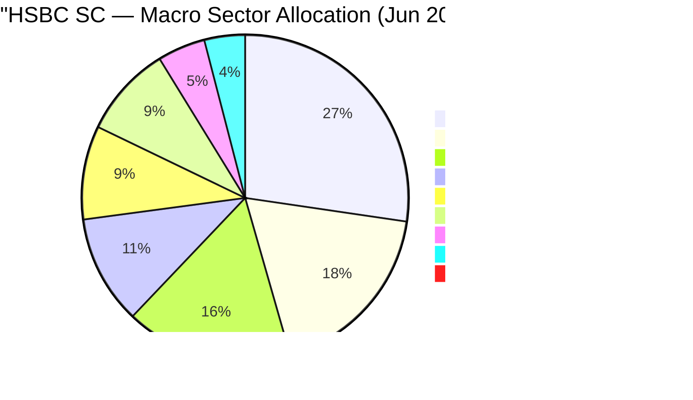

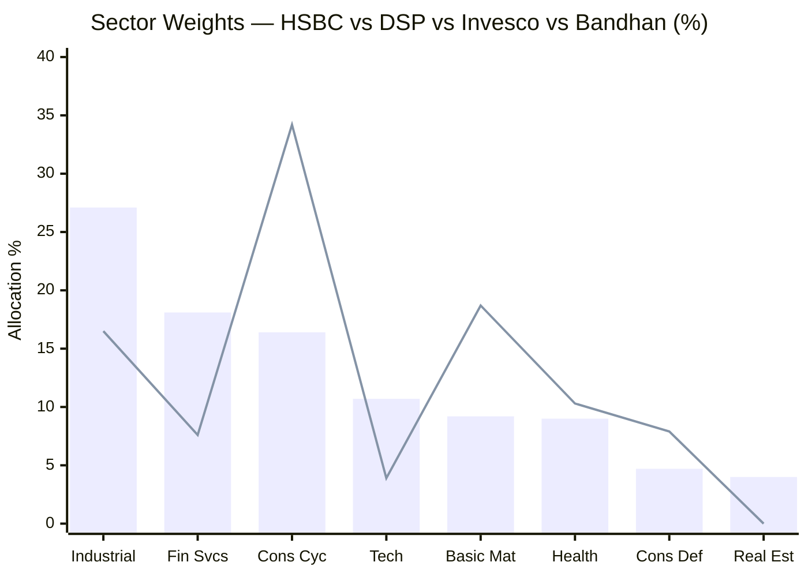
> Bar = HSBC SC | Line = DSP SC

| Sector | HSBC | DSP | Invesco | Bandhan | HSBC vs Peers |
|---|---|---|---|---|---|
| **Industrial** | **27.1%** | 16.5% | 16.7% | 13.2% | **HSBC overweight by 10pp vs peers** |
| Financial Services | 18.1% | 7.6% | 27.7% | 24.1% | Below Invesco/Bandhan; above DSP |
| Consumer Cyclical | 16.4% | **34.2%** | 19.1% | 13.4% | Underweight vs DSP by 17.8pp |
| **Tech** | **10.7%** | 3.9% | 4.4% | 5.9% | **Highest tech of all 4 studied funds** |
| Basic Materials | 9.2% | **18.7%** | 6.3% | 12.0% | Midway between Invesco and DSP |
| Health | 9.0% | 10.3% | 18.3% | 12.9% | Lowest healthcare of all 4 |
| Consumer Defensive | 4.7% | 7.9% | 1.3% | 5.0% | In-line with peers |
| Real Estate | 4.0% | ~0% | 5.7% | 9.0% | Small exposure; DSP has none |
| Cash | 1.4% | 8.38% | 0.1% | 13.3% | Second-lowest cash |

**HSBC's macro-level identity:** **"India's industrial/power-capex + financial deepening + consumer formalisation fund"** — Industrial (27%) + Financials (18%) + Consumer Cyclical (16%) = 61%. Industrial is the dominant, differentiated bet; the rest is broadly diversified across India growth themes.

---

### Industrial Deep-Dive (27.1%) — The Defining Sector Bet

At 27.1%, Industrials is HSBC's single largest sector — **10pp above peers** (DSP 16.5%, Invesco 16.7%, Bandhan 13.2%). This is the fund's most credible active conviction.

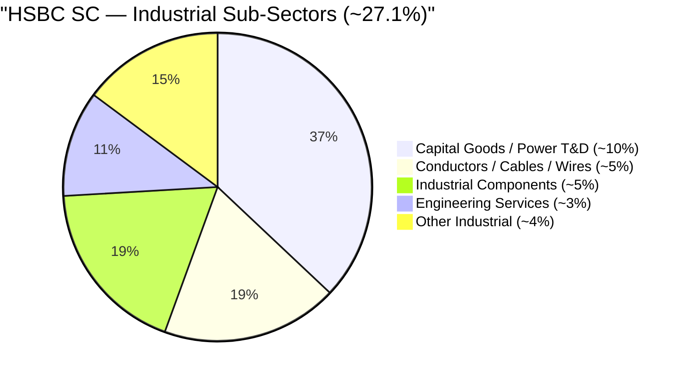

**The thesis in three parts:**

1. **Power Grid & Energy Transition:** India's ₹2.5L Cr power grid investment (2024–29) flows through companies like GE Vernova T&D (substations, transformers), Apar Industries (conductors), Polycab/Ratnamani (cables and pipes). This is not a cyclical bet — it is a multi-year government-mandated infrastructure buildout with guaranteed order flow.

2. **Defence & Space Manufacturing (MTAR):** MTAR Technologies is HSBC's top holding and its most differentiated pick. Precision-machined components for ISRO's PSLV/GSLV/SSLV missions, DRDO's clean energy programme (fuel cells for submarines), and international aerospace clients. India's defence indigenisation (Atmanirbhar Bharat) policy creates a captive, import-substitute market for MTAR — there is no domestic competitor for the complexity of what it manufactures.

3. **Industrial Capex Cycle (Kirloskar, Time Tech, Engineers India):** India's manufacturing sector is mid-capex cycle — new factories, expanded capacity, infrastructure buildout all driving demand for industrial compressors, polymer packaging, and hydrocarbon engineering consultancy. This is an economic cycle play *and* a structural India manufacturing renaissance play simultaneously.

**Risk concentration:** All three sub-themes (power grid, defence, industrial capex) are sensitive to **government capex continuity**. A policy U-turn (budget cuts, delayed projects, L1-bidding pressure on margins), a coalition government slowdown, or a ₹/$ depreciation increasing import costs for equipment could hit the entire sector simultaneously. Industrial is a thematically cohesive bet — not a diversification within industrials.

---

### Tech Deep-Dive (10.7%) — HSBC's Unexpected Distinction

At 10.7%, HSBC runs the **highest technology allocation of all four studied funds** (DSP 3.9%, Invesco 4.4%, Bandhan 5.9%). This is a meaningful and overlooked distinguishing feature.

HSBC's tech holdings are likely a mix of:
- **IT services / engineering R&D (ER&D)** companies benefiting from global outsourcing
- **Software product companies** at the small-cap level
- **Fintech / digital infrastructure** enablers

The 10.7% tech exposure, combined with the industrial 27%, suggests HSBC is positioning for **India's dual-speed growth story** — both the physical economy (power, defence, manufacturing) and the digital economy (IT services, software, fintech). This tech overweight (vs peers) should be watched: it adds positive exposure in a global IT upcycle but amplifies pain when global technology spending slows (as in 2022's rate-induced tech correction).

---

### Financial Services (18.1%) — Balanced Exposure

At 18.1%, HSBC's financials allocation sits between DSP's minimal 7.6% and Invesco/Bandhan's heavy 24–28%. The composition from the sub-sector data (Private Banks 6.86%, Investment Banking/Brokerage 5.12%) suggests a **quality-bias** — private banks and exchange infrastructure (BSE Ltd), not sub-book deep-value PSU banks. This is consistent with the quality-growth-at-fair-value philosophy and distinguishes HSBC's financial sector bet from Bandhan's value/recovery-driven approach.

---

### Consumer Cyclical (16.4%) — Notable Underweight vs DSP

At 16.4%, HSBC runs roughly half of DSP's 34.2% consumer-cyclical exposure. DSP's defining thesis is India's consumer formalisation — auto ancillary (Shriram Pistons, Swaraj Engines), regional FMCG, retail-adjacent businesses. HSBC's consumer-cyclical at 16% is present but not the centrepiece. For an investor who believes India's consumer formalisation is the decade's biggest structural theme, DSP expresses this more purely.

---

## Portfolio Concentration Analysis

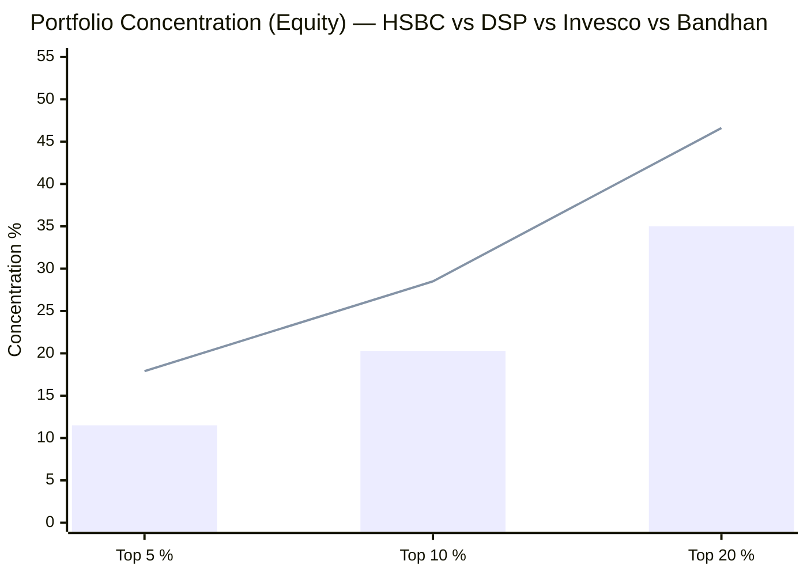
> Bar = HSBC SC | Line = DSP SC. HSBC is significantly less concentrated at every level.

| Metric | HSBC SC | DSP SC | Invesco SC | Bandhan SC |
|---|---|---|---|---|
| Total Stocks | **109** | 81 | 67 | 239–256 |
| Top Holding % | 3.08–3.65% | **5.38%** | 4.87% | 3.49% |
| Top 5 % | **~11.5%** | 17.9% | 21.5% | 12.2% |
| Top 10 % | **~20.3%** | 28.5% | 37.8% | 18.9% |
| Top 20 % | **~35%** | 46.6% | 49.1% | 28.2% |

**HSBC is the second-most diffuse portfolio in the shortlist** (after Bandhan's 256-stock spray). With ~20.3% top-10 concentration, the fund's returns and risks are genuinely spread across the board — no single name or cluster can move the fund much. MTAR at 3.65% is the largest position; a 50% collapse in MTAR (a disaster scenario) costs the portfolio only ~1.8% of NAV.

**The portfolio is not as extreme as Bandhan's:** unlike Bandhan's sub-1% average weight for positions 20–256, HSBC's positions 20–109 likely average ~0.6–0.8% — still small, but not infinitesimal. Positions in this range contribute modestly to alpha: a 3× return on a 0.7% position adds 1.4% to NAV. Meaningful, but far from concentrated.

**The academic optimum caveat applies:** at 109 stocks (vs the 25–30 where diversification benefits plateau), HSBC has:
- Marginal idiosyncratic risk reduction per additional stock well past the 30-stock point
- A long tail (stocks ~40–109) where individual research investment cannot generate proportional alpha
- A construction that mechanically produces benchmark-tracking behavior

**However, the diffusion is *less damaging* for HSBC than for Bandhan** because HSBC's smaller size (~₹16,877 Cr vs Bandhan's ₹25,346 Cr) means deployment friction is somewhat lower — but the 109-stock construction is still a *function of AUM scale*, not purely a conviction choice.

---

## Portfolio Turnover — Patient Quality-Hold

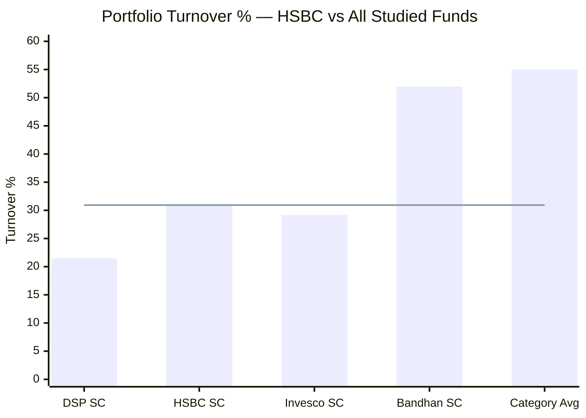
> Line = HSBC's 30.93% | HSBC sits between DSP (most patient) and Bandhan (most rotational)

**Primary figure: 30.93%** (Tickertape, confirmed by INDmoney). One source (BusinessToday) shows 14.00%, suggesting possibly a different measurement period. The range implies:
- **At 30.93%** → Implied average holding period: **~3.2 years**
- **At 14.00%** → Implied average holding period: **~7 years**

**Either way, the directional conclusion is identical:** HSBC is a **patient, buy-and-hold-oriented fund** — well below the ~55% category average and below Bandhan's 52%. It is not a rotational, value-harvesting vehicle. Manghat's philosophy (inferred): buy quality businesses at fair value, hold through the cycle, let compounding work.

**What drives the ~31% turnover (using primary figure)?**
1. **New position initiation:** Adding to the 109-stock book as the fund grows requires building new positions across more small-caps
2. **Graduation management:** As small-caps cross into mid-cap territory (the 26% mid-cap exposure), periodic rebalancing trims over-weighted graduates
3. **Fund inflows deployment:** Monthly SIP inflows (~₹200–250 Cr) continuously entering a nearly-fully-deployed book require incremental stock adds, generating measured turnover

This is constructive turnover — not speculative rotation. **No STCG tax friction concern** at 31% turnover (unlike Bandhan's 52% which meaningfully erodes the headline-low ER advantage on an all-in post-tax basis).

---

## AUM Scalability — In the Constraint Zone

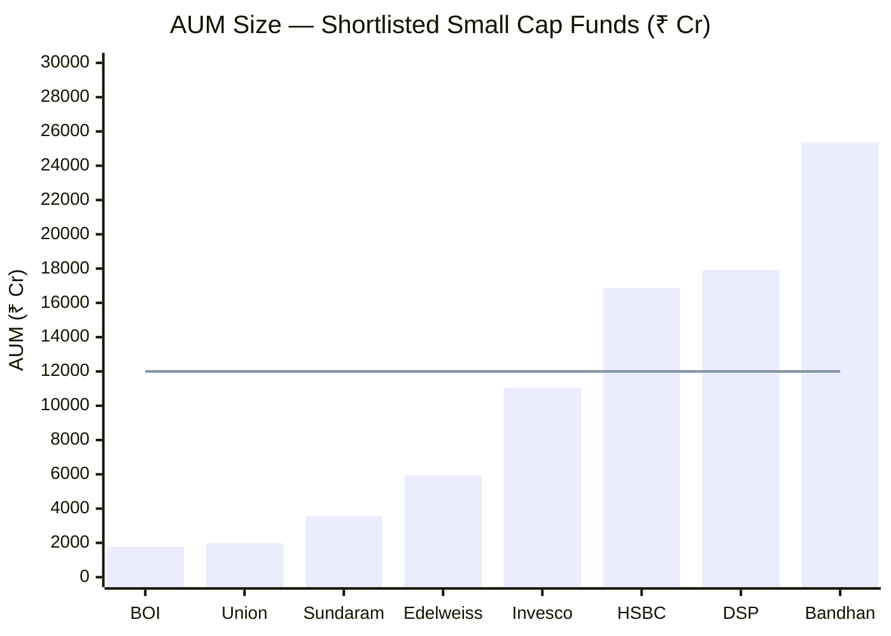
> Line = ~₹12,000 Cr AUM threshold above which small-cap deployment friction becomes structurally significant

| Scenario | HSBC (₹16,877 Cr) | DSP (₹17,906 Cr) | Invesco (₹11,038 Cr) | Bandhan (₹25,346 Cr) |
|---|---|---|---|---|
| 1% position requires | **₹169 Cr** | ₹179 Cr | ₹110 Cr | ₹253 Cr |
| 1% = % of ₹5,000 Cr SC company | **~3.4% of float** | ~3.6% | ~2.2% | ~5.1% |
| Monthly SIP inflows (est.) | ~₹200–250 Cr | ~₹300 Cr | ~₹180 Cr | ~₹380 Cr |
| Deployment constraint | **Significant** | Significant | Low | Severe |
| Coping mechanism | **109 stocks + 1.4% cash** | 81 stocks + 8.4% cash | 67 stocks + 0.1% cash | 256 stocks + 13.3% cash |

**The ₹109-stock, near-zero-cash construction is HSBC's scale-coping mechanism**, just as DSP holds 8% cash and Bandhan has 256 stocks + 13% cash. HSBC's specific choice — more stocks, almost no cash — is a **"dilute the book rather than park in cash"** strategy. The consequence: scale-induced index-like behavior rather than cash drag.

**Stress test (25% portfolio liquidation):** At ₹16,877 Cr, liquidating 25% = ~₹4,219 Cr across 109 small/mid-cap names. At typical daily volumes, this would take an estimated **15–20 days** — comparable to DSP (21–25 days), better than Bandhan (worst in shortlist), but worse than Invesco (~10–15 days). This is manageable for a going-concern scenario; only problematic in a redemption crisis.

**AUM growth capacity:** HSBC has limited headroom before the scale constraint worsens. At ₹17,000 Cr (essentially now), it is already running near-DSP levels of deployment friction. Growth to ₹20,000+ Cr would likely push the stock count past 120 and further towards index-replication. Alternatively, it could increase the cash buffer (moving toward DSP's model) — but that would create cash drag. Neither path improves the index-hugging problem.

---

## Portfolio PE — Slightly Rich (No Valuation Buffer)

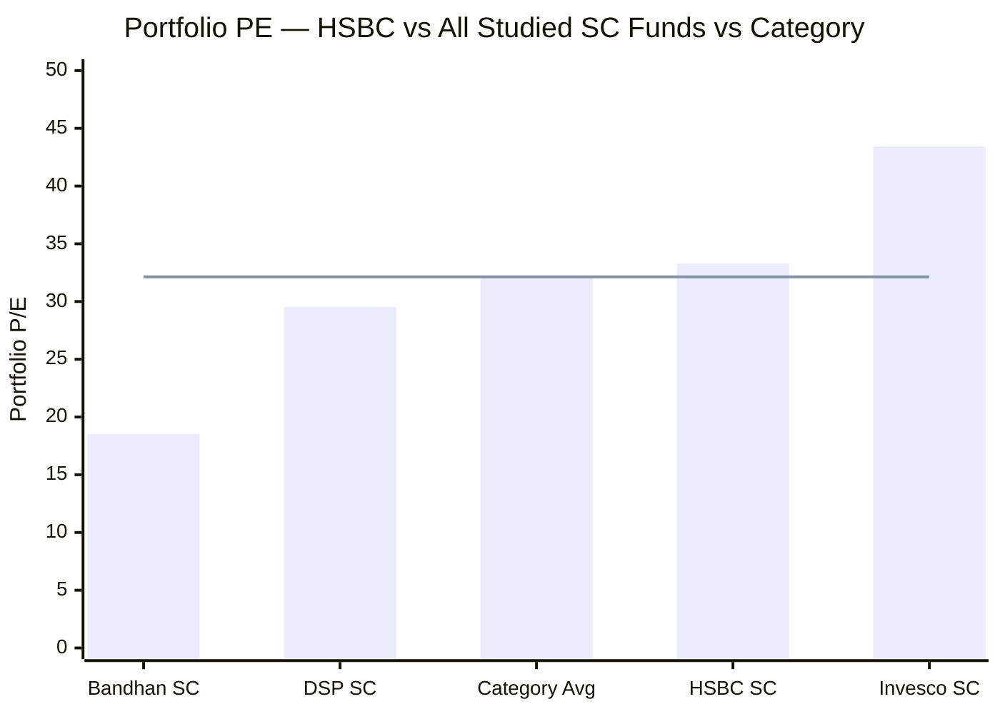
> Line = Small Cap category average PE (32.14). HSBC trades at a slight premium; DSP and Bandhan provide valuation cushion.

| Fund | PE | vs Category | Interpretation |
|---|---|---|---|
| Bandhan SC | 18.53 | **−41%** | Maximum valuation protection |
| DSP SC | 29.54 | **−8%** | Meaningful valuation cushion |
| **HSBC SC** | **33.28** | **+3.5%** | **No cushion; slight premium** |
| Invesco SC | 43.43 | +37% | Maximum PE fragility |

**HSBC at PE 33.28 is the third data point in the "index-hugging triad."** A fund that owns the market index at the market's own PE will, by definition, have no structural protection against multiple-compression. DSP's −8% discount provides a small buffer: if the category re-rates from PE 32 to PE 28 (a 12.5% compression), DSP starts from 29.54 and has meaningful room. HSBC at 33.28 gets *more* hurt by the same compression than the category average.

**Important context:** HSBC's PE 33.28 is far less dangerous than Invesco's 43.43. The +3.5% premium is not an extreme valuation stretch — it is consistent with a quality-tilt (good businesses trade at slight premium to the index). But combined with 1.4% cash and 109 stocks, the PE slightly above category removes the last potential line of defence in a correction scenario. HSBC enters any bear market without: (a) cash to buy the dip, (b) a valuation cushion to absorb multiple compression, or (c) a concentrated portfolio where defensive names can outperform enough to matter.

---

## The Consensus Construction Problem

A critical and underappreciated finding from cross-referencing the top-20 lists: **HSBC's portfolio overlaps extensively with the "institutional small-cap consensus"** — the set of stocks that most active small-cap managers own simultaneously.

From the top 20, seven names also appear prominently in other funds in this study:
- **PNB Housing Finance** → Bandhan's top 4 equity, HSBC's #2
- **Karur Vysya Bank** → Invesco's #10, HSBC's #4
- **BSE Ltd** → Invesco's #8, HSBC's #6
- **Federal Bank** → Invesco's #7, HSBC's #7
- **Sai Life Sciences** → Invesco's #2 (4.79%), HSBC's #8
- **Apar Industries** → Bandhan's #15, HSBC's #5

These overlaps are not coincidences — they reflect **shared institutional research conviction** on quality small-cap names. That's fine as a starting point. The problem is when overlap becomes the *dominant* driver of a portfolio: if HSBC's top 20 are the same stocks 15–20 other small-cap funds own, then HSBC's performance will by construction track the peer group. This is exactly what R² 95.96 shows.

**The contrast with DSP's top 20** is instructive: DSP's defining names — Lumax Industries, Shriram Pistons, Swaraj Engines, Menon Bearings, Avanti Feeds — are *not* appearing simultaneously in Invesco, Bandhan, or HSBC's top 20s. Sambre owns the differentiated, lower-profile, higher-conviction small caps. Manghat owns the *consensus* quality names. Both approaches are legitimate — but only one of them generates differentiated returns from the category.

---

## Manager Factor — Manghat (6.5 yr) + Chaturvedi (8 months)

| Manager | Start Date | Tenure | Role |
|---|---|---|---|
| **Venugopal Manghat** | 17-Dec-2019 | **~6.5 years** | Lead manager; full accountability for current portfolio |
| **Mayank Chaturvedi** | 1-Oct-2025 | **~8 months** | Co-manager; very recent addition |

**Manghat's 6.5-year tenure** (through the L&T→HSBC merger, a full bull market 2020–21, the correction of 2022, the recovery of 2023–24, and the recent turbulence) gives a reasonable track record to evaluate. The Module 2 findings (positive alpha over the full period, but beta regime shift and negative IR in the recent period) are attributable to his construction choices.

**Chaturvedi as a watch-item:** Added Oct-2025, he has been co-manager for only 8 months. His influence on the portfolio (if any) is not yet visible in the construction — the 109-stock, low-cash, industrial-heavy structure is Manghat's legacy. Whether Chaturvedi brings a differentiated perspective or simply inherits the existing framework will only be visible over the next 12–18 months. His background and philosophy will be analysed in Module 5.

**The key portfolio-construction legacy question for Manghat:** Why did the fund's defensive character erode (beta 0.61 in 2018 → 0.96 today, R² rising to 95.96)? This is likely a combination of AUM growth forcing broader construction and the post-L&T-merger rebuild of the portfolio. It suggests the index-hugging is not a deliberate choice but an *emergent consequence* of scale — which means it may be structural and not easily reversed without either capacity controls or a philosophy change.

Full manager analysis is reserved for Module 5.

---

## Points For (Portfolio Angle)

1. **Cleanest large-cap mandate in the shortlist (2.1%):** Unlike Invesco (13.8% in IndiGo/Zomato/Trent — stocks never classified small-cap), HSBC holds only 2.1% large-cap, likely all graduation drift. No "multi-cap in disguise" mandate misalignment.

2. **Highest mid-cap (27%) reflects successful holding:** Stocks bought small that grew — a positive sign of patient compounding. HSBC does not sell winners prematurely just to maintain a small-cap label.

3. **Industrial 27.1% — coherent, differentiated thematic bet:** The power-grid / defence / capex cluster (MTAR, GE Vernova, Engineers India, Apar, Polycab) is a genuine long-cycle India growth theme and the fund's most honest active bet. Better-expressed than peers' industrial exposure.

4. **Highest tech allocation (10.7%):** Unique exposure in the small-cap study; hedges against the industrial/capex cycle with IT/digital economy stocks.

5. **Patient turnover (~31%):** Quality-hold philosophy; ~3–7 year holding period; no excessive STCG tax friction; consistent buy-and-hold approach.

6. **No cash drag:** 98.6% deployed means full equity compounding in bull markets; no permanent return sacrifice to overnight repo.

7. **Moderate PE (33.28):** Not the dangerous PE 43.43 of Invesco; HSBC's quality tilt is mild, not extreme. In a moderate PE-compression scenario, the +3.5% premium is far less damaging than Invesco's +37% premium.

8. **No deliberate large-cap bets, no IPO dependency, no deep-value cyclicals:** HSBC avoids the specific structural risks of Invesco (mandate misalignment, IPO dependency) and Bandhan (deep-value traps, scale-driven closet indexing).

---

## Points Against (Portfolio Angle)

1. **Index-hugging triad (109 stocks + 1.4% cash + PE ≈ category):** The three data points mechanically produce R² 95.96 / beta 0.96 (M2). A satellite SIP whose purpose is to generate *differentiated, uncorrelated* small-cap alpha gets index-like returns at an active management fee.

2. **~20% top-10 concentration — no conviction driver:** With 109 stocks and a top-10 of ~20%, no single position moves the fund meaningfully. Even a 3× return in MTAR (top holding at 3.65%) adds only ~7.3% to NAV — respectable, but diluted by the remaining 108 names pulling the NAV toward the average.

3. **No cash buffer (1.4%):** Neither opportunistic war chest nor structural dampening mechanism. Full downside participation in corrections. This was demonstrated empirically in Module 2: 2025 downside capture 165.6% — the fund amplified the benchmark's decline rather than cushioning it.

4. **PE 33.28 — no valuation cushion:** Unlike DSP (−8% discount) or Bandhan (−41% discount), HSBC enters corrections at a slight premium to category. The "third layer of defence" (cheap valuation) that should exist in a quality portfolio is absent.

5. **Highest mid-cap dilution (27%):** Almost one-third of the portfolio is in mid-caps, reducing the pure small-cap beta. A satellite SIP buying HSBC gets 70% small cap, not 87% like DSP. The "extra" 17pp goes to mid-cap.

6. **Consensus construction (overlapping names with peers):** 7 of top 20 names appear in other funds' top-20s. Low portfolio differentiation from the institutional small-cap peer group drives low active return (negative IR −0.61 in M2).

7. **Scale creep (₹16,877 Cr):** HSBC is already in the constraint zone; further AUM growth pushes the stock count higher and further into index-territory. The AUM growth trajectory (L&T-era to ₹16,877 Cr today) suggests this trajectory continues.

8. **Chaturvedi added only 8 months ago:** Co-management transitions carry key-person and philosophy continuity risks. If Manghat departs, the fund's identity rests on a manager with < 1-year track record on this specific fund.

9. **Tech 10.7% as a double-edged sword:** The upside in an IT/digital upcycle is real; but in a global tech slowdown (2022-style), this concentration amplifies pain vs peers who run 3–6% tech.

---

## Module 3 Scorecard

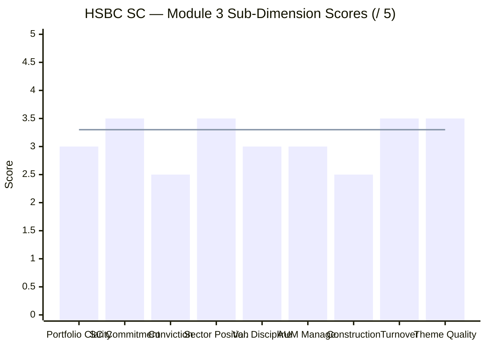
> Line = Module 3 overall score (3.3/5)

| Sub-Dimension | Score | Reasoning |
|---|---|---|
| Portfolio Clarity / Identity | **3.0/5** | Consistent quality-growth construction; but "index-aware broad smid-cap" is a fuzzy identity vs DSP's sharp "concentrated SC conviction" |
| Small Cap Commitment | **3.5/5** | 69.5% SC is cleaner than Invesco (65.1%) and Bandhan (66.9%); no deliberate large-cap dilution (2.1% LC all drift, not design) |
| Manager Conviction Quality | **2.5/5** | Top-10 ~20%; top holding ~3.5%; 109 stocks across the board; no dominant conviction bet visible in the construction |
| Sector Positioning | **3.5/5** | Industrial 27.1% is a coherent, differentiated active bet; Tech 10.7% adds unique exposure; overall sector spread otherwise index-like |
| Valuation Discipline | **3.0/5** | PE 33.28 — slight premium to category; not extreme (vs Invesco's 43.43); quality tilt without strict PE discipline; no DSP-style ROCE filter evident |
| AUM Manageability | **3.0/5** | ₹16,877 Cr is in the constraint zone; coping via 109 stocks (not cash) creates index-hugging rather than drag; 15–20 day stress-test est. |
| Portfolio Construction | **2.5/5** | 109-stock, ~1.4% cash, PE at-category triad directly produces R² 95.96 / beta 0.96; construction undermines the active management fee justification |
| Turnover & Cost Efficiency | **3.5/5** | 30.93% (primary) — patient, below category; ~3–7 yr implied hold; no excessive STCG friction; consistent quality-hold philosophy |
| Theme Quality | **3.5/5** | Industrial/power-capex + financials + consumer formalisation are real 10Y India themes; industrial overweight is the genuinely differentiated bet; tech exposure is forward-looking |
| **Module 3 Overall** | **3.3 / 5** | Best SC mandate purity of studied peers (no large-cap dilution); coherent industrial/power-capex thesis; patient hold; offset by index-hugging construction, near-zero cash, no valuation buffer, and a "consensus" top-20 that explains the high R² from Module 2 |

---

## Comparison with All Studied Funds

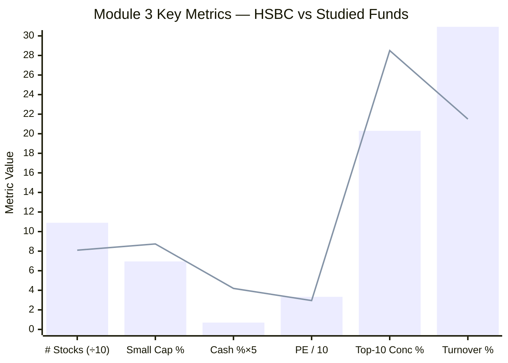
> Bar = HSBC SC | Line = DSP SC (metrics scaled for visualisation)

| Dimension | HSBC SC | DSP SC | Invesco SC | Bandhan SC |
|---|---|---|---|---|
| Total Stocks | 109 | 81 | **67** | 239–256 |
| Small Cap % | 69.5% | **87.35%** | 65.1% | 66.9% (falling) |
| Mid Cap % | **27.0%** | 4.3% | 19.6% | 15.0% |
| Large Cap % | **2.1%** (lowest) | ~0% | 13.8% | 4.0% |
| Cash % | 1.4% | 8.38% | **0.1%** | 13.3% |
| Top Holding % | 3.65% | **5.38%** | 4.87% | 3.49% |
| Top-10 % | 20.3% | 28.5% | **37.8%** | 18.9% |
| Portfolio PE | 33.28 | 29.54 | 43.43 | **18.53** |
| Turnover | 30.93% | **19–24%** | 29.17% | 51.96% |
| AUM | ₹16,877 Cr | ₹17,906 Cr | ₹11,038 Cr | ₹25,346 Cr |
| Defining Sector | Industrial 27.1% | Consumer Cyc 34.2% | Financials 27.7% | Financials 24.1% |
| Style | Broad quality smid-cap | Concentrated quality SC | Concentrated growth | Diffuse deep-value |
| Module 3 Score | **3.3/5** | **3.8/5** | **3.1/5** | **3.2/5** |

**HSBC's distinctive positioning across all studied funds:**
- **Lowest large-cap exposure (2.1%)** — mandate-cleanest non-DSP fund in the shortlist
- **Highest mid-cap exposure (27%)** — the "smid-cap" fund by construction
- **Highest tech allocation (10.7%)** — unique digital-economy exposure
- **Industrial #1 sector at 27.1%** — the only fund where capital-goods/power-capex is the defining macro bet
- **Largest book of studied SC funds (except Bandhan)** — at ₹16,877 Cr, scale constraint is a structural reality
- **Most benchmark-hugging construction (R² 95.96)** — three-part triad makes index-replication the emergent outcome

---

## Comparative Module 3 Scores

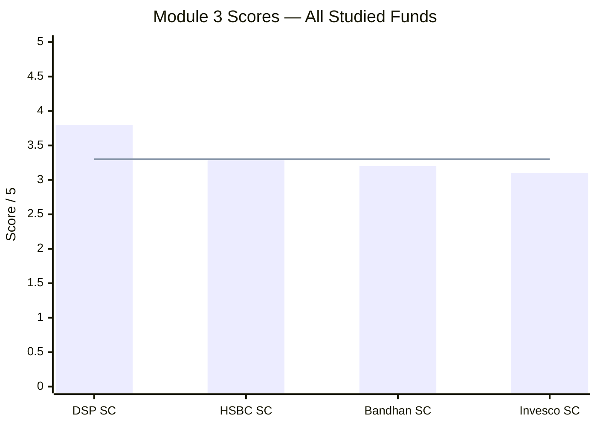
> Line = HSBC SC score (3.3/5) for reference

| Fund | M3 Score | Portfolio Identity |
|---|---|---|
| **DSP SC** | **3.8/5** | Pure SC concentrated conviction; lowest turnover; 18-yr tenure; AUM ceiling the key constraint |
| **HSBC SC** | **3.3/5** | **Broad smid-cap quality; industrial/power-capex bet; cleanest mandate; index-hugging construction; no cash/valuation buffer** |
| **Bandhan SC** | **3.2/5** | Diffuse deep-value rotation; lowest PE; lowest stock risk; highest cash drag; AUM-constrained |
| **Invesco SC** | **3.1/5** | Multi-cap growth wrapper; highest PE; AUM-optimal; mandate misalignment |

HSBC's M3 score of 3.3/5 edges above Bandhan (3.2) and Invesco (3.1), significantly below DSP (3.8). HSBC ranks second precisely because:
- Its SC mandate is the **cleanest of non-DSP peers** (2.1% large cap; 69.5% small; no deliberate mandate violation like Invesco's 13.8%)
- Its industrial/tech sector bets are the **most differentiated** of the three (Invesco and Bandhan are both heavy financials — a more consensus bet)
- Its PE is **far less dangerous** than Invesco's 43.43

The **0.5-point gap to DSP** is driven by three concentrated weaknesses: the index-hugging construction (109 stocks, 1.4% cash, category PE), the diluted conviction (top-10 at 20%), and the consensus top-20 that directly explains Module 2's R² / IR findings.

---

## SIP Implication

For a ₹20,000/month satellite SIP with a 10+ year horizon:

**What you are actually buying:** A broad, fully-invested smid-cap quality fund — 69.5% small cap + 27% mid cap across 109 names, tilted toward India's industrial/power-capex cycle and financial deepening, at PE slightly above the category, with near-zero cash. It is the "most index-like" of the shortlisted active funds while still being meaningfully distinct from a passive index (R² 95.96, not 100%; the industrial overweight is a real active bet).

**The satellite mandate question:** The purpose of a satellite SIP is to generate *concentrated, differentiated small-cap alpha* that complements the core SIP. HSBC partially fulfills this:
- ✅ 69.5% genuine small cap (better than Invesco/Bandhan)
- ✅ Distinct industrial/capex theme not in most FlexiCap core funds
- ❌ 109-stock/R² 95.96 construction dilutes differentiation
- ❌ No cash/valuation buffer means full downside participation — the satellite amplifies drawdowns, not dampens them

**Where HSBC's portfolio DNA helps:**
- The 27% mid-cap provides a less volatile cushion than pure micro-cap concentration; mid-caps fall less in small-cap specific crashes
- Industrial 27.1% gives genuine differentiation vs a FlexiCap core that likely underweights power-capex small companies
- Patient hold (~3–7 years) + quality construction means no excessive transaction costs or STCG tax friction over a 10-year SIP

**Where HSBC's portfolio DNA hurts:**
- In a small-cap correction, 98.6% deployment + beta 0.96 means full, near-unmitigated drawdown participation (Module 2: 165.6% downside capture in 2025)
- "Consensus" top-20 overlap with peers means HSBC diversifies less from other SC funds in the satellite than DSP or Invesco would — if you hold two SC funds, HSBC+X shares more holdings with X than DSP+X would
- Scale-driven index hugging will *worsen* as AUM grows — the fund will become more benchmark-like over time unless AMC imposes capacity controls

**What to monitor:**
1. **Mid-cap % trajectory:** If it rises above 30%, HSBC is functionally a smid-cap fund, not a small-cap fund. Reconsider the satellite mandate.
2. **Industrial sector health:** The power-capex cycle (MTAR, GE T&D, Apar) is contingent on government capex continuity; monitor Union Budget and NTPC/grid capex announcements.
3. **Chaturvedi's growing role:** Over 12–18 months, watch if portfolio construction shifts (e.g., stock count drops toward 90, cash rises, concentration increases) — that would signal a philosophy upgrade.
4. **R² trend:** If R² approaches 97–98% in the next Module 2 update, the index-hugging is worsening; if it drops toward 90%, differentiation is improving.
5. **AUM:** Any AMC communication about SIP/lumpsum restrictions would be the first signal of a scale-driven mandate crisis (like DSP's restrictions). At ₹16,877 Cr, this risk is real in the next 2–3 years.

---

*Module 3 complete. Portfolio DNA is broad smid-cap quality: 109 stocks, 69.5% small cap, 27% mid cap (highest studied), 2.1% large cap (lowest studied), 1.4% cash, PE 33.28 (slight category premium), 30.93% turnover (patient hold), Industrial 27.1% (defining active bet). The cleanest mandate of non-DSP peers — but the index-hugging triad (breadth + full-investment + category PE) mechanically produces R² 95.96, directly explaining Module 2's beta regime shift and negative information ratio. Module 3 score: 3.3/5.*

*Next: [Module 4 — Cost & AUM Impact](module4_cost.md)*
