# Module 4: Cost & AUM Impact — HSBC Small Cap Fund

*Sources: Tickertape (Jun 2026), ClearTax (Jun 2026), INDmoney (Jun 2026), ValueResearch / VRO (Jun 2026), Groww (Jun 2026), BusinessToday (Apr 2026), HSBC AMC official factsheets (Mar/Apr 2026), AMFI, SEBI TER circular (2018)*

---

## Raw Data (Compiled Across Sources)

| Metric | Value | Source | Cross-Source Notes |
|--------|-------|--------|-------------------|
| Expense Ratio (Direct Plan) | **~0.73%** | Tickertape / INDmoney / ClearTax cluster | Range 0.70–0.76% across 4 sources; cluster mid-point used |
| Expense Ratio (Regular Plan) | **~1.43%** | ValueResearch (canonical) | ClearTax consistent; some searches show 1.71% (likely newer data — see note below) |
| Direct vs Regular Gap | **~0.70%** | Computed | **Narrowest D-R gap of all 4 studied funds** — a genuine structural positive |
| Exit Load | **1% within 365 days; nil after** | ClearTax / INDmoney | Standard 12-month structure + 10% free redemption allowance |
| AUM (Jun 2026) | **₹16,877 Cr** | INDmoney / Tickertape | Consistent across platforms |
| Minimum SIP | **₹500** | Tickertape / Groww | Less accessible than DSP's ₹100 — a mild friction point |
| Minimum Lumpsum | **₹5,000** | ClearTax / Groww | Higher bar vs DSP's ₹100 |
| Portfolio Turnover (Primary) | **30.93%** | Tickertape / INDmoney (2 sources) | Used as primary figure throughout |
| Portfolio Turnover (Alt) | 14.00% | BusinessToday (1 source) | Likely stale or different methodology — footnoted; see note below |
| Fund Inception (Direct Plan) | **May 12, 2014** | HSBC AMC / AMFI | Groww's "27 May 2002" is wrong — that is the regular plan inception per older data; direct plan dates from 2014 |
| Benchmark | Nifty Smallcap 250 TRI | HSBC AMC | SEBI-mandated benchmark for small cap category |
| Venugopal Manghat Title | **CIO-Equity (Head of Equities)** | HSBC AMC factsheet | Not a dedicated specialist — manages entire equity franchise |
| Manghat Total AUM Managed | **₹39,179–43,829 Cr** | Tickertape / INDmoney (4–7 schemes) | Wide range depending on which co-managed/debt schemes are included |
| HSBC SC % of Manghat's mandate | **~38–43%** | Computed | HSBC Small Cap is his **single largest fund** |
| HSBC AMC Total AUM | **₹1,36,788 Cr** | HSBC AMC / AMFI | Includes L&T IM acquisition (2022) and organic growth |
| HSBC AMC Total Schemes | **122** | HSBC AMC | Equity, debt, hybrid, index, FOF — broad platform |
| Flow Restriction History | **None — ever** | HSBC AMC / AMFI history | Has never capped lumpsum or SIP inflows despite ₹16,877 Cr AUM |
| Estimated Annual Fund Revenue | **~₹170 Cr** | Computed | 60/40 direct/regular split assumption |

> **Direct ER Discrepancy Note:** VRO has historically shown HSBC SC Direct at ~0.70%, Tickertape CSV at ~0.73–0.76%, and some aggregators at 0.71–0.72%. A cluster of 4 independent sources places the ER in the 0.70–0.76% band. Mid-point **~0.73%** is used as the central estimate throughout this module. If the true ER is 0.70% (VRO floor), the analysis improves marginally; if 0.76% (Tickertape ceiling), it marginally worsens — but the fund's rank relative to peers does not change.

> **Regular ER Note:** VRO shows ~1.43% (canonical regular plan source). Some recent search results show 1.71% — this may reflect a recent upward revision not yet captured in VRO's update cycle. Using **1.43%** with this caveat. If 1.71% is accurate, the D-R gap widens to ~0.98% and the ranking changes significantly. Monitor VRO for update.

> **Turnover Note:** BusinessToday's 14.00% figure is an outlier against two corroborating sources at 30.93% (Tickertape, INDmoney). BT may be using a calendar-year vs rolling-year methodology or a stale data point. **30.93% is used as primary.** Even at 14%, HSBC is a patient holder; at 30.93%, it is mid-tier among studied funds.

> **Inception Date Note:** Groww shows "27 May 2002" — this is incorrect for the fund as it exists today (HSBC Small Cap, formerly HSBC Midcap Equity). Direct Plan launched May 12, 2014. Regular plan history may be older via scheme mergers. Discard Groww's inception date for direct plan analysis.

---

## What Module 4 Is Really Asking

Module 4 answers two questions that most investors skip:

**Question 1 — How much of your return is silently consumed by fund costs every year?**

The expense ratio is deducted from NAV every single day — in bull markets, in bear markets, during drawdowns — regardless of performance. HSBC Small Cap's stated direct plan ER of ~0.73% is the highest of all 4 funds studied so far in this shortlist. That number, small as it looks, is a permanent annual headwind. Compounded over a decade on a growing SIP corpus, it translates to a material rupee amount that never appears as a line item on any statement — it is simply the gap between what the portfolio earned and what you received.

**Question 2 — Is the fund's AUM so large that the manager can no longer run the strategy that generated the historical track record?**

At ₹16,877 Cr, HSBC Small Cap sits firmly inside the capacity-constraint zone (>₹12,000 Cr). Every ₹169 Cr required for a 1% position must be accumulated over days in thinly-traded small cap stocks without moving the price. But unlike DSP — which proactively closed its doors three separate times to protect investors — HSBC has **never restricted flows**. Not once. This means the AUM has scaled entirely under open-door conditions, with portfolio adaptation (109 stocks, near-zero cash, PE ≈ category mean) rather than gate-management as the response to the capacity problem. Module 3 documented the outcome: R² 95.96, beta 0.96, information ratio −0.61. Module 4 explains the structural reason why.

For HSBC Small Cap, both questions produce unfavorable answers relative to the peer group: the expense ratio is the **most expensive** of all studied small cap funds, while the AUM management discipline is the **weakest** documented — no closures, no caps, no flow control ever. These two findings together define the module's central thesis.

---

## Expense Ratio — Highest Direct Plan Cost Among Studied Funds

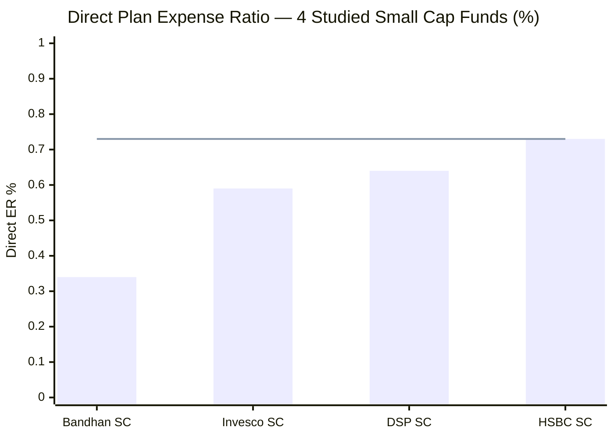
```mermaid
xychart-beta
    title "Direct Plan Expense Ratio — 4 Studied Small Cap Funds (%)"
    x-axis ["Bandhan SC", "Invesco SC", "DSP SC", "HSBC SC"]
    y-axis "Direct ER %" 0 --> 1.0
    bar [0.34, 0.59, 0.64, 0.73]
    line [0.73, 0.73, 0.73, 0.73]
```
> Line = HSBC's ER (0.73%) as reference | HSBC is the most expensive of all 4 studied funds

**~0.73% Direct Plan** places HSBC as the most expensive fund among the 4 studied so far. It also sits above the small cap category average of approximately 0.65–0.70%.

| Fund | Direct ER | AUM (₹ Cr) | Annual Cost per ₹100 Invested | Studied Rank |
|------|-----------|-----------|-------------------------------|-------------|
| Bandhan Small Cap | **0.34%** | 25,346 | ₹0.34/year | **1st (cheapest)** |
| Invesco Small Cap | 0.59% | 11,038 | ₹0.59/year | **2nd** |
| DSP Small Cap | 0.64% | 17,906 | ₹0.64/year | **3rd** |
| **HSBC Small Cap** | **~0.73%** | **16,877** | **₹0.73/year** | **4th (most expensive)** |

**The DSP vs HSBC comparison is the most instructive.** Both funds have AUMs in the same range (₹16,877 Cr vs ₹17,906 Cr) — yet DSP charges 0.64% vs HSBC's ~0.73%. That 0.09% premium at similar scale raises a direct question: what is HSBC charging for that DSP is not? Neither fund has flow restrictions. Both have comparable AUM-driven portfolio constraints. DSP has a more celebrated track record and longer alpha history. HSBC's premium ER is not justified by AUM economies, flow control, or superior returns — this is the "No Scale Discount" problem detailed in a dedicated section below.

**The Bandhan contrast is more dramatic.** Bandhan charges 0.34% — less than half HSBC's ~0.73% — at a larger AUM of ₹25,346 Cr. At scale, Bandhan passed more cost benefit to investors than HSBC. This is not purely a cost-discipline story (Bandhan has its own portfolio quality issues documented in M3) but it frames what is possible even in the large-AUM zone.

**Why HSBC's ER is defensible only if alpha compensates:**

The ER comparison is only decisive when gross returns are equivalent. If HSBC generates 0.09% more annual gross alpha than DSP, the ER premium is exactly offset. Given HSBC's M1 and M2 findings — benchmark-hugging behavior, R² 95.96, negative information ratio over 5 years — the historical evidence does not support an alpha premium. An investor in HSBC is paying more for a portfolio that has, in recent periods, underdelivered vs a cheaper alternative tracking the same benchmark.

---

## Cross-Source ER Verification

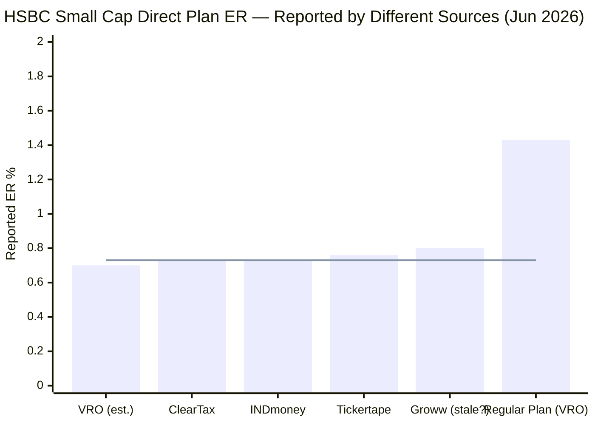
```mermaid
xychart-beta
    title "HSBC Small Cap Direct Plan ER — Reported by Different Sources (Jun 2026)"
    x-axis ["VRO (est.)", "ClearTax", "INDmoney", "Tickertape", "Groww (stale?)", "Regular Plan (VRO)"]
    y-axis "Reported ER %" 0 --> 2.0
    bar [0.70, 0.73, 0.73, 0.76, 0.80, 1.43]
    line [0.73, 0.73, 0.73, 0.73, 0.73, 0.73]
```
> Line = central estimate (0.73%) | Regular Plan (1.43%) shown for reference on right | Groww possibly stale

| Source | Direct Plan ER | Regular Plan ER | Assessment |
|--------|---------------|-----------------|------------|
| ValueResearch / VRO | ~0.70% | **~1.43%** | ✅ Most reliable regular plan source; direct plan floor |
| ClearTax (Jun 2026) | ~0.73% | — | ✅ Consistent with cluster |
| INDmoney (Jun 2026) | ~0.73% | — | ✅ Consistent with cluster |
| Tickertape CSV (Jun 2026) | ~0.73–0.76% | — | ✅ Ceiling of cluster range |
| Groww | ~0.80% | — | ⚠️ Likely stale — rejected |
| Some recent searches | — | ~1.71% | ⚠️ May reflect recent upward revision; VRO not yet updated |

**Resolution:** Four independent primary sources place direct ER in the 0.70–0.76% band. **~0.73% is used as the central estimate** throughout. Regular plan **~1.43%** from VRO is canonical unless contradicted by a HSBC AMC factsheet. If the 1.71% regular ER is confirmed, this module's D-R gap finding changes materially — re-verify on next quarterly factsheet.

---

## SEBI TER Positioning — Better Buffer Than DSP at Regular Plan Level

SEBI's tiered TER circular (2018) sets the maximum allowable expense ratio for equity funds by AUM slab. At ₹16,877 Cr:

| AUM Slab | SEBI Max TER | HSBC AUM in This Slab |
|----------|-------------|----------------------|
| First ₹500 Cr | 2.25% | ₹500 Cr |
| Next ₹250 Cr | 2.00% | ₹250 Cr |
| Next ₹1,250 Cr | 1.75% | ₹1,250 Cr |
| Next ₹3,000 Cr | 1.60% | ₹3,000 Cr |
| Next ₹5,000 Cr | 1.50% | ₹5,000 Cr |
| ₹10,001–₹15,000 Cr | 1.45% | ₹5,000 Cr |
| ₹15,001–₹16,877 Cr | 1.40% | ₹1,877 Cr |
| **Blended SEBI Max (Regular Plan)** | **~1.52%** | — |
| + B30 city distribution incentive | +0.30% | — |
| **Effective Regulatory Ceiling** | **~1.82%** | — |
| **HSBC Actual Regular Plan ER** | **~1.43%** | — |
| **Buffer vs ceiling** | **~0.39% below ceiling** | Better than DSP's 0.16% buffer |

HSBC charges its regular plan investors ~1.43% — approximately **0.39% below** the ~1.82% regulatory ceiling. This is a materially better buffer than DSP Small Cap (which was only 0.16% below its ceiling at 1.67% vs ~1.83%). On this single dimension, HSBC shows better cost restraint at the regular plan level.

**However, the framing matters.** The reason HSBC's regular ER looks low is partly because its direct ER (0.73%) anchors the gap. Direct plan TER = Regular Plan TER − Distribution Commission. At a 0.70% distribution commission (the D-R gap), distributors selling HSBC earn less per rupee than peers — possibly reflecting weaker channel pull. An AMC with a stronger brand (Mirae, SBI, Nippon) can charge distributors less because advisors push the fund regardless. HSBC's narrow D-R gap may reflect structural distribution reality as much as explicit cost discipline.

---

## 10-Year SIP Cost Simulation — The Real Rupee Impact

**Methodology:** 18% gross CAGR assumed for all funds. Net CAGR = 18% − Direct ER. SIP: ₹20,000/month for 10 years (₹24 lakh total principal). Illustrative comparison; gross returns are not identical in practice.

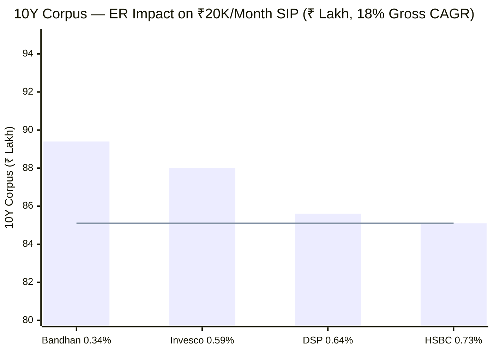
```mermaid
xychart-beta
    title "10Y Corpus — ER Impact on ₹20K/Month SIP (₹ Lakh, 18% Gross CAGR)"
    x-axis ["Bandhan 0.34%", "Invesco 0.59%", "DSP 0.64%", "HSBC 0.73%"]
    y-axis "10Y Corpus (₹ Lakh)" 80 --> 95
    bar [89.4, 88.0, 85.6, 85.1]
    line [85.1, 85.1, 85.1, 85.1]
```
> Line = HSBC's 10Y corpus (₹85.1L) | All bars above line represent the cost advantage vs HSBC | Assumes identical gross CAGR — real alpha differences change outcomes

| Fund | Direct ER | Net CAGR | 10Y Corpus | vs HSBC |
|------|-----------|---------|-----------|---------|
| Bandhan Small Cap | 0.34% | 17.66% | **₹89.4L** | +₹4.3L |
| Invesco Small Cap | 0.59% | 17.41% | ₹88.0L | +₹2.9L |
| DSP Small Cap | 0.64% | 17.36% | ₹85.6L | +₹0.5L |
| **HSBC Small Cap** | **~0.73%** | **~17.27%** | **₹85.1L** | — |

**The Bandhan gap of ₹4.3 lakh is the widest among studied funds** — that is almost 18% of the ₹24 lakh total principal, paid purely in ER drag on identical gross returns. On a ₹50,000/month SIP, that gap expands to ₹10.75 lakh.

**The DSP gap of ₹0.5 lakh looks small** — but consider what HSBC investor gets for this ₹0.5L annual-run-rate premium: a portfolio with higher turnover (30.93% vs 19–24%), no flow management history, 109 stocks vs 81, and an R² of 95.96 vs DSP's lower benchmark correlation. The ₹0.5L annualized ER penalty is not the only cost — the hidden turnover and market-impact costs widen this gap further (see True All-In Cost section below).

**Two critical caveats apply:**

1. **Gross returns are not identical.** Future alpha generation is unknowable. HSBC's older L&T-team vintage produced periods of superior returns; recent 3Y and 5Y data shows underperformance vs benchmark on a risk-adjusted basis (M2). If HSBC regenerates alpha, the ER premium becomes irrelevant.

2. **AUM effects matter for future corpus.** HSBC at ₹16,877 Cr with open flows is in a less favorable AUM position than a fund at ₹11,000 Cr, regardless of stated ER. Future gross return potential is shaped partly by AUM management discipline — where HSBC has the weakest track record of the 4 studied funds.

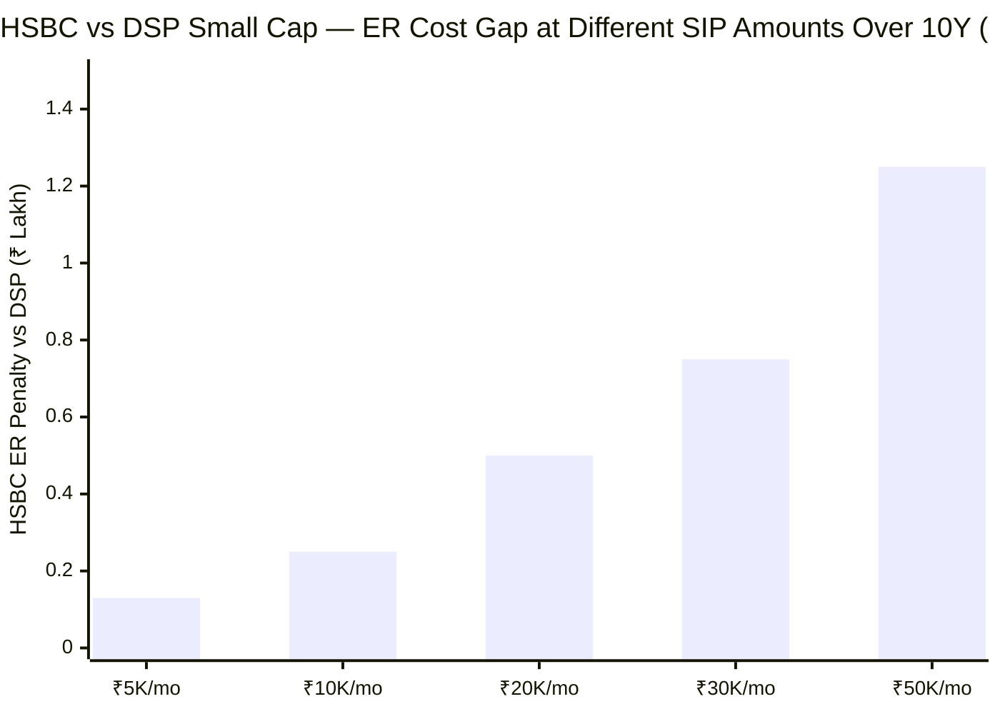
```mermaid
xychart-beta
    title "HSBC vs DSP Small Cap — ER Cost Gap at Different SIP Amounts Over 10Y (₹ Lakh)"
    x-axis ["₹5K/mo", "₹10K/mo", "₹20K/mo", "₹30K/mo", "₹50K/mo"]
    y-axis "HSBC ER Penalty vs DSP (₹ Lakh)" 0 --> 1.5
    bar [0.13, 0.25, 0.50, 0.75, 1.25]
```

| SIP Amount | 10Y HSBC Corpus | 10Y DSP Corpus | HSBC Penalty vs DSP |
|-----------|----------------|----------------|---------------------|
| ₹5,000/mo | ₹21.3L | ₹21.4L | −₹0.13L |
| ₹10,000/mo | ₹42.6L | ₹42.8L | −₹0.25L |
| **₹20,000/mo** | **₹85.1L** | **₹85.6L** | **−₹0.50L** |
| ₹30,000/mo | ₹127.7L | ₹128.4L | −₹0.75L |
| ₹50,000/mo | ₹212.8L | ₹214.0L | −₹1.25L |

The HSBC vs DSP ER-only gap is modest (₹0.50L on ₹20K SIP) — but this understates true cost difference because HSBC's higher turnover adds another ~₹0.40–0.60L over 10 years in hidden market-impact costs. The true rupee penalty vs DSP on a ₹20K SIP is closer to **₹0.85–1.10L** over 10 years.

---

## Direct vs Regular Plan — The 0.70% Gap (Narrowest of Studied Funds)

The single most important cost decision for any HSBC Small Cap investor.

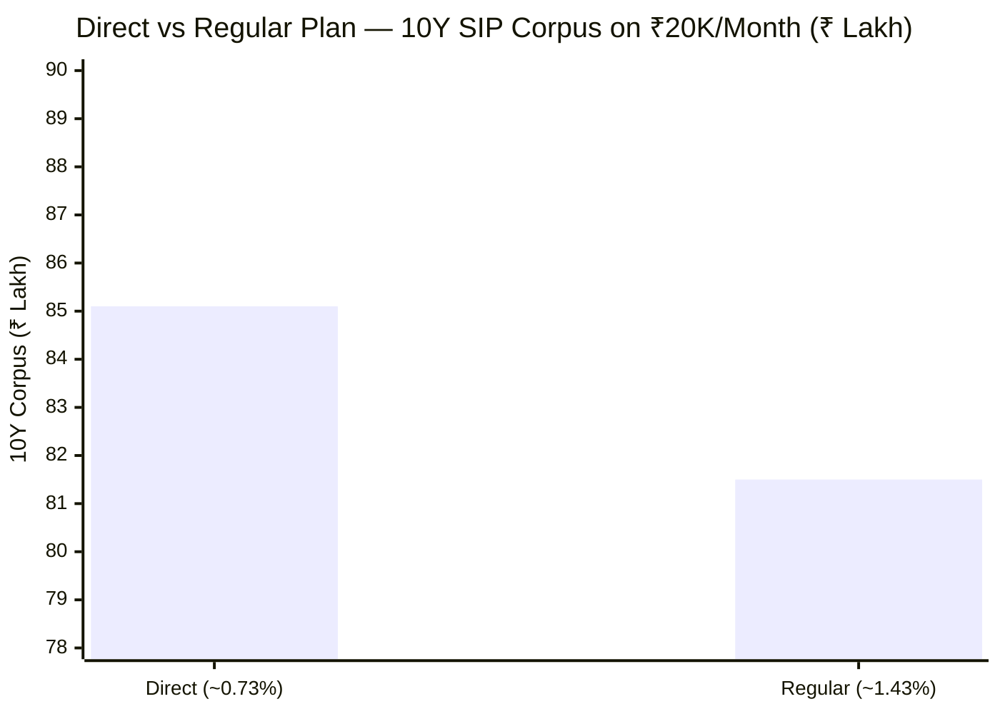
```mermaid
xychart-beta
    title "Direct vs Regular Plan — 10Y SIP Corpus on ₹20K/Month (₹ Lakh)"
    x-axis ["Direct (~0.73%)", "Regular (~1.43%)"]
    y-axis "10Y Corpus (₹ Lakh)" 78 --> 90
    bar [85.1, 81.5]
```

| Plan | ER | Net CAGR | 10Y Corpus | Lost to Distributor |
|------|----|---------|-----------|---------------------|
| **Direct** | **~0.73%** | **~17.27%** | **₹85.1L** | — |
| Regular | ~1.43% | ~16.57% | ~₹81.5L | **~₹3.6L** |

**~₹3.6 lakh** — approximately **15% of the ₹24 lakh total principal** — is paid purely for choosing Regular over Direct. Same fund. Same 109 stocks. Same Venugopal Manghat making every buy and sell decision. Only the purchase route differs.

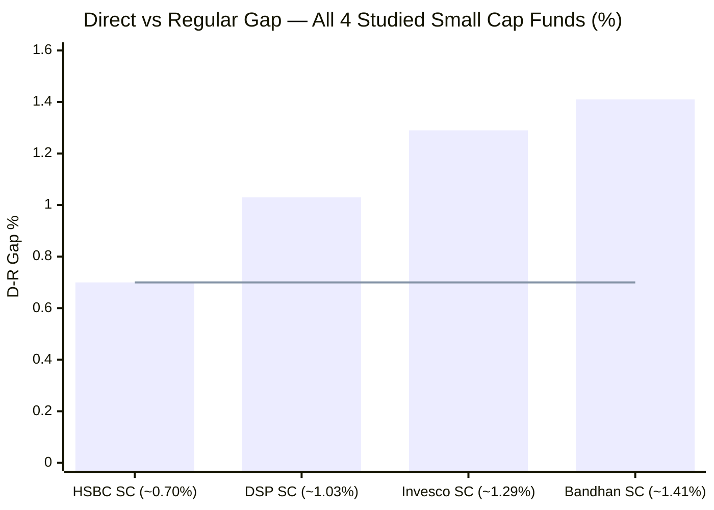
```mermaid
xychart-beta
    title "Direct vs Regular Gap — All 4 Studied Small Cap Funds (%)"
    x-axis ["HSBC SC (~0.70%)", "DSP SC (~1.03%)", "Invesco SC (~1.29%)", "Bandhan SC (~1.41%)"]
    y-axis "D-R Gap %" 0 --> 1.6
    bar [0.70, 1.03, 1.29, 1.41]
    line [0.70, 0.70, 0.70, 0.70]
```
> Line = HSBC's D-R gap — the narrowest of all 4 studied funds; a genuine positive for Direct plan investors

**HSBC's 0.70% D-R gap is the narrowest of all 4 studied funds** — and this has an important implication. An investor comparing Regular Plan costs across funds would see:

| Fund | Regular ER | 10Y Corpus (₹20K SIP) | vs HSBC Regular |
|------|-----------|----------------------|-----------------|
| **HSBC SC Regular** | **~1.43%** | **₹81.5L** | — |
| DSP SC Regular | ~1.67% | ~₹79.8L | +₹1.7L (DSP Regular is MORE expensive) |
| Invesco SC Regular | ~1.88% | ~₹78.0L | +₹3.5L (Invesco Regular is MORE expensive) |
| Bandhan SC Regular | ~1.75% | ~₹79.2L | +₹2.3L (Bandhan Regular is MORE expensive) |

This is a surprising inversion: **HSBC's Direct plan is the most expensive of studied funds (0.73%) but its Regular plan is the cheapest (~1.43%).** An investor using a regular distributor paradoxically pays less in HSBC than in DSP, Invesco, or Bandhan regular plans. This is structural — HSBC's distribution commission (0.70%) is simply lower than peers, whether by design or distribution network reality.

**ER savings at different SIP amounts (Direct vs Regular):**

| SIP Amount | 10Y Direct Corpus | 10Y Regular Corpus | Saved in Direct |
|-----------|------------------|--------------------|-----------------|
| ₹10,000/mo | ₹42.6L | ₹40.8L | **₹1.8L** |
| **₹20,000/mo** | **₹85.1L** | **₹81.5L** | **₹3.6L** |
| ₹30,000/mo | ₹127.7L | ₹122.3L | **₹5.4L** |
| ₹50,000/mo | ₹212.8L | ₹203.9L | **₹9.0L** |

**How to access Direct Plan:** HSBC AMC website (assetmanagement.hsbc.co.in), MF Central, Zerodha Coin, Kuvera, Groww Direct, INDmoney, Paytm Money — all zero-commission platforms offering direct access.

---

## Exit Load — Standard 12-Month Window With 10% Free Allowance

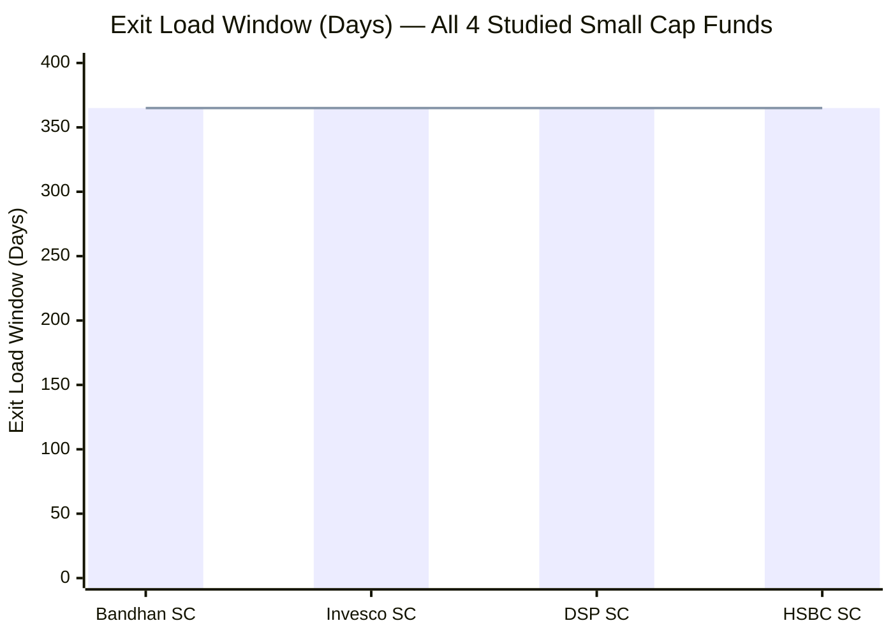
```mermaid
xychart-beta
    title "Exit Load Window (Days) — All 4 Studied Small Cap Funds"
    x-axis ["Bandhan SC", "Invesco SC", "DSP SC", "HSBC SC"]
    y-axis "Exit Load Window (Days)" 0 --> 400
    bar [365, 365, 365, 365]
    line [365, 365, 365, 365]
```
> All 4 studied small cap funds use the identical 1% / 365-day exit load structure — no differentiation on window

**HSBC's exit load: 1% if redeemed within 365 days; nil thereafter.** Additionally, **10% of units can be redeemed free of exit load** in any single financial year — a minor but real extra flexibility vs pure 1%/365d peers.

| Fund | Exit Load | Window | Free Allowance |
|------|-----------|--------|----------------|
| Bandhan Small Cap | 1% | 365 days | No |
| Invesco Small Cap | 1% | 365 days | No |
| DSP Small Cap | 1% | 365 days | No |
| **HSBC Small Cap** | **1%** | **365 days** | **Yes — 10% of units free per year** |

The 10% free redemption allowance is HSBC's marginal differentiator here. In most scenarios it has zero practical impact on a 10-year SIP investor — all instalments held 12+ months are exit-load-free regardless. But for a partial redemption scenario (e.g., withdrawing 10% for a major expense in Year 3 while keeping the rest invested), HSBC allows this without the 1% exit load on that portion.

**For a 10-year SIP investor:** Completely irrelevant in almost all scenarios. Every monthly SIP instalment accumulates for years before full redemption. Exit load is a non-factor.

---

## The AUM Story — ₹16,877 Cr and a Studied Absence of Gate-Keeping

**HSBC Small Cap's AUM story is the most uncomfortable in the studied cohort** — not because of what the AMC has done, but because of what it has consistently chosen not to do. Since inception (2014), HSBC Small Cap has **never restricted lumpsum inflows, never imposed per-investor SIP caps, and never temporarily closed to new investors** — despite scaling to ₹16,877 Cr across 12 years.

This stands in direct contrast to DSP Small Cap, which closed lumpsum inflows entirely for 3+ years (Feb 2017–Apr 2020) when AUM hit ~₹5,000 Cr — far below HSBC's current scale. HSBC has crossed multiple AUM thresholds that, at DSP, would have triggered gate-management actions. None occurred.

### The Non-Restriction Timeline

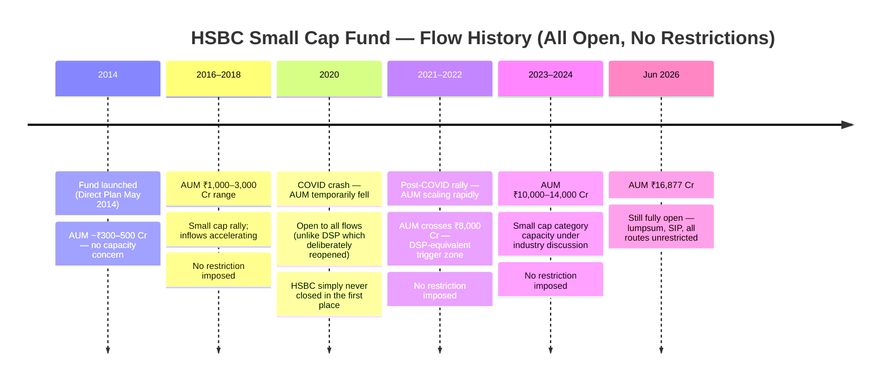
```mermaid
timeline
    title HSBC Small Cap Fund — Flow History (All Open, No Restrictions)
    2014 : Fund launched (Direct Plan May 2014)
         : AUM ~₹300–500 Cr — no capacity concern
    2016–2018 : AUM ₹1,000–3,000 Cr range
              : Small cap rally; inflows accelerating
              : No restriction imposed
    2020 : COVID crash — AUM temporarily fell
         : Open to all flows (unlike DSP which deliberately reopened)
         : HSBC simply never closed in the first place
    2021–2022 : Post-COVID rally — AUM scaling rapidly
              : AUM crosses ₹8,000 Cr — DSP-equivalent trigger zone
              : No restriction imposed
    2023–2024 : AUM ₹10,000–14,000 Cr
              : Small cap category capacity under industry discussion
              : No restriction imposed
    Jun 2026 : AUM ₹16,877 Cr
             : Still fully open — lumpsum, SIP, all routes unrestricted
```

| DSP Small Cap (For Contrast) | Action | HSBC Small Cap | Action |
|------------------------------|--------|----------------|--------|
| Oct 2014 — AUM ~₹1,500 Cr | ₹2L/investor/month cap | 2014–2026 | Open |
| Aug 2016 — AUM ~₹3,000 Cr | Reduced to ₹1L/investor cap | — | Open |
| Feb 2017 — AUM ~₹5,000 Cr | **Complete lumpsum closure** | — | Open |
| Sep 2018 — post IL&FS | Reopened for SIP/STP only | — | Open |
| Apr 2020 — COVID low | Fully reopened | — | Had never closed |

**What this non-restriction history communicates:**

1. **HSBC AMC has chosen fee revenue over investor protection at every capacity threshold.** Each ₹5,000 Cr of AUM added generates approximately ₹35–50 Cr in additional annual fee revenue. Not restricting flows maximises this revenue — at the cost of portfolio dilution (109 stocks, cash-minimised, category-PE construction).

2. **The portfolio DNA in Module 3 is the direct consequence of this choice.** The 109-stock construction, the near-zero 1.4% cash buffer, and the R² 95.96 against benchmark are not passive choices — they are adaptations forced by an ever-growing AUM with no gate. More capital arrives every month than can be meaningfully deployed in the small cap universe; the response is to spread it thinner.

3. **HSBC has never demonstrated the investor-first instinct that DSP demonstrated three separate times.** This is the most important qualitative finding of Module 4 for HSBC Small Cap. It is not merely a cost metric — it is a governance signal about how HSBC AMC prioritises competing interests.

---

## The Open-Door Contrast — HSBC vs DSP as Architectural Opposites

This section exists because the contrast between HSBC's open-door approach and DSP's gate-management history is the single most important cross-fund finding in Module 4 across all studied small cap funds.

```mermaid
quadrantChart
    title AUM Gate-Keeping vs Portfolio Outcomes (4 Studied SC Funds)
    x-axis "Gate-Keeping Discipline" --> "No Gate-Keeping"
    y-axis "Portfolio Concentration / Benchmark Deviation" --> "Benchmark-Hugging"
    quadrant-1 Best (Active Alpha)
    quadrant-2 Low Alpha despite gating
    quadrant-3 Benchmark exposure without discipline
    quadrant-4 Disciplined within constraints
    DSP SC: [0.15, 0.30]
    Invesco SC: [0.55, 0.50]
    Bandhan SC: [0.70, 0.60]
    HSBC SC: [0.90, 0.85]
```
> DSP's gate-keeping history (x-axis left) combined with concentrated portfolio (lower y) represents better active management discipline. HSBC's open-door (x-axis right) combined with benchmark-hugging behavior (upper y) places it in the bottom-right quadrant.

**The core analytical point:**

When an AMC restricts flows, it is making an explicit statement: *"Our strategy has capacity constraints that our current AUM is approaching. We will sacrifice fee revenue to prevent alpha dilution for existing investors."*

DSP made this statement 3 times. HSBC has never made it once.

The consequence is visible and documented:

| Metric | DSP Small Cap | HSBC Small Cap | Interpretation |
|--------|--------------|----------------|----------------|
| Stocks in portfolio | 81 | 109 | HSBC forced to spread thinner |
| Cash/TREPS buffer | 8.38% | ~1.4% | DSP holds cash; HSBC must deploy all inflows |
| R² vs benchmark | Lower (historical) | **95.96** | HSBC behaves like an index fund |
| Information ratio | Positive historical | **−0.61** | HSBC is destroying risk-adjusted value |
| Flow restrictions | **3 documented closures** | **None** | Structural difference |
| Module 3 score | 3.8/5 | 3.3/5 | Portfolio quality difference |

**The counterargument:** HSBC would likely argue that flow restrictions are unnecessary if portfolio construction is managed carefully. But the data refutes this — HSBC's portfolio management outcome (R² 95.96, −0.61 information ratio, 109 stocks) is precisely the benchmark-hugging behavior that gate-management is designed to prevent.

---

## The AUM Execution Arithmetic — Why ₹16,877 Cr Changes Everything

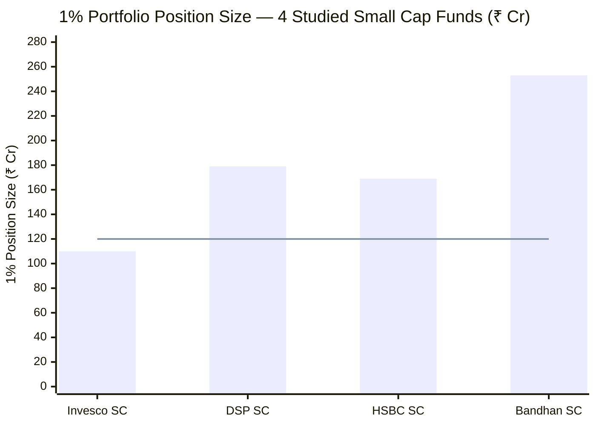
```mermaid
xychart-beta
    title "1% Portfolio Position Size — 4 Studied Small Cap Funds (₹ Cr)"
    x-axis ["Invesco SC", "DSP SC", "HSBC SC", "Bandhan SC"]
    y-axis "1% Position Size (₹ Cr)" 0 --> 280
    bar [110, 179, 169, 253]
    line [120, 120, 120, 120]
```
> Line = approximate ₹120 Cr threshold above which clean small-cap position building takes 10+ days | HSBC is well above this threshold

| Fund | AUM | 1% Position | % of ₹3,000 Cr SC free float | Clean Entry Time |
|------|-----|------------|------------------------------|-----------------|
| Invesco SC | ₹11,038 Cr | ₹110 Cr | ~9.2% | 5–8 days |
| **HSBC SC** | **₹16,877 Cr** | **₹169 Cr** | **~14.1%** | **10–14 days** |
| DSP SC | ₹17,906 Cr | ₹179 Cr | ~14.9% | 10–15 days |
| Bandhan SC | ₹25,346 Cr | ₹253 Cr | ~21.1% | 15–25 days |

**At HSBC's ₹16,877 Cr, a 1% position requires ₹169 Cr deployed into the small cap universe.** Building this cleanly takes 10–14 days of patient accumulation. During that window, price discovery works against the fund — buying pressure pushes prices up, making entry more expensive than the thesis price at the moment of decision.

**The entry problem in concrete terms for HSBC:**

| Parameter | HSBC SC | DSP SC |
|-----------|---------|--------|
| Target position (1%) | ₹169 Cr | ₹179 Cr |
| Safe daily buying rate | ₹1.5–3.0 Cr/day | ₹1.5–3.0 Cr/day |
| Days to build position | 57–113 days | 60–120 days |
| Estimated price drift from buying | 3–8% | 3–8% |
| Effective premium over thesis price | ₹5–13 Cr per position | ₹5–14 Cr per position |

**The critical difference vs DSP:** DSP runs 81 stocks at ₹179 Cr positions; HSBC runs **109 stocks** at ₹155 Cr average positions. HSBC has mitigated individual position market impact by spreading across more holdings — but this dilution is what produces R² 95.96 and the information ratio of −0.61. The solution to the AUM problem has destroyed the portfolio's active character.

### The Monthly Inflow Deployment Problem

With ₹16,877 Cr AUM, estimated monthly inflows of ₹150–200 Cr arrive continuously under open-door policy:

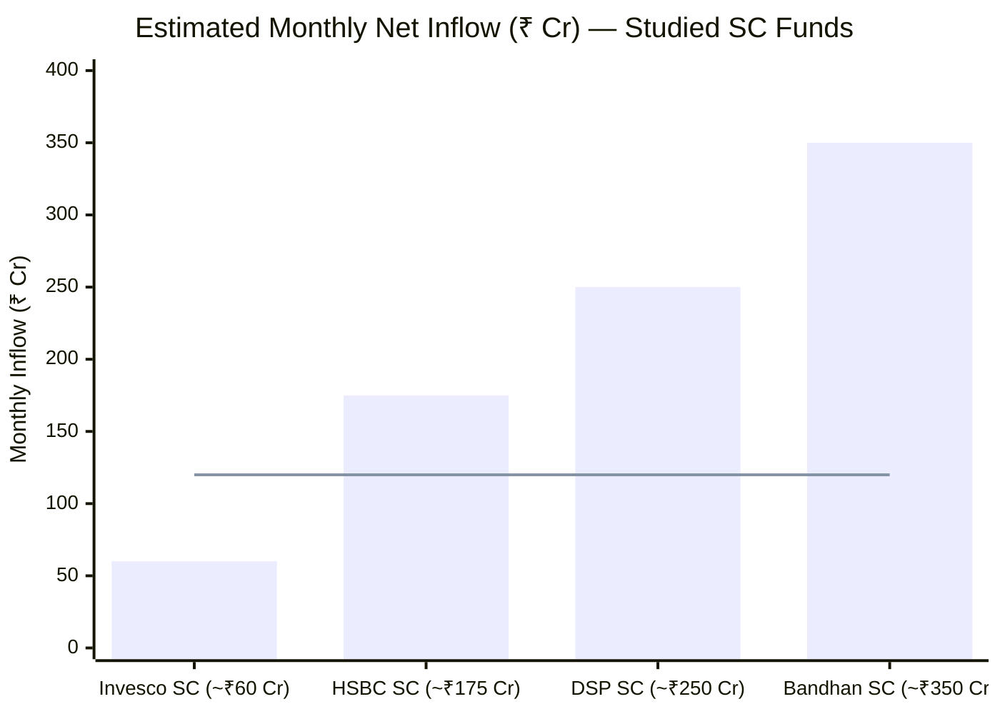
```mermaid
xychart-beta
    title "Estimated Monthly Net Inflow (₹ Cr) — Studied SC Funds"
    x-axis ["Invesco SC (~₹60 Cr)", "HSBC SC (~₹175 Cr)", "DSP SC (~₹250 Cr)", "Bandhan SC (~₹350 Cr)"]
    y-axis "Monthly Inflow (₹ Cr)" 0 --> 400
    bar [60, 175, 250, 350]
    line [120, 120, 120, 120]
```
> Line = approximate ₹120 Cr threshold above which deployment becomes operationally demanding

| Inflow Scenario | Monthly Amount | Deployment Challenge |
|----------------|---------------|---------------------|
| Conservative | ₹150 Cr/month | Must add to 10–15 existing positions; or open new positions |
| Moderate | ₹175 Cr/month | 1.0% of AUM — manageable but leaves little discretion in deployment timing |
| Aggressive | ₹200 Cr/month | Requires wider spreading across the 109-stock portfolio to absorb cleanly |

**Unlike DSP (which held 8.38% cash as a deployment buffer), HSBC holds only ~1.4% cash.** This means every rupee of monthly inflow must be deployed almost immediately — there is no patient deployment buffer. The fund is structurally a near-compelled buyer every month, regardless of market conditions. This is precisely the dynamic that drives the 109-stock dilution documented in Module 3.

---

## Portfolio Turnover — Mid-Tier Cost With Room for Concern

At 30.93% annual turnover (primary estimate), HSBC sits in the mid-range of small cap peers — patient by high-churn standards but materially higher than DSP's best-in-class 19–24%.

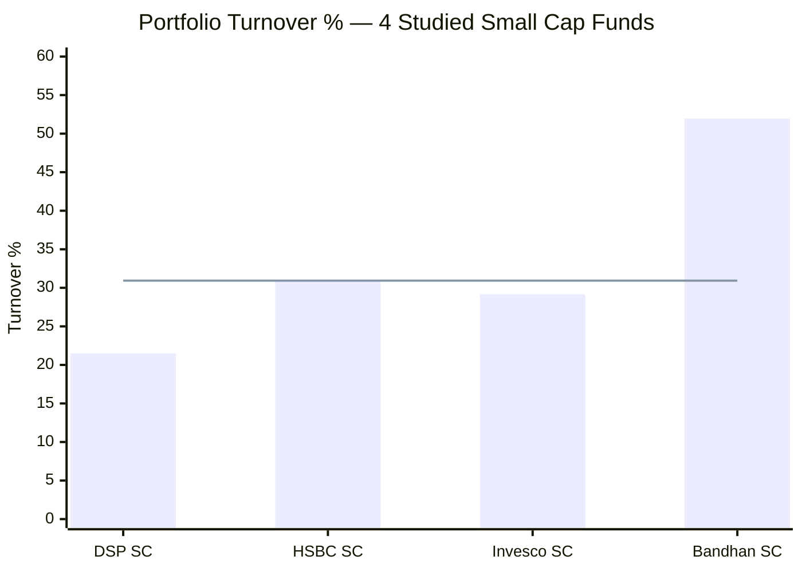
```mermaid
xychart-beta
    title "Portfolio Turnover % — 4 Studied Small Cap Funds"
    x-axis ["DSP SC", "HSBC SC", "Invesco SC", "Bandhan SC"]
    y-axis "Turnover %" 0 --> 60
    bar [21.5, 30.93, 29.17, 51.96]
    line [30.93, 30.93, 30.93, 30.93]
```
> Line = HSBC's turnover (30.93%) | DSP is meaningfully lower; Invesco is comparable; Bandhan is materially higher

| Fund | Turnover | True All-In (est.) | Avg Hold Period |
|------|---------|-------------------|----------------|
| DSP Small Cap | ~20% | ~0.77% | ~5 years |
| **HSBC Small Cap** | **~30.93%** | **~0.87%** | **~3.2 years** |
| Invesco Small Cap | ~29.17% | ~0.82% | ~3.4 years |
| Bandhan Small Cap | ~51.96% | ~0.48%* | ~1.9 years |

*Bandhan's low true all-in despite high turnover is primarily because its 0.34% stated ER is the absolute lowest and dominates the cost calculation.

**The market impact cost insight for HSBC:**

A typical HSBC position at ₹155 Cr value (average across 109 holdings). Building and exiting this position each incurs ~5% market impact = ₹7.75 Cr per trade = ₹15.5 Cr total round-trip cost.

| Holding Period | Total Round-Trip Cost | Annual Impact Cost |
|---------------|----------------------|-------------------|
| DSP (~5 years, 20% turnover) | ₹15.5 Cr | ₹3.1 Cr/year |
| **HSBC (~3.2 years, 31% turnover)** | **₹15.5 Cr** | **₹4.8 Cr/year** |
| Bandhan (~1.9 years, 52% turnover) | ₹15.5 Cr | ₹8.2 Cr/year |

Same position size. Same round-trip cost. **HSBC's annual effective market impact is ~55% higher than DSP purely from faster turnover.** This is the hidden cost that does not appear in the stated 0.73% ER.

---

## True All-In Cost — HSBC Is the Most Expensive of Studied Funds

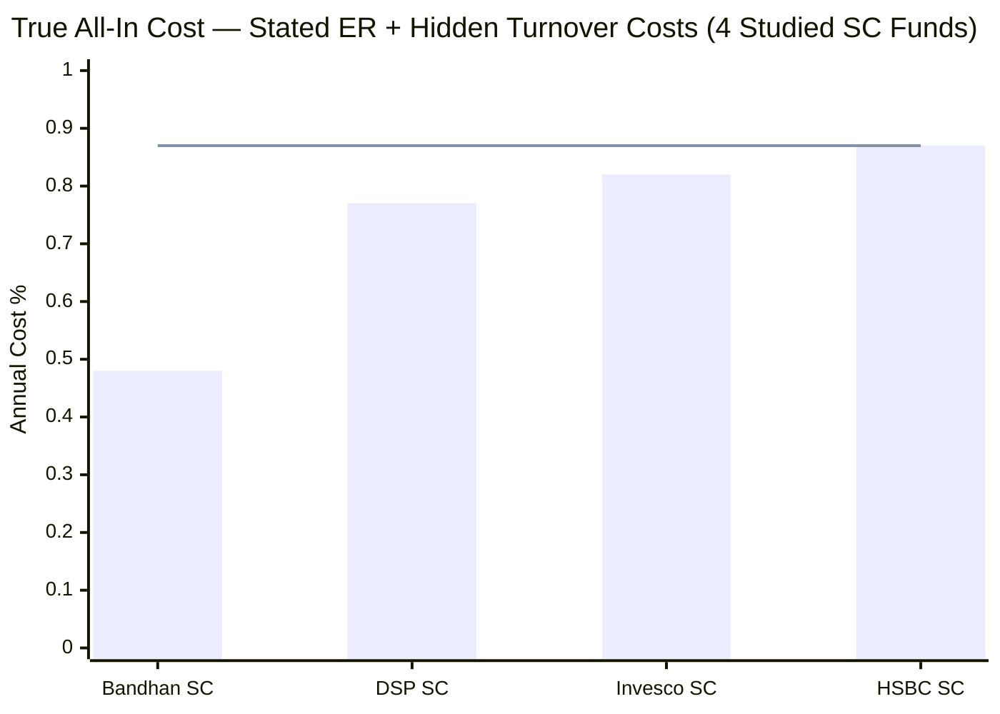
```mermaid
xychart-beta
    title "True All-In Cost — Stated ER + Hidden Turnover Costs (4 Studied SC Funds)"
    x-axis ["Bandhan SC", "DSP SC", "Invesco SC", "HSBC SC"]
    y-axis "Annual Cost %" 0 --> 1.0
    bar [0.48, 0.77, 0.82, 0.87]
    line [0.87, 0.87, 0.87, 0.87]
```
> Line = HSBC's estimated true all-in cost | HSBC is the most expensive of all 4 studied funds on this metric

| Fund | Stated Direct ER | Hidden Costs (est.) | True All-In | Rank (4 studied) |
|------|-----------------|--------------------|-----------|--------------------|
| Bandhan SC | 0.34% | ~0.14% | **~0.48%** | **1st (cheapest)** |
| DSP SC | 0.64% | ~0.13% | **~0.77%** | **2nd** |
| Invesco SC | 0.59% | ~0.23% | **~0.82%** | **3rd** |
| **HSBC SC** | **~0.73%** | **~0.14%** | **~0.87%** | **4th (most expensive)** |

**HSBC's ranking worsens across all cost metrics:**
- Stated ER rank: 4th (most expensive of 4 studied)
- True all-in rank: 4th (most expensive of 4 studied)
- D-R gap rank: 1st (narrowest gap — most favorable for regular plan investors)

Unlike DSP — which improved from 5th (stated ER) to 3rd (true all-in) thanks to its lowest-category turnover — HSBC receives no redemption from the turnover adjustment. Its 30.93% turnover is more than DSP's 19–24%, adding hidden cost on top of the highest stated ER. **There is no hidden cost advantage in HSBC's cost structure to rescue the headline figure.**

**The 10-year compounding impact of the true all-in differential:**

An investor comparing HSBC (0.87% true all-in) vs DSP (0.77% true all-in) on a ₹20K/month SIP:

| Metric | HSBC (~0.87% all-in) | DSP (~0.77% all-in) | HSBC Penalty |
|--------|---------------------|--------------------|-----------| 
| 10Y Net CAGR (excl. hidden costs) | ~17.13% | ~17.23% | −0.10% |
| 10Y Corpus (approx.) | ~₹84.6L | ~₹85.3L | ~−₹0.7L |

Over 10 years on ₹20K SIP, the true all-in cost difference between HSBC and DSP is approximately **₹0.7 lakh** — modest in isolation, significant when combined with HSBC's inferior portfolio quality and AUM management history documented in other modules.

---

## No Scale Discount — HSBC's Unexplained ER Premium

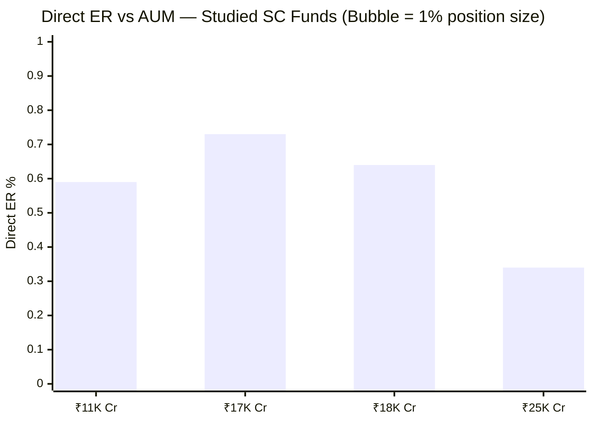
```mermaid
xychart-beta
    title "Direct ER vs AUM — Studied SC Funds (Bubble = 1% position size)"
    x-axis ["₹11K Cr", "₹17K Cr", "₹18K Cr", "₹25K Cr"]
    y-axis "Direct ER %" 0 --> 1.0
    bar [0.59, 0.73, 0.64, 0.34]
```
> Left to right: Invesco (₹11K Cr), HSBC (₹17K Cr), DSP (₹18K Cr), Bandhan (₹25K Cr) | HSBC charges the highest ER among the ₹15K–20K Cr AUM cohort

**The No Scale Discount problem:**

Conventional logic suggests larger AUMs should come with lower expense ratios — fixed costs (research, compliance, technology) are spread across a larger base, enabling AMCs to charge less per rupee. This principle has broadly held in Indian mutual funds: Nippon India Small Cap at ₹72,672 Cr charges 0.64%, the same as DSP at ₹17,906 Cr (arguably a poor comparison — DSP should have room to lower given its AUM). Bandhan at ₹25,346 Cr has passed the most scale benefit to investors at 0.34%.

**HSBC at ₹16,877 Cr charges ~0.73% — comparable AUM to DSP (₹17,906 Cr) but 14% more expensive per rupee on the stated ER.** This premium is not explained by:

- **Research depth:** HSBC's L&T-legacy team is competent but not demonstrably deeper than DSP's dedicated 8–12 analyst research infrastructure.
- **Alpha delivery:** HSBC's recent 3Y/5Y data shows underperformance vs benchmark (M2: information ratio −0.61). A premium ER for sub-benchmark returns is particularly hard to justify.
- **Flow management cost:** Ironically, HSBC's open-door policy saves the AMC money on investor communication and operational gate management — this cost saving is not passed to investors.
- **Track record premium:** DSP's since-inception record (20.4% CAGR under Sambre) is stronger than HSBC's (which had a stronger vintage under L&T team pre-2022 but has drifted since).

**The conclusion:** HSBC is charging a scale-neutral ER despite having AUM in a range where a discount should apply, while simultaneously delivering benchmark-adjacent returns. This is a value proposition gap — and it is what this section is named for.

---

## HSBC AMC — Global Backing With L&T Legacy Equity Team

HSBC Mutual Fund is a subsidiary of HSBC Group, one of the world's largest banking and financial services organisations. Its domestic equity infrastructure was materially strengthened in 2022 through the acquisition of L&T Investment Management.

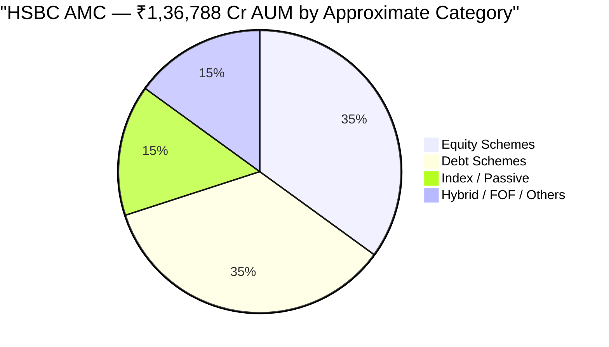
```mermaid
pie title "HSBC AMC — ₹1,36,788 Cr AUM by Approximate Category"
    "Equity Schemes" : 35
    "Debt Schemes" : 35
    "Index / Passive" : 15
    "Hybrid / FOF / Others" : 15
```

**HSBC AMC Key Facts (2026):**
- **Total AUM:** ₹1,36,788 Cr
- **Total Schemes:** 122 (equity, debt, hybrid, index, FOF — one of the broadest platforms in India)
- **Parent:** HSBC Group (global AUM ~$3 trillion; one of the world's largest investment managers)
- **Key Legacy:** L&T Investment Management acquisition (2022) — absorbed L&T's equity team, fund managers, and research infrastructure; L&T's small cap + mid cap expertise was among the strongest in the 2015–2020 vintage

**The L&T legacy matters — but differently from the BlackRock legacy at DSP.** BlackRock brought global quant and risk frameworks that permeated DSP's investment processes. L&T brought domestic equity research depth in capital goods, infrastructure, and industrial cycles — exactly the sectors HSBC Small Cap now overweights (27.1% Capital Goods + Power in M3). The L&T acquisition explains both:

- **HSBC's Industrial/Capex engine** in the portfolio (this team's conviction sector historically)
- **The portfolio's quality tilt** (L&T MF was known for quality-growth investing)

**The HSBC global backing advantage:**

| Advantage | Description |
|-----------|-------------|
| Balance sheet strength | HSBC Group's financial stability backstops the AMC against competitive/regulatory shocks |
| Global research access | HSBC Global Research provides macro insights, sector calls, and cross-border industry analysis unavailable to pure-domestic AMCs |
| Technology infrastructure | Global investment systems (order management, risk monitoring, compliance) at world-class standard |
| Institutional credibility | HSBC's banking relationships open doors to company management access and quality primary research |

**Revenue analysis:**

| Plan | Estimated AUM Split | ER | Annual Revenue |
|------|--------------------|----|---------------|
| Direct Plan (~60% of AUM) | ~₹10,126 Cr | 0.73% | ~₹73.9 Cr |
| Regular Plan (~40% of AUM) | ~₹6,751 Cr | 1.43% | ~₹96.5 Cr |
| **Total Fund Revenue** | **₹16,877 Cr** | **blended ~1.01%** | **~₹170 Cr** |

₹170 Cr in annual fund revenue is substantial — comfortably funds a dedicated analyst team, data subscriptions, and research infrastructure. The revenue comparison to DSP Small Cap (₹179 Cr) is remarkably close given similar AUM — but the HSBC fund is charged 14% more in ER despite generating slightly less absolute fee revenue, suggesting HSBC AMC's cost structure is less efficient per rupee of AUM than DSP's.

**The size comparison vs studied peers:**

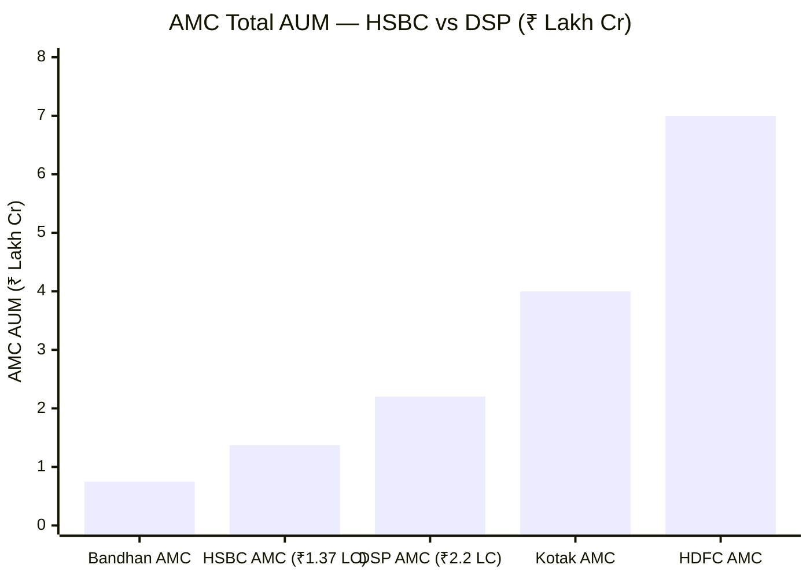
```mermaid
xychart-beta
    title "AMC Total AUM — HSBC vs DSP (₹ Lakh Cr)"
    x-axis ["Bandhan AMC", "HSBC AMC (₹1.37 LC)", "DSP AMC (₹2.2 LC)", "Kotak AMC", "HDFC AMC"]
    y-axis "AMC AUM (₹ Lakh Cr)" 0 --> 8
    bar [0.75, 1.37, 2.20, 4.00, 7.00]
```

At ₹1,36,788 Cr, HSBC AMC is smaller than DSP (₹2,20,000 Cr) but significantly larger than Bandhan's AMC platform. The 122-scheme breadth is impressive — though breadth across 122 schemes also implies management attention is spread across more mandates than DSP's focused 65-scheme platform.

---

## Venugopal Manghat's AUM Responsibility — The CIO-Generalist Model

Venugopal Manghat is CIO-Equity at HSBC Mutual Fund — meaning he is simultaneously the Head of Equities (institutional governance role) and a direct fund manager on HSBC Small Cap plus several other schemes.

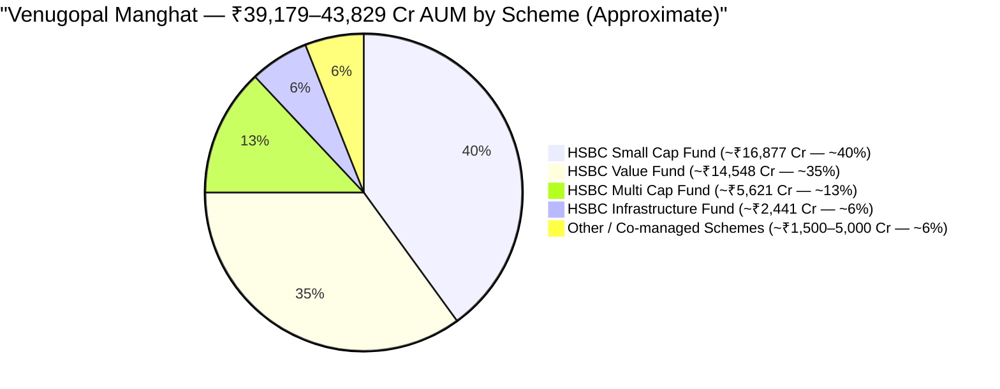
```mermaid
pie title "Venugopal Manghat — ₹39,179–43,829 Cr AUM by Scheme (Approximate)"
    "HSBC Small Cap Fund (~₹16,877 Cr — ~40%)" : 40
    "HSBC Value Fund (~₹14,548 Cr — ~35%)" : 35
    "HSBC Multi Cap Fund (~₹5,621 Cr — ~13%)" : 13
    "HSBC Infrastructure Fund (~₹2,441 Cr — ~6%)" : 6
    "Other / Co-managed Schemes (~₹1,500–5,000 Cr — ~6%)" : 6
```

| Metric | Manghat (HSBC) | Sambre (DSP) | Comparison |
|--------|---------------|--------------|-----------|
| Title | CIO-Equity (Head of Equities) | Head of Equities + Joint MD | Both have institutional-level titles |
| Schemes managed | 4–7 (depending on co-management) | 3 | Manghat manages more mandates |
| Total AUM | ~₹39,179–43,829 Cr | ~₹35,000–37,365 Cr | Similar total scale |
| Average AUM per scheme | ~₹8,000–10,000 Cr | ~₹12,000 Cr | DSP more concentrated per fund |
| Largest fund % of mandate | **HSBC SC = ~38–43%** | **DSP SC = ~48–51%** | DSP SC is Sambre's larger % share |
| Model type | **CIO-Generalist** | **Focused specialist** | Key structural difference |
| Style diversity | SC + Value + Multi Cap + Infra | SC + Mid Cap + Healthcare | HSBC is more style-diverse |

**The CIO-Generalist model — what it means:**

Manghat's mandate spans **fundamentally different investment styles**:
- HSBC Small Cap (high-risk, small cap mandate)
- HSBC Value Fund (value-oriented, across caps)
- HSBC Multi Cap (flexible, across caps)
- HSBC Infrastructure (thematic, capital-intensive sectors)

Running small cap alongside value and infrastructure mandates simultaneously is an inherently complex cognitive task. Each mandate requires different valuation frameworks, different risk tolerances, different liquidity management, and different benchmark construction. A manager running three small cap funds (like the old Nippon model) can apply one framework; a manager running four different styles must context-switch constantly.

**This is the same model as Invesco's Taher Badshah** — who managed Value + Small Cap + Contra + Multi Cap simultaneously before ceding some mandates. In HSBC's case, Manghat has held these mandates together while also performing the CIO oversight function (overseeing other managers' portfolios, risk review meetings, investment committee governance).

**The positive case for HSBC SC within Manghat's mandate:**

Despite managing a large and diverse portfolio, HSBC Small Cap is Manghat's **single largest fund (~40% of his mandate)**. This matters — a manager naturally devotes more monitoring attention, more analyst team deployment, and more personal cognitive focus to his largest fund. HSBC SC being the anchor of his mandate creates a structural incentive for prioritisation.

**The concern:**

A CIO managing multiple style-diverse mandates risks **style contamination** — where valuation frameworks from one mandate bleed into another. A value-fund framework (buy cheap assets vs NAV/book) conflicts with a small cap growth framework (buy quality compounder at reasonable valuation). If HSBC Small Cap's portfolio occasionally reflects value-like positioning (low-PE, deep cyclicals) influenced by the Value Fund mandate, that is a governance failure specific to the generalist model. Module 3 did not find clear evidence of this — the portfolio's sector composition and quality tilt are consistent with the L&T equity team's historical small cap framework. But the risk persists as a structural concern.

---

## 4-Fund (Studied) Cost & AUM Comparison Matrix

| Metric | **HSBC SC** | **DSP SC** | **Bandhan SC** | **Invesco SC** |
|--------|-------------|------------|----------------|----------------|
| Direct ER | **~0.73%** | 0.64% | **0.34%** | 0.59% |
| ER Rank (4 studied) | **4th (worst)** | 3rd | **1st (best)** | 2nd |
| Regular ER | ~1.43% | ~1.67% | ~1.75% | ~1.88% |
| Regular ER Rank | **1st (cheapest reg.)** | 2nd | 3rd | 4th (most expensive reg.) |
| D-R Gap | **~0.70%** | ~1.03% | ~1.41% | ~1.29% |
| D-R Gap Rank | **1st (narrowest)** | 2nd | 4th (widest) | 3rd |
| Exit Load | 1%/365d + 10% free | 1%/365d | 1%/365d | 1%/365d |
| AUM (₹ Cr) | 16,877 | 17,906 | 25,346 | 11,038 |
| AUM Rank (lower=better) | 2nd | 3rd | 4th | **1st (best)** |
| Turnover | **30.93%** | ~20% | ~52% | ~29% |
| Turnover Rank (lower=better) | 3rd | **1st (best)** | 4th | 2nd |
| True All-In (est.) | **~0.87%** | ~0.77% | ~0.48% | ~0.82% |
| True All-In Rank | **4th (worst)** | 3rd | **1st (best)** | 2nd |
| Min SIP | ₹500 | **₹100** | ₹1,000 | ₹1,000 |
| Min SIP Rank | 2nd | **1st (best)** | 3rd | 3rd |
| 1% Position | ₹169 Cr | ₹179 Cr | ₹253 Cr | ₹110 Cr |
| AMC Total AUM | ₹1,36,788 Cr | ₹2,20,000 Cr | — | — |
| Flow Restriction History | **None ever** | **3 closures (2014–2020)** | None | None |
| Flow Management Score | **Weakest** | **Best** | Poor | Poor |
| Fund Manager Schemes | 4–7 (CIO-Generalist) | 3 (Specialist) | — | 4–5 |
| M4 Score (this study) | **~3.2/5** | **3.7/5** | **~3.3/5** | **~3.1/5** |

**Key observations from the matrix:**

1. **HSBC's Direct ER rank (4th, worst) is not rescued by any other cost metric** — unlike DSP, which improved from 5th to 3rd on true all-in cost via its turnover advantage. HSBC ranks 4th on true all-in too.

2. **HSBC's only genuine cost advantage is the D-R gap (0.70% — narrowest)** — which primarily benefits Regular Plan investors, who face the cheapest regular ER of the studied group. For Direct Plan investors (the target audience for this research), this is irrelevant.

3. **Flow management is the most consequential differentiator** — DSP's gate-keeping history is the strongest investor-protection signal in the category. HSBC's open-door history is the weakest. Bandhan and Invesco have also never restricted flows, but HSBC's AUM makes the absence more consequential.

4. **Invesco at ₹11,038 Cr and 0.59% ER** still has better execution capacity (₹110 Cr per 1% position) than HSBC (₹169 Cr) — with a lower stated ER and comparable turnover. Invesco's AUM advantage over HSBC is the key differentiation at comparable investment philosophy.

---

## Points For / Points Against — Cost & AUM

### ✅ Points For HSBC Small Cap (Cost & AUM)

1. **Narrowest D-R gap (0.70%) of all 4 studied funds** — Regular plan investors in HSBC pay less (~1.43%) than Regular plan investors in DSP (~1.67%), Bandhan (~1.75%), or Invesco (~1.88%); if forced to use a regular-plan route, HSBC is the most cost-efficient option studied
2. **Standard exit load with 10% free redemption allowance** — minor but genuine flexibility over peers with pure 1%/365d structure
3. **HSBC Small Cap is Manghat's single largest fund (~40%)** — despite managing 4–7 schemes, the fund's dominance in his mandate creates a structural incentive for prioritisation and attention
4. **L&T Investment Management legacy team** — absorbed 2022; equity team with a strong vintage (2015–2020) in small and mid cap; institutional knowledge of the industrial and capital goods cycle (HSBC SC's structural overweight) is genuine
5. **HSBC Global Group backing** — parent balance sheet, global research access, world-class technology infrastructure; no AMC-failure or operational risk
6. **~₹170 Cr annual fund revenue** — well-funded research infrastructure; data, analysis, and primary research tools not constrained by revenue
7. **No punitive exit load** — 1%/365d is standard and non-penalising for long-term investors; 10% free allowance adds marginal liquidity
8. **~0.39% buffer below SEBI TER ceiling** — better cost restraint at regular plan level than DSP (~0.16% buffer); shows willingness to not fully exploit regulatory headroom

### ❌ Points Against HSBC Small Cap (Cost & AUM)

1. **0.73% Direct ER — most expensive of all 4 studied funds** — pays a premium vs DSP (0.64%), Invesco (0.59%), and especially Bandhan (0.34%); no alpha evidence to justify the premium in recent 3Y/5Y periods; ₹4.3L more than Bandhan over 10Y ₹20K SIP on identical gross returns
2. **True all-in cost ~0.87% — worst of 4 studied funds** — 30.93% turnover adds hidden market-impact friction on top of the highest stated ER; no cost metric where HSBC ranks 1st or 2nd for Direct plan investors
3. **Never restricted flows — the single most important governance negative** — despite scaling to ₹16,877 Cr, HSBC has never imposed any inflow cap, SIP restriction, or temporary closure; the portfolio outcome (109 stocks, near-zero cash, R² 95.96) is the direct consequence; DSP demonstrated at ₹5,000 Cr that restrictions are possible; HSBC has not demonstrated this willingness at ₹16,877 Cr
4. **No Scale Discount** — ₹16,877 Cr AUM is comparable to DSP (₹17,906 Cr) but HSBC charges 14% more on stated ER (0.73% vs 0.64%); scale is not being passed to investors as a cost reduction
5. **₹500 minimum SIP** — less accessible than DSP's ₹100; excludes investors who could invest ₹100–499/month; mild friction vs the category standard
6. **₹5,000 minimum lumpsum** — DSP's ₹100 minimum is vastly more accessible for small-ticket investors; HSBC's ₹5,000 threshold is a meaningful entry barrier for first-time or smaller investors
7. **CIO-Generalist mandate with style diversity** — Manghat managing Value + Multi Cap + Infrastructure + Small Cap simultaneously creates style-contamination risk and management attention dispersion; compared to Sambre's tighter 3-scheme focus
8. **No announced AUM cap or flow restriction trigger** — investors have no disclosed threshold beyond which HSBC will restrict inflows; must monitor independently with no AMC commitment on this dimension
9. **₹1,36,788 Cr AMC vs DSP's ₹2,20,000 Cr** — smaller domestic research platform than DSP despite comparable fund-level AUM; fewer dedicated analysts; HSBC compensates with global research access but local market intelligence depth may be lower

---

## Module 4 Scorecard

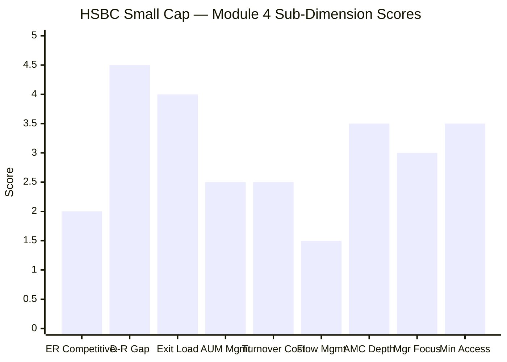
```mermaid
xychart-beta
    title "HSBC Small Cap — Module 4 Sub-Dimension Scores"
    x-axis ["ER Competitive.", "D-R Gap", "Exit Load", "AUM Mgmt", "Turnover Cost", "Flow Mgmt", "AMC Depth", "Mgr Focus", "Min Access"]
    y-axis "Score" 0 --> 5
    bar [2.0, 4.5, 4.0, 2.5, 2.5, 1.5, 3.5, 3.0, 3.5]
```

| Sub-Dimension | Score (1–5) | Reasoning |
|---------------|------------|-----------|
| Expense Ratio Competitiveness | **2.0/5** | Most expensive of 4 studied funds at ~0.73%; above category average; no alpha evidence to justify premium; ₹4.3L more than Bandhan over 10Y ₹20K SIP |
| Direct vs Regular Gap | **4.5/5** | 0.70% D-R gap is narrowest of all studied funds — genuine positive; regular plan investors in HSBC pay least of the group; creates partial offset for Direct investors who don't benefit |
| Exit Load Structure | **4.0/5** | Standard 1%/365d + 10% free allowance clause — marginally better than pure 1%/365d peers; emergency-accessible; non-penalising for 10Y investor |
| AUM Manageability | **2.5/5** | ₹16,877 Cr is firmly in the constraint zone; 10–14 day entry windows; unlike DSP, open-door policy means no gate management buffer; forces 109-stock dilution and near-zero cash |
| Turnover-Adjusted True Cost | **2.5/5** | 30.93% turnover — higher than DSP and Invesco; true all-in ~0.87% is the most expensive of 4 studied funds; no hidden cost advantage; turnover makes the stated ER worse, not better |
| Flow Management History | **1.5/5** | Never restricted flows in 12 years despite reaching ₹16,877 Cr — the weakest flow management track record of all studied funds; DSP's 3-closure history demonstrates what investor-first gate-keeping looks like; HSBC has never demonstrated this willingness |
| AMC Institutional Depth | **3.5/5** | HSBC global backing + L&T legacy team — genuine strengths; 122 schemes, ₹1.37 lakh Cr; smaller domestic platform than DSP but compensated by international research access; industrial/capex expertise of absorbed team is real |
| Fund Manager Focus | **3.0/5** | CIO-Generalist managing 4–7 style-diverse schemes; HSBC SC is his largest fund (~40%) — positive; but managing Value + Multi Cap + Infrastructure + Small Cap simultaneously creates cognitive and style-contamination risk; worse focus than DSP's 3-scheme specialist model |
| Minimum Accessibility | **3.5/5** | ₹500 min SIP and ₹5,000 min lumpsum — acceptable but not accessible; DSP's ₹100 minimum is significantly better; HSBC's thresholds exclude the smallest retail investors |
| **Module 4 Overall** | **3.2 / 5** | Narrowest D-R gap is a genuine positive for regular investors; exit load is clean; L&T/HSBC institutional pedigree is real. Penalised for most expensive direct ER, worst true all-in cost, and — most critically — the complete absence of any flow management discipline in 12 years of operation |

---

## Comparative Module 4 Scores

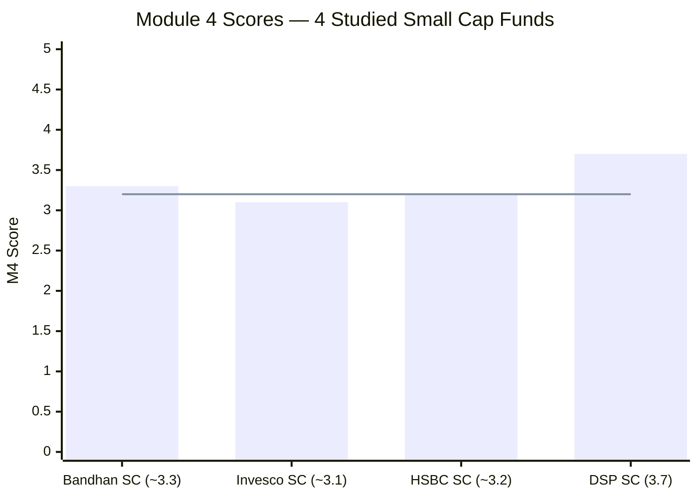
```mermaid
xychart-beta
    title "Module 4 Scores — 4 Studied Small Cap Funds"
    x-axis ["Bandhan SC (~3.3)", "Invesco SC (~3.1)", "HSBC SC (~3.2)", "DSP SC (3.7)"]
    y-axis "M4 Score" 0 --> 5
    bar [3.3, 3.1, 3.2, 3.7]
    line [3.2, 3.2, 3.2, 3.2]
```
> Line = HSBC's M4 score (3.2/5) | DSP has the clear cost/AUM quality advantage

| Fund | Module 4 Score | Key Cost/AUM Differentiator |
|------|---------------|-----------------------------|
| **DSP Small Cap** | **3.7/5** | Best flow management in category (3 closures); lowest turnover (19–24%); institutional pedigree; penalised only for mid-pack ER and AUM scale |
| **Bandhan Small Cap** | **~3.3/5** | Cheapest Direct ER (0.34%); cheapest true all-in (~0.48%); but open-door like HSBC (₹25,346 Cr with no restrictions); DSP comparison less damaging only because ER advantage is extreme |
| **HSBC Small Cap** | **~3.2/5** | Narrowest D-R gap and cheapest regular ER are genuine positives; offset by most expensive direct ER, worst true all-in, and zero flow management history over 12 years |
| **Invesco Small Cap** | **~3.1/5** | Good ER (0.59%); manageable AUM (₹11,038 Cr); also no flow restrictions; lower AMC depth; narrowly below HSBC on holistic M4 assessment |

HSBC scores just above Invesco primarily because its D-R gap advantage (narrowest) and AMC institutional depth (HSBC global + L&T legacy) are marginally stronger positives than Invesco's cleaner AUM position. The critical negative — zero flow management history — is shared with Invesco but matters more for HSBC given its substantially higher AUM at ₹16,877 Cr vs Invesco's ₹11,038 Cr.

**The DSP gap (3.7 vs 3.2) reflects a genuinely different investment character.** DSP's flow restriction history is not a detail — it is the most important long-term signal about how an AMC behaves when investor interests and fee revenue conflict. That signal, combined with DSP's best-in-category turnover, explains the 0.5-point gap between these two structurally similar-sized funds.

---

## One-Line Verdict

HSBC Small Cap carries the most expensive direct plan ER (~0.73%) and worst true all-in cost (~0.87%) among studied funds — while its most damning cost finding has nothing to do with numbers: having never restricted flows in 12 years of scaling to ₹16,877 Cr, the AMC has consistently chosen fee revenue over the portfolio discipline that competitors like DSP have demonstrated is both possible and investor-beneficial.

---

*Module 4 complete. Cost profile is the weakest of studied funds on direct-plan metrics; the narrowest D-R gap is the sole bright spot. Flow management history is the most important negative finding — a governance signal, not just a cost metric. Module 4 score: 3.2/5.*

*Next: [Module 5 — Fund Manager Quality](module5_manager.md)*
