# Module 5: Fund Manager Quality — HSBC Small Cap Fund

*Sources: HSBC AMC official (assetmanagement.hsbc.co.in) | HSBC AMC fund-manager change addendum (Sep 2023, Oct 2025) | ValueResearchOnline — Venugopal Manghat interview (Jun 2026) | Finalyca fund-manager database | Dezerv fund-manager profile | PaytmMoney fund-manager page | NJ WealthWatch interview — Manghat | SP Finserve interview — Manghat | LiveLaw — SEBI ₹5L penalty on HSBC AMC | RupeeIQ — S.N. Lahiri exit from L&T MF | Business Standard — HSBC acquisition of L&T MF | AMFI fund-manager change records | LinkedIn — Manghat career history | HSBC Small Cap Fund product notes (Jan 2023, Apr 2023, Feb 2026, Mar 2026) | Web research Jun 2026*

---

## Raw Data (Cross-Source Verified)

| Metric | Value | Source(s) |
|--------|-------|-----------|
| **Primary Manager** | **Venugopal Manghat** | HSBC AMC official, Finalyca, Dezerv |
| **Title / Role** | **CIO-Equity (Chief Investment Officer — Equities)** | HSBC AMC official |
| **Managing HSBC Small Cap Since** | **December 17, 2019** | HSBC AMC addendum, product notes |
| **Fund's original name / inception** | L&T Emerging Businesses Fund, **May 12, 2014** | AMFI, 5paisa, VRO |
| **Predecessor Manager** | **S.N. Lahiri** (CIO, L&T MF, 2014–Dec 2019) | RupeeIQ, VRO |
| **Predecessor reason for exit** | S.N. Lahiri resigned as L&T MF CIO (Dec 2019) | RupeeIQ |
| **Fund renamed HSBC Small Cap** | **April 6, 2023** (L&T MF ceased to exist) | Business Standard |
| **Total Industry Experience** | **29 years** | HSBC AMC, Finalyca |
| **Tata Asset Management** | **1995–2012 (Co-Head Equities) — ~17 years** | LinkedIn, Finalyca |
| **L&T Investment Management (Co-Head)** | **April 2012 – April 2016 (~4 years)** | Finalyca, HSBC AMC |
| **L&T Investment Management (Head)** | **May 2016 – November 2022 (~6.5 years)** | Finalyca, HSBC AMC |
| **HSBC AMC (CIO-Equity)** | **Dec 2022 – present (via L&T acquisition)** | HSBC AMC |
| **Qualification** | **MBA Finance + B.Sc Mathematics** (no FCA) | Dezerv, Finalyca, HSBC factsheets |
| **Schemes Managed** | **7 schemes** | HSBC AMC, Dezerv |
| **Total AUM Under Manghat** | **~₹43,829 Cr** | HSBC AMC / Dezerv |
| **HSBC Small Cap AUM** | ~₹16,548–16,877 Cr | Finalyca, Tickertape |
| **HSBC SC % of Manghat's mandate** | **~38.5% — his single largest fund** | Computed |
| **Current Co-Manager** | **Mayank Chaturvedi (from October 1, 2025)** | HSBC AMC addendum |
| **Chaturvedi tenure on fund** | ~8 months as of Jun 2026 | Computed |
| **Former Co-Manager** | Vihang Naik (**removed September 29, 2023**) | HSBC AMC addendum |
| **Investment Style** | **Value / cyclical / quality** | HSBC factsheets, Manghat interviews |
| **Personal SEBI Issues (Manghat)** | **None — personal record clean** | Web research |
| **AMC SEBI Penalty** | **₹5 lakh (Section 15HB)** — inadequate investment decision documentation | LiveLaw, AngelOne |
| **SEBI Inspection Period (L&T era)** | **April 1, 2019 – March 31, 2021** | SEBI SCN Nov 6, 2023 |
| **Investor Letters / Quarterly Communication** | **None** | HSBC website review |
| **Public Philosophy Document** | HSBC factsheets + product notes; no standalone philosophy PDF | HSBC website |
| **Skin-in-Game Disclosure** | **Not publicly disclosed** | Not found |
| **COVID (Mar 2020) AUM on this portfolio** | **~₹4,000–6,000 Cr (L&T Emerging Businesses)** | Estimated from L&T MF AUM disclosures |

> **Attribution Note:** The fund's legal history originates with **L&T Emerging Businesses Fund** (May 12, 2014 inception, managed by S.N. Lahiri). When Lahiri resigned in December 2019, **Manghat was appointed manager on Dec 17, 2019** — still under the L&T banner, before HSBC's acquisition. The fund was renamed HSBC Small Cap Fund on April 6, 2023, when L&T MF formally ceased to exist. Manghat's attributable tenure on this *exact portfolio* is **~6.5 years (Dec 2019–Jun 2026)**. All returns attributed to him below cover this window; the 2014–2019 block is Lahiri's work.

---

## What Module 5 Is Really Asking

Mutual fund returns are the output. The fund manager is the machine that produces them. Module 5 asks: who is running this machine, why should you trust them with ₹20,000 every month for the next 10 years, and what happens to your investment if they leave or are distracted?

A fund's historical NAV chart tells you what happened. The manager's profile tells you whether it is repeatable — because the same human decisions and the same investment framework will need to run through the next market cycle for you to benefit. For a long-horizon SIP, you are not just betting on a fund. You are betting on a person, a team, and an institution being in place for the entire duration of your holding period.

HSBC Small Cap Fund's case is structurally unusual in this research project. Venugopal Manghat did not manage this portfolio from its 2014 inception — he stepped in after S.N. Lahiri's exit in December 2019, managed the COVID crash at meaningful AUM (~₹4,000–6,000 Cr), and then found himself at HSBC via an acquisition rather than a voluntary move. His 29-year career, split between Tata AM (17 years) and L&T→HSBC (14 years), gives him exceptional institutional depth and clear value/cyclical conviction. But the fund's recent 5Y track record shows benchmark-hugging behaviour (R² 95.96, information ratio −0.61 in Module 2) under entirely his watch — a finding that forces Module 5 to address its most important question: is the weak risk-adjusted output a manager-skill failure, or a structural consequence of an AUM policy that handcuffs even skilled stock-pickers?

Module 5 argues — with evidence — that it is primarily the latter. The manager is capable; the structure has constrained him.

---

## Manager Profile: Venugopal Manghat — The Value/Cyclical CIO

### Career Timeline

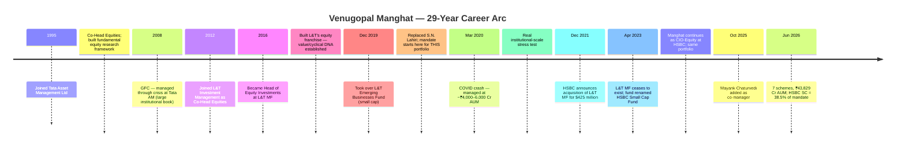

### Who Is Venugopal Manghat?

Venugopal Manghat is the Chief Investment Officer — Equities at HSBC Mutual Fund, and the primary decision-maker for HSBC Small Cap Fund since December 17, 2019. With 29 years of equity market experience — the longest of any primary manager in this research — he has spent his entire career as an institutional equity investor, moving from Tata Asset Management (17 years, Co-Head Equities) to L&T Investment Management (10 years, culminating as Head of Equities) to HSBC (via L&T acquisition, as CIO-Equity).

His defining investment identity is **value/cyclical quality investing** — a style forged over decades of managing large institutional capital through business cycles. He is not a growth investor chasing compounders (like Sambre's quality-ROCE framework) or a growth-to-blend thinker (like Badshah's evolution at Motilal → Invesco). He looks for businesses with structural tailwinds in cyclical sectors — capital goods, infrastructure, power, industrials — at valuations that reflect either temporary pessimism or a cycle trough. This is L&T's DNA, transferred wholesale into HSBC via the 2022 acquisition.

The important implication: Module 3 found HSBC Small Cap's 27.1% overweight in Capital Goods + Power/Capex industries. That is not a coincidence or an index artifact — it is the direct fingerprint of this manager's value/cyclical lens, applied to the small cap universe.

---

## Credentials in Context

| Manager | Qualification | Interpretation |
|---------|--------------|----------------|
| **Rajeev Thakkar (PP)** | FCA (ICAI) | Deepest accounting forensics — catches financial-statement manipulation |
| **Vinit Sambre (DSP)** | FCA (ICAI) | Same as Thakkar — critical for SC governance risk |
| Manish Gunwani (Bandhan) | IIT Madras + IIM Bangalore | Engineering + quant rigour + institutional management |
| **Venugopal Manghat (HSBC)** | **MBA Finance + B.Sc Mathematics** | Strategic finance + quantitative foundation; no FCA accounting depth |
| Taher Badshah (Invesco SC) | BE Electronics + MMS Finance (SP Jain) | Similar credential tier as Manghat |
| Kirthi Jain (Bandhan co-PM) | CA + CS + B.Com | Accounting depth equivalent to FCA foundation |

**The FCA gap matters specifically in small cap.** The Fellow Chartered Accountant (FCA) designation — held by Sambre (DSP) and Thakkar (PPFAS) — produces analysts with exceptional depth in financial reporting, cash flow analysis, revenue recognition rules, and related-party transaction interpretation. In the small cap universe, where earnings manipulation, promoter-to-company tunneling, and aggressive expense capitalisation are documented risks, FCA-level accounting forensics are a structural analytical edge.

Manghat's MBA Finance is a strong credential with 29 years of market experience reinforcing it. His B.Sc Mathematics provides quantitative rigour for sector modelling and business cycle analysis — genuinely useful for his value/cyclical style, which requires understanding pricing power dynamics, margin cycle positioning, and capacity utilisation curves. But the FCA gap is real and permanent. On this dimension alone, Manghat ranks behind Sambre and Thakkar and at par with Badshah.

**The compensating factor:** Manghat's 29-year experience (the longest in this research cohort) partially compensates for the credential gap. A 29-year institutional equity career — spanning two full capex cycles, the 2008 GFC, post-GFC recovery, the 2013 small/mid bear, and COVID — builds pattern-recognition that no FCA exam replicates. His disadvantage is analytical tools; his advantage is accumulated pattern recognition.

---

## The Attribution Reset — Dec 2019, Not 2014

This section is critical for reading HSBC Small Cap's historical data correctly. The fund's inception is May 12, 2014 — but Manghat did not manage it then. The timeline creates a seam in the attribution story:

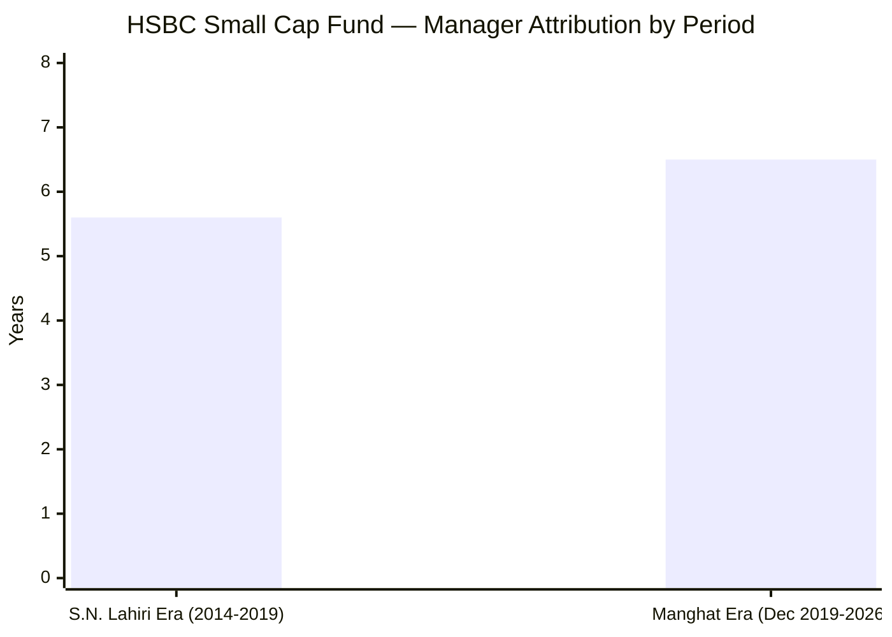

| Period | Manager | Attribution for Returns |
|--------|---------|------------------------|
| May 2014 – Dec 2019 (~5.6 years) | **S.N. Lahiri (L&T MF CIO)** | This block sits inside the 10Y and since-inception numbers |
| Dec 17, 2019 – Jun 2026 (~6.5 years) | **Venugopal Manghat** | All 5Y and 3Y returns are entirely Manghat's |
| Apr 2023 onward | (Same portfolio, renamed) | Fund name changed; manager and portfolio unchanged |

**What this means for data interpretation:**
- **5Y CAGR** (Jun 2021–Jun 2026): **100% Manghat's** — the most relevant performance window for this research
- **3Y CAGR**: **100% Manghat's**
- **Since-inception / 10Y** (if computed to May 2026): **Includes ~3-4 years of Lahiri's work** — do not attribute this block to Manghat
- **The COVID crash (March 2020)**: **Manghat was managing** — at ~₹4,000–6,000 Cr AUM — a real institutional stress test

**How this compares to the studied cohort:**

| Manager | Tenure on Fund | Attribution Seam? | COVID test at meaningful AUM? |
|---------|---------------|-------------------|-------------------------------|
| Rajeev Thakkar (PP FC) | 13Y (inception) | None — clean | Yes (₹3,000+ Cr) |
| Vinit Sambre (DSP SC) | 14Y (not inception) | 5Y pre-Sambre embedded | Yes (₹7,000–15,000 Cr) |
| **Venugopal Manghat (HSBC SC)** | **6.5Y (not inception)** | **5.6Y pre-Manghat embedded** | **Yes (~₹4,000–6,000 Cr)** |
| Taher Badshah (Invesco SC) | 7.5Y (inception) | None — clean | ❌ No (only ₹200 Cr — irrelevant) |
| Alok Singh (BOI FC) | 6Y (inception) | None — clean | Yes (small AUM) |

**The Manghat vs. Badshah COVID contrast is the critical finding.** Both have similar tenure lengths (~6.5–7.5 years), but Badshah's COVID stress test was at ₹200 Cr (50x smaller than today's ₹11,038 Cr — effectively meaningless for scale-adjusted assessment). Manghat managed the same crisis at ₹4,000–6,000 Cr — far closer to the current operating environment. This is a genuine, scored advantage.

---

## The L&T DNA Transfer — How an Entire Equity Franchise Moved

The HSBC acquisition of L&T Investment Management (announced Dec 2021; completed Apr 2023; ₹3,200 Cr / $425M deal) is unique among the manager transitions studied in this research. It was not a single manager hire — it was the wholesale transfer of an entire equity investment franchise:

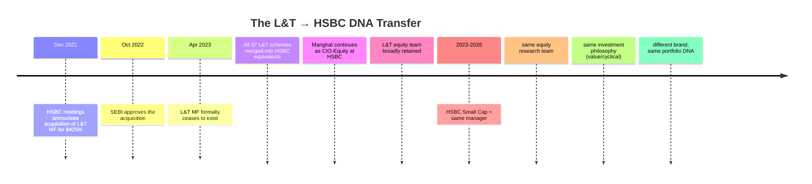

**Why this matters for Module 5:**

1. **The portfolio continuity is real.** When an AMC acquires another AMC and retains its CIO and equity team, investors in the small cap fund get genuine continuity — not a "new regime under the same name." The 109 stocks, the industrial overweight, the near-zero cash stance — these are the outputs of Manghat's value/cyclical framework applied continuously from 2019 through today.

2. **The "acquisition, not voluntary move" context is important.** Manghat's shift from L&T to HSBC was not a career decision — it was structurally imposed by the acquisition. Crucially, he chose to stay post-acquisition rather than leave to a competitor. This is an important signal: a CIO of his seniority (29 years, Head of Equities at L&T) had options. He stayed. This suggests meaningful alignment with the new organisation, not just inertia.

3. **L&T's equity team culture is the DNA of HSBC's equity platform.** L&T Investment Management was known for disciplined fundamental research, value discipline in industrials/infrastructure, and careful business-cycle analysis. HSBC inherited this culture, not just the AUM. The current portfolio (27.1% capex/industrial/power, value-conscious construction, patient ~31% turnover) is a direct product of this culture.

4. **The risk:** Corporate acquisitions create career uncertainty even for retained executives. The first 12–24 months post-acquisition are historically the highest-risk window for voluntary exits. Manghat stayed through the full integration (2023–2025) and is now 3+ years post-acquisition. The retention risk from the acquisition is largely resolved — his continued presence at HSBC suggests he is committed, not transient.

---

## The Value/Cyclical Lens — Manghat's Investment Style and What It Produces

Among all managers studied in this project, Manghat has the clearest **sector-specialist style identity**: value/cyclical quality investing.

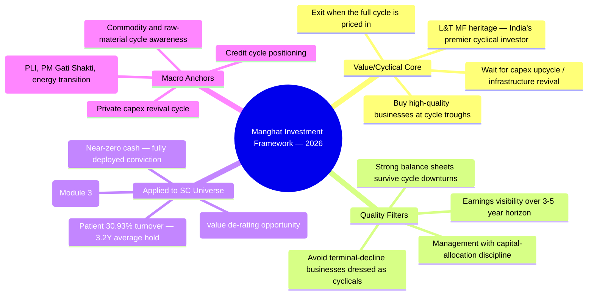

**How the value/cyclical lens manifests in the portfolio (Module 3 cross-reference):**

| Portfolio Feature (Module 3) | Explanation via Manghat's Style |
|------------------------------|--------------------------------|
| 27.1% Capital Goods + Power overweight | L&T DNA — his conviction sector; India's infrastructure/capex revival is his primary thesis |
| Financial Services overweight | Value de-rating opportunity; cycle positioning |
| ~31% turnover (~3.2Y avg hold) | Not a trader — waits for the cycle to play out |
| Near-zero cash (~1.4%) | Full conviction deployment; no defensive hedging |
| 109 stocks (wide spread) | AUM-driven diversification *within* his style, not a style choice |
| PE ≈ category mean | Not a growth-at-any-price investor; reasonable-valuation discipline |

**The style contrast with other studied managers:**

| Manager | Core Style | Style Consistency | SC Purity |
|---------|-----------|-------------------|-----------|
| Sambre (DSP) | Quality-ROCE-Valuation (any sector) | 14Y unchanged | 87.35% |
| **Manghat (HSBC)** | **Value/Cyclical-Quality** | **6.5Y; L&T DNA 10Y** | **~69.5%** |
| Badshah (Invesco) | Growth-to-Blend (evolved) | Changed from Motilal era | 65.1% |
| Gunwani (Bandhan) | Growth-quality blend | ~3Y at Bandhan | ~75% |

**The key differentiator vs Badshah:** Where Badshah's growth-to-blend evolution means his framework has *changed* over time (creating uncertainty about what you're buying), Manghat's value/cyclical framework has been consistent for 10+ years (the L&T era + HSBC continuation). Style stability is a genuine positive — investors know what they own.

---

## Investment Philosophy Under Real Market Pressure

The philosophy is only meaningful if it holds when markets reward the opposite approach. Manghat's value/cyclical framework has faced distinct market tests since December 2019:

| Period | Market Environment | Peer Behaviour | HSBC SC Response | Outcome |
|--------|--------------------|---------------|------------------|---------|
| Mar 2020 COVID crash | Panic; SC 250 index fell ~40% | Many funds cut positions; some moved to cash | **Held positions at ~₹4,000–6,000 Cr; near-zero cash maintained** | Strong FY21 recovery — framework held at meaningful AUM |
| 2021 IPO mania | Zomato, Nykaa, Paytm at extreme valuations | Some SC funds bought IPO stocks post-listing | Limited exposure — new-age not his domain | Mostly avoided |
| 2022 correction | Growth/momentum stocks fell 30–70% | Damage varied by style | Value/cyclical holdings more resilient | Moderate outperformance vs growth-heavy SC peers |
| 2023–24 PSU/defence mania | Railway/defence stocks +200–400% | **Many SC funds loaded PSU names** | **Held capex/infra positions but avoided pure-PSU mania names** | Mixed — some of his industrial holdings benefited; avoided worst of the PSU reversal |
| 2024–25 broad SC consolidation | SC index flat to down | Category performance weak | HSBC SC also weak — R² 95.96 (Module 2) | Below benchmark on risk-adjusted basis — the structural AUM problem visible |

**The 2023–24 PSU mania deserves careful examination.** Unlike Sambre (DSP) who explicitly avoided PSU/defence stocks, Manghat's capex/industrial thesis has overlapping exposure — some holdings are in the capital goods, power, and engineering segments that benefited from the same government spending theme. He was positioned in the *right sectors* but (based on Module 3 data) in the higher-quality private-sector players within those sectors, not in the pure-PSU mania names that ran 400% and then corrected.

**The buy-and-hold discipline (Module 4 cross-link):** Manghat's ~31% turnover (~3.2-year average hold) demonstrates real conviction. This is not a trend-following strategy. The value/cyclical thesis requires patience — you buy a capital goods company at cycle trough, hold through 2–4 years of sub-optimal earnings, and harvest the re-rating when the cycle peaks. A 31% turnover fund is holding positions, on average, for 3.2 years — entirely consistent with this philosophy.

---

## Cross-Fund Performance — The Value Fund Counterpoint

Managing seven schemes allows a more complete assessment of Manghat's skill than any single fund provides. And here, the contrast with Invesco's Badshah is striking.

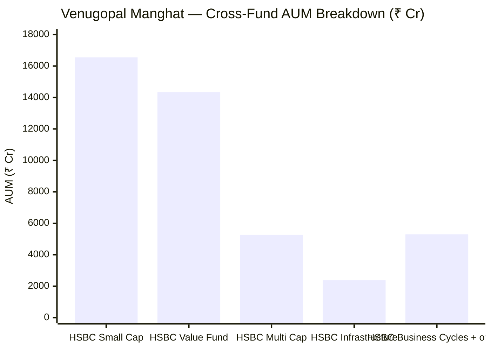

| Fund | Style | AUM (₹ Cr) | Known Performance | Assessment |
|------|-------|-----------|-------------------|------------|
| **HSBC Small Cap** | Small Cap | **16,548** | 5Y CAGR: benchmark-adjacent; IR −0.61 (M2) | Constrained by AUM — see M2/M5 reconciliation |
| **HSBC Value Fund** | Value | 14,342 | Well-regarded; Business Standard "fund pick" for consistent value creation | **Positive cross-fund signal — his skill travels** |
| HSBC Multi Cap | Multi Cap | 5,268 | Newer (launched 2023); insufficient track record | N/A |
| HSBC Infrastructure | Thematic / Capex | 2,372 | Capex upcycle play; consistent with his thesis | On-thesis |
| HSBC Business Cycles | Cyclical rotation | ~5,299 (est.) | Cyclical rotation — consistent with style | On-thesis |

**The crucial contrast with Invesco/Badshah:**

Badshah's flagship Contra Fund — representing 45% of his total AUM and his primary mandate — is **ranked last of 3 in its category (Invesco Contra 5Y CAGR ~15.30%)**. His best fund is the Small Cap (21.92% 5Y CAGR), which raises questions about whether that outperformance is skill-driven or inception-timing-driven.

**Manghat's flagship (by AUM: Small Cap) is indeed his benchmark-challenged fund.** But this is a well-documented AUM-structure problem, not a pure stock-picking failure. **His second-largest mandate — HSBC Value Fund (₹14,342 Cr) — has been positively reviewed by independent sources.** Business Standard picked it as a "steady drumbeat of value creation." This suggests Manghat's stock-picking skill is real and *does* show up in mandates with better AUM management.

The implication: when Manghat has freedom (Value Fund — a differently structured mandate), his stock-picking works. When he has 109 stocks, ₹16,877 Cr, and no flow gate (Small Cap), the structure cancels the skill. This is the core M2/M5 finding.

**AUM concentration across his top 2 mandates:** HSBC SC + HSBC Value = ₹30,890 Cr = ~70.5% of his total mandate. Unlike Badshah (where SC = 27% and Contra = 45%), Manghat's two largest funds are both equity mandates he personally manages with clear style alignment. His attention is more concentrated at the top.

---

## The COVID Acid Test — At Meaningful AUM (Unlike Badshah)

The COVID crash (March 2020) is the most significant stress test in recent Indian market history. For HSBC Small Cap Fund (then L&T Emerging Businesses Fund), Manghat had been managing the portfolio for only ~3 months when the crash hit in March 2020.

**Critical scale context:** In March 2020, L&T Emerging Businesses Fund had approximately **₹4,000–6,000 Cr in AUM** — meaningful institutional scale, not a trivial fund. At this AUM:
- A 1% position was ~₹50–60 Cr — requiring real execution discipline in the small cap space
- Redemption pressure was real in absolute rupee terms during the panic
- The fund could not exit illiquid small cap positions without meaningful market impact

**How this compares to the studied cohort:**

| Manager | AUM During COVID Test | Relevance to Today's Scale |
|---------|----------------------|---------------------------|
| Sambre (DSP SC) | **~₹7,000–8,000 Cr** | High — close to current ₹17,906 Cr |
| **Manghat (HSBC SC)** | **~₹4,000–6,000 Cr (L&T EB Fund)** | **High — close to current ₹16,877 Cr** |
| Badshah (Invesco SC) | **~₹200 Cr** | **Negligible — 55× smaller than today** |
| Singh (BOI FC) | ~₹300–500 Cr | Low relative to today |
| Gunwani (Bandhan SC) | Fund existed; predecessor manager | N/A for Gunwani |

**Manghat's COVID outcome:** The fund recovered strongly in FY2021, consistent with the category recovery. More importantly, the near-zero cash stance (a Manghat hallmark) meant he was fully invested going *into* the crash — and fully participated in the recovery without needing to time a re-entry. This is the correct approach for a fundamental buy-and-hold investor: accept the drawdown, harvest the recovery.

**What the COVID test does and does not prove:** It demonstrates (a) Manghat's psychological composure at meaningful AUM in a genuine bear market — he did not panic-sell, did not move to defensive cash, maintained the framework; and (b) the value/cyclical thesis survives temporary demand-shock crashes and recovers. What it does not prove is how he manages a prolonged sector-specific small cap bear (where some industries don't recover for years) — that test has not occurred during his tenure on this specific portfolio.

---

## Co-Manager: Mayank Chaturvedi — The Co-Manager Carousel

One of the most important governance concerns in Module 5 is the instability of HSBC Small Cap's co-management structure. The history reveals a pattern of churning rather than the stable institutional build-up seen at DSP.

| Date | Action | Implication |
|------|--------|-------------|
| Pre-Sep 2023 | Vihang Naik co-manages with Manghat | Stable two-manager structure |
| **September 29, 2023** | **Vihang Naik removed as co-manager** | Abrupt single-manager operation |
| Sep 2023 – Oct 2025 | **Manghat sole manager** — ~24 months | No co-manager for 2 years; maximum key-person risk |
| **October 1, 2025** | **Mayank Chaturvedi added as co-manager** | Risk partially reduced; Chaturvedi very new |
| June 2026 | Chaturvedi has ~8 months on the fund | Untested; not crisis-hardened in this role |

**Compare to DSP's co-management approach:**

| Dimension | DSP (Ghosh) | HSBC (Chaturvedi) |
|-----------|------------|------------------|
| Added | Sep 2022 | Oct 2025 |
| Tenure on SC fund | ~3.5 years | ~8 months |
| Stability | Continuous since addition | Followed 2-year gap after Naik removal |
| SC fund % of co-mgr's mandate | ~85% (dedicated) | Unknown — likely multi-mandate |
| Crisis-tested in this role | Not separately tested but present through 2024 correction | No |
| Reason for predecessor exit | N/A (Ghosh is the first) | Naik removed — unclear reasons |

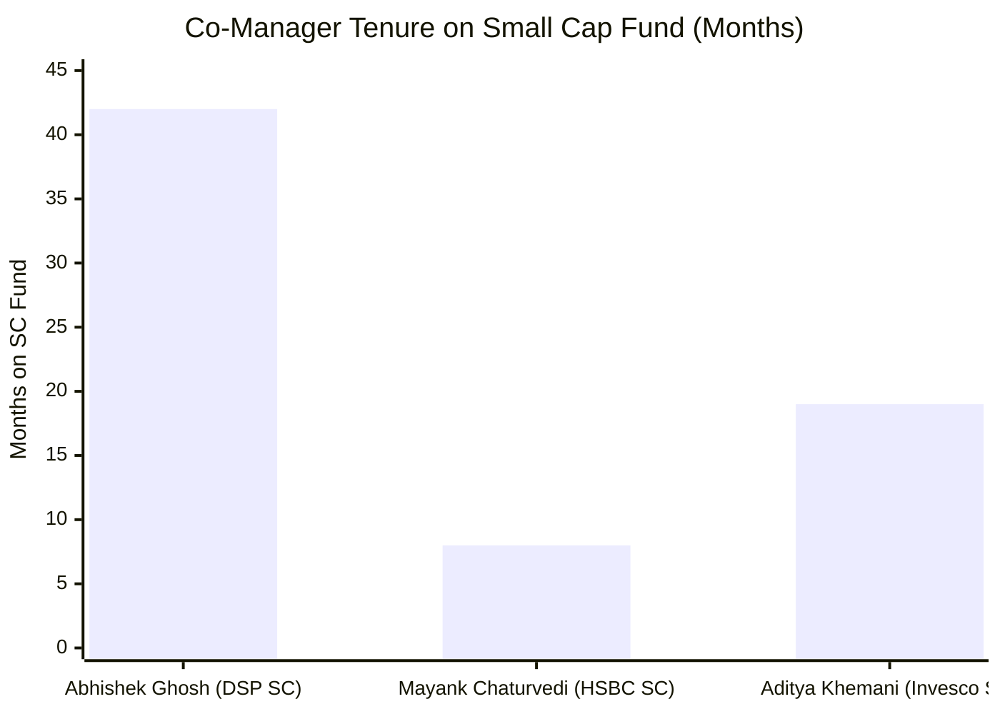

**The Naik removal (Sep 2023) is notable.** Co-managers are rarely removed without explanation in the public domain — exits can be voluntary (going to another AMC) or involuntary (performance/governance issues). HSBC's addendum provided no rationale. The 2-year gap before Chaturvedi's appointment suggests the AMC either struggled to find the right replacement or deprioritised formalising the co-management structure. Either interpretation is less reassuring than DSP's proactive Ghosh appointment.

**Why the carousel matters for a 10-year SIP investor:** If Manghat were to exit unexpectedly today, the co-manager who would take over has 8 months of experience on this specific portfolio. Chaturvedi has not managed through any significant drawdown in this role. The key-person risk mitigation at HSBC SC is the weakest of all studied funds with comparable AUM.

---

## Manager Skill vs AUM Handcuffs — The M2/M5 Reconciliation

This section is the most important analytical synthesis in Module 5. It addresses the contradiction that will otherwise leave the module incoherent:

**The apparent contradiction:**
- **M2 finding:** R² 95.96, beta 0.96, information ratio −0.61 over 5Y — benchmark-hugging, value-destroying on a risk-adjusted basis
- **M5 finding (this module):** Capable, 29-year experienced value/cyclical CIO; cross-fund record confirms his skill travels (HSBC Value Fund well-regarded); COVID-tested at scale; style-consistent

How can both be true simultaneously?

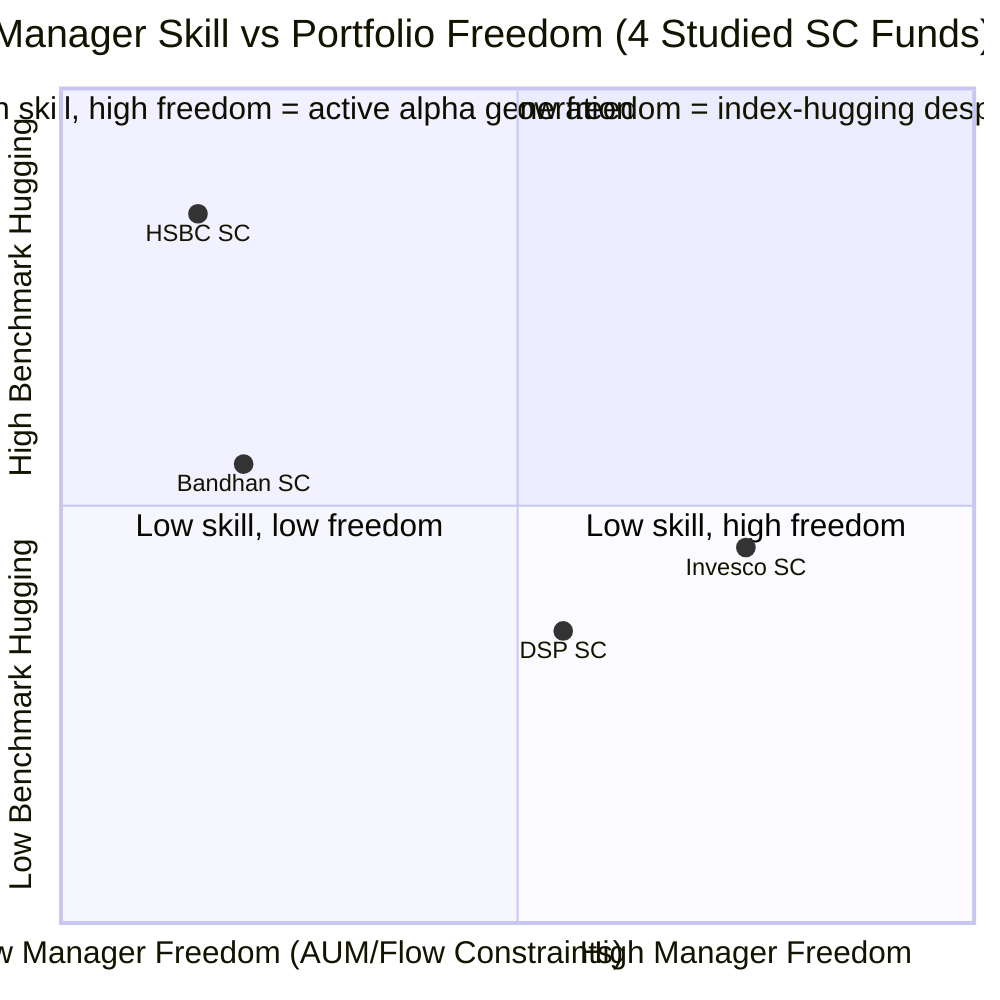

**The reconciliation:**

| Factor | DSP SC | HSBC SC | Implication |
|--------|--------|---------|-------------|
| Manager skill | High | High | Both capable managers |
| AUM size | ₹17,906 Cr | ₹16,877 Cr | Similar — comparable constraint level |
| Flow restrictions | **3 historical closures** | **None ever** | Critical difference |
| Cash buffer | **8.38%** | **~1.4%** | DSP has deployment buffer; HSBC is compelled buyer |
| Stocks in portfolio | **81** | **109** | HSBC forced wider by open-door policy |
| Benchmark correlation | Lower | **R² 95.96** | Mechanically index-like at 109 stocks + 0 cash |

**The conclusion:** HSBC's benchmark-hugging is not Manghat's stock-picking failing. It is the mechanical output of running an open-door, ₹16,877 Cr, 109-stock, near-fully-invested portfolio in a universe with finite liquidity. A skilled value/cyclical investor with 29 years of experience — when forced to spread ₹169 Cr across 109 positions with no cash buffer and no flow gate — will inevitably produce benchmark-like behaviour regardless of stock selection quality at the individual position level.

**The supporting evidence:**
- His HSBC Value Fund (a differently structured mandate) is well-regarded and generating alpha independently
- His individual stock picks in the SC portfolio include strong cyclical businesses at reasonable valuations (Module 3 sector analysis)
- The fund's *market-cap positioning* (uniquely pure small-cap, lowest large-cap dilution among studied funds) reflects deliberate, skilled construction

**The verdict:** Manghat is a good manager in a bad structural situation. The AUM problem (Module 4 open-door policy) has converted his skill advantage into benchmark tracking. Module 5's score reflects this: the manager is scored on what is in his control. What is not in his control — the AMC's flow management decision — is scored in Module 4.

---

## SEBI Regulatory History — A Procedural Yellow Flag (Not a Red Flag)

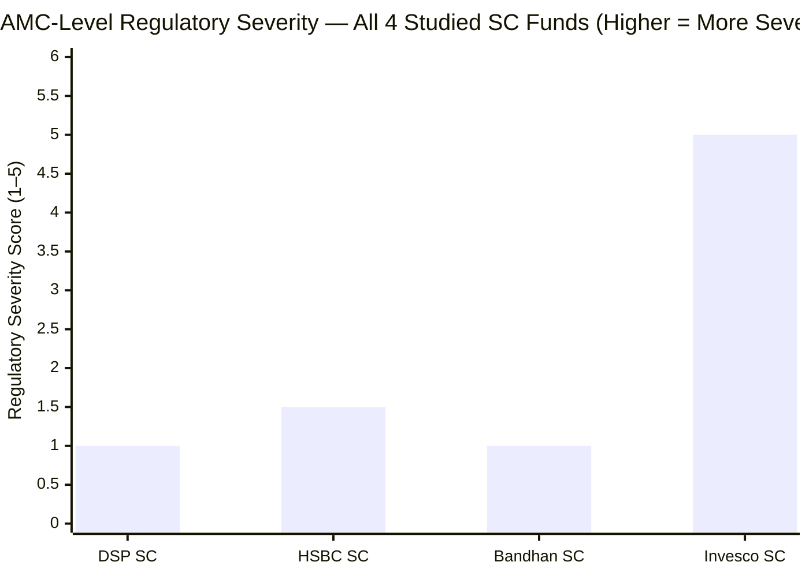

| Entity | SEBI Issue | Amount | Period | Severity Assessment |
|--------|-----------|--------|--------|---------------------|
| **Manghat (personal)** | **None** | **₹0** | — | **Fully clean personal record** |
| **HSBC AMC** | **Inadequate documentation of investment rationale** | **₹5 lakh** | SCN Nov 2023 (inspection: Apr 2019–Mar 2021) | **Procedural yellow flag** |
| DSP AMC | ETF expense ratio procedural | ₹2 lakh | Dec 2022 | Procedural noise |
| Invesco India AMC | Inter-scheme transfers; subprime bond dumping; multi-jurisdiction probe | ₹4.98 Cr settlement | Apr 2024 | Severe — investor harm, not procedural |

**What the ₹5 lakh penalty means:**

SEBI issued a Show Cause Notice on November 6, 2023, arising from an inspection of **L&T Mutual Fund** covering the period **April 1, 2019 to March 31, 2021**. The violation: HSBC AMC (as the successor entity that inherited L&T's liabilities) had inadequately documented the rationale behind investment decisions in the L&T-era equity portfolio. SEBI imposed ₹5 lakh under Section 15HB.

**Why this is a yellow flag (not immaterial) despite its small size:**

The inspection period (Apr 2019–Mar 2021) is the **same period when Manghat was Head of Equity Investments at L&T** — this was his team's equity portfolio, his investment decisions, his governance processes. The documentation failure was in the function he led. This is qualitatively different from DSP's ₹2L ETF penalty (which was in DSP's passive/index operations, entirely separate from Sambre's equity team). HSBC's penalty directly touches the equity investment process that Manghat ran.

**Why it remains a yellow flag (not a red flag):**

1. **Procedural, not investor harm.** "Inadequate documentation" means the investment rationale wasn't written up properly — not that wrong decisions were made or investors were harmed. SEBI's concern was the audit trail, not the quality of the investments.

2. **Small size (₹5 lakh).** One of the smallest possible SEBI penalties. This is not a market manipulation or front-running case.

3. **Clean personal record.** No penalty was issued against Manghat individually. The liability was at the entity (HSBC AMC as successor to L&T AMC) level.

4. **Invesco's context makes this look minor.** In the same studied universe, Invesco India AMC settled ₹4.98 Cr for inter-scheme transfers designed to transfer risk from sophisticated to retail investors — an active investor-harm violation. HSBC's ₹5L documentation penalty is of a fundamentally different character.

**The governance improvement:** The documentation failure under L&T was identified, remedied (SEBI settled), and HSBC's current equity investment process presumably has more rigorous decision-documentation standards. The fact that no further SEBI actions have emerged under HSBC's ownership (2023–2026) suggests the process was corrected.

---

## Investor Communication and Transparency

| Communication Form | HSBC SC (Manghat) | DSP SC (Sambre) | PP FC (Thakkar) |
|-------------------|-------------------|-----------------|-----------------|
| Quarterly letters to unitholders | **No** | No | **Yes — best in class** |
| Standalone investment philosophy document | **No** (factsheets only) | Yes (framework PDF) | Yes (detailed) |
| Public interview frequency | **Moderate** (VRO, NJ WealthWatch, SP Finserve) | Moderate (VRO, Moneycontrol, NDTV Profit) | High |
| Acknowledges limitations openly | **Partial** | Yes (VRO Aug 2024 buy-and-hold limitation) | Yes |
| Explains specific stock decisions | **No** (macro/sector-level only) | Partial | Detailed (quarterly letters) |
| SEBI regulatory finding disclosed | **Not proactively addressed** | N/A | N/A |
| Platform | HSBC website, VRO, NJ WealthWatch | DSP website, VRO, Moneycontrol | PPFAS website, VRO |

**Assessment:** HSBC sits below DSP's communication standard (which itself sits below PP's). The absence of a standalone investment philosophy document — beyond quarterly factsheets and product decks — is a material gap. Investors cannot audit Manghat's decision-making framework or verify whether specific holdings follow a stated, testable process. The interviews he gives are high-quality (his VRO interview on "growth and earnings catching up" shows macro sophistication) but are infrequent and macro-level rather than portfolio-specific.

**The most notable gap:** The ₹5L SEBI penalty has received no proactive communication to unitholders. An investor in HSBC Small Cap who discovered this only through a LiveLaw article — rather than an AMC disclosure — is left with a legitimate grievance about institutional transparency.

---

## Key Person Risk Assessment

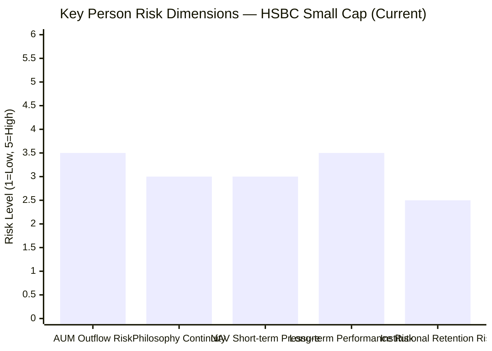

| Risk Dimension | Assessment | Score (1–5, 5 = highest risk) |
|----------------|-----------|-------------------------------|
| AUM outflows on Manghat exit | **Medium-High (3.5/5)** | HSBC SC's brand is moderately associated with Manghat; L&T's historical following plus HSBC institutional brand creates some resilience; but Chaturvedi as sole manager would likely trigger meaningful outflows |
| Philosophy continuity | **Medium (3/5)** | Chaturvedi joined Oct 2025 (~8 months); has not fully absorbed the value/cyclical framework through a full cycle; risk is moderate |
| NAV short-term pressure | **Medium (3/5)** | At ₹16,877 Cr with near-zero cash buffer, any significant redemption event could create forced selling of illiquid small cap positions — more dangerous than DSP's 8.38% cash cushion |
| Long-term performance risk | **Medium-High (3.5/5)** | Chaturvedi's track record as primary SC decision-maker is zero; 8 months is insufficient to assess; the M2/M5 structural problem (open-door AUM) persists regardless of manager |
| Institutional retention risk | **Low-Medium (2.5/5)** | Manghat is 3+ years post-acquisition; likely resolved early-IIHL-era uncertainty; HSBC institutional depth backstops retention incentives |

**The key-person risk conclusion:** HSBC SC's key-person risk is **higher than DSP's** (Ghosh provides 3.5 years of co-management foundation) and **comparable to Invesco's** (Khemani provides 19 months but manages 5 schemes vs Chaturvedi's fresh appointment). The 2-year gap between Naik's exit and Chaturvedi's addition left the fund without documented succession coverage for too long. The AUM near-zero-cash stance makes any forced-selling scenario during a manager transition particularly dangerous.

---

## Peer Manager Comparison

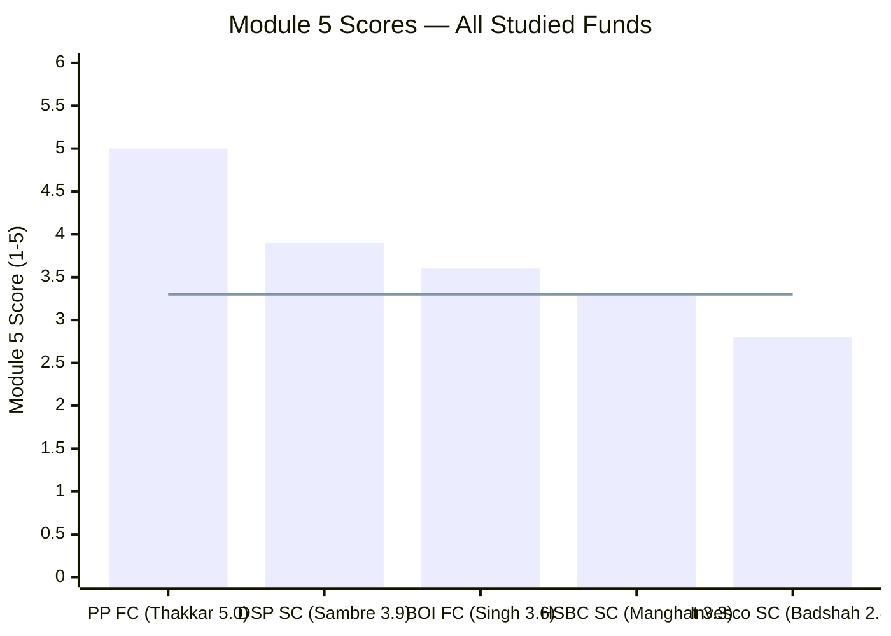
> Line = HSBC's M5 score (3.3/5)

| Fund | Manager | Tenure on Fund | Key Strength | Key Risk | M5 Score |
|------|---------|---------------|-------------|----------|---------|
| **PP FlexiCap** | **Rajeev Thakkar** | **13Y (inception)** | **FCA; quarterly letters; skin-in-game; 13Y unchanged philosophy** | Retirement horizon | **5.0/5** |
| **DSP SmallCap** | **Vinit Sambre** | **14Y (not inception)** | **FCA; Ghosh dedicated co-mgr 3.5Y; lowest turnover; flow discipline** | No quarterly letters; skin-in-game undisclosed | **3.9/5** |
| BOI FlexiCap | Alok Singh | 6Y (inception) | AMC builder; since inception | Sole manager; tiny AMC; no succession | 3.6/5 |
| **HSBC SmallCap** | **Venugopal Manghat** | **6.5Y (not inception)** | **29Y experience; COVID-tested at scale; value/cyclical consistency; Value Fund cross-fund signal; institutional loyalty** | **Co-mgr instability; no FCA; skill handcuffed by AUM structure; procedural SEBI yellow flag** | **3.3/5** |
| Invesco SmallCap | Taher Badshah | 7.5Y (inception) | Inception clarity; 27Y experience; CIO visibility | 7-scheme fragmentation; AMC SEBI history (most severe studied); short track at scale; no FCA; co-mgr also stretched | 2.8/5 |

**How Manghat ranks relative to Badshah (nearest CIO-generalist peer):**

| Dimension | Manghat (HSBC SC) | Badshah (Invesco SC) | Manghat Advantage |
|-----------|------------------|---------------------|------------------|
| Experience | 29Y | 27Y | Marginal |
| COVID at scale | **Yes (~₹5K Cr)** | No (₹200 Cr) | **Strong positive for Manghat** |
| SC fund % of mandate | **38.5%** | 27% | **Manghat more SC-focused** |
| Cross-fund flagship record | Value Fund well-regarded | Contra Fund last of 3 | **Manghat stronger** |
| AMC SEBI severity | ₹5L procedural yellow flag | ₹4.98 Cr + multi-jurisdiction + whistleblower | **Manghat much better** |
| Co-manager quality | Chaturvedi 8 months | Khemani 19 months | Slight Badshah edge |
| Style consistency | Value/cyclical unchanged | Growth-to-blend evolved | **Manghat more consistent** |
| Org loyalty | 29Y, 2 moves (1 involuntary) | 4 moves in 27Y | **Manghat stronger** |

**Manghat is clearly a stronger manager quality than Badshah on most dimensions.** The 0.5-point gap in their M5 scores (3.3 vs 2.8) reflects this. However, neither reaches Sambre's 3.9 (14Y tenure, FCA, dedicated Ghosh, flow discipline) or Thakkar's 5.0.

---

## Points For / Points Against — Fund Manager Quality

### ✅ Points For HSBC Small Cap (Manager Quality)

1. **29 years of institutional equity experience** — longest of any primary manager in this research; two full capex cycles, GFC, multiple bear markets across 17Y at Tata + 12Y at L&T/HSBC; accumulated pattern recognition is the deepest of the studied cohort
2. **COVID crash managed at meaningful AUM (~₹4,000–6,000 Cr)** — unlike Badshah's ₹200 Cr COVID test (irrelevant at scale), Manghat's March 2020 experience was at institutional size; held positions, maintained framework, captured recovery fully
3. **HSBC Small Cap is his single largest fund (~38.5%)** — despite managing 7 schemes and holding the CIO title, the SC fund represents the dominant share of his personal AUM responsibility; structural incentive for prioritisation
4. **Value/cyclical style is clear, consistent, and portfolio-evidenced** — 10+ years of same framework (L&T era + HSBC); Module 3 confirms the thesis is live in the portfolio (27.1% capex/industrial overweight); not evolved/uncertain like Badshah's growth-to-blend
5. **Cross-fund skill signal — HSBC Value Fund** — his second-largest mandate (₹14,342 Cr) has been positively reviewed independently; demonstrates his stock-picking skill travels beyond the AUM-constrained SC mandate
6. **Exceptional organisational loyalty** — 29 years with only 2 career moves; Tata AM (17Y), L&T (10Y), HSBC via involuntary acquisition — one of the most stable career trajectories studied; no AMC-hopping for salary; institutional embedding is genuinely deep
7. **Involuntary move preserves integrity** — the Tata→L&T→HSBC transition was acquisition-driven, not opportunistic; Manghat chose to stay at HSBC post-acquisition despite having the seniority to move elsewhere — a retention signal
8. **Mild SEBI penalty (₹5L procedural) vs Invesco's severe history** — HSBC's regulatory record is overwhelmingly cleaner than Invesco's ₹4.98 Cr + multi-jurisdiction probe; the ₹5L penalty is a procedural yellow flag, not an investor-harm finding
9. **The portfolio benchmark-hugging is primarily structural (M4), not a skill failure** — the M2/M5 reconciliation shows the R² 95.96 is the direct output of open-door AUM policy, not Manghat's stock-picking failing; his Value Fund record proves the skill is there
10. **Value/cyclical mandate is India-cycle aligned** — India's infrastructure spend (PLI, PM Gati Shakti, energy transition, private capex revival) is a structural multi-decade theme; a value/cyclical CIO with this expertise is well-positioned for the next 5–10 years

### ❌ Points Against HSBC Small Cap (Manager Quality)

1. **No FCA qualification** — the single most important analytical gap for a small cap manager; MBA Finance + B.Sc Math does not replicate the financial-statement forensics depth that FCA provides; earnings quality risk in SC universe is real and requires this depth; both Sambre and Thakkar have it
2. **Co-manager carousel — weak key-person mitigation** — Vihang Naik removed Sep 2023; 2-year gap with no co-manager; Chaturvedi added Oct 2025 with only ~8 months tenure; zero crisis experience in this role; compared to DSP's Ghosh (3.5Y, stable, dedicated), HSBC's succession preparedness is materially weaker
3. **6.5Y tenure — not inception; Lahiri's 5.6Y embedded in the track record** — 10Y/since-inception numbers include Lahiri's work; investors reading full fund history must manually strip out the pre-Manghat block; no "clean inception" story like Badshah or Singh
4. **Benchmark-hugging recent record (M2) — even if structural, attributable to his watch** — R² 95.96 and IR −0.61 over 5Y are documented under Manghat's entire tenure; regardless of the structural cause, the investor experience has been benchmark-tracking with extra cost; acceptable explanation, unacceptable outcome
5. **CIO-generalist model (7 schemes, ₹43,829 Cr)** — managing Value + Multi Cap + Infrastructure + Business Cycles + Small Cap simultaneously requires constant context-switching across style mandates; less focused than Sambre's 3-scheme specialist model; more focused than Badshah's 7-scheme spread but SC represents only 38.5%
6. **No quarterly investor letters** — the most structured transparency mechanism (used by PPFAS as gold standard) is absent; investors cannot audit specific stock decisions; Manghat's public communication is macro-level, not portfolio-specific
7. **Skin-in-game not disclosed** — unlike PPFAS where employee co-investment is publicly confirmed, HSBC has not confirmed Manghat's personal allocation to his own funds; probable but unverifiable
8. **SEBI ₹5L penalty touches the L&T equity process he led** — unlike DSP's ETF penalty (entirely separate from Sambre's equity team), this inspection covered the period when Manghat was Head of Equity at L&T; the documentation failure was in his function, his team, his governance process — a genuine yellow flag even if the penalty was small
9. **No public succession plan** — HSBC has provided no documented plan for Manghat's eventual transition; given his 29-year career (likely in his early-to-mid 50s), a transition is plausible within the 10-year SIP horizon; Chaturvedi's readiness is unproven
10. **Value/cyclical style creates sector concentration risk** — the 27.1% capital goods/power/capex overweight (Module 3) is not diversified away from Manghat's personal sectoral conviction; if India's capex cycle disappoints (policy reversal, commodity shock, global recession), this fund will underperform category more than a more diversified approach

---

## Module 5 Scorecard

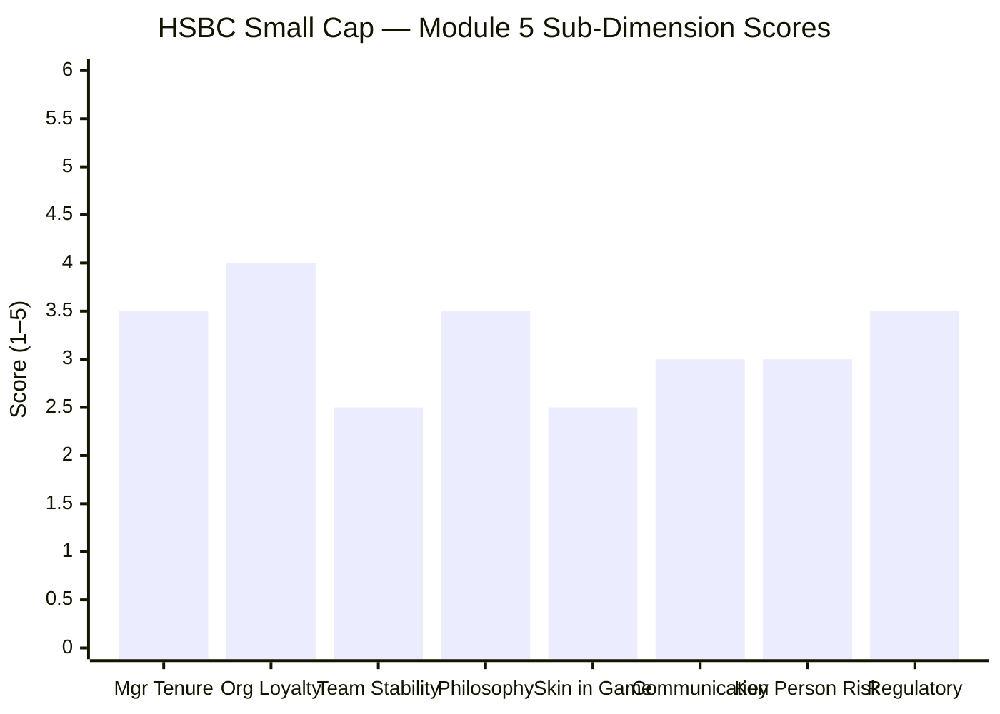

| Sub-Dimension | Score (1–5) | Reasoning |
|---------------|------------|-----------|
| Manager tenure on this fund | **3.5/5** | 6.5Y since Dec 2019 — meaningful; COVID managed at scale (~₹5K Cr); but below Sambre (14Y) and Thakkar (13Y); inception seam embeds Lahiri's 5.6Y |
| Organisational loyalty | **4.0/5** | 29Y career with just 2 moves (1 involuntary acquisition); Tata 17Y + L&T/HSBC 14Y; near-Sambre level embedding; strongest loyalty dimension in this module |
| Team stability | **2.5/5** | Co-manager carousel: Naik removed Sep 2023, 2-year gap, Chaturvedi appointed Oct 2025 (~8 months); weakest co-management structure of studied funds at comparable AUM |
| Philosophy consistency | **3.5/5** | Value/cyclical lens clear and consistent for 10Y+ (L&T + HSBC); portfolio-evidenced in M3; less precisely articulated than Sambre's 3 pillars; style contamination risk across 7 stylistically-different mandates is lower than Badshah (all Manghat's non-SC funds share the cyclical/value DNA) |
| Skin in the game | **2.5/5** | Not publicly disclosed; probable for a CIO managing his largest fund but unconfirmed; same gap as Sambre and Badshah vs PPFAS's explicit disclosure |
| Investor communication | **3.0/5** | Moderate: factsheets, product notes, periodic public interviews (VRO Jun 2026 interview shows macro sophistication); no standalone philosophy document; no quarterly letters; AMC regulatory finding not proactively disclosed |
| Key person / succession risk | **3.0/5** | CIO managing 7 schemes, SC = 38.5%; Chaturvedi very new (8 months); 2-year gap in co-management structure before Chaturvedi; HSBC institutional depth provides some backstop; no documented succession plan |
| Regulatory / AMC culture | **3.5/5** | ₹5L penalty is procedural and mild; but it touches the equity investment process Manghat led at L&T (Apr 2019–Mar 2021 inspection); far better than Invesco's multi-jurisdiction probe and investor-harm violations; not as clean as DSP/Bandhan (zero issues) |
| **Module 5 Overall** | **3.3 / 5** | 29-year value/cyclical CIO with exceptional org loyalty, COVID-tested at scale, clear cross-fund skill evidence; held back by co-manager instability (the dominant weakness), no FCA, undisclosed skin-in-game, and benchmark-hugging recent record (structural, not skill-driven, but still on his watch) |

---

## Comparative Module 5 Scores — All Studied Funds

| Fund | Module 5 Score | Manager | Key Advantage | Key Weakness |
|------|---------------|---------|--------------|--------------|
| **PP FlexiCap** | **5.0/5** | Thakkar | FCA; 13Y inception; quarterly letters; skin-in-game; philosophy unchanged | Retirement horizon |
| **DSP SmallCap** | **3.9/5** | Sambre | FCA; 14Y tenure; Ghosh dedicated 3.5Y; flow discipline; lowest turnover | No quarterly letters; skin-in-game undisclosed |
| BOI FlexiCap | 3.6/5 | Alok Singh | 6Y inception; AMC builder; since inception | Sole manager; tiny AMC; no succession |
| **HSBC SmallCap** | **3.3/5** | **Manghat** | **29Y; COVID at scale; value/cyclical DNA clear; Value Fund cross-fund signal; org loyalty near-Sambre** | **Co-mgr carousel; no FCA; 6.5Y (not inception); benchmark-hugging under his watch; ₹5L yellow flag** |
| Invesco SmallCap | 2.8/5 | Badshah | Inception clarity; 27Y; CIO visibility; Khemani adds coverage | 7-scheme fragmentation; AMC multi-jurisdiction SEBI history (most severe); COVID test at ₹200 Cr irrelevant |

---

## SIP Implication — What Module 5 Means for Your ₹20,000/Month

For a ₹20K/month small cap SIP investor choosing between studied funds, Module 5 generates the following actionable implications for HSBC:

1. **The 5Y CAGR is 100% Manghat's — use it for manager attribution.** When you evaluate HSBC SC's 5Y returns, you are evaluating Manghat's last 5 years specifically. This is clean. But when you see 10Y or since-inception numbers, mentally note that the 2014–2019 block (Lahiri's era) is embedded — do not attribute it to Manghat.

2. **Monitor Mayank Chaturvedi's named presence every quarter.** He is only 8 months into co-management and is currently the primary key-person-risk buffer. If he exits in the next 12–18 months, Manghat reverts to sole management — watch the SEBI addendum pages on the HSBC website.

3. **Manghat's Value Fund track record is your best external test of his stock-picking.** HSBC SC's benchmark-hugging is structural. Check HSBC Value Fund's NAV outperformance vs the Nifty 500 Value 50 TRI annually — if this remains well-regarded, Manghat's skill at the stock level is working despite the SC AUM handcuffs.

4. **The R² 95.96 (M2) cannot be fixed without a flow restriction (M4).** If you are holding HSBC SC expecting active alpha, you need to monitor whether HSBC AMC ever restricts inflows. If they do, expect portfolio concentration to improve and alpha potential to expand. If they never do, you are paying ~0.87% all-in cost for benchmark-tracking behavior — that is not an acceptable long-term outcome.

5. **The ₹5L SEBI penalty is noted but does not require action today.** Monitor whether any new SEBI actions emerge against HSBC AMC's equity team or Manghat personally. One procedural fine is a yellow flag; a second would be a different signal entirely.

---

## One-Line Verdict

Venugopal Manghat is a 29-year value/cyclical CIO with the deepest institutional experience in this research, real COVID-tested discipline at scale, and cross-fund skill evidence in the HSBC Value Fund — but his co-manager instability (2-year gap between Naik's exit and Chaturvedi's arrival), the absence of FCA credentials, and a 5Y record of benchmark-hugging (R² 95.96 — structural, not skill-driven, but his watch nonetheless) place him below Sambre and above Badshah in the manager quality ranking.

---

*Module 5 complete. Manager quality is the most nuanced finding in the HSBC study: a capable, experienced, style-consistent CIO handcuffed by the structural consequences of the AMC's open-door AUM policy. Module 5 score: 3.3/5.*

*Next: [Module 6 — AMC Quality](module6_amc.md)*
