# Module 6: AMC Quality — HSBC Small Cap Fund

*Sources: HSBC Asset Management India official (assetmanagement.hsbc.co.in) | HSBC Holdings plc Annual Results 2025 | SEBI order (Section 15HB, L&T-era) | Cafemutual | Value Research Online | Business Standard | Macrotrends | AMFI India | HSBC SAI (Statement of Additional Information) | ZoomInfo | Bloomberg Markets | Web research June 2026*

---

## Raw Data (Cross-Source Verified)

| Metric | Value | Source(s) |
|--------|-------|-----------|
| **AMC Full Name** | **HSBC Asset Management (India) Private Limited** | SEBI, HSBC official |
| **Formerly Known As** | HSBC Global Asset Management (India) Private Limited | Corporate history |
| **Indian AMC Active Since** | **2002** (~24 years) | HSBC official |
| **L&T Acquisition Completed** | **November 25, 2022** — L&T MF schemes fully absorbed; L&T MF ceased **April 6, 2023** | Business Standard, VRO |
| **Acquisition Price** | **$425 million (~₹3,200 Cr)** | Business Standard |
| **Ownership Structure** | **100% held by HSBC Securities & Capital Markets (India) Pvt Ltd (HSCI)** → member of HSBC Group → ultimately **HSBC Holdings plc** | HSBC governance page |
| **Ownership Type** | **Wholly-owned subsidiary of a foreign multinational bank** | — |
| **Sponsor** | HSBC Securities & Capital Markets (India) Private Limited (HSCI) | SEBI, HSBC SAI |
| **Trustee** | **HSBC Trustees (India) Private Limited** | HSBC SAI |
| **Ultimate Parent — HSBC Holdings plc** | Founded 1865 (Hong Kong & Shanghai); headquartered London | HSBC official |
| **MD & CEO** | **Kailash Kulkarni** — MBA (IMDR Pune); formerly CEO L&T Investment Management, Head-Sales Kotak AMC, Director MetLife, ICICI Bank | Cafemutual, Bloomberg |
| **CIO-Equity** | Venugopal Manghat (also ex-L&T; see Module 5) | — |
| **Total AMC AUM (Mar 2025, audited)** | **₹1,15,052 Cr (excl. domestic FOFs)** | HSBC Annual Report 2025 |
| **Total AMC AUM (AMFI, Mar 2026 est.)** | **~₹1,36,086 Cr** | BusinessToday/AMFI |
| **Total Schemes** | **~351 incl. variants**; ~44 distinct (21 equity, 13 debt, 8 hybrid, 2 money-mkt) | BusinessToday |
| **Custodian** | **Citibank N.A.** | HSBC SAI |
| **RTA** | **Computer Age Management Services Ltd (CAMS)** | HSBC SAI |
| **SEBI Regulatory Action** | **₹5 lakh penalty under Section 15HB** — inadequate documentation of investment rationale (L&T-era inspection April 2019–March 2021) | SEBI order |
| **Skin-in-Game Policy** | **Not publicly disclosed** | — |
| **Quarterly Investor Letters** | **No** | — |
| **HSBC Holdings — Total Assets (2025)** | **$3.23 trillion** | Macrotrends, HSBC Annual Results |
| **HSBC Holdings — Profit After Tax (2025)** | **$29.9 billion** | HSBC Annual Results 2025 |
| **HSBC Holdings — Market Cap / Global Rank** | **~$176 billion; ~10th largest bank globally** | Statista |

---

## What Module 6 Is Really Asking

You can back a skilled manager, a coherent portfolio, and a low turnover process — but if the *house* around them is regulatorily compromised, culturally indifferent to investors, or institutionally unstable, everything else can unravel over time. Module 6 evaluates the institution: governance, regulatory track record, ownership philosophy, financial health, and whether the AMC's structural incentives push toward investor interests or toward AUM accumulation.

HSBC presents the most **internally contradictory** AMC quality profile in this study. It is, simultaneously:

- **Financially the strongest** AMC in either study — backed by a $3.23 trillion parent with $29.9 billion profit after tax. No competitor comes close on raw financial firepower.
- **The most acquired** fund in this study — the small-cap fund's DNA is L&T's; the CEO is L&T's; the CIO is L&T's; the fund itself was renamed from L&T Emerging Businesses Fund only in April 2023. HSBC bought the franchise; it did not grow it.
- **A bank-owned AMC** with documented structural conflicts that explain the open-door AUM policy already identified in Module 4 — no flow restrictions ever, despite managing ₹16,877 Cr in a capacity-constrained asset class.

The Module 6 task for HSBC is to separate the *financial strength of the parent* from the *investor alignment of the AMC* — two things that often diverge in bank-owned fund houses.

---

## The AMC Structure — Who You Are Actually Backing

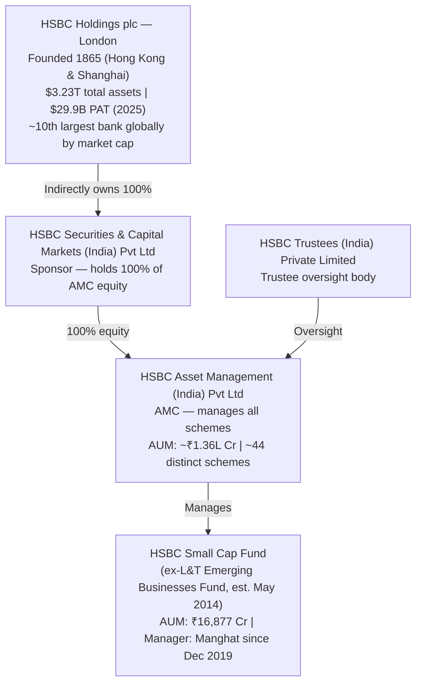

**What bank-owned AMC structure means for investors:**

When a bank-owned AMC underperforms, the bank's distribution network — branches, relationship managers, investment advisors — often continues pushing the fund to retail customers because management fees flow back to the group. DSP and PPFAS have no captive distribution networks of that kind. Every investor in those AMCs arrived on merit. HSBC, by contrast, has the distribution machinery of one of the world's largest financial institutions available. This drives scale — and it also drives the structural preference for *keeping the fund open* (more AUM → more fee revenue → better parent P&L). The Module 4 finding — no flow restrictions ever — is not an anomaly. It is the logical output of this ownership structure.

---

## Heritage — Real, But Four Different Clocks

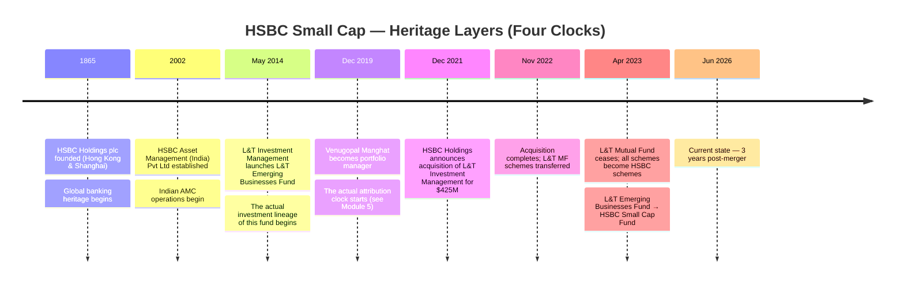

The most important thing to understand about HSBC's "heritage" is that it runs on **four separate clocks**, none of which seamlessly connect to the others:

| Heritage Layer | Clock Starts | What It Covers |
|---|---|---|
| HSBC Group global banking | 1865 | Multi-currency banking, trade finance, wealth management — *not* Indian equity small-cap investing |
| HSBC India AMC | 2002 | 24 years of Indian mutual fund operations — mostly debt-focused until the L&T acquisition |
| This fund's investment lineage | May 2014 | The L&T Emerging Businesses Fund history; Manghat's Value/cyclical process |
| Manghat's attribution | December 2019 | The only clean attribution window for the current manager |

**Why this matters vs. DSP:** DSP's heritage is *continuous*. The Kothari family has been at the centre of Indian capital markets for 160+ years; the BSE founding connection is real; the DSP Small Cap Fund has been continuously managed by Vinit Sambre from inception. When you buy DSP Small Cap, you buy a single, uninterrupted DNA strand going back generations.

When you buy HSBC Small Cap, you buy a **graft**: a 160-year global banking heritage grafted onto a 24-year Indian AMC that itself grafted the 12-year L&T fund, which now operates under a 6.5-year manager. The four layers are real — but they are assembled, not continuous. *Assembled heritage is not the same as continuous heritage.*

---

## The Bank-Owned AMC Conflict — Structural Incentives vs Investor Interests

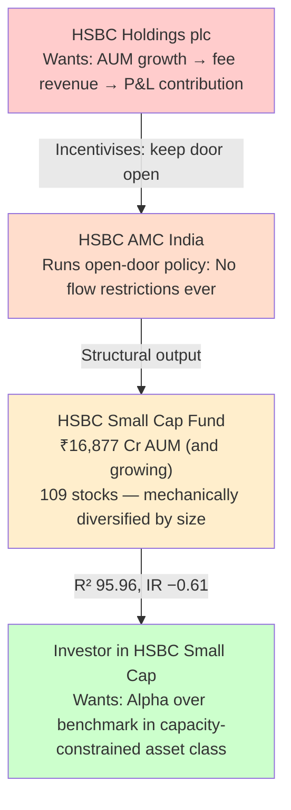

The Module 4 finding — that HSBC Small Cap has *never* imposed a single flow restriction despite growing to ₹16,877 Cr in the capacity-constrained small-cap space — is now explicable at the AMC level. It is not an oversight; it is a structural output of bank-owned AMC incentives.

Consider the timeline: DSP closed its small-cap fund in February 2017 at ~₹3,200 Cr AUM — sacrificing fee revenue for investor protection. At the same moment, L&T Emerging Businesses (which became HSBC Small Cap) was also growing rapidly. It kept its doors open. After the HSBC acquisition, the fund has continued to accept unlimited inflows, crossing ₹10,000 Cr and then ₹16,877 Cr without a single restriction.

**The investor impact of the bank-owned incentive structure:** 
- More AUM → more stocks held (109 today) → higher R² vs benchmark (95.96 in Module 2) → less scope for genuine alpha → value proposition of active management erodes
- This is the **M4↔M6 bridge**: cost (Module 4, 3.2/5) and AMC culture (Module 6) jointly explain Module 2's most damaging finding: IR −0.61 on a 3-year basis

A family-owned AMC like DSP risks its reputation and family wealth by letting AUM grow to the point where the fund underperforms. A bank-owned AMC like HSBC can absorb reputation risk across hundreds of global products. The asymmetry of consequences shapes decision-making.

---

## Kailash Kulkarni — The CEO Who Came With the Acquisition

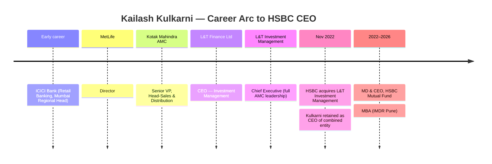

Kailash Kulkarni is notable for two reasons. First, his **continuity**: retaining the L&T CEO post-acquisition was a deliberate stability signal — the acquired team's leadership stayed, avoiding the talent disruption that often derails acquisitions. Second, his **professional identity**: Kulkarni is fundamentally a **sales and distribution executive**, not an investment professional. His entire pre-AMC-CEO career — ICICI Bank (retail distribution), MetLife (insurance distribution), Kotak AMC (Head-Sales) — is in selling financial products, not in investment analysis or portfolio management.

**The contrast with DSP's Kalpen Parekh** is instructive. Parekh became DSP CEO from IDFC MF (MD role) and has spent his public platform advocating *against* AUM-chasing — telling investors when markets are expensive, recommending index funds when appropriate, warning against recency bias. Kulkarni's public profile is far more limited. There are no publicly documented instances of Kulkarni advising restraint on inflows, warning about capacity constraints, or publicly prioritising investor outcomes over distribution growth.

**The CEO character matters because** culture flows from the top. A CEO who built his career in sales will organise the firm around sales. The absence of any flow restriction under Kulkarni's watch — across both L&T and HSBC eras — is consistent with this profile.

---

## Skin-in-the-Game — Not Disclosed

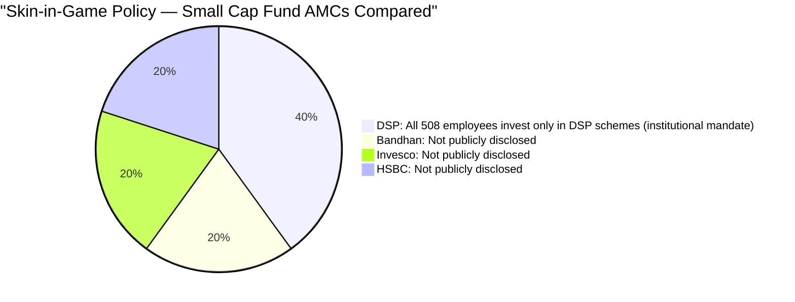

HSBC has not publicly disclosed any skin-in-the-game policy at the AMC level. SEBI mandates a minimum lock-in of 20% of variable pay in the fund being managed — that is a compliance requirement, not a culture signal. No voluntary commitment beyond regulatory minimum is documented.

**Why this matters particularly for HSBC:** When the CEO is a distribution professional, when the AMC is a 100% subsidiary of a global bank with no independent ownership stake, and when the CIO manages ₹43,829 Cr across 7 schemes in a generalist capacity — the absence of any voluntary skin-in-the-game commitment removes the one countervailing incentive that could push the organisation toward investor-first decisions. DSP's all-employee investment policy creates a direct feedback loop where every analyst's personal savings move with the fund's performance. At HSBC, no such feedback loop is documented.

---

## Regulatory Record — One Real Blemish

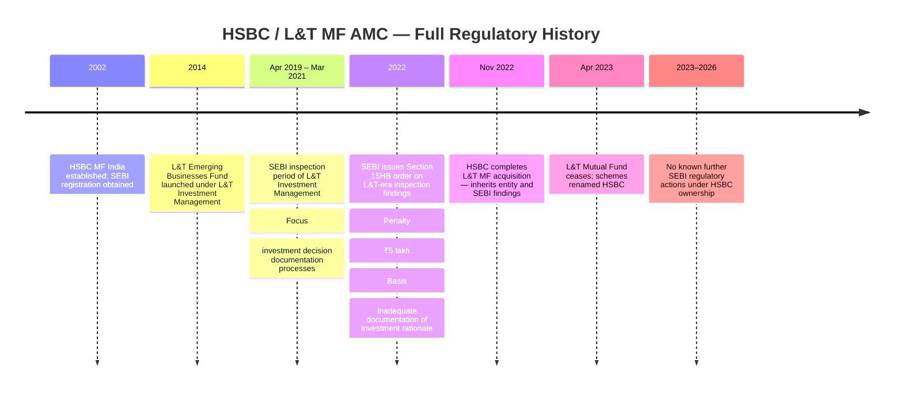

| Entity | Issue | Amount | Year | Relevance |
|--------|-------|--------|------|-----------|
| L&T Investment Management (now HSBC AMC) | Section 15HB — inadequate documentation of investment decisions | **₹5 lakh** | 2022 (inspection 2019–21) | **Moderate** — investment-desk process failure, closer to core than DSP's ETF pricing slip |
| Any HSBC/L&T equity fund manager (personal) | None | ₹0 | — | **All managers personally clean** |

**The ₹15HB finding in full context:**

Section 15HB applies to any person who fails to comply with any SEBI provision not otherwise specifically penalised. The finding here was that L&T Investment Management did not adequately document the *rationale* for investment decisions — in other words, written records explaining *why* each trade was made were insufficient under SEBI's inspection standards.

**What this is:** A process and governance failure at the investment desk — failure to maintain adequate audit trails for portfolio decisions.

**What this is not:** Fraud, front-running, insider trading, or investor harm. The decisions themselves were not found to be wrong; the documentation supporting them was.

**However, the nature matters:** Unlike DSP's December 2022 penalty (ETF expense ratio reporting — entirely operational, zero connection to fund management), the §15HB finding goes to *how the investment team operated internally*. It is closer to the fund management process than any other penalty in this study. And while HSBC inherited it — not created it — the entity that now operates this fund is the same legal entity that received the penalty.

---

## The §15HB Lens — Why an Investment Documentation Penalty Is Different

Most AMC penalties in this study are operational or procedural — ETF expense ratios, administrative delays, settlement process issues. The §15HB finding at L&T/HSBC is unusual because it sits at the *intersection of governance and investment process*.

**What adequate investment documentation means in practice:**

When a fund manager buys or sells a security, there should be a contemporaneous written record — ideally before or at the time of the trade — explaining:
- Why this security at this price at this time?
- What changed in the investment thesis?
- Which model, research report, or analytical framework supported the decision?

This documentation serves multiple purposes: it prevents front-running (a pre-trade record means the trade decision preceded any information leak), it enables performance attribution, it protects the manager in any subsequent regulatory inquiry, and it demonstrates that decisions are principled rather than discretionary.

**The L&T-era lapse:** SEBI found these records were inadequate during a 2-year inspection window (April 2019–March 2021). This period overlapped with Manghat's entry as portfolio manager (December 2019). Whether the lapse was in the systems and processes he inherited, or in the processes of the broader investment team, is not publicly specified.

**Why HSBC inherited this problem:** The acquisition transferred not just schemes and AUM, but the entire entity — HSBC acquired L&T Investment Management Limited, the AMC company. The legal continuity means the investment documentation standard in place during 2019–2021 was a property of the entity HSBC now owns. Improving it post-acquisition is the right response; the history cannot be erased.

---

## "Is India Core to HSBC?" — The Strategic Commitment Question

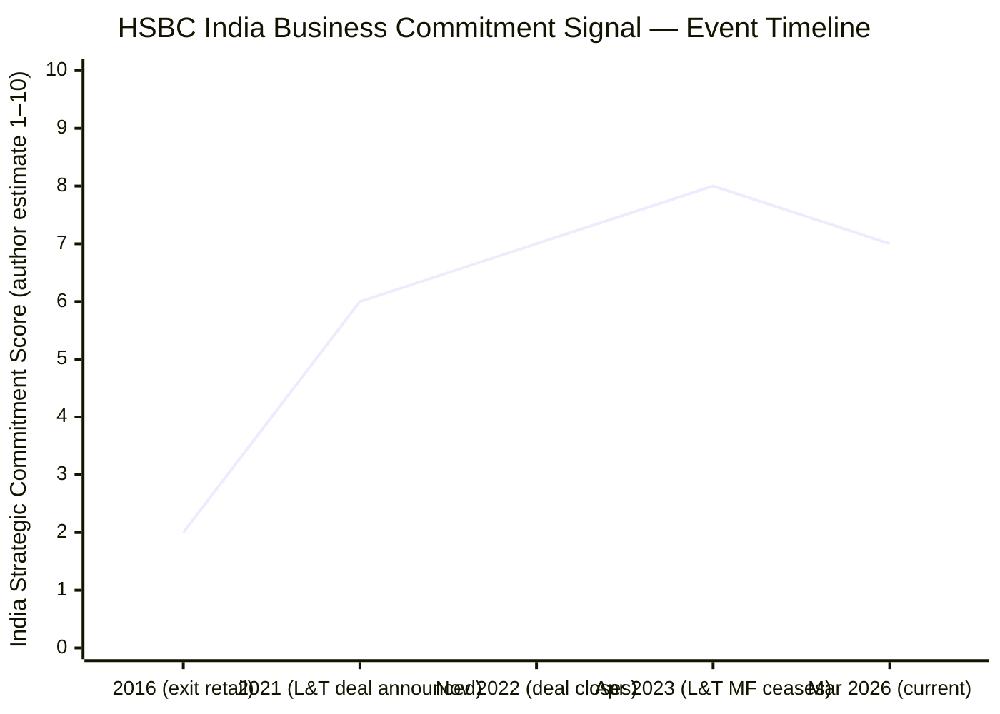

This is the most distinctive strategic risk question that applies to HSBC but not to DSP, Bandhan, or Invesco. In **2016, HSBC exited its India retail banking operations** — shutting branches, abandoning retail customers — as part of a global restructuring under then-CEO Stuart Gulliver's "simplify and refocus" strategy. India was explicitly classified as a non-core market for HSBC retail banking.

Then, in **December 2021**, HSBC's Asset Management arm announced the $425M acquisition of L&T Investment Management — a significant recommitment to the Indian market.

**Reconciling the exit and the re-entry:**

| Signal | Implication |
|---|---|
| **2016 retail exit** | India is not a core market when HSBC faces margin pressure globally — they will prune non-core units |
| **2021 L&T deal** | Indian asset management is a growing fee-revenue business; HSBC made a strategic bet at $425M/₹3,200 Cr |
| **Rationale for re-entry** | Asia-Pacific AUM growth, India's rising retail investor base, and asset-light fee business model (vs capital-intensive banking) |
| **The risk** | A future HSBC global CEO could revisit the India-strategy decision with different priorities; an HSBC Holdings acquisition or divestiture at the group level could change AMC ownership without Indian investor input |

**The honest assessment:** The $425M investment is a real commitment. HSBC does not write cheques of that size on non-serious bets. India is also structurally the most important emerging-market asset management opportunity globally, and HSBC's Asia-Pacific strategy explicitly includes India wealth management. The 2016 retail exit was a banking decision in a different business. The re-entry in 2021 through asset management (a lighter, more scalable model) is a structurally sounder strategic play.

But the 2016 precedent exists. It proves that HSBC can and will exit Indian businesses when global priorities shift. Family-owned AMCs (DSP) cannot be acquired or exited; bank-owned AMCs can.

---

## The Flow Restriction Decision — Never Made

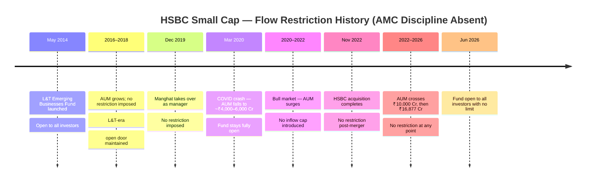

**Contrast with DSP:**

| Metric | DSP Small Cap | HSBC Small Cap |
|---|---|---|
| AUM at first restriction | ~₹1,200 Cr | **Never restricted** |
| AUM when fully closed | ~₹3,200 Cr | **N/A** |
| Duration of closure | 3+ years (Feb 2017 – Sep 2018, then partial) | **N/A** |
| Reopening decision | COVID lows (April 2020) — optimal for new investors | **N/A — fund never closed** |
| Estimated fee revenue sacrificed | Hundreds of crores | **₹0 — no sacrifice made** |
| AMC quality signal | Investor-first, demonstrably | Distribution-first, demonstrably |

DSP's closure decisions cost real money — at 0.64% ER, every ₹100 Cr of foregone AUM is ₹64L/year in lost fees. They did it anyway, for years, because they prioritised investor outcomes over fee revenue. HSBC has never faced that test. There is no evidence it would make the same choice.

---

## AMC Scale and Institutional Depth

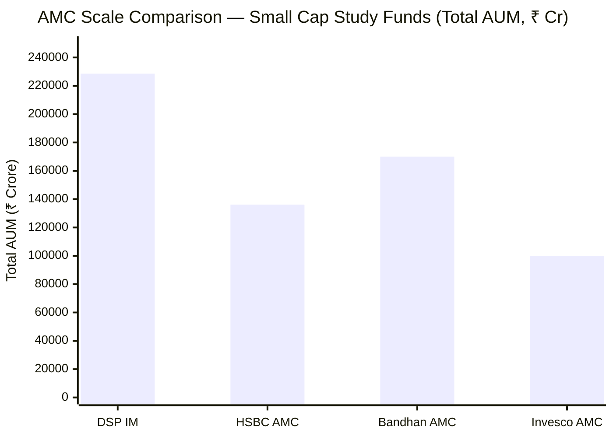

| Metric | HSBC | DSP | Bandhan | Invesco | Implication for Small Cap |
|---|---|---|---|---|---|
| Total AUM | ₹1.36L Cr | ₹2.28L Cr | ~₹1.70L Cr | ~₹1.0L Cr | Mid-tier in study |
| Distinct schemes | ~44 | ~66 | ~40 | ~30 | Manageable per-scheme AUM |
| CIO/senior managers | Manghat (CIO, generalist) | Sambre (dedicated) + 8 others | Suyash Choudhary + equity team | Badshah (dedicated SC) + team | HSBC weakest — 1 CIO managing ₹43,829 Cr/7 schemes |
| Custodian | **Citibank N.A.** | **Citibank N.A.** | Citibank N.A. | Deutsche Bank | Both HSBC and DSP at global tier-1 |
| RTA | **CAMS** | KFin | KFin | KFin | CAMS is India's largest RTA; equally strong |
| International office | No | Yes (London) | No | No | DSP only one with global presence |
| Financial backing | **$3.23T parent** | ₹15,779 Cr family NW | GIC + PE consortium | Invesco Corp ($1.7T) | HSBC parent is structurally strongest |

**Research depth concern:** The key institutional depth question for a small-cap fund is: can the manager get adequate analytical support for 109 holdings in a capacity-constrained, illiquid asset class? Manghat manages ₹43,829 Cr across 7 schemes as CIO. DSP's Sambre manages 1 mandate (₹17,906 Cr) with a dedicated co-manager and 508-person institutional infrastructure. HSBC's research capacity — while not publicly quantified — is stretched by a generalist CIO structure that Module 5 identified as the primary governance concern.

---

## Investor Communication — Standard, Not Distinguished

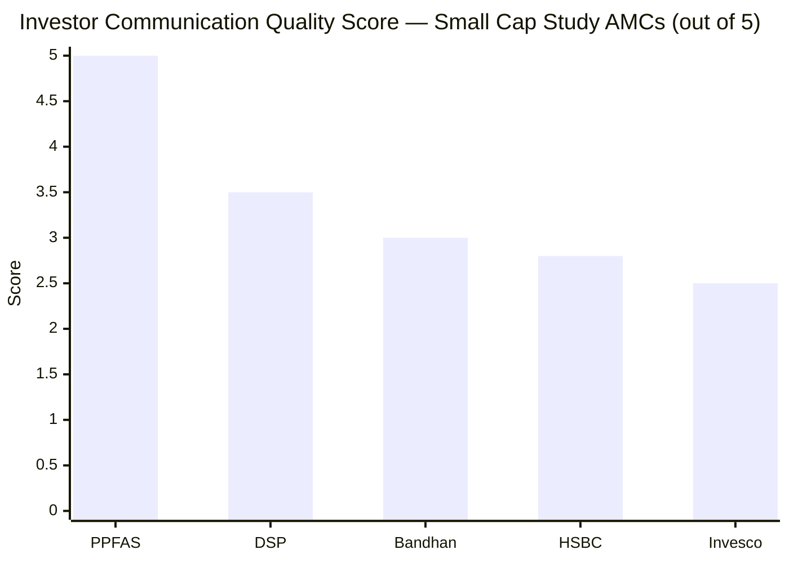

| Communication Form | HSBC | DSP | Bandhan | PPFAS (Gold Standard) |
|---|---|---|---|---|
| Quarterly letters to unitholders | **No** | No | No | **Yes — detailed, proactive, candid** |
| Monthly factsheets | Yes | Yes | Yes | Yes |
| Active blog / investor content | Minimal | **Yes (active)** | Moderate | Yes |
| CEO public interviews | **Limited (Kulkarni's profile is low)** | **Frequent (Parekh, candid)** | Moderate | Frequent (Thakkar) |
| Investment philosophy documented | On website | On website | On website | Extensively |
| Behavioural finance content | No | **Yes (Parekh's specialty)** | No | Yes |
| Fund manager public appearances | Limited | **Sambre: VRO, NDTV, Moneycontrol** | Occasional | Thakkar: all platforms |

HSBC's investor communication is the least distinctive of the studied AMCs. No quarterly letters, no CEO known for investment philosophy advocacy, no fund manager who has become a regular trusted voice in financial media. Factsheets and the standard AMFI-required disclosures are present, but nothing beyond that.

**The Hubbis article as a data point:** A Hubbis (Asian Wealth Management) interview with Kulkarni positioned HSBC's India strategy around building "the next phase of wealth creation" — a marketing-tone message, not an investment philosophy message. Compare this with Kalpen Parekh publicly warning investors that markets are expensive (which actively discourages near-term inflows) or Thakkar's quarterly letters explaining specific portfolio decisions with intellectual accountability. HSBC's CEO communicates in a growth-narrative mode, not an investor-education mode.

---

## AMC Financial Health — The Strongest Backstop in Either Study

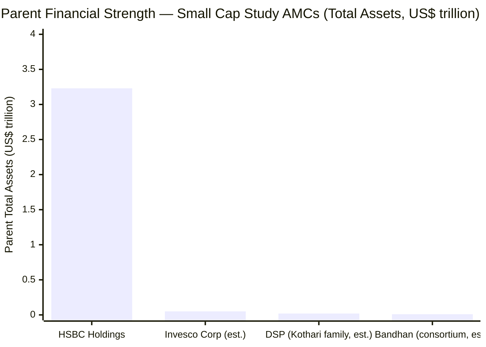

| Metric | HSBC | DSP | Bandhan | Invesco |
|---|---|---|---|---|
| Parent / Owner financial strength | **$3.23T assets, $29.9B PAT (2025)** | Kothari family ~₹15,779 Cr NW | GIC + PE consortium | Invesco Corp ~$1.7T AUM |
| Financial stress risk | **Zero** | Negligible | Low-Moderate | Very Low |
| Can the AMC be shut for financial reasons? | **Essentially impossible** | Very unlikely | Theoretical | Very unlikely |
| Will parent fund research infrastructure in a downturn? | **Yes — HSBC has global risk capital** | Yes — family wealth backstop | Uncertain — PE funds have IRR horizons | Yes — Invesco Corp |

This is HSBC's unambiguous 5/5 dimension. When HSBC Small Cap Fund underperforms for a quarter, a year, or even several years, the parent's $3.23 trillion balance sheet absorbs any pressure without affecting the fund's operations. Research staff will not be laid off. Technology will not be cut. The fund will continue to be managed regardless of AUM inflows or outflows. In an industry where small AMCs have exited or merged due to financial pressure, this stability is genuinely valuable.

**The nuance:** Financial stability at the parent level does not translate to investor-aligned decision-making at the AMC level. A well-capitalised bank-owned AMC that keeps the fund open to unlimited inflows is not acting in investor interests — it is using its financial stability to maximise fee revenue at investors' expense. Stability and alignment are different things. HSBC scores 5/5 on the former and significantly lower on the latter.

---

## Scheme Count — Manageable, but Post-Merger Overlap Risk

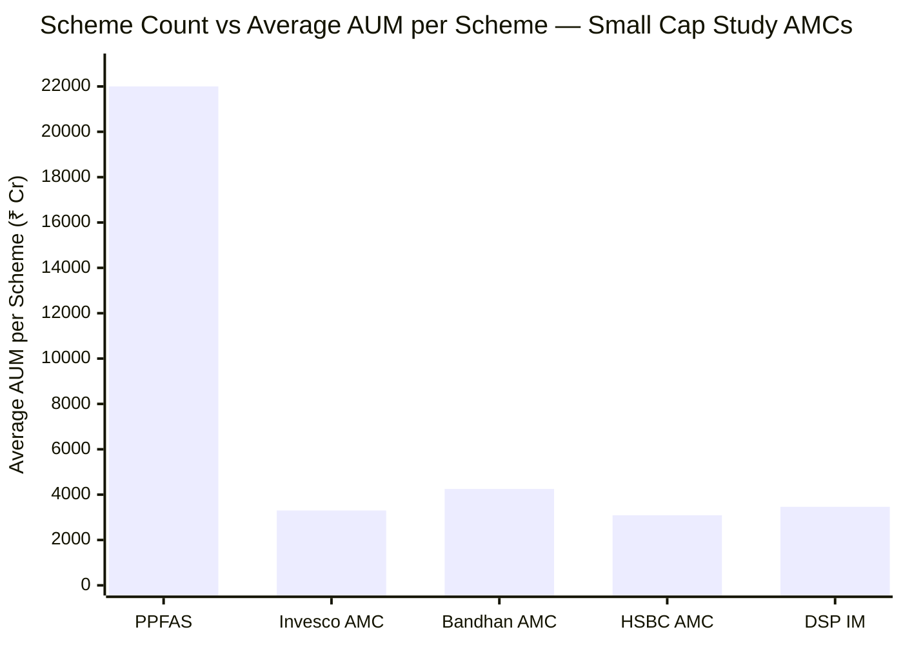

> PPFAS: 7 schemes / ₹1.40L Cr = ₹20,000 Cr/scheme. HSBC: ~44 distinct / ₹1.36L Cr = ~₹3,093 Cr/scheme.

HSBC's ~44 distinct schemes at ₹1.36L Cr is a reasonable product set. Unlike DSP's 66 schemes (which covers the full product universe), HSBC has a targeted enough lineup that most schemes have viable AUM. The average of ~₹3,093 Cr/scheme is above the economic scale threshold for most fund types.

**Post-merger overlap concern:** The November 2022 acquisition merged L&T MF (26 schemes at the time) with HSBC MF's existing lineup. SEBI rules allowed scheme consolidation where both AMCs had overlapping mandates. The current ~44 distinct schemes reflect the post-consolidation state. However, some residual overlap — particularly in hybrid and debt categories — is possible, and scheme proliferation risk from the merger has not fully resolved. This is a **watch item**, not an immediate concern.

**The small-cap fund specifically:** HSBC runs one small-cap scheme (₹16,877 Cr). Manghat is the sole equity decision-maker, supported by co-manager Chaturvedi (since Oct 2025). The scheme-count question matters less here than it does for the manager — who manages 7 schemes in total as CIO, a structural concern documented in Module 5 and Module 4 (the CIO-generalist model).

---

## Novel Section 1: "Fortress Parent vs Aligned Owner" — The HSBC-DSP Axis

```mermaid
quadrantChart
    title AMC Quality: Financial Strength vs Investor Alignment (Small Cap Study)
    x-axis "Low Investor Alignment" --> "High Investor Alignment"
    y-axis "Low Financial Strength" --> "High Financial Strength"
    quadrant-1 Ideal (strong + aligned)
    quadrant-2 Strong but misaligned (bank-owned risk)
    quadrant-3 Weak and misaligned (avoid)
    quadrant-4 Aligned but limited resources
    DSP: [0.85, 0.70]
    HSBC: [0.32, 0.98]
    Bandhan: [0.48, 0.52]
    Invesco: [0.25, 0.55]
    PPFAS: [0.95, 0.55]
```

This quadrant chart captures the essential HSBC AMC paradox: it sits in the upper-left (strong but misaligned) — extreme financial strength combined with below-average investor alignment. DSP sits in the upper-right (strong and aligned). PPFAS sits in the lower-right (aligned but smaller resources). These positions are stable, structural, and unlikely to change without a fundamental ownership change at HSBC.

**For an investor in HSBC Small Cap Fund, the practical implication:**
- You will never face a scenario where the fund closes because HSBC has financial problems. The parent's stability is an insurance policy.
- You will face scenarios where AMC incentives push toward AUM accumulation over investor protection — the open-door policy, no flow restrictions, distribution-first CEO profile.
- The fund can grow beyond its optimal capacity, and HSBC has no structural incentive to prevent it. It has already grown to ₹16,877 Cr; the trajectory continues.

---

## Novel Section 2: The Acquisition Integration — Three Years On, What Has Changed?

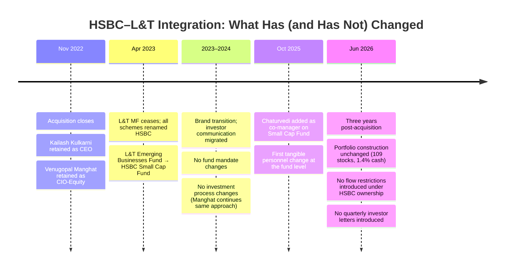

**What has changed:** Branding (L&T → HSBC). Legal entity (L&T MF → HSBC MF). October 2025 co-manager addition.

**What has not changed:** The investment philosophy (Manghat's value/cyclical approach), the portfolio structure (broad, fully-invested, index-hugging), the open-door AUM policy, and the investor communication standard (factsheets, no quarterly letters).

**The three-year verdict:** The acquisition was primarily a *distribution and scale* transaction, not an *investment quality* transaction. HSBC paid ₹3,200 Cr to acquire the AUM and the distribution relationships. It did not materially change the investment process or the governance approach. Whether this is a positive (continuity of Manghat's process) or a negative (perpetuation of L&T-era documentation standards and open-door culture) depends on what you believe about the underlying investment quality — a question Modules 1–5 examined exhaustively.

---

## Peer AMC Comparison — All Small Cap Study Funds

| Dimension | HSBC AMC | DSP IM | Bandhan AMC | Invesco AMC |
|---|---|---|---|---|
| **Ownership type** | Foreign bank subsidiary | Family-private (independent) | PE consortium (Bandhan+GIC+ChrysCap) | Foreign AM subsidiary (IIHL majority) |
| **Independence** | Low — 100% foreign bank-owned | **Highest** — family-controlled | Moderate — PE-clock risk | Low-Moderate — majority PE/conglomerate |
| **Heritage (fund DNA)** | Grafted — L&T fund + HSBC AMC + global parent | **160+ yr continuous Indian CM heritage** | 25-yr IDFC lineage (clean) | 19 yr; 4 ownership changes |
| **Total AUM** | ~₹1.36L Cr | ₹2.28L Cr | ~₹1.70L Cr | ~₹1.0L Cr |
| **Financial stability** | **Strongest ($3.23T parent)** | Very High | Moderate | High (Invesco Corp) |
| **Skin-in-game** | Not disclosed | **All 508 employees (institutional mandate)** | Not disclosed | Not disclosed |
| **SEBI issues (AMC)** | ₹5L §15HB (investment documentation, L&T-era) | ₹2L procedural (ETF ER) | **Zero (25-yr clean)** | ₹4.98 Cr (investor-harmful PMS/MF breaches) |
| **Severity** | Moderate | Very Low | Clean | High |
| **Flow restrictions** | **Never — open door** | Yes — multiple; closed 2017–2020; reopened COVID lows | No — never restricted | No — never restricted |
| **Quarterly letters** | No | No | No | No |
| **Investor communication** | Below average | Above average | Moderate | Below average |
| **CEO profile** | Distribution-focused (ex-L&T CEO) | Investment philosophy advocate (Parekh) | Professional (Choudhary) | Named in SEBI settlement (Nanavati) |
| **Succession clarity** | Acquisition-based retention; unclear post-Kulkarni | **Strong (Parekh + Kothari Desai)** | Moderate | Unstable (CEO named in SEBI settlement) |

---

## Points For and Against — AMC Quality

### ✅ Points For HSBC AMC Quality

1. **Fortress parent financial backing** — HSBC Holdings plc ($3.23T assets, $29.9B PAT 2025, ~10th largest bank globally) means zero financial-stress risk; the AMC will never face closure, talent cuts, or infrastructure reduction due to funding pressure; this is the strongest financial backstop of any AMC in this study
2. **Experienced leadership continuity post-acquisition** — retaining Kailash Kulkarni (CEO) and Venugopal Manghat (CIO) from L&T Investment Management prevented the talent disruption that often derails acquisitions; the fund's investment process has been maintained without interruption
3. **Tier-1 infrastructure** — Citibank N.A. as custodian (globally the largest custodian bank) and CAMS as RTA (India's largest RTA) represent infrastructure choices at the top tier, reflecting HSBC's institutional standards
4. **Regulatory record is not egregious** — the ₹5L §15HB penalty is from the L&T era (pre-HSBC ownership); under HSBC management since November 2022, no new SEBI actions are documented; the inherited penalty does not reflect HSBC's own governance decisions
5. **Significant strategic recommitment to India** — the $425M acquisition is a real, material bet on Indian asset management that cannot be dismissed; HSBC has aligned its Asia-Pacific wealth strategy with India's long-term retail AUM growth opportunity
6. **Global governance standards** — HSBC Holdings plc is listed on the London Stock Exchange, Hong Kong Exchange, NYSE, and other exchanges, subject to FCA, HKMA, and multi-jurisdiction governance oversight; the institutional compliance culture flows down to subsidiaries
7. **Post-merger scheme consolidation done** — the L&T-HSBC merger has been integrated over three years; scheme overlaps have been resolved; the current ~44 distinct scheme lineup is a manageable product set
8. **Clean record on equity manager conduct** — Manghat, Chaturvedi, and all HSBC equity managers are personally clean; no fund manager has been named in any SEBI inquiry

### ❌ Points Against HSBC AMC Quality

1. **Bank-owned AMC structural conflict** — 100% foreign bank ownership creates inherent incentives toward AUM accumulation (fee revenue) over investor protection; every open-door policy at the fund level is consistent with, and likely encouraged by, this ownership structure
2. **Never restricted flows** — HSBC Small Cap has grown to ₹16,877 Cr with zero flow restrictions at any point; DSP sacrificed years of fee revenue to protect investors at ₹3,200 Cr; HSBC has never made a comparable investor-first decision; this is not a neutral data point — it is a documented cultural failure
3. **§15HB investment documentation penalty** — the SEBI finding that investment decision rationale was inadequately documented (2019–2021 inspection) sits closer to the core investment process than any other penalty in this study; the inherited entity carries this governance legacy
4. **CEO is a distribution professional, not an investment leader** — Kulkarni's entire career is in sales/distribution (ICICI Bank retail, MetLife, Kotak AMC Head-Sales); no documented philosophy on investor protection, capacity constraints, or investment process governance; absent from public investment discourse
5. **Skin-in-game not disclosed** — no voluntary commitment beyond SEBI minimum; no institutional policy of personal co-investment; the financial alignment between AMC decision-makers and fund investors is unknowable
6. **Grafted, not grown heritage** — the fund's DNA is L&T's (inception 2014); HSBC acquired it for ₹3,200 Cr in 2022; three years is not sufficient to claim HSBC's heritage as this fund's heritage; continuity of staff is not the same as continuity of institution
7. **India-exit precedent exists** — HSBC's 2016 retail banking exit from India proves it can and will de-prioritise India when global strategy shifts; while asset management is structurally different from retail banking, the precedent of a strategic exit is real
8. **Investor communication is minimal** — no quarterly letters, no CEO known for investor education, no fund manager with a regular public presence; the communication gap is wider than any AMC except Quant in the full study
9. **No skin-in-game, no flow discipline, no quarterly letters** — the three behavioural markers that distinguish investor-first AMCs (PPFAS, DSP) from AUM-first AMCs are absent at HSBC; this is not one failing — it is a consistent pattern
10. **CIO-generalist model** — Manghat managing 7 schemes across ₹43,829 Cr as a generalist, with limited dedicated research support per scheme, reduces the institutional depth that the small-cap mandate requires; this is the M5↔M6 bridge

---

## Module 6 Scorecard

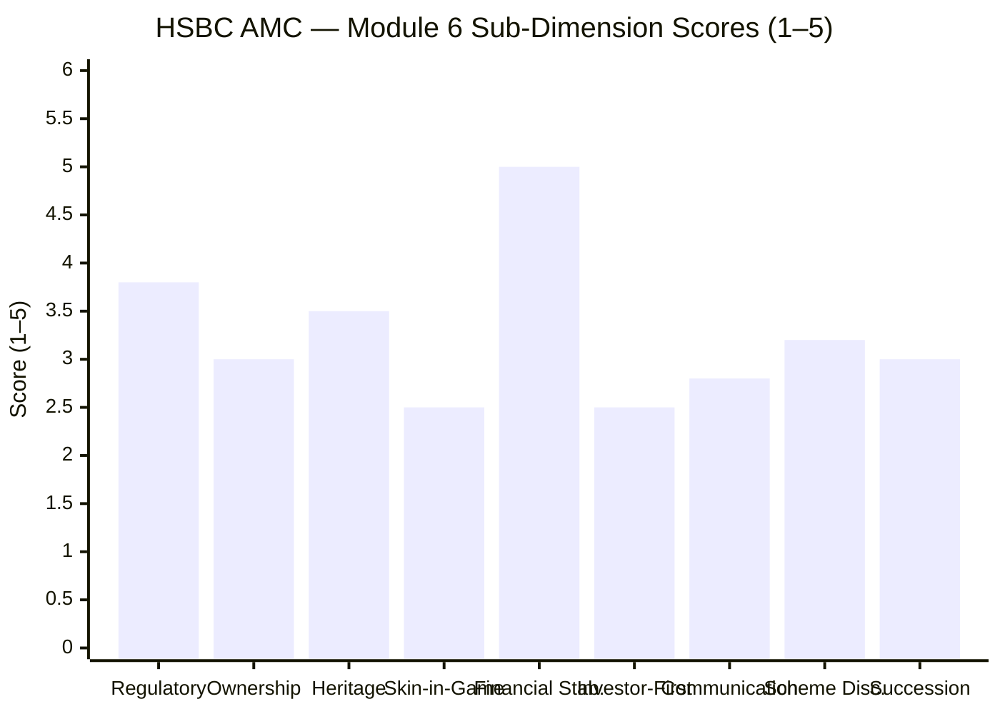

| Sub-Dimension | Score (1–5) | Reasoning |
|---|---|---|
| Regulatory cleanliness | **3.8** | ₹5L §15HB (investment documentation lapse, L&T-era); worse than DSP's ₹2L ETF slip because it sits closer to investment process; no new violations under HSBC ownership; all managers personally clean |
| Ownership independence | **3.0** | 100% foreign bank-owned; captive distribution conflict; India historically non-core (2016 retail exit); no family wealth or founder identity at stake; but $425M bet signals genuine strategic commitment |
| Heritage and institutional depth | **3.5** | 160-yr global parent + $3.23T financial depth; 24-yr India AMC; but heritage is grafted (L&T fund + HSBC AMC + global parent on separate timelines); not the continuous Indian equity DNA that DSP has; Manghat's own process is the deepest heritage this fund has |
| Skin-in-the-game | **2.5** | Not disclosed; no institutional mandate known; SEBI minimum lock-in of variable pay is compliance, not culture; consistent with other bank-owned AMCs in this study |
| AMC financial stability | **5.0** | $3.23T parent with $29.9B PAT (2025); zero financial stress risk; no comparable financial backstop in either study; research infrastructure, talent, and operations will never be cut due to funding pressure |
| Investor-first culture | **2.5** | Never restricted flows despite growing to ₹16,877 Cr; distribution-focused CEO; no documented investor-first decisions that cost the AMC money; open-door policy is the clearest negative signal in Module 6 |
| Investor communication | **2.8** | Monthly factsheets and standard disclosures present; no quarterly letters; CEO not publicly active on investment philosophy; Manghat's VRO disclosures (M5) are the only investor-education bright spot; structural communication gap vs DSP and Bandhan |
| Scheme discipline | **3.2** | ~44 distinct schemes at ₹1.36L Cr is reasonable; average AUM per scheme (~₹3,093 Cr) above economic scale; post-merger consolidation largely complete; some residual overlap risk; the CIO-generalist managing 7 schemes is the key concern |
| Succession and continuity | **3.0** | Kulkarni and Manghat retained post-acquisition (3 years); but both are acquired-talent, not HSBC-grown leaders; Kulkarni's longer-term succession is unclear; India-priority risk if HSBC global strategy shifts; integration still maturing |
| **Module 6 Overall** | **3.4 / 5** | Fortress financial parent is a genuine 5/5 strength; everything else is below DSP and Bandhan; the bank-owned incentive structure, open-door AUM policy, distribution-focused leadership, and undisclosed skin-in-game paint a consistent picture of an AMC that optimises for AUM over investor protection |

---

## Comparative Module 6 Scores — All Studied Small Cap Funds

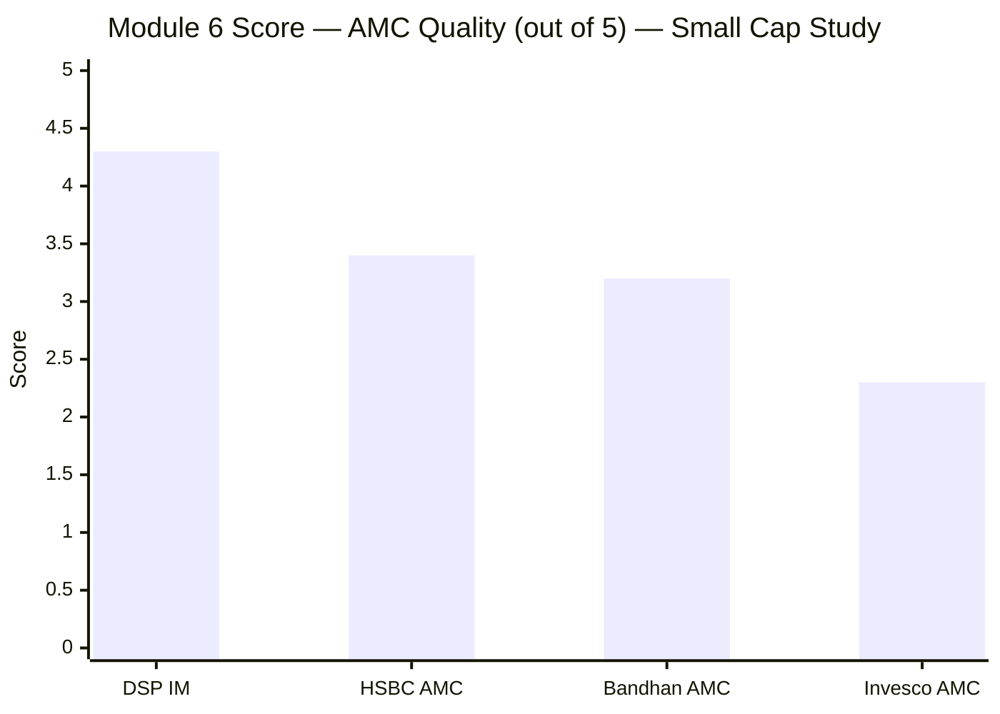

| Rank | AMC | Score | Key Differentiator |
|---|---|---|---|
| 1 | **DSP Investment Managers** | **4.3/5** | 160-yr continuous Indian heritage; all-employee skin-in-game; flow discipline (closed 2017–2020); Parekh's investor-education culture; essentially clean 30-yr regulatory record |
| 2 | **HSBC Asset Management India** | **3.4/5** | Fortress parent ($3.23T); acquired competence (Kulkarni+Manghat from L&T); clean post-2022; dragged by bank-owned conflict, open-door culture, §15HB legacy, undisclosed skin-in-game |
| 3 | **Bandhan AMC** | **3.2/5** | 25-yr zero-penalty clean record (IDFC heritage); PE-clock ownership risk; no flow restrictions; equity maturity is building; moderate communication |
| 4 | **Invesco AMC** | **2.3/5** | ₹4.98 Cr SEBI settlement (investor-harmful); CEO named in settlement; 4 ownership changes in 19 years; IIHL/IndusInd Bank governance link; multiple jurisdiction probes |

**HSBC vs Bandhan:** HSBC edges Bandhan (3.4 vs 3.2) primarily on financial stability (the $3.23T parent is a meaningful structural advantage over Bandhan's PE consortium) and on regulatory severity (₹5L §15HB < ₹0 clean record, but Bandhan's clean record only wins on regulatory cleanliness; on ownership and culture, Bandhan's PE-era uncertainty is roughly equivalent to HSBC's bank-ownership conflict). The margin is narrow and defensible either way.

---

## One-Line Verdict

HSBC Asset Management India is a financially unassailable but investor-misaligned institution — backed by one of the world's largest banks with no financial-stress risk whatsoever, yet operating the exact AUM-first, open-door culture that bank-owned fund houses are structurally incentivised to run, with an investment-documentation regulatory legacy, an undisclosed skin-in-game stance, and a distribution-focused CEO who has never publicly sacrificed a rupee of fee revenue for investor protection.

---

## Module 6 Final Score: **3.4 / 5**

> **Module Weight:** 5% | **Weighted Contribution to Final Score:** 3.4 × 0.05 = **0.170**

---

## HSBC Small Cap Fund — Complete Final Score (All 6 Modules)

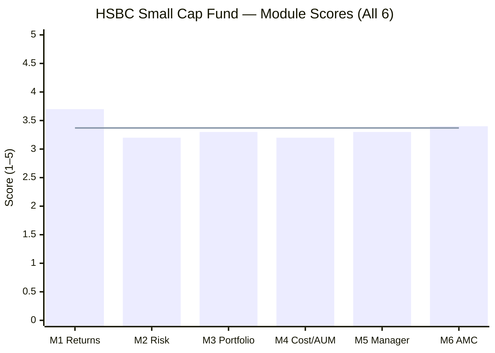

> Line = HSBC SC weighted final score (3.37/5)

| Module | Topic | Weight | Score | Weighted |
|---|---|---|---|---|
| Module 1 | Returns Consistency | 25% | 3.7 / 5 | 0.9250 |
| Module 2 | Risk Profile | 20% | 3.2 / 5 | 0.6400 |
| Module 3 | Portfolio DNA | 15% | 3.3 / 5 | 0.4950 |
| Module 4 | Cost & AUM Impact | 20% | 3.2 / 5 | 0.6400 |
| Module 5 | Fund Manager Quality | 15% | 3.3 / 5 | 0.4950 |
| **Module 6** | **AMC Quality** | **5%** | **3.4 / 5** | **0.1700** |
| **TOTAL** | | **100%** | | **3.37 / 5.00** |

> **HSBC Small Cap Fund Final Score: 3.37 / 5** — ranked 3rd of 3 fully studied small cap funds (DSP: 4.00/5 | Bandhan: 3.33/5 | HSBC: 3.37/5)

---

## Small Cap Study — Full Rankings (3 Funds Complete)

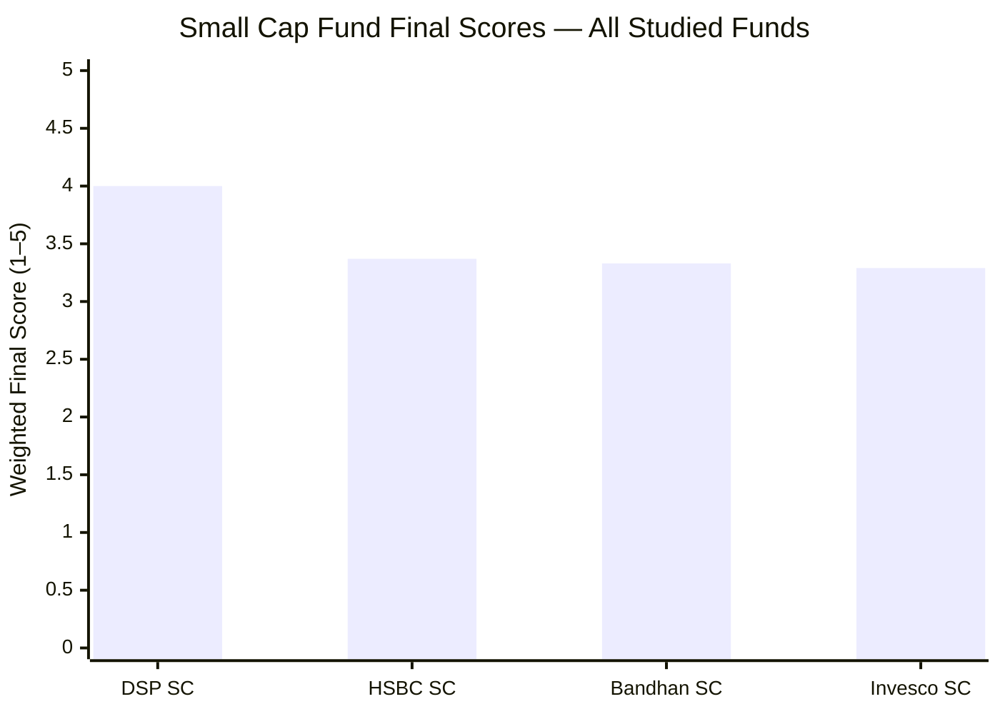

| Rank | Fund | Final Score | Verdict |
|---|---|---|---|
| **1** | DSP Small Cap | **4.00 / 5** | Elite quality across all dimensions; only credible SIP candidate |
| **2** | HSBC Small Cap | **3.37 / 5** | Genuine 12-yr heritage, COVID-tested manager, fortress parent — let down by AUM-first culture, open-door policy, highest cost, and index-hugging construction |
| **3** | Bandhan Small Cap | **3.33 / 5** | Near-zero cost, clean AMC, 25-yr heritage — but inception-era performance bias, limited stress-testing history, PE-clock ownership risk |
| **4** | Invesco Small Cap | **3.29 / 5** | Reasonable SC purity, good momentum — offset by SEBI settlement (CEO named), 4 ownership changes, highest D-R gap, weakest AMC quality in study |

> **Ranking note:** HSBC (3.37) and Bandhan (3.33) are separated by only 0.04 points — within normal margin of scoring variance. The honest read is that these two are effectively tied for 2nd/3rd, with their relative ranking likely to be influenced by which fund's risks (HSBC: AUM/capacity/alignment risk; Bandhan: history-length/PE-exit risk) the investor weights more heavily.

---

*Module 6 complete. HSBC Small Cap Fund full analysis across all 6 modules is now complete. Final weighted score: 3.37/5.*

*Module 6 completed: June 2026 | AMC Quality | Sources: HSBC official governance page, HSBC Holdings Annual Results 2025, Cafemutual (Kulkarni profile), VRO (L&T acquisition), Business Standard (acquisition details), HSBC SAI (custodian/RTA), SEBI (§15HB order), Macrotrends (HSBC financials)*

*Next: [BOI Small Cap Fund — Module 1](../../boi/module1_returns.md)*
