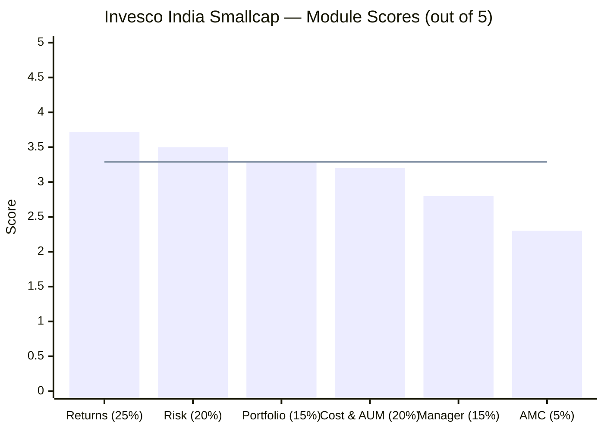
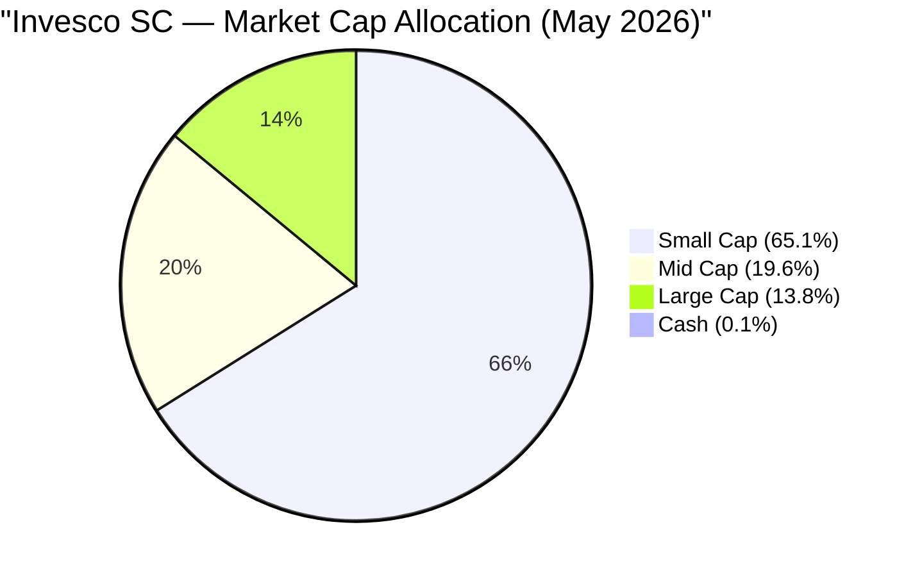
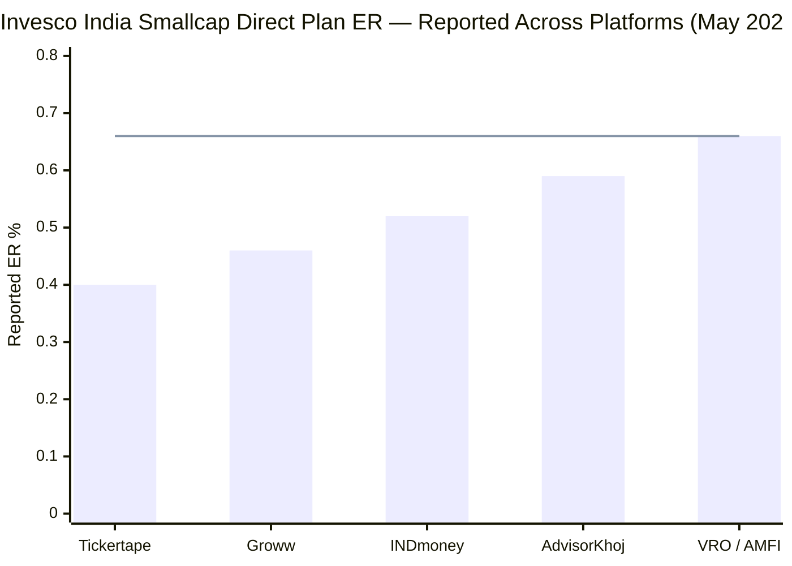
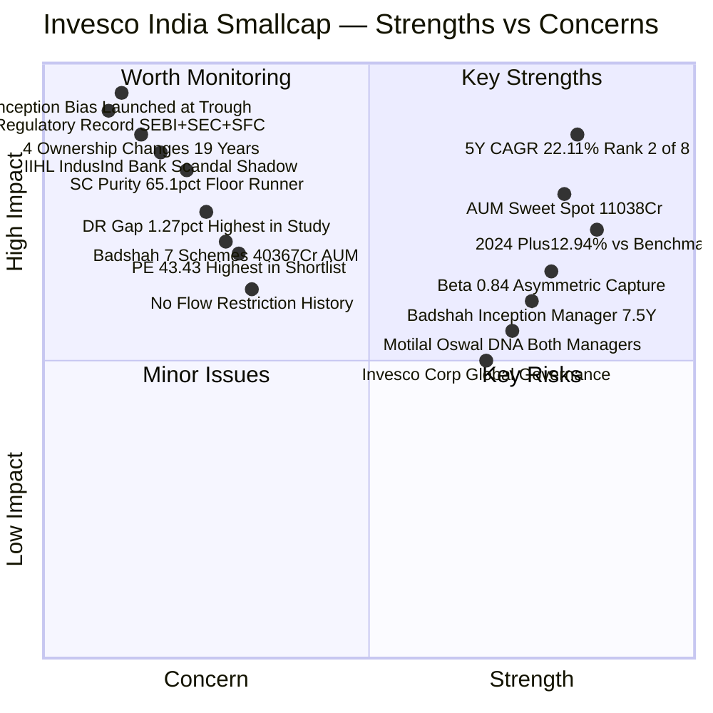
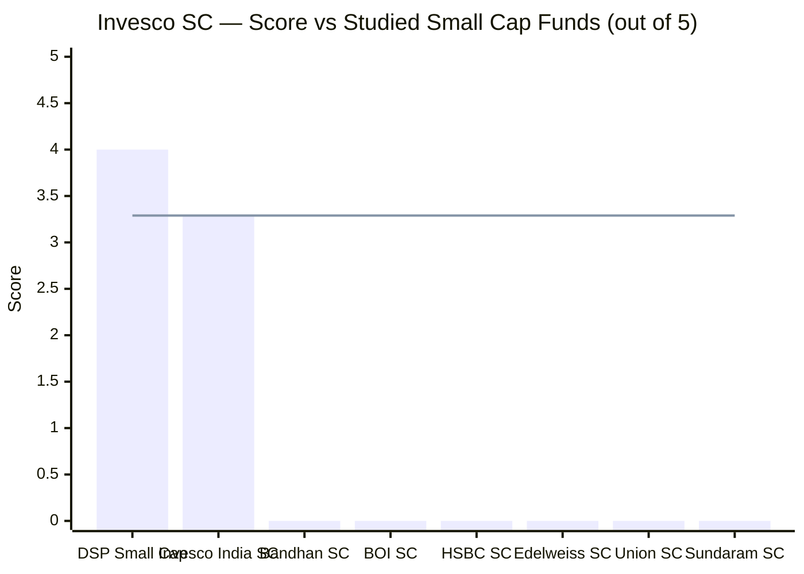
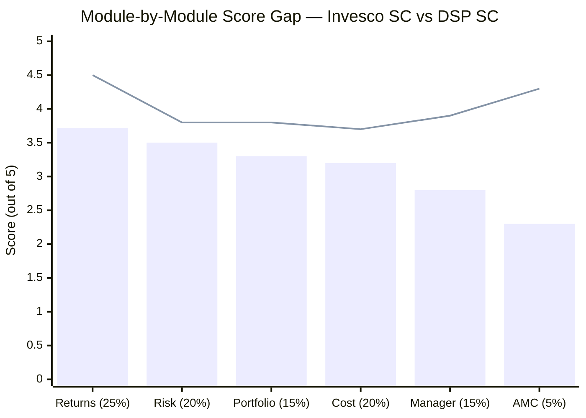
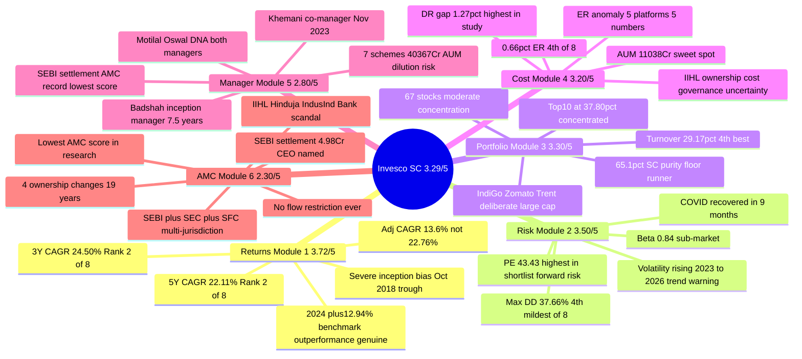

# Invesco India Smallcap Fund — Deep Study

## Fund Identity

| Field | Value |
|-------|-------|
| AMC | Invesco Asset Management (India) Private Limited |
| AMC Heritage | Lotus India AMC (2006) → Religare AMC (2008) → Religare Invesco AMC (2013) → Invesco AMC (2016) → IIHL 60% + Invesco Corp 40% (Nov 2025) |
| Fund Inception | October 30, 2018 |
| Manager Since | October 30, 2018 — Taher Badshah (since inception) |
| Co-Manager Since | November 9, 2023 — Aditya Khemani |
| Category | Small Cap Fund (Equity) |
| Benchmark | BSE 250 SmallCap TRI |
| AUM (Direct Plan) | ₹11,038 Cr (Apr 2026) |
| Expense Ratio (Direct) | **0.66%** (VRO / AMFI canonical — see ER Anomaly) |
| Expense Ratio (Regular) | 1.93% |
| Direct-Regular Gap | **1.27%** — highest of all studied funds |
| NAV (Direct Growth, May 2026) | ₹47.47 |
| Exit Load | 1% if redeemed within 365 days; Nil after |
| Min SIP | ₹100 |
| Min Lumpsum | ₹100 |
| Lock-in | None |
| Star Rating (Value Research) | **5-star** |
| INDmoney Rank | **#2 of 18** in Small Cap category |

---

## The One-Line Context

Invesco India Smallcap Fund is a surface-impressive, structurally-complex fund — posting #2 raw returns in its category (22.11% 5Y CAGR, 24.50% 3Y CAGR) with a 5-star VRO rating — but virtually every headline number is inflated by the most severe inception bias in the shortlist (launched at the IL&FS crash trough on October 30, 2018), while beneath the surface lies the most troubled governance story of any AMC in this research: **4 ownership changes in 19 years, a ₹4.98 Cr SEBI settlement naming the CEO, a multi-jurisdiction probe (SEBI + SEC + SFC), a whistleblower, ~50% of the fixed-income team resigning, and a new majority owner (IIHL/Hinduja) whose promoted bank just collapsed under a ₹1,960 Cr derivative accounting scandal** — all of which compress a genuinely capable fund to a final score of 3.29/5.

---

## Module Status

| Module | Weight | Status | Score | File |
|--------|--------|--------|-------|------|
| 1 — Returns Consistency | 25% | Complete | 3.72/5 | [module1_returns.md](module1_returns.md) |
| 2 — Risk Profile | 20% | Complete | 3.50/5 | [module2_risk.md](module2_risk.md) |
| 3 — Portfolio DNA | 15% | Complete | 3.30/5 | [module3_portfolio.md](module3_portfolio.md) |
| 4 — Cost & AUM Impact | 20% | Complete | 3.20/5 | [module4_cost.md](module4_cost.md) |
| 5 — Fund Manager Quality | 15% | Complete | 2.80/5 | [module5_manager.md](module5_manager.md) |
| 6 — AMC Quality | 5% | Complete | 2.30/5 | [module6_amc.md](module6_amc.md) |

---

## Final Scorecard


> Bars = module scores | Line = overall weighted score (3.29/5)

| Module | Score | Weight | Weighted Score |
|--------|-------|--------|---------------|
| 1 — Returns Consistency | 3.72/5 | 25% | 0.9300 |
| 2 — Risk Profile | 3.50/5 | 20% | 0.7000 |
| 3 — Portfolio DNA | 3.30/5 | 15% | 0.4950 |
| 4 — Cost & AUM Impact | 3.20/5 | 20% | 0.6400 |
| 5 — Fund Manager Quality | 2.80/5 | 15% | 0.4200 |
| 6 — AMC Quality | 2.30/5 | 5% | 0.1150 |
| **Overall** | — | **100%** | **3.29 / 5.00** |

---

## Key Performance Metrics

| Metric | Value | Context |
|--------|-------|---------|
| 1Y CAGR | 8.98% | +6.92% above benchmark (benchmark returned only +2.06%); genuine current-period alpha |
| 3Y CAGR | **24.50%** | **#2 of 8 shortlisted SC funds** (only inception-biased Bandhan higher) |
| **5Y CAGR** | **22.11%** | **#2 of 8 shortlisted SC funds** — 2.93% above DSP (benchmark fund) |
| Since Inception (7.55Y) | 22.76% | ⚠️ **Severely inception-biased** — launched at IL&FS crash trough |
| Inception-Adjusted CAGR | **~13.6%** | What the CAGR would be if fund had started Jan 2018 (pre-crash) |
| Since Inception SIP XIRR | 24.18% | ₹17.80L invested over 89 months → ₹44.55L (2.5× in 7.4 years) |
| 5Y SIP XIRR | 19.32% | ₹12L invested → ₹19.13L |
| Max Drawdown | 37.66% | **4th best (mildest) of 8** — but measured from crash-trough inception |
| COVID Crash (Feb–Mar 2020) | -36.10% peak-to-trough | Recovered in ~9 months — fastest in shortlist |
| Sharpe Ratio (INDmoney) | 0.96 | Strong; Tickertape shows 0.302 (methodology artefact) |
| Sortino Ratio | 1.52 | Excellent downside-specific risk management |
| Beta (3Y) | 0.83–0.84 | Sub-market volatility — moves 84% as much as index |
| Calmar Ratio | 0.587 | Reasonable for a small cap mandate |
| Portfolio PE | **43.43** | **Highest of all 8 shortlisted funds** — 37% premium to category average (31.60) |
| Portfolio Turnover | **29.17%** | **4th lowest of 8** — implied avg holding period ~3.4 years |

---

## Portfolio DNA

| Metric | Value | Significance |
|--------|-------|--------------|
| **Small Cap %** | **65.1%** | **⚠️ SEBI floor runner — just 0.1pp above mandatory 65% minimum** |
| Mid Cap % | 19.2–19.6% | Deliberate mid-cap allocation — full use of regulatory headroom |
| Large Cap % | **13.8%** | Deliberate large-cap holdings; IndiGo, Zomato, Trent, Max Healthcare |
| Cash & Equivalents | ~0.1% | Near-fully invested; no deployment friction at current AUM |
| Total Holdings | **67 stocks** | Concentrated-to-moderate; 81 for DSP |
| Top 5 Concentration | ~21.50% | Moderate-high |
| Top 10 Concentration | **37.80%** | Concentrated; top 10 = more than one-third of portfolio |
| Portfolio Turnover | 29.17% | 4th lowest — multi-year conviction holding, not momentum trading |
| Portfolio PE | 43.43 | 37% above category; implies high growth expectations priced in |
| **Effective SC Corpus** | **₹7,186 Cr** | 65.1% × ₹11,038 Cr — actual small cap AUM under management |
| AUM Sweet Spot | ₹11,038 Cr | 1% position = ₹110 Cr; buildable in 5–8 trading days in genuine SC stocks |

### Top Holdings (May 2026, approximate)

| Rank | Stock | Weight | Category | Note |
|------|-------|--------|----------|------|
| 1 | Amber Enterprises | ~4.87% | Small Cap | AC components — core conviction |
| 2 | InterGlobe Aviation (IndiGo) | ~3.9% | **Large Cap** | Deliberate large-cap position |
| 3 | Eternal (Zomato) | ~3.7% | **Large Cap** | Tech-led consumer — growth bet |
| 4 | Trent | ~3.5% | **Large Cap** | Retail compounder — lifestyle play |
| 5 | Max Healthcare | ~3.4% | Large/Mid Cap | Healthcare infrastructure play |
| 6–10 | Mix of SC/MC | ~18.0% | Varied | Diversified conviction basket |

> The presence of IndiGo, Zomato, and Trent in a "Small Cap" fund is deliberate, documented, and the most structurally distinctive feature of Invesco's portfolio construction. These are not mid-cap graduates — they were always large caps, purchased deliberately under the 35% non-SC SEBI allowance.



---

## ⚠️ The Inception Bias — Most Important Context

**Every return metric must be read with this lens.**

| Date | Event |
|------|-------|
| January 2018 | Nifty SC250 TRI at peak — small cap bull market height |
| Jan–Oct 2018 | IL&FS crisis: Nifty SC250 crashes ~45% peak-to-trough |
| **October 30, 2018** | **Invesco India Smallcap Fund launches — at the exact crash trough** |
| 2019–2026 | Entire fund history = post-crash recovery + two bull markets |

The since-inception CAGR (22.76%) measures from the bottom of the IL&FS crash. An investor who started a year earlier (Jan 2018, pre-crash) would have seen an inception-adjusted CAGR of ~13.6%. The rolling 3Y distribution showing 0% loss probability and a 19.07% floor is measured entirely from crash-trough windows — not comparable to DSP's 13-year distribution that includes genuine bear markets.

**What is genuine:** The 1Y alpha (+6.92%), the 2024 outperformance (+12.94% vs benchmark), the 2019/2022/2025 defensive quality — these are current-period, unaffected by the inception date.

---

## ⚠️ The ER Anomaly — Five Platforms, Five Numbers


> Line = AMFI-canonical rate (0.66%) | Every platform below VRO shows a stale/cached figure

No other fund in this shortlist has this discrepancy. Tickertape's 0.40% — used in Stage 1 screening — is 0.26pp below the AMFI-declared rate. The canonical figure is **0.66%** (ValueResearchOnline pulling directly from AMFI). This is the widest platform discrepancy of any fund in this research.

---

## Strengths vs Concerns



---

## Key Strengths

- **#2 raw returns in the 8-fund shortlist (5Y: 22.11%, 3Y: 24.50%)** — only inception-biased Bandhan (Jan 2020 launch) ranks higher on headline CAGR; Invesco's 5Y window includes the 2022 correction and is more defensible than Bandhan's pure bull-market track
- **AUM ₹11,038 Cr — sweet-spot execution zone** — 1% position = ₹110 Cr, buildable in 5–8 trading days in genuine SC stocks; not constrained by scale, not too small for research infrastructure; the effective SC corpus (₹7,186 Cr after 65.1% allocation) is even more manageable
- **2024: +12.94% benchmark outperformance in an up-market year** — most quality-oriented funds sacrifice alpha in strong bull years; Invesco captured the full rally and added 12.94 percentage points above the benchmark; the single clearest evidence of genuine stock selection skill
- **Defensive quality in down/flat years** — 2019: +13.84% vs benchmark -8.27%; 2022: +0.91% (positive in a negative year); 2025: +4.44% vs benchmark -6.01%; fund consistently protects capital when the small cap category is under stress
- **Beta 0.83–0.84 with above-market returns** — sub-market volatility combined with consistently above-market CAGR is the ideal asymmetric risk-return profile; achieved through genuine quality bias, not leverage
- **Motilal Oswal DNA — both co-managers share the same analytical framework** — Taher Badshah (SVP Head of Equities, Motilal Oswal 2010–2016) and Aditya Khemani both trained in the same growth-quality compounding philosophy; no philosophical dissonance between the two managers
- **Sortino Ratio 1.52 (INDmoney)** — excellent downside-specific risk management; the fund earns strong returns without disproportionate downside volatility; most of the volatility is upside volatility
- **Portfolio turnover 29.17% — 4th lowest of 8** — multi-year conviction holding, not momentum trading; implied average holding period ~3.4 years; consistent with the quality investment framework
- **VRO 5★ + INDmoney #2/18** — independently rated top-tier by the two most widely-used Indian MF research platforms; reflects strong risk-adjusted return profile within its available history
- **Invesco Corp retains 40% minority stake post-IIHL acquisition** — global AM ($1.7T AUM) retains governance oversight, investment philosophy continuity rights, and brand control; acts as an institutional check on potential Hinduja distribution-first impulses
- **COVID recovery in ~9 months — fastest in shortlist** — from -36.10% trough (March 23, 2020) to pre-crash level by end of 2020; demonstrated genuine quality of underlying portfolio in the fund's most important stress event

---

## Key Concerns

- **Severe inception bias — launched October 30, 2018 at the IL&FS crash trough** — the single most important risk to interpreting Invesco's numbers; inception-adjusted CAGR ~13.6% vs stated 22.76%; the fund has never been managed through the *start* of a small cap bear market; all rolling return statistics (0% loss probability, 19.07% minimum 3Y CAGR) are measured from a crash-bottom starting point, not a comparable base to DSP's 13-year distribution

- **AMC regulatory record — most serious of any fund studied** — the full sequence: (a) Internal whistleblower (2021) alleging debt scheme misappropriation; (b) ~50% of fixed-income team resigned (2021–2022) in institutional collapse; (c) Multi-jurisdiction probe — SEBI (India) + SEC (USA) + SFC (Hong Kong) simultaneously; (d) SEBI settlement ₹4.98 Cr (April 2024) for inter-scheme transfers, PMS/MF segregation failure, pre-arranged trades, with CEO Saurabh Nanavati named. This is not a procedural penalty — it is substantive investor harm

- **4 ownership changes in 19 years — most ownership instability in the study** — Lotus (2006) → Religare (2008) → Invesco JV (2013) → Invesco 100% (2016) → IIHL 60% (2025); each change introduces institutional uncertainty; based on this base rate, a 10-year SIP starting 2026 will almost certainly experience another change within the holding period

- **IIHL/Hinduja acquisition shadow — IndusInd Bank governance crisis** — IIHL's most prominent promoted entity (IndusInd Bank) disclosed a ₹1,960 Cr derivative accounting lapse in 2025; CEO Sumant Kathpalia, Deputy CEO Arun Khurana, and CFO Govind Jain all resigned; this is the organisation now controlling 60% of Invesco India AMC; the new majority owner has a documented recent governance failure at a large financial institution

- **SC purity 65.1% — SEBI floor runner** — only 0.1pp above the mandatory 65% minimum; 13.8% deliberate large-cap exposure (IndiGo, Zomato, Trent); effective SC corpus ₹7,186 Cr, not the full ₹11,038 Cr; an investor buying "small cap satellite exposure" is receiving a product 34.9% deployed in mid and large caps

- **Direct-Regular gap 1.27% — highest of all studied funds** — Regular plan ER of 1.93% vs Direct 0.66%; an investor in the regular plan loses ₹9.1L over a 10-year ₹20K SIP vs the direct plan; this gap also signals an AMC that prices the regular plan aggressively (distribution-friendly), consistent with the IIHL distribution-first acquisition rationale

- **Badshah manages 7 schemes totalling ₹40,367 Cr** — the Smallcap fund is ~27% of his mandate; the CIO title adds AMC-wide executive responsibility; DSP's Sambre manages 2–3 schemes with full focus; attention dilution is the most structurally underdiscussed risk for Invesco SC investors

- **Portfolio PE 43.43 — highest of all 8 shortlisted funds, 37% above category average** — expensive valuations are priced-in; any earnings disappointment in high-PE holdings (IndiGo, Zomato, Trent at large-cap segment) or the SC basket will produce sharper corrections than low-PE peers; the highest forward risk profile in the shortlist despite the best-looking backward metrics

- **No flow restriction history** — DSP restricted this fund three times (2014, 2017, 2020) at real commercial cost, demonstrating investor-first discipline at scale; Invesco has never restricted flows despite AUM reaching ₹11,038 Cr and rising; flow discipline is the single clearest indicator of investor-vs-AUM priority; its absence is a documented gap

- **SEBI settlement named CEO Nanavati — who is still in position** — Saurabh Nanavati has been CEO since 2008, survived all 4 ownership changes, and was named in the April 2024 SEBI settlement; regulatory accountability did not produce leadership change; this raises questions about internal accountability culture

---

## Comparison vs Small Cap Shortlist


> Line = Invesco score (3.29/5) as reference | 6 peers not yet studied

| Rank | Fund | Score | Status | Key Differentiator |
|------|------|-------|--------|--------------------|
| **1** | **DSP Small Cap** | **4.00/5** | ✅ Complete | 14Y manager tenure; all-employee skin-in-game; 87.35% SC purity; flow restriction discipline |
| **2** | **Invesco India SC** | **3.29/5** | ✅ Complete | Raw return leadership; AUM sweet spot; vs. governance/regulatory tail risk |
| — | Bandhan Small Cap | Pending | — | Extreme inception bias (Jan 2020); highest raw CAGR numbers |
| — | BOI Small Cap | Pending | — | Smallest AUM (₹1,770 Cr); highest Sharpe (0.491) |
| — | HSBC Small Cap | Pending | — | 3Y CAGR below benchmark — possible elimination candidate |
| — | Edelweiss Small Cap | Pending | — | — |
| — | Union Small Cap | Pending | — | Highest Tickertape alpha (7.89) |
| — | Sundaram Small Cap | Pending | — | Longest track record (20Y+) |

---

## Score Gap Analysis — Invesco vs DSP


> Bars = Invesco SC | Line = DSP SC

| Module | Invesco | DSP | Gap | Primary Driver of Gap |
|--------|---------|-----|-----|-----------------------|
| Returns (25%) | 3.72 | 4.50 | **−0.78** | No 10Y CAGR; severe inception bias; no bear-cycle data |
| Risk (20%) | 3.50 | 3.80 | **−0.30** | PE 43.43 (highest); rising volatility trend; inception-biased risk metrics |
| Portfolio (15%) | 3.30 | 3.80 | **−0.50** | 65.1% SC vs 87.35%; large-cap holdings in SC mandate; higher concentration |
| Cost (20%) | 3.20 | 3.70 | **−0.50** | 1.27% D-R gap (highest); ER anomaly; no flow restriction history; IIHL ownership uncertainty |
| Manager (15%) | 2.80 | 3.90 | **−1.10** | 7 schemes vs 2–3; no FCA; AMC regulatory record; CIO dual role |
| AMC (5%) | 2.30 | 4.30 | **−2.00** | 4 ownership changes vs 1; ₹4.98 Cr settlement vs ₹2L; multi-jurisdiction probe; IndusInd shadow |
| **Overall** | **3.29** | **4.00** | **−0.71** | Governance/regulatory record is the dominant differentiator |

**Key insight:** Invesco's returns module gap (−0.78) is partially explained by the very factor that makes its raw numbers look good — the inception bias. Remove the bias advantage, and the returns module would likely be closer to parity. The M5 (−1.10) and M6 (−2.00) gaps are the largest, and both reflect structural governance concerns rather than investment capability differences.

---

## ₹20K/Month SIP Projections (10 Years)

| Scenario | CAGR Assumption | Projected Corpus | Multiple of Principal |
|----------|----------------|------------------|-----------------------|
| Bear case (crash + governance drag) | 12% | ₹46.3 lakh | 1.93× |
| Conservative (category mean reversion) | 16% | ₹61.2 lakh | 2.55× |
| Base case (quality SC compounding) | 19% | ₹74.2 lakh | 3.09× |
| Optimistic (recent trajectory) | 22% | ₹88.4 lakh | 3.68× |

**Total invested over 10 years:** ₹24,00,000

**ER cost comparison on identical gross returns (19% CAGR):**
- Invesco at 0.66% ER: ~₹5.2L total cost over 10Y ₹20K SIP
- Bandhan at 0.34%: ~₹2.7L (saves ₹2.5L vs Invesco)
- DSP at 0.64%: ~₹5.0L (near-parity with Invesco)
- Regular plan at 1.93%: ~₹15.1L (**costs ₹9.9L more than Invesco Direct** — the 1.27% D-R gap in pounds of compounding flesh)

> Note: The 22–24% SIP XIRR seen in since-inception data is almost entirely a function of the crash-trough starting point. Future SIPs starting at normal NAV levels (not crash bottoms) should target 16–20% as the realistic range.

---

## Investment Decision Framework

```mermaid
flowchart TD
    A[Considering Invesco India Smallcap?] --> B{Comfortable with genuine<br/>small cap volatility?<br/>Potential drawdown 35–50%}
    B -->|No| C[Consider a FlexiCap fund —<br/>PPFAS or BOI FlexiCap for<br/>smoother equity exposure]
    B -->|Yes| D{Does the raw return story<br/>account for inception bias?<br/>Adj. CAGR ~13.6%, not 22.76%}
    D -->|No - need to understand this first| E[Read Module 1 inception bias section<br/>before committing capital —<br/>the headline numbers are misleading]
    D -->|Yes - understood the bias| F{Comfortable with AMC<br/>governance record?<br/>SEBI settlement + multi-jurisdiction probe}
    F -->|No| G[Consider DSP SC or BOI SC —<br/>cleaner institutional track records;<br/>governance is non-negotiable for 10Y SIP]
    F -->|Yes - tail risk accepted| H{Is 65.1% SC purity<br/>acceptable?<br/>34.9% in mid + large cap}
    H -->|No - want genuine SC exposure| I[Consider DSP SC (87.35% SC)<br/>or Bandhan SC for higher<br/>small cap concentration]
    H -->|Yes - blend approach acceptable| J{Comfortable with IIHL<br/>ownership and IndusInd<br/>Bank governance overhang?}
    J -->|No| K[Monitor for 12–18 months post-acquisition<br/>to see if culture/cost changes manifest;<br/>consider DSP SC as primary position meanwhile]
    J -->|Yes - risk accepted| L[Invesco SC is potentially<br/>suited to your profile<br/>— with monitoring conditions]
    L --> M[Use DIRECT plan only<br/>0.66% ER — regular 1.93% costs<br/>₹9.9L extra over 10Y SIP]
    L --> N[Monitor ER for upward drift<br/>post-IIHL — distribution-first<br/>owner may push regular plan harder]
    L --> O[Review annually: Has AMC<br/>restricted flows yet? If AUM<br/>exceeds ₹20,000 Cr without gate, concern rises]
    L --> P[Accept that the Large-Cap holdings<br/>IndiGo/Zomato/Trent mean this is a<br/>blend fund, not a pure SC satellite]
```

---

## Invesco vs DSP — Which Fund for Which Investor

| Dimension | DSP Small Cap | Invesco India SC | Winner for... |
|-----------|--------------|-----------------|---------------|
| SC purity | 87.35% — genuine SC | 65.1% — floor runner | SC purity seekers → DSP |
| Raw 5Y CAGR | 19.18% | 22.11% | Return-maximisers (with bias caveat) → Invesco |
| Track record | 13.4 years (genuine cycles) | 7.55 years (no bear cycle) | Cycle-tested conviction → DSP |
| AMC governance | 1 minor SEBI penalty in 30Y | ₹4.98 Cr settlement, multi-jurisdiction probe | Governance-conscious → DSP |
| Ownership stability | 1 change (BlackRock → Kothari, self-initiated) | 4 changes in 19Y | Long-term stability → DSP |
| Manager focus | Sambre: 2–3 schemes only | Badshah: 7 schemes + CIO | Focused mandate → DSP |
| AUM manageability | ₹17,906 Cr (constraint zone) | ₹11,038 Cr (sweet spot) | Execution flexibility → Invesco |
| Flow discipline | Restricted 3× (investor-first) | Never restricted | Institutional trust → DSP |
| Minimum invest | ₹500 lumpsum | **₹100 lumpsum + ₹100 SIP** | Maximum accessibility → Invesco |
| All-employee SIG | All 508 employees (institutional) | SEBI-minimum only | Skin-in-game → DSP |
| ER (canonical) | 0.64% (5th of 8) | 0.66% (4th of 8) | Near-parity — slight edge Invesco |

**If you can hold only one SC fund:** DSP, for governance discipline and genuine through-cycle track record.  
**If complementing DSP with a second SC fund:** Invesco, for AUM sweet spot and the blend/growth-oriented portfolio style that diversifies DSP's pure-SC quality-value approach.

---

## Invesco India Smallcap — In One View



---

## The Critical Facts — In 10 Sentences

1. Invesco India Smallcap was launched on October 30, 2018 — the exact trough of the IL&FS crash — making every since-inception return metric start from the best possible entry point.
2. The inception-adjusted CAGR is ~13.6%, not the stated 22.76%; the rolling 3Y distribution's 0% loss probability is entirely an artefact of this crash-trough origin.
3. The fund holds only 65.1% in small-cap stocks — barely above SEBI's mandatory 65% floor — with IndiGo, Zomato, Trent, and Max Healthcare as deliberate large-cap positions; this is a blend fund in a small-cap wrapper.
4. The portfolio PE of 43.43 is the highest of all 8 shortlisted funds, 37% above the category average — the most expensive forward risk profile despite the best-looking backward metrics.
5. Taher Badshah manages 7 schemes totalling ₹40,367 Cr while simultaneously holding the President & CIO title — the Smallcap fund is 27% of his mandate, not the primary focus.
6. Invesco AMC has the most serious regulatory record of any AMC in this research: ₹4.98 Cr SEBI settlement (inter-scheme transfers, CEO named), simultaneous probes by SEBI + SEC + SFC, an internal whistleblower, and ~50% of the fixed-income team resigning.
7. The AMC has changed controlling ownership four times in 19 years — the most of any AMC studied — and the November 2025 acquisition by IIHL/Hinduja Group coincides with IndusInd Bank's ₹1,960 Cr derivative accounting scandal (the new owner's most prominent promoted entity, whose CEO, Deputy CEO, and CFO all resigned).
8. The 1.27% Direct-Regular gap is the highest of all studied funds — the regular plan charges 1.93% vs 0.66% Direct — costing an investor ₹9.9L extra over a 10-year ₹20K SIP.
9. Despite all of the above, the fund's genuine current-period quality is real: 2024's +12.94% benchmark outperformance (in an up market), consistent defensive protection in 2019/2022/2025 (down/flat years), Beta 0.83 with above-market returns, and a COVID recovery of ~9 months are unaffected by inception date or ownership history.
10. The final score of 3.29/5 reflects this tension: returns and risk are well-managed, but portfolio structure, cost governance, manager focus, and — most substantially — AMC institutional quality drag the fund well below DSP's 4.00/5 benchmark.

---

## Quick Verdict

**Best suited for:**
- Investors who **understand the inception bias** and still want exposure to a capable, growth-oriented manager at a ₹11,000 Cr AUM that is in the execution sweet spot
- Those seeking **AUM-unconstrained genuine SC execution** — DSP at ₹17,906 Cr is entering deployment friction; Invesco at ₹11,038 Cr is not
- Investors building a **complementary second position to DSP SC** — Invesco's blend/growth style, larger non-SC allocation, and different sector bets (e.g. IndiGo, Zomato vs DSP's Consumer Cyclical) provide genuine portfolio diversification within the SC category
- Those with **explicit risk appetite** for governance tail risk and ownership instability — investors who price such risks at lower probability than the base rate suggests, and are compensated by the raw return edge
- **Maximum accessibility investors** — ₹100 SIP / ₹100 lumpsum minimum is the most accessible in the shortlist; ideal for first-time investors building toward a larger SC allocation

**Not suited for:**
- Investors who **take the 22.76% since-inception CAGR at face value** without reading the inception bias section — this fund is not the top-quartile performer the headline suggests on a through-cycle basis
- Those who **require pure small-cap satellite exposure** — 34.9% in non-SC stocks means this fund's payoff profile is structurally closer to a multi-cap or flex-cap than a pure small-cap satellite; DSP at 87.35% SC is the correct fund for pure SC conviction
- **Governance-sensitive investors** — the SEBI settlement (CEO named), multi-jurisdiction probe (SEBI + SEC + SFC), whistleblower, and IIHL acquisition shadow are non-trivial; investors who cannot accept institutional regulatory risk in a 10-year holding should choose DSP or BOI SC
- Those who need **documented flow discipline and investor-first institutional culture** — Invesco has never restricted flows; DSP's three flow restrictions are a documented institutional commitment that Invesco cannot match
- **Investors tracking the regular plan** — 1.93% ER vs 0.66% Direct; the 1.27% gap costs ₹9.9L over 10 years; there is no scenario where the regular plan is the correct choice for a self-directed investor

---

## One-Line Verdict

Invesco India Smallcap Fund is a genuinely capable quality-blend manager in an AUM sweet spot, producing real alpha (+7.18% lifetime, +12.94% in 2024 alone) — but packaged inside the most regulatory-troubled AMC in this study, launched at the best possible inception date, holding only the SEBI-minimum small cap allocation, with a CIO managing 7 schemes under the control of a new majority owner whose promoted bank just collapsed under a governance scandal — making the 3.29/5 score not a verdict on investment skill, but on the institutional risk an investor takes alongside that skill.

---

## Compared to All Studied Funds

| Dimension | Invesco SC | DSP SC | Best FlexiCap (PP) | Context |
|-----------|-----------|--------|-------------------|---------|
| 5Y CAGR | **22.11%** | 19.18% | 16.60% | SC satellite advantage confirmed |
| 3Y CAGR | **24.50%** | 20.64% | 17.67% | Invesco leads on medium-term returns |
| Inception-adjusted CAGR | ~13.6% | **~20.85% (genuine)** | ~18% (genuine) | DSP's adjusted CAGR is far superior |
| SC purity | 65.1% | **87.35%** | Flex (by design) | DSP is the genuine SC satellite |
| AMC regulatory record | Most troubled | Near-clean | Near-clean | Invesco is the outlier |
| Ownership stability | 4 changes in 19Y | 1 change (self-initiated) | 0 changes | DSP and PP are clearly superior |
| Manager focus | 7 schemes (diluted) | 2–3 schemes (focused) | 3–4 schemes | DSP most focused |
| Flow discipline | Never restricted | 3× restricted | N/A | DSP demonstrates investor-first culture |
| AUM manageability | **₹11,038 Cr (sweet spot)** | ₹17,906 Cr (constraint zone) | ₹1.41 lakh Cr (unconstrained) | Invesco is the execution-efficiency leader |
| Minimum SIP | **₹100** | ₹100 | ₹1,000 | Invesco and DSP tied at lowest |
| Final Score | 3.29/5 | **4.00/5** | 4.20/5 | SC shortlist: DSP leads; PP leads FlexiCap |

---

*Study completed: June 2026 | Framework: 6-Module Weighted Scoring | Final Score: 3.29/5 | Small Cap Rank: #2 of 2 evaluated (8 funds shortlisted; 6 pending)*
