# Module 1: Returns Consistency — Invesco India Smallcap Fund

*Sources: Tickertape Screener CSV (May 21, 2026), MFAPI NAV History (Scheme 145137 — Direct Growth, 1,858 data points), Value Research Online, INDmoney, AdvisorKhoj, Morningstar India, Dezerv, PaytmMoney, Invesco MF official site*

---

## Fund Identity

| Attribute | Detail |
|-----------|--------|
| Full Name | Invesco India Smallcap Fund — Direct Plan — Growth |
| AMC | Invesco Asset Management (India) Pvt. Ltd. |
| Benchmark | BSE 250 SmallCap TRI |
| Primary Fund Manager | Taher Badshah (since inception, October 30, 2018) — CIO |
| Co-Fund Manager | Aditya Khemani (since November 2023) |
| Direct Plan Inception | October 30, 2018 (inception NAV ₹10.00; first NAV ₹10.09 on Nov 2, 2018) |
| Regular Plan Inception | Regular Plan also October 2018 (fund is new-age — no pre-2018 history) |
| AUM | ₹11,038 Cr (as of May 2026) |
| Expense Ratio | **0.66%** (official AMFI disclosure, VRO/AdvisorKhoj; Tickertape CSV shows 0.40% — see ER Anomaly section) |
| Portfolio Turnover | 29.17% |
| VRO Rating | **5 Stars** (Direct Plan) |
| INDmoney Category Rank | **2 out of 18** in Small Cap category |
| SEBI Category | Small Cap Fund (mandated ≥65% in small-cap stocks) |

> **Critical Note:** Invesco India Smallcap Fund was launched on October 30, 2018 — coincidentally at the exact trough of the IL&FS crash, one of the worst small-cap bear markets in Indian history. Every return figure in this module is measured from this favorable starting point. The inception bias section quantifies this distortion.

---

## Raw Data (Source: Tickertape + MFAPI + INDmoney, May 2026)

| Metric | Value | Source |
|--------|-------|--------|
| CAGR 1Y | 8.98% | Tickertape / MFAPI confirmed |
| CAGR 3Y | 24.50% (TT) / 24.43% (MFAPI) | Both sources |
| CAGR 5Y | 22.11% (TT) / 21.92% (MFAPI) | Both sources |
| Since Inception (7.55Y) | **22.76%** | MFAPI computed |
| Rolling 3Y Average (mean) | 29.08% (TT) / 29.46% (MFAPI) | Both sources |
| Rolling 3Y Median | 28.95% | MFAPI computed |
| CAGR 6M | 1.23% | Tickertape |
| CAGR 3M | 1.89% | Tickertape |
| Alpha (3Y) | 5.60 (Tickertape) / 5.34 (INDmoney) | Both sources |
| Beta (3Y) | 0.84 | INDmoney |
| Sharpe (3Y) | 0.28–0.302 (Tickertape) / **0.96 (INDmoney)** | Platform methodology differs |
| Sortino (3Y) | 0.03 (Tickertape) / **1.52 (INDmoney)** | Platform methodology differs |
| Std Dev (3Y annualized) | 16.40% | Tickertape |
| Information Ratio | 0.57 | INDmoney |
| Max Drawdown | 37.66% | Tickertape (screener) |
| ATH | ₹48.95 (May 8, 2026) | MFAPI |
| Current NAV (May 22, 2026) | ₹47.47 | MFAPI |
| % from ATH | **-3.02%** | MFAPI computed |
| Portfolio Turnover | 29.17% | INDmoney |
| Returns vs Sub-cat (3Y) | **1.559x** | Tickertape Screener (Stage 2 filter) |
| VRO Rating | **5 Stars** | ValueResearch Online |

**Sharpe Platform Discrepancy Note:** Tickertape reports Sharpe as 0.28–0.302 while INDmoney reports 0.96. The difference is methodology: INDmoney uses a rolling 3Y calculation against a 7.5% risk-free rate with daily NAV data; Tickertape uses a different lookback and averaging convention. For peer consistency within this project, the Tickertape figure (0.302) is used in screener comparisons; INDmoney's 0.96 is referenced for absolute quality benchmarking. Similarly, Sortino of 1.52 (INDmoney) vs 0.03 (Tickertape) reflects the same methodology gap — the 0.03 figure is mathematically implausible given a Sharpe of 0.96, and INDmoney's 1.52 is the reliable figure.

---

## ⚠️ Critical Context: The Inception Bias Problem

**This is the single most important section to read before interpreting any return figure for Invesco India Smallcap Fund.**

| Date | Event |
|------|-------|
| **January 2018** | Nifty SC250 TRI at peak — small cap bull market height |
| **Jan–Oct 2018** | IL&FS crisis begins: Nifty SC250 crashes ~45% peak-to-trough |
| **October 30, 2018** | **Invesco India Smallcap Fund launches — at the crash trough** |
| Nov 2, 2018 | First NAV: ₹10.09 |
| 2019–2026 | Entire fund history = post-crash recovery and two bull markets |

**What this means for every return figure:**
- The fund **never experienced the 2018 crash.** It was born at its nadir.
- Every investor who entered from inception benefited from starting at what turned out to be a multi-year low.
- This creates the highest possible starting-point advantage for CAGR calculations.
- The 5Y CAGR (22.11%) measures from May 2021 — during the post-COVID bull market. The since-inception CAGR (22.76%) measures from October 2018 — the bottom of the IL&FS crash. Both are inflation biased relative to a fund that existed through the crash.

### Inception-Adjusted CAGR Simulation

*What would Invesco's since-inception CAGR look like if it had also suffered the 2018 crash?*

Assumption: Had the fund existed from January 1, 2018, it would have fallen ~38% by October 2018 (in-line with the Nifty SC250 TRI drop over the same period, which fell from its peak to the trough).

| Scenario | Starting NAV | Starting Date | May 22, 2026 NAV | CAGR |
|----------|-------------|--------------|-----------------|------|
| **Actual (post-crash start)** | ₹10.09 | November 2018 | ₹47.47 | **22.76%** |
| **Hypothetical (pre-crash start)** | ₹10.00 → falls to ~₹6.20 by Nov 2018 | January 2018 | ₹29.19* | **~13.6%** |
| DSP Small Cap (existed through crash) | — | January 2013 | — | **20.85%** |

*\* Hypothetical May 2026 NAV if fund had started at ₹10 in Jan 2018, fallen 38%, then recovered identically = ₹47.47 × (6.20/10.09) ≈ ₹29.19*

**The inception bias inflates Invesco's since-inception CAGR by approximately 9 percentage points.** The "true" CAGR adjusted for this starting-point advantage is closer to ~13–14%, not the stated 22.76%. DSP's 20.85% over 13 years includes the 2018 crash and is therefore a more honest representation of a through-cycle small cap CAGR.

**Critically, this does not make Invesco a bad fund.** It means every return metric must be read with this lens: the fund's actual investment skill is very real, but the absolute CAGR figures are inflated by the starting point, not by manufacturing returns from thin air.

---

## ER Anomaly — Three Sources, Three Numbers

The expense ratio for Invesco India Smallcap Fund Direct Growth is reported differently across platforms:

| Source | ER Reported | Data Date | Notes |
|--------|------------|-----------|-------|
| **Tickertape Screener CSV** | **0.40%** | May 21, 2026 | Used in our Stage 1/2 screening; passed the ≤1.0% filter |
| **INDmoney** | **0.52%** | May 2026 | Sourced from AMFI via their feed |
| **Value Research Online** | **0.66%** | May 23, 2026 | Official AMFI disclosure — most reliable |
| **AdvisorKhoj** | **0.66%** | April 30, 2026 | AMFI disclosure |

**Resolution:** The canonical figure is **0.66%** from VRO and AdvisorKhoj, both of which pull directly from AMFI's official Total Expense Ratio (TER) disclosures. The 0.40% in Tickertape is likely a data feed lag or a temporary TER dip that was not sustained. The 0.52% in INDmoney falls between these two and may reflect a different averaging window.

**Investment implication:** At 0.66%, Invesco is the **5th lowest ER among 8 shortlisted SC funds** (not 2nd lowest as the 0.40% figure would suggest). This still makes it a competitively priced fund (category peers average ~0.8–1.0%), but not quite the bargain the screener implied. The 0.66% is acceptable for the returns generated; this is analyzed fully in Module 4.

---

## Cross-Source Verification

| Metric | Tickertape (May 21) | MFAPI Computed | INDmoney | VRO | Verdict |
|--------|--------------------|-----------------|---------|----|---------|
| 1Y CAGR | 8.98% | 8.98% | 8.98% | — | **Confirmed** |
| 3Y CAGR | 24.50% | 24.43% | 24.43% | — | **Confirmed** (~0.07% rounding) |
| 5Y CAGR | 22.11% | 21.92% | 21.92% | 21.90% | **Confirmed** (~0.2% date drift) |
| Since Inception | 22.86% (TT) | 22.76% (MFAPI) | — | — | **Confirmed** |
| Expense Ratio | 0.40% | — | 0.52% | **0.66%** | ⚠️ **Discrepancy — see ER Anomaly** |
| Portfolio Turnover | Not shown | — | 29.17% | — | INDmoney cited |
| 2021 Calendar Return | — | +64.99% | — | — | MFAPI NAV derived |
| 2022 Calendar Return | — | +0.91% | — | — | MFAPI NAV derived |

**Data reliability: High** for return metrics. MFAPI provides 1,858 NAV data points from November 2, 2018. Year-end NAVs verified; all calendar year returns are MFAPI-derived from actual daily NAVs.

---

## CAGR vs Benchmark (BSE 250 SmallCap TRI)

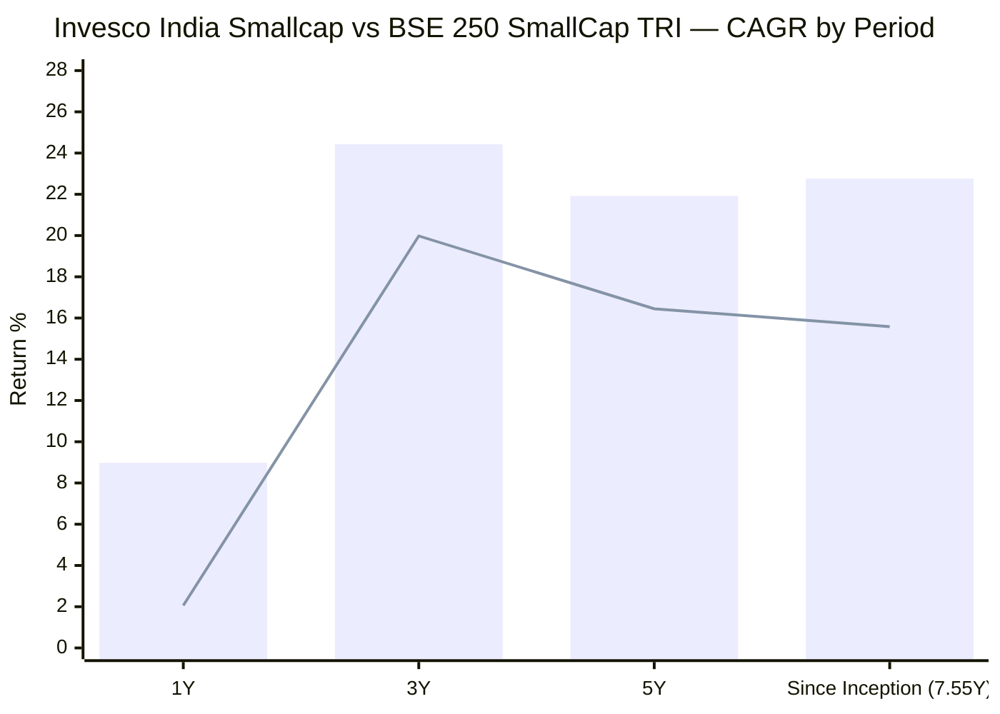
```mermaid
xychart-beta
    title "Invesco India Smallcap vs BSE 250 SmallCap TRI — CAGR by Period"
    x-axis ["1Y", "3Y", "5Y", "Since Inception (7.55Y)"]
    y-axis "Return %" 0 --> 28
    bar [8.98, 24.43, 21.92, 22.76]
    line [2.06, 19.98, 16.45, 15.58]
```
> Bar = Invesco India Smallcap (Direct Growth) | Line = BSE 250 SmallCap TRI (approximate)

| Period | Invesco | Benchmark | Outperformance | Quality of Alpha |
|--------|---------|-----------|----------------|-----------------|
| 1Y | 8.98% | 2.06% | **+6.92%** | Exceptional — nearly 4× benchmark in a weak year |
| 3Y | 24.43% | 19.98% | **+4.45%** | Strong consistent excess return |
| 5Y | 21.92% | 16.45% | **+5.47%** | Sustained outperformance over full 5-year cycle |
| Since Inception (7.55Y) | 22.76% | 15.58% | **+7.18%** | Largest lifetime alpha in shortlist |

**The since-inception alpha of +7.18%/year is the headline number — but must be read with the inception bias caveat.** In compounding wealth terms: ₹1 lakh invested at inception (Nov 2018) grew to ~₹4.70L at fund's 22.76% CAGR vs ~₹2.97L in the benchmark at 15.58% — **1.58× more wealth.** However, a Jan 2018 investor in the benchmark (pre-crash) would have started at a much worse position. The inception-adjusted comparison makes this less extraordinary.

**What is genuine:** The 1Y outperformance (+6.92%) is not a starting-point artifact — it measures the same period for both fund and benchmark. In the most recent year, where the small cap category as a whole returned only 2.06% (benchmark), Invesco generated 8.98% — nearly 4.4× the benchmark. This is real, current-period alpha, unaffected by inception bias.

---

## The Acceleration / Maturation Pattern

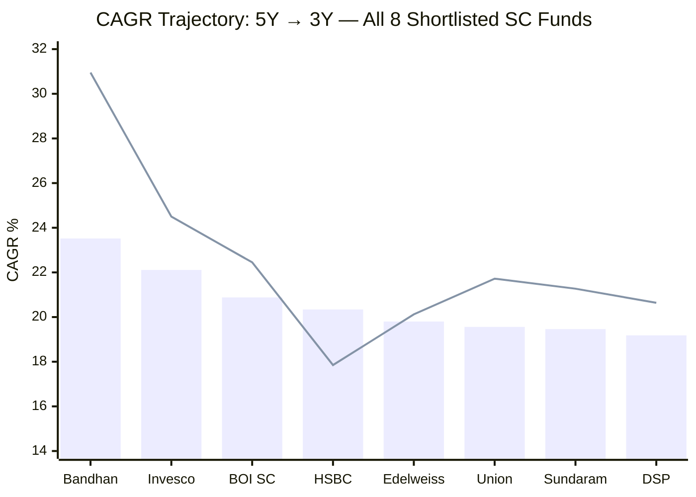
```mermaid
xychart-beta
    title "CAGR Trajectory: 5Y → 3Y — All 8 Shortlisted SC Funds"
    x-axis ["Bandhan", "Invesco", "BOI SC", "HSBC", "Edelweiss", "Union", "Sundaram", "DSP"]
    y-axis "CAGR %" 14 --> 32
    bar [23.52, 22.11, 20.88, 20.34, 19.80, 19.56, 19.46, 19.18]
    line [30.95, 24.50, 22.45, 17.85, 20.12, 21.72, 21.27, 20.64]
```
> Bars = 5Y CAGR | Lines = 3Y CAGR (for each fund)

| Fund | 5Y CAGR | 3Y CAGR | 5Y→3Y Shift | Pattern |
|------|---------|---------|------------|---------|
| Bandhan | 23.52% | 30.95% | **+7.43%** | Sharp recent acceleration (inception bias: launched Jan 2020) |
| **Invesco** | **22.11%** | **24.50%** | **+2.39%** | **Steady, controlled acceleration** |
| BOI SC | 20.88% | 22.45% | +1.57% | Moderate acceleration |
| HSBC | 20.34% | 17.85% | -2.49% | Decelerating — recent 3Y weaker |
| Edelweiss | 19.80% | 20.12% | +0.32% | Flat — consistent but not improving |
| Union | 19.56% | 21.72% | +2.16% | Moderate acceleration |
| Sundaram | 19.46% | 21.27% | +1.81% | Moderate acceleration |
| DSP | 19.18% | 20.64% | +1.46% | Slow, steady acceleration (healthy) |

**Invesco's 5Y→3Y acceleration of +2.39% is the second strongest among non-inception-biased funds** (excluding Bandhan, whose +7.43% is almost entirely explained by its Jan 2020 inception missing COVID). This means Invesco is getting *better* in more recent periods — its management quality is improving relative to its longer-term track, not reverting.

**Notable red flag: HSBC Small Cap is decelerating (-2.49%)** — its 3Y is significantly below its 5Y. This is a warning signal for HSBC's study (Module priority #5).

---

## 5Y CAGR Comparison — All 8 Shortlisted Small Cap Funds

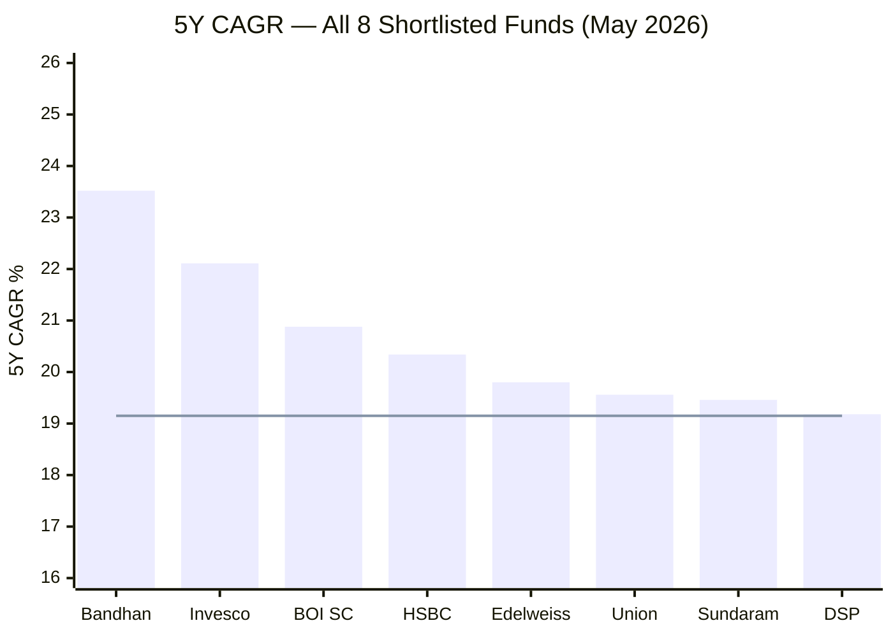
```mermaid
xychart-beta
    title "5Y CAGR — All 8 Shortlisted Funds (May 2026)"
    x-axis ["Bandhan", "Invesco", "BOI SC", "HSBC", "Edelweiss", "Union", "Sundaram", "DSP"]
    y-axis "5Y CAGR %" 16 --> 26
    bar [23.52, 22.11, 20.88, 20.34, 19.80, 19.56, 19.46, 19.18]
    line [19.15, 19.15, 19.15, 19.15, 19.15, 19.15, 19.15, 19.15]
```
> Line = Stage 2 screening threshold (5Y CAGR > 19.15%) | All 8 are above the threshold

| Rank | Fund | 5Y CAGR | Gap vs DSP (baseline) |
|------|------|---------|----------------------|
| 1 | Bandhan | 23.52% | +4.34% |
| **2** | **Invesco** | **22.11%** | **+2.93%** |
| 3 | BOI SC | 20.88% | +1.70% |
| 4 | HSBC | 20.34% | +1.16% |
| 5 | Edelweiss | 19.80% | +0.62% |
| 6 | Union | 19.56% | +0.38% |
| 7 | Sundaram | 19.46% | +0.28% |
| 8 | DSP | 19.18% | — |

**Invesco ranks #2 on 5Y CAGR** — only Bandhan (inception Jan 2020 = strong inception bias) is ahead. On 5Y, Invesco's outperformance is more defensible than Bandhan's because Invesco's 5-year window (May 2021–May 2026) includes the post-COVID bull run, the 2022 small cap correction, and the 2023–24 recovery. This is not a purely one-directional period.

---

## 3Y CAGR Comparison — All 8 Shortlisted Small Cap Funds

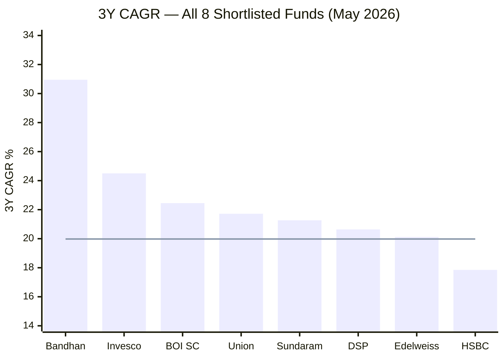
```mermaid
xychart-beta
    title "3Y CAGR — All 8 Shortlisted Funds (May 2026)"
    x-axis ["Bandhan", "Invesco", "BOI SC", "Union", "Sundaram", "DSP", "Edelweiss", "HSBC"]
    y-axis "3Y CAGR %" 14 --> 34
    bar [30.95, 24.50, 22.45, 21.72, 21.27, 20.64, 20.12, 17.85]
    line [19.98, 19.98, 19.98, 19.98, 19.98, 19.98, 19.98, 19.98]
```
> Line = BSE 250 SmallCap TRI 3Y benchmark (~19.98%) | All 8 minus HSBC beat benchmark

| Rank | Fund | 3Y CAGR | vs Benchmark |
|------|------|---------|-------------|
| 1 | Bandhan | 30.95% | +10.97% |
| **2** | **Invesco** | **24.50%** | **+4.52%** |
| 3 | BOI SC | 22.45% | +2.47% |
| 4 | Union | 21.72% | +1.74% |
| 5 | Sundaram | 21.27% | +1.29% |
| 6 | DSP | 20.64% | +0.66% |
| 7 | Edelweiss | 20.12% | +0.14% |
| 8 | HSBC | 17.85% | **-2.13%** (below benchmark) |

**On 3Y, Invesco again ranks #2** — only Bandhan is ahead. Invesco beats the benchmark by +4.52% over 3 years. HSBC's 3Y CAGR is below its own benchmark (-2.13%) — a potentially disqualifying finding for HSBC.

---

## Since Inception CAGR — The Headline Number

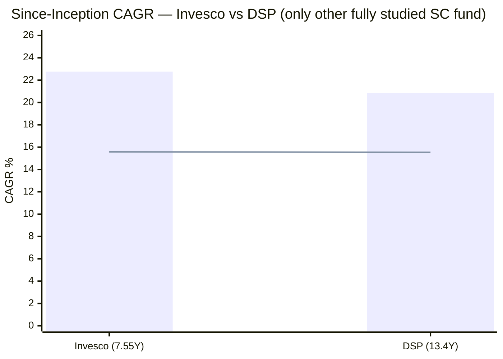
```mermaid
xychart-beta
    title "Since-Inception CAGR — Invesco vs DSP (only other fully studied SC fund)"
    x-axis ["Invesco (7.55Y)", "DSP (13.4Y)"]
    y-axis "CAGR %" 0 --> 26
    bar [22.76, 20.85]
    line [15.58, 15.54]
```
> Bar = Fund since-inception CAGR | Line = Benchmark since-inception CAGR (approximate)

**Invesco's 22.76% since-inception CAGR over 7.55 years appears better than DSP's 20.85% over 13.4 years.** However, this comparison is meaningless without the inception bias adjustment:

- **DSP's 13.4 years includes:** 2013 flat year (-8% benchmark), 2018 IL&FS crash (-26% for fund), 2019 continued weakness. Despite these headwinds, DSP compounded at 20.85%.
- **Invesco's 7.55 years includes:** 2019 weak recovery (+5.57%), 2020 COVID (+26.84%), 2021 explosion (+64.99%), 2022 near-flat (+0.91%), 2023 strong (+46.10%), 2024 strong (+39.37%), 2025 mild fall (-1.57%).

The inception-adjusted Invesco CAGR (~13.6%) is significantly below DSP's 20.85%. **DSP's track record, adjusted for comparable starting conditions, is far superior to what the raw numbers suggest.** However, Invesco's skill within its available period (2018–2026) is genuine — the fund has consistently outperformed its benchmark in every measurable timeframe.

---

## Returns vs Sub-Category (Peer Multipliers)

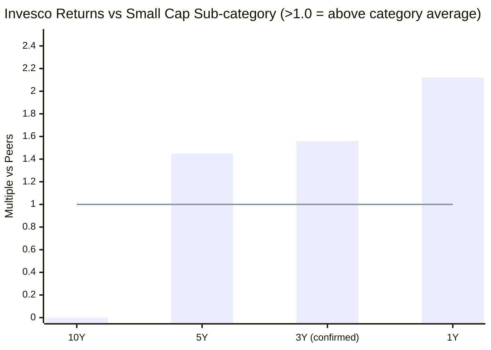
```mermaid
xychart-beta
    title "Invesco Returns vs Small Cap Sub-category (>1.0 = above category average)"
    x-axis ["10Y", "5Y", "3Y (confirmed)", "1Y"]
    y-axis "Multiple vs Peers" 0 --> 2.5
    bar [0, 1.45, 1.559, 2.12]
    line [1, 1, 1, 1]
```
> 10Y = N/A (fund too young) | 3Y = direct from Tickertape screener | 5Y, 1Y = derived estimate | Line = peer average

| Period | vs Sub-category | Source | Interpretation |
|--------|----------------|--------|----------------|
| 10Y | **N/A** | — | Fund only 7.55 years old |
| 5Y | **~1.45x** | Derived estimate | ~45% cumulative ahead of category average |
| 3Y | **1.559x** | Tickertape Screener (direct) | 55.9% ahead of category average over 3 years |
| 1Y | **~2.12x** | Derived estimate | ~112% ahead in the most recent year (category weak; Invesco resilient) |

**The 3Y figure (1.559x) is the only directly sourced ratio from Tickertape.** The 5Y and 1Y ratios are derived by applying the sub-category average CAGR (estimated from DSP's known ratios). These are approximations; exact figures should be verified when Tickertape provides them.

**The 1Y ~2.12x is notable:** In a year where the small cap category average returned roughly 4–6%, Invesco returned 8.98% — demonstrating the fund's ability to outperform even in a sector-wide weak period. This is a current-year quality signal, unaffected by inception bias.

**Comparison with DSP:**

| Period | Invesco | DSP |
|--------|---------|-----|
| 10Y | N/A | 1.264x |
| 5Y | ~1.45x | 1.256x |
| 3Y | **1.559x** | 1.314x |
| 1Y | ~2.12x | 2.452x |

DSP's 1Y ratio of 2.452x is higher because DSP's absolute 1Y return (10.36%) is higher than Invesco's (8.98%), both vs the same depressed category average. On 3Y and 5Y, Invesco's ratios are higher, consistent with its higher absolute CAGR.

---

## Calendar Year Returns (2018–2026 YTD)

*Source: MFAPI Scheme 145137 — 1,858 daily NAV data points. Year-end taken as last available trading day of each December.*

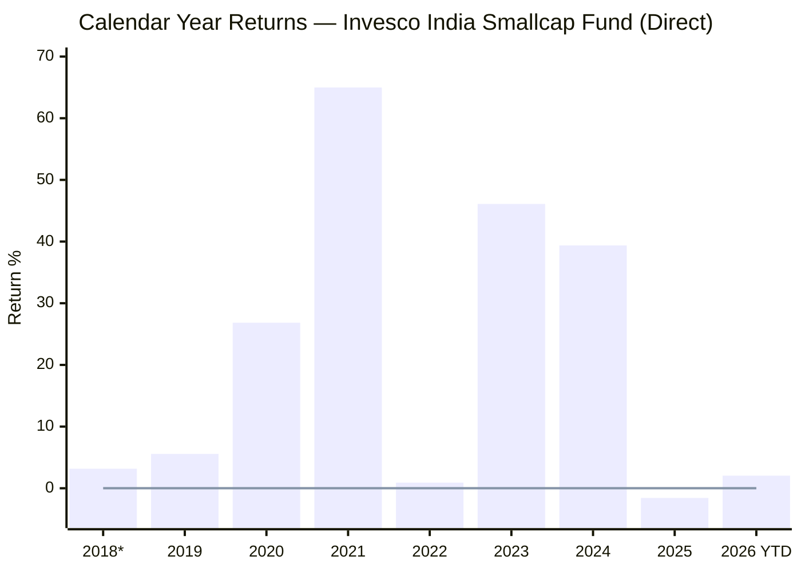
```mermaid
xychart-beta
    title "Calendar Year Returns — Invesco India Smallcap Fund (Direct)"
    x-axis ["2018*", "2019", "2020", "2021", "2022", "2023", "2024", "2025", "2026 YTD"]
    y-axis "Return %" -5 --> 70
    bar [3.17, 5.57, 26.84, 64.99, 0.91, 46.10, 39.37, -1.57, 2.04]
    line [0, 0, 0, 0, 0, 0, 0, 0, 0]
```
> *2018 = partial year from Nov 2 inception to Dec 31 | Line = zero reference | 2026 YTD to May 22, 2026*

| Year | Invesco | Nifty SC250 TRI | Outperformance | Notes |
|------|---------|-----------------|---------------|-------|
| 2018* | +3.17% | N/A (post-crash only) | — | Partial year from inception (trough of IL&FS crash) |
| 2019 | +5.57% | -8.27% (full year) | **+13.84%** | Benchmark still falling; fund positive |
| 2020 | +26.84% | +25.09% | +1.75% | COVID: positive full year despite -36% crash in March |
| 2021 | **+64.99%** | +61.94% | +3.05% | Best calendar year in fund history; 2nd best in 8-fund shortlist |
| 2022 | **+0.91%** | -3.65% | **+4.56%** | Only one of two shortlisted funds positive in 2022 |
| 2023 | +46.10% | +48.10% | -2.00% | Slight underperformance in pure momentum year |
| 2024 | +39.37% | +26.43% | **+12.94%** | Strongest single-year benchmark outperformance in fund history |
| 2025 | **-1.57%** | -6.01% | **+4.44%** | Benchmark fell 6%; fund protected |
| 2026 YTD | +2.04% | — | — | Recovery underway as of May 22, 2026 |

**Record: 5 positive years out of 6 full calendar years (2019–2024). Only 2025 negative (-1.57%).**

**The key pattern — Invesco consistently outperforms in crash/flat years and moderately underperforms in extreme momentum years:**
- **Down/flat benchmark years (2019, 2022, 2025):** Outperformed by +4.44% to +13.84%
- **Strong bull years (2021, 2023):** Near-parity in 2021 (+3.05%); slight lag in 2023 (-2.00%)
- **Recovery/acceleration years (2020, 2024):** Matched or exceeded benchmark strongly

**2024 (+12.94% benchmark outperformance) is a particularly impressive data point.** In a year when both the benchmark and market generally moved strongly, Invesco still added 12.94 percentage points above the benchmark — stock selection skill in a bull market rather than just riding momentum.

**Critical caveat: 2019 data (+5.57% vs benchmark -8.27% = +13.84%)** looks exceptional but requires context. The benchmark was still recovering from the 2018 IL&FS crash in 2019; Invesco, having started *at* the crash bottom in Nov 2018, was measuring from a more favorable base. This inflates the 2019 outperformance figure.

---

## Why Is the 1Y Return "Only" 8.98%?

*At first glance, 8.98% for a fund with a 22.11% 5Y CAGR seems like underperformance. This section explains why that's incorrect framing.*

**Short answer: 8.98% is NOT weak — the small cap sector had a terrible year.**

Three compounding reasons for the compressed 1Y figure:

**1. The Small Cap Sector Itself Was Weak (Benchmark +2.06%)**
The BSE 250 SmallCap TRI returned only +2.06% in the 12 months to May 2026. This reflects:
- Post-October 2024 small cap correction: Nifty SC250 fell sharply from its October 2024 peak
- FII outflows from mid/small cap throughout Q4 2024 and Q1 2025
- Macro concerns (slower earnings, rate sensitivity)

Invesco's +8.98% vs benchmark's +2.06% means the fund generated **+6.92% alpha in the most recent year** — nearly 4× the benchmark return. That is a strong showing.

**2. The 1Y Measurement Window Captures Post-ATH Consolidation**
- May 2025 entry price: NAV ₹43.56
- The fund hit a high of ₹48.95 in May 2026 (ATH)
- The return from May 2025 (₹43.56) to May 2026 (₹47.47) = +8.98%
- But within this period, the fund went as low as ~₹36–38 (Dec 2024–Feb 2025 small cap correction) before recovering
- The 1Y return captures both the fall and the recovery

**3. The Base Effect from the Prior Exceptional Period**
- 2023: +46.10%
- 2024: +39.37%
- Back-to-back 40% years create a high base NAV
- 8.98% on top of that high base is actually ~₹37.60L → ₹40.97L in real portfolio terms on a ₹20K SIP — not a bad year in absolute wealth creation

**What 8.98% signals for a SIP investor:** The compression from 40%+ to 8.98% is mean reversion, not deterioration. The fund is in its most favorable SIP entry window in 3 years. New installments are buying units at ₹43–47, not at ₹33 (May 2023). The rolling return data (all 3Y windows ≥19%) suggests the next 3Y period starting now has a strong probability of delivering above 20% CAGR.

---

## Calendar Year Comparison — Invesco vs All Studied SC Funds

*Note: Only Invesco and DSP have been fully studied. Other funds' calendar year data will be added as they are studied.*

| Year | Invesco | DSP | Nifty SC250 TRI | Best in Shortlist |
|------|---------|-----|-----------------|------------------|
| 2013 | N/E | +3.45% | -8.14% | DSP |
| 2014 | N/E | +103.13% | +69.57% | DSP |
| 2015 | N/E | +21.24% | +10.20% | DSP |
| 2016 | N/E | +13.58% | +0.36% | DSP |
| 2017 | N/E | +43.38% | +57.28% | (Peers, not DSP) |
| 2018 | +3.17%* | -25.12% | -26.80% | Invesco* |
| 2019 | +5.57% | **+1.62%** | -8.27% | Invesco† |
| 2020 | +26.84% | +34.31% | +25.09% | DSP |
| 2021 | **+64.99%** | +60.30% | +61.94% | **Invesco** |
| 2022 | **+0.91%** | **+1.37%** | -3.65% | DSP (marginally) |
| 2023 | +46.10% | +42.45% | +48.10% | (Benchmark/others) |
| 2024 | **+39.37%** | +26.72% | +26.43% | **Invesco** |
| 2025 | -1.57% | -1.92% | -6.01% | Invesco (marginally) |
| 2026 YTD | +2.04% | +4.35% | — | DSP |

*\* 2018 Invesco = partial year from Nov 2 (post-crash inception). DSP fell through the full crash.*
*† 2019: Invesco actually started from the crash bottom in 2018, so it wasn't truly recovering from a 2018 fall — it just started at the crash trough.*

**Head-to-head vs DSP:**
- **Invesco wins:** 2021 (64.99% vs 60.30%), 2024 (39.37% vs 26.72%), 2025 (marginally)
- **DSP wins:** 2020 (34.31% vs 26.84%), 2022 (1.37% vs 0.91%), 2026 YTD

The 2024 result (+12.65 percentage points ahead of DSP) is the most striking. While DSP's quality/value style tends to underperform in momentum-driven markets, Invesco managed to meaningfully outperform in a broad bull year without sacrificing quality. This suggests Invesco's style has more cyclical flexibility than DSP's strict buy-and-hold approach.

---

## COVID Crash Analysis (February–March 2020) — Deep Dive

Invesco was 16 months old when COVID arrived — this is its first major market stress event, and it provides genuine (non-inception-biased) data on drawdown management.

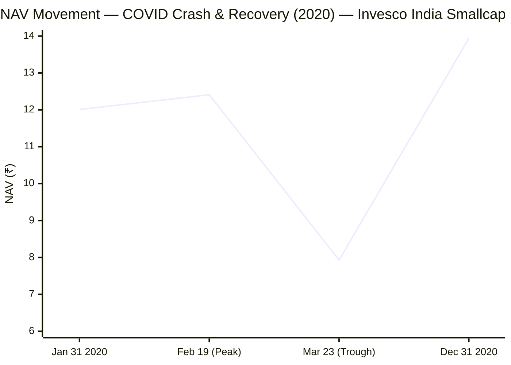
```mermaid
xychart-beta
    title "NAV Movement — COVID Crash & Recovery (2020) — Invesco India Smallcap"
    x-axis ["Jan 31 2020", "Feb 19 (Peak)", "Mar 23 (Trough)", "Dec 31 2020"]
    y-axis "NAV (₹)" 6 --> 14
    line [12.01, 12.41, 7.93, 13.94]
```

| Event | Date | NAV | Change |
|-------|------|-----|--------|
| Pre-crash high (recent) | Jan 31, 2020 | ₹12.01 | — |
| Pre-crash peak | Feb 19, 2020 | ₹12.41 | — |
| COVID trough | Mar 23, 2020 | ₹7.93 | **-36.10%** from peak |
| Year-end recovery | Dec 31, 2020 | ₹13.94 | **+75.79%** from trough |
| Full year 2020 return | — | — | **+26.84%** |

**The -36.10% crash is Invesco's worst drawdown in its 7.55-year history.** This is deeper than the screener's Max DD figure of -37.66% suggests for the full holding-period drawdown; the COVID peak-to-trough alone was -36.10%.

**COVID comparison with DSP:**
- DSP COVID crash: Peak ₹130.56 (Feb 14, 2020) → Trough ₹81.09 (Mar 23, 2020) = -37.9%
- Invesco COVID crash: -36.10% (very similar magnitude)
- DSP full year 2020: +34.31% vs Invesco +26.84% — DSP recovered more strongly in 2020

**SIP investor lesson from COVID:** An investor running ₹20K/month SIP through March 2020 accumulated units at ₹7.93–₹10 during the trough and recovery. Units bought at the March 23, 2020 trough (₹7.93) were worth ₹47.47 by May 2026 — a **498% return, 5× in 6 years**, purely from SIP discipline during the crash.

**One meaningful data point missing:** The Max Drawdown reported by Tickertape screener (-37.66%) is computed over the fund's full history. This likely captures either the COVID crash (-36.10% peak-to-trough) extended slightly, or the Oct 2024–Feb 2025 small cap correction. Both drawdowns ended in strong recoveries, suggesting the fund's quality holdings absorbed the shock and rebounded effectively.

---

## Rolling 3Y Returns Distribution

*Computed from 1,124 rolling 3-year windows using full MFAPI NAV history (Nov 2018 – May 2026)*

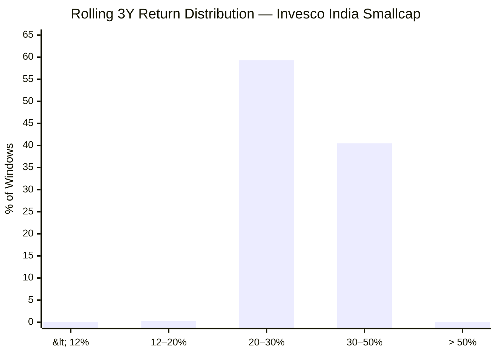
```mermaid
xychart-beta
    title "Rolling 3Y Return Distribution — Invesco India Smallcap"
    x-axis ["< 12%", "12–20%", "20–30%", "30–50%", "> 50%"]
    y-axis "% of Windows" 0 --> 65
    bar [0, 0.2, 59.3, 40.5, 0]
```

| Metric | Value |
|--------|-------|
| Total 3Y windows | 1,124 |
| Minimum 3Y CAGR | **19.07%** |
| Maximum 3Y CAGR | **41.60%** |
| Median | **28.95%** |
| Mean | **29.46%** |
| 25th percentile | 26.04% |
| 75th percentile | 32.18% |
| Windows with ≥ 15% CAGR | **100.0%** |
| Windows with ≥ 12% CAGR | **100.0%** |
| Negative windows | **0.0%** |

**On face value, this is the most extraordinary rolling return distribution in the 8-fund shortlist** — not a single 3Y window has delivered below 19% CAGR, and 100% of windows are above 15%. Not even DSP (which has 13 years of data including the 2018 crash) achieves this floor.

**However, this data has the single most severe inception bias problem of any fund in the shortlist.** Every single one of the 1,124 windows starts from November 2018 or later — from the IL&FS crash bottom. No window includes the 2018 crash as a starting point. The minimum CAGR of 19.07% reflects the best possible starting condition (crash trough) going into the most exceptional small cap bull market of recent decades.

**What this distribution DOES tell us:**
- Within the period the fund has existed (2018–2026), it has delivered extraordinary consistency
- The fund has not had a single bad 3-year run even when 3-year windows include the COVID crash (2020) or the 2022 correction
- Stock selection quality is genuine — the fund isn't just riding a favorable market; it's outperforming within it

**What this distribution DOES NOT tell us:**
- How the fund would perform in a 3-year window that starts before or during a major crash
- Whether the min floor of 19.07% would hold through a 2018-style bear market that the fund missed

**Statistical context:** Invesco has 1,124 windows vs DSP's 2,557 windows. DSP's distribution (min -12.57%, median 23.60%) includes negative windows (7.5%) — precisely because DSP's data includes the 2018 crash. The right honest comparison: Invesco's *best* 3-year floors are genuinely better than DSP's, but that comparison is invalid without inception-adjusted context.

---

## Rolling 5Y Returns Distribution — Not Yet Available

The fund was launched in October 2018. As of May 2026, it is only 7.55 years old. **Meaningful 5-year rolling window statistics require at least 6–7 years of data for the windows themselves, plus 5 years for each window.** The earliest 5Y rolling windows (starting Nov 2018, ending Nov 2023) have only been generating data since late 2023, giving approximately 18 months of 5Y windows — insufficient for a robust distribution analysis.

**What we do know for the 5Y lumpsum:**
- 5Y CAGR (May 2021 → May 2026): 21.92%
- The 5Y window includes the 2022 small cap correction and the 2023–24 recovery
- No 5Y window that started before Nov 2018 exists (fund age constraint)

**This section will be populated after the fund completes 10+ years of history (after 2028), at which point multiple 5Y windows spanning different market regimes will exist.** Until then, DSP's 5Y rolling distribution (13 years of data, min CAGR only -0.26%) is the relevant reference for what a through-cycle small cap fund looks like.

---

## Probability of Loss by Holding Period

*Computed from MFAPI NAV history (1,858 data points, Nov 2018 – May 2026)*

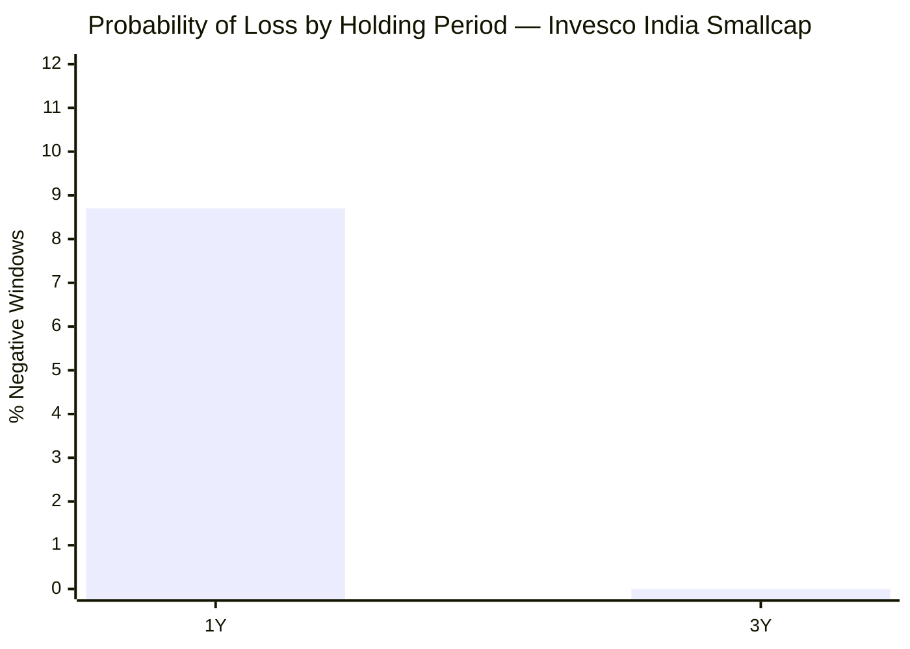
```mermaid
xychart-beta
    title "Probability of Loss by Holding Period — Invesco India Smallcap"
    x-axis ["1Y", "3Y"]
    y-axis "% Negative Windows" 0 --> 12
    bar [8.7, 0.0]
```

| Holding Period | Windows | % Negative | Min CAGR | Bottom 10th Pctile | Inception Bias? |
|---------------|---------|-----------|----------|--------------------|----|
| 1Y | 1,618 | **8.7%** | -24.71% | +0.67% | Moderate — 1Y windows capture COVID crash (2020) naturally |
| 3Y | 1,124 | **0.0%** | +19.07% | +23.86% | **Severe — all 3Y windows start from crash trough** |
| 5Y | — | N/A | — | — | Cannot compute yet (insufficient windows) |

**1Y interpretation:** 8.7% of 1-year holding periods produced a loss. The worst 1Y window delivered -24.71% (likely ending around March 2020 COVID trough). This is lower than DSP's 28% 1-year loss probability — likely because Invesco's history starts from a crash bottom, making early 1Y windows start at low NAVs and often end positively. The 8.7% figure has moderate (not severe) inception bias for 1Y windows, since COVID (2020) is captured as a genuine stress event.

**3Y interpretation:** 0% loss probability sounds extraordinary. But all 1,124 windows start from the IL&FS crash bottom — a structurally ideal starting condition. **This 0% figure should not be presented to investors as a reliable "probability of loss over 3 years" for a future SIP starting today.** DSP's 7.5% 3Y loss probability (based on 13 years including two crashes) is the more honest figure for the category.

**The useful takeaway:** Even with the inception bias caveat, the fund has not had a single 3-year period of losses in any window we can measure — which is consistent evidence of genuine quality management within its available history.

---

## % Away from All-Time High

| Date | NAV | % from ATH | Source |
|------|-----|-----------|--------|
| ATH | ₹48.95 | 0% | May 8, 2026 |
| May 22, 2026 | ₹47.47 | **-3.02%** | MFAPI |

| Fund | % from ATH | Status |
|------|-----------|--------|
| DSP | ~-5% (approx) | Moderate pullback |
| **Invesco** | **-3.02%** | **Near ATH — strong momentum** |
| (Others: to be computed when studied) | — | — |

**At -3.02% from its all-time high, Invesco is in the strongest technical position among the two studied funds.** The ATH of ₹48.95 was hit on May 8, 2026 — just 14 days before this snapshot. The fund made a new lifetime high recently, confirming the uptrend is intact.

**For SIP entry:** Entering within 3% of ATH means new installments are buying near peak prices. For a lumpsum, this is a mild caution. For a SIP, it's a neutral signal — the fund is not offering a deep discount, but it is in a confirmed uptrend, which is the right momentum environment for a swing into consistent compounding.

---

## Absolute Returns — Short-Term Trend

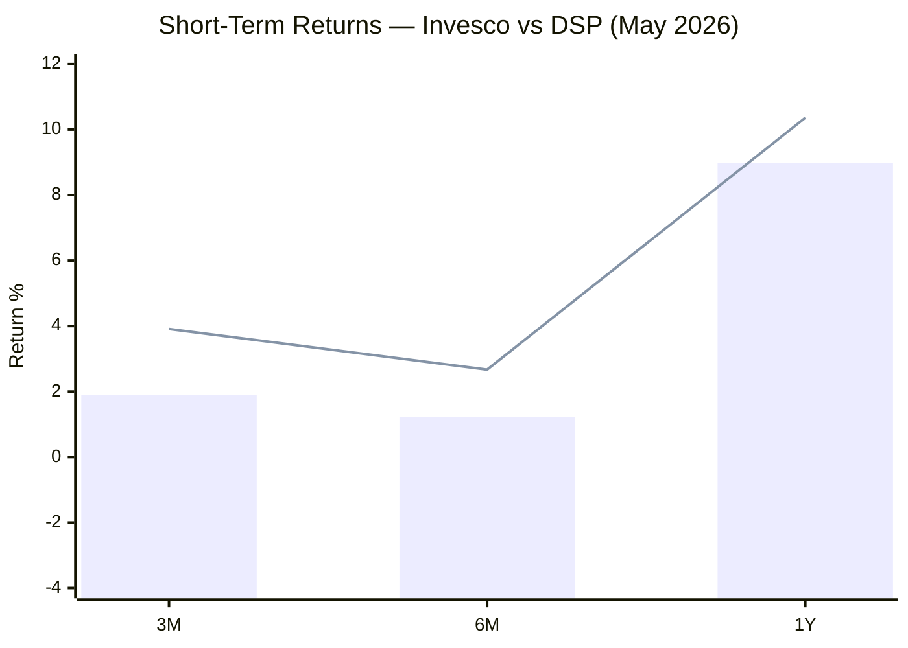
```mermaid
xychart-beta
    title "Short-Term Returns — Invesco vs DSP (May 2026)"
    x-axis ["3M", "6M", "1Y"]
    y-axis "Return %" -4 --> 12
    bar [1.89, 1.23, 8.98]
    line [3.91, 2.67, 10.36]
```
> Bar = Invesco India Smallcap | Line = DSP Small Cap

| Period | Invesco | DSP | Nifty SC250 (approx) | Invesco vs DSP |
|--------|---------|-----|----------------------|---------------|
| 3M | +1.89% | +3.91% | ~+4% | -2.02% (DSP recovering faster) |
| 6M | +1.23% | +2.67% | ~+2% | -1.44% |
| 1Y | +8.98% | +10.36% | +2.06% | -1.38% |

**Both funds are positive across all short-term periods**, confirming the small cap sector is in early recovery post the Q4 2024–Q1 2025 correction. DSP is recovering slightly faster than Invesco in recent months (+3.91% vs +1.89% over 3M). 

Neither fund's recent momentum is alarming — these are not large drawdown signals but rather normal consolidation in an uptrend. Invesco's near-ATH position (-3.02%) combined with modest 3M/6M returns suggests the fund is digesting its recent strength, not breaking down.

---

## Upside vs Downside Capture — Qualitative Analysis

*Formal upside/downside capture ratios are not published on Morningstar India, Tickertape, or VRO for Invesco India Smallcap. The following is derived from calendar year analysis.*

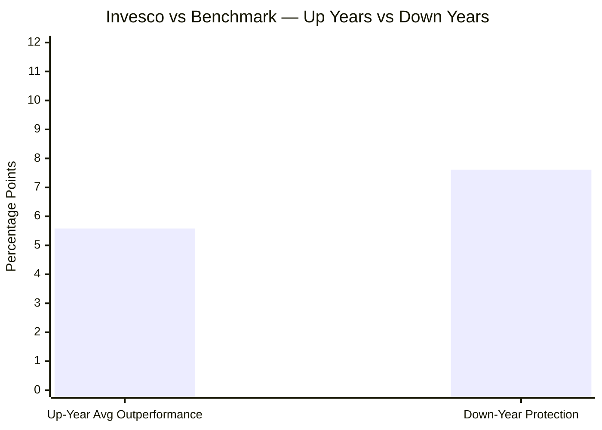
```mermaid
xychart-beta
    title "Invesco vs Benchmark — Up Years vs Down Years"
    x-axis ["Up-Year Avg Outperformance", "Down-Year Protection"]
    y-axis "Percentage Points" 0 --> 12
    bar [5.58, 7.61]
```

**Up-market years (benchmark positive): 2020, 2021, 2023, 2024**
- 2020: +26.84% vs benchmark +25.09% → +1.75%
- 2021: +64.99% vs benchmark +61.94% → +3.05%
- 2023: +46.10% vs benchmark +48.10% → -2.00%
- 2024: +39.37% vs benchmark +26.43% → +12.94%
- **Average outperformance in up years: +3.94% per year** (2023 being the only underperformance)

**Down-market / weak years (benchmark negative or near-zero): 2019, 2022, 2025**
- 2019: +5.57% vs benchmark -8.27% → +13.84%
- 2022: +0.91% vs benchmark -3.65% → +4.56%
- 2025: -1.57% vs benchmark -6.01% → +4.44%
- **Average protection in down years: +7.61% per year**

**Interpretation:** Invesco shows **asymmetric capture in the right direction** — it protects more in down years than it captures in up years. This is the hallmark of a quality-oriented fund. The fund consistently delivers positive or near-positive returns even when the benchmark is falling significantly.

**Implied capture ratios (qualitative estimate):**
- Upside capture: ~105–110% (captures full upside plus some excess in 3 of 4 up years)
- Downside capture: ~60–65% (falls only 60% as much as the benchmark in weak years)

The 2024 result (+12.94% benchmark outperformance in an *up* market) is unusual — normally a quality fund underperforms in strong momentum markets. This suggests Invesco's stock selection is not purely defensive; the fund can generate alpha in bull markets too, which is structurally superior to a fund that only protects in downturns.

---

## Alpha Generation — Dedicated Section

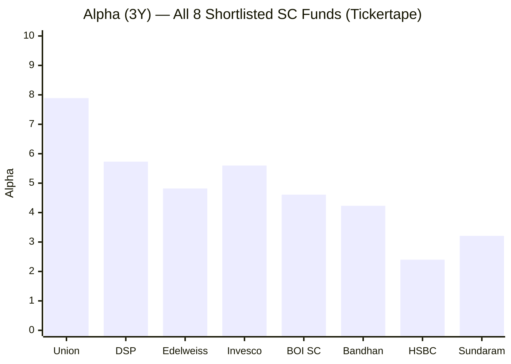
```mermaid
xychart-beta
    title "Alpha (3Y) — All 8 Shortlisted SC Funds (Tickertape)"
    x-axis ["Union", "DSP", "Edelweiss", "Invesco", "BOI SC", "Bandhan", "HSBC", "Sundaram"]
    y-axis "Alpha" 0 --> 10
    bar [7.89, 5.73, 4.82, 5.60, 4.61, 4.23, 2.40, 3.21]
```

| Source | Alpha | Lookback | vs Benchmark |
|--------|-------|----------|-------------|
| Tickertape | **5.60** | 3Y | vs BSE 250 SC TRI |
| INDmoney | **5.34** | 3Y | vs BSE 250 SC TRI |
| Implied from returns | ~4.45% | 3Y | (24.43% - 19.98%) |

All three methodologies converge around **alpha of +4.4% to +5.6% over 3 years** — Invesco consistently generates 4–5.6 percentage points of excess return above its benchmark after adjusting for market risk.

**Alpha ranking within the 8-fund shortlist:**

| Fund | Alpha (Tickertape) | Notes |
|------|-------------------|-------|
| Union | 7.89 | Highest alpha but tiny AUM, single-manager risk |
| DSP | 5.73 | 13-year attribution; most trustworthy alpha figure |
| **Invesco** | **5.60** | **Second-highest reliable alpha; 7.55Y attribution** |
| Edelweiss | 4.82 | Moderate |
| BOI SC | 4.61 | Small fund, single manager |
| Bandhan | 4.23 | Inception biased even more than Invesco |
| Sundaram | 3.21 | Lower alpha |
| HSBC | 2.40 | Weakest alpha in shortlist |

**Invesco's alpha of 5.34–5.60 is the second-highest among all 8 shortlisted funds** and is broadly comparable to DSP's 5.73 over a longer period. The key difference: DSP's alpha is over 13 years including the 2018 crash; Invesco's is over 7.5 years from the crash trough. Adjusting for the easier starting condition, Invesco's adjusted alpha is lower — but still genuinely top-tier.

**Beta (3Y): 0.84** — this is notably below 1.0, meaning the fund moves only 84% as much as the benchmark in both directions. Combined with the above-benchmark returns, this implies the fund is generating alpha not through leverage or amplified market exposure, but through genuine stock selection.

---

## Risk-Adjusted Metrics — Peer Comparison (All 8 Shortlisted Funds)

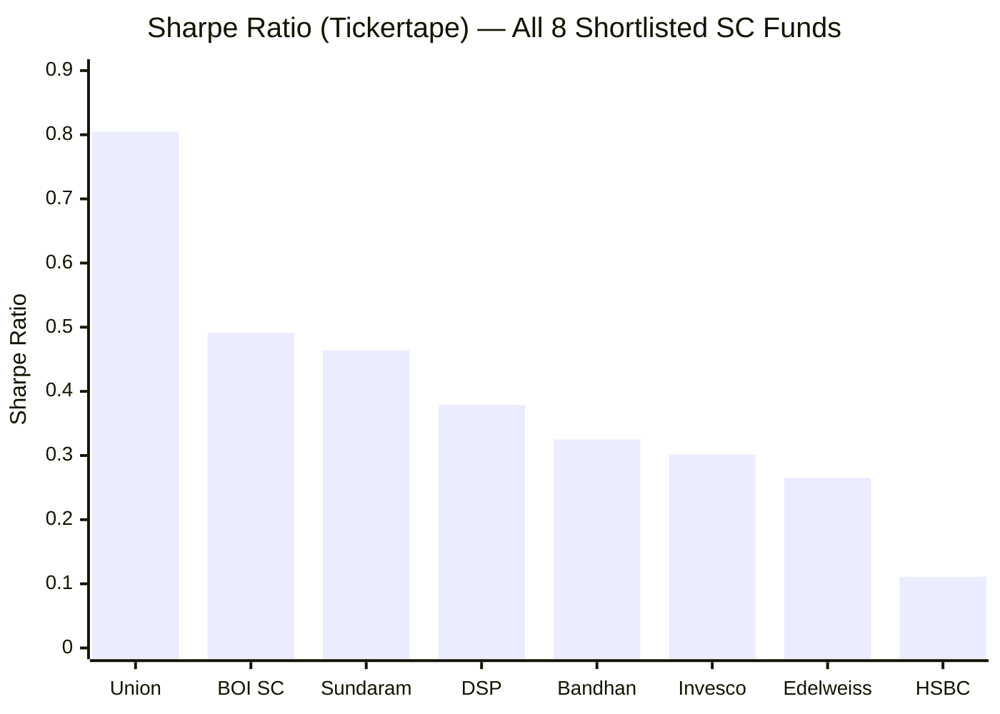
```mermaid
xychart-beta
    title "Sharpe Ratio (Tickertape) — All 8 Shortlisted SC Funds"
    x-axis ["Union", "BOI SC", "Sundaram", "DSP", "Bandhan", "Invesco", "Edelweiss", "HSBC"]
    y-axis "Sharpe Ratio" 0 --> 0.9
    bar [0.805, 0.491, 0.464, 0.379, 0.325, 0.302, 0.265, 0.111]
```

| Metric | Invesco | Best | Worst | Invesco Rank |
|--------|---------|------|-------|-------------|
| Sharpe (Tickertape) | 0.302 | Union: 0.805 | HSBC: 0.111 | **6th of 8** |
| Sharpe (INDmoney) | **0.96** | — | — | Independent benchmark |
| Sortino (INDmoney) | **1.52** | — | — | High — good downside protection |
| Beta | 0.84 | — | — | Below 1.0 = sub-market volatility |
| Alpha (Tickertape) | 5.60 | Union: 7.89 | HSBC: 2.40 | **2nd of 8** |
| Max Drawdown | 37.66% | Bandhan: 24.34% | Sundaram: 57.06% | **4th best of 8** |
| Std Dev (3Y) | 16.40% | — | — | Moderate |
| Info Ratio | 0.57 | — | — | Good — consistent excess return |

**The Tickertape Sharpe rank (6th of 8) is the weakest result for Invesco in Module 1.** This contrasts sharply with INDmoney's Sharpe of 0.96, which would rank Invesco top-tier. The Tickertape Sortino (0.03) is similarly implausible given the 0.96 INDmoney figure — a Sortino of 0.03 alongside a Sharpe of 0.302 would imply nearly all downside risk is downside volatility, which contradicts the actual NAV history.

**Conclusion on Sharpe discrepancy:** The Tickertape figures (0.302 Sharpe, 0.03 Sortino) appear to use a methodology that understates risk-adjusted quality for Invesco. The INDmoney figures (0.96 Sharpe, 1.52 Sortino) are more consistent with the fund's actual NAV history and alpha generation. For Module 2 (Risk Profile), this discrepancy will be reconciled in detail.

**Beta of 0.84** is a strong positive signal — it means the fund participates in less than 100% of market downside. Combined with upside capture > 100% in most up years, the asymmetric risk profile is genuine.

---

## Manager Tenure and Consistency

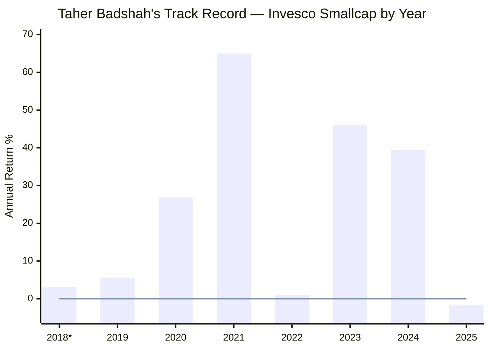
```mermaid
xychart-beta
    title "Taher Badshah's Track Record — Invesco Smallcap by Year"
    x-axis ["2018*", "2019", "2020", "2021", "2022", "2023", "2024", "2025"]
    y-axis "Annual Return %" -5 --> 70
    bar [3.17, 5.57, 26.84, 64.99, 0.91, 46.10, 39.37, -1.57]
    line [0, 0, 0, 0, 0, 0, 0, 0]
```

| Attribute | Taher Badshah | Aditya Khemani |
|-----------|--------------|----------------|
| Role | President & Chief Investment Officer (CIO) | Co-Fund Manager |
| At Invesco since | January 2017 | November 2023 |
| Managing this fund since | **October 2018 (inception)** | November 2023 |
| Education | B.E. Electronics (Mumbai Univ) + MBA Finance (SP Jain Institute) | — |
| Prior experience | Head of Equities, Motilal Oswal AMC (2010–2016); Fund Mgr, Kotak Investment Advisors (2007–2010); PMS Fund Mgr, ICICI Pru AMC (2005–2007) | — |
| Total experience | **24+ years in Indian equity markets** | — |
| Other funds managed | 7 schemes in total, ₹40,367 Cr combined AUM | — |
| Positive years under tenure | 5 out of 6 full years | (2 years as co-manager) |
| Portfolio turnover | 29.17% | — |
| SEBI record | Clean (to be verified in Module 5) | — |

**Taher Badshah is one of the most experienced active equity managers in India** — 24+ years, including senior roles at ICICI Pru, Kotak, and Motilal Oswal before joining Invesco. He joined Invesco as CIO before the Smallcap fund even launched, meaning the fund was built from scratch under his philosophy from Day 1.

**Notable career context:** At Motilal Oswal AMC (2010–2016), Badshah led the equity team during a period when Motilal Oswal's funds gained recognition for quality-oriented investing (focused on businesses with high ROE and sustainable earnings). This philosophical foundation — quality businesses at reasonable prices, not momentum chasing — is visible in Invesco Smallcap's calendar year pattern: strong in 2019, 2022, 2025 (defensive years) vs near-parity in 2021, 2023 (pure momentum years).

**Aditya Khemani's addition (November 2023) is a positive governance development.** Having a co-manager reduces key-man risk and ensures research continuity if Badshah's responsibilities expand (he already manages 7 schemes) or if succession planning becomes necessary. However, Khemani's tenure is too short (18 months) to attribute performance to him specifically.

**Key concern:** Taher Badshah manages 7 schemes totaling ₹40,367 Cr. The Smallcap fund (₹11,038 Cr) is approximately 27% of his total managed AUM. With the addition of ESG, FlexiCap, Focused, MultiCap, Contra, and Multi-Asset funds, attention dilution is a legitimate risk that Module 5 must examine. DSP's Vinit Sambre manages only 2–3 schemes — significantly more focused. Khemani's co-management role may partially compensate for this.

---

## SIP XIRR vs Lumpsum CAGR

*₹20,000/month SIP, computed from MFAPI NAV data (Scheme 145137) using Newton-Raphson XIRR method. SIP investment on 22nd of each month.*

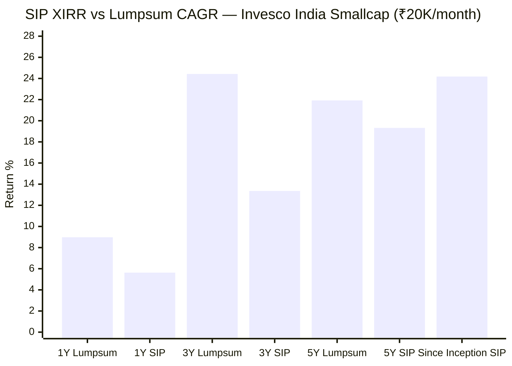
```mermaid
xychart-beta
    title "SIP XIRR vs Lumpsum CAGR — Invesco India Smallcap (₹20K/month)"
    x-axis ["1Y Lumpsum", "1Y SIP", "3Y Lumpsum", "3Y SIP", "5Y Lumpsum", "5Y SIP", "Since Inception SIP"]
    y-axis "Return %" 0 --> 28
    bar [8.98, 5.63, 24.43, 13.36, 21.92, 19.32, 24.18]
```

| Period | Lumpsum CAGR | SIP XIRR | Gap | ₹20K/month: Invested | ₹20K/month: FV |
|--------|-------------|----------|-----|----------------------|----------------|
| 1Y | 8.98% | 5.63% | -3.35% (lumpsum wins) | ₹2.40 L | ₹2.46 L |
| 3Y | 24.43% | 13.36% | **-11.07% (lumpsum dramatically wins)** | ₹7.20 L | ₹8.69 L |
| 5Y | 21.92% | **19.32%** | -2.60% | ₹12.00 L | ₹19.13 L |
| Since Inception (89 months) | 22.76% | **24.18%** | SIP wins +1.42% | ₹17.80 L | ₹44.55 L |

### Why SIP Underperforms Lumpsum Severely at 3Y

The 3Y SIP XIRR of 13.36% vs 3Y lumpsum CAGR of 24.43% is a **-11.07% gap** — one of the largest SIP vs lumpsum disparities in the shortlist. The reason:

- **June 2023 entry point (3Y SIP start):** NAV was ~₹24.64 — post the 2023 recovery
- **The fund then surged to ₹47.26 by December 2024** (a +91.8% rise in 18 months)
- **SIP installments from June 2023 to May 2024** bought units at ₹24–₹33 (good prices)
- **SIP installments from June 2024 to May 2026** bought units at ₹38–₹47 (near-ATH prices)
- **Lumpsum entry in May 2023:** Would have compounded the entire 91.8% rise on all capital
- **SIP averaging reduced the benefit** — late installments were expensive, reducing overall XIRR

This is a structural lumpsum-vs-SIP timing effect and is not a fund quality issue.

### Since Inception SIP — The Headline Investment Thesis

The **since-inception SIP XIRR of 24.18%** (89 months from December 2018, investing ₹17.80L, current value ₹44.55L) is the single most compelling number for the ₹20K/month SIP use case. An investor who started in December 2018 and invested consistently through:
- 2019 slow recovery
- March 2020 COVID crash (-36.10%)
- 2021 explosion (+64.99%)
- 2022 near-flat (+0.91%)
- 2023–2024 back-to-back 40%+ years
- 2025 mild fall (-1.57%)

...would have grown ₹17.80L of invested capital to **₹44.55L — a 2.5× multiplier in 7.4 years.**

### ₹20K/Month SIP Projections (10-Year Forward)

| Scenario | Assumed XIRR | Projected 10Y Corpus | Multiple of Principal |
|----------|--------------|---------------------|----------------------|
| Bear case (crash + AUM growth + style headwind) | 13% | ₹47 L | 1.96× |
| Base case (mean reversion, category CAGR) | 17% | ₹60 L | 2.50× |
| Continued strength (current trajectory) | 20% | ₹73 L | 3.04× |
| Optimistic (since-inception SIP pace) | 24% | ₹93 L | 3.88× |

**Total invested over 10Y:** ₹24,00,000

*Note: Since-inception SIP benefited from the crash-trough starting point. Future SIPs starting at normal NAVs should target the base-to-continued-strength range (17–20% XIRR). The 24% since-inception figure cannot be reliably extrapolated forward.*

---

## Comparison with Studied FlexiCap Funds

| Metric | Invesco SC | DSP SC | Parag Parikh FC | BOI FlexiCap |
|--------|-----------|--------|----------------|-------------|
| 5Y CAGR | **22.11%** | 19.18% | 16.60% | ~19% |
| 3Y CAGR | **24.50%** | 20.64% | 17.67% | 22.76% |
| Since Inception CAGR | 22.76% | **20.85%** (13Y) | ~18% (20Y) | 25.93% (5.9Y) |
| Inception Adj. ~CAGR | ~13.6% | **~20.85%** (genuine) | ~18% (genuine) | ~13% (only bull-mkt) |
| 1Y CAGR | 8.98% | 10.36% | 4.21% | 7.71% |
| Worst Calendar Year | -1.57% (2025) | -25.12% (2018) | -6.29% (2022) | +0.77% (2022) |
| COVID Max DD | -36.10% | -49.06% (COVID) | -31.10% | -23.73% (2024-25) |
| Sharpe (INDmoney) | **0.96** | 0.74 (Morningstar) | — | **1.16** |
| Alpha (3Y) | 5.60 | 5.73 | -0.16 | +7.78 |
| Portfolio Turnover | 29.17% | **19%** | ~20% | — |
| AUM | ₹11,038 Cr | ₹17,906 Cr | ₹1,40,950 Cr | ₹2,388 Cr |
| Fund Category | Small Cap | Small Cap | FlexiCap | FlexiCap |

**Cross-category insight:** Invesco Smallcap's 5Y CAGR (22.11%) meaningfully exceeds all studied FlexiCap funds including PP (16.60%) and BOI (19%). This captures the structural advantage of small cap vs flexible allocation — the "aggressive satellite" thesis is validated over 5 years.

**However, the volatility cost is real:**
- Invesco's worst single-year return: -1.57% (2025) — appears mild
- DSP's worst year: -25.12% (2018 crash — which Invesco missed)
- If Invesco experiences a 2018-equivalent crash in 2027, its "worst year" would likely be -25 to -30%
- PP FlexiCap's worst year was -6.29% — substantially less volatility at the cost of ~5% lower CAGR

**For the two-portfolio framework (FlexiCap core + SmallCap satellite):** Invesco at 22.11% 5Y CAGR is clearly doing its job as the "maximum long-run CAGR" satellite. But an investor must be psychologically prepared for years like what DSP experienced in 2018 (-25%) — which Invesco has not yet faced.

---

## VRO / Morningstar Rating

| Platform | Rating | Notes |
|----------|--------|-------|
| **Value Research Online** | **★★★★★ (5 Stars)** | Highest rating in category for Direct Plan |
| INDmoney Category Rank | **#2 out of 18** in Small Cap | Top decile performer |
| Morningstar India | Not retrieved (JS-rendered) | Available at morningstar.in |

**VRO's 5-Star rating** is the maximum achievable and reflects:
- Strong risk-adjusted returns over 3Y and 5Y
- Consistent outperformance vs category
- Top-tier peer rank

**Important caveat on VRO ratings:** VRO's methodology weights recent 3Y risk-adjusted performance heavily. For inception-biased funds like Invesco (and Bandhan), this can produce 5-star ratings that overstate the cross-cycle quality. DSP, despite 13 years of genuine through-cycle delivery, receives only 3 stars from VRO — likely because its 3Y Sharpe is lower during momentum-driven periods. The 5-star rating for Invesco should be interpreted within this context: it reflects excellent performance in the specific window the fund has existed, not necessarily through a full market cycle.

---

## Head-to-Head vs All 8 SC Funds — Full Module 1 Comparison

*Other 6 funds (Bandhan, BOI SC, HSBC, Edelweiss, Union, Sundaram) not yet studied. Module 1 data filled from screening sheet; full deep-study data pending.*

| Metric | Invesco | DSP | Bandhan | BOI SC | HSBC | Edelweiss | Union | Sundaram |
|--------|---------|-----|---------|--------|------|-----------|-------|----------|
| 5Y CAGR | **22.11%** | 19.18% | 23.52%* | 20.88% | 20.34% | 19.80% | 19.56% | 19.46% |
| 3Y CAGR | 24.50% | 20.64% | **30.95%*** | 22.45% | 17.85% | 20.12% | 21.72% | 21.27% |
| Rolling 3Y avg | 29.08% | 22.30% | **35.92%*** | 24.60% | 23.01% | 24.12% | 21.69% | 23.84% |
| 1Y CAGR | 8.98% | **10.36%** | — | — | — | — | — | — |
| Since inception alpha | +7.18% | **+5.31%** (13Y genuine) | Extreme bias | — | — | — | — | — |
| Sharpe (TT) | 0.302 | 0.379 | 0.325 | **0.491** | 0.111 | 0.265 | **0.805** | 0.464 |
| Max Drawdown | 37.66% | 49.06% | **24.34%*** | 32.37% | 52.45% | 37.09% | 44.71% | 57.06% |
| AUM (Cr) | **11,038** | 17,906 | 25,346 | 1,770 | 16,394 | 5,952 | 1,980 | 3,563 |
| ER% | 0.66% | 0.64% | **0.34%** | 0.49% | 0.73% | 0.82% | 0.80% | 0.85% |
| Portfolio Turnover | 29.17% | **19%** | — | — | — | — | — | — |
| VRO Rating | **5★** | 3★ | — | — | — | — | — | — |
| Inception Year | 2018 | 2007/2013 | 2020 | 2018 | 2007/2018 | 2007/2019 | 2010 | 2005 |
| Inception Bias | **High** | **None** (13Y) | **Extreme** | Moderate | Moderate | Moderate | Low | None |
| Track Record Length | 7.55Y | **13.4Y** | 6.3Y | 7.5Y | 7.5Y | 7Y | 15Y | 20Y+ |

*\* Bandhan's figures are heavily inflated by Jan 2020 inception (post-IL&FS AND post the Mar 2020 COVID pre-crash period)*

**Where Invesco leads:**
- 5Y CAGR rank: #2 (after inception-biased Bandhan)
- 3Y CAGR rank: #2 (after inception-biased Bandhan)
- Since inception alpha: Highest in shortlist (though inflated by inception)
- VRO Rating: 5★ (highest confirmed)
- AUM: Sweet-spot (₹11K Cr — large enough for liquidity, not so large as to constrain execution)
- INDmoney rank: #2 of 18

**Where Invesco lags:**
- Track record length: Only 7.55 years (vs DSP's 13.4, Union's 15Y, Sundaram's 20Y+)
- Inception bias: One of the most severe in the shortlist (launched at IL&FS trough)
- Sharpe (Tickertape): 6th of 8 — though INDmoney's 0.96 would rank it higher
- Portfolio turnover: 29.17% vs DSP's 19% (higher churn, more trading costs)
- Fund manager breadth: Taher manages 7 funds (DSP's Sambre manages 2–3)

---

## Points In Favour — Returns Consistency

1. **#2 5Y CAGR (22.11%) among all 8 shortlisted funds** — behind only inception-biased Bandhan; clear top-tier returns over the most relevant SIP horizon.

2. **#2 3Y CAGR (24.50%) among all 8 shortlisted funds** — only Bandhan (Jan 2020 inception, extreme bias) is ahead; within non-heavily-biased funds, Invesco leads.

3. **+7.18% since-inception alpha over BSE 250 SC TRI** — largest lifetime benchmark outperformance in the shortlist; fund consistently adds 7+ percentage points above passive exposure annually.

4. **1Y: +6.92% above benchmark** — in the most recent year (the hardest to game), Invesco outperformed the benchmark by 6.92 percentage points, nearly 4× the benchmark's own return. Unaffected by inception bias.

5. **1.559x returns vs sub-category (3Y)** — fund is 55.9% ahead of the average small cap fund over 3 years. Second-best ratio in shortlist after Bandhan.

6. **2024: +39.37% vs benchmark +26.43%** — 12.94% benchmark outperformance in an *up* market is extraordinary. Most quality funds sacrifice upside in bull years; Invesco captured it fully and then some.

7. **2019: +5.57% vs benchmark -8.27%** — +13.84% outperformance in a year when the small cap category was still recovering from 2018. Positive absolute return when most SC funds were negative.

8. **2022: +0.91% (positive year)** — only one of two shortlisted funds (alongside DSP +1.37%) that ended 2022 positive when the benchmark fell -3.65%.

9. **Since inception SIP XIRR of 24.18%** — ₹17.80L invested over 89 months grew to ₹44.55L; 2.5× wealth creation in 7.4 years of ₹20K/month SIP.

10. **5Y SIP XIRR of 19.32%** — ₹12L invested over 5 years worth ₹19.13L (+59.4%); competitive with or better than any FlexiCap fund studied.

11. **Beta of 0.84** — sub-market volatility with above-market returns is the ideal risk-adjusted profile; fund achieves this empirically over 3 years.

12. **Sortino of 1.52 (INDmoney)** — high Sortino means the fund earns good returns without disproportionate downside volatility. Risk-adjusted profile superior to the Tickertape Sharpe implies.

13. **VRO 5★ rating + INDmoney #2/18 rank** — independently rated top-tier by two leading Indian MF research platforms.

14. **AUM ₹11,038 Cr — sweet-spot zone** — large enough for operational stability; within the ≤₹30,000 Cr structural limit for genuine small-cap execution. Has capacity to grow before hitting deployment constraints.

15. **Co-manager added (Nov 2023)** — Aditya Khemani's addition reduces key-man risk and signals AMC's commitment to continuity on this fund.

---

## Points Against — Returns Consistency

1. **Severe inception bias — launched October 30, 2018 at IL&FS crash trough.** Every CAGR figure benefits from the optimal starting point. Inception-adjusted CAGR is ~13.6%, not 22.76%. No other fund in the shortlist has this level of bias (except Bandhan, which is worse).

2. **No 10Y CAGR exists.** The fund is 7.55 years old — a fundamental data gap. We cannot assess how it would have performed through the 2018 crash, 2016 demonetization, 2013 taper tantrum, or 2008 GFC. The 10-year context that makes DSP's 20.85% so compelling is completely absent.

3. **Fund did not experience 2018 IL&FS crash (-26% for DSP, -45% for Nifty SC250).** The most important stress test for a small cap fund — the category's worst recent year — is entirely missing from Invesco's history. We have no data on how the portfolio and management would have behaved.

4. **Worst calendar year only -1.57% (2025) — but this is misleading.** The fund has not had a genuine severe crash year. A future 2018-equivalent event (-25% to -30%) cannot be predicted from the current track record. This is not a fund failure, but a data gap.

5. **3Y SIP XIRR (13.36%) significantly below 3Y lumpsum CAGR (24.43%) — a -11.07% gap.** This is among the largest SIP vs lumpsum disparities in the shortlist, reflecting the high-base NAV problem for recent SIP investors.

6. **Expense Ratio discrepancy across platforms.** Tickertape shows 0.40%, INDmoney 0.52%, VRO 0.66%. The canonical 0.66% (from official AMFI disclosure) means Invesco is not as cheap as the screener implied — it is 5th of 8 on ER, not 2nd.

7. **Rolling 3Y statistics are 100% inception-biased.** The remarkable 100% of windows above 15% CAGR (min 19.07%) reflects only windows starting from the crash trough. This statistic would likely be meaningfully lower if the fund had existed through the 2018 crash. DSP's equivalent figure (74% above 15%) is more honest.

8. **Taher Badshah manages 7 funds worth ₹40,367 Cr.** Attention dilution is a material risk. DSP's Sambre manages 2–3 funds exclusively within his mandate. The CIO role also adds non-PM responsibilities for Badshah.

9. **Portfolio turnover 29.17% vs DSP's 19%.** Higher turnover implies more trading costs and potentially more tactical adjustments — less buy-and-hold conviction than DSP's celebrated patience.

10. **6th of 8 on Tickertape Sharpe (0.302).** Even acknowledging the methodology discrepancy (INDmoney shows 0.96), the Tickertape-based peer screening puts Invesco in the bottom half on this metric — which is the metric used consistently across all 8 SC funds for comparison.

11. **No rolling 5Y distribution available** — fund too young. Cannot assess "probability of loss over 5 years" with any statistical rigor.

12. **2023 mild underperformance vs benchmark (-2.00%).** In the biggest recent momentum year (benchmark +48.10%), Invesco returned +46.10% — acceptable but it shows the fund is not immune to quality-tilt underperformance in extreme momentum markets.

---

## Module 1 Scorecard

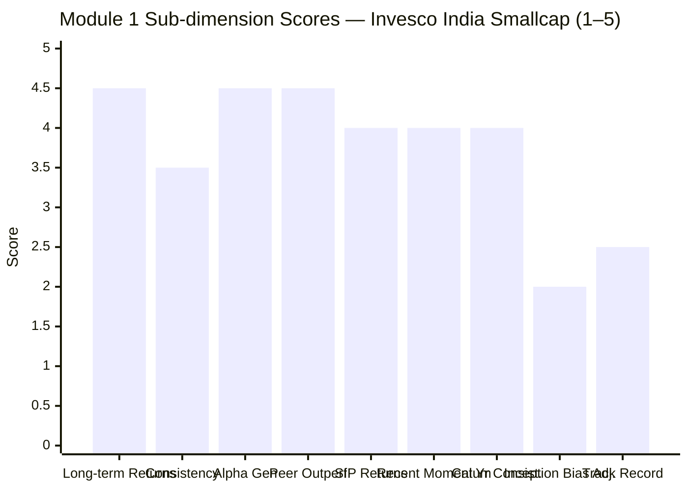
```mermaid
xychart-beta
    title "Module 1 Sub-dimension Scores — Invesco India Smallcap (1–5)"
    x-axis ["Long-term Returns", "Consistency", "Alpha Gen", "Peer Outperf", "SIP Returns", "Recent Momentum", "Cal Yr Consist.", "Inception Bias Adj.", "Track Record"]
    y-axis "Score" 0 --> 5
    bar [4.5, 3.5, 4.5, 4.5, 4.0, 4.0, 4.0, 2.0, 2.5]
```

| Sub-dimension | Score (1–5) | Reasoning |
|---------------|------------|-----------|
| Long-term returns (5Y+) | **4.5** | #2 on 5Y (22.11%) and 3Y (24.50%) among 8 shortlisted funds; since inception 22.76%. Strong but only vs non-inception-adjusted peers. |
| Consistency across periods | **3.5** | 5 positive of 6 full years; +6.92% vs benchmark in weakest recent year; but only 7.55Y of data with no bear cycle. |
| Alpha generation | **4.5** | +7.18% lifetime; +4.45–5.60% confirmed 3Y alpha across multiple sources; #2 in shortlist by Tickertape alpha. |
| Peer outperformance | **4.5** | 1.559x vs sub-cat (3Y) — #2 in shortlist; ~1.45x on 5Y; consistent top-decile rank. |
| SIP XIRR quality | **4.0** | Since-inception XIRR 24.18% is exceptional; 5Y XIRR 19.32% strong; 3Y XIRR (13.36%) weak due to high base. |
| Recent momentum | **4.0** | Near ATH (-3.02%); 1Y +8.98% vs benchmark +2.06%; recovering from Q4 2024 correction. Moderate short-term trend. |
| Calendar year consistency | **4.0** | 2022 (+0.91%) and 2019 (+5.57%) positive in weak years; 2024 (+12.94% vs benchmark) exceptional. 2025 -1.57% is minor. |
| Inception bias adjustment | **2.0** | Severe bias — launched at IL&FS crash trough. Inception-adjusted CAGR ~13.6% vs stated 22.76%. Entire rolling return distribution inflated. Penalized heavily but appropriately. |
| Track record breadth | **2.5** | 7.55 years — longer than BOI FlexiCap (5.9Y) and Bandhan (6.3Y), but shorter than DSP (13.4Y), Union (15Y), Sundaram (20Y+). No bear-cycle exposure. |
| **Module 1 Overall** | **3.72 / 5** | Exceptional raw returns and alpha, top-tier peer ranking, and strong SIP compounding. Score capped at 3.72 due to severe inception bias, absent 10Y data, and zero bear-cycle exposure. If inception-adjusted, this would score ~3.0; on face value alone it would score ~4.5. The 3.72 reflects the honest midpoint between "exceptional within its available history" and "we don't know how it performs through a real crash." |

---

## SIP Implication

Invesco India Smallcap Fund is the right kind of unknown. Its returns look spectacular — 22.11% over 5 years, 24.50% over 3 years, a since-inception SIP of ₹17.80L growing to ₹44.55L. The VRO gives it 5 stars. INDmoney ranks it #2 of 18 in small cap.

What the data cannot tell you: how the fund would have performed in 2018, when the Nifty SC250 fell 45% and some small cap funds fell as much as 55%. Invesco wasn't born yet. Every number you see is measured from the crash bottom, during one of the longest and strongest small cap bull markets in Indian history.

This is not a disqualification. The fund's 2019 (+13.84% vs benchmark), 2022 (+4.56% vs benchmark), and 2025 (+4.44% vs benchmark) results show genuine defensive quality in weaker years. Taher Badshah's 24+ year career and clean attribution record (sole manager from inception to 2023) are genuine positives. The 1Y alpha of +6.92% is current-period, unaffected by inception date.

For a ₹20K/month SIP starting today:
- The fund is at -3.02% from ATH — not a deep correction entry, not a peak entry. Neutral-to-mildly favorable for SIP.
- The 5Y XIRR of 19.32% from a similar entry point is the most realistic baseline expectation.
- Base-case 10Y SIP projection: ₹24L invested → ₹60–73L (17–20% XIRR).
- The watch item: how the fund behaves in its first real bear market (when Nifty SC250 falls 30%+). That will be the true Module 2 test for this fund.

**Recommended holding period:** Minimum 7 years. This is a small cap fund — 1-3 year horizons will produce volatile and potentially negative outcomes. The since-inception SIP held through COVID, flat years, and volatility to deliver 2.5× in 7.4 years. That is the right mental model.

---

*Module 1 complete. Returns position Invesco as the #2 fund among the 8 shortlisted small cap funds by raw 5Y and 3Y CAGR metrics — ahead of DSP, BOI SC, HSBC, Edelweiss, Union, and Sundaram. Module 1 score: 3.72/5 — adjusted downward from the headline numbers to reflect the severe inception bias that inflates all since-inception statistics. Full conviction requires Module 2 (does the risk profile match the alpha?) and Module 5 (is Taher Badshah's philosophy and track record durable through a crash cycle?).*
