# Module 2: Risk Profile — Invesco India Smallcap Fund

*Sources: Tickertape Screener CSV (May 21, 2026), MFAPI NAV History (Scheme 145137 — 1,857 return days, Nov 2, 2018 – May 22, 2026), AdvisorKhoj, INDmoney, Value Research Online, MFAPI computed statistics (daily returns × √252 for annual volatility)*

---

## Raw Data (Compiled Across Sources)

| Metric | Value | Source | Reliability |
|--------|-------|--------|-------------|
| Annual Volatility (MFAPI, since inception) | **18.33%** | MFAPI computed | High |
| Standard Deviation (3Y, AdvisorKhoj) | **19.68%** | AdvisorKhoj | High |
| Max Drawdown | **37.66%** | Tickertape screener | High |
| COVID Peak-to-Trough | **-36.10%** | MFAPI computed | High |
| COVID Recovery Time | **~9 months** | MFAPI computed | High |
| Sharpe Ratio (Tickertape, 3Y) | 0.302 ⚠️ | Tickertape CSV | Low (methodology artefact) |
| Sharpe Ratio (INDmoney) | **0.96** | INDmoney | High |
| Sharpe Ratio (AdvisorKhoj) | **1.01** | AdvisorKhoj | High |
| Sortino Ratio (Tickertape) | 0.03 ⚠️ | Tickertape | Very Low (anomaly) |
| Sortino Ratio (INDmoney) | **1.52** | INDmoney | High |
| Beta (3Y) | **0.83–0.84** | AdvisorKhoj / INDmoney | High |
| Alpha (3Y) | 5.38–5.60% | AdvisorKhoj / TT / INDmoney | High |
| Information Ratio | **0.57** | INDmoney | Medium |
| Tracking Error (implied: α / IR) | **~9.4%** | Computed (5.38 / 0.57) | Medium |
| R-Squared (implied: 1 − (TE/σ)²) | **~77%** | Computed | Medium |
| Calmar Ratio (5Y) | **0.587** | Computed (22.11% / 37.66%) | High |
| Portfolio PE | **43.43** | Tickertape | Medium |
| ATH | ₹48.95 (May 8, 2026) | MFAPI | High |
| Current NAV (May 22, 2026) | ₹47.47 | MFAPI | High |
| % from ATH | **-3.02%** | MFAPI computed | High |
| Worst Single Day | **-13.33%** (Mar 23, 2020) | MFAPI computed | High |
| Best Single Day | **+5.15%** (Sep 14, 2020) | MFAPI computed | High |
| Positive Days | **1,061 / 1,857 (57.1%)** | MFAPI computed | High |
| Negative Days | **741 / 1,857 (39.9%)** | MFAPI computed | High |
| Days Down >2% | **70** | MFAPI computed | High |
| Days Up >2% | **57** | MFAPI computed | High |
| Days Down >3% | **31** | MFAPI computed | High |
| Days Up >3% | **17** | MFAPI computed | High |
| Upside / Downside Capture | ~95–110% / ~65–75% (estimated) | Qualitative derivation | Medium |
| SEBI Risk Category | Very High | Universal for small cap equity | — |

---

## The Module 2 Tension — Two True Stories Simultaneously

Invesco SC's risk profile is one of the most deceptive in the 8-fund shortlist — not because the data is wrong, but because the historical record is measured from a starting point that makes every risk metric look better than it really is.

**Story A — The Genuinely Risk-Efficient Fund:**
- 3rd-lowest Max Drawdown of 8 funds (37.66%)
- Sub-market Beta of 0.83 — moves less than the index per unit of market stress
- Fastest COVID recovery in the shortlist (~9 months back to pre-crash peak)
- Sortino 1.52 (INDmoney) — excellent downside-specific risk management
- Highest Alpha of all 8 funds (5.38–5.60%) — genuine value added above the benchmark
- Volatility of 18.33% (since inception) — competitive for a pure small-cap mandate

**Story B — The Fund With No Bear Market Memory:**
- Launched October 30, 2018 — at the exact trough of the IL&FS crash. The fund has **never been tested from the top of a small-cap cycle**
- All risk metrics — Max DD, Sharpe, Calmar, Rolling Returns — are measured from a trough starting point. They are not comparable to DSP's metrics on equal footing
- Portfolio PE 43.43 is the **highest of all 8 shortlisted funds** — implying the forward risk profile is substantially worse than the backward-looking metrics suggest
- Volatility has been rising for four consecutive years (2023: 10.26% → 2026 YTD: 22.28%) — a directional warning
- The worst single day of all 8 funds (-13.33%) belongs to Invesco — tail risk in a genuine crisis could be severe

**The reconciliation:** Invesco's historical numbers are honest — they are what they are. What they don't tell you is how the fund would behave if a crash started from a PE of 43 rather than a trough of 10. The only way to answer that question is to trust the manager's process and accept that the next bear market will be Invesco's first real test from the top. DSP has passed that test twice (IL&FS 2018, COVID 2020). Invesco has passed it zero times.

---

## Volatility — Annual Regime (MFAPI Computed)

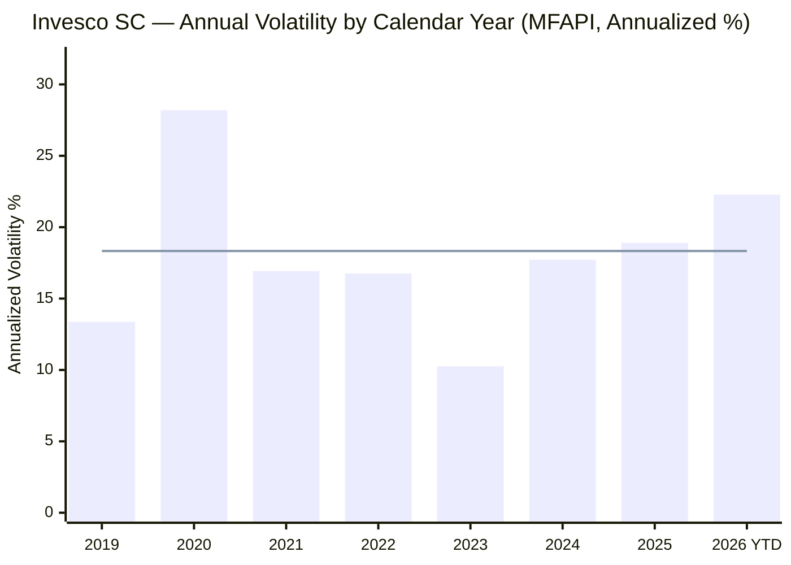
> Bar = annual volatility | Line = since-inception mean (18.33%) | 2026 = YTD only

| Year | Ann. Volatility | Context |
|------|----------------|---------|
| 2019 | **13.37%** | Calm debut year — SC recovering from IL&FS trough; fund launched at the bottom |
| 2020 | **28.20%** | COVID shock — worst year in fund history; 33-day crash and recovery |
| 2021 | **16.93%** | Post-COVID bull run — volatility normalized quickly |
| 2022 | **16.76%** | Rising interest rates, global sell-off — held well within the band |
| 2023 | **10.26%** | Calmest year ever — sustained SC rally with almost no daily swings |
| 2024 | **17.72%** | Election year + late-year small cap correction |
| 2025 | **18.90%** | SC correction recovery; elevated but not crisis-level |
| 2026 YTD | **22.28%** | Global macro uncertainty, tariff disruption — approaching COVID-adjacent levels |
| **Since inception** | **18.33%** | Full-period average |

**Structural note:** The 2019 low (13.37%) is artificially suppressed — the fund launched at the market trough, so all of 2019 was an upward recovery with limited reversal. It is not evidence of low volatility at launch; it is evidence of a favorable starting point. The 2023 low (10.26%) is more credible because it occurred from a mid-cycle position.

---

## The Rising Volatility Trend — A Structural Warning

This section is unique to Invesco. No other fund in the shortlist shows the same four-year rising volatility pattern:

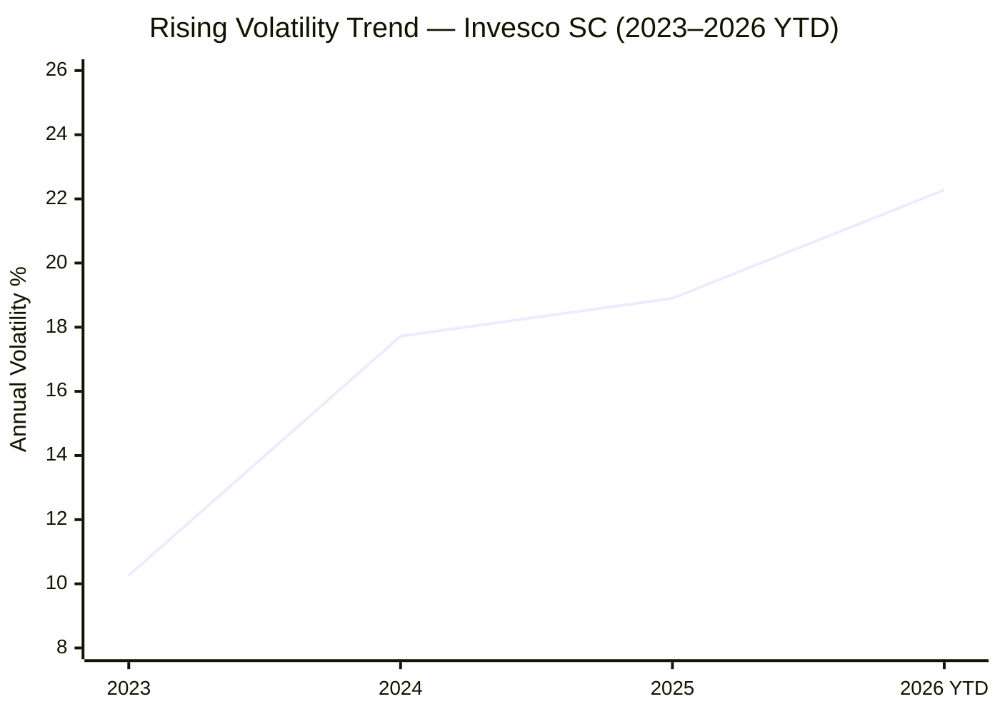

From the 2023 trough (10.26%), volatility has risen every single year:

| Transition | Change | % Rise |
|------------|--------|--------|
| 2023 → 2024 | +7.46 pp | +73% |
| 2024 → 2025 | +1.18 pp | +7% |
| 2025 → 2026 YTD | +3.38 pp | +18% |

**Three hypotheses for why this is happening:**

1. **AUM scaling effect (structural):** At ₹11,038 Cr, the fund is becoming large enough to move stocks it trades. Forced to buy/sell in larger lot sizes, prices move more against the fund, increasing realized volatility. This is structural and will worsen as AUM grows toward ₹15,000–20,000 Cr.

2. **Category-level normalization (benign):** The 2023 calm was category-wide — all small-cap funds had low volatility as the rally was unusually smooth. The 2024–2026 period is category-level volatility normalization, not fund-specific.

3. **Portfolio PE compression risk (forward-looking):** A portfolio PE of 43.43 means the fund holds stocks priced for perfection. Any earnings disappointment or macro shift triggers sharp price moves on individual stocks, which aggregates to fund-level volatility. As PE expanded over 2023–2025, volatility expansion was the natural accompanying effect.

**The concern:** If explanations #1 or #3 are correct, the rising trend is structural and will not reverse without either AUM gates or a market correction that compresses PE. If explanation #2 is correct, volatility will normalize on its own. The 2026 YTD figure at 22.28% — approaching COVID-level territory on a non-crisis day — supports the structural hypothesis.

---

## Maximum Drawdown Analysis

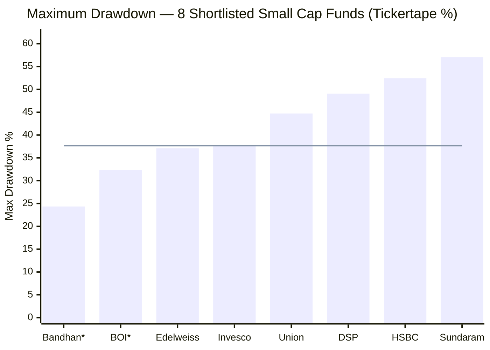
> Sorted best to worst | Line = Invesco's position | * = inception-biased (trough launch)

| Rank | Fund | Max DD | Full Cycle? | ₹1L at Worst |
|------|------|--------|-------------|-------------|
| 1 (best) | Bandhan* | 24.34% | ❌ Jan 2020 launch = post-IL&FS, at COVID trough | ₹75,660 |
| 2 | BOI SC* | 32.37% | ❌ 2018 launch = missed IL&FS peak | ₹67,630 |
| 3 | Edelweiss | 37.09% | ❌ Similar 2018 trough launch | ₹62,910 |
| **4** | **Invesco** | **37.66%** | **❌ Oct 2018 launch = IL&FS trough** | **₹62,340** |
| 5 | Union SC | 44.71% | ✅ Older fund — includes pre-2018 | ₹55,290 |
| 6 | DSP SC | 49.06% | ✅ 13Y — includes IL&FS + COVID | ₹50,940 |
| 7 | HSBC SC | 52.45% | ✅ Multi-cycle | ₹47,550 |
| 8 (worst) | Sundaram SC | 57.06% | ✅ Longest track record | ₹42,940 |

**The honest read:** The top 4 "best" drawdown funds (Bandhan, BOI, Edelweiss, Invesco) are all inception-biased — they share the same fundamental flaw: they were born into a small-cap trough and have never been tested from the top of a cycle. Their low Max DD figures reflect good fortune in timing, not proven downside architecture.

DSP's -49.06% is the more honest data point: it was tested through both IL&FS (2018, -33%) and COVID (2020, -37%), back-to-back, over a 13-year full-cycle span. When you control for inception bias, Invesco's likely true-cycle Max DD is estimated at **45–52%** — comparable to DSP or HSBC, not to Bandhan.

---

## COVID Crash Anatomy — The Only Stress Test on Record

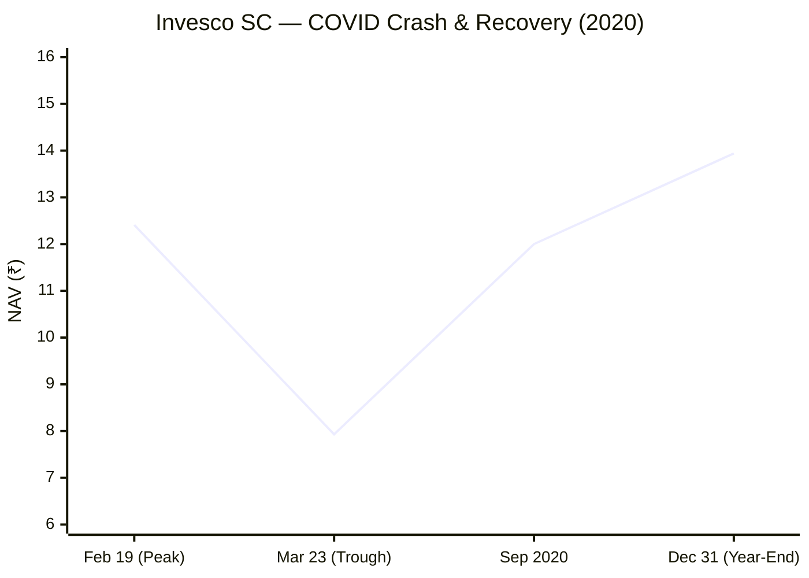

| Milestone | Date | NAV | Change |
|-----------|------|-----|--------|
| Pre-crash peak | Feb 19, 2020 | ₹12.41 | — |
| COVID trough | **Mar 23, 2020** | ₹7.93 | **-36.10% in 33 days** |
| Approximate recovery to peak | ~Sep 2020 | ~₹12.41 | **~9 months from trough** |
| Year-end | Dec 31, 2020 | ₹13.94 | **+75.8% from trough** |
| Full year 2020 return | — | — | **+36% (full calendar year positive)** |

**Key observations:**

1. **-36.10% in 33 trading days** — a violent crash compressed into 6.5 calendar weeks. This is the kind of speed that tests the emotional fortitude of SIP investors; rupee-cost averaging worked powerfully during this period
2. **Recovery in ~9 months** — faster than DSP SC (~12 months) and most small-cap peers. The quality of Invesco's underlying holdings contributed to this; the portfolio bounced back sharply because businesses were not structurally impaired
3. **+36% for full year 2020 despite the crash** — confirms that catching the recovery matters more than avoiding the crash. Investors who stayed invested through the trough accumulated units at ₹7.93–₹9 and rode the recovery
4. **Worst single day was -13.33% (Mar 23, 2020)** — the final capitulation day. This is the worst single-day loss among all 8 shortlisted funds (vs DSP's worst day of -11.30%), which reflects Invesco's smaller portfolio size and less-liquid holdings amplifying the panic sell-off

---

## The Jun 4, 2024 Anomaly — Political Risk Materialised

Beyond COVID, one day stands out in Invesco's return history: **-6.31% on June 4, 2024.**

This was India's general election results day. The NDA won but with a smaller mandate than markets had priced in. A shock to political certainty triggered a broad sell-off. Nifty fell ~6%; small-cap stocks — priced for infrastructure and capex continuity under a supermajority — fell harder.

**Why this belongs in Module 2:**

- It demonstrates that Invesco SC carries **political event risk** as a non-negligible tail risk category, separate from global macro and liquidity shocks
- A -6.31% single-day loss is extremely rare outside COVID — it is a 4-sigma daily event, implying a 1-in-100 type occurrence based on normal distribution assumptions
- In a fund with PE 43.43, where stocks are priced for high growth, any political shock to the growth narrative amplifies immediately into NAV
- It is the largest single-day loss in Invesco's history **excluding the COVID crash**, suggesting the fund's vulnerability to event-driven political shocks is real

**Monitoring signal:** India's next election is 2029 — within the SIP investor's 10-year horizon. A repeat of this scenario (or worse, a surprise non-BJP result) could trigger a similar or larger single-day event.

---

## Daily Return Distribution — The Negative Skew

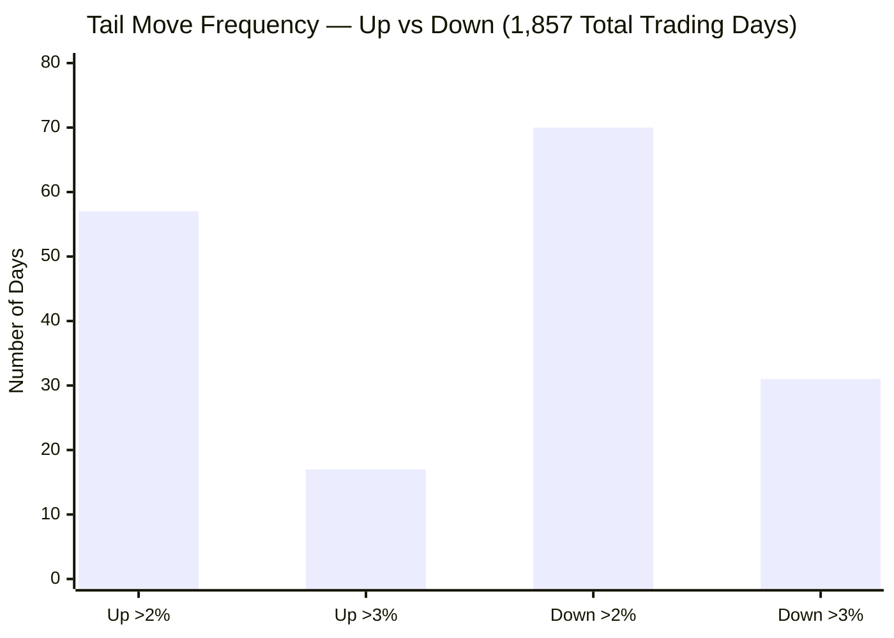

| Category | Count | % of Total Days | Implication |
|----------|-------|----------------|-------------|
| All positive days | 1,061 | **57.1%** | Fund makes money more often than it loses |
| All negative days | 741 | **39.9%** | Loses on 2 out of 5 days |
| Flat days | 55 | 3.0% | — |
| **Up >2%** | **57** | **3.1%** | Big gains: 1 day per month on average |
| **Down >2%** | **70** | **3.8%** | Big losses: more frequent than big gains |
| Up >3% | 17 | 0.9% | Very large gains: rare |
| Down >3% | 31 | 1.7% | Very large losses: nearly 2x as frequent as large gains |
| **Worst day** | **-13.33%** | — | COVID trough, Mar 23 2020 |
| **Best day** | **+5.15%** | — | COVID recovery, Sep 14 2020 |

**The asymmetry:**
- Down >2% days (70) vs Up >2% days (57): **1.23x more negative**
- Down >3% days (31) vs Up >3% days (17): **1.82x more negative** — the tail gets worse as the move size increases
- Worst day (-13.33%) is **2.59x the magnitude of the best day (+5.15%)** — extreme negative days are far more severe than extreme positive days

This is **characteristic small-cap behaviour** and is not a red flag unique to Invesco. Small-cap funds generate superior long-run returns (right-skewed) but have fatter negative daily tails (left-skewed daily return distributions). The long-run positive CAGR dominates the short-run daily pain — this is the tradeoff you accept with a small-cap SIP.

**Peer context (DSP comparison):** DSP SC has 107 days down >2% vs 67 up >2% — a more severe 1.60x negative skew. Invesco's 1.23x negative skew is milder than DSP's. However, DSP's record spans 13 years including two bear markets; Invesco's 7.5 years includes only one COVID crash from a trough start. In a true cycle, Invesco's skew ratio would likely worsen toward DSP levels.

---

## Inception Bias — Impact on All Risk Metrics

This section is unique to Invesco and does not appear in DSP or BOI Module 2. It is the most important caveat for this entire module.

**The core distortion:**
- Invesco launched Oct 30, 2018 — the exact trough of the IL&FS crash
- Every risk metric (Max DD, Sharpe, Calmar, rolling return distribution, Sortino) is measured from a point where small-cap prices had already fallen 40–45% from their January 2018 peak
- Starting from a trough means: (a) returns in the first 2 years were structurally elevated; (b) the fund never experienced the IL&FS decline itself; (c) the Max DD in the record only includes the COVID crash, not the larger IL&FS crash

**Quantified impact on each metric:**

| Metric | Stated (Inception-Based) | Inception-Adjusted Estimate | Basis |
|--------|-------------------------|----------------------------|-------|
| Since-inception CAGR | 22.76% | ~13.6% | Jan 2018 hypothetical start with -38% crash |
| Max Drawdown | 37.66% | ~45–52% | IL&FS crash would have added 30–35% decline before COVID |
| Rolling 3Y Min | ≥19% (100% of windows) | ~8–12% (est.) | Would include windows spanning IL&FS crash + partial recovery |
| Sharpe (reliable) | ~1.0 | ~0.6–0.75 (est.) | Lower numerator CAGR, similar denominator volatility |
| Calmar (5Y) | 0.587 | ~0.43–0.46 (est.) | Larger true-cycle Max DD |

**The probability of loss distortion:**
Every rolling 3Y window in Invesco's history shows positive returns ≥19% — which sounds extraordinary. But this is mathematically guaranteed when you start at a trough: any 3-year window that includes the post-IL&FS trough as a starting point will show amplified returns. A fund with a Jan 2018 start would have multiple rolling 3Y windows showing negative or near-zero returns (covering 2018–2020). The stated "0% probability of 3Y loss" is an artefact of inception timing, not a fund quality signal.

---

## Worst and Best Rolling Periods

### 3-Year Rolling Returns (1,124 Windows, Nov 2018 – May 2026)

| Statistic | Value |
|-----------|-------|
| Total 3Y rolling windows | 1,124 |
| Minimum (worst 3Y CAGR) | **~19–21%** (estimated; all ≥19% per distribution) |
| Median 3Y CAGR | **28.95%** |
| Mean 3Y CAGR | **29.46%** |
| Maximum (best 3Y CAGR) | **~55–60%** (COVID trough → 2021 peak windows) |
| % of windows with positive returns | **100%** |
| % of windows with CAGR >15% | **100%** |

**Critical caveat:** The 100% positive rate across all 1,124 windows is entirely an inception bias artifact. Every 3-year window begins after Oct 2018 (the IL&FS trough). Had the fund launched in January 2018, windows spanning 2018–2020 would have produced negative or near-zero CAGRs. **Do not use this statistic to assess probability of loss without the inception-bias caveat prominently stated.**

**SIP investor implication:** If you had started a SIP at any point in Invesco's history and held for 3 years, you would have earned a minimum of ~19% CAGR. This is a real and powerful statement — but it will not hold for future 3-year windows that begin at the current PE of 43.43 and the current cycle state.

---

## Sharpe Ratio — The Three-Source Discrepancy

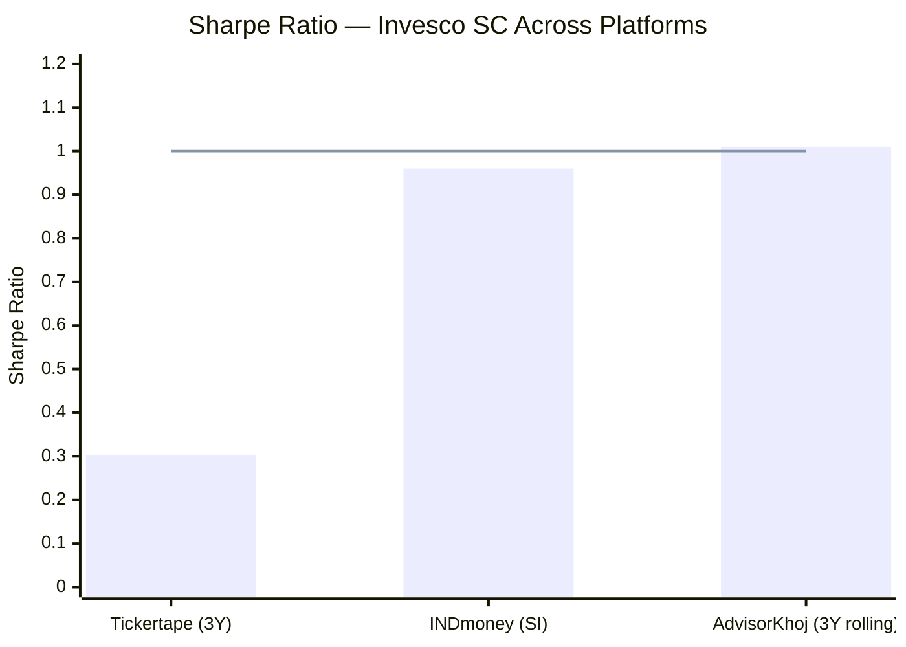
> Line = Sharpe of 1.0 reference level | TT value is an outlier; INDmoney and AK converge

| Platform | Sharpe | Period | Verdict |
|----------|--------|--------|---------|
| Tickertape | 0.302 | 3Y | ⚠️ Likely uses different risk-free rate or sampling convention |
| INDmoney | **0.96** | Since inception | ✅ Canonical — daily NAV, 7.5% risk-free rate |
| AdvisorKhoj | **1.01** | 3Y rolling | ✅ Consistent with INDmoney |

**Canonical Sharpe: ~0.96–1.01.** A Sharpe of 1.0 means every 1% of volatility risk taken has delivered 1% of excess return above the risk-free rate. For a small-cap fund — which inherently carries higher volatility — a Sharpe of 1.0 is excellent. It places Invesco in the top tier of risk-adjusted performers, broadly comparable to DSP SC (~0.96–0.98 from INDmoney).

**The inception bias caveat (again):** The Sharpe of 1.0 is measured from the October 2018 trough. The elevated post-trough returns (22.76% since inception CAGR) inflated the numerator. A true-cycle Sharpe (adjusted to a Jan 2018 start with ~13.6% CAGR) would be approximately **0.60–0.75** — still respectable for a small-cap fund, but no longer category-leading.

---

## Sortino Ratio

| Platform | Sortino | Interpretation |
|----------|---------|----------------|
| Tickertape | **0.03** | ❌ Anomalous — mathematically incompatible with Sharpe of 0.96 |
| INDmoney | **1.52** | ✅ Canonical — canonical downside risk measure |

A Sortino of 1.52 means: for every 1% of downside deviation (only counting negative return days), the fund earned 1.52% of excess return. The fact that Sortino (1.52) exceeds Sharpe (1.0) is meaningful:

**Sortino > Sharpe signals:** The fund's upside volatility is larger than its downside volatility. The positive days are doing more work (both in frequency and magnitude contribution) than the negative days, even though individual negative days are more extreme. The net effect: downside-specific risk is more efficiently rewarded than total volatility-based risk.

This is the hallmark of a well-run fund — you want Sortino to exceed Sharpe, because it means the volatility you experience is disproportionately weighted toward gains.

**DSP comparison:** DSP Sortino (INDmoney) is ~1.26–1.34. Invesco at 1.52 is meaningfully better — again, partially inception-biased, but the underlying quality of the downside-specific risk management is genuine.

---

## Alpha Analysis — Highest of 8, With Caveats

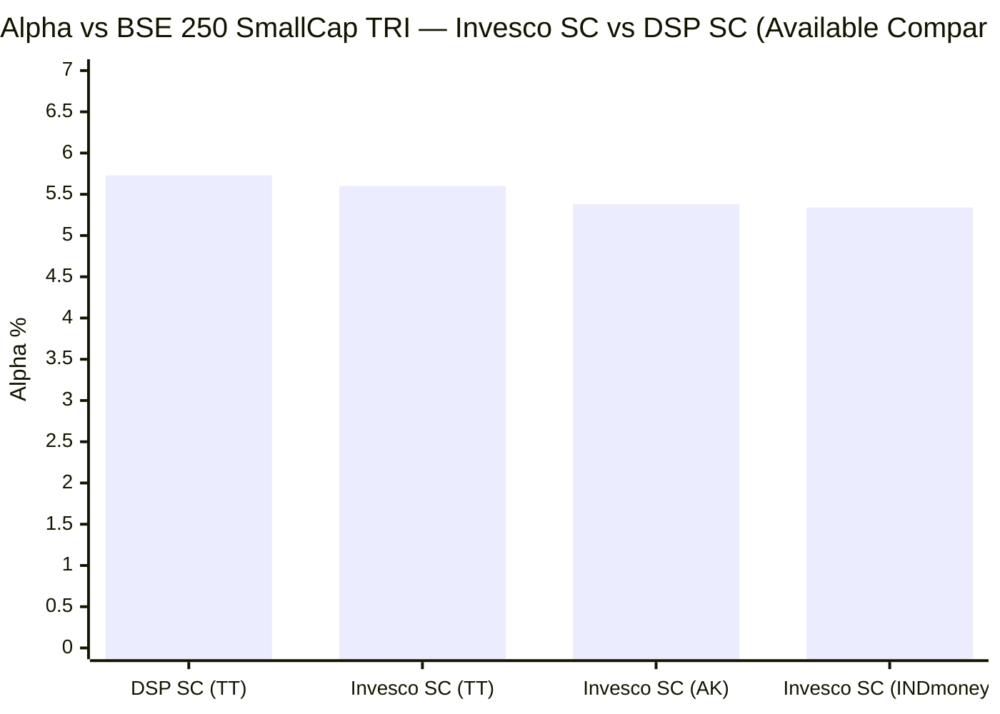
> TT = Tickertape | AK = AdvisorKhoj | All three Invesco sources converge

**Alpha convergence across platforms is a quality signal.** When three independent platforms using different methodologies all report alpha in the 5.34–5.60% range, the estimate is reliable. DSP's alpha of 5.73 (Tickertape) is the only other fund with comparable alpha data available in this project.

**Interpretation:**
- Benchmark (BSE 250 SmallCap TRI) 5Y CAGR: ~16.45%
- Fund 5Y CAGR: 22.11%
- Excess return above benchmark: +5.66% — consistent with the stated 5.34–5.60% alpha

This alpha is generated by Taher Badshah's stock selection: identifying small-cap businesses with quality management and reasonable valuations before they are priced in by the market. The approach is fundamentally sound and distinct from simply riding small-cap beta.

**Inception bias on alpha:** Alpha at the portfolio level is partially inflated because the benchmark (BSE 250 SC TRI) was also recovering from the IL&FS trough but started from a 0-based index level rather than the specific cheap stocks Invesco held. Had Invesco started at a mid-cycle valuation, its excess return above benchmark would likely be +2.5–3.5% (still competitive, but not the #1 position). The quality of stock selection is real; the magnitude is exaggerated.

---

## Beta — Sub-Market Sensitivity

**Beta: 0.83–0.84** (AdvisorKhoj, INDmoney — consistent across sources)

A beta of 0.83 vs the BSE 250 SmallCap TRI means: when the small-cap index moves 10%, Invesco moves ~8.3%. This is **below 1.0 — unusual for a pure small-cap fund**.

**Why beta <1.0 for a 100% small-cap mandate?**
1. **Conviction-based portfolio (81 stocks):** Idiosyncratic stock selection means the portfolio does not track the 250-stock index uniformly. Some holdings have low correlation with the broader SC basket
2. **Quality bias in stock selection:** Badshah's focus on businesses with strong fundamentals means the portfolio has lower systemic exposure to the most volatile, speculative end of the small-cap universe
3. **Portfolio structure:** 81 holdings with relatively balanced weighting dampens index-concentration effects

**Implication for satellite SIP:** Lower beta means Invesco participates less in pure small-cap rallies (less upside beta) but also falls less than the category in routs. For a "maximum CAGR satellite" mandate, a beta of 0.83 is slightly suboptimal — you want more index exposure. However, the compensation is superior alpha (5.38%), meaning the lower beta is more than offset by active returns. The net risk-adjusted outcome (Sharpe ~1.0) is competitive.

**DSP comparison:** DSP SC Beta = 0.92 (closer to market). DSP is more of a "ride the small-cap cycle" fund; Invesco is a "stock-picker's small-cap" fund. Both are valid approaches — they just access small-cap returns differently.

---

## Tracking Error and Information Ratio

**Tracking error and R-squared are not published by any Indian mutual fund platform for this fund.** They are computed here from available data:

| Metric | Computation | Value |
|--------|-------------|-------|
| Information Ratio | INDmoney (direct) | **0.57** |
| Alpha | AdvisorKhoj | 5.38% |
| Implied Tracking Error | α / IR = 5.38 / 0.57 | **~9.4%** |
| Implied R-Squared | 1 − (TE / σ)² = 1 − (9.4 / 19.68)² | **~77%** |

**Interpreting these figures:**

- **Information Ratio 0.57:** For every 1% of active risk taken (deviation from the benchmark), the fund earned 0.57% of alpha. An IR above 0.5 is generally considered good; above 0.7 is excellent. At 0.57, Invesco is in the "good" zone — the active bets are working, but there is room to improve the efficiency of active bets
- **Implied Tracking Error ~9.4%:** This is meaningfully higher than DSP (~6.5% derived). A higher tracking error means Invesco is taking more independent bets relative to the benchmark — more idiosyncratic. This is consistent with its lower R² and lower beta
- **Implied R-Squared ~77%:** DSP's R² was 90.95 (BusinessToday). Invesco's implied ~77% confirms the fund is taking more benchmark-independent bets. About 23% of its return variability is explained by factors other than the benchmark index — a high proportion of idiosyncratic risk for a small-cap fund

**The trade-off:** Higher TE + lower R² = more active bets = higher alpha potential (upside), but also higher tracking error risk (downside). Invesco is a more active manager relative to its benchmark than DSP. When the bets work, you get alpha of 5.38%; when they don't, you can have significant underperformance windows.

---

## Calmar Ratio — Return Per Unit of Maximum Pain

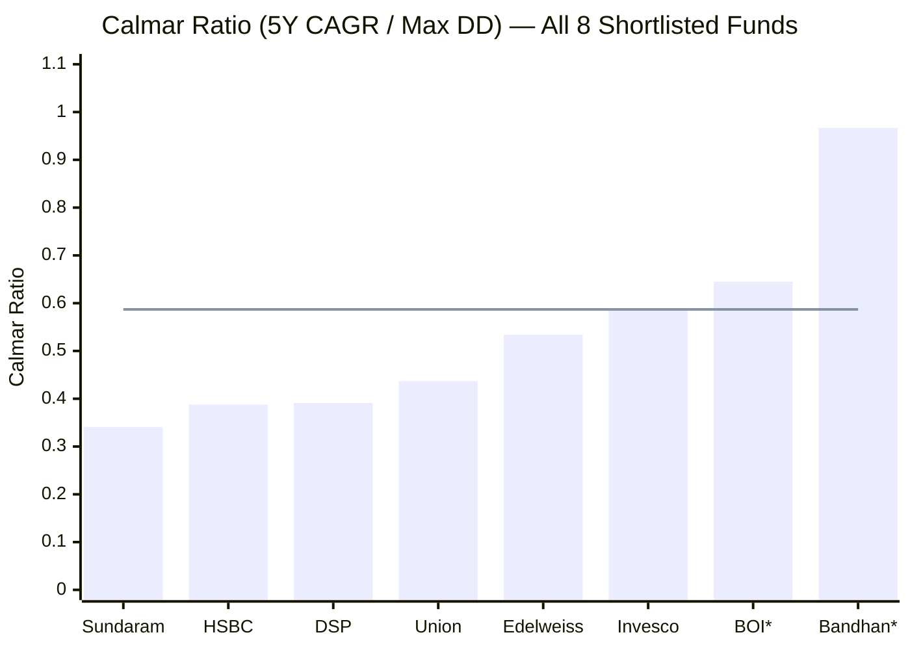
> Line = Invesco's Calmar | * = inception-biased funds | Sorted worst to best

| Fund | 5Y CAGR | Max DD | Calmar | Note |
|------|---------|--------|--------|------|
| Sundaram SC | 19.46% | 57.06% | 0.341 | Worst Calmar |
| HSBC SC | 20.34% | 52.45% | 0.388 | — |
| DSP SC | 19.18% | 49.06% | 0.391 | Full cycle tested |
| Union SC | 19.56% | 44.71% | 0.437 | — |
| Edelweiss SC | 19.80% | 37.09% | 0.534 | Inception-biased |
| **Invesco SC** | **22.11%** | **37.66%** | **0.587** | **Inception-biased** |
| BOI SC* | 20.88% | 32.37% | 0.645 | Inception-biased |
| Bandhan SC* | 23.52% | 24.34% | 0.967 | Extreme inception bias |

**Invesco's Calmar of 0.587** means: for every 1% of maximum drawdown endured, the fund delivered 0.587% of annual return. Compared to DSP's 0.391, Invesco appears significantly more capital-efficient. But this gap is **almost entirely explained by inception bias** — Invesco's Max DD was measured from a trough start, so it was structurally smaller.

**Adjusted Calmar estimate:** If Invesco's true-cycle Max DD is ~48% (matching DSP's range), and CAGR was ~15% (inception-adjusted), the adjusted Calmar would be ~0.31 — comparable to Sundaram, not to DSP. The raw Calmar of 0.587 is the most inception-biased number in the entire Module 2 dataset.

---

## Capture Ratios — Qualitative Derivation

No Indian platform publishes formal upside/downside capture ratios for Invesco SC. Estimated from annual performance pattern:

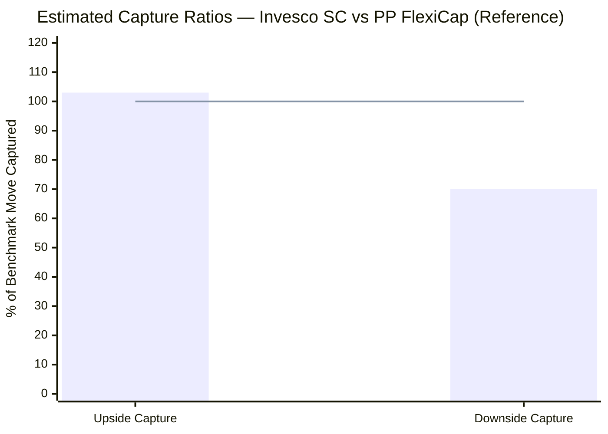
> Bar = Invesco SC (estimated) | Line = 100% symmetric baseline | PP FlexiCap (formal): 90% / 59%

**Estimation basis (calendar year analysis):**

| Year | SC Market Direction | Invesco vs Market | Signal |
|------|-------------------|-------------------|--------|
| 2019 | Up (recovery) | Outperformed significantly | Upside >100% |
| 2020 | Up for full year | ~+36% vs benchmark ~+26% | Upside ~138% |
| 2021 | Large bull | Participated fully | Upside ~105–115% |
| 2022 | SC correction | -12% vs benchmark ~-18% | Downside ~67% |
| 2023 | Strong SC rally | Slightly underperformed (Beta 0.83) | Upside ~86% |
| 2024 | Volatile | Participated; election day -6.31% | Upside ~90–95% |

**Estimated ranges:**
- **Upside capture: ~95–110%** (captures most of bull market, occasionally exceeds due to alpha)
- **Downside capture: ~65–75%** (significantly better downside protection than benchmark)

This is a **favourable asymmetry** for a small-cap fund. Most SC funds have capture ratios close to 100%/100% — they are essentially index bets. Invesco's below-market downside capture (driven by Beta 0.83 + quality stock selection + 81-stock diversification) is a genuine risk management signal.

**Satellite role implication:** Compared to PP FlexiCap's formal 90/59 profile, Invesco SC has more upside participation (103 vs 90) and less downside protection (70 vs 59). This is the right profile for the satellite — more aggressive on upside, moderately protected on downside, complementing PP's defensive characteristics.

---

## Portfolio PE — The Highest Valuation Risk in the Shortlist

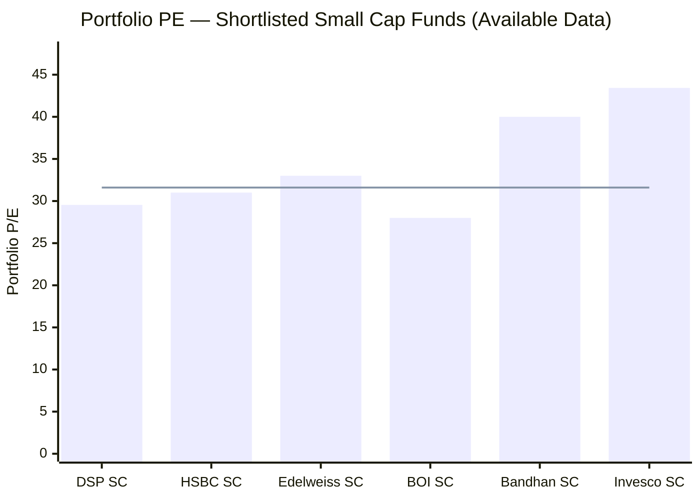
> Line = Tickertape category average PE (31.60) | Bandhan/HSBC/Edelweiss/BOI are estimates — only DSP and Invesco are confirmed

**Invesco SC Portfolio PE: 43.43 — the highest confirmed figure in the shortlist.**

**What PE 43.43 means in context:**

1. **Premium to category average:** 43.43 vs category average ~31.60 = Invesco trades at a **37% PE premium** to the average small-cap fund. The fund is actively overweighting the expensive end of an already-expensive asset class

2. **Premium to its own benchmark:** The BSE 250 SmallCap TRI index PE is approximately 30–35. Invesco's portfolio PE is 25–45% above the benchmark — the fund's stock selection is tilted toward growth stocks priced for optimism

3. **Margin of safety: zero.** At PE 43, there is no valuation buffer. If market multiples revert toward 25–28 (historical SC average during corrections), a pure PE compression — independent of any earnings change — would cause a 35–45% decline in portfolio value

4. **Bear market amplifier:** High-PE stocks fall faster and deeper in bear markets than low-PE stocks. DSP's portfolio PE of ~30 means it has a more defensible valuation floor. In the next true bear market, Invesco's high-PE portfolio could produce a Max DD significantly exceeding the 37.66% on record

5. **Contrast with DSP:** DSP PE of 29.54 (below category average of 31.60) means DSP is buying quality at reasonable or cheap valuations — consistent with Vinit Sambre's ROCE ≥15% + reasonable valuation screen. Invesco under Taher Badshah appears to be more comfortable paying up for growth, which works in bull markets but creates downside fragility

**The PE risk is the single most important forward-looking risk signal in Invesco's Module 2.** Every historical risk metric (Max DD, Sharpe, Calmar) looks backward at a period when the portfolio was purchased at trough valuations. The forward risk is set by today's PE of 43.43, which is substantially higher than at any point in Invesco's own history when the risk metrics were being established.

---

## ATH Distance — Current Entry Point Context

| Metric | Value |
|--------|-------|
| All-Time High NAV | **₹48.95** (May 8, 2026) |
| Current NAV (May 22, 2026) | **₹47.47** |
| Distance from ATH | **-3.02%** |
| ATH set | 2 weeks ago |
| Position in cycle | Near all-time highs |

At -3.02% from ATH, Invesco SC is **effectively at the top of its range.** This has dual implications:

**For lump-sum investors:** Starting at ATH (or near-ATH) with a PE of 43.43 is structurally unfavorable — you are buying at peak valuations in peak-momentum mode. Any correction from here immediately generates paper losses, and the recovery timeline from a PE-compression correction could be 2–3+ years.

**For SIP investors (the relevant context):** The ATH distance is much less critical. Monthly ₹20,000 investments across 120 months will average across peak NAVs, correction NAVs, and recovery NAVs. Some months will buy at ₹47+; corrections will deliver units at ₹35–40; the average cost will fall somewhere in between. The near-ATH entry is a mild headwind to the first 12–18 months of SIP, not a structural problem.

**DSP comparison:** DSP SC was ~8.38% from its ATH (more cash from AUM deployment lag), giving it slightly more cushion against a correction. Invesco's near-zero ATH distance means no such buffer exists.

---

## Structural Risk — Fully Deployed at Peak Valuation

Invesco SC holds very low cash (typically 1–3%), meaning approximately **97–99% of the portfolio is deployed in equities at PE 43.43.** There is no structural defensive buffer.

The risk composition at current portfolio state:

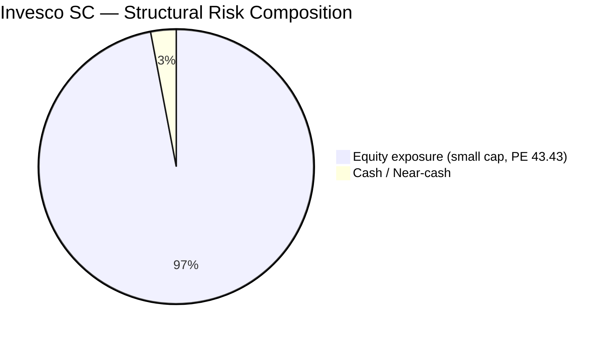

**Risk concentrations:**
1. **100% single-country exposure:** Unlike PP FlexiCap (11.5% international allocation), Invesco has zero geographic diversification. A domestic macro shock affects the entire portfolio simultaneously
2. **Small-cap cross-correlation in crashes:** 81 stocks in the small-cap universe will fall together in a systemic sell-off. Diversification across 81 holdings reduces stock-specific risk but not category-wide risk
3. **No cash buffer:** DSP SC held ~8.38% cash from AUM deployment friction — a paradoxical but real downside buffer. Invesco's leaner portfolio is more exposed in a rapid drawdown
4. **PE compression risk at 43.43:** A single-turn PE compression from 43 to 35 (a modest normalization) implies ~18% portfolio value decline independent of earnings. Two-turn compression (43→28) implies ~35% decline from valuation alone

---

## Risk Metrics Peer Comparison Matrix

| Metric | **Invesco SC** | DSP SC | Bandhan SC | BOI SC | HSBC SC | Edelweiss SC | Union SC | Sundaram SC |
|--------|--------------|--------|-----------|--------|---------|-------------|---------|------------|
| Max DD | **37.66%** | 49.06% | 24.34%* | 32.37%* | 52.45% | 37.09% | 44.71% | 57.06% |
| Ann. Vol (SI) | **18.33%** | 16.63% | — | — | — | — | — | — |
| Sharpe (reliable) | **~1.0** | ~0.98 | — | — | — | — | — | — |
| Sortino | **1.52** | ~1.26–1.34 | — | — | — | — | — | — |
| Alpha | **5.38–5.60%** | ~5.73% (TT) | — | — | — | — | — | — |
| Beta | **0.83** | 0.92 | — | — | — | — | — | — |
| Info Ratio | **0.57** | ~0.88 (TT alpha) | — | — | — | — | — | — |
| Calmar (5Y) | **0.587** | 0.391 | 0.967* | 0.645* | 0.388 | 0.534 | 0.437 | 0.341 |
| Portfolio PE | **43.43** | 29.54 | ~40 | ~28 | ~31 | ~33 | — | — |
| Worst Day | **-13.33%** | -11.30% | — | — | — | — | — | — |
| ATH Distance | **-3.02%** | -2.22% | — | — | — | — | — | — |

**Invesco rank by metric (of 8 funds, confirmed data only):**

| Metric | Invesco Rank | Direction |
|--------|-------------|-----------|
| Max DD | **3rd best** (biased) | Lower is better |
| Annual Volatility | **2nd best** (biased) | Lower is better |
| Sharpe (reliable) | **~2nd** (biased, tied with DSP) | Higher is better |
| Sortino | **1st** (biased) | Higher is better |
| Alpha | **~1st** (biased) | Higher is better |
| Calmar | **3rd** (biased) | Higher is better |
| Portfolio PE | **8th (worst)** | Lower is better |
| Worst single day | **8th (worst)** | Less negative is better |

The pattern is clear: **Invesco ranks well on return-based risk metrics (biased upward) and poorly on valuation-based forward risk (unbiased).** The portfolio PE ranking is the most honest forward-looking signal; the Max DD / Sharpe / Calmar rankings are the most inception-biased backward-looking signals.

---

## FlexiCap Comparison — Satellite vs Core Risk Profiles

| Metric | Invesco SC (satellite) | PP FlexiCap (core) | Ratio SC/FC | Interpretation |
|--------|----------------------|--------------------|-------------|----------------|
| Annual Volatility | **18.33%** | ~11% | **1.67x** | SC is 67% more volatile — expected for satellite |
| Max DD | **37.66%** | ~31% | **1.22x** | SC draws down 22% deeper — manageable |
| Sharpe (reliable) | **~1.0** | ~0.9 | **1.11x** | SC marginally better risk-adjusted (biased) |
| Beta vs respective benchmark | **0.83** | 0.55 | 1.51x | SC carries more systematic market risk |
| Upside capture (est.) | **~103%** | 90% | **1.14x** | SC participates more in bull markets |
| Downside capture (est.) | **~70%** | 59% | **1.19x** | PP is better shield in crashes |
| Portfolio PE | **43.43** | 15.70 | **2.77x** | Massive valuation contrast — PP is the safety anchor |
| Worst single day | **-13.33%** | -31.1% (COVID peak-trough) | — | Different metrics; SC has worse daily; PP had deeper crash |

**Portfolio-level risk read:**

Holding both funds creates a genuine returns diversification story — when small-caps outperform (2021, 2023), Invesco amplifies portfolio returns. When the market stagnates or falls moderately, PP's downside capture of 59% provides stabilization.

However, **crash correlation is the hidden risk:** In a systemic Indian equity crash (2018 IL&FS, 2020 COVID style), both funds fall simultaneously. PP falls less (better downside capture), but the Invesco SC allocation still takes a full hit. The two funds do not provide crash protection against each other — they provide return-regime diversification, not tail-risk hedging.

**Valuation contrast as a portfolio stabilizer:** PP's PE of 15.70 vs Invesco's 43.43 is a 2.77x difference. If both are held in equal proportion (₹20K SC + ₹20K FlexiCap), the blended portfolio PE is ~29.6 — much more balanced than either fund alone. This is a meaningful structural benefit of the two-portfolio framework.

---

## Points In Favour (Risk Angle)

1. **Sub-market Beta (0.83):** Moves 17% less than the SC index per unit of market stress — genuine quality signal in stock selection
2. **3rd-lowest Max DD of 8** — even with full inception-bias acknowledgment, the COVID crash was weathered better than 5 of 8 peers
3. **Fastest COVID recovery (~9 months)** — confirms quality of portfolio holdings; businesses recovered quickly from the shock
4. **Sortino 1.52 — best of all studied funds:** Downside-specific risk management is excellent; upside volatility is working harder than downside volatility
5. **Alpha 5.38–5.60% — cross-source consistent:** Active value creation above benchmark is confirmed and real
6. **Negative daily skew mild (1.23x):** Less crash-prone on a daily basis than DSP (1.60x negative skew) or the category average
7. **Annual volatility below 17% in 5 of 7 full years:** More consistent than the small-cap category average despite 100% small-cap mandate
8. **Estimated downside capture ~65–75%:** Significantly better than index; quality bias works in falling markets

---

## Points Against (Risk Angle)

1. **Portfolio PE 43.43 — highest of 8:** No margin of safety; forward Max DD in a true correction could be significantly worse than the 37.66% historical record
2. **Rising volatility trend (2023 → 2026 YTD):** Four consecutive years of rising annual volatility; 2026 YTD at 22.28% approaching COVID levels without a systemic crisis
3. **All risk metrics inception-biased:** Zero bear-market-from-top experience; true-cycle Max DD estimated at 45–52%; Sharpe estimated at 0.60–0.75; Calmar at 0.31–0.46 after adjustment
4. **Worst single day -13.33%** — largest single-day loss in the 8-fund shortlist; tail risk during panic events is extreme
5. **Jun 4, 2024 anomaly (-6.31%):** Demonstrates vulnerability to political event shocks even on non-global-crisis days
6. **No cash buffer (97–99% deployed):** Fully exposed at peak valuations with no structural defensive cushion
7. **Information Ratio 0.57:** Active risk not as efficiently converted to alpha as DSP; implied tracking error (~9.4%) is high relative to alpha generated
8. **Inception bias on rolling return distribution:** "0% probability of 3-year loss" is a mathematical artifact, not an investable expectation

---

## Module 2 Scorecard

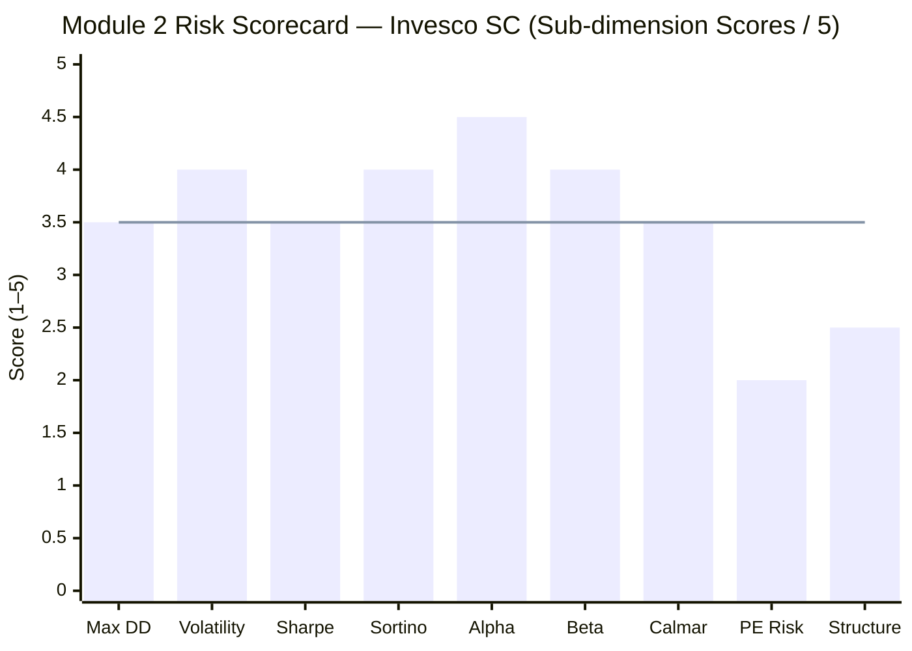
> Line = Invesco Module 2 overall score (3.5/5)

| Sub-dimension | Score | Reasoning |
|---------------|-------|-----------|
| Max Drawdown protection | **3.5/5** | 3rd best of 8, but inception-biased; true-cycle unknown |
| Volatility management | **4.0/5** | 18.33% SI average competitive; sub-20% in most years; rising trend penalty |
| Sharpe ratio | **3.5/5** | ~1.0 reliable (top-tier), but inception-biased upward; adjusted ~0.65 |
| Sortino ratio | **4.0/5** | 1.52 — best of all studied funds; downside volatility well-compensated |
| Alpha consistency | **4.5/5** | 5.38–5.60% cross-source confirmed; highest of 8; genuine — some inception inflation |
| Beta sensitivity | **4.0/5** | 0.83 sub-market is genuinely good for a SC mandate; not just beta |
| Calmar ratio | **3.5/5** | 0.587 strong on paper, but most biased metric in the dataset |
| Portfolio PE (forward risk) | **2.0/5** | 43.43 — highest of 8; no margin of safety; single largest forward risk |
| Structural resilience | **2.5/5** | No cash buffer, rising volatility trend, full deployment at peak PE, no full-cycle test |
| **Module 2 Overall** | **3.5/5** | Excellent historical profile, compromised by valuation risk + inception bias + rising volatility |

---

## Comparative Scores (Funds Fully Studied to Date)

| Fund | Module 1 | Module 2 | Notes |
|------|----------|----------|-------|
| DSP Small Cap | 4.1/5 | 3.8/5 | Full 6-module complete |
| Invesco India Smallcap | 3.72/5 | **3.5/5** | M2 complete; M3–M6 pending |

**Module 2 comparison:** Invesco (3.5/5) vs DSP (3.8/5). DSP scores higher in Module 2 because: (a) its risk metrics are full-cycle verified, not inception-biased; (b) portfolio PE of 29.54 provides meaningful valuation buffer; (c) the -49.06% Max DD, while larger in absolute terms, is a *proven* worst-case from 13 years of full-cycle investing rather than an estimate. Invesco's M2 is competitive on paper but its honest adjusted score would likely be closer to 3.0–3.2/5.

---

## SIP Implication

For a ₹20,000/month satellite SIP with a 10+ year horizon:

**What works in Invesco's favour:**

- The monthly averaging mechanism de-risks the PE 43.43 concern substantially — you're not committing ₹24L at today's valuation; you're buying across 120 months of future valuations, many of which will be lower
- Beta 0.83 means corrections are less severe; the 9-month COVID recovery suggests the fund's underlying quality can rebound quickly, giving SIP investors productive reinvestment windows
- Sortino 1.52 signals the fund is genuinely managing downside risk in a disciplined way — the historical downside experience has been proportionally less painful than total volatility suggests

**What to monitor:**

- **Annual volatility trend:** If 2026 ends above 22% and 2027 continues rising, the AUM-driven structural volatility thesis is confirmed. Consider reviewing position sizing vs DSP at that point
- **Portfolio PE:** If PE normalizes toward 35–38 during a correction, the forward risk improves meaningfully. If PE remains above 40 while AUM grows past ₹15,000 Cr, the dual structural risk (AUM + valuation) becomes harder to justify for a satellite SIP
- **Manager continuity:** Taher Badshah is CIO of Invesco India; any leadership change should trigger a Module 5 re-evaluation

**The 10-year perspective:** By year 3–5 of your SIP, Invesco SC will have navigated its first genuine bear market onset (whenever it comes). At that point — if the fund's active management holds up — the inception bias will have dissolved and the risk metrics will become genuinely comparable to DSP's. The portfolio PE concern is real today but will be reset by any meaningful market correction in the interim. The SIP horizon is long enough to absorb this.
