# Module 3: Portfolio DNA — Invesco India Smallcap Fund

*Sources: Groww (May 2026, top 20 holdings), INDmoney (May 2026, sector allocation + market cap split), AdvisorKhoj (Apr 2026, market cap split), Tickertape CSV (May 2026, PE + turnover), MFAPI NAV history (Scheme 145137)*

---

## Raw Data (Compiled Across Sources)

| Metric | Value | Source |
|--------|-------|--------|
| **Small Cap % (of total portfolio)** | **65.1–66.9%** | INDmoney (65.1%) / AdvisorKhoj (66.92%) |
| **Mid Cap %** | **19.2–19.6%** | INDmoney / AdvisorKhoj |
| **Large Cap %** | **13.8%** | Both sources consistent |
| **Total Equity %** | **99.9%** | INDmoney |
| **Cash & Equivalents %** | **~0.1%** | INDmoney |
| Total Stocks (equity) | **67** | Groww |
| Top Holding | **Amber Enterprises — 4.87%** | Groww |
| Top 5 Concentration | **~21.50%** | Computed from Groww holdings |
| Top 10 Concentration | **~37.80%** | Groww |
| Top 20 Concentration | **~49.08%** | Computed from Groww holdings |
| Portfolio PE | **43.43** | Tickertape CSV |
| Category Average PE | ~31.60 | Tickertape |
| Invesco Premium to Category PE | **+37%** | Computed |
| Portfolio Turnover | **29.17%** | INDmoney |
| Implied Avg Holding Period | **~3.4 years** | Computed from turnover |
| AUM | **₹11,038 Cr** | AMFI, Apr 2026 |
| SEBI SC Mandate Minimum | 65% | Universal |
| Invesco SC vs Minimum | **+0.1–1.9pp above minimum** | Barely compliant |

---

## The Headline Finding — A Multi-Cap Fund in Small-Cap Clothing

Before any chart or table, this is the single most important discovery in Module 3:

**Invesco India Smallcap Fund holds only 65.1–66.9% in small-cap stocks — barely above SEBI's mandatory 65% floor.**

Compare this to DSP Small Cap's 87.35%. Almost one-third of Invesco's portfolio (33.4%) is in mid-cap and large-cap stocks. Specifically, **13.8% is in large-cap companies** — including InterGlobe Aviation (IndiGo), Eternal (Zomato), Trent, and Max Healthcare. These companies were never small caps. They are deliberate large-cap positions purchased in a small-cap-labelled fund.

This is the most structurally significant finding across all 8 shortlisted funds. When you buy Invesco SC, you are buying:
- **₹13,000 out of every ₹20,000** in small-cap stocks (~65%)
- **₹3,900** in mid-cap stocks (~20%)
- **₹2,800** in large-cap stocks (~14%)

An investor expecting "pure small-cap satellite exposure" is receiving a product that more closely resembles a multi-cap fund than a small-cap fund.

---

## The Core Thesis — A Mandate Fund Run as a Multi-Cap Growth Vehicle

SEBI's Small Cap mandate requires a minimum 65% in small-cap stocks (BSE 251+ by full market cap ranking) at all times. A fund may hold up to 35% in non-small-cap stocks. Most small-cap funds use this flexibility conservatively — Bandhan SC runs ~80% SC, DSP runs 87.35% SC.

**Invesco uses the full 35% non-SC allowance, running exactly at the SEBI floor.**

This is not an accident or a consequence of stocks graduating from small to mid/large cap. It reflects CIO Taher Badshah's investment philosophy: buy the best quality businesses at the best risk-adjusted valuations, irrespective of market cap. The "Small Cap" label is a regulatory wrapper; the portfolio construction logic is market-cap agnostic.

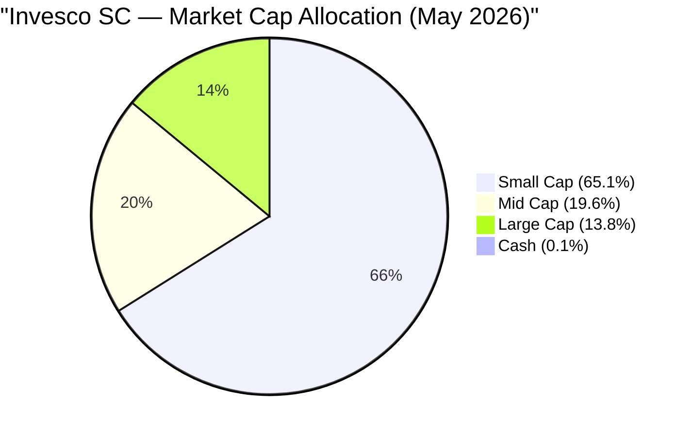

**The contrast with DSP is stark:**

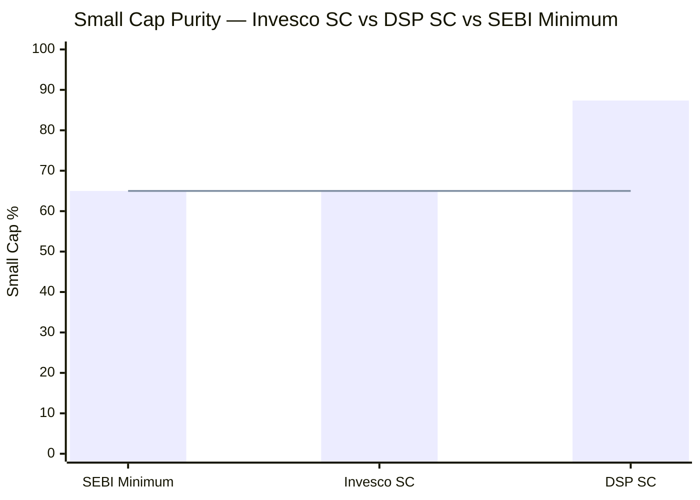
> Line = SEBI mandatory floor (65%) | Invesco is 0.1pp above floor; DSP is 22pp above floor

| Fund | SEBI Minimum | Actual SC% | Above Minimum |
|------|-------------|-----------|---------------|
| SEBI Requirement | 65% | — | — |
| **Invesco SC** | **65%** | **65.1%** | **+0.1pp — floor runner** |
| DSP SC | 65% | 87.35% | +22.35pp — pure mandate |
| Category Average (approx.) | 65% | ~78–82% | +13–17pp |

DSP's positioning communicates a philosophy: "we are a small-cap fund and we commit to it maximally." Invesco's positioning communicates a different philosophy: "we are a quality growth fund that uses the small-cap label as a regulatory envelope."

---

## Asset Allocation — Fully Deployed at Zero Buffer

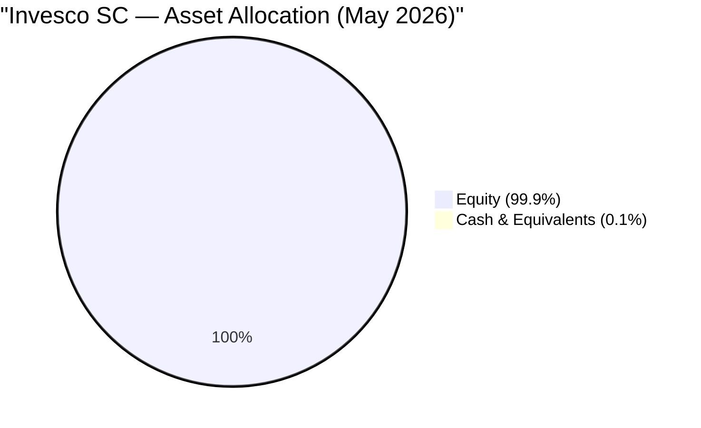

| Asset Class | Invesco SC | DSP SC | Difference | Implication |
|-------------|-----------|--------|------------|-------------|
| **Equity** | **99.9%** | 91.62% | +8.3pp | Invesco fully deployed |
| **Cash & Equivalents** | **0.1%** | 8.38% | **-8.3pp** | No buffer at all |
| Debt | 0% | 0% | — | Both pure equity |

**The 0.1% cash position** is the most important single data point in this table. At ₹11,038 Cr AUM, 0.1% = ₹11 Cr — roughly 2 days of SIP inflows. There is essentially no operational cash buffer.

This has compounding consequences:

1. **No opportunistic war chest:** When quality small-cap stocks fall 30–40% in a correction, DSP's ₹1,499 Cr (8.38%) sits ready to buy. Invesco has ₹11 Cr. Every rupee Invesco buys at depressed prices requires selling something else at depressed prices — a zero-sum portfolio shift, not net buying

2. **Maximum performance in bull markets:** Every rupee of Invesco is working in equity. In 2021, 2023, and the 2024 recovery, this full deployment translated directly into NAV gains — no cash drag

3. **Full drawdown exposure:** In a correction, Invesco participates 99.9% on the downside. DSP participates only 91.62%. This 8% structural buffer explains some of DSP's lower Max Drawdown even before the inception-bias argument is invoked

**Why does Invesco hold zero cash when DSP holds 8.38%?**

Scale arithmetic. DSP at ₹17,906 Cr is receiving monthly SIP inflows of ~₹300–400 Cr. In the small-cap universe, deploying ₹400 Cr/month requires extraordinary care — every new 1% position requires ₹179 Cr, which equals 2–7% of a typical small-cap's entire free float. Cash accumulates because deployment cannot keep pace. Invesco at ₹11,038 Cr faces half this problem: each 1% position is only ₹110 Cr, and with 13.8% in large caps, those positions can be built and unwound in hours, not weeks. There is no deployment friction.

---

## Market Cap Allocation — The 13.8% Large Cap Problem

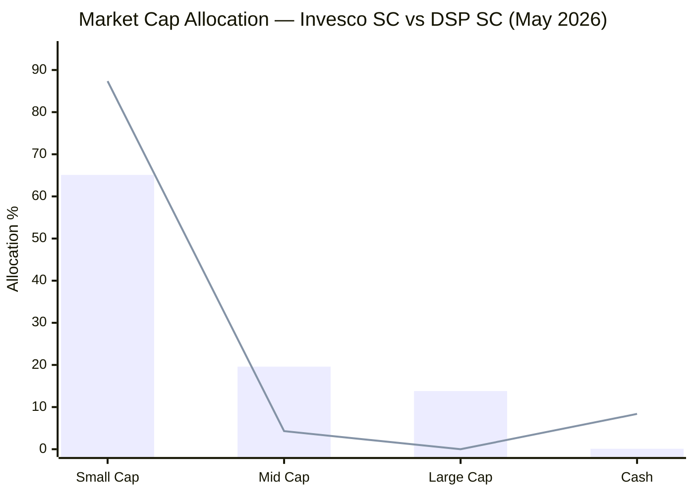
> Bar = Invesco SC | Line = DSP SC | The gap at Small Cap and Large Cap is the critical structural difference

**Understanding the 19.6% mid cap:**

Like DSP's 4.29% mid cap, some of Invesco's mid-cap exposure arises from stocks that were originally purchased as small caps and have since graduated upward — Amber Enterprises, BSE Ltd, Karur Vysya Bank, and KIMS fall into this category. This is a natural consequence of successful stock selection and is not a concern.

**Understanding the 13.8% large cap — the structural issue:**

Unlike DSP's mid-cap exposure (all graduation-driven), Invesco's 13.8% large cap is dominated by stocks that were **never small caps.** They were purchased as large-cap companies, deliberately:

| Stock | Portfolio Wt | Market Cap (approx.) | Was Ever Small Cap? |
|-------|-------------|---------------------|---------------------|
| **Max Healthcare** | **4.12%** | ~₹90,000 Cr | ❌ IPO 2020 as mid/large cap |
| **InterGlobe Aviation (IndiGo)** | **3.88%** | ~₹1.5L+ Cr | ❌ IPO 2015 at large-cap scale |
| **Eternal (Zomato)** | **3.52%** | ~₹2L Cr | ❌ IPO Jul 2021 at ~₹65,000 Cr |
| **Trent Ltd** | **2.27%** | ~₹1.8L Cr | ❌ Always large cap (Tata Group) |
| **Total large cap cluster** | **~13.8%** | — | All deliberate; none graduated |

These four stocks are CIO-level conviction positions — they appear across multiple Invesco schemes. Their presence in the Small Cap fund reflects Taher Badshah's portfolio construction logic as CIO: "my highest-conviction quality businesses should be in all my best-performing vehicles." The SEBI cap framework allows it; the spirit of the small-cap mandate arguably doesn't.

---

## Top 20 Holdings — Stock-by-Stock Analysis

Total portfolio: **67 stocks**. Top 20 account for **~49%** of assets.

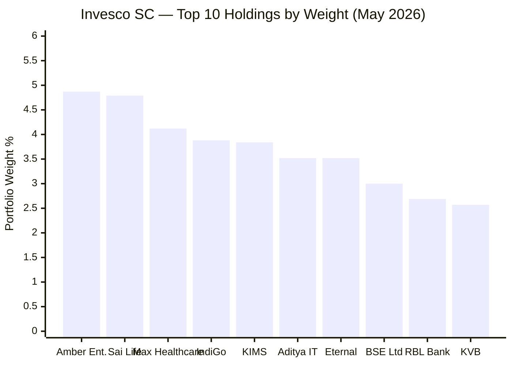

| # | Stock | Wt% | Sector | Mkt Cap Class | Investment Thesis |
|---|-------|-----|--------|--------------|-------------------|
| 1 | **Amber Enterprises** | 4.87% | Industrial | Small/Mid | AC components & ODM manufacturing; India AC penetration at ~8% vs 30% global; China+1 in white goods; largest domestic AC contract manufacturer |
| 2 | **Sai Life Sciences** | 4.79% | Health | Mid (IPO Dec 2024) | CDMO/CRO for global pharma; GLP-1 drug manufacturing tailwind; premium institutional-grade small molecules; IPO allocation play |
| 3 | **Max Healthcare** | 4.12% | Health | **Large Cap** | Premium hospital chain (Delhi, Mumbai, West India); post-COVID healthcare premium; PE-led operational transformation; non-negotiable quality of care moat |
| 4 | **InterGlobe Aviation (IndiGo)** | 3.88% | Consumer Cyclical | **Mega Large Cap** | India's dominant LCC (~60% market share); aviation duopoly; air travel per-capita still 0.1x USA; structural beneficiary of rising middle class |
| 5 | **KIMS** | 3.84% | Health | Mid | South India multi-specialty hospitals; Hyderabad core + Tier-2 expansion; affordable premium segment; strong margins for regional hospital chain |
| 6 | **Aditya Infotech** | 3.52% | Tech | Small | IT products and services distribution; genuine small-cap; electronic security and surveillance systems |
| 7 | **Eternal (Zomato)** | 3.52% | Consumer Cyclical | **Large Cap** | Food delivery duopoly; Blinkit quick-commerce; India's urban consumption platform; winner-takes-most dynamic in both segments |
| 8 | **BSE Ltd** | 3.00% | Financial Services | Mid/Large | India's oldest and second stock exchange; derivatives market share expanding; exchange infrastructure is a regulated monopoly utility |
| 9 | **RBL Bank** | 2.69% | Financial Services | Small/Mid | Private sector bank turnaround; post-2020 management change; undervalued vs private bank peers if asset quality execution holds |
| 10 | **Karur Vysya Bank** | 2.57% | Financial Services | Small/Mid | South India regional bank; conservative lending culture; asset quality improving; deep franchise in Tamil Nadu + Andhra |
| 11 | **Prestige Estates** | 2.47% | Real Estate | Mid/Large | Premium real estate developer (Bengaluru, Mumbai, Delhi); commercial + residential; institutional co-investor model |
| 12 | **Trent Ltd** | 2.27% | Consumer Cyclical | **Large Cap** | Tata Group retail (Zudio mass fashion + Westside); India's structural fast-fashion winner; 30%+ SSSG in Zudio; PE premium well-earned |
| 13 | **Global Health (Medanta)** | 2.22% | Health | Mid | Multi-specialty tertiary hospital chain; Dr. Naresh Trehan brand; Gurugram + Lucknow + Indore + Patna; clinical excellence as the moat |
| 14 | **Corona Remedies** | 2.19% | Health | Small | Gujarat-based branded generics company; niche domestic pharma; genuine small-cap play; high margins in specialty segments |
| 15 | **Federal Bank** | 2.19% | Financial Services | Mid | Kerala-based private bank; NRI remittances corridor; strong asset quality; Gulf NRI franchise is structurally defensible |
| 16 | **Ather Energy** | 2.05% | Consumer Cyclical | Small/Mid (IPO Apr 2025) | EV two-wheeler; Hero MotoCorp-backed; India's premium electric scooter brand; direct EV transition positioning |
| 17 | **L&T Finance** | 1.89% | Financial Services | Mid | NBFC pivoting from wholesale to retail (farm equipment, two-wheelers, microfinance); Larsen & Toubro parent provides governance assurance |
| 18 | **JK Lakshmi Cement** | 1.87% | Basic Materials | Small/Mid | North India cement; regional market leader; JK Group franchise; infrastructure and housing capex beneficiary |
| 19 | **Delhivery** | 1.83% | Industrial | Mid/Large | Tech-driven logistics operator; express parcel + LTL freight; India's e-commerce backbone; operational leverage improving |
| 20 | **Dr. Agarwal's Health Care** | 1.74% | Health | Small/Mid | Eye care hospital chain; pan-India expansion; ophthalmology is recurring, non-discretionary demand; strong unit economics |

---

### Three Patterns in the Top 20

**Pattern 1 — Growth at Premium Valuations:**
Unlike DSP's ROCE≥15% + reasonable valuation filter, Badshah buys growth stories regardless of current valuation. Zomato (300x+ PE), Trent (~90x), IndiGo (~45x), Max Healthcare (~80x) — all are "pay up for quality" choices. The portfolio PE of 43.43 flows directly from this philosophy. There is no value filter evident in the top 20.

**Pattern 2 — IPO Allocation Dependence:**
Two of the top 20 are recent IPOs — Sai Life Sciences (IPO Dec 2024, 4.79%) and Ather Energy (IPO Apr 2025, 2.05%). Large AMCs like Invesco receive preferential IPO allotments from investment banks. These positions capture listing-gain alpha that has nothing to do with small-cap stock-picking skill — it is institutional access privilege. Both businesses are quality, but the investment process for IPO buys is fundamentally different from bottom-up small-cap research.

**Pattern 3 — Services / Healthcare Bias:**
The top 20 are overwhelmingly services-oriented — hospitals, banks, airlines, food delivery, logistics, eye care. Compare to DSP's top 20 which is manufacturing-oriented (auto ancillary components, specialty chemicals, pipes, gensets, dairy). Invesco is positioning for India's services economy to compound; DSP is positioning for India's manufacturing renaissance. Both are legitimate India growth stories; they just access different parts of it.

---

## Sector Allocation — Financial Services as the Defining Bet

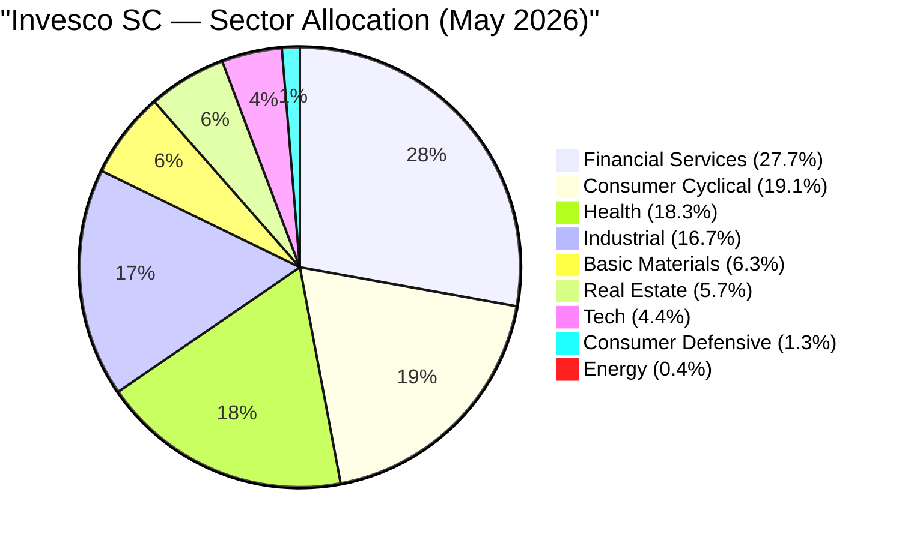

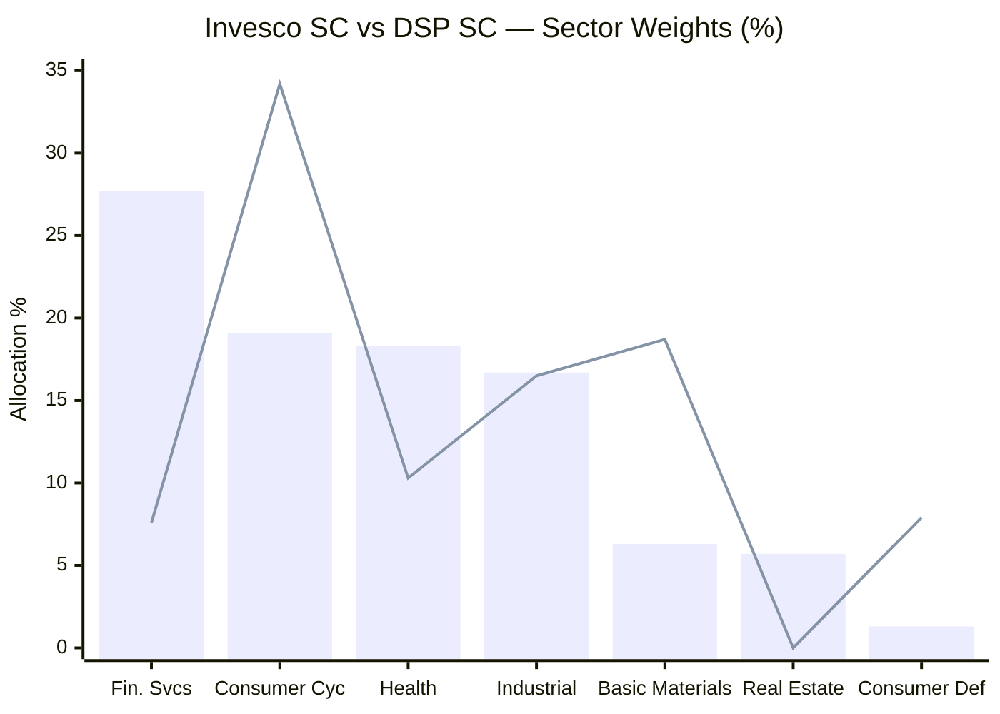
> Bar = Invesco SC | Line = DSP SC | The contrast in Financial Services, Consumer Cyclical, and Basic Materials is the structural difference

| Sector | Invesco SC | DSP SC | Gap | Interpretation |
|--------|-----------|--------|-----|----------------|
| **Financial Services** | **27.7%** | 7.6% | **+20.1pp** | Invesco's defining overweight; DSP explicitly avoids banks |
| Consumer Cyclical | 19.1% | **34.2%** | -15.1pp | DSP's defining overweight; Invesco far less consumer-heavy |
| **Health** | **18.3%** | 10.3% | **+8.0pp** | Invesco's second major bet; 5 hospital/pharma stocks |
| Industrial | 16.7% | 16.5% | +0.2pp | Both in line; similar infrastructure capex exposure |
| Basic Materials | 6.3% | **18.7%** | -12.4pp | DSP's China+1 chemicals thesis; Invesco minimal |
| Real Estate | **5.7%** | ~0% | +5.7pp | Prestige Estates; DSP avoids real estate deliberately |
| Tech | 4.4% | 3.9% | +0.5pp | Similar and modest in both |
| Consumer Defensive | 1.3% | 7.9% | -6.6pp | DSP has dairy + branded staples; Invesco almost none |
| Cash | 0.1% | 8.38% | -8.3pp | Structural deployment gap |

**The two-fund macro philosophy:**

- **DSP = India's Manufacturing & Consumer Formalization Fund:** Consumer Cyclical (34%) + Basic Materials (19%) + Industrial (17%) = 70% in manufacturing, chemicals, and consumer goods. Sambre bets on India building things and consuming them formally.

- **Invesco = India's Financial Deepening + Healthcare Services Fund:** Financial Services (28%) + Health (18%) + Industrial (17%) = 63% in services, healthcare, and capital goods. Badshah bets on India's financial penetration and healthcare premiumization.

Both are legitimate 10-year India growth stories. They access entirely different sectors. A portfolio containing both funds (satellite + core scenario doesn't apply here since both are equity, but a comparison context) would actually provide better diversification than two funds betting on the same India themes.

---

### Financial Services Deep-Dive (27.7%) — The Banking Bet

At 27.7%, Financial Services is Invesco's largest sector — **3.6× DSP's 7.6%** allocation. This is the most dramatic sector difference between the two funds.

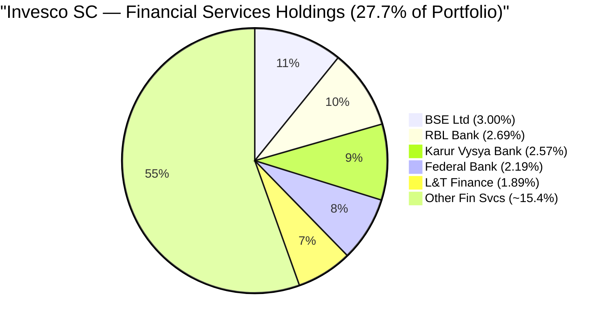

**The Financial Deepening thesis:**

India's bank credit-to-GDP ratio is ~55% vs USA ~200% and China ~180%. As credit, insurance, digital payments, and capital market participation expand across Tier-2 and Tier-3 cities, financial services companies — particularly regional banks and specialty NBFCs — capture the monetization value. Badshah is positioning for this secular deepening.

**Key thesis elements by holding:**
- **BSE Ltd (3.00%):** Stock exchange infrastructure with derivatives market share growing; regulated utility with pricing power; direct beneficiary of India's capital market deepening
- **RBL Bank (2.69%):** Turnaround story — post-2020 management change, asset quality recovering; trading at a steep discount to private bank peers; optionality-driven
- **Karur Vysya Bank (2.57%) + Federal Bank (2.19%):** Deep-franchise regional banks with conservative lending culture; South India anchor + NRI corridor; long-duration compound stories
- **L&T Finance (1.89%):** NBFC pivoting from high-risk wholesale to retail; Larsen & Toubro governance parentage; improving RoA trajectory

**The risk concentration:**

Financial Services at 27.7% exposes the portfolio to:

1. **Interest rate sensitivity:** RBI rate changes directly impact bank NIMs; a 50bp rate compression can reduce banking NII by 8–12%
2. **NPA cycles:** An economic slowdown (construction workers losing jobs, farmers defaulting on KCC loans) creates NPA spikes across the banking system simultaneously — all Invesco's bank positions move together in such events
3. **Regulatory risk:** RBI can change lending norms, capital requirements, priority sector classifications overnight; banks face more regulatory uncertainty than industrial companies
4. **Leverage-inherent binary risk:** Banks' equity is small relative to total assets; a bad credit cycle amplifies losses disproportionately. Sambre explicitly avoids leveraged balance sheet businesses — this is the precise risk he has identified and sidestepped. Badshah takes the opposite view.

---

### Healthcare Deep-Dive (18.3%) — The Hospital & Pharma Cluster

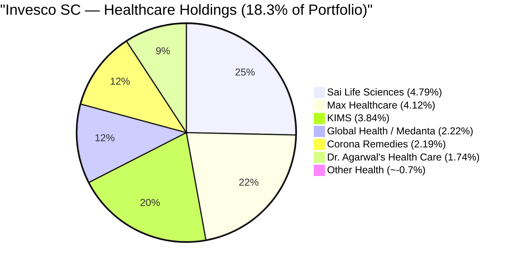

Six healthcare stocks, **~18.9% of the portfolio total.** Three of the six are hospital chains (Max Healthcare, KIMS, Global Health/Medanta), one is a CDMO, one is branded generics, one is an eye-care chain.

**The thesis in three parts:**

**1 — Healthcare Premiumization (Hospital Chains):**
Post-COVID, Indian consumers have demonstrated willingness to pay for quality healthcare. The unorganised local clinic is losing ground to branded hospital chains with standardised protocols, digital records, and multi-specialty capability. Max Healthcare (premium), KIMS (affordable premium), and Medanta (super-specialty) address different price points but all benefit from this formalisation.

**2 — CDMO/CRO Global Outsourcing (Sai Life Sciences):**
Global pharmaceutical companies are shifting drug development and manufacturing to Indian CDMOs. Sai Life Sciences (IPO Dec 2024) is positioned in high-potency small molecules and GLP-1 drug manufacturing — the GLP-1/obesity drug wave (Ozempic, Wegovy) is creating massive CDMO demand. This is a China+1 story in pharma.

**3 — Specialty/Recurring Healthcare (Corona Remedies + Dr. Agarwal's):**
These are pure small-cap plays — corona is niche domestic branded generics; Dr. Agarwal's is ophthalmology, where demand is non-discretionary (you cannot postpone cataract surgery) and recurring (diabetic retinopathy management requires lifetime monitoring).

**The concentration risk in hospital chains:**

Three hospital stocks (Max, KIMS, Medanta) = ~8.4% of the portfolio. Hospitals are operationally leveraged businesses:
- High fixed costs (doctors, equipment, real estate) mean occupancy determines profitability
- A new pandemic, government healthcare price caps (similar to the NPPA drug price regulation but for hospital services), or medical negligence scandal affecting the sector would hit all three simultaneously
- All three have benefited from post-COVID demand normalization; a sentiment reversal would be amplified by the simultaneous exposure

---

### Consumer Cyclical (19.1%) — Aviation, Retail, EV

Unlike DSP's Consumer Cyclical (which is auto ancillary + regional consumer brands), Invesco's is dominated by mega-platforms and EV companies:

| Sub-Sector | Estimated Weight | Key Holdings |
|------------|-----------------|--------------|
| Airlines | ~3.9% | InterGlobe Aviation (IndiGo) |
| E-commerce / QComm | ~3.5% | Eternal (Zomato / Blinkit) |
| Branded Retail | ~2.3% | Trent (Zudio + Westside) |
| EV / Auto | ~2.1% | Ather Energy |
| Other Consumer | ~7.3% | Various smaller positions |

**The EV Signal — Ather Energy vs DSP's IC Engine Bets:**

Ather Energy (2.05%) is a direct contrast with DSP's auto ancillary cluster (Shriram Pistons, Swaraj Engines). Invesco is explicitly positioned for India's EV transition in two-wheelers; DSP is explicitly positioned against it (or for a slow transition). This is a philosophical fork:

- If India's two-wheeler EV adoption reaches 40–50% by 2030 (current penetration ~5%), Invesco wins this leg and DSP loses
- If adoption stays at 15–20% by 2030 (slower-than-expected), DSP's IC engine components generate earnings through the decade and Invesco's Ather position faces competitive pressure

---

### Industrial (16.7%) — In Line with DSP

Invesco's industrial exposure at 16.7% is essentially identical to DSP's 16.5%. The approach differs — DSP focuses on private-sector equipment makers (Kirloskar Oil Engines, Welspun Corp, Voltamp Transformers), while Invesco includes logistics platforms (Delhivery) and manufacturing companies (Amber Enterprises classified partially here). Both are betting on India's infrastructure capex cycle.

---

### Basic Materials (6.3%) — The Biggest Gap from DSP

DSP's 18.7% in Basic Materials (specialty chemicals, pipes, textiles) is one of its defining theses — China+1, India as a global chemicals hub. Invesco's 6.3% in Basic Materials contains primarily JK Lakshmi Cement (1.87%) and a few smaller positions. There is **no meaningful specialty chemicals thesis** in Invesco's portfolio.

This is a significant omission. The China+1 shift in specialty chemicals (Jubilant Ingrevia, Archean Chemical, Atul Ltd in DSP's portfolio) is a 10-year structural theme. Invesco's 6.3% allocation captures perhaps 30% of this opportunity vs DSP's 18.7%. If specialty chemicals continue to compound at 20–25% CAGR over the next decade, this gap will matter for relative returns.

---

## Portfolio Concentration Analysis

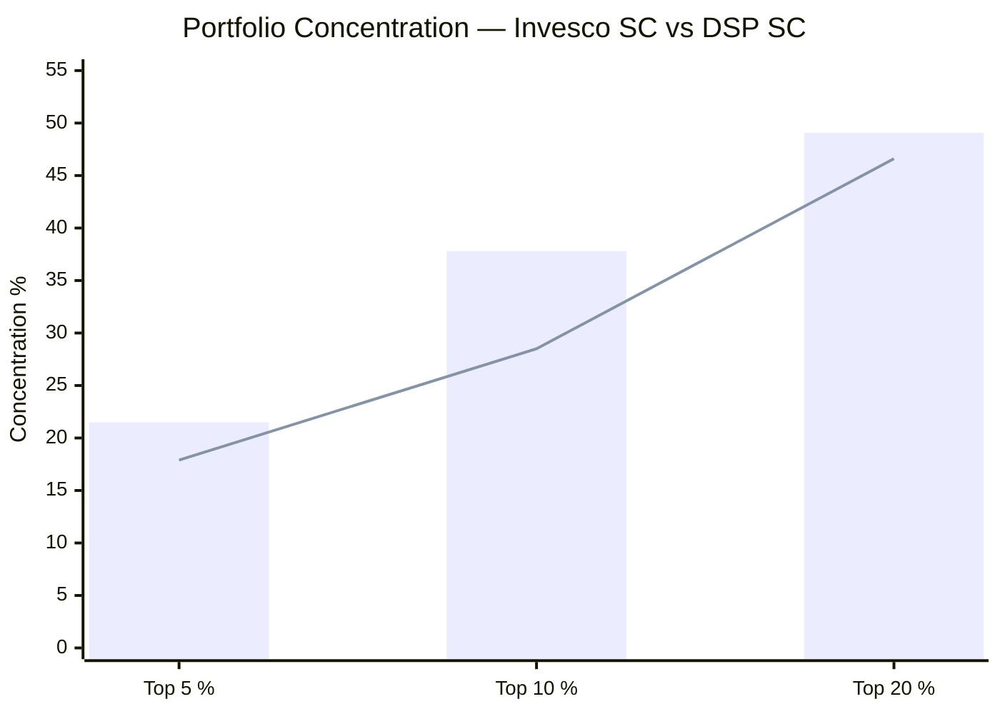
> Bar = Invesco SC | Line = DSP SC | Invesco is more concentrated at top 5 and top 10 levels

| Metric | Invesco SC | DSP SC | Gap | Interpretation |
|--------|-----------|--------|-----|----------------|
| Total Stocks | **67** | 81 | -14 stocks | Invesco somewhat more concentrated |
| Top Holding % | 4.87% | 5.38% | -0.51pp | Comparable single-stock concentration |
| Top 5 % | **21.50%** | 17.9% | **+3.6pp** | Invesco more top-heavy |
| Top 10 % | **37.80%** | 28.5% | **+9.3pp** | Invesco significantly more concentrated |
| Top 20 % | **49.08%** | 46.6% | +2.5pp | Converges at top 20 |

**The top-10 concentration gap (9.3pp) is the critical risk concentration metric.** Invesco's top 10 holdings drive 37.8% of the portfolio's returns and risks. A single-stock blowup in the top 5 — say, an RBL Bank governance event, or a Max Healthcare regulatory action — would immediately cost 3–5% of NAV. With zero cash buffer, there is no portfolio cushion to absorb such events.

DSP's broader distribution at 28.5% in the top 10 across 81 stocks provides better protection against single-stock events — Sambre's approach of spreading conviction deliberately insures against individual company failures at the cost of diluted alpha from smaller positions.

**Is 67 stocks the right number?**

Academic portfolio theory shows diversification benefits plateau at 25–30 stocks. Beyond that, each additional holding provides marginal risk reduction at increasing complexity cost. Invesco's 67 stocks is past the theory optimum but meaningfully more concentrated than DSP's 81. Positions 40–67 at Invesco (roughly 0.3–1.0% each) are too small to move NAV materially — a 3× return on a 0.4% position adds only 0.8% to NAV. The long tail absorbs research bandwidth without contributing proportional alpha.

---

## Portfolio Turnover and Investment Philosophy

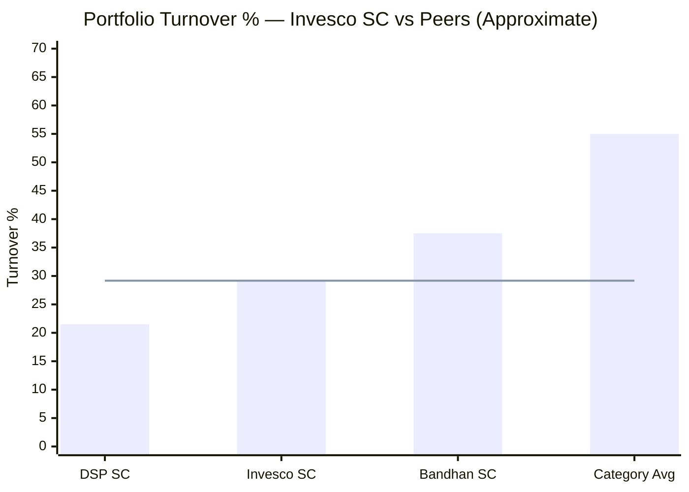
> Line = Invesco's 29.17% | DSP is lowest; category average ~55%

**Turnover: 29.17% → Implied average holding period: ~3.4 years**

Invesco's turnover is 35–50% higher than DSP's but roughly half the category average. Badshah holds stocks for a meaningful period — the 3.4-year average is long enough for business fundamentals to play out, but shorter than Sambre's 4.2–5.3-year horizon.

**What drives the higher turnover vs DSP?**

1. **IPO participation:** Adding new IPO positions (Sai Life Sciences Dec 2024, Ather Energy Apr 2025) and sizing them as top-20 holdings requires trimming or exiting existing positions. Each IPO adds 2–5% of the portfolio while maintaining the 67-stock total, implying active exits
2. **Large-cap rotation logic:** The large-cap positions (IndiGo, Zomato, Trent, Max Healthcare) are managed more tactically than pure small-cap buy-and-hold positions would be — they're widely tracked, news-sensitive, and subject to valuation calls
3. **CIO-level rebalancing:** With ₹40,367 Cr across 7 schemes, Badshah rebalances positions cross-fund, which generates turnover in any single scheme without necessarily being a tactical call on that fund specifically

**Taher Badshah's investment philosophy (implied from portfolio):**

Unlike Sambre's explicit 3-filter public framework (Quality of Business → Quality of Management → Reasonable Valuation), Badshah's philosophy is less formally articulated for the Small Cap fund specifically. However, from portfolio evidence:

- **Quality-first, price-permissive:** He buys quality businesses without strict PE discipline (portfolio PE 43.43 vs Sambre's 29.54 below-category)
- **Market-cap agnostic:** The 13.8% large-cap tells you he will buy the best business regardless of size
- **Growth-oriented:** Healthcare and financial services at scale suggest secular growth bet over value-cycle bet
- **IPO-forward:** Institutional access to quality IPOs is part of the return-generation strategy, not just opportunistic

---

## AUM Scalability — A Genuine Structural Advantage

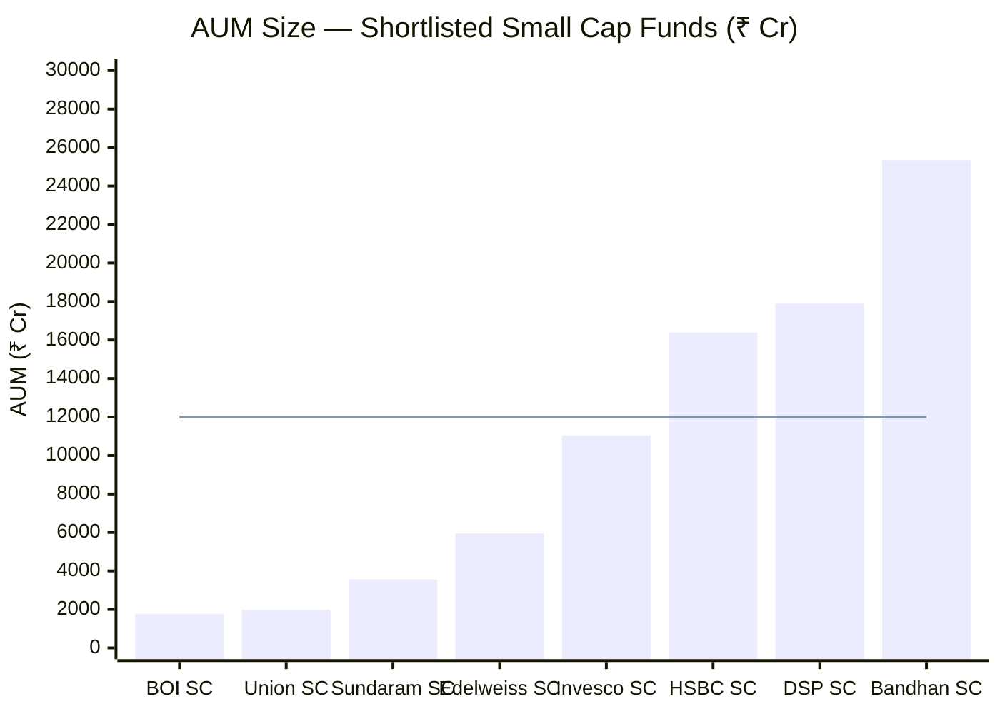
> Line = approximate ₹12,000 Cr threshold above which SC alpha generation becomes structurally constrained (from screening framework)

**Invesco at ₹11,038 Cr sits right at the ideal size band.** Not too small to lack institutional infrastructure; not so large that deployment friction prevents genuine small-cap access.

| Scenario | Invesco (₹11,038 Cr) | DSP (₹17,906 Cr) |
|----------|---------------------|-----------------|
| 1% position requires | ₹110 Cr | ₹179 Cr |
| 1% position = % of SC company | 1.1–4.4% of a ₹2,500–10,000 Cr co. | 1.8–7.2% of same co. |
| Stress test (25% liquidation, est.) | **~10–15 days** | ~21–25 days |
| Deployment constraint | **None** | Significant |
| Access to micro-caps (₹500–2,000 Cr) | **Yes** | Difficult |
| New SIP flows absorbed | Easily | Challenging |

**However — Invesco squanders this advantage partially:**

The 13.8% large-cap allocation is held in stocks (IndiGo, Zomato, Trent, Max Healthcare) where liquidity is unlimited — any fund of any size can enter and exit these positions without market impact. By using its AUM advantage on large-cap stocks rather than genuinely illiquid small-caps, Invesco is not extracting the full value of its size.

A fund that is ₹11,000 Cr and allocates 100% to small/micro caps would have substantial edge. A fund that is ₹11,000 Cr but puts 34% in mid/large caps has the same edge as any large AMC — size is no longer the differentiator for that 34%.

**AUM growth capacity:** Invesco can likely absorb another ₹5,000–7,000 Cr before AUM-scale problems emerge — i.e., growth to ₹16,000–18,000 Cr is manageable. Beyond that, the fund would approach DSP's constraints. At current SIP growth rates, this is a 2–3 year horizon.

---

## Portfolio PE — Growth Philosophy Made Visible

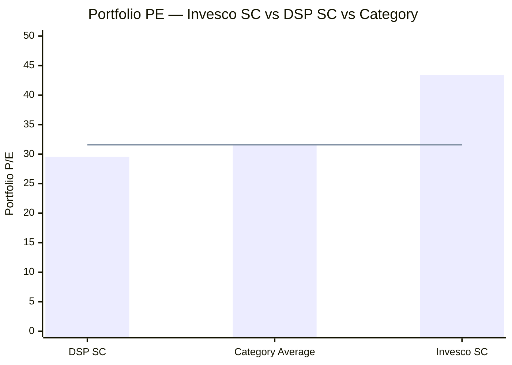
> Line = Small Cap category average PE (31.60) | Invesco trades at 37% premium to category

| Metric | Value |
|--------|-------|
| Invesco Portfolio PE | **43.43** |
| Category Average PE | **31.60** |
| Invesco Premium to Category | **+37.4%** |
| Nifty Small Cap 250 Index PE | ~35–40 |
| DSP Portfolio PE | 29.54 (6.5% below category) |

**The PE decomposition — where does 43.43 come from?**

The large-cap holdings disproportionately inflate the portfolio PE:
- **Eternal (Zomato):** Trading at 300x+ PE (loss-making / early-stage profitable)
- **Trent:** ~90x PE (Zudio expansion pricing in high growth)
- **Max Healthcare:** ~80x PE (premium hospital with strong growth trajectory)
- **InterGlobe Aviation:** ~45x PE (aviation recovery cycle pricing)

These four holdings (13.8% of portfolio) contribute an outsized share of the PE numerator. If the large-cap positions were removed, the remaining small/mid-cap portfolio's PE would likely be closer to 35–38 — still above DSP but less extreme.

**The growth-at-premium philosophy:**

Badshah is not running a valuation-disciplined fund. He is running a quality-growth fund that buys businesses he believes will compound 20–25% CAGR in earnings, even at today's high multiples. The implicit bet: in 3–5 years, these companies' earnings will have grown enough that today's PE looks reasonable in hindsight.

This approach works spectacularly in sustained bull markets (2019–2021, 2023 rallies). It fails catastrophically in PE-compression events (2022 global rate shock, or any future Indian macro slowdown). The absence of a value filter means there is no safety net if growth expectations disappoint.

**The valuation paradox:** Invesco's Sharpe of ~1.0 is competitive (Module 2), but it's been measured through a period of mostly bull-market conditions from an inception trough. If a genuine PE-compression bear market occurs — where multiple contraction, not earnings decline, drives the drawdown — a portfolio at PE 43 faces structurally larger drawdowns than a portfolio at PE 30. The next true bear market will test whether Badshah's quality stocks maintain their PE premium or revert toward historical norms.

---

## The Taher Badshah Factor — CIO Running a Small-Cap Fund

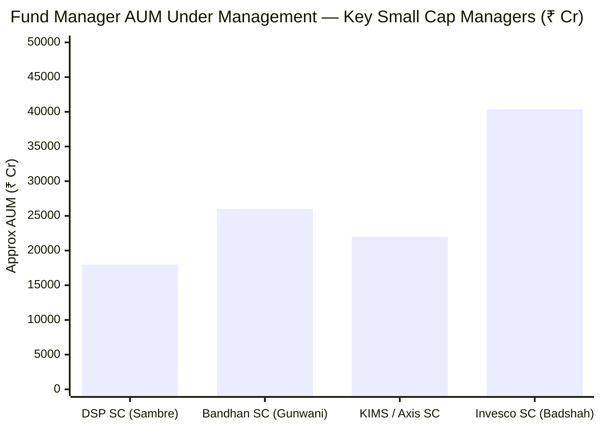
> Badshah manages ₹40,367 Cr across 7 schemes — the largest AUM among SC fund managers in our shortlist

**The core concern:** Taher Badshah is not primarily a small-cap fund manager. He is the **CIO of Invesco Asset Management India**, managing 7 schemes totaling ₹40,367 Cr. The Small Cap Fund is one responsibility among many — and not necessarily the most important one.

**Implications:**

1. **Research bandwidth:** A CIO overseeing ₹40,000+ Cr cannot give the same stock-level attention to 67 small-cap companies as a dedicated manager. Sambre manages 2–3 schemes; Badshah manages 7. The daily stock selection decisions for Invesco SC are likely delegated to the research team and co-manager Khemani

2. **Cross-fund portfolio logic:** The presence of IndiGo, Zomato, Trent — all of which appear in multiple Invesco schemes — suggests the Small Cap Fund is receiving a CIO's "best ideas" that span all his schemes, rather than picks developed specifically for small-cap mandate fit

3. **Aditya Khemani's growing role:** Khemani joined as co-manager in November 2023. For the 5 years before that, Badshah managed the fund solo (alongside CIO responsibilities). Khemani likely handles the day-to-day small-cap research — the actual small-cap expertise may be more Khemani-driven than Badshah's CIO brand implies

4. **Institutional stability vs key-person risk:** Unlike DSP (where Sambre IS the fund), Invesco SC's performance is attributable to a system — Badshah's investment framework + Khemani's implementation. This is more institutionally resilient against a single person's departure, but also harder to evaluate because the attribution is split

---

## The IPO Buying Pattern — Institutional Access as Alpha Source

Invesco's top 20 contains at least two direct IPO allocations:

| Stock | IPO Date | IPO Price | Weight | Listing Gain (est.) |
|-------|----------|-----------|--------|---------------------|
| Sai Life Sciences | Dec 2024 | ₹549 | 4.79% | ~20–30%+ post-IPO rally |
| Ather Energy | Apr 2025 | ₹321 | 2.05% | Modest post-IPO performance |

**Why this matters:**
Large AMCs like Invesco receive institutional QIB allotments in IPOs — often 10–20% of the book. This gives them access to shares at the offer price, which typically lists 15–40% higher on Day 1. This "free alpha" is a privilege of institutional scale, not small-cap research skill.

**The concern:** At 4.79%, Sai Life Sciences is the 2nd-largest holding. If IPO euphoria fades and the stock re-rates toward fundamental value (common 6–12 months post-IPO as lock-in periods expire and initial investors exit), this is a material NAV drag. IPO stocks carry inherent post-listing volatility that is separate from the fund's otherwise quality-oriented portfolio management.

**The credit:** Both Sai Life and Ather are quality businesses in structural growth sectors. The IPO selection judgment appears sound. The process concern is not about these specific picks but about the philosophical question: should a small-cap satellite SIP's returns be generated through institutional IPO access privilege, or through patient bottom-up small-cap stock-picking?

---

## Comparison with All Studied Funds

| Dimension | Invesco SC | DSP SC | PP FlexiCap | BOI FlexiCap |
|-----------|-----------|--------|-------------|-------------|
| **SC Purity** | **65.1%** (floor) | **87.35%** (pure) | N/A (FlexiCap) | N/A (FlexiCap) |
| Large Cap % | **13.8%** | ~0% | ~55% | ~50–60% |
| Core Sector Bet | Fin. Services (28%) | Consumer Cyclical (34%) | Intl Tech + Value | PSU + Defence |
| Portfolio PE | **43.43** (highest) | 29.54 | ~22 | ~16–23 |
| Total Stocks | 67 | 81 | ~25–30 | ~55 |
| Top 10 Concentration | **37.80%** | 28.5% | ~52% | ~40% |
| Turnover | 29.17% | 19–24% | ~15–20% | ~72–83% |
| Cash | 0.1% | 8.38% | ~8% | ~3% |
| AUM | ₹11,038 Cr | ₹17,906 Cr | ₹78,000+ Cr | ₹2,387 Cr |
| AUM Constraint | Low | High | Very Low | Very Low |
| Manager Focus | CIO (7 schemes / ₹40K Cr) | Dedicated (14Y / 2–3 schemes) | Founding manager | Multi-scheme |
| IPO Dependence | **High** (Sai Life + Ather in top 20) | Low | None | None |
| Valuation Discipline | Growth-at-premium | Quality-at-value | Value + Income | Momentum-PSU |
| EV Exposure | ✅ Ather Energy | ❌ IC engine holdings | N/A | N/A |
| Chemicals Exposure | ❌ Minimal (6.3%) | ✅ China+1 thesis (18.7%) | N/A | N/A |

**Invesco's distinctive positioning across all studied funds:**
- **Most multi-cap of the small-cap funds** — only fund in the shortlist running at the SEBI SC floor
- **Highest portfolio PE** — most growth-oriented; least valuation-disciplined
- **Only fund with direct EV positioning** (Ather Energy)
- **Largest financial services overweight** vs all studied funds (27.7% vs DSP's 7.6%)
- **Zero cash buffer** — the only fully-deployed fund in the shortlist
- **IPO access as explicit alpha source** — unique among 8 funds

---

## Points In Favour (Portfolio Angle)

1. **AUM sweet spot (₹11,038 Cr):** Optimal for genuine small-cap access without deployment friction; 38% smaller than DSP; faster stress-test liquidation; can grow ₹5,000–7,000 Cr more before hitting constraints
2. **Full deployment (99.9%):** Zero cash drag in bull markets; every rupee compounding in equity
3. **Healthcare cluster (18.3%) is a structural growth theme:** Hospital premiumization, CDMO outsourcing, and eye-care are 10-year secular trends with recurring demand characteristics
4. **EV positioning (Ather Energy):** Only SC fund in shortlist with direct EV exposure; hedges against the EV transition risk that DSP carries through IC engine components
5. **Financial deepening thesis:** India's bank credit/GDP at 55% has enormous structural growth room; regional banks and specialty NBFCs at reasonable PEs provide earnings visibility
6. **Fewer stocks (67 vs 81):** Modestly more concentrated conviction; less long-tail dilution than DSP; each position contributes more meaningfully
7. **IPO institutional access:** Quality IPO allocations are genuine alpha; Sai Life Sciences and Ather are quality businesses in structural growth sectors
8. **No PSU/government exposure:** Like DSP, zero dependency on policy-driven PSU stocks; private enterprise focus throughout

---

## Points Against (Portfolio Angle)

1. **Small cap purity only 65.1% — at SEBI minimum:** One-third of portfolio is mid/large cap; investors expecting pure SC satellite exposure receive a diluted, multi-cap product
2. **13.8% in stocks never classified as small caps:** IndiGo, Zomato, Trent, Max Healthcare are deliberate large-cap bets; philosophical misalignment with mandate
3. **Portfolio PE 43.43 — highest of 8:** No valuation discipline; growth-at-any-price philosophy; forward fragility if PE compresses (35→30 implies 14% drawdown from PE alone)
4. **Zero cash buffer (0.1%):** No opportunistic war chest in corrections; no AUM-management tool; fully exposed at PE 43.43 near ATH levels
5. **CIO managing 7 schemes / ₹40,367 Cr:** Small Cap fund is not the primary focus; cross-fund allocation logic may drive SC fund decisions rather than SC-specific research
6. **Top 10 at 37.80% — most concentrated of studied SC funds:** Single-stock blowup in top 5 costs 3–5% NAV; no cash buffer to absorb; amplified downside from any conviction failure
7. **IPO dependency for alpha:** ~7% in recent IPOs (Sai Life, Ather) — listing-gain alpha is institutional privilege, not repeatable bottom-up skill; post-IPO re-rating risk is real
8. **Zero specialty chemicals / Basic Materials thesis:** Only 6.3% vs DSP's 18.7%; missing the China+1 structural opportunity; no CDMO-style chemicals alpha (ironic given Sai Life is in CDMO)
9. **Hospital-chain sub-sector concentration (8.4% in Max, KIMS, Medanta):** All three move together in healthcare sentiment shifts; government hospital pricing regulation could hit all three simultaneously

---

## Module 3 Scorecard

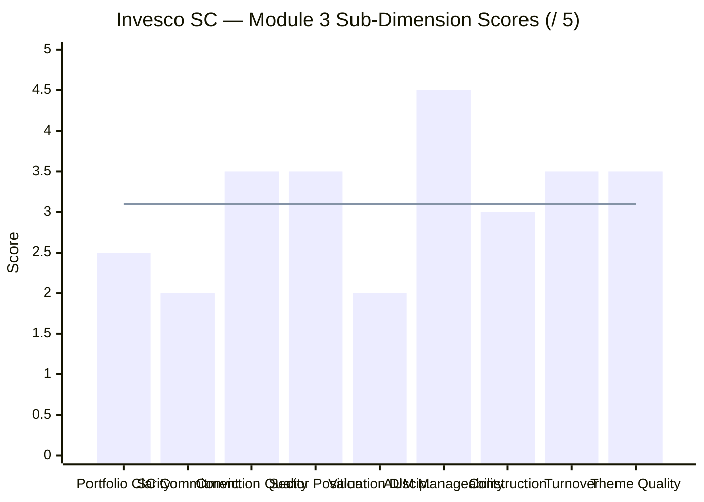
> Line = Module 3 overall score (3.1/5)

| Sub-Dimension | Score | Reasoning |
|---------------|-------|-----------|
| Portfolio Clarity / Identity | **2.5/5** | Labelled "Small Cap" but runs at 65% SC purity; mixed identity creates investor expectation mismatch |
| Small Cap Commitment | **2.0/5** | Barely at SEBI minimum; 13.8% in stocks never classified SC; mandate misalignment is structural |
| Manager Conviction Quality | **3.5/5** | High conviction in top 10 (37.8%); genuine sector bets; CIO's 7-scheme span dilutes focus vs dedicated manager |
| Sector Positioning | **3.5/5** | Financials + Healthcare are compelling 10Y macro themes; zero chemicals exposure is a gap |
| Valuation Discipline | **2.0/5** | PE 43.43 — highest of 8; no ROCE or PE filter evident; growth-at-any-price philosophy |
| AUM Manageability | **4.5/5** | ₹11,038 Cr in sweet spot; 10–15 day stress test; room to grow; fastest liquidation of studied SC funds |
| Portfolio Construction | **3.0/5** | 67 stocks reasonable; 37.80% top-10 is borderline high; zero cash is structurally risky at PE 43 |
| Turnover & Cost Efficiency | **3.5/5** | 29.17% above DSP but below category; 3.4Y holding period respectable; IPO-driven turnover inflates slightly |
| Theme Quality | **3.5/5** | Healthcare + financial deepening are real 10Y stories; EV positioning is forward-looking; IPO reliance is a question mark |
| **Module 3 Overall** | **3.1 / 5** | Portfolio DNA is competent on AUM management and theme selection; structurally undermined by SC mandate misalignment, absent valuation discipline, and zero cash buffer |

---

## Comparative Module 3 Scores

| Fund | Module 3 Score | Portfolio Identity |
|------|---------------|-------------------|
| DSP Small Cap | 3.8/5 | Pure India SC; lowest turnover; 14Y tenure; AUM ceiling the key constraint |
| **Invesco India SC** | **3.1/5** | **Multi-cap in SC wrapper; Healthcare+Financial deepening bet; AUM optimal; PE discipline absent** |

Invesco's Module 3 score of 3.1/5 reflects two exceptional areas (AUM manageability, sector themes) weighed down by three significant structural concerns (SC commitment, valuation discipline, cash buffer). It scores 0.7 below DSP's 3.8 — a meaningful gap driven primarily by the mandate misalignment (65% vs 87% SC purity) and the absence of any valuation filter.

---

## SIP Implication

For a ₹20,000/month satellite SIP with a 10+ year horizon:

**What you are actually buying:** A diversified multi-cap growth fund with ~65% small-cap, ~20% mid-cap, and ~14% large-cap exposure. Healthcare and financial services are the defining themes. Quality growth at premium multiples is the philosophy. This is not a pure small-cap satellite vehicle — it is a quality-growth vehicle that happens to carry the "small cap" label.

**The satellite mandate question:** If the purpose of the satellite SIP is "maximum long-run CAGR through pure small-cap beta," Invesco's 65% purity dilutes this objective by roughly one-third. ₹20,000/month into Invesco delivers only ~₹13,000 into genuine small caps. DSP delivers ~₹17,500. For a satellite specifically designed to capture the small-cap risk premium, this matters.

**Where Invesco's portfolio DNA helps:**
- The 14% large-cap buffer reduces Max Drawdown in SC crashes (those stocks fall less)
- Healthcare at 18% is a sector with both defensive (recurring demand) and growth (premiumization) characteristics
- AUM size keeps execution clean — no cash drag from deployment friction

**Where Invesco's portfolio DNA hurts:**
- Zero cash means no opportunistic buying when corrections occur
- PE 43.43 means the fund enters corrections from an elevated valuation base — the higher you start, the farther you can fall
- Financial services at 28% is the highest-risk sector allocation in a correction scenario (banks amplify economic downturns)

**What to monitor:**
1. **SC purity trending below 65%:** Would be a SEBI regulatory violation; any factsheet showing sub-65% small cap requires immediate escalation
2. **Aditya Khemani's continued tenure:** If Khemani (the likely day-to-day small-cap researcher) departs while Badshah remains as CIO, the actual small-cap stock selection capability may be hollowed out
3. **Portfolio PE trajectory:** If PE rises above 50 with the SC rally, the forward fragility intensifies further; a reversion toward category average (31.6) would imply ~27% decline from PE compression alone
4. **Large-cap allocation growth:** If large-cap creeps from 13.8% toward 18–20%, Invesco is no longer functionally a small-cap fund; at that point switching to a dedicated FlexiCap fund would make more sense

---

*Module 3 complete. Portfolio DNA is multi-cap growth in a small-cap wrapper. Healthcare and financial deepening are the defining bets; AUM management is the genuine strength. The 65% SC purity, PE of 43.43, and zero cash buffer are the honest structural constraints. Module 3 score: 3.1/5.*

*Next: [Module 4 — Cost & AUM Impact](module4_cost.md)*
